# tekes-worker::main

[Package atlas](index.md) · [Source](../../src/main.rs)

## Declarations

Visibility is the declaration spelling; trait members and reexports require their enclosing interface. `cfg` is not evaluated.

| Symbol | Kind | Visibility | Test / cfg |
|---|---|---|---|
| [tekes-worker::main::Options](../../src/main.rs#L71) | struct_item | `private` |  |
| [tekes-worker::main::Options::event_timestamp](../../src/main.rs#L91) | function_item | `private` |  |
| [tekes-worker::main::RuntimeProfile](../../src/main.rs#L108) | struct_item | `private` |  |
| [tekes-worker::main::main](../../src/main.rs#L148) | function_item | `private` |  |
| [tekes-worker::main::is_protocol_failure](../../src/main.rs#L162) | function_item | `private` |  |
| [tekes-worker::main::run](../../src/main.rs#L181) | function_item | `private` |  |
| [tekes-worker::main::exchange_tool_control](../../src/main.rs#L402) | function_item | `pub` |  |
| [tekes-worker::main::parse_options](../../src/main.rs#L436) | function_item | `private` |  |
| [tekes-worker::main::parse_fd](../../src/main.rs#L500) | function_item | `private` |  |
| [tekes-worker::main::read_inherited_fd](../../src/main.rs#L509) | function_item | `private` |  |
| [tekes-worker::main::load_profiles](../../src/main.rs#L521) | function_item | `private` |  |
| [tekes-worker::main::activate_subagent_profile](../../src/main.rs#L572) | function_item | `private` |  |
| [tekes-worker::main::sibling_helper_path](../../src/main.rs#L639) | function_item | `private` |  |
| [tekes-worker::main::effective_allowed_tools](../../src/main.rs#L657) | function_item | `private` |  |

## Imports / reexports

| Local name | Source path | Visibility |
|---|---|---|
| `compaction_anchor_sequences` | `engine::compaction_anchor_sequences` | `private` |
| `RefCell` | `std::cell::RefCell` | `private` |
| `BTreeSet` | `std::collections::BTreeSet` | `private` |
| `VecDeque` | `std::collections::VecDeque` | `private` |
| `env` | `std::env` | `private` |
| `fs` | `std::fs` | `private` |
| `File` | `std::fs::File` | `private` |
| `OpenOptions` | `std::fs::OpenOptions` | `private` |
| `io` | `std::io` | `private` |
| `BufRead` | `std::io::BufRead` | `private` |
| `Read` | `std::io::Read` | `private` |
| `Write` | `std::io::Write` | `private` |
| `IpAddr` | `std::net::IpAddr` | `private` |
| `FromRawFd` | `std::os::fd::FromRawFd` | `private` |
| `OpenOptionsExt` | `std::os::unix::fs::OpenOptionsExt` | `private` |
| `PathBuf` | `std::path::PathBuf` | `private` |
| `ExitCode` | `std::process::ExitCode` | `private` |
| `Rc` | `std::rc::Rc` | `private` |
| `FromStr` | `std::str::FromStr` | `private` |
| `Arc` | `std::sync::Arc` | `private` |
| `Mutex` | `std::sync::Mutex` | `private` |
| `AtomicBool` | `std::sync::atomic::AtomicBool` | `private` |
| `AtomicU8` | `std::sync::atomic::AtomicU8` | `private` |
| `Ordering` | `std::sync::atomic::Ordering` | `private` |
| `Receiver` | `std::sync::mpsc::Receiver` | `private` |
| `SyncSender` | `std::sync::mpsc::SyncSender` | `private` |
| `sync_channel` | `std::sync::mpsc::sync_channel` | `private` |
| `Duration` | `std::time::Duration` | `private` |
| `Instant` | `std::time::Instant` | `private` |
| `_` | `base64::Engine` | `private` |
| `AdapterCapabilities` | `engine::AdapterCapabilities` | `private` |
| `CatalogEntry` | `engine::CatalogEntry` | `private` |
| `Continuation` | `engine::Continuation` | `private` |
| `DurableArtifactVersions` | `engine::DurableArtifactVersions` | `private` |
| `DynamicBackend` | `engine::DynamicBackend` | `private` |
| `DynamicSupervisorBackend` | `engine::DynamicSupervisorBackend` | `private` |
| `DynamicToolDispatcher` | `engine::DynamicToolDispatcher` | `private` |
| `LockFacts` | `engine::LockFacts` | `private` |
| `PermissionModePolicy` | `engine::PermissionModePolicy` | `private` |
| `QueryCapability` | `engine::QueryCapability` | `private` |
| `QueryResult` | `engine::QueryResult` | `private` |
| `RecoveryDecision` | `engine::RecoveryDecision` | `private` |
| `RunDecision` | `engine::RunDecision` | `private` |
| `RunMode` | `engine::RunMode` | `private` |
| `SupervisorControlBackend` | `engine::SupervisorControlBackend` | `private` |
| `SystemToolBackend` | `engine::SystemToolBackend` | `private` |
| `SystemToolConfig` | `engine::SystemToolConfig` | `private` |
| `TailState` | `engine::TailState` | `private` |
| `ToolBackend` | `engine::ToolBackend` | `private` |
| `ToolBackendRouter` | `engine::ToolBackendRouter` | `private` |
| `ToolDispatcher` | `engine::ToolDispatcher` | `private` |
| `ToolInvocation` | `engine::ToolInvocation` | `private` |
| `WorkflowBackend` | `engine::WorkflowBackend` | `private` |
| `classify` | `engine::classify` | `private` |
| `decide_recovery` | `engine::decide_recovery` | `private` |
| `run_decision` | `engine::run_decision` | `private` |
| `sent_state` | `engine::sent_state` | `private` |
| `ConfigSnapshot` | `profile::ConfigSnapshot` | `private` |
| `DynamicTool` | `profile::DynamicTool` | `private` |
| `DynamicToolEffect` | `profile::DynamicToolEffect` | `private` |
| `InstructionKind` | `profile::InstructionKind` | `private` |
| `InstructionSnapshot` | `profile::InstructionSnapshot` | `private` |
| `LaunchBindings` | `profile::LaunchBindings` | `private` |
| `Model` | `profile::Model` | `private` |
| `Provider` | `profile::Provider` | `private` |
| `ResourceCatalog` | `profile::ResourceCatalog` | `private` |
| `WebSearch` | `profile::WebSearch` | `private` |
| `ContentBlock` | `provider::ContentBlock` | `private` |
| `CredentialClient` | `provider::CredentialClient` | `private` |
| `CredentialGet` | `provider::CredentialGet` | `private` |
| `DialectId` | `provider::DialectId` | `private` |
| `FinishReason` | `provider::FinishReason` | `private` |
| `HttpRuntime` | `provider::HttpRuntime` | `private` |
| `PrepareInput` | `provider::PrepareInput` | `private` |
| `ProviderCompletion` | `provider::ProviderCompletion` | `private` |
| `ProviderFailure` | `provider::ProviderFailure` | `private` |
| `ProviderFrame` | `provider::ProviderFrame` | `private` |
| `ProviderTerminal` | `provider::ProviderTerminal` | `private` |
| `credential_request_id` | `provider::credential_request_id` | `private` |
| `endpoint_origin` | `provider::endpoint_origin` | `private` |
| `prepare` | `provider::prepare` | `private` |
| `Event` | `schema::Event` | `private` |
| `EventKind` | `schema::EventKind` | `private` |
| `IJsonValue` | `schema::IJsonValue` | `private` |
| `ResumePolicy` | `schema::ResumePolicy` | `private` |
| `Visibility` | `schema::Visibility` | `private` |
| `Map` | `serde_json::Map` | `private` |
| `Value` | `serde_json::Value` | `private` |
| `json` | `serde_json::json` | `private` |
| `Digest` | `sha2::Digest` | `private` |
| `Sha256` | `sha2::Sha256` | `private` |
| `AssetStore` | `store::AssetStore` | `private` |
| `BarrierContext` | `store::BarrierContext` | `private` |
| `DirectoryLock` | `store::DirectoryLock` | `private` |
| `LockedLedger` | `store::LockedLedger` | `private` |
| `StoreError` | `store::StoreError` | `private` |
| `scan_valid_prefix` | `store::scan_valid_prefix` | `private` |
| `Backend` | `tools::Backend` | `private` |
| `BackendFailure` | `tools::BackendFailure` | `private` |
| `BackendTerminal` | `tools::BackendTerminal` | `private` |
| `BoundedHttpClient` | `tools::BoundedHttpClient` | `private` |
| `BuiltinManifest` | `tools::BuiltinManifest` | `private` |
| `CancellationToken` | `tools::CancellationToken` | `private` |
| `CatalogContext` | `tools::CatalogContext` | `private` |
| `CatalogRole` | `tools::CatalogRole` | `private` |
| `DurableApprovalResponse` | `tools::DurableApprovalResponse` | `private` |
| `HelperClient` | `tools::HelperClient` | `private` |
| `HelperInvoker` | `tools::HelperInvoker` | `private` |
| `HookBinding` | `tools::HookBinding` | `private` |
| `HttpLimits` | `tools::HttpLimits` | `private` |
| `NetworkPolicy` | `tools::NetworkPolicy` | `private` |
| `PipelineDecision` | `tools::PipelineDecision` | `private` |
| `ProbeStatus` | `tools::ProbeStatus` | `private` |
| `PublicRoute` | `tools::PublicRoute` | `private` |
| `SandboxBackend` | `tools::SandboxBackend` | `private` |
| `SandboxPolicy` | `tools::SandboxPolicy` | `private` |
| `SearchHit` | `tools::SearchHit` | `private` |
| `SearchProvider` | `tools::SearchProvider` | `private` |
| `SearchRequest` | `tools::SearchRequest` | `private` |
| `SearchTopic` | `tools::SearchTopic` | `private` |
| `SecretScan` | `tools::SecretScan` | `private` |
| `SecretScanner` | `tools::SecretScanner` | `private` |
| `ToolExecution` | `tools::ToolExecution` | `private` |
| `ToolPipeline` | `tools::ToolPipeline` | `private` |
| `decode_hook_binding` | `tools::decode_hook_binding` | `private` |
| `is_public_internet_address` | `tools::is_public_internet_address` | `private` |
| `probe_backend` | `tools::probe_backend` | `private` |
| `route_public_url` | `tools::route_public_url` | `private` |
| `ContinuationOperation` | `worker_control::continuation::ContinuationOperation` | `private` |
| `ToolContinuationOutcome` | `worker_control::continuation::ToolContinuationOutcome` | `private` |
| `ToolContinuationRequest` | `worker_control::continuation::ToolContinuationRequest` | `private` |
| `ToolContinuationResponse` | `worker_control::continuation::ToolContinuationResponse` | `private` |
| `decode_tool_continuation_result` | `worker_control::continuation::decode_tool_continuation_result` | `private` |
| `encode_tool_continuation` | `worker_control::continuation::encode_tool_continuation` | `private` |
| `Appended` | `worker_control::Appended` | `private` |
| `AttemptSettled` | `worker_control::AttemptSettled` | `private` |
| `EX_PROTOCOL` | `worker_control::EX_PROTOCOL` | `private` |
| `Frame` | `worker_control::Frame` | `private` |
| `FrameChannel` | `worker_control::FrameChannel` | `private` |
| `LaunchChild` | `worker_control::LaunchChild` | `private` |
| `LaunchResult` | `worker_control::LaunchResult` | `private` |
| `LeaseRequest` | `worker_control::LeaseRequest` | `private` |
| `Receipt` | `worker_control::Receipt` | `private` |
| `Selected` | `worker_control::Selected` | `private` |
| `SupervisorMessage` | `worker_control::SupervisorMessage` | `private` |
| `decode_reject` | `worker_control::decode_reject` | `private` |
| `decode_supervisor` | `worker_control::decode_supervisor` | `private` |
| `encode_line` | `worker_control::encode_line` | `private` |
| `Hello` | `worker_control::Hello` | `private` |
| `QueueTransaction` | `worker_control::QueueTransaction` | `private` |
| `QueueTransactionAction` | `worker_control::QueueTransactionAction` | `private` |
| `QueueTransactionOutcome` | `worker_control::QueueTransactionOutcome` | `private` |
| `QueueTransactionRejectCode` | `worker_control::QueueTransactionRejectCode` | `private` |
| `QueueTransactionResult` | `worker_control::QueueTransactionResult` | `private` |
| `ToolControl` | `worker_control::ToolControl` | `private` |
| `ToolControlErrorCode` | `worker_control::ToolControlErrorCode` | `private` |
| `ToolControlResult` | `worker_control::ToolControlResult` | `private` |
| `WorkerStartup` | `worker_control::WorkerStartup` | `private` |
| `decode_queue_transaction` | `worker_control::decode_queue_transaction` | `private` |
| `decode_selection` | `worker_control::decode_selection` | `private` |
| `decode_tool_control_result` | `worker_control::decode_tool_control_result` | `private` |
| `encode_queue_transaction_result` | `worker_control::encode_queue_transaction_result` | `private` |
| `encode_tool_control` | `worker_control::encode_tool_control` | `private` |
| `require_version` | `worker_control::require_version` | `private` |
| `*` | `web_search::*` | `private` |
| `*` | `control_channel::*` | `private` |
| `*` | `queue::*` | `private` |
| `*` | `compaction::*` | `private` |
| `*` | `ledger_events::*` | `private` |
| `*` | `delivery::*` | `private` |
| `*` | `recovery::*` | `private` |
| `*` | `tool_backends::*` | `private` |
| `*` | `tool_calls::*` | `private` |
| `*` | `continuation::*` | `private` |
| `*` | `child_agents::*` | `private` |
| `*` | `turn_terminal::*` | `private` |
| `*` | `context_projection::*` | `private` |
| `*` | `provider_turn::*` | `private` |

## Module declarations

| Module | Visibility | Attributes |
|---|---|---|
| `tekes-worker::main::identity` | `private` |  |
| `tekes-worker::main::workspace_edits` | `private` |  |
| `tekes-worker::main::lifecycle_hooks` | `private` |  |
| `tekes-worker::main::result_presentation` | `private` |  |
| `tekes-worker::main::validation_runtime` | `private` |  |
| `tekes-worker::main::web_search` | `private` |  |
| `tekes-worker::main::control_channel` | `private` |  |
| `tekes-worker::main::queue` | `private` |  |
| `tekes-worker::main::compaction` | `private` |  |
| `tekes-worker::main::ledger_events` | `private` |  |
| `tekes-worker::main::delivery` | `private` |  |
| `tekes-worker::main::recovery` | `private` |  |
| `tekes-worker::main::tool_backends` | `private` |  |
| `tekes-worker::main::tool_calls` | `private` |  |
| `tekes-worker::main::continuation` | `private` |  |
| `tekes-worker::main::child_agents` | `private` |  |
| `tekes-worker::main::turn_terminal` | `private` |  |
| `tekes-worker::main::context_projection` | `private` |  |
| `tekes-worker::main::provider_turn` | `private` |  |
| `tekes-worker::main::provider_context_tests` | `private` | #[cfg(test)] |

## Function call graphs

Edges below are syntactically resolved calls only, including private functions. Graphs partition callers into groups of 20; they are not execution order. All unresolved sites are listed below and in the JSON inventory.

```mermaid
flowchart TD
  n0["engine::lifecycle::run_decision"]
  n1["engine::lifecycle::classify"]
  n2["profile::config::ConfigSnapshot::decode"]
  n3["profile::instruction::InstructionSnapshot::decode"]
  n4["profile::launch::LaunchBindings::decode_verified"]
  n5["provider::credential::CredentialClient::from_inherited_fd"]
  n6["store::platform::DirectoryLock::shared"]
  n7["store::tail::LockedLedger::open"]
  n8["tools::builtin::BuiltinManifest::compiled"]
  n9["worker-control::durable::require_version"]
  n10["worker-control::durable::encode_tool_control"]
  n11["worker-control::durable::decode_tool_control_result"]
  n12["worker-control::durable::decode_selection"]
  n13["worker-control::durable::decode_queue_transaction"]
  n14["worker-control::durable::encode_queue_transaction_result"]
  n15["worker-control::decode_reject"]
  n16["worker-control::decode_supervisor"]
  n17["worker-control::encode_line"]
  n18["tekes-worker::main::main"]
  n19["tekes-worker::main::is_protocol_failure"]
  n20["tekes-worker::main::run"]
  n21["tekes-worker::main::exchange_tool_control"]
  n22["tekes-worker::main::parse_options"]
  n23["tekes-worker::main::parse_fd"]
  n24["tekes-worker::main::read_inherited_fd"]
  n25["tekes-worker::main::load_profiles"]
  n26["tekes-worker::main::activate_subagent_profile"]
  n27["tekes-worker::main::sibling_helper_path"]
  n28["tekes-worker::main::effective_allowed_tools"]
  n29["tekes-worker::main::Options::event_timestamp"]
  n18 --> n19
  n18 --> n20
  n20 --> n0
  n20 --> n1
  n20 --> n5
  n20 --> n6
  n20 --> n7
  n20 --> n8
  n20 --> n9
  n20 --> n12
  n20 --> n13
  n20 --> n14
  n20 --> n15
  n20 --> n17
  n20 --> n19
  n20 --> n22
  n20 --> n25
  n20 --> n26
  n21 --> n9
  n21 --> n10
  n21 --> n11
  n21 --> n16
  n21 --> n17
  n22 --> n23
  n25 --> n2
  n25 --> n3
  n25 --> n4
  n25 --> n24
```

Functions 1–12: 28 direct edges

## Call sites

Includes test functions (marked in declarations). Receiver-type-required sites need type analysis/manual tracing. Calls in closures are attributed to their enclosing function; their occurrence here does not mean the closure executes immediately.

| Caller | Callee expression | Source lines | Target / classification |
|---|---|---|---|
| `event_timestamp` | `self.timestamp.clone` | [93](../../src/main.rs#L93), [96](../../src/main.rs#L96) | receiver-type-required |
| `event_timestamp` | `chrono::DateTime::parse_from_rfc3339` | [95](../../src/main.rs#L95) | external-constructor-callback-or-unresolved |
| `event_timestamp` | `chrono::Duration::from_std(self.clock_started.elapsed()).unwrap_or_default` | [98](../../src/main.rs#L98) | receiver-type-required |
| `event_timestamp` | `chrono::Duration::from_std` | [98](../../src/main.rs#L98) | external-constructor-callback-or-unresolved |
| `event_timestamp` | `self.clock_started.elapsed` | [98](../../src/main.rs#L98) | receiver-type-required |
| `event_timestamp` | `anchor             .checked_add_signed(elapsed)             .unwrap_or(anchor)             .with_timezone(&chrono::Utc)             .to_rfc3339_opts` | [99](../../src/main.rs#L99) | receiver-type-required |
| `event_timestamp` | `anchor             .checked_add_signed(elapsed)             .unwrap_or(anchor)             .with_timezone` | [99](../../src/main.rs#L99) | receiver-type-required |
| `event_timestamp` | `anchor             .checked_add_signed(elapsed)             .unwrap_or` | [99](../../src/main.rs#L99) | receiver-type-required |
| `event_timestamp` | `anchor             .checked_add_signed` | [99](../../src/main.rs#L99) | receiver-type-required |
| `main` | `run` | [149](../../src/main.rs#L149) | [tekes-worker::main::run](../../src/main.rs#L181) |
| `main` | `is_protocol_failure` | [153](../../src/main.rs#L153) | [tekes-worker::main::is_protocol_failure](../../src/main.rs#L162) |
| `main` | `error.as_ref` | [153](../../src/main.rs#L153) | receiver-type-required |
| `main` | `ExitCode::from` | [154](../../src/main.rs#L154) | external-constructor-callback-or-unresolved |
| `is_protocol_failure` | `error.is::<ProtocolFailure>` | [164](../../src/main.rs#L164) | receiver-type-required |
| `is_protocol_failure` | `error.is::<worker_control::ProtocolError>` | [165](../../src/main.rs#L165) | receiver-type-required |
| `is_protocol_failure` | `error.is::<worker_control::DurableControlError>` | [166](../../src/main.rs#L166) | receiver-type-required |
| `is_protocol_failure` | `error.source` | [174](../../src/main.rs#L174) | receiver-type-required |
| `run` | `parse_options` | [182](../../src/main.rs#L182) | [tekes-worker::main::parse_options](../../src/main.rs#L436) |
| `run` | `RuntimeCancellation::default` | [183](../../src/main.rs#L183) | external-constructor-callback-or-unresolved |
| `run` | `spawn_control_reader` | [184](../../src/main.rs#L184) | external-constructor-callback-or-unresolved |
| `run` | `cancellation.clone` | [184](../../src/main.rs#L184) | receiver-type-required |
| `run` | `io::stdout().lock` | [185](../../src/main.rs#L185) | receiver-type-required |
| `run` | `io::stdout` | [185](../../src/main.rs#L185) | external-constructor-callback-or-unresolved |
| `run` | `stdout.write_all` | [187](../../src/main.rs#L187), [316](../../src/main.rs#L316) | receiver-type-required |
| `run` | `encode_line` | [187](../../src/main.rs#L187) | [worker-control::encode_line](../../../worker-control/src/lib.rs#L359) |
| `run` | `Hello::default` | [187](../../src/main.rs#L187) | external-constructor-callback-or-unresolved |
| `run` | `stdout.flush` | [188](../../src/main.rs#L188), [317](../../src/main.rs#L317) | receiver-type-required |
| `run` | `lines.next` | [189](../../src/main.rs#L189), [205](../../src/main.rs#L205) | receiver-type-required |
| `run` | `Ok` | [190](../../src/main.rs#L190), [200](../../src/main.rs#L200), [202](../../src/main.rs#L202), [206](../../src/main.rs#L206), [215](../../src/main.rs#L215), [229](../../src/main.rs#L229), [240](../../src/main.rs#L240), [250](../../src/main.rs#L250), [309](../../src/main.rs#L309), [319](../../src/main.rs#L319), [334](../../src/main.rs#L334), [348](../../src/main.rs#L348), [354](../../src/main.rs#L354), [392](../../src/main.rs#L392) | external-constructor-callback-or-unresolved |
| `run` | `ExitCode::from` | [190](../../src/main.rs#L190), [200](../../src/main.rs#L200), [202](../../src/main.rs#L202), [206](../../src/main.rs#L206), [215](../../src/main.rs#L215), [229](../../src/main.rs#L229), [240](../../src/main.rs#L240) | external-constructor-callback-or-unresolved |
| `run` | `selection.map_err` | [192](../../src/main.rs#L192) | receiver-type-required |
| `run` | `ProtocolFailure` | [193](../../src/main.rs#L193), [209](../../src/main.rs#L209) | external-constructor-callback-or-unresolved |
| `run` | `decode_selection` | [197](../../src/main.rs#L197) | [worker-control::durable::decode_selection](../../../worker-control/src/durable.rs#L493) |
| `run` | `selection.as_bytes` | [197](../../src/main.rs#L197), [199](../../src/main.rs#L199) | receiver-type-required |
| `run` | `decode_reject(selection.as_bytes()).is_ok` | [199](../../src/main.rs#L199) | receiver-type-required |
| `run` | `decode_reject` | [199](../../src/main.rs#L199) | [worker-control::decode_reject](../../../worker-control/src/lib.rs#L300) |
| `run` | `Some` | [204](../../src/main.rs#L204), [214](../../src/main.rs#L214), [228](../../src/main.rs#L228), [293](../../src/main.rs#L293) | external-constructor-callback-or-unresolved |
| `run` | `line.map_err` | [208](../../src/main.rs#L208) | receiver-type-required |
| `run` | `decode_queue_transaction` | [213](../../src/main.rs#L213) | [worker-control::durable::decode_queue_transaction](../../../worker-control/src/durable.rs#L506) |
| `run` | `line.as_bytes` | [213](../../src/main.rs#L213) | receiver-type-required |
| `run` | `selection.selected` | [220](../../src/main.rs#L220) | receiver-type-required |
| `run` | `load_profiles` | [221](../../src/main.rs#L221) | [tekes-worker::main::load_profiles](../../src/main.rs#L521) |
| `run` | `BuiltinManifest::compiled` | [222](../../src/main.rs#L222) | [tools::builtin::BuiltinManifest::compiled](../../../tools/src/builtin.rs#L315) |
| `run` | `manifest.validate` | [223](../../src/main.rs#L223) | receiver-type-required |
| `run` | `require_version` | [224](../../src/main.rs#L224) | [worker-control::durable::require_version](../../../worker-control/src/durable.rs#L443) |
| `run` | `options.credential_fd.take` | [226](../../src/main.rs#L226) | receiver-type-required |
| `run` | `provider::CredentialClient::from_inherited_fd` | [227](../../src/main.rs#L227) | [provider::credential::CredentialClient::from_inherited_fd](../../../provider/src/credential.rs#L275) |
| `run` | `Arc::new` | [228](../../src/main.rs#L228) | external-constructor-callback-or-unresolved |
| `run` | `Mutex::new` | [228](../../src/main.rs#L228) | external-constructor-callback-or-unresolved |
| `run` | `credential.is_none` | [234](../../src/main.rs#L234) | receiver-type-required |
| `run` | `runtime_profile                 .as_ref()                 .and_then(&#124;profile&#124; profile.config.providers.web_search.as_ref())                 .is_none` | [235](../../src/main.rs#L235) | receiver-type-required |
| `run` | `runtime_profile                 .as_ref()                 .and_then` | [235](../../src/main.rs#L235) | receiver-type-required |
| `run` | `runtime_profile                 .as_ref` | [235](../../src/main.rs#L235) | receiver-type-required |
| `run` | `profile.config.providers.web_search.as_ref` | [237](../../src/main.rs#L237) | receiver-type-required |
| `run` | `options         .ledger         .parent()         .ok_or` | [243](../../src/main.rs#L243) | receiver-type-required |
| `run` | `options         .ledger         .parent` | [243](../../src/main.rs#L243) | receiver-type-required |
| `run` | `DirectoryLock::shared` | [247](../../src/main.rs#L247) | [store::platform::DirectoryLock::shared](../../../store/src/platform.rs#L58) |
| `run` | `LockedLedger::open` | [248](../../src/main.rs#L248) | [store::tail::LockedLedger::open](../../../store/src/tail.rs#L153) |
| `run` | `Err` | [251](../../src/main.rs#L251), [294](../../src/main.rs#L294), [372](../../src/main.rs#L372) | external-constructor-callback-or-unresolved |
| `run` | `error.into` | [251](../../src/main.rs#L251) | receiver-type-required |
| `run` | `runtime_profile.as_mut` | [253](../../src/main.rs#L253) | receiver-type-required |
| `run` | `validation_runtime::activate_validator_profile` | [254](../../src/main.rs#L254) | external-constructor-callback-or-unresolved |
| `run` | `activate_subagent_profile` | [255](../../src/main.rs#L255) | [tekes-worker::main::activate_subagent_profile](../../src/main.rs#L572) |
| `run` | `runtime_profile         .as_ref()         .map(&#124;profile&#124; lifecycle_hooks::LifecycleHooks::load(profile, &ledger))         .transpose` | [257](../../src/main.rs#L257) | receiver-type-required |
| `run` | `runtime_profile         .as_ref()         .map` | [257](../../src/main.rs#L257) | receiver-type-required |
| `run` | `runtime_profile         .as_ref` | [257](../../src/main.rs#L257) | receiver-type-required |
| `run` | `lifecycle_hooks::LifecycleHooks::load` | [259](../../src/main.rs#L259) | external-constructor-callback-or-unresolved |
| `run` | `hooks.flatten` | [262](../../src/main.rs#L262) | receiver-type-required |
| `run` | `Arc::clone` | [269](../../src/main.rs#L269) | external-constructor-callback-or-unresolved |
| `run` | `hooks.observe` | [272](../../src/main.rs#L272), [395](../../src/main.rs#L395) | receiver-type-required |
| `run` | `(&#124;&#124; -> Result<ExitCode, Box<dyn std::error::Error>> {         // A crash between a completed final and the next goal turn must not         // strand an active goal on a settled tail. This is idempotent because         // only a settled tail can admit the next turn.         if startup_transaction.is_none() {             if let Some(profile) = &runtime_profile {                 open_goal_continuation(&mut ledger, &options, profile, &cancellation)?;             }         }         let facts = ledger             .projection()             .ok_or("worker cannot run an empty ledger")?             .lifecycle             .clone();         if let Some(profile) = &runtime_profile {             let ledger_workspace = ledger                 .projection()                 .and_then(&#124;projection&#124; projection.events.first())                 .and_then(&#124;genesis&#124; genesis.string_field("workspace"));             if ledger_workspace != Some(profile.config.workspace.id.as_str()) {                 return Err("config snapshot workspace does not match genesis".into());             }         }         let state = classify(&facts, LockFacts::CALLER);         let decision = if startup_transaction.is_some() {             RunDecision::Start(RunMode::Reconcile)         } else if !facts.stop_active && validation_runtime::has_pending_validation(&ledger)? {             // Finishing a durable validation obligation is not an unsolicited             // resume of a completed session. In particular, resume=never must not             // discard a held candidate or its committed repair route after a crash.             RunDecision::Start(RunMode::Ordinary)         } else {             run_decision(state, &facts)         };         let RunDecision::Start(mode) = decision else {             return Ok(ExitCode::SUCCESS);         };          append_run_start(&mut ledger, &options, mode, facts.recovery_ordinal)?;         if let Some(transaction) = startup_transaction {             let result =                 execute_queue_transaction(&mut ledger, &options.event_timestamp(), &transaction)?;             stdout.write_all(&encode_queue_transaction_result(&result)?)?;             stdout.flush()?;             announce_appended(&ledger, &mut stdout)?;             return Ok(ExitCode::SUCCESS);         }         open_ready_turn(&mut ledger, &options.event_timestamp(), mode)?;         if matches!(state, TailState::StoppedActive) && facts.unstarted {             let event = make_event(json!({                 "v": 1,                 "seq": ledger.next_seq(),                 "turn": 1,                 "kind": "settle",                 "ts": options.event_timestamp(),                 "outcome": "interrupted",                 "reason": "recovered"             }))?;             ledger.append_contract(event, BarrierContext::default())?;             announce_appended(&ledger, &mut stdout)?;             return Ok(ExitCode::SUCCESS);         }          if recover_unpaired_tool_calls(             &mut ledger,             &options,             runtime_profile.as_ref(),             selected,             matches!(mode, RunMode::Reconcile),             &mut lines,             &mut stdout,             &cancellation,         )? {             announce_appended(&ledger, &mut stdout)?;             return Ok(ExitCode::SUCCESS);         }          if matches!(mode, RunMode::Reconcile) {             reconcile_provider_attempt(&mut ledger, &options, &mut stdout)?;             announce_appended(&ledger, &mut stdout)?;             return Ok(ExitCode::SUCCESS);         }          if matches!(mode, RunMode::Ordinary) {             if let Some(profile) = &runtime_profile {                 loop {                     let provider_result = run_provider_turn(                         &mut ledger,                         &options,                         profile,                         &selected,                         &mut credential,                         &mut lines,                         &mut stdout,                         &cancellation,                     );                     if let Err(error) = provider_result {                         if is_protocol_failure(error.as_ref()) {                             return Err(error);                         }                         settle_internal_worker_failure(&mut ledger, &options, error.as_ref())?;                     }                     drain_ready_deliveries(                         &mut ledger,                         &options,                         &selected,                         &mut lines,                         &mut stdout,                     )?;                     if !open_goal_continuation(&mut ledger, &options, profile, &cancellation)? {                         break;                     }                 }             } else {                 drain_ready_deliveries(&mut ledger, &options, &selected, &mut lines, &mut stdout)?;             }             return post_turn_exit(&mut ledger, &options, &cancellation, &mut stdout);         }         Ok(ExitCode::SUCCESS)     })` | [274](../../src/main.rs#L274) | external-constructor-callback-or-unresolved |
| `run` | `startup_transaction.is_none` | [278](../../src/main.rs#L278) | receiver-type-required |
| `run` | `open_goal_continuation` | [280](../../src/main.rs#L280), [383](../../src/main.rs#L383) | external-constructor-callback-or-unresolved |
| `run` | `ledger             .projection()             .ok_or("worker cannot run an empty ledger")?             .lifecycle             .clone` | [283](../../src/main.rs#L283) | receiver-type-required |
| `run` | `ledger             .projection()             .ok_or` | [283](../../src/main.rs#L283) | receiver-type-required |
| `run` | `ledger             .projection` | [283](../../src/main.rs#L283) | receiver-type-required |
| `run` | `ledger                 .projection()                 .and_then(&#124;projection&#124; projection.events.first())                 .and_then` | [289](../../src/main.rs#L289) | receiver-type-required |
| `run` | `ledger                 .projection()                 .and_then` | [289](../../src/main.rs#L289) | receiver-type-required |
| `run` | `ledger                 .projection` | [289](../../src/main.rs#L289) | receiver-type-required |
| `run` | `projection.events.first` | [291](../../src/main.rs#L291) | receiver-type-required |
| `run` | `genesis.string_field` | [292](../../src/main.rs#L292) | receiver-type-required |
| `run` | `profile.config.workspace.id.as_str` | [293](../../src/main.rs#L293) | receiver-type-required |
| `run` | `"config snapshot workspace does not match genesis".into` | [294](../../src/main.rs#L294) | receiver-type-required |
| `run` | `classify` | [297](../../src/main.rs#L297) | [engine::lifecycle::classify](../../../engine/src/lifecycle.rs#L84) |
| `run` | `startup_transaction.is_some` | [298](../../src/main.rs#L298) | receiver-type-required |
| `run` | `RunDecision::Start` | [299](../../src/main.rs#L299), [304](../../src/main.rs#L304) | external-constructor-callback-or-unresolved |
| `run` | `validation_runtime::has_pending_validation` | [300](../../src/main.rs#L300) | external-constructor-callback-or-unresolved |
| `run` | `run_decision` | [306](../../src/main.rs#L306) | [engine::lifecycle::run_decision](../../../engine/src/lifecycle.rs#L159) |
| `run` | `append_run_start` | [312](../../src/main.rs#L312) | external-constructor-callback-or-unresolved |
| `run` | `execute_queue_transaction` | [315](../../src/main.rs#L315) | external-constructor-callback-or-unresolved |
| `run` | `options.event_timestamp` | [315](../../src/main.rs#L315), [321](../../src/main.rs#L321) | receiver-type-required |
| `run` | `encode_queue_transaction_result` | [316](../../src/main.rs#L316) | [worker-control::durable::encode_queue_transaction_result](../../../worker-control/src/durable.rs#L512) |
| `run` | `announce_appended` | [318](../../src/main.rs#L318), [333](../../src/main.rs#L333), [347](../../src/main.rs#L347), [353](../../src/main.rs#L353) | external-constructor-callback-or-unresolved |
| `run` | `open_ready_turn` | [321](../../src/main.rs#L321) | external-constructor-callback-or-unresolved |
| `run` | `make_event` | [323](../../src/main.rs#L323) | external-constructor-callback-or-unresolved |
| `run` | `ledger.append_contract` | [332](../../src/main.rs#L332) | receiver-type-required |
| `run` | `BarrierContext::default` | [332](../../src/main.rs#L332) | external-constructor-callback-or-unresolved |
| `run` | `recover_unpaired_tool_calls` | [337](../../src/main.rs#L337) | external-constructor-callback-or-unresolved |
| `run` | `runtime_profile.as_ref` | [340](../../src/main.rs#L340) | receiver-type-required |
| `run` | `reconcile_provider_attempt` | [352](../../src/main.rs#L352) | external-constructor-callback-or-unresolved |
| `run` | `run_provider_turn` | [360](../../src/main.rs#L360) | external-constructor-callback-or-unresolved |
| `run` | `is_protocol_failure` | [371](../../src/main.rs#L371) | [tekes-worker::main::is_protocol_failure](../../src/main.rs#L162) |
| `run` | `error.as_ref` | [371](../../src/main.rs#L371), [374](../../src/main.rs#L374) | receiver-type-required |
| `run` | `settle_internal_worker_failure` | [374](../../src/main.rs#L374) | external-constructor-callback-or-unresolved |
| `run` | `drain_ready_deliveries` | [376](../../src/main.rs#L376), [388](../../src/main.rs#L388) | external-constructor-callback-or-unresolved |
| `run` | `post_turn_exit` | [390](../../src/main.rs#L390) | external-constructor-callback-or-unresolved |
| `exchange_tool_control` | `require_version` | [408](../../src/main.rs#L408) | [worker-control::durable::require_version](../../../worker-control/src/durable.rs#L443) |
| `exchange_tool_control` | `stdout.write_all` | [409](../../src/main.rs#L409) | receiver-type-required |
| `exchange_tool_control` | `encode_tool_control` | [409](../../src/main.rs#L409) | [worker-control::durable::encode_tool_control](../../../worker-control/src/durable.rs#L469) |
| `exchange_tool_control` | `stdout.flush` | [410](../../src/main.rs#L410), [424](../../src/main.rs#L424) | receiver-type-required |
| `exchange_tool_control` | `lines             .next()             .ok_or` | [412](../../src/main.rs#L412) | receiver-type-required |
| `exchange_tool_control` | `lines             .next` | [412](../../src/main.rs#L412) | receiver-type-required |
| `exchange_tool_control` | `decode_tool_control_result` | [415](../../src/main.rs#L415) | [worker-control::durable::decode_tool_control_result](../../../worker-control/src/durable.rs#L487) |
| `exchange_tool_control` | `line.as_bytes` | [415](../../src/main.rs#L415), [420](../../src/main.rs#L420) | receiver-type-required |
| `exchange_tool_control` | `result.validate_for` | [417](../../src/main.rs#L417) | receiver-type-required |
| `exchange_tool_control` | `Ok` | [418](../../src/main.rs#L418) | external-constructor-callback-or-unresolved |
| `exchange_tool_control` | `decode_supervisor` | [420](../../src/main.rs#L420) | [worker-control::decode_supervisor](../../../worker-control/src/lib.rs#L304) |
| `exchange_tool_control` | `stdout                         .write_all` | [422](../../src/main.rs#L422) | receiver-type-required |
| `exchange_tool_control` | `encode_line` | [423](../../src/main.rs#L423) | [worker-control::encode_line](../../../worker-control/src/lib.rs#L359) |
| `exchange_tool_control` | `Err` | [427](../../src/main.rs#L427) | external-constructor-callback-or-unresolved |
| `exchange_tool_control` | `"unexpected supervisor message while awaiting tool-control result".into` | [428](../../src/main.rs#L428) | receiver-type-required |
| `parse_options` | `env::args().skip` | [437](../../src/main.rs#L437) | receiver-type-required |
| `parse_options` | `env::args` | [437](../../src/main.rs#L437) | external-constructor-callback-or-unresolved |
| `parse_options` | `args         .next()         .ok_or` | [438](../../src/main.rs#L438) | receiver-type-required |
| `parse_options` | `args         .next` | [438](../../src/main.rs#L438) | receiver-type-required |
| `parse_options` | `PathBuf::from` | [442](../../src/main.rs#L442) | external-constructor-callback-or-unresolved |
| `parse_options` | `String::new` | [443](../../src/main.rs#L443) | external-constructor-callback-or-unresolved |
| `parse_options` | `Instant::now` | [444](../../src/main.rs#L444) | external-constructor-callback-or-unresolved |
| `parse_options` | `option_env!("TEKES_SELECTED_BUILD")             .unwrap_or(env!("CARGO_PKG_VERSION"))             .to_owned` | [446](../../src/main.rs#L446) | receiver-type-required |
| `parse_options` | `option_env!("TEKES_SELECTED_BUILD")             .unwrap_or` | [446](../../src/main.rs#L446) | receiver-type-required |
| `parse_options` | `"injected-config".to_owned` | [449](../../src/main.rs#L449) | receiver-type-required |
| `parse_options` | `"injected-instructions".to_owned` | [450](../../src/main.rs#L450) | receiver-type-required |
| `parse_options` | `"default".to_owned` | [452](../../src/main.rs#L452) | receiver-type-required |
| `parse_options` | `args.next` | [461](../../src/main.rs#L461), [462](../../src/main.rs#L462) | receiver-type-required |
| `parse_options` | `args.next().ok_or` | [462](../../src/main.rs#L462) | receiver-type-required |
| `parse_options` | `flag.as_str` | [463](../../src/main.rs#L463) | receiver-type-required |
| `parse_options` | `Some` | [469](../../src/main.rs#L469), [471](../../src/main.rs#L471), [472](../../src/main.rs#L472), [473](../../src/main.rs#L473), [474](../../src/main.rs#L474), [486](../../src/main.rs#L486) | external-constructor-callback-or-unresolved |
| `parse_options` | `parse_fd` | [471](../../src/main.rs#L471), [472](../../src/main.rs#L472), [473](../../src/main.rs#L473), [474](../../src/main.rs#L474) | [tekes-worker::main::parse_fd](../../src/main.rs#L500) |
| `parse_options` | `value.as_str` | [476](../../src/main.rs#L476) | receiver-type-required |
| `parse_options` | `Err` | [479](../../src/main.rs#L479), [484](../../src/main.rs#L484), [488](../../src/main.rs#L488), [492](../../src/main.rs#L492), [495](../../src/main.rs#L495) | external-constructor-callback-or-unresolved |
| `parse_options` | `"--web-search-ready must be true or false".into` | [479](../../src/main.rs#L479) | receiver-type-required |
| `parse_options` | `value.starts_with` | [483](../../src/main.rs#L483) | receiver-type-required |
| `parse_options` | `"--provider-test-redirect is a debug-only loopback seam".into` | [484](../../src/main.rs#L484) | receiver-type-required |
| `parse_options` | `format!("unknown option {flag}").into` | [488](../../src/main.rs#L488) | receiver-type-required |
| `parse_options` | `options.event_timestamp().is_empty` | [491](../../src/main.rs#L491) | receiver-type-required |
| `parse_options` | `options.event_timestamp` | [491](../../src/main.rs#L491) | receiver-type-required |
| `parse_options` | `"--timestamp is required".into` | [492](../../src/main.rs#L492) | receiver-type-required |
| `parse_options` | `options.credential_fd.is_none` | [494](../../src/main.rs#L494) | receiver-type-required |
| `parse_options` | `"--web-search-ready requires --credential-fd".into` | [495](../../src/main.rs#L495) | receiver-type-required |
| `parse_options` | `Ok` | [497](../../src/main.rs#L497) | external-constructor-callback-or-unresolved |
| `parse_fd` | `value.parse::<i32>` | [501](../../src/main.rs#L501) | receiver-type-required |
| `parse_fd` | `Err` | [503](../../src/main.rs#L503) | external-constructor-callback-or-unresolved |
| `parse_fd` | `"snapshot descriptor must be nonnegative".into` | [503](../../src/main.rs#L503) | receiver-type-required |
| `parse_fd` | `Ok` | [505](../../src/main.rs#L505) | external-constructor-callback-or-unresolved |
| `read_inherited_fd` | `File::from_raw_fd` | [515](../../src/main.rs#L515) | external-constructor-callback-or-unresolved |
| `read_inherited_fd` | `Vec::new` | [516](../../src/main.rs#L516) | external-constructor-callback-or-unresolved |
| `read_inherited_fd` | `file.read_to_end` | [517](../../src/main.rs#L517) | receiver-type-required |
| `read_inherited_fd` | `Ok` | [518](../../src/main.rs#L518) | external-constructor-callback-or-unresolved |
| `load_profiles` | `options.launch_bindings_digest.as_deref` | [528](../../src/main.rs#L528) | receiver-type-required |
| `load_profiles` | `Ok` | [530](../../src/main.rs#L530), [557](../../src/main.rs#L557) | external-constructor-callback-or-unresolved |
| `load_profiles` | `Err` | [539](../../src/main.rs#L539), [565](../../src/main.rs#L565) | external-constructor-callback-or-unresolved |
| `load_profiles` | `"profile descriptors must be distinct and above stderr".into` | [539](../../src/main.rs#L539) | receiver-type-required |
| `load_profiles` | `read_inherited_fd` | [541](../../src/main.rs#L541), [542](../../src/main.rs#L542), [543](../../src/main.rs#L543) | [tekes-worker::main::read_inherited_fd](../../src/main.rs#L509) |
| `load_profiles` | `profile::ConfigSnapshot::decode` | [544](../../src/main.rs#L544) | [profile::config::ConfigSnapshot::decode](../../../profile/src/config.rs#L289) |
| `load_profiles` | `profile::InstructionSnapshot::decode` | [545](../../src/main.rs#L545) | [profile::instruction::InstructionSnapshot::decode](../../../profile/src/instruction.rs#L183) |
| `load_profiles` | `instruction.validate_against_config` | [546](../../src/main.rs#L546) | receiver-type-required |
| `load_profiles` | `LaunchBindings::decode_verified` | [547](../../src/main.rs#L547) | [profile::launch::LaunchBindings::decode_verified](../../../profile/src/launch.rs#L198) |
| `load_profiles` | `instruction.meet_workspace_policy` | [552](../../src/main.rs#L552) | receiver-type-required |
| `load_profiles` | `config.digest` | [553](../../src/main.rs#L553) | receiver-type-required |
| `load_profiles` | `instruction.digest` | [554](../../src/main.rs#L554) | receiver-type-required |
| `load_profiles` | `Some` | [555](../../src/main.rs#L555), [557](../../src/main.rs#L557) | external-constructor-callback-or-unresolved |
| `load_profiles` | `bindings.digest` | [555](../../src/main.rs#L555) | receiver-type-required |
| `load_profiles` | `"config-fd, instruction-fd, launch-bindings-fd and launch-bindings-digest must be supplied together"                 .into` | [566](../../src/main.rs#L566) | receiver-type-required |
| `activate_subagent_profile` | `Ok` | [577](../../src/main.rs#L577), [585](../../src/main.rs#L585), [631](../../src/main.rs#L631) | external-constructor-callback-or-unresolved |
| `activate_subagent_profile` | `ledger         .projection()         .and_then(&#124;p&#124; p.events.first())         .ok_or` | [579](../../src/main.rs#L579) | receiver-type-required |
| `activate_subagent_profile` | `ledger         .projection()         .and_then` | [579](../../src/main.rs#L579) | receiver-type-required |
| `activate_subagent_profile` | `ledger         .projection` | [579](../../src/main.rs#L579) | receiver-type-required |
| `activate_subagent_profile` | `p.events.first` | [581](../../src/main.rs#L581) | receiver-type-required |
| `activate_subagent_profile` | `serde_json::to_value` | [583](../../src/main.rs#L583) | external-constructor-callback-or-unresolved |
| `activate_subagent_profile` | `genesis.raw` | [583](../../src/main.rs#L583) | receiver-type-required |
| `activate_subagent_profile` | `raw.get` | [584](../../src/main.rs#L584) | receiver-type-required |
| `activate_subagent_profile` | `genesis.string_field` | [587](../../src/main.rs#L587) | receiver-type-required |
| `activate_subagent_profile` | `ledger.path().file_stem().and_then` | [587](../../src/main.rs#L587) | receiver-type-required |
| `activate_subagent_profile` | `ledger.path().file_stem` | [587](../../src/main.rs#L587) | receiver-type-required |
| `activate_subagent_profile` | `ledger.path` | [587](../../src/main.rs#L587), [615](../../src/main.rs#L615) | receiver-type-required |
| `activate_subagent_profile` | `n.to_str` | [587](../../src/main.rs#L587), [593](../../src/main.rs#L593), [615](../../src/main.rs#L615) | receiver-type-required |
| `activate_subagent_profile` | `Err` | [588](../../src/main.rs#L588), [598](../../src/main.rs#L598), [617](../../src/main.rs#L617), [628](../../src/main.rs#L628) | external-constructor-callback-or-unresolved |
| `activate_subagent_profile` | `"child genesis identity does not match its line".into` | [588](../../src/main.rs#L588) | receiver-type-required |
| `activate_subagent_profile` | `parent["file"].as_str().ok_or` | [590](../../src/main.rs#L590) | receiver-type-required |
| `activate_subagent_profile` | `parent["file"].as_str` | [590](../../src/main.rs#L590) | receiver-type-required |
| `activate_subagent_profile` | `std::path::Path::new(file)         .file_name()         .and_then` | [591](../../src/main.rs#L591) | receiver-type-required |
| `activate_subagent_profile` | `std::path::Path::new(file)         .file_name` | [591](../../src/main.rs#L591) | receiver-type-required |
| `activate_subagent_profile` | `std::path::Path::new` | [591](../../src/main.rs#L591) | external-constructor-callback-or-unresolved |
| `activate_subagent_profile` | `Some` | [594](../../src/main.rs#L594), [625](../../src/main.rs#L625) | external-constructor-callback-or-unresolved |
| `activate_subagent_profile` | `"invalid child parent file".into` | [598](../../src/main.rs#L598) | receiver-type-required |
| `activate_subagent_profile` | `read_child_projection` | [600](../../src/main.rs#L600) | external-constructor-callback-or-unresolved |
| `activate_subagent_profile` | `ledger             .path()             .parent()             .ok_or("missing child folder")?             .join` | [601](../../src/main.rs#L601) | receiver-type-required |
| `activate_subagent_profile` | `ledger             .path()             .parent()             .ok_or` | [601](../../src/main.rs#L601) | receiver-type-required |
| `activate_subagent_profile` | `ledger             .path()             .parent` | [601](../../src/main.rs#L601) | receiver-type-required |
| `activate_subagent_profile` | `ledger             .path` | [601](../../src/main.rs#L601) | receiver-type-required |
| `activate_subagent_profile` | `parent["seq"].as_u64().ok_or` | [607](../../src/main.rs#L607) | receiver-type-required |
| `activate_subagent_profile` | `parent["seq"].as_u64` | [607](../../src/main.rs#L607) | receiver-type-required |
| `activate_subagent_profile` | `parent_projection         .events         .iter()         .find(&#124;e&#124; e.seq() == seq)         .ok_or` | [608](../../src/main.rs#L608) | receiver-type-required |
| `activate_subagent_profile` | `parent_projection         .events         .iter()         .find` | [608](../../src/main.rs#L608) | receiver-type-required |
| `activate_subagent_profile` | `parent_projection         .events         .iter` | [608](../../src/main.rs#L608) | receiver-type-required |
| `activate_subagent_profile` | `e.seq` | [611](../../src/main.rs#L611), [624](../../src/main.rs#L624) | receiver-type-required |
| `activate_subagent_profile` | `spawn.kind` | [613](../../src/main.rs#L613) | receiver-type-required |
| `activate_subagent_profile` | `spawn.string_field` | [614](../../src/main.rs#L614), [615](../../src/main.rs#L615) | receiver-type-required |
| `activate_subagent_profile` | `parent["spawn_id"].as_str` | [614](../../src/main.rs#L614) | receiver-type-required |
| `activate_subagent_profile` | `ledger.path().file_name().and_then` | [615](../../src/main.rs#L615) | receiver-type-required |
| `activate_subagent_profile` | `ledger.path().file_name` | [615](../../src/main.rs#L615) | receiver-type-required |
| `activate_subagent_profile` | `"child role does not match durable parent spawn".into` | [617](../../src/main.rs#L617) | receiver-type-required |
| `activate_subagent_profile` | `spawn         .string_field("call")         .ok_or` | [619](../../src/main.rs#L619) | receiver-type-required |
| `activate_subagent_profile` | `spawn         .string_field` | [619](../../src/main.rs#L619) | receiver-type-required |
| `activate_subagent_profile` | `parent_projection.events.iter().any` | [622](../../src/main.rs#L622) | receiver-type-required |
| `activate_subagent_profile` | `parent_projection.events.iter` | [622](../../src/main.rs#L622) | receiver-type-required |
| `activate_subagent_profile` | `e.kind` | [623](../../src/main.rs#L623) | receiver-type-required |
| `activate_subagent_profile` | `spawn.seq` | [624](../../src/main.rs#L624) | receiver-type-required |
| `activate_subagent_profile` | `e.string_field` | [625](../../src/main.rs#L625) | receiver-type-required |
| `activate_subagent_profile` | `"child role lacks a task or subagent invocation".into` | [628](../../src/main.rs#L628) | receiver-type-required |
| `sibling_helper_path` | `std::env::current_exe` | [640](../../src/main.rs#L640) | external-constructor-callback-or-unresolved |
| `sibling_helper_path` | `executable         .parent()         .ok_or` | [641](../../src/main.rs#L641) | receiver-type-required |
| `sibling_helper_path` | `executable         .parent` | [641](../../src/main.rs#L641) | receiver-type-required |
| `sibling_helper_path` | `directory.join` | [644](../../src/main.rs#L644) | receiver-type-required |
| `sibling_helper_path` | `sibling.is_file` | [645](../../src/main.rs#L645) | receiver-type-required |
| `sibling_helper_path` | `directory.file_name().is_some_and` | [645](../../src/main.rs#L645) | receiver-type-required |
| `sibling_helper_path` | `directory.file_name` | [645](../../src/main.rs#L645) | receiver-type-required |
| `sibling_helper_path` | `directory.parent` | [647](../../src/main.rs#L647) | receiver-type-required |
| `sibling_helper_path` | `parent.join` | [648](../../src/main.rs#L648) | receiver-type-required |
| `sibling_helper_path` | `built.is_file` | [649](../../src/main.rs#L649) | receiver-type-required |
| `sibling_helper_path` | `Ok` | [650](../../src/main.rs#L650), [654](../../src/main.rs#L654) | external-constructor-callback-or-unresolved |
| `effective_allowed_tools` | `profile         .instruction         .meet_workspace_policy(&profile.config.workspace.policy)         .allowed_tools         .into_iter()         // Historical policies may still select the retired memory builtins.         .filter(&#124;name&#124; !matches!(name.as_str(), "note" &#124; "recall"))         .collect` | [658](../../src/main.rs#L658) | receiver-type-required |
| `effective_allowed_tools` | `profile         .instruction         .meet_workspace_policy(&profile.config.workspace.policy)         .allowed_tools         .into_iter()         // Historical policies may still select the retired memory builtins.         .filter` | [658](../../src/main.rs#L658) | receiver-type-required |
| `effective_allowed_tools` | `profile         .instruction         .meet_workspace_policy(&profile.config.workspace.policy)         .allowed_tools         .into_iter` | [658](../../src/main.rs#L658) | receiver-type-required |
| `effective_allowed_tools` | `profile         .instruction         .meet_workspace_policy` | [658](../../src/main.rs#L658) | receiver-type-required |
| `effective_allowed_tools` | `tools.insert` | [667](../../src/main.rs#L667), [670](../../src/main.rs#L670) | receiver-type-required |
| `effective_allowed_tools` | `"verify".to_owned` | [667](../../src/main.rs#L667) | receiver-type-required |
| `effective_allowed_tools` | `"report".to_owned` | [670](../../src/main.rs#L670) | receiver-type-required |
