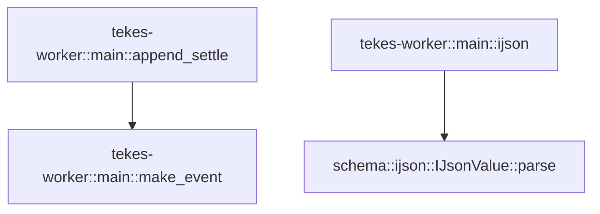

```mermaid
flowchart TD
  n0["engine::lifecycle::run_decision"]
  n1["engine::lifecycle::classify"]
  n2["provider::credential::CredentialClient::from_inherited_fd"]
  n3["store::platform::DirectoryLock::shared"]
  n4["store::tail::LockedLedger::open"]
  n5["tools::builtin::BuiltinManifest::compiled"]
  n6["worker-control::durable::require_version"]
  n7["worker-control::durable::decode_selection"]
  n8["worker-control::durable::decode_queue_transaction"]
  n9["worker-control::durable::encode_queue_transaction_result"]
  n10["worker-control::decode_reject"]
  n11["worker-control::encode_line"]
  n12["tekes-worker::main::drain_ready_deliveries"]
  n13["tekes-worker::main::post_turn_exit"]
  n14["tekes-worker::main::reconcile_provider_attempt"]
  n15["tekes-worker::main::recover_unpaired_tool_calls"]
  n16["tekes-worker::main::append_run_start"]
  n17["tekes-worker::main::open_ready_turn"]
  n18["tekes-worker::main::open_goal_continuation"]
  n19["tekes-worker::main::announce_appended"]
  n20["tekes-worker::main::execute_queue_transaction"]
  n21["tekes-worker::main::make_event"]
  n22["tekes-worker::main::parse_options"]
  n23["tekes-worker::main::load_profiles"]
  n24["tekes-worker::main::activate_subagent_profile"]
  n25["tekes-worker::main::run_provider_turn"]
  n26["tekes-worker::main::RuntimeCancellation::cancel"]
  n27["tekes-worker::main::RuntimeCancellation::stop_requested"]
  n28["tekes-worker::main::RuntimeCancellation::supervisor_lost"]
  n29["tekes-worker::main::RuntimeCancellation::mark_protocol_failed"]
  n30["tekes-worker::main::RuntimeCancellation::protocol_failed"]
  n31["tekes-worker::main::RuntimeCancellation::defer"]
  n32["tekes-worker::main::RuntimeCancellation::park_delivery"]
  n33["tekes-worker::main::RuntimeCancellation::take_parked_deliveries"]
  n34["tekes-worker::main::ControlLines::drain_ready"]
  n35["tekes-worker::main::ControlLines::next"]
  n36["tekes-worker::main::ProtocolFailure::fmt"]
  n37["tekes-worker::main::spawn_control_reader"]
  n38["tekes-worker::main::read_control_lines"]
  n39["tekes-worker::main::forward_control_lines"]
  n40["tekes-worker::main::control_line_key"]
  n41["tekes-worker::main::is_stop_control_line"]
  n42["tekes-worker::main::is_delivery_control_line"]
  n43["tekes-worker::main::main"]
  n44["tekes-worker::main::is_protocol_failure"]
  n45["tekes-worker::main::run"]
  n46["tekes-worker::main::settle_internal_worker_failure"]
  n37 --> n38
  n38 --> n39
  n39 --> n41
  n39 --> n42
  n41 --> n40
  n43 --> n44
  n43 --> n45
  n45 --> n0
  n45 --> n1
  n45 --> n2
  n45 --> n3
  n45 --> n4
  n45 --> n5
  n45 --> n6
  n45 --> n7
  n45 --> n8
  n45 --> n9
  n45 --> n10
  n45 --> n11
  n45 --> n12
  n45 --> n13
  n45 --> n14
  n45 --> n15
  n45 --> n16
  n45 --> n17
  n45 --> n18
  n45 --> n19
  n45 --> n20
  n45 --> n21
  n45 --> n22
  n45 --> n23
  n45 --> n24
  n45 --> n25
  n45 --> n37
  n45 --> n44
  n45 --> n46
```

```mermaid
flowchart TD
  n0["engine::dispatcher::side_effectful"]
  n1["engine::provider::sent_state"]
  n2["engine::provider::decide_recovery"]
  n3["provider::normalize::normalize_dialect_response"]
  n4["session-controls::read_goal"]
  n5["store::asset::AssetStore::new"]
  n6["tools::builtin::BuiltinManifest::compiled"]
  n7["worker-control::durable::require_version"]
  n8["worker-control::durable::encode_tool_control"]
  n9["worker-control::durable::decode_tool_control_result"]
  n10["worker-control::durable::encode_queue_transaction_result"]
  n11["worker-control::decode_supervisor"]
  n12["worker-control::encode_line"]
  n13["tekes-worker::main::drain_ready_deliveries"]
  n14["tekes-worker::main::drain_parked_deliveries"]
  n15["tekes-worker::main::handle_delivery"]
  n16["tekes-worker::main::post_turn_exit"]
  n17["tekes-worker::main::exchange_tool_control"]
  n18["tekes-worker::main::exchange_tool_control_runtime"]
  n19["tekes-worker::main::reconcile_provider_attempt"]
  n20["tekes-worker::main::recover_unpaired_tool_calls"]
  n21["tekes-worker::main::pending_tool_calls"]
  n22["tekes-worker::main::append_aborted_tool_result"]
  n23["tekes-worker::main::recover_provider_attempt_for_ordinary"]
  n24["tekes-worker::main::unresolved_attempt"]
  n25["tekes-worker::main::validate_adopted_calls"]
  n26["tekes-worker::main::complete_adopt"]
  n27["tekes-worker::main::append_run_start"]
  n28["tekes-worker::main::open_ready_turn"]
  n29["tekes-worker::main::open_goal_continuation"]
  n30["tekes-worker::main::goal_store_location"]
  n31["tekes-worker::main::append_turn_open"]
  n32["tekes-worker::main::origin_event"]
  n33["tekes-worker::main::append_and_receipt"]
  n34["tekes-worker::main::announce_appended"]
  n35["tekes-worker::main::execute_queue_transaction"]
  n36["tekes-worker::main::make_event"]
  n37["tekes-worker::main::execute_provider_tool_calls"]
  n38["tekes-worker::main::continuation_facts"]
  n39["tekes-worker::main::wait_tool_continuation"]
  n40["tekes-worker::main::local_provider_call_id"]
  n41["tekes-worker::main::repair_provider_call_arguments"]
  n42["tekes-worker::main::build_compaction_event"]
  n43["tekes-worker::main::materialize_json"]
  n44["tekes-worker::main::sealed_fragments"]
  n45["tekes-worker::main::append_settle"]
  n13 --> n11
  n13 --> n15
  n14 --> n11
  n14 --> n15
  n15 --> n7
  n15 --> n10
  n15 --> n12
  n15 --> n32
  n15 --> n33
  n15 --> n34
  n15 --> n35
  n15 --> n42
  n16 --> n34
  n16 --> n45
  n17 --> n7
  n17 --> n8
  n17 --> n9
  n17 --> n11
  n17 --> n12
  n18 --> n7
  n18 --> n8
  n18 --> n9
  n18 --> n11
  n18 --> n12
  n19 --> n12
  n19 --> n24
  n19 --> n26
  n19 --> n36
  n19 --> n45
  n20 --> n0
  n20 --> n6
  n20 --> n21
  n20 --> n22
  n20 --> n37
  n20 --> n38
  n20 --> n39
  n21 --> n43
  n22 --> n36
  n23 --> n1
  n23 --> n2
  n23 --> n12
  n23 --> n24
  n23 --> n26
  n23 --> n36
  n23 --> n45
  n25 --> n43
  n26 --> n3
  n26 --> n5
  n26 --> n12
  n26 --> n25
  n26 --> n36
  n26 --> n40
  n26 --> n41
  n26 --> n44
  n26 --> n45
  n27 --> n36
  n28 --> n31
  n29 --> n4
  n29 --> n30
  n29 --> n36
  n31 --> n36
```

```mermaid
flowchart TD
  n0["profile::config::ConfigSnapshot::decode"]
  n1["profile::instruction::InstructionSnapshot::decode"]
  n2["profile::launch::LaunchBindings::decode_verified"]
  n3["schema::event::Event::decode"]
  n4["store::asset::AssetStore::new"]
  n5["worker-control::encode_line"]
  n6["tekes-worker::main::origin_event"]
  n7["tekes-worker::main::append_and_receipt"]
  n8["tekes-worker::main::announce_appended"]
  n9["tekes-worker::main::execute_queue_transaction"]
  n10["tekes-worker::main::queue_rejected"]
  n11["tekes-worker::main::queue_target"]
  n12["tekes-worker::main::queue_steer_window_open"]
  n13["tekes-worker::main::verify_queue_assets"]
  n14["tekes-worker::main::validate_existing_retraction"]
  n15["tekes-worker::main::validate_existing_replacement"]
  n16["tekes-worker::main::event_at"]
  n17["tekes-worker::main::event_json"]
  n18["tekes-worker::main::make_event"]
  n19["tekes-worker::main::parse_options"]
  n20["tekes-worker::main::parse_fd"]
  n21["tekes-worker::main::read_inherited_fd"]
  n22["tekes-worker::main::load_profiles"]
  n23["tekes-worker::main::activate_subagent_profile"]
  n24["tekes-worker::main::sibling_helper_path"]
  n25["tekes-worker::main::effective_allowed_tools"]
  n26["tekes-worker::main::tool_catalog_context"]
  n27["tekes-worker::main::read_child_projection"]
  n7 --> n5
  n7 --> n8
  n7 --> n18
  n8 --> n5
  n9 --> n6
  n9 --> n10
  n9 --> n11
  n9 --> n12
  n9 --> n13
  n9 --> n14
  n9 --> n15
  n9 --> n18
  n11 --> n17
  n13 --> n4
  n14 --> n16
  n14 --> n17
  n15 --> n16
  n15 --> n17
  n18 --> n3
  n19 --> n20
  n22 --> n0
  n22 --> n1
  n22 --> n2
  n22 --> n21
  n23 --> n27
  n26 --> n25
```

```mermaid
flowchart TD
  n0["engine::dispatcher::PermissionModePolicy::for_session_folder"]
  n1["engine::dispatcher::ToolDispatcher::new"]
  n2["engine::dynamic_catalog::DynamicToolDispatcher::new"]
  n3["engine::dynamic_catalog::DynamicSupervisorBackend::new"]
  n4["engine::dynamic_catalog::dynamic_side_effectful"]
  n5["engine::supervisor_tools::SupervisorControlBackend::new"]
  n6["engine::system_tools::DurableArtifactVersions::new"]
  n7["engine::system_tools::SystemToolBackend::new"]
  n8["engine::system_tools::SystemToolConfig::workspace"]
  n9["engine::workflow_tools::WorkflowBackend::new"]
  n10["profile::resources::ResourceCatalog::from_snapshot"]
  n11["provider::normalize::invalid_arguments_detail"]
  n12["schema::ijson::IJsonValue::parse"]
  n13["store::asset::AssetStore::new"]
  n14["tools::builtin::BuiltinManifest::compiled"]
  n15["tools::helper::HelperClient::sandboxed_with_scratch"]
  n16["tools::hook::decode_hook_binding"]
  n17["tools::pipeline::ToolPipeline::new"]
  n18["tools::runtime_backends::BoundedHttpClient::new"]
  n19["tools::sandbox::probe_backend"]
  n20["worker-control::continuation::encode_tool_continuation"]
  n21["worker-control::continuation::decode_tool_continuation_result"]
  n22["worker-control::continuation::ToolContinuationRequest::new"]
  n23["worker-control::durable::ToolControl::new"]
  n24["worker-control::durable::require_version"]
  n25["worker-control::decode_supervisor"]
  n26["worker-control::encode_line"]
  n27["tekes-worker::main::exchange_tool_control_runtime"]
  n28["tekes-worker::main::announce_appended"]
  n29["tekes-worker::main::make_event"]
  n30["tekes-worker::main::sibling_helper_path"]
  n31["tekes-worker::main::effective_allowed_tools"]
  n32["tekes-worker::main::tool_catalog_context"]
  n33["tekes-worker::main::assemble_tool_backends"]
  n34["tekes-worker::main::invocation_write_roots"]
  n35["tekes-worker::main::storage_root_for_thread_folder"]
  n36["tekes-worker::main::session_permission_policy"]
  n37["tekes-worker::main::execute_provider_tool_calls"]
  n38["tekes-worker::main::continuation_facts"]
  n39["tekes-worker::main::rfc3339_after"]
  n40["tekes-worker::main::wait_tool_continuation"]
  n41["tekes-worker::main::control_error_code_name"]
  n42["tekes-worker::main::exchange_tool_continuation_runtime"]
  n43["tekes-worker::main::append_tool_validation_error"]
  n44["tekes-worker::main::frozen_hook_bindings"]
  n45["tekes-worker::main::frozen_skill_catalog"]
  n46["tekes-worker::main::execute_child_spawn_tool"]
  n47["tekes-worker::main::durable_invocation"]
  n48["tekes-worker::main::ensure_durable_child"]
  n49["tekes-worker::main::ensure_delegation_state"]
  n50["tekes-worker::main::TaskInputError::fmt"]
  n51["tekes-worker::main::resolve_completed_task_inputs"]
  n52["tekes-worker::main::child_identity"]
  n53["tekes-worker::main::publish_child_genesis"]
  n54["tekes-worker::main::exchange_launch_child_runtime"]
  n55["tekes-worker::main::wait_for_child_terminal"]
  n56["tekes-worker::main::read_child_projection"]
  n57["tekes-worker::main::append_child_result_once"]
  n58["tekes-worker::main::materialize_json"]
  n33 --> n2
  n33 --> n3
  n33 --> n5
  n33 --> n6
  n33 --> n7
  n33 --> n8
  n33 --> n9
  n33 --> n15
  n33 --> n18
  n33 --> n19
  n33 --> n27
  n33 --> n30
  n33 --> n31
  n33 --> n35
  n33 --> n45
  n36 --> n0
  n37 --> n1
  n37 --> n2
  n37 --> n11
  n37 --> n12
  n37 --> n13
  n37 --> n14
  n37 --> n17
  n37 --> n32
  n37 --> n33
  n37 --> n34
  n37 --> n36
  n37 --> n40
  n37 --> n43
  n37 --> n44
  n37 --> n46
  n38 --> n58
  n40 --> n4
  n40 --> n12
  n40 --> n13
  n40 --> n17
  n40 --> n22
  n40 --> n23
  n40 --> n28
  n40 --> n29
  n40 --> n38
  n40 --> n39
  n40 --> n41
  n40 --> n42
  n40 --> n44
  n40 --> n58
  n42 --> n20
  n42 --> n21
  n42 --> n24
  n42 --> n25
  n42 --> n26
  n43 --> n29
  n44 --> n16
  n45 --> n10
  n45 --> n12
  n46 --> n1
  n46 --> n12
  n46 --> n13
  n46 --> n17
  n46 --> n23
  n46 --> n27
  n46 --> n31
  n46 --> n32
  n46 --> n36
  n46 --> n43
  n46 --> n47
  n46 --> n48
  n46 --> n54
  n46 --> n55
  n46 --> n57
  n47 --> n12
  n47 --> n58
  n48 --> n13
  n48 --> n29
  n48 --> n49
  n48 --> n52
  n48 --> n53
  n48 --> n56
  n49 --> n29
  n49 --> n51
```

```mermaid
flowchart TD
  n0["engine::context::plan_context_compaction"]
  n1["engine::context::plan_tool_result_trim"]
  n2["engine::dispatcher::ToolDispatcher::new"]
  n3["engine::dispatcher::side_effectful"]
  n4["engine::dynamic_catalog::DynamicToolDispatcher::new"]
  n5["provider::credential::credential_request_id"]
  n6["provider::dialect::epoch_profile"]
  n7["provider::dialect::resolve_profile"]
  n8["provider::http::HttpRuntime::new"]
  n9["provider::request::endpoint_origin"]
  n10["provider::request::prepare"]
  n11["provider::request::prepare_with_native_deferred_tools"]
  n12["schema::ijson::IJsonValue::parse"]
  n13["session-controls::read_goal"]
  n14["store::asset::AssetStore::new"]
  n15["store::tail::scan_valid_prefix"]
  n16["tools::builtin::BuiltinManifest::compiled"]
  n17["tools::guidance::root_system_instructions"]
  n18["tools::pipeline::ToolPipeline::new"]
  n19["tools::schema_registry::fixed_schema"]
  n20["worker-control::decode_supervisor"]
  n21["worker-control::encode_line"]
  n22["tekes-worker::main::drain_parked_deliveries"]
  n23["tekes-worker::main::pending_tool_calls"]
  n24["tekes-worker::main::recover_provider_attempt_for_ordinary"]
  n25["tekes-worker::main::goal_store_location"]
  n26["tekes-worker::main::announce_appended"]
  n27["tekes-worker::main::make_event"]
  n28["tekes-worker::main::tool_catalog_context"]
  n29["tekes-worker::main::assemble_tool_backends"]
  n30["tekes-worker::main::execute_provider_tool_calls"]
  n31["tekes-worker::main::call_turn"]
  n32["tekes-worker::main::publish_child_genesis"]
  n33["tekes-worker::main::exchange_launch_child_runtime"]
  n34["tekes-worker::main::wait_for_child_terminal"]
  n35["tekes-worker::main::read_child_projection"]
  n36["tekes-worker::main::child_report_summary"]
  n37["tekes-worker::main::bounded_text"]
  n38["tekes-worker::main::append_child_result_once"]
  n39["tekes-worker::main::run_provider_turn"]
  n40["tekes-worker::main::run_provider_turn_inner"]
  n41["tekes-worker::main::forward_provider_frame"]
  n42["tekes-worker::main::EagerDispatch::contains"]
  n43["tekes-worker::main::local_provider_call_id"]
  n44["tekes-worker::main::repair_provider_call_arguments"]
  n45["tekes-worker::main::localize_provider_frame"]
  n46["tekes-worker::main::eager_dispatch_ready_call"]
  n47["tekes-worker::main::append_provider_tool_call_with_wire_id"]
  n48["tekes-worker::main::settle_provider_unavailable"]
  n49["tekes-worker::main::SelectedProviderFailure::detail"]
  n50["tekes-worker::main::selected_provider"]
  n51["tekes-worker::main::current_turn_inputs"]
  n52["tekes-worker::main::auto_compact_for_turn"]
  n53["tekes-worker::main::run_compaction_summary"]
  n54["tekes-worker::main::preflight_compaction_due"]
  n55["tekes-worker::main::dynamic_catalog_revision"]
  n56["tekes-worker::main::native_search_references"]
  n57["tekes-worker::main::project_provider_context_mode"]
  n58["tekes-worker::main::effective_system"]
  n59["tekes-worker::main::epoch_open_reason"]
  n60["tekes-worker::main::append_tool_result_trim"]
  n61["tekes-worker::main::append_provider_epoch"]
  n62["tekes-worker::main::latest_compatible_epoch"]
  n63["tekes-worker::main::is_protocol_failure"]
  n64["tekes-worker::main::append_terminal"]
  n65["tekes-worker::main::append_provider_terminal_error"]
  n66["tekes-worker::main::append_context_overflow"]
  n67["tekes-worker::main::append_provider_failure"]
  n68["tekes-worker::main::wait_provider_admission"]
  n69["tekes-worker::main::settle_internal_worker_failure"]
  n70["tekes-worker::main::usage_object"]
  n71["tekes-worker::main::record_input_transformations"]
  n72["tekes-worker::main::spill_json"]
  n73["tekes-worker::main::append_settle"]
  n74["tekes-worker::main::ijson"]
  n33 --> n20
  n33 --> n21
  n34 --> n22
  n34 --> n35
  n34 --> n36
  n35 --> n15
  n36 --> n14
  n36 --> n37
  n38 --> n27
  n39 --> n40
  n39 --> n63
  n39 --> n69
  n40 --> n0
  n40 --> n1
  n40 --> n2
  n40 --> n4
  n40 --> n5
  n40 --> n6
  n40 --> n7
  n40 --> n8
  n40 --> n9
  n40 --> n10
  n40 --> n11
  n40 --> n12
  n40 --> n13
  n40 --> n14
  n40 --> n16
  n40 --> n17
  n40 --> n18
  n40 --> n20
  n40 --> n21
  n40 --> n22
  n40 --> n23
  n40 --> n24
  n40 --> n25
  n40 --> n26
  n40 --> n27
  n40 --> n28
  n40 --> n29
  n40 --> n30
  n40 --> n40
  n40 --> n41
  n40 --> n44
  n40 --> n45
  n40 --> n46
  n40 --> n48
  n40 --> n50
  n40 --> n51
  n40 --> n52
  n40 --> n53
  n40 --> n54
  n40 --> n55
  n40 --> n56
  n40 --> n57
  n40 --> n58
  n40 --> n59
  n40 --> n60
  n40 --> n61
  n40 --> n62
  n40 --> n64
  n40 --> n65
  n40 --> n66
  n40 --> n67
  n40 --> n68
  n40 --> n71
  n40 --> n73
  n40 --> n74
  n41 --> n21
  n41 --> n70
  n44 --> n19
  n45 --> n43
  n46 --> n26
  n46 --> n30
  n46 --> n47
  n47 --> n3
  n47 --> n27
  n47 --> n72
  n48 --> n27
  n48 --> n73
```

```mermaid
flowchart TD
  n0["engine::compaction_summary::admit_summary_artifact"]
  n1["engine::compaction_summary::summary_request_bytes"]
  n2["engine::compaction_summary::CompactionSummary::from_outcome"]
  n3["engine::compaction_summary::freeze_source_bundle"]
  n4["engine::context::plan_context_compaction"]
  n5["engine::context::compaction_anchor_sequences"]
  n6["provider::compaction_summary::prepare_summary_request"]
  n7["provider::compaction_summary::summary_completion_artifact"]
  n8["provider::http::HttpRuntime::new"]
  n9["schema::event::Event::decode_canonical"]
  n10["schema::ijson::IJsonValue::parse"]
  n11["store::asset::AssetStore::new"]
  n12["tools::schema_registry::fixed_schema"]
  n13["tekes-worker::main::make_event"]
  n14["tekes-worker::main::current_turn_inputs"]
  n15["tekes-worker::main::auto_compact_for_turn"]
  n16["tekes-worker::main::build_compaction_event"]
  n17["tekes-worker::main::run_compaction_summary"]
  n18["tekes-worker::main::preflight_compaction_due"]
  n19["tekes-worker::main::observed_prefix_token_bound"]
  n20["tekes-worker::main::prefix_preserving_token_bound"]
  n21["tekes-worker::main::request_preserves_input_prefix"]
  n22["tekes-worker::main::dynamic_catalog_revision"]
  n23["tekes-worker::main::native_search_references"]
  n24["tekes-worker::main::project_provider_context_mode"]
  n25["tekes-worker::main::seed_provider_items"]
  n26["tekes-worker::main::provider_wire_call_id"]
  n27["tekes-worker::main::render_sealed_carrier"]
  n28["tekes-worker::main::render_event_item"]
  n29["tekes-worker::main::render_blocks"]
  n30["tekes-worker::main::materialize_json"]
  n31["tekes-worker::main::materialize_json_at"]
  n32["tekes-worker::main::materialize_string"]
  n33["tekes-worker::main::seqs_from_ranges"]
  n34["tekes-worker::main::sealed_fragments"]
  n35["tekes-worker::main::ijson"]
  n15 --> n13
  n15 --> n16
  n16 --> n4
  n16 --> n34
  n17 --> n0
  n17 --> n1
  n17 --> n2
  n17 --> n3
  n17 --> n4
  n17 --> n6
  n17 --> n7
  n17 --> n8
  n17 --> n12
  n17 --> n35
  n18 --> n19
  n19 --> n11
  n19 --> n20
  n20 --> n21
  n23 --> n30
  n24 --> n5
  n24 --> n25
  n24 --> n28
  n24 --> n32
  n24 --> n33
  n24 --> n35
  n25 --> n9
  n25 --> n11
  n25 --> n35
  n27 --> n10
  n27 --> n32
  n28 --> n27
  n28 --> n29
  n29 --> n11
  n29 --> n30
  n30 --> n31
  n31 --> n10
  n31 --> n11
  n32 --> n30
```

```mermaid
flowchart TD
  n0["engine::context::trimmed_tool_result_content"]
  n1["schema::ijson::IJsonValue::parse"]
  n2["store::asset::AssetStore::new"]
  n3["tekes-worker::main::unresolved_attempt"]
  n4["tekes-worker::main::make_event"]
  n5["tekes-worker::main::rfc3339_after"]
  n6["tekes-worker::main::local_provider_call_id"]
  n7["tekes-worker::main::repair_provider_call_arguments"]
  n8["tekes-worker::main::append_provider_tool_call_with_wire_id"]
  n9["tekes-worker::main::materialize_json"]
  n10["tekes-worker::main::effective_system"]
  n11["tekes-worker::main::epoch_open_reason"]
  n12["tekes-worker::main::append_tool_result_trim"]
  n13["tekes-worker::main::append_provider_epoch"]
  n14["tekes-worker::main::latest_compatible_epoch"]
  n15["tekes-worker::main::ranges"]
  n16["tekes-worker::main::validate_terminal_tool_calls"]
  n17["tekes-worker::main::append_terminal"]
  n18["tekes-worker::main::append_provider_terminal_error"]
  n19["tekes-worker::main::provider_error_detail"]
  n20["tekes-worker::main::append_context_overflow"]
  n21["tekes-worker::main::append_provider_failure"]
  n22["tekes-worker::main::partial_carrier_for_eager_calls"]
  n23["tekes-worker::main::wait_provider_admission"]
  n24["tekes-worker::main::settle_internal_worker_failure"]
  n25["tekes-worker::main::bounded_ledger_detail"]
  n26["tekes-worker::main::usage_object"]
  n27["tekes-worker::main::record_input_transformations"]
  n28["tekes-worker::main::sealed_fragments"]
  n29["tekes-worker::main::spill_json"]
  n30["tekes-worker::main::append_settle"]
  n12 --> n0
  n12 --> n4
  n12 --> n9
  n13 --> n2
  n13 --> n4
  n16 --> n9
  n17 --> n4
  n17 --> n6
  n17 --> n7
  n17 --> n8
  n17 --> n16
  n17 --> n28
  n18 --> n4
  n18 --> n25
  n20 --> n4
  n21 --> n4
  n21 --> n22
  n21 --> n25
  n22 --> n28
  n23 --> n4
  n23 --> n5
  n24 --> n3
  n24 --> n4
  n24 --> n30
  n25 --> n1
  n27 --> n4
  n27 --> n28
  n28 --> n2
  n29 --> n2
```

# tekes-worker::main

[Package atlas](index.md) · [Source](../../src/main.rs)

## Declarations

Visibility is the declaration spelling; trait members and reexports require their enclosing interface. `cfg` is not evaluated.

| Symbol | Kind | Visibility | Test / cfg |
|---|---|---|---|
| [tekes-worker::main::Options](../../src/main.rs#L71) | struct_item | `private` |  |
| [tekes-worker::main::Options::event_timestamp](../../src/main.rs#L91) | function_item | `private` |  |
| [tekes-worker::main::RuntimeProfile](../../src/main.rs#L108) | struct_item | `private` |  |
| [tekes-worker::main::set_provider_test_redirect](../../src/main.rs#L128) | function_item | `private` | test; #[cfg(test)] |
| [tekes-worker::main::TavilySearchProvider](../../src/main.rs#L132) | struct_item | `private` |  |
| [tekes-worker::main::TavilyTransport](../../src/main.rs#L138) | trait_item | `private` |  |
| [tekes-worker::main::TavilyTransport::send](../../src/main.rs#L139) | function_signature_item | `private` |  |
| [tekes-worker::main::ProductionTavilyTransport](../../src/main.rs#L149) | struct_item | `private` |  |
| [tekes-worker::main::ProductionTavilyTransport::send](../../src/main.rs#L152) | function_item | `private` |  |
| [tekes-worker::main::TavilySearchProvider::search](../../src/main.rs#L165) | function_item | `private` |  |
| [tekes-worker::main::credential_backend_failure](../../src/main.rs#L205) | function_item | `private` |  |
| [tekes-worker::main::send_tavily_search](../../src/main.rs#L219) | function_item | `private` |  |
| [tekes-worker::main::classify_tavily_status](../../src/main.rs#L279) | function_item | `private` |  |
| [tekes-worker::main::tavily_request_bytes](../../src/main.rs#L297) | function_item | `private` |  |
| [tekes-worker::main::wait_search_cancelled](../../src/main.rs#L310) | function_item | `private` |  |
| [tekes-worker::main::resolve_public_search_endpoint](../../src/main.rs#L319) | function_item | `private` |  |
| [tekes-worker::main::parse_tavily_response](../../src/main.rs#L339) | function_item | `private` |  |
| [tekes-worker::main::validate_public_result_url](../../src/main.rs#L376) | function_item | `private` |  |
| [tekes-worker::main::AllowedDynamicBackend](../../src/main.rs#L410) | struct_item | `private` |  |
| [tekes-worker::main::AllowedDynamicBackend::supports](../../src/main.rs#L416) | function_item | `private` |  |
| [tekes-worker::main::AllowedDynamicBackend::execute](../../src/main.rs#L420) | function_item | `private` |  |
| [tekes-worker::main::ProviderOutcome](../../src/main.rs#L440) | struct_item | `private` |  |
| [tekes-worker::main::ProviderContext](../../src/main.rs#L451) | struct_item | `private` |  |
| [tekes-worker::main::AllowedToolBackend](../../src/main.rs#L457) | struct_item | `private` |  |
| [tekes-worker::main::AllowedToolBackend::supports](../../src/main.rs#L463) | function_item | `private` |  |
| [tekes-worker::main::AllowedToolBackend::execute](../../src/main.rs#L467) | function_item | `private` |  |
| [tekes-worker::main::AllowedToolBackend::resume_after_approval](../../src/main.rs#L471) | function_item | `private` |  |
| [tekes-worker::main::DeferredChildBackend](../../src/main.rs#L486) | struct_item | `private` |  |
| [tekes-worker::main::DeferredChildBackend::supports](../../src/main.rs#L489) | function_item | `private` |  |
| [tekes-worker::main::DeferredChildBackend::execute](../../src/main.rs#L493) | function_item | `private` |  |
| [tekes-worker::main::ReplayedChildBackend](../../src/main.rs#L498) | struct_item | `private` |  |
| [tekes-worker::main::ReplayedChildBackend::supports](../../src/main.rs#L503) | function_item | `private` |  |
| [tekes-worker::main::ReplayedChildBackend::execute](../../src/main.rs#L507) | function_item | `private` |  |
| [tekes-worker::main::UnresolvedAttempt](../../src/main.rs#L542) | struct_item | `private` |  |
| [tekes-worker::main::PendingToolCall](../../src/main.rs#L556) | struct_item | `private` |  |
| [tekes-worker::main::RecoveryProgress](../../src/main.rs#L568) | enum_item | `private` |  |
| [tekes-worker::main::CANCEL_NONE](../../src/main.rs#L573) | const_item | `private` |  |
| [tekes-worker::main::CANCEL_STOP](../../src/main.rs#L574) | const_item | `private` |  |
| [tekes-worker::main::CANCEL_SUPERVISOR_LOSS](../../src/main.rs#L575) | const_item | `private` |  |
| [tekes-worker::main::RuntimeCancellation](../../src/main.rs#L578) | struct_item | `private` |  |
| [tekes-worker::main::RuntimeCancellation::cancel](../../src/main.rs#L593) | function_item | `private` |  |
| [tekes-worker::main::RuntimeCancellation::stop_requested](../../src/main.rs#L601) | function_item | `private` |  |
| [tekes-worker::main::RuntimeCancellation::supervisor_lost](../../src/main.rs#L605) | function_item | `private` |  |
| [tekes-worker::main::RuntimeCancellation::mark_protocol_failed](../../src/main.rs#L609) | function_item | `private` |  |
| [tekes-worker::main::RuntimeCancellation::protocol_failed](../../src/main.rs#L613) | function_item | `private` |  |
| [tekes-worker::main::RuntimeCancellation::defer](../../src/main.rs#L617) | function_item | `private` |  |
| [tekes-worker::main::RuntimeCancellation::park_delivery](../../src/main.rs#L624) | function_item | `private` |  |
| [tekes-worker::main::RuntimeCancellation::take_parked_deliveries](../../src/main.rs#L631) | function_item | `private` |  |
| [tekes-worker::main::ControlLines](../../src/main.rs#L636) | struct_item | `private` |  |
| [tekes-worker::main::ControlLines::drain_ready](../../src/main.rs#L645) | function_item | `private` |  |
| [tekes-worker::main::Item](../../src/main.rs#L662) | type_item | `private` |  |
| [tekes-worker::main::ControlLines::next](../../src/main.rs#L664) | function_item | `private` |  |
| [tekes-worker::main::ProtocolFailure](../../src/main.rs#L679) | struct_item | `private` |  |
| [tekes-worker::main::ProtocolFailure::fmt](../../src/main.rs#L682) | function_item | `private` |  |
| [tekes-worker::main::spawn_control_reader](../../src/main.rs#L689) | function_item | `private` |  |
| [tekes-worker::main::read_control_lines](../../src/main.rs#L702) | function_item | `private` |  |
| [tekes-worker::main::forward_control_lines](../../src/main.rs#L707) | function_item | `private` |  |
| [tekes-worker::main::control_line_key](../../src/main.rs#L732) | function_item | `private` |  |
| [tekes-worker::main::is_stop_control_line](../../src/main.rs#L740) | function_item | `private` |  |
| [tekes-worker::main::is_delivery_control_line](../../src/main.rs#L746) | function_item | `private` |  |
| [tekes-worker::main::main](../../src/main.rs#L753) | function_item | `private` |  |
| [tekes-worker::main::is_protocol_failure](../../src/main.rs#L767) | function_item | `private` |  |
| [tekes-worker::main::run](../../src/main.rs#L786) | function_item | `private` |  |
| [tekes-worker::main::drain_ready_deliveries](../../src/main.rs#L1012) | function_item | `private` |  |
| [tekes-worker::main::drain_parked_deliveries](../../src/main.rs#L1033) | function_item | `private` |  |
| [tekes-worker::main::handle_delivery](../../src/main.rs#L1054) | function_item | `private` |  |
| [tekes-worker::main::post_turn_exit](../../src/main.rs#L1192) | function_item | `private` |  |
| [tekes-worker::main::exchange_tool_control](../../src/main.rs#L1256) | function_item | `pub` |  |
| [tekes-worker::main::exchange_tool_control_runtime](../../src/main.rs#L1290) | function_item | `private` |  |
| [tekes-worker::main::reconcile_provider_attempt](../../src/main.rs#L1358) | function_item | `private` |  |
| [tekes-worker::main::recover_unpaired_tool_calls](../../src/main.rs#L1427) | function_item | `private` |  |
| [tekes-worker::main::pending_tool_calls](../../src/main.rs#L1548) | function_item | `private` |  |
| [tekes-worker::main::append_aborted_tool_result](../../src/main.rs#L1624) | function_item | `private` |  |
| [tekes-worker::main::recover_provider_attempt_for_ordinary](../../src/main.rs#L1639) | function_item | `private` |  |
| [tekes-worker::main::unresolved_attempt](../../src/main.rs#L1741) | function_item | `private` |  |
| [tekes-worker::main::validate_adopted_calls](../../src/main.rs#L1859) | function_item | `private` |  |
| [tekes-worker::main::complete_adopt](../../src/main.rs#L1889) | function_item | `private` |  |
| [tekes-worker::main::append_run_start](../../src/main.rs#L2092) | function_item | `private` |  |
| [tekes-worker::main::open_ready_turn](../../src/main.rs#L2131) | function_item | `private` |  |
| [tekes-worker::main::open_goal_continuation](../../src/main.rs#L2158) | function_item | `private` |  |
| [tekes-worker::main::goal_store_location](../../src/main.rs#L2211) | function_item | `private` |  |
| [tekes-worker::main::append_turn_open](../../src/main.rs#L2225) | function_item | `private` |  |
| [tekes-worker::main::origin_event](../../src/main.rs#L2249) | function_item | `private` |  |
| [tekes-worker::main::append_and_receipt](../../src/main.rs#L2268) | function_item | `private` |  |
| [tekes-worker::main::announce_appended](../../src/main.rs#L2305) | function_item | `private` |  |
| [tekes-worker::main::QueueTarget](../../src/main.rs#L2318) | struct_item | `private` |  |
| [tekes-worker::main::execute_queue_transaction](../../src/main.rs#L2324) | function_item | `private` |  |
| [tekes-worker::main::queue_rejected](../../src/main.rs#L2475) | function_item | `private` |  |
| [tekes-worker::main::queue_target](../../src/main.rs#L2486) | function_item | `private` |  |
| [tekes-worker::main::queue_steer_window_open](../../src/main.rs#L2580) | function_item | `private` |  |
| [tekes-worker::main::verify_queue_assets](../../src/main.rs#L2589) | function_item | `private` |  |
| [tekes-worker::main::validate_existing_retraction](../../src/main.rs#L2605) | function_item | `private` |  |
| [tekes-worker::main::validate_existing_replacement](../../src/main.rs#L2624) | function_item | `private` |  |
| [tekes-worker::main::event_at](../../src/main.rs#L2657) | function_item | `private` |  |
| [tekes-worker::main::event_json](../../src/main.rs#L2664) | function_item | `private` |  |
| [tekes-worker::main::make_event](../../src/main.rs#L2668) | function_item | `private` |  |
| [tekes-worker::main::parse_options](../../src/main.rs#L2672) | function_item | `private` |  |
| [tekes-worker::main::parse_fd](../../src/main.rs#L2736) | function_item | `private` |  |
| [tekes-worker::main::read_inherited_fd](../../src/main.rs#L2745) | function_item | `private` |  |
| [tekes-worker::main::load_profiles](../../src/main.rs#L2757) | function_item | `private` |  |
| [tekes-worker::main::activate_subagent_profile](../../src/main.rs#L2808) | function_item | `private` |  |
| [tekes-worker::main::sibling_helper_path](../../src/main.rs#L2875) | function_item | `private` |  |
| [tekes-worker::main::effective_allowed_tools](../../src/main.rs#L2893) | function_item | `private` |  |
| [tekes-worker::main::tool_catalog_context](../../src/main.rs#L2911) | function_item | `private` |  |
| [tekes-worker::main::ToolBackendPlan](../../src/main.rs#L2960) | struct_item | `private` |  |
| [tekes-worker::main::ToolBackendRuntime](../../src/main.rs#L2969) | struct_item | `private` |  |
| [tekes-worker::main::assemble_tool_backends](../../src/main.rs#L2975) | function_item | `private` |  |
| [tekes-worker::main::invocation_write_roots](../../src/main.rs#L3220) | function_item | `private` |  |
| [tekes-worker::main::storage_root_for_thread_folder](../../src/main.rs#L3321) | function_item | `private` |  |
| [tekes-worker::main::session_permission_policy](../../src/main.rs#L3341) | function_item | `private` |  |
| [tekes-worker::main::execute_provider_tool_calls](../../src/main.rs#L3349) | function_item | `private` |  |
| [tekes-worker::main::ContinuationFacts](../../src/main.rs#L3542) | struct_item | `private` |  |
| [tekes-worker::main::continuation_facts](../../src/main.rs#L3559) | function_item | `private` |  |
| [tekes-worker::main::CONTINUATION_INPUT_SCOPE](../../src/main.rs#L3667) | const_item | `private` |  |
| [tekes-worker::main::CONTINUATION_POLL_FLOOR](../../src/main.rs#L3668) | const_item | `private` |  |
| [tekes-worker::main::CONTINUATION_PARK_THRESHOLD](../../src/main.rs#L3672) | const_item | `private` |  |
| [tekes-worker::main::CONTINUATION_POLL_CEILING](../../src/main.rs#L3673) | const_item | `private` |  |
| [tekes-worker::main::PROVIDER_RETRIES](../../src/main.rs#L3675) | const_item | `private` |  |
| [tekes-worker::main::PROVIDER_ADMISSION_FLOOR](../../src/main.rs#L3676) | const_item | `private` |  |
| [tekes-worker::main::PROVIDER_ADMISSION_CEILING](../../src/main.rs#L3677) | const_item | `private` |  |
| [tekes-worker::main::PROVIDER_ADMISSION_SUBKIND](../../src/main.rs#L3678) | const_item | `private` |  |
| [tekes-worker::main::rfc3339_after](../../src/main.rs#L3680) | function_item | `private` |  |
| [tekes-worker::main::ContinuationWait](../../src/main.rs#L3685) | struct_item | `private` |  |
| [tekes-worker::main::wait_tool_continuation](../../src/main.rs#L3700) | function_item | `private` |  |
| [tekes-worker::main::control_error_code_name](../../src/main.rs#L4013) | function_item | `private` |  |
| [tekes-worker::main::exchange_tool_continuation_runtime](../../src/main.rs#L4022) | function_item | `private` |  |
| [tekes-worker::main::append_tool_validation_error](../../src/main.rs#L4095) | function_item | `private` |  |
| [tekes-worker::main::frozen_hook_bindings](../../src/main.rs#L4112) | function_item | `private` |  |
| [tekes-worker::main::frozen_skill_catalog](../../src/main.rs#L4137) | function_item | `private` |  |
| [tekes-worker::main::ToolCallBatch](../../src/main.rs#L4191) | struct_item | `private` |  |
| [tekes-worker::main::ChildSpawnExecution](../../src/main.rs#L4201) | struct_item | `private` |  |
| [tekes-worker::main::DurableChildSpawn](../../src/main.rs#L4214) | struct_item | `private` |  |
| [tekes-worker::main::ChildTerminal](../../src/main.rs#L4222) | struct_item | `private` |  |
| [tekes-worker::main::execute_child_spawn_tool](../../src/main.rs#L4227) | function_item | `private` |  |
| [tekes-worker::main::durable_invocation](../../src/main.rs#L4389) | function_item | `private` |  |
| [tekes-worker::main::ensure_durable_child](../../src/main.rs#L4411) | function_item | `private` |  |
| [tekes-worker::main::ensure_delegation_state](../../src/main.rs#L4532) | function_item | `private` |  |
| [tekes-worker::main::TaskInputError](../../src/main.rs#L4579) | struct_item | `private` |  |
| [tekes-worker::main::TaskInputError::fmt](../../src/main.rs#L4581) | function_item | `private` |  |
| [tekes-worker::main::resolve_completed_task_inputs](../../src/main.rs#L4591) | function_item | `private` |  |
| [tekes-worker::main::child_identity](../../src/main.rs#L4666) | function_item | `private` |  |
| [tekes-worker::main::call_turn](../../src/main.rs#L4695) | function_item | `private` |  |
| [tekes-worker::main::publish_child_genesis](../../src/main.rs#L4707) | function_item | `private` |  |
| [tekes-worker::main::exchange_launch_child_runtime](../../src/main.rs#L4741) | function_item | `private` |  |
| [tekes-worker::main::wait_for_child_terminal](../../src/main.rs#L4791) | function_item | `private` |  |
| [tekes-worker::main::read_child_projection](../../src/main.rs#L4840) | function_item | `private` |  |
| [tekes-worker::main::child_report_summary](../../src/main.rs#L4849) | function_item | `private` |  |
| [tekes-worker::main::bounded_text](../../src/main.rs#L4889) | function_item | `private` |  |
| [tekes-worker::main::append_child_result_once](../../src/main.rs#L4900) | function_item | `private` |  |
| [tekes-worker::main::run_provider_turn](../../src/main.rs#L4937) | function_item | `private` |  |
| [tekes-worker::main::ProviderLoopBudget](../../src/main.rs#L4997) | struct_item | `private` |  |
| [tekes-worker::main::ProviderRunContext](../../src/main.rs#L5006) | struct_item | `private` |  |
| [tekes-worker::main::run_provider_turn_inner](../../src/main.rs#L5012) | function_item | `private` |  |
| [tekes-worker::main::forward_provider_frame](../../src/main.rs#L6032) | function_item | `private` |  |
| [tekes-worker::main::EagerDispatch](../../src/main.rs#L6086) | struct_item | `private` |  |
| [tekes-worker::main::EagerDispatch::contains](../../src/main.rs#L6096) | function_item | `private` |  |
| [tekes-worker::main::local_provider_call_id](../../src/main.rs#L6104) | function_item | `private` |  |
| [tekes-worker::main::repair_provider_call_arguments](../../src/main.rs#L6172) | function_item | `private` |  |
| [tekes-worker::main::localize_provider_frame](../../src/main.rs#L6188) | function_item | `private` |  |
| [tekes-worker::main::EagerReadyCall](../../src/main.rs#L6209) | struct_item | `private` |  |
| [tekes-worker::main::eager_dispatch_ready_call](../../src/main.rs#L6225) | function_item | `private` |  |
| [tekes-worker::main::append_provider_tool_call](../../src/main.rs#L6307) | function_item | `private` | test; #[cfg(test)] |
| [tekes-worker::main::append_provider_tool_call_with_wire_id](../../src/main.rs#L6318) | function_item | `private` |  |
| [tekes-worker::main::settle_provider_unavailable](../../src/main.rs#L6352) | function_item | `private` |  |
| [tekes-worker::main::SelectedProviderFailure](../../src/main.rs#L6378) | enum_item | `private` |  |
| [tekes-worker::main::SelectedProviderFailure::detail](../../src/main.rs#L6387) | function_item | `private` |  |
| [tekes-worker::main::selected_provider](../../src/main.rs#L6398) | function_item | `private` |  |
| [tekes-worker::main::current_turn_inputs](../../src/main.rs#L6432) | function_item | `private` |  |
| [tekes-worker::main::CONTEXT_RENDERER_VERSION](../../src/main.rs#L6457) | const_item | `private` |  |
| [tekes-worker::main::auto_compact_for_turn](../../src/main.rs#L6459) | function_item | `private` |  |
| [tekes-worker::main::build_compaction_event](../../src/main.rs#L6479) | function_item | `private` |  |
| [tekes-worker::main::run_compaction_summary](../../src/main.rs#L6524) | function_item | `private` |  |
| [tekes-worker::main::COMPACTION_SUMMARY_TIMEOUT_SECONDS](../../src/main.rs#L6585) | const_item | `private` |  |
| [tekes-worker::main::preflight_compaction_due](../../src/main.rs#L6591) | function_item | `private` |  |
| [tekes-worker::main::observed_prefix_token_bound](../../src/main.rs#L6604) | function_item | `private` |  |
| [tekes-worker::main::prefix_preserving_token_bound](../../src/main.rs#L6644) | function_item | `private` |  |
| [tekes-worker::main::prefix_preserving_token_bound::FRAMING_MARGIN_TOKENS](../../src/main.rs#L6657) | const_item | `private` |  |
| [tekes-worker::main::request_preserves_input_prefix](../../src/main.rs#L6665) | function_item | `private` |  |
| [tekes-worker::main::dynamic_catalog_revision](../../src/main.rs#L6691) | function_item | `private` |  |
| [tekes-worker::main::native_search_references](../../src/main.rs#L6707) | function_item | `private` |  |
| [tekes-worker::main::project_provider_context](../../src/main.rs#L6781) | function_item | `private` | test; #[cfg(test)] |
| [tekes-worker::main::project_provider_context_mode](../../src/main.rs#L6791) | function_item | `private` |  |
| [tekes-worker::main::seed_provider_items](../../src/main.rs#L7138) | function_item | `private` |  |
| [tekes-worker::main::provider_wire_call_id](../../src/main.rs#L7241) | function_item | `private` |  |
| [tekes-worker::main::render_sealed_carrier](../../src/main.rs#L7255) | function_item | `private` |  |
| [tekes-worker::main::render_event_item](../../src/main.rs#L7282) | function_item | `private` |  |
| [tekes-worker::main::render_blocks](../../src/main.rs#L7367) | function_item | `private` |  |
| [tekes-worker::main::materialize_json](../../src/main.rs#L7418) | function_item | `private` |  |
| [tekes-worker::main::materialize_json_at](../../src/main.rs#L7425) | function_item | `private` |  |
| [tekes-worker::main::materialize_string](../../src/main.rs#L7446) | function_item | `private` |  |
| [tekes-worker::main::seqs_from_ranges](../../src/main.rs#L7457) | function_item | `private` |  |
| [tekes-worker::main::effective_system](../../src/main.rs#L7473) | function_item | `private` |  |
| [tekes-worker::main::EpochAppend](../../src/main.rs#L7485) | struct_item | `private` |  |
| [tekes-worker::main::epoch_open_reason](../../src/main.rs#L7500) | function_item | `private` |  |
| [tekes-worker::main::append_tool_result_trim](../../src/main.rs#L7540) | function_item | `private` |  |
| [tekes-worker::main::append_provider_epoch](../../src/main.rs#L7580) | function_item | `private` |  |
| [tekes-worker::main::latest_compatible_epoch](../../src/main.rs#L7626) | function_item | `private` |  |
| [tekes-worker::main::ranges](../../src/main.rs#L7661) | function_item | `private` |  |
| [tekes-worker::main::validate_terminal_tool_calls](../../src/main.rs#L7680) | function_item | `private` |  |
| [tekes-worker::main::TerminalAppend](../../src/main.rs#L7753) | struct_item | `private` |  |
| [tekes-worker::main::append_terminal](../../src/main.rs#L7763) | function_item | `private` |  |
| [tekes-worker::main::append_provider_terminal_error](../../src/main.rs#L7861) | function_item | `private` |  |
| [tekes-worker::main::provider_error_detail](../../src/main.rs#L7919) | function_item | `private` |  |
| [tekes-worker::main::append_context_overflow](../../src/main.rs#L7934) | function_item | `private` |  |
| [tekes-worker::main::append_provider_failure](../../src/main.rs#L7960) | function_item | `private` |  |
| [tekes-worker::main::partial_carrier_for_eager_calls](../../src/main.rs#L8074) | function_item | `private` |  |
| [tekes-worker::main::ProviderAdmissionRetry](../../src/main.rs#L8111) | struct_item | `private` |  |
| [tekes-worker::main::wait_provider_admission](../../src/main.rs#L8125) | function_item | `private` |  |
| [tekes-worker::main::settle_internal_worker_failure](../../src/main.rs#L8165) | function_item | `private` |  |
| [tekes-worker::main::bounded_ledger_detail](../../src/main.rs#L8197) | function_item | `private` |  |
| [tekes-worker::main::usage_object](../../src/main.rs#L8219) | function_item | `private` |  |
| [tekes-worker::main::record_input_transformations](../../src/main.rs#L8241) | function_item | `private` |  |
| [tekes-worker::main::sealed_fragments](../../src/main.rs#L8261) | function_item | `private` |  |
| [tekes-worker::main::spill_json](../../src/main.rs#L8275) | function_item | `private` |  |
| [tekes-worker::main::append_settle](../../src/main.rs#L8285) | function_item | `private` |  |
| [tekes-worker::main::ijson](../../src/main.rs#L8311) | function_item | `private` |  |
| [tekes-worker::main::provider_context_tests::queue_origin](../../src/main.rs#L8329) | function_item | `private` | test; #[cfg(test)] |
| [tekes-worker::main::provider_context_tests::queue_ledger](../../src/main.rs#L8339) | function_item | `private` | test; #[cfg(test)] |
| [tekes-worker::main::provider_context_tests::file_block_renders_wire_file_block_with_base64_data_and_bytes](../../src/main.rs#L8372) | function_item | `private` | test; #[cfg(test)] |
| [tekes-worker::main::provider_context_tests::edit_transaction](../../src/main.rs#L8395) | function_item | `private` | test; #[cfg(test)] |
| [tekes-worker::main::provider_context_tests::queue_transaction_commits_pair_and_reacks_without_new_events](../../src/main.rs#L8413) | function_item | `private` | test; #[cfg(test)] |
| [tekes-worker::main::provider_context_tests::queue_transaction_completes_retraction_only_crash_window](../../src/main.rs#L8443) | function_item | `private` | test; #[cfg(test)] |
| [tekes-worker::main::provider_context_tests::consumed_queue_target_rejects_without_authoring_events](../../src/main.rs#L8473) | function_item | `private` | test; #[cfg(test)] |
| [tekes-worker::main::provider_context_tests::invalid_queue_attachment_rejects_before_retraction](../../src/main.rs#L8492) | function_item | `private` | test; #[cfg(test)] |
| [tekes-worker::main::provider_context_tests::frozen_instruction_bytes_supply_hooks_and_skill_catalog](../../src/main.rs#L8518) | function_item | `private` | test; #[cfg(test)] |
| [tekes-worker::main::provider_context_tests::package_skill_catalog_uses_same_frozen_resource_projection](../../src/main.rs#L8549) | function_item | `private` | test; #[cfg(test)] |
| [tekes-worker::main::provider_context_tests::install_lifecycle_test_hooks](../../src/main.rs#L8588) | function_item | `private` | test; #[cfg(test)] |
| [tekes-worker::main::provider_context_tests::lifecycle_hooks_frozen_configuration_replay_and_terminal_outcomes](../../src/main.rs#L8632) | function_item | `private` | test; #[cfg(test)] |
| [tekes-worker::main::provider_context_tests::lifecycle_observer_retries_unacknowledged_event_with_stable_identity](../../src/main.rs#L8697) | function_item | `private` | test; #[cfg(test)] |
| [tekes-worker::main::provider_context_tests::lifecycle_manual_compaction_notifies_before_the_compact_record](../../src/main.rs#L8746) | function_item | `private` | test; #[cfg(test)] |
| [tekes-worker::main::provider_context_tests::retired_memory_selectors_never_become_executable_tools](../../src/main.rs#L8772) | function_item | `private` | test; #[cfg(test)] |
| [tekes-worker::main::provider_context_tests::shell_uses_effective_workspace_write_permission_without_model_restatement](../../src/main.rs#L8782) | function_item | `private` | test; #[cfg(test)] |
| [tekes-worker::main::provider_context_tests::tool_profile](../../src/main.rs#L8878) | function_item | `private` | test; #[cfg(test)] |
| [tekes-worker::main::provider_context_tests::test_options](../../src/main.rs#L8932) | function_item | `private` | test; #[cfg(test)] |
| [tekes-worker::main::provider_context_tests::unconfigured_provider_settles_with_the_exact_owned_reason](../../src/main.rs#L8954) | function_item | `private` | test; #[cfg(test)] |
| [tekes-worker::main::provider_context_tests::provider_failures_keep_http_ownership_and_terminal_classification](../../src/main.rs#L8989) | function_item | `private` | test; #[cfg(test)] |
| [tekes-worker::main::provider_context_tests::configured_test_provider_profile](../../src/main.rs#L9055) | function_item | `private` | test; #[cfg(test)] |
| [tekes-worker::main::provider_context_tests::fixed_401_is_attempted_once_and_settles_provider_terminal](../../src/main.rs#L9088) | function_item | `private` | test; #[cfg(test)] |
| [tekes-worker::main::provider_context_tests::permanent_400_releases_queued_retry_body_after_error_settlement](../../src/main.rs#L9152) | function_item | `private` | test; #[cfg(test)] |
| [tekes-worker::main::provider_context_tests::assert_retry_exhaustion](../../src/main.rs#L9266) | function_item | `private` | test; #[cfg(test)] |
| [tekes-worker::main::provider_context_tests::fixed_429_retries_and_exhausts_as_rate_limit](../../src/main.rs#L9360) | function_item | `private` | test; #[cfg(test)] |
| [tekes-worker::main::provider_context_tests::fixed_500_retries_and_exhausts_as_transport](../../src/main.rs#L9369) | function_item | `private` | test; #[cfg(test)] |
| [tekes-worker::main::provider_context_tests::provider_cancellation_records_the_runtime_owner](../../src/main.rs#L9378) | function_item | `private` | test; #[cfg(test)] |
| [tekes-worker::main::provider_context_tests::unexpected_post_turn_error_is_durably_owned_by_the_worker](../../src/main.rs#L9408) | function_item | `private` | test; #[cfg(test)] |
| [tekes-worker::main::provider_context_tests::append_test_attempt](../../src/main.rs#L9432) | function_item | `private` | test; #[cfg(test)] |
| [tekes-worker::main::provider_context_tests::append_test_call](../../src/main.rs#L9444) | function_item | `private` | test; #[cfg(test)] |
| [tekes-worker::main::provider_context_tests::catalog_role_is_derived_once_and_conflicts_fail_closed](../../src/main.rs#L9474) | function_item | `private` | test; #[cfg(test)] |
| [tekes-worker::main::provider_context_tests::web_search_catalog_requires_network_config_and_active_launch_readiness](../../src/main.rs#L9515) | function_item | `private` | test; #[cfg(test)] |
| [tekes-worker::main::provider_context_tests::web_search_scope_is_independent_from_model_provider_scopes](../../src/main.rs#L9539) | function_item | `private` | test; #[cfg(test)] |
| [tekes-worker::main::provider_context_tests::adopted_response_must_preserve_durable_call_arguments_and_name](../../src/main.rs#L9597) | function_item | `private` | test; #[cfg(test)] |
| [tekes-worker::main::provider_context_tests::slice8_gate_60_tool_write_ahead_crash_matrix](../../src/main.rs#L9626) | function_item | `private` | test; #[cfg(test)] |
| [tekes-worker::main::provider_context_tests::exit_code_is](../../src/main.rs#L9722) | function_item | `private` | test; #[cfg(test)] |
| [tekes-worker::main::provider_context_tests::stop_control_lines](../../src/main.rs#L9726) | function_item | `private` | test; #[cfg(test)] |
| [tekes-worker::main::provider_context_tests::reader_thread_parks_deliveries_and_channels_stops_and_replies](../../src/main.rs#L9743) | function_item | `private` | test; #[cfg(test)] |
| [tekes-worker::main::provider_context_tests::compact_at_predispatch_yield_rebuilds_before_requesting_a_lease](../../src/main.rs#L9774) | function_item | `private` | test; #[cfg(test)] |
| [tekes-worker::main::provider_context_tests::manual_compact_is_durable_receipted_and_idempotent_across_reopen](../../src/main.rs#L9826) | function_item | `private` | test; #[cfg(test)] |
| [tekes-worker::main::provider_context_tests::parked_deliveries_are_appended_and_receipted_at_a_yield_point](../../src/main.rs#L9895) | function_item | `private` | test; #[cfg(test)] |
| [tekes-worker::main::provider_context_tests::deliveries_are_receipted_while_the_provider_request_is_in_flight](../../src/main.rs#L9938) | function_item | `private` | test; #[cfg(test)] |
| [tekes-worker::main::provider_context_tests::post_turn_open_turn_without_stop_exits_for_tail_recovery](../../src/main.rs#L10031) | function_item | `private` | test; #[cfg(test)] |
| [tekes-worker::main::provider_context_tests::post_turn_stop_without_unresolved_work_echoes_the_stop_and_settles_user_stop](../../src/main.rs#L10059) | function_item | `private` | test; #[cfg(test)] |
| [tekes-worker::main::provider_context_tests::channel_stop_is_echoed_before_the_user_stop_settle](../../src/main.rs#L10103) | function_item | `private` | test; #[cfg(test)] |
| [tekes-worker::main::provider_context_tests::lease_denial_leaves_the_turn_open_for_tail_recovery](../../src/main.rs#L10171) | function_item | `private` | test; #[cfg(test)] |
| [tekes-worker::main::provider_context_tests::post_turn_stop_with_unresolved_work_exits_nonzero_without_settle](../../src/main.rs#L10217) | function_item | `private` | test; #[cfg(test)] |
| [tekes-worker::main::provider_context_tests::question_cancellation_denies_held_call_and_keeps_session_running](../../src/main.rs#L10243) | function_item | `private` | test; #[cfg(test)] |
| [tekes-worker::main::provider_context_tests::slice8_gate_61_tool_hold_stop_resume](../../src/main.rs#L10342) | function_item | `private` | test; #[cfg(test)] |
| [tekes-worker::main::provider_context_tests::production_task_creates_launches_waits_and_pairs_child_once](../../src/main.rs#L10491) | function_item | `private` | test; #[cfg(test)] |
| [tekes-worker::main::provider_context_tests::delegation_seed_reuses_the_post_hook_effective_invocation](../../src/main.rs#L10893) | function_item | `private` | test; #[cfg(test)] |
| [tekes-worker::main::provider_context_tests::supervisor_control_recovery_reuses_the_durable_request_identity](../../src/main.rs#L10946) | function_item | `private` | test; #[cfg(test)] |
| [tekes-worker::main::provider_context_tests::deferred_control_frames_remain_fifo_when_stop_cancels_runtime](../../src/main.rs#L11015) | function_item | `private` | test; #[cfg(test)] |
| [tekes-worker::main::provider_context_tests::ping_then_eof_cancels_a_blocked_backend_without_consuming_ping](../../src/main.rs#L11031) | function_item | `private` | test; #[cfg(test)] |
| [tekes-worker::main::provider_context_tests::runtime_control_eof_and_mismatched_result_are_protocol_failures](../../src/main.rs#L11059) | function_item | `private` | test; #[cfg(test)] |
| [tekes-worker::main::provider_context_tests::production_provider_ignores_tool_network_policy_and_continues_after_tool_result](../../src/main.rs#L11107) | function_item | `private` | test; #[cfg(test)] |
| [tekes-worker::main::provider_context_tests::RealMemoryFixture](../../src/main.rs#L11233) | struct_item | `private` | test; #[cfg(test)] |
| [tekes-worker::main::provider_context_tests::RealMemoryFixture::start](../../src/main.rs#L11240) | function_item | `private` | test; #[cfg(test)] |
| [tekes-worker::main::provider_context_tests::RealMemoryFixture::verify](../../src/main.rs#L11263) | function_item | `private` | test; #[cfg(test)] |
| [tekes-worker::main::provider_context_tests::RealMemoryFixture::drop](../../src/main.rs#L11274) | function_item | `private` | test; #[cfg(test)] |
| [tekes-worker::main::provider_context_tests::production_turn_with_real_tekesmemory_service](../../src/main.rs#L11282) | function_item | `private` | test; #[cfg(test)] |
| [tekes-worker::main::provider_context_tests::production_turn_continues_through_tools_commentary_and_reasoning_until_final](../../src/main.rs#L11287) | function_item | `private` | test; #[cfg(test)] |
| [tekes-worker::main::provider_context_tests::assert_production_turn_continuation](../../src/main.rs#L11291) | function_item | `private` | test; #[cfg(test)] |
| [tekes-worker::main::provider_context_tests::tool_control_exchange_is_correlated](../../src/main.rs#L11497) | function_item | `private` | test; #[cfg(test)] |
| [tekes-worker::main::provider_context_tests::epoch_compatibility_cannot_resurrect_an_older_continuation_chain](../../src/main.rs#L11533) | function_item | `private` | test; #[cfg(test)] |
| [tekes-worker::main::provider_context_tests::context_ledger](../../src/main.rs#L11564) | function_item | `private` | test; #[cfg(test)] |
| [tekes-worker::main::provider_context_tests::goal_final_opens_next_turn_only_while_active_and_under_budget](../../src/main.rs#L11607) | function_item | `private` | test; #[cfg(test)] |
| [tekes-worker::main::provider_context_tests::epoch_open_reason_names_the_part_of_the_head_that_moved](../../src/main.rs#L11674) | function_item | `private` | test; #[cfg(test)] |
| [tekes-worker::main::provider_context_tests::semantic_anchors_select_latest_results_and_keep_whole_tool_batches](../../src/main.rs#L11712) | function_item | `private` | test; #[cfg(test)] |
| [tekes-worker::main::provider_context_tests::input_transformation_diagnostics_do_not_change_the_cached_context](../../src/main.rs#L11763) | function_item | `private` | test; #[cfg(test)] |
| [tekes-worker::main::provider_context_tests::appending_visible_state_preserves_context_prefix_and_recovery_bytes](../../src/main.rs#L11793) | function_item | `private` | test; #[cfg(test)] |
| [tekes-worker::main::provider_context_tests::stateless_projection_replays_sealed_baseline_and_only_new_admits](../../src/main.rs#L11842) | function_item | `private` | test; #[cfg(test)] |
| [tekes-worker::main::provider_context_tests::server_managed_projection_uses_continuation_and_only_pending_host_facts](../../src/main.rs#L11865) | function_item | `private` | test; #[cfg(test)] |
| [tekes-worker::main::provider_context_tests::deepseek_responses_ignores_family_continuation_and_replays_full_history](../../src/main.rs#L11877) | function_item | `private` | test; #[cfg(test)] |
| [tekes-worker::main::provider_context_tests::overflow_compaction_is_checkpointed_and_changes_the_retry_projection](../../src/main.rs#L11941) | function_item | `private` | test; #[cfg(test)] |
| [tekes-worker::main::provider_context_tests::child_seed_snapshot_projects_normalized_payload_without_parent_baseline](../../src/main.rs#L11992) | function_item | `private` | test; #[cfg(test)] |
| [tekes-worker::main::provider_context_tests::scripted_provider_server](../../src/main.rs#L12068) | function_item | `private` | test; #[cfg(test)] |
| [tekes-worker::main::provider_context_tests::overflow_profile](../../src/main.rs#L12112) | function_item | `private` | test; #[cfg(test)] |
| [tekes-worker::main::provider_context_tests::overflow_profile_with_trigger](../../src/main.rs#L12116) | function_item | `private` | test; #[cfg(test)] |
| [tekes-worker::main::provider_context_tests::overflow_options](../../src/main.rs#L12192) | function_item | `private` | test; #[cfg(test)] |
| [tekes-worker::main::provider_context_tests::provider_attempt_persists_the_exact_request_body_as_a_thread_asset](../../src/main.rs#L12214) | function_item | `private` | test; #[cfg(test)] |
| [tekes-worker::main::provider_context_tests::context_overflow_closes_compacts_and_retries_without_resetting_the_turn](../../src/main.rs#L12279) | function_item | `private` | test; #[cfg(test)] |
| [tekes-worker::main::provider_context_tests::overflow_with_summary](../../src/main.rs#L12373) | function_item | `private` | test; #[cfg(test)] |
| [tekes-worker::main::provider_context_tests::context_overflow_writes_the_admitted_model_summary](../../src/main.rs#L12443) | function_item | `private` | test; #[cfg(test)] |
| [tekes-worker::main::provider_context_tests::context_overflow_rejects_foreign_evidence_and_keeps_the_deterministic_summary](../../src/main.rs#L12482) | function_item | `private` | test; #[cfg(test)] |
| [tekes-worker::main::provider_context_tests::quoted_null_ready_terminal_and_reopen_keep_one_normalized_call](../../src/main.rs#L12506) | function_item | `private` | test; #[cfg(test)] |
| [tekes-worker::main::provider_context_tests::completed_wire_call_id_gets_a_local_identity_and_keeps_native_result_pairing](../../src/main.rs#L12597) | function_item | `private` | test; #[cfg(test)] |
| [tekes-worker::main::provider_context_tests::invalid_tool_write_authority_pairs_an_error_without_crashing_or_starting_execution](../../src/main.rs#L12812) | function_item | `private` | test; #[cfg(test)] |
| [tekes-worker::main::provider_context_tests::permission_mode_file_change_applies_to_the_next_tool_batch](../../src/main.rs#L12871) | function_item | `private` | test; #[cfg(test)] #[cfg(target_os = "macos")] |
| [tekes-worker::main::provider_context_tests::tracked_approved_head_is_unstarted_until_the_execution_barrier](../../src/main.rs#L12957) | function_item | `private` | test; #[cfg(test)] |
| [tekes-worker::main::provider_context_tests::a_batch_sibling_behind_an_approval_hold_is_recovered_not_buried](../../src/main.rs#L13018) | function_item | `private` | test; #[cfg(test)] |
| [tekes-worker::main::provider_context_tests::a_trimmed_result_renders_in_the_place_of_the_result_it_retracts](../../src/main.rs#L13094) | function_item | `private` | test; #[cfg(test)] |
| [tekes-worker::main::provider_context_tests::a_trim_written_in_a_later_turn_is_stamped_with_the_open_turn](../../src/main.rs#L13174) | function_item | `private` | test; #[cfg(test)] |
| [tekes-worker::main::provider_context_tests::observed_tokens_prevent_byte_only_compaction_for_a_preserved_prefix](../../src/main.rs#L13233) | function_item | `private` | test; #[cfg(test)] |
| [tekes-worker::main::provider_context_tests::observed_token_bound_reads_the_reported_usage_and_saved_request](../../src/main.rs#L13268) | function_item | `private` | test; #[cfg(test)] |
| [tekes-worker::main::provider_context_tests::preflight_trim_epoch_reentry_compaction_preserves_the_open_turn_and_saved_wire](../../src/main.rs#L13299) | function_item | `private` | test; #[cfg(test)] |
| [tekes-worker::main::provider_context_tests::preflight_trim_epoch_reentry_compaction_preserves_the_open_turn_and_saved_wire::Wire](../../src/main.rs#L13301) | struct_item | `private` | test; #[cfg(test)] |
| [tekes-worker::main::provider_context_tests::preflight_trim_epoch_reentry_compaction_preserves_the_open_turn_and_saved_wire::Wire::write](../../src/main.rs#L13303) | function_item | `private` | test; #[cfg(test)] |
| [tekes-worker::main::provider_context_tests::preflight_trim_epoch_reentry_compaction_preserves_the_open_turn_and_saved_wire::Wire::flush](../../src/main.rs#L13307) | function_item | `private` | test; #[cfg(test)] |
| [tekes-worker::main::provider_context_tests::preflight_compaction_precedes_the_send_when_the_candidate_exceeds_the_trigger](../../src/main.rs#L13441) | function_item | `private` | test; #[cfg(test)] |
| [tekes-worker::main::provider_context_tests::FixtureTavilyTransport](../../src/main.rs#L13543) | struct_item | `private` | test; #[cfg(test)] |
| [tekes-worker::main::provider_context_tests::FixtureTavilyTransport::send](../../src/main.rs#L13548) | function_item | `private` | test; #[cfg(test)] |
| [tekes-worker::main::provider_context_tests::search_scope](../../src/main.rs#L13567) | function_item | `private` | test; #[cfg(test)] |
| [tekes-worker::main::provider_context_tests::search_request](../../src/main.rs#L13578) | function_item | `private` | test; #[cfg(test)] |
| [tekes-worker::main::provider_context_tests::tavily_request_and_response_match_the_oracle](../../src/main.rs#L13588) | function_item | `private` | test; #[cfg(test)] |
| [tekes-worker::main::provider_context_tests::web_search_resolves_material_per_call_and_observes_rotation](../../src/main.rs#L13632) | function_item | `private` | test; #[cfg(test)] |
| [tekes-worker::main::provider_context_tests::web_search_revocation_reaches_the_next_call](../../src/main.rs#L13681) | function_item | `private` | test; #[cfg(test)] |
| [tekes-worker::main::provider_context_tests::slice14e_gate_111_web_search_exact_wire_and_negative_matrix](../../src/main.rs#L13726) | function_item | `private` | test; #[cfg(test)] |
| [tekes-worker::main::provider_context_tests::slice14e_gate_112_web_parity_retirement_and_secret_lifecycle](../../src/main.rs#L13759) | function_item | `private` | test; #[cfg(test)] |
| [tekes-worker::main::provider_context_tests::EagerResponsesProfile](../../src/main.rs#L13779) | type_item | `private` | test; #[cfg(test)] |
| [tekes-worker::main::provider_context_tests::eager_responses_profile](../../src/main.rs#L13787) | function_item | `private` | test; #[cfg(test)] |
| [tekes-worker::main::provider_context_tests::eager_responses_profile_for](../../src/main.rs#L13796) | function_item | `private` | test; #[cfg(test)] |
| [tekes-worker::main::provider_context_tests::read_http_request](../../src/main.rs#L13861) | function_item | `private` | test; #[cfg(test)] |
| [tekes-worker::main::provider_context_tests::ledger_file_contains](../../src/main.rs#L13890) | function_item | `private` | test; #[cfg(test)] |
| [tekes-worker::main::provider_context_tests::EAGER_TOOL_SSE_PREFIX](../../src/main.rs#L13901) | const_item | `private` | test; #[cfg(test)] |
| [tekes-worker::main::provider_context_tests::EAGER_TOOL_SSE_TERMINAL](../../src/main.rs#L13906) | const_item | `private` | test; #[cfg(test)] |
| [tekes-worker::main::provider_context_tests::FINAL_JSON_RESPONSE](../../src/main.rs#L13907) | const_item | `private` | test; #[cfg(test)] |
| [tekes-worker::main::provider_context_tests::eager_dispatch_executes_ready_call_before_response_terminal_bytes](../../src/main.rs#L13914) | function_item | `private` | test; #[cfg(test)] |
| [tekes-worker::main::provider_context_tests::PARTIAL_REASONING_TOOL_SSE](../../src/main.rs#L14061) | const_item | `private` | test; #[cfg(test)] |
| [tekes-worker::main::provider_context_tests::transport_loss_after_eager_dispatch_seals_completed_items_for_the_retry](../../src/main.rs#L14080) | function_item | `private` | test; #[cfg(test)] |
| [tekes-worker::main::provider_context_tests::eager_dispatch_park_suspends_execution_and_resume_pairs_the_whole_batch](../../src/main.rs#L14269) | function_item | `private` | test; #[cfg(test)] |
| [tekes-worker::main::provider_context_tests::inline_approval_before_provider_terminal_continues_the_batch_without_worker_exit](../../src/main.rs#L14274) | function_item | `private` | test; #[cfg(test)] |
| [tekes-worker::main::provider_context_tests::eager_dispatch_hold_case](../../src/main.rs#L14278) | function_item | `private` | test; #[cfg(test)] |
| [tekes-worker::main::provider_context_tests::eager_dispatch_hold_case::InlineReplyWriter](../../src/main.rs#L14329) | struct_item | `private` | test; #[cfg(test)] |
| [tekes-worker::main::provider_context_tests::eager_dispatch_hold_case::InlineReplyWriter::write](../../src/main.rs#L14337) | function_item | `private` | test; #[cfg(test)] |
| [tekes-worker::main::provider_context_tests::eager_dispatch_hold_case::InlineReplyWriter::flush](../../src/main.rs#L14352) | function_item | `private` | test; #[cfg(test)] |
| [tekes-worker::main::provider_context_tests::response_terminal_reuse_of_eager_call_requires_identical_facts](../../src/main.rs#L14526) | function_item | `private` | test; #[cfg(test)] |
| [tekes-worker::main::provider_context_tests::eager_call_interrupted_before_result_is_recovered_once_and_attempt_closes](../../src/main.rs#L14648) | function_item | `private` | test; #[cfg(test)] |
| [tekes-worker::main::provider_context_tests::async_dynamic_tool](../../src/main.rs#L14721) | function_item | `private` | test; #[cfg(test)] |
| [tekes-worker::main::provider_context_tests::task_state](../../src/main.rs#L14744) | function_item | `private` | test; #[cfg(test)] |
| [tekes-worker::main::provider_context_tests::line](../../src/main.rs#L14755) | function_item | `private` | test; #[cfg(test)] |
| [tekes-worker::main::provider_context_tests::remote_task_continuation_parks_on_input_and_resumes_to_one_result](../../src/main.rs#L14768) | function_item | `private` | test; #[cfg(test)] |
| [tekes-worker::main::provider_context_tests::remote_task_continuation_stop_cancels_remotely_and_terminalizes_as_error](../../src/main.rs#L15018) | function_item | `private` | test; #[cfg(test)] |
| [tekes-worker::main::provider_context_tests::native_route_declares_client_tool_search_and_replays_bound_output](../../src/main.rs#L15142) | function_item | `private` | test; #[cfg(test)] |
| [tekes-worker::main::provider_context_tests::eager_dispatch_executes_anthropic_call_before_message_stop_bytes](../../src/main.rs#L15385) | function_item | `private` | test; #[cfg(test)] |
| [tekes-worker::main::provider_context_tests::eager_results_render_after_their_attempt_output_in_replay](../../src/main.rs#L15517) | function_item | `private` | test; #[cfg(test)] |
| [tekes-worker::main::provider_context_tests::remote_task_continuation_parks_when_polls_slow_and_resumes_when_due](../../src/main.rs#L15576) | function_item | `private` | test; #[cfg(test)] |

## Imports / reexports

| Local name | Source path | Visibility |
|---|---|---|
| `compaction_anchor_sequences` | `engine::compaction_anchor_sequences` | `private` |
| `RefCell` | `std::cell::RefCell` | `private` |
| `BTreeSet` | `std::collections::BTreeSet` | `private` |
| `VecDeque` | `std::collections::VecDeque` | `private` |
| `env` | `std::env` | `private` |
| `fs` | `std::fs` | `private` |
| `File` | `std::fs::File` | `private` |
| `OpenOptions` | `std::fs::OpenOptions` | `private` |
| `io` | `std::io` | `private` |
| `BufRead` | `std::io::BufRead` | `private` |
| `Read` | `std::io::Read` | `private` |
| `Write` | `std::io::Write` | `private` |
| `IpAddr` | `std::net::IpAddr` | `private` |
| `FromRawFd` | `std::os::fd::FromRawFd` | `private` |
| `OpenOptionsExt` | `std::os::unix::fs::OpenOptionsExt` | `private` |
| `PathBuf` | `std::path::PathBuf` | `private` |
| `ExitCode` | `std::process::ExitCode` | `private` |
| `Rc` | `std::rc::Rc` | `private` |
| `FromStr` | `std::str::FromStr` | `private` |
| `Arc` | `std::sync::Arc` | `private` |
| `Mutex` | `std::sync::Mutex` | `private` |
| `AtomicBool` | `std::sync::atomic::AtomicBool` | `private` |
| `AtomicU8` | `std::sync::atomic::AtomicU8` | `private` |
| `Ordering` | `std::sync::atomic::Ordering` | `private` |
| `Receiver` | `std::sync::mpsc::Receiver` | `private` |
| `SyncSender` | `std::sync::mpsc::SyncSender` | `private` |
| `sync_channel` | `std::sync::mpsc::sync_channel` | `private` |
| `Duration` | `std::time::Duration` | `private` |
| `Instant` | `std::time::Instant` | `private` |
| `_` | `base64::Engine` | `private` |
| `AdapterCapabilities` | `engine::AdapterCapabilities` | `private` |
| `CatalogEntry` | `engine::CatalogEntry` | `private` |
| `Continuation` | `engine::Continuation` | `private` |
| `DurableArtifactVersions` | `engine::DurableArtifactVersions` | `private` |
| `DynamicBackend` | `engine::DynamicBackend` | `private` |
| `DynamicSupervisorBackend` | `engine::DynamicSupervisorBackend` | `private` |
| `DynamicToolDispatcher` | `engine::DynamicToolDispatcher` | `private` |
| `LockFacts` | `engine::LockFacts` | `private` |
| `PermissionModePolicy` | `engine::PermissionModePolicy` | `private` |
| `QueryCapability` | `engine::QueryCapability` | `private` |
| `QueryResult` | `engine::QueryResult` | `private` |
| `RecoveryDecision` | `engine::RecoveryDecision` | `private` |
| `RunDecision` | `engine::RunDecision` | `private` |
| `RunMode` | `engine::RunMode` | `private` |
| `SupervisorControlBackend` | `engine::SupervisorControlBackend` | `private` |
| `SystemToolBackend` | `engine::SystemToolBackend` | `private` |
| `SystemToolConfig` | `engine::SystemToolConfig` | `private` |
| `TailState` | `engine::TailState` | `private` |
| `ToolBackend` | `engine::ToolBackend` | `private` |
| `ToolBackendRouter` | `engine::ToolBackendRouter` | `private` |
| `ToolDispatcher` | `engine::ToolDispatcher` | `private` |
| `ToolInvocation` | `engine::ToolInvocation` | `private` |
| `WorkflowBackend` | `engine::WorkflowBackend` | `private` |
| `classify` | `engine::classify` | `private` |
| `decide_recovery` | `engine::decide_recovery` | `private` |
| `run_decision` | `engine::run_decision` | `private` |
| `sent_state` | `engine::sent_state` | `private` |
| `ConfigSnapshot` | `profile::ConfigSnapshot` | `private` |
| `DynamicTool` | `profile::DynamicTool` | `private` |
| `DynamicToolEffect` | `profile::DynamicToolEffect` | `private` |
| `InstructionKind` | `profile::InstructionKind` | `private` |
| `InstructionSnapshot` | `profile::InstructionSnapshot` | `private` |
| `LaunchBindings` | `profile::LaunchBindings` | `private` |
| `Model` | `profile::Model` | `private` |
| `Provider` | `profile::Provider` | `private` |
| `ResourceCatalog` | `profile::ResourceCatalog` | `private` |
| `WebSearch` | `profile::WebSearch` | `private` |
| `ContentBlock` | `provider::ContentBlock` | `private` |
| `CredentialClient` | `provider::CredentialClient` | `private` |
| `CredentialGet` | `provider::CredentialGet` | `private` |
| `DialectId` | `provider::DialectId` | `private` |
| `FinishReason` | `provider::FinishReason` | `private` |
| `HttpRuntime` | `provider::HttpRuntime` | `private` |
| `PrepareInput` | `provider::PrepareInput` | `private` |
| `ProviderCompletion` | `provider::ProviderCompletion` | `private` |
| `ProviderFailure` | `provider::ProviderFailure` | `private` |
| `ProviderFrame` | `provider::ProviderFrame` | `private` |
| `ProviderTerminal` | `provider::ProviderTerminal` | `private` |
| `credential_request_id` | `provider::credential_request_id` | `private` |
| `endpoint_origin` | `provider::endpoint_origin` | `private` |
| `prepare` | `provider::prepare` | `private` |
| `Event` | `schema::Event` | `private` |
| `EventKind` | `schema::EventKind` | `private` |
| `IJsonValue` | `schema::IJsonValue` | `private` |
| `ResumePolicy` | `schema::ResumePolicy` | `private` |
| `Visibility` | `schema::Visibility` | `private` |
| `Map` | `serde_json::Map` | `private` |
| `Value` | `serde_json::Value` | `private` |
| `json` | `serde_json::json` | `private` |
| `Digest` | `sha2::Digest` | `private` |
| `Sha256` | `sha2::Sha256` | `private` |
| `AssetStore` | `store::AssetStore` | `private` |
| `BarrierContext` | `store::BarrierContext` | `private` |
| `DirectoryLock` | `store::DirectoryLock` | `private` |
| `LockedLedger` | `store::LockedLedger` | `private` |
| `StoreError` | `store::StoreError` | `private` |
| `scan_valid_prefix` | `store::scan_valid_prefix` | `private` |
| `Backend` | `tools::Backend` | `private` |
| `BackendFailure` | `tools::BackendFailure` | `private` |
| `BackendTerminal` | `tools::BackendTerminal` | `private` |
| `BoundedHttpClient` | `tools::BoundedHttpClient` | `private` |
| `BuiltinManifest` | `tools::BuiltinManifest` | `private` |
| `CancellationToken` | `tools::CancellationToken` | `private` |
| `CatalogContext` | `tools::CatalogContext` | `private` |
| `CatalogRole` | `tools::CatalogRole` | `private` |
| `DurableApprovalResponse` | `tools::DurableApprovalResponse` | `private` |
| `HelperClient` | `tools::HelperClient` | `private` |
| `HelperInvoker` | `tools::HelperInvoker` | `private` |
| `HookBinding` | `tools::HookBinding` | `private` |
| `HttpLimits` | `tools::HttpLimits` | `private` |
| `NetworkPolicy` | `tools::NetworkPolicy` | `private` |
| `PipelineDecision` | `tools::PipelineDecision` | `private` |
| `ProbeStatus` | `tools::ProbeStatus` | `private` |
| `PublicRoute` | `tools::PublicRoute` | `private` |
| `SandboxBackend` | `tools::SandboxBackend` | `private` |
| `SandboxPolicy` | `tools::SandboxPolicy` | `private` |
| `SearchHit` | `tools::SearchHit` | `private` |
| `SearchProvider` | `tools::SearchProvider` | `private` |
| `SearchRequest` | `tools::SearchRequest` | `private` |
| `SearchTopic` | `tools::SearchTopic` | `private` |
| `SecretScan` | `tools::SecretScan` | `private` |
| `SecretScanner` | `tools::SecretScanner` | `private` |
| `ToolExecution` | `tools::ToolExecution` | `private` |
| `ToolPipeline` | `tools::ToolPipeline` | `private` |
| `decode_hook_binding` | `tools::decode_hook_binding` | `private` |
| `is_public_internet_address` | `tools::is_public_internet_address` | `private` |
| `probe_backend` | `tools::probe_backend` | `private` |
| `route_public_url` | `tools::route_public_url` | `private` |
| `ContinuationOperation` | `worker_control::continuation::ContinuationOperation` | `private` |
| `ToolContinuationOutcome` | `worker_control::continuation::ToolContinuationOutcome` | `private` |
| `ToolContinuationRequest` | `worker_control::continuation::ToolContinuationRequest` | `private` |
| `ToolContinuationResponse` | `worker_control::continuation::ToolContinuationResponse` | `private` |
| `decode_tool_continuation_result` | `worker_control::continuation::decode_tool_continuation_result` | `private` |
| `encode_tool_continuation` | `worker_control::continuation::encode_tool_continuation` | `private` |
| `Appended` | `worker_control::Appended` | `private` |
| `AttemptSettled` | `worker_control::AttemptSettled` | `private` |
| `EX_PROTOCOL` | `worker_control::EX_PROTOCOL` | `private` |
| `Frame` | `worker_control::Frame` | `private` |
| `FrameChannel` | `worker_control::FrameChannel` | `private` |
| `LaunchChild` | `worker_control::LaunchChild` | `private` |
| `LaunchResult` | `worker_control::LaunchResult` | `private` |
| `LeaseRequest` | `worker_control::LeaseRequest` | `private` |
| `Receipt` | `worker_control::Receipt` | `private` |
| `Selected` | `worker_control::Selected` | `private` |
| `SupervisorMessage` | `worker_control::SupervisorMessage` | `private` |
| `decode_reject` | `worker_control::decode_reject` | `private` |
| `decode_supervisor` | `worker_control::decode_supervisor` | `private` |
| `encode_line` | `worker_control::encode_line` | `private` |
| `Hello` | `worker_control::Hello` | `private` |
| `QueueTransaction` | `worker_control::QueueTransaction` | `private` |
| `QueueTransactionAction` | `worker_control::QueueTransactionAction` | `private` |
| `QueueTransactionOutcome` | `worker_control::QueueTransactionOutcome` | `private` |
| `QueueTransactionRejectCode` | `worker_control::QueueTransactionRejectCode` | `private` |
| `QueueTransactionResult` | `worker_control::QueueTransactionResult` | `private` |
| `ToolControl` | `worker_control::ToolControl` | `private` |
| `ToolControlErrorCode` | `worker_control::ToolControlErrorCode` | `private` |
| `ToolControlResult` | `worker_control::ToolControlResult` | `private` |
| `WorkerStartup` | `worker_control::WorkerStartup` | `private` |
| `decode_queue_transaction` | `worker_control::decode_queue_transaction` | `private` |
| `decode_selection` | `worker_control::decode_selection` | `private` |
| `decode_tool_control_result` | `worker_control::decode_tool_control_result` | `private` |
| `encode_queue_transaction_result` | `worker_control::encode_queue_transaction_result` | `private` |
| `encode_tool_control` | `worker_control::encode_tool_control` | `private` |
| `require_version` | `worker_control::require_version` | `private` |
| `*` | `super::*` | `private` |
| `fs` | `std::fs` | `private` |
| `TcpListener` | `std::net::TcpListener` | `private` |
| `EffectiveInstructions` | `profile::EffectiveInstructions` | `private` |
| `InstructionResolver` | `profile::InstructionResolver` | `private` |
| `ProvidersConfig` | `profile::ProvidersConfig` | `private` |
| `ResolvedWorkspace` | `profile::ResolvedWorkspace` | `private` |
| `RevisionVector` | `profile::RevisionVector` | `private` |
| `SettingsConfig` | `profile::SettingsConfig` | `private` |
| `WorkspacePolicy` | `profile::WorkspacePolicy` | `private` |
| `FixtureRoot` | `test_support::FixtureRoot` | `private` |

## Module declarations

| Module | Visibility | Attributes |
|---|---|---|
| `tekes-worker::main::identity` | `private` |  |
| `tekes-worker::main::workspace_edits` | `private` |  |
| `tekes-worker::main::lifecycle_hooks` | `private` |  |
| `tekes-worker::main::result_presentation` | `private` |  |
| `tekes-worker::main::validation_runtime` | `private` |  |
| `tekes-worker::main::provider_context_tests` | `private` | #[cfg(test)] |

## Function call graphs

Edges below are syntactically resolved calls only, including private functions. Graphs partition callers into groups of 20; they are not execution order. All unresolved sites are listed below and in the JSON inventory.

```mermaid
flowchart TD
  n0["provider::credential::credential_request_id"]
  n1["provider::request::endpoint_origin"]
  n2["schema::ijson::IJsonValue::parse"]
  n3["tools::runtime_backends::route_public_url"]
  n4["tools::runtime_backends::is_public_internet_address"]
  n5["tekes-worker::main::ProductionTavilyTransport::send"]
  n6["tekes-worker::main::TavilySearchProvider::search"]
  n7["tekes-worker::main::credential_backend_failure"]
  n8["tekes-worker::main::send_tavily_search"]
  n9["tekes-worker::main::classify_tavily_status"]
  n10["tekes-worker::main::tavily_request_bytes"]
  n11["tekes-worker::main::wait_search_cancelled"]
  n12["tekes-worker::main::resolve_public_search_endpoint"]
  n13["tekes-worker::main::parse_tavily_response"]
  n14["tekes-worker::main::validate_public_result_url"]
  n15["tekes-worker::main::AllowedDynamicBackend::supports"]
  n16["tekes-worker::main::AllowedDynamicBackend::execute"]
  n17["tekes-worker::main::AllowedToolBackend::supports"]
  n18["tekes-worker::main::AllowedToolBackend::execute"]
  n19["tekes-worker::main::AllowedToolBackend::resume_after_approval"]
  n20["tekes-worker::main::DeferredChildBackend::supports"]
  n21["tekes-worker::main::DeferredChildBackend::execute"]
  n22["tekes-worker::main::ReplayedChildBackend::supports"]
  n23["tekes-worker::main::ReplayedChildBackend::execute"]
  n24["tekes-worker::main::Options::event_timestamp"]
  n5 --> n8
  n6 --> n0
  n6 --> n1
  n8 --> n9
  n8 --> n10
  n8 --> n12
  n8 --> n13
  n12 --> n3
  n13 --> n2
  n13 --> n14
  n14 --> n4
```

Functions 1–20: 11 direct edges

Functions 21–40: 36 direct edges

Functions 41–60: 61 direct edges

Functions 61–80: 26 direct edges

Functions 81–100: 80 direct edges

Functions 101–120: 79 direct edges

Functions 121–140: 38 direct edges

Functions 141–160: 29 direct edges

Functions 161–162: 2 direct edges

## Call sites

Includes test functions (marked in declarations). Receiver-type-required sites need type analysis/manual tracing. Calls in closures are attributed to their enclosing function; their occurrence here does not mean the closure executes immediately.

| Caller | Callee expression | Source lines | Target / classification |
|---|---|---|---|
| `event_timestamp` | `self.timestamp.clone` | [93](../../src/main.rs#L93), [96](../../src/main.rs#L96) | receiver-type-required |
| `event_timestamp` | `chrono::DateTime::parse_from_rfc3339` | [95](../../src/main.rs#L95) | external-constructor-callback-or-unresolved |
| `event_timestamp` | `chrono::Duration::from_std(self.clock_started.elapsed()).unwrap_or_default` | [98](../../src/main.rs#L98) | receiver-type-required |
| `event_timestamp` | `chrono::Duration::from_std` | [98](../../src/main.rs#L98) | external-constructor-callback-or-unresolved |
| `event_timestamp` | `self.clock_started.elapsed` | [98](../../src/main.rs#L98) | receiver-type-required |
| `event_timestamp` | `anchor             .checked_add_signed(elapsed)             .unwrap_or(anchor)             .with_timezone(&chrono::Utc)             .to_rfc3339_opts` | [99](../../src/main.rs#L99) | receiver-type-required |
| `event_timestamp` | `anchor             .checked_add_signed(elapsed)             .unwrap_or(anchor)             .with_timezone` | [99](../../src/main.rs#L99) | receiver-type-required |
| `event_timestamp` | `anchor             .checked_add_signed(elapsed)             .unwrap_or` | [99](../../src/main.rs#L99) | receiver-type-required |
| `event_timestamp` | `anchor             .checked_add_signed` | [99](../../src/main.rs#L99) | receiver-type-required |
| `set_provider_test_redirect` | `PROVIDER_TEST_REDIRECT.with` | [129](../../src/main.rs#L129) | receiver-type-required |
| `set_provider_test_redirect` | `slot.borrow_mut` | [129](../../src/main.rs#L129) | receiver-type-required |
| `send` | `send_tavily_search` | [160](../../src/main.rs#L160) | [tekes-worker::main::send_tavily_search](../../src/main.rs#L219) |
| `search` | `Err` | [172](../../src/main.rs#L172) | external-constructor-callback-or-unresolved |
| `search` | `BackendFailure::TerminalUnavailable` | [172](../../src/main.rs#L172) | external-constructor-callback-or-unresolved |
| `search` | `"unsupported web-search adapter".to_owned` | [173](../../src/main.rs#L173) | receiver-type-required |
| `search` | `endpoint_origin(&self.config.endpoint)             .map_err` | [176](../../src/main.rs#L176) | receiver-type-required |
| `search` | `endpoint_origin` | [176](../../src/main.rs#L176) | [provider::request::endpoint_origin](../../../provider/src/request.rs#L113) |
| `search` | `BackendFailure::Protocol` | [177](../../src/main.rs#L177) | external-constructor-callback-or-unresolved |
| `search` | `"invalid web-search endpoint".to_owned` | [177](../../src/main.rs#L177) | receiver-type-required |
| `search` | `credential_request_id` | [180](../../src/main.rs#L180) | [provider::credential::credential_request_id](../../../provider/src/credential.rs#L709) |
| `search` | `self.config.credential_key.clone` | [182](../../src/main.rs#L182) | receiver-type-required |
| `search` | `"web_search".to_owned` | [183](../../src/main.rs#L183) | receiver-type-required |
| `search` | `"tavily_v1".to_owned` | [184](../../src/main.rs#L184) | receiver-type-required |
| `search` | `self             .credential             .lock()             .map_err(&#124;_&#124; BackendFailure::Unavailable("credential client lock poisoned".to_owned()))?             .get(get)             .map_err` | [189](../../src/main.rs#L189) | receiver-type-required |
| `search` | `self             .credential             .lock()             .map_err(&#124;_&#124; BackendFailure::Unavailable("credential client lock poisoned".to_owned()))?             .get` | [189](../../src/main.rs#L189) | receiver-type-required |
| `search` | `self             .credential             .lock()             .map_err` | [189](../../src/main.rs#L189) | receiver-type-required |
| `search` | `self             .credential             .lock` | [189](../../src/main.rs#L189) | receiver-type-required |
| `search` | `BackendFailure::Unavailable` | [192](../../src/main.rs#L192) | external-constructor-callback-or-unresolved |
| `search` | `"credential client lock poisoned".to_owned` | [192](../../src/main.rs#L192) | receiver-type-required |
| `search` | `self.transport.send` | [195](../../src/main.rs#L195) | receiver-type-required |
| `credential_backend_failure` | `BackendFailure::Unavailable` | [210](../../src/main.rs#L210), [215](../../src/main.rs#L215) | external-constructor-callback-or-unresolved |
| `credential_backend_failure` | `BackendFailure::Protocol` | [213](../../src/main.rs#L213) | external-constructor-callback-or-unresolved |
| `send_tavily_search` | `resolve_public_search_endpoint` | [226](../../src/main.rs#L226) | [tekes-worker::main::resolve_public_search_endpoint](../../src/main.rs#L319) |
| `send_tavily_search` | `route         .client_builder()?         .connect_timeout(limits.timeout.min(Duration::from_secs(30)))         .redirect(reqwest::redirect::Policy::none())         .build()         .map_err` | [227](../../src/main.rs#L227) | receiver-type-required |
| `send_tavily_search` | `route         .client_builder()?         .connect_timeout(limits.timeout.min(Duration::from_secs(30)))         .redirect(reqwest::redirect::Policy::none())         .build` | [227](../../src/main.rs#L227) | receiver-type-required |
| `send_tavily_search` | `route         .client_builder()?         .connect_timeout(limits.timeout.min(Duration::from_secs(30)))         .redirect` | [227](../../src/main.rs#L227) | receiver-type-required |
| `send_tavily_search` | `route         .client_builder()?         .connect_timeout` | [227](../../src/main.rs#L227) | receiver-type-required |
| `send_tavily_search` | `route         .client_builder` | [227](../../src/main.rs#L227) | receiver-type-required |
| `send_tavily_search` | `limits.timeout.min` | [229](../../src/main.rs#L229) | receiver-type-required |
| `send_tavily_search` | `Duration::from_secs` | [229](../../src/main.rs#L229) | external-constructor-callback-or-unresolved |
| `send_tavily_search` | `reqwest::redirect::Policy::none` | [230](../../src/main.rs#L230) | external-constructor-callback-or-unresolved |
| `send_tavily_search` | `BackendFailure::Unavailable` | [232](../../src/main.rs#L232), [240](../../src/main.rs#L240) | external-constructor-callback-or-unresolved |
| `send_tavily_search` | `error.to_string` | [232](../../src/main.rs#L232), [240](../../src/main.rs#L240) | receiver-type-required |
| `send_tavily_search` | `tavily_request_bytes` | [233](../../src/main.rs#L233) | [tekes-worker::main::tavily_request_bytes](../../src/main.rs#L297) |
| `send_tavily_search` | `cancellation.clone` | [234](../../src/main.rs#L234) | receiver-type-required |
| `send_tavily_search` | `tokio::runtime::Builder::new_current_thread()         .enable_all()         .build()         .map_err` | [237](../../src/main.rs#L237) | receiver-type-required |
| `send_tavily_search` | `tokio::runtime::Builder::new_current_thread()         .enable_all()         .build` | [237](../../src/main.rs#L237) | receiver-type-required |
| `send_tavily_search` | `tokio::runtime::Builder::new_current_thread()         .enable_all` | [237](../../src/main.rs#L237) | receiver-type-required |
| `send_tavily_search` | `tokio::runtime::Builder::new_current_thread` | [237](../../src/main.rs#L237) | external-constructor-callback-or-unresolved |
| `send_tavily_search` | `runtime.block_on` | [241](../../src/main.rs#L241) | receiver-type-required |
| `send_tavily_search` | `response.status().as_u16` | [253](../../src/main.rs#L253) | receiver-type-required |
| `send_tavily_search` | `response.status` | [253](../../src/main.rs#L253) | receiver-type-required |
| `send_tavily_search` | `classify_tavily_status` | [254](../../src/main.rs#L254) | [tekes-worker::main::classify_tavily_status](../../src/main.rs#L279) |
| `send_tavily_search` | `response.content_length().is_some_and` | [255](../../src/main.rs#L255) | receiver-type-required |
| `send_tavily_search` | `response.content_length` | [255](../../src/main.rs#L255) | receiver-type-required |
| `send_tavily_search` | `Err` | [256](../../src/main.rs#L256), [267](../../src/main.rs#L267) | external-constructor-callback-or-unresolved |
| `send_tavily_search` | `BackendFailure::Limit` | [256](../../src/main.rs#L256), [267](../../src/main.rs#L267) | external-constructor-callback-or-unresolved |
| `send_tavily_search` | `"web-search response exceeds byte cap".to_owned` | [256](../../src/main.rs#L256), [267](../../src/main.rs#L267) | receiver-type-required |
| `send_tavily_search` | `Vec::new` | [259](../../src/main.rs#L259) | external-constructor-callback-or-unresolved |
| `send_tavily_search` | `bytes.len().saturating_add` | [266](../../src/main.rs#L266) | receiver-type-required |
| `send_tavily_search` | `bytes.len` | [266](../../src/main.rs#L266) | receiver-type-required |
| `send_tavily_search` | `chunk.len` | [266](../../src/main.rs#L266) | receiver-type-required |
| `send_tavily_search` | `bytes.extend_from_slice` | [269](../../src/main.rs#L269) | receiver-type-required |
| `send_tavily_search` | `parse_tavily_response` | [271](../../src/main.rs#L271) | [tekes-worker::main::parse_tavily_response](../../src/main.rs#L339) |
| `send_tavily_search` | `tokio::time::timeout(timeout, operation)             .await             .map_err` | [273](../../src/main.rs#L273) | receiver-type-required |
| `send_tavily_search` | `tokio::time::timeout` | [273](../../src/main.rs#L273) | external-constructor-callback-or-unresolved |
| `classify_tavily_status` | `Ok` | [281](../../src/main.rs#L281) | external-constructor-callback-or-unresolved |
| `classify_tavily_status` | `Err` | [282](../../src/main.rs#L282), [285](../../src/main.rs#L285), [288](../../src/main.rs#L288), [291](../../src/main.rs#L291) | external-constructor-callback-or-unresolved |
| `classify_tavily_status` | `BackendFailure::Invalid` | [282](../../src/main.rs#L282) | external-constructor-callback-or-unresolved |
| `classify_tavily_status` | `"web-search provider rejected request".to_owned` | [283](../../src/main.rs#L283) | receiver-type-required |
| `classify_tavily_status` | `BackendFailure::Denied` | [285](../../src/main.rs#L285) | external-constructor-callback-or-unresolved |
| `classify_tavily_status` | `"web-search authentication failed".to_owned` | [286](../../src/main.rs#L286) | receiver-type-required |
| `classify_tavily_status` | `BackendFailure::Unavailable` | [288](../../src/main.rs#L288) | external-constructor-callback-or-unresolved |
| `classify_tavily_status` | `BackendFailure::TerminalUnavailable` | [291](../../src/main.rs#L291) | external-constructor-callback-or-unresolved |
| `tavily_request_bytes` | `serde_json_canonicalizer::to_vec(&json!({         "query": request.query,         "search_depth": "basic",         "max_results": request.max_results,         "topic": match request.topic { SearchTopic::General => "general", SearchTopic::News => "news" },         "include_answer": false,         "include_raw_content": false,         "include_images": false     }))     .map_err` | [298](../../src/main.rs#L298) | receiver-type-required |
| `tavily_request_bytes` | `serde_json_canonicalizer::to_vec` | [298](../../src/main.rs#L298) | external-constructor-callback-or-unresolved |
| `tavily_request_bytes` | `BackendFailure::Protocol` | [307](../../src/main.rs#L307) | external-constructor-callback-or-unresolved |
| `tavily_request_bytes` | `error.to_string` | [307](../../src/main.rs#L307) | receiver-type-required |
| `wait_search_cancelled` | `cancellation.is_cancelled` | [311](../../src/main.rs#L311) | receiver-type-required |
| `wait_search_cancelled` | `tokio::time::sleep` | [312](../../src/main.rs#L312) | external-constructor-callback-or-unresolved |
| `wait_search_cancelled` | `Duration::from_millis` | [312](../../src/main.rs#L312) | external-constructor-callback-or-unresolved |
| `resolve_public_search_endpoint` | `reqwest::Url::parse(endpoint)         .map_err` | [322](../../src/main.rs#L322) | receiver-type-required |
| `resolve_public_search_endpoint` | `reqwest::Url::parse` | [322](../../src/main.rs#L322) | external-constructor-callback-or-unresolved |
| `resolve_public_search_endpoint` | `BackendFailure::Protocol` | [323](../../src/main.rs#L323), [326](../../src/main.rs#L326) | external-constructor-callback-or-unresolved |
| `resolve_public_search_endpoint` | `error.to_string` | [323](../../src/main.rs#L323) | receiver-type-required |
| `resolve_public_search_endpoint` | `url.set_path` | [324](../../src/main.rs#L324) | receiver-type-required |
| `resolve_public_search_endpoint` | `url.host_str().is_none` | [325](../../src/main.rs#L325) | receiver-type-required |
| `resolve_public_search_endpoint` | `url.host_str` | [325](../../src/main.rs#L325) | receiver-type-required |
| `resolve_public_search_endpoint` | `Err` | [326](../../src/main.rs#L326) | external-constructor-callback-or-unresolved |
| `resolve_public_search_endpoint` | `"web-search endpoint lacks host".to_owned` | [327](../../src/main.rs#L327) | receiver-type-required |
| `resolve_public_search_endpoint` | `route_public_url(&url).map_err` | [330](../../src/main.rs#L330) | receiver-type-required |
| `resolve_public_search_endpoint` | `route_public_url` | [330](../../src/main.rs#L330) | [tools::runtime_backends::route_public_url](../../../tools/src/runtime_backends.rs#L1292) |
| `resolve_public_search_endpoint` | `BackendFailure::Denied` | [331](../../src/main.rs#L331) | external-constructor-callback-or-unresolved |
| `resolve_public_search_endpoint` | `"web-search endpoint did not resolve exclusively to public addresses".to_owned` | [332](../../src/main.rs#L332) | receiver-type-required |
| `resolve_public_search_endpoint` | `Ok` | [336](../../src/main.rs#L336) | external-constructor-callback-or-unresolved |
| `parse_tavily_response` | `IJsonValue::parse(bytes)         .map_err` | [340](../../src/main.rs#L340) | receiver-type-required |
| `parse_tavily_response` | `IJsonValue::parse` | [340](../../src/main.rs#L340) | [schema::ijson::IJsonValue::parse](../../../schema/src/ijson.rs#L16) |
| `parse_tavily_response` | `BackendFailure::Protocol` | [341](../../src/main.rs#L341), [343](../../src/main.rs#L343), [349](../../src/main.rs#L349), [355](../../src/main.rs#L355), [359](../../src/main.rs#L359) | external-constructor-callback-or-unresolved |
| `parse_tavily_response` | `serde_json::to_value(checked)         .map_err` | [342](../../src/main.rs#L342) | receiver-type-required |
| `parse_tavily_response` | `serde_json::to_value` | [342](../../src/main.rs#L342) | external-constructor-callback-or-unresolved |
| `parse_tavily_response` | `error.to_string` | [343](../../src/main.rs#L343) | receiver-type-required |
| `parse_tavily_response` | `value         .as_object()         .and_then(&#124;object&#124; object.get("results"))         .and_then(Value::as_array)         .ok_or_else` | [344](../../src/main.rs#L344) | receiver-type-required |
| `parse_tavily_response` | `value         .as_object()         .and_then(&#124;object&#124; object.get("results"))         .and_then` | [344](../../src/main.rs#L344) | receiver-type-required |
| `parse_tavily_response` | `value         .as_object()         .and_then` | [344](../../src/main.rs#L344) | receiver-type-required |
| `parse_tavily_response` | `value         .as_object` | [344](../../src/main.rs#L344) | receiver-type-required |
| `parse_tavily_response` | `object.get` | [346](../../src/main.rs#L346), [358](../../src/main.rs#L358) | receiver-type-required |
| `parse_tavily_response` | `"web-search response lacks results array".to_owned` | [349](../../src/main.rs#L349) | receiver-type-required |
| `parse_tavily_response` | `results         .iter()         .map(&#124;entry&#124; {             let object = entry.as_object().ok_or_else(&#124;&#124; {                 BackendFailure::Protocol("web-search result is not an object".to_owned())             })?;             let field = &#124;name&#124; {                 object.get(name).and_then(Value::as_str).ok_or_else(&#124;&#124; {                     BackendFailure::Protocol(format!("web-search result lacks string {name}"))                 })             };             let title = field("title")?.to_owned();             let url = field("url")?.to_owned();             validate_public_result_url(&url)?;             Ok(SearchHit {                 title,                 url,                 snippet: field("content")?.to_owned(),             })         })         .collect::<Result<Vec<_>, _>>` | [351](../../src/main.rs#L351) | receiver-type-required |
| `parse_tavily_response` | `results         .iter()         .map` | [351](../../src/main.rs#L351) | receiver-type-required |
| `parse_tavily_response` | `results         .iter` | [351](../../src/main.rs#L351) | receiver-type-required |
| `parse_tavily_response` | `entry.as_object().ok_or_else` | [354](../../src/main.rs#L354) | receiver-type-required |
| `parse_tavily_response` | `entry.as_object` | [354](../../src/main.rs#L354) | receiver-type-required |
| `parse_tavily_response` | `"web-search result is not an object".to_owned` | [355](../../src/main.rs#L355) | receiver-type-required |
| `parse_tavily_response` | `object.get(name).and_then(Value::as_str).ok_or_else` | [358](../../src/main.rs#L358) | receiver-type-required |
| `parse_tavily_response` | `object.get(name).and_then` | [358](../../src/main.rs#L358) | receiver-type-required |
| `parse_tavily_response` | `field("title")?.to_owned` | [362](../../src/main.rs#L362) | receiver-type-required |
| `parse_tavily_response` | `field` | [362](../../src/main.rs#L362), [363](../../src/main.rs#L363), [368](../../src/main.rs#L368) | external-constructor-callback-or-unresolved |
| `parse_tavily_response` | `field("url")?.to_owned` | [363](../../src/main.rs#L363) | receiver-type-required |
| `parse_tavily_response` | `validate_public_result_url` | [364](../../src/main.rs#L364) | [tekes-worker::main::validate_public_result_url](../../src/main.rs#L376) |
| `parse_tavily_response` | `Ok` | [365](../../src/main.rs#L365), [373](../../src/main.rs#L373) | external-constructor-callback-or-unresolved |
| `parse_tavily_response` | `field("content")?.to_owned` | [368](../../src/main.rs#L368) | receiver-type-required |
| `parse_tavily_response` | `hits.truncate` | [372](../../src/main.rs#L372) | receiver-type-required |
| `parse_tavily_response` | `usize::from` | [372](../../src/main.rs#L372) | external-constructor-callback-or-unresolved |
| `validate_public_result_url` | `reqwest::Url::parse(value)         .map_err` | [377](../../src/main.rs#L377) | receiver-type-required |
| `validate_public_result_url` | `reqwest::Url::parse` | [377](../../src/main.rs#L377) | external-constructor-callback-or-unresolved |
| `validate_public_result_url` | `BackendFailure::Protocol` | [378](../../src/main.rs#L378), [383](../../src/main.rs#L383), [389](../../src/main.rs#L389), [403](../../src/main.rs#L403) | external-constructor-callback-or-unresolved |
| `validate_public_result_url` | `url.username().is_empty` | [380](../../src/main.rs#L380) | receiver-type-required |
| `validate_public_result_url` | `url.username` | [380](../../src/main.rs#L380) | receiver-type-required |
| `validate_public_result_url` | `url.password().is_some` | [381](../../src/main.rs#L381) | receiver-type-required |
| `validate_public_result_url` | `url.password` | [381](../../src/main.rs#L381) | receiver-type-required |
| `validate_public_result_url` | `Err` | [383](../../src/main.rs#L383), [403](../../src/main.rs#L403) | external-constructor-callback-or-unresolved |
| `validate_public_result_url` | `"web-search result URL is not a public HTTP URL".to_owned` | [384](../../src/main.rs#L384) | receiver-type-required |
| `validate_public_result_url` | `url         .host_str()         .ok_or_else` | [387](../../src/main.rs#L387) | receiver-type-required |
| `validate_public_result_url` | `url         .host_str` | [387](../../src/main.rs#L387) | receiver-type-required |
| `validate_public_result_url` | `"web-search result URL lacks host".to_owned` | [389](../../src/main.rs#L389) | receiver-type-required |
| `validate_public_result_url` | `host         .strip_prefix('[')         .and_then(&#124;value&#124; value.strip_suffix(']'))         .unwrap_or` | [390](../../src/main.rs#L390) | receiver-type-required |
| `validate_public_result_url` | `host         .strip_prefix('[')         .and_then` | [390](../../src/main.rs#L390) | receiver-type-required |
| `validate_public_result_url` | `host         .strip_prefix` | [390](../../src/main.rs#L390) | receiver-type-required |
| `validate_public_result_url` | `value.strip_suffix` | [392](../../src/main.rs#L392) | receiver-type-required |
| `validate_public_result_url` | `host.to_ascii_lowercase` | [394](../../src/main.rs#L394) | receiver-type-required |
| `validate_public_result_url` | `lower_host.ends_with` | [396](../../src/main.rs#L396), [397](../../src/main.rs#L397), [398](../../src/main.rs#L398) | receiver-type-required |
| `validate_public_result_url` | `address_literal             .parse::<IpAddr>()             .is_ok_and` | [399](../../src/main.rs#L399) | receiver-type-required |
| `validate_public_result_url` | `address_literal             .parse::<IpAddr>` | [399](../../src/main.rs#L399) | receiver-type-required |
| `validate_public_result_url` | `is_public_internet_address` | [401](../../src/main.rs#L401) | [tools::runtime_backends::is_public_internet_address](../../../tools/src/runtime_backends.rs#L1488) |
| `validate_public_result_url` | `"web-search result URL is not public".to_owned` | [404](../../src/main.rs#L404) | receiver-type-required |
| `validate_public_result_url` | `Ok` | [407](../../src/main.rs#L407) | external-constructor-callback-or-unresolved |
| `supports` | `self.allowed.contains` | [417](../../src/main.rs#L417) | receiver-type-required |
| `supports` | `self.inner.iter().any` | [417](../../src/main.rs#L417) | receiver-type-required |
| `supports` | `self.inner.iter` | [417](../../src/main.rs#L417) | receiver-type-required |
| `supports` | `backend.supports` | [417](../../src/main.rs#L417) | receiver-type-required |
| `execute` | `self.inner             .iter_mut()             .find(&#124;backend&#124; backend.supports(tool))             .map_or_else` | [426](../../src/main.rs#L426) | receiver-type-required |
| `execute` | `self.inner             .iter_mut()             .find` | [426](../../src/main.rs#L426) | receiver-type-required |
| `execute` | `self.inner             .iter_mut` | [426](../../src/main.rs#L426) | receiver-type-required |
| `execute` | `backend.supports` | [428](../../src/main.rs#L428) | receiver-type-required |
| `execute` | `"dynamic_backend_unavailable".to_owned` | [431](../../src/main.rs#L431) | receiver-type-required |
| `execute` | `backend.execute` | [435](../../src/main.rs#L435) | receiver-type-required |
| `supports` | `self.allowed.contains` | [464](../../src/main.rs#L464) | receiver-type-required |
| `supports` | `self.inner.supports` | [464](../../src/main.rs#L464) | receiver-type-required |
| `execute` | `self.inner.execute` | [468](../../src/main.rs#L468) | receiver-type-required |
| `resume_after_approval` | `self.inner             .resume_after_approval` | [477](../../src/main.rs#L477) | receiver-type-required |
| `execute` | `"protocol".to_owned` | [510](../../src/main.rs#L510), [534](../../src/main.rs#L534) | receiver-type-required |
| `execute` | `"cached child launch result has the wrong call id".to_owned` | [511](../../src/main.rs#L511) | receiver-type-required |
| `execute` | `BackendTerminal::Completed` | [516](../../src/main.rs#L516) | external-constructor-callback-or-unresolved |
| `execute` | `value.clone` | [516](../../src/main.rs#L516) | receiver-type-required |
| `execute` | `match error.code {                     ToolControlErrorCode::Unsupported => "unsupported",                     ToolControlErrorCode::Denied => "denied",                     ToolControlErrorCode::NotFound => "not_found",                     ToolControlErrorCode::Conflict => "conflict",                     ToolControlErrorCode::Unavailable => "unavailable",                     ToolControlErrorCode::Timeout => "timeout",                     ToolControlErrorCode::EffectUnknown => "effect_unknown",                     ToolControlErrorCode::EffectConflicted => "effect_conflicted",                     ToolControlErrorCode::Internal => "internal",                 }                 .to_owned` | [518](../../src/main.rs#L518) | receiver-type-required |
| `execute` | `error.message.clone` | [530](../../src/main.rs#L530) | receiver-type-required |
| `execute` | `"cached child launch result has an invalid union".to_owned` | [535](../../src/main.rs#L535) | receiver-type-required |
| `cancel` | `self.cause                 .compare_exchange` | [595](../../src/main.rs#L595) | receiver-type-required |
| `cancel` | `self.tools.cancel` | [597](../../src/main.rs#L597) | receiver-type-required |
| `cancel` | `self.provider.store` | [598](../../src/main.rs#L598) | receiver-type-required |
| `stop_requested` | `self.cause.load` | [602](../../src/main.rs#L602) | receiver-type-required |
| `supervisor_lost` | `self.cause.load` | [606](../../src/main.rs#L606) | receiver-type-required |
| `mark_protocol_failed` | `self.protocol_failed.store` | [610](../../src/main.rs#L610) | receiver-type-required |
| `protocol_failed` | `self.protocol_failed.load` | [614](../../src/main.rs#L614) | receiver-type-required |
| `defer` | `self.deferred             .lock()             .expect("control defer lock")             .push_back` | [618](../../src/main.rs#L618) | receiver-type-required |
| `defer` | `self.deferred             .lock()             .expect` | [618](../../src/main.rs#L618) | receiver-type-required |
| `defer` | `self.deferred             .lock` | [618](../../src/main.rs#L618) | receiver-type-required |
| `park_delivery` | `self.parked_deliveries             .lock()             .expect("control park lock")             .push_back` | [625](../../src/main.rs#L625) | receiver-type-required |
| `park_delivery` | `self.parked_deliveries             .lock()             .expect` | [625](../../src/main.rs#L625) | receiver-type-required |
| `park_delivery` | `self.parked_deliveries             .lock` | [625](../../src/main.rs#L625) | receiver-type-required |
| `take_parked_deliveries` | `std::mem::take(&mut *self.parked_deliveries.lock().expect("control park lock")).into` | [632](../../src/main.rs#L632) | receiver-type-required |
| `take_parked_deliveries` | `std::mem::take` | [632](../../src/main.rs#L632) | external-constructor-callback-or-unresolved |
| `take_parked_deliveries` | `self.parked_deliveries.lock().expect` | [632](../../src/main.rs#L632) | receiver-type-required |
| `take_parked_deliveries` | `self.parked_deliveries.lock` | [632](../../src/main.rs#L632) | receiver-type-required |
| `drain_ready` | `self.cancellation.take_parked_deliveries` | [646](../../src/main.rs#L646) | receiver-type-required |
| `drain_ready` | `ready.extend` | [647](../../src/main.rs#L647) | receiver-type-required |
| `drain_ready` | `std::mem::take` | [647](../../src/main.rs#L647) | external-constructor-callback-or-unresolved |
| `drain_ready` | `self                 .cancellation                 .deferred                 .lock()                 .expect` | [648](../../src/main.rs#L648) | receiver-type-required |
| `drain_ready` | `self                 .cancellation                 .deferred                 .lock` | [648](../../src/main.rs#L648) | receiver-type-required |
| `drain_ready` | `self.receiver.try_recv` | [654](../../src/main.rs#L654) | receiver-type-required |
| `drain_ready` | `ready.push` | [655](../../src/main.rs#L655) | receiver-type-required |
| `next` | `self             .cancellation             .deferred             .lock()             .expect("control defer lock")             .pop_front` | [665](../../src/main.rs#L665) | receiver-type-required |
| `next` | `self             .cancellation             .deferred             .lock()             .expect` | [665](../../src/main.rs#L665) | receiver-type-required |
| `next` | `self             .cancellation             .deferred             .lock` | [665](../../src/main.rs#L665) | receiver-type-required |
| `next` | `Some` | [672](../../src/main.rs#L672) | external-constructor-callback-or-unresolved |
| `next` | `Ok` | [672](../../src/main.rs#L672) | external-constructor-callback-or-unresolved |
| `next` | `self.receiver.recv().ok` | [674](../../src/main.rs#L674) | receiver-type-required |
| `next` | `self.receiver.recv` | [674](../../src/main.rs#L674) | receiver-type-required |
| `fmt` | `formatter.write_str` | [683](../../src/main.rs#L683) | receiver-type-required |
| `spawn_control_reader` | `sync_channel` | [693](../../src/main.rs#L693) | external-constructor-callback-or-unresolved |
| `spawn_control_reader` | `cancellation.clone` | [694](../../src/main.rs#L694) | receiver-type-required |
| `spawn_control_reader` | `std::thread::spawn` | [695](../../src/main.rs#L695) | external-constructor-callback-or-unresolved |
| `spawn_control_reader` | `read_control_lines` | [695](../../src/main.rs#L695) | [tekes-worker::main::read_control_lines](../../src/main.rs#L702) |
| `read_control_lines` | `io::stdin` | [703](../../src/main.rs#L703) | external-constructor-callback-or-unresolved |
| `read_control_lines` | `forward_control_lines` | [704](../../src/main.rs#L704) | [tekes-worker::main::forward_control_lines](../../src/main.rs#L707) |
| `read_control_lines` | `stdin.lock().lines` | [704](../../src/main.rs#L704) | receiver-type-required |
| `read_control_lines` | `stdin.lock` | [704](../../src/main.rs#L704) | receiver-type-required |
| `forward_control_lines` | `is_stop_control_line` | [714](../../src/main.rs#L714) | [tekes-worker::main::is_stop_control_line](../../src/main.rs#L740) |
| `forward_control_lines` | `cancellation.cancel` | [714](../../src/main.rs#L714), [722](../../src/main.rs#L722), [729](../../src/main.rs#L729) | receiver-type-required |
| `forward_control_lines` | `is_delivery_control_line` | [715](../../src/main.rs#L715) | [tekes-worker::main::is_delivery_control_line](../../src/main.rs#L746) |
| `forward_control_lines` | `cancellation.park_delivery` | [719](../../src/main.rs#L719) | receiver-type-required |
| `forward_control_lines` | `line.clone` | [719](../../src/main.rs#L719) | receiver-type-required |
| `forward_control_lines` | `sender.send(line).is_err` | [725](../../src/main.rs#L725) | receiver-type-required |
| `forward_control_lines` | `sender.send` | [725](../../src/main.rs#L725) | receiver-type-required |
| `control_line_key` | `serde_json::from_str::<Value>(line).ok` | [733](../../src/main.rs#L733) | receiver-type-required |
| `control_line_key` | `serde_json::from_str::<Value>` | [733](../../src/main.rs#L733) | external-constructor-callback-or-unresolved |
| `control_line_key` | `value.as_object` | [734](../../src/main.rs#L734) | receiver-type-required |
| `control_line_key` | `(object.len() == 1)         .then(&#124;&#124; object.keys().next().cloned())         .flatten` | [735](../../src/main.rs#L735) | receiver-type-required |
| `control_line_key` | `(object.len() == 1)         .then` | [735](../../src/main.rs#L735) | receiver-type-required |
| `control_line_key` | `object.len` | [735](../../src/main.rs#L735) | receiver-type-required |
| `control_line_key` | `object.keys().next().cloned` | [736](../../src/main.rs#L736) | receiver-type-required |
| `control_line_key` | `object.keys().next` | [736](../../src/main.rs#L736) | receiver-type-required |
| `control_line_key` | `object.keys` | [736](../../src/main.rs#L736) | receiver-type-required |
| `is_stop_control_line` | `control_line_key(line).as_deref` | [741](../../src/main.rs#L741) | receiver-type-required |
| `is_stop_control_line` | `control_line_key` | [741](../../src/main.rs#L741) | [tekes-worker::main::control_line_key](../../src/main.rs#L732) |
| `is_stop_control_line` | `Some` | [741](../../src/main.rs#L741) | external-constructor-callback-or-unresolved |
| `main` | `run` | [754](../../src/main.rs#L754) | [tekes-worker::main::run](../../src/main.rs#L786) |
| `main` | `is_protocol_failure` | [758](../../src/main.rs#L758) | [tekes-worker::main::is_protocol_failure](../../src/main.rs#L767) |
| `main` | `error.as_ref` | [758](../../src/main.rs#L758) | receiver-type-required |
| `main` | `ExitCode::from` | [759](../../src/main.rs#L759) | external-constructor-callback-or-unresolved |
| `is_protocol_failure` | `error.is::<ProtocolFailure>` | [769](../../src/main.rs#L769) | receiver-type-required |
| `is_protocol_failure` | `error.is::<worker_control::ProtocolError>` | [770](../../src/main.rs#L770) | receiver-type-required |
| `is_protocol_failure` | `error.is::<worker_control::DurableControlError>` | [771](../../src/main.rs#L771) | receiver-type-required |
| `is_protocol_failure` | `error.source` | [779](../../src/main.rs#L779) | receiver-type-required |
| `run` | `parse_options` | [787](../../src/main.rs#L787) | [tekes-worker::main::parse_options](../../src/main.rs#L2672) |
| `run` | `RuntimeCancellation::default` | [788](../../src/main.rs#L788) | external-constructor-callback-or-unresolved |
| `run` | `spawn_control_reader` | [789](../../src/main.rs#L789) | [tekes-worker::main::spawn_control_reader](../../src/main.rs#L689) |
| `run` | `cancellation.clone` | [789](../../src/main.rs#L789) | receiver-type-required |
| `run` | `io::stdout().lock` | [790](../../src/main.rs#L790) | receiver-type-required |
| `run` | `io::stdout` | [790](../../src/main.rs#L790) | external-constructor-callback-or-unresolved |
| `run` | `stdout.write_all` | [792](../../src/main.rs#L792), [921](../../src/main.rs#L921) | receiver-type-required |
| `run` | `encode_line` | [792](../../src/main.rs#L792) | [worker-control::encode_line](../../../worker-control/src/lib.rs#L359) |
| `run` | `Hello::default` | [792](../../src/main.rs#L792) | external-constructor-callback-or-unresolved |
| `run` | `stdout.flush` | [793](../../src/main.rs#L793), [922](../../src/main.rs#L922) | receiver-type-required |
| `run` | `lines.next` | [794](../../src/main.rs#L794), [810](../../src/main.rs#L810) | receiver-type-required |
| `run` | `Ok` | [795](../../src/main.rs#L795), [805](../../src/main.rs#L805), [807](../../src/main.rs#L807), [811](../../src/main.rs#L811), [820](../../src/main.rs#L820), [834](../../src/main.rs#L834), [845](../../src/main.rs#L845), [855](../../src/main.rs#L855), [914](../../src/main.rs#L914), [924](../../src/main.rs#L924), [939](../../src/main.rs#L939), [953](../../src/main.rs#L953), [959](../../src/main.rs#L959), [997](../../src/main.rs#L997) | external-constructor-callback-or-unresolved |
| `run` | `ExitCode::from` | [795](../../src/main.rs#L795), [805](../../src/main.rs#L805), [807](../../src/main.rs#L807), [811](../../src/main.rs#L811), [820](../../src/main.rs#L820), [834](../../src/main.rs#L834), [845](../../src/main.rs#L845) | external-constructor-callback-or-unresolved |
| `run` | `selection.map_err` | [797](../../src/main.rs#L797) | receiver-type-required |
| `run` | `ProtocolFailure` | [798](../../src/main.rs#L798), [814](../../src/main.rs#L814) | external-constructor-callback-or-unresolved |
| `run` | `decode_selection` | [802](../../src/main.rs#L802) | [worker-control::durable::decode_selection](../../../worker-control/src/durable.rs#L493) |
| `run` | `selection.as_bytes` | [802](../../src/main.rs#L802), [804](../../src/main.rs#L804) | receiver-type-required |
| `run` | `decode_reject(selection.as_bytes()).is_ok` | [804](../../src/main.rs#L804) | receiver-type-required |
| `run` | `decode_reject` | [804](../../src/main.rs#L804) | [worker-control::decode_reject](../../../worker-control/src/lib.rs#L300) |
| `run` | `Some` | [809](../../src/main.rs#L809), [819](../../src/main.rs#L819), [833](../../src/main.rs#L833), [898](../../src/main.rs#L898) | external-constructor-callback-or-unresolved |
| `run` | `line.map_err` | [813](../../src/main.rs#L813) | receiver-type-required |
| `run` | `decode_queue_transaction` | [818](../../src/main.rs#L818) | [worker-control::durable::decode_queue_transaction](../../../worker-control/src/durable.rs#L506) |
| `run` | `line.as_bytes` | [818](../../src/main.rs#L818) | receiver-type-required |
| `run` | `selection.selected` | [825](../../src/main.rs#L825) | receiver-type-required |
| `run` | `load_profiles` | [826](../../src/main.rs#L826) | [tekes-worker::main::load_profiles](../../src/main.rs#L2757) |
| `run` | `BuiltinManifest::compiled` | [827](../../src/main.rs#L827) | [tools::builtin::BuiltinManifest::compiled](../../../tools/src/builtin.rs#L315) |
| `run` | `manifest.validate` | [828](../../src/main.rs#L828) | receiver-type-required |
| `run` | `require_version` | [829](../../src/main.rs#L829) | [worker-control::durable::require_version](../../../worker-control/src/durable.rs#L443) |
| `run` | `options.credential_fd.take` | [831](../../src/main.rs#L831) | receiver-type-required |
| `run` | `provider::CredentialClient::from_inherited_fd` | [832](../../src/main.rs#L832) | [provider::credential::CredentialClient::from_inherited_fd](../../../provider/src/credential.rs#L275) |
| `run` | `Arc::new` | [833](../../src/main.rs#L833) | external-constructor-callback-or-unresolved |
| `run` | `Mutex::new` | [833](../../src/main.rs#L833) | external-constructor-callback-or-unresolved |
| `run` | `credential.is_none` | [839](../../src/main.rs#L839) | receiver-type-required |
| `run` | `runtime_profile                 .as_ref()                 .and_then(&#124;profile&#124; profile.config.providers.web_search.as_ref())                 .is_none` | [840](../../src/main.rs#L840) | receiver-type-required |
| `run` | `runtime_profile                 .as_ref()                 .and_then` | [840](../../src/main.rs#L840) | receiver-type-required |
| `run` | `runtime_profile                 .as_ref` | [840](../../src/main.rs#L840) | receiver-type-required |
| `run` | `profile.config.providers.web_search.as_ref` | [842](../../src/main.rs#L842) | receiver-type-required |
| `run` | `options         .ledger         .parent()         .ok_or` | [848](../../src/main.rs#L848) | receiver-type-required |
| `run` | `options         .ledger         .parent` | [848](../../src/main.rs#L848) | receiver-type-required |
| `run` | `DirectoryLock::shared` | [852](../../src/main.rs#L852) | [store::platform::DirectoryLock::shared](../../../store/src/platform.rs#L58) |
| `run` | `LockedLedger::open` | [853](../../src/main.rs#L853) | [store::tail::LockedLedger::open](../../../store/src/tail.rs#L153) |
| `run` | `Err` | [856](../../src/main.rs#L856), [899](../../src/main.rs#L899), [977](../../src/main.rs#L977) | external-constructor-callback-or-unresolved |
| `run` | `error.into` | [856](../../src/main.rs#L856) | receiver-type-required |
| `run` | `runtime_profile.as_mut` | [858](../../src/main.rs#L858) | receiver-type-required |
| `run` | `validation_runtime::activate_validator_profile` | [859](../../src/main.rs#L859) | external-constructor-callback-or-unresolved |
| `run` | `activate_subagent_profile` | [860](../../src/main.rs#L860) | [tekes-worker::main::activate_subagent_profile](../../src/main.rs#L2808) |
| `run` | `runtime_profile         .as_ref()         .map(&#124;profile&#124; lifecycle_hooks::LifecycleHooks::load(profile, &ledger))         .transpose` | [862](../../src/main.rs#L862) | receiver-type-required |
| `run` | `runtime_profile         .as_ref()         .map` | [862](../../src/main.rs#L862) | receiver-type-required |
| `run` | `runtime_profile         .as_ref` | [862](../../src/main.rs#L862) | receiver-type-required |
| `run` | `lifecycle_hooks::LifecycleHooks::load` | [864](../../src/main.rs#L864) | external-constructor-callback-or-unresolved |
| `run` | `hooks.flatten` | [867](../../src/main.rs#L867) | receiver-type-required |
| `run` | `Arc::clone` | [874](../../src/main.rs#L874) | external-constructor-callback-or-unresolved |
| `run` | `hooks.observe` | [877](../../src/main.rs#L877), [1000](../../src/main.rs#L1000) | receiver-type-required |
| `run` | `(&#124;&#124; -> Result<ExitCode, Box<dyn std::error::Error>> {         // A crash between a completed final and the next goal turn must not         // strand an active goal on a settled tail. This is idempotent because         // only a settled tail can admit the next turn.         if startup_transaction.is_none() {             if let Some(profile) = &runtime_profile {                 open_goal_continuation(&mut ledger, &options, profile, &cancellation)?;             }         }         let facts = ledger             .projection()             .ok_or("worker cannot run an empty ledger")?             .lifecycle             .clone();         if let Some(profile) = &runtime_profile {             let ledger_workspace = ledger                 .projection()                 .and_then(&#124;projection&#124; projection.events.first())                 .and_then(&#124;genesis&#124; genesis.string_field("workspace"));             if ledger_workspace != Some(profile.config.workspace.id.as_str()) {                 return Err("config snapshot workspace does not match genesis".into());             }         }         let state = classify(&facts, LockFacts::CALLER);         let decision = if startup_transaction.is_some() {             RunDecision::Start(RunMode::Reconcile)         } else if !facts.stop_active && validation_runtime::has_pending_validation(&ledger)? {             // Finishing a durable validation obligation is not an unsolicited             // resume of a completed session. In particular, resume=never must not             // discard a held candidate or its committed repair route after a crash.             RunDecision::Start(RunMode::Ordinary)         } else {             run_decision(state, &facts)         };         let RunDecision::Start(mode) = decision else {             return Ok(ExitCode::SUCCESS);         };          append_run_start(&mut ledger, &options, mode, facts.recovery_ordinal)?;         if let Some(transaction) = startup_transaction {             let result =                 execute_queue_transaction(&mut ledger, &options.event_timestamp(), &transaction)?;             stdout.write_all(&encode_queue_transaction_result(&result)?)?;             stdout.flush()?;             announce_appended(&ledger, &mut stdout)?;             return Ok(ExitCode::SUCCESS);         }         open_ready_turn(&mut ledger, &options.event_timestamp(), mode)?;         if matches!(state, TailState::StoppedActive) && facts.unstarted {             let event = make_event(json!({                 "v": 1,                 "seq": ledger.next_seq(),                 "turn": 1,                 "kind": "settle",                 "ts": options.event_timestamp(),                 "outcome": "interrupted",                 "reason": "recovered"             }))?;             ledger.append_contract(event, BarrierContext::default())?;             announce_appended(&ledger, &mut stdout)?;             return Ok(ExitCode::SUCCESS);         }          if recover_unpaired_tool_calls(             &mut ledger,             &options,             runtime_profile.as_ref(),             selected,             matches!(mode, RunMode::Reconcile),             &mut lines,             &mut stdout,             &cancellation,         )? {             announce_appended(&ledger, &mut stdout)?;             return Ok(ExitCode::SUCCESS);         }          if matches!(mode, RunMode::Reconcile) {             reconcile_provider_attempt(&mut ledger, &options, &mut stdout)?;             announce_appended(&ledger, &mut stdout)?;             return Ok(ExitCode::SUCCESS);         }          if matches!(mode, RunMode::Ordinary) {             if let Some(profile) = &runtime_profile {                 loop {                     let provider_result = run_provider_turn(                         &mut ledger,                         &options,                         profile,                         &selected,                         &mut credential,                         &mut lines,                         &mut stdout,                         &cancellation,                     );                     if let Err(error) = provider_result {                         if is_protocol_failure(error.as_ref()) {                             return Err(error);                         }                         settle_internal_worker_failure(&mut ledger, &options, error.as_ref())?;                     }                     drain_ready_deliveries(                         &mut ledger,                         &options,                         &selected,                         &mut lines,                         &mut stdout,                     )?;                     if !open_goal_continuation(&mut ledger, &options, profile, &cancellation)? {                         break;                     }                 }             } else {                 drain_ready_deliveries(&mut ledger, &options, &selected, &mut lines, &mut stdout)?;             }             return post_turn_exit(&mut ledger, &options, &cancellation, &mut stdout);         }         Ok(ExitCode::SUCCESS)     })` | [879](../../src/main.rs#L879) | external-constructor-callback-or-unresolved |
| `run` | `startup_transaction.is_none` | [883](../../src/main.rs#L883) | receiver-type-required |
| `run` | `open_goal_continuation` | [885](../../src/main.rs#L885), [988](../../src/main.rs#L988) | [tekes-worker::main::open_goal_continuation](../../src/main.rs#L2158) |
| `run` | `ledger             .projection()             .ok_or("worker cannot run an empty ledger")?             .lifecycle             .clone` | [888](../../src/main.rs#L888) | receiver-type-required |
| `run` | `ledger             .projection()             .ok_or` | [888](../../src/main.rs#L888) | receiver-type-required |
| `run` | `ledger             .projection` | [888](../../src/main.rs#L888) | receiver-type-required |
| `run` | `ledger                 .projection()                 .and_then(&#124;projection&#124; projection.events.first())                 .and_then` | [894](../../src/main.rs#L894) | receiver-type-required |
| `run` | `ledger                 .projection()                 .and_then` | [894](../../src/main.rs#L894) | receiver-type-required |
| `run` | `ledger                 .projection` | [894](../../src/main.rs#L894) | receiver-type-required |
| `run` | `projection.events.first` | [896](../../src/main.rs#L896) | receiver-type-required |
| `run` | `genesis.string_field` | [897](../../src/main.rs#L897) | receiver-type-required |
| `run` | `profile.config.workspace.id.as_str` | [898](../../src/main.rs#L898) | receiver-type-required |
| `run` | `"config snapshot workspace does not match genesis".into` | [899](../../src/main.rs#L899) | receiver-type-required |
| `run` | `classify` | [902](../../src/main.rs#L902) | [engine::lifecycle::classify](../../../engine/src/lifecycle.rs#L84) |
| `run` | `startup_transaction.is_some` | [903](../../src/main.rs#L903) | receiver-type-required |
| `run` | `RunDecision::Start` | [904](../../src/main.rs#L904), [909](../../src/main.rs#L909) | external-constructor-callback-or-unresolved |
| `run` | `validation_runtime::has_pending_validation` | [905](../../src/main.rs#L905) | external-constructor-callback-or-unresolved |
| `run` | `run_decision` | [911](../../src/main.rs#L911) | [engine::lifecycle::run_decision](../../../engine/src/lifecycle.rs#L159) |
| `run` | `append_run_start` | [917](../../src/main.rs#L917) | [tekes-worker::main::append_run_start](../../src/main.rs#L2092) |
| `run` | `execute_queue_transaction` | [920](../../src/main.rs#L920) | [tekes-worker::main::execute_queue_transaction](../../src/main.rs#L2324) |
| `run` | `options.event_timestamp` | [920](../../src/main.rs#L920), [926](../../src/main.rs#L926) | receiver-type-required |
| `run` | `encode_queue_transaction_result` | [921](../../src/main.rs#L921) | [worker-control::durable::encode_queue_transaction_result](../../../worker-control/src/durable.rs#L512) |
| `run` | `announce_appended` | [923](../../src/main.rs#L923), [938](../../src/main.rs#L938), [952](../../src/main.rs#L952), [958](../../src/main.rs#L958) | [tekes-worker::main::announce_appended](../../src/main.rs#L2305) |
| `run` | `open_ready_turn` | [926](../../src/main.rs#L926) | [tekes-worker::main::open_ready_turn](../../src/main.rs#L2131) |
| `run` | `make_event` | [928](../../src/main.rs#L928) | [tekes-worker::main::make_event](../../src/main.rs#L2668) |
| `run` | `ledger.append_contract` | [937](../../src/main.rs#L937) | receiver-type-required |
| `run` | `BarrierContext::default` | [937](../../src/main.rs#L937) | external-constructor-callback-or-unresolved |
| `run` | `recover_unpaired_tool_calls` | [942](../../src/main.rs#L942) | [tekes-worker::main::recover_unpaired_tool_calls](../../src/main.rs#L1427) |
| `run` | `runtime_profile.as_ref` | [945](../../src/main.rs#L945) | receiver-type-required |
| `run` | `reconcile_provider_attempt` | [957](../../src/main.rs#L957) | [tekes-worker::main::reconcile_provider_attempt](../../src/main.rs#L1358) |
| `run` | `run_provider_turn` | [965](../../src/main.rs#L965) | [tekes-worker::main::run_provider_turn](../../src/main.rs#L4937) |
| `run` | `is_protocol_failure` | [976](../../src/main.rs#L976) | [tekes-worker::main::is_protocol_failure](../../src/main.rs#L767) |
| `run` | `error.as_ref` | [976](../../src/main.rs#L976), [979](../../src/main.rs#L979) | receiver-type-required |
| `run` | `settle_internal_worker_failure` | [979](../../src/main.rs#L979) | [tekes-worker::main::settle_internal_worker_failure](../../src/main.rs#L8165) |
| `run` | `drain_ready_deliveries` | [981](../../src/main.rs#L981), [993](../../src/main.rs#L993) | [tekes-worker::main::drain_ready_deliveries](../../src/main.rs#L1012) |
| `run` | `post_turn_exit` | [995](../../src/main.rs#L995) | [tekes-worker::main::post_turn_exit](../../src/main.rs#L1192) |
| `drain_ready_deliveries` | `lines.drain_ready` | [1019](../../src/main.rs#L1019) | receiver-type-required |
| `drain_ready_deliveries` | `decode_supervisor` | [1020](../../src/main.rs#L1020) | [worker-control::decode_supervisor](../../../worker-control/src/lib.rs#L304) |
| `drain_ready_deliveries` | `line.as_bytes` | [1020](../../src/main.rs#L1020) | receiver-type-required |
| `drain_ready_deliveries` | `Err` | [1021](../../src/main.rs#L1021) | external-constructor-callback-or-unresolved |
| `drain_ready_deliveries` | `Box::new` | [1021](../../src/main.rs#L1021) | external-constructor-callback-or-unresolved |
| `drain_ready_deliveries` | `ProtocolFailure` | [1021](../../src/main.rs#L1021) | external-constructor-callback-or-unresolved |
| `drain_ready_deliveries` | `"undecodable supervisor line at a yield point".to_owned` | [1022](../../src/main.rs#L1022) | receiver-type-required |
| `drain_ready_deliveries` | `handle_delivery` | [1025](../../src/main.rs#L1025) | [tekes-worker::main::handle_delivery](../../src/main.rs#L1054) |
| `drain_ready_deliveries` | `Ok` | [1027](../../src/main.rs#L1027) | external-constructor-callback-or-unresolved |
| `drain_parked_deliveries` | `cancellation.take_parked_deliveries` | [1040](../../src/main.rs#L1040) | receiver-type-required |
| `drain_parked_deliveries` | `decode_supervisor` | [1041](../../src/main.rs#L1041) | [worker-control::decode_supervisor](../../../worker-control/src/lib.rs#L304) |
| `drain_parked_deliveries` | `line.as_bytes` | [1041](../../src/main.rs#L1041) | receiver-type-required |
| `drain_parked_deliveries` | `Err` | [1042](../../src/main.rs#L1042) | external-constructor-callback-or-unresolved |
| `drain_parked_deliveries` | `Box::new` | [1042](../../src/main.rs#L1042) | external-constructor-callback-or-unresolved |
| `drain_parked_deliveries` | `ProtocolFailure` | [1042](../../src/main.rs#L1042) | external-constructor-callback-or-unresolved |
| `drain_parked_deliveries` | `"undecodable supervisor delivery at a yield point".to_owned` | [1043](../../src/main.rs#L1043) | receiver-type-required |
| `drain_parked_deliveries` | `handle_delivery` | [1046](../../src/main.rs#L1046) | [tekes-worker::main::handle_delivery](../../src/main.rs#L1054) |
| `drain_parked_deliveries` | `Ok` | [1048](../../src/main.rs#L1048) | external-constructor-callback-or-unresolved |
| `handle_delivery` | `require_version` | [1061](../../src/main.rs#L1061) | [worker-control::durable::require_version](../../../worker-control/src/durable.rs#L443) |
| `handle_delivery` | `origin_event` | [1065](../../src/main.rs#L1065), [1079](../../src/main.rs#L1079), [1102](../../src/main.rs#L1102), [1115](../../src/main.rs#L1115), [1125](../../src/main.rs#L1125) | [tekes-worker::main::origin_event](../../src/main.rs#L2249) |
| `handle_delivery` | `options.event_timestamp` | [1065](../../src/main.rs#L1065), [1081](../../src/main.rs#L1081), [1104](../../src/main.rs#L1104), [1117](../../src/main.rs#L1117), [1125](../../src/main.rs#L1125), [1167](../../src/main.rs#L1167) | receiver-type-required |
| `handle_delivery` | `object.insert` | [1066](../../src/main.rs#L1066), [1068](../../src/main.rs#L1068), [1071](../../src/main.rs#L1071), [1074](../../src/main.rs#L1074), [1085](../../src/main.rs#L1085), [1094](../../src/main.rs#L1094), [1095](../../src/main.rs#L1095), [1097](../../src/main.rs#L1097), [1108](../../src/main.rs#L1108), [1121](../../src/main.rs#L1121), [1127](../../src/main.rs#L1127), [1130](../../src/main.rs#L1130), [1158](../../src/main.rs#L1158), [1159](../../src/main.rs#L1159) | receiver-type-required |
| `handle_delivery` | `"content".to_owned` | [1066](../../src/main.rs#L1066) | receiver-type-required |
| `handle_delivery` | `serde_json::to_value` | [1066](../../src/main.rs#L1066), [1068](../../src/main.rs#L1068), [1074](../../src/main.rs#L1074), [1097](../../src/main.rs#L1097), [1110](../../src/main.rs#L1110), [1130](../../src/main.rs#L1130), [1161](../../src/main.rs#L1161) | external-constructor-callback-or-unresolved |
| `handle_delivery` | `"submission".to_owned` | [1068](../../src/main.rs#L1068) | receiver-type-required |
| `handle_delivery` | `"steer".to_owned` | [1071](../../src/main.rs#L1071) | receiver-type-required |
| `handle_delivery` | `Value::Bool` | [1071](../../src/main.rs#L1071), [1095](../../src/main.rs#L1095) | external-constructor-callback-or-unresolved |
| `handle_delivery` | `"assets".to_owned` | [1074](../../src/main.rs#L1074) | receiver-type-required |
| `handle_delivery` | `append_and_receipt` | [1076](../../src/main.rs#L1076), [1099](../../src/main.rs#L1099), [1112](../../src/main.rs#L1112), [1122](../../src/main.rs#L1122), [1132](../../src/main.rs#L1132), [1139](../../src/main.rs#L1139), [1163](../../src/main.rs#L1163) | [tekes-worker::main::append_and_receipt](../../src/main.rs#L2268) |
| `handle_delivery` | `"turn".to_owned` | [1086](../../src/main.rs#L1086) | receiver-type-required |
| `handle_delivery` | `Value::from` | [1087](../../src/main.rs#L1087), [1121](../../src/main.rs#L1121) | external-constructor-callback-or-unresolved |
| `handle_delivery` | `ledger                         .projection()                         .and_then(&#124;projection&#124; projection.latest_turn)                         .ok_or` | [1088](../../src/main.rs#L1088) | receiver-type-required |
| `handle_delivery` | `ledger                         .projection()                         .and_then` | [1088](../../src/main.rs#L1088) | receiver-type-required |
| `handle_delivery` | `ledger                         .projection` | [1088](../../src/main.rs#L1088) | receiver-type-required |
| `handle_delivery` | `"call".to_owned` | [1094](../../src/main.rs#L1094) | receiver-type-required |
| `handle_delivery` | `Value::String` | [1094](../../src/main.rs#L1094), [1127](../../src/main.rs#L1127) | external-constructor-callback-or-unresolved |
| `handle_delivery` | `"grant".to_owned` | [1095](../../src/main.rs#L1095) | receiver-type-required |
| `handle_delivery` | `"answer".to_owned` | [1097](../../src/main.rs#L1097) | receiver-type-required |
| `handle_delivery` | `"supersedes".to_owned` | [1109](../../src/main.rs#L1109) | receiver-type-required |
| `handle_delivery` | `"generation".to_owned` | [1121](../../src/main.rs#L1121) | receiver-type-required |
| `handle_delivery` | `"title".to_owned` | [1127](../../src/main.rs#L1127) | receiver-type-required |
| `handle_delivery` | `"labels".to_owned` | [1130](../../src/main.rs#L1130) | receiver-type-required |
| `handle_delivery` | `ledger                 .projection()                 .is_some_and` | [1135](../../src/main.rs#L1135) | receiver-type-required |
| `handle_delivery` | `ledger                 .projection` | [1135](../../src/main.rs#L1135), [1147](../../src/main.rs#L1147) | receiver-type-required |
| `handle_delivery` | `p.origin_tuples.contains_key` | [1137](../../src/main.rs#L1137) | receiver-type-required |
| `handle_delivery` | `Map::new` | [1144](../../src/main.rs#L1144) | external-constructor-callback-or-unresolved |
| `handle_delivery` | `ledger                 .projection()                 .ok_or` | [1147](../../src/main.rs#L1147) | receiver-type-required |
| `handle_delivery` | `projection                 .latest_turn                 .unwrap_or(0)                 .saturating_add` | [1150](../../src/main.rs#L1150) | receiver-type-required |
| `handle_delivery` | `projection                 .latest_turn                 .unwrap_or` | [1150](../../src/main.rs#L1150) | receiver-type-required |
| `handle_delivery` | `u64::from` | [1153](../../src/main.rs#L1153) | external-constructor-callback-or-unresolved |
| `handle_delivery` | `projection.latest_turn.is_none` | [1154](../../src/main.rs#L1154) | receiver-type-required |
| `handle_delivery` | `build_compaction_event(ledger, options, turn, true, None)?                 .ok_or` | [1156](../../src/main.rs#L1156) | receiver-type-required |
| `handle_delivery` | `build_compaction_event` | [1156](../../src/main.rs#L1156) | [tekes-worker::main::build_compaction_event](../../src/main.rs#L6479) |
| `handle_delivery` | `"origin_key".into` | [1158](../../src/main.rs#L1158) | receiver-type-required |
| `handle_delivery` | `"origin_tuple".into` | [1160](../../src/main.rs#L1160) | receiver-type-required |
| `handle_delivery` | `execute_queue_transaction` | [1167](../../src/main.rs#L1167) | [tekes-worker::main::execute_queue_transaction](../../src/main.rs#L2324) |
| `handle_delivery` | `stdout.write_all` | [1168](../../src/main.rs#L1168), [1173](../../src/main.rs#L1173) | receiver-type-required |
| `handle_delivery` | `encode_queue_transaction_result` | [1168](../../src/main.rs#L1168) | [worker-control::durable::encode_queue_transaction_result](../../../worker-control/src/durable.rs#L512) |
| `handle_delivery` | `stdout.flush` | [1169](../../src/main.rs#L1169), [1174](../../src/main.rs#L1174) | receiver-type-required |
| `handle_delivery` | `announce_appended` | [1170](../../src/main.rs#L1170) | [tekes-worker::main::announce_appended](../../src/main.rs#L2305) |
| `handle_delivery` | `encode_line` | [1173](../../src/main.rs#L1173) | [worker-control::encode_line](../../../worker-control/src/lib.rs#L359) |
| `handle_delivery` | `Ok` | [1175](../../src/main.rs#L1175), [1179](../../src/main.rs#L1179) | external-constructor-callback-or-unresolved |
| `post_turn_exit` | `ledger         .projection()         .ok_or("post-turn ledger has no projection")?         .lifecycle         .clone` | [1198](../../src/main.rs#L1198) | receiver-type-required |
| `post_turn_exit` | `ledger         .projection()         .ok_or` | [1198](../../src/main.rs#L1198) | receiver-type-required |
| `post_turn_exit` | `ledger         .projection` | [1198](../../src/main.rs#L1198) | receiver-type-required |
| `post_turn_exit` | `announce_appended` | [1204](../../src/main.rs#L1204), [1213](../../src/main.rs#L1213), [1217](../../src/main.rs#L1217), [1222](../../src/main.rs#L1222), [1235](../../src/main.rs#L1235), [1238](../../src/main.rs#L1238) | [tekes-worker::main::announce_appended](../../src/main.rs#L2305) |
| `post_turn_exit` | `Ok` | [1205](../../src/main.rs#L1205), [1214](../../src/main.rs#L1214), [1218](../../src/main.rs#L1218), [1226](../../src/main.rs#L1226), [1236](../../src/main.rs#L1236), [1247](../../src/main.rs#L1247) | external-constructor-callback-or-unresolved |
| `post_turn_exit` | `facts.continuation_wait_until.is_some` | [1207](../../src/main.rs#L1207) | receiver-type-required |
| `post_turn_exit` | `cancellation.stop_requested` | [1208](../../src/main.rs#L1208), [1220](../../src/main.rs#L1220) | receiver-type-required |
| `post_turn_exit` | `append_settle` | [1228](../../src/main.rs#L1228) | [tekes-worker::main::append_settle](../../src/main.rs#L8285) |
| `post_turn_exit` | `options.event_timestamp` | [1230](../../src/main.rs#L1230) | receiver-type-required |
| `post_turn_exit` | `Some` | [1233](../../src/main.rs#L1233) | external-constructor-callback-or-unresolved |
| `exchange_tool_control` | `require_version` | [1262](../../src/main.rs#L1262) | [worker-control::durable::require_version](../../../worker-control/src/durable.rs#L443) |
| `exchange_tool_control` | `stdout.write_all` | [1263](../../src/main.rs#L1263) | receiver-type-required |
| `exchange_tool_control` | `encode_tool_control` | [1263](../../src/main.rs#L1263) | [worker-control::durable::encode_tool_control](../../../worker-control/src/durable.rs#L469) |
| `exchange_tool_control` | `stdout.flush` | [1264](../../src/main.rs#L1264), [1278](../../src/main.rs#L1278) | receiver-type-required |
| `exchange_tool_control` | `lines             .next()             .ok_or` | [1266](../../src/main.rs#L1266) | receiver-type-required |
| `exchange_tool_control` | `lines             .next` | [1266](../../src/main.rs#L1266) | receiver-type-required |
| `exchange_tool_control` | `decode_tool_control_result` | [1269](../../src/main.rs#L1269) | [worker-control::durable::decode_tool_control_result](../../../worker-control/src/durable.rs#L487) |
| `exchange_tool_control` | `line.as_bytes` | [1269](../../src/main.rs#L1269), [1274](../../src/main.rs#L1274) | receiver-type-required |
| `exchange_tool_control` | `result.validate_for` | [1271](../../src/main.rs#L1271) | receiver-type-required |
| `exchange_tool_control` | `Ok` | [1272](../../src/main.rs#L1272) | external-constructor-callback-or-unresolved |
| `exchange_tool_control` | `decode_supervisor` | [1274](../../src/main.rs#L1274) | [worker-control::decode_supervisor](../../../worker-control/src/lib.rs#L304) |
| `exchange_tool_control` | `stdout                         .write_all` | [1276](../../src/main.rs#L1276) | receiver-type-required |
| `exchange_tool_control` | `encode_line` | [1277](../../src/main.rs#L1277) | [worker-control::encode_line](../../../worker-control/src/lib.rs#L359) |
| `exchange_tool_control` | `Err` | [1281](../../src/main.rs#L1281) | external-constructor-callback-or-unresolved |
| `exchange_tool_control` | `"unexpected supervisor message while awaiting tool-control result".into` | [1282](../../src/main.rs#L1282) | receiver-type-required |
| `exchange_tool_control_runtime` | `require_version` | [1297](../../src/main.rs#L1297) | [worker-control::durable::require_version](../../../worker-control/src/durable.rs#L443) |
| `exchange_tool_control_runtime` | `cancellation.stop_requested` | [1298](../../src/main.rs#L1298) | receiver-type-required |
| `exchange_tool_control_runtime` | `Err` | [1299](../../src/main.rs#L1299), [1303](../../src/main.rs#L1303), [1313](../../src/main.rs#L1313), [1326](../../src/main.rs#L1326), [1339](../../src/main.rs#L1339), [1344](../../src/main.rs#L1344), [1351](../../src/main.rs#L1351) | external-constructor-callback-or-unresolved |
| `exchange_tool_control_runtime` | `"tool-control cancelled by stop".into` | [1299](../../src/main.rs#L1299), [1339](../../src/main.rs#L1339) | receiver-type-required |
| `exchange_tool_control_runtime` | `cancellation.supervisor_lost` | [1301](../../src/main.rs#L1301) | receiver-type-required |
| `exchange_tool_control_runtime` | `cancellation.mark_protocol_failed` | [1302](../../src/main.rs#L1302), [1312](../../src/main.rs#L1312), [1319](../../src/main.rs#L1319), [1325](../../src/main.rs#L1325), [1343](../../src/main.rs#L1343), [1350](../../src/main.rs#L1350) | receiver-type-required |
| `exchange_tool_control_runtime` | `Box::new` | [1303](../../src/main.rs#L1303), [1313](../../src/main.rs#L1313), [1326](../../src/main.rs#L1326), [1344](../../src/main.rs#L1344), [1351](../../src/main.rs#L1351) | external-constructor-callback-or-unresolved |
| `exchange_tool_control_runtime` | `ProtocolFailure` | [1303](../../src/main.rs#L1303), [1313](../../src/main.rs#L1313), [1320](../../src/main.rs#L1320), [1344](../../src/main.rs#L1344) | external-constructor-callback-or-unresolved |
| `exchange_tool_control_runtime` | `"supervisor EOF before tool-control request".to_owned` | [1304](../../src/main.rs#L1304) | receiver-type-required |
| `exchange_tool_control_runtime` | `stdout.write_all` | [1307](../../src/main.rs#L1307) | receiver-type-required |
| `exchange_tool_control_runtime` | `encode_tool_control` | [1307](../../src/main.rs#L1307) | [worker-control::durable::encode_tool_control](../../../worker-control/src/durable.rs#L469) |
| `exchange_tool_control_runtime` | `stdout.flush` | [1308](../../src/main.rs#L1308), [1334](../../src/main.rs#L1334) | receiver-type-required |
| `exchange_tool_control_runtime` | `lines.next` | [1310](../../src/main.rs#L1310) | receiver-type-required |
| `exchange_tool_control_runtime` | `cancellation.cancel` | [1311](../../src/main.rs#L1311), [1318](../../src/main.rs#L1318), [1337](../../src/main.rs#L1337) | receiver-type-required |
| `exchange_tool_control_runtime` | `"supervisor EOF while awaiting tool-control result".to_owned` | [1314](../../src/main.rs#L1314) | receiver-type-required |
| `exchange_tool_control_runtime` | `line.map_err` | [1317](../../src/main.rs#L1317) | receiver-type-required |
| `exchange_tool_control_runtime` | `decode_tool_control_result` | [1322](../../src/main.rs#L1322) | [worker-control::durable::decode_tool_control_result](../../../worker-control/src/durable.rs#L487) |
| `exchange_tool_control_runtime` | `line.as_bytes` | [1322](../../src/main.rs#L1322), [1330](../../src/main.rs#L1330) | receiver-type-required |
| `exchange_tool_control_runtime` | `result.validate_for` | [1324](../../src/main.rs#L1324) | receiver-type-required |
| `exchange_tool_control_runtime` | `Ok` | [1328](../../src/main.rs#L1328) | external-constructor-callback-or-unresolved |
| `exchange_tool_control_runtime` | `decode_supervisor` | [1330](../../src/main.rs#L1330) | [worker-control::decode_supervisor](../../../worker-control/src/lib.rs#L304) |
| `exchange_tool_control_runtime` | `stdout                         .write_all` | [1332](../../src/main.rs#L1332) | receiver-type-required |
| `exchange_tool_control_runtime` | `encode_line` | [1333](../../src/main.rs#L1333) | [worker-control::encode_line](../../../worker-control/src/lib.rs#L359) |
| `exchange_tool_control_runtime` | `cancellation.defer` | [1338](../../src/main.rs#L1338) | receiver-type-required |
| `exchange_tool_control_runtime` | `cancellation.park_delivery` | [1341](../../src/main.rs#L1341) | receiver-type-required |
| `exchange_tool_control_runtime` | `"unexpected supervisor message while awaiting tool-control result"                             .to_owned` | [1345](../../src/main.rs#L1345) | receiver-type-required |
| `reconcile_provider_attempt` | `unresolved_attempt` | [1363](../../src/main.rs#L1363) | [tekes-worker::main::unresolved_attempt](../../src/main.rs#L1741) |
| `reconcile_provider_attempt` | `ledger.projection` | [1364](../../src/main.rs#L1364) | receiver-type-required |
| `reconcile_provider_attempt` | `append_settle` | [1370](../../src/main.rs#L1370), [1416](../../src/main.rs#L1416) | [tekes-worker::main::append_settle](../../src/main.rs#L8285) |
| `reconcile_provider_attempt` | `options.event_timestamp` | [1372](../../src/main.rs#L1372), [1418](../../src/main.rs#L1418) | receiver-type-required |
| `reconcile_provider_attempt` | `Some` | [1375](../../src/main.rs#L1375), [1421](../../src/main.rs#L1421) | external-constructor-callback-or-unresolved |
| `reconcile_provider_attempt` | `Ok` | [1380](../../src/main.rs#L1380), [1397](../../src/main.rs#L1397), [1423](../../src/main.rs#L1423) | external-constructor-callback-or-unresolved |
| `reconcile_provider_attempt` | `attempt.decision.as_deref` | [1382](../../src/main.rs#L1382) | receiver-type-required |
| `reconcile_provider_attempt` | `decision.to_owned` | [1383](../../src/main.rs#L1383) | receiver-type-required |
| `reconcile_provider_attempt` | `"not_dispatched".to_owned` | [1384](../../src/main.rs#L1384) | receiver-type-required |
| `reconcile_provider_attempt` | `"unresolved".to_owned` | [1385](../../src/main.rs#L1385) | receiver-type-required |
| `reconcile_provider_attempt` | `attempt.decision.is_none` | [1387](../../src/main.rs#L1387) | receiver-type-required |
| `reconcile_provider_attempt` | `make_event` | [1388](../../src/main.rs#L1388), [1400](../../src/main.rs#L1400) | [tekes-worker::main::make_event](../../src/main.rs#L2668) |
| `reconcile_provider_attempt` | `ledger.append_contract` | [1393](../../src/main.rs#L1393), [1407](../../src/main.rs#L1407) | receiver-type-required |
| `reconcile_provider_attempt` | `BarrierContext::default` | [1393](../../src/main.rs#L1393), [1407](../../src/main.rs#L1407) | external-constructor-callback-or-unresolved |
| `reconcile_provider_attempt` | `complete_adopt` | [1396](../../src/main.rs#L1396) | [tekes-worker::main::complete_adopt](../../src/main.rs#L1889) |
| `reconcile_provider_attempt` | `event.seq` | [1406](../../src/main.rs#L1406) | receiver-type-required |
| `reconcile_provider_attempt` | `stdout.write_all` | [1408](../../src/main.rs#L1408) | receiver-type-required |
| `reconcile_provider_attempt` | `encode_line` | [1408](../../src/main.rs#L1408) | [worker-control::encode_line](../../../worker-control/src/lib.rs#L359) |
| `reconcile_provider_attempt` | `stdout.flush` | [1415](../../src/main.rs#L1415) | receiver-type-required |
| `recover_unpaired_tool_calls` | `pending_tool_calls` | [1441](../../src/main.rs#L1441) | [tekes-worker::main::pending_tool_calls](../../src/main.rs#L1548) |
| `recover_unpaired_tool_calls` | `BTreeSet::new` | [1449](../../src/main.rs#L1449) | external-constructor-callback-or-unresolved |
| `recover_unpaired_tool_calls` | `pending         .iter()         .filter(&#124;call&#124; !seen_attempts.insert(call.attempt.clone()))         .map(&#124;call&#124; call.call.clone())         .collect::<BTreeSet<_>>` | [1450](../../src/main.rs#L1450) | receiver-type-required |
| `recover_unpaired_tool_calls` | `pending         .iter()         .filter(&#124;call&#124; !seen_attempts.insert(call.attempt.clone()))         .map` | [1450](../../src/main.rs#L1450) | receiver-type-required |
| `recover_unpaired_tool_calls` | `pending         .iter()         .filter` | [1450](../../src/main.rs#L1450) | receiver-type-required |
| `recover_unpaired_tool_calls` | `pending         .iter` | [1450](../../src/main.rs#L1450) | receiver-type-required |
| `recover_unpaired_tool_calls` | `seen_attempts.insert` | [1452](../../src/main.rs#L1452) | receiver-type-required |
| `recover_unpaired_tool_calls` | `call.attempt.clone` | [1452](../../src/main.rs#L1452) | receiver-type-required |
| `recover_unpaired_tool_calls` | `call.call.clone` | [1453](../../src/main.rs#L1453), [1506](../../src/main.rs#L1506) | receiver-type-required |
| `recover_unpaired_tool_calls` | `BuiltinManifest::compiled` | [1455](../../src/main.rs#L1455) | [tools::builtin::BuiltinManifest::compiled](../../../tools/src/builtin.rs#L315) |
| `recover_unpaired_tool_calls` | `unstarted.contains` | [1460](../../src/main.rs#L1460) | receiver-type-required |
| `recover_unpaired_tool_calls` | `call.approval_response.is_none` | [1462](../../src/main.rs#L1462) | receiver-type-required |
| `recover_unpaired_tool_calls` | `Ok` | [1464](../../src/main.rs#L1464), [1493](../../src/main.rs#L1493), [1534](../../src/main.rs#L1534), [1545](../../src/main.rs#L1545) | external-constructor-callback-or-unresolved |
| `recover_unpaired_tool_calls` | `append_aborted_tool_result` | [1466](../../src/main.rs#L1466), [1473](../../src/main.rs#L1473), [1477](../../src/main.rs#L1477), [1526](../../src/main.rs#L1526), [1543](../../src/main.rs#L1543) | [tekes-worker::main::append_aborted_tool_result](../../src/main.rs#L1624) |
| `recover_unpaired_tool_calls` | `continuation_facts` | [1469](../../src/main.rs#L1469) | [tekes-worker::main::continuation_facts](../../src/main.rs#L3559) |
| `recover_unpaired_tool_calls` | `wait_tool_continuation` | [1480](../../src/main.rs#L1480) | [tekes-worker::main::wait_tool_continuation](../../src/main.rs#L3700) |
| `recover_unpaired_tool_calls` | `manifest.tools.iter().find` | [1497](../../src/main.rs#L1497) | receiver-type-required |
| `recover_unpaired_tool_calls` | `manifest.tools.iter` | [1497](../../src/main.rs#L1497) | receiver-type-required |
| `recover_unpaired_tool_calls` | `tool.is_some_and` | [1498](../../src/main.rs#L1498), [1500](../../src/main.rs#L1500) | receiver-type-required |
| `recover_unpaired_tool_calls` | `engine::side_effectful` | [1498](../../src/main.rs#L1498) | [engine::dispatcher::side_effectful](../../../engine/src/dispatcher.rs#L276) |
| `recover_unpaired_tool_calls` | `call.approval_response.is_some` | [1502](../../src/main.rs#L1502) | receiver-type-required |
| `recover_unpaired_tool_calls` | `call.name.clone` | [1507](../../src/main.rs#L1507) | receiver-type-required |
| `recover_unpaired_tool_calls` | `call.arguments.clone` | [1508](../../src/main.rs#L1508) | receiver-type-required |
| `recover_unpaired_tool_calls` | `execute_provider_tool_calls` | [1510](../../src/main.rs#L1510) | [tekes-worker::main::execute_provider_tool_calls](../../src/main.rs#L3349) |
| `recover_unpaired_tool_calls` | `std::slice::from_ref` | [1518](../../src/main.rs#L1518) | external-constructor-callback-or-unresolved |
| `pending_tool_calls` | `ledger.projection().ok_or` | [1551](../../src/main.rs#L1551) | receiver-type-required |
| `pending_tool_calls` | `ledger.projection` | [1551](../../src/main.rs#L1551) | receiver-type-required |
| `pending_tool_calls` | `BTreeSet::new` | [1552](../../src/main.rs#L1552), [1553](../../src/main.rs#L1553) | external-constructor-callback-or-unresolved |
| `pending_tool_calls` | `std::collections::BTreeMap::<String, (bool, Option<Value>)>::new` | [1554](../../src/main.rs#L1554) | external-constructor-callback-or-unresolved |
| `pending_tool_calls` | `event.kind` | [1556](../../src/main.rs#L1556), [1584](../../src/main.rs#L1584), [1618](../../src/main.rs#L1618) | receiver-type-required |
| `pending_tool_calls` | `event.string_field` | [1558](../../src/main.rs#L1558), [1563](../../src/main.rs#L1563), [1569](../../src/main.rs#L1569), [1587](../../src/main.rs#L1587), [1611](../../src/main.rs#L1611) | receiver-type-required |
| `pending_tool_calls` | `results.insert` | [1559](../../src/main.rs#L1559) | receiver-type-required |
| `pending_tool_calls` | `call.to_owned` | [1559](../../src/main.rs#L1559), [1564](../../src/main.rs#L1564), [1571](../../src/main.rs#L1571), [1593](../../src/main.rs#L1593) | receiver-type-required |
| `pending_tool_calls` | `requests.insert` | [1564](../../src/main.rs#L1564) | receiver-type-required |
| `pending_tool_calls` | `serde_json::to_value` | [1568](../../src/main.rs#L1568), [1591](../../src/main.rs#L1591) | external-constructor-callback-or-unresolved |
| `pending_tool_calls` | `event.raw` | [1568](../../src/main.rs#L1568), [1591](../../src/main.rs#L1591) | receiver-type-required |
| `pending_tool_calls` | `responses.insert` | [1570](../../src/main.rs#L1570) | receiver-type-required |
| `pending_tool_calls` | `raw.get("grant").and_then(Value::as_bool).unwrap_or` | [1573](../../src/main.rs#L1573) | receiver-type-required |
| `pending_tool_calls` | `raw.get("grant").and_then` | [1573](../../src/main.rs#L1573) | receiver-type-required |
| `pending_tool_calls` | `raw.get` | [1573](../../src/main.rs#L1573), [1574](../../src/main.rs#L1574), [1598](../../src/main.rs#L1598), [1606](../../src/main.rs#L1606) | receiver-type-required |
| `pending_tool_calls` | `raw.get("answer").cloned` | [1574](../../src/main.rs#L1574) | receiver-type-required |
| `pending_tool_calls` | `Vec::new` | [1582](../../src/main.rs#L1582) | external-constructor-callback-or-unresolved |
| `pending_tool_calls` | `event.string_field("call").ok_or` | [1587](../../src/main.rs#L1587) | receiver-type-required |
| `pending_tool_calls` | `results.contains` | [1588](../../src/main.rs#L1588) | receiver-type-required |
| `pending_tool_calls` | `pending.push` | [1592](../../src/main.rs#L1592) | receiver-type-required |
| `pending_tool_calls` | `event                 .string_field("name")                 .ok_or("tool_call lacks name")?                 .to_owned` | [1594](../../src/main.rs#L1594) | receiver-type-required |
| `pending_tool_calls` | `event                 .string_field("name")                 .ok_or` | [1594](../../src/main.rs#L1594) | receiver-type-required |
| `pending_tool_calls` | `event                 .string_field` | [1594](../../src/main.rs#L1594), [1599](../../src/main.rs#L1599) | receiver-type-required |
| `pending_tool_calls` | `materialize_json` | [1598](../../src/main.rs#L1598) | [tekes-worker::main::materialize_json](../../src/main.rs#L7418) |
| `pending_tool_calls` | `raw.get("args").ok_or` | [1598](../../src/main.rs#L1598) | receiver-type-required |
| `pending_tool_calls` | `event                 .string_field("attempt")                 .ok_or("tool_call lacks attempt")?                 .to_owned` | [1599](../../src/main.rs#L1599) | receiver-type-required |
| `pending_tool_calls` | `event                 .string_field("attempt")                 .ok_or` | [1599](../../src/main.rs#L1599) | receiver-type-required |
| `pending_tool_calls` | `event.turn().ok_or` | [1603](../../src/main.rs#L1603) | receiver-type-required |
| `pending_tool_calls` | `event.turn` | [1603](../../src/main.rs#L1603) | receiver-type-required |
| `pending_tool_calls` | `requests.contains` | [1604](../../src/main.rs#L1604) | receiver-type-required |
| `pending_tool_calls` | `responses.get(call).cloned` | [1605](../../src/main.rs#L1605) | receiver-type-required |
| `pending_tool_calls` | `responses.get` | [1605](../../src/main.rs#L1605) | receiver-type-required |
| `pending_tool_calls` | `raw.get("execution_tracked").and_then` | [1606](../../src/main.rs#L1606) | receiver-type-required |
| `pending_tool_calls` | `Some` | [1606](../../src/main.rs#L1606), [1611](../../src/main.rs#L1611) | external-constructor-callback-or-unresolved |
| `pending_tool_calls` | `projection                 .events                 .iter()                 .rev()                 .filter(&#124;event&#124; event.string_field("call") == Some(call))                 .find(&#124;event&#124; {                     matches!(                         event.kind(),                         EventKind::ToolExecutionStarted &#124; EventKind::ApprovalRequest                     )                 })                 .is_some_and` | [1607](../../src/main.rs#L1607) | receiver-type-required |
| `pending_tool_calls` | `projection                 .events                 .iter()                 .rev()                 .filter(&#124;event&#124; event.string_field("call") == Some(call))                 .find` | [1607](../../src/main.rs#L1607) | receiver-type-required |
| `pending_tool_calls` | `projection                 .events                 .iter()                 .rev()                 .filter` | [1607](../../src/main.rs#L1607) | receiver-type-required |
| `pending_tool_calls` | `projection                 .events                 .iter()                 .rev` | [1607](../../src/main.rs#L1607) | receiver-type-required |
| `pending_tool_calls` | `projection                 .events                 .iter` | [1607](../../src/main.rs#L1607) | receiver-type-required |
| `pending_tool_calls` | `Ok` | [1621](../../src/main.rs#L1621) | external-constructor-callback-or-unresolved |
| `append_aborted_tool_result` | `make_event` | [1631](../../src/main.rs#L1631) | [tekes-worker::main::make_event](../../src/main.rs#L2668) |
| `append_aborted_tool_result` | `ledger.append_contract` | [1635](../../src/main.rs#L1635) | receiver-type-required |
| `append_aborted_tool_result` | `BarrierContext::default` | [1635](../../src/main.rs#L1635) | external-constructor-callback-or-unresolved |
| `append_aborted_tool_result` | `Ok` | [1636](../../src/main.rs#L1636) | external-constructor-callback-or-unresolved |
| `recover_provider_attempt_for_ordinary` | `unresolved_attempt` | [1644](../../src/main.rs#L1644) | [tekes-worker::main::unresolved_attempt](../../src/main.rs#L1741) |
| `recover_provider_attempt_for_ordinary` | `Ok` | [1645](../../src/main.rs#L1645), [1703](../../src/main.rs#L1703), [1705](../../src/main.rs#L1705), [1734](../../src/main.rs#L1734), [1736](../../src/main.rs#L1736) | external-constructor-callback-or-unresolved |
| `recover_provider_attempt_for_ordinary` | `ledger         .projection()         .ok_or("ledger projection missing")?         .events         .iter()         .find(&#124;event&#124; {             *event.kind() == EventKind::Epoch                 && event.string_field("id") == Some(attempt.epoch.as_str())         })         .and_then(&#124;event&#124; event.string_field("adapter"))         .ok_or` | [1647](../../src/main.rs#L1647) | receiver-type-required |
| `recover_provider_attempt_for_ordinary` | `ledger         .projection()         .ok_or("ledger projection missing")?         .events         .iter()         .find(&#124;event&#124; {             *event.kind() == EventKind::Epoch                 && event.string_field("id") == Some(attempt.epoch.as_str())         })         .and_then` | [1647](../../src/main.rs#L1647) | receiver-type-required |
| `recover_provider_attempt_for_ordinary` | `ledger         .projection()         .ok_or("ledger projection missing")?         .events         .iter()         .find` | [1647](../../src/main.rs#L1647) | receiver-type-required |
| `recover_provider_attempt_for_ordinary` | `ledger         .projection()         .ok_or("ledger projection missing")?         .events         .iter` | [1647](../../src/main.rs#L1647) | receiver-type-required |
| `recover_provider_attempt_for_ordinary` | `ledger         .projection()         .ok_or` | [1647](../../src/main.rs#L1647) | receiver-type-required |
| `recover_provider_attempt_for_ordinary` | `ledger         .projection` | [1647](../../src/main.rs#L1647) | receiver-type-required |
| `recover_provider_attempt_for_ordinary` | `event.kind` | [1653](../../src/main.rs#L1653) | receiver-type-required |
| `recover_provider_attempt_for_ordinary` | `event.string_field` | [1654](../../src/main.rs#L1654), [1656](../../src/main.rs#L1656) | receiver-type-required |
| `recover_provider_attempt_for_ordinary` | `Some` | [1654](../../src/main.rs#L1654), [1732](../../src/main.rs#L1732) | external-constructor-callback-or-unresolved |
| `recover_provider_attempt_for_ordinary` | `attempt.epoch.as_str` | [1654](../../src/main.rs#L1654) | receiver-type-required |
| `recover_provider_attempt_for_ordinary` | `DialectId::from_str` | [1658](../../src/main.rs#L1658) | external-constructor-callback-or-unresolved |
| `recover_provider_attempt_for_ordinary` | `dialect.family().capabilities` | [1659](../../src/main.rs#L1659) | receiver-type-required |
| `recover_provider_attempt_for_ordinary` | `dialect.family` | [1659](../../src/main.rs#L1659) | receiver-type-required |
| `recover_provider_attempt_for_ordinary` | `attempt.decision.as_deref` | [1660](../../src/main.rs#L1660) | receiver-type-required |
| `recover_provider_attempt_for_ordinary` | `Err` | [1666](../../src/main.rs#L1666) | external-constructor-callback-or-unresolved |
| `recover_provider_attempt_for_ordinary` | `format!("unknown recorded recovery decision {other}").into` | [1666](../../src/main.rs#L1666) | receiver-type-required |
| `recover_provider_attempt_for_ordinary` | `decide_recovery` | [1667](../../src/main.rs#L1667) | [engine::provider::decide_recovery](../../../engine/src/provider.rs#L58) |
| `recover_provider_attempt_for_ordinary` | `dialect.server_managed` | [1669](../../src/main.rs#L1669) | receiver-type-required |
| `recover_provider_attempt_for_ordinary` | `sent_state` | [1681](../../src/main.rs#L1681) | [engine::provider::sent_state](../../../engine/src/provider.rs#L49) |
| `recover_provider_attempt_for_ordinary` | `attempt.decision.is_none` | [1686](../../src/main.rs#L1686) | receiver-type-required |
| `recover_provider_attempt_for_ordinary` | `make_event` | [1694](../../src/main.rs#L1694), [1710](../../src/main.rs#L1710) | [tekes-worker::main::make_event](../../src/main.rs#L2668) |
| `recover_provider_attempt_for_ordinary` | `ledger.append_contract` | [1699](../../src/main.rs#L1699), [1717](../../src/main.rs#L1717) | receiver-type-required |
| `recover_provider_attempt_for_ordinary` | `BarrierContext::default` | [1699](../../src/main.rs#L1699), [1717](../../src/main.rs#L1717) | external-constructor-callback-or-unresolved |
| `recover_provider_attempt_for_ordinary` | `complete_adopt` | [1702](../../src/main.rs#L1702) | [tekes-worker::main::complete_adopt](../../src/main.rs#L1889) |
| `recover_provider_attempt_for_ordinary` | `event.seq` | [1716](../../src/main.rs#L1716) | receiver-type-required |
| `recover_provider_attempt_for_ordinary` | `stdout.write_all` | [1718](../../src/main.rs#L1718) | receiver-type-required |
| `recover_provider_attempt_for_ordinary` | `encode_line` | [1718](../../src/main.rs#L1718) | [worker-control::encode_line](../../../worker-control/src/lib.rs#L359) |
| `recover_provider_attempt_for_ordinary` | `stdout.flush` | [1725](../../src/main.rs#L1725) | receiver-type-required |
| `recover_provider_attempt_for_ordinary` | `append_settle` | [1727](../../src/main.rs#L1727) | [tekes-worker::main::append_settle](../../src/main.rs#L8285) |
| `recover_provider_attempt_for_ordinary` | `options.event_timestamp` | [1729](../../src/main.rs#L1729) | receiver-type-required |
| `unresolved_attempt` | `ledger.projection().ok_or` | [1744](../../src/main.rs#L1744) | receiver-type-required |
| `unresolved_attempt` | `ledger.projection` | [1744](../../src/main.rs#L1744) | receiver-type-required |
| `unresolved_attempt` | `std::collections::BTreeMap::<String, UnresolvedAttempt>::new` | [1745](../../src/main.rs#L1745) | external-constructor-callback-or-unresolved |
| `unresolved_attempt` | `std::collections::BTreeMap::<String, String>::new` | [1746](../../src/main.rs#L1746) | external-constructor-callback-or-unresolved |
| `unresolved_attempt` | `event.kind` | [1748](../../src/main.rs#L1748) | receiver-type-required |
| `unresolved_attempt` | `event                     .string_field("attempt")                     .ok_or("attempt lacks id")?                     .to_owned` | [1750](../../src/main.rs#L1750) | receiver-type-required |
| `unresolved_attempt` | `event                     .string_field("attempt")                     .ok_or` | [1750](../../src/main.rs#L1750) | receiver-type-required |
| `unresolved_attempt` | `event                     .string_field` | [1750](../../src/main.rs#L1750), [1775](../../src/main.rs#L1775), [1783](../../src/main.rs#L1783), [1804](../../src/main.rs#L1804) | receiver-type-required |
| `unresolved_attempt` | `attempts.insert` | [1754](../../src/main.rs#L1754) | receiver-type-required |
| `unresolved_attempt` | `id.clone` | [1755](../../src/main.rs#L1755) | receiver-type-required |
| `unresolved_attempt` | `event.turn().ok_or` | [1758](../../src/main.rs#L1758) | receiver-type-required |
| `unresolved_attempt` | `event.turn` | [1758](../../src/main.rs#L1758), [1845](../../src/main.rs#L1845) | receiver-type-required |
| `unresolved_attempt` | `event                             .string_field("epoch")                             .ok_or("attempt lacks epoch")?                             .to_owned` | [1759](../../src/main.rs#L1759) | receiver-type-required |
| `unresolved_attempt` | `event                             .string_field("epoch")                             .ok_or` | [1759](../../src/main.rs#L1759) | receiver-type-required |
| `unresolved_attempt` | `event                             .string_field` | [1759](../../src/main.rs#L1759) | receiver-type-required |
| `unresolved_attempt` | `Vec::new` | [1765](../../src/main.rs#L1765) | external-constructor-callback-or-unresolved |
| `unresolved_attempt` | `std::collections::BTreeSet::new` | [1769](../../src/main.rs#L1769), [1770](../../src/main.rs#L1770) | external-constructor-callback-or-unresolved |
| `unresolved_attempt` | `event                     .string_field("attempt")                     .and_then` | [1775](../../src/main.rs#L1775), [1783](../../src/main.rs#L1783), [1804](../../src/main.rs#L1804) | receiver-type-required |
| `unresolved_attempt` | `attempts.get_mut` | [1777](../../src/main.rs#L1777), [1785](../../src/main.rs#L1785), [1806](../../src/main.rs#L1806), [1817](../../src/main.rs#L1817), [1830](../../src/main.rs#L1830), [1838](../../src/main.rs#L1838) | receiver-type-required |
| `unresolved_attempt` | `event.string_field("decision").map` | [1787](../../src/main.rs#L1787) | receiver-type-required |
| `unresolved_attempt` | `event.string_field` | [1787](../../src/main.rs#L1787), [1812](../../src/main.rs#L1812), [1827](../../src/main.rs#L1827), [1836](../../src/main.rs#L1836) | receiver-type-required |
| `unresolved_attempt` | `serde_json::to_value` | [1788](../../src/main.rs#L1788) | external-constructor-callback-or-unresolved |
| `unresolved_attempt` | `event.raw` | [1788](../../src/main.rs#L1788) | receiver-type-required |
| `unresolved_attempt` | `raw                         .get("inventory")                         .and_then(Value::as_array)                         .into_iter()                         .flatten()                         .filter_map(Value::as_str)                         .map(str::to_owned)                         .collect` | [1789](../../src/main.rs#L1789) | receiver-type-required |
| `unresolved_attempt` | `raw                         .get("inventory")                         .and_then(Value::as_array)                         .into_iter()                         .flatten()                         .filter_map(Value::as_str)                         .map` | [1789](../../src/main.rs#L1789) | receiver-type-required |
| `unresolved_attempt` | `raw                         .get("inventory")                         .and_then(Value::as_array)                         .into_iter()                         .flatten()                         .filter_map` | [1789](../../src/main.rs#L1789) | receiver-type-required |
| `unresolved_attempt` | `raw                         .get("inventory")                         .and_then(Value::as_array)                         .into_iter()                         .flatten` | [1789](../../src/main.rs#L1789) | receiver-type-required |
| `unresolved_attempt` | `raw                         .get("inventory")                         .and_then(Value::as_array)                         .into_iter` | [1789](../../src/main.rs#L1789) | receiver-type-required |
| `unresolved_attempt` | `raw                         .get("inventory")                         .and_then` | [1789](../../src/main.rs#L1789) | receiver-type-required |
| `unresolved_attempt` | `raw                         .get` | [1789](../../src/main.rs#L1789) | receiver-type-required |
| `unresolved_attempt` | `raw                         .pointer("/response/asset")                         .and_then(Value::as_str)                         .map` | [1797](../../src/main.rs#L1797) | receiver-type-required |
| `unresolved_attempt` | `raw                         .pointer("/response/asset")                         .and_then` | [1797](../../src/main.rs#L1797) | receiver-type-required |
| `unresolved_attempt` | `raw                         .pointer` | [1797](../../src/main.rs#L1797) | receiver-type-required |
| `unresolved_attempt` | `attempts                         .get(id)                         .is_some_and` | [1813](../../src/main.rs#L1813) | receiver-type-required |
| `unresolved_attempt` | `attempts                         .get` | [1813](../../src/main.rs#L1813) | receiver-type-required |
| `unresolved_attempt` | `attempt.decision.as_deref` | [1815](../../src/main.rs#L1815) | receiver-type-required |
| `unresolved_attempt` | `Some` | [1815](../../src/main.rs#L1815), [1818](../../src/main.rs#L1818) | external-constructor-callback-or-unresolved |
| `unresolved_attempt` | `event.seq` | [1818](../../src/main.rs#L1818) | receiver-type-required |
| `unresolved_attempt` | `attempts.remove` | [1821](../../src/main.rs#L1821) | receiver-type-required |
| `unresolved_attempt` | `call_attempts.insert` | [1829](../../src/main.rs#L1829) | receiver-type-required |
| `unresolved_attempt` | `call.to_owned` | [1829](../../src/main.rs#L1829), [1831](../../src/main.rs#L1831), [1839](../../src/main.rs#L1839) | receiver-type-required |
| `unresolved_attempt` | `attempt_id.to_owned` | [1829](../../src/main.rs#L1829) | receiver-type-required |
| `unresolved_attempt` | `attempt.calls.insert` | [1831](../../src/main.rs#L1831) | receiver-type-required |
| `unresolved_attempt` | `call_attempts.get` | [1837](../../src/main.rs#L1837) | receiver-type-required |
| `unresolved_attempt` | `attempt.results.insert` | [1839](../../src/main.rs#L1839) | receiver-type-required |
| `unresolved_attempt` | `attempts.retain` | [1846](../../src/main.rs#L1846) | receiver-type-required |
| `unresolved_attempt` | `attempts.len` | [1852](../../src/main.rs#L1852) | receiver-type-required |
| `unresolved_attempt` | `Err` | [1853](../../src/main.rs#L1853) | external-constructor-callback-or-unresolved |
| `unresolved_attempt` | `"ledger has more than one live provider attempt".into` | [1853](../../src/main.rs#L1853) | receiver-type-required |
| `unresolved_attempt` | `Ok` | [1855](../../src/main.rs#L1855) | external-constructor-callback-or-unresolved |
| `unresolved_attempt` | `attempts.into_values().next` | [1855](../../src/main.rs#L1855) | receiver-type-required |
| `unresolved_attempt` | `attempts.into_values` | [1855](../../src/main.rs#L1855) | receiver-type-required |
| `validate_adopted_calls` | `ledger         .projection()         .ok_or` | [1864](../../src/main.rs#L1864) | receiver-type-required |
| `validate_adopted_calls` | `ledger         .projection` | [1864](../../src/main.rs#L1864) | receiver-type-required |
| `validate_adopted_calls` | `event.kind` | [1869](../../src/main.rs#L1869) | receiver-type-required |
| `validate_adopted_calls` | `event.string_field` | [1869](../../src/main.rs#L1869), [1882](../../src/main.rs#L1882) | receiver-type-required |
| `validate_adopted_calls` | `Some` | [1869](../../src/main.rs#L1869), [1882](../../src/main.rs#L1882) | external-constructor-callback-or-unresolved |
| `validate_adopted_calls` | `event             .string_field("call")             .ok_or` | [1872](../../src/main.rs#L1872) | receiver-type-required |
| `validate_adopted_calls` | `event             .string_field` | [1872](../../src/main.rs#L1872) | receiver-type-required |
| `validate_adopted_calls` | `calls             .iter()             .find(&#124;call&#124; call.call_id == call_id)             .ok_or` | [1875](../../src/main.rs#L1875) | receiver-type-required |
| `validate_adopted_calls` | `calls             .iter()             .find` | [1875](../../src/main.rs#L1875) | receiver-type-required |
| `validate_adopted_calls` | `calls             .iter` | [1875](../../src/main.rs#L1875) | receiver-type-required |
| `validate_adopted_calls` | `serde_json::to_value` | [1879](../../src/main.rs#L1879) | external-constructor-callback-or-unresolved |
| `validate_adopted_calls` | `event.raw` | [1879](../../src/main.rs#L1879) | receiver-type-required |
| `validate_adopted_calls` | `materialize_json` | [1881](../../src/main.rs#L1881) | [tekes-worker::main::materialize_json](../../src/main.rs#L7418) |
| `validate_adopted_calls` | `raw.get("args").ok_or` | [1881](../../src/main.rs#L1881) | receiver-type-required |
| `validate_adopted_calls` | `raw.get` | [1881](../../src/main.rs#L1881) | receiver-type-required |
| `validate_adopted_calls` | `call.name.as_str` | [1882](../../src/main.rs#L1882) | receiver-type-required |
| `validate_adopted_calls` | `Err` | [1883](../../src/main.rs#L1883) | external-constructor-callback-or-unresolved |
| `validate_adopted_calls` | `"adopt response changed a durable tool call".into` | [1883](../../src/main.rs#L1883) | receiver-type-required |
| `validate_adopted_calls` | `Ok` | [1886](../../src/main.rs#L1886) | external-constructor-callback-or-unresolved |
| `complete_adopt` | `attempt         .response_asset         .as_deref()         .ok_or` | [1896](../../src/main.rs#L1896) | receiver-type-required |
| `complete_adopt` | `attempt         .response_asset         .as_deref` | [1896](../../src/main.rs#L1896) | receiver-type-required |
| `complete_adopt` | `ledger.path().parent().ok_or` | [1900](../../src/main.rs#L1900) | receiver-type-required |
| `complete_adopt` | `ledger.path().parent` | [1900](../../src/main.rs#L1900) | receiver-type-required |
| `complete_adopt` | `ledger.path` | [1900](../../src/main.rs#L1900) | receiver-type-required |
| `complete_adopt` | `store::AssetStore::new(folder.join("assets"))?.read_verified` | [1901](../../src/main.rs#L1901) | receiver-type-required |
| `complete_adopt` | `store::AssetStore::new` | [1901](../../src/main.rs#L1901) | [store::asset::AssetStore::new](../../../store/src/asset.rs#L27) |
| `complete_adopt` | `folder.join` | [1901](../../src/main.rs#L1901) | receiver-type-required |
| `complete_adopt` | `ledger         .projection()         .ok_or("ledger projection missing")?         .events         .iter()         .find(&#124;event&#124; {             *event.kind() == EventKind::Epoch                 && event.string_field("id") == Some(attempt.epoch.as_str())         })         .and_then(&#124;event&#124; event.string_field("adapter"))         .ok_or` | [1902](../../src/main.rs#L1902) | receiver-type-required |
| `complete_adopt` | `ledger         .projection()         .ok_or("ledger projection missing")?         .events         .iter()         .find(&#124;event&#124; {             *event.kind() == EventKind::Epoch                 && event.string_field("id") == Some(attempt.epoch.as_str())         })         .and_then` | [1902](../../src/main.rs#L1902) | receiver-type-required |
| `complete_adopt` | `ledger         .projection()         .ok_or("ledger projection missing")?         .events         .iter()         .find` | [1902](../../src/main.rs#L1902) | receiver-type-required |
| `complete_adopt` | `ledger         .projection()         .ok_or("ledger projection missing")?         .events         .iter` | [1902](../../src/main.rs#L1902) | receiver-type-required |
| `complete_adopt` | `ledger         .projection()         .ok_or` | [1902](../../src/main.rs#L1902) | receiver-type-required |
| `complete_adopt` | `ledger         .projection` | [1902](../../src/main.rs#L1902) | receiver-type-required |
| `complete_adopt` | `event.kind` | [1908](../../src/main.rs#L1908) | receiver-type-required |
| `complete_adopt` | `event.string_field` | [1909](../../src/main.rs#L1909), [1911](../../src/main.rs#L1911) | receiver-type-required |
| `complete_adopt` | `Some` | [1909](../../src/main.rs#L1909), [1982](../../src/main.rs#L1982), [1990](../../src/main.rs#L1990), [2062](../../src/main.rs#L2062), [2078](../../src/main.rs#L2078) | external-constructor-callback-or-unresolved |
| `complete_adopt` | `attempt.epoch.as_str` | [1909](../../src/main.rs#L1909) | receiver-type-required |
| `complete_adopt` | `DialectId::from_str` | [1913](../../src/main.rs#L1913) | external-constructor-callback-or-unresolved |
| `complete_adopt` | `provider::normalize_dialect_response` | [1914](../../src/main.rs#L1914) | [provider::normalize::normalize_dialect_response](../../../provider/src/normalize.rs#L216) |
| `complete_adopt` | `terminal.is_final_answer` | [1915](../../src/main.rs#L1915) | receiver-type-required |
| `complete_adopt` | `terminal         .tool_calls         .iter()         .map(&#124;call&#124; call.call_id.as_str())         .collect::<Vec<_>>` | [1916](../../src/main.rs#L1916) | receiver-type-required |
| `complete_adopt` | `terminal         .tool_calls         .iter()         .map` | [1916](../../src/main.rs#L1916) | receiver-type-required |
| `complete_adopt` | `terminal         .tool_calls         .iter` | [1916](../../src/main.rs#L1916) | receiver-type-required |
| `complete_adopt` | `call.call_id.as_str` | [1919](../../src/main.rs#L1919) | receiver-type-required |
| `complete_adopt` | `attempt         .inventory         .iter()         .map(String::as_str)         .collect::<Vec<_>>` | [1921](../../src/main.rs#L1921) | receiver-type-required |
| `complete_adopt` | `attempt         .inventory         .iter()         .map` | [1921](../../src/main.rs#L1921) | receiver-type-required |
| `complete_adopt` | `attempt         .inventory         .iter` | [1921](../../src/main.rs#L1921) | receiver-type-required |
| `complete_adopt` | `Err` | [1927](../../src/main.rs#L1927) | external-constructor-callback-or-unresolved |
| `complete_adopt` | `"adopt response call inventory mismatch".into` | [1927](../../src/main.rs#L1927) | receiver-type-required |
| `complete_adopt` | `std::collections::BTreeMap::new` | [1929](../../src/main.rs#L1929) | external-constructor-callback-or-unresolved |
| `complete_adopt` | `repair_provider_call_arguments` | [1931](../../src/main.rs#L1931) | [tekes-worker::main::repair_provider_call_arguments](../../src/main.rs#L6172) |
| `complete_adopt` | `call.call_id.clone` | [1932](../../src/main.rs#L1932), [1935](../../src/main.rs#L1935) | receiver-type-required |
| `complete_adopt` | `local_provider_call_id` | [1933](../../src/main.rs#L1933) | [tekes-worker::main::local_provider_call_id](../../src/main.rs#L6104) |
| `complete_adopt` | `wire_ids.insert` | [1935](../../src/main.rs#L1935) | receiver-type-required |
| `complete_adopt` | `validate_adopted_calls` | [1938](../../src/main.rs#L1938) | [tekes-worker::main::validate_adopted_calls](../../src/main.rs#L1859) |
| `complete_adopt` | `attempt.outcome_seq.is_none` | [1939](../../src/main.rs#L1939) | receiver-type-required |
| `complete_adopt` | `sealed_fragments` | [1944](../../src/main.rs#L1944), [2005](../../src/main.rs#L2005) | [tekes-worker::main::sealed_fragments](../../src/main.rs#L8261) |
| `complete_adopt` | `text.as_bytes` | [1944](../../src/main.rs#L1944) | receiver-type-required |
| `complete_adopt` | `make_event` | [1945](../../src/main.rs#L1945), [1959](../../src/main.rs#L1959), [2022](../../src/main.rs#L2022), [2045](../../src/main.rs#L2045), [2049](../../src/main.rs#L2049) | [tekes-worker::main::make_event](../../src/main.rs#L2668) |
| `complete_adopt` | `ledger.append_contract` | [1949](../../src/main.rs#L1949), [1965](../../src/main.rs#L1965), [2024](../../src/main.rs#L2024), [2046](../../src/main.rs#L2046), [2053](../../src/main.rs#L2053) | receiver-type-required |
| `complete_adopt` | `BarrierContext::default` | [1949](../../src/main.rs#L1949), [1965](../../src/main.rs#L1965), [2024](../../src/main.rs#L2024), [2046](../../src/main.rs#L2046), [2053](../../src/main.rs#L2053) | external-constructor-callback-or-unresolved |
| `complete_adopt` | `event.seq` | [1964](../../src/main.rs#L1964), [2023](../../src/main.rs#L2023) | receiver-type-required |
| `complete_adopt` | `stdout.write_all` | [1968](../../src/main.rs#L1968), [2027](../../src/main.rs#L2027) | receiver-type-required |
| `complete_adopt` | `encode_line` | [1968](../../src/main.rs#L1968), [2027](../../src/main.rs#L2027) | [worker-control::encode_line](../../../worker-control/src/lib.rs#L359) |
| `complete_adopt` | `stdout.flush` | [1975](../../src/main.rs#L1975), [2034](../../src/main.rs#L2034) | receiver-type-required |
| `complete_adopt` | `append_settle` | [1977](../../src/main.rs#L1977), [1985](../../src/main.rs#L1985), [2057](../../src/main.rs#L2057), [2073](../../src/main.rs#L2073) | [tekes-worker::main::append_settle](../../src/main.rs#L8285) |
| `complete_adopt` | `options.event_timestamp` | [1979](../../src/main.rs#L1979), [1987](../../src/main.rs#L1987), [2059](../../src/main.rs#L2059), [2075](../../src/main.rs#L2075) | receiver-type-required |
| `complete_adopt` | `Ok` | [1993](../../src/main.rs#L1993), [2064](../../src/main.rs#L2064), [2070](../../src/main.rs#L2070), [2080](../../src/main.rs#L2080), [2082](../../src/main.rs#L2082) | external-constructor-callback-or-unresolved |
| `complete_adopt` | `Vec::new` | [1998](../../src/main.rs#L1998) | external-constructor-callback-or-unresolved |
| `complete_adopt` | `content.push` | [2001](../../src/main.rs#L2001) | receiver-type-required |
| `complete_adopt` | `serde_json_canonicalizer::to_vec` | [2004](../../src/main.rs#L2004) | external-constructor-callback-or-unresolved |
| `complete_adopt` | `dialect.server_managed` | [2012](../../src/main.rs#L2012) | receiver-type-required |
| `complete_adopt` | `terminal                 .response_identity                 .as_deref()                 .ok_or` | [2013](../../src/main.rs#L2013) | receiver-type-required |
| `complete_adopt` | `terminal                 .response_identity                 .as_deref` | [2013](../../src/main.rs#L2013) | receiver-type-required |
| `complete_adopt` | `value                 .as_object_mut()                 .expect("output object")                 .insert` | [2017](../../src/main.rs#L2017) | receiver-type-required |
| `complete_adopt` | `value                 .as_object_mut()                 .expect` | [2017](../../src/main.rs#L2017) | receiver-type-required |
| `complete_adopt` | `value                 .as_object_mut` | [2017](../../src/main.rs#L2017) | receiver-type-required |
| `complete_adopt` | `"continuation".to_owned` | [2020](../../src/main.rs#L2020) | receiver-type-required |
| `complete_adopt` | `attempt.id.clone` | [2030](../../src/main.rs#L2030) | receiver-type-required |
| `complete_adopt` | `attempt.calls.contains` | [2036](../../src/main.rs#L2036) | receiver-type-required |
| `complete_adopt` | `wire_ids.get` | [2042](../../src/main.rs#L2042) | receiver-type-required |
| `complete_adopt` | `attempt.results.contains` | [2048](../../src/main.rs#L2048) | receiver-type-required |
| `append_run_start` | `value             .as_object_mut()             .expect("run_start is an object")             .insert` | [2116](../../src/main.rs#L2116) | receiver-type-required |
| `append_run_start` | `value             .as_object_mut()             .expect` | [2116](../../src/main.rs#L2116) | receiver-type-required |
| `append_run_start` | `value             .as_object_mut` | [2116](../../src/main.rs#L2116) | receiver-type-required |
| `append_run_start` | `"launch_bindings_digest".to_owned` | [2120](../../src/main.rs#L2120) | receiver-type-required |
| `append_run_start` | `Value::String` | [2121](../../src/main.rs#L2121) | external-constructor-callback-or-unresolved |
| `append_run_start` | `digest.clone` | [2121](../../src/main.rs#L2121) | receiver-type-required |
| `append_run_start` | `make_event` | [2124](../../src/main.rs#L2124) | [tekes-worker::main::make_event](../../src/main.rs#L2668) |
| `append_run_start` | `ledger.append_contract` | [2125](../../src/main.rs#L2125) | receiver-type-required |
| `append_run_start` | `BarrierContext::default` | [2125](../../src/main.rs#L2125) | external-constructor-callback-or-unresolved |
| `append_run_start` | `Ok` | [2126](../../src/main.rs#L2126) | external-constructor-callback-or-unresolved |
| `open_ready_turn` | `ledger         .projection()         .ok_or("missing queue projection")?         .lifecycle         .clone` | [2136](../../src/main.rs#L2136) | receiver-type-required |
| `open_ready_turn` | `ledger         .projection()         .ok_or` | [2136](../../src/main.rs#L2136) | receiver-type-required |
| `open_ready_turn` | `ledger         .projection` | [2136](../../src/main.rs#L2136) | receiver-type-required |
| `open_ready_turn` | `append_turn_open` | [2142](../../src/main.rs#L2142), [2150](../../src/main.rs#L2150) | [tekes-worker::main::append_turn_open](../../src/main.rs#L2225) |
| `open_ready_turn` | `Ok` | [2143](../../src/main.rs#L2143), [2151](../../src/main.rs#L2151), [2153](../../src/main.rs#L2153) | external-constructor-callback-or-unresolved |
| `open_ready_turn` | `Some` | [2143](../../src/main.rs#L2143), [2151](../../src/main.rs#L2151) | external-constructor-callback-or-unresolved |
| `open_ready_turn` | `facts.latest_turn.is_none` | [2146](../../src/main.rs#L2146) | receiver-type-required |
| `open_ready_turn` | `facts.turn_open_inputs.is_empty` | [2147](../../src/main.rs#L2147) | receiver-type-required |
| `open_ready_turn` | `facts.latest_turn.map_or` | [2149](../../src/main.rs#L2149) | receiver-type-required |
| `open_goal_continuation` | `profile.bindings.goal_id.as_deref` | [2164](../../src/main.rs#L2164) | receiver-type-required |
| `open_goal_continuation` | `Ok` | [2165](../../src/main.rs#L2165), [2168](../../src/main.rs#L2168), [2175](../../src/main.rs#L2175), [2178](../../src/main.rs#L2178), [2189](../../src/main.rs#L2189), [2192](../../src/main.rs#L2192), [2195](../../src/main.rs#L2195), [2198](../../src/main.rs#L2198), [2201](../../src/main.rs#L2201), [2208](../../src/main.rs#L2208) | external-constructor-callback-or-unresolved |
| `open_goal_continuation` | `cancellation.stop_requested` | [2167](../../src/main.rs#L2167) | receiver-type-required |
| `open_goal_continuation` | `ledger         .projection()         .ok_or` | [2170](../../src/main.rs#L2170) | receiver-type-required |
| `open_goal_continuation` | `ledger         .projection` | [2170](../../src/main.rs#L2170) | receiver-type-required |
| `open_goal_continuation` | `facts.turn_open_inputs.is_empty` | [2174](../../src/main.rs#L2174) | receiver-type-required |
| `open_goal_continuation` | `projection         .events         .iter()         .rev()         .find(&#124;event&#124; event.kind() == &EventKind::Settle)         .is_some_and` | [2180](../../src/main.rs#L2180) | receiver-type-required |
| `open_goal_continuation` | `projection         .events         .iter()         .rev()         .find` | [2180](../../src/main.rs#L2180) | receiver-type-required |
| `open_goal_continuation` | `projection         .events         .iter()         .rev` | [2180](../../src/main.rs#L2180) | receiver-type-required |
| `open_goal_continuation` | `projection         .events         .iter` | [2180](../../src/main.rs#L2180) | receiver-type-required |
| `open_goal_continuation` | `event.kind` | [2184](../../src/main.rs#L2184) | receiver-type-required |
| `open_goal_continuation` | `event.turn` | [2186](../../src/main.rs#L2186) | receiver-type-required |
| `open_goal_continuation` | `Some` | [2186](../../src/main.rs#L2186) | external-constructor-callback-or-unresolved |
| `open_goal_continuation` | `event.string_field` | [2186](../../src/main.rs#L2186) | receiver-type-required |
| `open_goal_continuation` | `goal_store_location` | [2191](../../src/main.rs#L2191) | [tekes-worker::main::goal_store_location](../../src/main.rs#L2211) |
| `open_goal_continuation` | `session_controls::read_goal` | [2194](../../src/main.rs#L2194) | [session-controls::read_goal](../../../session-controls/src/lib.rs#L366) |
| `open_goal_continuation` | `make_event` | [2203](../../src/main.rs#L2203) | [tekes-worker::main::make_event](../../src/main.rs#L2668) |
| `open_goal_continuation` | `ledger.append_contract` | [2207](../../src/main.rs#L2207) | receiver-type-required |
| `open_goal_continuation` | `BarrierContext::default` | [2207](../../src/main.rs#L2207) | external-constructor-callback-or-unresolved |
| `goal_store_location` | `ledger.path().parent().ok_or` | [2214](../../src/main.rs#L2214) | receiver-type-required |
| `goal_store_location` | `ledger.path().parent` | [2214](../../src/main.rs#L2214) | receiver-type-required |
| `goal_store_location` | `ledger.path` | [2214](../../src/main.rs#L2214) | receiver-type-required |
| `goal_store_location` | `folder.file_name().and_then` | [2215](../../src/main.rs#L2215) | receiver-type-required |
| `goal_store_location` | `folder.file_name` | [2215](../../src/main.rs#L2215) | receiver-type-required |
| `goal_store_location` | `name.to_str` | [2215](../../src/main.rs#L2215) | receiver-type-required |
| `goal_store_location` | `Ok` | [2216](../../src/main.rs#L2216), [2222](../../src/main.rs#L2222) | external-constructor-callback-or-unresolved |
| `goal_store_location` | `folder         .parent()         .and_then(&#124;threads&#124; threads.parent())         .ok_or` | [2218](../../src/main.rs#L2218) | receiver-type-required |
| `goal_store_location` | `folder         .parent()         .and_then` | [2218](../../src/main.rs#L2218) | receiver-type-required |
| `goal_store_location` | `folder         .parent` | [2218](../../src/main.rs#L2218) | receiver-type-required |
| `goal_store_location` | `threads.parent` | [2220](../../src/main.rs#L2220) | receiver-type-required |
| `goal_store_location` | `Some` | [2222](../../src/main.rs#L2222) | external-constructor-callback-or-unresolved |
| `goal_store_location` | `root.to_path_buf` | [2222](../../src/main.rs#L2222) | receiver-type-required |
| `goal_store_location` | `session.to_owned` | [2222](../../src/main.rs#L2222) | receiver-type-required |
| `append_turn_open` | `Value::String` | [2233](../../src/main.rs#L2233) | external-constructor-callback-or-unresolved |
| `append_turn_open` | `"genesis".to_owned` | [2233](../../src/main.rs#L2233) | receiver-type-required |
| `append_turn_open` | `make_event` | [2237](../../src/main.rs#L2237) | [tekes-worker::main::make_event](../../src/main.rs#L2668) |
| `append_turn_open` | `ledger.append_contract` | [2245](../../src/main.rs#L2245) | receiver-type-required |
| `append_turn_open` | `BarrierContext::default` | [2245](../../src/main.rs#L2245) | external-constructor-callback-or-unresolved |
| `append_turn_open` | `Ok` | [2246](../../src/main.rs#L2246) | external-constructor-callback-or-unresolved |
| `origin_event` | `json!({         "v": 1,         "seq": ledger.next_seq(),         "kind": kind,         "ts": timestamp,         "origin_key": origin.key,         "origin_tuple": origin     })     .as_object()     .expect("object literal")     .clone` | [2255](../../src/main.rs#L2255) | receiver-type-required |
| `origin_event` | `json!({         "v": 1,         "seq": ledger.next_seq(),         "kind": kind,         "ts": timestamp,         "origin_key": origin.key,         "origin_tuple": origin     })     .as_object()     .expect` | [2255](../../src/main.rs#L2255) | receiver-type-required |
| `origin_event` | `json!({         "v": 1,         "seq": ledger.next_seq(),         "kind": kind,         "ts": timestamp,         "origin_key": origin.key,         "origin_tuple": origin     })     .as_object` | [2255](../../src/main.rs#L2255) | receiver-type-required |
| `append_and_receipt` | `ledger.projection` | [2275](../../src/main.rs#L2275) | receiver-type-required |
| `append_and_receipt` | `projection.origin_tuples.get` | [2276](../../src/main.rs#L2276) | receiver-type-required |
| `append_and_receipt` | `stdout.write_all` | [2277](../../src/main.rs#L2277), [2292](../../src/main.rs#L2292) | receiver-type-required |
| `append_and_receipt` | `encode_line` | [2277](../../src/main.rs#L2277), [2292](../../src/main.rs#L2292) | [worker-control::encode_line](../../../worker-control/src/lib.rs#L359) |
| `append_and_receipt` | `stdout.flush` | [2285](../../src/main.rs#L2285), [2300](../../src/main.rs#L2300) | receiver-type-required |
| `append_and_receipt` | `Ok` | [2286](../../src/main.rs#L2286), [2302](../../src/main.rs#L2302) | external-constructor-callback-or-unresolved |
| `append_and_receipt` | `make_event` | [2289](../../src/main.rs#L2289) | [tekes-worker::main::make_event](../../src/main.rs#L2668) |
| `append_and_receipt` | `Value::Object` | [2289](../../src/main.rs#L2289) | external-constructor-callback-or-unresolved |
| `append_and_receipt` | `event.seq` | [2290](../../src/main.rs#L2290) | receiver-type-required |
| `append_and_receipt` | `ledger.append_contract` | [2291](../../src/main.rs#L2291) | receiver-type-required |
| `append_and_receipt` | `BarrierContext::default` | [2291](../../src/main.rs#L2291) | external-constructor-callback-or-unresolved |
| `append_and_receipt` | `announce_appended` | [2301](../../src/main.rs#L2301) | [tekes-worker::main::announce_appended](../../src/main.rs#L2305) |
| `announce_appended` | `ledger.projection().map` | [2309](../../src/main.rs#L2309) | receiver-type-required |
| `announce_appended` | `ledger.projection` | [2309](../../src/main.rs#L2309) | receiver-type-required |
| `announce_appended` | `Ok` | [2310](../../src/main.rs#L2310), [2314](../../src/main.rs#L2314) | external-constructor-callback-or-unresolved |
| `announce_appended` | `stdout.write_all` | [2312](../../src/main.rs#L2312) | receiver-type-required |
| `announce_appended` | `encode_line` | [2312](../../src/main.rs#L2312) | [worker-control::encode_line](../../../worker-control/src/lib.rs#L359) |
| `announce_appended` | `stdout.flush` | [2313](../../src/main.rs#L2313) | receiver-type-required |
| `execute_queue_transaction` | `transaction.validate` | [2329](../../src/main.rs#L2329) | receiver-type-required |
| `execute_queue_transaction` | `ledger         .projection()         .ok_or` | [2330](../../src/main.rs#L2330) | receiver-type-required |
| `execute_queue_transaction` | `ledger         .projection` | [2330](../../src/main.rs#L2330) | receiver-type-required |
| `execute_queue_transaction` | `projection         .origin_tuples         .get(&transaction.retract_origin)         .copied` | [2333](../../src/main.rs#L2333) | receiver-type-required |
| `execute_queue_transaction` | `projection         .origin_tuples         .get` | [2333](../../src/main.rs#L2333) | receiver-type-required |
| `execute_queue_transaction` | `transaction         .replacement_origin()         .and_then(&#124;origin&#124; projection.origin_tuples.get(origin))         .copied` | [2337](../../src/main.rs#L2337) | receiver-type-required |
| `execute_queue_transaction` | `transaction         .replacement_origin()         .and_then` | [2337](../../src/main.rs#L2337) | receiver-type-required |
| `execute_queue_transaction` | `transaction         .replacement_origin` | [2337](../../src/main.rs#L2337) | receiver-type-required |
| `execute_queue_transaction` | `projection.origin_tuples.get` | [2339](../../src/main.rs#L2339) | receiver-type-required |
| `execute_queue_transaction` | `replacement_seq.is_some` | [2341](../../src/main.rs#L2341) | receiver-type-required |
| `execute_queue_transaction` | `retract_seq.is_none` | [2341](../../src/main.rs#L2341), [2350](../../src/main.rs#L2350) | receiver-type-required |
| `execute_queue_transaction` | `Err` | [2342](../../src/main.rs#L2342), [2358](../../src/main.rs#L2358), [2369](../../src/main.rs#L2369), [2389](../../src/main.rs#L2389), [2405](../../src/main.rs#L2405) | external-constructor-callback-or-unresolved |
| `execute_queue_transaction` | `StoreError::Corruption(             "queue transaction replacement exists without its retraction".to_owned(),         )         .into` | [2342](../../src/main.rs#L2342) | receiver-type-required |
| `execute_queue_transaction` | `StoreError::Corruption` | [2342](../../src/main.rs#L2342), [2358](../../src/main.rs#L2358), [2369](../../src/main.rs#L2369), [2389](../../src/main.rs#L2389), [2405](../../src/main.rs#L2405) | external-constructor-callback-or-unresolved |
| `execute_queue_transaction` | `"queue transaction replacement exists without its retraction".to_owned` | [2343](../../src/main.rs#L2343) | receiver-type-required |
| `execute_queue_transaction` | `queue_target` | [2348](../../src/main.rs#L2348) | [tekes-worker::main::queue_target](../../src/main.rs#L2486) |
| `execute_queue_transaction` | `retract_seq.is_some` | [2348](../../src/main.rs#L2348), [2368](../../src/main.rs#L2368), [2404](../../src/main.rs#L2404), [2425](../../src/main.rs#L2425) | receiver-type-required |
| `execute_queue_transaction` | `Ok` | [2351](../../src/main.rs#L2351), [2374](../../src/main.rs#L2374), [2410](../../src/main.rs#L2410), [2465](../../src/main.rs#L2465) | external-constructor-callback-or-unresolved |
| `execute_queue_transaction` | `queue_rejected` | [2351](../../src/main.rs#L2351), [2374](../../src/main.rs#L2374), [2410](../../src/main.rs#L2410) | [tekes-worker::main::queue_rejected](../../src/main.rs#L2475) |
| `execute_queue_transaction` | `StoreError::Corruption(                 "durable queue retraction no longer has a validator-checkable target".to_owned(),             )             .into` | [2358](../../src/main.rs#L2358) | receiver-type-required |
| `execute_queue_transaction` | `"durable queue retraction no longer has a validator-checkable target".to_owned` | [2359](../../src/main.rs#L2359) | receiver-type-required |
| `execute_queue_transaction` | `queue_steer_window_open` | [2366](../../src/main.rs#L2366) | [tekes-worker::main::queue_steer_window_open](../../src/main.rs#L2580) |
| `execute_queue_transaction` | `StoreError::Corruption(                 "durable queue retraction belongs to an invalid steer transaction".to_owned(),             )             .into` | [2369](../../src/main.rs#L2369) | receiver-type-required |
| `execute_queue_transaction` | `"durable queue retraction belongs to an invalid steer transaction".to_owned` | [2370](../../src/main.rs#L2370) | receiver-type-required |
| `execute_queue_transaction` | `StoreError::Corruption(                     "queue edit steer bit does not match its target".to_owned(),                 )                 .into` | [2389](../../src/main.rs#L2389) | receiver-type-required |
| `execute_queue_transaction` | `"queue edit steer bit does not match its target".to_owned` | [2390](../../src/main.rs#L2390) | receiver-type-required |
| `execute_queue_transaction` | `Some` | [2394](../../src/main.rs#L2394), [2398](../../src/main.rs#L2398), [2413](../../src/main.rs#L2413) | external-constructor-callback-or-unresolved |
| `execute_queue_transaction` | `content.clone` | [2394](../../src/main.rs#L2394) | receiver-type-required |
| `execute_queue_transaction` | `assets.clone` | [2394](../../src/main.rs#L2394) | receiver-type-required |
| `execute_queue_transaction` | `target.content.clone` | [2398](../../src/main.rs#L2398) | receiver-type-required |
| `execute_queue_transaction` | `target.assets.clone` | [2398](../../src/main.rs#L2398) | receiver-type-required |
| `execute_queue_transaction` | `verify_queue_assets` | [2403](../../src/main.rs#L2403) | [tekes-worker::main::verify_queue_assets](../../src/main.rs#L2589) |
| `execute_queue_transaction` | `assets.as_deref().unwrap_or_default` | [2403](../../src/main.rs#L2403) | receiver-type-required |
| `execute_queue_transaction` | `assets.as_deref` | [2403](../../src/main.rs#L2403) | receiver-type-required |
| `execute_queue_transaction` | `StoreError::Corruption(format!(                     "queue replacement asset became invalid after retraction: {error}"                 ))                 .into` | [2405](../../src/main.rs#L2405) | receiver-type-required |
| `execute_queue_transaction` | `"CORRUPT".to_owned` | [2413](../../src/main.rs#L2413) | receiver-type-required |
| `execute_queue_transaction` | `validate_existing_retraction` | [2419](../../src/main.rs#L2419) | [tekes-worker::main::validate_existing_retraction](../../src/main.rs#L2605) |
| `execute_queue_transaction` | `replacement.as_ref` | [2421](../../src/main.rs#L2421) | receiver-type-required |
| `execute_queue_transaction` | `validate_existing_replacement` | [2422](../../src/main.rs#L2422) | [tekes-worker::main::validate_existing_replacement](../../src/main.rs#L2624) |
| `execute_queue_transaction` | `ledger.next_seq` | [2429](../../src/main.rs#L2429), [2449](../../src/main.rs#L2449) | receiver-type-required |
| `execute_queue_transaction` | `origin_event` | [2430](../../src/main.rs#L2430), [2450](../../src/main.rs#L2450) | [tekes-worker::main::origin_event](../../src/main.rs#L2249) |
| `execute_queue_transaction` | `object.insert` | [2431](../../src/main.rs#L2431), [2451](../../src/main.rs#L2451), [2452](../../src/main.rs#L2452), [2454](../../src/main.rs#L2454) | receiver-type-required |
| `execute_queue_transaction` | `"supersedes".to_owned` | [2432](../../src/main.rs#L2432) | receiver-type-required |
| `execute_queue_transaction` | `ledger.append_contract` | [2435](../../src/main.rs#L2435), [2456](../../src/main.rs#L2456) | receiver-type-required |
| `execute_queue_transaction` | `make_event` | [2436](../../src/main.rs#L2436), [2457](../../src/main.rs#L2457) | [tekes-worker::main::make_event](../../src/main.rs#L2668) |
| `execute_queue_transaction` | `Value::Object` | [2436](../../src/main.rs#L2436), [2457](../../src/main.rs#L2457) | external-constructor-callback-or-unresolved |
| `execute_queue_transaction` | `BarrierContext::default` | [2437](../../src/main.rs#L2437), [2458](../../src/main.rs#L2458) | external-constructor-callback-or-unresolved |
| `execute_queue_transaction` | `transaction                 .replacement_origin()                 .expect` | [2446](../../src/main.rs#L2446) | receiver-type-required |
| `execute_queue_transaction` | `transaction                 .replacement_origin` | [2446](../../src/main.rs#L2446) | receiver-type-required |
| `execute_queue_transaction` | `"content".to_owned` | [2451](../../src/main.rs#L2451) | receiver-type-required |
| `execute_queue_transaction` | `serde_json::to_value` | [2451](../../src/main.rs#L2451), [2454](../../src/main.rs#L2454) | external-constructor-callback-or-unresolved |
| `execute_queue_transaction` | `"steer".to_owned` | [2452](../../src/main.rs#L2452) | receiver-type-required |
| `execute_queue_transaction` | `Value::Bool` | [2452](../../src/main.rs#L2452) | external-constructor-callback-or-unresolved |
| `execute_queue_transaction` | `"assets".to_owned` | [2454](../../src/main.rs#L2454) | receiver-type-required |
| `execute_queue_transaction` | `transaction.delivery.clone` | [2466](../../src/main.rs#L2466) | receiver-type-required |
| `queue_rejected` | `transaction.delivery.clone` | [2481](../../src/main.rs#L2481) | receiver-type-required |
| `queue_target` | `ledger         .projection()         .ok_or` | [2491](../../src/main.rs#L2491) | receiver-type-required |
| `queue_target` | `ledger         .projection` | [2491](../../src/main.rs#L2491) | receiver-type-required |
| `queue_target` | `projection         .events         .iter()         .find` | [2494](../../src/main.rs#L2494) | receiver-type-required |
| `queue_target` | `projection         .events         .iter` | [2494](../../src/main.rs#L2494) | receiver-type-required |
| `queue_target` | `event.seq` | [2497](../../src/main.rs#L2497) | receiver-type-required |
| `queue_target` | `Ok` | [2499](../../src/main.rs#L2499), [2502](../../src/main.rs#L2502), [2534](../../src/main.rs#L2534), [2558](../../src/main.rs#L2558), [2573](../../src/main.rs#L2573) | external-constructor-callback-or-unresolved |
| `queue_target` | `event.string_field` | [2501](../../src/main.rs#L2501) | receiver-type-required |
| `queue_target` | `Some` | [2501](../../src/main.rs#L2501), [2509](../../src/main.rs#L2509), [2518](../../src/main.rs#L2518), [2521](../../src/main.rs#L2521), [2527](../../src/main.rs#L2527), [2529](../../src/main.rs#L2529), [2538](../../src/main.rs#L2538), [2542](../../src/main.rs#L2542), [2552](../../src/main.rs#L2552), [2553](../../src/main.rs#L2553), [2573](../../src/main.rs#L2573) | external-constructor-callback-or-unresolved |
| `queue_target` | `projection.events.iter().any` | [2505](../../src/main.rs#L2505), [2537](../../src/main.rs#L2537) | receiver-type-required |
| `queue_target` | `projection.events.iter` | [2505](../../src/main.rs#L2505), [2537](../../src/main.rs#L2537) | receiver-type-required |
| `queue_target` | `event_json` | [2506](../../src/main.rs#L2506), [2546](../../src/main.rs#L2546), [2561](../../src/main.rs#L2561) | [tekes-worker::main::event_json](../../src/main.rs#L2664) |
| `queue_target` | `candidate.string_field` | [2509](../../src/main.rs#L2509), [2521](../../src/main.rs#L2521), [2538](../../src/main.rs#L2538) | receiver-type-required |
| `queue_target` | `value                 .get("trigger")                 .and_then(Value::as_object)                 .and_then(&#124;trigger&#124; trigger.get("inputs"))                 .and_then(Value::as_array)                 .is_some_and` | [2510](../../src/main.rs#L2510) | receiver-type-required |
| `queue_target` | `value                 .get("trigger")                 .and_then(Value::as_object)                 .and_then(&#124;trigger&#124; trigger.get("inputs"))                 .and_then` | [2510](../../src/main.rs#L2510) | receiver-type-required |
| `queue_target` | `value                 .get("trigger")                 .and_then(Value::as_object)                 .and_then` | [2510](../../src/main.rs#L2510) | receiver-type-required |
| `queue_target` | `value                 .get("trigger")                 .and_then` | [2510](../../src/main.rs#L2510) | receiver-type-required |
| `queue_target` | `value                 .get` | [2510](../../src/main.rs#L2510), [2522](../../src/main.rs#L2522) | receiver-type-required |
| `queue_target` | `trigger.get` | [2513](../../src/main.rs#L2513) | receiver-type-required |
| `queue_target` | `inputs                         .iter()                         .any` | [2516](../../src/main.rs#L2516) | receiver-type-required |
| `queue_target` | `inputs                         .iter` | [2516](../../src/main.rs#L2516) | receiver-type-required |
| `queue_target` | `seq.as_u64` | [2518](../../src/main.rs#L2518) | receiver-type-required |
| `queue_target` | `value                 .get("admits")                 .and_then(Value::as_array)                 .is_some_and` | [2522](../../src/main.rs#L2522) | receiver-type-required |
| `queue_target` | `value                 .get("admits")                 .and_then` | [2522](../../src/main.rs#L2522) | receiver-type-required |
| `queue_target` | `ranges.iter().any` | [2526](../../src/main.rs#L2526), [2551](../../src/main.rs#L2551) | receiver-type-required |
| `queue_target` | `ranges.iter` | [2526](../../src/main.rs#L2526), [2551](../../src/main.rs#L2551) | receiver-type-required |
| `queue_target` | `range.get("from").and_then` | [2527](../../src/main.rs#L2527), [2552](../../src/main.rs#L2552) | receiver-type-required |
| `queue_target` | `range.get` | [2527](../../src/main.rs#L2527), [2528](../../src/main.rs#L2528), [2552](../../src/main.rs#L2552), [2553](../../src/main.rs#L2553) | receiver-type-required |
| `queue_target` | `range.get("to").and_then` | [2528](../../src/main.rs#L2528), [2553](../../src/main.rs#L2553) | receiver-type-required |
| `queue_target` | `candidate.origin_tuple().ok().flatten().as_ref` | [2542](../../src/main.rs#L2542) | receiver-type-required |
| `queue_target` | `candidate.origin_tuple().ok().flatten` | [2542](../../src/main.rs#L2542) | receiver-type-required |
| `queue_target` | `candidate.origin_tuple().ok` | [2542](../../src/main.rs#L2542) | receiver-type-required |
| `queue_target` | `candidate.origin_tuple` | [2542](../../src/main.rs#L2542) | receiver-type-required |
| `queue_target` | `event_json(candidate)             .ok()             .and_then(&#124;value&#124; value.get("supersedes").cloned())             .and_then(&#124;value&#124; value.as_array().cloned())             .is_some_and` | [2546](../../src/main.rs#L2546) | receiver-type-required |
| `queue_target` | `event_json(candidate)             .ok()             .and_then(&#124;value&#124; value.get("supersedes").cloned())             .and_then` | [2546](../../src/main.rs#L2546) | receiver-type-required |
| `queue_target` | `event_json(candidate)             .ok()             .and_then` | [2546](../../src/main.rs#L2546) | receiver-type-required |
| `queue_target` | `event_json(candidate)             .ok` | [2546](../../src/main.rs#L2546) | receiver-type-required |
| `queue_target` | `value.get("supersedes").cloned` | [2548](../../src/main.rs#L2548) | receiver-type-required |
| `queue_target` | `value.get` | [2548](../../src/main.rs#L2548), [2575](../../src/main.rs#L2575) | receiver-type-required |
| `queue_target` | `value.as_array().cloned` | [2549](../../src/main.rs#L2549) | receiver-type-required |
| `queue_target` | `value.as_array` | [2549](../../src/main.rs#L2549) | receiver-type-required |
| `queue_target` | `serde_json::from_value` | [2562](../../src/main.rs#L2562) | external-constructor-callback-or-unresolved |
| `queue_target` | `value             .get("content")             .cloned()             .ok_or` | [2563](../../src/main.rs#L2563) | receiver-type-required |
| `queue_target` | `value             .get("content")             .cloned` | [2563](../../src/main.rs#L2563) | receiver-type-required |
| `queue_target` | `value             .get` | [2563](../../src/main.rs#L2563) | receiver-type-required |
| `queue_target` | `value         .get("assets")         .cloned()         .map(serde_json::from_value)         .transpose` | [2568](../../src/main.rs#L2568) | receiver-type-required |
| `queue_target` | `value         .get("assets")         .cloned()         .map` | [2568](../../src/main.rs#L2568) | receiver-type-required |
| `queue_target` | `value         .get("assets")         .cloned` | [2568](../../src/main.rs#L2568) | receiver-type-required |
| `queue_target` | `value         .get` | [2568](../../src/main.rs#L2568) | receiver-type-required |
| `queue_target` | `value.get("steer").and_then(Value::as_bool).unwrap_or` | [2575](../../src/main.rs#L2575) | receiver-type-required |
| `queue_target` | `value.get("steer").and_then` | [2575](../../src/main.rs#L2575) | receiver-type-required |
| `queue_steer_window_open` | `ledger.projection().is_some_and` | [2581](../../src/main.rs#L2581) | receiver-type-required |
| `queue_steer_window_open` | `ledger.projection` | [2581](../../src/main.rs#L2581) | receiver-type-required |
| `queue_steer_window_open` | `projection.latest_turn.is_some` | [2582](../../src/main.rs#L2582) | receiver-type-required |
| `verify_queue_assets` | `ledger         .path()         .parent()         .ok_or_else(&#124;&#124; StoreError::Corruption("ledger has no thread folder".to_owned()))?         .join` | [2593](../../src/main.rs#L2593) | receiver-type-required |
| `verify_queue_assets` | `ledger         .path()         .parent()         .ok_or_else` | [2593](../../src/main.rs#L2593) | receiver-type-required |
| `verify_queue_assets` | `ledger         .path()         .parent` | [2593](../../src/main.rs#L2593) | receiver-type-required |
| `verify_queue_assets` | `ledger         .path` | [2593](../../src/main.rs#L2593) | receiver-type-required |
| `verify_queue_assets` | `StoreError::Corruption` | [2596](../../src/main.rs#L2596) | external-constructor-callback-or-unresolved |
| `verify_queue_assets` | `"ledger has no thread folder".to_owned` | [2596](../../src/main.rs#L2596) | receiver-type-required |
| `verify_queue_assets` | `AssetStore::new` | [2598](../../src/main.rs#L2598) | [store::asset::AssetStore::new](../../../store/src/asset.rs#L27) |
| `verify_queue_assets` | `store.verify_named` | [2600](../../src/main.rs#L2600) | receiver-type-required |
| `verify_queue_assets` | `Ok` | [2602](../../src/main.rs#L2602) | external-constructor-callback-or-unresolved |
| `validate_existing_retraction` | `event_at` | [2610](../../src/main.rs#L2610) | [tekes-worker::main::event_at](../../src/main.rs#L2657) |
| `validate_existing_retraction` | `event_json(event).map_err` | [2611](../../src/main.rs#L2611) | receiver-type-required |
| `validate_existing_retraction` | `event_json` | [2611](../../src/main.rs#L2611) | [tekes-worker::main::event_json](../../src/main.rs#L2664) |
| `validate_existing_retraction` | `StoreError::Corruption` | [2611](../../src/main.rs#L2611), [2617](../../src/main.rs#L2617) | external-constructor-callback-or-unresolved |
| `validate_existing_retraction` | `error.to_string` | [2611](../../src/main.rs#L2611) | receiver-type-required |
| `validate_existing_retraction` | `event.string_field` | [2613](../../src/main.rs#L2613) | receiver-type-required |
| `validate_existing_retraction` | `Some` | [2613](../../src/main.rs#L2613), [2614](../../src/main.rs#L2614), [2615](../../src/main.rs#L2615) | external-constructor-callback-or-unresolved |
| `validate_existing_retraction` | `event.origin_tuple` | [2614](../../src/main.rs#L2614) | receiver-type-required |
| `validate_existing_retraction` | `transaction.retract_origin.clone` | [2614](../../src/main.rs#L2614) | receiver-type-required |
| `validate_existing_retraction` | `value.get` | [2615](../../src/main.rs#L2615) | receiver-type-required |
| `validate_existing_retraction` | `Err` | [2617](../../src/main.rs#L2617) | external-constructor-callback-or-unresolved |
| `validate_existing_retraction` | `"queue transaction retraction origin resolves to mismatched bytes".to_owned` | [2618](../../src/main.rs#L2618) | receiver-type-required |
| `validate_existing_retraction` | `Ok` | [2621](../../src/main.rs#L2621) | external-constructor-callback-or-unresolved |
| `validate_existing_replacement` | `event_at` | [2634](../../src/main.rs#L2634) | [tekes-worker::main::event_at](../../src/main.rs#L2657) |
| `validate_existing_replacement` | `event_json(event).map_err` | [2635](../../src/main.rs#L2635) | receiver-type-required |
| `validate_existing_replacement` | `event_json` | [2635](../../src/main.rs#L2635) | [tekes-worker::main::event_json](../../src/main.rs#L2664) |
| `validate_existing_replacement` | `StoreError::Corruption` | [2635](../../src/main.rs#L2635), [2637](../../src/main.rs#L2637), [2643](../../src/main.rs#L2643), [2650](../../src/main.rs#L2650) | external-constructor-callback-or-unresolved |
| `validate_existing_replacement` | `error.to_string` | [2635](../../src/main.rs#L2635), [2637](../../src/main.rs#L2637), [2643](../../src/main.rs#L2643) | receiver-type-required |
| `validate_existing_replacement` | `serde_json::to_value(&replacement.0)         .map_err` | [2636](../../src/main.rs#L2636) | receiver-type-required |
| `validate_existing_replacement` | `serde_json::to_value` | [2636](../../src/main.rs#L2636) | external-constructor-callback-or-unresolved |
| `validate_existing_replacement` | `replacement         .2         .as_ref()         .map(serde_json::to_value)         .transpose()         .map_err` | [2638](../../src/main.rs#L2638) | receiver-type-required |
| `validate_existing_replacement` | `replacement         .2         .as_ref()         .map(serde_json::to_value)         .transpose` | [2638](../../src/main.rs#L2638) | receiver-type-required |
| `validate_existing_replacement` | `replacement         .2         .as_ref()         .map` | [2638](../../src/main.rs#L2638) | receiver-type-required |
| `validate_existing_replacement` | `replacement         .2         .as_ref` | [2638](../../src/main.rs#L2638) | receiver-type-required |
| `validate_existing_replacement` | `event.string_field` | [2644](../../src/main.rs#L2644) | receiver-type-required |
| `validate_existing_replacement` | `Some` | [2644](../../src/main.rs#L2644), [2646](../../src/main.rs#L2646), [2647](../../src/main.rs#L2647) | external-constructor-callback-or-unresolved |
| `validate_existing_replacement` | `event.origin_tuple` | [2645](../../src/main.rs#L2645) | receiver-type-required |
| `validate_existing_replacement` | `transaction.replacement_origin().cloned` | [2645](../../src/main.rs#L2645) | receiver-type-required |
| `validate_existing_replacement` | `transaction.replacement_origin` | [2645](../../src/main.rs#L2645) | receiver-type-required |
| `validate_existing_replacement` | `value.get` | [2646](../../src/main.rs#L2646), [2647](../../src/main.rs#L2647), [2648](../../src/main.rs#L2648) | receiver-type-required |
| `validate_existing_replacement` | `value.get("steer").and_then` | [2647](../../src/main.rs#L2647) | receiver-type-required |
| `validate_existing_replacement` | `assets.as_ref` | [2648](../../src/main.rs#L2648) | receiver-type-required |
| `validate_existing_replacement` | `Err` | [2650](../../src/main.rs#L2650) | external-constructor-callback-or-unresolved |
| `validate_existing_replacement` | `"queue transaction replacement origin resolves to mismatched bytes".to_owned` | [2651](../../src/main.rs#L2651) | receiver-type-required |
| `validate_existing_replacement` | `Ok` | [2654](../../src/main.rs#L2654) | external-constructor-callback-or-unresolved |
| `event_at` | `ledger         .projection()         .and_then(&#124;projection&#124; projection.events.iter().find(&#124;event&#124; event.seq() == seq))         .ok_or_else` | [2658](../../src/main.rs#L2658) | receiver-type-required |
| `event_at` | `ledger         .projection()         .and_then` | [2658](../../src/main.rs#L2658) | receiver-type-required |
| `event_at` | `ledger         .projection` | [2658](../../src/main.rs#L2658) | receiver-type-required |
| `event_at` | `projection.events.iter().find` | [2660](../../src/main.rs#L2660) | receiver-type-required |
| `event_at` | `projection.events.iter` | [2660](../../src/main.rs#L2660) | receiver-type-required |
| `event_at` | `event.seq` | [2660](../../src/main.rs#L2660) | receiver-type-required |
| `event_at` | `StoreError::Corruption` | [2661](../../src/main.rs#L2661) | external-constructor-callback-or-unresolved |
| `event_json` | `Ok` | [2665](../../src/main.rs#L2665) | external-constructor-callback-or-unresolved |
| `event_json` | `serde_json::from_slice` | [2665](../../src/main.rs#L2665) | external-constructor-callback-or-unresolved |
| `event_json` | `event.canonical_bytes` | [2665](../../src/main.rs#L2665) | receiver-type-required |
| `make_event` | `Ok` | [2669](../../src/main.rs#L2669) | external-constructor-callback-or-unresolved |
| `make_event` | `Event::decode` | [2669](../../src/main.rs#L2669) | [schema::event::Event::decode](../../../schema/src/event.rs#L163) |
| `make_event` | `serde_json::to_vec` | [2669](../../src/main.rs#L2669) | external-constructor-callback-or-unresolved |
| `parse_options` | `env::args().skip` | [2673](../../src/main.rs#L2673) | receiver-type-required |
| `parse_options` | `env::args` | [2673](../../src/main.rs#L2673) | external-constructor-callback-or-unresolved |
| `parse_options` | `args         .next()         .ok_or` | [2674](../../src/main.rs#L2674) | receiver-type-required |
| `parse_options` | `args         .next` | [2674](../../src/main.rs#L2674) | receiver-type-required |
| `parse_options` | `PathBuf::from` | [2678](../../src/main.rs#L2678) | external-constructor-callback-or-unresolved |
| `parse_options` | `String::new` | [2679](../../src/main.rs#L2679) | external-constructor-callback-or-unresolved |
| `parse_options` | `Instant::now` | [2680](../../src/main.rs#L2680) | external-constructor-callback-or-unresolved |
| `parse_options` | `option_env!("TEKES_SELECTED_BUILD")             .unwrap_or(env!("CARGO_PKG_VERSION"))             .to_owned` | [2682](../../src/main.rs#L2682) | receiver-type-required |
| `parse_options` | `option_env!("TEKES_SELECTED_BUILD")             .unwrap_or` | [2682](../../src/main.rs#L2682) | receiver-type-required |
| `parse_options` | `"injected-config".to_owned` | [2685](../../src/main.rs#L2685) | receiver-type-required |
| `parse_options` | `"injected-instructions".to_owned` | [2686](../../src/main.rs#L2686) | receiver-type-required |
| `parse_options` | `"default".to_owned` | [2688](../../src/main.rs#L2688) | receiver-type-required |
| `parse_options` | `args.next` | [2697](../../src/main.rs#L2697), [2698](../../src/main.rs#L2698) | receiver-type-required |
| `parse_options` | `args.next().ok_or` | [2698](../../src/main.rs#L2698) | receiver-type-required |
| `parse_options` | `flag.as_str` | [2699](../../src/main.rs#L2699) | receiver-type-required |
| `parse_options` | `Some` | [2705](../../src/main.rs#L2705), [2707](../../src/main.rs#L2707), [2708](../../src/main.rs#L2708), [2709](../../src/main.rs#L2709), [2710](../../src/main.rs#L2710), [2722](../../src/main.rs#L2722) | external-constructor-callback-or-unresolved |
| `parse_options` | `parse_fd` | [2707](../../src/main.rs#L2707), [2708](../../src/main.rs#L2708), [2709](../../src/main.rs#L2709), [2710](../../src/main.rs#L2710) | [tekes-worker::main::parse_fd](../../src/main.rs#L2736) |
| `parse_options` | `value.as_str` | [2712](../../src/main.rs#L2712) | receiver-type-required |
| `parse_options` | `Err` | [2715](../../src/main.rs#L2715), [2720](../../src/main.rs#L2720), [2724](../../src/main.rs#L2724), [2728](../../src/main.rs#L2728), [2731](../../src/main.rs#L2731) | external-constructor-callback-or-unresolved |
| `parse_options` | `"--web-search-ready must be true or false".into` | [2715](../../src/main.rs#L2715) | receiver-type-required |
| `parse_options` | `value.starts_with` | [2719](../../src/main.rs#L2719) | receiver-type-required |
| `parse_options` | `"--provider-test-redirect is a debug-only loopback seam".into` | [2720](../../src/main.rs#L2720) | receiver-type-required |
| `parse_options` | `format!("unknown option {flag}").into` | [2724](../../src/main.rs#L2724) | receiver-type-required |
| `parse_options` | `options.event_timestamp().is_empty` | [2727](../../src/main.rs#L2727) | receiver-type-required |
| `parse_options` | `options.event_timestamp` | [2727](../../src/main.rs#L2727) | receiver-type-required |
| `parse_options` | `"--timestamp is required".into` | [2728](../../src/main.rs#L2728) | receiver-type-required |
| `parse_options` | `options.credential_fd.is_none` | [2730](../../src/main.rs#L2730) | receiver-type-required |
| `parse_options` | `"--web-search-ready requires --credential-fd".into` | [2731](../../src/main.rs#L2731) | receiver-type-required |
| `parse_options` | `Ok` | [2733](../../src/main.rs#L2733) | external-constructor-callback-or-unresolved |
| `parse_fd` | `value.parse::<i32>` | [2737](../../src/main.rs#L2737) | receiver-type-required |
| `parse_fd` | `Err` | [2739](../../src/main.rs#L2739) | external-constructor-callback-or-unresolved |
| `parse_fd` | `"snapshot descriptor must be nonnegative".into` | [2739](../../src/main.rs#L2739) | receiver-type-required |
| `parse_fd` | `Ok` | [2741](../../src/main.rs#L2741) | external-constructor-callback-or-unresolved |
| `read_inherited_fd` | `File::from_raw_fd` | [2751](../../src/main.rs#L2751) | external-constructor-callback-or-unresolved |
| `read_inherited_fd` | `Vec::new` | [2752](../../src/main.rs#L2752) | external-constructor-callback-or-unresolved |
| `read_inherited_fd` | `file.read_to_end` | [2753](../../src/main.rs#L2753) | receiver-type-required |
| `read_inherited_fd` | `Ok` | [2754](../../src/main.rs#L2754) | external-constructor-callback-or-unresolved |
| `load_profiles` | `options.launch_bindings_digest.as_deref` | [2764](../../src/main.rs#L2764) | receiver-type-required |
| `load_profiles` | `Ok` | [2766](../../src/main.rs#L2766), [2793](../../src/main.rs#L2793) | external-constructor-callback-or-unresolved |
| `load_profiles` | `Err` | [2775](../../src/main.rs#L2775), [2801](../../src/main.rs#L2801) | external-constructor-callback-or-unresolved |
| `load_profiles` | `"profile descriptors must be distinct and above stderr".into` | [2775](../../src/main.rs#L2775) | receiver-type-required |
| `load_profiles` | `read_inherited_fd` | [2777](../../src/main.rs#L2777), [2778](../../src/main.rs#L2778), [2779](../../src/main.rs#L2779) | [tekes-worker::main::read_inherited_fd](../../src/main.rs#L2745) |
| `load_profiles` | `profile::ConfigSnapshot::decode` | [2780](../../src/main.rs#L2780) | [profile::config::ConfigSnapshot::decode](../../../profile/src/config.rs#L289) |
| `load_profiles` | `profile::InstructionSnapshot::decode` | [2781](../../src/main.rs#L2781) | [profile::instruction::InstructionSnapshot::decode](../../../profile/src/instruction.rs#L183) |
| `load_profiles` | `instruction.validate_against_config` | [2782](../../src/main.rs#L2782) | receiver-type-required |
| `load_profiles` | `LaunchBindings::decode_verified` | [2783](../../src/main.rs#L2783) | [profile::launch::LaunchBindings::decode_verified](../../../profile/src/launch.rs#L198) |
| `load_profiles` | `instruction.meet_workspace_policy` | [2788](../../src/main.rs#L2788) | receiver-type-required |
| `load_profiles` | `config.digest` | [2789](../../src/main.rs#L2789) | receiver-type-required |
| `load_profiles` | `instruction.digest` | [2790](../../src/main.rs#L2790) | receiver-type-required |
| `load_profiles` | `Some` | [2791](../../src/main.rs#L2791), [2793](../../src/main.rs#L2793) | external-constructor-callback-or-unresolved |
| `load_profiles` | `bindings.digest` | [2791](../../src/main.rs#L2791) | receiver-type-required |
| `load_profiles` | `"config-fd, instruction-fd, launch-bindings-fd and launch-bindings-digest must be supplied together"                 .into` | [2802](../../src/main.rs#L2802) | receiver-type-required |
| `activate_subagent_profile` | `Ok` | [2813](../../src/main.rs#L2813), [2821](../../src/main.rs#L2821), [2867](../../src/main.rs#L2867) | external-constructor-callback-or-unresolved |
| `activate_subagent_profile` | `ledger         .projection()         .and_then(&#124;p&#124; p.events.first())         .ok_or` | [2815](../../src/main.rs#L2815) | receiver-type-required |
| `activate_subagent_profile` | `ledger         .projection()         .and_then` | [2815](../../src/main.rs#L2815) | receiver-type-required |
| `activate_subagent_profile` | `ledger         .projection` | [2815](../../src/main.rs#L2815) | receiver-type-required |
| `activate_subagent_profile` | `p.events.first` | [2817](../../src/main.rs#L2817) | receiver-type-required |
| `activate_subagent_profile` | `serde_json::to_value` | [2819](../../src/main.rs#L2819) | external-constructor-callback-or-unresolved |
| `activate_subagent_profile` | `genesis.raw` | [2819](../../src/main.rs#L2819) | receiver-type-required |
| `activate_subagent_profile` | `raw.get` | [2820](../../src/main.rs#L2820) | receiver-type-required |
| `activate_subagent_profile` | `genesis.string_field` | [2823](../../src/main.rs#L2823) | receiver-type-required |
| `activate_subagent_profile` | `ledger.path().file_stem().and_then` | [2823](../../src/main.rs#L2823) | receiver-type-required |
| `activate_subagent_profile` | `ledger.path().file_stem` | [2823](../../src/main.rs#L2823) | receiver-type-required |
| `activate_subagent_profile` | `ledger.path` | [2823](../../src/main.rs#L2823), [2851](../../src/main.rs#L2851) | receiver-type-required |
| `activate_subagent_profile` | `n.to_str` | [2823](../../src/main.rs#L2823), [2829](../../src/main.rs#L2829), [2851](../../src/main.rs#L2851) | receiver-type-required |
| `activate_subagent_profile` | `Err` | [2824](../../src/main.rs#L2824), [2834](../../src/main.rs#L2834), [2853](../../src/main.rs#L2853), [2864](../../src/main.rs#L2864) | external-constructor-callback-or-unresolved |
| `activate_subagent_profile` | `"child genesis identity does not match its line".into` | [2824](../../src/main.rs#L2824) | receiver-type-required |
| `activate_subagent_profile` | `parent["file"].as_str().ok_or` | [2826](../../src/main.rs#L2826) | receiver-type-required |
| `activate_subagent_profile` | `parent["file"].as_str` | [2826](../../src/main.rs#L2826) | receiver-type-required |
| `activate_subagent_profile` | `std::path::Path::new(file)         .file_name()         .and_then` | [2827](../../src/main.rs#L2827) | receiver-type-required |
| `activate_subagent_profile` | `std::path::Path::new(file)         .file_name` | [2827](../../src/main.rs#L2827) | receiver-type-required |
| `activate_subagent_profile` | `std::path::Path::new` | [2827](../../src/main.rs#L2827) | external-constructor-callback-or-unresolved |
| `activate_subagent_profile` | `Some` | [2830](../../src/main.rs#L2830), [2861](../../src/main.rs#L2861) | external-constructor-callback-or-unresolved |
| `activate_subagent_profile` | `"invalid child parent file".into` | [2834](../../src/main.rs#L2834) | receiver-type-required |
| `activate_subagent_profile` | `read_child_projection` | [2836](../../src/main.rs#L2836) | [tekes-worker::main::read_child_projection](../../src/main.rs#L4840) |
| `activate_subagent_profile` | `ledger             .path()             .parent()             .ok_or("missing child folder")?             .join` | [2837](../../src/main.rs#L2837) | receiver-type-required |
| `activate_subagent_profile` | `ledger             .path()             .parent()             .ok_or` | [2837](../../src/main.rs#L2837) | receiver-type-required |
| `activate_subagent_profile` | `ledger             .path()             .parent` | [2837](../../src/main.rs#L2837) | receiver-type-required |
| `activate_subagent_profile` | `ledger             .path` | [2837](../../src/main.rs#L2837) | receiver-type-required |
| `activate_subagent_profile` | `parent["seq"].as_u64().ok_or` | [2843](../../src/main.rs#L2843) | receiver-type-required |
| `activate_subagent_profile` | `parent["seq"].as_u64` | [2843](../../src/main.rs#L2843) | receiver-type-required |
| `activate_subagent_profile` | `parent_projection         .events         .iter()         .find(&#124;e&#124; e.seq() == seq)         .ok_or` | [2844](../../src/main.rs#L2844) | receiver-type-required |
| `activate_subagent_profile` | `parent_projection         .events         .iter()         .find` | [2844](../../src/main.rs#L2844) | receiver-type-required |
| `activate_subagent_profile` | `parent_projection         .events         .iter` | [2844](../../src/main.rs#L2844) | receiver-type-required |
| `activate_subagent_profile` | `e.seq` | [2847](../../src/main.rs#L2847), [2860](../../src/main.rs#L2860) | receiver-type-required |
| `activate_subagent_profile` | `spawn.kind` | [2849](../../src/main.rs#L2849) | receiver-type-required |
| `activate_subagent_profile` | `spawn.string_field` | [2850](../../src/main.rs#L2850), [2851](../../src/main.rs#L2851) | receiver-type-required |
| `activate_subagent_profile` | `parent["spawn_id"].as_str` | [2850](../../src/main.rs#L2850) | receiver-type-required |
| `activate_subagent_profile` | `ledger.path().file_name().and_then` | [2851](../../src/main.rs#L2851) | receiver-type-required |
| `activate_subagent_profile` | `ledger.path().file_name` | [2851](../../src/main.rs#L2851) | receiver-type-required |
| `activate_subagent_profile` | `"child role does not match durable parent spawn".into` | [2853](../../src/main.rs#L2853) | receiver-type-required |
| `activate_subagent_profile` | `spawn         .string_field("call")         .ok_or` | [2855](../../src/main.rs#L2855) | receiver-type-required |
| `activate_subagent_profile` | `spawn         .string_field` | [2855](../../src/main.rs#L2855) | receiver-type-required |
| `activate_subagent_profile` | `parent_projection.events.iter().any` | [2858](../../src/main.rs#L2858) | receiver-type-required |
| `activate_subagent_profile` | `parent_projection.events.iter` | [2858](../../src/main.rs#L2858) | receiver-type-required |
| `activate_subagent_profile` | `e.kind` | [2859](../../src/main.rs#L2859) | receiver-type-required |
| `activate_subagent_profile` | `spawn.seq` | [2860](../../src/main.rs#L2860) | receiver-type-required |
| `activate_subagent_profile` | `e.string_field` | [2861](../../src/main.rs#L2861) | receiver-type-required |
| `activate_subagent_profile` | `"child role lacks a task or subagent invocation".into` | [2864](../../src/main.rs#L2864) | receiver-type-required |
| `sibling_helper_path` | `std::env::current_exe` | [2876](../../src/main.rs#L2876) | external-constructor-callback-or-unresolved |
| `sibling_helper_path` | `executable         .parent()         .ok_or` | [2877](../../src/main.rs#L2877) | receiver-type-required |
| `sibling_helper_path` | `executable         .parent` | [2877](../../src/main.rs#L2877) | receiver-type-required |
| `sibling_helper_path` | `directory.join` | [2880](../../src/main.rs#L2880) | receiver-type-required |
| `sibling_helper_path` | `sibling.is_file` | [2881](../../src/main.rs#L2881) | receiver-type-required |
| `sibling_helper_path` | `directory.file_name().is_some_and` | [2881](../../src/main.rs#L2881) | receiver-type-required |
| `sibling_helper_path` | `directory.file_name` | [2881](../../src/main.rs#L2881) | receiver-type-required |
| `sibling_helper_path` | `directory.parent` | [2883](../../src/main.rs#L2883) | receiver-type-required |
| `sibling_helper_path` | `parent.join` | [2884](../../src/main.rs#L2884) | receiver-type-required |
| `sibling_helper_path` | `built.is_file` | [2885](../../src/main.rs#L2885) | receiver-type-required |
| `sibling_helper_path` | `Ok` | [2886](../../src/main.rs#L2886), [2890](../../src/main.rs#L2890) | external-constructor-callback-or-unresolved |
| `effective_allowed_tools` | `profile         .instruction         .meet_workspace_policy(&profile.config.workspace.policy)         .allowed_tools         .into_iter()         // Historical policies may still select the retired memory builtins.         .filter(&#124;name&#124; !matches!(name.as_str(), "note" &#124; "recall"))         .collect` | [2894](../../src/main.rs#L2894) | receiver-type-required |
| `effective_allowed_tools` | `profile         .instruction         .meet_workspace_policy(&profile.config.workspace.policy)         .allowed_tools         .into_iter()         // Historical policies may still select the retired memory builtins.         .filter` | [2894](../../src/main.rs#L2894) | receiver-type-required |
| `effective_allowed_tools` | `profile         .instruction         .meet_workspace_policy(&profile.config.workspace.policy)         .allowed_tools         .into_iter` | [2894](../../src/main.rs#L2894) | receiver-type-required |
| `effective_allowed_tools` | `profile         .instruction         .meet_workspace_policy` | [2894](../../src/main.rs#L2894) | receiver-type-required |
| `effective_allowed_tools` | `tools.insert` | [2903](../../src/main.rs#L2903), [2906](../../src/main.rs#L2906) | receiver-type-required |
| `effective_allowed_tools` | `"verify".to_owned` | [2903](../../src/main.rs#L2903) | receiver-type-required |
| `effective_allowed_tools` | `"report".to_owned` | [2906](../../src/main.rs#L2906) | receiver-type-required |
| `tool_catalog_context` | `effective_allowed_tools` | [2916](../../src/main.rs#L2916) | [tekes-worker::main::effective_allowed_tools](../../src/main.rs#L2893) |
| `tool_catalog_context` | `[         ("plan", CatalogRole::Plan),         ("summary_artifact", CatalogRole::Compactor),         ("verify", CatalogRole::Validator),     ]     .into_iter()     .filter(&#124;(name, _)&#124; selected_tools.contains(*name))     .collect::<Vec<_>>` | [2917](../../src/main.rs#L2917) | receiver-type-required |
| `tool_catalog_context` | `[         ("plan", CatalogRole::Plan),         ("summary_artifact", CatalogRole::Compactor),         ("verify", CatalogRole::Validator),     ]     .into_iter()     .filter` | [2917](../../src/main.rs#L2917) | receiver-type-required |
| `tool_catalog_context` | `[         ("plan", CatalogRole::Plan),         ("summary_artifact", CatalogRole::Compactor),         ("verify", CatalogRole::Validator),     ]     .into_iter` | [2917](../../src/main.rs#L2917) | receiver-type-required |
| `tool_catalog_context` | `selected_tools.contains` | [2923](../../src/main.rs#L2923), [2925](../../src/main.rs#L2925) | receiver-type-required |
| `tool_catalog_context` | `Err` | [2926](../../src/main.rs#L2926), [2929](../../src/main.rs#L2929) | external-constructor-callback-or-unresolved |
| `tool_catalog_context` | `"report requires a durably delegated child role".into` | [2926](../../src/main.rs#L2926) | receiver-type-required |
| `tool_catalog_context` | `selectors.len` | [2928](../../src/main.rs#L2928) | receiver-type-required |
| `tool_catalog_context` | `format!(             "effective tool selection contains conflicting role selectors: {}",             selectors                 .iter()                 .map(&#124;(name, _)&#124; *name)                 .collect::<Vec<_>>()                 .join(", ")         )         .into` | [2929](../../src/main.rs#L2929) | receiver-type-required |
| `tool_catalog_context` | `Ok` | [2939](../../src/main.rs#L2939) | external-constructor-callback-or-unresolved |
| `tool_catalog_context` | `selectors                 .first()                 .map_or` | [2945](../../src/main.rs#L2945) | receiver-type-required |
| `tool_catalog_context` | `selectors                 .first` | [2945](../../src/main.rs#L2945) | receiver-type-required |
| `tool_catalog_context` | `profile.config.providers.web_search.is_some` | [2950](../../src/main.rs#L2950) | receiver-type-required |
| `tool_catalog_context` | `profile                 .instruction                 .meet_workspace_policy` | [2951](../../src/main.rs#L2951) | receiver-type-required |
| `assemble_tool_backends` | `effective_allowed_tools` | [2996](../../src/main.rs#L2996) | [tekes-worker::main::effective_allowed_tools](../../src/main.rs#L2893) |
| `assemble_tool_backends` | `ToolBackendRouter::default` | [2997](../../src/main.rs#L2997) | external-constructor-callback-or-unresolved |
| `assemble_tool_backends` | `storage_root_for_thread_folder` | [2998](../../src/main.rs#L2998) | [tekes-worker::main::storage_root_for_thread_folder](../../src/main.rs#L3321) |
| `assemble_tool_backends` | `profile         .instruction         .meet_workspace_policy` | [3000](../../src/main.rs#L3000) | receiver-type-required |
| `assemble_tool_backends` | `profile         .config         .workspace         .cwd         .first()         .ok_or` | [3003](../../src/main.rs#L3003) | receiver-type-required |
| `assemble_tool_backends` | `profile         .config         .workspace         .cwd         .first` | [3003](../../src/main.rs#L3003) | receiver-type-required |
| `assemble_tool_backends` | `sibling_helper_path` | [3009](../../src/main.rs#L3009) | [tekes-worker::main::sibling_helper_path](../../src/main.rs#L2875) |
| `assemble_tool_backends` | `profile.config.workspace.cwd.clone` | [3010](../../src/main.rs#L3010) | receiver-type-required |
| `assemble_tool_backends` | `read_roots.extend` | [3011](../../src/main.rs#L3011) | receiver-type-required |
| `assemble_tool_backends` | `profile             .config             .workspace             .policy             .toolchain_roots             .iter()             .cloned` | [3012](../../src/main.rs#L3012) | receiver-type-required |
| `assemble_tool_backends` | `profile             .config             .workspace             .policy             .toolchain_roots             .iter` | [3012](../../src/main.rs#L3012), [3110](../../src/main.rs#L3110) | receiver-type-required |
| `assemble_tool_backends` | `read_roots.sort` | [3020](../../src/main.rs#L3020) | receiver-type-required |
| `assemble_tool_backends` | `read_roots.dedup` | [3021](../../src/main.rs#L3021) | receiver-type-required |
| `assemble_tool_backends` | `invocation_write_roots.to_vec` | [3022](../../src/main.rs#L3022) | receiver-type-required |
| `assemble_tool_backends` | `write_roots.sort` | [3023](../../src/main.rs#L3023) | receiver-type-required |
| `assemble_tool_backends` | `write_roots.dedup` | [3024](../../src/main.rs#L3024) | receiver-type-required |
| `assemble_tool_backends` | `read_roots.clone` | [3027](../../src/main.rs#L3027) | receiver-type-required |
| `assemble_tool_backends` | `probe_backend` | [3043](../../src/main.rs#L3043) | [tools::sandbox::probe_backend](../../../tools/src/sandbox.rs#L235) |
| `assemble_tool_backends` | `profile         .config         .workspace         .cwd         .iter()         .enumerate()         .map(&#124;(index, path)&#124; {             (                 if index == 0 {                     "workspace".to_owned()                 } else {                     format!("workspace-{index}")                 },                 PathBuf::from(path),             )         })         .collect::<Vec<_>>` | [3044](../../src/main.rs#L3044) | receiver-type-required |
| `assemble_tool_backends` | `profile         .config         .workspace         .cwd         .iter()         .enumerate()         .map` | [3044](../../src/main.rs#L3044) | receiver-type-required |
| `assemble_tool_backends` | `profile         .config         .workspace         .cwd         .iter()         .enumerate` | [3044](../../src/main.rs#L3044), [3132](../../src/main.rs#L3132) | receiver-type-required |
| `assemble_tool_backends` | `profile         .config         .workspace         .cwd         .iter` | [3044](../../src/main.rs#L3044), [3132](../../src/main.rs#L3132) | receiver-type-required |
| `assemble_tool_backends` | `"workspace".to_owned` | [3053](../../src/main.rs#L3053) | receiver-type-required |
| `assemble_tool_backends` | `PathBuf::from` | [3057](../../src/main.rs#L3057), [3141](../../src/main.rs#L3141), [3160](../../src/main.rs#L3160) | external-constructor-callback-or-unresolved |
| `assemble_tool_backends` | `helper_path.is_file` | [3062](../../src/main.rs#L3062) | receiver-type-required |
| `assemble_tool_backends` | `HelperClient::sandboxed_with_scratch` | [3064](../../src/main.rs#L3064) | [tools::helper::HelperClient::sandboxed_with_scratch](../../../tools/src/helper.rs#L690) |
| `assemble_tool_backends` | `client.scratch_path().map` | [3065](../../src/main.rs#L3065) | receiver-type-required |
| `assemble_tool_backends` | `client.scratch_path` | [3065](../../src/main.rs#L3065) | receiver-type-required |
| `assemble_tool_backends` | `Some` | [3067](../../src/main.rs#L3067), [3090](../../src/main.rs#L3090) | external-constructor-callback-or-unresolved |
| `assemble_tool_backends` | `Arc::new` | [3067](../../src/main.rs#L3067), [3078](../../src/main.rs#L3078), [3090](../../src/main.rs#L3090), [3093](../../src/main.rs#L3093), [3158](../../src/main.rs#L3158) | external-constructor-callback-or-unresolved |
| `assemble_tool_backends` | `Vec::new` | [3073](../../src/main.rs#L3073) | external-constructor-callback-or-unresolved |
| `assemble_tool_backends` | `helper         .as_ref()         .map(&#124;_&#124; DurableArtifactVersions::new(storage_root.join("tool-state")))         .transpose()?         .map` | [3074](../../src/main.rs#L3074) | receiver-type-required |
| `assemble_tool_backends` | `helper         .as_ref()         .map(&#124;_&#124; DurableArtifactVersions::new(storage_root.join("tool-state")))         .transpose` | [3074](../../src/main.rs#L3074) | receiver-type-required |
| `assemble_tool_backends` | `helper         .as_ref()         .map` | [3074](../../src/main.rs#L3074) | receiver-type-required |
| `assemble_tool_backends` | `helper         .as_ref` | [3074](../../src/main.rs#L3074) | receiver-type-required |
| `assemble_tool_backends` | `DurableArtifactVersions::new` | [3076](../../src/main.rs#L3076) | [engine::system_tools::DurableArtifactVersions::new](../../../engine/src/system_tools.rs#L179) |
| `assemble_tool_backends` | `storage_root.join` | [3076](../../src/main.rs#L3076), [3168](../../src/main.rs#L3168) | receiver-type-required |
| `assemble_tool_backends` | `effective         .network         .then(&#124;&#124; BoundedHttpClient::new(HttpLimits::default()))         .transpose` | [3079](../../src/main.rs#L3079) | receiver-type-required |
| `assemble_tool_backends` | `effective         .network         .then` | [3079](../../src/main.rs#L3079) | receiver-type-required |
| `assemble_tool_backends` | `BoundedHttpClient::new` | [3081](../../src/main.rs#L3081) | [tools::runtime_backends::BoundedHttpClient::new](../../../tools/src/runtime_backends.rs#L1017) |
| `assemble_tool_backends` | `HttpLimits::default` | [3081](../../src/main.rs#L3081) | external-constructor-callback-or-unresolved |
| `assemble_tool_backends` | `profile.config.providers.web_search.as_ref` | [3086](../../src/main.rs#L3086) | receiver-type-required |
| `assemble_tool_backends` | `config.clone` | [3091](../../src/main.rs#L3091) | receiver-type-required |
| `assemble_tool_backends` | `Arc::clone` | [3092](../../src/main.rs#L3092) | external-constructor-callback-or-unresolved |
| `assemble_tool_backends` | `SystemToolConfig::workspace` | [3098](../../src/main.rs#L3098) | [engine::system_tools::SystemToolConfig::workspace](../../../engine/src/system_tools.rs#L87) |
| `assemble_tool_backends` | `system_config             .environment             .insert` | [3100](../../src/main.rs#L3100), [3105](../../src/main.rs#L3105), [3128](../../src/main.rs#L3128) | receiver-type-required |
| `assemble_tool_backends` | `"PYTHONDONTWRITEBYTECODE".into` | [3102](../../src/main.rs#L3102) | receiver-type-required |
| `assemble_tool_backends` | `"1".into` | [3102](../../src/main.rs#L3102) | receiver-type-required |
| `assemble_tool_backends` | `"TMPDIR".into` | [3107](../../src/main.rs#L3107) | receiver-type-required |
| `assemble_tool_backends` | `profile.config.workspace.policy.toolchain_roots.is_empty` | [3109](../../src/main.rs#L3109) | receiver-type-required |
| `assemble_tool_backends` | `profile             .config             .workspace             .policy             .toolchain_roots             .iter()             .map(&#124;root&#124; {                 std::path::Path::new(root)                     .join("bin")                     .to_string_lossy()                     .into_owned()             })             .collect::<Vec<_>>` | [3110](../../src/main.rs#L3110) | receiver-type-required |
| `assemble_tool_backends` | `profile             .config             .workspace             .policy             .toolchain_roots             .iter()             .map` | [3110](../../src/main.rs#L3110) | receiver-type-required |
| `assemble_tool_backends` | `std::path::Path::new(root)                     .join("bin")                     .to_string_lossy()                     .into_owned` | [3117](../../src/main.rs#L3117) | receiver-type-required |
| `assemble_tool_backends` | `std::path::Path::new(root)                     .join("bin")                     .to_string_lossy` | [3117](../../src/main.rs#L3117) | receiver-type-required |
| `assemble_tool_backends` | `std::path::Path::new(root)                     .join` | [3117](../../src/main.rs#L3117) | receiver-type-required |
| `assemble_tool_backends` | `std::path::Path::new` | [3117](../../src/main.rs#L3117) | external-constructor-callback-or-unresolved |
| `assemble_tool_backends` | `bins.extend` | [3123](../../src/main.rs#L3123) | receiver-type-required |
| `assemble_tool_backends` | `["/usr/bin", "/bin", "/usr/sbin", "/sbin"]                 .into_iter()                 .map` | [3124](../../src/main.rs#L3124) | receiver-type-required |
| `assemble_tool_backends` | `["/usr/bin", "/bin", "/usr/sbin", "/sbin"]                 .into_iter` | [3124](../../src/main.rs#L3124) | receiver-type-required |
| `assemble_tool_backends` | `"PATH".into` | [3130](../../src/main.rs#L3130) | receiver-type-required |
| `assemble_tool_backends` | `bins.join` | [3130](../../src/main.rs#L3130) | receiver-type-required |
| `assemble_tool_backends` | `profile         .config         .workspace         .cwd         .iter()         .enumerate()         .skip(1)         .map(&#124;(index, path)&#124; engine::RootMount {             name: format!("workspace-{index}"),             path: PathBuf::from(path),         })         .collect` | [3132](../../src/main.rs#L3132) | receiver-type-required |
| `assemble_tool_backends` | `profile         .config         .workspace         .cwd         .iter()         .enumerate()         .skip(1)         .map` | [3132](../../src/main.rs#L3132) | receiver-type-required |
| `assemble_tool_backends` | `profile         .config         .workspace         .cwd         .iter()         .enumerate()         .skip` | [3132](../../src/main.rs#L3132) | receiver-type-required |
| `assemble_tool_backends` | `SystemToolBackend::new` | [3144](../../src/main.rs#L3144) | [engine::system_tools::SystemToolBackend::new](../../../engine/src/system_tools.rs#L477) |
| `assemble_tool_backends` | `cancellation.tools.clone` | [3150](../../src/main.rs#L3150) | receiver-type-required |
| `assemble_tool_backends` | `std::env::current_exe()?         .parent()         .ok_or("worker executable has no parent directory")?         .join` | [3152](../../src/main.rs#L3152) | receiver-type-required |
| `assemble_tool_backends` | `std::env::current_exe()?         .parent()         .ok_or` | [3152](../../src/main.rs#L3152) | receiver-type-required |
| `assemble_tool_backends` | `std::env::current_exe()?         .parent` | [3152](../../src/main.rs#L3152) | receiver-type-required |
| `assemble_tool_backends` | `std::env::current_exe` | [3152](../../src/main.rs#L3152) | external-constructor-callback-or-unresolved |
| `assemble_tool_backends` | `workspace_helper.is_file` | [3156](../../src/main.rs#L3156) | receiver-type-required |
| `assemble_tool_backends` | `system_backend.with_edit_recorder` | [3158](../../src/main.rs#L3158) | receiver-type-required |
| `assemble_tool_backends` | `profile                     .config                     .workspace                     .cwd                     .iter()                     .map(PathBuf::from)                     .collect` | [3161](../../src/main.rs#L3161) | receiver-type-required |
| `assemble_tool_backends` | `profile                     .config                     .workspace                     .cwd                     .iter()                     .map` | [3161](../../src/main.rs#L3161) | receiver-type-required |
| `assemble_tool_backends` | `profile                     .config                     .workspace                     .cwd                     .iter` | [3161](../../src/main.rs#L3161) | receiver-type-required |
| `assemble_tool_backends` | `profile.config.workspace.id.clone` | [3169](../../src/main.rs#L3169), [3206](../../src/main.rs#L3206) | receiver-type-required |
| `assemble_tool_backends` | `thread_folder                     .file_name()                     .and_then(&#124;name&#124; name.to_str())                     .ok_or("thread folder has no session identity")?                     .to_owned` | [3170](../../src/main.rs#L3170) | receiver-type-required |
| `assemble_tool_backends` | `thread_folder                     .file_name()                     .and_then(&#124;name&#124; name.to_str())                     .ok_or` | [3170](../../src/main.rs#L3170) | receiver-type-required |
| `assemble_tool_backends` | `thread_folder                     .file_name()                     .and_then` | [3170](../../src/main.rs#L3170) | receiver-type-required |
| `assemble_tool_backends` | `thread_folder                     .file_name` | [3170](../../src/main.rs#L3170) | receiver-type-required |
| `assemble_tool_backends` | `name.to_str` | [3172](../../src/main.rs#L3172), [3181](../../src/main.rs#L3181) | receiver-type-required |
| `assemble_tool_backends` | `router.push` | [3177](../../src/main.rs#L3177), [3189](../../src/main.rs#L3189), [3204](../../src/main.rs#L3204) | receiver-type-required |
| `assemble_tool_backends` | `thread_folder             .file_name()             .and_then(&#124;name&#124; name.to_str())             .ok_or("thread folder has no UTF-8 session UUID")?             .to_owned` | [3179](../../src/main.rs#L3179) | receiver-type-required |
| `assemble_tool_backends` | `thread_folder             .file_name()             .and_then(&#124;name&#124; name.to_str())             .ok_or` | [3179](../../src/main.rs#L3179) | receiver-type-required |
| `assemble_tool_backends` | `thread_folder             .file_name()             .and_then` | [3179](../../src/main.rs#L3179) | receiver-type-required |
| `assemble_tool_backends` | `thread_folder             .file_name` | [3179](../../src/main.rs#L3179) | receiver-type-required |
| `assemble_tool_backends` | `Rc::new` | [3184](../../src/main.rs#L3184) | external-constructor-callback-or-unresolved |
| `assemble_tool_backends` | `RefCell::new` | [3184](../../src/main.rs#L3184) | external-constructor-callback-or-unresolved |
| `assemble_tool_backends` | `exchange_tool_control_runtime(&selected, request, lines, stdout, cancellation)                 .map_err` | [3185](../../src/main.rs#L3185) | receiver-type-required |
| `assemble_tool_backends` | `exchange_tool_control_runtime` | [3185](../../src/main.rs#L3185) | [tekes-worker::main::exchange_tool_control_runtime](../../src/main.rs#L1290) |
| `assemble_tool_backends` | `error.to_string` | [3186](../../src/main.rs#L3186) | receiver-type-required |
| `assemble_tool_backends` | `Rc::clone` | [3188](../../src/main.rs#L3188) | external-constructor-callback-or-unresolved |
| `assemble_tool_backends` | `SupervisorControlBackend::new` | [3189](../../src/main.rs#L3189) | [engine::supervisor_tools::SupervisorControlBackend::new](../../../engine/src/supervisor_tools.rs#L16) |
| `assemble_tool_backends` | `session.clone` | [3190](../../src/main.rs#L3190) | receiver-type-required |
| `assemble_tool_backends` | `(fixed_exchange.borrow_mut())` | [3191](../../src/main.rs#L3191) | external-constructor-callback-or-unresolved |
| `assemble_tool_backends` | `fixed_exchange.borrow_mut` | [3191](../../src/main.rs#L3191) | receiver-type-required |
| `assemble_tool_backends` | `dynamic_backends.push` | [3193](../../src/main.rs#L3193) | receiver-type-required |
| `assemble_tool_backends` | `Box::new` | [3193](../../src/main.rs#L3193) | external-constructor-callback-or-unresolved |
| `assemble_tool_backends` | `DynamicSupervisorBackend::new` | [3193](../../src/main.rs#L3193) | [engine::dynamic_catalog::DynamicSupervisorBackend::new](../../../engine/src/dynamic_catalog.rs#L41) |
| `assemble_tool_backends` | `(exchange.borrow_mut())` | [3195](../../src/main.rs#L3195) | external-constructor-callback-or-unresolved |
| `assemble_tool_backends` | `exchange.borrow_mut` | [3195](../../src/main.rs#L3195) | receiver-type-required |
| `assemble_tool_backends` | `allowed.clone` | [3199](../../src/main.rs#L3199) | receiver-type-required |
| `assemble_tool_backends` | `DynamicToolDispatcher::new(&profile.bindings.dynamic_catalog)         .deferred_search_entries` | [3202](../../src/main.rs#L3202) | receiver-type-required |
| `assemble_tool_backends` | `DynamicToolDispatcher::new` | [3202](../../src/main.rs#L3202) | [engine::dynamic_catalog::DynamicToolDispatcher::new](../../../engine/src/dynamic_catalog.rs#L154) |
| `assemble_tool_backends` | `WorkflowBackend::new` | [3204](../../src/main.rs#L3204) | [engine::workflow_tools::WorkflowBackend::new](../../../engine/src/workflow_tools.rs#L60) |
| `assemble_tool_backends` | `profile.bindings.goal_id.clone` | [3207](../../src/main.rs#L3207) | receiver-type-required |
| `assemble_tool_backends` | `frozen_skill_catalog` | [3208](../../src/main.rs#L3208) | [tekes-worker::main::frozen_skill_catalog](../../src/main.rs#L4137) |
| `assemble_tool_backends` | `Ok` | [3211](../../src/main.rs#L3211) | external-constructor-callback-or-unresolved |
| `invocation_write_roots` | `PathBuf::from` | [3224](../../src/main.rs#L3224), [3287](../../src/main.rs#L3287) | external-constructor-callback-or-unresolved |
| `invocation_write_roots` | `profile             .config             .workspace             .cwd             .first()             .ok_or` | [3225](../../src/main.rs#L3225) | receiver-type-required |
| `invocation_write_roots` | `profile             .config             .workspace             .cwd             .first` | [3225](../../src/main.rs#L3225) | receiver-type-required |
| `invocation_write_roots` | `profile         .bindings         .dynamic_catalog         .tools         .iter()         .any` | [3232](../../src/main.rs#L3232) | receiver-type-required |
| `invocation_write_roots` | `profile         .bindings         .dynamic_catalog         .tools         .iter` | [3232](../../src/main.rs#L3232) | receiver-type-required |
| `invocation_write_roots` | `Ok` | [3239](../../src/main.rs#L3239), [3318](../../src/main.rs#L3318) | external-constructor-callback-or-unresolved |
| `invocation_write_roots` | `profile             .instruction             .meet_workspace_policy` | [3239](../../src/main.rs#L3239) | receiver-type-required |
| `invocation_write_roots` | `profile         .instruction         .meet_workspace_policy(&profile.config.workspace.policy)         .writable_roots         .into_iter()         .map(PathBuf::from)         .collect::<Vec<_>>` | [3244](../../src/main.rs#L3244) | receiver-type-required |
| `invocation_write_roots` | `profile         .instruction         .meet_workspace_policy(&profile.config.workspace.policy)         .writable_roots         .into_iter()         .map` | [3244](../../src/main.rs#L3244) | receiver-type-required |
| `invocation_write_roots` | `profile         .instruction         .meet_workspace_policy(&profile.config.workspace.policy)         .writable_roots         .into_iter` | [3244](../../src/main.rs#L3244) | receiver-type-required |
| `invocation_write_roots` | `profile         .instruction         .meet_workspace_policy` | [3244](../../src/main.rs#L3244) | receiver-type-required |
| `invocation_write_roots` | `call.name.as_str` | [3251](../../src/main.rs#L3251) | receiver-type-required |
| `invocation_write_roots` | `call.arguments.get("writable_paths").is_none_or` | [3253](../../src/main.rs#L3253) | receiver-type-required |
| `invocation_write_roots` | `call.arguments.get` | [3253](../../src/main.rs#L3253) | receiver-type-required |
| `invocation_write_roots` | `value.is_null` | [3254](../../src/main.rs#L3254) | receiver-type-required |
| `invocation_write_roots` | `value.as_array().is_some_and` | [3254](../../src/main.rs#L3254) | receiver-type-required |
| `invocation_write_roots` | `value.as_array` | [3254](../../src/main.rs#L3254) | receiver-type-required |
| `invocation_write_roots` | `allowed                 .iter()                 .map(&#124;path&#124; path.to_string_lossy().into_owned())                 .collect` | [3259](../../src/main.rs#L3259) | receiver-type-required |
| `invocation_write_roots` | `allowed                 .iter()                 .map` | [3259](../../src/main.rs#L3259) | receiver-type-required |
| `invocation_write_roots` | `allowed                 .iter` | [3259](../../src/main.rs#L3259) | receiver-type-required |
| `invocation_write_roots` | `path.to_string_lossy().into_owned` | [3261](../../src/main.rs#L3261) | receiver-type-required |
| `invocation_write_roots` | `path.to_string_lossy` | [3261](../../src/main.rs#L3261) | receiver-type-required |
| `invocation_write_roots` | `call             .arguments             .get("writable_paths")             .and_then(Value::as_array)             .into_iter()             .flatten()             .map(&#124;value&#124; {                 value                     .as_str()                     .map(ToOwned::to_owned)                     .ok_or("shell writable_paths must contain strings")             })             .collect::<Result<Vec<_>, _>>` | [3264](../../src/main.rs#L3264) | receiver-type-required |
| `invocation_write_roots` | `call             .arguments             .get("writable_paths")             .and_then(Value::as_array)             .into_iter()             .flatten()             .map` | [3264](../../src/main.rs#L3264) | receiver-type-required |
| `invocation_write_roots` | `call             .arguments             .get("writable_paths")             .and_then(Value::as_array)             .into_iter()             .flatten` | [3264](../../src/main.rs#L3264) | receiver-type-required |
| `invocation_write_roots` | `call             .arguments             .get("writable_paths")             .and_then(Value::as_array)             .into_iter` | [3264](../../src/main.rs#L3264) | receiver-type-required |
| `invocation_write_roots` | `call             .arguments             .get("writable_paths")             .and_then` | [3264](../../src/main.rs#L3264) | receiver-type-required |
| `invocation_write_roots` | `call             .arguments             .get` | [3264](../../src/main.rs#L3264), [3277](../../src/main.rs#L3277) | receiver-type-required |
| `invocation_write_roots` | `value                     .as_str()                     .map(ToOwned::to_owned)                     .ok_or` | [3271](../../src/main.rs#L3271) | receiver-type-required |
| `invocation_write_roots` | `value                     .as_str()                     .map` | [3271](../../src/main.rs#L3271) | receiver-type-required |
| `invocation_write_roots` | `value                     .as_str` | [3271](../../src/main.rs#L3271) | receiver-type-required |
| `invocation_write_roots` | `call             .arguments             .get("path")             .and_then(Value::as_str)             .map(&#124;path&#124; vec![path.to_owned()])             .unwrap_or_default` | [3277](../../src/main.rs#L3277) | receiver-type-required |
| `invocation_write_roots` | `call             .arguments             .get("path")             .and_then(Value::as_str)             .map` | [3277](../../src/main.rs#L3277) | receiver-type-required |
| `invocation_write_roots` | `call             .arguments             .get("path")             .and_then` | [3277](../../src/main.rs#L3277) | receiver-type-required |
| `invocation_write_roots` | `Vec::new` | [3283](../../src/main.rs#L3283), [3285](../../src/main.rs#L3285) | external-constructor-callback-or-unresolved |
| `invocation_write_roots` | `raw_path             .components()             .any` | [3288](../../src/main.rs#L3288) | receiver-type-required |
| `invocation_write_roots` | `raw_path             .components` | [3288](../../src/main.rs#L3288) | receiver-type-required |
| `invocation_write_roots` | `Err` | [3292](../../src/main.rs#L3292), [3300](../../src/main.rs#L3300) | external-constructor-callback-or-unresolved |
| `invocation_write_roots` | `format!("writable path {raw:?} contains parent traversal").into` | [3292](../../src/main.rs#L3292) | receiver-type-required |
| `invocation_write_roots` | `raw_path.is_absolute` | [3294](../../src/main.rs#L3294) | receiver-type-required |
| `invocation_write_roots` | `workspace.join` | [3297](../../src/main.rs#L3297) | receiver-type-required |
| `invocation_write_roots` | `allowed.iter().any` | [3299](../../src/main.rs#L3299) | receiver-type-required |
| `invocation_write_roots` | `allowed.iter` | [3299](../../src/main.rs#L3299) | receiver-type-required |
| `invocation_write_roots` | `target.starts_with` | [3299](../../src/main.rs#L3299) | receiver-type-required |
| `invocation_write_roots` | `format!(                 "writable path {} is outside the effective writable roots",                 target.display()             )             .into` | [3300](../../src/main.rs#L3300) | receiver-type-required |
| `invocation_write_roots` | `target                 .parent()                 .ok_or("apply_patch target has no writable parent")?                 .to_path_buf` | [3307](../../src/main.rs#L3307) | receiver-type-required |
| `invocation_write_roots` | `target                 .parent()                 .ok_or` | [3307](../../src/main.rs#L3307) | receiver-type-required |
| `invocation_write_roots` | `target                 .parent` | [3307](../../src/main.rs#L3307) | receiver-type-required |
| `invocation_write_roots` | `roots.push` | [3314](../../src/main.rs#L3314) | receiver-type-required |
| `invocation_write_roots` | `authority.to_string_lossy().into_owned` | [3314](../../src/main.rs#L3314) | receiver-type-required |
| `invocation_write_roots` | `authority.to_string_lossy` | [3314](../../src/main.rs#L3314) | receiver-type-required |
| `invocation_write_roots` | `roots.sort` | [3316](../../src/main.rs#L3316) | receiver-type-required |
| `invocation_write_roots` | `roots.dedup` | [3317](../../src/main.rs#L3317) | receiver-type-required |
| `storage_root_for_thread_folder` | `thread_folder         .parent()         .ok_or` | [3324](../../src/main.rs#L3324) | receiver-type-required |
| `storage_root_for_thread_folder` | `thread_folder         .parent` | [3324](../../src/main.rs#L3324) | receiver-type-required |
| `storage_root_for_thread_folder` | `parent.file_name().is_some_and` | [3327](../../src/main.rs#L3327) | receiver-type-required |
| `storage_root_for_thread_folder` | `parent.file_name` | [3327](../../src/main.rs#L3327) | receiver-type-required |
| `storage_root_for_thread_folder` | `Ok` | [3328](../../src/main.rs#L3328), [3335](../../src/main.rs#L3335) | external-constructor-callback-or-unresolved |
| `storage_root_for_thread_folder` | `parent             .parent()             .ok_or("threads directory has no storage root")?             .to_path_buf` | [3328](../../src/main.rs#L3328) | receiver-type-required |
| `storage_root_for_thread_folder` | `parent             .parent()             .ok_or` | [3328](../../src/main.rs#L3328) | receiver-type-required |
| `storage_root_for_thread_folder` | `parent             .parent` | [3328](../../src/main.rs#L3328) | receiver-type-required |
| `storage_root_for_thread_folder` | `parent.to_path_buf` | [3335](../../src/main.rs#L3335) | receiver-type-required |
| `session_permission_policy` | `PermissionModePolicy::for_session_folder` | [3342](../../src/main.rs#L3342) | [engine::dispatcher::PermissionModePolicy::for_session_folder](../../../engine/src/dispatcher.rs#L132) |
| `execute_provider_tool_calls` | `ledger         .path()         .parent()         .ok_or("worker ledger has no thread folder")?         .to_path_buf` | [3369](../../src/main.rs#L3369) | receiver-type-required |
| `execute_provider_tool_calls` | `ledger         .path()         .parent()         .ok_or` | [3369](../../src/main.rs#L3369) | receiver-type-required |
| `execute_provider_tool_calls` | `ledger         .path()         .parent` | [3369](../../src/main.rs#L3369) | receiver-type-required |
| `execute_provider_tool_calls` | `ledger         .path` | [3369](../../src/main.rs#L3369) | receiver-type-required |
| `execute_provider_tool_calls` | `ledger         .projection()         .and_then(&#124;projection&#124; projection.events.first())         .and_then(&#124;genesis&#124; genesis.string_field("thread"))         .ok_or("genesis thread binding is missing")?         .to_owned` | [3374](../../src/main.rs#L3374) | receiver-type-required |
| `execute_provider_tool_calls` | `ledger         .projection()         .and_then(&#124;projection&#124; projection.events.first())         .and_then(&#124;genesis&#124; genesis.string_field("thread"))         .ok_or` | [3374](../../src/main.rs#L3374) | receiver-type-required |
| `execute_provider_tool_calls` | `ledger         .projection()         .and_then(&#124;projection&#124; projection.events.first())         .and_then` | [3374](../../src/main.rs#L3374) | receiver-type-required |
| `execute_provider_tool_calls` | `ledger         .projection()         .and_then` | [3374](../../src/main.rs#L3374) | receiver-type-required |
| `execute_provider_tool_calls` | `ledger         .projection` | [3374](../../src/main.rs#L3374) | receiver-type-required |
| `execute_provider_tool_calls` | `projection.events.first` | [3376](../../src/main.rs#L3376) | receiver-type-required |
| `execute_provider_tool_calls` | `genesis.string_field` | [3377](../../src/main.rs#L3377) | receiver-type-required |
| `execute_provider_tool_calls` | `BuiltinManifest::compiled` | [3380](../../src/main.rs#L3380) | [tools::builtin::BuiltinManifest::compiled](../../../tools/src/builtin.rs#L315) |
| `execute_provider_tool_calls` | `store::AssetStore::new` | [3381](../../src/main.rs#L3381) | [store::asset::AssetStore::new](../../../store/src/asset.rs#L27) |
| `execute_provider_tool_calls` | `thread_folder.join` | [3381](../../src/main.rs#L3381) | receiver-type-required |
| `execute_provider_tool_calls` | `frozen_hook_bindings` | [3382](../../src/main.rs#L3382) | [tekes-worker::main::frozen_hook_bindings](../../src/main.rs#L4112) |
| `execute_provider_tool_calls` | `session_permission_policy` | [3385](../../src/main.rs#L3385) | [tekes-worker::main::session_permission_policy](../../src/main.rs#L3341) |
| `execute_provider_tool_calls` | `cancellation.supervisor_lost` | [3387](../../src/main.rs#L3387), [3503](../../src/main.rs#L3503) | receiver-type-required |
| `execute_provider_tool_calls` | `Err` | [3388](../../src/main.rs#L3388), [3496](../../src/main.rs#L3496), [3504](../../src/main.rs#L3504) | external-constructor-callback-or-unresolved |
| `execute_provider_tool_calls` | `Box::new` | [3388](../../src/main.rs#L3388), [3496](../../src/main.rs#L3496), [3504](../../src/main.rs#L3504) | external-constructor-callback-or-unresolved |
| `execute_provider_tool_calls` | `ProtocolFailure` | [3388](../../src/main.rs#L3388), [3496](../../src/main.rs#L3496), [3504](../../src/main.rs#L3504) | external-constructor-callback-or-unresolved |
| `execute_provider_tool_calls` | `"supervisor lost before tool execution".to_owned` | [3389](../../src/main.rs#L3389) | receiver-type-required |
| `execute_provider_tool_calls` | `cancellation.stop_requested` | [3392](../../src/main.rs#L3392), [3500](../../src/main.rs#L3500) | receiver-type-required |
| `execute_provider_tool_calls` | `Ok` | [3393](../../src/main.rs#L3393), [3412](../../src/main.rs#L3412), [3501](../../src/main.rs#L3501), [3509](../../src/main.rs#L3509), [3533](../../src/main.rs#L3533), [3537](../../src/main.rs#L3537) | external-constructor-callback-or-unresolved |
| `execute_provider_tool_calls` | `execute_child_spawn_tool` | [3396](../../src/main.rs#L3396) | [tekes-worker::main::execute_child_spawn_tool](../../src/main.rs#L4227) |
| `execute_provider_tool_calls` | `provider::invalid_arguments_detail` | [3416](../../src/main.rs#L3416) | [provider::normalize::invalid_arguments_detail](../../../provider/src/normalize.rs#L788) |
| `execute_provider_tool_calls` | `append_tool_validation_error` | [3419](../../src/main.rs#L3419), [3428](../../src/main.rs#L3428), [3491](../../src/main.rs#L3491) | [tekes-worker::main::append_tool_validation_error](../../src/main.rs#L4095) |
| `execute_provider_tool_calls` | `invocation_write_roots` | [3422](../../src/main.rs#L3422) | [tekes-worker::main::invocation_write_roots](../../src/main.rs#L3220) |
| `execute_provider_tool_calls` | `error.to_string` | [3428](../../src/main.rs#L3428), [3475](../../src/main.rs#L3475), [3485](../../src/main.rs#L3485) | receiver-type-required |
| `execute_provider_tool_calls` | `assemble_tool_backends` | [3432](../../src/main.rs#L3432) | [tekes-worker::main::assemble_tool_backends](../../src/main.rs#L2975) |
| `execute_provider_tool_calls` | `IJsonValue::parse` | [3447](../../src/main.rs#L3447) | [schema::ijson::IJsonValue::parse](../../../schema/src/ijson.rs#L16) |
| `execute_provider_tool_calls` | `serde_json::to_vec` | [3447](../../src/main.rs#L3447) | external-constructor-callback-or-unresolved |
| `execute_provider_tool_calls` | `thread.clone` | [3449](../../src/main.rs#L3449) | receiver-type-required |
| `execute_provider_tool_calls` | `attempt.to_owned` | [3451](../../src/main.rs#L3451) | receiver-type-required |
| `execute_provider_tool_calls` | `call.call_id.clone` | [3452](../../src/main.rs#L3452) | receiver-type-required |
| `execute_provider_tool_calls` | `call.name.clone` | [3453](../../src/main.rs#L3453) | receiver-type-required |
| `execute_provider_tool_calls` | `options.event_timestamp().clone` | [3455](../../src/main.rs#L3455) | receiver-type-required |
| `execute_provider_tool_calls` | `options.event_timestamp` | [3455](../../src/main.rs#L3455) | receiver-type-required |
| `execute_provider_tool_calls` | `DynamicToolDispatcher::new(&profile.bindings.dynamic_catalog)             .deferred_search_entries(&dynamic_backend)?             .is_empty` | [3457](../../src/main.rs#L3457) | receiver-type-required |
| `execute_provider_tool_calls` | `DynamicToolDispatcher::new(&profile.bindings.dynamic_catalog)             .deferred_search_entries` | [3457](../../src/main.rs#L3457) | receiver-type-required |
| `execute_provider_tool_calls` | `DynamicToolDispatcher::new` | [3457](../../src/main.rs#L3457), [3477](../../src/main.rs#L3477) | [engine::dynamic_catalog::DynamicToolDispatcher::new](../../../engine/src/dynamic_catalog.rs#L154) |
| `execute_provider_tool_calls` | `tool_catalog_context` | [3460](../../src/main.rs#L3460) | [tekes-worker::main::tool_catalog_context](../../src/main.rs#L2911) |
| `execute_provider_tool_calls` | `ToolPipeline::new` | [3461](../../src/main.rs#L3461) | [tools::pipeline::ToolPipeline::new](../../../tools/src/pipeline.rs#L137) |
| `execute_provider_tool_calls` | `assets.clone` | [3461](../../src/main.rs#L3461) | receiver-type-required |
| `execute_provider_tool_calls` | `SecretScanner::default` | [3461](../../src/main.rs#L3461) | external-constructor-callback-or-unresolved |
| `execute_provider_tool_calls` | `manifest             .tools             .iter()             .any` | [3462](../../src/main.rs#L3462) | receiver-type-required |
| `execute_provider_tool_calls` | `manifest             .tools             .iter` | [3462](../../src/main.rs#L3462) | receiver-type-required |
| `execute_provider_tool_calls` | `ToolDispatcher::new(&manifest, &context)                 .dispatch(                     &mut pipeline,                     &invocation,                     &hooks,                     &mut policy,                     &mut backend,                 )                 .map_err` | [3467](../../src/main.rs#L3467) | receiver-type-required |
| `execute_provider_tool_calls` | `ToolDispatcher::new(&manifest, &context)                 .dispatch` | [3467](../../src/main.rs#L3467) | receiver-type-required |
| `execute_provider_tool_calls` | `ToolDispatcher::new` | [3467](../../src/main.rs#L3467) | [engine::dispatcher::ToolDispatcher::new](../../../engine/src/dispatcher.rs#L169) |
| `execute_provider_tool_calls` | `DynamicToolDispatcher::new(&profile.bindings.dynamic_catalog)                 .dispatch(                     &mut pipeline,                     &invocation,                     &hooks,                     &mut policy,                     &mut dynamic_backend,                 )                 .map_err` | [3477](../../src/main.rs#L3477) | receiver-type-required |
| `execute_provider_tool_calls` | `DynamicToolDispatcher::new(&profile.bindings.dynamic_catalog)                 .dispatch` | [3477](../../src/main.rs#L3477) | receiver-type-required |
| `execute_provider_tool_calls` | `drop` | [3490](../../src/main.rs#L3490), [3518](../../src/main.rs#L3518), [3519](../../src/main.rs#L3519) | external-constructor-callback-or-unresolved |
| `execute_provider_tool_calls` | `cancellation.protocol_failed` | [3495](../../src/main.rs#L3495) | receiver-type-required |
| `execute_provider_tool_calls` | `"tool-control protocol failure".to_owned` | [3497](../../src/main.rs#L3497) | receiver-type-required |
| `execute_provider_tool_calls` | `"supervisor lost during tool execution".to_owned` | [3505](../../src/main.rs#L3505) | receiver-type-required |
| `execute_provider_tool_calls` | `wait_tool_continuation` | [3520](../../src/main.rs#L3520) | [tekes-worker::main::wait_tool_continuation](../../src/main.rs#L3700) |
| `continuation_facts` | `ledger.projection().ok_or` | [3563](../../src/main.rs#L3563) | receiver-type-required |
| `continuation_facts` | `ledger.projection` | [3563](../../src/main.rs#L3563) | receiver-type-required |
| `continuation_facts` | `event.kind` | [3566](../../src/main.rs#L3566) | receiver-type-required |
| `continuation_facts` | `event.string_field` | [3568](../../src/main.rs#L3568), [3640](../../src/main.rs#L3640), [3645](../../src/main.rs#L3645), [3655](../../src/main.rs#L3655) | receiver-type-required |
| `continuation_facts` | `Some` | [3568](../../src/main.rs#L3568), [3574](../../src/main.rs#L3574), [3625](../../src/main.rs#L3625), [3640](../../src/main.rs#L3640), [3642](../../src/main.rs#L3642), [3645](../../src/main.rs#L3645), [3648](../../src/main.rs#L3648), [3655](../../src/main.rs#L3655) | external-constructor-callback-or-unresolved |
| `continuation_facts` | `serde_json::to_value` | [3570](../../src/main.rs#L3570), [3647](../../src/main.rs#L3647) | external-constructor-callback-or-unresolved |
| `continuation_facts` | `event.raw` | [3570](../../src/main.rs#L3570), [3647](../../src/main.rs#L3647) | receiver-type-required |
| `continuation_facts` | `raw                     .get("payload")                     .ok_or` | [3571](../../src/main.rs#L3571) | receiver-type-required |
| `continuation_facts` | `raw                     .get` | [3571](../../src/main.rs#L3571) | receiver-type-required |
| `continuation_facts` | `payload.get("call").and_then` | [3574](../../src/main.rs#L3574) | receiver-type-required |
| `continuation_facts` | `payload.get` | [3574](../../src/main.rs#L3574), [3606](../../src/main.rs#L3606) | receiver-type-required |
| `continuation_facts` | `payload                     .get("continuation_id")                     .and_then(Value::as_str)                     .ok_or("tool_continuation lacks continuation_id")?                     .to_owned` | [3577](../../src/main.rs#L3577) | receiver-type-required |
| `continuation_facts` | `payload                     .get("continuation_id")                     .and_then(Value::as_str)                     .ok_or` | [3577](../../src/main.rs#L3577) | receiver-type-required |
| `continuation_facts` | `payload                     .get("continuation_id")                     .and_then` | [3577](../../src/main.rs#L3577) | receiver-type-required |
| `continuation_facts` | `payload                     .get` | [3577](../../src/main.rs#L3577), [3582](../../src/main.rs#L3582), [3586](../../src/main.rs#L3586), [3602](../../src/main.rs#L3602) | receiver-type-required |
| `continuation_facts` | `payload                     .get("step")                     .and_then(Value::as_u64)                     .ok_or` | [3582](../../src/main.rs#L3582) | receiver-type-required |
| `continuation_facts` | `payload                     .get("step")                     .and_then` | [3582](../../src/main.rs#L3582) | receiver-type-required |
| `continuation_facts` | `payload                     .get("action")                     .and_then(Value::as_str)                     .unwrap_or` | [3586](../../src/main.rs#L3586) | receiver-type-required |
| `continuation_facts` | `payload                     .get("action")                     .and_then` | [3586](../../src/main.rs#L3586) | receiver-type-required |
| `continuation_facts` | `materialize_json` | [3590](../../src/main.rs#L3590) | [tekes-worker::main::materialize_json](../../src/main.rs#L7418) |
| `continuation_facts` | `payload                         .get("state")                         .ok_or` | [3592](../../src/main.rs#L3592) | receiver-type-required |
| `continuation_facts` | `payload                         .get` | [3592](../../src/main.rs#L3592) | receiver-type-required |
| `continuation_facts` | `state                     .get("status")                     .and_then(Value::as_str)                     .unwrap_or_default()                     .to_owned` | [3596](../../src/main.rs#L3596) | receiver-type-required |
| `continuation_facts` | `state                     .get("status")                     .and_then(Value::as_str)                     .unwrap_or_default` | [3596](../../src/main.rs#L3596) | receiver-type-required |
| `continuation_facts` | `state                     .get("status")                     .and_then` | [3596](../../src/main.rs#L3596) | receiver-type-required |
| `continuation_facts` | `state                     .get` | [3596](../../src/main.rs#L3596) | receiver-type-required |
| `continuation_facts` | `(action == "update").then_some` | [3601](../../src/main.rs#L3601) | receiver-type-required |
| `continuation_facts` | `event.seq` | [3601](../../src/main.rs#L3601), [3642](../../src/main.rs#L3642), [3649](../../src/main.rs#L3649) | receiver-type-required |
| `continuation_facts` | `payload                     .get("poll_after")                     .and_then(Value::as_str)                     .map` | [3602](../../src/main.rs#L3602) | receiver-type-required |
| `continuation_facts` | `payload                     .get("poll_after")                     .and_then` | [3602](../../src/main.rs#L3602) | receiver-type-required |
| `continuation_facts` | `payload.get("interval_ms").and_then` | [3606](../../src/main.rs#L3606) | receiver-type-required |
| `continuation_facts` | `facts.as_mut` | [3607](../../src/main.rs#L3607), [3641](../../src/main.rs#L3641), [3646](../../src/main.rs#L3646), [3656](../../src/main.rs#L3656) | receiver-type-required |
| `continuation_facts` | `Err` | [3610](../../src/main.rs#L3610), [3613](../../src/main.rs#L3613) | external-constructor-callback-or-unresolved |
| `continuation_facts` | `"call has records for two continuations".into` | [3610](../../src/main.rs#L3610) | receiver-type-required |
| `continuation_facts` | `"tool_continuation steps regress".into` | [3613](../../src/main.rs#L3613) | receiver-type-required |
| `continuation_facts` | `updated_at.or` | [3618](../../src/main.rs#L3618) | receiver-type-required |
| `continuation_facts` | `interval_ms.or` | [3622](../../src/main.rs#L3622) | receiver-type-required |
| `continuation_facts` | `raw.get("grant").and_then(Value::as_bool).unwrap_or` | [3650](../../src/main.rs#L3650) | receiver-type-required |
| `continuation_facts` | `raw.get("grant").and_then` | [3650](../../src/main.rs#L3650) | receiver-type-required |
| `continuation_facts` | `raw.get` | [3650](../../src/main.rs#L3650), [3651](../../src/main.rs#L3651) | receiver-type-required |
| `continuation_facts` | `raw.get("answer").cloned` | [3651](../../src/main.rs#L3651) | receiver-type-required |
| `continuation_facts` | `Ok` | [3663](../../src/main.rs#L3663) | external-constructor-callback-or-unresolved |
| `CONTINUATION_POLL_FLOOR` | `Duration::from_millis` | [3668](../../src/main.rs#L3668) | external-constructor-callback-or-unresolved |
| `CONTINUATION_PARK_THRESHOLD` | `Duration::from_secs` | [3672](../../src/main.rs#L3672) | external-constructor-callback-or-unresolved |
| `CONTINUATION_POLL_CEILING` | `Duration::from_secs` | [3673](../../src/main.rs#L3673) | external-constructor-callback-or-unresolved |
| `PROVIDER_ADMISSION_FLOOR` | `Duration::from_secs` | [3676](../../src/main.rs#L3676) | external-constructor-callback-or-unresolved |
| `PROVIDER_ADMISSION_CEILING` | `Duration::from_secs` | [3677](../../src/main.rs#L3677) | external-constructor-callback-or-unresolved |
| `rfc3339_after` | `(chrono::Utc::now() + chrono::Duration::from_std(delay).unwrap_or_default())         .to_rfc3339_opts` | [3681](../../src/main.rs#L3681) | receiver-type-required |
| `rfc3339_after` | `chrono::Utc::now` | [3681](../../src/main.rs#L3681) | external-constructor-callback-or-unresolved |
| `rfc3339_after` | `chrono::Duration::from_std(delay).unwrap_or_default` | [3681](../../src/main.rs#L3681) | receiver-type-required |
| `rfc3339_after` | `chrono::Duration::from_std` | [3681](../../src/main.rs#L3681) | external-constructor-callback-or-unresolved |
| `wait_tool_continuation` | `ledger         .path()         .parent()         .ok_or("worker ledger has no thread folder")?         .to_path_buf` | [3718](../../src/main.rs#L3718) | receiver-type-required |
| `wait_tool_continuation` | `ledger         .path()         .parent()         .ok_or` | [3718](../../src/main.rs#L3718) | receiver-type-required |
| `wait_tool_continuation` | `ledger         .path()         .parent` | [3718](../../src/main.rs#L3718) | receiver-type-required |
| `wait_tool_continuation` | `ledger         .path` | [3718](../../src/main.rs#L3718) | receiver-type-required |
| `wait_tool_continuation` | `thread_folder         .file_name()         .and_then(&#124;name&#124; name.to_str())         .ok_or("thread folder has no UTF-8 session UUID")?         .to_owned` | [3723](../../src/main.rs#L3723) | receiver-type-required |
| `wait_tool_continuation` | `thread_folder         .file_name()         .and_then(&#124;name&#124; name.to_str())         .ok_or` | [3723](../../src/main.rs#L3723) | receiver-type-required |
| `wait_tool_continuation` | `thread_folder         .file_name()         .and_then` | [3723](../../src/main.rs#L3723) | receiver-type-required |
| `wait_tool_continuation` | `thread_folder         .file_name` | [3723](../../src/main.rs#L3723) | receiver-type-required |
| `wait_tool_continuation` | `name.to_str` | [3725](../../src/main.rs#L3725) | receiver-type-required |
| `wait_tool_continuation` | `ledger.projection().ok_or` | [3728](../../src/main.rs#L3728) | receiver-type-required |
| `wait_tool_continuation` | `ledger.projection` | [3728](../../src/main.rs#L3728) | receiver-type-required |
| `wait_tool_continuation` | `projection         .events         .first()         .and_then(&#124;genesis&#124; genesis.string_field("thread"))         .ok_or("genesis thread binding is missing")?         .to_owned` | [3729](../../src/main.rs#L3729) | receiver-type-required |
| `wait_tool_continuation` | `projection         .events         .first()         .and_then(&#124;genesis&#124; genesis.string_field("thread"))         .ok_or` | [3729](../../src/main.rs#L3729) | receiver-type-required |
| `wait_tool_continuation` | `projection         .events         .first()         .and_then` | [3729](../../src/main.rs#L3729) | receiver-type-required |
| `wait_tool_continuation` | `projection         .events         .first` | [3729](../../src/main.rs#L3729) | receiver-type-required |
| `wait_tool_continuation` | `genesis.string_field` | [3732](../../src/main.rs#L3732) | receiver-type-required |
| `wait_tool_continuation` | `projection         .events         .iter()         .find(&#124;event&#124; {             *event.kind() == EventKind::ToolCall && event.string_field("call") == Some(call)         })         .ok_or` | [3735](../../src/main.rs#L3735) | receiver-type-required |
| `wait_tool_continuation` | `projection         .events         .iter()         .find` | [3735](../../src/main.rs#L3735) | receiver-type-required |
| `wait_tool_continuation` | `projection         .events         .iter` | [3735](../../src/main.rs#L3735) | receiver-type-required |
| `wait_tool_continuation` | `event.kind` | [3739](../../src/main.rs#L3739), [3755](../../src/main.rs#L3755) | receiver-type-required |
| `wait_tool_continuation` | `event.string_field` | [3739](../../src/main.rs#L3739), [3755](../../src/main.rs#L3755) | receiver-type-required |
| `wait_tool_continuation` | `Some` | [3739](../../src/main.rs#L3739), [3755](../../src/main.rs#L3755), [3942](../../src/main.rs#L3942) | external-constructor-callback-or-unresolved |
| `wait_tool_continuation` | `tool_call.turn().ok_or` | [3742](../../src/main.rs#L3742) | receiver-type-required |
| `wait_tool_continuation` | `tool_call.turn` | [3742](../../src/main.rs#L3742) | receiver-type-required |
| `wait_tool_continuation` | `tool_call         .string_field("attempt")         .ok_or("tool_call lacks attempt")?         .to_owned` | [3743](../../src/main.rs#L3743) | receiver-type-required |
| `wait_tool_continuation` | `tool_call         .string_field("attempt")         .ok_or` | [3743](../../src/main.rs#L3743) | receiver-type-required |
| `wait_tool_continuation` | `tool_call         .string_field` | [3743](../../src/main.rs#L3743), [3747](../../src/main.rs#L3747) | receiver-type-required |
| `wait_tool_continuation` | `tool_call         .string_field("name")         .ok_or("tool_call lacks name")?         .to_owned` | [3747](../../src/main.rs#L3747) | receiver-type-required |
| `wait_tool_continuation` | `tool_call         .string_field("name")         .ok_or` | [3747](../../src/main.rs#L3747) | receiver-type-required |
| `wait_tool_continuation` | `serde_json::to_value` | [3751](../../src/main.rs#L3751), [3757](../../src/main.rs#L3757) | external-constructor-callback-or-unresolved |
| `wait_tool_continuation` | `tool_call.raw` | [3751](../../src/main.rs#L3751) | receiver-type-required |
| `wait_tool_continuation` | `materialize_json` | [3753](../../src/main.rs#L3753), [3758](../../src/main.rs#L3758) | [tekes-worker::main::materialize_json](../../src/main.rs#L7418) |
| `wait_tool_continuation` | `raw_call.get("args").ok_or` | [3753](../../src/main.rs#L3753) | receiver-type-required |
| `wait_tool_continuation` | `raw_call.get` | [3753](../../src/main.rs#L3753) | receiver-type-required |
| `wait_tool_continuation` | `projection.events.iter().rev().find` | [3754](../../src/main.rs#L3754) | receiver-type-required |
| `wait_tool_continuation` | `projection.events.iter().rev` | [3754](../../src/main.rs#L3754) | receiver-type-required |
| `wait_tool_continuation` | `projection.events.iter` | [3754](../../src/main.rs#L3754) | receiver-type-required |
| `wait_tool_continuation` | `effective.raw` | [3757](../../src/main.rs#L3757) | receiver-type-required |
| `wait_tool_continuation` | `raw.get("invocation")                 .ok_or` | [3760](../../src/main.rs#L3760) | receiver-type-required |
| `wait_tool_continuation` | `raw.get` | [3760](../../src/main.rs#L3760) | receiver-type-required |
| `wait_tool_continuation` | `IJsonValue::parse` | [3764](../../src/main.rs#L3764), [3907](../../src/main.rs#L3907), [3933](../../src/main.rs#L3933) | [schema::ijson::IJsonValue::parse](../../../schema/src/ijson.rs#L16) |
| `wait_tool_continuation` | `serde_json::to_vec` | [3764](../../src/main.rs#L3764), [3907](../../src/main.rs#L3907), [3933](../../src/main.rs#L3933) | external-constructor-callback-or-unresolved |
| `wait_tool_continuation` | `ToolControl::new` | [3765](../../src/main.rs#L3765) | [worker-control::durable::ToolControl::new](../../../worker-control/src/durable.rs#L203) |
| `wait_tool_continuation` | `thread.clone` | [3767](../../src/main.rs#L3767) | receiver-type-required |
| `wait_tool_continuation` | `name.clone` | [3770](../../src/main.rs#L3770) | receiver-type-required |
| `wait_tool_continuation` | `arguments.clone` | [3771](../../src/main.rs#L3771) | receiver-type-required |
| `wait_tool_continuation` | `profile         .bindings         .dynamic_catalog         .tools         .iter()         .find(&#124;tool&#124; tool.name == name)         .is_none_or` | [3773](../../src/main.rs#L3773) | receiver-type-required |
| `wait_tool_continuation` | `profile         .bindings         .dynamic_catalog         .tools         .iter()         .find` | [3773](../../src/main.rs#L3773) | receiver-type-required |
| `wait_tool_continuation` | `profile         .bindings         .dynamic_catalog         .tools         .iter` | [3773](../../src/main.rs#L3773) | receiver-type-required |
| `wait_tool_continuation` | `engine::dynamic_side_effectful` | [3779](../../src/main.rs#L3779) | [engine::dynamic_catalog::dynamic_side_effectful](../../../engine/src/dynamic_catalog.rs#L508) |
| `wait_tool_continuation` | `call.to_owned` | [3782](../../src/main.rs#L3782) | receiver-type-required |
| `wait_tool_continuation` | `options.event_timestamp().clone` | [3788](../../src/main.rs#L3788) | receiver-type-required |
| `wait_tool_continuation` | `options.event_timestamp` | [3788](../../src/main.rs#L3788) | receiver-type-required |
| `wait_tool_continuation` | `frozen_hook_bindings` | [3790](../../src/main.rs#L3790) | [tekes-worker::main::frozen_hook_bindings](../../src/main.rs#L4112) |
| `wait_tool_continuation` | `store::AssetStore::new` | [3791](../../src/main.rs#L3791) | [store::asset::AssetStore::new](../../../store/src/asset.rs#L27) |
| `wait_tool_continuation` | `thread_folder.join` | [3791](../../src/main.rs#L3791) | receiver-type-required |
| `wait_tool_continuation` | `continuation_facts(ledger, call)?.ok_or` | [3799](../../src/main.rs#L3799) | receiver-type-required |
| `wait_tool_continuation` | `continuation_facts` | [3799](../../src/main.rs#L3799) | [tekes-worker::main::continuation_facts](../../src/main.rs#L3559) |
| `wait_tool_continuation` | `Err` | [3801](../../src/main.rs#L3801), [3969](../../src/main.rs#L3969) | external-constructor-callback-or-unresolved |
| `wait_tool_continuation` | `"continuation identity changed under the call".into` | [3801](../../src/main.rs#L3801) | receiver-type-required |
| `wait_tool_continuation` | `Ok` | [3804](../../src/main.rs#L3804), [3869](../../src/main.rs#L3869), [3888](../../src/main.rs#L3888), [3890](../../src/main.rs#L3890), [3901](../../src/main.rs#L3901), [3945](../../src/main.rs#L3945), [3995](../../src/main.rs#L3995), [4007](../../src/main.rs#L4007) | external-constructor-callback-or-unresolved |
| `wait_tool_continuation` | `facts                     .poll_after                     .as_deref()                     .and_then` | [3811](../../src/main.rs#L3811) | receiver-type-required |
| `wait_tool_continuation` | `facts                     .poll_after                     .as_deref` | [3811](../../src/main.rs#L3811) | receiver-type-required |
| `wait_tool_continuation` | `chrono::DateTime::parse_from_rfc3339(value).ok` | [3814](../../src/main.rs#L3814) | receiver-type-required |
| `wait_tool_continuation` | `chrono::DateTime::parse_from_rfc3339` | [3814](../../src/main.rs#L3814) | external-constructor-callback-or-unresolved |
| `wait_tool_continuation` | `(due.with_timezone(&chrono::Utc) - chrono::Utc::now())                         .to_std()                         .unwrap_or_default` | [3816](../../src/main.rs#L3816) | receiver-type-required |
| `wait_tool_continuation` | `(due.with_timezone(&chrono::Utc) - chrono::Utc::now())                         .to_std` | [3816](../../src/main.rs#L3816) | receiver-type-required |
| `wait_tool_continuation` | `due.with_timezone` | [3816](../../src/main.rs#L3816) | receiver-type-required |
| `wait_tool_continuation` | `chrono::Utc::now` | [3816](../../src/main.rs#L3816) | external-constructor-callback-or-unresolved |
| `wait_tool_continuation` | `std::thread::sleep` | [3819](../../src/main.rs#L3819), [3947](../../src/main.rs#L3947) | external-constructor-callback-or-unresolved |
| `wait_tool_continuation` | `remaining.min` | [3819](../../src/main.rs#L3819) | receiver-type-required |
| `wait_tool_continuation` | `Duration::from_millis(parked_interval.saturating_mul(2))                     .min` | [3821](../../src/main.rs#L3821) | receiver-type-required |
| `wait_tool_continuation` | `Duration::from_millis` | [3821](../../src/main.rs#L3821) | external-constructor-callback-or-unresolved |
| `wait_tool_continuation` | `parked_interval.saturating_mul` | [3821](../../src/main.rs#L3821) | receiver-type-required |
| `wait_tool_continuation` | `ToolPipeline::new` | [3827](../../src/main.rs#L3827), [3935](../../src/main.rs#L3935), [3979](../../src/main.rs#L3979) | [tools::pipeline::ToolPipeline::new](../../../tools/src/pipeline.rs#L137) |
| `wait_tool_continuation` | `assets.clone` | [3827](../../src/main.rs#L3827), [3935](../../src/main.rs#L3935), [3979](../../src/main.rs#L3979) | receiver-type-required |
| `wait_tool_continuation` | `SecretScanner::default` | [3827](../../src/main.rs#L3827), [3935](../../src/main.rs#L3935), [3979](../../src/main.rs#L3979) | external-constructor-callback-or-unresolved |
| `wait_tool_continuation` | `pipeline                 .complete_continuation(&execution, &hooks, &execution.invocation, terminal)                 .map_err` | [3828](../../src/main.rs#L3828) | receiver-type-required |
| `wait_tool_continuation` | `pipeline                 .complete_continuation` | [3828](../../src/main.rs#L3828) | receiver-type-required |
| `wait_tool_continuation` | `error.to_string` | [3830](../../src/main.rs#L3830) | receiver-type-required |
| `wait_tool_continuation` | `cancellation.stop_requested` | [3832](../../src/main.rs#L3832), [3928](../../src/main.rs#L3928), [3965](../../src/main.rs#L3965) | receiver-type-required |
| `wait_tool_continuation` | `ToolContinuationRequest::new` | [3835](../../src/main.rs#L3835), [3950](../../src/main.rs#L3950) | [worker-control::continuation::ToolContinuationRequest::new](../../../worker-control/src/continuation.rs#L32) |
| `wait_tool_continuation` | `original.clone` | [3836](../../src/main.rs#L3836), [3951](../../src/main.rs#L3951) | receiver-type-required |
| `wait_tool_continuation` | `continuation_id.to_owned` | [3837](../../src/main.rs#L3837), [3952](../../src/main.rs#L3952) | receiver-type-required |
| `wait_tool_continuation` | `exchange_tool_continuation_runtime(                 &selected,                 &cancel,                 lines,                 stdout,                 cancellation,                 true,             )             .map(&#124;response&#124; match response.result {                 ToolContinuationOutcome::Failed { error } => format!(                     "remote {}: {}",                     control_error_code_name(&error.code),                     error.message                 ),                 ToolContinuationOutcome::Pending { .. } => "remote still pending".to_owned(),                 ToolContinuationOutcome::Completed { .. } => {                     "remote completed before cancellation".to_owned()                 }             })             .unwrap_or_else` | [3841](../../src/main.rs#L3841) | receiver-type-required |
| `wait_tool_continuation` | `exchange_tool_continuation_runtime(                 &selected,                 &cancel,                 lines,                 stdout,                 cancellation,                 true,             )             .map` | [3841](../../src/main.rs#L3841) | receiver-type-required |
| `wait_tool_continuation` | `exchange_tool_continuation_runtime` | [3841](../../src/main.rs#L3841), [3956](../../src/main.rs#L3956) | [tekes-worker::main::exchange_tool_continuation_runtime](../../src/main.rs#L4022) |
| `wait_tool_continuation` | `"remote still pending".to_owned` | [3855](../../src/main.rs#L3855) | receiver-type-required |
| `wait_tool_continuation` | `"remote completed before cancellation".to_owned` | [3857](../../src/main.rs#L3857) | receiver-type-required |
| `wait_tool_continuation` | `terminalize` | [3861](../../src/main.rs#L3861), [3893](../../src/main.rs#L3893), [3993](../../src/main.rs#L3993), [3998](../../src/main.rs#L3998) | external-constructor-callback-or-unresolved |
| `wait_tool_continuation` | `"cancelled".to_owned` | [3864](../../src/main.rs#L3864) | receiver-type-required |
| `wait_tool_continuation` | `facts                         .state                         .get("inputRequests")                         .cloned()                         .unwrap_or_else` | [3876](../../src/main.rs#L3876) | receiver-type-required |
| `wait_tool_continuation` | `facts                         .state                         .get("inputRequests")                         .cloned` | [3876](../../src/main.rs#L3876) | receiver-type-required |
| `wait_tool_continuation` | `facts                         .state                         .get` | [3876](../../src/main.rs#L3876) | receiver-type-required |
| `wait_tool_continuation` | `facts.state.clone` | [3880](../../src/main.rs#L3880) | receiver-type-required |
| `wait_tool_continuation` | `make_event` | [3881](../../src/main.rs#L3881) | [tekes-worker::main::make_event](../../src/main.rs#L2668) |
| `wait_tool_continuation` | `ledger.append_contract` | [3886](../../src/main.rs#L3886) | receiver-type-required |
| `wait_tool_continuation` | `BarrierContext::default` | [3886](../../src/main.rs#L3886) | external-constructor-callback-or-unresolved |
| `wait_tool_continuation` | `announce_appended` | [3887](../../src/main.rs#L3887), [3944](../../src/main.rs#L3944), [3994](../../src/main.rs#L3994), [4006](../../src/main.rs#L4006) | [tekes-worker::main::announce_appended](../../src/main.rs#L2305) |
| `wait_tool_continuation` | `"denied".to_owned` | [3896](../../src/main.rs#L3896) | receiver-type-required |
| `wait_tool_continuation` | `"remote task input was declined".to_owned` | [3897](../../src/main.rs#L3897) | receiver-type-required |
| `wait_tool_continuation` | `facts.updated_at.is_some_and` | [3903](../../src/main.rs#L3903) | receiver-type-required |
| `wait_tool_continuation` | `answer.unwrap_or_else` | [3908](../../src/main.rs#L3908) | receiver-type-required |
| `wait_tool_continuation` | `std::mem::take` | [3917](../../src/main.rs#L3917) | external-constructor-callback-or-unresolved |
| `wait_tool_continuation` | `facts                 .state                 .get("pollIntervalMs")                 .and_then(Value::as_u64)                 .map` | [3920](../../src/main.rs#L3920) | receiver-type-required |
| `wait_tool_continuation` | `facts                 .state                 .get("pollIntervalMs")                 .and_then` | [3920](../../src/main.rs#L3920) | receiver-type-required |
| `wait_tool_continuation` | `facts                 .state                 .get` | [3920](../../src/main.rs#L3920) | receiver-type-required |
| `wait_tool_continuation` | `remote_hint                 .map_or(interval, &#124;hint&#124; hint.max(interval))                 .min` | [3925](../../src/main.rs#L3925) | receiver-type-required |
| `wait_tool_continuation` | `remote_hint                 .map_or` | [3925](../../src/main.rs#L3925) | receiver-type-required |
| `wait_tool_continuation` | `hint.max` | [3926](../../src/main.rs#L3926) | receiver-type-required |
| `wait_tool_continuation` | `rfc3339_after` | [3932](../../src/main.rs#L3932) | [tekes-worker::main::rfc3339_after](../../src/main.rs#L3680) |
| `wait_tool_continuation` | `pipeline.append_continuation_step` | [3936](../../src/main.rs#L3936), [3980](../../src/main.rs#L3980) | receiver-type-required |
| `wait_tool_continuation` | `wait.as_millis` | [3942](../../src/main.rs#L3942) | receiver-type-required |
| `wait_tool_continuation` | `(interval * 2).min` | [3948](../../src/main.rs#L3948) | receiver-type-required |
| `wait_tool_continuation` | `action.clone` | [3954](../../src/main.rs#L3954) | receiver-type-required |
| `wait_tool_continuation` | `cancellation.protocol_failed` | [3965](../../src/main.rs#L3965) | receiver-type-required |
| `wait_tool_continuation` | `BackendTerminal::Completed` | [3993](../../src/main.rs#L3993) | external-constructor-callback-or-unresolved |
| `wait_tool_continuation` | `control_error_code_name(&error.code).to_owned` | [4001](../../src/main.rs#L4001) | receiver-type-required |
| `wait_tool_continuation` | `control_error_code_name` | [4001](../../src/main.rs#L4001) | [tekes-worker::main::control_error_code_name](../../src/main.rs#L4013) |
| `control_error_code_name` | `serde_json::to_value(code)         .ok()         .and_then(&#124;value&#124; value.as_str().map(str::to_owned))         .unwrap_or_else` | [4014](../../src/main.rs#L4014) | receiver-type-required |
| `control_error_code_name` | `serde_json::to_value(code)         .ok()         .and_then` | [4014](../../src/main.rs#L4014) | receiver-type-required |
| `control_error_code_name` | `serde_json::to_value(code)         .ok` | [4014](../../src/main.rs#L4014) | receiver-type-required |
| `control_error_code_name` | `serde_json::to_value` | [4014](../../src/main.rs#L4014) | external-constructor-callback-or-unresolved |
| `control_error_code_name` | `value.as_str().map` | [4016](../../src/main.rs#L4016) | receiver-type-required |
| `control_error_code_name` | `value.as_str` | [4016](../../src/main.rs#L4016) | receiver-type-required |
| `control_error_code_name` | `"internal".to_owned` | [4017](../../src/main.rs#L4017) | receiver-type-required |
| `exchange_tool_continuation_runtime` | `require_version` | [4030](../../src/main.rs#L4030) | [worker-control::durable::require_version](../../../worker-control/src/durable.rs#L443) |
| `exchange_tool_continuation_runtime` | `cancellation.stop_requested` | [4031](../../src/main.rs#L4031) | receiver-type-required |
| `exchange_tool_continuation_runtime` | `Err` | [4032](../../src/main.rs#L4032), [4036](../../src/main.rs#L4036), [4046](../../src/main.rs#L4046), [4059](../../src/main.rs#L4059), [4073](../../src/main.rs#L4073), [4079](../../src/main.rs#L4079), [4086](../../src/main.rs#L4086) | external-constructor-callback-or-unresolved |
| `exchange_tool_continuation_runtime` | `"tool continuation cancelled by stop".into` | [4032](../../src/main.rs#L4032), [4073](../../src/main.rs#L4073) | receiver-type-required |
| `exchange_tool_continuation_runtime` | `cancellation.supervisor_lost` | [4034](../../src/main.rs#L4034) | receiver-type-required |
| `exchange_tool_continuation_runtime` | `cancellation.mark_protocol_failed` | [4035](../../src/main.rs#L4035), [4045](../../src/main.rs#L4045), [4052](../../src/main.rs#L4052), [4058](../../src/main.rs#L4058), [4078](../../src/main.rs#L4078), [4085](../../src/main.rs#L4085) | receiver-type-required |
| `exchange_tool_continuation_runtime` | `Box::new` | [4036](../../src/main.rs#L4036), [4046](../../src/main.rs#L4046), [4059](../../src/main.rs#L4059), [4079](../../src/main.rs#L4079), [4086](../../src/main.rs#L4086) | external-constructor-callback-or-unresolved |
| `exchange_tool_continuation_runtime` | `ProtocolFailure` | [4036](../../src/main.rs#L4036), [4046](../../src/main.rs#L4046), [4053](../../src/main.rs#L4053), [4059](../../src/main.rs#L4059), [4079](../../src/main.rs#L4079), [4086](../../src/main.rs#L4086) | external-constructor-callback-or-unresolved |
| `exchange_tool_continuation_runtime` | `"supervisor EOF before tool continuation".to_owned` | [4037](../../src/main.rs#L4037) | receiver-type-required |
| `exchange_tool_continuation_runtime` | `stdout.write_all` | [4040](../../src/main.rs#L4040) | receiver-type-required |
| `exchange_tool_continuation_runtime` | `encode_tool_continuation` | [4040](../../src/main.rs#L4040) | [worker-control::continuation::encode_tool_continuation](../../../worker-control/src/continuation.rs#L270) |
| `exchange_tool_continuation_runtime` | `stdout.flush` | [4041](../../src/main.rs#L4041), [4067](../../src/main.rs#L4067) | receiver-type-required |
| `exchange_tool_continuation_runtime` | `lines.next` | [4043](../../src/main.rs#L4043) | receiver-type-required |
| `exchange_tool_continuation_runtime` | `cancellation.cancel` | [4044](../../src/main.rs#L4044), [4051](../../src/main.rs#L4051), [4070](../../src/main.rs#L4070) | receiver-type-required |
| `exchange_tool_continuation_runtime` | `"supervisor EOF while awaiting tool continuation result".to_owned` | [4047](../../src/main.rs#L4047) | receiver-type-required |
| `exchange_tool_continuation_runtime` | `line.map_err` | [4050](../../src/main.rs#L4050) | receiver-type-required |
| `exchange_tool_continuation_runtime` | `decode_tool_continuation_result` | [4055](../../src/main.rs#L4055) | [worker-control::continuation::decode_tool_continuation_result](../../../worker-control/src/continuation.rs#L295) |
| `exchange_tool_continuation_runtime` | `line.as_bytes` | [4055](../../src/main.rs#L4055), [4063](../../src/main.rs#L4063) | receiver-type-required |
| `exchange_tool_continuation_runtime` | `response.validate_for` | [4057](../../src/main.rs#L4057) | receiver-type-required |
| `exchange_tool_continuation_runtime` | `Ok` | [4061](../../src/main.rs#L4061) | external-constructor-callback-or-unresolved |
| `exchange_tool_continuation_runtime` | `decode_supervisor` | [4063](../../src/main.rs#L4063) | [worker-control::decode_supervisor](../../../worker-control/src/lib.rs#L304) |
| `exchange_tool_continuation_runtime` | `stdout                         .write_all` | [4065](../../src/main.rs#L4065) | receiver-type-required |
| `exchange_tool_continuation_runtime` | `encode_line` | [4066](../../src/main.rs#L4066) | [worker-control::encode_line](../../../worker-control/src/lib.rs#L359) |
| `exchange_tool_continuation_runtime` | `cancellation.defer` | [4071](../../src/main.rs#L4071) | receiver-type-required |
| `exchange_tool_continuation_runtime` | `cancellation.park_delivery` | [4076](../../src/main.rs#L4076) | receiver-type-required |
| `exchange_tool_continuation_runtime` | `"unexpected supervisor message while awaiting tool continuation result"                             .to_owned` | [4080](../../src/main.rs#L4080) | receiver-type-required |
| `append_tool_validation_error` | `make_event` | [4102](../../src/main.rs#L4102) | [tekes-worker::main::make_event](../../src/main.rs#L2668) |
| `append_tool_validation_error` | `ledger.append_contract` | [4108](../../src/main.rs#L4108) | receiver-type-required |
| `append_tool_validation_error` | `BarrierContext::default` | [4108](../../src/main.rs#L4108) | external-constructor-callback-or-unresolved |
| `append_tool_validation_error` | `Ok` | [4109](../../src/main.rs#L4109) | external-constructor-callback-or-unresolved |
| `frozen_hook_bindings` | `instruction         .effective         .hooks         .iter()         .filter(&#124;(_, index)&#124; {             instruction                 .sources                 .get(**index as usize)                 .and_then(&#124;source&#124; serde_json::from_str::<Value>(&source.content).ok())                 .is_some_and(&#124;value&#124; value["format"] == 1)         })         .map(&#124;(logical_name, index)&#124; {             let source = instruction                 .sources                 .get(*index as usize)                 .ok_or_else(&#124;&#124; format!("effective hook {logical_name:?} has an invalid index"))?;             decode_hook_binding(source.content.as_bytes(), logical_name)                 .map_err(&#124;error&#124; Box::new(error) as Box<dyn std::error::Error>)         })         .collect` | [4115](../../src/main.rs#L4115) | receiver-type-required |
| `frozen_hook_bindings` | `instruction         .effective         .hooks         .iter()         .filter(&#124;(_, index)&#124; {             instruction                 .sources                 .get(**index as usize)                 .and_then(&#124;source&#124; serde_json::from_str::<Value>(&source.content).ok())                 .is_some_and(&#124;value&#124; value["format"] == 1)         })         .map` | [4115](../../src/main.rs#L4115) | receiver-type-required |
| `frozen_hook_bindings` | `instruction         .effective         .hooks         .iter()         .filter` | [4115](../../src/main.rs#L4115) | receiver-type-required |
| `frozen_hook_bindings` | `instruction         .effective         .hooks         .iter` | [4115](../../src/main.rs#L4115) | receiver-type-required |
| `frozen_hook_bindings` | `instruction                 .sources                 .get(**index as usize)                 .and_then(&#124;source&#124; serde_json::from_str::<Value>(&source.content).ok())                 .is_some_and` | [4120](../../src/main.rs#L4120) | receiver-type-required |
| `frozen_hook_bindings` | `instruction                 .sources                 .get(**index as usize)                 .and_then` | [4120](../../src/main.rs#L4120) | receiver-type-required |
| `frozen_hook_bindings` | `instruction                 .sources                 .get` | [4120](../../src/main.rs#L4120), [4127](../../src/main.rs#L4127) | receiver-type-required |
| `frozen_hook_bindings` | `serde_json::from_str::<Value>(&source.content).ok` | [4123](../../src/main.rs#L4123) | receiver-type-required |
| `frozen_hook_bindings` | `serde_json::from_str::<Value>` | [4123](../../src/main.rs#L4123) | external-constructor-callback-or-unresolved |
| `frozen_hook_bindings` | `instruction                 .sources                 .get(*index as usize)                 .ok_or_else` | [4127](../../src/main.rs#L4127) | receiver-type-required |
| `frozen_hook_bindings` | `decode_hook_binding(source.content.as_bytes(), logical_name)                 .map_err` | [4131](../../src/main.rs#L4131) | receiver-type-required |
| `frozen_hook_bindings` | `decode_hook_binding` | [4131](../../src/main.rs#L4131) | [tools::hook::decode_hook_binding](../../../tools/src/hook.rs#L165) |
| `frozen_hook_bindings` | `source.content.as_bytes` | [4131](../../src/main.rs#L4131) | receiver-type-required |
| `frozen_hook_bindings` | `Box::new` | [4132](../../src/main.rs#L4132) | external-constructor-callback-or-unresolved |
| `frozen_skill_catalog` | `ResourceCatalog::from_snapshot` | [4140](../../src/main.rs#L4140) | [profile::resources::ResourceCatalog::from_snapshot](../../../profile/src/resources.rs#L98) |
| `frozen_skill_catalog` | `resources         .skill_summaries()         .into_iter()         .map(&#124;summary&#124; {             let package = resources.skill(&summary.name)?;             let content = json!({                 "format": 1,                 "name": summary.name,                 "description": summary.description,                 "body": package.body,                 "resources": package.resources,             });             Ok(CatalogEntry {                 name: summary.name,                 summary: summary.description,                 aliases: Vec::new(),                 schema_digest: summary.content_digest,                 content: IJsonValue::parse(&serde_json::to_vec(&content)?)?,             })         })         .collect::<Result<Vec<_>, Box<dyn std::error::Error>>>` | [4141](../../src/main.rs#L4141) | receiver-type-required |
| `frozen_skill_catalog` | `resources         .skill_summaries()         .into_iter()         .map` | [4141](../../src/main.rs#L4141) | receiver-type-required |
| `frozen_skill_catalog` | `resources         .skill_summaries()         .into_iter` | [4141](../../src/main.rs#L4141) | receiver-type-required |
| `frozen_skill_catalog` | `resources         .skill_summaries` | [4141](../../src/main.rs#L4141) | receiver-type-required |
| `frozen_skill_catalog` | `resources.skill` | [4145](../../src/main.rs#L4145) | receiver-type-required |
| `frozen_skill_catalog` | `Ok` | [4153](../../src/main.rs#L4153), [4177](../../src/main.rs#L4177), [4188](../../src/main.rs#L4188) | external-constructor-callback-or-unresolved |
| `frozen_skill_catalog` | `Vec::new` | [4156](../../src/main.rs#L4156), [4180](../../src/main.rs#L4180) | external-constructor-callback-or-unresolved |
| `frozen_skill_catalog` | `IJsonValue::parse` | [4158](../../src/main.rs#L4158) | [schema::ijson::IJsonValue::parse](../../../schema/src/ijson.rs#L16) |
| `frozen_skill_catalog` | `serde_json::to_vec` | [4158](../../src/main.rs#L4158) | external-constructor-callback-or-unresolved |
| `frozen_skill_catalog` | `instruction         .effective         .skills         .iter()         .filter(&#124;(logical_name, _)&#124; !logical_name.contains('/'))         .map(&#124;(logical_name, index)&#124; {             let source = instruction                 .sources                 .get(*index as usize)                 .ok_or_else(&#124;&#124; format!("effective skill {logical_name:?} has an invalid index"))?;             let summary = source                 .content                 .lines()                 .find(&#124;line&#124; !line.trim().is_empty())                 .map_or_else(&#124;&#124; logical_name.clone(), &#124;line&#124; line.trim().to_owned());             Ok(CatalogEntry {                 name: logical_name.clone(),                 summary,                 aliases: Vec::new(),                 schema_digest: source.content_sha256.clone(),                 content: IJsonValue::from(source.content.clone()),             })         })         .collect::<Result<Vec<_>, Box<dyn std::error::Error>>>` | [4162](../../src/main.rs#L4162) | receiver-type-required |
| `frozen_skill_catalog` | `instruction         .effective         .skills         .iter()         .filter(&#124;(logical_name, _)&#124; !logical_name.contains('/'))         .map` | [4162](../../src/main.rs#L4162) | receiver-type-required |
| `frozen_skill_catalog` | `instruction         .effective         .skills         .iter()         .filter` | [4162](../../src/main.rs#L4162) | receiver-type-required |
| `frozen_skill_catalog` | `instruction         .effective         .skills         .iter` | [4162](../../src/main.rs#L4162) | receiver-type-required |
| `frozen_skill_catalog` | `logical_name.contains` | [4166](../../src/main.rs#L4166) | receiver-type-required |
| `frozen_skill_catalog` | `instruction                 .sources                 .get(*index as usize)                 .ok_or_else` | [4168](../../src/main.rs#L4168) | receiver-type-required |
| `frozen_skill_catalog` | `instruction                 .sources                 .get` | [4168](../../src/main.rs#L4168) | receiver-type-required |
| `frozen_skill_catalog` | `source                 .content                 .lines()                 .find(&#124;line&#124; !line.trim().is_empty())                 .map_or_else` | [4172](../../src/main.rs#L4172) | receiver-type-required |
| `frozen_skill_catalog` | `source                 .content                 .lines()                 .find` | [4172](../../src/main.rs#L4172) | receiver-type-required |
| `frozen_skill_catalog` | `source                 .content                 .lines` | [4172](../../src/main.rs#L4172) | receiver-type-required |
| `frozen_skill_catalog` | `line.trim().is_empty` | [4175](../../src/main.rs#L4175) | receiver-type-required |
| `frozen_skill_catalog` | `line.trim` | [4175](../../src/main.rs#L4175), [4176](../../src/main.rs#L4176) | receiver-type-required |
| `frozen_skill_catalog` | `logical_name.clone` | [4176](../../src/main.rs#L4176), [4178](../../src/main.rs#L4178) | receiver-type-required |
| `frozen_skill_catalog` | `line.trim().to_owned` | [4176](../../src/main.rs#L4176) | receiver-type-required |
| `frozen_skill_catalog` | `source.content_sha256.clone` | [4181](../../src/main.rs#L4181) | receiver-type-required |
| `frozen_skill_catalog` | `IJsonValue::from` | [4182](../../src/main.rs#L4182) | external-constructor-callback-or-unresolved |
| `frozen_skill_catalog` | `source.content.clone` | [4182](../../src/main.rs#L4182) | receiver-type-required |
| `frozen_skill_catalog` | `entries.extend` | [4186](../../src/main.rs#L4186) | receiver-type-required |
| `frozen_skill_catalog` | `entries.sort_by` | [4187](../../src/main.rs#L4187) | receiver-type-required |
| `frozen_skill_catalog` | `left.name.as_bytes().cmp` | [4187](../../src/main.rs#L4187) | receiver-type-required |
| `frozen_skill_catalog` | `left.name.as_bytes` | [4187](../../src/main.rs#L4187) | receiver-type-required |
| `frozen_skill_catalog` | `right.name.as_bytes` | [4187](../../src/main.rs#L4187) | receiver-type-required |
| `execute_child_spawn_tool` | `effective_allowed_tools(profile).contains` | [4248](../../src/main.rs#L4248) | receiver-type-required |
| `execute_child_spawn_tool` | `effective_allowed_tools` | [4248](../../src/main.rs#L4248) | [tekes-worker::main::effective_allowed_tools](../../src/main.rs#L2893) |
| `execute_child_spawn_tool` | `Err` | [4249](../../src/main.rs#L4249), [4292](../../src/main.rs#L4292), [4306](../../src/main.rs#L4306), [4383](../../src/main.rs#L4383), [4385](../../src/main.rs#L4385) | external-constructor-callback-or-unresolved |
| `execute_child_spawn_tool` | `format!("child-spawn tool {} is not allowed", call.name).into` | [4249](../../src/main.rs#L4249) | receiver-type-required |
| `execute_child_spawn_tool` | `ledger         .projection()         .and_then(&#124;projection&#124; projection.events.first())         .and_then(&#124;genesis&#124; genesis.string_field("thread"))         .ok_or("genesis thread binding is missing")?         .to_owned` | [4251](../../src/main.rs#L4251) | receiver-type-required |
| `execute_child_spawn_tool` | `ledger         .projection()         .and_then(&#124;projection&#124; projection.events.first())         .and_then(&#124;genesis&#124; genesis.string_field("thread"))         .ok_or` | [4251](../../src/main.rs#L4251) | receiver-type-required |
| `execute_child_spawn_tool` | `ledger         .projection()         .and_then(&#124;projection&#124; projection.events.first())         .and_then` | [4251](../../src/main.rs#L4251) | receiver-type-required |
| `execute_child_spawn_tool` | `ledger         .projection()         .and_then` | [4251](../../src/main.rs#L4251) | receiver-type-required |
| `execute_child_spawn_tool` | `ledger         .projection` | [4251](../../src/main.rs#L4251) | receiver-type-required |
| `execute_child_spawn_tool` | `projection.events.first` | [4253](../../src/main.rs#L4253) | receiver-type-required |
| `execute_child_spawn_tool` | `genesis.string_field` | [4254](../../src/main.rs#L4254) | receiver-type-required |
| `execute_child_spawn_tool` | `thread.clone` | [4258](../../src/main.rs#L4258) | receiver-type-required |
| `execute_child_spawn_tool` | `attempt.to_owned` | [4260](../../src/main.rs#L4260) | receiver-type-required |
| `execute_child_spawn_tool` | `call.call_id.clone` | [4261](../../src/main.rs#L4261), [4319](../../src/main.rs#L4319) | receiver-type-required |
| `execute_child_spawn_tool` | `call.name.clone` | [4262](../../src/main.rs#L4262), [4320](../../src/main.rs#L4320) | receiver-type-required |
| `execute_child_spawn_tool` | `IJsonValue::parse` | [4263](../../src/main.rs#L4263) | [schema::ijson::IJsonValue::parse](../../../schema/src/ijson.rs#L16) |
| `execute_child_spawn_tool` | `serde_json::to_vec` | [4263](../../src/main.rs#L4263) | external-constructor-callback-or-unresolved |
| `execute_child_spawn_tool` | `options.event_timestamp().clone` | [4264](../../src/main.rs#L4264) | receiver-type-required |
| `execute_child_spawn_tool` | `options.event_timestamp` | [4264](../../src/main.rs#L4264) | receiver-type-required |
| `execute_child_spawn_tool` | `tool_catalog_context` | [4266](../../src/main.rs#L4266) | [tekes-worker::main::tool_catalog_context](../../src/main.rs#L2911) |
| `execute_child_spawn_tool` | `ToolDispatcher::new` | [4267](../../src/main.rs#L4267) | [engine::dispatcher::ToolDispatcher::new](../../../engine/src/dispatcher.rs#L169) |
| `execute_child_spawn_tool` | `AssetStore::new` | [4268](../../src/main.rs#L4268), [4358](../../src/main.rs#L4358) | [store::asset::AssetStore::new](../../../store/src/asset.rs#L27) |
| `execute_child_spawn_tool` | `ledger             .path()             .parent()             .ok_or("worker ledger has no thread folder")?             .join` | [4269](../../src/main.rs#L4269), [4359](../../src/main.rs#L4359) | receiver-type-required |
| `execute_child_spawn_tool` | `ledger             .path()             .parent()             .ok_or` | [4269](../../src/main.rs#L4269), [4276](../../src/main.rs#L4276), [4359](../../src/main.rs#L4359), [4366](../../src/main.rs#L4366) | receiver-type-required |
| `execute_child_spawn_tool` | `ledger             .path()             .parent` | [4269](../../src/main.rs#L4269), [4276](../../src/main.rs#L4276), [4359](../../src/main.rs#L4359), [4366](../../src/main.rs#L4366) | receiver-type-required |
| `execute_child_spawn_tool` | `ledger             .path` | [4269](../../src/main.rs#L4269), [4276](../../src/main.rs#L4276), [4359](../../src/main.rs#L4359), [4366](../../src/main.rs#L4366) | receiver-type-required |
| `execute_child_spawn_tool` | `session_permission_policy` | [4275](../../src/main.rs#L4275), [4365](../../src/main.rs#L4365) | [tekes-worker::main::session_permission_policy](../../src/main.rs#L3341) |
| `execute_child_spawn_tool` | `ToolPipeline::new` | [4281](../../src/main.rs#L4281), [4371](../../src/main.rs#L4371) | [tools::pipeline::ToolPipeline::new](../../../tools/src/pipeline.rs#L137) |
| `execute_child_spawn_tool` | `SecretScanner::default` | [4281](../../src/main.rs#L4281), [4371](../../src/main.rs#L4371) | external-constructor-callback-or-unresolved |
| `execute_child_spawn_tool` | `dispatcher.dispatch` | [4283](../../src/main.rs#L4283), [4373](../../src/main.rs#L4373) | receiver-type-required |
| `execute_child_spawn_tool` | `Ok` | [4290](../../src/main.rs#L4290), [4295](../../src/main.rs#L4295), [4304](../../src/main.rs#L4304), [4380](../../src/main.rs#L4380), [4381](../../src/main.rs#L4381) | external-constructor-callback-or-unresolved |
| `execute_child_spawn_tool` | `"child spawn backend cannot report a remote continuation".into` | [4292](../../src/main.rs#L4292) | receiver-type-required |
| `execute_child_spawn_tool` | `drop` | [4297](../../src/main.rs#L4297) | external-constructor-callback-or-unresolved |
| `execute_child_spawn_tool` | `durable_invocation` | [4299](../../src/main.rs#L4299) | [tekes-worker::main::durable_invocation](../../src/main.rs#L4389) |
| `execute_child_spawn_tool` | `ensure_durable_child` | [4300](../../src/main.rs#L4300) | [tekes-worker::main::ensure_durable_child](../../src/main.rs#L4411) |
| `execute_child_spawn_tool` | `error.downcast_ref::<TaskInputError>().is_some` | [4302](../../src/main.rs#L4302) | receiver-type-required |
| `execute_child_spawn_tool` | `error.downcast_ref::<TaskInputError>` | [4302](../../src/main.rs#L4302) | receiver-type-required |
| `execute_child_spawn_tool` | `append_tool_validation_error` | [4303](../../src/main.rs#L4303) | [tekes-worker::main::append_tool_validation_error](../../src/main.rs#L4095) |
| `execute_child_spawn_tool` | `error.to_string` | [4303](../../src/main.rs#L4303) | receiver-type-required |
| `execute_child_spawn_tool` | `ledger         .path()         .parent()         .and_then(&#124;folder&#124; folder.file_name())         .and_then(&#124;name&#124; name.to_str())         .ok_or("thread folder has no UTF-8 session UUID")?         .to_owned` | [4308](../../src/main.rs#L4308) | receiver-type-required |
| `execute_child_spawn_tool` | `ledger         .path()         .parent()         .and_then(&#124;folder&#124; folder.file_name())         .and_then(&#124;name&#124; name.to_str())         .ok_or` | [4308](../../src/main.rs#L4308) | receiver-type-required |
| `execute_child_spawn_tool` | `ledger         .path()         .parent()         .and_then(&#124;folder&#124; folder.file_name())         .and_then` | [4308](../../src/main.rs#L4308) | receiver-type-required |
| `execute_child_spawn_tool` | `ledger         .path()         .parent()         .and_then` | [4308](../../src/main.rs#L4308) | receiver-type-required |
| `execute_child_spawn_tool` | `ledger         .path()         .parent` | [4308](../../src/main.rs#L4308) | receiver-type-required |
| `execute_child_spawn_tool` | `ledger         .path` | [4308](../../src/main.rs#L4308) | receiver-type-required |
| `execute_child_spawn_tool` | `folder.file_name` | [4311](../../src/main.rs#L4311) | receiver-type-required |
| `execute_child_spawn_tool` | `name.to_str` | [4312](../../src/main.rs#L4312) | receiver-type-required |
| `execute_child_spawn_tool` | `ToolControl::new` | [4315](../../src/main.rs#L4315) | [worker-control::durable::ToolControl::new](../../../worker-control/src/durable.rs#L203) |
| `execute_child_spawn_tool` | `exchange_tool_control_runtime` | [4323](../../src/main.rs#L4323) | [tekes-worker::main::exchange_tool_control_runtime](../../src/main.rs#L1290) |
| `execute_child_spawn_tool` | `control.error.is_some` | [4325](../../src/main.rs#L4325) | receiver-type-required |
| `execute_child_spawn_tool` | `append_child_result_once` | [4326](../../src/main.rs#L4326), [4340](../../src/main.rs#L4340), [4354](../../src/main.rs#L4354) | [tekes-worker::main::append_child_result_once](../../src/main.rs#L4900) |
| `execute_child_spawn_tool` | `"failed".to_owned` | [4333](../../src/main.rs#L4333), [4347](../../src/main.rs#L4347) | receiver-type-required |
| `execute_child_spawn_tool` | `control.error.as_ref().map` | [4334](../../src/main.rs#L4334) | receiver-type-required |
| `execute_child_spawn_tool` | `control.error.as_ref` | [4334](../../src/main.rs#L4334) | receiver-type-required |
| `execute_child_spawn_tool` | `error.message.clone` | [4334](../../src/main.rs#L4334) | receiver-type-required |
| `execute_child_spawn_tool` | `exchange_launch_child_runtime` | [4338](../../src/main.rs#L4338) | [tekes-worker::main::exchange_launch_child_runtime](../../src/main.rs#L4741) |
| `execute_child_spawn_tool` | `wait_for_child_terminal` | [4353](../../src/main.rs#L4353) | [tekes-worker::main::wait_for_child_terminal](../../src/main.rs#L4791) |
| `execute_child_spawn_tool` | `"child result backend cannot report a remote continuation".into` | [4383](../../src/main.rs#L4383) | receiver-type-required |
| `execute_child_spawn_tool` | `"child result backend deferred unexpectedly".into` | [4385](../../src/main.rs#L4385) | receiver-type-required |
| `durable_invocation` | `ledger.projection().and_then` | [4394](../../src/main.rs#L4394) | receiver-type-required |
| `durable_invocation` | `ledger.projection` | [4394](../../src/main.rs#L4394) | receiver-type-required |
| `durable_invocation` | `projection.events.iter().find` | [4395](../../src/main.rs#L4395) | receiver-type-required |
| `durable_invocation` | `projection.events.iter` | [4395](../../src/main.rs#L4395) | receiver-type-required |
| `durable_invocation` | `event.kind` | [4396](../../src/main.rs#L4396) | receiver-type-required |
| `durable_invocation` | `event.string_field` | [4397](../../src/main.rs#L4397) | receiver-type-required |
| `durable_invocation` | `Some` | [4397](../../src/main.rs#L4397) | external-constructor-callback-or-unresolved |
| `durable_invocation` | `Ok` | [4400](../../src/main.rs#L4400), [4406](../../src/main.rs#L4406) | external-constructor-callback-or-unresolved |
| `durable_invocation` | `original.clone` | [4400](../../src/main.rs#L4400) | receiver-type-required |
| `durable_invocation` | `serde_json::to_value` | [4402](../../src/main.rs#L4402) | external-constructor-callback-or-unresolved |
| `durable_invocation` | `event.raw` | [4402](../../src/main.rs#L4402) | receiver-type-required |
| `durable_invocation` | `raw         .get("invocation")         .ok_or` | [4403](../../src/main.rs#L4403) | receiver-type-required |
| `durable_invocation` | `raw         .get` | [4403](../../src/main.rs#L4403) | receiver-type-required |
| `durable_invocation` | `IJsonValue::parse` | [4406](../../src/main.rs#L4406) | [schema::ijson::IJsonValue::parse](../../../schema/src/ijson.rs#L16) |
| `durable_invocation` | `serde_json::to_vec` | [4406](../../src/main.rs#L4406) | external-constructor-callback-or-unresolved |
| `durable_invocation` | `materialize_json` | [4406](../../src/main.rs#L4406) | [tekes-worker::main::materialize_json](../../src/main.rs#L7418) |
| `ensure_durable_child` | `ledger.projection().and_then` | [4418](../../src/main.rs#L4418) | receiver-type-required |
| `ensure_durable_child` | `ledger.projection` | [4418](../../src/main.rs#L4418) | receiver-type-required |
| `ensure_durable_child` | `projection.events.iter().find` | [4419](../../src/main.rs#L4419) | receiver-type-required |
| `ensure_durable_child` | `projection.events.iter` | [4419](../../src/main.rs#L4419) | receiver-type-required |
| `ensure_durable_child` | `event.kind` | [4420](../../src/main.rs#L4420) | receiver-type-required |
| `ensure_durable_child` | `event.string_field` | [4421](../../src/main.rs#L4421) | receiver-type-required |
| `ensure_durable_child` | `Some` | [4421](../../src/main.rs#L4421), [4442](../../src/main.rs#L4442) | external-constructor-callback-or-unresolved |
| `ensure_durable_child` | `call.call_id.as_str` | [4421](../../src/main.rs#L4421) | receiver-type-required |
| `ensure_durable_child` | `serde_json::to_value` | [4424](../../src/main.rs#L4424) | external-constructor-callback-or-unresolved |
| `ensure_durable_child` | `spawn.raw` | [4424](../../src/main.rs#L4424) | receiver-type-required |
| `ensure_durable_child` | `spawn             .string_field("child")             .ok_or("spawn child is missing")?             .to_owned` | [4425](../../src/main.rs#L4425) | receiver-type-required |
| `ensure_durable_child` | `spawn             .string_field("child")             .ok_or` | [4425](../../src/main.rs#L4425) | receiver-type-required |
| `ensure_durable_child` | `spawn             .string_field` | [4425](../../src/main.rs#L4425) | receiver-type-required |
| `ensure_durable_child` | `ledger             .path()             .parent()             .ok_or("parent ledger has no folder")?             .join` | [4429](../../src/main.rs#L4429) | receiver-type-required |
| `ensure_durable_child` | `ledger             .path()             .parent()             .ok_or` | [4429](../../src/main.rs#L4429) | receiver-type-required |
| `ensure_durable_child` | `ledger             .path()             .parent` | [4429](../../src/main.rs#L4429) | receiver-type-required |
| `ensure_durable_child` | `ledger             .path` | [4429](../../src/main.rs#L4429) | receiver-type-required |
| `ensure_durable_child` | `child_path             .file_stem()             .and_then(&#124;name&#124; name.to_str())             .ok_or("spawn child file has no UTF-8 stem")?             .to_owned` | [4434](../../src/main.rs#L4434) | receiver-type-required |
| `ensure_durable_child` | `child_path             .file_stem()             .and_then(&#124;name&#124; name.to_str())             .ok_or` | [4434](../../src/main.rs#L4434) | receiver-type-required |
| `ensure_durable_child` | `child_path             .file_stem()             .and_then` | [4434](../../src/main.rs#L4434) | receiver-type-required |
| `ensure_durable_child` | `child_path             .file_stem` | [4434](../../src/main.rs#L4434) | receiver-type-required |
| `ensure_durable_child` | `name.to_str` | [4436](../../src/main.rs#L4436), [4486](../../src/main.rs#L4486) | receiver-type-required |
| `ensure_durable_child` | `child_path.exists` | [4439](../../src/main.rs#L4439) | receiver-type-required |
| `ensure_durable_child` | `read_child_projection` | [4440](../../src/main.rs#L4440) | [tekes-worker::main::read_child_projection](../../src/main.rs#L4840) |
| `ensure_durable_child` | `child.events.first().ok_or` | [4441](../../src/main.rs#L4441) | receiver-type-required |
| `ensure_durable_child` | `child.events.first` | [4441](../../src/main.rs#L4441) | receiver-type-required |
| `ensure_durable_child` | `genesis.string_field` | [4442](../../src/main.rs#L4442), [4466](../../src/main.rs#L4466) | receiver-type-required |
| `ensure_durable_child` | `child_line.as_str` | [4442](../../src/main.rs#L4442) | receiver-type-required |
| `ensure_durable_child` | `Err` | [4443](../../src/main.rs#L4443) | external-constructor-callback-or-unresolved |
| `ensure_durable_child` | `"spawn child file does not match child genesis".into` | [4443](../../src/main.rs#L4443) | receiver-type-required |
| `ensure_durable_child` | `Ok` | [4446](../../src/main.rs#L4446), [4524](../../src/main.rs#L4524) | external-constructor-callback-or-unresolved |
| `ensure_durable_child` | `spawn                 .string_field("spawn_id")                 .ok_or("spawn id is missing")?                 .to_owned` | [4449](../../src/main.rs#L4449) | receiver-type-required |
| `ensure_durable_child` | `spawn                 .string_field("spawn_id")                 .ok_or` | [4449](../../src/main.rs#L4449) | receiver-type-required |
| `ensure_durable_child` | `spawn                 .string_field` | [4449](../../src/main.rs#L4449) | receiver-type-required |
| `ensure_durable_child` | `serde_json::from_value` | [4453](../../src/main.rs#L4453) | external-constructor-callback-or-unresolved |
| `ensure_durable_child` | `raw.get("resume")                     .cloned()                     .ok_or` | [4454](../../src/main.rs#L4454) | receiver-type-required |
| `ensure_durable_child` | `raw.get("resume")                     .cloned` | [4454](../../src/main.rs#L4454) | receiver-type-required |
| `ensure_durable_child` | `raw.get` | [4454](../../src/main.rs#L4454) | receiver-type-required |
| `ensure_durable_child` | `ensure_delegation_state` | [4461](../../src/main.rs#L4461) | [tekes-worker::main::ensure_delegation_state](../../src/main.rs#L4532) |
| `ensure_durable_child` | `ledger.next_seq` | [4462](../../src/main.rs#L4462) | receiver-type-required |
| `ensure_durable_child` | `ledger         .projection()         .and_then(&#124;projection&#124; projection.events.first())         .and_then(&#124;genesis&#124; genesis.string_field("thread"))         .ok_or` | [4463](../../src/main.rs#L4463) | receiver-type-required |
| `ensure_durable_child` | `ledger         .projection()         .and_then(&#124;projection&#124; projection.events.first())         .and_then` | [4463](../../src/main.rs#L4463) | receiver-type-required |
| `ensure_durable_child` | `ledger         .projection()         .and_then` | [4463](../../src/main.rs#L4463) | receiver-type-required |
| `ensure_durable_child` | `ledger         .projection` | [4463](../../src/main.rs#L4463) | receiver-type-required |
| `ensure_durable_child` | `projection.events.first` | [4465](../../src/main.rs#L4465) | receiver-type-required |
| `ensure_durable_child` | `child_identity` | [4468](../../src/main.rs#L4468) | [tekes-worker::main::child_identity](../../src/main.rs#L4666) |
| `ensure_durable_child` | `ResumePolicy::Bounded` | [4470](../../src/main.rs#L4470) | external-constructor-callback-or-unresolved |
| `ensure_durable_child` | `delegation.canonical_bytes` | [4471](../../src/main.rs#L4471) | receiver-type-required |
| `ensure_durable_child` | `seed_bytes.push` | [4472](../../src/main.rs#L4472) | receiver-type-required |
| `ensure_durable_child` | `ledger         .path()         .parent()         .ok_or` | [4473](../../src/main.rs#L4473) | receiver-type-required |
| `ensure_durable_child` | `ledger         .path()         .parent` | [4473](../../src/main.rs#L4473) | receiver-type-required |
| `ensure_durable_child` | `ledger         .path` | [4473](../../src/main.rs#L4473), [4483](../../src/main.rs#L4483) | receiver-type-required |
| `ensure_durable_child` | `AssetStore::new` | [4477](../../src/main.rs#L4477) | [store::asset::AssetStore::new](../../../store/src/asset.rs#L27) |
| `ensure_durable_child` | `folder.join` | [4477](../../src/main.rs#L4477) | receiver-type-required |
| `ensure_durable_child` | `assets.publish` | [4478](../../src/main.rs#L4478) | receiver-type-required |
| `ensure_durable_child` | `seed         .asset         .strip_prefix("sha256-")         .ok_or` | [4479](../../src/main.rs#L4479) | receiver-type-required |
| `ensure_durable_child` | `seed         .asset         .strip_prefix` | [4479](../../src/main.rs#L4479) | receiver-type-required |
| `ensure_durable_child` | `ledger         .path()         .file_name()         .and_then(&#124;name&#124; name.to_str())         .ok_or` | [4483](../../src/main.rs#L4483) | receiver-type-required |
| `ensure_durable_child` | `ledger         .path()         .file_name()         .and_then` | [4483](../../src/main.rs#L4483) | receiver-type-required |
| `ensure_durable_child` | `ledger         .path()         .file_name` | [4483](../../src/main.rs#L4483) | receiver-type-required |
| `ensure_durable_child` | `identity::selected` | [4504](../../src/main.rs#L4504) | external-constructor-callback-or-unresolved |
| `ensure_durable_child` | `genesis             .as_object_mut()             .expect("genesis object")             .insert` | [4505](../../src/main.rs#L4505) | receiver-type-required |
| `ensure_durable_child` | `genesis             .as_object_mut()             .expect` | [4505](../../src/main.rs#L4505) | receiver-type-required |
| `ensure_durable_child` | `genesis             .as_object_mut` | [4505](../../src/main.rs#L4505) | receiver-type-required |
| `ensure_durable_child` | `"identity_profile".to_owned` | [4508](../../src/main.rs#L4508) | receiver-type-required |
| `ensure_durable_child` | `options.instruction_digest.is_empty` | [4510](../../src/main.rs#L4510) | receiver-type-required |
| `ensure_durable_child` | `genesis.as_object_mut().expect("genesis object").insert` | [4511](../../src/main.rs#L4511) | receiver-type-required |
| `ensure_durable_child` | `genesis.as_object_mut().expect` | [4511](../../src/main.rs#L4511) | receiver-type-required |
| `ensure_durable_child` | `genesis.as_object_mut` | [4511](../../src/main.rs#L4511) | receiver-type-required |
| `ensure_durable_child` | `"instruction".to_owned` | [4512](../../src/main.rs#L4512) | receiver-type-required |
| `ensure_durable_child` | `publish_child_genesis` | [4516](../../src/main.rs#L4516) | [tekes-worker::main::publish_child_genesis](../../src/main.rs#L4707) |
| `ensure_durable_child` | `make_event` | [4516](../../src/main.rs#L4516), [4517](../../src/main.rs#L4517) | [tekes-worker::main::make_event](../../src/main.rs#L2668) |
| `ensure_durable_child` | `ledger.append_contract` | [4523](../../src/main.rs#L4523) | receiver-type-required |
| `ensure_durable_child` | `BarrierContext::default` | [4523](../../src/main.rs#L4523) | external-constructor-callback-or-unresolved |
| `ensure_delegation_state` | `serde_json::to_value` | [4538](../../src/main.rs#L4538), [4546](../../src/main.rs#L4546), [4558](../../src/main.rs#L4558) | external-constructor-callback-or-unresolved |
| `ensure_delegation_state` | `ledger.projection().and_then` | [4539](../../src/main.rs#L4539) | receiver-type-required |
| `ensure_delegation_state` | `ledger.projection` | [4539](../../src/main.rs#L4539) | receiver-type-required |
| `ensure_delegation_state` | `projection.events.iter().find` | [4540](../../src/main.rs#L4540) | receiver-type-required |
| `ensure_delegation_state` | `projection.events.iter` | [4540](../../src/main.rs#L4540) | receiver-type-required |
| `ensure_delegation_state` | `event.kind` | [4541](../../src/main.rs#L4541) | receiver-type-required |
| `ensure_delegation_state` | `event.string_field` | [4542](../../src/main.rs#L4542) | receiver-type-required |
| `ensure_delegation_state` | `Some` | [4542](../../src/main.rs#L4542), [4555](../../src/main.rs#L4555), [4559](../../src/main.rs#L4559), [4560](../../src/main.rs#L4560) | external-constructor-callback-or-unresolved |
| `ensure_delegation_state` | `serde_json::to_value(event.raw())                 .ok()                 .and_then(&#124;value&#124; {                     value                         .pointer("/payload/call")                         .and_then(Value::as_str)                         .map(str::to_owned)                 })                 .as_deref` | [4546](../../src/main.rs#L4546) | receiver-type-required |
| `ensure_delegation_state` | `serde_json::to_value(event.raw())                 .ok()                 .and_then` | [4546](../../src/main.rs#L4546) | receiver-type-required |
| `ensure_delegation_state` | `serde_json::to_value(event.raw())                 .ok` | [4546](../../src/main.rs#L4546) | receiver-type-required |
| `ensure_delegation_state` | `event.raw` | [4546](../../src/main.rs#L4546) | receiver-type-required |
| `ensure_delegation_state` | `value                         .pointer("/payload/call")                         .and_then(Value::as_str)                         .map` | [4549](../../src/main.rs#L4549) | receiver-type-required |
| `ensure_delegation_state` | `value                         .pointer("/payload/call")                         .and_then` | [4549](../../src/main.rs#L4549) | receiver-type-required |
| `ensure_delegation_state` | `value                         .pointer` | [4549](../../src/main.rs#L4549) | receiver-type-required |
| `ensure_delegation_state` | `call.call_id.as_str` | [4555](../../src/main.rs#L4555) | receiver-type-required |
| `ensure_delegation_state` | `existing.raw` | [4558](../../src/main.rs#L4558) | receiver-type-required |
| `ensure_delegation_state` | `raw.pointer("/payload/name").and_then` | [4559](../../src/main.rs#L4559) | receiver-type-required |
| `ensure_delegation_state` | `raw.pointer` | [4559](../../src/main.rs#L4559), [4560](../../src/main.rs#L4560) | receiver-type-required |
| `ensure_delegation_state` | `call.name.as_str` | [4559](../../src/main.rs#L4559) | receiver-type-required |
| `ensure_delegation_state` | `Err` | [4562](../../src/main.rs#L4562) | external-constructor-callback-or-unresolved |
| `ensure_delegation_state` | `"durable delegation state does not match effective invocation".into` | [4562](../../src/main.rs#L4562) | receiver-type-required |
| `ensure_delegation_state` | `Ok` | [4564](../../src/main.rs#L4564), [4575](../../src/main.rs#L4575) | external-constructor-callback-or-unresolved |
| `ensure_delegation_state` | `existing.clone` | [4564](../../src/main.rs#L4564) | receiver-type-required |
| `ensure_delegation_state` | `resolve_completed_task_inputs` | [4567](../../src/main.rs#L4567) | [tekes-worker::main::resolve_completed_task_inputs](../../src/main.rs#L4591) |
| `ensure_delegation_state` | `make_event` | [4568](../../src/main.rs#L4568) | [tekes-worker::main::make_event](../../src/main.rs#L2668) |
| `ensure_delegation_state` | `ledger.append_contract` | [4574](../../src/main.rs#L4574) | receiver-type-required |
| `ensure_delegation_state` | `event.clone` | [4574](../../src/main.rs#L4574) | receiver-type-required |
| `ensure_delegation_state` | `BarrierContext::default` | [4574](../../src/main.rs#L4574) | external-constructor-callback-or-unresolved |
| `fmt` | `formatter.write_str` | [4582](../../src/main.rs#L4582) | receiver-type-required |
| `resolve_completed_task_inputs` | `invocation.get("input_sources").and_then` | [4596](../../src/main.rs#L4596) | receiver-type-required |
| `resolve_completed_task_inputs` | `invocation.get` | [4596](../../src/main.rs#L4596) | receiver-type-required |
| `resolve_completed_task_inputs` | `Ok` | [4597](../../src/main.rs#L4597), [4663](../../src/main.rs#L4663) | external-constructor-callback-or-unresolved |
| `resolve_completed_task_inputs` | `ledger.projection().ok_or` | [4599](../../src/main.rs#L4599) | receiver-type-required |
| `resolve_completed_task_inputs` | `ledger.projection` | [4599](../../src/main.rs#L4599) | receiver-type-required |
| `resolve_completed_task_inputs` | `projection         .events         .iter()         .find(&#124;event&#124; {             event.kind() == &EventKind::ToolCall && event.string_field("call") == Some(current_call)         })         .map(Event::seq)         .ok_or` | [4600](../../src/main.rs#L4600) | receiver-type-required |
| `resolve_completed_task_inputs` | `projection         .events         .iter()         .find(&#124;event&#124; {             event.kind() == &EventKind::ToolCall && event.string_field("call") == Some(current_call)         })         .map` | [4600](../../src/main.rs#L4600) | receiver-type-required |
| `resolve_completed_task_inputs` | `projection         .events         .iter()         .find` | [4600](../../src/main.rs#L4600) | receiver-type-required |
| `resolve_completed_task_inputs` | `projection         .events         .iter` | [4600](../../src/main.rs#L4600) | receiver-type-required |
| `resolve_completed_task_inputs` | `event.kind` | [4604](../../src/main.rs#L4604), [4616](../../src/main.rs#L4616), [4641](../../src/main.rs#L4641) | receiver-type-required |
| `resolve_completed_task_inputs` | `event.string_field` | [4604](../../src/main.rs#L4604), [4617](../../src/main.rs#L4617), [4642](../../src/main.rs#L4642), [4643](../../src/main.rs#L4643) | receiver-type-required |
| `resolve_completed_task_inputs` | `Some` | [4604](../../src/main.rs#L4604), [4617](../../src/main.rs#L4617), [4621](../../src/main.rs#L4621), [4625](../../src/main.rs#L4625), [4642](../../src/main.rs#L4642), [4643](../../src/main.rs#L4643) | external-constructor-callback-or-unresolved |
| `resolve_completed_task_inputs` | `Vec::new` | [4608](../../src/main.rs#L4608) | external-constructor-callback-or-unresolved |
| `resolve_completed_task_inputs` | `source.as_str().ok_or` | [4610](../../src/main.rs#L4610) | receiver-type-required |
| `resolve_completed_task_inputs` | `source.as_str` | [4610](../../src/main.rs#L4610) | receiver-type-required |
| `resolve_completed_task_inputs` | `projection             .events             .iter()             .filter(&#124;event&#124; {                 event.seq() < current_seq                     && event.kind() == &EventKind::State                     && event.string_field("subkind") == Some("delegation")             })             .filter_map(&#124;event&#124; {                 let raw = serde_json::to_value(event.raw()).ok()?;                 (raw.pointer("/payload/name").and_then(Value::as_str) == Some("task")                     && raw                         .pointer("/payload/invocation/task_name")                         .and_then(Value::as_str)                         == Some(source))                 .then_some((event, raw))             })             .collect::<Vec<_>>` | [4611](../../src/main.rs#L4611) | receiver-type-required |
| `resolve_completed_task_inputs` | `projection             .events             .iter()             .filter(&#124;event&#124; {                 event.seq() < current_seq                     && event.kind() == &EventKind::State                     && event.string_field("subkind") == Some("delegation")             })             .filter_map` | [4611](../../src/main.rs#L4611) | receiver-type-required |
| `resolve_completed_task_inputs` | `projection             .events             .iter()             .filter` | [4611](../../src/main.rs#L4611) | receiver-type-required |
| `resolve_completed_task_inputs` | `projection             .events             .iter` | [4611](../../src/main.rs#L4611) | receiver-type-required |
| `resolve_completed_task_inputs` | `event.seq` | [4615](../../src/main.rs#L4615), [4640](../../src/main.rs#L4640) | receiver-type-required |
| `resolve_completed_task_inputs` | `serde_json::to_value(event.raw()).ok` | [4620](../../src/main.rs#L4620) | receiver-type-required |
| `resolve_completed_task_inputs` | `serde_json::to_value` | [4620](../../src/main.rs#L4620) | external-constructor-callback-or-unresolved |
| `resolve_completed_task_inputs` | `event.raw` | [4620](../../src/main.rs#L4620) | receiver-type-required |
| `resolve_completed_task_inputs` | `(raw.pointer("/payload/name").and_then(Value::as_str) == Some("task")                     && raw                         .pointer("/payload/invocation/task_name")                         .and_then(Value::as_str)                         == Some(source))                 .then_some` | [4621](../../src/main.rs#L4621) | receiver-type-required |
| `resolve_completed_task_inputs` | `raw.pointer("/payload/name").and_then` | [4621](../../src/main.rs#L4621) | receiver-type-required |
| `resolve_completed_task_inputs` | `raw.pointer` | [4621](../../src/main.rs#L4621) | receiver-type-required |
| `resolve_completed_task_inputs` | `raw                         .pointer("/payload/invocation/task_name")                         .and_then` | [4622](../../src/main.rs#L4622) | receiver-type-required |
| `resolve_completed_task_inputs` | `raw                         .pointer` | [4622](../../src/main.rs#L4622) | receiver-type-required |
| `resolve_completed_task_inputs` | `matches.is_empty` | [4629](../../src/main.rs#L4629) | receiver-type-required |
| `resolve_completed_task_inputs` | `matches.last().expect` | [4634](../../src/main.rs#L4634) | receiver-type-required |
| `resolve_completed_task_inputs` | `matches.last` | [4634](../../src/main.rs#L4634) | receiver-type-required |
| `resolve_completed_task_inputs` | `raw             .pointer("/payload/call")             .and_then(Value::as_str)             .ok_or` | [4635](../../src/main.rs#L4635) | receiver-type-required |
| `resolve_completed_task_inputs` | `raw             .pointer("/payload/call")             .and_then` | [4635](../../src/main.rs#L4635) | receiver-type-required |
| `resolve_completed_task_inputs` | `raw             .pointer` | [4635](../../src/main.rs#L4635), [4650](../../src/main.rs#L4650) | receiver-type-required |
| `resolve_completed_task_inputs` | `projection.events.iter().find` | [4639](../../src/main.rs#L4639) | receiver-type-required |
| `resolve_completed_task_inputs` | `projection.events.iter` | [4639](../../src/main.rs#L4639) | receiver-type-required |
| `resolve_completed_task_inputs` | `Err` | [4646](../../src/main.rs#L4646) | external-constructor-callback-or-unresolved |
| `resolve_completed_task_inputs` | `Box::new` | [4646](../../src/main.rs#L4646) | external-constructor-callback-or-unresolved |
| `resolve_completed_task_inputs` | `TaskInputError` | [4646](../../src/main.rs#L4646) | external-constructor-callback-or-unresolved |
| `resolve_completed_task_inputs` | `raw             .pointer("/payload/invocation/output")             .cloned()             .ok_or` | [4650](../../src/main.rs#L4650) | receiver-type-required |
| `resolve_completed_task_inputs` | `raw             .pointer("/payload/invocation/output")             .cloned` | [4650](../../src/main.rs#L4650) | receiver-type-required |
| `resolve_completed_task_inputs` | `output             .get("path")             .and_then(Value::as_str)             .ok_or` | [4654](../../src/main.rs#L4654) | receiver-type-required |
| `resolve_completed_task_inputs` | `output             .get("path")             .and_then` | [4654](../../src/main.rs#L4654) | receiver-type-required |
| `resolve_completed_task_inputs` | `output             .get` | [4654](../../src/main.rs#L4654) | receiver-type-required |
| `resolve_completed_task_inputs` | `resolved.push` | [4658](../../src/main.rs#L4658) | receiver-type-required |
| `resolve_completed_task_inputs` | `Value::Array` | [4663](../../src/main.rs#L4663) | external-constructor-callback-or-unresolved |
| `child_identity` | `Sha256::new` | [4667](../../src/main.rs#L4667) | external-constructor-callback-or-unresolved |
| `child_identity` | `hasher.update` | [4668](../../src/main.rs#L4668), [4669](../../src/main.rs#L4669), [4670](../../src/main.rs#L4670), [4671](../../src/main.rs#L4671), [4672](../../src/main.rs#L4672), [4673](../../src/main.rs#L4673) | receiver-type-required |
| `child_identity` | `parent.as_bytes` | [4669](../../src/main.rs#L4669) | receiver-type-required |
| `child_identity` | `call.as_bytes` | [4671](../../src/main.rs#L4671) | receiver-type-required |
| `child_identity` | `spawn_seq.to_string().as_bytes` | [4673](../../src/main.rs#L4673) | receiver-type-required |
| `child_identity` | `spawn_seq.to_string` | [4673](../../src/main.rs#L4673) | receiver-type-required |
| `child_identity` | `hasher.finalize().into` | [4674](../../src/main.rs#L4674) | receiver-type-required |
| `child_identity` | `hasher.finalize` | [4674](../../src/main.rs#L4674) | receiver-type-required |
| `child_identity` | `bytes.copy_from_slice` | [4676](../../src/main.rs#L4676) | receiver-type-required |
| `child_identity` | `String::with_capacity` | [4679](../../src/main.rs#L4679) | external-constructor-callback-or-unresolved |
| `child_identity` | `write!(&mut hex, "{byte:02x}").expect` | [4682](../../src/main.rs#L4682) | receiver-type-required |
| `call_turn` | `ledger         .projection()         .and_then(&#124;projection&#124; {             projection.events.iter().find(&#124;event&#124; {                 event.kind() == &EventKind::ToolCall && event.string_field("call") == Some(call)             })         })         .and_then(Event::turn)         .ok_or_else` | [4696](../../src/main.rs#L4696) | receiver-type-required |
| `call_turn` | `ledger         .projection()         .and_then(&#124;projection&#124; {             projection.events.iter().find(&#124;event&#124; {                 event.kind() == &EventKind::ToolCall && event.string_field("call") == Some(call)             })         })         .and_then` | [4696](../../src/main.rs#L4696) | receiver-type-required |
| `call_turn` | `ledger         .projection()         .and_then` | [4696](../../src/main.rs#L4696) | receiver-type-required |
| `call_turn` | `ledger         .projection` | [4696](../../src/main.rs#L4696) | receiver-type-required |
| `call_turn` | `projection.events.iter().find` | [4699](../../src/main.rs#L4699) | receiver-type-required |
| `call_turn` | `projection.events.iter` | [4699](../../src/main.rs#L4699) | receiver-type-required |
| `call_turn` | `event.kind` | [4700](../../src/main.rs#L4700) | receiver-type-required |
| `call_turn` | `event.string_field` | [4700](../../src/main.rs#L4700) | receiver-type-required |
| `call_turn` | `Some` | [4700](../../src/main.rs#L4700) | external-constructor-callback-or-unresolved |
| `call_turn` | `"tool_call turn is missing".into` | [4704](../../src/main.rs#L4704) | receiver-type-required |
| `publish_child_genesis` | `folder.join` | [4712](../../src/main.rs#L4712), [4721](../../src/main.rs#L4721) | receiver-type-required |
| `publish_child_genesis` | `genesis.canonical_bytes` | [4713](../../src/main.rs#L4713) | receiver-type-required |
| `publish_child_genesis` | `expected.push` | [4714](../../src/main.rs#L4714) | receiver-type-required |
| `publish_child_genesis` | `destination.exists` | [4715](../../src/main.rs#L4715) | receiver-type-required |
| `publish_child_genesis` | `fs::read` | [4716](../../src/main.rs#L4716) | external-constructor-callback-or-unresolved |
| `publish_child_genesis` | `Ok` | [4717](../../src/main.rs#L4717), [4733](../../src/main.rs#L4733) | external-constructor-callback-or-unresolved |
| `publish_child_genesis` | `Err` | [4719](../../src/main.rs#L4719) | external-constructor-callback-or-unresolved |
| `publish_child_genesis` | `format!("child file {child_file} exists with different genesis").into` | [4719](../../src/main.rs#L4719) | receiver-type-required |
| `publish_child_genesis` | `OpenOptions::new()         .write(true)         .create_new(true)         .mode(0o600)         .open` | [4722](../../src/main.rs#L4722) | receiver-type-required |
| `publish_child_genesis` | `OpenOptions::new()         .write(true)         .create_new(true)         .mode` | [4722](../../src/main.rs#L4722) | receiver-type-required |
| `publish_child_genesis` | `OpenOptions::new()         .write(true)         .create_new` | [4722](../../src/main.rs#L4722) | receiver-type-required |
| `publish_child_genesis` | `OpenOptions::new()         .write` | [4722](../../src/main.rs#L4722) | receiver-type-required |
| `publish_child_genesis` | `OpenOptions::new` | [4722](../../src/main.rs#L4722) | external-constructor-callback-or-unresolved |
| `publish_child_genesis` | `(&#124;&#124; -> Result<(), Box<dyn std::error::Error>> {         file.write_all(&expected)?;         file.sync_all()?;         drop(file);         fs::rename(&temp, &destination)?;         File::open(folder)?.sync_all()?;         Ok(())     })` | [4727](../../src/main.rs#L4727) | external-constructor-callback-or-unresolved |
| `publish_child_genesis` | `file.write_all` | [4728](../../src/main.rs#L4728) | receiver-type-required |
| `publish_child_genesis` | `file.sync_all` | [4729](../../src/main.rs#L4729) | receiver-type-required |
| `publish_child_genesis` | `drop` | [4730](../../src/main.rs#L4730) | external-constructor-callback-or-unresolved |
| `publish_child_genesis` | `fs::rename` | [4731](../../src/main.rs#L4731) | external-constructor-callback-or-unresolved |
| `publish_child_genesis` | `File::open(folder)?.sync_all` | [4732](../../src/main.rs#L4732) | receiver-type-required |
| `publish_child_genesis` | `File::open` | [4732](../../src/main.rs#L4732) | external-constructor-callback-or-unresolved |
| `publish_child_genesis` | `result.is_err` | [4735](../../src/main.rs#L4735) | receiver-type-required |
| `publish_child_genesis` | `fs::remove_file` | [4736](../../src/main.rs#L4736) | external-constructor-callback-or-unresolved |
| `exchange_launch_child_runtime` | `stdout.write_all` | [4751](../../src/main.rs#L4751), [4772](../../src/main.rs#L4772) | receiver-type-required |
| `exchange_launch_child_runtime` | `encode_line` | [4751](../../src/main.rs#L4751), [4772](../../src/main.rs#L4772) | [worker-control::encode_line](../../../worker-control/src/lib.rs#L359) |
| `exchange_launch_child_runtime` | `spawn.child.clone` | [4754](../../src/main.rs#L4754) | receiver-type-required |
| `exchange_launch_child_runtime` | `spawn.spawn_id.clone` | [4755](../../src/main.rs#L4755) | receiver-type-required |
| `exchange_launch_child_runtime` | `stdout.flush` | [4759](../../src/main.rs#L4759), [4773](../../src/main.rs#L4773) | receiver-type-required |
| `exchange_launch_child_runtime` | `lines.next().ok_or_else` | [4761](../../src/main.rs#L4761) | receiver-type-required |
| `exchange_launch_child_runtime` | `lines.next` | [4761](../../src/main.rs#L4761) | receiver-type-required |
| `exchange_launch_child_runtime` | `cancellation.cancel` | [4762](../../src/main.rs#L4762), [4776](../../src/main.rs#L4776) | receiver-type-required |
| `exchange_launch_child_runtime` | `ProtocolFailure` | [4763](../../src/main.rs#L4763), [4783](../../src/main.rs#L4783) | external-constructor-callback-or-unresolved |
| `exchange_launch_child_runtime` | `"supervisor EOF while awaiting launch_result".to_owned` | [4763](../../src/main.rs#L4763) | receiver-type-required |
| `exchange_launch_child_runtime` | `decode_supervisor` | [4765](../../src/main.rs#L4765) | [worker-control::decode_supervisor](../../../worker-control/src/lib.rs#L304) |
| `exchange_launch_child_runtime` | `line.as_bytes` | [4765](../../src/main.rs#L4765) | receiver-type-required |
| `exchange_launch_child_runtime` | `Ok` | [4769](../../src/main.rs#L4769) | external-constructor-callback-or-unresolved |
| `exchange_launch_child_runtime` | `cancellation.defer` | [4777](../../src/main.rs#L4777) | receiver-type-required |
| `exchange_launch_child_runtime` | `Err` | [4778](../../src/main.rs#L4778), [4783](../../src/main.rs#L4783) | external-constructor-callback-or-unresolved |
| `exchange_launch_child_runtime` | `"child launch cancelled by stop".into` | [4778](../../src/main.rs#L4778) | receiver-type-required |
| `exchange_launch_child_runtime` | `cancellation.park_delivery` | [4780](../../src/main.rs#L4780) | receiver-type-required |
| `exchange_launch_child_runtime` | `cancellation.mark_protocol_failed` | [4782](../../src/main.rs#L4782) | receiver-type-required |
| `exchange_launch_child_runtime` | `Box::new` | [4783](../../src/main.rs#L4783) | external-constructor-callback-or-unresolved |
| `exchange_launch_child_runtime` | `"unexpected supervisor message while awaiting launch_result".to_owned` | [4784](../../src/main.rs#L4784) | receiver-type-required |
| `wait_for_child_terminal` | `parent         .path()         .parent()         .ok_or("parent ledger has no folder")?         .join` | [4799](../../src/main.rs#L4799) | receiver-type-required |
| `wait_for_child_terminal` | `parent         .path()         .parent()         .ok_or` | [4799](../../src/main.rs#L4799) | receiver-type-required |
| `wait_for_child_terminal` | `parent         .path()         .parent` | [4799](../../src/main.rs#L4799) | receiver-type-required |
| `wait_for_child_terminal` | `parent         .path` | [4799](../../src/main.rs#L4799) | receiver-type-required |
| `wait_for_child_terminal` | `cancellation.stop_requested` | [4805](../../src/main.rs#L4805) | receiver-type-required |
| `wait_for_child_terminal` | `Err` | [4806](../../src/main.rs#L4806), [4809](../../src/main.rs#L4809), [4829](../../src/main.rs#L4829) | external-constructor-callback-or-unresolved |
| `wait_for_child_terminal` | `"child wait cancelled by stop".into` | [4806](../../src/main.rs#L4806) | receiver-type-required |
| `wait_for_child_terminal` | `cancellation.supervisor_lost` | [4808](../../src/main.rs#L4808) | receiver-type-required |
| `wait_for_child_terminal` | `Box::new` | [4809](../../src/main.rs#L4809) | external-constructor-callback-or-unresolved |
| `wait_for_child_terminal` | `ProtocolFailure` | [4809](../../src/main.rs#L4809) | external-constructor-callback-or-unresolved |
| `wait_for_child_terminal` | `"supervisor EOF while waiting for child".to_owned` | [4810](../../src/main.rs#L4810) | receiver-type-required |
| `wait_for_child_terminal` | `drain_parked_deliveries` | [4815](../../src/main.rs#L4815) | [tekes-worker::main::drain_parked_deliveries](../../src/main.rs#L1033) |
| `wait_for_child_terminal` | `read_child_projection` | [4816](../../src/main.rs#L4816) | [tekes-worker::main::read_child_projection](../../src/main.rs#L4840) |
| `wait_for_child_terminal` | `projection                 .events                 .iter()                 .rev()                 .find(&#124;event&#124; event.kind() == &EventKind::Settle)                 .ok_or` | [4818](../../src/main.rs#L4818) | receiver-type-required |
| `wait_for_child_terminal` | `projection                 .events                 .iter()                 .rev()                 .find` | [4818](../../src/main.rs#L4818) | receiver-type-required |
| `wait_for_child_terminal` | `projection                 .events                 .iter()                 .rev` | [4818](../../src/main.rs#L4818) | receiver-type-required |
| `wait_for_child_terminal` | `projection                 .events                 .iter` | [4818](../../src/main.rs#L4818) | receiver-type-required |
| `wait_for_child_terminal` | `event.kind` | [4822](../../src/main.rs#L4822) | receiver-type-required |
| `wait_for_child_terminal` | `serde_json::to_value` | [4824](../../src/main.rs#L4824) | external-constructor-callback-or-unresolved |
| `wait_for_child_terminal` | `settle.raw` | [4824](../../src/main.rs#L4824) | receiver-type-required |
| `wait_for_child_terminal` | `raw.get("outcome").and_then` | [4825](../../src/main.rs#L4825) | receiver-type-required |
| `wait_for_child_terminal` | `raw.get` | [4825](../../src/main.rs#L4825) | receiver-type-required |
| `wait_for_child_terminal` | `"child settle has unknown outcome".into` | [4829](../../src/main.rs#L4829) | receiver-type-required |
| `wait_for_child_terminal` | `Ok` | [4831](../../src/main.rs#L4831) | external-constructor-callback-or-unresolved |
| `wait_for_child_terminal` | `outcome.to_owned` | [4832](../../src/main.rs#L4832) | receiver-type-required |
| `wait_for_child_terminal` | `child_report_summary` | [4833](../../src/main.rs#L4833) | [tekes-worker::main::child_report_summary](../../src/main.rs#L4849) |
| `wait_for_child_terminal` | `std::thread::sleep` | [4836](../../src/main.rs#L4836) | external-constructor-callback-or-unresolved |
| `wait_for_child_terminal` | `Duration::from_millis` | [4836](../../src/main.rs#L4836) | external-constructor-callback-or-unresolved |
| `read_child_projection` | `fs::read` | [4843](../../src/main.rs#L4843) | external-constructor-callback-or-unresolved |
| `read_child_projection` | `scan_valid_prefix(&bytes, 1)         .projection         .ok_or_else` | [4844](../../src/main.rs#L4844) | receiver-type-required |
| `read_child_projection` | `scan_valid_prefix` | [4844](../../src/main.rs#L4844) | [store::tail::scan_valid_prefix](../../../store/src/tail.rs#L37) |
| `read_child_projection` | `"child ledger has no projection".into` | [4846](../../src/main.rs#L4846) | receiver-type-required |
| `child_report_summary` | `AssetStore::new` | [4853](../../src/main.rs#L4853) | [store::asset::AssetStore::new](../../../store/src/asset.rs#L27) |
| `child_report_summary` | `path.parent()             .ok_or("child ledger has no folder")?             .join` | [4854](../../src/main.rs#L4854) | receiver-type-required |
| `child_report_summary` | `path.parent()             .ok_or` | [4854](../../src/main.rs#L4854) | receiver-type-required |
| `child_report_summary` | `path.parent` | [4854](../../src/main.rs#L4854) | receiver-type-required |
| `child_report_summary` | `projection.events.iter().rev` | [4858](../../src/main.rs#L4858) | receiver-type-required |
| `child_report_summary` | `projection.events.iter` | [4858](../../src/main.rs#L4858), [4863](../../src/main.rs#L4863) | receiver-type-required |
| `child_report_summary` | `event.kind` | [4859](../../src/main.rs#L4859) | receiver-type-required |
| `child_report_summary` | `event.string_field` | [4859](../../src/main.rs#L4859), [4867](../../src/main.rs#L4867) | receiver-type-required |
| `child_report_summary` | `Some` | [4859](../../src/main.rs#L4859), [4868](../../src/main.rs#L4868), [4883](../../src/main.rs#L4883) | external-constructor-callback-or-unresolved |
| `child_report_summary` | `event.turn` | [4862](../../src/main.rs#L4862), [4866](../../src/main.rs#L4866) | receiver-type-required |
| `child_report_summary` | `projection.events.iter().any` | [4863](../../src/main.rs#L4863) | receiver-type-required |
| `child_report_summary` | `result.kind` | [4864](../../src/main.rs#L4864) | receiver-type-required |
| `child_report_summary` | `result.seq` | [4865](../../src/main.rs#L4865) | receiver-type-required |
| `child_report_summary` | `event.seq` | [4865](../../src/main.rs#L4865) | receiver-type-required |
| `child_report_summary` | `result.turn` | [4866](../../src/main.rs#L4866) | receiver-type-required |
| `child_report_summary` | `result.string_field` | [4867](../../src/main.rs#L4867), [4868](../../src/main.rs#L4868) | receiver-type-required |
| `child_report_summary` | `serde_json::to_value` | [4873](../../src/main.rs#L4873) | external-constructor-callback-or-unresolved |
| `child_report_summary` | `event.raw` | [4873](../../src/main.rs#L4873) | receiver-type-required |
| `child_report_summary` | `raw.get("args").cloned().ok_or` | [4874](../../src/main.rs#L4874) | receiver-type-required |
| `child_report_summary` | `raw.get("args").cloned` | [4874](../../src/main.rs#L4874) | receiver-type-required |
| `child_report_summary` | `raw.get` | [4874](../../src/main.rs#L4874) | receiver-type-required |
| `child_report_summary` | `args             .get("$spill")             .and_then(&#124;spill&#124; spill.get("asset"))             .and_then` | [4875](../../src/main.rs#L4875) | receiver-type-required |
| `child_report_summary` | `args             .get("$spill")             .and_then` | [4875](../../src/main.rs#L4875) | receiver-type-required |
| `child_report_summary` | `args             .get` | [4875](../../src/main.rs#L4875) | receiver-type-required |
| `child_report_summary` | `spill.get` | [4877](../../src/main.rs#L4877) | receiver-type-required |
| `child_report_summary` | `serde_json::from_slice` | [4880](../../src/main.rs#L4880) | external-constructor-callback-or-unresolved |
| `child_report_summary` | `assets.read_verified` | [4880](../../src/main.rs#L4880) | receiver-type-required |
| `child_report_summary` | `args.get("result").and_then` | [4882](../../src/main.rs#L4882) | receiver-type-required |
| `child_report_summary` | `args.get` | [4882](../../src/main.rs#L4882) | receiver-type-required |
| `child_report_summary` | `Ok` | [4883](../../src/main.rs#L4883), [4886](../../src/main.rs#L4886) | external-constructor-callback-or-unresolved |
| `child_report_summary` | `bounded_text` | [4883](../../src/main.rs#L4883) | [tekes-worker::main::bounded_text](../../src/main.rs#L4889) |
| `bounded_text` | `value.len` | [4890](../../src/main.rs#L4890) | receiver-type-required |
| `bounded_text` | `value.to_owned` | [4891](../../src/main.rs#L4891) | receiver-type-required |
| `bounded_text` | `value.is_char_boundary` | [4894](../../src/main.rs#L4894) | receiver-type-required |
| `append_child_result_once` | `ledger.projection().and_then` | [4908](../../src/main.rs#L4908) | receiver-type-required |
| `append_child_result_once` | `ledger.projection` | [4908](../../src/main.rs#L4908) | receiver-type-required |
| `append_child_result_once` | `projection.events.iter().find` | [4909](../../src/main.rs#L4909) | receiver-type-required |
| `append_child_result_once` | `projection.events.iter` | [4909](../../src/main.rs#L4909) | receiver-type-required |
| `append_child_result_once` | `event.kind` | [4910](../../src/main.rs#L4910) | receiver-type-required |
| `append_child_result_once` | `event.string_field` | [4911](../../src/main.rs#L4911) | receiver-type-required |
| `append_child_result_once` | `Some` | [4911](../../src/main.rs#L4911), [4914](../../src/main.rs#L4914), [4915](../../src/main.rs#L4915) | external-constructor-callback-or-unresolved |
| `append_child_result_once` | `call.call_id.as_str` | [4911](../../src/main.rs#L4911) | receiver-type-required |
| `append_child_result_once` | `existing.string_field` | [4914](../../src/main.rs#L4914), [4915](../../src/main.rs#L4915) | receiver-type-required |
| `append_child_result_once` | `spawn.child_file.as_str` | [4914](../../src/main.rs#L4914) | receiver-type-required |
| `append_child_result_once` | `spawn.spawn_id.as_str` | [4915](../../src/main.rs#L4915) | receiver-type-required |
| `append_child_result_once` | `Ok` | [4917](../../src/main.rs#L4917), [4933](../../src/main.rs#L4933) | external-constructor-callback-or-unresolved |
| `append_child_result_once` | `Err` | [4919](../../src/main.rs#L4919) | external-constructor-callback-or-unresolved |
| `append_child_result_once` | `"existing child_result does not match spawn".into` | [4919](../../src/main.rs#L4919) | receiver-type-required |
| `append_child_result_once` | `value             .as_object_mut()             .expect("child_result object")             .insert` | [4927](../../src/main.rs#L4927) | receiver-type-required |
| `append_child_result_once` | `value             .as_object_mut()             .expect` | [4927](../../src/main.rs#L4927) | receiver-type-required |
| `append_child_result_once` | `value             .as_object_mut` | [4927](../../src/main.rs#L4927) | receiver-type-required |
| `append_child_result_once` | `"summary".to_owned` | [4930](../../src/main.rs#L4930) | receiver-type-required |
| `append_child_result_once` | `Value::String` | [4930](../../src/main.rs#L4930) | external-constructor-callback-or-unresolved |
| `append_child_result_once` | `summary.clone` | [4930](../../src/main.rs#L4930) | receiver-type-required |
| `append_child_result_once` | `ledger.append_contract` | [4932](../../src/main.rs#L4932) | receiver-type-required |
| `append_child_result_once` | `make_event` | [4932](../../src/main.rs#L4932) | [tekes-worker::main::make_event](../../src/main.rs#L2668) |
| `append_child_result_once` | `BarrierContext::default` | [4932](../../src/main.rs#L4932) | external-constructor-callback-or-unresolved |
| `run_provider_turn` | `ledger.sync_prefix` | [4948](../../src/main.rs#L4948) | receiver-type-required |
| `run_provider_turn` | `ledger.projection().and_then` | [4949](../../src/main.rs#L4949) | receiver-type-required |
| `run_provider_turn` | `ledger.projection` | [4949](../../src/main.rs#L4949), [4950](../../src/main.rs#L4950) | receiver-type-required |
| `run_provider_turn` | `ledger.projection().is_some_and` | [4950](../../src/main.rs#L4950) | receiver-type-required |
| `run_provider_turn` | `hooks.before_turn` | [4951](../../src/main.rs#L4951) | receiver-type-required |
| `run_provider_turn` | `profile.clone` | [4955](../../src/main.rs#L4955) | receiver-type-required |
| `run_provider_turn` | `validation_runtime::activate_validator_profile` | [4956](../../src/main.rs#L4956) | external-constructor-callback-or-unresolved |
| `run_provider_turn` | `profile         .config         .workspace         .policy         .max_wall_seconds         .map` | [4958](../../src/main.rs#L4958) | receiver-type-required |
| `run_provider_turn` | `Instant::now` | [4963](../../src/main.rs#L4963) | external-constructor-callback-or-unresolved |
| `run_provider_turn` | `Duration::from_secs` | [4963](../../src/main.rs#L4963) | external-constructor-callback-or-unresolved |
| `run_provider_turn` | `run_provider_turn_inner` | [4964](../../src/main.rs#L4964) | [tekes-worker::main::run_provider_turn_inner](../../src/main.rs#L5012) |
| `run_provider_turn` | `Ok` | [4984](../../src/main.rs#L4984), [4988](../../src/main.rs#L4988), [4990](../../src/main.rs#L4990) | external-constructor-callback-or-unresolved |
| `run_provider_turn` | `is_protocol_failure` | [4985](../../src/main.rs#L4985) | [tekes-worker::main::is_protocol_failure](../../src/main.rs#L767) |
| `run_provider_turn` | `error.as_ref` | [4985](../../src/main.rs#L4985), [4989](../../src/main.rs#L4989) | receiver-type-required |
| `run_provider_turn` | `Err` | [4985](../../src/main.rs#L4985), [4991](../../src/main.rs#L4991) | external-constructor-callback-or-unresolved |
| `run_provider_turn` | `cancellation.stop_requested` | [4988](../../src/main.rs#L4988) | receiver-type-required |
| `run_provider_turn` | `settle_internal_worker_failure` | [4989](../../src/main.rs#L4989) | [tekes-worker::main::settle_internal_worker_failure](../../src/main.rs#L8165) |
| `run_provider_turn_inner` | `ledger         .projection()         .and_then(&#124;projection&#124; projection.latest_turn)         .ok_or` | [5026](../../src/main.rs#L5026) | receiver-type-required |
| `run_provider_turn_inner` | `ledger         .projection()         .and_then` | [5026](../../src/main.rs#L5026) | receiver-type-required |
| `run_provider_turn_inner` | `ledger         .projection` | [5026](../../src/main.rs#L5026), [5043](../../src/main.rs#L5043) | receiver-type-required |
| `run_provider_turn_inner` | `budget         .wall_deadline         .is_some_and` | [5030](../../src/main.rs#L5030) | receiver-type-required |
| `run_provider_turn_inner` | `Instant::now` | [5032](../../src/main.rs#L5032), [5591](../../src/main.rs#L5591) | external-constructor-callback-or-unresolved |
| `run_provider_turn_inner` | `append_settle` | [5034](../../src/main.rs#L5034), [5830](../../src/main.rs#L5830), [5841](../../src/main.rs#L5841), [5991](../../src/main.rs#L5991) | [tekes-worker::main::append_settle](../../src/main.rs#L8285) |
| `run_provider_turn_inner` | `options.event_timestamp` | [5036](../../src/main.rs#L5036), [5174](../../src/main.rs#L5174), [5708](../../src/main.rs#L5708), [5832](../../src/main.rs#L5832), [5843](../../src/main.rs#L5843), [5993](../../src/main.rs#L5993) | receiver-type-required |
| `run_provider_turn_inner` | `Some` | [5039](../../src/main.rs#L5039), [5138](../../src/main.rs#L5138), [5223](../../src/main.rs#L5223), [5351](../../src/main.rs#L5351), [5385](../../src/main.rs#L5385), [5637](../../src/main.rs#L5637), [5682](../../src/main.rs#L5682), [5835](../../src/main.rs#L5835), [5846](../../src/main.rs#L5846) | external-constructor-callback-or-unresolved |
| `run_provider_turn_inner` | `Ok` | [5041](../../src/main.rs#L5041), [5047](../../src/main.rs#L5047), [5051](../../src/main.rs#L5051), [5054](../../src/main.rs#L5054), [5060](../../src/main.rs#L5060), [5074](../../src/main.rs#L5074), [5303](../../src/main.rs#L5303), [5333](../../src/main.rs#L5333), [5354](../../src/main.rs#L5354), [5362](../../src/main.rs#L5362), [5371](../../src/main.rs#L5371), [5549](../../src/main.rs#L5549), [5691](../../src/main.rs#L5691), [5799](../../src/main.rs#L5799), [5837](../../src/main.rs#L5837), [5848](../../src/main.rs#L5848), [5864](../../src/main.rs#L5864), [5915](../../src/main.rs#L5915), [5950](../../src/main.rs#L5950), [5953](../../src/main.rs#L5953), [5974](../../src/main.rs#L5974), [5998](../../src/main.rs#L5998), [6001](../../src/main.rs#L6001), [6009](../../src/main.rs#L6009) | external-constructor-callback-or-unresolved |
| `run_provider_turn_inner` | `ledger         .projection()         .is_some_and` | [5043](../../src/main.rs#L5043) | receiver-type-required |
| `run_provider_turn_inner` | `recover_provider_attempt_for_ordinary` | [5049](../../src/main.rs#L5049) | [tekes-worker::main::recover_provider_attempt_for_ordinary](../../src/main.rs#L1639) |
| `run_provider_turn_inner` | `validation_runtime::advance` | [5053](../../src/main.rs#L5053), [5973](../../src/main.rs#L5973) | external-constructor-callback-or-unresolved |
| `run_provider_turn_inner` | `selected_provider` | [5056](../../src/main.rs#L5056) | [tekes-worker::main::selected_provider](../../src/main.rs#L6398) |
| `run_provider_turn_inner` | `settle_provider_unavailable` | [5059](../../src/main.rs#L5059), [5073](../../src/main.rs#L5073), [5302](../../src/main.rs#L5302), [5332](../../src/main.rs#L5332), [5353](../../src/main.rs#L5353), [5357](../../src/main.rs#L5357), [5366](../../src/main.rs#L5366), [6004](../../src/main.rs#L6004) | [tekes-worker::main::settle_provider_unavailable](../../src/main.rs#L6352) |
| `run_provider_turn_inner` | `reason.detail` | [5059](../../src/main.rs#L5059) | receiver-type-required |
| `run_provider_turn_inner` | `BuiltinManifest::compiled` | [5063](../../src/main.rs#L5063) | [tools::builtin::BuiltinManifest::compiled](../../../tools/src/builtin.rs#L315) |
| `run_provider_turn_inner` | `manifest.validate` | [5064](../../src/main.rs#L5064) | receiver-type-required |
| `run_provider_turn_inner` | `ledger         .path()         .parent()         .ok_or("worker ledger has no thread folder")?         .to_path_buf` | [5065](../../src/main.rs#L5065) | receiver-type-required |
| `run_provider_turn_inner` | `ledger         .path()         .parent()         .ok_or` | [5065](../../src/main.rs#L5065) | receiver-type-required |
| `run_provider_turn_inner` | `ledger         .path()         .parent` | [5065](../../src/main.rs#L5065) | receiver-type-required |
| `run_provider_turn_inner` | `ledger         .path` | [5065](../../src/main.rs#L5065) | receiver-type-required |
| `run_provider_turn_inner` | `provider::resolve_profile` | [5070](../../src/main.rs#L5070) | [provider::dialect::resolve_profile](../../../provider/src/dialect.rs#L888) |
| `run_provider_turn_inner` | `resolved_profile.native_deferred_tools` | [5081](../../src/main.rs#L5081) | receiver-type-required |
| `run_provider_turn_inner` | `assemble_tool_backends` | [5084](../../src/main.rs#L5084) | [tekes-worker::main::assemble_tool_backends](../../src/main.rs#L2975) |
| `run_provider_turn_inner` | `credential.as_ref` | [5090](../../src/main.rs#L5090), [5339](../../src/main.rs#L5339), [5672](../../src/main.rs#L5672), [5946](../../src/main.rs#L5946) | receiver-type-required |
| `run_provider_turn_inner` | `DynamicToolDispatcher::new` | [5099](../../src/main.rs#L5099) | [engine::dynamic_catalog::DynamicToolDispatcher::new](../../../engine/src/dynamic_catalog.rs#L154) |
| `run_provider_turn_inner` | `dynamic_dispatcher.deferred_search_entries` | [5100](../../src/main.rs#L5100) | receiver-type-required |
| `run_provider_turn_inner` | `deferred.is_empty` | [5101](../../src/main.rs#L5101) | receiver-type-required |
| `run_provider_turn_inner` | `tool_catalog_context` | [5103](../../src/main.rs#L5103) | [tekes-worker::main::tool_catalog_context](../../src/main.rs#L2911) |
| `run_provider_turn_inner` | `ToolDispatcher::new(&manifest, &catalog_context).provider_catalog` | [5105](../../src/main.rs#L5105) | receiver-type-required |
| `run_provider_turn_inner` | `ToolDispatcher::new` | [5105](../../src/main.rs#L5105) | [engine::dispatcher::ToolDispatcher::new](../../../engine/src/dispatcher.rs#L169) |
| `run_provider_turn_inner` | `ledger.next_seq` | [5106](../../src/main.rs#L5106) | receiver-type-required |
| `run_provider_turn_inner` | `ToolPipeline::new` | [5107](../../src/main.rs#L5107) | [tools::pipeline::ToolPipeline::new](../../../tools/src/pipeline.rs#L137) |
| `run_provider_turn_inner` | `AssetStore::new` | [5109](../../src/main.rs#L5109) | [store::asset::AssetStore::new](../../../store/src/asset.rs#L27) |
| `run_provider_turn_inner` | `thread_folder.join` | [5109](../../src/main.rs#L5109), [5315](../../src/main.rs#L5315) | receiver-type-required |
| `run_provider_turn_inner` | `SecretScanner::default` | [5110](../../src/main.rs#L5110) | external-constructor-callback-or-unresolved |
| `run_provider_turn_inner` | `catalog.extend` | [5112](../../src/main.rs#L5112) | receiver-type-required |
| `run_provider_turn_inner` | `dynamic_dispatcher.provider_catalog_visible` | [5112](../../src/main.rs#L5112) | receiver-type-required |
| `run_provider_turn_inner` | `native_mode.is_some` | [5117](../../src/main.rs#L5117) | receiver-type-required |
| `run_provider_turn_inner` | `catalog                 .iter()                 .filter_map(&#124;schema&#124; {                     serde_json::to_value(schema)                         .ok()?                         .get("name")?                         .as_str()                         .map(str::to_owned)                 })                 .collect::<BTreeSet<_>>` | [5121](../../src/main.rs#L5121) | receiver-type-required |
| `run_provider_turn_inner` | `catalog                 .iter()                 .filter_map` | [5121](../../src/main.rs#L5121) | receiver-type-required |
| `run_provider_turn_inner` | `catalog                 .iter` | [5121](../../src/main.rs#L5121) | receiver-type-required |
| `run_provider_turn_inner` | `serde_json::to_value(schema)                         .ok()?                         .get("name")?                         .as_str()                         .map` | [5124](../../src/main.rs#L5124) | receiver-type-required |
| `run_provider_turn_inner` | `serde_json::to_value(schema)                         .ok()?                         .get("name")?                         .as_str` | [5124](../../src/main.rs#L5124) | receiver-type-required |
| `run_provider_turn_inner` | `serde_json::to_value(schema)                         .ok()?                         .get` | [5124](../../src/main.rs#L5124) | receiver-type-required |
| `run_provider_turn_inner` | `serde_json::to_value(schema)                         .ok` | [5124](../../src/main.rs#L5124) | receiver-type-required |
| `run_provider_turn_inner` | `serde_json::to_value` | [5124](../../src/main.rs#L5124), [5162](../../src/main.rs#L5162) | external-constructor-callback-or-unresolved |
| `run_provider_turn_inner` | `declared.contains` | [5132](../../src/main.rs#L5132) | receiver-type-required |
| `run_provider_turn_inner` | `catalog.push` | [5133](../../src/main.rs#L5133) | receiver-type-required |
| `run_provider_turn_inner` | `entry.content.clone` | [5133](../../src/main.rs#L5133), [5151](../../src/main.rs#L5151) | receiver-type-required |
| `run_provider_turn_inner` | `dynamic_catalog_revision` | [5136](../../src/main.rs#L5136) | [tekes-worker::main::dynamic_catalog_revision](../../src/main.rs#L6691) |
| `run_provider_turn_inner` | `drop` | [5137](../../src/main.rs#L5137), [5387](../../src/main.rs#L5387), [5417](../../src/main.rs#L5417), [5474](../../src/main.rs#L5474), [5548](../../src/main.rs#L5548), [5788](../../src/main.rs#L5788) | external-constructor-callback-or-unresolved |
| `run_provider_turn_inner` | `native_search_references` | [5139](../../src/main.rs#L5139) | [tekes-worker::main::native_search_references](../../src/main.rs#L6707) |
| `run_provider_turn_inner` | `"tool_search".to_owned` | [5147](../../src/main.rs#L5147) | receiver-type-required |
| `run_provider_turn_inner` | `deferred                     .iter()                     .map(&#124;entry&#124; provider::DeferredToolDefinition {                         schema: entry.content.clone(),                         schema_digest: entry.schema_digest.clone(),                     })                     .collect` | [5148](../../src/main.rs#L5148) | receiver-type-required |
| `run_provider_turn_inner` | `deferred                     .iter()                     .map` | [5148](../../src/main.rs#L5148) | receiver-type-required |
| `run_provider_turn_inner` | `deferred                     .iter` | [5148](../../src/main.rs#L5148) | receiver-type-required |
| `run_provider_turn_inner` | `entry.schema_digest.clone` | [5152](../../src/main.rs#L5152) | receiver-type-required |
| `run_provider_turn_inner` | `ijson` | [5159](../../src/main.rs#L5159) | [tekes-worker::main::ijson](../../src/main.rs#L8311) |
| `run_provider_turn_inner` | `Value::Array` | [5159](../../src/main.rs#L5159) | external-constructor-callback-or-unresolved |
| `run_provider_turn_inner` | `provider_catalog             .into_iter()             .map(&#124;value&#124; serde_json::to_value(value).expect("tool schema is JSON"))             .collect` | [5160](../../src/main.rs#L5160) | receiver-type-required |
| `run_provider_turn_inner` | `provider_catalog             .into_iter()             .map` | [5160](../../src/main.rs#L5160) | receiver-type-required |
| `run_provider_turn_inner` | `provider_catalog             .into_iter` | [5160](../../src/main.rs#L5160) | receiver-type-required |
| `run_provider_turn_inner` | `serde_json::to_value(value).expect` | [5162](../../src/main.rs#L5162) | receiver-type-required |
| `run_provider_turn_inner` | `current_turn_inputs` | [5166](../../src/main.rs#L5166) | [tekes-worker::main::current_turn_inputs](../../src/main.rs#L6432) |
| `run_provider_turn_inner` | `validation_runtime::JUDGE_SYSTEM.to_owned` | [5172](../../src/main.rs#L5172) | receiver-type-required |
| `run_provider_turn_inner` | `identity::resolve` | [5174](../../src/main.rs#L5174) | external-constructor-callback-or-unresolved |
| `run_provider_turn_inner` | `tools::root_system_instructions` | [5175](../../src/main.rs#L5175) | [tools::guidance::root_system_instructions](../../../tools/src/guidance.rs#L63) |
| `run_provider_turn_inner` | `resolved_profile.wire_model` | [5177](../../src/main.rs#L5177) | receiver-type-required |
| `run_provider_turn_inner` | `profile.config.execution_cwd` | [5178](../../src/main.rs#L5178) | receiver-type-required |
| `run_provider_turn_inner` | `effective_system` | [5179](../../src/main.rs#L5179) | [tekes-worker::main::effective_system](../../src/main.rs#L7473) |
| `run_provider_turn_inner` | `profile.bindings.goal_id.as_deref` | [5181](../../src/main.rs#L5181) | receiver-type-required |
| `run_provider_turn_inner` | `goal_store_location` | [5182](../../src/main.rs#L5182) | [tekes-worker::main::goal_store_location](../../src/main.rs#L2211) |
| `run_provider_turn_inner` | `session_controls::read_goal` | [5183](../../src/main.rs#L5183) | [session-controls::read_goal](../../../session-controls/src/lib.rs#L366) |
| `run_provider_turn_inner` | `provider::epoch_profile` | [5204](../../src/main.rs#L5204) | [provider::dialect::epoch_profile](../../../provider/src/dialect.rs#L1028) |
| `run_provider_turn_inner` | `profile.config.session_settings.as_ref` | [5207](../../src/main.rs#L5207) | receiver-type-required |
| `run_provider_turn_inner` | `(!reset_epoch)         .then(&#124;&#124; {             latest_compatible_epoch(                 ledger,                 dialect,                 &model.id,                 &profile_digest,                 &tools_digest,                 CONTEXT_RENDERER_VERSION,             )         })         .flatten` | [5210](../../src/main.rs#L5210) | receiver-type-required |
| `run_provider_turn_inner` | `(!reset_epoch)         .then` | [5210](../../src/main.rs#L5210) | receiver-type-required |
| `run_provider_turn_inner` | `latest_compatible_epoch` | [5212](../../src/main.rs#L5212), [5376](../../src/main.rs#L5376) | [tekes-worker::main::latest_compatible_epoch](../../src/main.rs#L7626) |
| `run_provider_turn_inner` | `epoch.is_none` | [5222](../../src/main.rs#L5222) | receiver-type-required |
| `run_provider_turn_inner` | `append_provider_epoch` | [5223](../../src/main.rs#L5223), [5421](../../src/main.rs#L5421), [5476](../../src/main.rs#L5476), [5805](../../src/main.rs#L5805), [5868](../../src/main.rs#L5868) | [tekes-worker::main::append_provider_epoch](../../src/main.rs#L7580) |
| `run_provider_turn_inner` | `ledger                         .projection()                         .map(&#124;p&#124; p.events.as_slice())                         .unwrap_or_default` | [5232](../../src/main.rs#L5232) | receiver-type-required |
| `run_provider_turn_inner` | `ledger                         .projection()                         .map` | [5232](../../src/main.rs#L5232) | receiver-type-required |
| `run_provider_turn_inner` | `ledger                         .projection` | [5232](../../src/main.rs#L5232) | receiver-type-required |
| `run_provider_turn_inner` | `p.events.as_slice` | [5234](../../src/main.rs#L5234) | receiver-type-required |
| `run_provider_turn_inner` | `events.iter().rev().find` | [5236](../../src/main.rs#L5236) | receiver-type-required |
| `run_provider_turn_inner` | `events.iter().rev` | [5236](../../src/main.rs#L5236) | receiver-type-required |
| `run_provider_turn_inner` | `events.iter` | [5236](../../src/main.rs#L5236) | receiver-type-required |
| `run_provider_turn_inner` | `e.kind` | [5236](../../src/main.rs#L5236), [5240](../../src/main.rs#L5240) | receiver-type-required |
| `run_provider_turn_inner` | `previous.is_some_and` | [5237](../../src/main.rs#L5237) | receiver-type-required |
| `run_provider_turn_inner` | `events                             .iter()                             .any` | [5238](../../src/main.rs#L5238) | receiver-type-required |
| `run_provider_turn_inner` | `events                             .iter` | [5238](../../src/main.rs#L5238) | receiver-type-required |
| `run_provider_turn_inner` | `e.seq` | [5240](../../src/main.rs#L5240) | receiver-type-required |
| `run_provider_turn_inner` | `epoch.seq` | [5240](../../src/main.rs#L5240) | receiver-type-required |
| `run_provider_turn_inner` | `epoch_open_reason` | [5242](../../src/main.rs#L5242) | [tekes-worker::main::epoch_open_reason](../../src/main.rs#L7500) |
| `run_provider_turn_inner` | `epoch.expect` | [5254](../../src/main.rs#L5254) | receiver-type-required |
| `run_provider_turn_inner` | `hooks.observe` | [5258](../../src/main.rs#L5258) | receiver-type-required |
| `run_provider_turn_inner` | `project_provider_context_mode` | [5261](../../src/main.rs#L5261) | [tekes-worker::main::project_provider_context_mode](../../src/main.rs#L6791) |
| `run_provider_turn_inner` | `native_tools.is_some` | [5261](../../src/main.rs#L5261) | receiver-type-required |
| `run_provider_turn_inner` | `ledger.sync_prefix` | [5263](../../src/main.rs#L5263) | receiver-type-required |
| `run_provider_turn_inner` | `hooks.prepare` | [5264](../../src/main.rs#L5264) | receiver-type-required |
| `run_provider_turn_inner` | `context.items.push` | [5265](../../src/main.rs#L5265) | receiver-type-required |
| `run_provider_turn_inner` | `IJsonValue::parse` | [5265](../../src/main.rs#L5265) | [schema::ijson::IJsonValue::parse](../../../schema/src/ijson.rs#L16) |
| `run_provider_turn_inner` | `serde_json::to_vec` | [5265](../../src/main.rs#L5265) | external-constructor-callback-or-unresolved |
| `run_provider_turn_inner` | `context.items.is_empty` | [5270](../../src/main.rs#L5270) | receiver-type-required |
| `run_provider_turn_inner` | `context.continuation_id.is_none` | [5270](../../src/main.rs#L5270) | receiver-type-required |
| `run_provider_turn_inner` | `Err` | [5274](../../src/main.rs#L5274), [5535](../../src/main.rs#L5535), [5689](../../src/main.rs#L5689), [5790](../../src/main.rs#L5790), [5956](../../src/main.rs#L5956) | external-constructor-callback-or-unresolved |
| `run_provider_turn_inner` | `format!("turn {turn} rendered no model-visible context").into` | [5274](../../src/main.rs#L5274) | receiver-type-required |
| `run_provider_turn_inner` | `attempt.clone` | [5278](../../src/main.rs#L5278), [5345](../../src/main.rs#L5345), [5506](../../src/main.rs#L5506), [5760](../../src/main.rs#L5760) | receiver-type-required |
| `run_provider_turn_inner` | `resolved_profile.target.clone` | [5279](../../src/main.rs#L5279) | receiver-type-required |
| `run_provider_turn_inner` | `provider_config.endpoint.clone` | [5280](../../src/main.rs#L5280) | receiver-type-required |
| `run_provider_turn_inner` | `profile_value.clone` | [5281](../../src/main.rs#L5281) | receiver-type-required |
| `run_provider_turn_inner` | `context.continuation_id.clone` | [5282](../../src/main.rs#L5282) | receiver-type-required |
| `run_provider_turn_inner` | `tool_catalog.clone` | [5284](../../src/main.rs#L5284) | receiver-type-required |
| `run_provider_turn_inner` | `native_tools.as_ref` | [5287](../../src/main.rs#L5287) | receiver-type-required |
| `run_provider_turn_inner` | `provider::prepare_with_native_deferred_tools` | [5288](../../src/main.rs#L5288) | [provider::request::prepare_with_native_deferred_tools](../../../provider/src/request.rs#L144) |
| `run_provider_turn_inner` | `prepare` | [5292](../../src/main.rs#L5292) | [provider::request::prepare](../../../provider/src/request.rs#L132) |
| `run_provider_turn_inner` | `provider_context_tests::prepare_live_choice` | [5296](../../src/main.rs#L5296) | external-constructor-callback-or-unresolved |
| `run_provider_turn_inner` | `options.provider_test_redirect.as_deref` | [5306](../../src/main.rs#L5306) | receiver-type-required |
| `run_provider_turn_inner` | `ledger             .path()             .parent()             .ok_or` | [5311](../../src/main.rs#L5311) | receiver-type-required |
| `run_provider_turn_inner` | `ledger             .path()             .parent` | [5311](../../src/main.rs#L5311) | receiver-type-required |
| `run_provider_turn_inner` | `ledger             .path` | [5311](../../src/main.rs#L5311) | receiver-type-required |
| `run_provider_turn_inner` | `store::AssetStore::new(thread_folder.join("assets"))?.publish` | [5315](../../src/main.rs#L5315) | receiver-type-required |
| `run_provider_turn_inner` | `store::AssetStore::new` | [5315](../../src/main.rs#L5315) | [store::asset::AssetStore::new](../../../store/src/asset.rs#L27) |
| `run_provider_turn_inner` | `std::env::var` | [5319](../../src/main.rs#L5319), [5594](../../src/main.rs#L5594), [5697](../../src/main.rs#L5697) | external-constructor-callback-or-unresolved |
| `run_provider_turn_inner` | `fs::write` | [5320](../../src/main.rs#L5320), [5627](../../src/main.rs#L5627), [5699](../../src/main.rs#L5699) | external-constructor-callback-or-unresolved |
| `run_provider_turn_inner` | `PathBuf::from(directory).join` | [5321](../../src/main.rs#L5321), [5597](../../src/main.rs#L5597), [5700](../../src/main.rs#L5700) | receiver-type-required |
| `run_provider_turn_inner` | `PathBuf::from` | [5321](../../src/main.rs#L5321), [5597](../../src/main.rs#L5597), [5700](../../src/main.rs#L5700) | external-constructor-callback-or-unresolved |
| `run_provider_turn_inner` | `PROVIDER_TEST_REDIRECT.with` | [5326](../../src/main.rs#L5326) | receiver-type-required |
| `run_provider_turn_inner` | `slot.borrow().clone` | [5326](../../src/main.rs#L5326) | receiver-type-required |
| `run_provider_turn_inner` | `slot.borrow` | [5326](../../src/main.rs#L5326) | receiver-type-required |
| `run_provider_turn_inner` | `thread_transport_endpoint.as_deref().or` | [5328](../../src/main.rs#L5328) | receiver-type-required |
| `run_provider_turn_inner` | `thread_transport_endpoint.as_deref` | [5328](../../src/main.rs#L5328) | receiver-type-required |
| `run_provider_turn_inner` | `endpoint_origin` | [5329](../../src/main.rs#L5329) | [provider::request::endpoint_origin](../../../provider/src/request.rs#L113) |
| `run_provider_turn_inner` | `Arc::clone` | [5336](../../src/main.rs#L5336), [5606](../../src/main.rs#L5606) | external-constructor-callback-or-unresolved |
| `run_provider_turn_inner` | `client             .lock()             .map_err(&#124;_&#124; "credential client lock poisoned")?             .get` | [5340](../../src/main.rs#L5340) | receiver-type-required |
| `run_provider_turn_inner` | `client             .lock()             .map_err` | [5340](../../src/main.rs#L5340) | receiver-type-required |
| `run_provider_turn_inner` | `client             .lock` | [5340](../../src/main.rs#L5340) | receiver-type-required |
| `run_provider_turn_inner` | `credential_request_id` | [5344](../../src/main.rs#L5344) | [provider::credential::credential_request_id](../../../provider/src/credential.rs#L709) |
| `run_provider_turn_inner` | `key.clone` | [5346](../../src/main.rs#L5346) | receiver-type-required |
| `run_provider_turn_inner` | `"provider".to_owned` | [5347](../../src/main.rs#L5347), [5507](../../src/main.rs#L5507) | receiver-type-required |
| `run_provider_turn_inner` | `provider_config.adapter.clone` | [5348](../../src/main.rs#L5348) | receiver-type-required |
| `run_provider_turn_inner` | `drain_parked_deliveries` | [5375](../../src/main.rs#L5375), [5678](../../src/main.rs#L5678), [5960](../../src/main.rs#L5960), [6011](../../src/main.rs#L6011) | [tekes-worker::main::drain_parked_deliveries](../../src/main.rs#L1033) |
| `run_provider_turn_inner` | `latest_compatible_epoch(         ledger,         dialect,         &model.id,         &profile_digest,         &tools_digest,         CONTEXT_RENDERER_VERSION,     )     .as_deref` | [5376](../../src/main.rs#L5376) | receiver-type-required |
| `run_provider_turn_inner` | `epoch.as_str` | [5385](../../src/main.rs#L5385) | receiver-type-required |
| `run_provider_turn_inner` | `run_provider_turn_inner` | [5388](../../src/main.rs#L5388), [5434](../../src/main.rs#L5434), [5490](../../src/main.rs#L5490), [5817](../../src/main.rs#L5817), [5881](../../src/main.rs#L5881), [5961](../../src/main.rs#L5961), [5978](../../src/main.rs#L5978), [6012](../../src/main.rs#L6012) | [tekes-worker::main::run_provider_turn_inner](../../src/main.rs#L5012) |
| `run_provider_turn_inner` | `preflight_compaction_due` | [5408](../../src/main.rs#L5408) | [tekes-worker::main::preflight_compaction_due](../../src/main.rs#L6591) |
| `run_provider_turn_inner` | `engine::plan_tool_result_trim` | [5410](../../src/main.rs#L5410) | [engine::context::plan_tool_result_trim](../../../engine/src/context.rs#L431) |
| `run_provider_turn_inner` | `ledger                 .projection()                 .ok_or` | [5411](../../src/main.rs#L5411), [5451](../../src/main.rs#L5451) | receiver-type-required |
| `run_provider_turn_inner` | `ledger                 .projection` | [5411](../../src/main.rs#L5411), [5451](../../src/main.rs#L5451) | receiver-type-required |
| `run_provider_turn_inner` | `trims.is_empty` | [5416](../../src/main.rs#L5416) | receiver-type-required |
| `run_provider_turn_inner` | `append_tool_result_trim` | [5419](../../src/main.rs#L5419) | [tekes-worker::main::append_tool_result_trim](../../src/main.rs#L7540) |
| `run_provider_turn_inner` | `announce_appended` | [5433](../../src/main.rs#L5433), [5488](../../src/main.rs#L5488) | [tekes-worker::main::announce_appended](../../src/main.rs#L2305) |
| `run_provider_turn_inner` | `engine::plan_context_compaction(             &ledger                 .projection()                 .ok_or("ledger projection missing")?                 .events,             turn,         )?         .covers         .is_empty` | [5450](../../src/main.rs#L5450) | receiver-type-required |
| `run_provider_turn_inner` | `engine::plan_context_compaction` | [5450](../../src/main.rs#L5450) | [engine::context::plan_context_compaction](../../../engine/src/context.rs#L106) |
| `run_provider_turn_inner` | `run_compaction_summary` | [5460](../../src/main.rs#L5460), [5771](../../src/main.rs#L5771) | [tekes-worker::main::run_compaction_summary](../../src/main.rs#L6524) |
| `run_provider_turn_inner` | `credential_material                 .as_ref()                 .map_or` | [5466](../../src/main.rs#L5466), [5777](../../src/main.rs#L5777) | receiver-type-required |
| `run_provider_turn_inner` | `credential_material                 .as_ref` | [5466](../../src/main.rs#L5466), [5777](../../src/main.rs#L5777) | receiver-type-required |
| `run_provider_turn_inner` | `material.material.as_str` | [5468](../../src/main.rs#L5468), [5588](../../src/main.rs#L5588), [5779](../../src/main.rs#L5779) | receiver-type-required |
| `run_provider_turn_inner` | `auto_compact_for_turn` | [5475](../../src/main.rs#L5475), [5803](../../src/main.rs#L5803) | [tekes-worker::main::auto_compact_for_turn](../../src/main.rs#L6459) |
| `run_provider_turn_inner` | `stdout.write_all` | [5503](../../src/main.rs#L5503), [5525](../../src/main.rs#L5525), [5757](../../src/main.rs#L5757) | receiver-type-required |
| `run_provider_turn_inner` | `encode_line` | [5503](../../src/main.rs#L5503), [5525](../../src/main.rs#L5525), [5757](../../src/main.rs#L5757) | [worker-control::encode_line](../../../worker-control/src/lib.rs#L359) |
| `run_provider_turn_inner` | `stdout.flush` | [5510](../../src/main.rs#L5510), [5526](../../src/main.rs#L5526), [5764](../../src/main.rs#L5764) | receiver-type-required |
| `run_provider_turn_inner` | `lines             .next()             .ok_or_else(&#124;&#124; {                 ProtocolFailure("supervisor EOF while awaiting provider lease".to_owned())             })?             .map_err` | [5512](../../src/main.rs#L5512) | receiver-type-required |
| `run_provider_turn_inner` | `lines             .next()             .ok_or_else` | [5512](../../src/main.rs#L5512) | receiver-type-required |
| `run_provider_turn_inner` | `lines             .next` | [5512](../../src/main.rs#L5512) | receiver-type-required |
| `run_provider_turn_inner` | `ProtocolFailure` | [5515](../../src/main.rs#L5515), [5518](../../src/main.rs#L5518), [5535](../../src/main.rs#L5535), [5790](../../src/main.rs#L5790), [5956](../../src/main.rs#L5956) | external-constructor-callback-or-unresolved |
| `run_provider_turn_inner` | `"supervisor EOF while awaiting provider lease".to_owned` | [5515](../../src/main.rs#L5515) | receiver-type-required |
| `run_provider_turn_inner` | `decode_supervisor` | [5522](../../src/main.rs#L5522) | [worker-control::decode_supervisor](../../../worker-control/src/lib.rs#L304) |
| `run_provider_turn_inner` | `line.as_bytes` | [5522](../../src/main.rs#L5522) | receiver-type-required |
| `run_provider_turn_inner` | `cancellation.cancel` | [5529](../../src/main.rs#L5529) | receiver-type-required |
| `run_provider_turn_inner` | `cancellation.defer` | [5530](../../src/main.rs#L5530) | receiver-type-required |
| `run_provider_turn_inner` | `cancellation.park_delivery` | [5533](../../src/main.rs#L5533) | receiver-type-required |
| `run_provider_turn_inner` | `Box::new` | [5535](../../src/main.rs#L5535), [5790](../../src/main.rs#L5790), [5956](../../src/main.rs#L5956) | external-constructor-callback-or-unresolved |
| `run_provider_turn_inner` | `"unexpected supervisor message while awaiting provider lease".to_owned` | [5536](../../src/main.rs#L5536) | receiver-type-required |
| `run_provider_turn_inner` | `make_event` | [5552](../../src/main.rs#L5552), [5566](../../src/main.rs#L5566) | [tekes-worker::main::make_event](../../src/main.rs#L2668) |
| `run_provider_turn_inner` | `ledger.append_contract` | [5564](../../src/main.rs#L5564), [5574](../../src/main.rs#L5574) | receiver-type-required |
| `run_provider_turn_inner` | `BarrierContext::default` | [5564](../../src/main.rs#L5564), [5574](../../src/main.rs#L5574) | external-constructor-callback-or-unresolved |
| `run_provider_turn_inner` | `EagerDispatch::default` | [5577](../../src/main.rs#L5577) | external-constructor-callback-or-unresolved |
| `run_provider_turn_inner` | `cancelled.load` | [5578](../../src/main.rs#L5578), [5769](../../src/main.rs#L5769) | receiver-type-required |
| `run_provider_turn_inner` | `ProviderCompletion::Failure` | [5579](../../src/main.rs#L5579) | external-constructor-callback-or-unresolved |
| `run_provider_turn_inner` | `credential_material             .as_ref()             .map_or` | [5586](../../src/main.rs#L5586) | receiver-type-required |
| `run_provider_turn_inner` | `credential_material             .as_ref` | [5586](../../src/main.rs#L5586) | receiver-type-required |
| `run_provider_turn_inner` | `budget             .wall_deadline             .map` | [5589](../../src/main.rs#L5589) | receiver-type-required |
| `run_provider_turn_inner` | `deadline.saturating_duration_since` | [5591](../../src/main.rs#L5591) | receiver-type-required |
| `run_provider_turn_inner` | `std::sync::mpsc::channel::<ProviderFrame>` | [5592](../../src/main.rs#L5592) | external-constructor-callback-or-unresolved |
| `run_provider_turn_inner` | `std::env::var("TEKES_KERNEL_LIVE_ARTIFACT")             .ok()             .map` | [5594](../../src/main.rs#L5594) | receiver-type-required |
| `run_provider_turn_inner` | `std::env::var("TEKES_KERNEL_LIVE_ARTIFACT")             .ok` | [5594](../../src/main.rs#L5594) | receiver-type-required |
| `run_provider_turn_inner` | `std::thread::scope` | [5600](../../src/main.rs#L5600) | external-constructor-callback-or-unresolved |
| `run_provider_turn_inner` | `scope.spawn` | [5602](../../src/main.rs#L5602) | receiver-type-required |
| `run_provider_turn_inner` | `HttpRuntime::new` | [5603](../../src/main.rs#L5603) | [provider::http::HttpRuntime::new](../../../provider/src/http.rs#L62) |
| `run_provider_turn_inner` | `Arc::new` | [5604](../../src/main.rs#L5604) | external-constructor-callback-or-unresolved |
| `run_provider_turn_inner` | `Mutex::new` | [5604](../../src/main.rs#L5604) | external-constructor-callback-or-unresolved |
| `run_provider_turn_inner` | `Vec::new` | [5604](../../src/main.rs#L5604) | external-constructor-callback-or-unresolved |
| `run_provider_turn_inner` | `capture_path.is_some` | [5605](../../src/main.rs#L5605) | receiver-type-required |
| `run_provider_turn_inner` | `runtime.with_response_capture` | [5606](../../src/main.rs#L5606) | receiver-type-required |
| `run_provider_turn_inner` | `runtime.send_dialect_with_frames_and_wall_transport` | [5610](../../src/main.rs#L5610) | receiver-type-required |
| `run_provider_turn_inner` | `frame_sender.send(frame).map_err` | [5618](../../src/main.rs#L5618) | receiver-type-required |
| `run_provider_turn_inner` | `frame_sender.send` | [5618](../../src/main.rs#L5618) | receiver-type-required |
| `run_provider_turn_inner` | `provider::HttpRuntimeError::Request` | [5619](../../src/main.rs#L5619), [5628](../../src/main.rs#L5628) | external-constructor-callback-or-unresolved |
| `run_provider_turn_inner` | `"provider frame receiver closed".to_owned` | [5620](../../src/main.rs#L5620) | receiver-type-required |
| `run_provider_turn_inner` | `capture.lock().expect` | [5626](../../src/main.rs#L5626) | receiver-type-required |
| `run_provider_turn_inner` | `capture.lock` | [5626](../../src/main.rs#L5626) | receiver-type-required |
| `run_provider_turn_inner` | `fs::write(path, &*body).map_err` | [5627](../../src/main.rs#L5627) | receiver-type-required |
| `run_provider_turn_inner` | `error.to_string` | [5628](../../src/main.rs#L5628) | receiver-type-required |
| `run_provider_turn_inner` | `frame_receiver.recv_timeout` | [5636](../../src/main.rs#L5636) | receiver-type-required |
| `run_provider_turn_inner` | `Duration::from_millis` | [5636](../../src/main.rs#L5636) | external-constructor-callback-or-unresolved |
| `run_provider_turn_inner` | `main_failure.is_some` | [5641](../../src/main.rs#L5641) | receiver-type-required |
| `run_provider_turn_inner` | `(&#124;&#124; -> Result<(), Box<dyn std::error::Error>> {                         if let Some(mut frame) = frame {                             if let ProviderFrame::ToolCallReady(call) = &mut frame {                                 repair_provider_call_arguments(dialect, call);                             }                             localize_provider_frame(ledger, &attempt, &mut eager, &mut frame)?;                             let ledger_seq =                                 ledger.projection().map(&#124;projection&#124; projection.last_seq);                             if let Some(call) = forward_provider_frame(                                 ledger_seq, &attempt, &mut block, frame, stdout,                             )? {                                 // Eager dispatch: the call's arguments are complete                                 // and validated, so it executes now, while the                                 // response keeps streaming on its own thread. The                                 // terminal later has to name it unchanged.                                 eager_dispatch_ready_call(                                     ledger,                                     EagerReadyCall {                                         options,                                         profile,                                         selected: *selected,                                         manifest: &manifest,                                         attempt: &attempt,                                         turn,                                         cancellation,                                     },                                     call,                                     &mut eager,                                     credential.as_ref(),                                     lines,                                     stdout,                                 )?;                             }                         }                         drain_parked_deliveries(ledger, options, run.selected, cancellation, stdout)                     })` | [5644](../../src/main.rs#L5644) | external-constructor-callback-or-unresolved |
| `run_provider_turn_inner` | `repair_provider_call_arguments` | [5647](../../src/main.rs#L5647) | [tekes-worker::main::repair_provider_call_arguments](../../src/main.rs#L6172) |
| `run_provider_turn_inner` | `localize_provider_frame` | [5649](../../src/main.rs#L5649) | [tekes-worker::main::localize_provider_frame](../../src/main.rs#L6188) |
| `run_provider_turn_inner` | `ledger.projection().map` | [5651](../../src/main.rs#L5651) | receiver-type-required |
| `run_provider_turn_inner` | `ledger.projection` | [5651](../../src/main.rs#L5651) | receiver-type-required |
| `run_provider_turn_inner` | `forward_provider_frame` | [5652](../../src/main.rs#L5652) | [tekes-worker::main::forward_provider_frame](../../src/main.rs#L6032) |
| `run_provider_turn_inner` | `eager_dispatch_ready_call` | [5659](../../src/main.rs#L5659) | [tekes-worker::main::eager_dispatch_ready_call](../../src/main.rs#L6225) |
| `run_provider_turn_inner` | `cancelled_flag.store` | [5681](../../src/main.rs#L5681) | receiver-type-required |
| `run_provider_turn_inner` | `request                     .join()                     .map_err` | [5685](../../src/main.rs#L5685) | receiver-type-required |
| `run_provider_turn_inner` | `request                     .join` | [5685](../../src/main.rs#L5685) | receiver-type-required |
| `run_provider_turn_inner` | `record_input_transformations` | [5706](../../src/main.rs#L5706) | [tekes-worker::main::record_input_transformations](../../src/main.rs#L8241) |
| `run_provider_turn_inner` | `append_provider_terminal_error` | [5726](../../src/main.rs#L5726) | [tekes-worker::main::append_provider_terminal_error](../../src/main.rs#L7861) |
| `run_provider_turn_inner` | `append_context_overflow` | [5731](../../src/main.rs#L5731) | [tekes-worker::main::append_context_overflow](../../src/main.rs#L7934) |
| `run_provider_turn_inner` | `terminal.usage.as_ref` | [5731](../../src/main.rs#L5731) | receiver-type-required |
| `run_provider_turn_inner` | `append_terminal` | [5733](../../src/main.rs#L5733) | [tekes-worker::main::append_terminal](../../src/main.rs#L7763) |
| `run_provider_turn_inner` | `dialect.server_managed` | [5740](../../src/main.rs#L5740), [5867](../../src/main.rs#L5867) | receiver-type-required |
| `run_provider_turn_inner` | `append_provider_failure` | [5746](../../src/main.rs#L5746) | [tekes-worker::main::append_provider_failure](../../src/main.rs#L7960) |
| `run_provider_turn_inner` | `cancellation.supervisor_lost` | [5789](../../src/main.rs#L5789), [5863](../../src/main.rs#L5863), [5908](../../src/main.rs#L5908), [5955](../../src/main.rs#L5955) | receiver-type-required |
| `run_provider_turn_inner` | `"supervisor EOF during provider request".to_owned` | [5791](../../src/main.rs#L5791) | receiver-type-required |
| `run_provider_turn_inner` | `cancellation.stop_requested` | [5794](../../src/main.rs#L5794), [5863](../../src/main.rs#L5863), [5907](../../src/main.rs#L5907), [5952](../../src/main.rs#L5952), [6000](../../src/main.rs#L6000) | receiver-type-required |
| `run_provider_turn_inner` | `outcome.retry_classification.unwrap_or` | [5846](../../src/main.rs#L5846) | receiver-type-required |
| `run_provider_turn_inner` | `wait_provider_admission` | [5851](../../src/main.rs#L5851) | [tekes-worker::main::wait_provider_admission](../../src/main.rs#L8125) |
| `run_provider_turn_inner` | `outcome.tool_calls.is_empty` | [5894](../../src/main.rs#L5894) | receiver-type-required |
| `run_provider_turn_inner` | `pending_tool_calls(ledger)?.iter().any` | [5900](../../src/main.rs#L5900) | receiver-type-required |
| `run_provider_turn_inner` | `pending_tool_calls(ledger)?.iter` | [5900](../../src/main.rs#L5900) | receiver-type-required |
| `run_provider_turn_inner` | `pending_tool_calls` | [5900](../../src/main.rs#L5900) | [tekes-worker::main::pending_tool_calls](../../src/main.rs#L1548) |
| `run_provider_turn_inner` | `eager.contains` | [5901](../../src/main.rs#L5901) | receiver-type-required |
| `run_provider_turn_inner` | `call.approval_response.is_some` | [5903](../../src/main.rs#L5903) | receiver-type-required |
| `run_provider_turn_inner` | `ledger                     .projection()                     .ok_or` | [5909](../../src/main.rs#L5909) | receiver-type-required |
| `run_provider_turn_inner` | `ledger                     .projection` | [5909](../../src/main.rs#L5909) | receiver-type-required |
| `run_provider_turn_inner` | `ledger             .projection()             .ok_or("ledger projection missing")?             .events             .iter()             .filter(&#124;event&#124; *event.kind() == EventKind::ToolResult)             .filter_map(&#124;event&#124; event.string_field("call").map(str::to_owned))             .collect::<BTreeSet<_>>` | [5921](../../src/main.rs#L5921) | receiver-type-required |
| `run_provider_turn_inner` | `ledger             .projection()             .ok_or("ledger projection missing")?             .events             .iter()             .filter(&#124;event&#124; *event.kind() == EventKind::ToolResult)             .filter_map` | [5921](../../src/main.rs#L5921) | receiver-type-required |
| `run_provider_turn_inner` | `ledger             .projection()             .ok_or("ledger projection missing")?             .events             .iter()             .filter` | [5921](../../src/main.rs#L5921) | receiver-type-required |
| `run_provider_turn_inner` | `ledger             .projection()             .ok_or("ledger projection missing")?             .events             .iter` | [5921](../../src/main.rs#L5921) | receiver-type-required |
| `run_provider_turn_inner` | `ledger             .projection()             .ok_or` | [5921](../../src/main.rs#L5921) | receiver-type-required |
| `run_provider_turn_inner` | `ledger             .projection` | [5921](../../src/main.rs#L5921) | receiver-type-required |
| `run_provider_turn_inner` | `event.kind` | [5926](../../src/main.rs#L5926) | receiver-type-required |
| `run_provider_turn_inner` | `event.string_field("call").map` | [5927](../../src/main.rs#L5927) | receiver-type-required |
| `run_provider_turn_inner` | `event.string_field` | [5927](../../src/main.rs#L5927) | receiver-type-required |
| `run_provider_turn_inner` | `outcome             .tool_calls             .iter()             .filter(&#124;call&#124; !paired.contains(&call.call_id))             .cloned()             .collect::<Vec<_>>` | [5929](../../src/main.rs#L5929) | receiver-type-required |
| `run_provider_turn_inner` | `outcome             .tool_calls             .iter()             .filter(&#124;call&#124; !paired.contains(&call.call_id))             .cloned` | [5929](../../src/main.rs#L5929) | receiver-type-required |
| `run_provider_turn_inner` | `outcome             .tool_calls             .iter()             .filter` | [5929](../../src/main.rs#L5929) | receiver-type-required |
| `run_provider_turn_inner` | `outcome             .tool_calls             .iter` | [5929](../../src/main.rs#L5929) | receiver-type-required |
| `run_provider_turn_inner` | `paired.contains` | [5932](../../src/main.rs#L5932) | receiver-type-required |
| `run_provider_turn_inner` | `execute_provider_tool_calls` | [5935](../../src/main.rs#L5935) | [tekes-worker::main::execute_provider_tool_calls](../../src/main.rs#L3349) |
| `run_provider_turn_inner` | `cancellation.protocol_failed` | [5955](../../src/main.rs#L5955) | receiver-type-required |
| `run_provider_turn_inner` | `"supervisor lost during tool execution".to_owned` | [5957](../../src/main.rs#L5957) | receiver-type-required |
| `run_provider_turn_inner` | `budget.nonfinal_responses_left.saturating_sub` | [5985](../../src/main.rs#L5985) | receiver-type-required |
| `forward_provider_frame` | `Some` | [6048](../../src/main.rs#L6048), [6050](../../src/main.rs#L6050), [6052](../../src/main.rs#L6052), [6053](../../src/main.rs#L6053), [6058](../../src/main.rs#L6058) | external-constructor-callback-or-unresolved |
| `forward_provider_frame` | `call.call_id.clone` | [6051](../../src/main.rs#L6051) | receiver-type-required |
| `forward_provider_frame` | `call.name.clone` | [6051](../../src/main.rs#L6051) | receiver-type-required |
| `forward_provider_frame` | `String::new` | [6053](../../src/main.rs#L6053) | external-constructor-callback-or-unresolved |
| `forward_provider_frame` | `serde_json::to_string` | [6058](../../src/main.rs#L6058) | external-constructor-callback-or-unresolved |
| `forward_provider_frame` | `usage_object` | [6058](../../src/main.rs#L6058) | [tekes-worker::main::usage_object](../../src/main.rs#L8219) |
| `forward_provider_frame` | `Ok` | [6062](../../src/main.rs#L6062), [6079](../../src/main.rs#L6079) | external-constructor-callback-or-unresolved |
| `forward_provider_frame` | `stdout.write_all` | [6064](../../src/main.rs#L6064) | receiver-type-required |
| `forward_provider_frame` | `encode_line` | [6064](../../src/main.rs#L6064) | [worker-control::encode_line](../../../worker-control/src/lib.rs#L359) |
| `forward_provider_frame` | `attempt.to_owned` | [6069](../../src/main.rs#L6069) | receiver-type-required |
| `forward_provider_frame` | `stdout.flush` | [6077](../../src/main.rs#L6077) | receiver-type-required |
| `forward_provider_frame` | `block.saturating_add` | [6078](../../src/main.rs#L6078) | receiver-type-required |
| `contains` | `self.calls.iter().any` | [6097](../../src/main.rs#L6097) | receiver-type-required |
| `contains` | `self.calls.iter` | [6097](../../src/main.rs#L6097) | receiver-type-required |
| `local_provider_call_id` | `ledger         .projection()         .ok_or` | [6109](../../src/main.rs#L6109) | receiver-type-required |
| `local_provider_call_id` | `ledger         .projection` | [6109](../../src/main.rs#L6109) | receiver-type-required |
| `local_provider_call_id` | `events         .iter()         .filter(&#124;event&#124; {             *event.kind() == EventKind::ToolCall                 && event                     .string_field("provider_call")                     .or_else(&#124;&#124; event.string_field("call"))                     == Some(wire_id)         })         .collect::<Vec<_>>` | [6113](../../src/main.rs#L6113) | receiver-type-required |
| `local_provider_call_id` | `events         .iter()         .filter` | [6113](../../src/main.rs#L6113) | receiver-type-required |
| `local_provider_call_id` | `events         .iter` | [6113](../../src/main.rs#L6113) | receiver-type-required |
| `local_provider_call_id` | `event.kind` | [6116](../../src/main.rs#L6116), [6144](../../src/main.rs#L6144), [6149](../../src/main.rs#L6149), [6152](../../src/main.rs#L6152), [6165](../../src/main.rs#L6165) | receiver-type-required |
| `local_provider_call_id` | `event                     .string_field("provider_call")                     .or_else` | [6117](../../src/main.rs#L6117) | receiver-type-required |
| `local_provider_call_id` | `event                     .string_field` | [6117](../../src/main.rs#L6117) | receiver-type-required |
| `local_provider_call_id` | `event.string_field` | [6119](../../src/main.rs#L6119), [6125](../../src/main.rs#L6125), [6142](../../src/main.rs#L6142), [6144](../../src/main.rs#L6144), [6165](../../src/main.rs#L6165) | receiver-type-required |
| `local_provider_call_id` | `Some` | [6120](../../src/main.rs#L6120), [6125](../../src/main.rs#L6125), [6142](../../src/main.rs#L6142), [6165](../../src/main.rs#L6165) | external-constructor-callback-or-unresolved |
| `local_provider_call_id` | `previous         .iter()         .find` | [6123](../../src/main.rs#L6123) | receiver-type-required |
| `local_provider_call_id` | `previous         .iter` | [6123](../../src/main.rs#L6123) | receiver-type-required |
| `local_provider_call_id` | `Ok` | [6127](../../src/main.rs#L6127), [6133](../../src/main.rs#L6133), [6169](../../src/main.rs#L6169) | external-constructor-callback-or-unresolved |
| `local_provider_call_id` | `call             .string_field("call")             .ok_or("tool_call lacks call")?             .to_owned` | [6127](../../src/main.rs#L6127) | receiver-type-required |
| `local_provider_call_id` | `call             .string_field("call")             .ok_or` | [6127](../../src/main.rs#L6127) | receiver-type-required |
| `local_provider_call_id` | `call             .string_field` | [6127](../../src/main.rs#L6127) | receiver-type-required |
| `local_provider_call_id` | `previous.is_empty` | [6132](../../src/main.rs#L6132) | receiver-type-required |
| `local_provider_call_id` | `wire_id.to_owned` | [6133](../../src/main.rs#L6133) | receiver-type-required |
| `local_provider_call_id` | `call.string_field("call").ok_or` | [6136](../../src/main.rs#L6136) | receiver-type-required |
| `local_provider_call_id` | `call.string_field` | [6136](../../src/main.rs#L6136), [6137](../../src/main.rs#L6137) | receiver-type-required |
| `local_provider_call_id` | `events             .iter()             .filter(&#124;event&#124; {                 event.seq() == call.seq()                     &#124;&#124; event.string_field("call") == Some(id)                         && matches!(event.kind(), EventKind::ToolResult &#124; EventKind::ChildResult)                     &#124;&#124; *event.kind() == EventKind::Output && event.string_field("attempt") == owner             })             .collect::<Vec<_>>` | [6138](../../src/main.rs#L6138) | receiver-type-required |
| `local_provider_call_id` | `events             .iter()             .filter` | [6138](../../src/main.rs#L6138) | receiver-type-required |
| `local_provider_call_id` | `events             .iter` | [6138](../../src/main.rs#L6138) | receiver-type-required |
| `local_provider_call_id` | `event.seq` | [6141](../../src/main.rs#L6141) | receiver-type-required |
| `local_provider_call_id` | `call.seq` | [6141](../../src/main.rs#L6141) | receiver-type-required |
| `local_provider_call_id` | `related             .iter()             .any` | [6147](../../src/main.rs#L6147) | receiver-type-required |
| `local_provider_call_id` | `related             .iter` | [6147](../../src/main.rs#L6147) | receiver-type-required |
| `local_provider_call_id` | `related                 .iter()                 .any` | [6150](../../src/main.rs#L6150) | receiver-type-required |
| `local_provider_call_id` | `related                 .iter` | [6150](../../src/main.rs#L6150) | receiver-type-required |
| `local_provider_call_id` | `Err` | [6154](../../src/main.rs#L6154), [6167](../../src/main.rs#L6167) | external-constructor-callback-or-unresolved |
| `local_provider_call_id` | `format!(                 "provider tool call id {wire_id} reuses an unresolved durable call"             )             .into` | [6154](../../src/main.rs#L6154) | receiver-type-required |
| `local_provider_call_id` | `Sha256::digest` | [6160](../../src/main.rs#L6160) | external-constructor-callback-or-unresolved |
| `local_provider_call_id` | `serde_json_canonicalizer::to_vec` | [6160](../../src/main.rs#L6160) | external-constructor-callback-or-unresolved |
| `local_provider_call_id` | `events.iter().any` | [6164](../../src/main.rs#L6164) | receiver-type-required |
| `local_provider_call_id` | `events.iter` | [6164](../../src/main.rs#L6164) | receiver-type-required |
| `local_provider_call_id` | `"scoped provider call identity collision".into` | [6167](../../src/main.rs#L6167) | receiver-type-required |
| `repair_provider_call_arguments` | `tools::fixed_schema(&call.name)         .and_then` | [6179](../../src/main.rs#L6179) | receiver-type-required |
| `repair_provider_call_arguments` | `tools::fixed_schema` | [6179](../../src/main.rs#L6179) | [tools::schema_registry::fixed_schema](../../../tools/src/schema_registry.rs#L1225) |
| `repair_provider_call_arguments` | `schema.repair_quoted_null_exclusive` | [6180](../../src/main.rs#L6180) | receiver-type-required |
| `localize_provider_frame` | `Ok` | [6197](../../src/main.rs#L6197), [6206](../../src/main.rs#L6206) | external-constructor-callback-or-unresolved |
| `localize_provider_frame` | `id.clone` | [6199](../../src/main.rs#L6199), [6204](../../src/main.rs#L6204) | receiver-type-required |
| `localize_provider_frame` | `eager.wire_ids.iter().find` | [6200](../../src/main.rs#L6200) | receiver-type-required |
| `localize_provider_frame` | `eager.wire_ids.iter` | [6200](../../src/main.rs#L6200) | receiver-type-required |
| `localize_provider_frame` | `local_id.clone` | [6201](../../src/main.rs#L6201) | receiver-type-required |
| `localize_provider_frame` | `local_provider_call_id` | [6203](../../src/main.rs#L6203) | [tekes-worker::main::local_provider_call_id](../../src/main.rs#L6104) |
| `localize_provider_frame` | `eager.wire_ids.insert` | [6204](../../src/main.rs#L6204) | receiver-type-required |
| `eager_dispatch_ready_call` | `Ok` | [6239](../../src/main.rs#L6239), [6303](../../src/main.rs#L6303) | external-constructor-callback-or-unresolved |
| `eager_dispatch_ready_call` | `call.call_id.is_empty` | [6250](../../src/main.rs#L6250) | receiver-type-required |
| `eager_dispatch_ready_call` | `eager.contains` | [6250](../../src/main.rs#L6250) | receiver-type-required |
| `eager_dispatch_ready_call` | `Err` | [6251](../../src/main.rs#L6251), [6267](../../src/main.rs#L6267) | external-constructor-callback-or-unresolved |
| `eager_dispatch_ready_call` | `format!(             "provider tool call id {} is empty or duplicated",             call.call_id         )         .into` | [6251](../../src/main.rs#L6251) | receiver-type-required |
| `eager_dispatch_ready_call` | `ledger         .projection()         .ok_or("ledger projection missing")?         .events         .iter()         .any` | [6257](../../src/main.rs#L6257) | receiver-type-required |
| `eager_dispatch_ready_call` | `ledger         .projection()         .ok_or("ledger projection missing")?         .events         .iter` | [6257](../../src/main.rs#L6257) | receiver-type-required |
| `eager_dispatch_ready_call` | `ledger         .projection()         .ok_or` | [6257](../../src/main.rs#L6257) | receiver-type-required |
| `eager_dispatch_ready_call` | `ledger         .projection` | [6257](../../src/main.rs#L6257) | receiver-type-required |
| `eager_dispatch_ready_call` | `event.kind` | [6263](../../src/main.rs#L6263) | receiver-type-required |
| `eager_dispatch_ready_call` | `event.string_field` | [6264](../../src/main.rs#L6264) | receiver-type-required |
| `eager_dispatch_ready_call` | `Some` | [6264](../../src/main.rs#L6264) | external-constructor-callback-or-unresolved |
| `eager_dispatch_ready_call` | `call.call_id.as_str` | [6264](../../src/main.rs#L6264) | receiver-type-required |
| `eager_dispatch_ready_call` | `format!(             "provider tool call id {} reuses a durable call",             call.call_id         )         .into` | [6267](../../src/main.rs#L6267) | receiver-type-required |
| `eager_dispatch_ready_call` | `append_provider_tool_call_with_wire_id` | [6273](../../src/main.rs#L6273) | [tekes-worker::main::append_provider_tool_call_with_wire_id](../../src/main.rs#L6318) |
| `eager_dispatch_ready_call` | `eager.wire_ids.get(&call.call_id).map` | [6280](../../src/main.rs#L6280) | receiver-type-required |
| `eager_dispatch_ready_call` | `eager.wire_ids.get` | [6280](../../src/main.rs#L6280) | receiver-type-required |
| `eager_dispatch_ready_call` | `announce_appended` | [6282](../../src/main.rs#L6282), [6302](../../src/main.rs#L6302) | [tekes-worker::main::announce_appended](../../src/main.rs#L2305) |
| `eager_dispatch_ready_call` | `execute_provider_tool_calls` | [6283](../../src/main.rs#L6283) | [tekes-worker::main::execute_provider_tool_calls](../../src/main.rs#L3349) |
| `eager_dispatch_ready_call` | `std::slice::from_ref` | [6291](../../src/main.rs#L6291) | external-constructor-callback-or-unresolved |
| `eager_dispatch_ready_call` | `eager.calls.push` | [6298](../../src/main.rs#L6298) | receiver-type-required |
| `append_provider_tool_call` | `append_provider_tool_call_with_wire_id` | [6315](../../src/main.rs#L6315) | [tekes-worker::main::append_provider_tool_call_with_wire_id](../../src/main.rs#L6318) |
| `append_provider_tool_call_with_wire_id` | `manifest         .tools         .iter()         .find(&#124;tool&#124; tool.name == call.name)         .map(&#124;tool&#124; engine::side_effectful(tool.effect))         .unwrap_or` | [6327](../../src/main.rs#L6327) | receiver-type-required |
| `append_provider_tool_call_with_wire_id` | `manifest         .tools         .iter()         .find(&#124;tool&#124; tool.name == call.name)         .map` | [6327](../../src/main.rs#L6327) | receiver-type-required |
| `append_provider_tool_call_with_wire_id` | `manifest         .tools         .iter()         .find` | [6327](../../src/main.rs#L6327) | receiver-type-required |
| `append_provider_tool_call_with_wire_id` | `manifest         .tools         .iter` | [6327](../../src/main.rs#L6327) | receiver-type-required |
| `append_provider_tool_call_with_wire_id` | `engine::side_effectful` | [6331](../../src/main.rs#L6331) | [engine::dispatcher::side_effectful](../../../engine/src/dispatcher.rs#L276) |
| `append_provider_tool_call_with_wire_id` | `spill_json` | [6333](../../src/main.rs#L6333) | [tekes-worker::main::spill_json](../../src/main.rs#L8275) |
| `append_provider_tool_call_with_wire_id` | `wire_id.filter` | [6339](../../src/main.rs#L6339) | receiver-type-required |
| `append_provider_tool_call_with_wire_id` | `make_event` | [6342](../../src/main.rs#L6342) | [tekes-worker::main::make_event](../../src/main.rs#L2668) |
| `append_provider_tool_call_with_wire_id` | `ledger.append_contract` | [6343](../../src/main.rs#L6343) | receiver-type-required |
| `append_provider_tool_call_with_wire_id` | `Ok` | [6349](../../src/main.rs#L6349) | external-constructor-callback-or-unresolved |
| `settle_provider_unavailable` | `ledger         .projection()         .and_then(&#124;projection&#124; projection.latest_turn)         .ok_or` | [6357](../../src/main.rs#L6357) | receiver-type-required |
| `settle_provider_unavailable` | `ledger         .projection()         .and_then` | [6357](../../src/main.rs#L6357) | receiver-type-required |
| `settle_provider_unavailable` | `ledger         .projection` | [6357](../../src/main.rs#L6357) | receiver-type-required |
| `settle_provider_unavailable` | `make_event` | [6361](../../src/main.rs#L6361) | [tekes-worker::main::make_event](../../src/main.rs#L2668) |
| `settle_provider_unavailable` | `ledger.append_contract` | [6366](../../src/main.rs#L6366) | receiver-type-required |
| `settle_provider_unavailable` | `BarrierContext::default` | [6366](../../src/main.rs#L6366) | external-constructor-callback-or-unresolved |
| `settle_provider_unavailable` | `append_settle` | [6367](../../src/main.rs#L6367) | [tekes-worker::main::append_settle](../../src/main.rs#L8285) |
| `settle_provider_unavailable` | `options.event_timestamp` | [6369](../../src/main.rs#L6369) | receiver-type-required |
| `settle_provider_unavailable` | `Some` | [6372](../../src/main.rs#L6372) | external-constructor-callback-or-unresolved |
| `settle_provider_unavailable` | `Ok` | [6374](../../src/main.rs#L6374) | external-constructor-callback-or-unresolved |
| `detail` | `"provider_not_selected".to_owned` | [6389](../../src/main.rs#L6389) | receiver-type-required |
| `detail` | `"model_not_selected".to_owned` | [6391](../../src/main.rs#L6391) | receiver-type-required |
| `selected_provider` | `config         .session_settings         .as_ref()         .map(&#124;settings&#124; settings.provider.as_str())         .or(config.workspace.policy.provider.as_deref())         .or(config.settings.default_provider.as_deref())         .ok_or` | [6401](../../src/main.rs#L6401) | receiver-type-required |
| `selected_provider` | `config         .session_settings         .as_ref()         .map(&#124;settings&#124; settings.provider.as_str())         .or(config.workspace.policy.provider.as_deref())         .or` | [6401](../../src/main.rs#L6401) | receiver-type-required |
| `selected_provider` | `config         .session_settings         .as_ref()         .map(&#124;settings&#124; settings.provider.as_str())         .or` | [6401](../../src/main.rs#L6401) | receiver-type-required |
| `selected_provider` | `config         .session_settings         .as_ref()         .map` | [6401](../../src/main.rs#L6401), [6408](../../src/main.rs#L6408) | receiver-type-required |
| `selected_provider` | `config         .session_settings         .as_ref` | [6401](../../src/main.rs#L6401), [6408](../../src/main.rs#L6408) | receiver-type-required |
| `selected_provider` | `settings.provider.as_str` | [6404](../../src/main.rs#L6404) | receiver-type-required |
| `selected_provider` | `config.workspace.policy.provider.as_deref` | [6405](../../src/main.rs#L6405) | receiver-type-required |
| `selected_provider` | `config.settings.default_provider.as_deref` | [6406](../../src/main.rs#L6406) | receiver-type-required |
| `selected_provider` | `config         .session_settings         .as_ref()         .map(&#124;settings&#124; settings.model.as_str())         .or(config.workspace.policy.model.as_deref())         .or(config.settings.default_model.as_deref())         .ok_or` | [6408](../../src/main.rs#L6408) | receiver-type-required |
| `selected_provider` | `config         .session_settings         .as_ref()         .map(&#124;settings&#124; settings.model.as_str())         .or(config.workspace.policy.model.as_deref())         .or` | [6408](../../src/main.rs#L6408) | receiver-type-required |
| `selected_provider` | `config         .session_settings         .as_ref()         .map(&#124;settings&#124; settings.model.as_str())         .or` | [6408](../../src/main.rs#L6408) | receiver-type-required |
| `selected_provider` | `settings.model.as_str` | [6411](../../src/main.rs#L6411) | receiver-type-required |
| `selected_provider` | `config.workspace.policy.model.as_deref` | [6412](../../src/main.rs#L6412) | receiver-type-required |
| `selected_provider` | `config.settings.default_model.as_deref` | [6413](../../src/main.rs#L6413) | receiver-type-required |
| `selected_provider` | `config         .providers         .providers         .iter()         .find(&#124;provider&#124; provider.id == provider_id)         .ok_or_else` | [6415](../../src/main.rs#L6415) | receiver-type-required |
| `selected_provider` | `config         .providers         .providers         .iter()         .find` | [6415](../../src/main.rs#L6415) | receiver-type-required |
| `selected_provider` | `config         .providers         .providers         .iter` | [6415](../../src/main.rs#L6415) | receiver-type-required |
| `selected_provider` | `SelectedProviderFailure::ProviderNotConfigured` | [6420](../../src/main.rs#L6420) | external-constructor-callback-or-unresolved |
| `selected_provider` | `provider_id.to_owned` | [6420](../../src/main.rs#L6420) | receiver-type-required |
| `selected_provider` | `provider         .models         .iter()         .find(&#124;model&#124; model.id == model_id)         .ok_or_else` | [6421](../../src/main.rs#L6421) | receiver-type-required |
| `selected_provider` | `provider         .models         .iter()         .find` | [6421](../../src/main.rs#L6421) | receiver-type-required |
| `selected_provider` | `provider         .models         .iter` | [6421](../../src/main.rs#L6421) | receiver-type-required |
| `selected_provider` | `SelectedProviderFailure::ModelNotConfigured` | [6425](../../src/main.rs#L6425) | external-constructor-callback-or-unresolved |
| `selected_provider` | `model_id.to_owned` | [6425](../../src/main.rs#L6425), [6427](../../src/main.rs#L6427) | receiver-type-required |
| `selected_provider` | `Err` | [6427](../../src/main.rs#L6427) | external-constructor-callback-or-unresolved |
| `selected_provider` | `SelectedProviderFailure::ModelDisabled` | [6427](../../src/main.rs#L6427) | external-constructor-callback-or-unresolved |
| `selected_provider` | `Ok` | [6429](../../src/main.rs#L6429) | external-constructor-callback-or-unresolved |
| `current_turn_inputs` | `ledger.projection().ok_or` | [6436](../../src/main.rs#L6436) | receiver-type-required |
| `current_turn_inputs` | `ledger.projection` | [6436](../../src/main.rs#L6436) | receiver-type-required |
| `current_turn_inputs` | `projection         .events         .iter()         .rev()         .find(&#124;event&#124; *event.kind() == EventKind::TurnOpen && event.turn() == Some(turn))         .ok_or` | [6437](../../src/main.rs#L6437) | receiver-type-required |
| `current_turn_inputs` | `projection         .events         .iter()         .rev()         .find` | [6437](../../src/main.rs#L6437) | receiver-type-required |
| `current_turn_inputs` | `projection         .events         .iter()         .rev` | [6437](../../src/main.rs#L6437) | receiver-type-required |
| `current_turn_inputs` | `projection         .events         .iter` | [6437](../../src/main.rs#L6437) | receiver-type-required |
| `current_turn_inputs` | `event.kind` | [6441](../../src/main.rs#L6441) | receiver-type-required |
| `current_turn_inputs` | `event.turn` | [6441](../../src/main.rs#L6441) | receiver-type-required |
| `current_turn_inputs` | `Some` | [6441](../../src/main.rs#L6441) | external-constructor-callback-or-unresolved |
| `current_turn_inputs` | `serde_json::to_value` | [6443](../../src/main.rs#L6443) | external-constructor-callback-or-unresolved |
| `current_turn_inputs` | `open.raw` | [6443](../../src/main.rs#L6443) | receiver-type-required |
| `current_turn_inputs` | `Ok` | [6444](../../src/main.rs#L6444) | external-constructor-callback-or-unresolved |
| `current_turn_inputs` | `raw         .as_object()         .expect("event object")         .get("trigger")         .and_then(Value::as_object)         .and_then(&#124;trigger&#124; trigger.get("inputs"))         .and_then(Value::as_array)         .into_iter()         .flatten()         .filter_map(Value::as_u64)         .collect` | [6444](../../src/main.rs#L6444) | receiver-type-required |
| `current_turn_inputs` | `raw         .as_object()         .expect("event object")         .get("trigger")         .and_then(Value::as_object)         .and_then(&#124;trigger&#124; trigger.get("inputs"))         .and_then(Value::as_array)         .into_iter()         .flatten()         .filter_map` | [6444](../../src/main.rs#L6444) | receiver-type-required |
| `current_turn_inputs` | `raw         .as_object()         .expect("event object")         .get("trigger")         .and_then(Value::as_object)         .and_then(&#124;trigger&#124; trigger.get("inputs"))         .and_then(Value::as_array)         .into_iter()         .flatten` | [6444](../../src/main.rs#L6444) | receiver-type-required |
| `current_turn_inputs` | `raw         .as_object()         .expect("event object")         .get("trigger")         .and_then(Value::as_object)         .and_then(&#124;trigger&#124; trigger.get("inputs"))         .and_then(Value::as_array)         .into_iter` | [6444](../../src/main.rs#L6444) | receiver-type-required |
| `current_turn_inputs` | `raw         .as_object()         .expect("event object")         .get("trigger")         .and_then(Value::as_object)         .and_then(&#124;trigger&#124; trigger.get("inputs"))         .and_then` | [6444](../../src/main.rs#L6444) | receiver-type-required |
| `current_turn_inputs` | `raw         .as_object()         .expect("event object")         .get("trigger")         .and_then(Value::as_object)         .and_then` | [6444](../../src/main.rs#L6444) | receiver-type-required |
| `current_turn_inputs` | `raw         .as_object()         .expect("event object")         .get("trigger")         .and_then` | [6444](../../src/main.rs#L6444) | receiver-type-required |
| `current_turn_inputs` | `raw         .as_object()         .expect("event object")         .get` | [6444](../../src/main.rs#L6444) | receiver-type-required |
| `current_turn_inputs` | `raw         .as_object()         .expect` | [6444](../../src/main.rs#L6444) | receiver-type-required |
| `current_turn_inputs` | `raw         .as_object` | [6444](../../src/main.rs#L6444) | receiver-type-required |
| `current_turn_inputs` | `trigger.get` | [6449](../../src/main.rs#L6449) | receiver-type-required |
| `auto_compact_for_turn` | `build_compaction_event` | [6465](../../src/main.rs#L6465) | [tekes-worker::main::build_compaction_event](../../src/main.rs#L6479) |
| `auto_compact_for_turn` | `Ok` | [6466](../../src/main.rs#L6466), [6472](../../src/main.rs#L6472) | external-constructor-callback-or-unresolved |
| `auto_compact_for_turn` | `ledger.append_contract` | [6468](../../src/main.rs#L6468) | receiver-type-required |
| `auto_compact_for_turn` | `make_event` | [6469](../../src/main.rs#L6469) | [tekes-worker::main::make_event](../../src/main.rs#L2668) |
| `auto_compact_for_turn` | `Value::Object` | [6469](../../src/main.rs#L6469) | external-constructor-callback-or-unresolved |
| `auto_compact_for_turn` | `BarrierContext::default` | [6470](../../src/main.rs#L6470) | external-constructor-callback-or-unresolved |
| `build_compaction_event` | `ledger.projection().ok_or` | [6486](../../src/main.rs#L6486) | receiver-type-required |
| `build_compaction_event` | `ledger.projection` | [6486](../../src/main.rs#L6486) | receiver-type-required |
| `build_compaction_event` | `engine::plan_context_compaction` | [6487](../../src/main.rs#L6487) | [engine::context::plan_context_compaction](../../../engine/src/context.rs#L106) |
| `build_compaction_event` | `plan.covers.is_empty` | [6488](../../src/main.rs#L6488) | receiver-type-required |
| `build_compaction_event` | `Ok` | [6489](../../src/main.rs#L6489), [6515](../../src/main.rs#L6515) | external-constructor-callback-or-unresolved |
| `build_compaction_event` | `ledger.sync_prefix` | [6493](../../src/main.rs#L6493) | receiver-type-required |
| `build_compaction_event` | `hooks.before_compact` | [6494](../../src/main.rs#L6494) | receiver-type-required |
| `build_compaction_event` | `summary.as_ref` | [6496](../../src/main.rs#L6496) | receiver-type-required |
| `build_compaction_event` | `model_summary.apply` | [6498](../../src/main.rs#L6498) | receiver-type-required |
| `build_compaction_event` | `Some` | [6499](../../src/main.rs#L6499), [6515](../../src/main.rs#L6515) | external-constructor-callback-or-unresolved |
| `build_compaction_event` | `ledger.create_checkpoint` | [6503](../../src/main.rs#L6503) | receiver-type-required |
| `build_compaction_event` | `options.event_timestamp` | [6503](../../src/main.rs#L6503) | receiver-type-required |
| `build_compaction_event` | `sealed_fragments` | [6504](../../src/main.rs#L6504) | [tekes-worker::main::sealed_fragments](../../src/main.rs#L8261) |
| `build_compaction_event` | `summary.as_bytes` | [6504](../../src/main.rs#L6504) | receiver-type-required |
| `build_compaction_event` | `json!({         "v":1,"seq":ledger.next_seq(),"kind":"compact","ts":options.event_timestamp(),         "covers":ranges(&covered),"summary":summary     })     .as_object()     .unwrap()     .clone` | [6505](../../src/main.rs#L6505) | receiver-type-required |
| `build_compaction_event` | `json!({         "v":1,"seq":ledger.next_seq(),"kind":"compact","ts":options.event_timestamp(),         "covers":ranges(&covered),"summary":summary     })     .as_object()     .unwrap` | [6505](../../src/main.rs#L6505) | receiver-type-required |
| `build_compaction_event` | `json!({         "v":1,"seq":ledger.next_seq(),"kind":"compact","ts":options.event_timestamp(),         "covers":ranges(&covered),"summary":summary     })     .as_object` | [6505](../../src/main.rs#L6505) | receiver-type-required |
| `build_compaction_event` | `object.insert` | [6513](../../src/main.rs#L6513) | receiver-type-required |
| `build_compaction_event` | `"summary_request".to_owned` | [6513](../../src/main.rs#L6513) | receiver-type-required |
| `run_compaction_summary` | `ledger.projection().ok_or` | [6537](../../src/main.rs#L6537) | receiver-type-required |
| `run_compaction_summary` | `ledger.projection` | [6537](../../src/main.rs#L6537) | receiver-type-required |
| `run_compaction_summary` | `engine::plan_context_compaction` | [6538](../../src/main.rs#L6538) | [engine::context::plan_context_compaction](../../../engine/src/context.rs#L106) |
| `run_compaction_summary` | `plan.covers.is_empty` | [6539](../../src/main.rs#L6539) | receiver-type-required |
| `run_compaction_summary` | `Ok` | [6540](../../src/main.rs#L6540), [6560](../../src/main.rs#L6560), [6567](../../src/main.rs#L6567), [6580](../../src/main.rs#L6580) | external-constructor-callback-or-unresolved |
| `run_compaction_summary` | `engine::freeze_source_bundle` | [6542](../../src/main.rs#L6542) | [engine::compaction_summary::freeze_source_bundle](../../../engine/src/compaction_summary.rs#L39) |
| `run_compaction_summary` | `engine::summary_request_bytes` | [6545](../../src/main.rs#L6545) | [engine::compaction_summary::summary_request_bytes](../../../engine/src/compaction_summary.rs#L18) |
| `run_compaction_summary` | `(&#124;&#124; -> Result<_, Box<dyn std::error::Error>> {         let schema =             tools::fixed_schema("summary_artifact").ok_or("summary_artifact schema missing")?;         let catalog = ijson(json!([schema.model_schema()]))?;         let prepared = provider::prepare_summary_request(             &provider_config.endpoint,             resolved,             engine::SUMMARY_SYSTEM,             &bundle.rendered,             catalog,             format!("{attempt}-summary"),         )?;         let runtime = HttpRuntime::new()?;         Ok(runtime.send_dialect_with_frames_and_wall_transport(             resolved.dialect,             &prepared,             transport_endpoint,             credential_material,             cancelled,             Some(Duration::from_secs(COMPACTION_SUMMARY_TIMEOUT_SECONDS)),             &#124;_&#124; Ok(()),         ))     })` | [6547](../../src/main.rs#L6547) | external-constructor-callback-or-unresolved |
| `run_compaction_summary` | `tools::fixed_schema("summary_artifact").ok_or` | [6549](../../src/main.rs#L6549) | receiver-type-required |
| `run_compaction_summary` | `tools::fixed_schema` | [6549](../../src/main.rs#L6549) | [tools::schema_registry::fixed_schema](../../../tools/src/schema_registry.rs#L1225) |
| `run_compaction_summary` | `ijson` | [6550](../../src/main.rs#L6550) | [tekes-worker::main::ijson](../../src/main.rs#L8311) |
| `run_compaction_summary` | `provider::prepare_summary_request` | [6551](../../src/main.rs#L6551) | [provider::compaction_summary::prepare_summary_request](../../../provider/src/compaction_summary.rs#L14) |
| `run_compaction_summary` | `HttpRuntime::new` | [6559](../../src/main.rs#L6559) | [provider::http::HttpRuntime::new](../../../provider/src/http.rs#L62) |
| `run_compaction_summary` | `runtime.send_dialect_with_frames_and_wall_transport` | [6560](../../src/main.rs#L6560) | receiver-type-required |
| `run_compaction_summary` | `Some` | [6566](../../src/main.rs#L6566), [6580](../../src/main.rs#L6580) | external-constructor-callback-or-unresolved |
| `run_compaction_summary` | `Duration::from_secs` | [6566](../../src/main.rs#L6566) | external-constructor-callback-or-unresolved |
| `run_compaction_summary` | `provider::summary_completion_artifact` | [6572](../../src/main.rs#L6572) | [provider::compaction_summary::summary_completion_artifact](../../../provider/src/compaction_summary.rs#L62) |
| `run_compaction_summary` | `artifact.and_then` | [6574](../../src/main.rs#L6574) | receiver-type-required |
| `run_compaction_summary` | `engine::admit_summary_artifact` | [6574](../../src/main.rs#L6574) | [engine::compaction_summary::admit_summary_artifact](../../../engine/src/compaction_summary.rs#L103) |
| `run_compaction_summary` | `Err` | [6578](../../src/main.rs#L6578) | external-constructor-callback-or-unresolved |
| `run_compaction_summary` | `engine::CompactionSummary::from_outcome` | [6580](../../src/main.rs#L6580) | [engine::compaction_summary::CompactionSummary::from_outcome](../../../engine/src/compaction_summary.rs#L192) |
| `preflight_compaction_due` | `observed_prefix_token_bound(ledger, &prepared.body, epoch)         .is_none_or` | [6600](../../src/main.rs#L6600) | receiver-type-required |
| `preflight_compaction_due` | `observed_prefix_token_bound` | [6600](../../src/main.rs#L6600) | [tekes-worker::main::observed_prefix_token_bound](../../src/main.rs#L6604) |
| `observed_prefix_token_bound` | `ledger.projection` | [6605](../../src/main.rs#L6605) | receiver-type-required |
| `observed_prefix_token_bound` | `events.iter().rev().find_map` | [6606](../../src/main.rs#L6606), [6623](../../src/main.rs#L6623) | receiver-type-required |
| `observed_prefix_token_bound` | `events.iter().rev` | [6606](../../src/main.rs#L6606), [6623](../../src/main.rs#L6623) | receiver-type-required |
| `observed_prefix_token_bound` | `events.iter` | [6606](../../src/main.rs#L6606), [6623](../../src/main.rs#L6623) | receiver-type-required |
| `observed_prefix_token_bound` | `event.kind` | [6607](../../src/main.rs#L6607), [6624](../../src/main.rs#L6624) | receiver-type-required |
| `observed_prefix_token_bound` | `serde_json::to_value(event.raw()).ok` | [6610](../../src/main.rs#L6610), [6627](../../src/main.rs#L6627) | receiver-type-required |
| `observed_prefix_token_bound` | `serde_json::to_value` | [6610](../../src/main.rs#L6610), [6627](../../src/main.rs#L6627) | external-constructor-callback-or-unresolved |
| `observed_prefix_token_bound` | `event.raw` | [6610](../../src/main.rs#L6610), [6627](../../src/main.rs#L6627) | receiver-type-required |
| `observed_prefix_token_bound` | `raw.get` | [6611](../../src/main.rs#L6611), [6617](../../src/main.rs#L6617), [6628](../../src/main.rs#L6628), [6631](../../src/main.rs#L6631) | receiver-type-required |
| `observed_prefix_token_bound` | `usage.get("availability")?.as_str` | [6612](../../src/main.rs#L6612) | receiver-type-required |
| `observed_prefix_token_bound` | `usage.get` | [6612](../../src/main.rs#L6612), [6615](../../src/main.rs#L6615) | receiver-type-required |
| `observed_prefix_token_bound` | `Some` | [6616](../../src/main.rs#L6616) | external-constructor-callback-or-unresolved |
| `observed_prefix_token_bound` | `raw.get("attempt")?.as_str()?.to_owned` | [6617](../../src/main.rs#L6617) | receiver-type-required |
| `observed_prefix_token_bound` | `raw.get("attempt")?.as_str` | [6617](../../src/main.rs#L6617), [6628](../../src/main.rs#L6628) | receiver-type-required |
| `observed_prefix_token_bound` | `input                 .as_u64()                 .or_else` | [6618](../../src/main.rs#L6618) | receiver-type-required |
| `observed_prefix_token_bound` | `input                 .as_u64` | [6618](../../src/main.rs#L6618) | receiver-type-required |
| `observed_prefix_token_bound` | `input.as_str()?.parse::<u64>().ok` | [6620](../../src/main.rs#L6620) | receiver-type-required |
| `observed_prefix_token_bound` | `input.as_str()?.parse::<u64>` | [6620](../../src/main.rs#L6620) | receiver-type-required |
| `observed_prefix_token_bound` | `input.as_str` | [6620](../../src/main.rs#L6620) | receiver-type-required |
| `observed_prefix_token_bound` | `raw.get("epoch")?.as_str` | [6628](../../src/main.rs#L6628) | receiver-type-required |
| `observed_prefix_token_bound` | `raw.get("request")?             .get("asset")?             .as_str()             .map` | [6631](../../src/main.rs#L6631) | receiver-type-required |
| `observed_prefix_token_bound` | `raw.get("request")?             .get("asset")?             .as_str` | [6631](../../src/main.rs#L6631) | receiver-type-required |
| `observed_prefix_token_bound` | `raw.get("request")?             .get` | [6631](../../src/main.rs#L6631) | receiver-type-required |
| `observed_prefix_token_bound` | `ledger.path().parent` | [6636](../../src/main.rs#L6636) | receiver-type-required |
| `observed_prefix_token_bound` | `ledger.path` | [6636](../../src/main.rs#L6636) | receiver-type-required |
| `observed_prefix_token_bound` | `store::AssetStore::new(folder.join("assets"))         .ok()?         .read_verified(&attempt)         .ok` | [6637](../../src/main.rs#L6637) | receiver-type-required |
| `observed_prefix_token_bound` | `store::AssetStore::new(folder.join("assets"))         .ok()?         .read_verified` | [6637](../../src/main.rs#L6637) | receiver-type-required |
| `observed_prefix_token_bound` | `store::AssetStore::new(folder.join("assets"))         .ok` | [6637](../../src/main.rs#L6637) | receiver-type-required |
| `observed_prefix_token_bound` | `store::AssetStore::new` | [6637](../../src/main.rs#L6637) | [store::asset::AssetStore::new](../../../store/src/asset.rs#L27) |
| `observed_prefix_token_bound` | `folder.join` | [6637](../../src/main.rs#L6637) | receiver-type-required |
| `observed_prefix_token_bound` | `prefix_preserving_token_bound` | [6641](../../src/main.rs#L6641) | [tekes-worker::main::prefix_preserving_token_bound](../../src/main.rs#L6644) |
| `prefix_preserving_token_bound` | `body.len` | [6649](../../src/main.rs#L6649), [6660](../../src/main.rs#L6660) | receiver-type-required |
| `prefix_preserving_token_bound` | `prior_bytes.len` | [6649](../../src/main.rs#L6649), [6660](../../src/main.rs#L6660) | receiver-type-required |
| `prefix_preserving_token_bound` | `serde_json::from_slice(prior_bytes).ok` | [6652](../../src/main.rs#L6652) | receiver-type-required |
| `prefix_preserving_token_bound` | `serde_json::from_slice` | [6652](../../src/main.rs#L6652), [6653](../../src/main.rs#L6653) | external-constructor-callback-or-unresolved |
| `prefix_preserving_token_bound` | `serde_json::from_slice(body).ok` | [6653](../../src/main.rs#L6653) | receiver-type-required |
| `prefix_preserving_token_bound` | `request_preserves_input_prefix` | [6654](../../src/main.rs#L6654) | [tekes-worker::main::request_preserves_input_prefix](../../src/main.rs#L6665) |
| `prefix_preserving_token_bound` | `Some` | [6658](../../src/main.rs#L6658) | external-constructor-callback-or-unresolved |
| `prefix_preserving_token_bound` | `prior_tokens             .saturating_add((body.len() - prior_bytes.len()) as u64)             .saturating_add` | [6659](../../src/main.rs#L6659) | receiver-type-required |
| `prefix_preserving_token_bound` | `prior_tokens             .saturating_add` | [6659](../../src/main.rs#L6659) | receiver-type-required |
| `request_preserves_input_prefix` | `previous.as_object` | [6666](../../src/main.rs#L6666) | receiver-type-required |
| `request_preserves_input_prefix` | `current.as_object` | [6666](../../src/main.rs#L6666) | receiver-type-required |
| `request_preserves_input_prefix` | `before.len` | [6669](../../src/main.rs#L6669) | receiver-type-required |
| `request_preserves_input_prefix` | `after.len` | [6669](../../src/main.rs#L6669) | receiver-type-required |
| `request_preserves_input_prefix` | `["input", "messages", "contents"]         .into_iter()         .find` | [6672](../../src/main.rs#L6672) | receiver-type-required |
| `request_preserves_input_prefix` | `["input", "messages", "contents"]         .into_iter` | [6672](../../src/main.rs#L6672) | receiver-type-required |
| `request_preserves_input_prefix` | `before.contains_key` | [6674](../../src/main.rs#L6674) | receiver-type-required |
| `request_preserves_input_prefix` | `after.contains_key` | [6674](../../src/main.rs#L6674) | receiver-type-required |
| `request_preserves_input_prefix` | `before.get(input_key).and_then` | [6679](../../src/main.rs#L6679) | receiver-type-required |
| `request_preserves_input_prefix` | `before.get` | [6679](../../src/main.rs#L6679) | receiver-type-required |
| `request_preserves_input_prefix` | `after.get(input_key).and_then` | [6680](../../src/main.rs#L6680) | receiver-type-required |
| `request_preserves_input_prefix` | `after.get` | [6680](../../src/main.rs#L6680), [6687](../../src/main.rs#L6687) | receiver-type-required |
| `request_preserves_input_prefix` | `new_input.starts_with` | [6684](../../src/main.rs#L6684) | receiver-type-required |
| `request_preserves_input_prefix` | `before             .iter()             .all` | [6685](../../src/main.rs#L6685) | receiver-type-required |
| `request_preserves_input_prefix` | `before             .iter` | [6685](../../src/main.rs#L6685) | receiver-type-required |
| `request_preserves_input_prefix` | `Some` | [6687](../../src/main.rs#L6687) | external-constructor-callback-or-unresolved |
| `dynamic_catalog_revision` | `Sha256::new` | [6692](../../src/main.rs#L6692) | external-constructor-callback-or-unresolved |
| `dynamic_catalog_revision` | `digest.update` | [6693](../../src/main.rs#L6693), [6695](../../src/main.rs#L6695), [6696](../../src/main.rs#L6696), [6697](../../src/main.rs#L6697), [6698](../../src/main.rs#L6698) | receiver-type-required |
| `dynamic_catalog_revision` | `entry.name.as_bytes` | [6695](../../src/main.rs#L6695) | receiver-type-required |
| `dynamic_catalog_revision` | `entry.schema_digest.as_bytes` | [6697](../../src/main.rs#L6697) | receiver-type-required |
| `native_search_references` | `ledger.projection().ok_or` | [6714](../../src/main.rs#L6714) | receiver-type-required |
| `native_search_references` | `ledger.projection` | [6714](../../src/main.rs#L6714) | receiver-type-required |
| `native_search_references` | `projection         .events         .iter()         .filter(&#124;event&#124; {             event.seq() < before_seq                 && event.turn() == Some(turn)                 && *event.kind() == EventKind::ToolCall                 && event.string_field("name") == Some("tool_search")         })         .filter_map(&#124;event&#124; event.string_field("call").map(str::to_owned))         .collect::<Vec<_>>` | [6715](../../src/main.rs#L6715) | receiver-type-required |
| `native_search_references` | `projection         .events         .iter()         .filter(&#124;event&#124; {             event.seq() < before_seq                 && event.turn() == Some(turn)                 && *event.kind() == EventKind::ToolCall                 && event.string_field("name") == Some("tool_search")         })         .filter_map` | [6715](../../src/main.rs#L6715) | receiver-type-required |
| `native_search_references` | `projection         .events         .iter()         .filter` | [6715](../../src/main.rs#L6715) | receiver-type-required |
| `native_search_references` | `projection         .events         .iter` | [6715](../../src/main.rs#L6715) | receiver-type-required |
| `native_search_references` | `event.seq` | [6719](../../src/main.rs#L6719), [6730](../../src/main.rs#L6730) | receiver-type-required |
| `native_search_references` | `event.turn` | [6720](../../src/main.rs#L6720) | receiver-type-required |
| `native_search_references` | `Some` | [6720](../../src/main.rs#L6720), [6722](../../src/main.rs#L6722), [6732](../../src/main.rs#L6732), [6737](../../src/main.rs#L6737) | external-constructor-callback-or-unresolved |
| `native_search_references` | `event.kind` | [6721](../../src/main.rs#L6721), [6731](../../src/main.rs#L6731) | receiver-type-required |
| `native_search_references` | `event.string_field` | [6722](../../src/main.rs#L6722), [6724](../../src/main.rs#L6724), [6732](../../src/main.rs#L6732) | receiver-type-required |
| `native_search_references` | `event.string_field("call").map` | [6724](../../src/main.rs#L6724) | receiver-type-required |
| `native_search_references` | `Vec::new` | [6726](../../src/main.rs#L6726) | external-constructor-callback-or-unresolved |
| `native_search_references` | `BTreeSet::new` | [6727](../../src/main.rs#L6727) | external-constructor-callback-or-unresolved |
| `native_search_references` | `projection.events.iter().find` | [6729](../../src/main.rs#L6729) | receiver-type-required |
| `native_search_references` | `projection.events.iter` | [6729](../../src/main.rs#L6729) | receiver-type-required |
| `native_search_references` | `call.as_str` | [6732](../../src/main.rs#L6732) | receiver-type-required |
| `native_search_references` | `serde_json::to_value` | [6736](../../src/main.rs#L6736) | external-constructor-callback-or-unresolved |
| `native_search_references` | `result.raw` | [6736](../../src/main.rs#L6736) | receiver-type-required |
| `native_search_references` | `raw.get("outcome").and_then` | [6737](../../src/main.rs#L6737) | receiver-type-required |
| `native_search_references` | `raw.get` | [6737](../../src/main.rs#L6737), [6740](../../src/main.rs#L6740) | receiver-type-required |
| `native_search_references` | `materialize_json` | [6743](../../src/main.rs#L6743) | [tekes-worker::main::materialize_json](../../src/main.rs#L7418) |
| `native_search_references` | `content.as_array().into_iter().flatten` | [6744](../../src/main.rs#L6744) | receiver-type-required |
| `native_search_references` | `content.as_array().into_iter` | [6744](../../src/main.rs#L6744) | receiver-type-required |
| `native_search_references` | `content.as_array` | [6744](../../src/main.rs#L6744) | receiver-type-required |
| `native_search_references` | `block.get("text").and_then` | [6745](../../src/main.rs#L6745) | receiver-type-required |
| `native_search_references` | `block.get` | [6745](../../src/main.rs#L6745) | receiver-type-required |
| `native_search_references` | `serde_json::from_str::<Value>` | [6748](../../src/main.rs#L6748) | external-constructor-callback-or-unresolved |
| `native_search_references` | `offer                 .get("items")                 .and_then(Value::as_array)                 .into_iter()                 .flatten` | [6751](../../src/main.rs#L6751) | receiver-type-required |
| `native_search_references` | `offer                 .get("items")                 .and_then(Value::as_array)                 .into_iter` | [6751](../../src/main.rs#L6751) | receiver-type-required |
| `native_search_references` | `offer                 .get("items")                 .and_then` | [6751](../../src/main.rs#L6751) | receiver-type-required |
| `native_search_references` | `offer                 .get` | [6751](../../src/main.rs#L6751) | receiver-type-required |
| `native_search_references` | `item.get("name").and_then` | [6758](../../src/main.rs#L6758) | receiver-type-required |
| `native_search_references` | `item.get` | [6758](../../src/main.rs#L6758), [6759](../../src/main.rs#L6759) | receiver-type-required |
| `native_search_references` | `item.get("schema_digest").and_then` | [6759](../../src/main.rs#L6759) | receiver-type-required |
| `native_search_references` | `deferred                     .iter()                     .any` | [6763](../../src/main.rs#L6763) | receiver-type-required |
| `native_search_references` | `deferred                     .iter` | [6763](../../src/main.rs#L6763) | receiver-type-required |
| `native_search_references` | `seen.insert` | [6766](../../src/main.rs#L6766) | receiver-type-required |
| `native_search_references` | `call.clone` | [6766](../../src/main.rs#L6766), [6771](../../src/main.rs#L6771) | receiver-type-required |
| `native_search_references` | `name.to_owned` | [6766](../../src/main.rs#L6766), [6768](../../src/main.rs#L6768) | receiver-type-required |
| `native_search_references` | `references.push` | [6767](../../src/main.rs#L6767) | receiver-type-required |
| `native_search_references` | `digest.to_owned` | [6769](../../src/main.rs#L6769) | receiver-type-required |
| `native_search_references` | `catalog_revision.to_owned` | [6770](../../src/main.rs#L6770) | receiver-type-required |
| `native_search_references` | `Ok` | [6777](../../src/main.rs#L6777) | external-constructor-callback-or-unresolved |
| `project_provider_context` | `project_provider_context_mode` | [6787](../../src/main.rs#L6787) | [tekes-worker::main::project_provider_context_mode](../../src/main.rs#L6791) |
| `project_provider_context_mode` | `ledger.projection().ok_or` | [6798](../../src/main.rs#L6798) | receiver-type-required |
| `project_provider_context_mode` | `ledger.projection` | [6798](../../src/main.rs#L6798) | receiver-type-required |
| `project_provider_context_mode` | `std::collections::BTreeMap::<String, String>::new` | [6799](../../src/main.rs#L6799), [6809](../../src/main.rs#L6809), [6815](../../src/main.rs#L6815) | external-constructor-callback-or-unresolved |
| `project_provider_context_mode` | `std::collections::BTreeMap::<String, Vec<u64>>::new` | [6800](../../src/main.rs#L6800) | external-constructor-callback-or-unresolved |
| `project_provider_context_mode` | `std::collections::BTreeSet::<String>::new` | [6801](../../src/main.rs#L6801), [6805](../../src/main.rs#L6805), [6816](../../src/main.rs#L6816) | external-constructor-callback-or-unresolved |
| `project_provider_context_mode` | `std::collections::BTreeMap::<String, u64>::new` | [6808](../../src/main.rs#L6808), [6814](../../src/main.rs#L6814) | external-constructor-callback-or-unresolved |
| `project_provider_context_mode` | `std::collections::BTreeSet::<u64>::new` | [6810](../../src/main.rs#L6810), [6811](../../src/main.rs#L6811), [6820](../../src/main.rs#L6820) | external-constructor-callback-or-unresolved |
| `project_provider_context_mode` | `std::collections::BTreeMap::<u64, u64>::new` | [6812](../../src/main.rs#L6812), [6813](../../src/main.rs#L6813), [6996](../../src/main.rs#L6996) | external-constructor-callback-or-unresolved |
| `project_provider_context_mode` | `serde_json::to_value` | [6823](../../src/main.rs#L6823), [6967](../../src/main.rs#L6967), [7001](../../src/main.rs#L7001), [7037](../../src/main.rs#L7037) | external-constructor-callback-or-unresolved |
| `project_provider_context_mode` | `event.raw` | [6823](../../src/main.rs#L6823), [6967](../../src/main.rs#L6967), [7001](../../src/main.rs#L7001), [7037](../../src/main.rs#L7037) | receiver-type-required |
| `project_provider_context_mode` | `raw.as_object().ok_or` | [6824](../../src/main.rs#L6824), [6968](../../src/main.rs#L6968), [7002](../../src/main.rs#L7002), [7038](../../src/main.rs#L7038) | receiver-type-required |
| `project_provider_context_mode` | `raw.as_object` | [6824](../../src/main.rs#L6824), [6968](../../src/main.rs#L6968), [7002](../../src/main.rs#L7002), [7038](../../src/main.rs#L7038) | receiver-type-required |
| `project_provider_context_mode` | `seqs_from_ranges` | [6825](../../src/main.rs#L6825), [6829](../../src/main.rs#L6829), [6885](../../src/main.rs#L6885), [7003](../../src/main.rs#L7003) | [tekes-worker::main::seqs_from_ranges](../../src/main.rs#L7457) |
| `project_provider_context_mode` | `object.get` | [6825](../../src/main.rs#L6825), [6829](../../src/main.rs#L6829), [6868](../../src/main.rs#L6868), [6885](../../src/main.rs#L6885), [6971](../../src/main.rs#L6971), [7003](../../src/main.rs#L7003), [7074](../../src/main.rs#L7074) | receiver-type-required |
| `project_provider_context_mode` | `superseded.insert` | [6826](../../src/main.rs#L6826) | receiver-type-required |
| `project_provider_context_mode` | `event.kind` | [6828](../../src/main.rs#L6828), [6833](../../src/main.rs#L6833), [6961](../../src/main.rs#L6961), [6998](../../src/main.rs#L6998), [7045](../../src/main.rs#L7045), [7058](../../src/main.rs#L7058), [7072](../../src/main.rs#L7072), [7088](../../src/main.rs#L7088) | receiver-type-required |
| `project_provider_context_mode` | `compacted.insert` | [6830](../../src/main.rs#L6830) | receiver-type-required |
| `project_provider_context_mode` | `event.string_field` | [6834](../../src/main.rs#L6834), [6914](../../src/main.rs#L6914), [6915](../../src/main.rs#L6915), [7022](../../src/main.rs#L7022), [7109](../../src/main.rs#L7109) | receiver-type-required |
| `project_provider_context_mode` | `Some` | [6834](../../src/main.rs#L6834), [6835](../../src/main.rs#L6835), [6850](../../src/main.rs#L6850), [6868](../../src/main.rs#L6868), [7074](../../src/main.rs#L7074), [7097](../../src/main.rs#L7097) | external-constructor-callback-or-unresolved |
| `project_provider_context_mode` | `event.seq` | [6835](../../src/main.rs#L6835), [6860](../../src/main.rs#L6860), [6870](../../src/main.rs#L6870), [6894](../../src/main.rs#L6894), [6911](../../src/main.rs#L6911), [6962](../../src/main.rs#L6962), [6963](../../src/main.rs#L6963), [6983](../../src/main.rs#L6983), [7007](../../src/main.rs#L7007), [7021](../../src/main.rs#L7021), [7027](../../src/main.rs#L7027), [7039](../../src/main.rs#L7039), [7040](../../src/main.rs#L7040), [7073](../../src/main.rs#L7073), [7075](../../src/main.rs#L7075), [7090](../../src/main.rs#L7090), [7100](../../src/main.rs#L7100), [7103](../../src/main.rs#L7103), [7122](../../src/main.rs#L7122), [7123](../../src/main.rs#L7123) | receiver-type-required |
| `project_provider_context_mode` | `object                     .get("pending")                     .and_then(Value::as_object)                     .into_iter()                     .flat_map(&#124;pending&#124; [pending.get("eligible"), pending.get("withheld")])                     .flatten()                     .flat_map(&#124;value&#124; value.as_array().into_iter().flatten())                     .filter_map` | [6836](../../src/main.rs#L6836) | receiver-type-required |
| `project_provider_context_mode` | `object                     .get("pending")                     .and_then(Value::as_object)                     .into_iter()                     .flat_map(&#124;pending&#124; [pending.get("eligible"), pending.get("withheld")])                     .flatten()                     .flat_map` | [6836](../../src/main.rs#L6836) | receiver-type-required |
| `project_provider_context_mode` | `object                     .get("pending")                     .and_then(Value::as_object)                     .into_iter()                     .flat_map(&#124;pending&#124; [pending.get("eligible"), pending.get("withheld")])                     .flatten` | [6836](../../src/main.rs#L6836) | receiver-type-required |
| `project_provider_context_mode` | `object                     .get("pending")                     .and_then(Value::as_object)                     .into_iter()                     .flat_map` | [6836](../../src/main.rs#L6836) | receiver-type-required |
| `project_provider_context_mode` | `object                     .get("pending")                     .and_then(Value::as_object)                     .into_iter` | [6836](../../src/main.rs#L6836) | receiver-type-required |
| `project_provider_context_mode` | `object                     .get("pending")                     .and_then` | [6836](../../src/main.rs#L6836) | receiver-type-required |
| `project_provider_context_mode` | `object                     .get` | [6836](../../src/main.rs#L6836), [6851](../../src/main.rs#L6851) | receiver-type-required |
| `project_provider_context_mode` | `pending.get` | [6840](../../src/main.rs#L6840) | receiver-type-required |
| `project_provider_context_mode` | `value.as_array().into_iter().flatten` | [6842](../../src/main.rs#L6842) | receiver-type-required |
| `project_provider_context_mode` | `value.as_array().into_iter` | [6842](../../src/main.rs#L6842) | receiver-type-required |
| `project_provider_context_mode` | `value.as_array` | [6842](../../src/main.rs#L6842) | receiver-type-required |
| `project_provider_context_mode` | `epoch_pending.insert` | [6845](../../src/main.rs#L6845) | receiver-type-required |
| `project_provider_context_mode` | `event.turn().ok_or` | [6849](../../src/main.rs#L6849), [6918](../../src/main.rs#L6918) | receiver-type-required |
| `project_provider_context_mode` | `event.turn` | [6849](../../src/main.rs#L6849), [6864](../../src/main.rs#L6864), [6918](../../src/main.rs#L6918), [7085](../../src/main.rs#L7085), [7097](../../src/main.rs#L7097) | receiver-type-required |
| `project_provider_context_mode` | `object                     .get("trigger")                     .and_then(&#124;trigger&#124; trigger.get("inputs"))                     .and_then(Value::as_array)                     .into_iter()                     .flatten()                     .filter_map` | [6851](../../src/main.rs#L6851) | receiver-type-required |
| `project_provider_context_mode` | `object                     .get("trigger")                     .and_then(&#124;trigger&#124; trigger.get("inputs"))                     .and_then(Value::as_array)                     .into_iter()                     .flatten` | [6851](../../src/main.rs#L6851) | receiver-type-required |
| `project_provider_context_mode` | `object                     .get("trigger")                     .and_then(&#124;trigger&#124; trigger.get("inputs"))                     .and_then(Value::as_array)                     .into_iter` | [6851](../../src/main.rs#L6851) | receiver-type-required |
| `project_provider_context_mode` | `object                     .get("trigger")                     .and_then(&#124;trigger&#124; trigger.get("inputs"))                     .and_then` | [6851](../../src/main.rs#L6851) | receiver-type-required |
| `project_provider_context_mode` | `object                     .get("trigger")                     .and_then` | [6851](../../src/main.rs#L6851) | receiver-type-required |
| `project_provider_context_mode` | `trigger.get` | [6853](../../src/main.rs#L6853) | receiver-type-required |
| `project_provider_context_mode` | `input_turn.insert` | [6859](../../src/main.rs#L6859), [6870](../../src/main.rs#L6870) | receiver-type-required |
| `project_provider_context_mode` | `input_position.insert` | [6860](../../src/main.rs#L6860) | receiver-type-required |
| `project_provider_context_mode` | `object.get("steer").and_then` | [6868](../../src/main.rs#L6868), [7074](../../src/main.rs#L7074) | receiver-type-required |
| `project_provider_context_mode` | `event                     .string_field("attempt")                     .ok_or("attempt lacks id")?                     .to_owned` | [6874](../../src/main.rs#L6874) | receiver-type-required |
| `project_provider_context_mode` | `event                     .string_field("attempt")                     .ok_or` | [6874](../../src/main.rs#L6874), [6888](../../src/main.rs#L6888), [6905](../../src/main.rs#L6905) | receiver-type-required |
| `project_provider_context_mode` | `event                     .string_field` | [6874](../../src/main.rs#L6874), [6888](../../src/main.rs#L6888), [6905](../../src/main.rs#L6905) | receiver-type-required |
| `project_provider_context_mode` | `attempt_epoch.insert` | [6878](../../src/main.rs#L6878) | receiver-type-required |
| `project_provider_context_mode` | `id.clone` | [6879](../../src/main.rs#L6879) | receiver-type-required |
| `project_provider_context_mode` | `event                         .string_field("epoch")                         .ok_or("attempt lacks epoch")?                         .to_owned` | [6880](../../src/main.rs#L6880) | receiver-type-required |
| `project_provider_context_mode` | `event                         .string_field("epoch")                         .ok_or` | [6880](../../src/main.rs#L6880) | receiver-type-required |
| `project_provider_context_mode` | `event                         .string_field` | [6880](../../src/main.rs#L6880), [6921](../../src/main.rs#L6921), [6929](../../src/main.rs#L6929) | receiver-type-required |
| `project_provider_context_mode` | `attempt_admits.insert` | [6885](../../src/main.rs#L6885) | receiver-type-required |
| `project_provider_context_mode` | `settled_outputs.insert` | [6891](../../src/main.rs#L6891) | receiver-type-required |
| `project_provider_context_mode` | `attempt.to_owned` | [6891](../../src/main.rs#L6891), [6893](../../src/main.rs#L6893), [6908](../../src/main.rs#L6908), [6910](../../src/main.rs#L6910), [6916](../../src/main.rs#L6916) | receiver-type-required |
| `project_provider_context_mode` | `output_positions                     .entry(attempt.to_owned())                     .or_insert` | [6892](../../src/main.rs#L6892), [6909](../../src/main.rs#L6909) | receiver-type-required |
| `project_provider_context_mode` | `output_positions                     .entry` | [6892](../../src/main.rs#L6892), [6909](../../src/main.rs#L6909) | receiver-type-required |
| `project_provider_context_mode` | `attempt_epoch.get(attempt).is_some_and` | [6895](../../src/main.rs#L6895) | receiver-type-required |
| `project_provider_context_mode` | `attempt_epoch.get` | [6895](../../src/main.rs#L6895), [6948](../../src/main.rs#L6948) | receiver-type-required |
| `project_provider_context_mode` | `object                         .get("continuation")                         .and_then(&#124;continuation&#124; continuation.get("id"))                         .and_then(Value::as_str)                         .map(str::to_owned)                         .or` | [6896](../../src/main.rs#L6896) | receiver-type-required |
| `project_provider_context_mode` | `object                         .get("continuation")                         .and_then(&#124;continuation&#124; continuation.get("id"))                         .and_then(Value::as_str)                         .map` | [6896](../../src/main.rs#L6896) | receiver-type-required |
| `project_provider_context_mode` | `object                         .get("continuation")                         .and_then(&#124;continuation&#124; continuation.get("id"))                         .and_then` | [6896](../../src/main.rs#L6896) | receiver-type-required |
| `project_provider_context_mode` | `object                         .get("continuation")                         .and_then` | [6896](../../src/main.rs#L6896) | receiver-type-required |
| `project_provider_context_mode` | `object                         .get` | [6896](../../src/main.rs#L6896) | receiver-type-required |
| `project_provider_context_mode` | `continuation.get` | [6898](../../src/main.rs#L6898) | receiver-type-required |
| `project_provider_context_mode` | `object.contains_key` | [6904](../../src/main.rs#L6904), [7046](../../src/main.rs#L7046) | receiver-type-required |
| `project_provider_context_mode` | `partial_carriers.insert` | [6908](../../src/main.rs#L6908) | receiver-type-required |
| `project_provider_context_mode` | `event.string_field("call").ok_or` | [6914](../../src/main.rs#L6914) | receiver-type-required |
| `project_provider_context_mode` | `call_attempts.insert` | [6916](../../src/main.rs#L6916) | receiver-type-required |
| `project_provider_context_mode` | `call.to_owned` | [6916](../../src/main.rs#L6916), [6918](../../src/main.rs#L6918), [6920](../../src/main.rs#L6920) | receiver-type-required |
| `project_provider_context_mode` | `call_turn.insert` | [6918](../../src/main.rs#L6918) | receiver-type-required |
| `project_provider_context_mode` | `call_name.insert` | [6919](../../src/main.rs#L6919) | receiver-type-required |
| `project_provider_context_mode` | `event                         .string_field("name")                         .ok_or("tool_call lacks name")?                         .to_owned` | [6921](../../src/main.rs#L6921) | receiver-type-required |
| `project_provider_context_mode` | `event                         .string_field("name")                         .ok_or` | [6921](../../src/main.rs#L6921) | receiver-type-required |
| `project_provider_context_mode` | `spawned_calls.insert` | [6928](../../src/main.rs#L6928) | receiver-type-required |
| `project_provider_context_mode` | `event                         .string_field("call")                         .ok_or("spawn lacks call")?                         .to_owned` | [6929](../../src/main.rs#L6929) | receiver-type-required |
| `project_provider_context_mode` | `event                         .string_field("call")                         .ok_or` | [6929](../../src/main.rs#L6929) | receiver-type-required |
| `project_provider_context_mode` | `attempt_admits         .iter()         .filter(&#124;(attempt, _)&#124; settled_outputs.contains(*attempt))         .flat_map(&#124;(_, seqs)&#124; seqs.iter().copied())         .collect::<std::collections::BTreeSet<_>>` | [6939](../../src/main.rs#L6939) | receiver-type-required |
| `project_provider_context_mode` | `attempt_admits         .iter()         .filter(&#124;(attempt, _)&#124; settled_outputs.contains(*attempt))         .flat_map` | [6939](../../src/main.rs#L6939) | receiver-type-required |
| `project_provider_context_mode` | `attempt_admits         .iter()         .filter` | [6939](../../src/main.rs#L6939), [6944](../../src/main.rs#L6944) | receiver-type-required |
| `project_provider_context_mode` | `attempt_admits         .iter` | [6939](../../src/main.rs#L6939), [6944](../../src/main.rs#L6944) | receiver-type-required |
| `project_provider_context_mode` | `settled_outputs.contains` | [6941](../../src/main.rs#L6941), [6947](../../src/main.rs#L6947), [7110](../../src/main.rs#L7110) | receiver-type-required |
| `project_provider_context_mode` | `seqs.iter().copied` | [6942](../../src/main.rs#L6942), [6950](../../src/main.rs#L6950) | receiver-type-required |
| `project_provider_context_mode` | `seqs.iter` | [6942](../../src/main.rs#L6942), [6950](../../src/main.rs#L6950) | receiver-type-required |
| `project_provider_context_mode` | `attempt_admits         .iter()         .filter(&#124;(attempt, _)&#124; {             settled_outputs.contains(*attempt)                 && attempt_epoch.get(*attempt).is_some_and(&#124;id&#124; id == epoch_id)         })         .flat_map(&#124;(_, seqs)&#124; seqs.iter().copied())         .collect::<std::collections::BTreeSet<_>>` | [6944](../../src/main.rs#L6944) | receiver-type-required |
| `project_provider_context_mode` | `attempt_admits         .iter()         .filter(&#124;(attempt, _)&#124; {             settled_outputs.contains(*attempt)                 && attempt_epoch.get(*attempt).is_some_and(&#124;id&#124; id == epoch_id)         })         .flat_map` | [6944](../../src/main.rs#L6944) | receiver-type-required |
| `project_provider_context_mode` | `attempt_epoch.get(*attempt).is_some_and` | [6948](../../src/main.rs#L6948) | receiver-type-required |
| `project_provider_context_mode` | `dialect.server_managed` | [6952](../../src/main.rs#L6952) | receiver-type-required |
| `project_provider_context_mode` | `continuation_id.is_some` | [6953](../../src/main.rs#L6953) | receiver-type-required |
| `project_provider_context_mode` | `epoch_seq.ok_or` | [6954](../../src/main.rs#L6954) | receiver-type-required |
| `project_provider_context_mode` | `Vec::new` | [6955](../../src/main.rs#L6955), [6985](../../src/main.rs#L6985) | external-constructor-callback-or-unresolved |
| `project_provider_context_mode` | `items.extend` | [6957](../../src/main.rs#L6957) | receiver-type-required |
| `project_provider_context_mode` | `seed_provider_items` | [6957](../../src/main.rs#L6957) | [tekes-worker::main::seed_provider_items](../../src/main.rs#L7138) |
| `project_provider_context_mode` | `superseded.contains` | [6962](../../src/main.rs#L6962), [7040](../../src/main.rs#L7040) | receiver-type-required |
| `project_provider_context_mode` | `compacted.contains` | [6963](../../src/main.rs#L6963), [7040](../../src/main.rs#L7040) | receiver-type-required |
| `project_provider_context_mode` | `materialize_string` | [6969](../../src/main.rs#L6969) | [tekes-worker::main::materialize_string](../../src/main.rs#L7446) |
| `project_provider_context_mode` | `object.get("summary").ok_or` | [6971](../../src/main.rs#L6971) | receiver-type-required |
| `project_provider_context_mode` | `items.push` | [6973](../../src/main.rs#L6973), [7125](../../src/main.rs#L7125) | receiver-type-required |
| `project_provider_context_mode` | `ijson` | [6973](../../src/main.rs#L6973), [7125](../../src/main.rs#L7125) | [tekes-worker::main::ijson](../../src/main.rs#L8311) |
| `project_provider_context_mode` | `projection         .events         .partition_point` | [6981](../../src/main.rs#L6981) | receiver-type-required |
| `project_provider_context_mode` | `compaction_anchor_sequences` | [6984](../../src/main.rs#L6984) | [engine::context::compaction_anchor_sequences](../../../engine/src/context.rs#L13) |
| `project_provider_context_mode` | `seqs_from_ranges(object.get("supersedes"))?             .into_iter()             .max` | [7003](../../src/main.rs#L7003) | receiver-type-required |
| `project_provider_context_mode` | `seqs_from_ranges(object.get("supersedes"))?             .into_iter` | [7003](../../src/main.rs#L7003) | receiver-type-required |
| `project_provider_context_mode` | `replaced_result.insert` | [7007](../../src/main.rs#L7007) | receiver-type-required |
| `project_provider_context_mode` | `replaced_result.get` | [7012](../../src/main.rs#L7012) | receiver-type-required |
| `project_provider_context_mode` | `render_anchor` | [7021](../../src/main.rs#L7021), [7027](../../src/main.rs#L7027) | external-constructor-callback-or-unresolved |
| `project_provider_context_mode` | `output_positions.get` | [7022](../../src/main.rs#L7022) | receiver-type-required |
| `project_provider_context_mode` | `call_attempts.get` | [7022](../../src/main.rs#L7022) | receiver-type-required |
| `project_provider_context_mode` | `(*output > anchor).then_some` | [7023](../../src/main.rs#L7023) | receiver-type-required |
| `project_provider_context_mode` | `projection.events.iter().collect::<Vec<_>>` | [7025](../../src/main.rs#L7025) | receiver-type-required |
| `project_provider_context_mode` | `projection.events.iter` | [7025](../../src/main.rs#L7025) | receiver-type-required |
| `project_provider_context_mode` | `ordered_events.sort_by_key` | [7026](../../src/main.rs#L7026) | receiver-type-required |
| `project_provider_context_mode` | `input_position.get` | [7028](../../src/main.rs#L7028) | receiver-type-required |
| `project_provider_context_mode` | `deferred_result_position` | [7030](../../src/main.rs#L7030) | external-constructor-callback-or-unresolved |
| `project_provider_context_mode` | `semantic_anchors.contains` | [7039](../../src/main.rs#L7039) | receiver-type-required |
| `project_provider_context_mode` | `event                 .string_field("attempt")                 .is_some_and` | [7047](../../src/main.rs#L7047) | receiver-type-required |
| `project_provider_context_mode` | `event                 .string_field` | [7047](../../src/main.rs#L7047), [7059](../../src/main.rs#L7059) | receiver-type-required |
| `project_provider_context_mode` | `partial_carriers.contains` | [7049](../../src/main.rs#L7049), [7110](../../src/main.rs#L7110) | receiver-type-required |
| `project_provider_context_mode` | `event                 .string_field("call")                 .is_some_and` | [7059](../../src/main.rs#L7059) | receiver-type-required |
| `project_provider_context_mode` | `spawned_calls.contains` | [7061](../../src/main.rs#L7061) | receiver-type-required |
| `project_provider_context_mode` | `input_turn.get(&event.seq()).is_some_and` | [7073](../../src/main.rs#L7073) | receiver-type-required |
| `project_provider_context_mode` | `input_turn.get` | [7073](../../src/main.rs#L7073) | receiver-type-required |
| `project_provider_context_mode` | `admitted_all.contains` | [7075](../../src/main.rs#L7075) | receiver-type-required |
| `project_provider_context_mode` | `object                 .get("call")                 .and_then(Value::as_str)                 .and_then(&#124;call&#124; call_turn.get(call))                 .is_some_and` | [7080](../../src/main.rs#L7080), [7092](../../src/main.rs#L7092) | receiver-type-required |
| `project_provider_context_mode` | `object                 .get("call")                 .and_then(Value::as_str)                 .and_then` | [7080](../../src/main.rs#L7080), [7092](../../src/main.rs#L7092) | receiver-type-required |
| `project_provider_context_mode` | `object                 .get("call")                 .and_then` | [7080](../../src/main.rs#L7080), [7092](../../src/main.rs#L7092) | receiver-type-required |
| `project_provider_context_mode` | `object                 .get` | [7080](../../src/main.rs#L7080), [7092](../../src/main.rs#L7092) | receiver-type-required |
| `project_provider_context_mode` | `call_turn.get` | [7083](../../src/main.rs#L7083), [7095](../../src/main.rs#L7095) | receiver-type-required |
| `project_provider_context_mode` | `event.turn().is_none_or` | [7085](../../src/main.rs#L7085) | receiver-type-required |
| `project_provider_context_mode` | `input_turn                 .get(&event.seq())                 .is_some_and` | [7089](../../src/main.rs#L7089) | receiver-type-required |
| `project_provider_context_mode` | `input_turn                 .get` | [7089](../../src/main.rs#L7089) | receiver-type-required |
| `project_provider_context_mode` | `epoch_pending.contains` | [7100](../../src/main.rs#L7100) | receiver-type-required |
| `project_provider_context_mode` | `admitted.contains` | [7103](../../src/main.rs#L7103), [7122](../../src/main.rs#L7122) | receiver-type-required |
| `project_provider_context_mode` | `event.string_field("attempt").is_some_and` | [7109](../../src/main.rs#L7109) | receiver-type-required |
| `project_provider_context_mode` | `render_event_item(ledger, event, object, &call_name, dialect)?.ok_or_else` | [7116](../../src/main.rs#L7116) | receiver-type-required |
| `project_provider_context_mode` | `render_event_item` | [7116](../../src/main.rs#L7116) | [tekes-worker::main::render_event_item](../../src/main.rs#L7282) |
| `project_provider_context_mode` | `admits.push` | [7123](../../src/main.rs#L7123) | receiver-type-required |
| `project_provider_context_mode` | `admits.sort_unstable` | [7127](../../src/main.rs#L7127) | receiver-type-required |
| `project_provider_context_mode` | `admits.dedup` | [7128](../../src/main.rs#L7128) | receiver-type-required |
| `project_provider_context_mode` | `Ok` | [7129](../../src/main.rs#L7129) | external-constructor-callback-or-unresolved |
| `project_provider_context_mode` | `incremental_continuation             .then_some(continuation_id)             .flatten` | [7132](../../src/main.rs#L7132) | receiver-type-required |
| `project_provider_context_mode` | `incremental_continuation             .then_some` | [7132](../../src/main.rs#L7132) | receiver-type-required |
| `seed_provider_items` | `ledger.projection().ok_or` | [7141](../../src/main.rs#L7141) | receiver-type-required |
| `seed_provider_items` | `ledger.projection` | [7141](../../src/main.rs#L7141) | receiver-type-required |
| `seed_provider_items` | `projection.events.first` | [7142](../../src/main.rs#L7142) | receiver-type-required |
| `seed_provider_items` | `Ok` | [7143](../../src/main.rs#L7143), [7147](../../src/main.rs#L7147), [7238](../../src/main.rs#L7238) | external-constructor-callback-or-unresolved |
| `seed_provider_items` | `Vec::new` | [7143](../../src/main.rs#L7143), [7147](../../src/main.rs#L7147), [7151](../../src/main.rs#L7151) | external-constructor-callback-or-unresolved |
| `seed_provider_items` | `serde_json::to_value` | [7145](../../src/main.rs#L7145), [7164](../../src/main.rs#L7164) | external-constructor-callback-or-unresolved |
| `seed_provider_items` | `genesis.raw` | [7145](../../src/main.rs#L7145) | receiver-type-required |
| `seed_provider_items` | `raw.pointer("/seed/snapshot/asset").and_then` | [7146](../../src/main.rs#L7146) | receiver-type-required |
| `seed_provider_items` | `raw.pointer` | [7146](../../src/main.rs#L7146) | receiver-type-required |
| `seed_provider_items` | `ledger.path().parent().ok_or` | [7149](../../src/main.rs#L7149) | receiver-type-required |
| `seed_provider_items` | `ledger.path().parent` | [7149](../../src/main.rs#L7149) | receiver-type-required |
| `seed_provider_items` | `ledger.path` | [7149](../../src/main.rs#L7149) | receiver-type-required |
| `seed_provider_items` | `store::AssetStore::new(folder.join("assets"))?.read_verified` | [7150](../../src/main.rs#L7150) | receiver-type-required |
| `seed_provider_items` | `store::AssetStore::new` | [7150](../../src/main.rs#L7150) | [store::asset::AssetStore::new](../../../store/src/asset.rs#L27) |
| `seed_provider_items` | `folder.join` | [7150](../../src/main.rs#L7150) | receiver-type-required |
| `seed_provider_items` | `bytes.split_inclusive` | [7152](../../src/main.rs#L7152) | receiver-type-required |
| `seed_provider_items` | `line.strip_suffix(b"\n").ok_or` | [7153](../../src/main.rs#L7153) | receiver-type-required |
| `seed_provider_items` | `line.strip_suffix` | [7153](../../src/main.rs#L7153) | receiver-type-required |
| `seed_provider_items` | `canonical.is_empty` | [7154](../../src/main.rs#L7154) | receiver-type-required |
| `seed_provider_items` | `Err` | [7155](../../src/main.rs#L7155), [7229](../../src/main.rs#L7229) | external-constructor-callback-or-unresolved |
| `seed_provider_items` | `"seed snapshot has an empty line".into` | [7155](../../src/main.rs#L7155) | receiver-type-required |
| `seed_provider_items` | `Event::decode_canonical` | [7157](../../src/main.rs#L7157) | [schema::event::Event::decode_canonical](../../../schema/src/event.rs#L168) |
| `seed_provider_items` | `event.raw` | [7164](../../src/main.rs#L7164) | receiver-type-required |
| `seed_provider_items` | `raw.as_object().ok_or` | [7165](../../src/main.rs#L7165) | receiver-type-required |
| `seed_provider_items` | `raw.as_object` | [7165](../../src/main.rs#L7165) | receiver-type-required |
| `seed_provider_items` | `event.kind` | [7166](../../src/main.rs#L7166) | receiver-type-required |
| `seed_provider_items` | `event                     .string_field("call")                     .ok_or` | [7180](../../src/main.rs#L7180) | receiver-type-required |
| `seed_provider_items` | `event                     .string_field` | [7180](../../src/main.rs#L7180) | receiver-type-required |
| `seed_provider_items` | `object                     .get("outcome")                     .ok_or` | [7183](../../src/main.rs#L7183) | receiver-type-required |
| `seed_provider_items` | `object                     .get` | [7183](../../src/main.rs#L7183), [7205](../../src/main.rs#L7205) | receiver-type-required |
| `seed_provider_items` | `event.string_field` | [7204](../../src/main.rs#L7204) | receiver-type-required |
| `seed_provider_items` | `Some` | [7204](../../src/main.rs#L7204) | external-constructor-callback-or-unresolved |
| `seed_provider_items` | `object                     .get("payload")                     .and_then(Value::as_object)                     .ok_or` | [7205](../../src/main.rs#L7205) | receiver-type-required |
| `seed_provider_items` | `object                     .get("payload")                     .and_then` | [7205](../../src/main.rs#L7205) | receiver-type-required |
| `seed_provider_items` | `format!(                     "model-visible seed kind {} has no provider projection",                     other.as_str()                 )                 .into` | [7229](../../src/main.rs#L7229) | receiver-type-required |
| `seed_provider_items` | `items.push` | [7236](../../src/main.rs#L7236) | receiver-type-required |
| `seed_provider_items` | `ijson` | [7236](../../src/main.rs#L7236) | [tekes-worker::main::ijson](../../src/main.rs#L8311) |
| `provider_wire_call_id` | `ledger         .projection()         .and_then(&#124;projection&#124; {             projection.events.iter().find(&#124;event&#124; {                 *event.kind() == EventKind::ToolCall && event.string_field("call") == Some(call)             })         })         .and_then(&#124;event&#124; event.string_field("provider_call"))         .unwrap_or` | [7242](../../src/main.rs#L7242) | receiver-type-required |
| `provider_wire_call_id` | `ledger         .projection()         .and_then(&#124;projection&#124; {             projection.events.iter().find(&#124;event&#124; {                 *event.kind() == EventKind::ToolCall && event.string_field("call") == Some(call)             })         })         .and_then` | [7242](../../src/main.rs#L7242) | receiver-type-required |
| `provider_wire_call_id` | `ledger         .projection()         .and_then` | [7242](../../src/main.rs#L7242) | receiver-type-required |
| `provider_wire_call_id` | `ledger         .projection` | [7242](../../src/main.rs#L7242) | receiver-type-required |
| `provider_wire_call_id` | `projection.events.iter().find` | [7245](../../src/main.rs#L7245) | receiver-type-required |
| `provider_wire_call_id` | `projection.events.iter` | [7245](../../src/main.rs#L7245) | receiver-type-required |
| `provider_wire_call_id` | `event.kind` | [7246](../../src/main.rs#L7246) | receiver-type-required |
| `provider_wire_call_id` | `event.string_field` | [7246](../../src/main.rs#L7246), [7249](../../src/main.rs#L7249) | receiver-type-required |
| `provider_wire_call_id` | `Some` | [7246](../../src/main.rs#L7246) | external-constructor-callback-or-unresolved |
| `render_sealed_carrier` | `object         .get("sealed")         .and_then(Value::as_object)         .ok_or_else` | [7261](../../src/main.rs#L7261) | receiver-type-required |
| `render_sealed_carrier` | `object         .get("sealed")         .and_then` | [7261](../../src/main.rs#L7261) | receiver-type-required |
| `render_sealed_carrier` | `object         .get` | [7261](../../src/main.rs#L7261) | receiver-type-required |
| `render_sealed_carrier` | `sealed.get("version").and_then` | [7265](../../src/main.rs#L7265) | receiver-type-required |
| `render_sealed_carrier` | `sealed.get` | [7265](../../src/main.rs#L7265), [7266](../../src/main.rs#L7266) | receiver-type-required |
| `render_sealed_carrier` | `Some` | [7265](../../src/main.rs#L7265), [7266](../../src/main.rs#L7266) | external-constructor-callback-or-unresolved |
| `render_sealed_carrier` | `sealed.get("adapter").and_then` | [7266](../../src/main.rs#L7266) | receiver-type-required |
| `render_sealed_carrier` | `dialect.as_str` | [7266](../../src/main.rs#L7266) | receiver-type-required |
| `render_sealed_carrier` | `Err` | [7268](../../src/main.rs#L7268) | external-constructor-callback-or-unresolved |
| `render_sealed_carrier` | `format!("{kind} sealed carrier is incompatible with the active adapter").into` | [7269](../../src/main.rs#L7269) | receiver-type-required |
| `render_sealed_carrier` | `materialize_string` | [7272](../../src/main.rs#L7272) | [tekes-worker::main::materialize_string](../../src/main.rs#L7446) |
| `render_sealed_carrier` | `sealed             .get("fragments")             .ok_or` | [7274](../../src/main.rs#L7274) | receiver-type-required |
| `render_sealed_carrier` | `sealed             .get` | [7274](../../src/main.rs#L7274) | receiver-type-required |
| `render_sealed_carrier` | `serde_json::to_value` | [7278](../../src/main.rs#L7278) | external-constructor-callback-or-unresolved |
| `render_sealed_carrier` | `IJsonValue::parse` | [7278](../../src/main.rs#L7278) | [schema::ijson::IJsonValue::parse](../../../schema/src/ijson.rs#L16) |
| `render_sealed_carrier` | `fragments.as_bytes` | [7278](../../src/main.rs#L7278) | receiver-type-required |
| `render_sealed_carrier` | `Ok` | [7279](../../src/main.rs#L7279) | external-constructor-callback-or-unresolved |
| `render_event_item` | `event.kind` | [7289](../../src/main.rs#L7289) | receiver-type-required |
| `render_event_item` | `render_sealed_carrier` | [7294](../../src/main.rs#L7294), [7297](../../src/main.rs#L7297) | [tekes-worker::main::render_sealed_carrier](../../src/main.rs#L7255) |
| `render_event_item` | `object.contains_key` | [7296](../../src/main.rs#L7296) | receiver-type-required |
| `render_event_item` | `event.string_field("call").ok_or` | [7313](../../src/main.rs#L7313) | receiver-type-required |
| `render_event_item` | `event.string_field` | [7313](../../src/main.rs#L7313) | receiver-type-required |
| `render_event_item` | `object.get("outcome").ok_or` | [7314](../../src/main.rs#L7314) | receiver-type-required |
| `render_event_item` | `object.get` | [7314](../../src/main.rs#L7314), [7316](../../src/main.rs#L7316) | receiver-type-required |
| `render_event_item` | `call_names.get(call).map(String::as_str).unwrap_or` | [7315](../../src/main.rs#L7315) | receiver-type-required |
| `render_event_item` | `call_names.get(call).map` | [7315](../../src/main.rs#L7315) | receiver-type-required |
| `render_event_item` | `call_names.get` | [7315](../../src/main.rs#L7315) | receiver-type-required |
| `render_event_item` | `render_blocks` | [7317](../../src/main.rs#L7317) | [tekes-worker::main::render_blocks](../../src/main.rs#L7367) |
| `render_event_item` | `blocks.as_mut_slice` | [7320](../../src/main.rs#L7320) | receiver-type-required |
| `render_event_item` | `block                         .get("text")                         .and_then(Value::as_str)                         .filter(&#124;_&#124; block.get("type").and_then(Value::as_str) == Some("text"))                         .and_then` | [7321](../../src/main.rs#L7321) | receiver-type-required |
| `render_event_item` | `block                         .get("text")                         .and_then(Value::as_str)                         .filter` | [7321](../../src/main.rs#L7321) | receiver-type-required |
| `render_event_item` | `block                         .get("text")                         .and_then` | [7321](../../src/main.rs#L7321) | receiver-type-required |
| `render_event_item` | `block                         .get` | [7321](../../src/main.rs#L7321) | receiver-type-required |
| `render_event_item` | `block.get("type").and_then` | [7324](../../src/main.rs#L7324) | receiver-type-required |
| `render_event_item` | `block.get` | [7324](../../src/main.rs#L7324) | receiver-type-required |
| `render_event_item` | `Some` | [7324](../../src/main.rs#L7324), [7364](../../src/main.rs#L7364) | external-constructor-callback-or-unresolved |
| `render_event_item` | `result_presentation::present` | [7325](../../src/main.rs#L7325) | external-constructor-callback-or-unresolved |
| `render_event_item` | `Value::Array` | [7330](../../src/main.rs#L7330) | external-constructor-callback-or-unresolved |
| `render_event_item` | `event                 .string_field("call")                 .ok_or` | [7345](../../src/main.rs#L7345) | receiver-type-required |
| `render_event_item` | `event                 .string_field` | [7345](../../src/main.rs#L7345) | receiver-type-required |
| `render_event_item` | `Ok` | [7362](../../src/main.rs#L7362), [7364](../../src/main.rs#L7364) | external-constructor-callback-or-unresolved |
| `render_blocks` | `materialize_json` | [7371](../../src/main.rs#L7371) | [tekes-worker::main::materialize_json](../../src/main.rs#L7418) |
| `render_blocks` | `value.as_array().ok_or` | [7372](../../src/main.rs#L7372) | receiver-type-required |
| `render_blocks` | `value.as_array` | [7372](../../src/main.rs#L7372) | receiver-type-required |
| `render_blocks` | `blocks         .iter()         .map(&#124;block&#124; {             let object = block.as_object().ok_or("block is not an object")?;             Ok(match object.get("type").and_then(Value::as_str) {                 Some("text") => json!({"type":"text","text":object.get("text").and_then(Value::as_str).ok_or("text block lacks text")?}),                 Some("reasoning") => json!({"type":"reasoning","text":object.get("text").and_then(Value::as_str).ok_or("reasoning block lacks text")?}),                 Some("image") => {                     let asset = object.get("asset").and_then(Value::as_str).ok_or("image block lacks asset")?;                     let folder = ledger.path().parent().ok_or("ledger has no folder")?;                     let bytes = store::AssetStore::new(folder.join("assets"))?.read_verified(asset)?;                     json!({                         "type":"file","name":asset,                         "data":base64::engine::general_purpose::STANDARD.encode(bytes),                         "mime":object.get("mime").and_then(Value::as_str).ok_or("image block lacks mime")?                     })                 },                 Some("file") => {                     let asset = object.get("asset").and_then(Value::as_str).ok_or("file block lacks asset")?;                     let folder = ledger.path().parent().ok_or("ledger has no folder")?;                     let bytes = store::AssetStore::new(folder.join("assets"))?.read_verified(asset)?;                     json!({                         "type":"file",                         "name":object.get("name").and_then(Value::as_str).ok_or("file block lacks name")?,                         "mime":object.get("mime").and_then(Value::as_str).ok_or("file block lacks mime")?,                         "bytes":bytes.len(),                         "data":base64::engine::general_purpose::STANDARD.encode(bytes)                     })                 },                 Some("tool-call") => json!({                     "type":"tool_call","call_id":object.get("call").and_then(Value::as_str).ok_or("nested call lacks id")?,                     "name":object.get("name").and_then(Value::as_str).ok_or("nested call lacks name")?,                     "arguments":object.get("args").cloned().ok_or("nested call lacks args")?                 }),                 Some("tool-result") => json!({                     "type":"tool_result","call_id":object.get("call").and_then(Value::as_str).ok_or("nested result lacks call")?,                     "name":"tool","result":object.get("content").cloned().ok_or("nested result lacks content")?,                     "error":object.get("error").and_then(Value::as_bool).unwrap_or(false)                 }),                 _ => return Err("unknown block kind".into()),             })         })         .collect` | [7373](../../src/main.rs#L7373) | receiver-type-required |
| `render_blocks` | `blocks         .iter()         .map` | [7373](../../src/main.rs#L7373) | receiver-type-required |
| `render_blocks` | `blocks         .iter` | [7373](../../src/main.rs#L7373) | receiver-type-required |
| `render_blocks` | `block.as_object().ok_or` | [7376](../../src/main.rs#L7376) | receiver-type-required |
| `render_blocks` | `block.as_object` | [7376](../../src/main.rs#L7376) | receiver-type-required |
| `render_blocks` | `Ok` | [7377](../../src/main.rs#L7377) | external-constructor-callback-or-unresolved |
| `render_blocks` | `object.get("type").and_then` | [7377](../../src/main.rs#L7377) | receiver-type-required |
| `render_blocks` | `object.get` | [7377](../../src/main.rs#L7377), [7381](../../src/main.rs#L7381), [7391](../../src/main.rs#L7391) | receiver-type-required |
| `render_blocks` | `object.get("asset").and_then(Value::as_str).ok_or` | [7381](../../src/main.rs#L7381), [7391](../../src/main.rs#L7391) | receiver-type-required |
| `render_blocks` | `object.get("asset").and_then` | [7381](../../src/main.rs#L7381), [7391](../../src/main.rs#L7391) | receiver-type-required |
| `render_blocks` | `ledger.path().parent().ok_or` | [7382](../../src/main.rs#L7382), [7392](../../src/main.rs#L7392) | receiver-type-required |
| `render_blocks` | `ledger.path().parent` | [7382](../../src/main.rs#L7382), [7392](../../src/main.rs#L7392) | receiver-type-required |
| `render_blocks` | `ledger.path` | [7382](../../src/main.rs#L7382), [7392](../../src/main.rs#L7392) | receiver-type-required |
| `render_blocks` | `store::AssetStore::new(folder.join("assets"))?.read_verified` | [7383](../../src/main.rs#L7383), [7393](../../src/main.rs#L7393) | receiver-type-required |
| `render_blocks` | `store::AssetStore::new` | [7383](../../src/main.rs#L7383), [7393](../../src/main.rs#L7393) | [store::asset::AssetStore::new](../../../store/src/asset.rs#L27) |
| `render_blocks` | `folder.join` | [7383](../../src/main.rs#L7383), [7393](../../src/main.rs#L7393) | receiver-type-required |
| `render_blocks` | `Err` | [7412](../../src/main.rs#L7412) | external-constructor-callback-or-unresolved |
| `render_blocks` | `"unknown block kind".into` | [7412](../../src/main.rs#L7412) | receiver-type-required |
| `materialize_json` | `materialize_json_at` | [7422](../../src/main.rs#L7422) | [tekes-worker::main::materialize_json_at](../../src/main.rs#L7425) |
| `materialize_json` | `ledger.path` | [7422](../../src/main.rs#L7422) | receiver-type-required |
| `materialize_json_at` | `value         .as_object()         .filter(&#124;object&#124; object.len() == 1)         .and_then(&#124;object&#124; object.get("$spill"))         .and_then` | [7429](../../src/main.rs#L7429) | receiver-type-required |
| `materialize_json_at` | `value         .as_object()         .filter(&#124;object&#124; object.len() == 1)         .and_then` | [7429](../../src/main.rs#L7429) | receiver-type-required |
| `materialize_json_at` | `value         .as_object()         .filter` | [7429](../../src/main.rs#L7429) | receiver-type-required |
| `materialize_json_at` | `value         .as_object` | [7429](../../src/main.rs#L7429) | receiver-type-required |
| `materialize_json_at` | `object.len` | [7431](../../src/main.rs#L7431) | receiver-type-required |
| `materialize_json_at` | `object.get` | [7432](../../src/main.rs#L7432) | receiver-type-required |
| `materialize_json_at` | `Ok` | [7435](../../src/main.rs#L7435), [7443](../../src/main.rs#L7443) | external-constructor-callback-or-unresolved |
| `materialize_json_at` | `value.clone` | [7435](../../src/main.rs#L7435) | receiver-type-required |
| `materialize_json_at` | `spill         .get("asset")         .and_then(Value::as_str)         .ok_or` | [7437](../../src/main.rs#L7437) | receiver-type-required |
| `materialize_json_at` | `spill         .get("asset")         .and_then` | [7437](../../src/main.rs#L7437) | receiver-type-required |
| `materialize_json_at` | `spill         .get` | [7437](../../src/main.rs#L7437) | receiver-type-required |
| `materialize_json_at` | `ledger_path.parent().ok_or` | [7441](../../src/main.rs#L7441) | receiver-type-required |
| `materialize_json_at` | `ledger_path.parent` | [7441](../../src/main.rs#L7441) | receiver-type-required |
| `materialize_json_at` | `store::AssetStore::new(folder.join("assets"))?.read_verified` | [7442](../../src/main.rs#L7442) | receiver-type-required |
| `materialize_json_at` | `store::AssetStore::new` | [7442](../../src/main.rs#L7442) | [store::asset::AssetStore::new](../../../store/src/asset.rs#L27) |
| `materialize_json_at` | `folder.join` | [7442](../../src/main.rs#L7442) | receiver-type-required |
| `materialize_json_at` | `serde_json::to_value` | [7443](../../src/main.rs#L7443) | external-constructor-callback-or-unresolved |
| `materialize_json_at` | `IJsonValue::parse` | [7443](../../src/main.rs#L7443) | [schema::ijson::IJsonValue::parse](../../../schema/src/ijson.rs#L16) |
| `materialize_string` | `materialize_json` | [7450](../../src/main.rs#L7450) | [tekes-worker::main::materialize_json](../../src/main.rs#L7418) |
| `materialize_string` | `value         .as_str()         .map(str::to_owned)         .ok_or_else` | [7451](../../src/main.rs#L7451) | receiver-type-required |
| `materialize_string` | `value         .as_str()         .map` | [7451](../../src/main.rs#L7451) | receiver-type-required |
| `materialize_string` | `value         .as_str` | [7451](../../src/main.rs#L7451) | receiver-type-required |
| `materialize_string` | `"spilled value is not a string".into` | [7454](../../src/main.rs#L7454) | receiver-type-required |
| `seqs_from_ranges` | `Vec::new` | [7458](../../src/main.rs#L7458) | external-constructor-callback-or-unresolved |
| `seqs_from_ranges` | `value.and_then(Value::as_array).into_iter().flatten` | [7459](../../src/main.rs#L7459) | receiver-type-required |
| `seqs_from_ranges` | `value.and_then(Value::as_array).into_iter` | [7459](../../src/main.rs#L7459) | receiver-type-required |
| `seqs_from_ranges` | `value.and_then` | [7459](../../src/main.rs#L7459) | receiver-type-required |
| `seqs_from_ranges` | `range             .get("from")             .and_then(Value::as_u64)             .ok_or` | [7460](../../src/main.rs#L7460) | receiver-type-required |
| `seqs_from_ranges` | `range             .get("from")             .and_then` | [7460](../../src/main.rs#L7460) | receiver-type-required |
| `seqs_from_ranges` | `range             .get` | [7460](../../src/main.rs#L7460), [7464](../../src/main.rs#L7464) | receiver-type-required |
| `seqs_from_ranges` | `range             .get("to")             .and_then(Value::as_u64)             .ok_or` | [7464](../../src/main.rs#L7464) | receiver-type-required |
| `seqs_from_ranges` | `range             .get("to")             .and_then` | [7464](../../src/main.rs#L7464) | receiver-type-required |
| `seqs_from_ranges` | `seqs.extend` | [7468](../../src/main.rs#L7468) | receiver-type-required |
| `seqs_from_ranges` | `Ok` | [7470](../../src/main.rs#L7470) | external-constructor-callback-or-unresolved |
| `effective_system` | `instruction         .effective         .agents         .iter()         .filter_map(&#124;index&#124; instruction.sources.get(*index as usize))         .filter(&#124;source&#124; source.kind == InstructionKind::Agents)         .map(&#124;source&#124; source.content.as_str())         .collect::<Vec<_>>()         .join` | [7474](../../src/main.rs#L7474) | receiver-type-required |
| `effective_system` | `instruction         .effective         .agents         .iter()         .filter_map(&#124;index&#124; instruction.sources.get(*index as usize))         .filter(&#124;source&#124; source.kind == InstructionKind::Agents)         .map(&#124;source&#124; source.content.as_str())         .collect::<Vec<_>>` | [7474](../../src/main.rs#L7474) | receiver-type-required |
| `effective_system` | `instruction         .effective         .agents         .iter()         .filter_map(&#124;index&#124; instruction.sources.get(*index as usize))         .filter(&#124;source&#124; source.kind == InstructionKind::Agents)         .map` | [7474](../../src/main.rs#L7474) | receiver-type-required |
| `effective_system` | `instruction         .effective         .agents         .iter()         .filter_map(&#124;index&#124; instruction.sources.get(*index as usize))         .filter` | [7474](../../src/main.rs#L7474) | receiver-type-required |
| `effective_system` | `instruction         .effective         .agents         .iter()         .filter_map` | [7474](../../src/main.rs#L7474) | receiver-type-required |
| `effective_system` | `instruction         .effective         .agents         .iter` | [7474](../../src/main.rs#L7474) | receiver-type-required |
| `effective_system` | `instruction.sources.get` | [7478](../../src/main.rs#L7478) | receiver-type-required |
| `effective_system` | `source.content.as_str` | [7480](../../src/main.rs#L7480) | receiver-type-required |
| `epoch_open_reason` | `previous.integer_field` | [7516](../../src/main.rs#L7516) | receiver-type-required |
| `epoch_open_reason` | `Some` | [7516](../../src/main.rs#L7516), [7527](../../src/main.rs#L7527), [7530](../../src/main.rs#L7530) | external-constructor-callback-or-unresolved |
| `epoch_open_reason` | `serde_json::to_value(previous.raw()).ok` | [7519](../../src/main.rs#L7519) | receiver-type-required |
| `epoch_open_reason` | `serde_json::to_value` | [7519](../../src/main.rs#L7519) | external-constructor-callback-or-unresolved |
| `epoch_open_reason` | `previous.raw` | [7519](../../src/main.rs#L7519) | receiver-type-required |
| `epoch_open_reason` | `head.as_ref().and_then` | [7521](../../src/main.rs#L7521) | receiver-type-required |
| `epoch_open_reason` | `head.as_ref` | [7521](../../src/main.rs#L7521) | receiver-type-required |
| `epoch_open_reason` | `raw.pointer(pointer)                 .and_then(Value::as_str)                 .map` | [7522](../../src/main.rs#L7522) | receiver-type-required |
| `epoch_open_reason` | `raw.pointer(pointer)                 .and_then` | [7522](../../src/main.rs#L7522) | receiver-type-required |
| `epoch_open_reason` | `raw.pointer` | [7522](../../src/main.rs#L7522) | receiver-type-required |
| `epoch_open_reason` | `field("/tools/digest").as_deref` | [7527](../../src/main.rs#L7527) | receiver-type-required |
| `epoch_open_reason` | `field` | [7527](../../src/main.rs#L7527), [7530](../../src/main.rs#L7530) | external-constructor-callback-or-unresolved |
| `epoch_open_reason` | `field("/system/digest").as_deref` | [7530](../../src/main.rs#L7530) | receiver-type-required |
| `append_tool_result_trim` | `ledger.projection().ok_or` | [7546](../../src/main.rs#L7546) | receiver-type-required |
| `append_tool_result_trim` | `ledger.projection` | [7546](../../src/main.rs#L7546) | receiver-type-required |
| `append_tool_result_trim` | `projection         .events         .iter()         .find(&#124;event&#124; event.seq() == trim.seq)         .ok_or` | [7547](../../src/main.rs#L7547) | receiver-type-required |
| `append_tool_result_trim` | `projection         .events         .iter()         .find` | [7547](../../src/main.rs#L7547) | receiver-type-required |
| `append_tool_result_trim` | `projection         .events         .iter` | [7547](../../src/main.rs#L7547) | receiver-type-required |
| `append_tool_result_trim` | `event.seq` | [7550](../../src/main.rs#L7550) | receiver-type-required |
| `append_tool_result_trim` | `serde_json::to_value` | [7552](../../src/main.rs#L7552) | external-constructor-callback-or-unresolved |
| `append_tool_result_trim` | `original.raw` | [7552](../../src/main.rs#L7552) | receiver-type-required |
| `append_tool_result_trim` | `raw.as_object().ok_or` | [7553](../../src/main.rs#L7553) | receiver-type-required |
| `append_tool_result_trim` | `raw.as_object` | [7553](../../src/main.rs#L7553) | receiver-type-required |
| `append_tool_result_trim` | `materialize_json` | [7558](../../src/main.rs#L7558) | [tekes-worker::main::materialize_json](../../src/main.rs#L7418) |
| `append_tool_result_trim` | `object.get("content").ok_or` | [7560](../../src/main.rs#L7560) | receiver-type-required |
| `append_tool_result_trim` | `object.get` | [7560](../../src/main.rs#L7560), [7570](../../src/main.rs#L7570) | receiver-type-required |
| `append_tool_result_trim` | `engine::trimmed_tool_result_content` | [7562](../../src/main.rs#L7562) | [engine::context::trimmed_tool_result_content](../../../engine/src/context.rs#L502) |
| `append_tool_result_trim` | `replacement             .as_object_mut()             .expect("replacement object")             .insert` | [7571](../../src/main.rs#L7571) | receiver-type-required |
| `append_tool_result_trim` | `replacement             .as_object_mut()             .expect` | [7571](../../src/main.rs#L7571) | receiver-type-required |
| `append_tool_result_trim` | `replacement             .as_object_mut` | [7571](../../src/main.rs#L7571) | receiver-type-required |
| `append_tool_result_trim` | `"meta".to_owned` | [7574](../../src/main.rs#L7574) | receiver-type-required |
| `append_tool_result_trim` | `meta.clone` | [7574](../../src/main.rs#L7574) | receiver-type-required |
| `append_tool_result_trim` | `ledger.append_contract` | [7576](../../src/main.rs#L7576) | receiver-type-required |
| `append_tool_result_trim` | `make_event` | [7576](../../src/main.rs#L7576) | [tekes-worker::main::make_event](../../src/main.rs#L2668) |
| `append_tool_result_trim` | `BarrierContext::default` | [7576](../../src/main.rs#L7576) | external-constructor-callback-or-unresolved |
| `append_tool_result_trim` | `Ok` | [7577](../../src/main.rs#L7577) | external-constructor-callback-or-unresolved |
| `append_provider_epoch` | `ledger.path().parent().ok_or` | [7594](../../src/main.rs#L7594) | receiver-type-required |
| `append_provider_epoch` | `ledger.path().parent` | [7594](../../src/main.rs#L7594) | receiver-type-required |
| `append_provider_epoch` | `ledger.path` | [7594](../../src/main.rs#L7594) | receiver-type-required |
| `append_provider_epoch` | `store::AssetStore::new` | [7595](../../src/main.rs#L7595) | [store::asset::AssetStore::new](../../../store/src/asset.rs#L27) |
| `append_provider_epoch` | `folder.join` | [7595](../../src/main.rs#L7595) | receiver-type-required |
| `append_provider_epoch` | `profile.canonical_bytes` | [7596](../../src/main.rs#L7596) | receiver-type-required |
| `append_provider_epoch` | `assets.publish` | [7597](../../src/main.rs#L7597), [7601](../../src/main.rs#L7601) | receiver-type-required |
| `append_provider_epoch` | `tools.canonical_bytes` | [7600](../../src/main.rs#L7600) | receiver-type-required |
| `append_provider_epoch` | `make_event` | [7602](../../src/main.rs#L7602) | [tekes-worker::main::make_event](../../src/main.rs#L2668) |
| `append_provider_epoch` | `ledger.append_contract` | [7622](../../src/main.rs#L7622) | receiver-type-required |
| `append_provider_epoch` | `BarrierContext::default` | [7622](../../src/main.rs#L7622) | external-constructor-callback-or-unresolved |
| `append_provider_epoch` | `Ok` | [7623](../../src/main.rs#L7623) | external-constructor-callback-or-unresolved |
| `latest_compatible_epoch` | `ledger         .projection()?         .events         .iter()         .rev()         .find` | [7637](../../src/main.rs#L7637) | receiver-type-required |
| `latest_compatible_epoch` | `ledger         .projection()?         .events         .iter()         .rev` | [7637](../../src/main.rs#L7637) | receiver-type-required |
| `latest_compatible_epoch` | `ledger         .projection()?         .events         .iter` | [7637](../../src/main.rs#L7637), [7643](../../src/main.rs#L7643) | receiver-type-required |
| `latest_compatible_epoch` | `ledger         .projection` | [7637](../../src/main.rs#L7637), [7643](../../src/main.rs#L7643) | receiver-type-required |
| `latest_compatible_epoch` | `event.kind` | [7642](../../src/main.rs#L7642) | receiver-type-required |
| `latest_compatible_epoch` | `ledger         .projection()?         .events         .iter()         .any` | [7643](../../src/main.rs#L7643) | receiver-type-required |
| `latest_compatible_epoch` | `later.seq` | [7647](../../src/main.rs#L7647) | receiver-type-required |
| `latest_compatible_epoch` | `event.seq` | [7647](../../src/main.rs#L7647) | receiver-type-required |
| `latest_compatible_epoch` | `later.kind` | [7647](../../src/main.rs#L7647) | receiver-type-required |
| `latest_compatible_epoch` | `serde_json::to_value(event.raw()).ok` | [7651](../../src/main.rs#L7651) | receiver-type-required |
| `latest_compatible_epoch` | `serde_json::to_value` | [7651](../../src/main.rs#L7651) | external-constructor-callback-or-unresolved |
| `latest_compatible_epoch` | `event.raw` | [7651](../../src/main.rs#L7651) | receiver-type-required |
| `latest_compatible_epoch` | `(event.string_field("adapter") == Some(dialect.as_str())         && event.string_field("model") == Some(model)         && raw.pointer("/system/digest").and_then(Value::as_str) == Some(system_digest)         && raw.pointer("/tools/digest").and_then(Value::as_str) == Some(tools_digest)         && event.integer_field("renderer") == Some(renderer))     .then(&#124;&#124; event.string_field("id").map(str::to_owned))     .flatten` | [7652](../../src/main.rs#L7652) | receiver-type-required |
| `latest_compatible_epoch` | `(event.string_field("adapter") == Some(dialect.as_str())         && event.string_field("model") == Some(model)         && raw.pointer("/system/digest").and_then(Value::as_str) == Some(system_digest)         && raw.pointer("/tools/digest").and_then(Value::as_str) == Some(tools_digest)         && event.integer_field("renderer") == Some(renderer))     .then` | [7652](../../src/main.rs#L7652) | receiver-type-required |
| `latest_compatible_epoch` | `event.string_field` | [7652](../../src/main.rs#L7652), [7653](../../src/main.rs#L7653), [7657](../../src/main.rs#L7657) | receiver-type-required |
| `latest_compatible_epoch` | `Some` | [7652](../../src/main.rs#L7652), [7653](../../src/main.rs#L7653), [7654](../../src/main.rs#L7654), [7655](../../src/main.rs#L7655), [7656](../../src/main.rs#L7656) | external-constructor-callback-or-unresolved |
| `latest_compatible_epoch` | `dialect.as_str` | [7652](../../src/main.rs#L7652) | receiver-type-required |
| `latest_compatible_epoch` | `raw.pointer("/system/digest").and_then` | [7654](../../src/main.rs#L7654) | receiver-type-required |
| `latest_compatible_epoch` | `raw.pointer` | [7654](../../src/main.rs#L7654), [7655](../../src/main.rs#L7655) | receiver-type-required |
| `latest_compatible_epoch` | `raw.pointer("/tools/digest").and_then` | [7655](../../src/main.rs#L7655) | receiver-type-required |
| `latest_compatible_epoch` | `event.integer_field` | [7656](../../src/main.rs#L7656) | receiver-type-required |
| `latest_compatible_epoch` | `event.string_field("id").map` | [7657](../../src/main.rs#L7657) | receiver-type-required |
| `ranges` | `Vec::new` | [7662](../../src/main.rs#L7662) | external-constructor-callback-or-unresolved |
| `ranges` | `ranges.last_mut().and_then` | [7664](../../src/main.rs#L7664) | receiver-type-required |
| `ranges` | `ranges.last_mut` | [7664](../../src/main.rs#L7664) | receiver-type-required |
| `ranges` | `range.get("to").and_then` | [7666](../../src/main.rs#L7666) | receiver-type-required |
| `ranges` | `range.get` | [7666](../../src/main.rs#L7666) | receiver-type-required |
| `ranges` | `Some` | [7666](../../src/main.rs#L7666) | external-constructor-callback-or-unresolved |
| `ranges` | `seq.saturating_sub` | [7666](../../src/main.rs#L7666) | receiver-type-required |
| `ranges` | `range.insert` | [7668](../../src/main.rs#L7668) | receiver-type-required |
| `ranges` | `"to".to_owned` | [7668](../../src/main.rs#L7668) | receiver-type-required |
| `ranges` | `Value::from` | [7668](../../src/main.rs#L7668) | external-constructor-callback-or-unresolved |
| `ranges` | `ranges.push` | [7670](../../src/main.rs#L7670) | receiver-type-required |
| `validate_terminal_tool_calls` | `std::collections::BTreeMap::<&str, (&str, &str, &Value)>::new` | [7686](../../src/main.rs#L7686) | external-constructor-callback-or-unresolved |
| `validate_terminal_tool_calls` | `ledger         .projection()         .ok_or` | [7687](../../src/main.rs#L7687) | receiver-type-required |
| `validate_terminal_tool_calls` | `ledger         .projection` | [7687](../../src/main.rs#L7687) | receiver-type-required |
| `validate_terminal_tool_calls` | `Vec::with_capacity` | [7691](../../src/main.rs#L7691) | external-constructor-callback-or-unresolved |
| `validate_terminal_tool_calls` | `events.len` | [7691](../../src/main.rs#L7691) | receiver-type-required |
| `validate_terminal_tool_calls` | `event.kind` | [7693](../../src/main.rs#L7693) | receiver-type-required |
| `validate_terminal_tool_calls` | `raws.push` | [7696](../../src/main.rs#L7696) | receiver-type-required |
| `validate_terminal_tool_calls` | `serde_json::to_value` | [7696](../../src/main.rs#L7696) | external-constructor-callback-or-unresolved |
| `validate_terminal_tool_calls` | `event.raw` | [7696](../../src/main.rs#L7696) | receiver-type-required |
| `validate_terminal_tool_calls` | `durable.insert` | [7699](../../src/main.rs#L7699) | receiver-type-required |
| `validate_terminal_tool_calls` | `event                 .string_field("call")                 .ok_or` | [7700](../../src/main.rs#L7700) | receiver-type-required |
| `validate_terminal_tool_calls` | `event                 .string_field` | [7700](../../src/main.rs#L7700) | receiver-type-required |
| `validate_terminal_tool_calls` | `event                     .string_field("attempt")                     .ok_or` | [7704](../../src/main.rs#L7704) | receiver-type-required |
| `validate_terminal_tool_calls` | `event                     .string_field` | [7704](../../src/main.rs#L7704), [7707](../../src/main.rs#L7707) | receiver-type-required |
| `validate_terminal_tool_calls` | `event                     .string_field("name")                     .ok_or` | [7707](../../src/main.rs#L7707) | receiver-type-required |
| `validate_terminal_tool_calls` | `raw.get("args").ok_or` | [7710](../../src/main.rs#L7710) | receiver-type-required |
| `validate_terminal_tool_calls` | `raw.get` | [7710](../../src/main.rs#L7710) | receiver-type-required |
| `validate_terminal_tool_calls` | `BTreeSet::new` | [7714](../../src/main.rs#L7714) | external-constructor-callback-or-unresolved |
| `validate_terminal_tool_calls` | `call.call_id.is_empty` | [7716](../../src/main.rs#L7716) | receiver-type-required |
| `validate_terminal_tool_calls` | `incoming.insert` | [7716](../../src/main.rs#L7716) | receiver-type-required |
| `validate_terminal_tool_calls` | `call.call_id.as_str` | [7716](../../src/main.rs#L7716), [7723](../../src/main.rs#L7723), [7742](../../src/main.rs#L7742) | receiver-type-required |
| `validate_terminal_tool_calls` | `Err` | [7717](../../src/main.rs#L7717), [7727](../../src/main.rs#L7727), [7734](../../src/main.rs#L7734), [7743](../../src/main.rs#L7743) | external-constructor-callback-or-unresolved |
| `validate_terminal_tool_calls` | `format!(                 "provider tool call id {} is empty or duplicated",                 call.call_id             )             .into` | [7717](../../src/main.rs#L7717) | receiver-type-required |
| `validate_terminal_tool_calls` | `durable.get` | [7723](../../src/main.rs#L7723) | receiver-type-required |
| `validate_terminal_tool_calls` | `eager.contains` | [7726](../../src/main.rs#L7726) | receiver-type-required |
| `validate_terminal_tool_calls` | `format!(                 "provider tool call id {} reuses a durable call",                 call.call_id             )             .into` | [7727](../../src/main.rs#L7727) | receiver-type-required |
| `validate_terminal_tool_calls` | `materialize_json` | [7733](../../src/main.rs#L7733) | [tekes-worker::main::materialize_json](../../src/main.rs#L7418) |
| `validate_terminal_tool_calls` | `format!(                 "response terminal changed eagerly dispatched call {}",                 call.call_id             )             .into` | [7734](../../src/main.rs#L7734) | receiver-type-required |
| `validate_terminal_tool_calls` | `incoming.contains` | [7742](../../src/main.rs#L7742) | receiver-type-required |
| `validate_terminal_tool_calls` | `format!(                 "response terminal omitted eagerly dispatched call {}",                 call.call_id             )             .into` | [7743](../../src/main.rs#L7743) | receiver-type-required |
| `validate_terminal_tool_calls` | `Ok` | [7750](../../src/main.rs#L7750) | external-constructor-callback-or-unresolved |
| `append_terminal` | `std::collections::BTreeMap::new` | [7777](../../src/main.rs#L7777) | external-constructor-callback-or-unresolved |
| `append_terminal` | `repair_provider_call_arguments` | [7779](../../src/main.rs#L7779) | [tekes-worker::main::repair_provider_call_arguments](../../src/main.rs#L6172) |
| `append_terminal` | `call.call_id.clone` | [7780](../../src/main.rs#L7780), [7783](../../src/main.rs#L7783) | receiver-type-required |
| `append_terminal` | `local_provider_call_id` | [7781](../../src/main.rs#L7781) | [tekes-worker::main::local_provider_call_id](../../src/main.rs#L6104) |
| `append_terminal` | `wire_ids.insert` | [7783](../../src/main.rs#L7783) | receiver-type-required |
| `append_terminal` | `validate_terminal_tool_calls` | [7786](../../src/main.rs#L7786) | [tekes-worker::main::validate_terminal_tool_calls](../../src/main.rs#L7680) |
| `append_terminal` | `terminal.response_identity.is_none` | [7787](../../src/main.rs#L7787) | receiver-type-required |
| `append_terminal` | `Err` | [7788](../../src/main.rs#L7788) | external-constructor-callback-or-unresolved |
| `append_terminal` | `"server-managed provider terminal lacks continuation identity".into` | [7788](../../src/main.rs#L7788) | receiver-type-required |
| `append_terminal` | `Vec::new` | [7790](../../src/main.rs#L7790) | external-constructor-callback-or-unresolved |
| `append_terminal` | `output_content.push` | [7793](../../src/main.rs#L7793) | receiver-type-required |
| `append_terminal` | `sealed_fragments` | [7795](../../src/main.rs#L7795), [7821](../../src/main.rs#L7821) | [tekes-worker::main::sealed_fragments](../../src/main.rs#L8261) |
| `append_terminal` | `text.as_bytes` | [7795](../../src/main.rs#L7795) | receiver-type-required |
| `append_terminal` | `make_event` | [7796](../../src/main.rs#L7796), [7836](../../src/main.rs#L7836) | [tekes-worker::main::make_event](../../src/main.rs#L2668) |
| `append_terminal` | `ledger.append_contract` | [7800](../../src/main.rs#L7800), [7838](../../src/main.rs#L7838) | receiver-type-required |
| `append_terminal` | `BarrierContext::default` | [7800](../../src/main.rs#L7800), [7838](../../src/main.rs#L7838) | external-constructor-callback-or-unresolved |
| `append_terminal` | `eager.contains` | [7807](../../src/main.rs#L7807) | receiver-type-required |
| `append_terminal` | `append_provider_tool_call_with_wire_id` | [7810](../../src/main.rs#L7810) | [tekes-worker::main::append_provider_tool_call_with_wire_id](../../src/main.rs#L6318) |
| `append_terminal` | `wire_ids.get(&call.call_id).map` | [7817](../../src/main.rs#L7817) | receiver-type-required |
| `append_terminal` | `wire_ids.get` | [7817](../../src/main.rs#L7817) | receiver-type-required |
| `append_terminal` | `serde_json_canonicalizer::to_vec` | [7820](../../src/main.rs#L7820) | external-constructor-callback-or-unresolved |
| `append_terminal` | `terminal.response_identity.as_deref` | [7829](../../src/main.rs#L7829) | receiver-type-required |
| `append_terminal` | `output                 .as_object_mut()                 .expect("output object")                 .insert` | [7830](../../src/main.rs#L7830) | receiver-type-required |
| `append_terminal` | `output                 .as_object_mut()                 .expect` | [7830](../../src/main.rs#L7830) | receiver-type-required |
| `append_terminal` | `output                 .as_object_mut` | [7830](../../src/main.rs#L7830) | receiver-type-required |
| `append_terminal` | `"continuation".to_owned` | [7833](../../src/main.rs#L7833) | receiver-type-required |
| `append_terminal` | `event.seq` | [7837](../../src/main.rs#L7837) | receiver-type-required |
| `append_terminal` | `terminal.is_final_answer` | [7840](../../src/main.rs#L7840) | receiver-type-required |
| `append_terminal` | `Some` | [7840](../../src/main.rs#L7840), [7842](../../src/main.rs#L7842) | external-constructor-callback-or-unresolved |
| `append_terminal` | `Ok` | [7850](../../src/main.rs#L7850) | external-constructor-callback-or-unresolved |
| `append_provider_terminal_error` | `Some` | [7876](../../src/main.rs#L7876), [7897](../../src/main.rs#L7897), [7899](../../src/main.rs#L7899), [7910](../../src/main.rs#L7910) | external-constructor-callback-or-unresolved |
| `append_provider_terminal_error` | `terminal                 .stop_details                 .as_ref()                 .and_then(&#124;details&#124; details.get("category"))                 .and_then` | [7877](../../src/main.rs#L7877) | receiver-type-required |
| `append_provider_terminal_error` | `terminal                 .stop_details                 .as_ref()                 .and_then` | [7877](../../src/main.rs#L7877) | receiver-type-required |
| `append_provider_terminal_error` | `terminal                 .stop_details                 .as_ref` | [7877](../../src/main.rs#L7877) | receiver-type-required |
| `append_provider_terminal_error` | `details.get` | [7880](../../src/main.rs#L7880) | receiver-type-required |
| `append_provider_terminal_error` | `bounded_ledger_detail` | [7883](../../src/main.rs#L7883), [7893](../../src/main.rs#L7893), [7897](../../src/main.rs#L7897) | [tekes-worker::main::bounded_ledger_detail](../../src/main.rs#L8197) |
| `append_provider_terminal_error` | `"content_filter".to_owned` | [7884](../../src/main.rs#L7884) | receiver-type-required |
| `append_provider_terminal_error` | `terminal             .provider_error             .as_ref()             .and_then(provider_error_detail)             .or_else(&#124;&#124; terminal.incomplete_reason.clone())             .map` | [7888](../../src/main.rs#L7888) | receiver-type-required |
| `append_provider_terminal_error` | `terminal             .provider_error             .as_ref()             .and_then(provider_error_detail)             .or_else` | [7888](../../src/main.rs#L7888) | receiver-type-required |
| `append_provider_terminal_error` | `terminal             .provider_error             .as_ref()             .and_then` | [7888](../../src/main.rs#L7888) | receiver-type-required |
| `append_provider_terminal_error` | `terminal             .provider_error             .as_ref` | [7888](../../src/main.rs#L7888) | receiver-type-required |
| `append_provider_terminal_error` | `terminal.incomplete_reason.clone` | [7892](../../src/main.rs#L7892) | receiver-type-required |
| `append_provider_terminal_error` | `Value::String` | [7903](../../src/main.rs#L7903) | external-constructor-callback-or-unresolved |
| `append_provider_terminal_error` | `make_event` | [7905](../../src/main.rs#L7905) | [tekes-worker::main::make_event](../../src/main.rs#L2668) |
| `append_provider_terminal_error` | `event.seq` | [7906](../../src/main.rs#L7906) | receiver-type-required |
| `append_provider_terminal_error` | `ledger.append_contract` | [7907](../../src/main.rs#L7907) | receiver-type-required |
| `append_provider_terminal_error` | `BarrierContext::default` | [7907](../../src/main.rs#L7907) | external-constructor-callback-or-unresolved |
| `append_provider_terminal_error` | `Ok` | [7908](../../src/main.rs#L7908) | external-constructor-callback-or-unresolved |
| `append_provider_terminal_error` | `Vec::new` | [7915](../../src/main.rs#L7915) | external-constructor-callback-or-unresolved |
| `provider_error_detail` | `value.get("error").unwrap_or` | [7920](../../src/main.rs#L7920) | receiver-type-required |
| `provider_error_detail` | `value.get` | [7920](../../src/main.rs#L7920) | receiver-type-required |
| `provider_error_detail` | `["code", "type", "message"]         .into_iter()         .filter_map(&#124;field&#124; {             value                 .get(field)                 .and_then(Value::as_str)                 .filter(&#124;value&#124; !value.is_empty())                 .map(&#124;value&#124; format!("{field}={value}"))         })         .collect::<Vec<_>>` | [7921](../../src/main.rs#L7921) | receiver-type-required |
| `provider_error_detail` | `["code", "type", "message"]         .into_iter()         .filter_map` | [7921](../../src/main.rs#L7921) | receiver-type-required |
| `provider_error_detail` | `["code", "type", "message"]         .into_iter` | [7921](../../src/main.rs#L7921) | receiver-type-required |
| `provider_error_detail` | `value                 .get(field)                 .and_then(Value::as_str)                 .filter(&#124;value&#124; !value.is_empty())                 .map` | [7924](../../src/main.rs#L7924) | receiver-type-required |
| `provider_error_detail` | `value                 .get(field)                 .and_then(Value::as_str)                 .filter` | [7924](../../src/main.rs#L7924) | receiver-type-required |
| `provider_error_detail` | `value                 .get(field)                 .and_then` | [7924](../../src/main.rs#L7924) | receiver-type-required |
| `provider_error_detail` | `value                 .get` | [7924](../../src/main.rs#L7924) | receiver-type-required |
| `provider_error_detail` | `value.is_empty` | [7927](../../src/main.rs#L7927) | receiver-type-required |
| `provider_error_detail` | `(!fields.is_empty()).then` | [7931](../../src/main.rs#L7931) | receiver-type-required |
| `provider_error_detail` | `fields.is_empty` | [7931](../../src/main.rs#L7931) | receiver-type-required |
| `provider_error_detail` | `fields.join` | [7931](../../src/main.rs#L7931) | receiver-type-required |
| `append_context_overflow` | `make_event` | [7941](../../src/main.rs#L7941) | [tekes-worker::main::make_event](../../src/main.rs#L2668) |
| `append_context_overflow` | `event.seq` | [7946](../../src/main.rs#L7946) | receiver-type-required |
| `append_context_overflow` | `ledger.append_contract` | [7947](../../src/main.rs#L7947) | receiver-type-required |
| `append_context_overflow` | `BarrierContext::default` | [7947](../../src/main.rs#L7947) | external-constructor-callback-or-unresolved |
| `append_context_overflow` | `Ok` | [7948](../../src/main.rs#L7948) | external-constructor-callback-or-unresolved |
| `append_context_overflow` | `Vec::new` | [7955](../../src/main.rs#L7955) | external-constructor-callback-or-unresolved |
| `append_provider_failure` | `detail.as_ref().map_or_else` | [7973](../../src/main.rs#L7973) | receiver-type-required |
| `append_provider_failure` | `detail.as_ref` | [7973](../../src/main.rs#L7973) | receiver-type-required |
| `append_provider_failure` | `Some` | [7979](../../src/main.rs#L7979), [8014](../../src/main.rs#L8014), [8024](../../src/main.rs#L8024) | external-constructor-callback-or-unresolved |
| `append_provider_failure` | `status.map_or_else` | [8001](../../src/main.rs#L8001) | receiver-type-required |
| `append_provider_failure` | `detail.clone` | [8002](../../src/main.rs#L8002) | receiver-type-required |
| `append_provider_failure` | `cancellation.supervisor_lost` | [8016](../../src/main.rs#L8016) | receiver-type-required |
| `append_provider_failure` | `"supervisor_lost".to_owned` | [8017](../../src/main.rs#L8017) | receiver-type-required |
| `append_provider_failure` | `cancellation.stop_requested` | [8019](../../src/main.rs#L8019) | receiver-type-required |
| `append_provider_failure` | `"user_stop".to_owned` | [8021](../../src/main.rs#L8021) | receiver-type-required |
| `append_provider_failure` | `"cancelled".to_owned` | [8026](../../src/main.rs#L8026) | receiver-type-required |
| `append_provider_failure` | `bounded_ledger_detail` | [8028](../../src/main.rs#L8028) | [tekes-worker::main::bounded_ledger_detail](../../src/main.rs#L8197) |
| `append_provider_failure` | `partial_carrier_for_eager_calls` | [8039](../../src/main.rs#L8039) | [tekes-worker::main::partial_carrier_for_eager_calls](../../src/main.rs#L8074) |
| `append_provider_failure` | `error                 .as_object_mut()                 .expect("error object")                 .insert` | [8040](../../src/main.rs#L8040) | receiver-type-required |
| `append_provider_failure` | `error                 .as_object_mut()                 .expect` | [8040](../../src/main.rs#L8040) | receiver-type-required |
| `append_provider_failure` | `error                 .as_object_mut` | [8040](../../src/main.rs#L8040) | receiver-type-required |
| `append_provider_failure` | `"sealed".to_owned` | [8043](../../src/main.rs#L8043) | receiver-type-required |
| `append_provider_failure` | `make_event` | [8046](../../src/main.rs#L8046) | [tekes-worker::main::make_event](../../src/main.rs#L2668) |
| `append_provider_failure` | `event.seq` | [8047](../../src/main.rs#L8047) | receiver-type-required |
| `append_provider_failure` | `ledger.append_contract` | [8048](../../src/main.rs#L8048) | receiver-type-required |
| `append_provider_failure` | `BarrierContext::default` | [8048](../../src/main.rs#L8048) | external-constructor-callback-or-unresolved |
| `append_provider_failure` | `Ok` | [8049](../../src/main.rs#L8049) | external-constructor-callback-or-unresolved |
| `append_provider_failure` | `retry.then_some` | [8053](../../src/main.rs#L8053) | receiver-type-required |
| `append_provider_failure` | `Vec::new` | [8062](../../src/main.rs#L8062) | external-constructor-callback-or-unresolved |
| `partial_carrier_for_eager_calls` | `eager.calls.is_empty` | [8080](../../src/main.rs#L8080) | receiver-type-required |
| `partial_carrier_for_eager_calls` | `Ok` | [8081](../../src/main.rs#L8081), [8084](../../src/main.rs#L8084), [8101](../../src/main.rs#L8101), [8105](../../src/main.rs#L8105) | external-constructor-callback-or-unresolved |
| `partial_carrier_for_eager_calls` | `partial.as_array` | [8083](../../src/main.rs#L8083) | receiver-type-required |
| `partial_carrier_for_eager_calls` | `items         .iter()         .filter_map(&#124;item&#124; {             match item.get("type").and_then(Value::as_str)? {                 "tool_use" => item.get("id"),                 _ => item.get("call_id"),             }             .and_then(Value::as_str)         })         .collect::<BTreeSet<_>>` | [8086](../../src/main.rs#L8086) | receiver-type-required |
| `partial_carrier_for_eager_calls` | `items         .iter()         .filter_map` | [8086](../../src/main.rs#L8086) | receiver-type-required |
| `partial_carrier_for_eager_calls` | `items         .iter` | [8086](../../src/main.rs#L8086) | receiver-type-required |
| `partial_carrier_for_eager_calls` | `match item.get("type").and_then(Value::as_str)? {                 "tool_use" => item.get("id"),                 _ => item.get("call_id"),             }             .and_then` | [8089](../../src/main.rs#L8089) | receiver-type-required |
| `partial_carrier_for_eager_calls` | `item.get("type").and_then` | [8089](../../src/main.rs#L8089) | receiver-type-required |
| `partial_carrier_for_eager_calls` | `item.get` | [8089](../../src/main.rs#L8089), [8090](../../src/main.rs#L8090), [8091](../../src/main.rs#L8091) | receiver-type-required |
| `partial_carrier_for_eager_calls` | `eager.calls.iter().all` | [8096](../../src/main.rs#L8096) | receiver-type-required |
| `partial_carrier_for_eager_calls` | `eager.calls.iter` | [8096](../../src/main.rs#L8096) | receiver-type-required |
| `partial_carrier_for_eager_calls` | `eager.wire_ids.get(&call.call_id).unwrap_or` | [8097](../../src/main.rs#L8097) | receiver-type-required |
| `partial_carrier_for_eager_calls` | `eager.wire_ids.get` | [8097](../../src/main.rs#L8097) | receiver-type-required |
| `partial_carrier_for_eager_calls` | `sealed_calls.contains` | [8098](../../src/main.rs#L8098) | receiver-type-required |
| `partial_carrier_for_eager_calls` | `wire_id.as_str` | [8098](../../src/main.rs#L8098) | receiver-type-required |
| `partial_carrier_for_eager_calls` | `serde_json_canonicalizer::to_vec` | [8103](../../src/main.rs#L8103) | external-constructor-callback-or-unresolved |
| `partial_carrier_for_eager_calls` | `sealed_fragments` | [8104](../../src/main.rs#L8104) | [tekes-worker::main::sealed_fragments](../../src/main.rs#L8261) |
| `partial_carrier_for_eager_calls` | `Some` | [8105](../../src/main.rs#L8105) | external-constructor-callback-or-unresolved |
| `wait_provider_admission` | `PROVIDER_RETRIES.saturating_sub` | [8138](../../src/main.rs#L8138) | receiver-type-required |
| `wait_provider_admission` | `Duration::from_secs` | [8139](../../src/main.rs#L8139) | external-constructor-callback-or-unresolved |
| `wait_provider_admission` | `u32::from` | [8139](../../src/main.rs#L8139) | external-constructor-callback-or-unresolved |
| `wait_provider_admission` | `exhausted.min` | [8139](../../src/main.rs#L8139) | receiver-type-required |
| `wait_provider_admission` | `retry_after_seconds         .map_or(backoff, Duration::from_secs)         .clamp` | [8140](../../src/main.rs#L8140) | receiver-type-required |
| `wait_provider_admission` | `retry_after_seconds         .map_or` | [8140](../../src/main.rs#L8140) | receiver-type-required |
| `wait_provider_admission` | `rfc3339_after` | [8143](../../src/main.rs#L8143) | [tekes-worker::main::rfc3339_after](../../src/main.rs#L3680) |
| `wait_provider_admission` | `make_event` | [8144](../../src/main.rs#L8144) | [tekes-worker::main::make_event](../../src/main.rs#L2668) |
| `wait_provider_admission` | `ledger.append_contract` | [8154](../../src/main.rs#L8154) | receiver-type-required |
| `wait_provider_admission` | `BarrierContext::default` | [8154](../../src/main.rs#L8154) | external-constructor-callback-or-unresolved |
| `wait_provider_admission` | `Instant::now` | [8155](../../src/main.rs#L8155), [8156](../../src/main.rs#L8156), [8160](../../src/main.rs#L8160) | external-constructor-callback-or-unresolved |
| `wait_provider_admission` | `cancellation.stop_requested` | [8157](../../src/main.rs#L8157) | receiver-type-required |
| `wait_provider_admission` | `cancellation.supervisor_lost` | [8157](../../src/main.rs#L8157) | receiver-type-required |
| `wait_provider_admission` | `std::thread::sleep` | [8160](../../src/main.rs#L8160) | external-constructor-callback-or-unresolved |
| `wait_provider_admission` | `(deadline - Instant::now()).min` | [8160](../../src/main.rs#L8160) | receiver-type-required |
| `wait_provider_admission` | `Duration::from_millis` | [8160](../../src/main.rs#L8160) | external-constructor-callback-or-unresolved |
| `wait_provider_admission` | `Ok` | [8162](../../src/main.rs#L8162) | external-constructor-callback-or-unresolved |
| `settle_internal_worker_failure` | `ledger.projection` | [8170](../../src/main.rs#L8170) | receiver-type-required |
| `settle_internal_worker_failure` | `Err` | [8171](../../src/main.rs#L8171), [8177](../../src/main.rs#L8177), [8180](../../src/main.rs#L8180) | external-constructor-callback-or-unresolved |
| `settle_internal_worker_failure` | `"worker ledger projection missing while reporting failure".into` | [8171](../../src/main.rs#L8171) | receiver-type-required |
| `settle_internal_worker_failure` | `unresolved_attempt(ledger)?.is_some` | [8175](../../src/main.rs#L8175) | receiver-type-required |
| `settle_internal_worker_failure` | `unresolved_attempt` | [8175](../../src/main.rs#L8175) | [tekes-worker::main::unresolved_attempt](../../src/main.rs#L1741) |
| `settle_internal_worker_failure` | `error.to_string().into` | [8177](../../src/main.rs#L8177), [8180](../../src/main.rs#L8180) | receiver-type-required |
| `settle_internal_worker_failure` | `error.to_string` | [8177](../../src/main.rs#L8177), [8180](../../src/main.rs#L8180) | receiver-type-required |
| `settle_internal_worker_failure` | `make_event` | [8182](../../src/main.rs#L8182) | [tekes-worker::main::make_event](../../src/main.rs#L2668) |
| `settle_internal_worker_failure` | `ledger.append_contract` | [8187](../../src/main.rs#L8187) | receiver-type-required |
| `settle_internal_worker_failure` | `BarrierContext::default` | [8187](../../src/main.rs#L8187) | external-constructor-callback-or-unresolved |
| `settle_internal_worker_failure` | `append_settle` | [8188](../../src/main.rs#L8188) | [tekes-worker::main::append_settle](../../src/main.rs#L8285) |
| `settle_internal_worker_failure` | `options.event_timestamp` | [8190](../../src/main.rs#L8190) | receiver-type-required |
| `settle_internal_worker_failure` | `Some` | [8193](../../src/main.rs#L8193) | external-constructor-callback-or-unresolved |
| `bounded_ledger_detail` | `value.replace` | [8198](../../src/main.rs#L8198) | receiver-type-required |
| `bounded_ledger_detail` | `IJsonValue::parse(         &serde_json::to_vec(&sanitized).expect("diagnostic string is JSON serializable"),     )     .map` | [8199](../../src/main.rs#L8199) | receiver-type-required |
| `bounded_ledger_detail` | `IJsonValue::parse` | [8199](../../src/main.rs#L8199) | [schema::ijson::IJsonValue::parse](../../../schema/src/ijson.rs#L16) |
| `bounded_ledger_detail` | `serde_json::to_vec(&sanitized).expect` | [8200](../../src/main.rs#L8200) | receiver-type-required |
| `bounded_ledger_detail` | `serde_json::to_vec` | [8200](../../src/main.rs#L8200) | external-constructor-callback-or-unresolved |
| `bounded_ledger_detail` | `SecretScanner::default().scan` | [8202](../../src/main.rs#L8202) | receiver-type-required |
| `bounded_ledger_detail` | `SecretScanner::default` | [8202](../../src/main.rs#L8202) | external-constructor-callback-or-unresolved |
| `bounded_ledger_detail` | `serde_json::to_value(value)             .ok()             .and_then(&#124;value&#124; value.as_str().map(str::to_owned))             .unwrap_or_else` | [8204](../../src/main.rs#L8204) | receiver-type-required |
| `bounded_ledger_detail` | `serde_json::to_value(value)             .ok()             .and_then` | [8204](../../src/main.rs#L8204) | receiver-type-required |
| `bounded_ledger_detail` | `serde_json::to_value(value)             .ok` | [8204](../../src/main.rs#L8204) | receiver-type-required |
| `bounded_ledger_detail` | `serde_json::to_value` | [8204](../../src/main.rs#L8204) | external-constructor-callback-or-unresolved |
| `bounded_ledger_detail` | `value.as_str().map` | [8206](../../src/main.rs#L8206) | receiver-type-required |
| `bounded_ledger_detail` | `value.as_str` | [8206](../../src/main.rs#L8206) | receiver-type-required |
| `bounded_ledger_detail` | `"diagnostic unavailable".to_owned` | [8207](../../src/main.rs#L8207) | receiver-type-required |
| `bounded_ledger_detail` | `"diagnostic withheld".to_owned` | [8208](../../src/main.rs#L8208) | receiver-type-required |
| `bounded_ledger_detail` | `sanitized.len().min` | [8210](../../src/main.rs#L8210) | receiver-type-required |
| `bounded_ledger_detail` | `sanitized.len` | [8210](../../src/main.rs#L8210) | receiver-type-required |
| `bounded_ledger_detail` | `sanitized.is_char_boundary` | [8211](../../src/main.rs#L8211) | receiver-type-required |
| `bounded_ledger_detail` | `sanitized[..end].to_owned` | [8214](../../src/main.rs#L8214) | receiver-type-required |
| `usage_object` | `value.as_object_mut().expect` | [8224](../../src/main.rs#L8224) | receiver-type-required |
| `usage_object` | `value.as_object_mut` | [8224](../../src/main.rs#L8224) | receiver-type-required |
| `usage_object` | `usage.input_tokens.as_ref` | [8226](../../src/main.rs#L8226) | receiver-type-required |
| `usage_object` | `usage.output_tokens.as_ref` | [8227](../../src/main.rs#L8227) | receiver-type-required |
| `usage_object` | `usage.cache_read.as_ref` | [8228](../../src/main.rs#L8228) | receiver-type-required |
| `usage_object` | `usage.cache_miss.as_ref` | [8229](../../src/main.rs#L8229) | receiver-type-required |
| `usage_object` | `usage.cache_write.as_ref` | [8230](../../src/main.rs#L8230) | receiver-type-required |
| `usage_object` | `usage.reasoning_tokens.as_ref` | [8231](../../src/main.rs#L8231) | receiver-type-required |
| `usage_object` | `object.insert` | [8234](../../src/main.rs#L8234) | receiver-type-required |
| `usage_object` | `field.to_owned` | [8234](../../src/main.rs#L8234) | receiver-type-required |
| `usage_object` | `Value::String` | [8234](../../src/main.rs#L8234) | external-constructor-callback-or-unresolved |
| `usage_object` | `figure.clone` | [8234](../../src/main.rs#L8234) | receiver-type-required |
| `record_input_transformations` | `sealed_fragments` | [8250](../../src/main.rs#L8250) | [tekes-worker::main::sealed_fragments](../../src/main.rs#L8261) |
| `record_input_transformations` | `serde_json_canonicalizer::to_vec` | [8250](../../src/main.rs#L8250) | external-constructor-callback-or-unresolved |
| `record_input_transformations` | `make_event` | [8251](../../src/main.rs#L8251) | [tekes-worker::main::make_event](../../src/main.rs#L2668) |
| `record_input_transformations` | `ledger.append_contract` | [8257](../../src/main.rs#L8257) | receiver-type-required |
| `record_input_transformations` | `BarrierContext::default` | [8257](../../src/main.rs#L8257) | external-constructor-callback-or-unresolved |
| `record_input_transformations` | `Ok` | [8258](../../src/main.rs#L8258) | external-constructor-callback-or-unresolved |
| `sealed_fragments` | `std::str::from_utf8` | [8265](../../src/main.rs#L8265) | external-constructor-callback-or-unresolved |
| `sealed_fragments` | `serde_json_canonicalizer::to_vec` | [8266](../../src/main.rs#L8266) | external-constructor-callback-or-unresolved |
| `sealed_fragments` | `Value::String` | [8266](../../src/main.rs#L8266), [8268](../../src/main.rs#L8268) | external-constructor-callback-or-unresolved |
| `sealed_fragments` | `text.to_owned` | [8266](../../src/main.rs#L8266), [8268](../../src/main.rs#L8268) | receiver-type-required |
| `sealed_fragments` | `encoded.len` | [8267](../../src/main.rs#L8267) | receiver-type-required |
| `sealed_fragments` | `Ok` | [8268](../../src/main.rs#L8268), [8272](../../src/main.rs#L8272) | external-constructor-callback-or-unresolved |
| `sealed_fragments` | `ledger.path().parent().ok_or` | [8270](../../src/main.rs#L8270) | receiver-type-required |
| `sealed_fragments` | `ledger.path().parent` | [8270](../../src/main.rs#L8270) | receiver-type-required |
| `sealed_fragments` | `ledger.path` | [8270](../../src/main.rs#L8270) | receiver-type-required |
| `sealed_fragments` | `store::AssetStore::new(folder.join("assets"))?.publish` | [8271](../../src/main.rs#L8271) | receiver-type-required |
| `sealed_fragments` | `store::AssetStore::new` | [8271](../../src/main.rs#L8271) | [store::asset::AssetStore::new](../../../store/src/asset.rs#L27) |
| `sealed_fragments` | `folder.join` | [8271](../../src/main.rs#L8271) | receiver-type-required |
| `spill_json` | `serde_json_canonicalizer::to_vec` | [8276](../../src/main.rs#L8276) | external-constructor-callback-or-unresolved |
| `spill_json` | `bytes.len` | [8277](../../src/main.rs#L8277) | receiver-type-required |
| `spill_json` | `Ok` | [8278](../../src/main.rs#L8278), [8282](../../src/main.rs#L8282) | external-constructor-callback-or-unresolved |
| `spill_json` | `value.clone` | [8278](../../src/main.rs#L8278) | receiver-type-required |
| `spill_json` | `ledger.path().parent().ok_or` | [8280](../../src/main.rs#L8280) | receiver-type-required |
| `spill_json` | `ledger.path().parent` | [8280](../../src/main.rs#L8280) | receiver-type-required |
| `spill_json` | `ledger.path` | [8280](../../src/main.rs#L8280) | receiver-type-required |
| `spill_json` | `AssetStore::new(folder.join("assets"))?.publish` | [8281](../../src/main.rs#L8281) | receiver-type-required |
| `spill_json` | `AssetStore::new` | [8281](../../src/main.rs#L8281) | [store::asset::AssetStore::new](../../../store/src/asset.rs#L27) |
| `spill_json` | `folder.join` | [8281](../../src/main.rs#L8281) | receiver-type-required |
| `append_settle` | `value.as_object_mut().expect("settle object").insert` | [8297](../../src/main.rs#L8297) | receiver-type-required |
| `append_settle` | `value.as_object_mut().expect` | [8297](../../src/main.rs#L8297) | receiver-type-required |
| `append_settle` | `value.as_object_mut` | [8297](../../src/main.rs#L8297) | receiver-type-required |
| `append_settle` | `if outcome == "error" {                 "classification"             } else {                 "reason"             }             .to_owned` | [8298](../../src/main.rs#L8298) | receiver-type-required |
| `append_settle` | `Value::String` | [8304](../../src/main.rs#L8304) | external-constructor-callback-or-unresolved |
| `append_settle` | `reason.to_owned` | [8304](../../src/main.rs#L8304) | receiver-type-required |
| `append_settle` | `ledger.append_contract` | [8307](../../src/main.rs#L8307) | receiver-type-required |
| `append_settle` | `make_event` | [8307](../../src/main.rs#L8307) | [tekes-worker::main::make_event](../../src/main.rs#L2668) |
| `append_settle` | `BarrierContext::default` | [8307](../../src/main.rs#L8307) | external-constructor-callback-or-unresolved |
| `append_settle` | `Ok` | [8308](../../src/main.rs#L8308) | external-constructor-callback-or-unresolved |
| `ijson` | `Ok` | [8312](../../src/main.rs#L8312) | external-constructor-callback-or-unresolved |
| `ijson` | `IJsonValue::parse` | [8312](../../src/main.rs#L8312) | [schema::ijson::IJsonValue::parse](../../../schema/src/ijson.rs#L16) |
| `ijson` | `serde_json::to_vec` | [8312](../../src/main.rs#L8312) | external-constructor-callback-or-unresolved |
| `queue_origin` | `"uid:501".to_owned` | [8331](../../src/main.rs#L8331) | receiver-type-required |
| `queue_origin` | `"session-endpoint".to_owned` | [8332](../../src/main.rs#L8332) | receiver-type-required |
| `queue_origin` | `"018f0000-0000-7000-8000-000000000003".to_owned` | [8333](../../src/main.rs#L8333) | receiver-type-required |
| `queue_origin` | `"session.updateQueue".to_owned` | [8334](../../src/main.rs#L8334) | receiver-type-required |
| `queue_origin` | `key.to_owned` | [8335](../../src/main.rs#L8335) | receiver-type-required |
| `queue_ledger` | `tempfile::tempdir().expect` | [8340](../../src/main.rs#L8340) | receiver-type-required |
| `queue_ledger` | `tempfile::tempdir` | [8340](../../src/main.rs#L8340) | external-constructor-callback-or-unresolved |
| `queue_ledger` | `directory.path().join` | [8341](../../src/main.rs#L8341) | receiver-type-required |
| `queue_ledger` | `directory.path` | [8341](../../src/main.rs#L8341) | receiver-type-required |
| `queue_ledger` | `serde_json_canonicalizer::to_vec(&genesis).expect` | [8352](../../src/main.rs#L8352) | receiver-type-required |
| `queue_ledger` | `serde_json_canonicalizer::to_vec` | [8352](../../src/main.rs#L8352) | external-constructor-callback-or-unresolved |
| `queue_ledger` | `bytes.push` | [8353](../../src/main.rs#L8353) | receiver-type-required |
| `queue_ledger` | `fs::write(&path, bytes).expect` | [8354](../../src/main.rs#L8354) | receiver-type-required |
| `queue_ledger` | `fs::write` | [8354](../../src/main.rs#L8354) | external-constructor-callback-or-unresolved |
| `queue_ledger` | `LockedLedger::open(&path, 1).expect` | [8355](../../src/main.rs#L8355) | receiver-type-required |
| `queue_ledger` | `LockedLedger::open` | [8355](../../src/main.rs#L8355) | external-constructor-callback-or-unresolved |
| `queue_ledger` | `make_event(json!({             "v":1,"seq":2,"kind":"input","ts":"2026-08-28T09:00:01.000Z",             "origin_key":"input-1","origin_tuple":{                 "principal":"uid:501","client":"session-endpoint",                 "target":"018f0000-0000-7000-8000-000000000003",                 "op":"session.prompt","key":"input-1"             },"content":[{"type":"text","text":"old"}],"steer":false         }))         .expect` | [8356](../../src/main.rs#L8356) | receiver-type-required |
| `queue_ledger` | `make_event` | [8356](../../src/main.rs#L8356) | external-constructor-callback-or-unresolved |
| `queue_ledger` | `ledger             .append_contract(input, BarrierContext::default())             .expect` | [8365](../../src/main.rs#L8365) | receiver-type-required |
| `queue_ledger` | `ledger             .append_contract` | [8365](../../src/main.rs#L8365) | receiver-type-required |
| `queue_ledger` | `BarrierContext::default` | [8366](../../src/main.rs#L8366) | external-constructor-callback-or-unresolved |
| `file_block_renders_wire_file_block_with_base64_data_and_bytes` | `queue_ledger` | [8373](../../src/main.rs#L8373) | [tekes-worker::main::provider_context_tests::queue_ledger](../../src/main.rs#L8339) |
| `file_block_renders_wire_file_block_with_base64_data_and_bytes` | `ledger.path().parent().unwrap` | [8374](../../src/main.rs#L8374) | receiver-type-required |
| `file_block_renders_wire_file_block_with_base64_data_and_bytes` | `ledger.path().parent` | [8374](../../src/main.rs#L8374) | receiver-type-required |
| `file_block_renders_wire_file_block_with_base64_data_and_bytes` | `ledger.path` | [8374](../../src/main.rs#L8374) | receiver-type-required |
| `file_block_renders_wire_file_block_with_base64_data_and_bytes` | `store::AssetStore::new(folder.join("assets"))             .unwrap()             .publish(content)             .unwrap` | [8376](../../src/main.rs#L8376) | receiver-type-required |
| `file_block_renders_wire_file_block_with_base64_data_and_bytes` | `store::AssetStore::new(folder.join("assets"))             .unwrap()             .publish` | [8376](../../src/main.rs#L8376) | receiver-type-required |
| `file_block_renders_wire_file_block_with_base64_data_and_bytes` | `store::AssetStore::new(folder.join("assets"))             .unwrap` | [8376](../../src/main.rs#L8376) | receiver-type-required |
| `file_block_renders_wire_file_block_with_base64_data_and_bytes` | `store::AssetStore::new` | [8376](../../src/main.rs#L8376) | [store::asset::AssetStore::new](../../../store/src/asset.rs#L27) |
| `file_block_renders_wire_file_block_with_base64_data_and_bytes` | `folder.join` | [8376](../../src/main.rs#L8376) | receiver-type-required |
| `file_block_renders_wire_file_block_with_base64_data_and_bytes` | `render_blocks(             &ledger,             &json!([{"type":"file","asset":asset,"mime":"text/plain","name":"notes.txt","bytes":content.len()}]),         )         .expect` | [8381](../../src/main.rs#L8381) | receiver-type-required |
| `file_block_renders_wire_file_block_with_base64_data_and_bytes` | `render_blocks` | [8381](../../src/main.rs#L8381) | external-constructor-callback-or-unresolved |
| `edit_transaction` | `"delivery-queue-1".to_owned` | [8397](../../src/main.rs#L8397) | receiver-type-required |
| `edit_transaction` | `"rpc-queue-1".to_owned` | [8398](../../src/main.rs#L8398) | receiver-type-required |
| `edit_transaction` | `queue_origin` | [8400](../../src/main.rs#L8400), [8402](../../src/main.rs#L8402) | [tekes-worker::main::provider_context_tests::queue_origin](../../src/main.rs#L8329) |
| `queue_transaction_commits_pair_and_reacks_without_new_events` | `queue_ledger` | [8414](../../src/main.rs#L8414) | [tekes-worker::main::provider_context_tests::queue_ledger](../../src/main.rs#L8339) |
| `queue_transaction_commits_pair_and_reacks_without_new_events` | `edit_transaction` | [8415](../../src/main.rs#L8415) | [tekes-worker::main::provider_context_tests::edit_transaction](../../src/main.rs#L8395) |
| `queue_transaction_commits_pair_and_reacks_without_new_events` | `execute_queue_transaction(&mut ledger, "2026-08-28T09:00:02.000Z", &transaction)                 .expect` | [8417](../../src/main.rs#L8417) | receiver-type-required |
| `queue_transaction_commits_pair_and_reacks_without_new_events` | `execute_queue_transaction` | [8417](../../src/main.rs#L8417), [8429](../../src/main.rs#L8429) | external-constructor-callback-or-unresolved |
| `queue_transaction_commits_pair_and_reacks_without_new_events` | `ledger.next_seq` | [8427](../../src/main.rs#L8427) | receiver-type-required |
| `queue_transaction_commits_pair_and_reacks_without_new_events` | `execute_queue_transaction(&mut ledger, "2026-08-28T09:00:03.000Z", &transaction)                 .expect` | [8429](../../src/main.rs#L8429) | receiver-type-required |
| `queue_transaction_completes_retraction_only_crash_window` | `queue_ledger` | [8444](../../src/main.rs#L8444) | [tekes-worker::main::provider_context_tests::queue_ledger](../../src/main.rs#L8339) |
| `queue_transaction_completes_retraction_only_crash_window` | `edit_transaction` | [8445](../../src/main.rs#L8445) | [tekes-worker::main::provider_context_tests::edit_transaction](../../src/main.rs#L8395) |
| `queue_transaction_completes_retraction_only_crash_window` | `origin_event` | [8446](../../src/main.rs#L8446) | external-constructor-callback-or-unresolved |
| `queue_transaction_completes_retraction_only_crash_window` | `object.insert` | [8452](../../src/main.rs#L8452) | receiver-type-required |
| `queue_transaction_completes_retraction_only_crash_window` | `"supersedes".to_owned` | [8452](../../src/main.rs#L8452) | receiver-type-required |
| `queue_transaction_completes_retraction_only_crash_window` | `ledger             .append_contract(                 make_event(Value::Object(object)).expect("retraction"),                 BarrierContext::default(),             )             .expect` | [8453](../../src/main.rs#L8453) | receiver-type-required |
| `queue_transaction_completes_retraction_only_crash_window` | `ledger             .append_contract` | [8453](../../src/main.rs#L8453) | receiver-type-required |
| `queue_transaction_completes_retraction_only_crash_window` | `make_event(Value::Object(object)).expect` | [8455](../../src/main.rs#L8455) | receiver-type-required |
| `queue_transaction_completes_retraction_only_crash_window` | `make_event` | [8455](../../src/main.rs#L8455) | external-constructor-callback-or-unresolved |
| `queue_transaction_completes_retraction_only_crash_window` | `Value::Object` | [8455](../../src/main.rs#L8455) | external-constructor-callback-or-unresolved |
| `queue_transaction_completes_retraction_only_crash_window` | `BarrierContext::default` | [8456](../../src/main.rs#L8456) | external-constructor-callback-or-unresolved |
| `queue_transaction_completes_retraction_only_crash_window` | `execute_queue_transaction(&mut ledger, "2026-08-28T09:00:03.000Z", &transaction)                 .expect` | [8460](../../src/main.rs#L8460) | receiver-type-required |
| `queue_transaction_completes_retraction_only_crash_window` | `execute_queue_transaction` | [8460](../../src/main.rs#L8460) | external-constructor-callback-or-unresolved |
| `consumed_queue_target_rejects_without_authoring_events` | `queue_ledger` | [8474](../../src/main.rs#L8474) | [tekes-worker::main::provider_context_tests::queue_ledger](../../src/main.rs#L8339) |
| `consumed_queue_target_rejects_without_authoring_events` | `append_turn_open(&mut ledger, "2026-08-28T09:00:02.000Z", "inputs", &[2], 1)             .expect` | [8475](../../src/main.rs#L8475) | receiver-type-required |
| `consumed_queue_target_rejects_without_authoring_events` | `append_turn_open` | [8475](../../src/main.rs#L8475) | external-constructor-callback-or-unresolved |
| `consumed_queue_target_rejects_without_authoring_events` | `ledger.next_seq` | [8477](../../src/main.rs#L8477) | receiver-type-required |
| `consumed_queue_target_rejects_without_authoring_events` | `execute_queue_transaction(&mut ledger, "2026-08-28T09:00:03.000Z", &edit_transaction())                 .expect` | [8479](../../src/main.rs#L8479) | receiver-type-required |
| `consumed_queue_target_rejects_without_authoring_events` | `execute_queue_transaction` | [8479](../../src/main.rs#L8479) | external-constructor-callback-or-unresolved |
| `consumed_queue_target_rejects_without_authoring_events` | `edit_transaction` | [8479](../../src/main.rs#L8479) | [tekes-worker::main::provider_context_tests::edit_transaction](../../src/main.rs#L8395) |
| `invalid_queue_attachment_rejects_before_retraction` | `queue_ledger` | [8493](../../src/main.rs#L8493) | [tekes-worker::main::provider_context_tests::queue_ledger](../../src/main.rs#L8339) |
| `invalid_queue_attachment_rejects_before_retraction` | `edit_transaction` | [8494](../../src/main.rs#L8494) | [tekes-worker::main::provider_context_tests::edit_transaction](../../src/main.rs#L8395) |
| `invalid_queue_attachment_rejects_before_retraction` | `Some` | [8498](../../src/main.rs#L8498) | external-constructor-callback-or-unresolved |
| `invalid_queue_attachment_rejects_before_retraction` | `ledger.next_seq` | [8503](../../src/main.rs#L8503) | receiver-type-required |
| `invalid_queue_attachment_rejects_before_retraction` | `execute_queue_transaction(&mut ledger, "2026-08-28T09:00:03.000Z", &transaction)                 .expect` | [8505](../../src/main.rs#L8505) | receiver-type-required |
| `invalid_queue_attachment_rejects_before_retraction` | `execute_queue_transaction` | [8505](../../src/main.rs#L8505) | external-constructor-callback-or-unresolved |
| `frozen_instruction_bytes_supply_hooks_and_skill_catalog` | `InstructionSnapshot::decode(include_bytes!(             "../../../fixtures/instructions/snapshot.canonical.json"         ))         .expect` | [8519](../../src/main.rs#L8519) | receiver-type-required |
| `frozen_instruction_bytes_supply_hooks_and_skill_catalog` | `InstructionSnapshot::decode` | [8519](../../src/main.rs#L8519) | external-constructor-callback-or-unresolved |
| `frozen_instruction_bytes_supply_hooks_and_skill_catalog` | `frozen_hook_bindings(&snapshot).expect` | [8523](../../src/main.rs#L8523) | receiver-type-required |
| `frozen_instruction_bytes_supply_hooks_and_skill_catalog` | `frozen_hook_bindings` | [8523](../../src/main.rs#L8523) | external-constructor-callback-or-unresolved |
| `frozen_instruction_bytes_supply_hooks_and_skill_catalog` | `frozen_skill_catalog(&snapshot).expect` | [8531](../../src/main.rs#L8531) | receiver-type-required |
| `frozen_instruction_bytes_supply_hooks_and_skill_catalog` | `frozen_skill_catalog` | [8531](../../src/main.rs#L8531) | external-constructor-callback-or-unresolved |
| `package_skill_catalog_uses_same_frozen_resource_projection` | `FixtureRoot::discover().expect` | [8550](../../src/main.rs#L8550) | receiver-type-required |
| `package_skill_catalog_uses_same_frozen_resource_projection` | `FixtureRoot::discover` | [8550](../../src/main.rs#L8550) | [test-support::FixtureRoot::discover](../../../test-support/src/lib.rs#L36) |
| `package_skill_catalog_uses_same_frozen_resource_projection` | `fixtures.join` | [8551](../../src/main.rs#L8551) | receiver-type-required |
| `package_skill_catalog_uses_same_frozen_resource_projection` | `InstructionResolver::new(root.join("user"), [root.join("project")])             .capture()             .expect` | [8552](../../src/main.rs#L8552) | receiver-type-required |
| `package_skill_catalog_uses_same_frozen_resource_projection` | `InstructionResolver::new(root.join("user"), [root.join("project")])             .capture` | [8552](../../src/main.rs#L8552) | receiver-type-required |
| `package_skill_catalog_uses_same_frozen_resource_projection` | `InstructionResolver::new` | [8552](../../src/main.rs#L8552) | [profile::instruction::InstructionResolver::new](../../../profile/src/instruction.rs#L285) |
| `package_skill_catalog_uses_same_frozen_resource_projection` | `root.join` | [8552](../../src/main.rs#L8552) | receiver-type-required |
| `package_skill_catalog_uses_same_frozen_resource_projection` | `frozen_skill_catalog(&snapshot).expect` | [8555](../../src/main.rs#L8555) | receiver-type-required |
| `package_skill_catalog_uses_same_frozen_resource_projection` | `frozen_skill_catalog` | [8555](../../src/main.rs#L8555) | external-constructor-callback-or-unresolved |
| `package_skill_catalog_uses_same_frozen_resource_projection` | `skills             .iter()             .find(&#124;entry&#124; entry.name == "review")             .expect` | [8563](../../src/main.rs#L8563) | receiver-type-required |
| `package_skill_catalog_uses_same_frozen_resource_projection` | `skills             .iter()             .find` | [8563](../../src/main.rs#L8563) | receiver-type-required |
| `package_skill_catalog_uses_same_frozen_resource_projection` | `skills             .iter` | [8563](../../src/main.rs#L8563) | receiver-type-required |
| `package_skill_catalog_uses_same_frozen_resource_projection` | `serde_json::from_slice(             &review                 .content                 .canonical_bytes()                 .expect("canonical package bytes"),         )         .expect` | [8567](../../src/main.rs#L8567) | receiver-type-required |
| `package_skill_catalog_uses_same_frozen_resource_projection` | `serde_json::from_slice` | [8567](../../src/main.rs#L8567) | external-constructor-callback-or-unresolved |
| `package_skill_catalog_uses_same_frozen_resource_projection` | `review                 .content                 .canonical_bytes()                 .expect` | [8568](../../src/main.rs#L8568) | receiver-type-required |
| `package_skill_catalog_uses_same_frozen_resource_projection` | `review                 .content                 .canonical_bytes` | [8568](../../src/main.rs#L8568) | receiver-type-required |
| `install_lifecycle_test_hooks` | `root.join` | [8592](../../src/main.rs#L8592), [8594](../../src/main.rs#L8594) | receiver-type-required |
| `install_lifecycle_test_hooks` | `fs::create_dir_all(user.join("hooks")).unwrap` | [8593](../../src/main.rs#L8593) | receiver-type-required |
| `install_lifecycle_test_hooks` | `fs::create_dir_all` | [8593](../../src/main.rs#L8593) | external-constructor-callback-or-unresolved |
| `install_lifecycle_test_hooks` | `user.join` | [8593](../../src/main.rs#L8593), [8617](../../src/main.rs#L8617) | receiver-type-required |
| `install_lifecycle_test_hooks` | `fs::write(                 user.join("hooks").join(id),                 tools::encode_hook_line(&binding).unwrap(),             )             .unwrap` | [8616](../../src/main.rs#L8616) | receiver-type-required |
| `install_lifecycle_test_hooks` | `fs::write` | [8616](../../src/main.rs#L8616) | external-constructor-callback-or-unresolved |
| `install_lifecycle_test_hooks` | `user.join("hooks").join` | [8617](../../src/main.rs#L8617) | receiver-type-required |
| `install_lifecycle_test_hooks` | `tools::encode_hook_line(&binding).unwrap` | [8618](../../src/main.rs#L8618) | receiver-type-required |
| `install_lifecycle_test_hooks` | `tools::encode_hook_line` | [8618](../../src/main.rs#L8618) | [tools::hook::encode_hook_line](../../../tools/src/hook.rs#L198) |
| `install_lifecycle_test_hooks` | `InstructionResolver::new(&user, [root]).capture().unwrap` | [8622](../../src/main.rs#L8622) | receiver-type-required |
| `install_lifecycle_test_hooks` | `InstructionResolver::new(&user, [root]).capture` | [8622](../../src/main.rs#L8622) | receiver-type-required |
| `install_lifecycle_test_hooks` | `InstructionResolver::new` | [8622](../../src/main.rs#L8622) | [profile::instruction::InstructionResolver::new](../../../profile/src/instruction.rs#L285) |
| `lifecycle_hooks_frozen_configuration_replay_and_terminal_outcomes` | `Some` | [8635](../../src/main.rs#L8635), [8636](../../src/main.rs#L8636) | external-constructor-callback-or-unresolved |
| `lifecycle_hooks_frozen_configuration_replay_and_terminal_outcomes` | `context_ledger` | [8638](../../src/main.rs#L8638) | [tekes-worker::main::provider_context_tests::context_ledger](../../src/main.rs#L11564) |
| `lifecycle_hooks_frozen_configuration_replay_and_terminal_outcomes` | `tool_profile` | [8639](../../src/main.rs#L8639) | [tekes-worker::main::provider_context_tests::tool_profile](../../src/main.rs#L8878) |
| `lifecycle_hooks_frozen_configuration_replay_and_terminal_outcomes` | `directory.path` | [8639](../../src/main.rs#L8639), [8640](../../src/main.rs#L8640) | receiver-type-required |
| `lifecycle_hooks_frozen_configuration_replay_and_terminal_outcomes` | `install_lifecycle_test_hooks` | [8640](../../src/main.rs#L8640) | [tekes-worker::main::provider_context_tests::install_lifecycle_test_hooks](../../src/main.rs#L8588) |
| `lifecycle_hooks_frozen_configuration_replay_and_terminal_outcomes` | `lifecycle_hooks::LifecycleHooks::load(&profile, &ledger)                 .unwrap()                 .unwrap` | [8641](../../src/main.rs#L8641), [8684](../../src/main.rs#L8684) | receiver-type-required |
| `lifecycle_hooks_frozen_configuration_replay_and_terminal_outcomes` | `lifecycle_hooks::LifecycleHooks::load(&profile, &ledger)                 .unwrap` | [8641](../../src/main.rs#L8641), [8684](../../src/main.rs#L8684) | receiver-type-required |
| `lifecycle_hooks_frozen_configuration_replay_and_terminal_outcomes` | `lifecycle_hooks::LifecycleHooks::load` | [8641](../../src/main.rs#L8641), [8684](../../src/main.rs#L8684) | external-constructor-callback-or-unresolved |
| `lifecycle_hooks_frozen_configuration_replay_and_terminal_outcomes` | `ledger.next_seq` | [8644](../../src/main.rs#L8644) | receiver-type-required |
| `lifecycle_hooks_frozen_configuration_replay_and_terminal_outcomes` | `hooks.before_turn` | [8645](../../src/main.rs#L8645), [8646](../../src/main.rs#L8646) | receiver-type-required |
| `lifecycle_hooks_frozen_configuration_replay_and_terminal_outcomes` | `hooks.before_compact` | [8655](../../src/main.rs#L8655) | receiver-type-required |
| `lifecycle_hooks_frozen_configuration_replay_and_terminal_outcomes` | `append_settle(&mut ledger, "2026-08-28T09:00:03.000Z", 2, outcome, reason).unwrap` | [8661](../../src/main.rs#L8661) | receiver-type-required |
| `lifecycle_hooks_frozen_configuration_replay_and_terminal_outcomes` | `append_settle` | [8661](../../src/main.rs#L8661) | external-constructor-callback-or-unresolved |
| `lifecycle_hooks_frozen_configuration_replay_and_terminal_outcomes` | `hooks.observe` | [8662](../../src/main.rs#L8662), [8687](../../src/main.rs#L8687) | receiver-type-required |
| `lifecycle_hooks_frozen_configuration_replay_and_terminal_outcomes` | `fs::read_to_string(&log)                 .unwrap()                 .lines()                 .map(&#124;line&#124; serde_json::from_str(line).unwrap())                 .collect` | [8663](../../src/main.rs#L8663) | receiver-type-required |
| `lifecycle_hooks_frozen_configuration_replay_and_terminal_outcomes` | `fs::read_to_string(&log)                 .unwrap()                 .lines()                 .map` | [8663](../../src/main.rs#L8663) | receiver-type-required |
| `lifecycle_hooks_frozen_configuration_replay_and_terminal_outcomes` | `fs::read_to_string(&log)                 .unwrap()                 .lines` | [8663](../../src/main.rs#L8663) | receiver-type-required |
| `lifecycle_hooks_frozen_configuration_replay_and_terminal_outcomes` | `fs::read_to_string(&log)                 .unwrap` | [8663](../../src/main.rs#L8663) | receiver-type-required |
| `lifecycle_hooks_frozen_configuration_replay_and_terminal_outcomes` | `fs::read_to_string` | [8663](../../src/main.rs#L8663) | external-constructor-callback-or-unresolved |
| `lifecycle_hooks_frozen_configuration_replay_and_terminal_outcomes` | `serde_json::from_str(line).unwrap` | [8666](../../src/main.rs#L8666) | receiver-type-required |
| `lifecycle_hooks_frozen_configuration_replay_and_terminal_outcomes` | `serde_json::from_str` | [8666](../../src/main.rs#L8666) | external-constructor-callback-or-unresolved |
| `lifecycle_observer_retries_unacknowledged_event_with_stable_identity` | `context_ledger` | [8698](../../src/main.rs#L8698) | [tekes-worker::main::provider_context_tests::context_ledger](../../src/main.rs#L11564) |
| `lifecycle_observer_retries_unacknowledged_event_with_stable_identity` | `tool_profile` | [8699](../../src/main.rs#L8699) | [tekes-worker::main::provider_context_tests::tool_profile](../../src/main.rs#L8878) |
| `lifecycle_observer_retries_unacknowledged_event_with_stable_identity` | `directory.path` | [8699](../../src/main.rs#L8699), [8700](../../src/main.rs#L8700), [8701](../../src/main.rs#L8701), [8706](../../src/main.rs#L8706) | receiver-type-required |
| `lifecycle_observer_retries_unacknowledged_event_with_stable_identity` | `install_lifecycle_test_hooks` | [8700](../../src/main.rs#L8700) | [tekes-worker::main::provider_context_tests::install_lifecycle_test_hooks](../../src/main.rs#L8588) |
| `lifecycle_observer_retries_unacknowledged_event_with_stable_identity` | `directory.path().join` | [8701](../../src/main.rs#L8701) | receiver-type-required |
| `lifecycle_observer_retries_unacknowledged_event_with_stable_identity` | `user.join` | [8702](../../src/main.rs#L8702) | receiver-type-required |
| `lifecycle_observer_retries_unacknowledged_event_with_stable_identity` | `serde_json::from_slice(&fs::read(&path).unwrap()).unwrap` | [8703](../../src/main.rs#L8703) | receiver-type-required |
| `lifecycle_observer_retries_unacknowledged_event_with_stable_identity` | `serde_json::from_slice` | [8703](../../src/main.rs#L8703) | external-constructor-callback-or-unresolved |
| `lifecycle_observer_retries_unacknowledged_event_with_stable_identity` | `fs::read(&path).unwrap` | [8703](../../src/main.rs#L8703) | receiver-type-required |
| `lifecycle_observer_retries_unacknowledged_event_with_stable_identity` | `fs::read` | [8703](../../src/main.rs#L8703) | external-constructor-callback-or-unresolved |
| `lifecycle_observer_retries_unacknowledged_event_with_stable_identity` | `fs::write(&path, tools::encode_hook_line(&binding).unwrap()).unwrap` | [8705](../../src/main.rs#L8705) | receiver-type-required |
| `lifecycle_observer_retries_unacknowledged_event_with_stable_identity` | `fs::write` | [8705](../../src/main.rs#L8705), [8726](../../src/main.rs#L8726) | external-constructor-callback-or-unresolved |
| `lifecycle_observer_retries_unacknowledged_event_with_stable_identity` | `tools::encode_hook_line(&binding).unwrap` | [8705](../../src/main.rs#L8705) | receiver-type-required |
| `lifecycle_observer_retries_unacknowledged_event_with_stable_identity` | `tools::encode_hook_line` | [8705](../../src/main.rs#L8705) | [tools::hook::encode_hook_line](../../../tools/src/hook.rs#L198) |
| `lifecycle_observer_retries_unacknowledged_event_with_stable_identity` | `InstructionResolver::new(&user, [directory.path()])             .capture()             .unwrap` | [8706](../../src/main.rs#L8706) | receiver-type-required |
| `lifecycle_observer_retries_unacknowledged_event_with_stable_identity` | `InstructionResolver::new(&user, [directory.path()])             .capture` | [8706](../../src/main.rs#L8706) | receiver-type-required |
| `lifecycle_observer_retries_unacknowledged_event_with_stable_identity` | `InstructionResolver::new` | [8706](../../src/main.rs#L8706) | [profile::instruction::InstructionResolver::new](../../../profile/src/instruction.rs#L285) |
| `lifecycle_observer_retries_unacknowledged_event_with_stable_identity` | `lifecycle_hooks::LifecycleHooks::load(&profile, &ledger)             .unwrap()             .unwrap` | [8709](../../src/main.rs#L8709), [8727](../../src/main.rs#L8727), [8738](../../src/main.rs#L8738) | receiver-type-required |
| `lifecycle_observer_retries_unacknowledged_event_with_stable_identity` | `lifecycle_hooks::LifecycleHooks::load(&profile, &ledger)             .unwrap` | [8709](../../src/main.rs#L8709), [8727](../../src/main.rs#L8727), [8738](../../src/main.rs#L8738) | receiver-type-required |
| `lifecycle_observer_retries_unacknowledged_event_with_stable_identity` | `lifecycle_hooks::LifecycleHooks::load` | [8709](../../src/main.rs#L8709), [8727](../../src/main.rs#L8727), [8738](../../src/main.rs#L8738) | external-constructor-callback-or-unresolved |
| `lifecycle_observer_retries_unacknowledged_event_with_stable_identity` | `append_settle(             &mut ledger,             "2026-08-28T09:00:03.000Z",             2,             "completed",             None,         )         .unwrap` | [8712](../../src/main.rs#L8712) | receiver-type-required |
| `lifecycle_observer_retries_unacknowledged_event_with_stable_identity` | `append_settle` | [8712](../../src/main.rs#L8712) | external-constructor-callback-or-unresolved |
| `lifecycle_observer_retries_unacknowledged_event_with_stable_identity` | `hooks.observe` | [8720](../../src/main.rs#L8720), [8730](../../src/main.rs#L8730), [8741](../../src/main.rs#L8741) | receiver-type-required |
| `lifecycle_observer_retries_unacknowledged_event_with_stable_identity` | `fs::write(path, "not valid JSON").unwrap` | [8726](../../src/main.rs#L8726) | receiver-type-required |
| `lifecycle_observer_retries_unacknowledged_event_with_stable_identity` | `fs::read_to_string(&log)             .unwrap()             .lines()             .map(&#124;line&#124; serde_json::from_str(line).unwrap())             .collect` | [8731](../../src/main.rs#L8731) | receiver-type-required |
| `lifecycle_observer_retries_unacknowledged_event_with_stable_identity` | `fs::read_to_string(&log)             .unwrap()             .lines()             .map` | [8731](../../src/main.rs#L8731) | receiver-type-required |
| `lifecycle_observer_retries_unacknowledged_event_with_stable_identity` | `fs::read_to_string(&log)             .unwrap()             .lines` | [8731](../../src/main.rs#L8731) | receiver-type-required |
| `lifecycle_observer_retries_unacknowledged_event_with_stable_identity` | `fs::read_to_string(&log)             .unwrap` | [8731](../../src/main.rs#L8731) | receiver-type-required |
| `lifecycle_observer_retries_unacknowledged_event_with_stable_identity` | `fs::read_to_string` | [8731](../../src/main.rs#L8731) | external-constructor-callback-or-unresolved |
| `lifecycle_observer_retries_unacknowledged_event_with_stable_identity` | `serde_json::from_str(line).unwrap` | [8734](../../src/main.rs#L8734) | receiver-type-required |
| `lifecycle_observer_retries_unacknowledged_event_with_stable_identity` | `serde_json::from_str` | [8734](../../src/main.rs#L8734) | external-constructor-callback-or-unresolved |
| `lifecycle_manual_compaction_notifies_before_the_compact_record` | `context_ledger` | [8747](../../src/main.rs#L8747) | [tekes-worker::main::provider_context_tests::context_ledger](../../src/main.rs#L11564) |
| `lifecycle_manual_compaction_notifies_before_the_compact_record` | `tool_profile` | [8748](../../src/main.rs#L8748) | [tekes-worker::main::provider_context_tests::tool_profile](../../src/main.rs#L8878) |
| `lifecycle_manual_compaction_notifies_before_the_compact_record` | `directory.path` | [8748](../../src/main.rs#L8748), [8749](../../src/main.rs#L8749) | receiver-type-required |
| `lifecycle_manual_compaction_notifies_before_the_compact_record` | `install_lifecycle_test_hooks` | [8749](../../src/main.rs#L8749) | [tekes-worker::main::provider_context_tests::install_lifecycle_test_hooks](../../src/main.rs#L8588) |
| `lifecycle_manual_compaction_notifies_before_the_compact_record` | `test_options` | [8750](../../src/main.rs#L8750) | [tekes-worker::main::provider_context_tests::test_options](../../src/main.rs#L8932) |
| `lifecycle_manual_compaction_notifies_before_the_compact_record` | `lifecycle_hooks::LifecycleHooks::load(&profile, &ledger).unwrap` | [8751](../../src/main.rs#L8751) | receiver-type-required |
| `lifecycle_manual_compaction_notifies_before_the_compact_record` | `lifecycle_hooks::LifecycleHooks::load` | [8751](../../src/main.rs#L8751) | external-constructor-callback-or-unresolved |
| `lifecycle_manual_compaction_notifies_before_the_compact_record` | `ledger.next_seq` | [8752](../../src/main.rs#L8752) | receiver-type-required |
| `lifecycle_manual_compaction_notifies_before_the_compact_record` | `build_compaction_event(&mut ledger, &options, 2, true, None)             .unwrap()             .unwrap` | [8753](../../src/main.rs#L8753) | receiver-type-required |
| `lifecycle_manual_compaction_notifies_before_the_compact_record` | `build_compaction_event(&mut ledger, &options, 2, true, None)             .unwrap` | [8753](../../src/main.rs#L8753) | receiver-type-required |
| `lifecycle_manual_compaction_notifies_before_the_compact_record` | `build_compaction_event` | [8753](../../src/main.rs#L8753) | external-constructor-callback-or-unresolved |
| `lifecycle_manual_compaction_notifies_before_the_compact_record` | `fs::read_to_string(log)             .unwrap()             .lines()             .map(&#124;line&#124; serde_json::from_str(line).unwrap())             .collect` | [8756](../../src/main.rs#L8756) | receiver-type-required |
| `lifecycle_manual_compaction_notifies_before_the_compact_record` | `fs::read_to_string(log)             .unwrap()             .lines()             .map` | [8756](../../src/main.rs#L8756) | receiver-type-required |
| `lifecycle_manual_compaction_notifies_before_the_compact_record` | `fs::read_to_string(log)             .unwrap()             .lines` | [8756](../../src/main.rs#L8756) | receiver-type-required |
| `lifecycle_manual_compaction_notifies_before_the_compact_record` | `fs::read_to_string(log)             .unwrap` | [8756](../../src/main.rs#L8756) | receiver-type-required |
| `lifecycle_manual_compaction_notifies_before_the_compact_record` | `fs::read_to_string` | [8756](../../src/main.rs#L8756) | external-constructor-callback-or-unresolved |
| `lifecycle_manual_compaction_notifies_before_the_compact_record` | `serde_json::from_str(line).unwrap` | [8759](../../src/main.rs#L8759) | receiver-type-required |
| `lifecycle_manual_compaction_notifies_before_the_compact_record` | `serde_json::from_str` | [8759](../../src/main.rs#L8759) | external-constructor-callback-or-unresolved |
| `retired_memory_selectors_never_become_executable_tools` | `tempfile::tempdir().unwrap` | [8773](../../src/main.rs#L8773) | receiver-type-required |
| `retired_memory_selectors_never_become_executable_tools` | `tempfile::tempdir` | [8773](../../src/main.rs#L8773) | external-constructor-callback-or-unresolved |
| `retired_memory_selectors_never_become_executable_tools` | `tool_profile` | [8774](../../src/main.rs#L8774) | [tekes-worker::main::provider_context_tests::tool_profile](../../src/main.rs#L8878) |
| `retired_memory_selectors_never_become_executable_tools` | `root.path` | [8774](../../src/main.rs#L8774) | receiver-type-required |
| `shell_uses_effective_workspace_write_permission_without_model_restatement` | `tempfile::tempdir().unwrap` | [8783](../../src/main.rs#L8783) | receiver-type-required |
| `shell_uses_effective_workspace_write_permission_without_model_restatement` | `tempfile::tempdir` | [8783](../../src/main.rs#L8783) | external-constructor-callback-or-unresolved |
| `shell_uses_effective_workspace_write_permission_without_model_restatement` | `tool_profile` | [8784](../../src/main.rs#L8784) | [tekes-worker::main::provider_context_tests::tool_profile](../../src/main.rs#L8878) |
| `shell_uses_effective_workspace_write_permission_without_model_restatement` | `root.path` | [8784](../../src/main.rs#L8784) | receiver-type-required |
| `shell_uses_effective_workspace_write_permission_without_model_restatement` | `root             .path()             .canonicalize()             .unwrap()             .to_string_lossy()             .into_owned` | [8785](../../src/main.rs#L8785) | receiver-type-required |
| `shell_uses_effective_workspace_write_permission_without_model_restatement` | `root             .path()             .canonicalize()             .unwrap()             .to_string_lossy` | [8785](../../src/main.rs#L8785) | receiver-type-required |
| `shell_uses_effective_workspace_write_permission_without_model_restatement` | `root             .path()             .canonicalize()             .unwrap` | [8785](../../src/main.rs#L8785) | receiver-type-required |
| `shell_uses_effective_workspace_write_permission_without_model_restatement` | `root             .path()             .canonicalize` | [8785](../../src/main.rs#L8785) | receiver-type-required |
| `shell_uses_effective_workspace_write_permission_without_model_restatement` | `root             .path` | [8785](../../src/main.rs#L8785) | receiver-type-required |
| `shell_uses_effective_workspace_write_permission_without_model_restatement` | `"call".to_owned` | [8793](../../src/main.rs#L8793) | receiver-type-required |
| `shell_uses_effective_workspace_write_permission_without_model_restatement` | `name.to_owned` | [8794](../../src/main.rs#L8794) | receiver-type-required |
| `shell_uses_effective_workspace_write_permission_without_model_restatement` | `profile.config.workspace.policy.writable_roots.clear` | [8853](../../src/main.rs#L8853) | receiver-type-required |
| `tool_profile` | `allowed_tools             .iter()             .map(&#124;name&#124; (*name).to_owned())             .collect::<Vec<_>>` | [8879](../../src/main.rs#L8879) | receiver-type-required |
| `tool_profile` | `allowed_tools             .iter()             .map` | [8879](../../src/main.rs#L8879) | receiver-type-required |
| `tool_profile` | `allowed_tools             .iter` | [8879](../../src/main.rs#L8879) | receiver-type-required |
| `tool_profile` | `(*name).to_owned` | [8881](../../src/main.rs#L8881) | receiver-type-required |
| `tool_profile` | `allowed_tools.sort` | [8883](../../src/main.rs#L8883) | receiver-type-required |
| `tool_profile` | `allowed_tools.dedup` | [8884](../../src/main.rs#L8884) | receiver-type-required |
| `tool_profile` | `"ws".to_owned` | [8890](../../src/main.rs#L8890), [8891](../../src/main.rs#L8891) | receiver-type-required |
| `tool_profile` | `WorkspacePolicy::default` | [8902](../../src/main.rs#L8902) | external-constructor-callback-or-unresolved |
| `tool_profile` | `ProvidersConfig::default` | [8905](../../src/main.rs#L8905) | external-constructor-callback-or-unresolved |
| `tool_profile` | `SettingsConfig::default` | [8907](../../src/main.rs#L8907) | external-constructor-callback-or-unresolved |
| `tool_profile` | `LaunchBindings::bind(&config, None, Default::default())             .expect` | [8917](../../src/main.rs#L8917) | receiver-type-required |
| `tool_profile` | `LaunchBindings::bind` | [8917](../../src/main.rs#L8917) | external-constructor-callback-or-unresolved |
| `tool_profile` | `Default::default` | [8917](../../src/main.rs#L8917) | external-constructor-callback-or-unresolved |
| `tool_profile` | `Vec::new` | [8925](../../src/main.rs#L8925) | external-constructor-callback-or-unresolved |
| `tool_profile` | `EffectiveInstructions::default` | [8926](../../src/main.rs#L8926) | external-constructor-callback-or-unresolved |
| `test_options` | `ledger.path().to_owned` | [8934](../../src/main.rs#L8934) | receiver-type-required |
| `test_options` | `ledger.path` | [8934](../../src/main.rs#L8934) | receiver-type-required |
| `test_options` | `"2026-08-27T09:00:03.000Z".to_owned` | [8935](../../src/main.rs#L8935) | receiver-type-required |
| `test_options` | `Instant::now` | [8936](../../src/main.rs#L8936) | external-constructor-callback-or-unresolved |
| `test_options` | `"tool-run".to_owned` | [8937](../../src/main.rs#L8937) | receiver-type-required |
| `test_options` | `"worker".to_owned` | [8938](../../src/main.rs#L8938) | receiver-type-required |
| `test_options` | `"cfg".to_owned` | [8939](../../src/main.rs#L8939) | receiver-type-required |
| `test_options` | `"ins".to_owned` | [8940](../../src/main.rs#L8940) | receiver-type-required |
| `test_options` | `"p".to_owned` | [8941](../../src/main.rs#L8941) | receiver-type-required |
| `unconfigured_provider_settles_with_the_exact_owned_reason` | `context_ledger` | [8955](../../src/main.rs#L8955) | [tekes-worker::main::provider_context_tests::context_ledger](../../src/main.rs#L11564) |
| `unconfigured_provider_settles_with_the_exact_owned_reason` | `tool_profile` | [8956](../../src/main.rs#L8956) | [tekes-worker::main::provider_context_tests::tool_profile](../../src/main.rs#L8878) |
| `unconfigured_provider_settles_with_the_exact_owned_reason` | `directory.path` | [8956](../../src/main.rs#L8956) | receiver-type-required |
| `unconfigured_provider_settles_with_the_exact_owned_reason` | `test_options` | [8958](../../src/main.rs#L8958) | [tekes-worker::main::provider_context_tests::test_options](../../src/main.rs#L8932) |
| `unconfigured_provider_settles_with_the_exact_owned_reason` | `std::iter::empty::<io::Result<String>>` | [8959](../../src/main.rs#L8959) | external-constructor-callback-or-unresolved |
| `unconfigured_provider_settles_with_the_exact_owned_reason` | `Vec::new` | [8960](../../src/main.rs#L8960) | external-constructor-callback-or-unresolved |
| `unconfigured_provider_settles_with_the_exact_owned_reason` | `run_provider_turn(             &mut ledger,             &options,             &profile,             &Selected { version: 2 },             &mut None,             &mut lines,             &mut output,             &RuntimeCancellation::default(),         )         .expect` | [8961](../../src/main.rs#L8961) | receiver-type-required |
| `unconfigured_provider_settles_with_the_exact_owned_reason` | `run_provider_turn` | [8961](../../src/main.rs#L8961) | external-constructor-callback-or-unresolved |
| `unconfigured_provider_settles_with_the_exact_owned_reason` | `RuntimeCancellation::default` | [8969](../../src/main.rs#L8969) | external-constructor-callback-or-unresolved |
| `unconfigured_provider_settles_with_the_exact_owned_reason` | `ledger.projection().expect` | [8973](../../src/main.rs#L8973) | receiver-type-required |
| `unconfigured_provider_settles_with_the_exact_owned_reason` | `ledger.projection` | [8973](../../src/main.rs#L8973) | receiver-type-required |
| `provider_failures_keep_http_ownership_and_terminal_classification` | `Some` | [8994](../../src/main.rs#L8994), [8998](../../src/main.rs#L8998), [9002](../../src/main.rs#L9002), [9016](../../src/main.rs#L9016) | external-constructor-callback-or-unresolved |
| `provider_failures_keep_http_ownership_and_terminal_classification` | `"unauthorized".to_owned` | [8994](../../src/main.rs#L8994) | receiver-type-required |
| `provider_failures_keep_http_ownership_and_terminal_classification` | `"upstream unavailable".to_owned` | [9003](../../src/main.rs#L9003) | receiver-type-required |
| `provider_failures_keep_http_ownership_and_terminal_classification` | `"invalid event stream".to_owned` | [9012](../../src/main.rs#L9012) | receiver-type-required |
| `provider_failures_keep_http_ownership_and_terminal_classification` | `context_ledger` | [9021](../../src/main.rs#L9021) | [tekes-worker::main::provider_context_tests::context_ledger](../../src/main.rs#L11564) |
| `provider_failures_keep_http_ownership_and_terminal_classification` | `append_test_attempt` | [9022](../../src/main.rs#L9022) | [tekes-worker::main::provider_context_tests::append_test_attempt](../../src/main.rs#L9432) |
| `provider_failures_keep_http_ownership_and_terminal_classification` | `test_options` | [9023](../../src/main.rs#L9023) | [tekes-worker::main::provider_context_tests::test_options](../../src/main.rs#L8932) |
| `provider_failures_keep_http_ownership_and_terminal_classification` | `RuntimeCancellation::default` | [9024](../../src/main.rs#L9024) | external-constructor-callback-or-unresolved |
| `provider_failures_keep_http_ownership_and_terminal_classification` | `append_provider_failure(                 &mut ledger,                 &options,                 2,                 "failure-attempt",                 failure,                 &cancellation,                 DialectId::OpenaiResponsesV1,                 &EagerDispatch::default(),             )             .expect` | [9025](../../src/main.rs#L9025) | receiver-type-required |
| `provider_failures_keep_http_ownership_and_terminal_classification` | `append_provider_failure` | [9025](../../src/main.rs#L9025) | external-constructor-callback-or-unresolved |
| `provider_failures_keep_http_ownership_and_terminal_classification` | `EagerDispatch::default` | [9033](../../src/main.rs#L9033) | external-constructor-callback-or-unresolved |
| `provider_failures_keep_http_ownership_and_terminal_classification` | `ledger                 .projection()                 .expect("projection")                 .events                 .iter()                 .rev()                 .find(&#124;event&#124; *event.kind() == EventKind::Error)                 .expect` | [9036](../../src/main.rs#L9036) | receiver-type-required |
| `provider_failures_keep_http_ownership_and_terminal_classification` | `ledger                 .projection()                 .expect("projection")                 .events                 .iter()                 .rev()                 .find` | [9036](../../src/main.rs#L9036) | receiver-type-required |
| `provider_failures_keep_http_ownership_and_terminal_classification` | `ledger                 .projection()                 .expect("projection")                 .events                 .iter()                 .rev` | [9036](../../src/main.rs#L9036) | receiver-type-required |
| `provider_failures_keep_http_ownership_and_terminal_classification` | `ledger                 .projection()                 .expect("projection")                 .events                 .iter` | [9036](../../src/main.rs#L9036) | receiver-type-required |
| `provider_failures_keep_http_ownership_and_terminal_classification` | `ledger                 .projection()                 .expect` | [9036](../../src/main.rs#L9036) | receiver-type-required |
| `provider_failures_keep_http_ownership_and_terminal_classification` | `ledger                 .projection` | [9036](../../src/main.rs#L9036) | receiver-type-required |
| `provider_failures_keep_http_ownership_and_terminal_classification` | `event.kind` | [9042](../../src/main.rs#L9042) | receiver-type-required |
| `configured_test_provider_profile` | `tool_profile` | [9056](../../src/main.rs#L9056) | [tekes-worker::main::provider_context_tests::tool_profile](../../src/main.rs#L8878) |
| `configured_test_provider_profile` | `Some` | [9058](../../src/main.rs#L9058), [9059](../../src/main.rs#L9059) | external-constructor-callback-or-unresolved |
| `configured_test_provider_profile` | `"fixture".to_owned` | [9058](../../src/main.rs#L9058) | receiver-type-required |
| `configured_test_provider_profile` | `"gpt-5".to_owned` | [9059](../../src/main.rs#L9059) | receiver-type-required |
| `fixed_401_is_attempted_once_and_settles_provider_terminal` | `context_ledger` | [9089](../../src/main.rs#L9089) | [tekes-worker::main::provider_context_tests::context_ledger](../../src/main.rs#L11564) |
| `fixed_401_is_attempted_once_and_settles_provider_terminal` | `TcpListener::bind("127.0.0.1:0").expect` | [9090](../../src/main.rs#L9090) | receiver-type-required |
| `fixed_401_is_attempted_once_and_settles_provider_terminal` | `TcpListener::bind` | [9090](../../src/main.rs#L9090) | external-constructor-callback-or-unresolved |
| `fixed_401_is_attempted_once_and_settles_provider_terminal` | `set_provider_test_redirect` | [9095](../../src/main.rs#L9095), [9127](../../src/main.rs#L9127) | external-constructor-callback-or-unresolved |
| `fixed_401_is_attempted_once_and_settles_provider_terminal` | `Some` | [9095](../../src/main.rs#L9095), [9134](../../src/main.rs#L9134) | external-constructor-callback-or-unresolved |
| `fixed_401_is_attempted_once_and_settles_provider_terminal` | `std::thread::spawn` | [9096](../../src/main.rs#L9096) | external-constructor-callback-or-unresolved |
| `fixed_401_is_attempted_once_and_settles_provider_terminal` | `listener.accept().expect` | [9097](../../src/main.rs#L9097) | receiver-type-required |
| `fixed_401_is_attempted_once_and_settles_provider_terminal` | `listener.accept` | [9097](../../src/main.rs#L9097) | receiver-type-required |
| `fixed_401_is_attempted_once_and_settles_provider_terminal` | `stream.read(&mut request).expect` | [9099](../../src/main.rs#L9099) | receiver-type-required |
| `fixed_401_is_attempted_once_and_settles_provider_terminal` | `stream.read` | [9099](../../src/main.rs#L9099) | receiver-type-required |
| `fixed_401_is_attempted_once_and_settles_provider_terminal` | `write!(                 stream,                 "HTTP/1.1 401 Unauthorized\r\ncontent-type: application/json\r\ncontent-length: {}\r\nconnection: close\r\n\r\n",                 body.len()             )             .expect` | [9101](../../src/main.rs#L9101) | receiver-type-required |
| `fixed_401_is_attempted_once_and_settles_provider_terminal` | `stream.write_all(body).expect` | [9107](../../src/main.rs#L9107) | receiver-type-required |
| `fixed_401_is_attempted_once_and_settles_provider_terminal` | `stream.write_all` | [9107](../../src/main.rs#L9107) | receiver-type-required |
| `fixed_401_is_attempted_once_and_settles_provider_terminal` | `configured_test_provider_profile` | [9110](../../src/main.rs#L9110) | [tekes-worker::main::provider_context_tests::configured_test_provider_profile](../../src/main.rs#L9055) |
| `fixed_401_is_attempted_once_and_settles_provider_terminal` | `directory.path` | [9110](../../src/main.rs#L9110) | receiver-type-required |
| `fixed_401_is_attempted_once_and_settles_provider_terminal` | `test_options` | [9111](../../src/main.rs#L9111) | [tekes-worker::main::provider_context_tests::test_options](../../src/main.rs#L8932) |
| `fixed_401_is_attempted_once_and_settles_provider_terminal` | `[Ok(             "{\"lease\":{\"attempt\":\"tool-run-attempt-13\",\"granted\":true}}".to_owned(),         )]         .into_iter` | [9112](../../src/main.rs#L9112) | receiver-type-required |
| `fixed_401_is_attempted_once_and_settles_provider_terminal` | `Ok` | [9112](../../src/main.rs#L9112) | external-constructor-callback-or-unresolved |
| `fixed_401_is_attempted_once_and_settles_provider_terminal` | `"{\"lease\":{\"attempt\":\"tool-run-attempt-13\",\"granted\":true}}".to_owned` | [9113](../../src/main.rs#L9113) | receiver-type-required |
| `fixed_401_is_attempted_once_and_settles_provider_terminal` | `Vec::new` | [9116](../../src/main.rs#L9116) | external-constructor-callback-or-unresolved |
| `fixed_401_is_attempted_once_and_settles_provider_terminal` | `run_provider_turn` | [9117](../../src/main.rs#L9117) | external-constructor-callback-or-unresolved |
| `fixed_401_is_attempted_once_and_settles_provider_terminal` | `RuntimeCancellation::default` | [9125](../../src/main.rs#L9125) | external-constructor-callback-or-unresolved |
| `fixed_401_is_attempted_once_and_settles_provider_terminal` | `result.expect` | [9128](../../src/main.rs#L9128) | receiver-type-required |
| `fixed_401_is_attempted_once_and_settles_provider_terminal` | `server.join().expect` | [9129](../../src/main.rs#L9129) | receiver-type-required |
| `fixed_401_is_attempted_once_and_settles_provider_terminal` | `server.join` | [9129](../../src/main.rs#L9129) | receiver-type-required |
| `fixed_401_is_attempted_once_and_settles_provider_terminal` | `ledger.projection().expect` | [9131](../../src/main.rs#L9131) | receiver-type-required |
| `fixed_401_is_attempted_once_and_settles_provider_terminal` | `ledger.projection` | [9131](../../src/main.rs#L9131) | receiver-type-required |
| `fixed_401_is_attempted_once_and_settles_provider_terminal` | `events             .iter()             .filter(&#124;event&#124; *event.kind() == EventKind::Attempt && event.turn() == Some(2))             .count` | [9132](../../src/main.rs#L9132) | receiver-type-required |
| `fixed_401_is_attempted_once_and_settles_provider_terminal` | `events             .iter()             .filter` | [9132](../../src/main.rs#L9132) | receiver-type-required |
| `fixed_401_is_attempted_once_and_settles_provider_terminal` | `events             .iter` | [9132](../../src/main.rs#L9132) | receiver-type-required |
| `fixed_401_is_attempted_once_and_settles_provider_terminal` | `event.kind` | [9134](../../src/main.rs#L9134) | receiver-type-required |
| `fixed_401_is_attempted_once_and_settles_provider_terminal` | `event.turn` | [9134](../../src/main.rs#L9134) | receiver-type-required |
| `fixed_401_is_attempted_once_and_settles_provider_terminal` | `events.len` | [9137](../../src/main.rs#L9137) | receiver-type-required |
| `permanent_400_releases_queued_retry_body_after_error_settlement` | `context_ledger` | [9153](../../src/main.rs#L9153) | [tekes-worker::main::provider_context_tests::context_ledger](../../src/main.rs#L11564) |
| `permanent_400_releases_queued_retry_body_after_error_settlement` | `test_options` | [9154](../../src/main.rs#L9154) | [tekes-worker::main::provider_context_tests::test_options](../../src/main.rs#L8932) |
| `permanent_400_releases_queued_retry_body_after_error_settlement` | `ledger.next_seq` | [9155](../../src/main.rs#L9155), [9217](../../src/main.rs#L9217), [9258](../../src/main.rs#L9258) | receiver-type-required |
| `permanent_400_releases_queued_retry_body_after_error_settlement` | `ledger             .append_contract(                 make_event(                     json!({"v":1,"seq":queued,"kind":"input","ts":options.timestamp,             "content":[{"type":"text","text":"重试"}],"origin_key":"queued-after-400",             "origin_tuple":{"principal":"test","client":"test","target":"thread",                 "op":"submit","key":"queued-after-400"}}),                 )                 .unwrap(),                 BarrierContext::default(),             )             .unwrap` | [9156](../../src/main.rs#L9156) | receiver-type-required |
| `permanent_400_releases_queued_retry_body_after_error_settlement` | `ledger             .append_contract` | [9156](../../src/main.rs#L9156) | receiver-type-required |
| `permanent_400_releases_queued_retry_body_after_error_settlement` | `make_event(                     json!({"v":1,"seq":queued,"kind":"input","ts":options.timestamp,             "content":[{"type":"text","text":"重试"}],"origin_key":"queued-after-400",             "origin_tuple":{"principal":"test","client":"test","target":"thread",                 "op":"submit","key":"queued-after-400"}}),                 )                 .unwrap` | [9158](../../src/main.rs#L9158) | receiver-type-required |
| `permanent_400_releases_queued_retry_body_after_error_settlement` | `make_event` | [9158](../../src/main.rs#L9158) | external-constructor-callback-or-unresolved |
| `permanent_400_releases_queued_retry_body_after_error_settlement` | `BarrierContext::default` | [9165](../../src/main.rs#L9165) | external-constructor-callback-or-unresolved |
| `permanent_400_releases_queued_retry_body_after_error_settlement` | `TcpListener::bind("127.0.0.1:0").unwrap` | [9172](../../src/main.rs#L9172) | receiver-type-required |
| `permanent_400_releases_queued_retry_body_after_error_settlement` | `TcpListener::bind` | [9172](../../src/main.rs#L9172) | external-constructor-callback-or-unresolved |
| `permanent_400_releases_queued_retry_body_after_error_settlement` | `listener.set_nonblocking(true).unwrap` | [9173](../../src/main.rs#L9173) | receiver-type-required |
| `permanent_400_releases_queued_retry_body_after_error_settlement` | `listener.set_nonblocking` | [9173](../../src/main.rs#L9173) | receiver-type-required |
| `permanent_400_releases_queued_retry_body_after_error_settlement` | `set_provider_test_redirect` | [9174](../../src/main.rs#L9174), [9232](../../src/main.rs#L9232) | external-constructor-callback-or-unresolved |
| `permanent_400_releases_queued_retry_body_after_error_settlement` | `Some` | [9174](../../src/main.rs#L9174), [9191](../../src/main.rs#L9191) | external-constructor-callback-or-unresolved |
| `permanent_400_releases_queued_retry_body_after_error_settlement` | `std::thread::spawn` | [9175](../../src/main.rs#L9175) | external-constructor-callback-or-unresolved |
| `permanent_400_releases_queued_retry_body_after_error_settlement` | `Instant::now` | [9176](../../src/main.rs#L9176) | external-constructor-callback-or-unresolved |
| `permanent_400_releases_queued_retry_body_after_error_settlement` | `Duration::from_secs` | [9176](../../src/main.rs#L9176), [9191](../../src/main.rs#L9191) | external-constructor-callback-or-unresolved |
| `permanent_400_releases_queued_retry_body_after_error_settlement` | `listener.accept` | [9178](../../src/main.rs#L9178) | receiver-type-required |
| `permanent_400_releases_queued_retry_body_after_error_settlement` | `error.kind` | [9180](../../src/main.rs#L9180) | receiver-type-required |
| `permanent_400_releases_queued_retry_body_after_error_settlement` | `std::thread::sleep` | [9182](../../src/main.rs#L9182) | external-constructor-callback-or-unresolved |
| `permanent_400_releases_queued_retry_body_after_error_settlement` | `Duration::from_millis` | [9182](../../src/main.rs#L9182) | external-constructor-callback-or-unresolved |
| `permanent_400_releases_queued_retry_body_after_error_settlement` | `stream.set_nonblocking(false).unwrap` | [9189](../../src/main.rs#L9189) | receiver-type-required |
| `permanent_400_releases_queued_retry_body_after_error_settlement` | `stream.set_nonblocking` | [9189](../../src/main.rs#L9189) | receiver-type-required |
| `permanent_400_releases_queued_retry_body_after_error_settlement` | `stream                 .set_read_timeout(Some(Duration::from_secs(3)))                 .unwrap` | [9190](../../src/main.rs#L9190) | receiver-type-required |
| `permanent_400_releases_queued_retry_body_after_error_settlement` | `stream                 .set_read_timeout` | [9190](../../src/main.rs#L9190) | receiver-type-required |
| `permanent_400_releases_queued_retry_body_after_error_settlement` | `Vec::new` | [9193](../../src/main.rs#L9193), [9229](../../src/main.rs#L9229) | external-constructor-callback-or-unresolved |
| `permanent_400_releases_queued_retry_body_after_error_settlement` | `stream.read(&mut chunk).unwrap` | [9196](../../src/main.rs#L9196) | receiver-type-required |
| `permanent_400_releases_queued_retry_body_after_error_settlement` | `stream.read` | [9196](../../src/main.rs#L9196) | receiver-type-required |
| `permanent_400_releases_queued_retry_body_after_error_settlement` | `bytes.extend_from_slice` | [9198](../../src/main.rs#L9198) | receiver-type-required |
| `permanent_400_releases_queued_retry_body_after_error_settlement` | `bytes.windows(4).position` | [9199](../../src/main.rs#L9199) | receiver-type-required |
| `permanent_400_releases_queued_retry_body_after_error_settlement` | `bytes.windows` | [9199](../../src/main.rs#L9199) | receiver-type-required |
| `permanent_400_releases_queued_retry_body_after_error_settlement` | `String::from_utf8_lossy(&bytes[..end]).to_lowercase` | [9200](../../src/main.rs#L9200) | receiver-type-required |
| `permanent_400_releases_queued_retry_body_after_error_settlement` | `String::from_utf8_lossy` | [9200](../../src/main.rs#L9200) | external-constructor-callback-or-unresolved |
| `permanent_400_releases_queued_retry_body_after_error_settlement` | `headers                         .lines()                         .find_map(&#124;line&#124; line.strip_prefix("content-length: "))                         .unwrap()                         .parse()                         .unwrap` | [9201](../../src/main.rs#L9201) | receiver-type-required |
| `permanent_400_releases_queued_retry_body_after_error_settlement` | `headers                         .lines()                         .find_map(&#124;line&#124; line.strip_prefix("content-length: "))                         .unwrap()                         .parse` | [9201](../../src/main.rs#L9201) | receiver-type-required |
| `permanent_400_releases_queued_retry_body_after_error_settlement` | `headers                         .lines()                         .find_map(&#124;line&#124; line.strip_prefix("content-length: "))                         .unwrap` | [9201](../../src/main.rs#L9201) | receiver-type-required |
| `permanent_400_releases_queued_retry_body_after_error_settlement` | `headers                         .lines()                         .find_map` | [9201](../../src/main.rs#L9201) | receiver-type-required |
| `permanent_400_releases_queued_retry_body_after_error_settlement` | `headers                         .lines` | [9201](../../src/main.rs#L9201) | receiver-type-required |
| `permanent_400_releases_queued_retry_body_after_error_settlement` | `line.strip_prefix` | [9203](../../src/main.rs#L9203) | receiver-type-required |
| `permanent_400_releases_queued_retry_body_after_error_settlement` | `bytes.len` | [9207](../../src/main.rs#L9207) | receiver-type-required |
| `permanent_400_releases_queued_retry_body_after_error_settlement` | `write!(stream, "HTTP/1.1 400 Bad Request\r\ncontent-type: application/json\r\ncontent-length: {}\r\nconnection: close\r\n\r\n", body.len()).unwrap` | [9213](../../src/main.rs#L9213) | receiver-type-required |
| `permanent_400_releases_queued_retry_body_after_error_settlement` | `stream.write_all(body).unwrap` | [9214](../../src/main.rs#L9214) | receiver-type-required |
| `permanent_400_releases_queued_retry_body_after_error_settlement` | `stream.write_all` | [9214](../../src/main.rs#L9214) | receiver-type-required |
| `permanent_400_releases_queued_retry_body_after_error_settlement` | `configured_test_provider_profile` | [9216](../../src/main.rs#L9216) | [tekes-worker::main::provider_context_tests::configured_test_provider_profile](../../src/main.rs#L9055) |
| `permanent_400_releases_queued_retry_body_after_error_settlement` | `directory.path` | [9216](../../src/main.rs#L9216) | receiver-type-required |
| `permanent_400_releases_queued_retry_body_after_error_settlement` | `[Ok(format!(             "{{\"lease\":{{\"attempt\":\"tool-run-attempt-{attempt_seq}\",\"granted\":true}}}}"         ))]         .into_iter` | [9218](../../src/main.rs#L9218) | receiver-type-required |
| `permanent_400_releases_queued_retry_body_after_error_settlement` | `Ok` | [9218](../../src/main.rs#L9218) | external-constructor-callback-or-unresolved |
| `permanent_400_releases_queued_retry_body_after_error_settlement` | `run_provider_turn` | [9222](../../src/main.rs#L9222) | external-constructor-callback-or-unresolved |
| `permanent_400_releases_queued_retry_body_after_error_settlement` | `RuntimeCancellation::default` | [9230](../../src/main.rs#L9230) | external-constructor-callback-or-unresolved |
| `permanent_400_releases_queued_retry_body_after_error_settlement` | `result.unwrap` | [9233](../../src/main.rs#L9233) | receiver-type-required |
| `permanent_400_releases_queued_retry_body_after_error_settlement` | `server.join().unwrap` | [9234](../../src/main.rs#L9234) | receiver-type-required |
| `permanent_400_releases_queued_retry_body_after_error_settlement` | `server.join` | [9234](../../src/main.rs#L9234) | receiver-type-required |
| `permanent_400_releases_queued_retry_body_after_error_settlement` | `ledger.projection().unwrap` | [9235](../../src/main.rs#L9235) | receiver-type-required |
| `permanent_400_releases_queued_retry_body_after_error_settlement` | `ledger.projection` | [9235](../../src/main.rs#L9235) | receiver-type-required |
| `permanent_400_releases_queued_retry_body_after_error_settlement` | `events.last().unwrap` | [9243](../../src/main.rs#L9243) | receiver-type-required |
| `permanent_400_releases_queued_retry_body_after_error_settlement` | `events.last` | [9243](../../src/main.rs#L9243) | receiver-type-required |
| `permanent_400_releases_queued_retry_body_after_error_settlement` | `settled.seq` | [9246](../../src/main.rs#L9246) | receiver-type-required |
| `assert_retry_exhaustion` | `context_ledger` | [9267](../../src/main.rs#L9267) | [tekes-worker::main::provider_context_tests::context_ledger](../../src/main.rs#L11564) |
| `assert_retry_exhaustion` | `TcpListener::bind("127.0.0.1:0").expect` | [9268](../../src/main.rs#L9268) | receiver-type-required |
| `assert_retry_exhaustion` | `TcpListener::bind` | [9268](../../src/main.rs#L9268) | external-constructor-callback-or-unresolved |
| `assert_retry_exhaustion` | `set_provider_test_redirect` | [9273](../../src/main.rs#L9273), [9313](../../src/main.rs#L9313) | external-constructor-callback-or-unresolved |
| `assert_retry_exhaustion` | `Some` | [9273](../../src/main.rs#L9273), [9329](../../src/main.rs#L9329), [9337](../../src/main.rs#L9337) | external-constructor-callback-or-unresolved |
| `assert_retry_exhaustion` | `status.to_owned` | [9274](../../src/main.rs#L9274) | receiver-type-required |
| `assert_retry_exhaustion` | `std::thread::spawn` | [9275](../../src/main.rs#L9275) | external-constructor-callback-or-unresolved |
| `assert_retry_exhaustion` | `listener.accept().expect` | [9277](../../src/main.rs#L9277) | receiver-type-required |
| `assert_retry_exhaustion` | `listener.accept` | [9277](../../src/main.rs#L9277) | receiver-type-required |
| `assert_retry_exhaustion` | `stream.read(&mut request).expect` | [9279](../../src/main.rs#L9279) | receiver-type-required |
| `assert_retry_exhaustion` | `stream.read` | [9279](../../src/main.rs#L9279) | receiver-type-required |
| `assert_retry_exhaustion` | `write!(                     stream,                     "HTTP/1.1 {status}\r\ncontent-type: application/json\r\ncontent-length: {}\r\nconnection: close\r\n\r\n",                     body.len()                 )                 .expect` | [9280](../../src/main.rs#L9280) | receiver-type-required |
| `assert_retry_exhaustion` | `stream.write_all(body).expect` | [9286](../../src/main.rs#L9286) | receiver-type-required |
| `assert_retry_exhaustion` | `stream.write_all` | [9286](../../src/main.rs#L9286) | receiver-type-required |
| `assert_retry_exhaustion` | `configured_test_provider_profile` | [9290](../../src/main.rs#L9290) | [tekes-worker::main::provider_context_tests::configured_test_provider_profile](../../src/main.rs#L9055) |
| `assert_retry_exhaustion` | `directory.path` | [9290](../../src/main.rs#L9290) | receiver-type-required |
| `assert_retry_exhaustion` | `test_options` | [9291](../../src/main.rs#L9291) | [tekes-worker::main::provider_context_tests::test_options](../../src/main.rs#L8932) |
| `assert_retry_exhaustion` | `attempt_seqs             .map(&#124;seq&#124; {                 Ok(format!(                     "{{\"lease\":{{\"attempt\":\"tool-run-attempt-{seq}\",\"granted\":true}}}}"                 ))             })             .into_iter` | [9295](../../src/main.rs#L9295) | receiver-type-required |
| `assert_retry_exhaustion` | `attempt_seqs             .map` | [9295](../../src/main.rs#L9295) | receiver-type-required |
| `assert_retry_exhaustion` | `Ok` | [9297](../../src/main.rs#L9297) | external-constructor-callback-or-unresolved |
| `assert_retry_exhaustion` | `Vec::new` | [9302](../../src/main.rs#L9302) | external-constructor-callback-or-unresolved |
| `assert_retry_exhaustion` | `run_provider_turn` | [9303](../../src/main.rs#L9303) | external-constructor-callback-or-unresolved |
| `assert_retry_exhaustion` | `RuntimeCancellation::default` | [9311](../../src/main.rs#L9311) | external-constructor-callback-or-unresolved |
| `assert_retry_exhaustion` | `result.expect` | [9314](../../src/main.rs#L9314) | receiver-type-required |
| `assert_retry_exhaustion` | `server.join().expect` | [9315](../../src/main.rs#L9315) | receiver-type-required |
| `assert_retry_exhaustion` | `server.join` | [9315](../../src/main.rs#L9315) | receiver-type-required |
| `assert_retry_exhaustion` | `ledger.projection().expect` | [9317](../../src/main.rs#L9317) | receiver-type-required |
| `assert_retry_exhaustion` | `ledger.projection` | [9317](../../src/main.rs#L9317) | receiver-type-required |
| `assert_retry_exhaustion` | `events             .iter()             .filter(&#124;event&#124; {                 *event.kind() == EventKind::State                     && event.string_field("subkind") == Some(PROVIDER_ADMISSION_SUBKIND)             })             .count` | [9325](../../src/main.rs#L9325) | receiver-type-required |
| `assert_retry_exhaustion` | `events             .iter()             .filter` | [9325](../../src/main.rs#L9325), [9333](../../src/main.rs#L9333) | receiver-type-required |
| `assert_retry_exhaustion` | `events             .iter` | [9325](../../src/main.rs#L9325), [9333](../../src/main.rs#L9333) | receiver-type-required |
| `assert_retry_exhaustion` | `event.kind` | [9328](../../src/main.rs#L9328), [9336](../../src/main.rs#L9336) | receiver-type-required |
| `assert_retry_exhaustion` | `event.string_field` | [9329](../../src/main.rs#L9329), [9337](../../src/main.rs#L9337) | receiver-type-required |
| `assert_retry_exhaustion` | `events             .iter()             .filter(&#124;event&#124; {                 *event.kind() == EventKind::State                     && event.string_field("subkind") == Some(PROVIDER_ADMISSION_SUBKIND)             })             .map(&#124;event&#124; serde_json::to_value(event.raw()).unwrap())             .collect::<Vec<_>>` | [9333](../../src/main.rs#L9333) | receiver-type-required |
| `assert_retry_exhaustion` | `events             .iter()             .filter(&#124;event&#124; {                 *event.kind() == EventKind::State                     && event.string_field("subkind") == Some(PROVIDER_ADMISSION_SUBKIND)             })             .map` | [9333](../../src/main.rs#L9333) | receiver-type-required |
| `assert_retry_exhaustion` | `serde_json::to_value(event.raw()).unwrap` | [9339](../../src/main.rs#L9339) | receiver-type-required |
| `assert_retry_exhaustion` | `serde_json::to_value` | [9339](../../src/main.rs#L9339) | external-constructor-callback-or-unresolved |
| `assert_retry_exhaustion` | `event.raw` | [9339](../../src/main.rs#L9339) | receiver-type-required |
| `assert_retry_exhaustion` | `events.last().expect` | [9353](../../src/main.rs#L9353) | receiver-type-required |
| `assert_retry_exhaustion` | `events.last` | [9353](../../src/main.rs#L9353) | receiver-type-required |
| `fixed_429_retries_and_exhausts_as_rate_limit` | `assert_retry_exhaustion` | [9361](../../src/main.rs#L9361) | [tekes-worker::main::provider_context_tests::assert_retry_exhaustion](../../src/main.rs#L9266) |
| `fixed_500_retries_and_exhausts_as_transport` | `assert_retry_exhaustion` | [9370](../../src/main.rs#L9370) | [tekes-worker::main::provider_context_tests::assert_retry_exhaustion](../../src/main.rs#L9266) |
| `provider_cancellation_records_the_runtime_owner` | `context_ledger` | [9379](../../src/main.rs#L9379) | [tekes-worker::main::provider_context_tests::context_ledger](../../src/main.rs#L11564) |
| `provider_cancellation_records_the_runtime_owner` | `append_test_attempt` | [9380](../../src/main.rs#L9380) | [tekes-worker::main::provider_context_tests::append_test_attempt](../../src/main.rs#L9432) |
| `provider_cancellation_records_the_runtime_owner` | `test_options` | [9381](../../src/main.rs#L9381) | [tekes-worker::main::provider_context_tests::test_options](../../src/main.rs#L8932) |
| `provider_cancellation_records_the_runtime_owner` | `RuntimeCancellation::default` | [9382](../../src/main.rs#L9382) | external-constructor-callback-or-unresolved |
| `provider_cancellation_records_the_runtime_owner` | `cancellation.cancel` | [9383](../../src/main.rs#L9383) | receiver-type-required |
| `provider_cancellation_records_the_runtime_owner` | `append_provider_failure(             &mut ledger,             &options,             2,             "cancel-attempt",             ProviderFailure::Cancelled,             &cancellation,             DialectId::OpenaiResponsesV1,             &EagerDispatch::default(),         )         .expect` | [9384](../../src/main.rs#L9384) | receiver-type-required |
| `provider_cancellation_records_the_runtime_owner` | `append_provider_failure` | [9384](../../src/main.rs#L9384) | external-constructor-callback-or-unresolved |
| `provider_cancellation_records_the_runtime_owner` | `EagerDispatch::default` | [9392](../../src/main.rs#L9392) | external-constructor-callback-or-unresolved |
| `provider_cancellation_records_the_runtime_owner` | `ledger             .projection()             .expect("projection")             .events             .iter()             .rev()             .find(&#124;event&#124; *event.kind() == EventKind::Error)             .expect` | [9395](../../src/main.rs#L9395) | receiver-type-required |
| `provider_cancellation_records_the_runtime_owner` | `ledger             .projection()             .expect("projection")             .events             .iter()             .rev()             .find` | [9395](../../src/main.rs#L9395) | receiver-type-required |
| `provider_cancellation_records_the_runtime_owner` | `ledger             .projection()             .expect("projection")             .events             .iter()             .rev` | [9395](../../src/main.rs#L9395) | receiver-type-required |
| `provider_cancellation_records_the_runtime_owner` | `ledger             .projection()             .expect("projection")             .events             .iter` | [9395](../../src/main.rs#L9395) | receiver-type-required |
| `provider_cancellation_records_the_runtime_owner` | `ledger             .projection()             .expect` | [9395](../../src/main.rs#L9395) | receiver-type-required |
| `provider_cancellation_records_the_runtime_owner` | `ledger             .projection` | [9395](../../src/main.rs#L9395) | receiver-type-required |
| `provider_cancellation_records_the_runtime_owner` | `event.kind` | [9401](../../src/main.rs#L9401) | receiver-type-required |
| `unexpected_post_turn_error_is_durably_owned_by_the_worker` | `context_ledger` | [9409](../../src/main.rs#L9409) | [tekes-worker::main::provider_context_tests::context_ledger](../../src/main.rs#L11564) |
| `unexpected_post_turn_error_is_durably_owned_by_the_worker` | `test_options` | [9410](../../src/main.rs#L9410) | [tekes-worker::main::provider_context_tests::test_options](../../src/main.rs#L8932) |
| `unexpected_post_turn_error_is_durably_owned_by_the_worker` | `io::Error::other` | [9411](../../src/main.rs#L9411) | external-constructor-callback-or-unresolved |
| `unexpected_post_turn_error_is_durably_owned_by_the_worker` | `settle_internal_worker_failure(&mut ledger, &options, &error)             .expect` | [9412](../../src/main.rs#L9412) | receiver-type-required |
| `unexpected_post_turn_error_is_durably_owned_by_the_worker` | `settle_internal_worker_failure` | [9412](../../src/main.rs#L9412) | external-constructor-callback-or-unresolved |
| `unexpected_post_turn_error_is_durably_owned_by_the_worker` | `ledger.projection().expect` | [9415](../../src/main.rs#L9415) | receiver-type-required |
| `unexpected_post_turn_error_is_durably_owned_by_the_worker` | `ledger.projection` | [9415](../../src/main.rs#L9415) | receiver-type-required |
| `unexpected_post_turn_error_is_durably_owned_by_the_worker` | `events             .iter()             .rev()             .find(&#124;event&#124; *event.kind() == EventKind::Error)             .expect` | [9416](../../src/main.rs#L9416) | receiver-type-required |
| `unexpected_post_turn_error_is_durably_owned_by_the_worker` | `events             .iter()             .rev()             .find` | [9416](../../src/main.rs#L9416) | receiver-type-required |
| `unexpected_post_turn_error_is_durably_owned_by_the_worker` | `events             .iter()             .rev` | [9416](../../src/main.rs#L9416) | receiver-type-required |
| `unexpected_post_turn_error_is_durably_owned_by_the_worker` | `events             .iter` | [9416](../../src/main.rs#L9416) | receiver-type-required |
| `unexpected_post_turn_error_is_durably_owned_by_the_worker` | `event.kind` | [9419](../../src/main.rs#L9419) | receiver-type-required |
| `unexpected_post_turn_error_is_durably_owned_by_the_worker` | `events.last().expect` | [9426](../../src/main.rs#L9426) | receiver-type-required |
| `unexpected_post_turn_error_is_durably_owned_by_the_worker` | `events.last` | [9426](../../src/main.rs#L9426) | receiver-type-required |
| `append_test_attempt` | `make_event(json!({             "v":1,"seq":ledger.next_seq(),"turn":2,"kind":"attempt","request":{"asset":"sha256-abababababababababababababababababababababababababababababababab","bytes":4096},             "ts":"2026-08-27T09:00:03.000Z","attempt":id,"epoch":"e1",             "wire_digest":"test-wire","admits":[{"from":9,"to":9}]         }))         .expect` | [9433](../../src/main.rs#L9433) | receiver-type-required |
| `append_test_attempt` | `make_event` | [9433](../../src/main.rs#L9433) | external-constructor-callback-or-unresolved |
| `append_test_attempt` | `ledger             .append_contract(event, BarrierContext::default())             .expect` | [9439](../../src/main.rs#L9439) | receiver-type-required |
| `append_test_attempt` | `ledger             .append_contract` | [9439](../../src/main.rs#L9439) | receiver-type-required |
| `append_test_attempt` | `BarrierContext::default` | [9440](../../src/main.rs#L9440) | external-constructor-callback-or-unresolved |
| `append_test_call` | `BuiltinManifest::compiled()             .tools             .into_iter()             .find(&#124;tool&#124; tool.name == name)             .expect` | [9451](../../src/main.rs#L9451) | receiver-type-required |
| `append_test_call` | `BuiltinManifest::compiled()             .tools             .into_iter()             .find` | [9451](../../src/main.rs#L9451) | receiver-type-required |
| `append_test_call` | `BuiltinManifest::compiled()             .tools             .into_iter` | [9451](../../src/main.rs#L9451) | receiver-type-required |
| `append_test_call` | `BuiltinManifest::compiled` | [9451](../../src/main.rs#L9451) | external-constructor-callback-or-unresolved |
| `append_test_call` | `make_event(json!({             "v":1,"seq":ledger.next_seq(),"turn":2,"kind":"tool_call",             "ts":"2026-08-27T09:00:03.000Z","attempt":attempt,"call":call,             "name":name,"args":args,"source":"provider"         }))         .expect` | [9457](../../src/main.rs#L9457) | receiver-type-required |
| `append_test_call` | `make_event` | [9457](../../src/main.rs#L9457) | external-constructor-callback-or-unresolved |
| `append_test_call` | `ledger             .append_contract(                 event,                 BarrierContext {                     side_effectful_tool_call: engine::side_effectful(effect),                 },             )             .expect` | [9463](../../src/main.rs#L9463) | receiver-type-required |
| `append_test_call` | `ledger             .append_contract` | [9463](../../src/main.rs#L9463) | receiver-type-required |
| `append_test_call` | `engine::side_effectful` | [9467](../../src/main.rs#L9467) | [engine::dispatcher::side_effectful](../../../engine/src/dispatcher.rs#L276) |
| `catalog_role_is_derived_once_and_conflicts_fail_closed` | `tempfile::tempdir().expect` | [9475](../../src/main.rs#L9475) | receiver-type-required |
| `catalog_role_is_derived_once_and_conflicts_fail_closed` | `tempfile::tempdir` | [9475](../../src/main.rs#L9475) | external-constructor-callback-or-unresolved |
| `catalog_role_is_derived_once_and_conflicts_fail_closed` | `tool_profile` | [9476](../../src/main.rs#L9476), [9483](../../src/main.rs#L9483), [9485](../../src/main.rs#L9485), [9487](../../src/main.rs#L9487), [9499](../../src/main.rs#L9499) | [tekes-worker::main::provider_context_tests::tool_profile](../../src/main.rs#L8878) |
| `catalog_role_is_derived_once_and_conflicts_fail_closed` | `directory.path` | [9476](../../src/main.rs#L9476), [9483](../../src/main.rs#L9483), [9485](../../src/main.rs#L9485), [9487](../../src/main.rs#L9487), [9499](../../src/main.rs#L9499) | receiver-type-required |
| `catalog_role_is_derived_once_and_conflicts_fail_closed` | `tool_catalog_context(&delegated, false, false).unwrap` | [9489](../../src/main.rs#L9489) | receiver-type-required |
| `catalog_role_is_derived_once_and_conflicts_fail_closed` | `tool_catalog_context` | [9489](../../src/main.rs#L9489), [9501](../../src/main.rs#L9501), [9506](../../src/main.rs#L9506) | external-constructor-callback-or-unresolved |
| `catalog_role_is_derived_once_and_conflicts_fail_closed` | `BuiltinManifest::compiled` | [9500](../../src/main.rs#L9500) | external-constructor-callback-or-unresolved |
| `catalog_role_is_derived_once_and_conflicts_fail_closed` | `manifest.projection` | [9501](../../src/main.rs#L9501), [9506](../../src/main.rs#L9506) | receiver-type-required |
| `catalog_role_is_derived_once_and_conflicts_fail_closed` | `tool_catalog_context(&root, false, false).unwrap` | [9501](../../src/main.rs#L9501) | receiver-type-required |
| `catalog_role_is_derived_once_and_conflicts_fail_closed` | `root.clone` | [9503](../../src/main.rs#L9503) | receiver-type-required |
| `catalog_role_is_derived_once_and_conflicts_fail_closed` | `tool_catalog_context(&judge, false, false).unwrap` | [9506](../../src/main.rs#L9506) | receiver-type-required |
| `web_search_catalog_requires_network_config_and_active_launch_readiness` | `tempfile::tempdir().expect` | [9516](../../src/main.rs#L9516) | receiver-type-required |
| `web_search_catalog_requires_network_config_and_active_launch_readiness` | `tempfile::tempdir` | [9516](../../src/main.rs#L9516) | external-constructor-callback-or-unresolved |
| `web_search_catalog_requires_network_config_and_active_launch_readiness` | `tool_profile` | [9517](../../src/main.rs#L9517) | [tekes-worker::main::provider_context_tests::tool_profile](../../src/main.rs#L8878) |
| `web_search_catalog_requires_network_config_and_active_launch_readiness` | `directory.path` | [9517](../../src/main.rs#L9517) | receiver-type-required |
| `web_search_catalog_requires_network_config_and_active_launch_readiness` | `Some` | [9519](../../src/main.rs#L9519) | external-constructor-callback-or-unresolved |
| `web_search_catalog_requires_network_config_and_active_launch_readiness` | `"tavily_v1".to_owned` | [9520](../../src/main.rs#L9520) | receiver-type-required |
| `web_search_catalog_requires_network_config_and_active_launch_readiness` | `"https://api.tavily.com".to_owned` | [9521](../../src/main.rs#L9521) | receiver-type-required |
| `web_search_catalog_requires_network_config_and_active_launch_readiness` | `"web-search-main".to_owned` | [9522](../../src/main.rs#L9522) | receiver-type-required |
| `web_search_catalog_requires_network_config_and_active_launch_readiness` | `BuiltinManifest::compiled` | [9524](../../src/main.rs#L9524) | external-constructor-callback-or-unresolved |
| `web_search_catalog_requires_network_config_and_active_launch_readiness` | `manifest             .projection` | [9525](../../src/main.rs#L9525), [9528](../../src/main.rs#L9528) | receiver-type-required |
| `web_search_catalog_requires_network_config_and_active_launch_readiness` | `tool_catalog_context(&profile, false, true).expect` | [9526](../../src/main.rs#L9526), [9533](../../src/main.rs#L9533) | receiver-type-required |
| `web_search_catalog_requires_network_config_and_active_launch_readiness` | `tool_catalog_context` | [9526](../../src/main.rs#L9526), [9529](../../src/main.rs#L9529), [9533](../../src/main.rs#L9533) | external-constructor-callback-or-unresolved |
| `web_search_catalog_requires_network_config_and_active_launch_readiness` | `tool_catalog_context(&profile, false, false).expect` | [9529](../../src/main.rs#L9529) | receiver-type-required |
| `web_search_catalog_requires_network_config_and_active_launch_readiness` | `manifest.projection` | [9532](../../src/main.rs#L9532) | receiver-type-required |
| `web_search_scope_is_independent_from_model_provider_scopes` | `tempfile::tempdir().expect` | [9540](../../src/main.rs#L9540) | receiver-type-required |
| `web_search_scope_is_independent_from_model_provider_scopes` | `tempfile::tempdir` | [9540](../../src/main.rs#L9540) | external-constructor-callback-or-unresolved |
| `web_search_scope_is_independent_from_model_provider_scopes` | `tool_profile` | [9541](../../src/main.rs#L9541) | [tekes-worker::main::provider_context_tests::tool_profile](../../src/main.rs#L8878) |
| `web_search_scope_is_independent_from_model_provider_scopes` | `directory.path` | [9541](../../src/main.rs#L9541) | receiver-type-required |
| `web_search_scope_is_independent_from_model_provider_scopes` | `Some` | [9560](../../src/main.rs#L9560) | external-constructor-callback-or-unresolved |
| `web_search_scope_is_independent_from_model_provider_scopes` | `"tavily_v1".to_owned` | [9561](../../src/main.rs#L9561) | receiver-type-required |
| `web_search_scope_is_independent_from_model_provider_scopes` | `"https://search.example".to_owned` | [9562](../../src/main.rs#L9562) | receiver-type-required |
| `web_search_scope_is_independent_from_model_provider_scopes` | `"shared-key".to_owned` | [9563](../../src/main.rs#L9563) | receiver-type-required |
| `web_search_scope_is_independent_from_model_provider_scopes` | `provider::MemorySecretStore::new` | [9565](../../src/main.rs#L9565) | [provider::secret_store::MemorySecretStore::new](../../../provider/src/secret_store.rs#L179) |
| `web_search_scope_is_independent_from_model_provider_scopes` | `store             .publish(                 "shared-key",                 provider::SecretRecord::Active {                     generation: 1,                     material: "fixture-secret-never-log".to_owned(),                 },             )             .expect` | [9566](../../src/main.rs#L9566) | receiver-type-required |
| `web_search_scope_is_independent_from_model_provider_scopes` | `store             .publish` | [9566](../../src/main.rs#L9566) | receiver-type-required |
| `web_search_scope_is_independent_from_model_provider_scopes` | `"fixture-secret-never-log".to_owned` | [9571](../../src/main.rs#L9571) | receiver-type-required |
| `web_search_scope_is_independent_from_model_provider_scopes` | `provider::resolve_config_credentials(&profile.config, &store).expect` | [9576](../../src/main.rs#L9576) | receiver-type-required |
| `web_search_scope_is_independent_from_model_provider_scopes` | `provider::resolve_config_credentials` | [9576](../../src/main.rs#L9576) | [provider::secret_store::resolve_config_credentials](../../../provider/src/secret_store.rs#L294) |
| `adopted_response_must_preserve_durable_call_arguments_and_name` | `context_ledger` | [9598](../../src/main.rs#L9598) | [tekes-worker::main::provider_context_tests::context_ledger](../../src/main.rs#L11564) |
| `adopted_response_must_preserve_durable_call_arguments_and_name` | `append_test_attempt` | [9599](../../src/main.rs#L9599) | [tekes-worker::main::provider_context_tests::append_test_attempt](../../src/main.rs#L9432) |
| `adopted_response_must_preserve_durable_call_arguments_and_name` | `spill_json(&ledger, &args).unwrap` | [9601](../../src/main.rs#L9601) | receiver-type-required |
| `adopted_response_must_preserve_durable_call_arguments_and_name` | `spill_json` | [9601](../../src/main.rs#L9601) | external-constructor-callback-or-unresolved |
| `adopted_response_must_preserve_durable_call_arguments_and_name` | `append_test_call` | [9603](../../src/main.rs#L9603) | [tekes-worker::main::provider_context_tests::append_test_call](../../src/main.rs#L9444) |
| `adopted_response_must_preserve_durable_call_arguments_and_name` | `"adopt-call".into` | [9605](../../src/main.rs#L9605) | receiver-type-required |
| `adopted_response_must_preserve_durable_call_arguments_and_name` | `"think".into` | [9606](../../src/main.rs#L9606) | receiver-type-required |
| `adopted_response_must_preserve_durable_call_arguments_and_name` | `fs::read(ledger.path()).unwrap` | [9609](../../src/main.rs#L9609) | receiver-type-required |
| `adopted_response_must_preserve_durable_call_arguments_and_name` | `fs::read` | [9609](../../src/main.rs#L9609) | external-constructor-callback-or-unresolved |
| `adopted_response_must_preserve_durable_call_arguments_and_name` | `ledger.path` | [9609](../../src/main.rs#L9609) | receiver-type-required |
| `adopted_response_must_preserve_durable_call_arguments_and_name` | `validate_adopted_calls(&ledger, "adopt-attempt", &[original.clone()]).unwrap` | [9610](../../src/main.rs#L9610) | receiver-type-required |
| `adopted_response_must_preserve_durable_call_arguments_and_name` | `validate_adopted_calls` | [9610](../../src/main.rs#L9610), [9622](../../src/main.rs#L9622) | external-constructor-callback-or-unresolved |
| `adopted_response_must_preserve_durable_call_arguments_and_name` | `original.clone` | [9610](../../src/main.rs#L9610), [9611](../../src/main.rs#L9611), [9613](../../src/main.rs#L9613), [9615](../../src/main.rs#L9615) | receiver-type-required |
| `adopted_response_must_preserve_durable_call_arguments_and_name` | `"shell".into` | [9612](../../src/main.rs#L9612) | receiver-type-required |
| `adopted_response_must_preserve_durable_call_arguments_and_name` | `"another-call".into` | [9616](../../src/main.rs#L9616) | receiver-type-required |
| `adopted_response_must_preserve_durable_call_arguments_and_name` | `validate_adopted_calls(&ledger, "another-attempt", &[]).unwrap` | [9622](../../src/main.rs#L9622) | receiver-type-required |
| `slice8_gate_60_tool_write_ahead_crash_matrix` | `context_ledger` | [9627](../../src/main.rs#L9627) | [tekes-worker::main::provider_context_tests::context_ledger](../../src/main.rs#L11564) |
| `slice8_gate_60_tool_write_ahead_crash_matrix` | `tool_profile` | [9628](../../src/main.rs#L9628) | [tekes-worker::main::provider_context_tests::tool_profile](../../src/main.rs#L8878) |
| `slice8_gate_60_tool_write_ahead_crash_matrix` | `directory.path` | [9628](../../src/main.rs#L9628) | receiver-type-required |
| `slice8_gate_60_tool_write_ahead_crash_matrix` | `test_options` | [9629](../../src/main.rs#L9629) | [tekes-worker::main::provider_context_tests::test_options](../../src/main.rs#L8932) |
| `slice8_gate_60_tool_write_ahead_crash_matrix` | `append_test_attempt` | [9630](../../src/main.rs#L9630) | [tekes-worker::main::provider_context_tests::append_test_attempt](../../src/main.rs#L9432) |
| `slice8_gate_60_tool_write_ahead_crash_matrix` | `append_test_call` | [9631](../../src/main.rs#L9631), [9685](../../src/main.rs#L9685) | [tekes-worker::main::provider_context_tests::append_test_call](../../src/main.rs#L9444) |
| `slice8_gate_60_tool_write_ahead_crash_matrix` | `ledger             .append_contract(                 make_event(value).expect("provider terminal event"),                 BarrierContext::default(),             )             .expect` | [9644](../../src/main.rs#L9644) | receiver-type-required |
| `slice8_gate_60_tool_write_ahead_crash_matrix` | `ledger             .append_contract` | [9644](../../src/main.rs#L9644) | receiver-type-required |
| `slice8_gate_60_tool_write_ahead_crash_matrix` | `make_event(value).expect` | [9646](../../src/main.rs#L9646) | receiver-type-required |
| `slice8_gate_60_tool_write_ahead_crash_matrix` | `make_event` | [9646](../../src/main.rs#L9646) | external-constructor-callback-or-unresolved |
| `slice8_gate_60_tool_write_ahead_crash_matrix` | `BarrierContext::default` | [9647](../../src/main.rs#L9647) | external-constructor-callback-or-unresolved |
| `slice8_gate_60_tool_write_ahead_crash_matrix` | `std::iter::empty` | [9657](../../src/main.rs#L9657) | external-constructor-callback-or-unresolved |
| `slice8_gate_60_tool_write_ahead_crash_matrix` | `Vec::new` | [9658](../../src/main.rs#L9658) | external-constructor-callback-or-unresolved |
| `slice8_gate_60_tool_write_ahead_crash_matrix` | `RuntimeCancellation::default` | [9659](../../src/main.rs#L9659) | external-constructor-callback-or-unresolved |
| `slice8_gate_60_tool_write_ahead_crash_matrix` | `ledger             .projection()             .expect("projection")             .events             .iter()             .filter(&#124;event&#124; {                 *event.kind() == EventKind::ToolResult                     && event.string_field("call") == Some("call-safe")             })             .count` | [9673](../../src/main.rs#L9673) | receiver-type-required |
| `slice8_gate_60_tool_write_ahead_crash_matrix` | `ledger             .projection()             .expect("projection")             .events             .iter()             .filter` | [9673](../../src/main.rs#L9673) | receiver-type-required |
| `slice8_gate_60_tool_write_ahead_crash_matrix` | `ledger             .projection()             .expect("projection")             .events             .iter` | [9673](../../src/main.rs#L9673), [9707](../../src/main.rs#L9707) | receiver-type-required |
| `slice8_gate_60_tool_write_ahead_crash_matrix` | `ledger             .projection()             .expect` | [9673](../../src/main.rs#L9673), [9707](../../src/main.rs#L9707) | receiver-type-required |
| `slice8_gate_60_tool_write_ahead_crash_matrix` | `ledger             .projection` | [9673](../../src/main.rs#L9673), [9707](../../src/main.rs#L9707) | receiver-type-required |
| `slice8_gate_60_tool_write_ahead_crash_matrix` | `event.kind` | [9679](../../src/main.rs#L9679), [9713](../../src/main.rs#L9713) | receiver-type-required |
| `slice8_gate_60_tool_write_ahead_crash_matrix` | `event.string_field` | [9680](../../src/main.rs#L9680), [9714](../../src/main.rs#L9714) | receiver-type-required |
| `slice8_gate_60_tool_write_ahead_crash_matrix` | `Some` | [9680](../../src/main.rs#L9680), [9699](../../src/main.rs#L9699), [9714](../../src/main.rs#L9714) | external-constructor-callback-or-unresolved |
| `slice8_gate_60_tool_write_ahead_crash_matrix` | `recover_unpaired_tool_calls(             &mut ledger,             &options,             Some(&profile),             Selected { version: 2 },             false,             &mut no_replies,             &mut output,             &cancellation,         )         .expect` | [9696](../../src/main.rs#L9696) | receiver-type-required |
| `slice8_gate_60_tool_write_ahead_crash_matrix` | `recover_unpaired_tool_calls` | [9696](../../src/main.rs#L9696) | external-constructor-callback-or-unresolved |
| `slice8_gate_60_tool_write_ahead_crash_matrix` | `ledger             .projection()             .expect("projection")             .events             .iter()             .find(&#124;event&#124; {                 *event.kind() == EventKind::ToolResult                     && event.string_field("call") == Some("call-unsafe")             })             .expect` | [9707](../../src/main.rs#L9707) | receiver-type-required |
| `slice8_gate_60_tool_write_ahead_crash_matrix` | `ledger             .projection()             .expect("projection")             .events             .iter()             .find` | [9707](../../src/main.rs#L9707) | receiver-type-required |
| `slice8_gate_60_tool_write_ahead_crash_matrix` | `serde_json::to_value(unsafe_result.raw()).expect` | [9717](../../src/main.rs#L9717) | receiver-type-required |
| `slice8_gate_60_tool_write_ahead_crash_matrix` | `serde_json::to_value` | [9717](../../src/main.rs#L9717) | external-constructor-callback-or-unresolved |
| `slice8_gate_60_tool_write_ahead_crash_matrix` | `unsafe_result.raw` | [9717](../../src/main.rs#L9717) | receiver-type-required |
| `stop_control_lines` | `RuntimeCancellation::default` | [9727](../../src/main.rs#L9727) | external-constructor-callback-or-unresolved |
| `stop_control_lines` | `cancellation.cancel` | [9728](../../src/main.rs#L9728) | receiver-type-required |
| `stop_control_lines` | `cancellation.defer` | [9730](../../src/main.rs#L9730) | receiver-type-required |
| `stop_control_lines` | `line.to_owned` | [9730](../../src/main.rs#L9730) | receiver-type-required |
| `stop_control_lines` | `sync_channel` | [9732](../../src/main.rs#L9732) | external-constructor-callback-or-unresolved |
| `stop_control_lines` | `cancellation.clone` | [9736](../../src/main.rs#L9736) | receiver-type-required |
| `reader_thread_parks_deliveries_and_channels_stops_and_replies` | `RuntimeCancellation::default` | [9744](../../src/main.rs#L9744) | external-constructor-callback-or-unresolved |
| `reader_thread_parks_deliveries_and_channels_stops_and_replies` | `sync_channel` | [9745](../../src/main.rs#L9745) | external-constructor-callback-or-unresolved |
| `reader_thread_parks_deliveries_and_channels_stops_and_replies` | `[             r#"{"input":{"assets":null,"content":[{"text":"queued","type":"text"}],"delivery":"d-in","origin":{"client":"cli","key":"in-1","op":"submit","principal":"p","target":"t"},"steer":null}}"#,             r#"{"lease":{"attempt":"tool-run-attempt-13","granted":true}}"#,             r#"{"meta":{"delivery":"d-meta","origin":{"client":"cli","key":"meta-1","op":"session.rename","principal":"p","target":"t"},"title":"Renamed"}}"#,             r#"{"stop":{"delivery":"d-stop","generation":1,"origin":{"client":"cli","key":"stop-1","op":"session.cancel","principal":"p","target":"t"}}}"#,         ]         .into_iter()         .map` | [9746](../../src/main.rs#L9746) | receiver-type-required |
| `reader_thread_parks_deliveries_and_channels_stops_and_replies` | `[             r#"{"input":{"assets":null,"content":[{"text":"queued","type":"text"}],"delivery":"d-in","origin":{"client":"cli","key":"in-1","op":"submit","principal":"p","target":"t"},"steer":null}}"#,             r#"{"lease":{"attempt":"tool-run-attempt-13","granted":true}}"#,             r#"{"meta":{"delivery":"d-meta","origin":{"client":"cli","key":"meta-1","op":"session.rename","principal":"p","target":"t"},"title":"Renamed"}}"#,             r#"{"stop":{"delivery":"d-stop","generation":1,"origin":{"client":"cli","key":"stop-1","op":"session.cancel","principal":"p","target":"t"}}}"#,         ]         .into_iter` | [9746](../../src/main.rs#L9746) | receiver-type-required |
| `reader_thread_parks_deliveries_and_channels_stops_and_replies` | `Ok` | [9753](../../src/main.rs#L9753) | external-constructor-callback-or-unresolved |
| `reader_thread_parks_deliveries_and_channels_stops_and_replies` | `line.to_owned` | [9753](../../src/main.rs#L9753) | receiver-type-required |
| `reader_thread_parks_deliveries_and_channels_stops_and_replies` | `forward_control_lines` | [9754](../../src/main.rs#L9754) | external-constructor-callback-or-unresolved |
| `reader_thread_parks_deliveries_and_channels_stops_and_replies` | `cancellation.clone` | [9754](../../src/main.rs#L9754) | receiver-type-required |
| `reader_thread_parks_deliveries_and_channels_stops_and_replies` | `std::iter::from_fn(&#124;&#124; receiver.try_recv().ok())             .map(&#124;line&#124; control_line_key(&line.expect("line")))             .collect::<Vec<_>>` | [9756](../../src/main.rs#L9756) | receiver-type-required |
| `reader_thread_parks_deliveries_and_channels_stops_and_replies` | `std::iter::from_fn(&#124;&#124; receiver.try_recv().ok())             .map` | [9756](../../src/main.rs#L9756) | receiver-type-required |
| `reader_thread_parks_deliveries_and_channels_stops_and_replies` | `std::iter::from_fn` | [9756](../../src/main.rs#L9756) | external-constructor-callback-or-unresolved |
| `reader_thread_parks_deliveries_and_channels_stops_and_replies` | `receiver.try_recv().ok` | [9756](../../src/main.rs#L9756) | receiver-type-required |
| `reader_thread_parks_deliveries_and_channels_stops_and_replies` | `receiver.try_recv` | [9756](../../src/main.rs#L9756) | receiver-type-required |
| `reader_thread_parks_deliveries_and_channels_stops_and_replies` | `control_line_key` | [9757](../../src/main.rs#L9757), [9768](../../src/main.rs#L9768) | external-constructor-callback-or-unresolved |
| `reader_thread_parks_deliveries_and_channels_stops_and_replies` | `line.expect` | [9757](../../src/main.rs#L9757) | receiver-type-required |
| `reader_thread_parks_deliveries_and_channels_stops_and_replies` | `cancellation             .take_parked_deliveries()             .iter()             .map(&#124;line&#124; control_line_key(line))             .collect::<Vec<_>>` | [9765](../../src/main.rs#L9765) | receiver-type-required |
| `reader_thread_parks_deliveries_and_channels_stops_and_replies` | `cancellation             .take_parked_deliveries()             .iter()             .map` | [9765](../../src/main.rs#L9765) | receiver-type-required |
| `reader_thread_parks_deliveries_and_channels_stops_and_replies` | `cancellation             .take_parked_deliveries()             .iter` | [9765](../../src/main.rs#L9765) | receiver-type-required |
| `reader_thread_parks_deliveries_and_channels_stops_and_replies` | `cancellation             .take_parked_deliveries` | [9765](../../src/main.rs#L9765) | receiver-type-required |
| `compact_at_predispatch_yield_rebuilds_before_requesting_a_lease` | `context_ledger` | [9775](../../src/main.rs#L9775) | [tekes-worker::main::provider_context_tests::context_ledger](../../src/main.rs#L11564) |
| `compact_at_predispatch_yield_rebuilds_before_requesting_a_lease` | `test_options` | [9776](../../src/main.rs#L9776) | [tekes-worker::main::provider_context_tests::test_options](../../src/main.rs#L8932) |
| `compact_at_predispatch_yield_rebuilds_before_requesting_a_lease` | `configured_test_provider_profile` | [9777](../../src/main.rs#L9777) | [tekes-worker::main::provider_context_tests::configured_test_provider_profile](../../src/main.rs#L9055) |
| `compact_at_predispatch_yield_rebuilds_before_requesting_a_lease` | `directory.path` | [9777](../../src/main.rs#L9777) | receiver-type-required |
| `compact_at_predispatch_yield_rebuilds_before_requesting_a_lease` | `RuntimeCancellation::default` | [9778](../../src/main.rs#L9778) | external-constructor-callback-or-unresolved |
| `compact_at_predispatch_yield_rebuilds_before_requesting_a_lease` | `cancellation.park_delivery` | [9779](../../src/main.rs#L9779) | receiver-type-required |
| `compact_at_predispatch_yield_rebuilds_before_requesting_a_lease` | `r#"{"compact":{"delivery":"preflight-compact","origin":{"client":"cli","key":"preflight-compact","op":"compact","principal":"p","target":"t"}}}"#.into` | [9779](../../src/main.rs#L9779) | receiver-type-required |
| `compact_at_predispatch_yield_rebuilds_before_requesting_a_lease` | `[Ok(             r#"{"lease":{"attempt":"tool-run-attempt-16","granted":false}}"#.to_owned(),         )]         .into_iter` | [9780](../../src/main.rs#L9780) | receiver-type-required |
| `compact_at_predispatch_yield_rebuilds_before_requesting_a_lease` | `Ok` | [9780](../../src/main.rs#L9780) | external-constructor-callback-or-unresolved |
| `compact_at_predispatch_yield_rebuilds_before_requesting_a_lease` | `r#"{"lease":{"attempt":"tool-run-attempt-16","granted":false}}"#.to_owned` | [9781](../../src/main.rs#L9781) | receiver-type-required |
| `compact_at_predispatch_yield_rebuilds_before_requesting_a_lease` | `Vec::new` | [9784](../../src/main.rs#L9784) | external-constructor-callback-or-unresolved |
| `compact_at_predispatch_yield_rebuilds_before_requesting_a_lease` | `run_provider_turn(             &mut ledger,             &options,             &profile,             &Selected { version: 2 },             &mut None,             &mut replies,             &mut output,             &cancellation,         )         .unwrap` | [9785](../../src/main.rs#L9785) | receiver-type-required |
| `compact_at_predispatch_yield_rebuilds_before_requesting_a_lease` | `run_provider_turn` | [9785](../../src/main.rs#L9785) | external-constructor-callback-or-unresolved |
| `compact_at_predispatch_yield_rebuilds_before_requesting_a_lease` | `ledger.projection().unwrap` | [9796](../../src/main.rs#L9796) | receiver-type-required |
| `compact_at_predispatch_yield_rebuilds_before_requesting_a_lease` | `ledger.projection` | [9796](../../src/main.rs#L9796) | receiver-type-required |
| `compact_at_predispatch_yield_rebuilds_before_requesting_a_lease` | `events             .iter()             .find(&#124;e&#124; *e.kind() == EventKind::Compact)             .unwrap` | [9797](../../src/main.rs#L9797) | receiver-type-required |
| `compact_at_predispatch_yield_rebuilds_before_requesting_a_lease` | `events             .iter()             .find` | [9797](../../src/main.rs#L9797) | receiver-type-required |
| `compact_at_predispatch_yield_rebuilds_before_requesting_a_lease` | `events             .iter` | [9797](../../src/main.rs#L9797), [9801](../../src/main.rs#L9801) | receiver-type-required |
| `compact_at_predispatch_yield_rebuilds_before_requesting_a_lease` | `e.kind` | [9799](../../src/main.rs#L9799), [9804](../../src/main.rs#L9804) | receiver-type-required |
| `compact_at_predispatch_yield_rebuilds_before_requesting_a_lease` | `events             .iter()             .rev()             .find(&#124;e&#124; *e.kind() == EventKind::Epoch)             .unwrap` | [9801](../../src/main.rs#L9801) | receiver-type-required |
| `compact_at_predispatch_yield_rebuilds_before_requesting_a_lease` | `events             .iter()             .rev()             .find` | [9801](../../src/main.rs#L9801) | receiver-type-required |
| `compact_at_predispatch_yield_rebuilds_before_requesting_a_lease` | `events             .iter()             .rev` | [9801](../../src/main.rs#L9801) | receiver-type-required |
| `compact_at_predispatch_yield_rebuilds_before_requesting_a_lease` | `String::from_utf8(output).unwrap` | [9817](../../src/main.rs#L9817) | receiver-type-required |
| `compact_at_predispatch_yield_rebuilds_before_requesting_a_lease` | `String::from_utf8` | [9817](../../src/main.rs#L9817) | external-constructor-callback-or-unresolved |
| `manual_compact_is_durable_receipted_and_idempotent_across_reopen` | `context_ledger` | [9828](../../src/main.rs#L9828) | [tekes-worker::main::provider_context_tests::context_ledger](../../src/main.rs#L11564) |
| `manual_compact_is_durable_receipted_and_idempotent_across_reopen` | `ledger.path().to_owned` | [9829](../../src/main.rs#L9829) | receiver-type-required |
| `manual_compact_is_durable_receipted_and_idempotent_across_reopen` | `ledger.path` | [9829](../../src/main.rs#L9829) | receiver-type-required |
| `manual_compact_is_durable_receipted_and_idempotent_across_reopen` | `fs::read_to_string(&path)                     .unwrap()                     .lines()                     .take(5)                     .collect::<Vec<_>>()                     .join` | [9831](../../src/main.rs#L9831) | receiver-type-required |
| `manual_compact_is_durable_receipted_and_idempotent_across_reopen` | `fs::read_to_string(&path)                     .unwrap()                     .lines()                     .take(5)                     .collect::<Vec<_>>` | [9831](../../src/main.rs#L9831) | receiver-type-required |
| `manual_compact_is_durable_receipted_and_idempotent_across_reopen` | `fs::read_to_string(&path)                     .unwrap()                     .lines()                     .take` | [9831](../../src/main.rs#L9831) | receiver-type-required |
| `manual_compact_is_durable_receipted_and_idempotent_across_reopen` | `fs::read_to_string(&path)                     .unwrap()                     .lines` | [9831](../../src/main.rs#L9831) | receiver-type-required |
| `manual_compact_is_durable_receipted_and_idempotent_across_reopen` | `fs::read_to_string(&path)                     .unwrap` | [9831](../../src/main.rs#L9831) | receiver-type-required |
| `manual_compact_is_durable_receipted_and_idempotent_across_reopen` | `fs::read_to_string` | [9831](../../src/main.rs#L9831) | external-constructor-callback-or-unresolved |
| `manual_compact_is_durable_receipted_and_idempotent_across_reopen` | `drop` | [9838](../../src/main.rs#L9838), [9871](../../src/main.rs#L9871) | external-constructor-callback-or-unresolved |
| `manual_compact_is_durable_receipted_and_idempotent_across_reopen` | `fs::write(&path, prefix).unwrap` | [9839](../../src/main.rs#L9839) | receiver-type-required |
| `manual_compact_is_durable_receipted_and_idempotent_across_reopen` | `fs::write` | [9839](../../src/main.rs#L9839) | external-constructor-callback-or-unresolved |
| `manual_compact_is_durable_receipted_and_idempotent_across_reopen` | `LockedLedger::open(&path, 1).unwrap` | [9840](../../src/main.rs#L9840), [9872](../../src/main.rs#L9872) | receiver-type-required |
| `manual_compact_is_durable_receipted_and_idempotent_across_reopen` | `LockedLedger::open` | [9840](../../src/main.rs#L9840), [9872](../../src/main.rs#L9872) | external-constructor-callback-or-unresolved |
| `manual_compact_is_durable_receipted_and_idempotent_across_reopen` | `test_options` | [9842](../../src/main.rs#L9842) | [tekes-worker::main::provider_context_tests::test_options](../../src/main.rs#L8932) |
| `manual_compact_is_durable_receipted_and_idempotent_across_reopen` | `fs::read(&path).unwrap` | [9843](../../src/main.rs#L9843), [9864](../../src/main.rs#L9864) | receiver-type-required |
| `manual_compact_is_durable_receipted_and_idempotent_across_reopen` | `fs::read` | [9843](../../src/main.rs#L9843), [9864](../../src/main.rs#L9864) | external-constructor-callback-or-unresolved |
| `manual_compact_is_durable_receipted_and_idempotent_across_reopen` | `Vec::new` | [9846](../../src/main.rs#L9846), [9873](../../src/main.rs#L9873) | external-constructor-callback-or-unresolved |
| `manual_compact_is_durable_receipted_and_idempotent_across_reopen` | `handle_delivery(                 &mut ledger,                 &options,                 &Selected { version: 2 },                 &mut output,                 decode_supervisor(message.as_bytes()).unwrap(),             )             .unwrap` | [9847](../../src/main.rs#L9847) | receiver-type-required |
| `manual_compact_is_durable_receipted_and_idempotent_across_reopen` | `handle_delivery` | [9847](../../src/main.rs#L9847), [9874](../../src/main.rs#L9874) | external-constructor-callback-or-unresolved |
| `manual_compact_is_durable_receipted_and_idempotent_across_reopen` | `decode_supervisor(message.as_bytes()).unwrap` | [9852](../../src/main.rs#L9852) | receiver-type-required |
| `manual_compact_is_durable_receipted_and_idempotent_across_reopen` | `decode_supervisor` | [9852](../../src/main.rs#L9852), [9879](../../src/main.rs#L9879) | external-constructor-callback-or-unresolved |
| `manual_compact_is_durable_receipted_and_idempotent_across_reopen` | `message.as_bytes` | [9852](../../src/main.rs#L9852) | receiver-type-required |
| `manual_compact_is_durable_receipted_and_idempotent_across_reopen` | `ledger.projection().unwrap` | [9855](../../src/main.rs#L9855) | receiver-type-required |
| `manual_compact_is_durable_receipted_and_idempotent_across_reopen` | `ledger.projection` | [9855](../../src/main.rs#L9855) | receiver-type-required |
| `manual_compact_is_durable_receipted_and_idempotent_across_reopen` | `events.last().unwrap` | [9856](../../src/main.rs#L9856) | receiver-type-required |
| `manual_compact_is_durable_receipted_and_idempotent_across_reopen` | `events.last` | [9856](../../src/main.rs#L9856) | receiver-type-required |
| `manual_compact_is_durable_receipted_and_idempotent_across_reopen` | `serde_json::from_slice(output.split(&#124;b&#124; *b == b'\n').next().unwrap()).unwrap` | [9861](../../src/main.rs#L9861) | receiver-type-required |
| `manual_compact_is_durable_receipted_and_idempotent_across_reopen` | `serde_json::from_slice` | [9861](../../src/main.rs#L9861), [9889](../../src/main.rs#L9889) | external-constructor-callback-or-unresolved |
| `manual_compact_is_durable_receipted_and_idempotent_across_reopen` | `output.split(&#124;b&#124; *b == b'\n').next().unwrap` | [9861](../../src/main.rs#L9861) | receiver-type-required |
| `manual_compact_is_durable_receipted_and_idempotent_across_reopen` | `output.split(&#124;b&#124; *b == b'\n').next` | [9861](../../src/main.rs#L9861) | receiver-type-required |
| `manual_compact_is_durable_receipted_and_idempotent_across_reopen` | `output.split` | [9861](../../src/main.rs#L9861) | receiver-type-required |
| `manual_compact_is_durable_receipted_and_idempotent_across_reopen` | `handle_delivery(                 &mut ledger,                 &options,                 &Selected { version: 2 },                 &mut repeated,                 decode_supervisor(message.replace("compact-1", "compact-retry").as_bytes())                     .unwrap(),             )             .unwrap` | [9874](../../src/main.rs#L9874) | receiver-type-required |
| `manual_compact_is_durable_receipted_and_idempotent_across_reopen` | `decode_supervisor(message.replace("compact-1", "compact-retry").as_bytes())                     .unwrap` | [9879](../../src/main.rs#L9879) | receiver-type-required |
| `manual_compact_is_durable_receipted_and_idempotent_across_reopen` | `message.replace("compact-1", "compact-retry").as_bytes` | [9879](../../src/main.rs#L9879) | receiver-type-required |
| `manual_compact_is_durable_receipted_and_idempotent_across_reopen` | `message.replace` | [9879](../../src/main.rs#L9879) | receiver-type-required |
| `manual_compact_is_durable_receipted_and_idempotent_across_reopen` | `serde_json::from_slice(repeated.split(&#124;b&#124; *b == b'\n').next().unwrap()).unwrap` | [9889](../../src/main.rs#L9889) | receiver-type-required |
| `manual_compact_is_durable_receipted_and_idempotent_across_reopen` | `repeated.split(&#124;b&#124; *b == b'\n').next().unwrap` | [9889](../../src/main.rs#L9889) | receiver-type-required |
| `manual_compact_is_durable_receipted_and_idempotent_across_reopen` | `repeated.split(&#124;b&#124; *b == b'\n').next` | [9889](../../src/main.rs#L9889) | receiver-type-required |
| `manual_compact_is_durable_receipted_and_idempotent_across_reopen` | `repeated.split` | [9889](../../src/main.rs#L9889) | receiver-type-required |
| `parked_deliveries_are_appended_and_receipted_at_a_yield_point` | `context_ledger` | [9896](../../src/main.rs#L9896) | [tekes-worker::main::provider_context_tests::context_ledger](../../src/main.rs#L11564) |
| `parked_deliveries_are_appended_and_receipted_at_a_yield_point` | `test_options` | [9897](../../src/main.rs#L9897) | [tekes-worker::main::provider_context_tests::test_options](../../src/main.rs#L8932) |
| `parked_deliveries_are_appended_and_receipted_at_a_yield_point` | `RuntimeCancellation::default` | [9898](../../src/main.rs#L9898) | external-constructor-callback-or-unresolved |
| `parked_deliveries_are_appended_and_receipted_at_a_yield_point` | `cancellation.park_delivery` | [9899](../../src/main.rs#L9899), [9902](../../src/main.rs#L9902) | receiver-type-required |
| `parked_deliveries_are_appended_and_receipted_at_a_yield_point` | `r#"{"input":{"assets":null,"content":[{"text":"while busy","type":"text"}],"delivery":"d-busy","origin":{"client":"cli","key":"busy-1","op":"submit","principal":"p","target":"t"},"steer":null}}"#.to_owned` | [9900](../../src/main.rs#L9900) | receiver-type-required |
| `parked_deliveries_are_appended_and_receipted_at_a_yield_point` | `r#"{"input":{"assets":null,"content":[{"text":"retry body","type":"text"}],"delivery":"d-busy-retry","origin":{"client":"cli","key":"busy-1","op":"submit","principal":"p","target":"t"},"steer":null}}"#.to_owned` | [9903](../../src/main.rs#L9903) | receiver-type-required |
| `parked_deliveries_are_appended_and_receipted_at_a_yield_point` | `Vec::new` | [9905](../../src/main.rs#L9905) | external-constructor-callback-or-unresolved |
| `parked_deliveries_are_appended_and_receipted_at_a_yield_point` | `drain_parked_deliveries(             &mut ledger,             &options,             &Selected { version: 2 },             &cancellation,             &mut output,         )         .expect` | [9906](../../src/main.rs#L9906) | receiver-type-required |
| `parked_deliveries_are_appended_and_receipted_at_a_yield_point` | `drain_parked_deliveries` | [9906](../../src/main.rs#L9906) | external-constructor-callback-or-unresolved |
| `parked_deliveries_are_appended_and_receipted_at_a_yield_point` | `ledger.projection().expect` | [9914](../../src/main.rs#L9914) | receiver-type-required |
| `parked_deliveries_are_appended_and_receipted_at_a_yield_point` | `ledger.projection` | [9914](../../src/main.rs#L9914) | receiver-type-required |
| `parked_deliveries_are_appended_and_receipted_at_a_yield_point` | `projection             .events             .iter()             .filter(&#124;event&#124; *event.kind() == EventKind::Input)             .filter(&#124;event&#124; event.string_field("origin_key") == Some("busy-1"))             .count` | [9915](../../src/main.rs#L9915) | receiver-type-required |
| `parked_deliveries_are_appended_and_receipted_at_a_yield_point` | `projection             .events             .iter()             .filter(&#124;event&#124; *event.kind() == EventKind::Input)             .filter` | [9915](../../src/main.rs#L9915) | receiver-type-required |
| `parked_deliveries_are_appended_and_receipted_at_a_yield_point` | `projection             .events             .iter()             .filter` | [9915](../../src/main.rs#L9915) | receiver-type-required |
| `parked_deliveries_are_appended_and_receipted_at_a_yield_point` | `projection             .events             .iter` | [9915](../../src/main.rs#L9915) | receiver-type-required |
| `parked_deliveries_are_appended_and_receipted_at_a_yield_point` | `event.kind` | [9918](../../src/main.rs#L9918) | receiver-type-required |
| `parked_deliveries_are_appended_and_receipted_at_a_yield_point` | `event.string_field` | [9919](../../src/main.rs#L9919) | receiver-type-required |
| `parked_deliveries_are_appended_and_receipted_at_a_yield_point` | `Some` | [9919](../../src/main.rs#L9919) | external-constructor-callback-or-unresolved |
| `parked_deliveries_are_appended_and_receipted_at_a_yield_point` | `String::from_utf8(output).expect` | [9925](../../src/main.rs#L9925) | receiver-type-required |
| `parked_deliveries_are_appended_and_receipted_at_a_yield_point` | `String::from_utf8` | [9925](../../src/main.rs#L9925) | external-constructor-callback-or-unresolved |
| `deliveries_are_receipted_while_the_provider_request_is_in_flight` | `context_ledger` | [9939](../../src/main.rs#L9939) | [tekes-worker::main::provider_context_tests::context_ledger](../../src/main.rs#L11564) |
| `deliveries_are_receipted_while_the_provider_request_is_in_flight` | `TcpListener::bind("127.0.0.1:0").expect` | [9940](../../src/main.rs#L9940) | receiver-type-required |
| `deliveries_are_receipted_while_the_provider_request_is_in_flight` | `TcpListener::bind` | [9940](../../src/main.rs#L9940) | external-constructor-callback-or-unresolved |
| `deliveries_are_receipted_while_the_provider_request_is_in_flight` | `set_provider_test_redirect` | [9945](../../src/main.rs#L9945), [9984](../../src/main.rs#L9984) | external-constructor-callback-or-unresolved |
| `deliveries_are_receipted_while_the_provider_request_is_in_flight` | `Some` | [9945](../../src/main.rs#L9945), [9991](../../src/main.rs#L9991), [10008](../../src/main.rs#L10008) | external-constructor-callback-or-unresolved |
| `deliveries_are_receipted_while_the_provider_request_is_in_flight` | `RuntimeCancellation::default` | [9946](../../src/main.rs#L9946) | external-constructor-callback-or-unresolved |
| `deliveries_are_receipted_while_the_provider_request_is_in_flight` | `cancellation.clone` | [9947](../../src/main.rs#L9947) | receiver-type-required |
| `deliveries_are_receipted_while_the_provider_request_is_in_flight` | `std::thread::spawn` | [9948](../../src/main.rs#L9948) | external-constructor-callback-or-unresolved |
| `deliveries_are_receipted_while_the_provider_request_is_in_flight` | `listener.accept().expect` | [9949](../../src/main.rs#L9949) | receiver-type-required |
| `deliveries_are_receipted_while_the_provider_request_is_in_flight` | `listener.accept` | [9949](../../src/main.rs#L9949) | receiver-type-required |
| `deliveries_are_receipted_while_the_provider_request_is_in_flight` | `stream.read(&mut request).expect` | [9951](../../src/main.rs#L9951) | receiver-type-required |
| `deliveries_are_receipted_while_the_provider_request_is_in_flight` | `stream.read` | [9951](../../src/main.rs#L9951) | receiver-type-required |
| `deliveries_are_receipted_while_the_provider_request_is_in_flight` | `parker.park_delivery` | [9953](../../src/main.rs#L9953) | receiver-type-required |
| `deliveries_are_receipted_while_the_provider_request_is_in_flight` | `r#"{"input":{"assets":null,"content":[{"text":"queued mid-request","type":"text"}],"delivery":"d-flight","origin":{"client":"cli","key":"in-flight","op":"submit","principal":"p","target":"t"},"submission":{"provider":"openai","model":"gpt-5","reasoningEffort":"high","configDigest":"captured-at-send"},"steer":null}}"#.to_owned` | [9954](../../src/main.rs#L9954) | receiver-type-required |
| `deliveries_are_receipted_while_the_provider_request_is_in_flight` | `std::thread::sleep` | [9956](../../src/main.rs#L9956) | external-constructor-callback-or-unresolved |
| `deliveries_are_receipted_while_the_provider_request_is_in_flight` | `Duration::from_millis` | [9956](../../src/main.rs#L9956) | external-constructor-callback-or-unresolved |
| `deliveries_are_receipted_while_the_provider_request_is_in_flight` | `write!(                 stream,                 "HTTP/1.1 401 Unauthorized\r\ncontent-type: application/json\r\ncontent-length: {}\r\nconnection: close\r\n\r\n",                 body.len()             )             .expect` | [9958](../../src/main.rs#L9958) | receiver-type-required |
| `deliveries_are_receipted_while_the_provider_request_is_in_flight` | `stream.write_all(body).expect` | [9964](../../src/main.rs#L9964) | receiver-type-required |
| `deliveries_are_receipted_while_the_provider_request_is_in_flight` | `stream.write_all` | [9964](../../src/main.rs#L9964) | receiver-type-required |
| `deliveries_are_receipted_while_the_provider_request_is_in_flight` | `configured_test_provider_profile` | [9967](../../src/main.rs#L9967) | [tekes-worker::main::provider_context_tests::configured_test_provider_profile](../../src/main.rs#L9055) |
| `deliveries_are_receipted_while_the_provider_request_is_in_flight` | `directory.path` | [9967](../../src/main.rs#L9967) | receiver-type-required |
| `deliveries_are_receipted_while_the_provider_request_is_in_flight` | `test_options` | [9968](../../src/main.rs#L9968) | [tekes-worker::main::provider_context_tests::test_options](../../src/main.rs#L8932) |
| `deliveries_are_receipted_while_the_provider_request_is_in_flight` | `[Ok(             "{\"lease\":{\"attempt\":\"tool-run-attempt-13\",\"granted\":true}}".to_owned(),         )]         .into_iter` | [9969](../../src/main.rs#L9969) | receiver-type-required |
| `deliveries_are_receipted_while_the_provider_request_is_in_flight` | `Ok` | [9969](../../src/main.rs#L9969) | external-constructor-callback-or-unresolved |
| `deliveries_are_receipted_while_the_provider_request_is_in_flight` | `"{\"lease\":{\"attempt\":\"tool-run-attempt-13\",\"granted\":true}}".to_owned` | [9970](../../src/main.rs#L9970) | receiver-type-required |
| `deliveries_are_receipted_while_the_provider_request_is_in_flight` | `Vec::new` | [9973](../../src/main.rs#L9973) | external-constructor-callback-or-unresolved |
| `deliveries_are_receipted_while_the_provider_request_is_in_flight` | `run_provider_turn` | [9974](../../src/main.rs#L9974) | external-constructor-callback-or-unresolved |
| `deliveries_are_receipted_while_the_provider_request_is_in_flight` | `result.expect` | [9985](../../src/main.rs#L9985) | receiver-type-required |
| `deliveries_are_receipted_while_the_provider_request_is_in_flight` | `server.join().expect` | [9986](../../src/main.rs#L9986) | receiver-type-required |
| `deliveries_are_receipted_while_the_provider_request_is_in_flight` | `server.join` | [9986](../../src/main.rs#L9986) | receiver-type-required |
| `deliveries_are_receipted_while_the_provider_request_is_in_flight` | `ledger.projection().expect` | [9988](../../src/main.rs#L9988) | receiver-type-required |
| `deliveries_are_receipted_while_the_provider_request_is_in_flight` | `ledger.projection` | [9988](../../src/main.rs#L9988) | receiver-type-required |
| `deliveries_are_receipted_while_the_provider_request_is_in_flight` | `events             .iter()             .find(&#124;event&#124; event.string_field("origin_key") == Some("in-flight"))             .map(Event::seq)             .expect` | [9989](../../src/main.rs#L9989) | receiver-type-required |
| `deliveries_are_receipted_while_the_provider_request_is_in_flight` | `events             .iter()             .find(&#124;event&#124; event.string_field("origin_key") == Some("in-flight"))             .map` | [9989](../../src/main.rs#L9989) | receiver-type-required |
| `deliveries_are_receipted_while_the_provider_request_is_in_flight` | `events             .iter()             .find` | [9989](../../src/main.rs#L9989), [10004](../../src/main.rs#L10004) | receiver-type-required |
| `deliveries_are_receipted_while_the_provider_request_is_in_flight` | `events             .iter` | [9989](../../src/main.rs#L9989), [10004](../../src/main.rs#L10004) | receiver-type-required |
| `deliveries_are_receipted_while_the_provider_request_is_in_flight` | `event.string_field` | [9991](../../src/main.rs#L9991), [10008](../../src/main.rs#L10008) | receiver-type-required |
| `deliveries_are_receipted_while_the_provider_request_is_in_flight` | `serde_json::to_value(             events                 .iter()                 .find(&#124;event&#124; event.seq() == queued_seq)                 .unwrap()                 .raw(),         )         .unwrap` | [9994](../../src/main.rs#L9994) | receiver-type-required |
| `deliveries_are_receipted_while_the_provider_request_is_in_flight` | `serde_json::to_value` | [9994](../../src/main.rs#L9994) | external-constructor-callback-or-unresolved |
| `deliveries_are_receipted_while_the_provider_request_is_in_flight` | `events                 .iter()                 .find(&#124;event&#124; event.seq() == queued_seq)                 .unwrap()                 .raw` | [9995](../../src/main.rs#L9995) | receiver-type-required |
| `deliveries_are_receipted_while_the_provider_request_is_in_flight` | `events                 .iter()                 .find(&#124;event&#124; event.seq() == queued_seq)                 .unwrap` | [9995](../../src/main.rs#L9995) | receiver-type-required |
| `deliveries_are_receipted_while_the_provider_request_is_in_flight` | `events                 .iter()                 .find` | [9995](../../src/main.rs#L9995) | receiver-type-required |
| `deliveries_are_receipted_while_the_provider_request_is_in_flight` | `events                 .iter` | [9995](../../src/main.rs#L9995) | receiver-type-required |
| `deliveries_are_receipted_while_the_provider_request_is_in_flight` | `event.seq` | [9997](../../src/main.rs#L9997) | receiver-type-required |
| `deliveries_are_receipted_while_the_provider_request_is_in_flight` | `events             .iter()             .find(&#124;event&#124; {                 matches!(event.kind(), EventKind::Output &#124; EventKind::Error)                     && event.string_field("attempt") == Some("tool-run-attempt-13")             })             .map(Event::seq)             .expect` | [10004](../../src/main.rs#L10004) | receiver-type-required |
| `deliveries_are_receipted_while_the_provider_request_is_in_flight` | `events             .iter()             .find(&#124;event&#124; {                 matches!(event.kind(), EventKind::Output &#124; EventKind::Error)                     && event.string_field("attempt") == Some("tool-run-attempt-13")             })             .map` | [10004](../../src/main.rs#L10004) | receiver-type-required |
| `deliveries_are_receipted_while_the_provider_request_is_in_flight` | `String::from_utf8(output).expect` | [10016](../../src/main.rs#L10016) | receiver-type-required |
| `deliveries_are_receipted_while_the_provider_request_is_in_flight` | `String::from_utf8` | [10016](../../src/main.rs#L10016) | external-constructor-callback-or-unresolved |
| `deliveries_are_receipted_while_the_provider_request_is_in_flight` | `output             .find("\"receipt\":{\"deduplicated\":false,\"delivery\":\"d-flight\"")             .expect` | [10017](../../src/main.rs#L10017) | receiver-type-required |
| `deliveries_are_receipted_while_the_provider_request_is_in_flight` | `output             .find` | [10017](../../src/main.rs#L10017), [10020](../../src/main.rs#L10020) | receiver-type-required |
| `deliveries_are_receipted_while_the_provider_request_is_in_flight` | `output             .find("\"attempt_settled\"")             .expect` | [10020](../../src/main.rs#L10020) | receiver-type-required |
| `post_turn_open_turn_without_stop_exits_for_tail_recovery` | `context_ledger` | [10032](../../src/main.rs#L10032) | [tekes-worker::main::provider_context_tests::context_ledger](../../src/main.rs#L11564) |
| `post_turn_open_turn_without_stop_exits_for_tail_recovery` | `test_options` | [10033](../../src/main.rs#L10033) | [tekes-worker::main::provider_context_tests::test_options](../../src/main.rs#L8932) |
| `post_turn_open_turn_without_stop_exits_for_tail_recovery` | `Vec::new` | [10034](../../src/main.rs#L10034) | external-constructor-callback-or-unresolved |
| `post_turn_open_turn_without_stop_exits_for_tail_recovery` | `post_turn_exit(             &mut ledger,             &options,             &RuntimeCancellation::default(),             &mut output,         )         .expect` | [10035](../../src/main.rs#L10035) | receiver-type-required |
| `post_turn_open_turn_without_stop_exits_for_tail_recovery` | `post_turn_exit` | [10035](../../src/main.rs#L10035) | external-constructor-callback-or-unresolved |
| `post_turn_open_turn_without_stop_exits_for_tail_recovery` | `RuntimeCancellation::default` | [10038](../../src/main.rs#L10038) | external-constructor-callback-or-unresolved |
| `post_turn_open_turn_without_stop_exits_for_tail_recovery` | `ledger.projection().expect` | [10043](../../src/main.rs#L10043) | receiver-type-required |
| `post_turn_open_turn_without_stop_exits_for_tail_recovery` | `ledger.projection` | [10043](../../src/main.rs#L10043) | receiver-type-required |
| `post_turn_stop_without_unresolved_work_echoes_the_stop_and_settles_user_stop` | `context_ledger` | [10060](../../src/main.rs#L10060) | [tekes-worker::main::provider_context_tests::context_ledger](../../src/main.rs#L11564) |
| `post_turn_stop_without_unresolved_work_echoes_the_stop_and_settles_user_stop` | `test_options` | [10061](../../src/main.rs#L10061) | [tekes-worker::main::provider_context_tests::test_options](../../src/main.rs#L8932) |
| `post_turn_stop_without_unresolved_work_echoes_the_stop_and_settles_user_stop` | `stop_control_lines` | [10062](../../src/main.rs#L10062) | [tekes-worker::main::provider_context_tests::stop_control_lines](../../src/main.rs#L9726) |
| `post_turn_stop_without_unresolved_work_echoes_the_stop_and_settles_user_stop` | `Some` | [10062](../../src/main.rs#L10062) | external-constructor-callback-or-unresolved |
| `post_turn_stop_without_unresolved_work_echoes_the_stop_and_settles_user_stop` | `Vec::new` | [10065](../../src/main.rs#L10065) | external-constructor-callback-or-unresolved |
| `post_turn_stop_without_unresolved_work_echoes_the_stop_and_settles_user_stop` | `drain_ready_deliveries(             &mut ledger,             &options,             &Selected { version: 2 },             &mut lines,             &mut output,         )         .expect` | [10066](../../src/main.rs#L10066) | receiver-type-required |
| `post_turn_stop_without_unresolved_work_echoes_the_stop_and_settles_user_stop` | `drain_ready_deliveries` | [10066](../../src/main.rs#L10066) | external-constructor-callback-or-unresolved |
| `post_turn_stop_without_unresolved_work_echoes_the_stop_and_settles_user_stop` | `post_turn_exit(&mut ledger, &options, &cancellation, &mut output)             .expect` | [10074](../../src/main.rs#L10074) | receiver-type-required |
| `post_turn_stop_without_unresolved_work_echoes_the_stop_and_settles_user_stop` | `post_turn_exit` | [10074](../../src/main.rs#L10074) | external-constructor-callback-or-unresolved |
| `post_turn_stop_without_unresolved_work_echoes_the_stop_and_settles_user_stop` | `ledger.projection().expect` | [10077](../../src/main.rs#L10077) | receiver-type-required |
| `post_turn_stop_without_unresolved_work_echoes_the_stop_and_settles_user_stop` | `ledger.projection` | [10077](../../src/main.rs#L10077) | receiver-type-required |
| `post_turn_stop_without_unresolved_work_echoes_the_stop_and_settles_user_stop` | `projection             .events             .iter()             .rev()             .take(2)             .map(&#124;event&#124; event.kind().clone())             .collect::<Vec<_>>` | [10078](../../src/main.rs#L10078) | receiver-type-required |
| `post_turn_stop_without_unresolved_work_echoes_the_stop_and_settles_user_stop` | `projection             .events             .iter()             .rev()             .take(2)             .map` | [10078](../../src/main.rs#L10078) | receiver-type-required |
| `post_turn_stop_without_unresolved_work_echoes_the_stop_and_settles_user_stop` | `projection             .events             .iter()             .rev()             .take` | [10078](../../src/main.rs#L10078) | receiver-type-required |
| `post_turn_stop_without_unresolved_work_echoes_the_stop_and_settles_user_stop` | `projection             .events             .iter()             .rev` | [10078](../../src/main.rs#L10078) | receiver-type-required |
| `post_turn_stop_without_unresolved_work_echoes_the_stop_and_settles_user_stop` | `projection             .events             .iter` | [10078](../../src/main.rs#L10078) | receiver-type-required |
| `post_turn_stop_without_unresolved_work_echoes_the_stop_and_settles_user_stop` | `event.kind().clone` | [10083](../../src/main.rs#L10083) | receiver-type-required |
| `post_turn_stop_without_unresolved_work_echoes_the_stop_and_settles_user_stop` | `event.kind` | [10083](../../src/main.rs#L10083) | receiver-type-required |
| `post_turn_stop_without_unresolved_work_echoes_the_stop_and_settles_user_stop` | `projection.events.last().expect` | [10089](../../src/main.rs#L10089) | receiver-type-required |
| `post_turn_stop_without_unresolved_work_echoes_the_stop_and_settles_user_stop` | `projection.events.last` | [10089](../../src/main.rs#L10089) | receiver-type-required |
| `post_turn_stop_without_unresolved_work_echoes_the_stop_and_settles_user_stop` | `String::from_utf8(output).expect` | [10097](../../src/main.rs#L10097) | receiver-type-required |
| `post_turn_stop_without_unresolved_work_echoes_the_stop_and_settles_user_stop` | `String::from_utf8` | [10097](../../src/main.rs#L10097) | external-constructor-callback-or-unresolved |
| `channel_stop_is_echoed_before_the_user_stop_settle` | `context_ledger` | [10104](../../src/main.rs#L10104) | [tekes-worker::main::provider_context_tests::context_ledger](../../src/main.rs#L11564) |
| `channel_stop_is_echoed_before_the_user_stop_settle` | `append_test_attempt` | [10105](../../src/main.rs#L10105) | [tekes-worker::main::provider_context_tests::append_test_attempt](../../src/main.rs#L9432) |
| `channel_stop_is_echoed_before_the_user_stop_settle` | `test_options` | [10106](../../src/main.rs#L10106) | [tekes-worker::main::provider_context_tests::test_options](../../src/main.rs#L8932) |
| `channel_stop_is_echoed_before_the_user_stop_settle` | `RuntimeCancellation::default` | [10109](../../src/main.rs#L10109) | external-constructor-callback-or-unresolved |
| `channel_stop_is_echoed_before_the_user_stop_settle` | `cancellation.cancel` | [10110](../../src/main.rs#L10110) | receiver-type-required |
| `channel_stop_is_echoed_before_the_user_stop_settle` | `sync_channel` | [10111](../../src/main.rs#L10111) | external-constructor-callback-or-unresolved |
| `channel_stop_is_echoed_before_the_user_stop_settle` | `sender             .send(Ok(                 r#"{"stop":{"delivery":"stop-2","generation":1,"origin":{"client":"cli","key":"stop-key-2","op":"session.cancel","principal":"p","target":"t"}}}"#.to_owned(),             ))             .expect` | [10112](../../src/main.rs#L10112) | receiver-type-required |
| `channel_stop_is_echoed_before_the_user_stop_settle` | `sender             .send` | [10112](../../src/main.rs#L10112) | receiver-type-required |
| `channel_stop_is_echoed_before_the_user_stop_settle` | `Ok` | [10113](../../src/main.rs#L10113) | external-constructor-callback-or-unresolved |
| `channel_stop_is_echoed_before_the_user_stop_settle` | `r#"{"stop":{"delivery":"stop-2","generation":1,"origin":{"client":"cli","key":"stop-key-2","op":"session.cancel","principal":"p","target":"t"}}}"#.to_owned` | [10114](../../src/main.rs#L10114) | receiver-type-required |
| `channel_stop_is_echoed_before_the_user_stop_settle` | `cancellation.clone` | [10119](../../src/main.rs#L10119) | receiver-type-required |
| `channel_stop_is_echoed_before_the_user_stop_settle` | `append_provider_failure(             &mut ledger,             &options,             2,             "cancel-attempt",             ProviderFailure::Cancelled,             &cancellation,             DialectId::OpenaiResponsesV1,             &EagerDispatch::default(),         )         .expect` | [10121](../../src/main.rs#L10121) | receiver-type-required |
| `channel_stop_is_echoed_before_the_user_stop_settle` | `append_provider_failure` | [10121](../../src/main.rs#L10121) | external-constructor-callback-or-unresolved |
| `channel_stop_is_echoed_before_the_user_stop_settle` | `EagerDispatch::default` | [10129](../../src/main.rs#L10129) | external-constructor-callback-or-unresolved |
| `channel_stop_is_echoed_before_the_user_stop_settle` | `Vec::new` | [10134](../../src/main.rs#L10134) | external-constructor-callback-or-unresolved |
| `channel_stop_is_echoed_before_the_user_stop_settle` | `drain_ready_deliveries(             &mut ledger,             &options,             &Selected { version: 2 },             &mut lines,             &mut output,         )         .expect` | [10135](../../src/main.rs#L10135) | receiver-type-required |
| `channel_stop_is_echoed_before_the_user_stop_settle` | `drain_ready_deliveries` | [10135](../../src/main.rs#L10135) | external-constructor-callback-or-unresolved |
| `channel_stop_is_echoed_before_the_user_stop_settle` | `post_turn_exit(&mut ledger, &options, &cancellation, &mut output).expect` | [10144](../../src/main.rs#L10144) | receiver-type-required |
| `channel_stop_is_echoed_before_the_user_stop_settle` | `post_turn_exit` | [10144](../../src/main.rs#L10144) | external-constructor-callback-or-unresolved |
| `channel_stop_is_echoed_before_the_user_stop_settle` | `ledger.projection().expect` | [10146](../../src/main.rs#L10146) | receiver-type-required |
| `channel_stop_is_echoed_before_the_user_stop_settle` | `ledger.projection` | [10146](../../src/main.rs#L10146) | receiver-type-required |
| `channel_stop_is_echoed_before_the_user_stop_settle` | `projection             .events             .iter()             .rev()             .take(3)             .map(&#124;event&#124; event.kind().clone())             .collect::<Vec<_>>` | [10147](../../src/main.rs#L10147) | receiver-type-required |
| `channel_stop_is_echoed_before_the_user_stop_settle` | `projection             .events             .iter()             .rev()             .take(3)             .map` | [10147](../../src/main.rs#L10147) | receiver-type-required |
| `channel_stop_is_echoed_before_the_user_stop_settle` | `projection             .events             .iter()             .rev()             .take` | [10147](../../src/main.rs#L10147) | receiver-type-required |
| `channel_stop_is_echoed_before_the_user_stop_settle` | `projection             .events             .iter()             .rev` | [10147](../../src/main.rs#L10147) | receiver-type-required |
| `channel_stop_is_echoed_before_the_user_stop_settle` | `projection             .events             .iter` | [10147](../../src/main.rs#L10147) | receiver-type-required |
| `channel_stop_is_echoed_before_the_user_stop_settle` | `event.kind().clone` | [10152](../../src/main.rs#L10152) | receiver-type-required |
| `channel_stop_is_echoed_before_the_user_stop_settle` | `event.kind` | [10152](../../src/main.rs#L10152) | receiver-type-required |
| `channel_stop_is_echoed_before_the_user_stop_settle` | `projection.events.last().expect` | [10165](../../src/main.rs#L10165) | receiver-type-required |
| `channel_stop_is_echoed_before_the_user_stop_settle` | `projection.events.last` | [10165](../../src/main.rs#L10165) | receiver-type-required |
| `lease_denial_leaves_the_turn_open_for_tail_recovery` | `context_ledger` | [10172](../../src/main.rs#L10172) | [tekes-worker::main::provider_context_tests::context_ledger](../../src/main.rs#L11564) |
| `lease_denial_leaves_the_turn_open_for_tail_recovery` | `set_provider_test_redirect` | [10174](../../src/main.rs#L10174), [10193](../../src/main.rs#L10193) | external-constructor-callback-or-unresolved |
| `lease_denial_leaves_the_turn_open_for_tail_recovery` | `Some` | [10174](../../src/main.rs#L10174) | external-constructor-callback-or-unresolved |
| `lease_denial_leaves_the_turn_open_for_tail_recovery` | `"http://127.0.0.1:9".to_owned` | [10174](../../src/main.rs#L10174) | receiver-type-required |
| `lease_denial_leaves_the_turn_open_for_tail_recovery` | `configured_test_provider_profile` | [10175](../../src/main.rs#L10175) | [tekes-worker::main::provider_context_tests::configured_test_provider_profile](../../src/main.rs#L9055) |
| `lease_denial_leaves_the_turn_open_for_tail_recovery` | `directory.path` | [10175](../../src/main.rs#L10175) | receiver-type-required |
| `lease_denial_leaves_the_turn_open_for_tail_recovery` | `test_options` | [10176](../../src/main.rs#L10176) | [tekes-worker::main::provider_context_tests::test_options](../../src/main.rs#L8932) |
| `lease_denial_leaves_the_turn_open_for_tail_recovery` | `[Ok(             "{\"lease\":{\"attempt\":\"tool-run-attempt-13\",\"granted\":false}}".to_owned(),         )]         .into_iter` | [10177](../../src/main.rs#L10177) | receiver-type-required |
| `lease_denial_leaves_the_turn_open_for_tail_recovery` | `Ok` | [10177](../../src/main.rs#L10177) | external-constructor-callback-or-unresolved |
| `lease_denial_leaves_the_turn_open_for_tail_recovery` | `"{\"lease\":{\"attempt\":\"tool-run-attempt-13\",\"granted\":false}}".to_owned` | [10178](../../src/main.rs#L10178) | receiver-type-required |
| `lease_denial_leaves_the_turn_open_for_tail_recovery` | `Vec::new` | [10181](../../src/main.rs#L10181) | external-constructor-callback-or-unresolved |
| `lease_denial_leaves_the_turn_open_for_tail_recovery` | `RuntimeCancellation::default` | [10182](../../src/main.rs#L10182) | external-constructor-callback-or-unresolved |
| `lease_denial_leaves_the_turn_open_for_tail_recovery` | `run_provider_turn` | [10183](../../src/main.rs#L10183) | external-constructor-callback-or-unresolved |
| `lease_denial_leaves_the_turn_open_for_tail_recovery` | `result.expect` | [10194](../../src/main.rs#L10194) | receiver-type-required |
| `lease_denial_leaves_the_turn_open_for_tail_recovery` | `ledger.projection().expect` | [10196](../../src/main.rs#L10196), [10206](../../src/main.rs#L10206) | receiver-type-required |
| `lease_denial_leaves_the_turn_open_for_tail_recovery` | `ledger.projection` | [10196](../../src/main.rs#L10196), [10206](../../src/main.rs#L10206) | receiver-type-required |
| `lease_denial_leaves_the_turn_open_for_tail_recovery` | `post_turn_exit(&mut ledger, &options, &cancellation, &mut output)             .expect` | [10203](../../src/main.rs#L10203) | receiver-type-required |
| `lease_denial_leaves_the_turn_open_for_tail_recovery` | `post_turn_exit` | [10203](../../src/main.rs#L10203) | external-constructor-callback-or-unresolved |
| `lease_denial_leaves_the_turn_open_for_tail_recovery` | `ledger.projection().expect("projection").lifecycle.clone` | [10206](../../src/main.rs#L10206) | receiver-type-required |
| `post_turn_stop_with_unresolved_work_exits_nonzero_without_settle` | `context_ledger` | [10218](../../src/main.rs#L10218) | [tekes-worker::main::provider_context_tests::context_ledger](../../src/main.rs#L11564) |
| `post_turn_stop_with_unresolved_work_exits_nonzero_without_settle` | `test_options` | [10219](../../src/main.rs#L10219) | [tekes-worker::main::provider_context_tests::test_options](../../src/main.rs#L8932) |
| `post_turn_stop_with_unresolved_work_exits_nonzero_without_settle` | `append_test_attempt` | [10220](../../src/main.rs#L10220) | [tekes-worker::main::provider_context_tests::append_test_attempt](../../src/main.rs#L9432) |
| `post_turn_stop_with_unresolved_work_exits_nonzero_without_settle` | `stop_control_lines` | [10221](../../src/main.rs#L10221) | [tekes-worker::main::provider_context_tests::stop_control_lines](../../src/main.rs#L9726) |
| `post_turn_stop_with_unresolved_work_exits_nonzero_without_settle` | `Vec::new` | [10222](../../src/main.rs#L10222) | external-constructor-callback-or-unresolved |
| `post_turn_stop_with_unresolved_work_exits_nonzero_without_settle` | `post_turn_exit(&mut ledger, &options, &cancellation, &mut output)             .expect` | [10223](../../src/main.rs#L10223) | receiver-type-required |
| `post_turn_stop_with_unresolved_work_exits_nonzero_without_settle` | `post_turn_exit` | [10223](../../src/main.rs#L10223) | external-constructor-callback-or-unresolved |
| `post_turn_stop_with_unresolved_work_exits_nonzero_without_settle` | `ledger.projection().expect` | [10226](../../src/main.rs#L10226) | receiver-type-required |
| `post_turn_stop_with_unresolved_work_exits_nonzero_without_settle` | `ledger.projection` | [10226](../../src/main.rs#L10226) | receiver-type-required |
| `question_cancellation_denies_held_call_and_keeps_session_running` | `context_ledger` | [10244](../../src/main.rs#L10244) | [tekes-worker::main::provider_context_tests::context_ledger](../../src/main.rs#L11564) |
| `question_cancellation_denies_held_call_and_keeps_session_running` | `tool_profile` | [10245](../../src/main.rs#L10245) | [tekes-worker::main::provider_context_tests::tool_profile](../../src/main.rs#L8878) |
| `question_cancellation_denies_held_call_and_keeps_session_running` | `directory.path` | [10245](../../src/main.rs#L10245) | receiver-type-required |
| `question_cancellation_denies_held_call_and_keeps_session_running` | `test_options` | [10246](../../src/main.rs#L10246) | [tekes-worker::main::provider_context_tests::test_options](../../src/main.rs#L8932) |
| `question_cancellation_denies_held_call_and_keeps_session_running` | `append_test_attempt` | [10247](../../src/main.rs#L10247) | [tekes-worker::main::provider_context_tests::append_test_attempt](../../src/main.rs#L9432) |
| `question_cancellation_denies_held_call_and_keeps_session_running` | `"call-cancel".to_owned` | [10249](../../src/main.rs#L10249) | receiver-type-required |
| `question_cancellation_denies_held_call_and_keeps_session_running` | `"ask_user_questions".to_owned` | [10250](../../src/main.rs#L10250) | receiver-type-required |
| `question_cancellation_denies_held_call_and_keeps_session_running` | `append_test_call` | [10253](../../src/main.rs#L10253) | [tekes-worker::main::provider_context_tests::append_test_call](../../src/main.rs#L9444) |
| `question_cancellation_denies_held_call_and_keeps_session_running` | `call.arguments.clone` | [10258](../../src/main.rs#L10258) | receiver-type-required |
| `question_cancellation_denies_held_call_and_keeps_session_running` | `std::iter::empty` | [10260](../../src/main.rs#L10260) | external-constructor-callback-or-unresolved |
| `question_cancellation_denies_held_call_and_keeps_session_running` | `Vec::new` | [10261](../../src/main.rs#L10261) | external-constructor-callback-or-unresolved |
| `question_cancellation_denies_held_call_and_keeps_session_running` | `RuntimeCancellation::default` | [10262](../../src/main.rs#L10262) | external-constructor-callback-or-unresolved |
| `question_cancellation_denies_held_call_and_keeps_session_running` | `make_event(json!({             "v":1,"seq":ledger.next_seq(),"turn":2,"kind":"approval_response",             "ts":options.timestamp,"call":"call-cancel","grant":false,             "origin_key":"rpc-q/response","origin_tuple":{                 "principal":"p","client":"endpoint","target":"t","op":"respond","key":"rpc-q/response"             }         }))         .expect` | [10281](../../src/main.rs#L10281) | receiver-type-required |
| `question_cancellation_denies_held_call_and_keeps_session_running` | `make_event` | [10281](../../src/main.rs#L10281) | external-constructor-callback-or-unresolved |
| `question_cancellation_denies_held_call_and_keeps_session_running` | `ledger             .append_contract(cancel, BarrierContext::default())             .expect` | [10289](../../src/main.rs#L10289) | receiver-type-required |
| `question_cancellation_denies_held_call_and_keeps_session_running` | `ledger             .append_contract` | [10289](../../src/main.rs#L10289) | receiver-type-required |
| `question_cancellation_denies_held_call_and_keeps_session_running` | `BarrierContext::default` | [10290](../../src/main.rs#L10290) | external-constructor-callback-or-unresolved |
| `question_cancellation_denies_held_call_and_keeps_session_running` | `ledger.projection().expect` | [10306](../../src/main.rs#L10306) | receiver-type-required |
| `question_cancellation_denies_held_call_and_keeps_session_running` | `ledger.projection` | [10306](../../src/main.rs#L10306) | receiver-type-required |
| `question_cancellation_denies_held_call_and_keeps_session_running` | `projection             .events             .iter()             .filter(&#124;event&#124; {                 *event.kind() == EventKind::ToolResult                     && event.string_field("call") == Some("call-cancel")             })             .map(&#124;event&#124; serde_json::to_value(event.raw()).expect("json"))             .collect` | [10307](../../src/main.rs#L10307) | receiver-type-required |
| `question_cancellation_denies_held_call_and_keeps_session_running` | `projection             .events             .iter()             .filter(&#124;event&#124; {                 *event.kind() == EventKind::ToolResult                     && event.string_field("call") == Some("call-cancel")             })             .map` | [10307](../../src/main.rs#L10307) | receiver-type-required |
| `question_cancellation_denies_held_call_and_keeps_session_running` | `projection             .events             .iter()             .filter` | [10307](../../src/main.rs#L10307) | receiver-type-required |
| `question_cancellation_denies_held_call_and_keeps_session_running` | `projection             .events             .iter` | [10307](../../src/main.rs#L10307) | receiver-type-required |
| `question_cancellation_denies_held_call_and_keeps_session_running` | `event.kind` | [10311](../../src/main.rs#L10311) | receiver-type-required |
| `question_cancellation_denies_held_call_and_keeps_session_running` | `event.string_field` | [10312](../../src/main.rs#L10312) | receiver-type-required |
| `question_cancellation_denies_held_call_and_keeps_session_running` | `Some` | [10312](../../src/main.rs#L10312) | external-constructor-callback-or-unresolved |
| `question_cancellation_denies_held_call_and_keeps_session_running` | `serde_json::to_value(event.raw()).expect` | [10314](../../src/main.rs#L10314) | receiver-type-required |
| `question_cancellation_denies_held_call_and_keeps_session_running` | `serde_json::to_value` | [10314](../../src/main.rs#L10314) | external-constructor-callback-or-unresolved |
| `question_cancellation_denies_held_call_and_keeps_session_running` | `event.raw` | [10314](../../src/main.rs#L10314) | receiver-type-required |
| `slice8_gate_61_tool_hold_stop_resume` | `context_ledger` | [10343](../../src/main.rs#L10343) | [tekes-worker::main::provider_context_tests::context_ledger](../../src/main.rs#L11564) |
| `slice8_gate_61_tool_hold_stop_resume` | `tool_profile` | [10344](../../src/main.rs#L10344) | [tekes-worker::main::provider_context_tests::tool_profile](../../src/main.rs#L8878) |
| `slice8_gate_61_tool_hold_stop_resume` | `directory.path` | [10344](../../src/main.rs#L10344) | receiver-type-required |
| `slice8_gate_61_tool_hold_stop_resume` | `test_options` | [10345](../../src/main.rs#L10345) | [tekes-worker::main::provider_context_tests::test_options](../../src/main.rs#L8932) |
| `slice8_gate_61_tool_hold_stop_resume` | `append_test_attempt` | [10346](../../src/main.rs#L10346) | [tekes-worker::main::provider_context_tests::append_test_attempt](../../src/main.rs#L9432) |
| `slice8_gate_61_tool_hold_stop_resume` | `"call-hold".to_owned` | [10348](../../src/main.rs#L10348) | receiver-type-required |
| `slice8_gate_61_tool_hold_stop_resume` | `"ask_user_questions".to_owned` | [10349](../../src/main.rs#L10349), [10442](../../src/main.rs#L10442) | receiver-type-required |
| `slice8_gate_61_tool_hold_stop_resume` | `append_test_call` | [10352](../../src/main.rs#L10352), [10433](../../src/main.rs#L10433) | [tekes-worker::main::provider_context_tests::append_test_call](../../src/main.rs#L9444) |
| `slice8_gate_61_tool_hold_stop_resume` | `call.arguments.clone` | [10357](../../src/main.rs#L10357) | receiver-type-required |
| `slice8_gate_61_tool_hold_stop_resume` | `std::iter::empty` | [10359](../../src/main.rs#L10359) | external-constructor-callback-or-unresolved |
| `slice8_gate_61_tool_hold_stop_resume` | `Vec::new` | [10360](../../src/main.rs#L10360) | external-constructor-callback-or-unresolved |
| `slice8_gate_61_tool_hold_stop_resume` | `RuntimeCancellation::default` | [10361](../../src/main.rs#L10361) | external-constructor-callback-or-unresolved |
| `slice8_gate_61_tool_hold_stop_resume` | `make_event(json!({             "v":1,"seq":ledger.next_seq(),"turn":2,"kind":"approval_response",             "ts":options.timestamp,"call":"call-hold","grant":true,"answer":"yes",             "origin_key":"answer-1","origin_tuple":{                 "principal":"p","client":"cli","target":"t","op":"answer","key":"answer-1"             }         }))         .expect` | [10394](../../src/main.rs#L10394) | receiver-type-required |
| `slice8_gate_61_tool_hold_stop_resume` | `make_event` | [10394](../../src/main.rs#L10394) | external-constructor-callback-or-unresolved |
| `slice8_gate_61_tool_hold_stop_resume` | `ledger             .append_contract(response, BarrierContext::default())             .expect` | [10402](../../src/main.rs#L10402) | receiver-type-required |
| `slice8_gate_61_tool_hold_stop_resume` | `ledger             .append_contract` | [10402](../../src/main.rs#L10402) | receiver-type-required |
| `slice8_gate_61_tool_hold_stop_resume` | `BarrierContext::default` | [10403](../../src/main.rs#L10403) | external-constructor-callback-or-unresolved |
| `slice8_gate_61_tool_hold_stop_resume` | `"call-stop".to_owned` | [10441](../../src/main.rs#L10441) | receiver-type-required |
| `slice8_gate_61_tool_hold_stop_resume` | `ledger             .projection()             .expect("projection")             .events             .iter()             .find(&#124;event&#124; {                 *event.kind() == EventKind::ToolResult                     && event.string_field("call") == Some("call-stop")             })             .expect` | [10476](../../src/main.rs#L10476) | receiver-type-required |
| `slice8_gate_61_tool_hold_stop_resume` | `ledger             .projection()             .expect("projection")             .events             .iter()             .find` | [10476](../../src/main.rs#L10476) | receiver-type-required |
| `slice8_gate_61_tool_hold_stop_resume` | `ledger             .projection()             .expect("projection")             .events             .iter` | [10476](../../src/main.rs#L10476) | receiver-type-required |
| `slice8_gate_61_tool_hold_stop_resume` | `ledger             .projection()             .expect` | [10476](../../src/main.rs#L10476) | receiver-type-required |
| `slice8_gate_61_tool_hold_stop_resume` | `ledger             .projection` | [10476](../../src/main.rs#L10476) | receiver-type-required |
| `slice8_gate_61_tool_hold_stop_resume` | `event.kind` | [10482](../../src/main.rs#L10482) | receiver-type-required |
| `slice8_gate_61_tool_hold_stop_resume` | `event.string_field` | [10483](../../src/main.rs#L10483) | receiver-type-required |
| `slice8_gate_61_tool_hold_stop_resume` | `Some` | [10483](../../src/main.rs#L10483) | external-constructor-callback-or-unresolved |
| `slice8_gate_61_tool_hold_stop_resume` | `serde_json::to_value(stop_result.raw()).expect` | [10486](../../src/main.rs#L10486) | receiver-type-required |
| `slice8_gate_61_tool_hold_stop_resume` | `serde_json::to_value` | [10486](../../src/main.rs#L10486) | external-constructor-callback-or-unresolved |
| `slice8_gate_61_tool_hold_stop_resume` | `stop_result.raw` | [10486](../../src/main.rs#L10486) | receiver-type-required |
| `production_task_creates_launches_waits_and_pairs_child_once` | `context_ledger` | [10492](../../src/main.rs#L10492) | [tekes-worker::main::provider_context_tests::context_ledger](../../src/main.rs#L11564) |
| `production_task_creates_launches_waits_and_pairs_child_once` | `tool_profile` | [10493](../../src/main.rs#L10493) | [tekes-worker::main::provider_context_tests::tool_profile](../../src/main.rs#L8878) |
| `production_task_creates_launches_waits_and_pairs_child_once` | `directory.path` | [10493](../../src/main.rs#L10493) | receiver-type-required |
| `production_task_creates_launches_waits_and_pairs_child_once` | `test_options` | [10494](../../src/main.rs#L10494) | [tekes-worker::main::provider_context_tests::test_options](../../src/main.rs#L8932) |
| `production_task_creates_launches_waits_and_pairs_child_once` | `append_test_attempt` | [10495](../../src/main.rs#L10495) | [tekes-worker::main::provider_context_tests::append_test_attempt](../../src/main.rs#L9432) |
| `production_task_creates_launches_waits_and_pairs_child_once` | `"call-task".to_owned` | [10497](../../src/main.rs#L10497) | receiver-type-required |
| `production_task_creates_launches_waits_and_pairs_child_once` | `"task".to_owned` | [10498](../../src/main.rs#L10498) | receiver-type-required |
| `production_task_creates_launches_waits_and_pairs_child_once` | `append_test_call` | [10505](../../src/main.rs#L10505), [10768](../../src/main.rs#L10768), [10798](../../src/main.rs#L10798), [10819](../../src/main.rs#L10819), [10833](../../src/main.rs#L10833), [10874](../../src/main.rs#L10874) | [tekes-worker::main::provider_context_tests::append_test_call](../../src/main.rs#L9444) |
| `production_task_creates_launches_waits_and_pairs_child_once` | `call.arguments.clone` | [10510](../../src/main.rs#L10510) | receiver-type-required |
| `production_task_creates_launches_waits_and_pairs_child_once` | `make_event(json!({             "v":1,"seq":ledger.next_seq(),"turn":2,"kind":"approval_request",             "ts":options.timestamp,"call":call.call_id,"scope":"destructive",             "question":{"tool":"task"}         }))         .expect` | [10512](../../src/main.rs#L10512) | receiver-type-required |
| `production_task_creates_launches_waits_and_pairs_child_once` | `make_event` | [10512](../../src/main.rs#L10512), [10521](../../src/main.rs#L10521), [10602](../../src/main.rs#L10602) | external-constructor-callback-or-unresolved |
| `production_task_creates_launches_waits_and_pairs_child_once` | `ledger             .append_contract(approval, BarrierContext::default())             .expect` | [10518](../../src/main.rs#L10518) | receiver-type-required |
| `production_task_creates_launches_waits_and_pairs_child_once` | `ledger             .append_contract` | [10518](../../src/main.rs#L10518), [10530](../../src/main.rs#L10530) | receiver-type-required |
| `production_task_creates_launches_waits_and_pairs_child_once` | `BarrierContext::default` | [10519](../../src/main.rs#L10519), [10531](../../src/main.rs#L10531), [10602](../../src/main.rs#L10602) | external-constructor-callback-or-unresolved |
| `production_task_creates_launches_waits_and_pairs_child_once` | `make_event(json!({             "v":1,"seq":ledger.next_seq(),"turn":2,"kind":"approval_response",             "ts":options.timestamp,"call":call.call_id,"grant":true,             "origin_key":"approve-task","origin_tuple":{                 "principal":"p","client":"cli","target":"t",                 "op":"answer","key":"approve-task"             }         }))         .expect` | [10521](../../src/main.rs#L10521) | receiver-type-required |
| `production_task_creates_launches_waits_and_pairs_child_once` | `ledger             .append_contract(answer, BarrierContext::default())             .expect` | [10530](../../src/main.rs#L10530) | receiver-type-required |
| `production_task_creates_launches_waits_and_pairs_child_once` | `ledger.next_seq` | [10535](../../src/main.rs#L10535) | receiver-type-required |
| `production_task_creates_launches_waits_and_pairs_child_once` | `child_identity` | [10536](../../src/main.rs#L10536) | external-constructor-callback-or-unresolved |
| `production_task_creates_launches_waits_and_pairs_child_once` | `ToolControl::new(             "018f0000-0000-7000-8000-000000000003",             "018f0000-0000-7000-8000-000000000003",             2,             call.call_id.clone(),             call.name.clone(),             IJsonValue::parse(&serde_json::to_vec(&call.arguments).unwrap()).unwrap(),         )         .expect` | [10541](../../src/main.rs#L10541) | receiver-type-required |
| `production_task_creates_launches_waits_and_pairs_child_once` | `ToolControl::new` | [10541](../../src/main.rs#L10541) | external-constructor-callback-or-unresolved |
| `production_task_creates_launches_waits_and_pairs_child_once` | `call.call_id.clone` | [10545](../../src/main.rs#L10545), [10552](../../src/main.rs#L10552) | receiver-type-required |
| `production_task_creates_launches_waits_and_pairs_child_once` | `call.name.clone` | [10546](../../src/main.rs#L10546) | receiver-type-required |
| `production_task_creates_launches_waits_and_pairs_child_once` | `IJsonValue::parse(&serde_json::to_vec(&call.arguments).unwrap()).unwrap` | [10547](../../src/main.rs#L10547) | receiver-type-required |
| `production_task_creates_launches_waits_and_pairs_child_once` | `IJsonValue::parse` | [10547](../../src/main.rs#L10547), [10553](../../src/main.rs#L10553), [10659](../../src/main.rs#L10659) | external-constructor-callback-or-unresolved |
| `production_task_creates_launches_waits_and_pairs_child_once` | `serde_json::to_vec(&call.arguments).unwrap` | [10547](../../src/main.rs#L10547) | receiver-type-required |
| `production_task_creates_launches_waits_and_pairs_child_once` | `serde_json::to_vec` | [10547](../../src/main.rs#L10547), [10554](../../src/main.rs#L10554), [10659](../../src/main.rs#L10659) | external-constructor-callback-or-unresolved |
| `production_task_creates_launches_waits_and_pairs_child_once` | `ToolControlResult::success` | [10550](../../src/main.rs#L10550) | external-constructor-callback-or-unresolved |
| `production_task_creates_launches_waits_and_pairs_child_once` | `IJsonValue::parse(                 &serde_json::to_vec(&json!({"child":child,"spawn_id":spawn_id})).unwrap(),             )             .unwrap` | [10553](../../src/main.rs#L10553) | receiver-type-required |
| `production_task_creates_launches_waits_and_pairs_child_once` | `serde_json::to_vec(&json!({"child":child,"spawn_id":spawn_id})).unwrap` | [10554](../../src/main.rs#L10554) | receiver-type-required |
| `production_task_creates_launches_waits_and_pairs_child_once` | `child.clone` | [10559](../../src/main.rs#L10559), [10716](../../src/main.rs#L10716) | receiver-type-required |
| `production_task_creates_launches_waits_and_pairs_child_once` | `spawn_id.clone` | [10560](../../src/main.rs#L10560) | receiver-type-required |
| `production_task_creates_launches_waits_and_pairs_child_once` | `[             Ok(                 String::from_utf8(worker_control::encode_tool_control_result(&control).unwrap())                     .unwrap(),             ),             Ok(String::from_utf8(encode_line("launch_result", &launch).unwrap()).unwrap()),         ]         .into_iter` | [10564](../../src/main.rs#L10564) | receiver-type-required |
| `production_task_creates_launches_waits_and_pairs_child_once` | `Ok` | [10565](../../src/main.rs#L10565), [10569](../../src/main.rs#L10569) | external-constructor-callback-or-unresolved |
| `production_task_creates_launches_waits_and_pairs_child_once` | `String::from_utf8(worker_control::encode_tool_control_result(&control).unwrap())                     .unwrap` | [10566](../../src/main.rs#L10566) | receiver-type-required |
| `production_task_creates_launches_waits_and_pairs_child_once` | `String::from_utf8` | [10566](../../src/main.rs#L10566), [10569](../../src/main.rs#L10569) | external-constructor-callback-or-unresolved |
| `production_task_creates_launches_waits_and_pairs_child_once` | `worker_control::encode_tool_control_result(&control).unwrap` | [10566](../../src/main.rs#L10566) | receiver-type-required |
| `production_task_creates_launches_waits_and_pairs_child_once` | `worker_control::encode_tool_control_result` | [10566](../../src/main.rs#L10566) | [worker-control::durable::encode_tool_control_result](../../../worker-control/src/durable.rs#L480) |
| `production_task_creates_launches_waits_and_pairs_child_once` | `String::from_utf8(encode_line("launch_result", &launch).unwrap()).unwrap` | [10569](../../src/main.rs#L10569) | receiver-type-required |
| `production_task_creates_launches_waits_and_pairs_child_once` | `encode_line("launch_result", &launch).unwrap` | [10569](../../src/main.rs#L10569) | receiver-type-required |
| `production_task_creates_launches_waits_and_pairs_child_once` | `encode_line` | [10569](../../src/main.rs#L10569) | external-constructor-callback-or-unresolved |
| `production_task_creates_launches_waits_and_pairs_child_once` | `ledger.path().parent().unwrap().to_path_buf` | [10573](../../src/main.rs#L10573) | receiver-type-required |
| `production_task_creates_launches_waits_and_pairs_child_once` | `ledger.path().parent().unwrap` | [10573](../../src/main.rs#L10573) | receiver-type-required |
| `production_task_creates_launches_waits_and_pairs_child_once` | `ledger.path().parent` | [10573](../../src/main.rs#L10573) | receiver-type-required |
| `production_task_creates_launches_waits_and_pairs_child_once` | `ledger.path` | [10573](../../src/main.rs#L10573) | receiver-type-required |
| `production_task_creates_launches_waits_and_pairs_child_once` | `folder.join` | [10574](../../src/main.rs#L10574) | receiver-type-required |
| `production_task_creates_launches_waits_and_pairs_child_once` | `std::thread::spawn` | [10575](../../src/main.rs#L10575) | external-constructor-callback-or-unresolved |
| `production_task_creates_launches_waits_and_pairs_child_once` | `child_file.exists` | [10577](../../src/main.rs#L10577) | receiver-type-required |
| `production_task_creates_launches_waits_and_pairs_child_once` | `LockedLedger::open` | [10578](../../src/main.rs#L10578) | external-constructor-callback-or-unresolved |
| `production_task_creates_launches_waits_and_pairs_child_once` | `std::thread::sleep` | [10581](../../src/main.rs#L10581), [10607](../../src/main.rs#L10607) | external-constructor-callback-or-unresolved |
| `production_task_creates_launches_waits_and_pairs_child_once` | `Duration::from_millis` | [10581](../../src/main.rs#L10581), [10607](../../src/main.rs#L10607) | external-constructor-callback-or-unresolved |
| `production_task_creates_launches_waits_and_pairs_child_once` | `AssetStore::new(child_file.parent().unwrap().join("assets"))                         .unwrap()                         .publish(b"{}")                         .unwrap` | [10586](../../src/main.rs#L10586) | receiver-type-required |
| `production_task_creates_launches_waits_and_pairs_child_once` | `AssetStore::new(child_file.parent().unwrap().join("assets"))                         .unwrap()                         .publish` | [10586](../../src/main.rs#L10586) | receiver-type-required |
| `production_task_creates_launches_waits_and_pairs_child_once` | `AssetStore::new(child_file.parent().unwrap().join("assets"))                         .unwrap` | [10586](../../src/main.rs#L10586) | receiver-type-required |
| `production_task_creates_launches_waits_and_pairs_child_once` | `AssetStore::new` | [10586](../../src/main.rs#L10586) | external-constructor-callback-or-unresolved |
| `production_task_creates_launches_waits_and_pairs_child_once` | `child_file.parent().unwrap().join` | [10586](../../src/main.rs#L10586) | receiver-type-required |
| `production_task_creates_launches_waits_and_pairs_child_once` | `child_file.parent().unwrap` | [10586](../../src/main.rs#L10586) | receiver-type-required |
| `production_task_creates_launches_waits_and_pairs_child_once` | `child_file.parent` | [10586](../../src/main.rs#L10586) | receiver-type-required |
| `production_task_creates_launches_waits_and_pairs_child_once` | `child_ledger                             .append_contract(make_event(value).unwrap(), BarrierContext::default())                             .unwrap` | [10601](../../src/main.rs#L10601) | receiver-type-required |
| `production_task_creates_launches_waits_and_pairs_child_once` | `child_ledger                             .append_contract` | [10601](../../src/main.rs#L10601) | receiver-type-required |
| `production_task_creates_launches_waits_and_pairs_child_once` | `make_event(value).unwrap` | [10602](../../src/main.rs#L10602) | receiver-type-required |
| `production_task_creates_launches_waits_and_pairs_child_once` | `RuntimeCancellation::default` | [10612](../../src/main.rs#L10612) | external-constructor-callback-or-unresolved |
| `production_task_creates_launches_waits_and_pairs_child_once` | `Vec::new` | [10613](../../src/main.rs#L10613), [10656](../../src/main.rs#L10656) | external-constructor-callback-or-unresolved |
| `production_task_creates_launches_waits_and_pairs_child_once` | `child_writer.join().unwrap` | [10632](../../src/main.rs#L10632) | receiver-type-required |
| `production_task_creates_launches_waits_and_pairs_child_once` | `child_writer.join` | [10632](../../src/main.rs#L10632) | receiver-type-required |
| `production_task_creates_launches_waits_and_pairs_child_once` | `validation_runtime::snapshot(&ledger, 2, &profile).expect` | [10634](../../src/main.rs#L10634) | receiver-type-required |
| `production_task_creates_launches_waits_and_pairs_child_once` | `validation_runtime::snapshot` | [10634](../../src/main.rs#L10634) | external-constructor-callback-or-unresolved |
| `production_task_creates_launches_waits_and_pairs_child_once` | `PathBuf::from(&profile.config.workspace.cwd[0])             .join("delegated.txt")             .to_string_lossy()             .into_owned` | [10635](../../src/main.rs#L10635) | receiver-type-required |
| `production_task_creates_launches_waits_and_pairs_child_once` | `PathBuf::from(&profile.config.workspace.cwd[0])             .join("delegated.txt")             .to_string_lossy` | [10635](../../src/main.rs#L10635) | receiver-type-required |
| `production_task_creates_launches_waits_and_pairs_child_once` | `PathBuf::from(&profile.config.workspace.cwd[0])             .join` | [10635](../../src/main.rs#L10635) | receiver-type-required |
| `production_task_creates_launches_waits_and_pairs_child_once` | `PathBuf::from` | [10635](../../src/main.rs#L10635) | external-constructor-callback-or-unresolved |
| `production_task_creates_launches_waits_and_pairs_child_once` | `ledger             .path()             .parent()             .unwrap()             .join` | [10644](../../src/main.rs#L10644) | receiver-type-required |
| `production_task_creates_launches_waits_and_pairs_child_once` | `ledger             .path()             .parent()             .unwrap` | [10644](../../src/main.rs#L10644) | receiver-type-required |
| `production_task_creates_launches_waits_and_pairs_child_once` | `ledger             .path()             .parent` | [10644](../../src/main.rs#L10644) | receiver-type-required |
| `production_task_creates_launches_waits_and_pairs_child_once` | `ledger             .path` | [10644](../../src/main.rs#L10644) | receiver-type-required |
| `production_task_creates_launches_waits_and_pairs_child_once` | `fs::read(&child_path).unwrap` | [10649](../../src/main.rs#L10649) | receiver-type-required |
| `production_task_creates_launches_waits_and_pairs_child_once` | `fs::read` | [10649](../../src/main.rs#L10649) | external-constructor-callback-or-unresolved |
| `production_task_creates_launches_waits_and_pairs_child_once` | `original             .split(&#124;byte&#124; *byte == b'\n')             .filter(&#124;line&#124; !line.is_empty())             .map(&#124;line&#124; serde_json::from_slice(line).unwrap())             .collect` | [10650](../../src/main.rs#L10650) | receiver-type-required |
| `production_task_creates_launches_waits_and_pairs_child_once` | `original             .split(&#124;byte&#124; *byte == b'\n')             .filter(&#124;line&#124; !line.is_empty())             .map` | [10650](../../src/main.rs#L10650) | receiver-type-required |
| `production_task_creates_launches_waits_and_pairs_child_once` | `original             .split(&#124;byte&#124; *byte == b'\n')             .filter` | [10650](../../src/main.rs#L10650) | receiver-type-required |
| `production_task_creates_launches_waits_and_pairs_child_once` | `original             .split` | [10650](../../src/main.rs#L10650) | receiver-type-required |
| `production_task_creates_launches_waits_and_pairs_child_once` | `line.is_empty` | [10652](../../src/main.rs#L10652) | receiver-type-required |
| `production_task_creates_launches_waits_and_pairs_child_once` | `serde_json::from_slice(line).unwrap` | [10653](../../src/main.rs#L10653) | receiver-type-required |
| `production_task_creates_launches_waits_and_pairs_child_once` | `serde_json::from_slice` | [10653](../../src/main.rs#L10653) | external-constructor-callback-or-unresolved |
| `production_task_creates_launches_waits_and_pairs_child_once` | `forged.extend` | [10658](../../src/main.rs#L10658) | receiver-type-required |
| `production_task_creates_launches_waits_and_pairs_child_once` | `IJsonValue::parse(&serde_json::to_vec(&record).unwrap())                     .unwrap()                     .canonical_bytes()                     .unwrap` | [10659](../../src/main.rs#L10659) | receiver-type-required |
| `production_task_creates_launches_waits_and_pairs_child_once` | `IJsonValue::parse(&serde_json::to_vec(&record).unwrap())                     .unwrap()                     .canonical_bytes` | [10659](../../src/main.rs#L10659) | receiver-type-required |
| `production_task_creates_launches_waits_and_pairs_child_once` | `IJsonValue::parse(&serde_json::to_vec(&record).unwrap())                     .unwrap` | [10659](../../src/main.rs#L10659) | receiver-type-required |
| `production_task_creates_launches_waits_and_pairs_child_once` | `serde_json::to_vec(&record).unwrap` | [10659](../../src/main.rs#L10659) | receiver-type-required |
| `production_task_creates_launches_waits_and_pairs_child_once` | `forged.push` | [10664](../../src/main.rs#L10664) | receiver-type-required |
| `production_task_creates_launches_waits_and_pairs_child_once` | `fs::write(&child_path, forged).unwrap` | [10666](../../src/main.rs#L10666) | receiver-type-required |
| `production_task_creates_launches_waits_and_pairs_child_once` | `fs::write` | [10666](../../src/main.rs#L10666), [10668](../../src/main.rs#L10668) | external-constructor-callback-or-unresolved |
| `production_task_creates_launches_waits_and_pairs_child_once` | `fs::write(&child_path, original).unwrap` | [10668](../../src/main.rs#L10668) | receiver-type-required |
| `production_task_creates_launches_waits_and_pairs_child_once` | `ledger.projection().unwrap` | [10670](../../src/main.rs#L10670) | receiver-type-required |
| `production_task_creates_launches_waits_and_pairs_child_once` | `ledger.projection` | [10670](../../src/main.rs#L10670) | receiver-type-required |
| `production_task_creates_launches_waits_and_pairs_child_once` | `projection             .events             .iter()             .find(&#124;event&#124; {                 event.kind() == &EventKind::State                     && event.string_field("subkind") == Some("delegation")             })             .expect` | [10679](../../src/main.rs#L10679) | receiver-type-required |
| `production_task_creates_launches_waits_and_pairs_child_once` | `projection             .events             .iter()             .find` | [10679](../../src/main.rs#L10679), [10692](../../src/main.rs#L10692), [10709](../../src/main.rs#L10709) | receiver-type-required |
| `production_task_creates_launches_waits_and_pairs_child_once` | `projection             .events             .iter` | [10679](../../src/main.rs#L10679), [10692](../../src/main.rs#L10692), [10709](../../src/main.rs#L10709) | receiver-type-required |
| `production_task_creates_launches_waits_and_pairs_child_once` | `event.kind` | [10683](../../src/main.rs#L10683), [10695](../../src/main.rs#L10695), [10712](../../src/main.rs#L10712) | receiver-type-required |
| `production_task_creates_launches_waits_and_pairs_child_once` | `event.string_field` | [10684](../../src/main.rs#L10684) | receiver-type-required |
| `production_task_creates_launches_waits_and_pairs_child_once` | `Some` | [10684](../../src/main.rs#L10684), [10723](../../src/main.rs#L10723), [10749](../../src/main.rs#L10749), [10870](../../src/main.rs#L10870) | external-constructor-callback-or-unresolved |
| `production_task_creates_launches_waits_and_pairs_child_once` | `serde_json::to_value(delegation.raw()).unwrap` | [10687](../../src/main.rs#L10687) | receiver-type-required |
| `production_task_creates_launches_waits_and_pairs_child_once` | `serde_json::to_value` | [10687](../../src/main.rs#L10687), [10697](../../src/main.rs#L10697), [10714](../../src/main.rs#L10714), [10743](../../src/main.rs#L10743), [10777](../../src/main.rs#L10777) | external-constructor-callback-or-unresolved |
| `production_task_creates_launches_waits_and_pairs_child_once` | `delegation.raw` | [10687](../../src/main.rs#L10687) | receiver-type-required |
| `production_task_creates_launches_waits_and_pairs_child_once` | `projection             .events             .iter()             .find(&#124;event&#124; event.kind() == &EventKind::ChildResult)             .expect` | [10692](../../src/main.rs#L10692) | receiver-type-required |
| `production_task_creates_launches_waits_and_pairs_child_once` | `serde_json::to_value(result.raw()).unwrap` | [10697](../../src/main.rs#L10697) | receiver-type-required |
| `production_task_creates_launches_waits_and_pairs_child_once` | `result.raw` | [10697](../../src/main.rs#L10697) | receiver-type-required |
| `production_task_creates_launches_waits_and_pairs_child_once` | `projection             .events             .iter()             .find(&#124;event&#124; event.kind() == &EventKind::Spawn)             .expect` | [10709](../../src/main.rs#L10709) | receiver-type-required |
| `production_task_creates_launches_waits_and_pairs_child_once` | `serde_json::to_value(spawn_event.raw()).unwrap` | [10714](../../src/main.rs#L10714) | receiver-type-required |
| `production_task_creates_launches_waits_and_pairs_child_once` | `spawn_event.raw` | [10714](../../src/main.rs#L10714) | receiver-type-required |
| `production_task_creates_launches_waits_and_pairs_child_once` | `spawn_event.string_field("child").unwrap().to_owned` | [10717](../../src/main.rs#L10717) | receiver-type-required |
| `production_task_creates_launches_waits_and_pairs_child_once` | `spawn_event.string_field("child").unwrap` | [10717](../../src/main.rs#L10717) | receiver-type-required |
| `production_task_creates_launches_waits_and_pairs_child_once` | `spawn_event.string_field` | [10717](../../src/main.rs#L10717), [10718](../../src/main.rs#L10718) | receiver-type-required |
| `production_task_creates_launches_waits_and_pairs_child_once` | `spawn_event.string_field("spawn_id").unwrap().to_owned` | [10718](../../src/main.rs#L10718) | receiver-type-required |
| `production_task_creates_launches_waits_and_pairs_child_once` | `spawn_event.string_field("spawn_id").unwrap` | [10718](../../src/main.rs#L10718) | receiver-type-required |
| `production_task_creates_launches_waits_and_pairs_child_once` | `serde_json::from_value(spawn_raw["resume"].clone()).unwrap` | [10719](../../src/main.rs#L10719) | receiver-type-required |
| `production_task_creates_launches_waits_and_pairs_child_once` | `serde_json::from_value` | [10719](../../src/main.rs#L10719) | external-constructor-callback-or-unresolved |
| `production_task_creates_launches_waits_and_pairs_child_once` | `spawn_raw["resume"].clone` | [10719](../../src/main.rs#L10719) | receiver-type-required |
| `production_task_creates_launches_waits_and_pairs_child_once` | `"completed".to_owned` | [10722](../../src/main.rs#L10722) | receiver-type-required |
| `production_task_creates_launches_waits_and_pairs_child_once` | `"found one defect".to_owned` | [10723](../../src/main.rs#L10723) | receiver-type-required |
| `production_task_creates_launches_waits_and_pairs_child_once` | `append_child_result_once(&mut ledger, &options, 2, &call, &durable_spawn, &terminal)             .expect` | [10726](../../src/main.rs#L10726) | receiver-type-required |
| `production_task_creates_launches_waits_and_pairs_child_once` | `append_child_result_once` | [10726](../../src/main.rs#L10726), [10862](../../src/main.rs#L10862) | external-constructor-callback-or-unresolved |
| `production_task_creates_launches_waits_and_pairs_child_once` | `project_provider_context(&ledger, "e1", DialectId::AnthropicMessagesV1, 2)             .expect` | [10738](../../src/main.rs#L10738) | receiver-type-required |
| `production_task_creates_launches_waits_and_pairs_child_once` | `project_provider_context` | [10738](../../src/main.rs#L10738) | external-constructor-callback-or-unresolved |
| `production_task_creates_launches_waits_and_pairs_child_once` | `context             .items             .iter()             .filter_map(&#124;item&#124; serde_json::to_value(item).ok())             .filter(&#124;item&#124; {                 item.get("content")                     .and_then(Value::as_array)                     .is_some_and(&#124;content&#124; {                         content.iter().any(&#124;block&#124; {                             block.get("call_id").and_then(Value::as_str) == Some("call-task")                         })                     })             })             .filter_map(&#124;item&#124; item.get("role").and_then(Value::as_str).map(str::to_owned))             .collect::<Vec<_>>` | [10740](../../src/main.rs#L10740) | receiver-type-required |
| `production_task_creates_launches_waits_and_pairs_child_once` | `context             .items             .iter()             .filter_map(&#124;item&#124; serde_json::to_value(item).ok())             .filter(&#124;item&#124; {                 item.get("content")                     .and_then(Value::as_array)                     .is_some_and(&#124;content&#124; {                         content.iter().any(&#124;block&#124; {                             block.get("call_id").and_then(Value::as_str) == Some("call-task")                         })                     })             })             .filter_map` | [10740](../../src/main.rs#L10740) | receiver-type-required |
| `production_task_creates_launches_waits_and_pairs_child_once` | `context             .items             .iter()             .filter_map(&#124;item&#124; serde_json::to_value(item).ok())             .filter` | [10740](../../src/main.rs#L10740) | receiver-type-required |
| `production_task_creates_launches_waits_and_pairs_child_once` | `context             .items             .iter()             .filter_map` | [10740](../../src/main.rs#L10740) | receiver-type-required |
| `production_task_creates_launches_waits_and_pairs_child_once` | `context             .items             .iter` | [10740](../../src/main.rs#L10740) | receiver-type-required |
| `production_task_creates_launches_waits_and_pairs_child_once` | `serde_json::to_value(item).ok` | [10743](../../src/main.rs#L10743) | receiver-type-required |
| `production_task_creates_launches_waits_and_pairs_child_once` | `item.get("content")                     .and_then(Value::as_array)                     .is_some_and` | [10745](../../src/main.rs#L10745) | receiver-type-required |
| `production_task_creates_launches_waits_and_pairs_child_once` | `item.get("content")                     .and_then` | [10745](../../src/main.rs#L10745) | receiver-type-required |
| `production_task_creates_launches_waits_and_pairs_child_once` | `item.get` | [10745](../../src/main.rs#L10745), [10753](../../src/main.rs#L10753) | receiver-type-required |
| `production_task_creates_launches_waits_and_pairs_child_once` | `content.iter().any` | [10748](../../src/main.rs#L10748) | receiver-type-required |
| `production_task_creates_launches_waits_and_pairs_child_once` | `content.iter` | [10748](../../src/main.rs#L10748) | receiver-type-required |
| `production_task_creates_launches_waits_and_pairs_child_once` | `block.get("call_id").and_then` | [10749](../../src/main.rs#L10749) | receiver-type-required |
| `production_task_creates_launches_waits_and_pairs_child_once` | `block.get` | [10749](../../src/main.rs#L10749) | receiver-type-required |
| `production_task_creates_launches_waits_and_pairs_child_once` | `item.get("role").and_then(Value::as_str).map` | [10753](../../src/main.rs#L10753) | receiver-type-required |
| `production_task_creates_launches_waits_and_pairs_child_once` | `item.get("role").and_then` | [10753](../../src/main.rs#L10753) | receiver-type-required |
| `production_task_creates_launches_waits_and_pairs_child_once` | `"consume-audit".into` | [10763](../../src/main.rs#L10763) | receiver-type-required |
| `production_task_creates_launches_waits_and_pairs_child_once` | `"task".into` | [10764](../../src/main.rs#L10764), [10816](../../src/main.rs#L10816) | receiver-type-required |
| `production_task_creates_launches_waits_and_pairs_child_once` | `consumer.arguments.clone` | [10773](../../src/main.rs#L10773), [10775](../../src/main.rs#L10775) | receiver-type-required |
| `production_task_creates_launches_waits_and_pairs_child_once` | `ijson(consumer.arguments.clone()).unwrap` | [10775](../../src/main.rs#L10775) | receiver-type-required |
| `production_task_creates_launches_waits_and_pairs_child_once` | `ijson` | [10775](../../src/main.rs#L10775), [10830](../../src/main.rs#L10830), [10859](../../src/main.rs#L10859) | external-constructor-callback-or-unresolved |
| `production_task_creates_launches_waits_and_pairs_child_once` | `ensure_delegation_state(&mut ledger, &options, &consumer, &effective).unwrap` | [10776](../../src/main.rs#L10776) | receiver-type-required |
| `production_task_creates_launches_waits_and_pairs_child_once` | `ensure_delegation_state` | [10776](../../src/main.rs#L10776), [10826](../../src/main.rs#L10826) | external-constructor-callback-or-unresolved |
| `production_task_creates_launches_waits_and_pairs_child_once` | `serde_json::to_value(seed.raw()).unwrap` | [10777](../../src/main.rs#L10777) | receiver-type-required |
| `production_task_creates_launches_waits_and_pairs_child_once` | `seed.raw` | [10777](../../src/main.rs#L10777) | receiver-type-required |
| `production_task_creates_launches_waits_and_pairs_child_once` | `raw["payload"]["resolved_inputs"].as_array().unwrap` | [10778](../../src/main.rs#L10778) | receiver-type-required |
| `production_task_creates_launches_waits_and_pairs_child_once` | `raw["payload"]["resolved_inputs"].as_array` | [10778](../../src/main.rs#L10778) | receiver-type-required |
| `production_task_creates_launches_waits_and_pairs_child_once` | `"replace-audit".into` | [10815](../../src/main.rs#L10815) | receiver-type-required |
| `production_task_creates_launches_waits_and_pairs_child_once` | `replacement.arguments.clone` | [10824](../../src/main.rs#L10824), [10830](../../src/main.rs#L10830), [10859](../../src/main.rs#L10859) | receiver-type-required |
| `production_task_creates_launches_waits_and_pairs_child_once` | `ensure_delegation_state(             &mut ledger,             &options,             &replacement,             &ijson(replacement.arguments.clone()).unwrap(),         )         .unwrap` | [10826](../../src/main.rs#L10826) | receiver-type-required |
| `production_task_creates_launches_waits_and_pairs_child_once` | `ijson(replacement.arguments.clone()).unwrap` | [10830](../../src/main.rs#L10830), [10859](../../src/main.rs#L10859) | receiver-type-required |
| `production_task_creates_launches_waits_and_pairs_child_once` | `resolve_completed_task_inputs(             &ledger,             &json!({"input_sources":["audit"]}),             "after-replacement",         )         .unwrap_err` | [10840](../../src/main.rs#L10840) | receiver-type-required |
| `production_task_creates_launches_waits_and_pairs_child_once` | `resolve_completed_task_inputs` | [10840](../../src/main.rs#L10840), [10881](../../src/main.rs#L10881) | external-constructor-callback-or-unresolved |
| `production_task_creates_launches_waits_and_pairs_child_once` | `ensure_durable_child(             &mut ledger,             &options,             &profile,             &replacement,             &ijson(replacement.arguments.clone()).unwrap(),         )         .unwrap` | [10854](../../src/main.rs#L10854) | receiver-type-required |
| `production_task_creates_launches_waits_and_pairs_child_once` | `ensure_durable_child` | [10854](../../src/main.rs#L10854) | external-constructor-callback-or-unresolved |
| `production_task_creates_launches_waits_and_pairs_child_once` | `append_child_result_once(             &mut ledger,             &options,             2,             &replacement,             &replacement_spawn,             &ChildTerminal {                 outcome: "completed".into(),                 summary: Some("new findings".into()),             },         )         .unwrap` | [10862](../../src/main.rs#L10862) | receiver-type-required |
| `production_task_creates_launches_waits_and_pairs_child_once` | `"completed".into` | [10869](../../src/main.rs#L10869) | receiver-type-required |
| `production_task_creates_launches_waits_and_pairs_child_once` | `"new findings".into` | [10870](../../src/main.rs#L10870) | receiver-type-required |
| `production_task_creates_launches_waits_and_pairs_child_once` | `resolve_completed_task_inputs(             &ledger,             &json!({"input_sources":["audit"]}),             "after-new-completion",         )         .unwrap` | [10881](../../src/main.rs#L10881) | receiver-type-required |
| `delegation_seed_reuses_the_post_hook_effective_invocation` | `context_ledger` | [10894](../../src/main.rs#L10894) | [tekes-worker::main::provider_context_tests::context_ledger](../../src/main.rs#L11564) |
| `delegation_seed_reuses_the_post_hook_effective_invocation` | `test_options` | [10895](../../src/main.rs#L10895) | [tekes-worker::main::provider_context_tests::test_options](../../src/main.rs#L8932) |
| `delegation_seed_reuses_the_post_hook_effective_invocation` | `append_test_attempt` | [10896](../../src/main.rs#L10896) | [tekes-worker::main::provider_context_tests::append_test_attempt](../../src/main.rs#L9432) |
| `delegation_seed_reuses_the_post_hook_effective_invocation` | `"call-task-mutated".to_owned` | [10898](../../src/main.rs#L10898) | receiver-type-required |
| `delegation_seed_reuses_the_post_hook_effective_invocation` | `"task".to_owned` | [10899](../../src/main.rs#L10899) | receiver-type-required |
| `delegation_seed_reuses_the_post_hook_effective_invocation` | `append_test_call` | [10902](../../src/main.rs#L10902) | [tekes-worker::main::provider_context_tests::append_test_call](../../src/main.rs#L9444) |
| `delegation_seed_reuses_the_post_hook_effective_invocation` | `call.arguments.clone` | [10907](../../src/main.rs#L10907) | receiver-type-required |
| `delegation_seed_reuses_the_post_hook_effective_invocation` | `ijson(json!({"goal":"approved effective value"})).unwrap` | [10909](../../src/main.rs#L10909) | receiver-type-required |
| `delegation_seed_reuses_the_post_hook_effective_invocation` | `ijson` | [10909](../../src/main.rs#L10909) | external-constructor-callback-or-unresolved |
| `delegation_seed_reuses_the_post_hook_effective_invocation` | `ensure_delegation_state(&mut ledger, &options, &call, &effective)             .expect` | [10910](../../src/main.rs#L10910), [10912](../../src/main.rs#L10912) | receiver-type-required |
| `delegation_seed_reuses_the_post_hook_effective_invocation` | `ensure_delegation_state` | [10910](../../src/main.rs#L10910), [10912](../../src/main.rs#L10912) | external-constructor-callback-or-unresolved |
| `delegation_seed_reuses_the_post_hook_effective_invocation` | `serde_json::to_value(first.raw()).unwrap` | [10915](../../src/main.rs#L10915) | receiver-type-required |
| `delegation_seed_reuses_the_post_hook_effective_invocation` | `serde_json::to_value` | [10915](../../src/main.rs#L10915) | external-constructor-callback-or-unresolved |
| `delegation_seed_reuses_the_post_hook_effective_invocation` | `first.raw` | [10915](../../src/main.rs#L10915) | receiver-type-required |
| `supervisor_control_recovery_reuses_the_durable_request_identity` | `context_ledger` | [10947](../../src/main.rs#L10947) | [tekes-worker::main::provider_context_tests::context_ledger](../../src/main.rs#L11564) |
| `supervisor_control_recovery_reuses_the_durable_request_identity` | `tool_profile` | [10948](../../src/main.rs#L10948) | [tekes-worker::main::provider_context_tests::tool_profile](../../src/main.rs#L8878) |
| `supervisor_control_recovery_reuses_the_durable_request_identity` | `directory.path` | [10948](../../src/main.rs#L10948) | receiver-type-required |
| `supervisor_control_recovery_reuses_the_durable_request_identity` | `test_options` | [10949](../../src/main.rs#L10949) | [tekes-worker::main::provider_context_tests::test_options](../../src/main.rs#L8932) |
| `supervisor_control_recovery_reuses_the_durable_request_identity` | `append_test_attempt` | [10950](../../src/main.rs#L10950) | [tekes-worker::main::provider_context_tests::append_test_attempt](../../src/main.rs#L9432) |
| `supervisor_control_recovery_reuses_the_durable_request_identity` | `append_test_call` | [10952](../../src/main.rs#L10952) | [tekes-worker::main::provider_context_tests::append_test_call](../../src/main.rs#L9444) |
| `supervisor_control_recovery_reuses_the_durable_request_identity` | `arguments.clone` | [10957](../../src/main.rs#L10957) | receiver-type-required |
| `supervisor_control_recovery_reuses_the_durable_request_identity` | `ToolControl::new(             session,             session,             2,             "call-control",             "context",             ijson(arguments).expect("arguments"),         )         .expect` | [10960](../../src/main.rs#L10960) | receiver-type-required |
| `supervisor_control_recovery_reuses_the_durable_request_identity` | `ToolControl::new` | [10960](../../src/main.rs#L10960) | external-constructor-callback-or-unresolved |
| `supervisor_control_recovery_reuses_the_durable_request_identity` | `ijson(arguments).expect` | [10966](../../src/main.rs#L10966) | receiver-type-required |
| `supervisor_control_recovery_reuses_the_durable_request_identity` | `ijson` | [10966](../../src/main.rs#L10966), [10972](../../src/main.rs#L10972) | external-constructor-callback-or-unresolved |
| `supervisor_control_recovery_reuses_the_durable_request_identity` | `ToolControlResult::success` | [10969](../../src/main.rs#L10969) | external-constructor-callback-or-unresolved |
| `supervisor_control_recovery_reuses_the_durable_request_identity` | `request.request_id.clone` | [10970](../../src/main.rs#L10970) | receiver-type-required |
| `supervisor_control_recovery_reuses_the_durable_request_identity` | `request.call_id.clone` | [10971](../../src/main.rs#L10971) | receiver-type-required |
| `supervisor_control_recovery_reuses_the_durable_request_identity` | `ijson(json!({"threads":[]})).expect` | [10972](../../src/main.rs#L10972) | receiver-type-required |
| `supervisor_control_recovery_reuses_the_durable_request_identity` | `[Ok(String::from_utf8(             worker_control::encode_tool_control_result(&response).expect("response wire"),         )         .expect("UTF-8"))]         .into_iter` | [10974](../../src/main.rs#L10974) | receiver-type-required |
| `supervisor_control_recovery_reuses_the_durable_request_identity` | `Ok` | [10974](../../src/main.rs#L10974) | external-constructor-callback-or-unresolved |
| `supervisor_control_recovery_reuses_the_durable_request_identity` | `String::from_utf8(             worker_control::encode_tool_control_result(&response).expect("response wire"),         )         .expect` | [10974](../../src/main.rs#L10974) | receiver-type-required |
| `supervisor_control_recovery_reuses_the_durable_request_identity` | `String::from_utf8` | [10974](../../src/main.rs#L10974) | external-constructor-callback-or-unresolved |
| `supervisor_control_recovery_reuses_the_durable_request_identity` | `worker_control::encode_tool_control_result(&response).expect` | [10975](../../src/main.rs#L10975) | receiver-type-required |
| `supervisor_control_recovery_reuses_the_durable_request_identity` | `worker_control::encode_tool_control_result` | [10975](../../src/main.rs#L10975) | [worker-control::durable::encode_tool_control_result](../../../worker-control/src/durable.rs#L480) |
| `supervisor_control_recovery_reuses_the_durable_request_identity` | `Vec::new` | [10979](../../src/main.rs#L10979) | external-constructor-callback-or-unresolved |
| `supervisor_control_recovery_reuses_the_durable_request_identity` | `RuntimeCancellation::default` | [10980](../../src/main.rs#L10980) | external-constructor-callback-or-unresolved |
| `supervisor_control_recovery_reuses_the_durable_request_identity` | `worker_control::decode_tool_control(&output).expect` | [10994](../../src/main.rs#L10994) | receiver-type-required |
| `supervisor_control_recovery_reuses_the_durable_request_identity` | `worker_control::decode_tool_control` | [10994](../../src/main.rs#L10994) | [worker-control::durable::decode_tool_control](../../../worker-control/src/durable.rs#L474) |
| `deferred_control_frames_remain_fifo_when_stop_cancels_runtime` | `RuntimeCancellation::default` | [11016](../../src/main.rs#L11016) | external-constructor-callback-or-unresolved |
| `deferred_control_frames_remain_fifo_when_stop_cancels_runtime` | `cancellation.defer` | [11017](../../src/main.rs#L11017), [11019](../../src/main.rs#L11019) | receiver-type-required |
| `deferred_control_frames_remain_fifo_when_stop_cancels_runtime` | `"first".to_owned` | [11017](../../src/main.rs#L11017) | receiver-type-required |
| `deferred_control_frames_remain_fifo_when_stop_cancels_runtime` | `cancellation.cancel` | [11018](../../src/main.rs#L11018) | receiver-type-required |
| `deferred_control_frames_remain_fifo_when_stop_cancels_runtime` | `"stop".to_owned` | [11019](../../src/main.rs#L11019) | receiver-type-required |
| `deferred_control_frames_remain_fifo_when_stop_cancels_runtime` | `sync_channel` | [11020](../../src/main.rs#L11020) | external-constructor-callback-or-unresolved |
| `deferred_control_frames_remain_fifo_when_stop_cancels_runtime` | `cancellation.clone` | [11023](../../src/main.rs#L11023) | receiver-type-required |
| `ping_then_eof_cancels_a_blocked_backend_without_consuming_ping` | `RuntimeCancellation::default` | [11032](../../src/main.rs#L11032) | external-constructor-callback-or-unresolved |
| `ping_then_eof_cancels_a_blocked_backend_without_consuming_ping` | `cancellation.tools.clone` | [11033](../../src/main.rs#L11033) | receiver-type-required |
| `ping_then_eof_cancels_a_blocked_backend_without_consuming_ping` | `std::thread::spawn` | [11034](../../src/main.rs#L11034) | external-constructor-callback-or-unresolved |
| `ping_then_eof_cancels_a_blocked_backend_without_consuming_ping` | `backend_cancellation.is_cancelled` | [11035](../../src/main.rs#L11035) | receiver-type-required |
| `ping_then_eof_cancels_a_blocked_backend_without_consuming_ping` | `std::thread::yield_now` | [11036](../../src/main.rs#L11036) | external-constructor-callback-or-unresolved |
| `ping_then_eof_cancels_a_blocked_backend_without_consuming_ping` | `sync_channel` | [11039](../../src/main.rs#L11039) | external-constructor-callback-or-unresolved |
| `ping_then_eof_cancels_a_blocked_backend_without_consuming_ping` | `forward_control_lines` | [11040](../../src/main.rs#L11040) | external-constructor-callback-or-unresolved |
| `ping_then_eof_cancels_a_blocked_backend_without_consuming_ping` | `[Ok("{\"ping\":{\"id\":\"p1\"}}".to_owned())].into_iter` | [11041](../../src/main.rs#L11041) | receiver-type-required |
| `ping_then_eof_cancels_a_blocked_backend_without_consuming_ping` | `Ok` | [11041](../../src/main.rs#L11041) | external-constructor-callback-or-unresolved |
| `ping_then_eof_cancels_a_blocked_backend_without_consuming_ping` | `"{\"ping\":{\"id\":\"p1\"}}".to_owned` | [11041](../../src/main.rs#L11041) | receiver-type-required |
| `ping_then_eof_cancels_a_blocked_backend_without_consuming_ping` | `cancellation.clone` | [11043](../../src/main.rs#L11043) | receiver-type-required |
| `ping_then_eof_cancels_a_blocked_backend_without_consuming_ping` | `blocked_backend.join().expect` | [11050](../../src/main.rs#L11050) | receiver-type-required |
| `ping_then_eof_cancels_a_blocked_backend_without_consuming_ping` | `blocked_backend.join` | [11050](../../src/main.rs#L11050) | receiver-type-required |
| `runtime_control_eof_and_mismatched_result_are_protocol_failures` | `ToolControl::new(             "018f0000-0000-7000-8000-000000000003",             "018f0000-0000-7000-8000-000000000003",             2,             "call-control",             "context",             IJsonValue::from("arguments"),         )         .expect` | [11060](../../src/main.rs#L11060) | receiver-type-required |
| `runtime_control_eof_and_mismatched_result_are_protocol_failures` | `ToolControl::new` | [11060](../../src/main.rs#L11060) | external-constructor-callback-or-unresolved |
| `runtime_control_eof_and_mismatched_result_are_protocol_failures` | `IJsonValue::from` | [11066](../../src/main.rs#L11066), [11087](../../src/main.rs#L11087) | external-constructor-callback-or-unresolved |
| `runtime_control_eof_and_mismatched_result_are_protocol_failures` | `RuntimeCancellation::default` | [11070](../../src/main.rs#L11070), [11083](../../src/main.rs#L11083) | external-constructor-callback-or-unresolved |
| `runtime_control_eof_and_mismatched_result_are_protocol_failures` | `std::iter::empty` | [11071](../../src/main.rs#L11071) | external-constructor-callback-or-unresolved |
| `runtime_control_eof_and_mismatched_result_are_protocol_failures` | `exchange_tool_control_runtime(             &Selected { version: 2 },             &request,             &mut eof,             &mut Vec::new(),             &cancellation,         )         .expect_err` | [11072](../../src/main.rs#L11072) | receiver-type-required |
| `runtime_control_eof_and_mismatched_result_are_protocol_failures` | `exchange_tool_control_runtime` | [11072](../../src/main.rs#L11072), [11094](../../src/main.rs#L11094) | external-constructor-callback-or-unresolved |
| `runtime_control_eof_and_mismatched_result_are_protocol_failures` | `Vec::new` | [11076](../../src/main.rs#L11076), [11098](../../src/main.rs#L11098) | external-constructor-callback-or-unresolved |
| `runtime_control_eof_and_mismatched_result_are_protocol_failures` | `ToolControlResult::success` | [11084](../../src/main.rs#L11084) | external-constructor-callback-or-unresolved |
| `runtime_control_eof_and_mismatched_result_are_protocol_failures` | `request.request_id.clone` | [11085](../../src/main.rs#L11085) | receiver-type-required |
| `runtime_control_eof_and_mismatched_result_are_protocol_failures` | `[Ok(String::from_utf8(             worker_control::encode_tool_control_result(&mismatched).expect("mismatch wire"),         )         .expect("UTF-8"))]         .into_iter` | [11089](../../src/main.rs#L11089) | receiver-type-required |
| `runtime_control_eof_and_mismatched_result_are_protocol_failures` | `Ok` | [11089](../../src/main.rs#L11089) | external-constructor-callback-or-unresolved |
| `runtime_control_eof_and_mismatched_result_are_protocol_failures` | `String::from_utf8(             worker_control::encode_tool_control_result(&mismatched).expect("mismatch wire"),         )         .expect` | [11089](../../src/main.rs#L11089) | receiver-type-required |
| `runtime_control_eof_and_mismatched_result_are_protocol_failures` | `String::from_utf8` | [11089](../../src/main.rs#L11089) | external-constructor-callback-or-unresolved |
| `runtime_control_eof_and_mismatched_result_are_protocol_failures` | `worker_control::encode_tool_control_result(&mismatched).expect` | [11090](../../src/main.rs#L11090) | receiver-type-required |
| `runtime_control_eof_and_mismatched_result_are_protocol_failures` | `worker_control::encode_tool_control_result` | [11090](../../src/main.rs#L11090) | [worker-control::durable::encode_tool_control_result](../../../worker-control/src/durable.rs#L480) |
| `runtime_control_eof_and_mismatched_result_are_protocol_failures` | `exchange_tool_control_runtime(             &Selected { version: 2 },             &request,             &mut replies,             &mut Vec::new(),             &cancellation,         )         .expect_err` | [11094](../../src/main.rs#L11094) | receiver-type-required |
| `production_provider_ignores_tool_network_policy_and_continues_after_tool_result` | `context_ledger` | [11108](../../src/main.rs#L11108) | [tekes-worker::main::provider_context_tests::context_ledger](../../src/main.rs#L11564) |
| `production_provider_ignores_tool_network_policy_and_continues_after_tool_result` | `TcpListener::bind("127.0.0.1:0").expect` | [11109](../../src/main.rs#L11109) | receiver-type-required |
| `production_provider_ignores_tool_network_policy_and_continues_after_tool_result` | `TcpListener::bind` | [11109](../../src/main.rs#L11109) | external-constructor-callback-or-unresolved |
| `production_provider_ignores_tool_network_policy_and_continues_after_tool_result` | `set_provider_test_redirect` | [11114](../../src/main.rs#L11114), [11202](../../src/main.rs#L11202) | external-constructor-callback-or-unresolved |
| `production_provider_ignores_tool_network_policy_and_continues_after_tool_result` | `Some` | [11114](../../src/main.rs#L11114), [11134](../../src/main.rs#L11134), [11145](../../src/main.rs#L11145), [11146](../../src/main.rs#L11146), [11183](../../src/main.rs#L11183), [11213](../../src/main.rs#L11213), [11221](../../src/main.rs#L11221) | external-constructor-callback-or-unresolved |
| `production_provider_ignores_tool_network_policy_and_continues_after_tool_result` | `std::thread::spawn` | [11115](../../src/main.rs#L11115) | external-constructor-callback-or-unresolved |
| `production_provider_ignores_tool_network_policy_and_continues_after_tool_result` | `br#"{"id":"response-tool","output":[{"arguments":"{\"thought\":\"inspect\"}","call_id":"call-think","name":"think","type":"function_call"}],"status":"completed","usage":{"input_tokens":2,"output_tokens":1}}"#.as_slice` | [11117](../../src/main.rs#L11117) | receiver-type-required |
| `production_provider_ignores_tool_network_policy_and_continues_after_tool_result` | `br#"{"id":"response-done","output":[{"content":[{"text":"done","type":"output_text"}],"type":"message"}],"status":"completed","usage":{"input_tokens":2,"output_tokens":1}}"#.as_slice` | [11118](../../src/main.rs#L11118) | receiver-type-required |
| `production_provider_ignores_tool_network_policy_and_continues_after_tool_result` | `listener.accept().expect` | [11120](../../src/main.rs#L11120) | receiver-type-required |
| `production_provider_ignores_tool_network_policy_and_continues_after_tool_result` | `listener.accept` | [11120](../../src/main.rs#L11120) | receiver-type-required |
| `production_provider_ignores_tool_network_policy_and_continues_after_tool_result` | `Vec::new` | [11121](../../src/main.rs#L11121), [11190](../../src/main.rs#L11190) | external-constructor-callback-or-unresolved |
| `production_provider_ignores_tool_network_policy_and_continues_after_tool_result` | `stream.read(&mut chunk).expect` | [11125](../../src/main.rs#L11125) | receiver-type-required |
| `production_provider_ignores_tool_network_policy_and_continues_after_tool_result` | `stream.read` | [11125](../../src/main.rs#L11125) | receiver-type-required |
| `production_provider_ignores_tool_network_policy_and_continues_after_tool_result` | `request.extend_from_slice` | [11126](../../src/main.rs#L11126) | receiver-type-required |
| `production_provider_ignores_tool_network_policy_and_continues_after_tool_result` | `expected.is_none` | [11127](../../src/main.rs#L11127) | receiver-type-required |
| `production_provider_ignores_tool_network_policy_and_continues_after_tool_result` | `request.windows(4).position` | [11128](../../src/main.rs#L11128) | receiver-type-required |
| `production_provider_ignores_tool_network_policy_and_continues_after_tool_result` | `request.windows` | [11128](../../src/main.rs#L11128) | receiver-type-required |
| `production_provider_ignores_tool_network_policy_and_continues_after_tool_result` | `String::from_utf8_lossy` | [11129](../../src/main.rs#L11129) | external-constructor-callback-or-unresolved |
| `production_provider_ignores_tool_network_policy_and_continues_after_tool_result` | `headers.lines().find_map(&#124;line&#124; {                                 line.strip_prefix("content-length: ")                                     .or_else(&#124;&#124; line.strip_prefix("Content-Length: "))                             }).and_then(&#124;value&#124; value.parse::<usize>().ok()).unwrap_or` | [11130](../../src/main.rs#L11130) | receiver-type-required |
| `production_provider_ignores_tool_network_policy_and_continues_after_tool_result` | `headers.lines().find_map(&#124;line&#124; {                                 line.strip_prefix("content-length: ")                                     .or_else(&#124;&#124; line.strip_prefix("Content-Length: "))                             }).and_then` | [11130](../../src/main.rs#L11130) | receiver-type-required |
| `production_provider_ignores_tool_network_policy_and_continues_after_tool_result` | `headers.lines().find_map` | [11130](../../src/main.rs#L11130) | receiver-type-required |
| `production_provider_ignores_tool_network_policy_and_continues_after_tool_result` | `headers.lines` | [11130](../../src/main.rs#L11130) | receiver-type-required |
| `production_provider_ignores_tool_network_policy_and_continues_after_tool_result` | `line.strip_prefix("content-length: ")                                     .or_else` | [11131](../../src/main.rs#L11131) | receiver-type-required |
| `production_provider_ignores_tool_network_policy_and_continues_after_tool_result` | `line.strip_prefix` | [11131](../../src/main.rs#L11131), [11132](../../src/main.rs#L11132) | receiver-type-required |
| `production_provider_ignores_tool_network_policy_and_continues_after_tool_result` | `value.parse::<usize>().ok` | [11133](../../src/main.rs#L11133) | receiver-type-required |
| `production_provider_ignores_tool_network_policy_and_continues_after_tool_result` | `value.parse::<usize>` | [11133](../../src/main.rs#L11133) | receiver-type-required |
| `production_provider_ignores_tool_network_policy_and_continues_after_tool_result` | `expected.is_some_and` | [11137](../../src/main.rs#L11137) | receiver-type-required |
| `production_provider_ignores_tool_network_policy_and_continues_after_tool_result` | `request.len` | [11137](../../src/main.rs#L11137) | receiver-type-required |
| `production_provider_ignores_tool_network_policy_and_continues_after_tool_result` | `write!(stream, "HTTP/1.1 200 OK\r\ncontent-type: application/json\r\ncontent-length: {}\r\nconnection: close\r\n\r\n", response.len()).expect` | [11139](../../src/main.rs#L11139) | receiver-type-required |
| `production_provider_ignores_tool_network_policy_and_continues_after_tool_result` | `stream.write_all(response).expect` | [11140](../../src/main.rs#L11140) | receiver-type-required |
| `production_provider_ignores_tool_network_policy_and_continues_after_tool_result` | `stream.write_all` | [11140](../../src/main.rs#L11140) | receiver-type-required |
| `production_provider_ignores_tool_network_policy_and_continues_after_tool_result` | `tool_profile` | [11143](../../src/main.rs#L11143) | [tekes-worker::main::provider_context_tests::tool_profile](../../src/main.rs#L8878) |
| `production_provider_ignores_tool_network_policy_and_continues_after_tool_result` | `directory.path` | [11143](../../src/main.rs#L11143) | receiver-type-required |
| `production_provider_ignores_tool_network_policy_and_continues_after_tool_result` | `"fixture".to_owned` | [11145](../../src/main.rs#L11145) | receiver-type-required |
| `production_provider_ignores_tool_network_policy_and_continues_after_tool_result` | `"gpt-5".to_owned` | [11146](../../src/main.rs#L11146) | receiver-type-required |
| `production_provider_ignores_tool_network_policy_and_continues_after_tool_result` | `std::os::unix::net::UnixStream::pair().expect` | [11171](../../src/main.rs#L11171) | receiver-type-required |
| `production_provider_ignores_tool_network_policy_and_continues_after_tool_result` | `std::os::unix::net::UnixStream::pair` | [11171](../../src/main.rs#L11171) | external-constructor-callback-or-unresolved |
| `production_provider_ignores_tool_network_policy_and_continues_after_tool_result` | `provider::start_credential_channel` | [11172](../../src/main.rs#L11172) | [provider::credential::start_credential_channel](../../../provider/src/credential.rs#L519) |
| `production_provider_ignores_tool_network_policy_and_continues_after_tool_result` | `provider::CredentialBroker::new` | [11174](../../src/main.rs#L11174) | [provider::credential::CredentialBroker::new](../../../provider/src/credential.rs#L355) |
| `production_provider_ignores_tool_network_policy_and_continues_after_tool_result` | `"provider-main".to_owned` | [11175](../../src/main.rs#L11175) | receiver-type-required |
| `production_provider_ignores_tool_network_policy_and_continues_after_tool_result` | `"responses".to_owned` | [11176](../../src/main.rs#L11176) | receiver-type-required |
| `production_provider_ignores_tool_network_policy_and_continues_after_tool_result` | `"https://api.openai.com:443".to_owned` | [11177](../../src/main.rs#L11177) | receiver-type-required |
| `production_provider_ignores_tool_network_policy_and_continues_after_tool_result` | `"provider".to_owned` | [11178](../../src/main.rs#L11178) | receiver-type-required |
| `production_provider_ignores_tool_network_policy_and_continues_after_tool_result` | `"1".to_owned` | [11179](../../src/main.rs#L11179) | receiver-type-required |
| `production_provider_ignores_tool_network_policy_and_continues_after_tool_result` | `"fixture-secret".to_owned` | [11180](../../src/main.rs#L11180) | receiver-type-required |
| `production_provider_ignores_tool_network_policy_and_continues_after_tool_result` | `Arc::new` | [11183](../../src/main.rs#L11183) | external-constructor-callback-or-unresolved |
| `production_provider_ignores_tool_network_policy_and_continues_after_tool_result` | `Mutex::new` | [11183](../../src/main.rs#L11183) | external-constructor-callback-or-unresolved |
| `production_provider_ignores_tool_network_policy_and_continues_after_tool_result` | `CredentialClient::new` | [11183](../../src/main.rs#L11183) | external-constructor-callback-or-unresolved |
| `production_provider_ignores_tool_network_policy_and_continues_after_tool_result` | `test_options` | [11184](../../src/main.rs#L11184) | [tekes-worker::main::provider_context_tests::test_options](../../src/main.rs#L8932) |
| `production_provider_ignores_tool_network_policy_and_continues_after_tool_result` | `[             Ok("{\"lease\":{\"attempt\":\"tool-run-attempt-13\",\"granted\":true}}".to_owned()),             Ok("{\"lease\":{\"attempt\":\"tool-run-attempt-19\",\"granted\":true}}".to_owned()),         ]         .into_iter` | [11185](../../src/main.rs#L11185) | receiver-type-required |
| `production_provider_ignores_tool_network_policy_and_continues_after_tool_result` | `Ok` | [11186](../../src/main.rs#L11186), [11187](../../src/main.rs#L11187) | external-constructor-callback-or-unresolved |
| `production_provider_ignores_tool_network_policy_and_continues_after_tool_result` | `"{\"lease\":{\"attempt\":\"tool-run-attempt-13\",\"granted\":true}}".to_owned` | [11186](../../src/main.rs#L11186) | receiver-type-required |
| `production_provider_ignores_tool_network_policy_and_continues_after_tool_result` | `"{\"lease\":{\"attempt\":\"tool-run-attempt-19\",\"granted\":true}}".to_owned` | [11187](../../src/main.rs#L11187) | receiver-type-required |
| `production_provider_ignores_tool_network_policy_and_continues_after_tool_result` | `RuntimeCancellation::default` | [11191](../../src/main.rs#L11191) | external-constructor-callback-or-unresolved |
| `production_provider_ignores_tool_network_policy_and_continues_after_tool_result` | `run_provider_turn` | [11192](../../src/main.rs#L11192) | external-constructor-callback-or-unresolved |
| `production_provider_ignores_tool_network_policy_and_continues_after_tool_result` | `result.expect` | [11203](../../src/main.rs#L11203) | receiver-type-required |
| `production_provider_ignores_tool_network_policy_and_continues_after_tool_result` | `server.join().expect` | [11204](../../src/main.rs#L11204) | receiver-type-required |
| `production_provider_ignores_tool_network_policy_and_continues_after_tool_result` | `server.join` | [11204](../../src/main.rs#L11204) | receiver-type-required |
| `production_provider_ignores_tool_network_policy_and_continues_after_tool_result` | `drop` | [11205](../../src/main.rs#L11205), [11206](../../src/main.rs#L11206) | external-constructor-callback-or-unresolved |
| `production_provider_ignores_tool_network_policy_and_continues_after_tool_result` | `service.join().expect("broker thread").expect` | [11207](../../src/main.rs#L11207) | receiver-type-required |
| `production_provider_ignores_tool_network_policy_and_continues_after_tool_result` | `service.join().expect` | [11207](../../src/main.rs#L11207) | receiver-type-required |
| `production_provider_ignores_tool_network_policy_and_continues_after_tool_result` | `service.join` | [11207](../../src/main.rs#L11207) | receiver-type-required |
| `production_provider_ignores_tool_network_policy_and_continues_after_tool_result` | `ledger.projection().expect` | [11208](../../src/main.rs#L11208) | receiver-type-required |
| `production_provider_ignores_tool_network_policy_and_continues_after_tool_result` | `ledger.projection` | [11208](../../src/main.rs#L11208) | receiver-type-required |
| `production_provider_ignores_tool_network_policy_and_continues_after_tool_result` | `events             .iter()             .find(&#124;event&#124; {                 *event.kind() == EventKind::ToolCall                     && event.string_field("call") == Some("call-think")             })             .expect("tool call")             .seq` | [11209](../../src/main.rs#L11209) | receiver-type-required |
| `production_provider_ignores_tool_network_policy_and_continues_after_tool_result` | `events             .iter()             .find(&#124;event&#124; {                 *event.kind() == EventKind::ToolCall                     && event.string_field("call") == Some("call-think")             })             .expect` | [11209](../../src/main.rs#L11209) | receiver-type-required |
| `production_provider_ignores_tool_network_policy_and_continues_after_tool_result` | `events             .iter()             .find` | [11209](../../src/main.rs#L11209), [11217](../../src/main.rs#L11217), [11225](../../src/main.rs#L11225) | receiver-type-required |
| `production_provider_ignores_tool_network_policy_and_continues_after_tool_result` | `events             .iter` | [11209](../../src/main.rs#L11209), [11217](../../src/main.rs#L11217), [11225](../../src/main.rs#L11225) | receiver-type-required |
| `production_provider_ignores_tool_network_policy_and_continues_after_tool_result` | `event.kind` | [11212](../../src/main.rs#L11212), [11220](../../src/main.rs#L11220), [11227](../../src/main.rs#L11227) | receiver-type-required |
| `production_provider_ignores_tool_network_policy_and_continues_after_tool_result` | `event.string_field` | [11213](../../src/main.rs#L11213), [11221](../../src/main.rs#L11221) | receiver-type-required |
| `production_provider_ignores_tool_network_policy_and_continues_after_tool_result` | `events             .iter()             .find(&#124;event&#124; {                 *event.kind() == EventKind::ToolResult                     && event.string_field("call") == Some("call-think")             })             .expect("tool result")             .seq` | [11217](../../src/main.rs#L11217) | receiver-type-required |
| `production_provider_ignores_tool_network_policy_and_continues_after_tool_result` | `events             .iter()             .find(&#124;event&#124; {                 *event.kind() == EventKind::ToolResult                     && event.string_field("call") == Some("call-think")             })             .expect` | [11217](../../src/main.rs#L11217) | receiver-type-required |
| `production_provider_ignores_tool_network_policy_and_continues_after_tool_result` | `events             .iter()             .find(&#124;event&#124; *event.kind() == EventKind::Attempt && event.seq() > result_seq)             .expect("next attempt")             .seq` | [11225](../../src/main.rs#L11225) | receiver-type-required |
| `production_provider_ignores_tool_network_policy_and_continues_after_tool_result` | `events             .iter()             .find(&#124;event&#124; *event.kind() == EventKind::Attempt && event.seq() > result_seq)             .expect` | [11225](../../src/main.rs#L11225) | receiver-type-required |
| `production_provider_ignores_tool_network_policy_and_continues_after_tool_result` | `event.seq` | [11227](../../src/main.rs#L11227) | receiver-type-required |
| `start` | `env::var("TEKES_MEMORY_FIXTURE_BIN")                 .expect` | [11241](../../src/main.rs#L11241) | receiver-type-required |
| `start` | `env::var` | [11241](../../src/main.rs#L11241), [11243](../../src/main.rs#L11243) | external-constructor-callback-or-unresolved |
| `start` | `env::var("TEKES_MEMORY_BIN").expect` | [11243](../../src/main.rs#L11243) | receiver-type-required |
| `start` | `std::process::Command::new(fixture)                 .arg(root)                 .arg(binary)                 .stdin(std::process::Stdio::piped())                 .stdout(std::process::Stdio::piped())                 .spawn()                 .expect` | [11245](../../src/main.rs#L11245) | receiver-type-required |
| `start` | `std::process::Command::new(fixture)                 .arg(root)                 .arg(binary)                 .stdin(std::process::Stdio::piped())                 .stdout(std::process::Stdio::piped())                 .spawn` | [11245](../../src/main.rs#L11245) | receiver-type-required |
| `start` | `std::process::Command::new(fixture)                 .arg(root)                 .arg(binary)                 .stdin(std::process::Stdio::piped())                 .stdout` | [11245](../../src/main.rs#L11245) | receiver-type-required |
| `start` | `std::process::Command::new(fixture)                 .arg(root)                 .arg(binary)                 .stdin` | [11245](../../src/main.rs#L11245) | receiver-type-required |
| `start` | `std::process::Command::new(fixture)                 .arg(root)                 .arg` | [11245](../../src/main.rs#L11245) | receiver-type-required |
| `start` | `std::process::Command::new(fixture)                 .arg` | [11245](../../src/main.rs#L11245) | receiver-type-required |
| `start` | `std::process::Command::new` | [11245](../../src/main.rs#L11245) | external-constructor-callback-or-unresolved |
| `start` | `std::process::Stdio::piped` | [11248](../../src/main.rs#L11248), [11249](../../src/main.rs#L11249) | external-constructor-callback-or-unresolved |
| `start` | `std::io::BufReader::new` | [11252](../../src/main.rs#L11252) | external-constructor-callback-or-unresolved |
| `start` | `child.stdout.take().unwrap` | [11252](../../src/main.rs#L11252) | receiver-type-required |
| `start` | `child.stdout.take` | [11252](../../src/main.rs#L11252) | receiver-type-required |
| `start` | `String::new` | [11253](../../src/main.rs#L11253) | external-constructor-callback-or-unresolved |
| `start` | `output.read_line(&mut line).expect` | [11254](../../src/main.rs#L11254) | receiver-type-required |
| `start` | `output.read_line` | [11254](../../src/main.rs#L11254) | receiver-type-required |
| `start` | `serde_json::from_str(&line).expect` | [11255](../../src/main.rs#L11255) | receiver-type-required |
| `start` | `serde_json::from_str` | [11255](../../src/main.rs#L11255) | external-constructor-callback-or-unresolved |
| `start` | `PathBuf::from` | [11259](../../src/main.rs#L11259) | external-constructor-callback-or-unresolved |
| `start` | `ready["hook_root"].as_str().unwrap` | [11259](../../src/main.rs#L11259) | receiver-type-required |
| `start` | `ready["hook_root"].as_str` | [11259](../../src/main.rs#L11259) | receiver-type-required |
| `verify` | `writeln!(self.child.stdin.as_mut().unwrap(), "verify").unwrap` | [11264](../../src/main.rs#L11264) | receiver-type-required |
| `verify` | `String::new` | [11265](../../src/main.rs#L11265) | external-constructor-callback-or-unresolved |
| `verify` | `self.output.read_line(&mut line).unwrap` | [11266](../../src/main.rs#L11266) | receiver-type-required |
| `verify` | `self.output.read_line` | [11266](../../src/main.rs#L11266) | receiver-type-required |
| `verify` | `serde_json::from_str(&line).expect` | [11267](../../src/main.rs#L11267) | receiver-type-required |
| `verify` | `serde_json::from_str` | [11267](../../src/main.rs#L11267) | external-constructor-callback-or-unresolved |
| `drop` | `self.child.kill` | [11275](../../src/main.rs#L11275) | receiver-type-required |
| `drop` | `self.child.wait` | [11276](../../src/main.rs#L11276) | receiver-type-required |
| `production_turn_with_real_tekesmemory_service` | `assert_production_turn_continuation` | [11283](../../src/main.rs#L11283) | [tekes-worker::main::provider_context_tests::assert_production_turn_continuation](../../src/main.rs#L11291) |
| `production_turn_continues_through_tools_commentary_and_reasoning_until_final` | `assert_production_turn_continuation` | [11288](../../src/main.rs#L11288) | [tekes-worker::main::provider_context_tests::assert_production_turn_continuation](../../src/main.rs#L11291) |
| `assert_production_turn_continuation` | `context_ledger` | [11292](../../src/main.rs#L11292) | [tekes-worker::main::provider_context_tests::context_ledger](../../src/main.rs#L11564) |
| `assert_production_turn_continuation` | `TcpListener::bind("127.0.0.1:0").expect` | [11293](../../src/main.rs#L11293) | receiver-type-required |
| `assert_production_turn_continuation` | `TcpListener::bind` | [11293](../../src/main.rs#L11293) | external-constructor-callback-or-unresolved |
| `assert_production_turn_continuation` | `set_provider_test_redirect` | [11298](../../src/main.rs#L11298), [11402](../../src/main.rs#L11402) | external-constructor-callback-or-unresolved |
| `assert_production_turn_continuation` | `Some` | [11298](../../src/main.rs#L11298), [11320](../../src/main.rs#L11320), [11332](../../src/main.rs#L11332), [11333](../../src/main.rs#L11333), [11370](../../src/main.rs#L11370), [11379](../../src/main.rs#L11379), [11450](../../src/main.rs#L11450), [11458](../../src/main.rs#L11458), [11470](../../src/main.rs#L11470) | external-constructor-callback-or-unresolved |
| `assert_production_turn_continuation` | `std::thread::spawn` | [11299](../../src/main.rs#L11299) | external-constructor-callback-or-unresolved |
| `assert_production_turn_continuation` | `br#"{"id":"response-tool","output":[{"arguments":"{\"thought\":\"inspect\"}","call_id":"call-think","name":"think","type":"function_call"}],"status":"completed","usage":{"input_tokens":2,"output_tokens":1}}"#.as_slice` | [11301](../../src/main.rs#L11301) | receiver-type-required |
| `assert_production_turn_continuation` | `br#"{"id":"response-commentary","output":[{"content":[{"text":"Continuing the work","type":"output_text"}],"phase":"commentary","status":"completed","type":"message"}],"status":"completed"}"#.as_slice` | [11302](../../src/main.rs#L11302) | receiver-type-required |
| `assert_production_turn_continuation` | `br#"{"id":"response-reasoning","output":[{"summary":[{"text":"Still thinking","type":"summary_text"}],"type":"reasoning"}],"status":"completed"}"#.as_slice` | [11303](../../src/main.rs#L11303) | receiver-type-required |
| `assert_production_turn_continuation` | `br#"{"id":"response-done","output":[{"content":[{"text":"done","type":"output_text"}],"phase":"final_answer","status":"completed","type":"message"}],"status":"completed","usage":{"input_tokens":2,"output_tokens":1}}"#.as_slice` | [11304](../../src/main.rs#L11304) | receiver-type-required |
| `assert_production_turn_continuation` | `listener.accept().expect` | [11306](../../src/main.rs#L11306) | receiver-type-required |
| `assert_production_turn_continuation` | `listener.accept` | [11306](../../src/main.rs#L11306) | receiver-type-required |
| `assert_production_turn_continuation` | `Vec::new` | [11307](../../src/main.rs#L11307), [11390](../../src/main.rs#L11390) | external-constructor-callback-or-unresolved |
| `assert_production_turn_continuation` | `stream.read(&mut chunk).expect` | [11311](../../src/main.rs#L11311) | receiver-type-required |
| `assert_production_turn_continuation` | `stream.read` | [11311](../../src/main.rs#L11311) | receiver-type-required |
| `assert_production_turn_continuation` | `request.extend_from_slice` | [11312](../../src/main.rs#L11312) | receiver-type-required |
| `assert_production_turn_continuation` | `expected.is_none` | [11313](../../src/main.rs#L11313) | receiver-type-required |
| `assert_production_turn_continuation` | `request.windows(4).position` | [11314](../../src/main.rs#L11314) | receiver-type-required |
| `assert_production_turn_continuation` | `request.windows` | [11314](../../src/main.rs#L11314) | receiver-type-required |
| `assert_production_turn_continuation` | `String::from_utf8_lossy` | [11315](../../src/main.rs#L11315) | external-constructor-callback-or-unresolved |
| `assert_production_turn_continuation` | `headers.lines().find_map(&#124;line&#124; {                                 line.strip_prefix("content-length: ")                                     .or_else(&#124;&#124; line.strip_prefix("Content-Length: "))                             }).and_then(&#124;value&#124; value.parse::<usize>().ok()).unwrap_or` | [11316](../../src/main.rs#L11316) | receiver-type-required |
| `assert_production_turn_continuation` | `headers.lines().find_map(&#124;line&#124; {                                 line.strip_prefix("content-length: ")                                     .or_else(&#124;&#124; line.strip_prefix("Content-Length: "))                             }).and_then` | [11316](../../src/main.rs#L11316) | receiver-type-required |
| `assert_production_turn_continuation` | `headers.lines().find_map` | [11316](../../src/main.rs#L11316) | receiver-type-required |
| `assert_production_turn_continuation` | `headers.lines` | [11316](../../src/main.rs#L11316) | receiver-type-required |
| `assert_production_turn_continuation` | `line.strip_prefix("content-length: ")                                     .or_else` | [11317](../../src/main.rs#L11317) | receiver-type-required |
| `assert_production_turn_continuation` | `line.strip_prefix` | [11317](../../src/main.rs#L11317), [11318](../../src/main.rs#L11318) | receiver-type-required |
| `assert_production_turn_continuation` | `value.parse::<usize>().ok` | [11319](../../src/main.rs#L11319) | receiver-type-required |
| `assert_production_turn_continuation` | `value.parse::<usize>` | [11319](../../src/main.rs#L11319) | receiver-type-required |
| `assert_production_turn_continuation` | `expected.is_some_and` | [11323](../../src/main.rs#L11323) | receiver-type-required |
| `assert_production_turn_continuation` | `request.len` | [11323](../../src/main.rs#L11323) | receiver-type-required |
| `assert_production_turn_continuation` | `write!(stream, "HTTP/1.1 200 OK\r\ncontent-type: application/json\r\ncontent-length: {}\r\nconnection: close\r\n\r\n", response.len()).expect` | [11326](../../src/main.rs#L11326) | receiver-type-required |
| `assert_production_turn_continuation` | `stream.write_all(response).expect` | [11327](../../src/main.rs#L11327) | receiver-type-required |
| `assert_production_turn_continuation` | `stream.write_all` | [11327](../../src/main.rs#L11327) | receiver-type-required |
| `assert_production_turn_continuation` | `tool_profile` | [11330](../../src/main.rs#L11330) | [tekes-worker::main::provider_context_tests::tool_profile](../../src/main.rs#L8878) |
| `assert_production_turn_continuation` | `directory.path` | [11330](../../src/main.rs#L11330), [11372](../../src/main.rs#L11372), [11374](../../src/main.rs#L11374), [11379](../../src/main.rs#L11379) | receiver-type-required |
| `assert_production_turn_continuation` | `"fixture".to_owned` | [11332](../../src/main.rs#L11332) | receiver-type-required |
| `assert_production_turn_continuation` | `"gpt-5".to_owned` | [11333](../../src/main.rs#L11333) | receiver-type-required |
| `assert_production_turn_continuation` | `std::os::unix::net::UnixStream::pair().expect` | [11358](../../src/main.rs#L11358) | receiver-type-required |
| `assert_production_turn_continuation` | `std::os::unix::net::UnixStream::pair` | [11358](../../src/main.rs#L11358) | external-constructor-callback-or-unresolved |
| `assert_production_turn_continuation` | `provider::start_credential_channel` | [11359](../../src/main.rs#L11359) | [provider::credential::start_credential_channel](../../../provider/src/credential.rs#L519) |
| `assert_production_turn_continuation` | `provider::CredentialBroker::new` | [11361](../../src/main.rs#L11361) | [provider::credential::CredentialBroker::new](../../../provider/src/credential.rs#L355) |
| `assert_production_turn_continuation` | `"provider-main".to_owned` | [11362](../../src/main.rs#L11362) | receiver-type-required |
| `assert_production_turn_continuation` | `"responses".to_owned` | [11363](../../src/main.rs#L11363) | receiver-type-required |
| `assert_production_turn_continuation` | `"https://api.openai.com:443".to_owned` | [11364](../../src/main.rs#L11364) | receiver-type-required |
| `assert_production_turn_continuation` | `"provider".to_owned` | [11365](../../src/main.rs#L11365) | receiver-type-required |
| `assert_production_turn_continuation` | `"1".to_owned` | [11366](../../src/main.rs#L11366) | receiver-type-required |
| `assert_production_turn_continuation` | `"fixture-secret".to_owned` | [11367](../../src/main.rs#L11367) | receiver-type-required |
| `assert_production_turn_continuation` | `Arc::new` | [11370](../../src/main.rs#L11370) | external-constructor-callback-or-unresolved |
| `assert_production_turn_continuation` | `Mutex::new` | [11370](../../src/main.rs#L11370) | external-constructor-callback-or-unresolved |
| `assert_production_turn_continuation` | `CredentialClient::new` | [11370](../../src/main.rs#L11370) | external-constructor-callback-or-unresolved |
| `assert_production_turn_continuation` | `real_memory_enabled.then` | [11372](../../src/main.rs#L11372) | receiver-type-required |
| `assert_production_turn_continuation` | `RealMemoryFixture::start` | [11372](../../src/main.rs#L11372) | [tekes-worker::main::provider_context_tests::RealMemoryFixture::start](../../src/main.rs#L11240) |
| `assert_production_turn_continuation` | `InstructionResolver::new(&memory.hook_root, [directory.path()])                 .capture()                 .unwrap` | [11374](../../src/main.rs#L11374) | receiver-type-required |
| `assert_production_turn_continuation` | `InstructionResolver::new(&memory.hook_root, [directory.path()])                 .capture` | [11374](../../src/main.rs#L11374) | receiver-type-required |
| `assert_production_turn_continuation` | `InstructionResolver::new` | [11374](../../src/main.rs#L11374) | [profile::instruction::InstructionResolver::new](../../../profile/src/instruction.rs#L285) |
| `assert_production_turn_continuation` | `install_lifecycle_test_hooks` | [11379](../../src/main.rs#L11379) | [tekes-worker::main::provider_context_tests::install_lifecycle_test_hooks](../../src/main.rs#L8588) |
| `assert_production_turn_continuation` | `test_options` | [11381](../../src/main.rs#L11381) | [tekes-worker::main::provider_context_tests::test_options](../../src/main.rs#L8932) |
| `assert_production_turn_continuation` | `lifecycle_hooks::LifecycleHooks::load(&profile, &ledger).unwrap` | [11382](../../src/main.rs#L11382) | receiver-type-required |
| `assert_production_turn_continuation` | `lifecycle_hooks::LifecycleHooks::load` | [11382](../../src/main.rs#L11382) | external-constructor-callback-or-unresolved |
| `assert_production_turn_continuation` | `[13, 19, 22, 26]             .map(&#124;seq&#124; {                 Ok(format!(                     "{{\"lease\":{{\"attempt\":\"tool-run-attempt-{seq}\",\"granted\":true}}}}"                 ))             })             .into_iter` | [11383](../../src/main.rs#L11383) | receiver-type-required |
| `assert_production_turn_continuation` | `[13, 19, 22, 26]             .map` | [11383](../../src/main.rs#L11383) | receiver-type-required |
| `assert_production_turn_continuation` | `Ok` | [11385](../../src/main.rs#L11385) | external-constructor-callback-or-unresolved |
| `assert_production_turn_continuation` | `RuntimeCancellation::default` | [11391](../../src/main.rs#L11391) | external-constructor-callback-or-unresolved |
| `assert_production_turn_continuation` | `run_provider_turn` | [11392](../../src/main.rs#L11392) | external-constructor-callback-or-unresolved |
| `assert_production_turn_continuation` | `result.expect` | [11403](../../src/main.rs#L11403) | receiver-type-required |
| `assert_production_turn_continuation` | `server.join().expect` | [11404](../../src/main.rs#L11404) | receiver-type-required |
| `assert_production_turn_continuation` | `server.join` | [11404](../../src/main.rs#L11404) | receiver-type-required |
| `assert_production_turn_continuation` | `options             .lifecycle_hooks             .as_ref()             .unwrap()             .observe` | [11405](../../src/main.rs#L11405) | receiver-type-required |
| `assert_production_turn_continuation` | `options             .lifecycle_hooks             .as_ref()             .unwrap` | [11405](../../src/main.rs#L11405) | receiver-type-required |
| `assert_production_turn_continuation` | `options             .lifecycle_hooks             .as_ref` | [11405](../../src/main.rs#L11405) | receiver-type-required |
| `assert_production_turn_continuation` | `fs::read_to_string(log)                 .unwrap()                 .lines()                 .map(&#124;line&#124; serde_json::from_str(line).unwrap())                 .collect` | [11411](../../src/main.rs#L11411) | receiver-type-required |
| `assert_production_turn_continuation` | `fs::read_to_string(log)                 .unwrap()                 .lines()                 .map` | [11411](../../src/main.rs#L11411) | receiver-type-required |
| `assert_production_turn_continuation` | `fs::read_to_string(log)                 .unwrap()                 .lines` | [11411](../../src/main.rs#L11411) | receiver-type-required |
| `assert_production_turn_continuation` | `fs::read_to_string(log)                 .unwrap` | [11411](../../src/main.rs#L11411) | receiver-type-required |
| `assert_production_turn_continuation` | `fs::read_to_string` | [11411](../../src/main.rs#L11411) | external-constructor-callback-or-unresolved |
| `assert_production_turn_continuation` | `serde_json::from_str(line).unwrap` | [11414](../../src/main.rs#L11414) | receiver-type-required |
| `assert_production_turn_continuation` | `serde_json::from_str` | [11414](../../src/main.rs#L11414) | external-constructor-callback-or-unresolved |
| `assert_production_turn_continuation` | `memory.verify` | [11440](../../src/main.rs#L11440) | receiver-type-required |
| `assert_production_turn_continuation` | `drop` | [11442](../../src/main.rs#L11442), [11443](../../src/main.rs#L11443) | external-constructor-callback-or-unresolved |
| `assert_production_turn_continuation` | `service.join().expect("broker thread").expect` | [11444](../../src/main.rs#L11444) | receiver-type-required |
| `assert_production_turn_continuation` | `service.join().expect` | [11444](../../src/main.rs#L11444) | receiver-type-required |
| `assert_production_turn_continuation` | `service.join` | [11444](../../src/main.rs#L11444) | receiver-type-required |
| `assert_production_turn_continuation` | `ledger.projection().expect` | [11445](../../src/main.rs#L11445) | receiver-type-required |
| `assert_production_turn_continuation` | `ledger.projection` | [11445](../../src/main.rs#L11445) | receiver-type-required |
| `assert_production_turn_continuation` | `events             .iter()             .find(&#124;event&#124; {                 *event.kind() == EventKind::ToolCall                     && event.string_field("call") == Some("call-think")             })             .expect("tool call")             .seq` | [11446](../../src/main.rs#L11446) | receiver-type-required |
| `assert_production_turn_continuation` | `events             .iter()             .find(&#124;event&#124; {                 *event.kind() == EventKind::ToolCall                     && event.string_field("call") == Some("call-think")             })             .expect` | [11446](../../src/main.rs#L11446) | receiver-type-required |
| `assert_production_turn_continuation` | `events             .iter()             .find` | [11446](../../src/main.rs#L11446), [11454](../../src/main.rs#L11454), [11462](../../src/main.rs#L11462) | receiver-type-required |
| `assert_production_turn_continuation` | `events             .iter` | [11446](../../src/main.rs#L11446), [11454](../../src/main.rs#L11454), [11462](../../src/main.rs#L11462), [11468](../../src/main.rs#L11468) | receiver-type-required |
| `assert_production_turn_continuation` | `event.kind` | [11449](../../src/main.rs#L11449), [11457](../../src/main.rs#L11457), [11464](../../src/main.rs#L11464), [11481](../../src/main.rs#L11481), [11487](../../src/main.rs#L11487) | receiver-type-required |
| `assert_production_turn_continuation` | `event.string_field` | [11450](../../src/main.rs#L11450), [11458](../../src/main.rs#L11458) | receiver-type-required |
| `assert_production_turn_continuation` | `events             .iter()             .find(&#124;event&#124; {                 *event.kind() == EventKind::ToolResult                     && event.string_field("call") == Some("call-think")             })             .expect("tool result")             .seq` | [11454](../../src/main.rs#L11454) | receiver-type-required |
| `assert_production_turn_continuation` | `events             .iter()             .find(&#124;event&#124; {                 *event.kind() == EventKind::ToolResult                     && event.string_field("call") == Some("call-think")             })             .expect` | [11454](../../src/main.rs#L11454) | receiver-type-required |
| `assert_production_turn_continuation` | `events             .iter()             .find(&#124;event&#124; *event.kind() == EventKind::Attempt && event.seq() > result_seq)             .expect("next attempt")             .seq` | [11462](../../src/main.rs#L11462) | receiver-type-required |
| `assert_production_turn_continuation` | `events             .iter()             .find(&#124;event&#124; *event.kind() == EventKind::Attempt && event.seq() > result_seq)             .expect` | [11462](../../src/main.rs#L11462) | receiver-type-required |
| `assert_production_turn_continuation` | `event.seq` | [11464](../../src/main.rs#L11464) | receiver-type-required |
| `assert_production_turn_continuation` | `events             .iter()             .filter(&#124;event&#124; event.turn() == Some(2))             .collect::<Vec<_>>` | [11468](../../src/main.rs#L11468) | receiver-type-required |
| `assert_production_turn_continuation` | `events             .iter()             .filter` | [11468](../../src/main.rs#L11468) | receiver-type-required |
| `assert_production_turn_continuation` | `event.turn` | [11470](../../src/main.rs#L11470) | receiver-type-required |
| `assert_production_turn_continuation` | `turn_events             .iter()             .filter(&#124;event&#124; *event.kind() == EventKind::Settle)             .collect::<Vec<_>>` | [11479](../../src/main.rs#L11479) | receiver-type-required |
| `assert_production_turn_continuation` | `turn_events             .iter()             .filter` | [11479](../../src/main.rs#L11479), [11485](../../src/main.rs#L11485) | receiver-type-required |
| `assert_production_turn_continuation` | `turn_events             .iter` | [11479](../../src/main.rs#L11479), [11485](../../src/main.rs#L11485) | receiver-type-required |
| `assert_production_turn_continuation` | `turn_events             .iter()             .filter(&#124;event&#124; *event.kind() == EventKind::Output)             .map(&#124;event&#124; serde_json::to_value(event.raw()).unwrap()["final_answer"].clone())             .collect::<Vec<_>>` | [11485](../../src/main.rs#L11485) | receiver-type-required |
| `assert_production_turn_continuation` | `turn_events             .iter()             .filter(&#124;event&#124; *event.kind() == EventKind::Output)             .map` | [11485](../../src/main.rs#L11485) | receiver-type-required |
| `assert_production_turn_continuation` | `serde_json::to_value(event.raw()).unwrap()["final_answer"].clone` | [11488](../../src/main.rs#L11488) | receiver-type-required |
| `assert_production_turn_continuation` | `serde_json::to_value(event.raw()).unwrap` | [11488](../../src/main.rs#L11488) | receiver-type-required |
| `assert_production_turn_continuation` | `serde_json::to_value` | [11488](../../src/main.rs#L11488) | external-constructor-callback-or-unresolved |
| `assert_production_turn_continuation` | `event.raw` | [11488](../../src/main.rs#L11488) | receiver-type-required |
| `tool_control_exchange_is_correlated` | `ToolControl::new(             "018f0000-0000-7000-8000-000000000001",             "018f0000-0000-7000-8000-000000000001",             1,             "call-1",             "context",             IJsonValue::from("arguments"),         )         .expect` | [11498](../../src/main.rs#L11498) | receiver-type-required |
| `tool_control_exchange_is_correlated` | `ToolControl::new` | [11498](../../src/main.rs#L11498) | external-constructor-callback-or-unresolved |
| `tool_control_exchange_is_correlated` | `IJsonValue::from` | [11504](../../src/main.rs#L11504), [11510](../../src/main.rs#L11510) | external-constructor-callback-or-unresolved |
| `tool_control_exchange_is_correlated` | `ToolControlResult::success` | [11507](../../src/main.rs#L11507) | external-constructor-callback-or-unresolved |
| `tool_control_exchange_is_correlated` | `request.request_id.clone` | [11508](../../src/main.rs#L11508) | receiver-type-required |
| `tool_control_exchange_is_correlated` | `request.call_id.clone` | [11509](../../src/main.rs#L11509) | receiver-type-required |
| `tool_control_exchange_is_correlated` | `[Ok(String::from_utf8(             worker_control::encode_tool_control_result(&response).expect("response wire"),         )         .expect("UTF-8"))]         .into_iter` | [11512](../../src/main.rs#L11512) | receiver-type-required |
| `tool_control_exchange_is_correlated` | `Ok` | [11512](../../src/main.rs#L11512) | external-constructor-callback-or-unresolved |
| `tool_control_exchange_is_correlated` | `String::from_utf8(             worker_control::encode_tool_control_result(&response).expect("response wire"),         )         .expect` | [11512](../../src/main.rs#L11512) | receiver-type-required |
| `tool_control_exchange_is_correlated` | `String::from_utf8` | [11512](../../src/main.rs#L11512) | external-constructor-callback-or-unresolved |
| `tool_control_exchange_is_correlated` | `worker_control::encode_tool_control_result(&response).expect` | [11513](../../src/main.rs#L11513) | receiver-type-required |
| `tool_control_exchange_is_correlated` | `worker_control::encode_tool_control_result` | [11513](../../src/main.rs#L11513) | [worker-control::durable::encode_tool_control_result](../../../worker-control/src/durable.rs#L480) |
| `tool_control_exchange_is_correlated` | `Vec::new` | [11517](../../src/main.rs#L11517) | external-constructor-callback-or-unresolved |
| `tool_control_exchange_is_correlated` | `exchange_tool_control(             &Selected { version: 2 },             &request,             &mut replies,             &mut output,         )         .expect` | [11518](../../src/main.rs#L11518) | receiver-type-required |
| `tool_control_exchange_is_correlated` | `exchange_tool_control` | [11518](../../src/main.rs#L11518) | external-constructor-callback-or-unresolved |
| `epoch_compatibility_cannot_resurrect_an_older_continuation_chain` | `context_ledger` | [11534](../../src/main.rs#L11534) | [tekes-worker::main::provider_context_tests::context_ledger](../../src/main.rs#L11564) |
| `epoch_compatibility_cannot_resurrect_an_older_continuation_chain` | `serde_json::to_value(             ledger                 .projection()                 .unwrap()                 .events                 .iter()                 .find(&#124;e&#124; e.kind() == &EventKind::Epoch)                 .unwrap()                 .raw(),         )         .unwrap` | [11540](../../src/main.rs#L11540) | receiver-type-required |
| `epoch_compatibility_cannot_resurrect_an_older_continuation_chain` | `serde_json::to_value` | [11540](../../src/main.rs#L11540) | external-constructor-callback-or-unresolved |
| `epoch_compatibility_cannot_resurrect_an_older_continuation_chain` | `ledger                 .projection()                 .unwrap()                 .events                 .iter()                 .find(&#124;e&#124; e.kind() == &EventKind::Epoch)                 .unwrap()                 .raw` | [11541](../../src/main.rs#L11541) | receiver-type-required |
| `epoch_compatibility_cannot_resurrect_an_older_continuation_chain` | `ledger                 .projection()                 .unwrap()                 .events                 .iter()                 .find(&#124;e&#124; e.kind() == &EventKind::Epoch)                 .unwrap` | [11541](../../src/main.rs#L11541) | receiver-type-required |
| `epoch_compatibility_cannot_resurrect_an_older_continuation_chain` | `ledger                 .projection()                 .unwrap()                 .events                 .iter()                 .find` | [11541](../../src/main.rs#L11541) | receiver-type-required |
| `epoch_compatibility_cannot_resurrect_an_older_continuation_chain` | `ledger                 .projection()                 .unwrap()                 .events                 .iter` | [11541](../../src/main.rs#L11541) | receiver-type-required |
| `epoch_compatibility_cannot_resurrect_an_older_continuation_chain` | `ledger                 .projection()                 .unwrap` | [11541](../../src/main.rs#L11541) | receiver-type-required |
| `epoch_compatibility_cannot_resurrect_an_older_continuation_chain` | `ledger                 .projection` | [11541](../../src/main.rs#L11541) | receiver-type-required |
| `epoch_compatibility_cannot_resurrect_an_older_continuation_chain` | `e.kind` | [11546](../../src/main.rs#L11546) | receiver-type-required |
| `epoch_compatibility_cannot_resurrect_an_older_continuation_chain` | `ledger             .append_contract(make_event(next).unwrap(), BarrierContext::default())             .unwrap` | [11554](../../src/main.rs#L11554) | receiver-type-required |
| `epoch_compatibility_cannot_resurrect_an_older_continuation_chain` | `ledger             .append_contract` | [11554](../../src/main.rs#L11554) | receiver-type-required |
| `epoch_compatibility_cannot_resurrect_an_older_continuation_chain` | `make_event(next).unwrap` | [11555](../../src/main.rs#L11555) | receiver-type-required |
| `epoch_compatibility_cannot_resurrect_an_older_continuation_chain` | `make_event` | [11555](../../src/main.rs#L11555) | external-constructor-callback-or-unresolved |
| `epoch_compatibility_cannot_resurrect_an_older_continuation_chain` | `BarrierContext::default` | [11555](../../src/main.rs#L11555) | external-constructor-callback-or-unresolved |
| `context_ledger` | `tempfile::tempdir().expect` | [11565](../../src/main.rs#L11565) | receiver-type-required |
| `context_ledger` | `tempfile::tempdir` | [11565](../../src/main.rs#L11565) | external-constructor-callback-or-unresolved |
| `context_ledger` | `directory             .path()             .join` | [11566](../../src/main.rs#L11566) | receiver-type-required |
| `context_ledger` | `directory             .path` | [11566](../../src/main.rs#L11566) | receiver-type-required |
| `context_ledger` | `fs::create_dir(&folder).expect` | [11569](../../src/main.rs#L11569) | receiver-type-required |
| `context_ledger` | `fs::create_dir` | [11569](../../src/main.rs#L11569) | external-constructor-callback-or-unresolved |
| `context_ledger` | `store::AssetStore::new(folder.join("assets"))             .expect("asset store")             .publish(b"{}")             .expect` | [11570](../../src/main.rs#L11570) | receiver-type-required |
| `context_ledger` | `store::AssetStore::new(folder.join("assets"))             .expect("asset store")             .publish` | [11570](../../src/main.rs#L11570) | receiver-type-required |
| `context_ledger` | `store::AssetStore::new(folder.join("assets"))             .expect` | [11570](../../src/main.rs#L11570) | receiver-type-required |
| `context_ledger` | `store::AssetStore::new` | [11570](../../src/main.rs#L11570) | [store::asset::AssetStore::new](../../../store/src/asset.rs#L27) |
| `context_ledger` | `folder.join` | [11570](../../src/main.rs#L11570), [11599](../../src/main.rs#L11599) | receiver-type-required |
| `context_ledger` | `continuation             .then_some(",\"continuation\":{\"id\":\"response-1\"}")             .unwrap_or_default` | [11574](../../src/main.rs#L11574) | receiver-type-required |
| `context_ledger` | `continuation             .then_some` | [11574](../../src/main.rs#L11574) | receiver-type-required |
| `context_ledger` | `concat!(                 "{\"config\":{\"digest\":\"cfg\"},\"format\":1,\"kind\":\"genesis\",\"min_reader\":1,\"min_writer\":1,\"origin_key\":\"create\",\"origin_tuple\":{\"client\":\"cli\",\"key\":\"create\",\"op\":\"create\",\"principal\":\"p\",\"target\":\"018f0000-0000-7000-8000-000000000003\"},\"resume\":\"never\",\"seq\":1,\"thread\":\"018f0000-0000-7000-8000-000000000003\",\"ts\":\"2026-08-27T09:00:00.000Z\",\"v\":1,\"workspace\":\"ws\"}\n",                 "{\"content\":[{\"text\":\"first\",\"type\":\"text\"}],\"kind\":\"input\",\"origin_key\":\"i1\",\"origin_tuple\":{\"client\":\"cli\",\"key\":\"i1\",\"op\":\"submit\",\"principal\":\"p\",\"target\":\"t\"},\"seq\":2,\"ts\":\"2026-08-27T09:00:00.000Z\",\"v\":1}\n",                 "{\"binary\":\"worker\",\"config_digest\":\"cfg\",\"instruction_digest\":\"ins\",\"kind\":\"run_start\",\"mode\":\"ordinary\",\"policy\":\"p\",\"recovery_ordinal\":0,\"run\":\"r1\",\"seq\":3,\"ts\":\"2026-08-27T09:00:00.000Z\",\"v\":1}\n",                 "{\"kind\":\"turn_open\",\"seq\":4,\"trigger\":{\"inputs\":[2]},\"ts\":\"2026-08-27T09:00:00.000Z\",\"turn\":1,\"v\":1}\n",                 "{\"adapter\":\"__ADAPTER__\",\"id\":\"e1\",\"kind\":\"epoch\",\"model\":\"m\",\"reason\":\"initial\",\"renderer\":1,\"seq\":5,\"system\":{\"asset\":\"__PROFILE_ASSET__\",\"digest\":\"d\"},\"tools\":{\"asset\":\"sha256-td\",\"digest\":\"td\"},\"ts\":\"2026-08-27T09:00:00.000Z\",\"v\":1}\n",                 "{\"admits\":[{\"from\":2,\"to\":2}],\"attempt\":\"a1\",\"epoch\":\"e1\",\"kind\":\"attempt\",\"request\":{\"asset\":\"sha256-abababababababababababababababababababababababababababababababab\",\"bytes\":4096},\"seq\":6,\"ts\":\"2026-08-27T09:00:00.000Z\",\"turn\":1,\"v\":1,\"wire_digest\":\"w\"}\n",                 "{\"attempt\":\"a1\",\"content\":[{\"text\":\"answer\",\"type\":\"text\"}]__CONTINUATION__,\"kind\":\"output\",\"sealed\":{\"adapter\":\"__ADAPTER__\",\"fragments\":\"__FRAGMENTS__\",\"version\":1},\"seq\":7,\"ts\":\"2026-08-27T09:00:00.000Z\",\"turn\":1,\"usage\":{\"availability\":\"reported\",\"input_tokens\":\"1\",\"output_tokens\":\"1\"},\"v\":1}\n",                 "{\"kind\":\"settle\",\"outcome\":\"completed\",\"seq\":8,\"ts\":\"2026-08-27T09:00:00.000Z\",\"turn\":1,\"v\":1}\n",                 "{\"content\":[{\"text\":\"second\",\"type\":\"text\"}],\"kind\":\"input\",\"origin_key\":\"i2\",\"origin_tuple\":{\"client\":\"cli\",\"key\":\"i2\",\"op\":\"submit\",\"principal\":\"p\",\"target\":\"t\"},\"seq\":9,\"ts\":\"2026-08-27T09:00:01.000Z\",\"v\":1}\n",                 "{\"binary\":\"worker\",\"config_digest\":\"cfg\",\"instruction_digest\":\"ins\",\"kind\":\"run_start\",\"mode\":\"ordinary\",\"policy\":\"p\",\"recovery_ordinal\":0,\"run\":\"r2\",\"seq\":10,\"ts\":\"2026-08-27T09:00:01.000Z\",\"v\":1}\n",                 "{\"kind\":\"turn_open\",\"seq\":11,\"trigger\":{\"inputs\":[9]},\"ts\":\"2026-08-27T09:00:01.000Z\",\"turn\":2,\"v\":1}\n"             )             .replace("__ADAPTER__", adapter)             .replace("__PROFILE_ASSET__", &profile_asset.asset)             .replace("__CONTINUATION__", continuation)             .replace` | [11582](../../src/main.rs#L11582) | receiver-type-required |
| `context_ledger` | `concat!(                 "{\"config\":{\"digest\":\"cfg\"},\"format\":1,\"kind\":\"genesis\",\"min_reader\":1,\"min_writer\":1,\"origin_key\":\"create\",\"origin_tuple\":{\"client\":\"cli\",\"key\":\"create\",\"op\":\"create\",\"principal\":\"p\",\"target\":\"018f0000-0000-7000-8000-000000000003\"},\"resume\":\"never\",\"seq\":1,\"thread\":\"018f0000-0000-7000-8000-000000000003\",\"ts\":\"2026-08-27T09:00:00.000Z\",\"v\":1,\"workspace\":\"ws\"}\n",                 "{\"content\":[{\"text\":\"first\",\"type\":\"text\"}],\"kind\":\"input\",\"origin_key\":\"i1\",\"origin_tuple\":{\"client\":\"cli\",\"key\":\"i1\",\"op\":\"submit\",\"principal\":\"p\",\"target\":\"t\"},\"seq\":2,\"ts\":\"2026-08-27T09:00:00.000Z\",\"v\":1}\n",                 "{\"binary\":\"worker\",\"config_digest\":\"cfg\",\"instruction_digest\":\"ins\",\"kind\":\"run_start\",\"mode\":\"ordinary\",\"policy\":\"p\",\"recovery_ordinal\":0,\"run\":\"r1\",\"seq\":3,\"ts\":\"2026-08-27T09:00:00.000Z\",\"v\":1}\n",                 "{\"kind\":\"turn_open\",\"seq\":4,\"trigger\":{\"inputs\":[2]},\"ts\":\"2026-08-27T09:00:00.000Z\",\"turn\":1,\"v\":1}\n",                 "{\"adapter\":\"__ADAPTER__\",\"id\":\"e1\",\"kind\":\"epoch\",\"model\":\"m\",\"reason\":\"initial\",\"renderer\":1,\"seq\":5,\"system\":{\"asset\":\"__PROFILE_ASSET__\",\"digest\":\"d\"},\"tools\":{\"asset\":\"sha256-td\",\"digest\":\"td\"},\"ts\":\"2026-08-27T09:00:00.000Z\",\"v\":1}\n",                 "{\"admits\":[{\"from\":2,\"to\":2}],\"attempt\":\"a1\",\"epoch\":\"e1\",\"kind\":\"attempt\",\"request\":{\"asset\":\"sha256-abababababababababababababababababababababababababababababababab\",\"bytes\":4096},\"seq\":6,\"ts\":\"2026-08-27T09:00:00.000Z\",\"turn\":1,\"v\":1,\"wire_digest\":\"w\"}\n",                 "{\"attempt\":\"a1\",\"content\":[{\"text\":\"answer\",\"type\":\"text\"}]__CONTINUATION__,\"kind\":\"output\",\"sealed\":{\"adapter\":\"__ADAPTER__\",\"fragments\":\"__FRAGMENTS__\",\"version\":1},\"seq\":7,\"ts\":\"2026-08-27T09:00:00.000Z\",\"turn\":1,\"usage\":{\"availability\":\"reported\",\"input_tokens\":\"1\",\"output_tokens\":\"1\"},\"v\":1}\n",                 "{\"kind\":\"settle\",\"outcome\":\"completed\",\"seq\":8,\"ts\":\"2026-08-27T09:00:00.000Z\",\"turn\":1,\"v\":1}\n",                 "{\"content\":[{\"text\":\"second\",\"type\":\"text\"}],\"kind\":\"input\",\"origin_key\":\"i2\",\"origin_tuple\":{\"client\":\"cli\",\"key\":\"i2\",\"op\":\"submit\",\"principal\":\"p\",\"target\":\"t\"},\"seq\":9,\"ts\":\"2026-08-27T09:00:01.000Z\",\"v\":1}\n",                 "{\"binary\":\"worker\",\"config_digest\":\"cfg\",\"instruction_digest\":\"ins\",\"kind\":\"run_start\",\"mode\":\"ordinary\",\"policy\":\"p\",\"recovery_ordinal\":0,\"run\":\"r2\",\"seq\":10,\"ts\":\"2026-08-27T09:00:01.000Z\",\"v\":1}\n",                 "{\"kind\":\"turn_open\",\"seq\":11,\"trigger\":{\"inputs\":[9]},\"ts\":\"2026-08-27T09:00:01.000Z\",\"turn\":2,\"v\":1}\n"             )             .replace("__ADAPTER__", adapter)             .replace("__PROFILE_ASSET__", &profile_asset.asset)             .replace` | [11582](../../src/main.rs#L11582) | receiver-type-required |
| `context_ledger` | `concat!(                 "{\"config\":{\"digest\":\"cfg\"},\"format\":1,\"kind\":\"genesis\",\"min_reader\":1,\"min_writer\":1,\"origin_key\":\"create\",\"origin_tuple\":{\"client\":\"cli\",\"key\":\"create\",\"op\":\"create\",\"principal\":\"p\",\"target\":\"018f0000-0000-7000-8000-000000000003\"},\"resume\":\"never\",\"seq\":1,\"thread\":\"018f0000-0000-7000-8000-000000000003\",\"ts\":\"2026-08-27T09:00:00.000Z\",\"v\":1,\"workspace\":\"ws\"}\n",                 "{\"content\":[{\"text\":\"first\",\"type\":\"text\"}],\"kind\":\"input\",\"origin_key\":\"i1\",\"origin_tuple\":{\"client\":\"cli\",\"key\":\"i1\",\"op\":\"submit\",\"principal\":\"p\",\"target\":\"t\"},\"seq\":2,\"ts\":\"2026-08-27T09:00:00.000Z\",\"v\":1}\n",                 "{\"binary\":\"worker\",\"config_digest\":\"cfg\",\"instruction_digest\":\"ins\",\"kind\":\"run_start\",\"mode\":\"ordinary\",\"policy\":\"p\",\"recovery_ordinal\":0,\"run\":\"r1\",\"seq\":3,\"ts\":\"2026-08-27T09:00:00.000Z\",\"v\":1}\n",                 "{\"kind\":\"turn_open\",\"seq\":4,\"trigger\":{\"inputs\":[2]},\"ts\":\"2026-08-27T09:00:00.000Z\",\"turn\":1,\"v\":1}\n",                 "{\"adapter\":\"__ADAPTER__\",\"id\":\"e1\",\"kind\":\"epoch\",\"model\":\"m\",\"reason\":\"initial\",\"renderer\":1,\"seq\":5,\"system\":{\"asset\":\"__PROFILE_ASSET__\",\"digest\":\"d\"},\"tools\":{\"asset\":\"sha256-td\",\"digest\":\"td\"},\"ts\":\"2026-08-27T09:00:00.000Z\",\"v\":1}\n",                 "{\"admits\":[{\"from\":2,\"to\":2}],\"attempt\":\"a1\",\"epoch\":\"e1\",\"kind\":\"attempt\",\"request\":{\"asset\":\"sha256-abababababababababababababababababababababababababababababababab\",\"bytes\":4096},\"seq\":6,\"ts\":\"2026-08-27T09:00:00.000Z\",\"turn\":1,\"v\":1,\"wire_digest\":\"w\"}\n",                 "{\"attempt\":\"a1\",\"content\":[{\"text\":\"answer\",\"type\":\"text\"}]__CONTINUATION__,\"kind\":\"output\",\"sealed\":{\"adapter\":\"__ADAPTER__\",\"fragments\":\"__FRAGMENTS__\",\"version\":1},\"seq\":7,\"ts\":\"2026-08-27T09:00:00.000Z\",\"turn\":1,\"usage\":{\"availability\":\"reported\",\"input_tokens\":\"1\",\"output_tokens\":\"1\"},\"v\":1}\n",                 "{\"kind\":\"settle\",\"outcome\":\"completed\",\"seq\":8,\"ts\":\"2026-08-27T09:00:00.000Z\",\"turn\":1,\"v\":1}\n",                 "{\"content\":[{\"text\":\"second\",\"type\":\"text\"}],\"kind\":\"input\",\"origin_key\":\"i2\",\"origin_tuple\":{\"client\":\"cli\",\"key\":\"i2\",\"op\":\"submit\",\"principal\":\"p\",\"target\":\"t\"},\"seq\":9,\"ts\":\"2026-08-27T09:00:01.000Z\",\"v\":1}\n",                 "{\"binary\":\"worker\",\"config_digest\":\"cfg\",\"instruction_digest\":\"ins\",\"kind\":\"run_start\",\"mode\":\"ordinary\",\"policy\":\"p\",\"recovery_ordinal\":0,\"run\":\"r2\",\"seq\":10,\"ts\":\"2026-08-27T09:00:01.000Z\",\"v\":1}\n",                 "{\"kind\":\"turn_open\",\"seq\":11,\"trigger\":{\"inputs\":[9]},\"ts\":\"2026-08-27T09:00:01.000Z\",\"turn\":2,\"v\":1}\n"             )             .replace("__ADAPTER__", adapter)             .replace` | [11582](../../src/main.rs#L11582) | receiver-type-required |
| `context_ledger` | `concat!(                 "{\"config\":{\"digest\":\"cfg\"},\"format\":1,\"kind\":\"genesis\",\"min_reader\":1,\"min_writer\":1,\"origin_key\":\"create\",\"origin_tuple\":{\"client\":\"cli\",\"key\":\"create\",\"op\":\"create\",\"principal\":\"p\",\"target\":\"018f0000-0000-7000-8000-000000000003\"},\"resume\":\"never\",\"seq\":1,\"thread\":\"018f0000-0000-7000-8000-000000000003\",\"ts\":\"2026-08-27T09:00:00.000Z\",\"v\":1,\"workspace\":\"ws\"}\n",                 "{\"content\":[{\"text\":\"first\",\"type\":\"text\"}],\"kind\":\"input\",\"origin_key\":\"i1\",\"origin_tuple\":{\"client\":\"cli\",\"key\":\"i1\",\"op\":\"submit\",\"principal\":\"p\",\"target\":\"t\"},\"seq\":2,\"ts\":\"2026-08-27T09:00:00.000Z\",\"v\":1}\n",                 "{\"binary\":\"worker\",\"config_digest\":\"cfg\",\"instruction_digest\":\"ins\",\"kind\":\"run_start\",\"mode\":\"ordinary\",\"policy\":\"p\",\"recovery_ordinal\":0,\"run\":\"r1\",\"seq\":3,\"ts\":\"2026-08-27T09:00:00.000Z\",\"v\":1}\n",                 "{\"kind\":\"turn_open\",\"seq\":4,\"trigger\":{\"inputs\":[2]},\"ts\":\"2026-08-27T09:00:00.000Z\",\"turn\":1,\"v\":1}\n",                 "{\"adapter\":\"__ADAPTER__\",\"id\":\"e1\",\"kind\":\"epoch\",\"model\":\"m\",\"reason\":\"initial\",\"renderer\":1,\"seq\":5,\"system\":{\"asset\":\"__PROFILE_ASSET__\",\"digest\":\"d\"},\"tools\":{\"asset\":\"sha256-td\",\"digest\":\"td\"},\"ts\":\"2026-08-27T09:00:00.000Z\",\"v\":1}\n",                 "{\"admits\":[{\"from\":2,\"to\":2}],\"attempt\":\"a1\",\"epoch\":\"e1\",\"kind\":\"attempt\",\"request\":{\"asset\":\"sha256-abababababababababababababababababababababababababababababababab\",\"bytes\":4096},\"seq\":6,\"ts\":\"2026-08-27T09:00:00.000Z\",\"turn\":1,\"v\":1,\"wire_digest\":\"w\"}\n",                 "{\"attempt\":\"a1\",\"content\":[{\"text\":\"answer\",\"type\":\"text\"}]__CONTINUATION__,\"kind\":\"output\",\"sealed\":{\"adapter\":\"__ADAPTER__\",\"fragments\":\"__FRAGMENTS__\",\"version\":1},\"seq\":7,\"ts\":\"2026-08-27T09:00:00.000Z\",\"turn\":1,\"usage\":{\"availability\":\"reported\",\"input_tokens\":\"1\",\"output_tokens\":\"1\"},\"v\":1}\n",                 "{\"kind\":\"settle\",\"outcome\":\"completed\",\"seq\":8,\"ts\":\"2026-08-27T09:00:00.000Z\",\"turn\":1,\"v\":1}\n",                 "{\"content\":[{\"text\":\"second\",\"type\":\"text\"}],\"kind\":\"input\",\"origin_key\":\"i2\",\"origin_tuple\":{\"client\":\"cli\",\"key\":\"i2\",\"op\":\"submit\",\"principal\":\"p\",\"target\":\"t\"},\"seq\":9,\"ts\":\"2026-08-27T09:00:01.000Z\",\"v\":1}\n",                 "{\"binary\":\"worker\",\"config_digest\":\"cfg\",\"instruction_digest\":\"ins\",\"kind\":\"run_start\",\"mode\":\"ordinary\",\"policy\":\"p\",\"recovery_ordinal\":0,\"run\":\"r2\",\"seq\":10,\"ts\":\"2026-08-27T09:00:01.000Z\",\"v\":1}\n",                 "{\"kind\":\"turn_open\",\"seq\":11,\"trigger\":{\"inputs\":[9]},\"ts\":\"2026-08-27T09:00:01.000Z\",\"turn\":2,\"v\":1}\n"             )             .replace` | [11582](../../src/main.rs#L11582) | receiver-type-required |
| `context_ledger` | `schema::validate_ledger(bytes.as_bytes(), 1).expect` | [11600](../../src/main.rs#L11600) | receiver-type-required |
| `context_ledger` | `schema::validate_ledger` | [11600](../../src/main.rs#L11600) | [schema::fold::validate_ledger](../../../schema/src/fold.rs#L1054) |
| `context_ledger` | `bytes.as_bytes` | [11600](../../src/main.rs#L11600) | receiver-type-required |
| `context_ledger` | `fs::write(&path, bytes).expect` | [11601](../../src/main.rs#L11601) | receiver-type-required |
| `context_ledger` | `fs::write` | [11601](../../src/main.rs#L11601) | external-constructor-callback-or-unresolved |
| `context_ledger` | `LockedLedger::open(&path, 1).expect` | [11602](../../src/main.rs#L11602) | receiver-type-required |
| `context_ledger` | `LockedLedger::open` | [11602](../../src/main.rs#L11602) | external-constructor-callback-or-unresolved |
| `goal_final_opens_next_turn_only_while_active_and_under_budget` | `context_ledger` | [11608](../../src/main.rs#L11608) | [tekes-worker::main::provider_context_tests::context_ledger](../../src/main.rs#L11564) |
| `goal_final_opens_next_turn_only_while_active_and_under_budget` | `fs::read_to_string(fixture.1.path()).unwrap` | [11609](../../src/main.rs#L11609) | receiver-type-required |
| `goal_final_opens_next_turn_only_while_active_and_under_budget` | `fs::read_to_string` | [11609](../../src/main.rs#L11609) | external-constructor-callback-or-unresolved |
| `goal_final_opens_next_turn_only_while_active_and_under_budget` | `fixture.1.path` | [11609](../../src/main.rs#L11609) | receiver-type-required |
| `goal_final_opens_next_turn_only_while_active_and_under_budget` | `original.lines().take(8).collect::<Vec<_>>().join` | [11610](../../src/main.rs#L11610) | receiver-type-required |
| `goal_final_opens_next_turn_only_while_active_and_under_budget` | `original.lines().take(8).collect::<Vec<_>>` | [11610](../../src/main.rs#L11610) | receiver-type-required |
| `goal_final_opens_next_turn_only_while_active_and_under_budget` | `original.lines().take` | [11610](../../src/main.rs#L11610) | receiver-type-required |
| `goal_final_opens_next_turn_only_while_active_and_under_budget` | `original.lines` | [11610](../../src/main.rs#L11610) | receiver-type-required |
| `goal_final_opens_next_turn_only_while_active_and_under_budget` | `tempfile::tempdir().unwrap` | [11618](../../src/main.rs#L11618) | receiver-type-required |
| `goal_final_opens_next_turn_only_while_active_and_under_budget` | `tempfile::tempdir` | [11618](../../src/main.rs#L11618) | external-constructor-callback-or-unresolved |
| `goal_final_opens_next_turn_only_while_active_and_under_budget` | `root.path().join("threads").join` | [11620](../../src/main.rs#L11620) | receiver-type-required |
| `goal_final_opens_next_turn_only_while_active_and_under_budget` | `root.path().join` | [11620](../../src/main.rs#L11620), [11624](../../src/main.rs#L11624) | receiver-type-required |
| `goal_final_opens_next_turn_only_while_active_and_under_budget` | `root.path` | [11620](../../src/main.rs#L11620), [11624](../../src/main.rs#L11624), [11638](../../src/main.rs#L11638) | receiver-type-required |
| `goal_final_opens_next_turn_only_while_active_and_under_budget` | `fs::create_dir_all(&folder).unwrap` | [11621](../../src/main.rs#L11621) | receiver-type-required |
| `goal_final_opens_next_turn_only_while_active_and_under_budget` | `fs::create_dir_all` | [11621](../../src/main.rs#L11621), [11625](../../src/main.rs#L11625) | external-constructor-callback-or-unresolved |
| `goal_final_opens_next_turn_only_while_active_and_under_budget` | `folder.join` | [11622](../../src/main.rs#L11622) | receiver-type-required |
| `goal_final_opens_next_turn_only_while_active_and_under_budget` | `fs::write(&path, &settled).unwrap` | [11623](../../src/main.rs#L11623) | receiver-type-required |
| `goal_final_opens_next_turn_only_while_active_and_under_budget` | `fs::write` | [11623](../../src/main.rs#L11623), [11626](../../src/main.rs#L11626) | external-constructor-callback-or-unresolved |
| `goal_final_opens_next_turn_only_while_active_and_under_budget` | `fs::create_dir_all(&goal_folder).unwrap` | [11625](../../src/main.rs#L11625) | receiver-type-required |
| `goal_final_opens_next_turn_only_while_active_and_under_budget` | `fs::write(                 goal_folder.join(format!("{session}.json")),                 serde_json::to_vec(&json!({                     "format":1,"id":"goal-test","revision":1,"objective":"finish the work",                     "phase":phase,"maxGoalRounds":budget,"roundsStarted":0,                     "createdAt":"2026-08-27T08:00:00.000Z","updatedAt":"2026-08-27T08:00:00.000Z"                 }))                 .unwrap(),             )             .unwrap` | [11626](../../src/main.rs#L11626) | receiver-type-required |
| `goal_final_opens_next_turn_only_while_active_and_under_budget` | `goal_folder.join` | [11627](../../src/main.rs#L11627) | receiver-type-required |
| `goal_final_opens_next_turn_only_while_active_and_under_budget` | `serde_json::to_vec(&json!({                     "format":1,"id":"goal-test","revision":1,"objective":"finish the work",                     "phase":phase,"maxGoalRounds":budget,"roundsStarted":0,                     "createdAt":"2026-08-27T08:00:00.000Z","updatedAt":"2026-08-27T08:00:00.000Z"                 }))                 .unwrap` | [11628](../../src/main.rs#L11628) | receiver-type-required |
| `goal_final_opens_next_turn_only_while_active_and_under_budget` | `serde_json::to_vec` | [11628](../../src/main.rs#L11628) | external-constructor-callback-or-unresolved |
| `goal_final_opens_next_turn_only_while_active_and_under_budget` | `LockedLedger::open(&path, 1).unwrap` | [11636](../../src/main.rs#L11636) | receiver-type-required |
| `goal_final_opens_next_turn_only_while_active_and_under_budget` | `LockedLedger::open` | [11636](../../src/main.rs#L11636) | external-constructor-callback-or-unresolved |
| `goal_final_opens_next_turn_only_while_active_and_under_budget` | `test_options` | [11637](../../src/main.rs#L11637) | [tekes-worker::main::provider_context_tests::test_options](../../src/main.rs#L8932) |
| `goal_final_opens_next_turn_only_while_active_and_under_budget` | `tool_profile` | [11638](../../src/main.rs#L11638) | [tekes-worker::main::provider_context_tests::tool_profile](../../src/main.rs#L8878) |
| `goal_final_opens_next_turn_only_while_active_and_under_budget` | `LaunchBindings::bind(                 &profile.config,                 Some("goal-test".to_owned()),                 Default::default(),             )             .unwrap` | [11639](../../src/main.rs#L11639) | receiver-type-required |
| `goal_final_opens_next_turn_only_while_active_and_under_budget` | `LaunchBindings::bind` | [11639](../../src/main.rs#L11639) | external-constructor-callback-or-unresolved |
| `goal_final_opens_next_turn_only_while_active_and_under_budget` | `Some` | [11641](../../src/main.rs#L11641) | external-constructor-callback-or-unresolved |
| `goal_final_opens_next_turn_only_while_active_and_under_budget` | `"goal-test".to_owned` | [11641](../../src/main.rs#L11641) | receiver-type-required |
| `goal_final_opens_next_turn_only_while_active_and_under_budget` | `Default::default` | [11642](../../src/main.rs#L11642) | external-constructor-callback-or-unresolved |
| `goal_final_opens_next_turn_only_while_active_and_under_budget` | `ledger.projection().unwrap().events.last().unwrap` | [11661](../../src/main.rs#L11661) | receiver-type-required |
| `goal_final_opens_next_turn_only_while_active_and_under_budget` | `ledger.projection().unwrap().events.last` | [11661](../../src/main.rs#L11661) | receiver-type-required |
| `goal_final_opens_next_turn_only_while_active_and_under_budget` | `ledger.projection().unwrap` | [11661](../../src/main.rs#L11661) | receiver-type-required |
| `goal_final_opens_next_turn_only_while_active_and_under_budget` | `ledger.projection` | [11661](../../src/main.rs#L11661) | receiver-type-required |
| `epoch_open_reason_names_the_part_of_the_head_that_moved` | `make_event(json!({"v":1,"seq":5,"kind":"epoch","ts":"2026-08-27T09:00:00.000Z","id":"e1","reason":"initial",                 "adapter":"anthropic_messages_v1","model":"m","system":{"asset":"sha256-aa","digest":system},                 "tools":{"asset":format!("sha256-{tools}"),"digest":tools},"renderer":renderer})).unwrap` | [11676](../../src/main.rs#L11676) | receiver-type-required |
| `epoch_open_reason_names_the_part_of_the_head_that_moved` | `make_event` | [11676](../../src/main.rs#L11676) | external-constructor-callback-or-unresolved |
| `epoch_open_reason_names_the_part_of_the_head_that_moved` | `epoch` | [11682](../../src/main.rs#L11682) | external-constructor-callback-or-unresolved |
| `semantic_anchors_select_latest_results_and_keep_whole_tool_batches` | `context_ledger` | [11713](../../src/main.rs#L11713) | [tekes-worker::main::provider_context_tests::context_ledger](../../src/main.rs#L11564) |
| `semantic_anchors_select_latest_results_and_keep_whole_tool_batches` | `ledger.projection().unwrap().events.clone` | [11714](../../src/main.rs#L11714) | receiver-type-required |
| `semantic_anchors_select_latest_results_and_keep_whole_tool_batches` | `ledger.projection().unwrap` | [11714](../../src/main.rs#L11714) | receiver-type-required |
| `semantic_anchors_select_latest_results_and_keep_whole_tool_batches` | `ledger.projection` | [11714](../../src/main.rs#L11714) | receiver-type-required |
| `semantic_anchors_select_latest_results_and_keep_whole_tool_batches` | `rows.into_iter().enumerate` | [11730](../../src/main.rs#L11730) | receiver-type-required |
| `semantic_anchors_select_latest_results_and_keep_whole_tool_batches` | `rows.into_iter` | [11730](../../src/main.rs#L11730) | receiver-type-required |
| `semantic_anchors_select_latest_results_and_keep_whole_tool_batches` | `row.as_object_mut().unwrap` | [11731](../../src/main.rs#L11731) | receiver-type-required |
| `semantic_anchors_select_latest_results_and_keep_whole_tool_batches` | `row.as_object_mut` | [11731](../../src/main.rs#L11731) | receiver-type-required |
| `semantic_anchors_select_latest_results_and_keep_whole_tool_batches` | `object.extend` | [11732](../../src/main.rs#L11732) | receiver-type-required |
| `semantic_anchors_select_latest_results_and_keep_whole_tool_batches` | `"v".into` | [11733](../../src/main.rs#L11733) | receiver-type-required |
| `semantic_anchors_select_latest_results_and_keep_whole_tool_batches` | `"seq".into` | [11734](../../src/main.rs#L11734) | receiver-type-required |
| `semantic_anchors_select_latest_results_and_keep_whole_tool_batches` | `"turn".into` | [11735](../../src/main.rs#L11735) | receiver-type-required |
| `semantic_anchors_select_latest_results_and_keep_whole_tool_batches` | `"ts".into` | [11736](../../src/main.rs#L11736) | receiver-type-required |
| `semantic_anchors_select_latest_results_and_keep_whole_tool_batches` | `events.push` | [11738](../../src/main.rs#L11738) | receiver-type-required |
| `semantic_anchors_select_latest_results_and_keep_whole_tool_batches` | `make_event(row).unwrap` | [11738](../../src/main.rs#L11738) | receiver-type-required |
| `semantic_anchors_select_latest_results_and_keep_whole_tool_batches` | `make_event` | [11738](../../src/main.rs#L11738) | external-constructor-callback-or-unresolved |
| `semantic_anchors_select_latest_results_and_keep_whole_tool_batches` | `compaction_anchor_sequences(&events).unwrap` | [11740](../../src/main.rs#L11740) | receiver-type-required |
| `semantic_anchors_select_latest_results_and_keep_whole_tool_batches` | `compaction_anchor_sequences` | [11740](../../src/main.rs#L11740) | external-constructor-callback-or-unresolved |
| `input_transformation_diagnostics_do_not_change_the_cached_context` | `context_ledger` | [11764](../../src/main.rs#L11764) | [tekes-worker::main::provider_context_tests::context_ledger](../../src/main.rs#L11564) |
| `input_transformation_diagnostics_do_not_change_the_cached_context` | `project_provider_context(&ledger, "e1", DialectId::AnthropicMessagesV1, 2).unwrap` | [11766](../../src/main.rs#L11766), [11781](../../src/main.rs#L11781) | receiver-type-required |
| `input_transformation_diagnostics_do_not_change_the_cached_context` | `project_provider_context` | [11766](../../src/main.rs#L11766), [11781](../../src/main.rs#L11781) | external-constructor-callback-or-unresolved |
| `input_transformation_diagnostics_do_not_change_the_cached_context` | `before             .items             .iter()             .map(&#124;v&#124; v.canonical_bytes().unwrap())             .collect::<Vec<_>>` | [11767](../../src/main.rs#L11767) | receiver-type-required |
| `input_transformation_diagnostics_do_not_change_the_cached_context` | `before             .items             .iter()             .map` | [11767](../../src/main.rs#L11767) | receiver-type-required |
| `input_transformation_diagnostics_do_not_change_the_cached_context` | `before             .items             .iter` | [11767](../../src/main.rs#L11767) | receiver-type-required |
| `input_transformation_diagnostics_do_not_change_the_cached_context` | `v.canonical_bytes().unwrap` | [11770](../../src/main.rs#L11770) | receiver-type-required |
| `input_transformation_diagnostics_do_not_change_the_cached_context` | `v.canonical_bytes` | [11770](../../src/main.rs#L11770) | receiver-type-required |
| `input_transformation_diagnostics_do_not_change_the_cached_context` | `record_input_transformations(&mut ledger, "2026-08-27T09:00:02.000Z", 2, "a2", &changes)             .unwrap` | [11773](../../src/main.rs#L11773) | receiver-type-required |
| `input_transformation_diagnostics_do_not_change_the_cached_context` | `record_input_transformations` | [11773](../../src/main.rs#L11773) | external-constructor-callback-or-unresolved |
| `input_transformation_diagnostics_do_not_change_the_cached_context` | `ledger.projection().unwrap().events.last().unwrap` | [11775](../../src/main.rs#L11775) | receiver-type-required |
| `input_transformation_diagnostics_do_not_change_the_cached_context` | `ledger.projection().unwrap().events.last` | [11775](../../src/main.rs#L11775) | receiver-type-required |
| `input_transformation_diagnostics_do_not_change_the_cached_context` | `ledger.projection().unwrap` | [11775](../../src/main.rs#L11775) | receiver-type-required |
| `input_transformation_diagnostics_do_not_change_the_cached_context` | `ledger.projection` | [11775](../../src/main.rs#L11775) | receiver-type-required |
| `input_transformation_diagnostics_do_not_change_the_cached_context` | `serde_json::to_value(event.raw()).unwrap` | [11777](../../src/main.rs#L11777) | receiver-type-required |
| `input_transformation_diagnostics_do_not_change_the_cached_context` | `serde_json::to_value` | [11777](../../src/main.rs#L11777) | external-constructor-callback-or-unresolved |
| `input_transformation_diagnostics_do_not_change_the_cached_context` | `event.raw` | [11777](../../src/main.rs#L11777) | receiver-type-required |
| `input_transformation_diagnostics_do_not_change_the_cached_context` | `materialize_string(&ledger, &raw["payload"]["input_transformations"]).unwrap` | [11778](../../src/main.rs#L11778) | receiver-type-required |
| `input_transformation_diagnostics_do_not_change_the_cached_context` | `materialize_string` | [11778](../../src/main.rs#L11778) | external-constructor-callback-or-unresolved |
| `appending_visible_state_preserves_context_prefix_and_recovery_bytes` | `context_ledger` | [11801](../../src/main.rs#L11801) | [tekes-worker::main::provider_context_tests::context_ledger](../../src/main.rs#L11564) |
| `appending_visible_state_preserves_context_prefix_and_recovery_bytes` | `dialect.as_str` | [11801](../../src/main.rs#L11801) | receiver-type-required |
| `appending_visible_state_preserves_context_prefix_and_recovery_bytes` | `ledger.path().to_owned` | [11802](../../src/main.rs#L11802) | receiver-type-required |
| `appending_visible_state_preserves_context_prefix_and_recovery_bytes` | `ledger.path` | [11802](../../src/main.rs#L11802) | receiver-type-required |
| `appending_visible_state_preserves_context_prefix_and_recovery_bytes` | `fs::read(&path).unwrap` | [11803](../../src/main.rs#L11803) | receiver-type-required |
| `appending_visible_state_preserves_context_prefix_and_recovery_bytes` | `fs::read` | [11803](../../src/main.rs#L11803) | external-constructor-callback-or-unresolved |
| `appending_visible_state_preserves_context_prefix_and_recovery_bytes` | `project_provider_context(&ledger, "e1", dialect, 2).unwrap` | [11804](../../src/main.rs#L11804), [11817](../../src/main.rs#L11817) | receiver-type-required |
| `appending_visible_state_preserves_context_prefix_and_recovery_bytes` | `project_provider_context` | [11804](../../src/main.rs#L11804), [11817](../../src/main.rs#L11817), [11828](../../src/main.rs#L11828) | external-constructor-callback-or-unresolved |
| `appending_visible_state_preserves_context_prefix_and_recovery_bytes` | `before                 .items                 .iter()                 .map(&#124;item&#124; item.canonical_bytes().unwrap())                 .collect::<Vec<_>>` | [11805](../../src/main.rs#L11805) | receiver-type-required |
| `appending_visible_state_preserves_context_prefix_and_recovery_bytes` | `before                 .items                 .iter()                 .map` | [11805](../../src/main.rs#L11805) | receiver-type-required |
| `appending_visible_state_preserves_context_prefix_and_recovery_bytes` | `before                 .items                 .iter` | [11805](../../src/main.rs#L11805) | receiver-type-required |
| `appending_visible_state_preserves_context_prefix_and_recovery_bytes` | `item.canonical_bytes().unwrap` | [11808](../../src/main.rs#L11808), [11821](../../src/main.rs#L11821) | receiver-type-required |
| `appending_visible_state_preserves_context_prefix_and_recovery_bytes` | `item.canonical_bytes` | [11808](../../src/main.rs#L11808), [11821](../../src/main.rs#L11821) | receiver-type-required |
| `appending_visible_state_preserves_context_prefix_and_recovery_bytes` | `make_event(json!({"v":1,"seq":ledger.next_seq(),"turn":2,                 "kind":"state","ts":"2026-08-27T09:00:02.000Z",                 "subkind":"audit.append_only","payload":{"text":"new durable fact"}}))             .unwrap` | [11810](../../src/main.rs#L11810) | receiver-type-required |
| `appending_visible_state_preserves_context_prefix_and_recovery_bytes` | `make_event` | [11810](../../src/main.rs#L11810) | external-constructor-callback-or-unresolved |
| `appending_visible_state_preserves_context_prefix_and_recovery_bytes` | `ledger                 .append_contract(event, BarrierContext::default())                 .unwrap` | [11814](../../src/main.rs#L11814) | receiver-type-required |
| `appending_visible_state_preserves_context_prefix_and_recovery_bytes` | `ledger                 .append_contract` | [11814](../../src/main.rs#L11814) | receiver-type-required |
| `appending_visible_state_preserves_context_prefix_and_recovery_bytes` | `BarrierContext::default` | [11815](../../src/main.rs#L11815) | external-constructor-callback-or-unresolved |
| `appending_visible_state_preserves_context_prefix_and_recovery_bytes` | `after                 .items                 .iter()                 .map(&#124;item&#124; item.canonical_bytes().unwrap())                 .collect::<Vec<_>>` | [11818](../../src/main.rs#L11818) | receiver-type-required |
| `appending_visible_state_preserves_context_prefix_and_recovery_bytes` | `after                 .items                 .iter()                 .map` | [11818](../../src/main.rs#L11818) | receiver-type-required |
| `appending_visible_state_preserves_context_prefix_and_recovery_bytes` | `after                 .items                 .iter` | [11818](../../src/main.rs#L11818) | receiver-type-required |
| `appending_visible_state_preserves_context_prefix_and_recovery_bytes` | `drop` | [11826](../../src/main.rs#L11826) | external-constructor-callback-or-unresolved |
| `appending_visible_state_preserves_context_prefix_and_recovery_bytes` | `LockedLedger::open(&path, 1).unwrap` | [11827](../../src/main.rs#L11827) | receiver-type-required |
| `appending_visible_state_preserves_context_prefix_and_recovery_bytes` | `LockedLedger::open` | [11827](../../src/main.rs#L11827) | external-constructor-callback-or-unresolved |
| `appending_visible_state_preserves_context_prefix_and_recovery_bytes` | `project_provider_context(&recovered, "e1", dialect, 2).unwrap` | [11828](../../src/main.rs#L11828) | receiver-type-required |
| `stateless_projection_replays_sealed_baseline_and_only_new_admits` | `context_ledger` | [11843](../../src/main.rs#L11843) | [tekes-worker::main::provider_context_tests::context_ledger](../../src/main.rs#L11564) |
| `stateless_projection_replays_sealed_baseline_and_only_new_admits` | `project_provider_context(&ledger, "e1", DialectId::AnthropicMessagesV1, 2)             .expect` | [11844](../../src/main.rs#L11844) | receiver-type-required |
| `stateless_projection_replays_sealed_baseline_and_only_new_admits` | `project_provider_context` | [11844](../../src/main.rs#L11844) | external-constructor-callback-or-unresolved |
| `stateless_projection_replays_sealed_baseline_and_only_new_admits` | `context             .items             .iter()             .map(&#124;item&#124; {                 serde_json::to_value(item)                     .expect("item value")                     .get("role")                     .and_then(Value::as_str)                     .expect("role")                     .to_owned()             })             .collect::<Vec<_>>` | [11848](../../src/main.rs#L11848) | receiver-type-required |
| `stateless_projection_replays_sealed_baseline_and_only_new_admits` | `context             .items             .iter()             .map` | [11848](../../src/main.rs#L11848) | receiver-type-required |
| `stateless_projection_replays_sealed_baseline_and_only_new_admits` | `context             .items             .iter` | [11848](../../src/main.rs#L11848) | receiver-type-required |
| `stateless_projection_replays_sealed_baseline_and_only_new_admits` | `serde_json::to_value(item)                     .expect("item value")                     .get("role")                     .and_then(Value::as_str)                     .expect("role")                     .to_owned` | [11852](../../src/main.rs#L11852) | receiver-type-required |
| `stateless_projection_replays_sealed_baseline_and_only_new_admits` | `serde_json::to_value(item)                     .expect("item value")                     .get("role")                     .and_then(Value::as_str)                     .expect` | [11852](../../src/main.rs#L11852) | receiver-type-required |
| `stateless_projection_replays_sealed_baseline_and_only_new_admits` | `serde_json::to_value(item)                     .expect("item value")                     .get("role")                     .and_then` | [11852](../../src/main.rs#L11852) | receiver-type-required |
| `stateless_projection_replays_sealed_baseline_and_only_new_admits` | `serde_json::to_value(item)                     .expect("item value")                     .get` | [11852](../../src/main.rs#L11852) | receiver-type-required |
| `stateless_projection_replays_sealed_baseline_and_only_new_admits` | `serde_json::to_value(item)                     .expect` | [11852](../../src/main.rs#L11852) | receiver-type-required |
| `stateless_projection_replays_sealed_baseline_and_only_new_admits` | `serde_json::to_value` | [11852](../../src/main.rs#L11852) | external-constructor-callback-or-unresolved |
| `server_managed_projection_uses_continuation_and_only_pending_host_facts` | `context_ledger` | [11866](../../src/main.rs#L11866) | [tekes-worker::main::provider_context_tests::context_ledger](../../src/main.rs#L11564) |
| `server_managed_projection_uses_continuation_and_only_pending_host_facts` | `project_provider_context(&ledger, "e1", DialectId::OpenaiResponsesV1, 2)             .expect` | [11867](../../src/main.rs#L11867) | receiver-type-required |
| `server_managed_projection_uses_continuation_and_only_pending_host_facts` | `project_provider_context` | [11867](../../src/main.rs#L11867) | external-constructor-callback-or-unresolved |
| `server_managed_projection_uses_continuation_and_only_pending_host_facts` | `serde_json::to_value(&context.items[0]).expect` | [11872](../../src/main.rs#L11872) | receiver-type-required |
| `server_managed_projection_uses_continuation_and_only_pending_host_facts` | `serde_json::to_value` | [11872](../../src/main.rs#L11872) | external-constructor-callback-or-unresolved |
| `deepseek_responses_ignores_family_continuation_and_replays_full_history` | `context_ledger` | [11878](../../src/main.rs#L11878) | [tekes-worker::main::provider_context_tests::context_ledger](../../src/main.rs#L11564) |
| `deepseek_responses_ignores_family_continuation_and_replays_full_history` | `project_provider_context(&ledger, "e1", DialectId::DeepseekResponsesV1, 2)             .expect` | [11879](../../src/main.rs#L11879) | receiver-type-required |
| `deepseek_responses_ignores_family_continuation_and_replays_full_history` | `project_provider_context` | [11879](../../src/main.rs#L11879) | external-constructor-callback-or-unresolved |
| `deepseek_responses_ignores_family_continuation_and_replays_full_history` | `context             .items             .iter()             .map(&#124;item&#124; {                 serde_json::to_value(item)                     .expect("item value")                     .get("role")                     .and_then(Value::as_str)                     .expect("role")                     .to_owned()             })             .collect::<Vec<_>>` | [11884](../../src/main.rs#L11884) | receiver-type-required |
| `deepseek_responses_ignores_family_continuation_and_replays_full_history` | `context             .items             .iter()             .map` | [11884](../../src/main.rs#L11884) | receiver-type-required |
| `deepseek_responses_ignores_family_continuation_and_replays_full_history` | `context             .items             .iter` | [11884](../../src/main.rs#L11884) | receiver-type-required |
| `deepseek_responses_ignores_family_continuation_and_replays_full_history` | `serde_json::to_value(item)                     .expect("item value")                     .get("role")                     .and_then(Value::as_str)                     .expect("role")                     .to_owned` | [11888](../../src/main.rs#L11888) | receiver-type-required |
| `deepseek_responses_ignores_family_continuation_and_replays_full_history` | `serde_json::to_value(item)                     .expect("item value")                     .get("role")                     .and_then(Value::as_str)                     .expect` | [11888](../../src/main.rs#L11888) | receiver-type-required |
| `deepseek_responses_ignores_family_continuation_and_replays_full_history` | `serde_json::to_value(item)                     .expect("item value")                     .get("role")                     .and_then` | [11888](../../src/main.rs#L11888) | receiver-type-required |
| `deepseek_responses_ignores_family_continuation_and_replays_full_history` | `serde_json::to_value(item)                     .expect("item value")                     .get` | [11888](../../src/main.rs#L11888) | receiver-type-required |
| `deepseek_responses_ignores_family_continuation_and_replays_full_history` | `serde_json::to_value(item)                     .expect` | [11888](../../src/main.rs#L11888) | receiver-type-required |
| `deepseek_responses_ignores_family_continuation_and_replays_full_history` | `serde_json::to_value` | [11888](../../src/main.rs#L11888) | external-constructor-callback-or-unresolved |
| `deepseek_responses_ignores_family_continuation_and_replays_full_history` | `"deepseek".to_owned` | [11899](../../src/main.rs#L11899), [11903](../../src/main.rs#L11903) | receiver-type-required |
| `deepseek_responses_ignores_family_continuation_and_replays_full_history` | `Some` | [11900](../../src/main.rs#L11900) | external-constructor-callback-or-unresolved |
| `deepseek_responses_ignores_family_continuation_and_replays_full_history` | `"DeepSeek".to_owned` | [11900](../../src/main.rs#L11900) | receiver-type-required |
| `deepseek_responses_ignores_family_continuation_and_replays_full_history` | `"responses".to_owned` | [11901](../../src/main.rs#L11901) | receiver-type-required |
| `deepseek_responses_ignores_family_continuation_and_replays_full_history` | `"deepseek_responses_v1".to_owned` | [11902](../../src/main.rs#L11902) | receiver-type-required |
| `deepseek_responses_ignores_family_continuation_and_replays_full_history` | `"direct".to_owned` | [11904](../../src/main.rs#L11904) | receiver-type-required |
| `deepseek_responses_ignores_family_continuation_and_replays_full_history` | `"deepseek-direct-responses-v4-flash-2026-07-31+function-json-schema-strict-v1"                     .to_owned` | [11906](../../src/main.rs#L11906) | receiver-type-required |
| `deepseek_responses_ignores_family_continuation_and_replays_full_history` | `"https://api.deepseek.com".to_owned` | [11908](../../src/main.rs#L11908) | receiver-type-required |
| `deepseek_responses_ignores_family_continuation_and_replays_full_history` | `Vec::new` | [11910](../../src/main.rs#L11910) | external-constructor-callback-or-unresolved |
| `deepseek_responses_ignores_family_continuation_and_replays_full_history` | `"deepseek-v4-flash".to_owned` | [11913](../../src/main.rs#L11913) | receiver-type-required |
| `deepseek_responses_ignores_family_continuation_and_replays_full_history` | `"deepseek_responses_v1:deepseek-v4-flash".to_owned` | [11914](../../src/main.rs#L11914) | receiver-type-required |
| `deepseek_responses_ignores_family_continuation_and_replays_full_history` | `provider::resolve_profile(&provider_config, &model).expect` | [11920](../../src/main.rs#L11920) | receiver-type-required |
| `deepseek_responses_ignores_family_continuation_and_replays_full_history` | `provider::resolve_profile` | [11920](../../src/main.rs#L11920) | [provider::dialect::resolve_profile](../../../provider/src/dialect.rs#L888) |
| `deepseek_responses_ignores_family_continuation_and_replays_full_history` | `provider::epoch_profile(&resolved, "system", None).expect` | [11922](../../src/main.rs#L11922) | receiver-type-required |
| `deepseek_responses_ignores_family_continuation_and_replays_full_history` | `provider::epoch_profile` | [11922](../../src/main.rs#L11922) | [provider::dialect::epoch_profile](../../../provider/src/dialect.rs#L1028) |
| `deepseek_responses_ignores_family_continuation_and_replays_full_history` | `prepare(&PrepareInput {             attempt_id: "deepseek-multiturn".to_owned(),             target: resolved.target,             endpoint: provider_config.endpoint,             epoch_profile: epoch,             continuation_id: context.continuation_id,             rendered_items: context.items,             tool_catalog: ijson(json!([])).expect("empty tool catalog"),             stream: true,         })         .expect` | [11923](../../src/main.rs#L11923) | receiver-type-required |
| `deepseek_responses_ignores_family_continuation_and_replays_full_history` | `prepare` | [11923](../../src/main.rs#L11923) | external-constructor-callback-or-unresolved |
| `deepseek_responses_ignores_family_continuation_and_replays_full_history` | `"deepseek-multiturn".to_owned` | [11924](../../src/main.rs#L11924) | receiver-type-required |
| `deepseek_responses_ignores_family_continuation_and_replays_full_history` | `ijson(json!([])).expect` | [11930](../../src/main.rs#L11930) | receiver-type-required |
| `deepseek_responses_ignores_family_continuation_and_replays_full_history` | `ijson` | [11930](../../src/main.rs#L11930) | external-constructor-callback-or-unresolved |
| `deepseek_responses_ignores_family_continuation_and_replays_full_history` | `serde_json::from_slice(&prepared.body).expect` | [11934](../../src/main.rs#L11934) | receiver-type-required |
| `deepseek_responses_ignores_family_continuation_and_replays_full_history` | `serde_json::from_slice` | [11934](../../src/main.rs#L11934) | external-constructor-callback-or-unresolved |
| `overflow_compaction_is_checkpointed_and_changes_the_retry_projection` | `context_ledger` | [11942](../../src/main.rs#L11942) | [tekes-worker::main::provider_context_tests::context_ledger](../../src/main.rs#L11564) |
| `overflow_compaction_is_checkpointed_and_changes_the_retry_projection` | `ledger.path().to_owned` | [11944](../../src/main.rs#L11944) | receiver-type-required |
| `overflow_compaction_is_checkpointed_and_changes_the_retry_projection` | `ledger.path` | [11944](../../src/main.rs#L11944), [11961](../../src/main.rs#L11961) | receiver-type-required |
| `overflow_compaction_is_checkpointed_and_changes_the_retry_projection` | `"2026-08-27T09:00:02.000Z".to_owned` | [11945](../../src/main.rs#L11945) | receiver-type-required |
| `overflow_compaction_is_checkpointed_and_changes_the_retry_projection` | `Instant::now` | [11946](../../src/main.rs#L11946) | external-constructor-callback-or-unresolved |
| `overflow_compaction_is_checkpointed_and_changes_the_retry_projection` | `"compact-run".to_owned` | [11947](../../src/main.rs#L11947) | receiver-type-required |
| `overflow_compaction_is_checkpointed_and_changes_the_retry_projection` | `"worker".to_owned` | [11948](../../src/main.rs#L11948) | receiver-type-required |
| `overflow_compaction_is_checkpointed_and_changes_the_retry_projection` | `"cfg".to_owned` | [11949](../../src/main.rs#L11949) | receiver-type-required |
| `overflow_compaction_is_checkpointed_and_changes_the_retry_projection` | `"ins".to_owned` | [11950](../../src/main.rs#L11950) | receiver-type-required |
| `overflow_compaction_is_checkpointed_and_changes_the_retry_projection` | `"p".to_owned` | [11951](../../src/main.rs#L11951) | receiver-type-required |
| `overflow_compaction_is_checkpointed_and_changes_the_retry_projection` | `fs::read(ledger.path()).expect` | [11961](../../src/main.rs#L11961) | receiver-type-required |
| `overflow_compaction_is_checkpointed_and_changes_the_retry_projection` | `fs::read` | [11961](../../src/main.rs#L11961) | external-constructor-callback-or-unresolved |
| `overflow_compaction_is_checkpointed_and_changes_the_retry_projection` | `ledger.projection().expect` | [11969](../../src/main.rs#L11969) | receiver-type-required |
| `overflow_compaction_is_checkpointed_and_changes_the_retry_projection` | `ledger.projection` | [11969](../../src/main.rs#L11969) | receiver-type-required |
| `overflow_compaction_is_checkpointed_and_changes_the_retry_projection` | `project_provider_context(&ledger, "e1", DialectId::AnthropicMessagesV1, 2)             .expect` | [11975](../../src/main.rs#L11975) | receiver-type-required |
| `overflow_compaction_is_checkpointed_and_changes_the_retry_projection` | `project_provider_context` | [11975](../../src/main.rs#L11975) | external-constructor-callback-or-unresolved |
| `overflow_compaction_is_checkpointed_and_changes_the_retry_projection` | `serde_json::to_value(&context.items[0]).expect` | [11979](../../src/main.rs#L11979) | receiver-type-required |
| `overflow_compaction_is_checkpointed_and_changes_the_retry_projection` | `serde_json::to_value` | [11979](../../src/main.rs#L11979), [11985](../../src/main.rs#L11985), [11987](../../src/main.rs#L11987) | external-constructor-callback-or-unresolved |
| `overflow_compaction_is_checkpointed_and_changes_the_retry_projection` | `serde_json::to_value(&context.items[1]).expect` | [11985](../../src/main.rs#L11985) | receiver-type-required |
| `overflow_compaction_is_checkpointed_and_changes_the_retry_projection` | `serde_json::to_value(&context.items[2]).expect` | [11987](../../src/main.rs#L11987) | receiver-type-required |
| `child_seed_snapshot_projects_normalized_payload_without_parent_baseline` | `tempfile::tempdir().expect` | [11993](../../src/main.rs#L11993) | receiver-type-required |
| `child_seed_snapshot_projects_normalized_payload_without_parent_baseline` | `tempfile::tempdir` | [11993](../../src/main.rs#L11993) | external-constructor-callback-or-unresolved |
| `child_seed_snapshot_projects_normalized_payload_without_parent_baseline` | `directory.path().join` | [11994](../../src/main.rs#L11994) | receiver-type-required |
| `child_seed_snapshot_projects_normalized_payload_without_parent_baseline` | `directory.path` | [11994](../../src/main.rs#L11994) | receiver-type-required |
| `child_seed_snapshot_projects_normalized_payload_without_parent_baseline` | `fs::create_dir(&folder).expect` | [11995](../../src/main.rs#L11995) | receiver-type-required |
| `child_seed_snapshot_projects_normalized_payload_without_parent_baseline` | `fs::create_dir` | [11995](../../src/main.rs#L11995) | external-constructor-callback-or-unresolved |
| `child_seed_snapshot_projects_normalized_payload_without_parent_baseline` | `store::AssetStore::new(folder.join("assets")).expect` | [11996](../../src/main.rs#L11996) | receiver-type-required |
| `child_seed_snapshot_projects_normalized_payload_without_parent_baseline` | `store::AssetStore::new` | [11996](../../src/main.rs#L11996) | [store::asset::AssetStore::new](../../../store/src/asset.rs#L27) |
| `child_seed_snapshot_projects_normalized_payload_without_parent_baseline` | `folder.join` | [11996](../../src/main.rs#L11996), [12039](../../src/main.rs#L12039) | receiver-type-required |
| `child_seed_snapshot_projects_normalized_payload_without_parent_baseline` | `Vec::new` | [11997](../../src/main.rs#L11997) | external-constructor-callback-or-unresolved |
| `child_seed_snapshot_projects_normalized_payload_without_parent_baseline` | `seed.extend` | [12018](../../src/main.rs#L12018) | receiver-type-required |
| `child_seed_snapshot_projects_normalized_payload_without_parent_baseline` | `serde_json_canonicalizer::to_vec(&value).expect` | [12018](../../src/main.rs#L12018) | receiver-type-required |
| `child_seed_snapshot_projects_normalized_payload_without_parent_baseline` | `serde_json_canonicalizer::to_vec` | [12018](../../src/main.rs#L12018), [12037](../../src/main.rs#L12037) | external-constructor-callback-or-unresolved |
| `child_seed_snapshot_projects_normalized_payload_without_parent_baseline` | `seed.push` | [12019](../../src/main.rs#L12019) | receiver-type-required |
| `child_seed_snapshot_projects_normalized_payload_without_parent_baseline` | `assets.publish(&seed).expect` | [12021](../../src/main.rs#L12021) | receiver-type-required |
| `child_seed_snapshot_projects_normalized_payload_without_parent_baseline` | `assets.publish` | [12021](../../src/main.rs#L12021) | receiver-type-required |
| `child_seed_snapshot_projects_normalized_payload_without_parent_baseline` | `seed_asset             .asset             .strip_prefix("sha256-")             .expect("digest prefix")             .to_owned` | [12022](../../src/main.rs#L12022) | receiver-type-required |
| `child_seed_snapshot_projects_normalized_payload_without_parent_baseline` | `seed_asset             .asset             .strip_prefix("sha256-")             .expect` | [12022](../../src/main.rs#L12022) | receiver-type-required |
| `child_seed_snapshot_projects_normalized_payload_without_parent_baseline` | `seed_asset             .asset             .strip_prefix` | [12022](../../src/main.rs#L12022) | receiver-type-required |
| `child_seed_snapshot_projects_normalized_payload_without_parent_baseline` | `serde_json_canonicalizer::to_vec(&genesis).expect` | [12037](../../src/main.rs#L12037) | receiver-type-required |
| `child_seed_snapshot_projects_normalized_payload_without_parent_baseline` | `bytes.push` | [12038](../../src/main.rs#L12038) | receiver-type-required |
| `child_seed_snapshot_projects_normalized_payload_without_parent_baseline` | `fs::write(&path, bytes).expect` | [12040](../../src/main.rs#L12040) | receiver-type-required |
| `child_seed_snapshot_projects_normalized_payload_without_parent_baseline` | `fs::write` | [12040](../../src/main.rs#L12040) | external-constructor-callback-or-unresolved |
| `child_seed_snapshot_projects_normalized_payload_without_parent_baseline` | `LockedLedger::open(&path, 1).expect` | [12041](../../src/main.rs#L12041) | receiver-type-required |
| `child_seed_snapshot_projects_normalized_payload_without_parent_baseline` | `LockedLedger::open` | [12041](../../src/main.rs#L12041) | external-constructor-callback-or-unresolved |
| `child_seed_snapshot_projects_normalized_payload_without_parent_baseline` | `seed_provider_items(&ledger).expect` | [12042](../../src/main.rs#L12042) | receiver-type-required |
| `child_seed_snapshot_projects_normalized_payload_without_parent_baseline` | `seed_provider_items` | [12042](../../src/main.rs#L12042) | external-constructor-callback-or-unresolved |
| `child_seed_snapshot_projects_normalized_payload_without_parent_baseline` | `serde_json::to_value(&items[0]).expect` | [12044](../../src/main.rs#L12044) | receiver-type-required |
| `child_seed_snapshot_projects_normalized_payload_without_parent_baseline` | `serde_json::to_value` | [12044](../../src/main.rs#L12044), [12045](../../src/main.rs#L12045), [12051](../../src/main.rs#L12051) | external-constructor-callback-or-unresolved |
| `child_seed_snapshot_projects_normalized_payload_without_parent_baseline` | `serde_json::to_value(&items[1]).expect` | [12045](../../src/main.rs#L12045) | receiver-type-required |
| `child_seed_snapshot_projects_normalized_payload_without_parent_baseline` | `serde_json::to_value(&items[2]).unwrap` | [12051](../../src/main.rs#L12051) | receiver-type-required |
| `child_seed_snapshot_projects_normalized_payload_without_parent_baseline` | `serde_json::from_str(assignment["content"][1]["text"].as_str().unwrap()).unwrap` | [12059](../../src/main.rs#L12059) | receiver-type-required |
| `child_seed_snapshot_projects_normalized_payload_without_parent_baseline` | `serde_json::from_str` | [12059](../../src/main.rs#L12059) | external-constructor-callback-or-unresolved |
| `child_seed_snapshot_projects_normalized_payload_without_parent_baseline` | `assignment["content"][1]["text"].as_str().unwrap` | [12059](../../src/main.rs#L12059) | receiver-type-required |
| `child_seed_snapshot_projects_normalized_payload_without_parent_baseline` | `assignment["content"][1]["text"].as_str` | [12059](../../src/main.rs#L12059) | receiver-type-required |
| `scripted_provider_server` | `std::thread::spawn` | [12072](../../src/main.rs#L12072) | external-constructor-callback-or-unresolved |
| `scripted_provider_server` | `response.as_slice` | [12074](../../src/main.rs#L12074) | receiver-type-required |
| `scripted_provider_server` | `listener.accept().expect` | [12075](../../src/main.rs#L12075) | receiver-type-required |
| `scripted_provider_server` | `listener.accept` | [12075](../../src/main.rs#L12075) | receiver-type-required |
| `scripted_provider_server` | `Vec::new` | [12076](../../src/main.rs#L12076) | external-constructor-callback-or-unresolved |
| `scripted_provider_server` | `stream.read(&mut chunk).expect` | [12080](../../src/main.rs#L12080) | receiver-type-required |
| `scripted_provider_server` | `stream.read` | [12080](../../src/main.rs#L12080) | receiver-type-required |
| `scripted_provider_server` | `request.extend_from_slice` | [12081](../../src/main.rs#L12081) | receiver-type-required |
| `scripted_provider_server` | `expected.is_none` | [12082](../../src/main.rs#L12082) | receiver-type-required |
| `scripted_provider_server` | `request.windows(4).position` | [12083](../../src/main.rs#L12083) | receiver-type-required |
| `scripted_provider_server` | `request.windows` | [12083](../../src/main.rs#L12083) | receiver-type-required |
| `scripted_provider_server` | `String::from_utf8_lossy` | [12085](../../src/main.rs#L12085) | external-constructor-callback-or-unresolved |
| `scripted_provider_server` | `headers                                 .lines()                                 .find_map(&#124;line&#124; {                                     line.strip_prefix("content-length: ")                                         .or_else(&#124;&#124; line.strip_prefix("Content-Length: "))                                 })                                 .and_then(&#124;value&#124; value.parse::<usize>().ok())                                 .unwrap_or` | [12086](../../src/main.rs#L12086) | receiver-type-required |
| `scripted_provider_server` | `headers                                 .lines()                                 .find_map(&#124;line&#124; {                                     line.strip_prefix("content-length: ")                                         .or_else(&#124;&#124; line.strip_prefix("Content-Length: "))                                 })                                 .and_then` | [12086](../../src/main.rs#L12086) | receiver-type-required |
| `scripted_provider_server` | `headers                                 .lines()                                 .find_map` | [12086](../../src/main.rs#L12086) | receiver-type-required |
| `scripted_provider_server` | `headers                                 .lines` | [12086](../../src/main.rs#L12086) | receiver-type-required |
| `scripted_provider_server` | `line.strip_prefix("content-length: ")                                         .or_else` | [12089](../../src/main.rs#L12089) | receiver-type-required |
| `scripted_provider_server` | `line.strip_prefix` | [12089](../../src/main.rs#L12089), [12090](../../src/main.rs#L12090) | receiver-type-required |
| `scripted_provider_server` | `value.parse::<usize>().ok` | [12092](../../src/main.rs#L12092) | receiver-type-required |
| `scripted_provider_server` | `value.parse::<usize>` | [12092](../../src/main.rs#L12092) | receiver-type-required |
| `scripted_provider_server` | `Some` | [12094](../../src/main.rs#L12094) | external-constructor-callback-or-unresolved |
| `scripted_provider_server` | `expected.is_some_and` | [12097](../../src/main.rs#L12097) | receiver-type-required |
| `scripted_provider_server` | `request.len` | [12097](../../src/main.rs#L12097) | receiver-type-required |
| `scripted_provider_server` | `write!(                     stream,                     "HTTP/1.1 200 OK\r\ncontent-type: application/json\r\ncontent-length: {}\r\nconnection: close\r\n\r\n",                     response.len()                 )                 .expect` | [12101](../../src/main.rs#L12101) | receiver-type-required |
| `scripted_provider_server` | `stream.write_all(response).expect` | [12107](../../src/main.rs#L12107) | receiver-type-required |
| `scripted_provider_server` | `stream.write_all` | [12107](../../src/main.rs#L12107) | receiver-type-required |
| `overflow_profile` | `overflow_profile_with_trigger` | [12113](../../src/main.rs#L12113) | [tekes-worker::main::provider_context_tests::overflow_profile_with_trigger](../../src/main.rs#L12116) |
| `overflow_profile_with_trigger` | `"ws".to_owned` | [12125](../../src/main.rs#L12125), [12126](../../src/main.rs#L12126) | receiver-type-required |
| `overflow_profile_with_trigger` | `Some` | [12138](../../src/main.rs#L12138), [12139](../../src/main.rs#L12139) | external-constructor-callback-or-unresolved |
| `overflow_profile_with_trigger` | `"fixture".to_owned` | [12138](../../src/main.rs#L12138) | receiver-type-required |
| `overflow_profile_with_trigger` | `"gpt-5".to_owned` | [12139](../../src/main.rs#L12139) | receiver-type-required |
| `overflow_profile_with_trigger` | `WorkspacePolicy::default` | [12140](../../src/main.rs#L12140) | external-constructor-callback-or-unresolved |
| `overflow_profile_with_trigger` | `SettingsConfig::default` | [12167](../../src/main.rs#L12167) | external-constructor-callback-or-unresolved |
| `overflow_profile_with_trigger` | `LaunchBindings::bind(&config, None, Default::default())             .expect` | [12177](../../src/main.rs#L12177) | receiver-type-required |
| `overflow_profile_with_trigger` | `LaunchBindings::bind` | [12177](../../src/main.rs#L12177) | external-constructor-callback-or-unresolved |
| `overflow_profile_with_trigger` | `Default::default` | [12177](../../src/main.rs#L12177) | external-constructor-callback-or-unresolved |
| `overflow_profile_with_trigger` | `Vec::new` | [12185](../../src/main.rs#L12185) | external-constructor-callback-or-unresolved |
| `overflow_profile_with_trigger` | `EffectiveInstructions::default` | [12186](../../src/main.rs#L12186) | external-constructor-callback-or-unresolved |
| `overflow_options` | `ledger_path.to_owned` | [12194](../../src/main.rs#L12194) | receiver-type-required |
| `overflow_options` | `"2026-08-27T09:00:03.000Z".to_owned` | [12195](../../src/main.rs#L12195) | receiver-type-required |
| `overflow_options` | `Instant::now` | [12196](../../src/main.rs#L12196) | external-constructor-callback-or-unresolved |
| `overflow_options` | `"overflow-run".to_owned` | [12197](../../src/main.rs#L12197) | receiver-type-required |
| `overflow_options` | `"worker".to_owned` | [12198](../../src/main.rs#L12198) | receiver-type-required |
| `overflow_options` | `"cfg".to_owned` | [12199](../../src/main.rs#L12199) | receiver-type-required |
| `overflow_options` | `"ins".to_owned` | [12200](../../src/main.rs#L12200) | receiver-type-required |
| `overflow_options` | `"p".to_owned` | [12201](../../src/main.rs#L12201) | receiver-type-required |
| `provider_attempt_persists_the_exact_request_body_as_a_thread_asset` | `context_ledger` | [12215](../../src/main.rs#L12215) | [tekes-worker::main::provider_context_tests::context_ledger](../../src/main.rs#L11564) |
| `provider_attempt_persists_the_exact_request_body_as_a_thread_asset` | `TcpListener::bind("127.0.0.1:0").expect` | [12216](../../src/main.rs#L12216) | receiver-type-required |
| `provider_attempt_persists_the_exact_request_body_as_a_thread_asset` | `TcpListener::bind` | [12216](../../src/main.rs#L12216) | external-constructor-callback-or-unresolved |
| `provider_attempt_persists_the_exact_request_body_as_a_thread_asset` | `set_provider_test_redirect` | [12221](../../src/main.rs#L12221), [12243](../../src/main.rs#L12243) | external-constructor-callback-or-unresolved |
| `provider_attempt_persists_the_exact_request_body_as_a_thread_asset` | `Some` | [12221](../../src/main.rs#L12221) | external-constructor-callback-or-unresolved |
| `provider_attempt_persists_the_exact_request_body_as_a_thread_asset` | `scripted_provider_server` | [12222](../../src/main.rs#L12222) | [tekes-worker::main::provider_context_tests::scripted_provider_server](../../src/main.rs#L12068) |
| `provider_attempt_persists_the_exact_request_body_as_a_thread_asset` | `overflow_profile` | [12225](../../src/main.rs#L12225) | [tekes-worker::main::provider_context_tests::overflow_profile](../../src/main.rs#L12112) |
| `provider_attempt_persists_the_exact_request_body_as_a_thread_asset` | `directory.path` | [12225](../../src/main.rs#L12225) | receiver-type-required |
| `provider_attempt_persists_the_exact_request_body_as_a_thread_asset` | `overflow_options` | [12226](../../src/main.rs#L12226) | [tekes-worker::main::provider_context_tests::overflow_options](../../src/main.rs#L12192) |
| `provider_attempt_persists_the_exact_request_body_as_a_thread_asset` | `ledger.path` | [12226](../../src/main.rs#L12226), [12259](../../src/main.rs#L12259) | receiver-type-required |
| `provider_attempt_persists_the_exact_request_body_as_a_thread_asset` | `[Ok(             "{\"lease\":{\"attempt\":\"overflow-run-attempt-13\",\"granted\":true}}".to_owned(),         )]         .into_iter` | [12227](../../src/main.rs#L12227) | receiver-type-required |
| `provider_attempt_persists_the_exact_request_body_as_a_thread_asset` | `Ok` | [12227](../../src/main.rs#L12227) | external-constructor-callback-or-unresolved |
| `provider_attempt_persists_the_exact_request_body_as_a_thread_asset` | `"{\"lease\":{\"attempt\":\"overflow-run-attempt-13\",\"granted\":true}}".to_owned` | [12228](../../src/main.rs#L12228) | receiver-type-required |
| `provider_attempt_persists_the_exact_request_body_as_a_thread_asset` | `Vec::new` | [12231](../../src/main.rs#L12231) | external-constructor-callback-or-unresolved |
| `provider_attempt_persists_the_exact_request_body_as_a_thread_asset` | `RuntimeCancellation::default` | [12232](../../src/main.rs#L12232) | external-constructor-callback-or-unresolved |
| `provider_attempt_persists_the_exact_request_body_as_a_thread_asset` | `run_provider_turn` | [12233](../../src/main.rs#L12233) | external-constructor-callback-or-unresolved |
| `provider_attempt_persists_the_exact_request_body_as_a_thread_asset` | `result.expect` | [12244](../../src/main.rs#L12244) | receiver-type-required |
| `provider_attempt_persists_the_exact_request_body_as_a_thread_asset` | `server.join().expect` | [12245](../../src/main.rs#L12245) | receiver-type-required |
| `provider_attempt_persists_the_exact_request_body_as_a_thread_asset` | `server.join` | [12245](../../src/main.rs#L12245) | receiver-type-required |
| `provider_attempt_persists_the_exact_request_body_as_a_thread_asset` | `ledger.projection().expect` | [12246](../../src/main.rs#L12246) | receiver-type-required |
| `provider_attempt_persists_the_exact_request_body_as_a_thread_asset` | `ledger.projection` | [12246](../../src/main.rs#L12246) | receiver-type-required |
| `provider_attempt_persists_the_exact_request_body_as_a_thread_asset` | `projection             .events             .iter()             .find(&#124;event&#124; event.seq() == 13)             .expect` | [12247](../../src/main.rs#L12247) | receiver-type-required |
| `provider_attempt_persists_the_exact_request_body_as_a_thread_asset` | `projection             .events             .iter()             .find` | [12247](../../src/main.rs#L12247) | receiver-type-required |
| `provider_attempt_persists_the_exact_request_body_as_a_thread_asset` | `projection             .events             .iter` | [12247](../../src/main.rs#L12247) | receiver-type-required |
| `provider_attempt_persists_the_exact_request_body_as_a_thread_asset` | `event.seq` | [12250](../../src/main.rs#L12250) | receiver-type-required |
| `provider_attempt_persists_the_exact_request_body_as_a_thread_asset` | `serde_json::to_value(attempt.raw()).expect` | [12253](../../src/main.rs#L12253) | receiver-type-required |
| `provider_attempt_persists_the_exact_request_body_as_a_thread_asset` | `serde_json::to_value` | [12253](../../src/main.rs#L12253) | external-constructor-callback-or-unresolved |
| `provider_attempt_persists_the_exact_request_body_as_a_thread_asset` | `attempt.raw` | [12253](../../src/main.rs#L12253) | receiver-type-required |
| `provider_attempt_persists_the_exact_request_body_as_a_thread_asset` | `attempt_value["request"]             .as_object()             .expect` | [12254](../../src/main.rs#L12254) | receiver-type-required |
| `provider_attempt_persists_the_exact_request_body_as_a_thread_asset` | `attempt_value["request"]             .as_object` | [12254](../../src/main.rs#L12254) | receiver-type-required |
| `provider_attempt_persists_the_exact_request_body_as_a_thread_asset` | `request["asset"].as_str().expect` | [12257](../../src/main.rs#L12257) | receiver-type-required |
| `provider_attempt_persists_the_exact_request_body_as_a_thread_asset` | `request["asset"].as_str` | [12257](../../src/main.rs#L12257) | receiver-type-required |
| `provider_attempt_persists_the_exact_request_body_as_a_thread_asset` | `request["bytes"].as_u64().expect` | [12258](../../src/main.rs#L12258) | receiver-type-required |
| `provider_attempt_persists_the_exact_request_body_as_a_thread_asset` | `request["bytes"].as_u64` | [12258](../../src/main.rs#L12258) | receiver-type-required |
| `provider_attempt_persists_the_exact_request_body_as_a_thread_asset` | `ledger.path().parent().expect("thread folder").to_path_buf` | [12259](../../src/main.rs#L12259) | receiver-type-required |
| `provider_attempt_persists_the_exact_request_body_as_a_thread_asset` | `ledger.path().parent().expect` | [12259](../../src/main.rs#L12259) | receiver-type-required |
| `provider_attempt_persists_the_exact_request_body_as_a_thread_asset` | `ledger.path().parent` | [12259](../../src/main.rs#L12259) | receiver-type-required |
| `provider_attempt_persists_the_exact_request_body_as_a_thread_asset` | `store::AssetStore::new(thread_folder.join("assets"))             .expect("asset store")             .read_verified(asset)             .expect` | [12260](../../src/main.rs#L12260) | receiver-type-required |
| `provider_attempt_persists_the_exact_request_body_as_a_thread_asset` | `store::AssetStore::new(thread_folder.join("assets"))             .expect("asset store")             .read_verified` | [12260](../../src/main.rs#L12260) | receiver-type-required |
| `provider_attempt_persists_the_exact_request_body_as_a_thread_asset` | `store::AssetStore::new(thread_folder.join("assets"))             .expect` | [12260](../../src/main.rs#L12260) | receiver-type-required |
| `provider_attempt_persists_the_exact_request_body_as_a_thread_asset` | `store::AssetStore::new` | [12260](../../src/main.rs#L12260) | [store::asset::AssetStore::new](../../../store/src/asset.rs#L27) |
| `provider_attempt_persists_the_exact_request_body_as_a_thread_asset` | `thread_folder.join` | [12260](../../src/main.rs#L12260) | receiver-type-required |
| `provider_attempt_persists_the_exact_request_body_as_a_thread_asset` | `serde_json::from_slice(&body).expect` | [12266](../../src/main.rs#L12266) | receiver-type-required |
| `provider_attempt_persists_the_exact_request_body_as_a_thread_asset` | `serde_json::from_slice` | [12266](../../src/main.rs#L12266) | external-constructor-callback-or-unresolved |
| `context_overflow_closes_compacts_and_retries_without_resetting_the_turn` | `context_ledger` | [12280](../../src/main.rs#L12280) | [tekes-worker::main::provider_context_tests::context_ledger](../../src/main.rs#L11564) |
| `context_overflow_closes_compacts_and_retries_without_resetting_the_turn` | `TcpListener::bind("127.0.0.1:0").expect` | [12281](../../src/main.rs#L12281) | receiver-type-required |
| `context_overflow_closes_compacts_and_retries_without_resetting_the_turn` | `TcpListener::bind` | [12281](../../src/main.rs#L12281) | external-constructor-callback-or-unresolved |
| `context_overflow_closes_compacts_and_retries_without_resetting_the_turn` | `set_provider_test_redirect` | [12286](../../src/main.rs#L12286), [12314](../../src/main.rs#L12314) | external-constructor-callback-or-unresolved |
| `context_overflow_closes_compacts_and_retries_without_resetting_the_turn` | `Some` | [12286](../../src/main.rs#L12286) | external-constructor-callback-or-unresolved |
| `context_overflow_closes_compacts_and_retries_without_resetting_the_turn` | `scripted_provider_server` | [12290](../../src/main.rs#L12290) | [tekes-worker::main::provider_context_tests::scripted_provider_server](../../src/main.rs#L12068) |
| `context_overflow_closes_compacts_and_retries_without_resetting_the_turn` | `overflow_profile` | [12295](../../src/main.rs#L12295) | [tekes-worker::main::provider_context_tests::overflow_profile](../../src/main.rs#L12112) |
| `context_overflow_closes_compacts_and_retries_without_resetting_the_turn` | `directory.path` | [12295](../../src/main.rs#L12295) | receiver-type-required |
| `context_overflow_closes_compacts_and_retries_without_resetting_the_turn` | `overflow_options` | [12296](../../src/main.rs#L12296) | [tekes-worker::main::provider_context_tests::overflow_options](../../src/main.rs#L12192) |
| `context_overflow_closes_compacts_and_retries_without_resetting_the_turn` | `ledger.path` | [12296](../../src/main.rs#L12296) | receiver-type-required |
| `context_overflow_closes_compacts_and_retries_without_resetting_the_turn` | `[             Ok("{\"lease\":{\"attempt\":\"overflow-run-attempt-13\",\"granted\":true}}".to_owned()),             Ok("{\"lease\":{\"attempt\":\"overflow-run-attempt-19\",\"granted\":true}}".to_owned()),         ]         .into_iter` | [12297](../../src/main.rs#L12297) | receiver-type-required |
| `context_overflow_closes_compacts_and_retries_without_resetting_the_turn` | `Ok` | [12298](../../src/main.rs#L12298), [12299](../../src/main.rs#L12299) | external-constructor-callback-or-unresolved |
| `context_overflow_closes_compacts_and_retries_without_resetting_the_turn` | `"{\"lease\":{\"attempt\":\"overflow-run-attempt-13\",\"granted\":true}}".to_owned` | [12298](../../src/main.rs#L12298) | receiver-type-required |
| `context_overflow_closes_compacts_and_retries_without_resetting_the_turn` | `"{\"lease\":{\"attempt\":\"overflow-run-attempt-19\",\"granted\":true}}".to_owned` | [12299](../../src/main.rs#L12299) | receiver-type-required |
| `context_overflow_closes_compacts_and_retries_without_resetting_the_turn` | `Vec::new` | [12302](../../src/main.rs#L12302) | external-constructor-callback-or-unresolved |
| `context_overflow_closes_compacts_and_retries_without_resetting_the_turn` | `RuntimeCancellation::default` | [12303](../../src/main.rs#L12303) | external-constructor-callback-or-unresolved |
| `context_overflow_closes_compacts_and_retries_without_resetting_the_turn` | `run_provider_turn` | [12304](../../src/main.rs#L12304) | external-constructor-callback-or-unresolved |
| `context_overflow_closes_compacts_and_retries_without_resetting_the_turn` | `result.expect` | [12315](../../src/main.rs#L12315) | receiver-type-required |
| `context_overflow_closes_compacts_and_retries_without_resetting_the_turn` | `server.join().expect` | [12316](../../src/main.rs#L12316) | receiver-type-required |
| `context_overflow_closes_compacts_and_retries_without_resetting_the_turn` | `server.join` | [12316](../../src/main.rs#L12316) | receiver-type-required |
| `context_overflow_closes_compacts_and_retries_without_resetting_the_turn` | `ledger.projection().expect` | [12317](../../src/main.rs#L12317) | receiver-type-required |
| `context_overflow_closes_compacts_and_retries_without_resetting_the_turn` | `ledger.projection` | [12317](../../src/main.rs#L12317) | receiver-type-required |
| `context_overflow_closes_compacts_and_retries_without_resetting_the_turn` | `projection             .events             .iter()             .find(&#124;event&#124; event.kind().as_str() == "compact")             .map(&#124;event&#124; serde_json::to_value(event.raw()).unwrap())             .expect` | [12343](../../src/main.rs#L12343) | receiver-type-required |
| `context_overflow_closes_compacts_and_retries_without_resetting_the_turn` | `projection             .events             .iter()             .find(&#124;event&#124; event.kind().as_str() == "compact")             .map` | [12343](../../src/main.rs#L12343) | receiver-type-required |
| `context_overflow_closes_compacts_and_retries_without_resetting_the_turn` | `projection             .events             .iter()             .find` | [12343](../../src/main.rs#L12343) | receiver-type-required |
| `context_overflow_closes_compacts_and_retries_without_resetting_the_turn` | `projection             .events             .iter` | [12343](../../src/main.rs#L12343) | receiver-type-required |
| `context_overflow_closes_compacts_and_retries_without_resetting_the_turn` | `event.kind().as_str` | [12346](../../src/main.rs#L12346) | receiver-type-required |
| `context_overflow_closes_compacts_and_retries_without_resetting_the_turn` | `event.kind` | [12346](../../src/main.rs#L12346) | receiver-type-required |
| `context_overflow_closes_compacts_and_retries_without_resetting_the_turn` | `serde_json::to_value(event.raw()).unwrap` | [12347](../../src/main.rs#L12347) | receiver-type-required |
| `context_overflow_closes_compacts_and_retries_without_resetting_the_turn` | `serde_json::to_value` | [12347](../../src/main.rs#L12347) | external-constructor-callback-or-unresolved |
| `context_overflow_closes_compacts_and_retries_without_resetting_the_turn` | `event.raw` | [12347](../../src/main.rs#L12347) | receiver-type-required |
| `context_overflow_closes_compacts_and_retries_without_resetting_the_turn` | `compact["summary"].as_str().unwrap` | [12362](../../src/main.rs#L12362) | receiver-type-required |
| `context_overflow_closes_compacts_and_retries_without_resetting_the_turn` | `compact["summary"].as_str` | [12362](../../src/main.rs#L12362) | receiver-type-required |
| `overflow_with_summary` | `context_ledger` | [12374](../../src/main.rs#L12374) | [tekes-worker::main::provider_context_tests::context_ledger](../../src/main.rs#L11564) |
| `overflow_with_summary` | `ledger.projection().unwrap().latest_turn.unwrap` | [12375](../../src/main.rs#L12375) | receiver-type-required |
| `overflow_with_summary` | `ledger.projection().unwrap` | [12375](../../src/main.rs#L12375), [12377](../../src/main.rs#L12377) | receiver-type-required |
| `overflow_with_summary` | `ledger.projection` | [12375](../../src/main.rs#L12375), [12377](../../src/main.rs#L12377), [12421](../../src/main.rs#L12421) | receiver-type-required |
| `overflow_with_summary` | `engine::plan_context_compaction(&ledger.projection().unwrap().events, turn).unwrap` | [12377](../../src/main.rs#L12377) | receiver-type-required |
| `overflow_with_summary` | `engine::plan_context_compaction` | [12377](../../src/main.rs#L12377) | [engine::context::plan_context_compaction](../../../engine/src/context.rs#L106) |
| `overflow_with_summary` | `evidence` | [12382](../../src/main.rs#L12382) | external-constructor-callback-or-unresolved |
| `overflow_with_summary` | `TcpListener::bind("127.0.0.1:0").expect` | [12383](../../src/main.rs#L12383) | receiver-type-required |
| `overflow_with_summary` | `TcpListener::bind` | [12383](../../src/main.rs#L12383) | external-constructor-callback-or-unresolved |
| `overflow_with_summary` | `set_provider_test_redirect` | [12388](../../src/main.rs#L12388), [12418](../../src/main.rs#L12418) | external-constructor-callback-or-unresolved |
| `overflow_with_summary` | `Some` | [12388](../../src/main.rs#L12388) | external-constructor-callback-or-unresolved |
| `overflow_with_summary` | `scripted_provider_server` | [12394](../../src/main.rs#L12394) | [tekes-worker::main::provider_context_tests::scripted_provider_server](../../src/main.rs#L12068) |
| `overflow_with_summary` | `overflow_profile` | [12399](../../src/main.rs#L12399) | [tekes-worker::main::provider_context_tests::overflow_profile](../../src/main.rs#L12112) |
| `overflow_with_summary` | `directory.path` | [12399](../../src/main.rs#L12399) | receiver-type-required |
| `overflow_with_summary` | `overflow_options` | [12400](../../src/main.rs#L12400) | [tekes-worker::main::provider_context_tests::overflow_options](../../src/main.rs#L12192) |
| `overflow_with_summary` | `ledger.path` | [12400](../../src/main.rs#L12400) | receiver-type-required |
| `overflow_with_summary` | `[             Ok("{\"lease\":{\"attempt\":\"overflow-run-attempt-13\",\"granted\":true}}".to_owned()),             Ok("{\"lease\":{\"attempt\":\"overflow-run-attempt-19\",\"granted\":true}}".to_owned()),         ]         .into_iter` | [12401](../../src/main.rs#L12401) | receiver-type-required |
| `overflow_with_summary` | `Ok` | [12402](../../src/main.rs#L12402), [12403](../../src/main.rs#L12403) | external-constructor-callback-or-unresolved |
| `overflow_with_summary` | `"{\"lease\":{\"attempt\":\"overflow-run-attempt-13\",\"granted\":true}}".to_owned` | [12402](../../src/main.rs#L12402) | receiver-type-required |
| `overflow_with_summary` | `"{\"lease\":{\"attempt\":\"overflow-run-attempt-19\",\"granted\":true}}".to_owned` | [12403](../../src/main.rs#L12403) | receiver-type-required |
| `overflow_with_summary` | `Vec::new` | [12406](../../src/main.rs#L12406) | external-constructor-callback-or-unresolved |
| `overflow_with_summary` | `RuntimeCancellation::default` | [12407](../../src/main.rs#L12407) | external-constructor-callback-or-unresolved |
| `overflow_with_summary` | `run_provider_turn` | [12408](../../src/main.rs#L12408) | external-constructor-callback-or-unresolved |
| `overflow_with_summary` | `result.expect` | [12419](../../src/main.rs#L12419) | receiver-type-required |
| `overflow_with_summary` | `server.join().expect` | [12420](../../src/main.rs#L12420) | receiver-type-required |
| `overflow_with_summary` | `server.join` | [12420](../../src/main.rs#L12420) | receiver-type-required |
| `overflow_with_summary` | `ledger.projection().expect` | [12421](../../src/main.rs#L12421) | receiver-type-required |
| `overflow_with_summary` | `projection             .events             .iter()             .map(&#124;event&#124; serde_json::to_value(event.raw()).unwrap())             .collect::<Vec<_>>` | [12423](../../src/main.rs#L12423) | receiver-type-required |
| `overflow_with_summary` | `projection             .events             .iter()             .map` | [12423](../../src/main.rs#L12423) | receiver-type-required |
| `overflow_with_summary` | `projection             .events             .iter` | [12423](../../src/main.rs#L12423) | receiver-type-required |
| `overflow_with_summary` | `serde_json::to_value(event.raw()).unwrap` | [12426](../../src/main.rs#L12426) | receiver-type-required |
| `overflow_with_summary` | `serde_json::to_value` | [12426](../../src/main.rs#L12426) | external-constructor-callback-or-unresolved |
| `overflow_with_summary` | `event.raw` | [12426](../../src/main.rs#L12426) | receiver-type-required |
| `context_overflow_writes_the_admitted_model_summary` | `overflow_with_summary` | [12444](../../src/main.rs#L12444) | [tekes-worker::main::provider_context_tests::overflow_with_summary](../../src/main.rs#L12373) |
| `context_overflow_writes_the_admitted_model_summary` | `events             .iter()             .find(&#124;event&#124; event["kind"] == "compact")             .unwrap` | [12445](../../src/main.rs#L12445) | receiver-type-required |
| `context_overflow_writes_the_admitted_model_summary` | `events             .iter()             .find` | [12445](../../src/main.rs#L12445) | receiver-type-required |
| `context_overflow_writes_the_admitted_model_summary` | `events             .iter` | [12445](../../src/main.rs#L12445) | receiver-type-required |
| `context_overflow_rejects_foreign_evidence_and_keeps_the_deterministic_summary` | `overflow_with_summary` | [12483](../../src/main.rs#L12483) | [tekes-worker::main::provider_context_tests::overflow_with_summary](../../src/main.rs#L12373) |
| `context_overflow_rejects_foreign_evidence_and_keeps_the_deterministic_summary` | `covers.iter().max().unwrap` | [12483](../../src/main.rs#L12483) | receiver-type-required |
| `context_overflow_rejects_foreign_evidence_and_keeps_the_deterministic_summary` | `covers.iter().max` | [12483](../../src/main.rs#L12483) | receiver-type-required |
| `context_overflow_rejects_foreign_evidence_and_keeps_the_deterministic_summary` | `covers.iter` | [12483](../../src/main.rs#L12483) | receiver-type-required |
| `context_overflow_rejects_foreign_evidence_and_keeps_the_deterministic_summary` | `events             .iter()             .find(&#124;event&#124; event["kind"] == "compact")             .unwrap` | [12484](../../src/main.rs#L12484) | receiver-type-required |
| `context_overflow_rejects_foreign_evidence_and_keeps_the_deterministic_summary` | `events             .iter()             .find` | [12484](../../src/main.rs#L12484) | receiver-type-required |
| `context_overflow_rejects_foreign_evidence_and_keeps_the_deterministic_summary` | `events             .iter` | [12484](../../src/main.rs#L12484) | receiver-type-required |
| `quoted_null_ready_terminal_and_reopen_keep_one_normalized_call` | `context_ledger` | [12508](../../src/main.rs#L12508) | [tekes-worker::main::provider_context_tests::context_ledger](../../src/main.rs#L11564) |
| `quoted_null_ready_terminal_and_reopen_keep_one_normalized_call` | `dialect.as_str` | [12508](../../src/main.rs#L12508) | receiver-type-required |
| `quoted_null_ready_terminal_and_reopen_keep_one_normalized_call` | `test_options` | [12509](../../src/main.rs#L12509) | [tekes-worker::main::provider_context_tests::test_options](../../src/main.rs#L8932) |
| `quoted_null_ready_terminal_and_reopen_keep_one_normalized_call` | `BuiltinManifest::compiled` | [12510](../../src/main.rs#L12510) | external-constructor-callback-or-unresolved |
| `quoted_null_ready_terminal_and_reopen_keep_one_normalized_call` | `append_test_attempt` | [12511](../../src/main.rs#L12511) | [tekes-worker::main::provider_context_tests::append_test_attempt](../../src/main.rs#L9432) |
| `quoted_null_ready_terminal_and_reopen_keep_one_normalized_call` | `provider::normalize_dialect_response(                 dialect,                 &serde_json::to_vec(&response).unwrap(),             )             .unwrap` | [12522](../../src/main.rs#L12522) | receiver-type-required |
| `quoted_null_ready_terminal_and_reopen_keep_one_normalized_call` | `provider::normalize_dialect_response` | [12522](../../src/main.rs#L12522) | [provider::normalize::normalize_dialect_response](../../../provider/src/normalize.rs#L216) |
| `quoted_null_ready_terminal_and_reopen_keep_one_normalized_call` | `serde_json::to_vec(&response).unwrap` | [12524](../../src/main.rs#L12524) | receiver-type-required |
| `quoted_null_ready_terminal_and_reopen_keep_one_normalized_call` | `serde_json::to_vec` | [12524](../../src/main.rs#L12524) | external-constructor-callback-or-unresolved |
| `quoted_null_ready_terminal_and_reopen_keep_one_normalized_call` | `terminal.sealed_fragments.clone` | [12527](../../src/main.rs#L12527) | receiver-type-required |
| `quoted_null_ready_terminal_and_reopen_keep_one_normalized_call` | `terminal.tool_calls[0].clone` | [12528](../../src/main.rs#L12528) | receiver-type-required |
| `quoted_null_ready_terminal_and_reopen_keep_one_normalized_call` | `repair_provider_call_arguments` | [12529](../../src/main.rs#L12529), [12534](../../src/main.rs#L12534) | external-constructor-callback-or-unresolved |
| `quoted_null_ready_terminal_and_reopen_keep_one_normalized_call` | `tools::fixed_schema("shell")                 .unwrap()                 .validate(&ready.arguments)                 .unwrap` | [12536](../../src/main.rs#L12536) | receiver-type-required |
| `quoted_null_ready_terminal_and_reopen_keep_one_normalized_call` | `tools::fixed_schema("shell")                 .unwrap()                 .validate` | [12536](../../src/main.rs#L12536) | receiver-type-required |
| `quoted_null_ready_terminal_and_reopen_keep_one_normalized_call` | `tools::fixed_schema("shell")                 .unwrap` | [12536](../../src/main.rs#L12536) | receiver-type-required |
| `quoted_null_ready_terminal_and_reopen_keep_one_normalized_call` | `tools::fixed_schema` | [12536](../../src/main.rs#L12536) | [tools::schema_registry::fixed_schema](../../../tools/src/schema_registry.rs#L1225) |
| `quoted_null_ready_terminal_and_reopen_keep_one_normalized_call` | `append_provider_tool_call(&mut ledger, &options, &manifest, 2, "glm-null", &ready)                 .unwrap` | [12540](../../src/main.rs#L12540) | receiver-type-required |
| `quoted_null_ready_terminal_and_reopen_keep_one_normalized_call` | `append_provider_tool_call` | [12540](../../src/main.rs#L12540) | external-constructor-callback-or-unresolved |
| `quoted_null_ready_terminal_and_reopen_keep_one_normalized_call` | `Default::default` | [12544](../../src/main.rs#L12544) | external-constructor-callback-or-unresolved |
| `quoted_null_ready_terminal_and_reopen_keep_one_normalized_call` | `append_terminal(                 &mut ledger,                 TerminalAppend {                     options: &options,                     manifest: &manifest,                     eager: &eager,                     dialect,                     server_managed: false,                     turn: 2,                     attempt: "glm-null",                 },                 terminal,             )             .unwrap` | [12546](../../src/main.rs#L12546) | receiver-type-required |
| `quoted_null_ready_terminal_and_reopen_keep_one_normalized_call` | `append_terminal` | [12546](../../src/main.rs#L12546) | external-constructor-callback-or-unresolved |
| `quoted_null_ready_terminal_and_reopen_keep_one_normalized_call` | `ledger.projection().unwrap` | [12560](../../src/main.rs#L12560) | receiver-type-required |
| `quoted_null_ready_terminal_and_reopen_keep_one_normalized_call` | `ledger.projection` | [12560](../../src/main.rs#L12560) | receiver-type-required |
| `quoted_null_ready_terminal_and_reopen_keep_one_normalized_call` | `events                 .iter()                 .find(&#124;e&#124; {                     *e.kind() == EventKind::Output && e.string_field("attempt") == Some("glm-null")                 })                 .unwrap` | [12569](../../src/main.rs#L12569) | receiver-type-required |
| `quoted_null_ready_terminal_and_reopen_keep_one_normalized_call` | `events                 .iter()                 .find` | [12569](../../src/main.rs#L12569) | receiver-type-required |
| `quoted_null_ready_terminal_and_reopen_keep_one_normalized_call` | `events                 .iter` | [12569](../../src/main.rs#L12569) | receiver-type-required |
| `quoted_null_ready_terminal_and_reopen_keep_one_normalized_call` | `e.kind` | [12572](../../src/main.rs#L12572) | receiver-type-required |
| `quoted_null_ready_terminal_and_reopen_keep_one_normalized_call` | `e.string_field` | [12572](../../src/main.rs#L12572) | receiver-type-required |
| `quoted_null_ready_terminal_and_reopen_keep_one_normalized_call` | `Some` | [12572](../../src/main.rs#L12572) | external-constructor-callback-or-unresolved |
| `quoted_null_ready_terminal_and_reopen_keep_one_normalized_call` | `serde_json::to_value(output.raw()).unwrap` | [12575](../../src/main.rs#L12575) | receiver-type-required |
| `quoted_null_ready_terminal_and_reopen_keep_one_normalized_call` | `serde_json::to_value` | [12575](../../src/main.rs#L12575) | external-constructor-callback-or-unresolved |
| `quoted_null_ready_terminal_and_reopen_keep_one_normalized_call` | `output.raw` | [12575](../../src/main.rs#L12575) | receiver-type-required |
| `quoted_null_ready_terminal_and_reopen_keep_one_normalized_call` | `ledger.path().to_owned` | [12583](../../src/main.rs#L12583) | receiver-type-required |
| `quoted_null_ready_terminal_and_reopen_keep_one_normalized_call` | `ledger.path` | [12583](../../src/main.rs#L12583) | receiver-type-required |
| `quoted_null_ready_terminal_and_reopen_keep_one_normalized_call` | `drop` | [12584](../../src/main.rs#L12584) | external-constructor-callback-or-unresolved |
| `quoted_null_ready_terminal_and_reopen_keep_one_normalized_call` | `LockedLedger::open(&path, 1).unwrap` | [12585](../../src/main.rs#L12585) | receiver-type-required |
| `quoted_null_ready_terminal_and_reopen_keep_one_normalized_call` | `LockedLedger::open` | [12585](../../src/main.rs#L12585) | external-constructor-callback-or-unresolved |
| `quoted_null_ready_terminal_and_reopen_keep_one_normalized_call` | `validate_adopted_calls(&reopened, "glm-null", &[ready]).unwrap` | [12586](../../src/main.rs#L12586) | receiver-type-required |
| `quoted_null_ready_terminal_and_reopen_keep_one_normalized_call` | `validate_adopted_calls` | [12586](../../src/main.rs#L12586) | external-constructor-callback-or-unresolved |
| `completed_wire_call_id_gets_a_local_identity_and_keeps_native_result_pairing` | `context_ledger` | [12599](../../src/main.rs#L12599) | [tekes-worker::main::provider_context_tests::context_ledger](../../src/main.rs#L11564) |
| `completed_wire_call_id_gets_a_local_identity_and_keeps_native_result_pairing` | `test_options` | [12600](../../src/main.rs#L12600) | [tekes-worker::main::provider_context_tests::test_options](../../src/main.rs#L8932) |
| `completed_wire_call_id_gets_a_local_identity_and_keeps_native_result_pairing` | `tool_profile` | [12601](../../src/main.rs#L12601) | [tekes-worker::main::provider_context_tests::tool_profile](../../src/main.rs#L8878) |
| `completed_wire_call_id_gets_a_local_identity_and_keeps_native_result_pairing` | `directory.path` | [12601](../../src/main.rs#L12601) | receiver-type-required |
| `completed_wire_call_id_gets_a_local_identity_and_keeps_native_result_pairing` | `BuiltinManifest::compiled` | [12602](../../src/main.rs#L12602) | external-constructor-callback-or-unresolved |
| `completed_wire_call_id_gets_a_local_identity_and_keeps_native_result_pairing` | `RuntimeCancellation::default` | [12603](../../src/main.rs#L12603) | external-constructor-callback-or-unresolved |
| `completed_wire_call_id_gets_a_local_identity_and_keeps_native_result_pairing` | `"shell_1".into` | [12605](../../src/main.rs#L12605), [12678](../../src/main.rs#L12678) | receiver-type-required |
| `completed_wire_call_id_gets_a_local_identity_and_keeps_native_result_pairing` | `"think".into` | [12606](../../src/main.rs#L12606), [12679](../../src/main.rs#L12679) | receiver-type-required |
| `completed_wire_call_id_gets_a_local_identity_and_keeps_native_result_pairing` | `provider::normalize_dialect_response(DialectId::AnthropicMessagesV1,             &serde_json::to_vec(&json!({"id":"m1","type":"message","role":"assistant","content":native,"stop_reason":"tool_use"})).unwrap()).unwrap` | [12612](../../src/main.rs#L12612) | receiver-type-required |
| `completed_wire_call_id_gets_a_local_identity_and_keeps_native_result_pairing` | `provider::normalize_dialect_response` | [12612](../../src/main.rs#L12612) | [provider::normalize::normalize_dialect_response](../../../provider/src/normalize.rs#L216) |
| `completed_wire_call_id_gets_a_local_identity_and_keeps_native_result_pairing` | `serde_json::to_vec(&json!({"id":"m1","type":"message","role":"assistant","content":native,"stop_reason":"tool_use"})).unwrap` | [12613](../../src/main.rs#L12613) | receiver-type-required |
| `completed_wire_call_id_gets_a_local_identity_and_keeps_native_result_pairing` | `serde_json::to_vec` | [12613](../../src/main.rs#L12613) | external-constructor-callback-or-unresolved |
| `completed_wire_call_id_gets_a_local_identity_and_keeps_native_result_pairing` | `append_test_attempt` | [12615](../../src/main.rs#L12615), [12675](../../src/main.rs#L12675) | [tekes-worker::main::provider_context_tests::append_test_attempt](../../src/main.rs#L9432) |
| `completed_wire_call_id_gets_a_local_identity_and_keeps_native_result_pairing` | `EagerDispatch::default` | [12616](../../src/main.rs#L12616), [12676](../../src/main.rs#L12676) | external-constructor-callback-or-unresolved |
| `completed_wire_call_id_gets_a_local_identity_and_keeps_native_result_pairing` | `eager_dispatch_ready_call(                 &mut ledger,                 EagerReadyCall {                     options: &options,                     profile: &profile,                     selected: Selected { version: 2 },                     manifest: &manifest,                     attempt: "old-id",                     turn: 2,                     cancellation: &cancellation,                 },                 call.clone(),                 &mut old_eager,                 None,                 &mut std::iter::empty::<io::Result<String>>(),                 &mut Vec::new(),             )             .unwrap` | [12617](../../src/main.rs#L12617) | receiver-type-required |
| `completed_wire_call_id_gets_a_local_identity_and_keeps_native_result_pairing` | `eager_dispatch_ready_call` | [12617](../../src/main.rs#L12617), [12696](../../src/main.rs#L12696) | external-constructor-callback-or-unresolved |
| `completed_wire_call_id_gets_a_local_identity_and_keeps_native_result_pairing` | `call.clone` | [12628](../../src/main.rs#L12628), [12690](../../src/main.rs#L12690) | receiver-type-required |
| `completed_wire_call_id_gets_a_local_identity_and_keeps_native_result_pairing` | `std::iter::empty::<io::Result<String>>` | [12631](../../src/main.rs#L12631), [12710](../../src/main.rs#L12710) | external-constructor-callback-or-unresolved |
| `completed_wire_call_id_gets_a_local_identity_and_keeps_native_result_pairing` | `Vec::new` | [12632](../../src/main.rs#L12632), [12711](../../src/main.rs#L12711) | external-constructor-callback-or-unresolved |
| `completed_wire_call_id_gets_a_local_identity_and_keeps_native_result_pairing` | `append_terminal(                 &mut ledger,                 TerminalAppend {                     options: &options,                     manifest: &manifest,                     eager: &old_eager,                     dialect: DialectId::AnthropicMessagesV1,                     server_managed: false,                     turn: 2,                     attempt: "old-id",                 },                 terminal(),             )             .unwrap` | [12639](../../src/main.rs#L12639) | receiver-type-required |
| `completed_wire_call_id_gets_a_local_identity_and_keeps_native_result_pairing` | `append_terminal` | [12639](../../src/main.rs#L12639), [12714](../../src/main.rs#L12714) | external-constructor-callback-or-unresolved |
| `completed_wire_call_id_gets_a_local_identity_and_keeps_native_result_pairing` | `terminal` | [12650](../../src/main.rs#L12650), [12725](../../src/main.rs#L12725) | external-constructor-callback-or-unresolved |
| `completed_wire_call_id_gets_a_local_identity_and_keeps_native_result_pairing` | `ledger                     .projection()                     .unwrap()                     .events                     .iter()                     .filter(&#124;event&#124; {                         event.string_field("attempt") == Some("old-id")                             && matches!(event.kind(), EventKind::ToolCall &#124; EventKind::Output)                             &#124;&#124; event.string_field("call") == Some("shell_1")                                 && *event.kind() == EventKind::ToolResult                     })                     .map(Event::seq)                     .collect::<Vec<_>>` | [12658](../../src/main.rs#L12658) | receiver-type-required |
| `completed_wire_call_id_gets_a_local_identity_and_keeps_native_result_pairing` | `ledger                     .projection()                     .unwrap()                     .events                     .iter()                     .filter(&#124;event&#124; {                         event.string_field("attempt") == Some("old-id")                             && matches!(event.kind(), EventKind::ToolCall &#124; EventKind::Output)                             &#124;&#124; event.string_field("call") == Some("shell_1")                                 && *event.kind() == EventKind::ToolResult                     })                     .map` | [12658](../../src/main.rs#L12658) | receiver-type-required |
| `completed_wire_call_id_gets_a_local_identity_and_keeps_native_result_pairing` | `ledger                     .projection()                     .unwrap()                     .events                     .iter()                     .filter` | [12658](../../src/main.rs#L12658) | receiver-type-required |
| `completed_wire_call_id_gets_a_local_identity_and_keeps_native_result_pairing` | `ledger                     .projection()                     .unwrap()                     .events                     .iter` | [12658](../../src/main.rs#L12658) | receiver-type-required |
| `completed_wire_call_id_gets_a_local_identity_and_keeps_native_result_pairing` | `ledger                     .projection()                     .unwrap` | [12658](../../src/main.rs#L12658) | receiver-type-required |
| `completed_wire_call_id_gets_a_local_identity_and_keeps_native_result_pairing` | `ledger                     .projection` | [12658](../../src/main.rs#L12658) | receiver-type-required |
| `completed_wire_call_id_gets_a_local_identity_and_keeps_native_result_pairing` | `event.string_field` | [12664](../../src/main.rs#L12664), [12666](../../src/main.rs#L12666) | receiver-type-required |
| `completed_wire_call_id_gets_a_local_identity_and_keeps_native_result_pairing` | `Some` | [12664](../../src/main.rs#L12664), [12666](../../src/main.rs#L12666), [12679](../../src/main.rs#L12679), [12742](../../src/main.rs#L12742), [12771](../../src/main.rs#L12771), [12788](../../src/main.rs#L12788) | external-constructor-callback-or-unresolved |
| `completed_wire_call_id_gets_a_local_identity_and_keeps_native_result_pairing` | `event.kind` | [12667](../../src/main.rs#L12667) | receiver-type-required |
| `completed_wire_call_id_gets_a_local_identity_and_keeps_native_result_pairing` | `ledger.next_seq` | [12671](../../src/main.rs#L12671) | receiver-type-required |
| `completed_wire_call_id_gets_a_local_identity_and_keeps_native_result_pairing` | `ledger.append_contract(make_event(json!({"v":1,"seq":ledger.next_seq(),"kind":"checkpoint","ts":options.event_timestamp(),"covers":boundary,"summary":"test boundary"})).unwrap(),BarrierContext::default()).unwrap` | [12672](../../src/main.rs#L12672) | receiver-type-required |
| `completed_wire_call_id_gets_a_local_identity_and_keeps_native_result_pairing` | `ledger.append_contract` | [12672](../../src/main.rs#L12672), [12673](../../src/main.rs#L12673) | receiver-type-required |
| `completed_wire_call_id_gets_a_local_identity_and_keeps_native_result_pairing` | `make_event(json!({"v":1,"seq":ledger.next_seq(),"kind":"checkpoint","ts":options.event_timestamp(),"covers":boundary,"summary":"test boundary"})).unwrap` | [12672](../../src/main.rs#L12672) | receiver-type-required |
| `completed_wire_call_id_gets_a_local_identity_and_keeps_native_result_pairing` | `make_event` | [12672](../../src/main.rs#L12672), [12673](../../src/main.rs#L12673) | external-constructor-callback-or-unresolved |
| `completed_wire_call_id_gets_a_local_identity_and_keeps_native_result_pairing` | `BarrierContext::default` | [12672](../../src/main.rs#L12672), [12673](../../src/main.rs#L12673) | external-constructor-callback-or-unresolved |
| `completed_wire_call_id_gets_a_local_identity_and_keeps_native_result_pairing` | `ledger.append_contract(make_event(json!({"v":1,"seq":ledger.next_seq(),"kind":"compact","ts":options.event_timestamp(),"covers":ranges(&covers),"summary":"old step done"})).unwrap(),BarrierContext::default()).unwrap` | [12673](../../src/main.rs#L12673) | receiver-type-required |
| `completed_wire_call_id_gets_a_local_identity_and_keeps_native_result_pairing` | `make_event(json!({"v":1,"seq":ledger.next_seq(),"kind":"compact","ts":options.event_timestamp(),"covers":ranges(&covers),"summary":"old step done"})).unwrap` | [12673](../../src/main.rs#L12673) | receiver-type-required |
| `completed_wire_call_id_gets_a_local_identity_and_keeps_native_result_pairing` | `"{}".into` | [12680](../../src/main.rs#L12680) | receiver-type-required |
| `completed_wire_call_id_gets_a_local_identity_and_keeps_native_result_pairing` | `localize_provider_frame(&ledger, "next-id", &mut eager, &mut delta).unwrap` | [12682](../../src/main.rs#L12682) | receiver-type-required |
| `completed_wire_call_id_gets_a_local_identity_and_keeps_native_result_pairing` | `localize_provider_frame` | [12682](../../src/main.rs#L12682), [12691](../../src/main.rs#L12691) | external-constructor-callback-or-unresolved |
| `completed_wire_call_id_gets_a_local_identity_and_keeps_native_result_pairing` | `ProviderFrame::ToolCallReady` | [12690](../../src/main.rs#L12690) | external-constructor-callback-or-unresolved |
| `completed_wire_call_id_gets_a_local_identity_and_keeps_native_result_pairing` | `localize_provider_frame(&ledger, "next-id", &mut eager, &mut ready).unwrap` | [12691](../../src/main.rs#L12691) | receiver-type-required |
| `completed_wire_call_id_gets_a_local_identity_and_keeps_native_result_pairing` | `eager_dispatch_ready_call(                 &mut ledger,                 EagerReadyCall {                     options: &options,                     profile: &profile,                     selected: Selected { version: 2 },                     manifest: &manifest,                     attempt: "next-id",                     turn: 2,                     cancellation: &cancellation,                 },                 local_call.clone(),                 &mut eager,                 None,                 &mut std::iter::empty::<io::Result<String>>(),                 &mut Vec::new(),             )             .unwrap` | [12696](../../src/main.rs#L12696) | receiver-type-required |
| `completed_wire_call_id_gets_a_local_identity_and_keeps_native_result_pairing` | `local_call.clone` | [12707](../../src/main.rs#L12707) | receiver-type-required |
| `completed_wire_call_id_gets_a_local_identity_and_keeps_native_result_pairing` | `append_terminal(                 &mut ledger,                 TerminalAppend {                     options: &options,                     manifest: &manifest,                     eager: &eager,                     dialect: DialectId::AnthropicMessagesV1,                     server_managed: false,                     turn: 2,                     attempt: "next-id",                 },                 terminal(),             )             .unwrap` | [12714](../../src/main.rs#L12714) | receiver-type-required |
| `completed_wire_call_id_gets_a_local_identity_and_keeps_native_result_pairing` | `ledger.projection().unwrap` | [12738](../../src/main.rs#L12738) | receiver-type-required |
| `completed_wire_call_id_gets_a_local_identity_and_keeps_native_result_pairing` | `ledger.projection` | [12738](../../src/main.rs#L12738) | receiver-type-required |
| `completed_wire_call_id_gets_a_local_identity_and_keeps_native_result_pairing` | `events                 .iter()                 .find(&#124;e&#124; {                     *e.kind() == EventKind::ToolCall && e.string_field("call") == Some(&local_id)                 })                 .unwrap` | [12739](../../src/main.rs#L12739) | receiver-type-required |
| `completed_wire_call_id_gets_a_local_identity_and_keeps_native_result_pairing` | `events                 .iter()                 .find` | [12739](../../src/main.rs#L12739), [12768](../../src/main.rs#L12768), [12785](../../src/main.rs#L12785) | receiver-type-required |
| `completed_wire_call_id_gets_a_local_identity_and_keeps_native_result_pairing` | `events                 .iter` | [12739](../../src/main.rs#L12739), [12768](../../src/main.rs#L12768), [12785](../../src/main.rs#L12785) | receiver-type-required |
| `completed_wire_call_id_gets_a_local_identity_and_keeps_native_result_pairing` | `e.kind` | [12742](../../src/main.rs#L12742), [12771](../../src/main.rs#L12771), [12788](../../src/main.rs#L12788) | receiver-type-required |
| `completed_wire_call_id_gets_a_local_identity_and_keeps_native_result_pairing` | `e.string_field` | [12742](../../src/main.rs#L12742), [12771](../../src/main.rs#L12771), [12788](../../src/main.rs#L12788) | receiver-type-required |
| `completed_wire_call_id_gets_a_local_identity_and_keeps_native_result_pairing` | `project_provider_context(&ledger, "e1", DialectId::AnthropicMessagesV1, 2).unwrap` | [12755](../../src/main.rs#L12755) | receiver-type-required |
| `completed_wire_call_id_gets_a_local_identity_and_keeps_native_result_pairing` | `project_provider_context` | [12755](../../src/main.rs#L12755) | external-constructor-callback-or-unresolved |
| `completed_wire_call_id_gets_a_local_identity_and_keeps_native_result_pairing` | `serde_json::to_string(                 &projected                     .items                     .iter()                     .map(&#124;i&#124; serde_json::to_value(i).unwrap())                     .collect::<Vec<_>>(),             )             .unwrap` | [12756](../../src/main.rs#L12756) | receiver-type-required |
| `completed_wire_call_id_gets_a_local_identity_and_keeps_native_result_pairing` | `serde_json::to_string` | [12756](../../src/main.rs#L12756) | external-constructor-callback-or-unresolved |
| `completed_wire_call_id_gets_a_local_identity_and_keeps_native_result_pairing` | `projected                     .items                     .iter()                     .map(&#124;i&#124; serde_json::to_value(i).unwrap())                     .collect::<Vec<_>>` | [12757](../../src/main.rs#L12757) | receiver-type-required |
| `completed_wire_call_id_gets_a_local_identity_and_keeps_native_result_pairing` | `projected                     .items                     .iter()                     .map` | [12757](../../src/main.rs#L12757) | receiver-type-required |
| `completed_wire_call_id_gets_a_local_identity_and_keeps_native_result_pairing` | `projected                     .items                     .iter` | [12757](../../src/main.rs#L12757) | receiver-type-required |
| `completed_wire_call_id_gets_a_local_identity_and_keeps_native_result_pairing` | `serde_json::to_value(i).unwrap` | [12760](../../src/main.rs#L12760) | receiver-type-required |
| `completed_wire_call_id_gets_a_local_identity_and_keeps_native_result_pairing` | `serde_json::to_value` | [12760](../../src/main.rs#L12760), [12774](../../src/main.rs#L12774), [12791](../../src/main.rs#L12791) | external-constructor-callback-or-unresolved |
| `completed_wire_call_id_gets_a_local_identity_and_keeps_native_result_pairing` | `events                 .iter()                 .find(&#124;e&#124; {                     *e.kind() == EventKind::ToolResult && e.string_field("call") == Some(&local_id)                 })                 .unwrap` | [12768](../../src/main.rs#L12768) | receiver-type-required |
| `completed_wire_call_id_gets_a_local_identity_and_keeps_native_result_pairing` | `serde_json::to_value(result.raw()).unwrap` | [12774](../../src/main.rs#L12774) | receiver-type-required |
| `completed_wire_call_id_gets_a_local_identity_and_keeps_native_result_pairing` | `result.raw` | [12774](../../src/main.rs#L12774) | receiver-type-required |
| `completed_wire_call_id_gets_a_local_identity_and_keeps_native_result_pairing` | `render_event_item(                 &ledger,                 result,                 raw.as_object().unwrap(),                 &Default::default(),                 DialectId::AnthropicMessagesV1,             )             .unwrap()             .unwrap` | [12775](../../src/main.rs#L12775) | receiver-type-required |
| `completed_wire_call_id_gets_a_local_identity_and_keeps_native_result_pairing` | `render_event_item(                 &ledger,                 result,                 raw.as_object().unwrap(),                 &Default::default(),                 DialectId::AnthropicMessagesV1,             )             .unwrap` | [12775](../../src/main.rs#L12775) | receiver-type-required |
| `completed_wire_call_id_gets_a_local_identity_and_keeps_native_result_pairing` | `render_event_item` | [12775](../../src/main.rs#L12775) | external-constructor-callback-or-unresolved |
| `completed_wire_call_id_gets_a_local_identity_and_keeps_native_result_pairing` | `raw.as_object().unwrap` | [12778](../../src/main.rs#L12778) | receiver-type-required |
| `completed_wire_call_id_gets_a_local_identity_and_keeps_native_result_pairing` | `raw.as_object` | [12778](../../src/main.rs#L12778) | receiver-type-required |
| `completed_wire_call_id_gets_a_local_identity_and_keeps_native_result_pairing` | `Default::default` | [12779](../../src/main.rs#L12779) | external-constructor-callback-or-unresolved |
| `completed_wire_call_id_gets_a_local_identity_and_keeps_native_result_pairing` | `events                 .iter()                 .find(&#124;e&#124; {                     *e.kind() == EventKind::Output && e.string_field("attempt") == Some("next-id")                 })                 .unwrap` | [12785](../../src/main.rs#L12785) | receiver-type-required |
| `completed_wire_call_id_gets_a_local_identity_and_keeps_native_result_pairing` | `serde_json::to_value(output.raw()).unwrap` | [12791](../../src/main.rs#L12791) | receiver-type-required |
| `completed_wire_call_id_gets_a_local_identity_and_keeps_native_result_pairing` | `output.raw` | [12791](../../src/main.rs#L12791) | receiver-type-required |
| `completed_wire_call_id_gets_a_local_identity_and_keeps_native_result_pairing` | `validate_adopted_calls(&ledger, "next-id", std::slice::from_ref(&local_call)).unwrap` | [12799](../../src/main.rs#L12799) | receiver-type-required |
| `completed_wire_call_id_gets_a_local_identity_and_keeps_native_result_pairing` | `validate_adopted_calls` | [12799](../../src/main.rs#L12799) | external-constructor-callback-or-unresolved |
| `completed_wire_call_id_gets_a_local_identity_and_keeps_native_result_pairing` | `std::slice::from_ref` | [12799](../../src/main.rs#L12799) | external-constructor-callback-or-unresolved |
| `completed_wire_call_id_gets_a_local_identity_and_keeps_native_result_pairing` | `ledger.path().to_owned` | [12800](../../src/main.rs#L12800) | receiver-type-required |
| `completed_wire_call_id_gets_a_local_identity_and_keeps_native_result_pairing` | `ledger.path` | [12800](../../src/main.rs#L12800) | receiver-type-required |
| `completed_wire_call_id_gets_a_local_identity_and_keeps_native_result_pairing` | `drop` | [12801](../../src/main.rs#L12801) | external-constructor-callback-or-unresolved |
| `completed_wire_call_id_gets_a_local_identity_and_keeps_native_result_pairing` | `LockedLedger::open(&path, 1).unwrap` | [12802](../../src/main.rs#L12802) | receiver-type-required |
| `completed_wire_call_id_gets_a_local_identity_and_keeps_native_result_pairing` | `LockedLedger::open` | [12802](../../src/main.rs#L12802) | external-constructor-callback-or-unresolved |
| `invalid_tool_write_authority_pairs_an_error_without_crashing_or_starting_execution` | `context_ledger` | [12813](../../src/main.rs#L12813) | [tekes-worker::main::provider_context_tests::context_ledger](../../src/main.rs#L11564) |
| `invalid_tool_write_authority_pairs_an_error_without_crashing_or_starting_execution` | `overflow_options` | [12814](../../src/main.rs#L12814) | [tekes-worker::main::provider_context_tests::overflow_options](../../src/main.rs#L12192) |
| `invalid_tool_write_authority_pairs_an_error_without_crashing_or_starting_execution` | `ledger.path` | [12814](../../src/main.rs#L12814) | receiver-type-required |
| `invalid_tool_write_authority_pairs_an_error_without_crashing_or_starting_execution` | `overflow_profile` | [12815](../../src/main.rs#L12815) | [tekes-worker::main::provider_context_tests::overflow_profile](../../src/main.rs#L12112) |
| `invalid_tool_write_authority_pairs_an_error_without_crashing_or_starting_execution` | `directory.path` | [12815](../../src/main.rs#L12815) | receiver-type-required |
| `invalid_tool_write_authority_pairs_an_error_without_crashing_or_starting_execution` | `append_test_attempt` | [12816](../../src/main.rs#L12816) | [tekes-worker::main::provider_context_tests::append_test_attempt](../../src/main.rs#L9432) |
| `invalid_tool_write_authority_pairs_an_error_without_crashing_or_starting_execution` | `"bad-root".into` | [12818](../../src/main.rs#L12818) | receiver-type-required |
| `invalid_tool_write_authority_pairs_an_error_without_crashing_or_starting_execution` | `"shell".into` | [12819](../../src/main.rs#L12819) | receiver-type-required |
| `invalid_tool_write_authority_pairs_an_error_without_crashing_or_starting_execution` | `append_provider_tool_call(             &mut ledger,             &options,             &BuiltinManifest::compiled(),             2,             "invalid-authority",             &call,         )         .unwrap` | [12822](../../src/main.rs#L12822) | receiver-type-required |
| `invalid_tool_write_authority_pairs_an_error_without_crashing_or_starting_execution` | `append_provider_tool_call` | [12822](../../src/main.rs#L12822) | external-constructor-callback-or-unresolved |
| `invalid_tool_write_authority_pairs_an_error_without_crashing_or_starting_execution` | `BuiltinManifest::compiled` | [12825](../../src/main.rs#L12825) | external-constructor-callback-or-unresolved |
| `invalid_tool_write_authority_pairs_an_error_without_crashing_or_starting_execution` | `RuntimeCancellation::default` | [12831](../../src/main.rs#L12831) | external-constructor-callback-or-unresolved |
| `invalid_tool_write_authority_pairs_an_error_without_crashing_or_starting_execution` | `execute_provider_tool_calls(             &mut ledger,             ToolCallBatch {                 options: &options,                 profile: &profile,                 selected: Selected { version: 2 },                 attempt: "invalid-authority",                 turn: 2,                 calls: std::slice::from_ref(&call),                 cancellation: &cancelled,             },             None,             &mut std::iter::empty::<io::Result<String>>(),             &mut Vec::new(),         )         .unwrap` | [12832](../../src/main.rs#L12832) | receiver-type-required |
| `invalid_tool_write_authority_pairs_an_error_without_crashing_or_starting_execution` | `execute_provider_tool_calls` | [12832](../../src/main.rs#L12832) | external-constructor-callback-or-unresolved |
| `invalid_tool_write_authority_pairs_an_error_without_crashing_or_starting_execution` | `std::slice::from_ref` | [12840](../../src/main.rs#L12840) | external-constructor-callback-or-unresolved |
| `invalid_tool_write_authority_pairs_an_error_without_crashing_or_starting_execution` | `std::iter::empty::<io::Result<String>>` | [12844](../../src/main.rs#L12844) | external-constructor-callback-or-unresolved |
| `invalid_tool_write_authority_pairs_an_error_without_crashing_or_starting_execution` | `Vec::new` | [12845](../../src/main.rs#L12845) | external-constructor-callback-or-unresolved |
| `invalid_tool_write_authority_pairs_an_error_without_crashing_or_starting_execution` | `ledger.projection().unwrap` | [12849](../../src/main.rs#L12849) | receiver-type-required |
| `invalid_tool_write_authority_pairs_an_error_without_crashing_or_starting_execution` | `ledger.projection` | [12849](../../src/main.rs#L12849) | receiver-type-required |
| `invalid_tool_write_authority_pairs_an_error_without_crashing_or_starting_execution` | `serde_json::to_value(events.last().unwrap().raw()).unwrap` | [12855](../../src/main.rs#L12855) | receiver-type-required |
| `invalid_tool_write_authority_pairs_an_error_without_crashing_or_starting_execution` | `serde_json::to_value` | [12855](../../src/main.rs#L12855) | external-constructor-callback-or-unresolved |
| `invalid_tool_write_authority_pairs_an_error_without_crashing_or_starting_execution` | `events.last().unwrap().raw` | [12855](../../src/main.rs#L12855) | receiver-type-required |
| `invalid_tool_write_authority_pairs_an_error_without_crashing_or_starting_execution` | `events.last().unwrap` | [12855](../../src/main.rs#L12855) | receiver-type-required |
| `invalid_tool_write_authority_pairs_an_error_without_crashing_or_starting_execution` | `events.last` | [12855](../../src/main.rs#L12855) | receiver-type-required |
| `permission_mode_file_change_applies_to_the_next_tool_batch` | `context_ledger` | [12872](../../src/main.rs#L12872) | [tekes-worker::main::provider_context_tests::context_ledger](../../src/main.rs#L11564) |
| `permission_mode_file_change_applies_to_the_next_tool_batch` | `test_options` | [12873](../../src/main.rs#L12873) | [tekes-worker::main::provider_context_tests::test_options](../../src/main.rs#L8932) |
| `permission_mode_file_change_applies_to_the_next_tool_batch` | `tool_profile` | [12874](../../src/main.rs#L12874) | [tekes-worker::main::provider_context_tests::tool_profile](../../src/main.rs#L8878) |
| `permission_mode_file_change_applies_to_the_next_tool_batch` | `directory.path` | [12874](../../src/main.rs#L12874) | receiver-type-required |
| `permission_mode_file_change_applies_to_the_next_tool_batch` | `ledger.path().parent().unwrap().to_path_buf` | [12875](../../src/main.rs#L12875) | receiver-type-required |
| `permission_mode_file_change_applies_to_the_next_tool_batch` | `ledger.path().parent().unwrap` | [12875](../../src/main.rs#L12875) | receiver-type-required |
| `permission_mode_file_change_applies_to_the_next_tool_batch` | `ledger.path().parent` | [12875](../../src/main.rs#L12875) | receiver-type-required |
| `permission_mode_file_change_applies_to_the_next_tool_batch` | `ledger.path` | [12875](../../src/main.rs#L12875) | receiver-type-required |
| `permission_mode_file_change_applies_to_the_next_tool_batch` | `append_test_attempt` | [12876](../../src/main.rs#L12876) | [tekes-worker::main::provider_context_tests::append_test_attempt](../../src/main.rs#L9432) |
| `permission_mode_file_change_applies_to_the_next_tool_batch` | `RuntimeCancellation::default` | [12877](../../src/main.rs#L12877) | external-constructor-callback-or-unresolved |
| `permission_mode_file_change_applies_to_the_next_tool_batch` | `id.into` | [12880](../../src/main.rs#L12880) | receiver-type-required |
| `permission_mode_file_change_applies_to_the_next_tool_batch` | `"shell".into` | [12881](../../src/main.rs#L12881) | receiver-type-required |
| `permission_mode_file_change_applies_to_the_next_tool_batch` | `append_provider_tool_call(                 ledger,                 &options,                 &BuiltinManifest::compiled(),                 2,                 "mode-attempt",                 &call,             )             .unwrap` | [12888](../../src/main.rs#L12888) | receiver-type-required |
| `permission_mode_file_change_applies_to_the_next_tool_batch` | `append_provider_tool_call` | [12888](../../src/main.rs#L12888) | external-constructor-callback-or-unresolved |
| `permission_mode_file_change_applies_to_the_next_tool_batch` | `BuiltinManifest::compiled` | [12891](../../src/main.rs#L12891) | external-constructor-callback-or-unresolved |
| `permission_mode_file_change_applies_to_the_next_tool_batch` | `execute_provider_tool_calls(                 ledger,                 ToolCallBatch {                     options: &options,                     profile: &profile,                     selected: Selected { version: 2 },                     attempt: "mode-attempt",                     turn: 2,                     calls: std::slice::from_ref(&call),                     cancellation: &cancelled,                 },                 None,                 &mut std::iter::empty::<io::Result<String>>(),                 &mut Vec::new(),             )             .unwrap` | [12897](../../src/main.rs#L12897) | receiver-type-required |
| `permission_mode_file_change_applies_to_the_next_tool_batch` | `execute_provider_tool_calls` | [12897](../../src/main.rs#L12897) | external-constructor-callback-or-unresolved |
| `permission_mode_file_change_applies_to_the_next_tool_batch` | `std::slice::from_ref` | [12905](../../src/main.rs#L12905) | external-constructor-callback-or-unresolved |
| `permission_mode_file_change_applies_to_the_next_tool_batch` | `std::iter::empty::<io::Result<String>>` | [12909](../../src/main.rs#L12909) | external-constructor-callback-or-unresolved |
| `permission_mode_file_change_applies_to_the_next_tool_batch` | `Vec::new` | [12910](../../src/main.rs#L12910) | external-constructor-callback-or-unresolved |
| `permission_mode_file_change_applies_to_the_next_tool_batch` | `ledger.projection().unwrap` | [12917](../../src/main.rs#L12917) | receiver-type-required |
| `permission_mode_file_change_applies_to_the_next_tool_batch` | `ledger.projection` | [12917](../../src/main.rs#L12917) | receiver-type-required |
| `permission_mode_file_change_applies_to_the_next_tool_batch` | `events.iter().any` | [12918](../../src/main.rs#L12918) | receiver-type-required |
| `permission_mode_file_change_applies_to_the_next_tool_batch` | `events.iter` | [12918](../../src/main.rs#L12918) | receiver-type-required |
| `permission_mode_file_change_applies_to_the_next_tool_batch` | `event.kind` | [12919](../../src/main.rs#L12919), [12926](../../src/main.rs#L12926) | receiver-type-required |
| `permission_mode_file_change_applies_to_the_next_tool_batch` | `event.string_field` | [12920](../../src/main.rs#L12920), [12926](../../src/main.rs#L12926) | receiver-type-required |
| `permission_mode_file_change_applies_to_the_next_tool_batch` | `Some` | [12920](../../src/main.rs#L12920), [12926](../../src/main.rs#L12926) | external-constructor-callback-or-unresolved |
| `permission_mode_file_change_applies_to_the_next_tool_batch` | `events                 .iter()                 .rev()                 .find(&#124;event&#124; {                     *event.kind() == EventKind::ToolResult && event.string_field("call") == Some(id)                 })                 .expect` | [12922](../../src/main.rs#L12922) | receiver-type-required |
| `permission_mode_file_change_applies_to_the_next_tool_batch` | `events                 .iter()                 .rev()                 .find` | [12922](../../src/main.rs#L12922) | receiver-type-required |
| `permission_mode_file_change_applies_to_the_next_tool_batch` | `events                 .iter()                 .rev` | [12922](../../src/main.rs#L12922) | receiver-type-required |
| `permission_mode_file_change_applies_to_the_next_tool_batch` | `events                 .iter` | [12922](../../src/main.rs#L12922) | receiver-type-required |
| `permission_mode_file_change_applies_to_the_next_tool_batch` | `serde_json::to_value(result.raw()).unwrap` | [12929](../../src/main.rs#L12929) | receiver-type-required |
| `permission_mode_file_change_applies_to_the_next_tool_batch` | `serde_json::to_value` | [12929](../../src/main.rs#L12929) | external-constructor-callback-or-unresolved |
| `permission_mode_file_change_applies_to_the_next_tool_batch` | `result.raw` | [12929](../../src/main.rs#L12929) | receiver-type-required |
| `permission_mode_file_change_applies_to_the_next_tool_batch` | `engine::write_permission_mode(&folder, engine::PermissionMode::ReadOnly).unwrap` | [12932](../../src/main.rs#L12932) | receiver-type-required |
| `permission_mode_file_change_applies_to_the_next_tool_batch` | `engine::write_permission_mode` | [12932](../../src/main.rs#L12932), [12940](../../src/main.rs#L12940) | [engine::permission_mode::write_permission_mode](../../../engine/src/permission_mode.rs#L117) |
| `permission_mode_file_change_applies_to_the_next_tool_batch` | `run` | [12933](../../src/main.rs#L12933), [12941](../../src/main.rs#L12941), [12950](../../src/main.rs#L12950) | external-constructor-callback-or-unresolved |
| `permission_mode_file_change_applies_to_the_next_tool_batch` | `engine::write_permission_mode(&folder, engine::PermissionMode::WorkspaceWrite).unwrap` | [12940](../../src/main.rs#L12940) | receiver-type-required |
| `permission_mode_file_change_applies_to_the_next_tool_batch` | `fs::write(engine::permission_mode_path(&folder), b"{").unwrap` | [12949](../../src/main.rs#L12949) | receiver-type-required |
| `permission_mode_file_change_applies_to_the_next_tool_batch` | `fs::write` | [12949](../../src/main.rs#L12949) | external-constructor-callback-or-unresolved |
| `permission_mode_file_change_applies_to_the_next_tool_batch` | `engine::permission_mode_path` | [12949](../../src/main.rs#L12949) | [engine::permission_mode::permission_mode_path](../../../engine/src/permission_mode.rs#L79) |
| `tracked_approved_head_is_unstarted_until_the_execution_barrier` | `context_ledger` | [12959](../../src/main.rs#L12959) | [tekes-worker::main::provider_context_tests::context_ledger](../../src/main.rs#L11564) |
| `tracked_approved_head_is_unstarted_until_the_execution_barrier` | `overflow_options` | [12960](../../src/main.rs#L12960) | [tekes-worker::main::provider_context_tests::overflow_options](../../src/main.rs#L12192) |
| `tracked_approved_head_is_unstarted_until_the_execution_barrier` | `ledger.path` | [12960](../../src/main.rs#L12960), [12990](../../src/main.rs#L12990) | receiver-type-required |
| `tracked_approved_head_is_unstarted_until_the_execution_barrier` | `append_test_attempt` | [12961](../../src/main.rs#L12961) | [tekes-worker::main::provider_context_tests::append_test_attempt](../../src/main.rs#L9432) |
| `tracked_approved_head_is_unstarted_until_the_execution_barrier` | `append_provider_tool_call(                 &mut ledger,                 &options,                 &BuiltinManifest::compiled(),                 2,                 "head-attempt",                 &provider::ToolCall {                     call_id: "head".into(),                     name: "shell".into(),                     arguments: json!({"command":"echo once"}),                 },             )             .unwrap` | [12962](../../src/main.rs#L12962) | receiver-type-required |
| `tracked_approved_head_is_unstarted_until_the_execution_barrier` | `append_provider_tool_call` | [12962](../../src/main.rs#L12962) | external-constructor-callback-or-unresolved |
| `tracked_approved_head_is_unstarted_until_the_execution_barrier` | `BuiltinManifest::compiled` | [12965](../../src/main.rs#L12965) | external-constructor-callback-or-unresolved |
| `tracked_approved_head_is_unstarted_until_the_execution_barrier` | `"head".into` | [12969](../../src/main.rs#L12969) | receiver-type-required |
| `tracked_approved_head_is_unstarted_until_the_execution_barrier` | `"shell".into` | [12970](../../src/main.rs#L12970) | receiver-type-required |
| `tracked_approved_head_is_unstarted_until_the_execution_barrier` | `ledger                     .append_contract(make_event(row).unwrap(), BarrierContext::default())                     .unwrap` | [12983](../../src/main.rs#L12983) | receiver-type-required |
| `tracked_approved_head_is_unstarted_until_the_execution_barrier` | `ledger                     .append_contract` | [12983](../../src/main.rs#L12983) | receiver-type-required |
| `tracked_approved_head_is_unstarted_until_the_execution_barrier` | `make_event(row).unwrap` | [12984](../../src/main.rs#L12984) | receiver-type-required |
| `tracked_approved_head_is_unstarted_until_the_execution_barrier` | `make_event` | [12984](../../src/main.rs#L12984), [12988](../../src/main.rs#L12988) | external-constructor-callback-or-unresolved |
| `tracked_approved_head_is_unstarted_until_the_execution_barrier` | `BarrierContext::default` | [12984](../../src/main.rs#L12984), [12988](../../src/main.rs#L12988) | external-constructor-callback-or-unresolved |
| `tracked_approved_head_is_unstarted_until_the_execution_barrier` | `ledger.append_contract(make_event(json!({"v":1,"seq":ledger.next_seq(),"turn":2,"ts":options.event_timestamp(),"kind":"tool_execution_started","call":"head"})).unwrap(), BarrierContext::default()).unwrap` | [12988](../../src/main.rs#L12988) | receiver-type-required |
| `tracked_approved_head_is_unstarted_until_the_execution_barrier` | `ledger.append_contract` | [12988](../../src/main.rs#L12988) | receiver-type-required |
| `tracked_approved_head_is_unstarted_until_the_execution_barrier` | `make_event(json!({"v":1,"seq":ledger.next_seq(),"turn":2,"ts":options.event_timestamp(),"kind":"tool_execution_started","call":"head"})).unwrap` | [12988](../../src/main.rs#L12988) | receiver-type-required |
| `tracked_approved_head_is_unstarted_until_the_execution_barrier` | `ledger.path().to_owned` | [12990](../../src/main.rs#L12990) | receiver-type-required |
| `tracked_approved_head_is_unstarted_until_the_execution_barrier` | `drop` | [12991](../../src/main.rs#L12991) | external-constructor-callback-or-unresolved |
| `tracked_approved_head_is_unstarted_until_the_execution_barrier` | `LockedLedger::open(path, 1).unwrap` | [12992](../../src/main.rs#L12992) | receiver-type-required |
| `tracked_approved_head_is_unstarted_until_the_execution_barrier` | `LockedLedger::open` | [12992](../../src/main.rs#L12992) | external-constructor-callback-or-unresolved |
| `tracked_approved_head_is_unstarted_until_the_execution_barrier` | `pending_tool_calls(&ledger).unwrap` | [12993](../../src/main.rs#L12993) | receiver-type-required |
| `tracked_approved_head_is_unstarted_until_the_execution_barrier` | `pending_tool_calls` | [12993](../../src/main.rs#L12993) | external-constructor-callback-or-unresolved |
| `tracked_approved_head_is_unstarted_until_the_execution_barrier` | `recover_unpaired_tool_calls(                 &mut ledger,                 &options,                 None,                 Selected { version: 2 },                 true,                 &mut std::iter::empty::<io::Result<String>>(),                 &mut Vec::new(),                 &RuntimeCancellation::default(),             )             .unwrap` | [12996](../../src/main.rs#L12996) | receiver-type-required |
| `tracked_approved_head_is_unstarted_until_the_execution_barrier` | `recover_unpaired_tool_calls` | [12996](../../src/main.rs#L12996) | external-constructor-callback-or-unresolved |
| `tracked_approved_head_is_unstarted_until_the_execution_barrier` | `std::iter::empty::<io::Result<String>>` | [13002](../../src/main.rs#L13002) | external-constructor-callback-or-unresolved |
| `tracked_approved_head_is_unstarted_until_the_execution_barrier` | `Vec::new` | [13003](../../src/main.rs#L13003) | external-constructor-callback-or-unresolved |
| `tracked_approved_head_is_unstarted_until_the_execution_barrier` | `RuntimeCancellation::default` | [13004](../../src/main.rs#L13004) | external-constructor-callback-or-unresolved |
| `tracked_approved_head_is_unstarted_until_the_execution_barrier` | `serde_json::to_value(ledger.projection().unwrap().events.last().unwrap().raw())                     .unwrap` | [13008](../../src/main.rs#L13008) | receiver-type-required |
| `tracked_approved_head_is_unstarted_until_the_execution_barrier` | `serde_json::to_value` | [13008](../../src/main.rs#L13008) | external-constructor-callback-or-unresolved |
| `tracked_approved_head_is_unstarted_until_the_execution_barrier` | `ledger.projection().unwrap().events.last().unwrap().raw` | [13008](../../src/main.rs#L13008) | receiver-type-required |
| `tracked_approved_head_is_unstarted_until_the_execution_barrier` | `ledger.projection().unwrap().events.last().unwrap` | [13008](../../src/main.rs#L13008) | receiver-type-required |
| `tracked_approved_head_is_unstarted_until_the_execution_barrier` | `ledger.projection().unwrap().events.last` | [13008](../../src/main.rs#L13008) | receiver-type-required |
| `tracked_approved_head_is_unstarted_until_the_execution_barrier` | `ledger.projection().unwrap` | [13008](../../src/main.rs#L13008) | receiver-type-required |
| `tracked_approved_head_is_unstarted_until_the_execution_barrier` | `ledger.projection` | [13008](../../src/main.rs#L13008) | receiver-type-required |
| `a_batch_sibling_behind_an_approval_hold_is_recovered_not_buried` | `context_ledger` | [13019](../../src/main.rs#L13019) | [tekes-worker::main::provider_context_tests::context_ledger](../../src/main.rs#L11564) |
| `a_batch_sibling_behind_an_approval_hold_is_recovered_not_buried` | `ledger                 .append_contract(make_event(row).unwrap(), BarrierContext::default())                 .expect` | [13031](../../src/main.rs#L13031) | receiver-type-required |
| `a_batch_sibling_behind_an_approval_hold_is_recovered_not_buried` | `ledger                 .append_contract` | [13031](../../src/main.rs#L13031) | receiver-type-required |
| `a_batch_sibling_behind_an_approval_hold_is_recovered_not_buried` | `make_event(row).unwrap` | [13032](../../src/main.rs#L13032) | receiver-type-required |
| `a_batch_sibling_behind_an_approval_hold_is_recovered_not_buried` | `make_event` | [13032](../../src/main.rs#L13032) | external-constructor-callback-or-unresolved |
| `a_batch_sibling_behind_an_approval_hold_is_recovered_not_buried` | `BarrierContext::default` | [13032](../../src/main.rs#L13032) | external-constructor-callback-or-unresolved |
| `a_batch_sibling_behind_an_approval_hold_is_recovered_not_buried` | `pending_tool_calls(&ledger).expect` | [13035](../../src/main.rs#L13035) | receiver-type-required |
| `a_batch_sibling_behind_an_approval_hold_is_recovered_not_buried` | `pending_tool_calls` | [13035](../../src/main.rs#L13035) | external-constructor-callback-or-unresolved |
| `a_batch_sibling_behind_an_approval_hold_is_recovered_not_buried` | `overflow_options` | [13043](../../src/main.rs#L13043) | [tekes-worker::main::provider_context_tests::overflow_options](../../src/main.rs#L12192) |
| `a_batch_sibling_behind_an_approval_hold_is_recovered_not_buried` | `ledger.path` | [13043](../../src/main.rs#L13043) | receiver-type-required |
| `a_batch_sibling_behind_an_approval_hold_is_recovered_not_buried` | `std::iter::empty::<io::Result<String>>` | [13044](../../src/main.rs#L13044) | external-constructor-callback-or-unresolved |
| `a_batch_sibling_behind_an_approval_hold_is_recovered_not_buried` | `Vec::new` | [13045](../../src/main.rs#L13045) | external-constructor-callback-or-unresolved |
| `a_batch_sibling_behind_an_approval_hold_is_recovered_not_buried` | `RuntimeCancellation::default` | [13046](../../src/main.rs#L13046) | external-constructor-callback-or-unresolved |
| `a_batch_sibling_behind_an_approval_hold_is_recovered_not_buried` | `recover_unpaired_tool_calls(             &mut ledger,             &options,             None,             Selected { version: 2 },             true,             &mut lines,             &mut stdout,             &cancellation,         )         .expect` | [13047](../../src/main.rs#L13047) | receiver-type-required |
| `a_batch_sibling_behind_an_approval_hold_is_recovered_not_buried` | `recover_unpaired_tool_calls` | [13047](../../src/main.rs#L13047) | external-constructor-callback-or-unresolved |
| `a_batch_sibling_behind_an_approval_hold_is_recovered_not_buried` | `ledger             .projection()             .unwrap()             .events             .iter()             .filter(&#124;event&#124; *event.kind() == EventKind::ToolResult)             .map(&#124;event&#124; {                 let raw = serde_json::to_value(event.raw()).unwrap();                 (                     raw["call"].as_str().unwrap().to_owned(),                     raw["outcome"]["aborted"].as_str().unwrap().to_owned(),                 )             })             .collect::<Vec<_>>` | [13058](../../src/main.rs#L13058) | receiver-type-required |
| `a_batch_sibling_behind_an_approval_hold_is_recovered_not_buried` | `ledger             .projection()             .unwrap()             .events             .iter()             .filter(&#124;event&#124; *event.kind() == EventKind::ToolResult)             .map` | [13058](../../src/main.rs#L13058) | receiver-type-required |
| `a_batch_sibling_behind_an_approval_hold_is_recovered_not_buried` | `ledger             .projection()             .unwrap()             .events             .iter()             .filter` | [13058](../../src/main.rs#L13058) | receiver-type-required |
| `a_batch_sibling_behind_an_approval_hold_is_recovered_not_buried` | `ledger             .projection()             .unwrap()             .events             .iter` | [13058](../../src/main.rs#L13058) | receiver-type-required |
| `a_batch_sibling_behind_an_approval_hold_is_recovered_not_buried` | `ledger             .projection()             .unwrap` | [13058](../../src/main.rs#L13058) | receiver-type-required |
| `a_batch_sibling_behind_an_approval_hold_is_recovered_not_buried` | `ledger             .projection` | [13058](../../src/main.rs#L13058) | receiver-type-required |
| `a_batch_sibling_behind_an_approval_hold_is_recovered_not_buried` | `event.kind` | [13063](../../src/main.rs#L13063) | receiver-type-required |
| `a_batch_sibling_behind_an_approval_hold_is_recovered_not_buried` | `serde_json::to_value(event.raw()).unwrap` | [13065](../../src/main.rs#L13065) | receiver-type-required |
| `a_batch_sibling_behind_an_approval_hold_is_recovered_not_buried` | `serde_json::to_value` | [13065](../../src/main.rs#L13065) | external-constructor-callback-or-unresolved |
| `a_batch_sibling_behind_an_approval_hold_is_recovered_not_buried` | `event.raw` | [13065](../../src/main.rs#L13065) | receiver-type-required |
| `a_batch_sibling_behind_an_approval_hold_is_recovered_not_buried` | `raw["call"].as_str().unwrap().to_owned` | [13067](../../src/main.rs#L13067) | receiver-type-required |
| `a_batch_sibling_behind_an_approval_hold_is_recovered_not_buried` | `raw["call"].as_str().unwrap` | [13067](../../src/main.rs#L13067) | receiver-type-required |
| `a_batch_sibling_behind_an_approval_hold_is_recovered_not_buried` | `raw["call"].as_str` | [13067](../../src/main.rs#L13067) | receiver-type-required |
| `a_batch_sibling_behind_an_approval_hold_is_recovered_not_buried` | `raw["outcome"]["aborted"].as_str().unwrap().to_owned` | [13068](../../src/main.rs#L13068) | receiver-type-required |
| `a_batch_sibling_behind_an_approval_hold_is_recovered_not_buried` | `raw["outcome"]["aborted"].as_str().unwrap` | [13068](../../src/main.rs#L13068) | receiver-type-required |
| `a_batch_sibling_behind_an_approval_hold_is_recovered_not_buried` | `raw["outcome"]["aborted"].as_str` | [13068](../../src/main.rs#L13068) | receiver-type-required |
| `a_batch_sibling_behind_an_approval_hold_is_recovered_not_buried` | `drop` | [13085](../../src/main.rs#L13085) | external-constructor-callback-or-unresolved |
| `a_trimmed_result_renders_in_the_place_of_the_result_it_retracts` | `context_ledger` | [13095](../../src/main.rs#L13095) | [tekes-worker::main::provider_context_tests::context_ledger](../../src/main.rs#L11564) |
| `a_trimmed_result_renders_in_the_place_of_the_result_it_retracts` | `ledger                 .append_contract(make_event(row).unwrap(), BarrierContext::default())                 .expect` | [13108](../../src/main.rs#L13108) | receiver-type-required |
| `a_trimmed_result_renders_in_the_place_of_the_result_it_retracts` | `ledger                 .append_contract` | [13108](../../src/main.rs#L13108) | receiver-type-required |
| `a_trimmed_result_renders_in_the_place_of_the_result_it_retracts` | `make_event(row).unwrap` | [13109](../../src/main.rs#L13109) | receiver-type-required |
| `a_trimmed_result_renders_in_the_place_of_the_result_it_retracts` | `make_event` | [13109](../../src/main.rs#L13109) | external-constructor-callback-or-unresolved |
| `a_trimmed_result_renders_in_the_place_of_the_result_it_retracts` | `BarrierContext::default` | [13109](../../src/main.rs#L13109) | external-constructor-callback-or-unresolved |
| `a_trimmed_result_renders_in_the_place_of_the_result_it_retracts` | `project_provider_context(&ledger, "e1", DialectId::DeepseekResponsesV1, 2)             .expect` | [13112](../../src/main.rs#L13112) | receiver-type-required |
| `a_trimmed_result_renders_in_the_place_of_the_result_it_retracts` | `project_provider_context` | [13112](../../src/main.rs#L13112) | external-constructor-callback-or-unresolved |
| `a_trimmed_result_renders_in_the_place_of_the_result_it_retracts` | `context             .items             .iter()             .map(&#124;item&#124; serde_json::to_value(item).unwrap())             .collect::<Vec<_>>` | [13114](../../src/main.rs#L13114) | receiver-type-required |
| `a_trimmed_result_renders_in_the_place_of_the_result_it_retracts` | `context             .items             .iter()             .map` | [13114](../../src/main.rs#L13114) | receiver-type-required |
| `a_trimmed_result_renders_in_the_place_of_the_result_it_retracts` | `context             .items             .iter` | [13114](../../src/main.rs#L13114) | receiver-type-required |
| `a_trimmed_result_renders_in_the_place_of_the_result_it_retracts` | `serde_json::to_value(item).unwrap` | [13117](../../src/main.rs#L13117) | receiver-type-required |
| `a_trimmed_result_renders_in_the_place_of_the_result_it_retracts` | `serde_json::to_value` | [13117](../../src/main.rs#L13117) | external-constructor-callback-or-unresolved |
| `a_trimmed_result_renders_in_the_place_of_the_result_it_retracts` | `rendered             .iter()             .map(&#124;item&#124; {                 let blocks = item["content"]                     .as_array()                     .cloned()                     .unwrap_or_default()                     .iter()                     .map(&#124;block&#124; {                         format!(                             "{}:{}",                             block["type"].as_str().unwrap_or("?"),                             block["call_id"]                                 .as_str()                                 .or(block["text"].as_str())                                 .unwrap_or("")                         )                     })                     .collect::<Vec<_>>()                     .join(",");                 format!("{}[{}]", item["role"].as_str().unwrap_or("?"), blocks)             })             .collect::<Vec<_>>` | [13124](../../src/main.rs#L13124) | receiver-type-required |
| `a_trimmed_result_renders_in_the_place_of_the_result_it_retracts` | `rendered             .iter()             .map` | [13124](../../src/main.rs#L13124) | receiver-type-required |
| `a_trimmed_result_renders_in_the_place_of_the_result_it_retracts` | `rendered             .iter` | [13124](../../src/main.rs#L13124) | receiver-type-required |
| `a_trimmed_result_renders_in_the_place_of_the_result_it_retracts` | `item["content"]                     .as_array()                     .cloned()                     .unwrap_or_default()                     .iter()                     .map(&#124;block&#124; {                         format!(                             "{}:{}",                             block["type"].as_str().unwrap_or("?"),                             block["call_id"]                                 .as_str()                                 .or(block["text"].as_str())                                 .unwrap_or("")                         )                     })                     .collect::<Vec<_>>()                     .join` | [13127](../../src/main.rs#L13127) | receiver-type-required |
| `a_trimmed_result_renders_in_the_place_of_the_result_it_retracts` | `item["content"]                     .as_array()                     .cloned()                     .unwrap_or_default()                     .iter()                     .map(&#124;block&#124; {                         format!(                             "{}:{}",                             block["type"].as_str().unwrap_or("?"),                             block["call_id"]                                 .as_str()                                 .or(block["text"].as_str())                                 .unwrap_or("")                         )                     })                     .collect::<Vec<_>>` | [13127](../../src/main.rs#L13127) | receiver-type-required |
| `a_trimmed_result_renders_in_the_place_of_the_result_it_retracts` | `item["content"]                     .as_array()                     .cloned()                     .unwrap_or_default()                     .iter()                     .map` | [13127](../../src/main.rs#L13127) | receiver-type-required |
| `a_trimmed_result_renders_in_the_place_of_the_result_it_retracts` | `item["content"]                     .as_array()                     .cloned()                     .unwrap_or_default()                     .iter` | [13127](../../src/main.rs#L13127) | receiver-type-required |
| `a_trimmed_result_renders_in_the_place_of_the_result_it_retracts` | `item["content"]                     .as_array()                     .cloned()                     .unwrap_or_default` | [13127](../../src/main.rs#L13127) | receiver-type-required |
| `a_trimmed_result_renders_in_the_place_of_the_result_it_retracts` | `item["content"]                     .as_array()                     .cloned` | [13127](../../src/main.rs#L13127) | receiver-type-required |
| `a_trimmed_result_renders_in_the_place_of_the_result_it_retracts` | `item["content"]                     .as_array` | [13127](../../src/main.rs#L13127) | receiver-type-required |
| `a_trimmed_result_renders_in_the_place_of_the_result_it_retracts` | `serde_json::to_string(&rendered).unwrap` | [13160](../../src/main.rs#L13160) | receiver-type-required |
| `a_trimmed_result_renders_in_the_place_of_the_result_it_retracts` | `serde_json::to_string` | [13160](../../src/main.rs#L13160) | external-constructor-callback-or-unresolved |
| `a_trim_written_in_a_later_turn_is_stamped_with_the_open_turn` | `context_ledger` | [13175](../../src/main.rs#L13175) | [tekes-worker::main::provider_context_tests::context_ledger](../../src/main.rs#L11564) |
| `a_trim_written_in_a_later_turn_is_stamped_with_the_open_turn` | `"y".repeat` | [13176](../../src/main.rs#L13176) | receiver-type-required |
| `a_trim_written_in_a_later_turn_is_stamped_with_the_open_turn` | `ledger                 .append_contract(make_event(row).unwrap(), BarrierContext::default())                 .expect` | [13187](../../src/main.rs#L13187) | receiver-type-required |
| `a_trim_written_in_a_later_turn_is_stamped_with_the_open_turn` | `ledger                 .append_contract` | [13187](../../src/main.rs#L13187) | receiver-type-required |
| `a_trim_written_in_a_later_turn_is_stamped_with_the_open_turn` | `make_event(row).unwrap` | [13188](../../src/main.rs#L13188) | receiver-type-required |
| `a_trim_written_in_a_later_turn_is_stamped_with_the_open_turn` | `make_event` | [13188](../../src/main.rs#L13188) | external-constructor-callback-or-unresolved |
| `a_trim_written_in_a_later_turn_is_stamped_with_the_open_turn` | `BarrierContext::default` | [13188](../../src/main.rs#L13188) | external-constructor-callback-or-unresolved |
| `a_trim_written_in_a_later_turn_is_stamped_with_the_open_turn` | `engine::plan_tool_result_trim(&ledger.projection().unwrap().events).expect` | [13192](../../src/main.rs#L13192) | receiver-type-required |
| `a_trim_written_in_a_later_turn_is_stamped_with_the_open_turn` | `engine::plan_tool_result_trim` | [13192](../../src/main.rs#L13192) | [engine::context::plan_tool_result_trim](../../../engine/src/context.rs#L431) |
| `a_trim_written_in_a_later_turn_is_stamped_with_the_open_turn` | `ledger.projection().unwrap` | [13192](../../src/main.rs#L13192) | receiver-type-required |
| `a_trim_written_in_a_later_turn_is_stamped_with_the_open_turn` | `ledger.projection` | [13192](../../src/main.rs#L13192), [13203](../../src/main.rs#L13203) | receiver-type-required |
| `a_trim_written_in_a_later_turn_is_stamped_with_the_open_turn` | `overflow_options` | [13199](../../src/main.rs#L13199) | [tekes-worker::main::provider_context_tests::overflow_options](../../src/main.rs#L12192) |
| `a_trim_written_in_a_later_turn_is_stamped_with_the_open_turn` | `ledger.path` | [13199](../../src/main.rs#L13199) | receiver-type-required |
| `a_trim_written_in_a_later_turn_is_stamped_with_the_open_turn` | `append_tool_result_trim(&mut ledger, &options, 3, &targets[0])             .expect` | [13200](../../src/main.rs#L13200) | receiver-type-required |
| `a_trim_written_in_a_later_turn_is_stamped_with_the_open_turn` | `append_tool_result_trim` | [13200](../../src/main.rs#L13200) | external-constructor-callback-or-unresolved |
| `a_trim_written_in_a_later_turn_is_stamped_with_the_open_turn` | `ledger.projection().expect` | [13203](../../src/main.rs#L13203) | receiver-type-required |
| `a_trim_written_in_a_later_turn_is_stamped_with_the_open_turn` | `serde_json::to_value(projection.events.last().unwrap().raw()).unwrap` | [13204](../../src/main.rs#L13204) | receiver-type-required |
| `a_trim_written_in_a_later_turn_is_stamped_with_the_open_turn` | `serde_json::to_value` | [13204](../../src/main.rs#L13204) | external-constructor-callback-or-unresolved |
| `a_trim_written_in_a_later_turn_is_stamped_with_the_open_turn` | `projection.events.last().unwrap().raw` | [13204](../../src/main.rs#L13204) | receiver-type-required |
| `a_trim_written_in_a_later_turn_is_stamped_with_the_open_turn` | `projection.events.last().unwrap` | [13204](../../src/main.rs#L13204) | receiver-type-required |
| `a_trim_written_in_a_later_turn_is_stamped_with_the_open_turn` | `projection.events.last` | [13204](../../src/main.rs#L13204) | receiver-type-required |
| `a_trim_written_in_a_later_turn_is_stamped_with_the_open_turn` | `replacement["content"][0]["text"].as_str().expect` | [13215](../../src/main.rs#L13215) | receiver-type-required |
| `a_trim_written_in_a_later_turn_is_stamped_with_the_open_turn` | `replacement["content"][0]["text"].as_str` | [13215](../../src/main.rs#L13215) | receiver-type-required |
| `observed_tokens_prevent_byte_only_compaction_for_a_preserved_prefix` | `old.clone` | [13235](../../src/main.rs#L13235) | receiver-type-required |
| `observed_tokens_prevent_byte_only_compaction_for_a_preserved_prefix` | `next["input"]             .as_array_mut()             .unwrap()             .push` | [13236](../../src/main.rs#L13236) | receiver-type-required |
| `observed_tokens_prevent_byte_only_compaction_for_a_preserved_prefix` | `next["input"]             .as_array_mut()             .unwrap` | [13236](../../src/main.rs#L13236) | receiver-type-required |
| `observed_tokens_prevent_byte_only_compaction_for_a_preserved_prefix` | `next["input"]             .as_array_mut` | [13236](../../src/main.rs#L13236) | receiver-type-required |
| `observed_tokens_prevent_byte_only_compaction_for_a_preserved_prefix` | `serde_json::to_vec(&old).unwrap` | [13240](../../src/main.rs#L13240) | receiver-type-required |
| `observed_tokens_prevent_byte_only_compaction_for_a_preserved_prefix` | `serde_json::to_vec` | [13240](../../src/main.rs#L13240), [13241](../../src/main.rs#L13241) | external-constructor-callback-or-unresolved |
| `observed_tokens_prevent_byte_only_compaction_for_a_preserved_prefix` | `serde_json::to_vec(&next).unwrap` | [13241](../../src/main.rs#L13241) | receiver-type-required |
| `observed_tokens_prevent_byte_only_compaction_for_a_preserved_prefix` | `prefix_preserving_token_bound(&old, 228_000, &next).unwrap` | [13246](../../src/main.rs#L13246) | receiver-type-required |
| `observed_tokens_prevent_byte_only_compaction_for_a_preserved_prefix` | `prefix_preserving_token_bound` | [13246](../../src/main.rs#L13246) | external-constructor-callback-or-unresolved |
| `observed_tokens_prevent_byte_only_compaction_for_a_preserved_prefix` | `serde_json::from_slice::<Value>(&next).unwrap` | [13253](../../src/main.rs#L13253), [13259](../../src/main.rs#L13259) | receiver-type-required |
| `observed_tokens_prevent_byte_only_compaction_for_a_preserved_prefix` | `serde_json::from_slice::<Value>` | [13253](../../src/main.rs#L13253), [13259](../../src/main.rs#L13259) | external-constructor-callback-or-unresolved |
| `observed_token_bound_reads_the_reported_usage_and_saved_request` | `context_ledger` | [13269](../../src/main.rs#L13269) | [tekes-worker::main::provider_context_tests::context_ledger](../../src/main.rs#L11564) |
| `observed_token_bound_reads_the_reported_usage_and_saved_request` | `old.clone` | [13271](../../src/main.rs#L13271) | receiver-type-required |
| `observed_token_bound_reads_the_reported_usage_and_saved_request` | `next["input"]             .as_array_mut()             .unwrap()             .push` | [13272](../../src/main.rs#L13272) | receiver-type-required |
| `observed_token_bound_reads_the_reported_usage_and_saved_request` | `next["input"]             .as_array_mut()             .unwrap` | [13272](../../src/main.rs#L13272) | receiver-type-required |
| `observed_token_bound_reads_the_reported_usage_and_saved_request` | `next["input"]             .as_array_mut` | [13272](../../src/main.rs#L13272) | receiver-type-required |
| `observed_token_bound_reads_the_reported_usage_and_saved_request` | `serde_json::to_vec(&old).unwrap` | [13276](../../src/main.rs#L13276) | receiver-type-required |
| `observed_token_bound_reads_the_reported_usage_and_saved_request` | `serde_json::to_vec` | [13276](../../src/main.rs#L13276), [13277](../../src/main.rs#L13277) | external-constructor-callback-or-unresolved |
| `observed_token_bound_reads_the_reported_usage_and_saved_request` | `serde_json::to_vec(&next).unwrap` | [13277](../../src/main.rs#L13277) | receiver-type-required |
| `observed_token_bound_reads_the_reported_usage_and_saved_request` | `ledger.path().parent().unwrap` | [13278](../../src/main.rs#L13278) | receiver-type-required |
| `observed_token_bound_reads_the_reported_usage_and_saved_request` | `ledger.path().parent` | [13278](../../src/main.rs#L13278) | receiver-type-required |
| `observed_token_bound_reads_the_reported_usage_and_saved_request` | `ledger.path` | [13278](../../src/main.rs#L13278) | receiver-type-required |
| `observed_token_bound_reads_the_reported_usage_and_saved_request` | `store::AssetStore::new(folder.join("assets"))             .unwrap()             .publish(&old)             .unwrap` | [13279](../../src/main.rs#L13279) | receiver-type-required |
| `observed_token_bound_reads_the_reported_usage_and_saved_request` | `store::AssetStore::new(folder.join("assets"))             .unwrap()             .publish` | [13279](../../src/main.rs#L13279) | receiver-type-required |
| `observed_token_bound_reads_the_reported_usage_and_saved_request` | `store::AssetStore::new(folder.join("assets"))             .unwrap` | [13279](../../src/main.rs#L13279) | receiver-type-required |
| `observed_token_bound_reads_the_reported_usage_and_saved_request` | `store::AssetStore::new` | [13279](../../src/main.rs#L13279) | [store::asset::AssetStore::new](../../../store/src/asset.rs#L27) |
| `observed_token_bound_reads_the_reported_usage_and_saved_request` | `folder.join` | [13279](../../src/main.rs#L13279) | receiver-type-required |
| `observed_token_bound_reads_the_reported_usage_and_saved_request` | `ledger                 .append_contract(make_event(row).unwrap(), BarrierContext::default())                 .unwrap` | [13287](../../src/main.rs#L13287) | receiver-type-required |
| `observed_token_bound_reads_the_reported_usage_and_saved_request` | `ledger                 .append_contract` | [13287](../../src/main.rs#L13287) | receiver-type-required |
| `observed_token_bound_reads_the_reported_usage_and_saved_request` | `make_event(row).unwrap` | [13288](../../src/main.rs#L13288) | receiver-type-required |
| `observed_token_bound_reads_the_reported_usage_and_saved_request` | `make_event` | [13288](../../src/main.rs#L13288) | external-constructor-callback-or-unresolved |
| `observed_token_bound_reads_the_reported_usage_and_saved_request` | `BarrierContext::default` | [13288](../../src/main.rs#L13288) | external-constructor-callback-or-unresolved |
| `preflight_trim_epoch_reentry_compaction_preserves_the_open_turn_and_saved_wire` | `context_ledger` | [13311](../../src/main.rs#L13311) | [tekes-worker::main::provider_context_tests::context_ledger](../../src/main.rs#L11564) |
| `preflight_trim_epoch_reentry_compaction_preserves_the_open_turn_and_saved_wire` | `ledger                 .append_contract(make_event(row).unwrap(), BarrierContext::default())                 .unwrap` | [13320](../../src/main.rs#L13320) | receiver-type-required |
| `preflight_trim_epoch_reentry_compaction_preserves_the_open_turn_and_saved_wire` | `ledger                 .append_contract` | [13320](../../src/main.rs#L13320) | receiver-type-required |
| `preflight_trim_epoch_reentry_compaction_preserves_the_open_turn_and_saved_wire` | `make_event(row).unwrap` | [13321](../../src/main.rs#L13321) | receiver-type-required |
| `preflight_trim_epoch_reentry_compaction_preserves_the_open_turn_and_saved_wire` | `make_event` | [13321](../../src/main.rs#L13321) | external-constructor-callback-or-unresolved |
| `preflight_trim_epoch_reentry_compaction_preserves_the_open_turn_and_saved_wire` | `BarrierContext::default` | [13321](../../src/main.rs#L13321) | external-constructor-callback-or-unresolved |
| `preflight_trim_epoch_reentry_compaction_preserves_the_open_turn_and_saved_wire` | `TcpListener::bind("127.0.0.1:0").unwrap` | [13324](../../src/main.rs#L13324) | receiver-type-required |
| `preflight_trim_epoch_reentry_compaction_preserves_the_open_turn_and_saved_wire` | `TcpListener::bind` | [13324](../../src/main.rs#L13324) | external-constructor-callback-or-unresolved |
| `preflight_trim_epoch_reentry_compaction_preserves_the_open_turn_and_saved_wire` | `set_provider_test_redirect` | [13325](../../src/main.rs#L13325), [13360](../../src/main.rs#L13360) | external-constructor-callback-or-unresolved |
| `preflight_trim_epoch_reentry_compaction_preserves_the_open_turn_and_saved_wire` | `Some` | [13325](../../src/main.rs#L13325), [13346](../../src/main.rs#L13346), [13375](../../src/main.rs#L13375), [13386](../../src/main.rs#L13386) | external-constructor-callback-or-unresolved |
| `preflight_trim_epoch_reentry_compaction_preserves_the_open_turn_and_saved_wire` | `scripted_provider_server` | [13326](../../src/main.rs#L13326) | [tekes-worker::main::provider_context_tests::scripted_provider_server](../../src/main.rs#L12068) |
| `preflight_trim_epoch_reentry_compaction_preserves_the_open_turn_and_saved_wire` | `overflow_profile_with_trigger` | [13331](../../src/main.rs#L13331) | [tekes-worker::main::provider_context_tests::overflow_profile_with_trigger](../../src/main.rs#L12116) |
| `preflight_trim_epoch_reentry_compaction_preserves_the_open_turn_and_saved_wire` | `directory.path` | [13331](../../src/main.rs#L13331) | receiver-type-required |
| `preflight_trim_epoch_reentry_compaction_preserves_the_open_turn_and_saved_wire` | `overflow_options` | [13332](../../src/main.rs#L13332) | [tekes-worker::main::provider_context_tests::overflow_options](../../src/main.rs#L12192) |
| `preflight_trim_epoch_reentry_compaction_preserves_the_open_turn_and_saved_wire` | `ledger.path` | [13332](../../src/main.rs#L13332), [13363](../../src/main.rs#L13363), [13410](../../src/main.rs#L13410) | receiver-type-required |
| `preflight_trim_epoch_reentry_compaction_preserves_the_open_turn_and_saved_wire` | `Wire::default` | [13333](../../src/main.rs#L13333) | external-constructor-callback-or-unresolved |
| `preflight_trim_epoch_reentry_compaction_preserves_the_open_turn_and_saved_wire` | `output.clone` | [13334](../../src/main.rs#L13334) | receiver-type-required |
| `preflight_trim_epoch_reentry_compaction_preserves_the_open_turn_and_saved_wire` | `std::iter::from_fn` | [13338](../../src/main.rs#L13338) | external-constructor-callback-or-unresolved |
| `preflight_trim_epoch_reentry_compaction_preserves_the_open_turn_and_saved_wire` | `observed.0.borrow` | [13339](../../src/main.rs#L13339) | receiver-type-required |
| `preflight_trim_epoch_reentry_compaction_preserves_the_open_turn_and_saved_wire` | `bytes                 .split(&#124;byte&#124; *byte == b'\n')                 .rev()                 .filter_map(&#124;line&#124; serde_json::from_slice::<Value>(line).ok())                 .find_map(&#124;row&#124; row.get("lease_request").cloned())                 .expect` | [13340](../../src/main.rs#L13340) | receiver-type-required |
| `preflight_trim_epoch_reentry_compaction_preserves_the_open_turn_and_saved_wire` | `bytes                 .split(&#124;byte&#124; *byte == b'\n')                 .rev()                 .filter_map(&#124;line&#124; serde_json::from_slice::<Value>(line).ok())                 .find_map` | [13340](../../src/main.rs#L13340) | receiver-type-required |
| `preflight_trim_epoch_reentry_compaction_preserves_the_open_turn_and_saved_wire` | `bytes                 .split(&#124;byte&#124; *byte == b'\n')                 .rev()                 .filter_map` | [13340](../../src/main.rs#L13340) | receiver-type-required |
| `preflight_trim_epoch_reentry_compaction_preserves_the_open_turn_and_saved_wire` | `bytes                 .split(&#124;byte&#124; *byte == b'\n')                 .rev` | [13340](../../src/main.rs#L13340) | receiver-type-required |
| `preflight_trim_epoch_reentry_compaction_preserves_the_open_turn_and_saved_wire` | `bytes                 .split` | [13340](../../src/main.rs#L13340) | receiver-type-required |
| `preflight_trim_epoch_reentry_compaction_preserves_the_open_turn_and_saved_wire` | `serde_json::from_slice::<Value>(line).ok` | [13343](../../src/main.rs#L13343) | receiver-type-required |
| `preflight_trim_epoch_reentry_compaction_preserves_the_open_turn_and_saved_wire` | `serde_json::from_slice::<Value>` | [13343](../../src/main.rs#L13343) | external-constructor-callback-or-unresolved |
| `preflight_trim_epoch_reentry_compaction_preserves_the_open_turn_and_saved_wire` | `row.get("lease_request").cloned` | [13344](../../src/main.rs#L13344) | receiver-type-required |
| `preflight_trim_epoch_reentry_compaction_preserves_the_open_turn_and_saved_wire` | `row.get` | [13344](../../src/main.rs#L13344) | receiver-type-required |
| `preflight_trim_epoch_reentry_compaction_preserves_the_open_turn_and_saved_wire` | `Ok` | [13346](../../src/main.rs#L13346) | external-constructor-callback-or-unresolved |
| `preflight_trim_epoch_reentry_compaction_preserves_the_open_turn_and_saved_wire` | `json!({"lease":{"attempt":request["attempt"],"granted":true}}).to_string` | [13347](../../src/main.rs#L13347) | receiver-type-required |
| `preflight_trim_epoch_reentry_compaction_preserves_the_open_turn_and_saved_wire` | `run_provider_turn` | [13350](../../src/main.rs#L13350) | external-constructor-callback-or-unresolved |
| `preflight_trim_epoch_reentry_compaction_preserves_the_open_turn_and_saved_wire` | `RuntimeCancellation::default` | [13358](../../src/main.rs#L13358) | external-constructor-callback-or-unresolved |
| `preflight_trim_epoch_reentry_compaction_preserves_the_open_turn_and_saved_wire` | `outcome.unwrap` | [13361](../../src/main.rs#L13361) | receiver-type-required |
| `preflight_trim_epoch_reentry_compaction_preserves_the_open_turn_and_saved_wire` | `server.join().unwrap` | [13362](../../src/main.rs#L13362) | receiver-type-required |
| `preflight_trim_epoch_reentry_compaction_preserves_the_open_turn_and_saved_wire` | `server.join` | [13362](../../src/main.rs#L13362) | receiver-type-required |
| `preflight_trim_epoch_reentry_compaction_preserves_the_open_turn_and_saved_wire` | `ledger.path().to_owned` | [13363](../../src/main.rs#L13363) | receiver-type-required |
| `preflight_trim_epoch_reentry_compaction_preserves_the_open_turn_and_saved_wire` | `drop` | [13364](../../src/main.rs#L13364) | external-constructor-callback-or-unresolved |
| `preflight_trim_epoch_reentry_compaction_preserves_the_open_turn_and_saved_wire` | `LockedLedger::open(path, 1).unwrap` | [13365](../../src/main.rs#L13365) | receiver-type-required |
| `preflight_trim_epoch_reentry_compaction_preserves_the_open_turn_and_saved_wire` | `LockedLedger::open` | [13365](../../src/main.rs#L13365) | external-constructor-callback-or-unresolved |
| `preflight_trim_epoch_reentry_compaction_preserves_the_open_turn_and_saved_wire` | `ledger.projection().unwrap` | [13366](../../src/main.rs#L13366) | receiver-type-required |
| `preflight_trim_epoch_reentry_compaction_preserves_the_open_turn_and_saved_wire` | `ledger.projection` | [13366](../../src/main.rs#L13366) | receiver-type-required |
| `preflight_trim_epoch_reentry_compaction_preserves_the_open_turn_and_saved_wire` | `events             .iter()             .find(&#124;event&#124; *event.kind() == EventKind::ToolResult && event.has_field("supersedes"))             .unwrap` | [13367](../../src/main.rs#L13367) | receiver-type-required |
| `preflight_trim_epoch_reentry_compaction_preserves_the_open_turn_and_saved_wire` | `events             .iter()             .find` | [13367](../../src/main.rs#L13367), [13371](../../src/main.rs#L13371), [13378](../../src/main.rs#L13378), [13382](../../src/main.rs#L13382) | receiver-type-required |
| `preflight_trim_epoch_reentry_compaction_preserves_the_open_turn_and_saved_wire` | `events             .iter` | [13367](../../src/main.rs#L13367), [13371](../../src/main.rs#L13371), [13378](../../src/main.rs#L13378), [13382](../../src/main.rs#L13382), [13403](../../src/main.rs#L13403) | receiver-type-required |
| `preflight_trim_epoch_reentry_compaction_preserves_the_open_turn_and_saved_wire` | `event.kind` | [13369](../../src/main.rs#L13369), [13374](../../src/main.rs#L13374), [13380](../../src/main.rs#L13380), [13385](../../src/main.rs#L13385), [13406](../../src/main.rs#L13406) | receiver-type-required |
| `preflight_trim_epoch_reentry_compaction_preserves_the_open_turn_and_saved_wire` | `event.has_field` | [13369](../../src/main.rs#L13369) | receiver-type-required |
| `preflight_trim_epoch_reentry_compaction_preserves_the_open_turn_and_saved_wire` | `events             .iter()             .find(&#124;event&#124; {                 *event.kind() == EventKind::Epoch                     && event.string_field("reason") == Some("tool_result_trim")             })             .unwrap` | [13371](../../src/main.rs#L13371) | receiver-type-required |
| `preflight_trim_epoch_reentry_compaction_preserves_the_open_turn_and_saved_wire` | `event.string_field` | [13375](../../src/main.rs#L13375), [13386](../../src/main.rs#L13386) | receiver-type-required |
| `preflight_trim_epoch_reentry_compaction_preserves_the_open_turn_and_saved_wire` | `events             .iter()             .find(&#124;event&#124; *event.kind() == EventKind::Compact)             .unwrap` | [13378](../../src/main.rs#L13378) | receiver-type-required |
| `preflight_trim_epoch_reentry_compaction_preserves_the_open_turn_and_saved_wire` | `events             .iter()             .find(&#124;event&#124; {                 *event.kind() == EventKind::Epoch                     && event.string_field("reason") == Some("compaction")             })             .unwrap` | [13382](../../src/main.rs#L13382) | receiver-type-required |
| `preflight_trim_epoch_reentry_compaction_preserves_the_open_turn_and_saved_wire` | `serde_json::to_value(compact.raw()).unwrap` | [13394](../../src/main.rs#L13394) | receiver-type-required |
| `preflight_trim_epoch_reentry_compaction_preserves_the_open_turn_and_saved_wire` | `serde_json::to_value` | [13394](../../src/main.rs#L13394), [13408](../../src/main.rs#L13408) | external-constructor-callback-or-unresolved |
| `preflight_trim_epoch_reentry_compaction_preserves_the_open_turn_and_saved_wire` | `compact.raw` | [13394](../../src/main.rs#L13394) | receiver-type-required |
| `preflight_trim_epoch_reentry_compaction_preserves_the_open_turn_and_saved_wire` | `raw["covers"]             .as_array()             .unwrap()             .iter()             .flat_map(&#124;range&#124; range["from"].as_u64().unwrap()..=range["to"].as_u64().unwrap())             .collect::<BTreeSet<_>>` | [13395](../../src/main.rs#L13395) | receiver-type-required |
| `preflight_trim_epoch_reentry_compaction_preserves_the_open_turn_and_saved_wire` | `raw["covers"]             .as_array()             .unwrap()             .iter()             .flat_map` | [13395](../../src/main.rs#L13395) | receiver-type-required |
| `preflight_trim_epoch_reentry_compaction_preserves_the_open_turn_and_saved_wire` | `raw["covers"]             .as_array()             .unwrap()             .iter` | [13395](../../src/main.rs#L13395) | receiver-type-required |
| `preflight_trim_epoch_reentry_compaction_preserves_the_open_turn_and_saved_wire` | `raw["covers"]             .as_array()             .unwrap` | [13395](../../src/main.rs#L13395) | receiver-type-required |
| `preflight_trim_epoch_reentry_compaction_preserves_the_open_turn_and_saved_wire` | `raw["covers"]             .as_array` | [13395](../../src/main.rs#L13395) | receiver-type-required |
| `preflight_trim_epoch_reentry_compaction_preserves_the_open_turn_and_saved_wire` | `range["from"].as_u64().unwrap` | [13399](../../src/main.rs#L13399) | receiver-type-required |
| `preflight_trim_epoch_reentry_compaction_preserves_the_open_turn_and_saved_wire` | `range["from"].as_u64` | [13399](../../src/main.rs#L13399) | receiver-type-required |
| `preflight_trim_epoch_reentry_compaction_preserves_the_open_turn_and_saved_wire` | `range["to"].as_u64().unwrap` | [13399](../../src/main.rs#L13399) | receiver-type-required |
| `preflight_trim_epoch_reentry_compaction_preserves_the_open_turn_and_saved_wire` | `range["to"].as_u64` | [13399](../../src/main.rs#L13399) | receiver-type-required |
| `preflight_trim_epoch_reentry_compaction_preserves_the_open_turn_and_saved_wire` | `events             .iter()             .rev()             .find(&#124;event&#124; *event.kind() == EventKind::Attempt)             .unwrap` | [13403](../../src/main.rs#L13403) | receiver-type-required |
| `preflight_trim_epoch_reentry_compaction_preserves_the_open_turn_and_saved_wire` | `events             .iter()             .rev()             .find` | [13403](../../src/main.rs#L13403) | receiver-type-required |
| `preflight_trim_epoch_reentry_compaction_preserves_the_open_turn_and_saved_wire` | `events             .iter()             .rev` | [13403](../../src/main.rs#L13403) | receiver-type-required |
| `preflight_trim_epoch_reentry_compaction_preserves_the_open_turn_and_saved_wire` | `serde_json::to_value(attempt.raw()).unwrap` | [13408](../../src/main.rs#L13408) | receiver-type-required |
| `preflight_trim_epoch_reentry_compaction_preserves_the_open_turn_and_saved_wire` | `attempt.raw` | [13408](../../src/main.rs#L13408) | receiver-type-required |
| `preflight_trim_epoch_reentry_compaction_preserves_the_open_turn_and_saved_wire` | `store::AssetStore::new(ledger.path().parent().unwrap().join("assets")).unwrap` | [13410](../../src/main.rs#L13410) | receiver-type-required |
| `preflight_trim_epoch_reentry_compaction_preserves_the_open_turn_and_saved_wire` | `store::AssetStore::new` | [13410](../../src/main.rs#L13410) | [store::asset::AssetStore::new](../../../store/src/asset.rs#L27) |
| `preflight_trim_epoch_reentry_compaction_preserves_the_open_turn_and_saved_wire` | `ledger.path().parent().unwrap().join` | [13410](../../src/main.rs#L13410) | receiver-type-required |
| `preflight_trim_epoch_reentry_compaction_preserves_the_open_turn_and_saved_wire` | `ledger.path().parent().unwrap` | [13410](../../src/main.rs#L13410) | receiver-type-required |
| `preflight_trim_epoch_reentry_compaction_preserves_the_open_turn_and_saved_wire` | `ledger.path().parent` | [13410](../../src/main.rs#L13410) | receiver-type-required |
| `preflight_trim_epoch_reentry_compaction_preserves_the_open_turn_and_saved_wire` | `assets             .read_verified(raw["request"]["asset"].as_str().unwrap())             .unwrap` | [13411](../../src/main.rs#L13411) | receiver-type-required |
| `preflight_trim_epoch_reentry_compaction_preserves_the_open_turn_and_saved_wire` | `assets             .read_verified` | [13411](../../src/main.rs#L13411) | receiver-type-required |
| `preflight_trim_epoch_reentry_compaction_preserves_the_open_turn_and_saved_wire` | `raw["request"]["asset"].as_str().unwrap` | [13412](../../src/main.rs#L13412) | receiver-type-required |
| `preflight_trim_epoch_reentry_compaction_preserves_the_open_turn_and_saved_wire` | `raw["request"]["asset"].as_str` | [13412](../../src/main.rs#L13412) | receiver-type-required |
| `preflight_trim_epoch_reentry_compaction_preserves_the_open_turn_and_saved_wire` | `serde_json::from_slice(&bytes).unwrap` | [13414](../../src/main.rs#L13414) | receiver-type-required |
| `preflight_trim_epoch_reentry_compaction_preserves_the_open_turn_and_saved_wire` | `serde_json::from_slice` | [13414](../../src/main.rs#L13414) | external-constructor-callback-or-unresolved |
| `preflight_trim_epoch_reentry_compaction_preserves_the_open_turn_and_saved_wire` | `String::from_utf8(bytes).unwrap` | [13425](../../src/main.rs#L13425) | receiver-type-required |
| `preflight_trim_epoch_reentry_compaction_preserves_the_open_turn_and_saved_wire` | `String::from_utf8` | [13425](../../src/main.rs#L13425) | external-constructor-callback-or-unresolved |
| `write` | `self.0.borrow_mut().extend_from_slice` | [13304](../../src/main.rs#L13304) | receiver-type-required |
| `write` | `self.0.borrow_mut` | [13304](../../src/main.rs#L13304) | receiver-type-required |
| `write` | `Ok` | [13305](../../src/main.rs#L13305) | external-constructor-callback-or-unresolved |
| `write` | `bytes.len` | [13305](../../src/main.rs#L13305) | receiver-type-required |
| `flush` | `Ok` | [13308](../../src/main.rs#L13308) | external-constructor-callback-or-unresolved |
| `preflight_compaction_precedes_the_send_when_the_candidate_exceeds_the_trigger` | `context_ledger` | [13442](../../src/main.rs#L13442) | [tekes-worker::main::provider_context_tests::context_ledger](../../src/main.rs#L11564) |
| `preflight_compaction_precedes_the_send_when_the_candidate_exceeds_the_trigger` | `ledger.projection().unwrap().latest_turn.unwrap` | [13443](../../src/main.rs#L13443) | receiver-type-required |
| `preflight_compaction_precedes_the_send_when_the_candidate_exceeds_the_trigger` | `ledger.projection().unwrap` | [13443](../../src/main.rs#L13443), [13445](../../src/main.rs#L13445) | receiver-type-required |
| `preflight_compaction_precedes_the_send_when_the_candidate_exceeds_the_trigger` | `ledger.projection` | [13443](../../src/main.rs#L13443), [13445](../../src/main.rs#L13445), [13485](../../src/main.rs#L13485) | receiver-type-required |
| `preflight_compaction_precedes_the_send_when_the_candidate_exceeds_the_trigger` | `engine::plan_context_compaction(&ledger.projection().unwrap().events, turn).unwrap` | [13445](../../src/main.rs#L13445) | receiver-type-required |
| `preflight_compaction_precedes_the_send_when_the_candidate_exceeds_the_trigger` | `engine::plan_context_compaction` | [13445](../../src/main.rs#L13445) | [engine::context::plan_context_compaction](../../../engine/src/context.rs#L106) |
| `preflight_compaction_precedes_the_send_when_the_candidate_exceeds_the_trigger` | `TcpListener::bind("127.0.0.1:0").expect` | [13447](../../src/main.rs#L13447) | receiver-type-required |
| `preflight_compaction_precedes_the_send_when_the_candidate_exceeds_the_trigger` | `TcpListener::bind` | [13447](../../src/main.rs#L13447) | external-constructor-callback-or-unresolved |
| `preflight_compaction_precedes_the_send_when_the_candidate_exceeds_the_trigger` | `set_provider_test_redirect` | [13452](../../src/main.rs#L13452), [13482](../../src/main.rs#L13482) | external-constructor-callback-or-unresolved |
| `preflight_compaction_precedes_the_send_when_the_candidate_exceeds_the_trigger` | `Some` | [13452](../../src/main.rs#L13452) | external-constructor-callback-or-unresolved |
| `preflight_compaction_precedes_the_send_when_the_candidate_exceeds_the_trigger` | `scripted_provider_server` | [13458](../../src/main.rs#L13458) | [tekes-worker::main::provider_context_tests::scripted_provider_server](../../src/main.rs#L12068) |
| `preflight_compaction_precedes_the_send_when_the_candidate_exceeds_the_trigger` | `overflow_profile_with_trigger` | [13463](../../src/main.rs#L13463) | [tekes-worker::main::provider_context_tests::overflow_profile_with_trigger](../../src/main.rs#L12116) |
| `preflight_compaction_precedes_the_send_when_the_candidate_exceeds_the_trigger` | `directory.path` | [13463](../../src/main.rs#L13463) | receiver-type-required |
| `preflight_compaction_precedes_the_send_when_the_candidate_exceeds_the_trigger` | `overflow_options` | [13464](../../src/main.rs#L13464) | [tekes-worker::main::provider_context_tests::overflow_options](../../src/main.rs#L12192) |
| `preflight_compaction_precedes_the_send_when_the_candidate_exceeds_the_trigger` | `ledger.path` | [13464](../../src/main.rs#L13464) | receiver-type-required |
| `preflight_compaction_precedes_the_send_when_the_candidate_exceeds_the_trigger` | `[Ok(             "{\"lease\":{\"attempt\":\"overflow-run-attempt-16\",\"granted\":true}}".to_owned(),         )]         .into_iter` | [13466](../../src/main.rs#L13466) | receiver-type-required |
| `preflight_compaction_precedes_the_send_when_the_candidate_exceeds_the_trigger` | `Ok` | [13466](../../src/main.rs#L13466) | external-constructor-callback-or-unresolved |
| `preflight_compaction_precedes_the_send_when_the_candidate_exceeds_the_trigger` | `"{\"lease\":{\"attempt\":\"overflow-run-attempt-16\",\"granted\":true}}".to_owned` | [13467](../../src/main.rs#L13467) | receiver-type-required |
| `preflight_compaction_precedes_the_send_when_the_candidate_exceeds_the_trigger` | `Vec::new` | [13470](../../src/main.rs#L13470) | external-constructor-callback-or-unresolved |
| `preflight_compaction_precedes_the_send_when_the_candidate_exceeds_the_trigger` | `RuntimeCancellation::default` | [13471](../../src/main.rs#L13471) | external-constructor-callback-or-unresolved |
| `preflight_compaction_precedes_the_send_when_the_candidate_exceeds_the_trigger` | `run_provider_turn` | [13472](../../src/main.rs#L13472) | external-constructor-callback-or-unresolved |
| `preflight_compaction_precedes_the_send_when_the_candidate_exceeds_the_trigger` | `result.expect` | [13483](../../src/main.rs#L13483) | receiver-type-required |
| `preflight_compaction_precedes_the_send_when_the_candidate_exceeds_the_trigger` | `server.join().expect` | [13484](../../src/main.rs#L13484) | receiver-type-required |
| `preflight_compaction_precedes_the_send_when_the_candidate_exceeds_the_trigger` | `server.join` | [13484](../../src/main.rs#L13484) | receiver-type-required |
| `preflight_compaction_precedes_the_send_when_the_candidate_exceeds_the_trigger` | `ledger.projection().expect` | [13485](../../src/main.rs#L13485) | receiver-type-required |
| `preflight_compaction_precedes_the_send_when_the_candidate_exceeds_the_trigger` | `projection             .events             .iter()             .skip(12)             .map(&#124;event&#124; event.kind().as_str().to_owned())             .collect::<Vec<_>>` | [13486](../../src/main.rs#L13486) | receiver-type-required |
| `preflight_compaction_precedes_the_send_when_the_candidate_exceeds_the_trigger` | `projection             .events             .iter()             .skip(12)             .map` | [13486](../../src/main.rs#L13486) | receiver-type-required |
| `preflight_compaction_precedes_the_send_when_the_candidate_exceeds_the_trigger` | `projection             .events             .iter()             .skip` | [13486](../../src/main.rs#L13486) | receiver-type-required |
| `preflight_compaction_precedes_the_send_when_the_candidate_exceeds_the_trigger` | `projection             .events             .iter` | [13486](../../src/main.rs#L13486), [13510](../../src/main.rs#L13510), [13520](../../src/main.rs#L13520) | receiver-type-required |
| `preflight_compaction_precedes_the_send_when_the_candidate_exceeds_the_trigger` | `event.kind().as_str().to_owned` | [13490](../../src/main.rs#L13490) | receiver-type-required |
| `preflight_compaction_precedes_the_send_when_the_candidate_exceeds_the_trigger` | `event.kind().as_str` | [13490](../../src/main.rs#L13490), [13514](../../src/main.rs#L13514), [13523](../../src/main.rs#L13523) | receiver-type-required |
| `preflight_compaction_precedes_the_send_when_the_candidate_exceeds_the_trigger` | `event.kind` | [13490](../../src/main.rs#L13490), [13514](../../src/main.rs#L13514), [13523](../../src/main.rs#L13523) | receiver-type-required |
| `preflight_compaction_precedes_the_send_when_the_candidate_exceeds_the_trigger` | `kinds             .iter()             .position(&#124;kind&#124; kind == "compact")             .expect` | [13492](../../src/main.rs#L13492) | receiver-type-required |
| `preflight_compaction_precedes_the_send_when_the_candidate_exceeds_the_trigger` | `kinds             .iter()             .position` | [13492](../../src/main.rs#L13492), [13496](../../src/main.rs#L13496) | receiver-type-required |
| `preflight_compaction_precedes_the_send_when_the_candidate_exceeds_the_trigger` | `kinds             .iter` | [13492](../../src/main.rs#L13492), [13496](../../src/main.rs#L13496) | receiver-type-required |
| `preflight_compaction_precedes_the_send_when_the_candidate_exceeds_the_trigger` | `kinds             .iter()             .position(&#124;kind&#124; kind == "attempt")             .expect` | [13496](../../src/main.rs#L13496) | receiver-type-required |
| `preflight_compaction_precedes_the_send_when_the_candidate_exceeds_the_trigger` | `projection             .events             .iter()             .rev()             .find(&#124;event&#124; event.kind().as_str() == "epoch")             .unwrap` | [13510](../../src/main.rs#L13510) | receiver-type-required |
| `preflight_compaction_precedes_the_send_when_the_candidate_exceeds_the_trigger` | `projection             .events             .iter()             .rev()             .find` | [13510](../../src/main.rs#L13510) | receiver-type-required |
| `preflight_compaction_precedes_the_send_when_the_candidate_exceeds_the_trigger` | `projection             .events             .iter()             .rev` | [13510](../../src/main.rs#L13510) | receiver-type-required |
| `preflight_compaction_precedes_the_send_when_the_candidate_exceeds_the_trigger` | `projection             .events             .iter()             .find(&#124;event&#124; event.kind().as_str() == "compact")             .map(&#124;event&#124; serde_json::to_value(event.raw()).unwrap())             .unwrap` | [13520](../../src/main.rs#L13520) | receiver-type-required |
| `preflight_compaction_precedes_the_send_when_the_candidate_exceeds_the_trigger` | `projection             .events             .iter()             .find(&#124;event&#124; event.kind().as_str() == "compact")             .map` | [13520](../../src/main.rs#L13520) | receiver-type-required |
| `preflight_compaction_precedes_the_send_when_the_candidate_exceeds_the_trigger` | `projection             .events             .iter()             .find` | [13520](../../src/main.rs#L13520) | receiver-type-required |
| `preflight_compaction_precedes_the_send_when_the_candidate_exceeds_the_trigger` | `serde_json::to_value(event.raw()).unwrap` | [13524](../../src/main.rs#L13524) | receiver-type-required |
| `preflight_compaction_precedes_the_send_when_the_candidate_exceeds_the_trigger` | `serde_json::to_value` | [13524](../../src/main.rs#L13524) | external-constructor-callback-or-unresolved |
| `preflight_compaction_precedes_the_send_when_the_candidate_exceeds_the_trigger` | `event.raw` | [13524](../../src/main.rs#L13524) | receiver-type-required |
| `send` | `self.materials                 .lock()                 .expect("materials lock")                 .push` | [13556](../../src/main.rs#L13556) | receiver-type-required |
| `send` | `self.materials                 .lock()                 .expect` | [13556](../../src/main.rs#L13556) | receiver-type-required |
| `send` | `self.materials                 .lock` | [13556](../../src/main.rs#L13556) | receiver-type-required |
| `send` | `credential.to_owned` | [13559](../../src/main.rs#L13559) | receiver-type-required |
| `send` | `parse_tavily_response` | [13560](../../src/main.rs#L13560) | external-constructor-callback-or-unresolved |
| `search_scope` | `"web-search-main".to_owned` | [13569](../../src/main.rs#L13569) | receiver-type-required |
| `search_scope` | `"tavily_v1".to_owned` | [13570](../../src/main.rs#L13570) | receiver-type-required |
| `search_scope` | `"https://api.tavily.com:443".to_owned` | [13571](../../src/main.rs#L13571) | receiver-type-required |
| `search_scope` | `"web_search".to_owned` | [13572](../../src/main.rs#L13572) | receiver-type-required |
| `search_scope` | `generation.to_owned` | [13573](../../src/main.rs#L13573) | receiver-type-required |
| `search_scope` | `material.to_owned` | [13574](../../src/main.rs#L13574) | receiver-type-required |
| `search_request` | `call_id.to_owned` | [13580](../../src/main.rs#L13580) | receiver-type-required |
| `search_request` | `"durable local agents".to_owned` | [13581](../../src/main.rs#L13581) | receiver-type-required |
| `tavily_request_and_response_match_the_oracle` | `search_request` | [13589](../../src/main.rs#L13589) | [tekes-worker::main::provider_context_tests::search_request](../../src/main.rs#L13578) |
| `tavily_request_and_response_match_the_oracle` | `parse_tavily_response(             include_bytes!("../../../fixtures/web-search-provider/response.canonical.json"),             2,         )         .expect` | [13596](../../src/main.rs#L13596) | receiver-type-required |
| `tavily_request_and_response_match_the_oracle` | `parse_tavily_response` | [13596](../../src/main.rs#L13596) | external-constructor-callback-or-unresolved |
| `web_search_resolves_material_per_call_and_observes_rotation` | `std::os::unix::net::UnixStream::pair().expect` | [13633](../../src/main.rs#L13633) | receiver-type-required |
| `web_search_resolves_material_per_call_and_observes_rotation` | `std::os::unix::net::UnixStream::pair` | [13633](../../src/main.rs#L13633) | external-constructor-callback-or-unresolved |
| `web_search_resolves_material_per_call_and_observes_rotation` | `provider::start_credential_channel` | [13634](../../src/main.rs#L13634) | [provider::credential::start_credential_channel](../../../provider/src/credential.rs#L519) |
| `web_search_resolves_material_per_call_and_observes_rotation` | `provider::CredentialBroker::new` | [13636](../../src/main.rs#L13636) | [provider::credential::CredentialBroker::new](../../../provider/src/credential.rs#L355) |
| `web_search_resolves_material_per_call_and_observes_rotation` | `search_scope` | [13636](../../src/main.rs#L13636) | [tekes-worker::main::provider_context_tests::search_scope](../../src/main.rs#L13567) |
| `web_search_resolves_material_per_call_and_observes_rotation` | `Arc::new` | [13638](../../src/main.rs#L13638), [13639](../../src/main.rs#L13639) | external-constructor-callback-or-unresolved |
| `web_search_resolves_material_per_call_and_observes_rotation` | `Mutex::new` | [13638](../../src/main.rs#L13638) | external-constructor-callback-or-unresolved |
| `web_search_resolves_material_per_call_and_observes_rotation` | `CredentialClient::new` | [13638](../../src/main.rs#L13638) | external-constructor-callback-or-unresolved |
| `web_search_resolves_material_per_call_and_observes_rotation` | `FixtureTavilyTransport::default` | [13639](../../src/main.rs#L13639) | external-constructor-callback-or-unresolved |
| `web_search_resolves_material_per_call_and_observes_rotation` | `"tavily_v1".to_owned` | [13642](../../src/main.rs#L13642) | receiver-type-required |
| `web_search_resolves_material_per_call_and_observes_rotation` | `"https://api.tavily.com".to_owned` | [13643](../../src/main.rs#L13643) | receiver-type-required |
| `web_search_resolves_material_per_call_and_observes_rotation` | `"web-search-main".to_owned` | [13644](../../src/main.rs#L13644) | receiver-type-required |
| `web_search_resolves_material_per_call_and_observes_rotation` | `Arc::clone` | [13646](../../src/main.rs#L13646), [13647](../../src/main.rs#L13647) | external-constructor-callback-or-unresolved |
| `web_search_resolves_material_per_call_and_observes_rotation` | `control             .rotate("web-search-main", "2", "generation-two")             .expect` | [13660](../../src/main.rs#L13660) | receiver-type-required |
| `web_search_resolves_material_per_call_and_observes_rotation` | `control             .rotate` | [13660](../../src/main.rs#L13660) | receiver-type-required |
| `web_search_resolves_material_per_call_and_observes_rotation` | `search             .search(                 &search_request("call-two"),                 &HttpLimits::default(),                 &CancellationToken::default(),             )             .expect` | [13663](../../src/main.rs#L13663) | receiver-type-required |
| `web_search_resolves_material_per_call_and_observes_rotation` | `search             .search` | [13663](../../src/main.rs#L13663) | receiver-type-required |
| `web_search_resolves_material_per_call_and_observes_rotation` | `search_request` | [13665](../../src/main.rs#L13665) | [tekes-worker::main::provider_context_tests::search_request](../../src/main.rs#L13578) |
| `web_search_resolves_material_per_call_and_observes_rotation` | `HttpLimits::default` | [13666](../../src/main.rs#L13666) | external-constructor-callback-or-unresolved |
| `web_search_resolves_material_per_call_and_observes_rotation` | `CancellationToken::default` | [13667](../../src/main.rs#L13667) | external-constructor-callback-or-unresolved |
| `web_search_resolves_material_per_call_and_observes_rotation` | `drop` | [13674](../../src/main.rs#L13674), [13675](../../src/main.rs#L13675), [13676](../../src/main.rs#L13676) | external-constructor-callback-or-unresolved |
| `web_search_resolves_material_per_call_and_observes_rotation` | `service.join().expect("broker thread").expect` | [13677](../../src/main.rs#L13677) | receiver-type-required |
| `web_search_resolves_material_per_call_and_observes_rotation` | `service.join().expect` | [13677](../../src/main.rs#L13677) | receiver-type-required |
| `web_search_resolves_material_per_call_and_observes_rotation` | `service.join` | [13677](../../src/main.rs#L13677) | receiver-type-required |
| `web_search_revocation_reaches_the_next_call` | `std::os::unix::net::UnixStream::pair().expect` | [13682](../../src/main.rs#L13682) | receiver-type-required |
| `web_search_revocation_reaches_the_next_call` | `std::os::unix::net::UnixStream::pair` | [13682](../../src/main.rs#L13682) | external-constructor-callback-or-unresolved |
| `web_search_revocation_reaches_the_next_call` | `provider::start_credential_channel` | [13683](../../src/main.rs#L13683) | [provider::credential::start_credential_channel](../../../provider/src/credential.rs#L519) |
| `web_search_revocation_reaches_the_next_call` | `provider::CredentialBroker::new` | [13685](../../src/main.rs#L13685) | [provider::credential::CredentialBroker::new](../../../provider/src/credential.rs#L355) |
| `web_search_revocation_reaches_the_next_call` | `search_scope` | [13685](../../src/main.rs#L13685) | [tekes-worker::main::provider_context_tests::search_scope](../../src/main.rs#L13567) |
| `web_search_revocation_reaches_the_next_call` | `Arc::new` | [13687](../../src/main.rs#L13687), [13688](../../src/main.rs#L13688) | external-constructor-callback-or-unresolved |
| `web_search_revocation_reaches_the_next_call` | `Mutex::new` | [13687](../../src/main.rs#L13687) | external-constructor-callback-or-unresolved |
| `web_search_revocation_reaches_the_next_call` | `CredentialClient::new` | [13687](../../src/main.rs#L13687) | external-constructor-callback-or-unresolved |
| `web_search_revocation_reaches_the_next_call` | `FixtureTavilyTransport::default` | [13688](../../src/main.rs#L13688) | external-constructor-callback-or-unresolved |
| `web_search_revocation_reaches_the_next_call` | `"tavily_v1".to_owned` | [13691](../../src/main.rs#L13691) | receiver-type-required |
| `web_search_revocation_reaches_the_next_call` | `"https://api.tavily.com".to_owned` | [13692](../../src/main.rs#L13692) | receiver-type-required |
| `web_search_revocation_reaches_the_next_call` | `"web-search-main".to_owned` | [13693](../../src/main.rs#L13693) | receiver-type-required |
| `web_search_revocation_reaches_the_next_call` | `Arc::clone` | [13695](../../src/main.rs#L13695), [13696](../../src/main.rs#L13696) | external-constructor-callback-or-unresolved |
| `web_search_revocation_reaches_the_next_call` | `search             .search(                 &search_request("call-one"),                 &HttpLimits::default(),                 &CancellationToken::default(),             )             .expect` | [13698](../../src/main.rs#L13698) | receiver-type-required |
| `web_search_revocation_reaches_the_next_call` | `search             .search` | [13698](../../src/main.rs#L13698) | receiver-type-required |
| `web_search_revocation_reaches_the_next_call` | `search_request` | [13700](../../src/main.rs#L13700) | [tekes-worker::main::provider_context_tests::search_request](../../src/main.rs#L13578) |
| `web_search_revocation_reaches_the_next_call` | `HttpLimits::default` | [13701](../../src/main.rs#L13701) | external-constructor-callback-or-unresolved |
| `web_search_revocation_reaches_the_next_call` | `CancellationToken::default` | [13702](../../src/main.rs#L13702) | external-constructor-callback-or-unresolved |
| `web_search_revocation_reaches_the_next_call` | `control.revoke("web-search-main", "2").expect` | [13705](../../src/main.rs#L13705) | receiver-type-required |
| `web_search_revocation_reaches_the_next_call` | `control.revoke` | [13705](../../src/main.rs#L13705) | receiver-type-required |
| `web_search_revocation_reaches_the_next_call` | `drop` | [13719](../../src/main.rs#L13719), [13720](../../src/main.rs#L13720), [13721](../../src/main.rs#L13721) | external-constructor-callback-or-unresolved |
| `web_search_revocation_reaches_the_next_call` | `service.join().expect("broker thread").expect` | [13722](../../src/main.rs#L13722) | receiver-type-required |
| `web_search_revocation_reaches_the_next_call` | `service.join().expect` | [13722](../../src/main.rs#L13722) | receiver-type-required |
| `web_search_revocation_reaches_the_next_call` | `service.join` | [13722](../../src/main.rs#L13722) | receiver-type-required |
| `slice14e_gate_111_web_search_exact_wire_and_negative_matrix` | `tavily_request_and_response_match_the_oracle` | [13727](../../src/main.rs#L13727) | [tekes-worker::main::provider_context_tests::tavily_request_and_response_match_the_oracle](../../src/main.rs#L13588) |
| `slice14e_gate_111_web_search_exact_wire_and_negative_matrix` | `serde_json::from_slice(include_bytes!(             "../../../fixtures/web-search-provider/invalid-responses.canonical.json"         ))         .expect` | [13728](../../src/main.rs#L13728) | receiver-type-required |
| `slice14e_gate_111_web_search_exact_wire_and_negative_matrix` | `serde_json::from_slice` | [13728](../../src/main.rs#L13728) | external-constructor-callback-or-unresolved |
| `slice14e_gate_111_web_search_exact_wire_and_negative_matrix` | `invalid["cases"].as_array().expect` | [13732](../../src/main.rs#L13732) | receiver-type-required |
| `slice14e_gate_111_web_search_exact_wire_and_negative_matrix` | `invalid["cases"].as_array` | [13732](../../src/main.rs#L13732) | receiver-type-required |
| `slice14e_gate_111_web_search_exact_wire_and_negative_matrix` | `serde_json_canonicalizer::to_vec(&case["body"]).expect` | [13734](../../src/main.rs#L13734) | receiver-type-required |
| `slice14e_gate_111_web_search_exact_wire_and_negative_matrix` | `serde_json_canonicalizer::to_vec` | [13734](../../src/main.rs#L13734) | external-constructor-callback-or-unresolved |
| `slice14e_gate_112_web_parity_retirement_and_secret_lifecycle` | `serde_json::from_slice(include_bytes!(             "../../../fixtures/web-tools/parity.canonical.json"         ))         .expect` | [13760](../../src/main.rs#L13760) | receiver-type-required |
| `slice14e_gate_112_web_parity_retirement_and_secret_lifecycle` | `serde_json::from_slice` | [13760](../../src/main.rs#L13760) | external-constructor-callback-or-unresolved |
| `slice14e_gate_112_web_parity_retirement_and_secret_lifecycle` | `web_search_resolves_material_per_call_and_observes_rotation` | [13774](../../src/main.rs#L13774) | [tekes-worker::main::provider_context_tests::web_search_resolves_material_per_call_and_observes_rotation](../../src/main.rs#L13632) |
| `slice14e_gate_112_web_parity_retirement_and_secret_lifecycle` | `web_search_revocation_reaches_the_next_call` | [13775](../../src/main.rs#L13775) | [tekes-worker::main::provider_context_tests::web_search_revocation_reaches_the_next_call](../../src/main.rs#L13681) |
| `eager_responses_profile` | `eager_responses_profile_for` | [13791](../../src/main.rs#L13791) | [tekes-worker::main::provider_context_tests::eager_responses_profile_for](../../src/main.rs#L13796) |
| `eager_responses_profile_for` | `tool_profile` | [13818](../../src/main.rs#L13818) | [tekes-worker::main::provider_context_tests::tool_profile](../../src/main.rs#L8878) |
| `eager_responses_profile_for` | `Some` | [13819](../../src/main.rs#L13819), [13820](../../src/main.rs#L13820), [13857](../../src/main.rs#L13857) | external-constructor-callback-or-unresolved |
| `eager_responses_profile_for` | `"fixture".to_owned` | [13819](../../src/main.rs#L13819) | receiver-type-required |
| `eager_responses_profile_for` | `model.to_owned` | [13820](../../src/main.rs#L13820) | receiver-type-required |
| `eager_responses_profile_for` | `std::os::unix::net::UnixStream::pair().expect` | [13845](../../src/main.rs#L13845) | receiver-type-required |
| `eager_responses_profile_for` | `std::os::unix::net::UnixStream::pair` | [13845](../../src/main.rs#L13845) | external-constructor-callback-or-unresolved |
| `eager_responses_profile_for` | `provider::start_credential_channel` | [13846](../../src/main.rs#L13846) | [provider::credential::start_credential_channel](../../../provider/src/credential.rs#L519) |
| `eager_responses_profile_for` | `provider::CredentialBroker::new` | [13848](../../src/main.rs#L13848) | [provider::credential::CredentialBroker::new](../../../provider/src/credential.rs#L355) |
| `eager_responses_profile_for` | `"provider-main".to_owned` | [13849](../../src/main.rs#L13849) | receiver-type-required |
| `eager_responses_profile_for` | `"responses".to_owned` | [13850](../../src/main.rs#L13850) | receiver-type-required |
| `eager_responses_profile_for` | `origin.to_owned` | [13851](../../src/main.rs#L13851) | receiver-type-required |
| `eager_responses_profile_for` | `"provider".to_owned` | [13852](../../src/main.rs#L13852) | receiver-type-required |
| `eager_responses_profile_for` | `"1".to_owned` | [13853](../../src/main.rs#L13853) | receiver-type-required |
| `eager_responses_profile_for` | `"fixture-secret".to_owned` | [13854](../../src/main.rs#L13854) | receiver-type-required |
| `eager_responses_profile_for` | `Arc::new` | [13857](../../src/main.rs#L13857) | external-constructor-callback-or-unresolved |
| `eager_responses_profile_for` | `Mutex::new` | [13857](../../src/main.rs#L13857) | external-constructor-callback-or-unresolved |
| `eager_responses_profile_for` | `CredentialClient::new` | [13857](../../src/main.rs#L13857) | external-constructor-callback-or-unresolved |
| `read_http_request` | `Vec::new` | [13862](../../src/main.rs#L13862) | external-constructor-callback-or-unresolved |
| `read_http_request` | `stream.read(&mut chunk).expect` | [13866](../../src/main.rs#L13866) | receiver-type-required |
| `read_http_request` | `stream.read` | [13866](../../src/main.rs#L13866) | receiver-type-required |
| `read_http_request` | `request.extend_from_slice` | [13867](../../src/main.rs#L13867) | receiver-type-required |
| `read_http_request` | `expected.is_none` | [13868](../../src/main.rs#L13868) | receiver-type-required |
| `read_http_request` | `request.windows(4).position` | [13869](../../src/main.rs#L13869) | receiver-type-required |
| `read_http_request` | `request.windows` | [13869](../../src/main.rs#L13869) | receiver-type-required |
| `read_http_request` | `String::from_utf8_lossy` | [13870](../../src/main.rs#L13870) | external-constructor-callback-or-unresolved |
| `read_http_request` | `headers                         .lines()                         .find_map(&#124;line&#124; {                             let (name, value) = line.split_once(':')?;                             name.eq_ignore_ascii_case("content-length")                                 .then(&#124;&#124; value.trim().parse::<usize>().ok())                                 .flatten()                         })                         .unwrap_or` | [13871](../../src/main.rs#L13871) | receiver-type-required |
| `read_http_request` | `headers                         .lines()                         .find_map` | [13871](../../src/main.rs#L13871) | receiver-type-required |
| `read_http_request` | `headers                         .lines` | [13871](../../src/main.rs#L13871) | receiver-type-required |
| `read_http_request` | `line.split_once` | [13874](../../src/main.rs#L13874) | receiver-type-required |
| `read_http_request` | `name.eq_ignore_ascii_case("content-length")                                 .then(&#124;&#124; value.trim().parse::<usize>().ok())                                 .flatten` | [13875](../../src/main.rs#L13875) | receiver-type-required |
| `read_http_request` | `name.eq_ignore_ascii_case("content-length")                                 .then` | [13875](../../src/main.rs#L13875) | receiver-type-required |
| `read_http_request` | `name.eq_ignore_ascii_case` | [13875](../../src/main.rs#L13875) | receiver-type-required |
| `read_http_request` | `value.trim().parse::<usize>().ok` | [13876](../../src/main.rs#L13876) | receiver-type-required |
| `read_http_request` | `value.trim().parse::<usize>` | [13876](../../src/main.rs#L13876) | receiver-type-required |
| `read_http_request` | `value.trim` | [13876](../../src/main.rs#L13876) | receiver-type-required |
| `read_http_request` | `Some` | [13880](../../src/main.rs#L13880) | external-constructor-callback-or-unresolved |
| `read_http_request` | `expected.is_some_and` | [13883](../../src/main.rs#L13883) | receiver-type-required |
| `read_http_request` | `request.len` | [13883](../../src/main.rs#L13883) | receiver-type-required |
| `ledger_file_contains` | `Instant::now` | [13891](../../src/main.rs#L13891) | external-constructor-callback-or-unresolved |
| `ledger_file_contains` | `started.elapsed` | [13892](../../src/main.rs#L13892) | receiver-type-required |
| `ledger_file_contains` | `fs::read_to_string(path).is_ok_and` | [13893](../../src/main.rs#L13893) | receiver-type-required |
| `ledger_file_contains` | `fs::read_to_string` | [13893](../../src/main.rs#L13893) | external-constructor-callback-or-unresolved |
| `ledger_file_contains` | `bytes.contains` | [13893](../../src/main.rs#L13893) | receiver-type-required |
| `ledger_file_contains` | `std::thread::sleep` | [13896](../../src/main.rs#L13896) | external-constructor-callback-or-unresolved |
| `ledger_file_contains` | `Duration::from_millis` | [13896](../../src/main.rs#L13896) | external-constructor-callback-or-unresolved |
| `eager_dispatch_executes_ready_call_before_response_terminal_bytes` | `context_ledger` | [13915](../../src/main.rs#L13915) | [tekes-worker::main::provider_context_tests::context_ledger](../../src/main.rs#L11564) |
| `eager_dispatch_executes_ready_call_before_response_terminal_bytes` | `ledger.path().to_owned` | [13916](../../src/main.rs#L13916) | receiver-type-required |
| `eager_dispatch_executes_ready_call_before_response_terminal_bytes` | `ledger.path` | [13916](../../src/main.rs#L13916) | receiver-type-required |
| `eager_dispatch_executes_ready_call_before_response_terminal_bytes` | `TcpListener::bind("127.0.0.1:0").expect` | [13917](../../src/main.rs#L13917) | receiver-type-required |
| `eager_dispatch_executes_ready_call_before_response_terminal_bytes` | `TcpListener::bind` | [13917](../../src/main.rs#L13917) | external-constructor-callback-or-unresolved |
| `eager_dispatch_executes_ready_call_before_response_terminal_bytes` | `set_provider_test_redirect` | [13918](../../src/main.rs#L13918), [13978](../../src/main.rs#L13978) | external-constructor-callback-or-unresolved |
| `eager_dispatch_executes_ready_call_before_response_terminal_bytes` | `Some` | [13918](../../src/main.rs#L13918), [13993](../../src/main.rs#L13993), [14040](../../src/main.rs#L14040) | external-constructor-callback-or-unresolved |
| `eager_dispatch_executes_ready_call_before_response_terminal_bytes` | `std::thread::spawn` | [13922](../../src/main.rs#L13922) | external-constructor-callback-or-unresolved |
| `eager_dispatch_executes_ready_call_before_response_terminal_bytes` | `listener.accept().expect` | [13923](../../src/main.rs#L13923), [13945](../../src/main.rs#L13945) | receiver-type-required |
| `eager_dispatch_executes_ready_call_before_response_terminal_bytes` | `listener.accept` | [13923](../../src/main.rs#L13923), [13945](../../src/main.rs#L13945) | receiver-type-required |
| `eager_dispatch_executes_ready_call_before_response_terminal_bytes` | `read_http_request` | [13924](../../src/main.rs#L13924), [13946](../../src/main.rs#L13946) | [tekes-worker::main::provider_context_tests::read_http_request](../../src/main.rs#L13861) |
| `eager_dispatch_executes_ready_call_before_response_terminal_bytes` | `EAGER_TOOL_SSE_PREFIX.len` | [13925](../../src/main.rs#L13925) | receiver-type-required |
| `eager_dispatch_executes_ready_call_before_response_terminal_bytes` | `EAGER_TOOL_SSE_TERMINAL.len` | [13925](../../src/main.rs#L13925) | receiver-type-required |
| `eager_dispatch_executes_ready_call_before_response_terminal_bytes` | `write!(                 stream,                 "HTTP/1.1 200 OK\r\ncontent-type: text/event-stream\r\ncontent-length: {body_len}\r\nconnection: close\r\n\r\n"             )             .expect` | [13926](../../src/main.rs#L13926) | receiver-type-required |
| `eager_dispatch_executes_ready_call_before_response_terminal_bytes` | `stream                 .write_all(EAGER_TOOL_SSE_PREFIX.as_bytes())                 .expect` | [13931](../../src/main.rs#L13931) | receiver-type-required |
| `eager_dispatch_executes_ready_call_before_response_terminal_bytes` | `stream                 .write_all` | [13931](../../src/main.rs#L13931), [13942](../../src/main.rs#L13942), [13953](../../src/main.rs#L13953) | receiver-type-required |
| `eager_dispatch_executes_ready_call_before_response_terminal_bytes` | `EAGER_TOOL_SSE_PREFIX.as_bytes` | [13932](../../src/main.rs#L13932) | receiver-type-required |
| `eager_dispatch_executes_ready_call_before_response_terminal_bytes` | `stream.flush().expect` | [13934](../../src/main.rs#L13934) | receiver-type-required |
| `eager_dispatch_executes_ready_call_before_response_terminal_bytes` | `stream.flush` | [13934](../../src/main.rs#L13934) | receiver-type-required |
| `eager_dispatch_executes_ready_call_before_response_terminal_bytes` | `ledger_file_contains` | [13937](../../src/main.rs#L13937) | [tekes-worker::main::provider_context_tests::ledger_file_contains](../../src/main.rs#L13890) |
| `eager_dispatch_executes_ready_call_before_response_terminal_bytes` | `Duration::from_secs` | [13940](../../src/main.rs#L13940) | external-constructor-callback-or-unresolved |
| `eager_dispatch_executes_ready_call_before_response_terminal_bytes` | `stream                 .write_all(EAGER_TOOL_SSE_TERMINAL.as_bytes())                 .expect` | [13942](../../src/main.rs#L13942) | receiver-type-required |
| `eager_dispatch_executes_ready_call_before_response_terminal_bytes` | `EAGER_TOOL_SSE_TERMINAL.as_bytes` | [13943](../../src/main.rs#L13943) | receiver-type-required |
| `eager_dispatch_executes_ready_call_before_response_terminal_bytes` | `write!(                 stream,                 "HTTP/1.1 200 OK\r\ncontent-type: application/json\r\ncontent-length: {}\r\nconnection: close\r\n\r\n",                 FINAL_JSON_RESPONSE.len()             )             .expect` | [13947](../../src/main.rs#L13947) | receiver-type-required |
| `eager_dispatch_executes_ready_call_before_response_terminal_bytes` | `stream                 .write_all(FINAL_JSON_RESPONSE)                 .expect` | [13953](../../src/main.rs#L13953) | receiver-type-required |
| `eager_dispatch_executes_ready_call_before_response_terminal_bytes` | `eager_responses_profile` | [13959](../../src/main.rs#L13959) | [tekes-worker::main::provider_context_tests::eager_responses_profile](../../src/main.rs#L13787) |
| `eager_dispatch_executes_ready_call_before_response_terminal_bytes` | `directory.path` | [13959](../../src/main.rs#L13959) | receiver-type-required |
| `eager_dispatch_executes_ready_call_before_response_terminal_bytes` | `test_options` | [13960](../../src/main.rs#L13960) | [tekes-worker::main::provider_context_tests::test_options](../../src/main.rs#L8932) |
| `eager_dispatch_executes_ready_call_before_response_terminal_bytes` | `[             Ok("{\"lease\":{\"attempt\":\"tool-run-attempt-13\",\"granted\":true}}".to_owned()),             Ok("{\"lease\":{\"attempt\":\"tool-run-attempt-19\",\"granted\":true}}".to_owned()),         ]         .into_iter` | [13961](../../src/main.rs#L13961) | receiver-type-required |
| `eager_dispatch_executes_ready_call_before_response_terminal_bytes` | `Ok` | [13962](../../src/main.rs#L13962), [13963](../../src/main.rs#L13963) | external-constructor-callback-or-unresolved |
| `eager_dispatch_executes_ready_call_before_response_terminal_bytes` | `"{\"lease\":{\"attempt\":\"tool-run-attempt-13\",\"granted\":true}}".to_owned` | [13962](../../src/main.rs#L13962) | receiver-type-required |
| `eager_dispatch_executes_ready_call_before_response_terminal_bytes` | `"{\"lease\":{\"attempt\":\"tool-run-attempt-19\",\"granted\":true}}".to_owned` | [13963](../../src/main.rs#L13963) | receiver-type-required |
| `eager_dispatch_executes_ready_call_before_response_terminal_bytes` | `Vec::new` | [13966](../../src/main.rs#L13966) | external-constructor-callback-or-unresolved |
| `eager_dispatch_executes_ready_call_before_response_terminal_bytes` | `RuntimeCancellation::default` | [13967](../../src/main.rs#L13967) | external-constructor-callback-or-unresolved |
| `eager_dispatch_executes_ready_call_before_response_terminal_bytes` | `run_provider_turn` | [13968](../../src/main.rs#L13968) | external-constructor-callback-or-unresolved |
| `eager_dispatch_executes_ready_call_before_response_terminal_bytes` | `result.expect` | [13979](../../src/main.rs#L13979) | receiver-type-required |
| `eager_dispatch_executes_ready_call_before_response_terminal_bytes` | `server.join().expect` | [13980](../../src/main.rs#L13980) | receiver-type-required |
| `eager_dispatch_executes_ready_call_before_response_terminal_bytes` | `server.join` | [13980](../../src/main.rs#L13980) | receiver-type-required |
| `eager_dispatch_executes_ready_call_before_response_terminal_bytes` | `drop` | [13981](../../src/main.rs#L13981), [13982](../../src/main.rs#L13982) | external-constructor-callback-or-unresolved |
| `eager_dispatch_executes_ready_call_before_response_terminal_bytes` | `service.join().expect("broker thread").expect` | [13983](../../src/main.rs#L13983) | receiver-type-required |
| `eager_dispatch_executes_ready_call_before_response_terminal_bytes` | `service.join().expect` | [13983](../../src/main.rs#L13983) | receiver-type-required |
| `eager_dispatch_executes_ready_call_before_response_terminal_bytes` | `service.join` | [13983](../../src/main.rs#L13983) | receiver-type-required |
| `eager_dispatch_executes_ready_call_before_response_terminal_bytes` | `ledger.projection().expect` | [13989](../../src/main.rs#L13989) | receiver-type-required |
| `eager_dispatch_executes_ready_call_before_response_terminal_bytes` | `ledger.projection` | [13989](../../src/main.rs#L13989) | receiver-type-required |
| `eager_dispatch_executes_ready_call_before_response_terminal_bytes` | `events                 .iter()                 .filter(&#124;event&#124; *event.kind() == kind && event.string_field(field) == Some(value))                 .map(Event::seq)                 .collect::<Vec<_>>` | [13991](../../src/main.rs#L13991) | receiver-type-required |
| `eager_dispatch_executes_ready_call_before_response_terminal_bytes` | `events                 .iter()                 .filter(&#124;event&#124; *event.kind() == kind && event.string_field(field) == Some(value))                 .map` | [13991](../../src/main.rs#L13991) | receiver-type-required |
| `eager_dispatch_executes_ready_call_before_response_terminal_bytes` | `events                 .iter()                 .filter` | [13991](../../src/main.rs#L13991) | receiver-type-required |
| `eager_dispatch_executes_ready_call_before_response_terminal_bytes` | `events                 .iter` | [13991](../../src/main.rs#L13991) | receiver-type-required |
| `eager_dispatch_executes_ready_call_before_response_terminal_bytes` | `event.kind` | [13993](../../src/main.rs#L13993), [14014](../../src/main.rs#L14014) | receiver-type-required |
| `eager_dispatch_executes_ready_call_before_response_terminal_bytes` | `event.string_field` | [13993](../../src/main.rs#L13993) | receiver-type-required |
| `eager_dispatch_executes_ready_call_before_response_terminal_bytes` | `seq_of` | [13997](../../src/main.rs#L13997), [13998](../../src/main.rs#L13998), [13999](../../src/main.rs#L13999) | external-constructor-callback-or-unresolved |
| `eager_dispatch_executes_ready_call_before_response_terminal_bytes` | `events             .iter()             .find(&#124;event&#124; *event.kind() == EventKind::Attempt && event.seq() > outputs[0])             .expect("continuation attempt")             .seq` | [14012](../../src/main.rs#L14012) | receiver-type-required |
| `eager_dispatch_executes_ready_call_before_response_terminal_bytes` | `events             .iter()             .find(&#124;event&#124; *event.kind() == EventKind::Attempt && event.seq() > outputs[0])             .expect` | [14012](../../src/main.rs#L14012) | receiver-type-required |
| `eager_dispatch_executes_ready_call_before_response_terminal_bytes` | `events             .iter()             .find` | [14012](../../src/main.rs#L14012) | receiver-type-required |
| `eager_dispatch_executes_ready_call_before_response_terminal_bytes` | `events             .iter` | [14012](../../src/main.rs#L14012) | receiver-type-required |
| `eager_dispatch_executes_ready_call_before_response_terminal_bytes` | `event.seq` | [14014](../../src/main.rs#L14014) | receiver-type-required |
| `eager_dispatch_executes_ready_call_before_response_terminal_bytes` | `events.last().expect` | [14021](../../src/main.rs#L14021) | receiver-type-required |
| `eager_dispatch_executes_ready_call_before_response_terminal_bytes` | `events.last` | [14021](../../src/main.rs#L14021) | receiver-type-required |
| `eager_dispatch_executes_ready_call_before_response_terminal_bytes` | `String::from_utf8(output).expect` | [14027](../../src/main.rs#L14027) | receiver-type-required |
| `eager_dispatch_executes_ready_call_before_response_terminal_bytes` | `String::from_utf8` | [14027](../../src/main.rs#L14027) | external-constructor-callback-or-unresolved |
| `eager_dispatch_executes_ready_call_before_response_terminal_bytes` | `lines.lines().enumerate` | [14030](../../src/main.rs#L14030) | receiver-type-required |
| `eager_dispatch_executes_ready_call_before_response_terminal_bytes` | `lines.lines` | [14030](../../src/main.rs#L14030) | receiver-type-required |
| `eager_dispatch_executes_ready_call_before_response_terminal_bytes` | `serde_json::from_str(line).expect` | [14031](../../src/main.rs#L14031) | receiver-type-required |
| `eager_dispatch_executes_ready_call_before_response_terminal_bytes` | `serde_json::from_str` | [14031](../../src/main.rs#L14031) | external-constructor-callback-or-unresolved |
| `eager_dispatch_executes_ready_call_before_response_terminal_bytes` | `value.get` | [14032](../../src/main.rs#L14032), [14042](../../src/main.rs#L14042) | receiver-type-required |
| `eager_dispatch_executes_ready_call_before_response_terminal_bytes` | `frame["ledger_seq"].as_u64().expect` | [14035](../../src/main.rs#L14035) | receiver-type-required |
| `eager_dispatch_executes_ready_call_before_response_terminal_bytes` | `frame["ledger_seq"].as_u64` | [14035](../../src/main.rs#L14035) | receiver-type-required |
| `eager_dispatch_executes_ready_call_before_response_terminal_bytes` | `value.get("appended").is_some` | [14042](../../src/main.rs#L14042) | receiver-type-required |
| `eager_dispatch_executes_ready_call_before_response_terminal_bytes` | `ready_index.is_some_and` | [14043](../../src/main.rs#L14043) | receiver-type-required |
| `transport_loss_after_eager_dispatch_seals_completed_items_for_the_retry` | `context_ledger` | [14081](../../src/main.rs#L14081) | [tekes-worker::main::provider_context_tests::context_ledger](../../src/main.rs#L11564) |
| `transport_loss_after_eager_dispatch_seals_completed_items_for_the_retry` | `ledger.path().to_owned` | [14082](../../src/main.rs#L14082), [14129](../../src/main.rs#L14129) | receiver-type-required |
| `transport_loss_after_eager_dispatch_seals_completed_items_for_the_retry` | `ledger.path` | [14082](../../src/main.rs#L14082), [14129](../../src/main.rs#L14129) | receiver-type-required |
| `transport_loss_after_eager_dispatch_seals_completed_items_for_the_retry` | `TcpListener::bind("127.0.0.1:0").expect` | [14083](../../src/main.rs#L14083) | receiver-type-required |
| `transport_loss_after_eager_dispatch_seals_completed_items_for_the_retry` | `TcpListener::bind` | [14083](../../src/main.rs#L14083) | external-constructor-callback-or-unresolved |
| `transport_loss_after_eager_dispatch_seals_completed_items_for_the_retry` | `set_provider_test_redirect` | [14084](../../src/main.rs#L14084), [14154](../../src/main.rs#L14154) | external-constructor-callback-or-unresolved |
| `transport_loss_after_eager_dispatch_seals_completed_items_for_the_retry` | `Some` | [14084](../../src/main.rs#L14084), [14138](../../src/main.rs#L14138), [14174](../../src/main.rs#L14174) | external-constructor-callback-or-unresolved |
| `transport_loss_after_eager_dispatch_seals_completed_items_for_the_retry` | `std::thread::spawn` | [14088](../../src/main.rs#L14088) | external-constructor-callback-or-unresolved |
| `transport_loss_after_eager_dispatch_seals_completed_items_for_the_retry` | `listener.accept().expect` | [14089](../../src/main.rs#L14089), [14112](../../src/main.rs#L14112) | receiver-type-required |
| `transport_loss_after_eager_dispatch_seals_completed_items_for_the_retry` | `listener.accept` | [14089](../../src/main.rs#L14089), [14112](../../src/main.rs#L14112) | receiver-type-required |
| `transport_loss_after_eager_dispatch_seals_completed_items_for_the_retry` | `read_http_request` | [14090](../../src/main.rs#L14090), [14113](../../src/main.rs#L14113) | [tekes-worker::main::provider_context_tests::read_http_request](../../src/main.rs#L13861) |
| `transport_loss_after_eager_dispatch_seals_completed_items_for_the_retry` | `PARTIAL_REASONING_TOOL_SSE.len` | [14093](../../src/main.rs#L14093) | receiver-type-required |
| `transport_loss_after_eager_dispatch_seals_completed_items_for_the_retry` | `write!(                 stream,                 "HTTP/1.1 200 OK\r\ncontent-type: text/event-stream\r\ncontent-length: {body_len}\r\nconnection: close\r\n\r\n"             )             .expect` | [14094](../../src/main.rs#L14094) | receiver-type-required |
| `transport_loss_after_eager_dispatch_seals_completed_items_for_the_retry` | `stream                 .write_all(PARTIAL_REASONING_TOOL_SSE.as_bytes())                 .expect` | [14099](../../src/main.rs#L14099) | receiver-type-required |
| `transport_loss_after_eager_dispatch_seals_completed_items_for_the_retry` | `stream                 .write_all` | [14099](../../src/main.rs#L14099) | receiver-type-required |
| `transport_loss_after_eager_dispatch_seals_completed_items_for_the_retry` | `PARTIAL_REASONING_TOOL_SSE.as_bytes` | [14100](../../src/main.rs#L14100) | receiver-type-required |
| `transport_loss_after_eager_dispatch_seals_completed_items_for_the_retry` | `stream.flush().expect` | [14102](../../src/main.rs#L14102) | receiver-type-required |
| `transport_loss_after_eager_dispatch_seals_completed_items_for_the_retry` | `stream.flush` | [14102](../../src/main.rs#L14102) | receiver-type-required |
| `transport_loss_after_eager_dispatch_seals_completed_items_for_the_retry` | `ledger_file_contains` | [14103](../../src/main.rs#L14103) | [tekes-worker::main::provider_context_tests::ledger_file_contains](../../src/main.rs#L13890) |
| `transport_loss_after_eager_dispatch_seals_completed_items_for_the_retry` | `Duration::from_secs` | [14106](../../src/main.rs#L14106) | external-constructor-callback-or-unresolved |
| `transport_loss_after_eager_dispatch_seals_completed_items_for_the_retry` | `stream                 .shutdown(std::net::Shutdown::Both)                 .expect` | [14108](../../src/main.rs#L14108) | receiver-type-required |
| `transport_loss_after_eager_dispatch_seals_completed_items_for_the_retry` | `stream                 .shutdown` | [14108](../../src/main.rs#L14108) | receiver-type-required |
| `transport_loss_after_eager_dispatch_seals_completed_items_for_the_retry` | `drop` | [14111](../../src/main.rs#L14111), [14157](../../src/main.rs#L14157), [14158](../../src/main.rs#L14158) | external-constructor-callback-or-unresolved |
| `transport_loss_after_eager_dispatch_seals_completed_items_for_the_retry` | `write!(                 stream,                 "HTTP/1.1 200 OK\r\ncontent-type: application/json\r\ncontent-length: {}\r\nconnection: close\r\n\r\n",                 FINAL_JSON_RESPONSE.len()             )             .expect` | [14114](../../src/main.rs#L14114) | receiver-type-required |
| `transport_loss_after_eager_dispatch_seals_completed_items_for_the_retry` | `stream.write_all(FINAL_JSON_RESPONSE).expect` | [14120](../../src/main.rs#L14120) | receiver-type-required |
| `transport_loss_after_eager_dispatch_seals_completed_items_for_the_retry` | `stream.write_all` | [14120](../../src/main.rs#L14120) | receiver-type-required |
| `transport_loss_after_eager_dispatch_seals_completed_items_for_the_retry` | `eager_responses_profile_for` | [14124](../../src/main.rs#L14124) | [tekes-worker::main::provider_context_tests::eager_responses_profile_for](../../src/main.rs#L13796) |
| `transport_loss_after_eager_dispatch_seals_completed_items_for_the_retry` | `directory.path` | [14124](../../src/main.rs#L14124) | receiver-type-required |
| `transport_loss_after_eager_dispatch_seals_completed_items_for_the_retry` | `test_options` | [14125](../../src/main.rs#L14125) | [tekes-worker::main::provider_context_tests::test_options](../../src/main.rs#L8932) |
| `transport_loss_after_eager_dispatch_seals_completed_items_for_the_retry` | `Vec::new` | [14130](../../src/main.rs#L14130), [14142](../../src/main.rs#L14142) | external-constructor-callback-or-unresolved |
| `transport_loss_after_eager_dispatch_seals_completed_items_for_the_retry` | `std::iter::from_fn` | [14131](../../src/main.rs#L14131) | external-constructor-callback-or-unresolved |
| `transport_loss_after_eager_dispatch_seals_completed_items_for_the_retry` | `fs::read_to_string(&lease_ledger)                 .expect("ledger bytes")                 .lines()                 .count` | [14132](../../src/main.rs#L14132) | receiver-type-required |
| `transport_loss_after_eager_dispatch_seals_completed_items_for_the_retry` | `fs::read_to_string(&lease_ledger)                 .expect("ledger bytes")                 .lines` | [14132](../../src/main.rs#L14132) | receiver-type-required |
| `transport_loss_after_eager_dispatch_seals_completed_items_for_the_retry` | `fs::read_to_string(&lease_ledger)                 .expect` | [14132](../../src/main.rs#L14132) | receiver-type-required |
| `transport_loss_after_eager_dispatch_seals_completed_items_for_the_retry` | `fs::read_to_string` | [14132](../../src/main.rs#L14132) | external-constructor-callback-or-unresolved |
| `transport_loss_after_eager_dispatch_seals_completed_items_for_the_retry` | `leased.push` | [14137](../../src/main.rs#L14137) | receiver-type-required |
| `transport_loss_after_eager_dispatch_seals_completed_items_for_the_retry` | `attempt.clone` | [14137](../../src/main.rs#L14137) | receiver-type-required |
| `transport_loss_after_eager_dispatch_seals_completed_items_for_the_retry` | `Ok` | [14138](../../src/main.rs#L14138) | external-constructor-callback-or-unresolved |
| `transport_loss_after_eager_dispatch_seals_completed_items_for_the_retry` | `RuntimeCancellation::default` | [14143](../../src/main.rs#L14143) | external-constructor-callback-or-unresolved |
| `transport_loss_after_eager_dispatch_seals_completed_items_for_the_retry` | `run_provider_turn` | [14144](../../src/main.rs#L14144) | external-constructor-callback-or-unresolved |
| `transport_loss_after_eager_dispatch_seals_completed_items_for_the_retry` | `result.expect` | [14155](../../src/main.rs#L14155) | receiver-type-required |
| `transport_loss_after_eager_dispatch_seals_completed_items_for_the_retry` | `server.join().expect` | [14156](../../src/main.rs#L14156) | receiver-type-required |
| `transport_loss_after_eager_dispatch_seals_completed_items_for_the_retry` | `server.join` | [14156](../../src/main.rs#L14156) | receiver-type-required |
| `transport_loss_after_eager_dispatch_seals_completed_items_for_the_retry` | `service.join().expect("broker thread").expect` | [14159](../../src/main.rs#L14159) | receiver-type-required |
| `transport_loss_after_eager_dispatch_seals_completed_items_for_the_retry` | `service.join().expect` | [14159](../../src/main.rs#L14159) | receiver-type-required |
| `transport_loss_after_eager_dispatch_seals_completed_items_for_the_retry` | `service.join` | [14159](../../src/main.rs#L14159) | receiver-type-required |
| `transport_loss_after_eager_dispatch_seals_completed_items_for_the_retry` | `leased.as_slice` | [14164](../../src/main.rs#L14164) | receiver-type-required |
| `transport_loss_after_eager_dispatch_seals_completed_items_for_the_retry` | `lost_attempt.as_str` | [14167](../../src/main.rs#L14167) | receiver-type-required |
| `transport_loss_after_eager_dispatch_seals_completed_items_for_the_retry` | `ledger.projection().expect` | [14169](../../src/main.rs#L14169) | receiver-type-required |
| `transport_loss_after_eager_dispatch_seals_completed_items_for_the_retry` | `ledger.projection` | [14169](../../src/main.rs#L14169) | receiver-type-required |
| `transport_loss_after_eager_dispatch_seals_completed_items_for_the_retry` | `events             .iter()             .find(&#124;event&#124; {                 *event.kind() == EventKind::Error                     && event.string_field("attempt") == Some(lost_attempt)             })             .expect` | [14170](../../src/main.rs#L14170) | receiver-type-required |
| `transport_loss_after_eager_dispatch_seals_completed_items_for_the_retry` | `events             .iter()             .find` | [14170](../../src/main.rs#L14170) | receiver-type-required |
| `transport_loss_after_eager_dispatch_seals_completed_items_for_the_retry` | `events             .iter` | [14170](../../src/main.rs#L14170) | receiver-type-required |
| `transport_loss_after_eager_dispatch_seals_completed_items_for_the_retry` | `event.kind` | [14173](../../src/main.rs#L14173) | receiver-type-required |
| `transport_loss_after_eager_dispatch_seals_completed_items_for_the_retry` | `event.string_field` | [14174](../../src/main.rs#L14174) | receiver-type-required |
| `transport_loss_after_eager_dispatch_seals_completed_items_for_the_retry` | `serde_json::to_value(error.raw()).expect` | [14178](../../src/main.rs#L14178) | receiver-type-required |
| `transport_loss_after_eager_dispatch_seals_completed_items_for_the_retry` | `serde_json::to_value` | [14178](../../src/main.rs#L14178) | external-constructor-callback-or-unresolved |
| `transport_loss_after_eager_dispatch_seals_completed_items_for_the_retry` | `error.raw` | [14178](../../src/main.rs#L14178) | receiver-type-required |
| `transport_loss_after_eager_dispatch_seals_completed_items_for_the_retry` | `serde_json::from_str(             &materialize_string(&ledger, &raw["sealed"]["fragments"]).expect("fragments"),         )         .expect` | [14182](../../src/main.rs#L14182) | receiver-type-required |
| `transport_loss_after_eager_dispatch_seals_completed_items_for_the_retry` | `serde_json::from_str` | [14182](../../src/main.rs#L14182) | external-constructor-callback-or-unresolved |
| `transport_loss_after_eager_dispatch_seals_completed_items_for_the_retry` | `materialize_string(&ledger, &raw["sealed"]["fragments"]).expect` | [14183](../../src/main.rs#L14183) | receiver-type-required |
| `transport_loss_after_eager_dispatch_seals_completed_items_for_the_retry` | `materialize_string` | [14183](../../src/main.rs#L14183) | external-constructor-callback-or-unresolved |
| `transport_loss_after_eager_dispatch_seals_completed_items_for_the_retry` | `fragments             .as_array()             .expect("fragments array")             .iter()             .map(&#124;item&#124; item["type"].as_str().unwrap_or_default().to_owned())             .collect::<Vec<_>>` | [14186](../../src/main.rs#L14186) | receiver-type-required |
| `transport_loss_after_eager_dispatch_seals_completed_items_for_the_retry` | `fragments             .as_array()             .expect("fragments array")             .iter()             .map` | [14186](../../src/main.rs#L14186) | receiver-type-required |
| `transport_loss_after_eager_dispatch_seals_completed_items_for_the_retry` | `fragments             .as_array()             .expect("fragments array")             .iter` | [14186](../../src/main.rs#L14186) | receiver-type-required |
| `transport_loss_after_eager_dispatch_seals_completed_items_for_the_retry` | `fragments             .as_array()             .expect` | [14186](../../src/main.rs#L14186) | receiver-type-required |
| `transport_loss_after_eager_dispatch_seals_completed_items_for_the_retry` | `fragments             .as_array` | [14186](../../src/main.rs#L14186) | receiver-type-required |
| `transport_loss_after_eager_dispatch_seals_completed_items_for_the_retry` | `item["type"].as_str().unwrap_or_default().to_owned` | [14190](../../src/main.rs#L14190) | receiver-type-required |
| `transport_loss_after_eager_dispatch_seals_completed_items_for_the_retry` | `item["type"].as_str().unwrap_or_default` | [14190](../../src/main.rs#L14190) | receiver-type-required |
| `transport_loss_after_eager_dispatch_seals_completed_items_for_the_retry` | `item["type"].as_str` | [14190](../../src/main.rs#L14190) | receiver-type-required |
| `transport_loss_after_eager_dispatch_seals_completed_items_for_the_retry` | `events.last().expect` | [14208](../../src/main.rs#L14208) | receiver-type-required |
| `transport_loss_after_eager_dispatch_seals_completed_items_for_the_retry` | `events.last` | [14208](../../src/main.rs#L14208) | receiver-type-required |
| `transport_loss_after_eager_dispatch_seals_completed_items_for_the_retry` | `retry_request             .windows(4)             .position(&#124;bytes&#124; bytes == b"\r\n\r\n")             .expect` | [14215](../../src/main.rs#L14215) | receiver-type-required |
| `transport_loss_after_eager_dispatch_seals_completed_items_for_the_retry` | `retry_request             .windows(4)             .position` | [14215](../../src/main.rs#L14215) | receiver-type-required |
| `transport_loss_after_eager_dispatch_seals_completed_items_for_the_retry` | `retry_request             .windows` | [14215](../../src/main.rs#L14215) | receiver-type-required |
| `transport_loss_after_eager_dispatch_seals_completed_items_for_the_retry` | `serde_json::from_slice(&retry_request[body_start..]).expect` | [14221](../../src/main.rs#L14221) | receiver-type-required |
| `transport_loss_after_eager_dispatch_seals_completed_items_for_the_retry` | `serde_json::from_slice` | [14221](../../src/main.rs#L14221) | external-constructor-callback-or-unresolved |
| `transport_loss_after_eager_dispatch_seals_completed_items_for_the_retry` | `body["input"].as_array().expect` | [14222](../../src/main.rs#L14222) | receiver-type-required |
| `transport_loss_after_eager_dispatch_seals_completed_items_for_the_retry` | `body["input"].as_array` | [14222](../../src/main.rs#L14222) | receiver-type-required |
| `transport_loss_after_eager_dispatch_seals_completed_items_for_the_retry` | `input.iter().position` | [14223](../../src/main.rs#L14223) | receiver-type-required |
| `transport_loss_after_eager_dispatch_seals_completed_items_for_the_retry` | `input.iter` | [14223](../../src/main.rs#L14223) | receiver-type-required |
| `transport_loss_after_eager_dispatch_seals_completed_items_for_the_retry` | `position(&&#124;item&#124; item["type"] == "reasoning" && item["id"] == "rs-1")             .expect` | [14224](../../src/main.rs#L14224) | receiver-type-required |
| `transport_loss_after_eager_dispatch_seals_completed_items_for_the_retry` | `position` | [14224](../../src/main.rs#L14224), [14241](../../src/main.rs#L14241), [14244](../../src/main.rs#L14244) | external-constructor-callback-or-unresolved |
| `transport_loss_after_eager_dispatch_seals_completed_items_for_the_retry` | `input             .iter()             .filter(&#124;item&#124; item["type"] == "function_call" && item["call_id"] == "call-think")             .count` | [14232](../../src/main.rs#L14232) | receiver-type-required |
| `transport_loss_after_eager_dispatch_seals_completed_items_for_the_retry` | `input             .iter()             .filter` | [14232](../../src/main.rs#L14232) | receiver-type-required |
| `transport_loss_after_eager_dispatch_seals_completed_items_for_the_retry` | `input             .iter` | [14232](../../src/main.rs#L14232) | receiver-type-required |
| `transport_loss_after_eager_dispatch_seals_completed_items_for_the_retry` | `position(&&#124;item&#124; item["type"] == "function_call" && item["call_id"] == "call-think")                 .expect` | [14241](../../src/main.rs#L14241) | receiver-type-required |
| `transport_loss_after_eager_dispatch_seals_completed_items_for_the_retry` | `position(&&#124;item&#124; {             item["type"] == "function_call_output" && item["call_id"] == "call-think"         })         .expect` | [14244](../../src/main.rs#L14244) | receiver-type-required |
| `eager_dispatch_park_suspends_execution_and_resume_pairs_the_whole_batch` | `eager_dispatch_hold_case` | [14270](../../src/main.rs#L14270) | [tekes-worker::main::provider_context_tests::eager_dispatch_hold_case](../../src/main.rs#L14278) |
| `inline_approval_before_provider_terminal_continues_the_batch_without_worker_exit` | `eager_dispatch_hold_case` | [14275](../../src/main.rs#L14275) | [tekes-worker::main::provider_context_tests::eager_dispatch_hold_case](../../src/main.rs#L14278) |
| `eager_dispatch_hold_case` | `context_ledger` | [14279](../../src/main.rs#L14279) | [tekes-worker::main::provider_context_tests::context_ledger](../../src/main.rs#L11564) |
| `eager_dispatch_hold_case` | `TcpListener::bind("127.0.0.1:0").expect` | [14280](../../src/main.rs#L14280) | receiver-type-required |
| `eager_dispatch_hold_case` | `TcpListener::bind` | [14280](../../src/main.rs#L14280) | external-constructor-callback-or-unresolved |
| `eager_dispatch_hold_case` | `set_provider_test_redirect` | [14281](../../src/main.rs#L14281), [14387](../../src/main.rs#L14387) | external-constructor-callback-or-unresolved |
| `eager_dispatch_hold_case` | `Some` | [14281](../../src/main.rs#L14281), [14373](../../src/main.rs#L14373), [14409](../../src/main.rs#L14409), [14452](../../src/main.rs#L14452), [14459](../../src/main.rs#L14459), [14511](../../src/main.rs#L14511) | external-constructor-callback-or-unresolved |
| `eager_dispatch_hold_case` | `std::thread::spawn` | [14292](../../src/main.rs#L14292) | external-constructor-callback-or-unresolved |
| `eager_dispatch_hold_case` | `listener.accept().expect` | [14293](../../src/main.rs#L14293) | receiver-type-required |
| `eager_dispatch_hold_case` | `listener.accept` | [14293](../../src/main.rs#L14293), [14307](../../src/main.rs#L14307) | receiver-type-required |
| `eager_dispatch_hold_case` | `read_http_request` | [14294](../../src/main.rs#L14294), [14319](../../src/main.rs#L14319) | [tekes-worker::main::provider_context_tests::read_http_request](../../src/main.rs#L13861) |
| `eager_dispatch_hold_case` | `write!(                 stream,                 "HTTP/1.1 200 OK\r\ncontent-type: text/event-stream\r\ncontent-length: {}\r\nconnection: close\r\n\r\n",                 body.len()             )             .expect` | [14295](../../src/main.rs#L14295) | receiver-type-required |
| `eager_dispatch_hold_case` | `stream.write_all(body.as_bytes()).expect` | [14301](../../src/main.rs#L14301) | receiver-type-required |
| `eager_dispatch_hold_case` | `stream.write_all` | [14301](../../src/main.rs#L14301), [14322](../../src/main.rs#L14322) | receiver-type-required |
| `eager_dispatch_hold_case` | `body.as_bytes` | [14301](../../src/main.rs#L14301) | receiver-type-required |
| `eager_dispatch_hold_case` | `drop` | [14302](../../src/main.rs#L14302), [14392](../../src/main.rs#L14392), [14393](../../src/main.rs#L14393), [14502](../../src/main.rs#L14502), [14503](../../src/main.rs#L14503) | external-constructor-callback-or-unresolved |
| `eager_dispatch_hold_case` | `listener.set_nonblocking(true).unwrap` | [14304](../../src/main.rs#L14304) | receiver-type-required |
| `eager_dispatch_hold_case` | `listener.set_nonblocking` | [14304](../../src/main.rs#L14304) | receiver-type-required |
| `eager_dispatch_hold_case` | `Instant::now` | [14305](../../src/main.rs#L14305), [14311](../../src/main.rs#L14311) | external-constructor-callback-or-unresolved |
| `eager_dispatch_hold_case` | `Duration::from_secs` | [14305](../../src/main.rs#L14305) | external-constructor-callback-or-unresolved |
| `eager_dispatch_hold_case` | `error.kind` | [14310](../../src/main.rs#L14310) | receiver-type-required |
| `eager_dispatch_hold_case` | `std::thread::sleep` | [14313](../../src/main.rs#L14313) | external-constructor-callback-or-unresolved |
| `eager_dispatch_hold_case` | `Duration::from_millis` | [14313](../../src/main.rs#L14313) | external-constructor-callback-or-unresolved |
| `eager_dispatch_hold_case` | `stream.set_nonblocking(false).unwrap` | [14318](../../src/main.rs#L14318) | receiver-type-required |
| `eager_dispatch_hold_case` | `stream.set_nonblocking` | [14318](../../src/main.rs#L14318) | receiver-type-required |
| `eager_dispatch_hold_case` | `write!(stream,"HTTP/1.1 200 OK\r\ncontent-type: application/json\r\ncontent-length: {}\r\nconnection: close\r\n\r\n",body.len()).unwrap` | [14321](../../src/main.rs#L14321) | receiver-type-required |
| `eager_dispatch_hold_case` | `stream.write_all(body).unwrap` | [14322](../../src/main.rs#L14322) | receiver-type-required |
| `eager_dispatch_hold_case` | `eager_responses_profile` | [14326](../../src/main.rs#L14326) | [tekes-worker::main::provider_context_tests::eager_responses_profile](../../src/main.rs#L13787) |
| `eager_dispatch_hold_case` | `directory.path` | [14326](../../src/main.rs#L14326) | receiver-type-required |
| `eager_dispatch_hold_case` | `test_options` | [14327](../../src/main.rs#L14327) | [tekes-worker::main::provider_context_tests::test_options](../../src/main.rs#L8932) |
| `eager_dispatch_hold_case` | `RuntimeCancellation::default` | [14356](../../src/main.rs#L14356) | external-constructor-callback-or-unresolved |
| `eager_dispatch_hold_case` | `Rc::new` | [14358](../../src/main.rs#L14358) | external-constructor-callback-or-unresolved |
| `eager_dispatch_hold_case` | `RefCell::new` | [14358](../../src/main.rs#L14358) | external-constructor-callback-or-unresolved |
| `eager_dispatch_hold_case` | `Vec::new` | [14358](../../src/main.rs#L14358) | external-constructor-callback-or-unresolved |
| `eager_dispatch_hold_case` | `ledger.path().to_owned` | [14359](../../src/main.rs#L14359) | receiver-type-required |
| `eager_dispatch_hold_case` | `ledger.path` | [14359](../../src/main.rs#L14359) | receiver-type-required |
| `eager_dispatch_hold_case` | `cancellation.clone` | [14360](../../src/main.rs#L14360) | receiver-type-required |
| `eager_dispatch_hold_case` | `Rc::clone` | [14364](../../src/main.rs#L14364) | external-constructor-callback-or-unresolved |
| `eager_dispatch_hold_case` | `std::iter::from_fn` | [14365](../../src/main.rs#L14365) | external-constructor-callback-or-unresolved |
| `eager_dispatch_hold_case` | `wire.borrow` | [14366](../../src/main.rs#L14366) | receiver-type-required |
| `eager_dispatch_hold_case` | `bytes                 .split(&#124;byte&#124; *byte == b'\n')                 .rev()                 .filter_map(&#124;line&#124; serde_json::from_slice::<Value>(line).ok())                 .find_map(&#124;row&#124; row.get("lease_request").cloned())                 .expect` | [14367](../../src/main.rs#L14367) | receiver-type-required |
| `eager_dispatch_hold_case` | `bytes                 .split(&#124;byte&#124; *byte == b'\n')                 .rev()                 .filter_map(&#124;line&#124; serde_json::from_slice::<Value>(line).ok())                 .find_map` | [14367](../../src/main.rs#L14367) | receiver-type-required |
| `eager_dispatch_hold_case` | `bytes                 .split(&#124;byte&#124; *byte == b'\n')                 .rev()                 .filter_map` | [14367](../../src/main.rs#L14367) | receiver-type-required |
| `eager_dispatch_hold_case` | `bytes                 .split(&#124;byte&#124; *byte == b'\n')                 .rev` | [14367](../../src/main.rs#L14367) | receiver-type-required |
| `eager_dispatch_hold_case` | `bytes                 .split` | [14367](../../src/main.rs#L14367) | receiver-type-required |
| `eager_dispatch_hold_case` | `serde_json::from_slice::<Value>(line).ok` | [14370](../../src/main.rs#L14370) | receiver-type-required |
| `eager_dispatch_hold_case` | `serde_json::from_slice::<Value>` | [14370](../../src/main.rs#L14370) | external-constructor-callback-or-unresolved |
| `eager_dispatch_hold_case` | `row.get("lease_request").cloned` | [14371](../../src/main.rs#L14371) | receiver-type-required |
| `eager_dispatch_hold_case` | `row.get` | [14371](../../src/main.rs#L14371) | receiver-type-required |
| `eager_dispatch_hold_case` | `Ok` | [14373](../../src/main.rs#L14373) | external-constructor-callback-or-unresolved |
| `eager_dispatch_hold_case` | `json!({"lease":{"attempt":request["attempt"],"granted":true}}).to_string` | [14374](../../src/main.rs#L14374) | receiver-type-required |
| `eager_dispatch_hold_case` | `run_provider_turn` | [14377](../../src/main.rs#L14377) | external-constructor-callback-or-unresolved |
| `eager_dispatch_hold_case` | `result.expect` | [14388](../../src/main.rs#L14388) | receiver-type-required |
| `eager_dispatch_hold_case` | `server.join().expect` | [14389](../../src/main.rs#L14389) | receiver-type-required |
| `eager_dispatch_hold_case` | `server.join` | [14389](../../src/main.rs#L14389) | receiver-type-required |
| `eager_dispatch_hold_case` | `service.join().unwrap().unwrap` | [14394](../../src/main.rs#L14394) | receiver-type-required |
| `eager_dispatch_hold_case` | `service.join().unwrap` | [14394](../../src/main.rs#L14394) | receiver-type-required |
| `eager_dispatch_hold_case` | `service.join` | [14394](../../src/main.rs#L14394), [14504](../../src/main.rs#L14504) | receiver-type-required |
| `eager_dispatch_hold_case` | `ledger.projection().unwrap` | [14395](../../src/main.rs#L14395) | receiver-type-required |
| `eager_dispatch_hold_case` | `ledger.projection` | [14395](../../src/main.rs#L14395), [14430](../../src/main.rs#L14430), [14505](../../src/main.rs#L14505) | receiver-type-required |
| `eager_dispatch_hold_case` | `events                 .iter()                 .find(&#124;event&#124; *event.kind() == EventKind::ApprovalResponse)                 .unwrap()                 .seq` | [14400](../../src/main.rs#L14400) | receiver-type-required |
| `eager_dispatch_hold_case` | `events                 .iter()                 .find(&#124;event&#124; *event.kind() == EventKind::ApprovalResponse)                 .unwrap` | [14400](../../src/main.rs#L14400) | receiver-type-required |
| `eager_dispatch_hold_case` | `events                 .iter()                 .find` | [14400](../../src/main.rs#L14400), [14405](../../src/main.rs#L14405) | receiver-type-required |
| `eager_dispatch_hold_case` | `events                 .iter` | [14400](../../src/main.rs#L14400), [14405](../../src/main.rs#L14405), [14507](../../src/main.rs#L14507) | receiver-type-required |
| `eager_dispatch_hold_case` | `event.kind` | [14402](../../src/main.rs#L14402), [14408](../../src/main.rs#L14408), [14451](../../src/main.rs#L14451), [14458](../../src/main.rs#L14458), [14510](../../src/main.rs#L14510) | receiver-type-required |
| `eager_dispatch_hold_case` | `events                 .iter()                 .find(&#124;event&#124; {                     *event.kind() == EventKind::Output                         && event.string_field("attempt") == Some("tool-run-attempt-13")                 })                 .unwrap()                 .seq` | [14405](../../src/main.rs#L14405) | receiver-type-required |
| `eager_dispatch_hold_case` | `events                 .iter()                 .find(&#124;event&#124; {                     *event.kind() == EventKind::Output                         && event.string_field("attempt") == Some("tool-run-attempt-13")                 })                 .unwrap` | [14405](../../src/main.rs#L14405) | receiver-type-required |
| `eager_dispatch_hold_case` | `event.string_field` | [14409](../../src/main.rs#L14409), [14452](../../src/main.rs#L14452), [14459](../../src/main.rs#L14459), [14511](../../src/main.rs#L14511) | receiver-type-required |
| `eager_dispatch_hold_case` | `ledger.projection().expect` | [14430](../../src/main.rs#L14430), [14505](../../src/main.rs#L14505) | receiver-type-required |
| `eager_dispatch_hold_case` | `events             .iter()             .filter(&#124;event&#124; {                 *event.kind() == EventKind::ToolCall                     && event.string_field("call") == Some("call-think")             })             .count` | [14448](../../src/main.rs#L14448) | receiver-type-required |
| `eager_dispatch_hold_case` | `events             .iter()             .filter` | [14448](../../src/main.rs#L14448), [14455](../../src/main.rs#L14455) | receiver-type-required |
| `eager_dispatch_hold_case` | `events             .iter` | [14448](../../src/main.rs#L14448), [14455](../../src/main.rs#L14455) | receiver-type-required |
| `eager_dispatch_hold_case` | `events             .iter()             .filter(&#124;event&#124; {                 *event.kind() == EventKind::ToolResult                     && event.string_field("call") == Some("call-think")             })             .count` | [14455](../../src/main.rs#L14455) | receiver-type-required |
| `eager_dispatch_hold_case` | `make_event(json!({             "v":1,"seq":ledger.next_seq(),"turn":2,"kind":"approval_response",             "ts":options.timestamp,"call":"call-hold","grant":true,"answer":"yes",             "origin_key":"answer-eager","origin_tuple":{                 "principal":"p","client":"cli","target":"t","op":"answer","key":"answer-eager"             }         }))         .expect` | [14477](../../src/main.rs#L14477) | receiver-type-required |
| `eager_dispatch_hold_case` | `make_event` | [14477](../../src/main.rs#L14477) | external-constructor-callback-or-unresolved |
| `eager_dispatch_hold_case` | `ledger             .append_contract(response, BarrierContext::default())             .expect` | [14485](../../src/main.rs#L14485) | receiver-type-required |
| `eager_dispatch_hold_case` | `ledger             .append_contract` | [14485](../../src/main.rs#L14485) | receiver-type-required |
| `eager_dispatch_hold_case` | `BarrierContext::default` | [14486](../../src/main.rs#L14486) | external-constructor-callback-or-unresolved |
| `eager_dispatch_hold_case` | `std::iter::empty` | [14488](../../src/main.rs#L14488) | external-constructor-callback-or-unresolved |
| `eager_dispatch_hold_case` | `service.join().expect("broker thread").expect` | [14504](../../src/main.rs#L14504) | receiver-type-required |
| `eager_dispatch_hold_case` | `service.join().expect` | [14504](../../src/main.rs#L14504) | receiver-type-required |
| `eager_dispatch_hold_case` | `events                 .iter()                 .filter(&#124;event&#124; {                     *event.kind() == EventKind::ToolResult                         && event.string_field("call") == Some(call)                 })                 .count` | [14507](../../src/main.rs#L14507) | receiver-type-required |
| `eager_dispatch_hold_case` | `events                 .iter()                 .filter` | [14507](../../src/main.rs#L14507) | receiver-type-required |
| `write` | `self.bytes.borrow_mut().extend_from_slice` | [14338](../../src/main.rs#L14338) | receiver-type-required |
| `write` | `self.bytes.borrow_mut` | [14338](../../src/main.rs#L14338) | receiver-type-required |
| `write` | `fs::read_to_string` | [14340](../../src/main.rs#L14340) | external-constructor-callback-or-unresolved |
| `write` | `serde_json::from_str(tail.lines().last().unwrap()).unwrap` | [14341](../../src/main.rs#L14341) | receiver-type-required |
| `write` | `serde_json::from_str` | [14341](../../src/main.rs#L14341) | external-constructor-callback-or-unresolved |
| `write` | `tail.lines().last().unwrap` | [14341](../../src/main.rs#L14341) | receiver-type-required |
| `write` | `tail.lines().last` | [14341](../../src/main.rs#L14341) | receiver-type-required |
| `write` | `tail.lines` | [14341](../../src/main.rs#L14341) | receiver-type-required |
| `write` | `self.cancellation.park_delivery` | [14344](../../src/main.rs#L14344) | receiver-type-required |
| `write` | `json!({"approval_response":{                             "delivery":"inline-answer","call":"call-hold","grant":true,"answer":"yes",                             "origin":{"principal":"p","client":"cli","target":"t","op":"answer","key":"inline-answer"}                         }}).to_string` | [14344](../../src/main.rs#L14344) | receiver-type-required |
| `write` | `Ok` | [14350](../../src/main.rs#L14350) | external-constructor-callback-or-unresolved |
| `write` | `bytes.len` | [14350](../../src/main.rs#L14350) | receiver-type-required |
| `flush` | `Ok` | [14353](../../src/main.rs#L14353) | external-constructor-callback-or-unresolved |
| `response_terminal_reuse_of_eager_call_requires_identical_facts` | `context_ledger` | [14527](../../src/main.rs#L14527) | [tekes-worker::main::provider_context_tests::context_ledger](../../src/main.rs#L11564) |
| `response_terminal_reuse_of_eager_call_requires_identical_facts` | `append_test_attempt` | [14528](../../src/main.rs#L14528), [14536](../../src/main.rs#L14536) | [tekes-worker::main::provider_context_tests::append_test_attempt](../../src/main.rs#L9432) |
| `response_terminal_reuse_of_eager_call_requires_identical_facts` | `append_test_call` | [14529](../../src/main.rs#L14529) | [tekes-worker::main::provider_context_tests::append_test_call](../../src/main.rs#L9444) |
| `response_terminal_reuse_of_eager_call_requires_identical_facts` | `test_options` | [14538](../../src/main.rs#L14538) | [tekes-worker::main::provider_context_tests::test_options](../../src/main.rs#L8932) |
| `response_terminal_reuse_of_eager_call_requires_identical_facts` | `append_provider_tool_call(             &mut ledger,             &options,             &BuiltinManifest::compiled(),             2,             "eager-attempt",             &provider::ToolCall {                 call_id: "call-a".to_owned(),                 name: "think".to_owned(),                 arguments: arguments.clone(),             },         )         .expect` | [14539](../../src/main.rs#L14539) | receiver-type-required |
| `response_terminal_reuse_of_eager_call_requires_identical_facts` | `append_provider_tool_call` | [14539](../../src/main.rs#L14539) | external-constructor-callback-or-unresolved |
| `response_terminal_reuse_of_eager_call_requires_identical_facts` | `BuiltinManifest::compiled` | [14542](../../src/main.rs#L14542) | external-constructor-callback-or-unresolved |
| `response_terminal_reuse_of_eager_call_requires_identical_facts` | `"call-a".to_owned` | [14546](../../src/main.rs#L14546) | receiver-type-required |
| `response_terminal_reuse_of_eager_call_requires_identical_facts` | `"think".to_owned` | [14547](../../src/main.rs#L14547) | receiver-type-required |
| `response_terminal_reuse_of_eager_call_requires_identical_facts` | `arguments.clone` | [14548](../../src/main.rs#L14548), [14584](../../src/main.rs#L14584), [14594](../../src/main.rs#L14594), [14610](../../src/main.rs#L14610), [14616](../../src/main.rs#L14616), [14617](../../src/main.rs#L14617), [14625](../../src/main.rs#L14625) | receiver-type-required |
| `response_terminal_reuse_of_eager_call_requires_identical_facts` | `Default::default` | [14553](../../src/main.rs#L14553) | external-constructor-callback-or-unresolved |
| `response_terminal_reuse_of_eager_call_requires_identical_facts` | `id.to_owned` | [14562](../../src/main.rs#L14562) | receiver-type-required |
| `response_terminal_reuse_of_eager_call_requires_identical_facts` | `name.to_owned` | [14563](../../src/main.rs#L14563) | receiver-type-required |
| `response_terminal_reuse_of_eager_call_requires_identical_facts` | `validate_terminal_tool_calls(&ledger, "eager-attempt", &eager, calls)                 .map_err` | [14567](../../src/main.rs#L14567) | receiver-type-required |
| `response_terminal_reuse_of_eager_call_requires_identical_facts` | `validate_terminal_tool_calls` | [14567](../../src/main.rs#L14567), [14633](../../src/main.rs#L14633) | external-constructor-callback-or-unresolved |
| `response_terminal_reuse_of_eager_call_requires_identical_facts` | `error.to_string` | [14568](../../src/main.rs#L14568), [14639](../../src/main.rs#L14639) | receiver-type-required |
| `response_terminal_reuse_of_eager_call_requires_identical_facts` | `validate(&[             call("call-a", "think", arguments.clone()),             call("call-b", "think", json!({"thought":"new"})),         ])         .expect` | [14583](../../src/main.rs#L14583) | receiver-type-required |
| `response_terminal_reuse_of_eager_call_requires_identical_facts` | `validate` | [14583](../../src/main.rs#L14583), [14589](../../src/main.rs#L14589), [14594](../../src/main.rs#L14594), [14599](../../src/main.rs#L14599), [14604](../../src/main.rs#L14604), [14609](../../src/main.rs#L14609), [14615](../../src/main.rs#L14615), [14624](../../src/main.rs#L14624) | external-constructor-callback-or-unresolved |
| `response_terminal_reuse_of_eager_call_requires_identical_facts` | `call` | [14584](../../src/main.rs#L14584), [14585](../../src/main.rs#L14585), [14589](../../src/main.rs#L14589), [14594](../../src/main.rs#L14594), [14599](../../src/main.rs#L14599), [14610](../../src/main.rs#L14610), [14611](../../src/main.rs#L14611), [14616](../../src/main.rs#L14616), [14617](../../src/main.rs#L14617), [14625](../../src/main.rs#L14625), [14626](../../src/main.rs#L14626), [14637](../../src/main.rs#L14637) | external-constructor-callback-or-unresolved |
| `response_terminal_reuse_of_eager_call_requires_identical_facts` | `validate(&[call("call-a", "think", json!({"thought":"changed"}))]).unwrap_err` | [14589](../../src/main.rs#L14589) | receiver-type-required |
| `response_terminal_reuse_of_eager_call_requires_identical_facts` | `validate(&[call("call-a", "plan", arguments.clone())]).unwrap_err` | [14594](../../src/main.rs#L14594) | receiver-type-required |
| `response_terminal_reuse_of_eager_call_requires_identical_facts` | `validate(&[call("call-b", "think", json!({"thought":"new"}))]).unwrap_err` | [14599](../../src/main.rs#L14599) | receiver-type-required |
| `response_terminal_reuse_of_eager_call_requires_identical_facts` | `validate(&[]).unwrap_err` | [14604](../../src/main.rs#L14604) | receiver-type-required |
| `response_terminal_reuse_of_eager_call_requires_identical_facts` | `validate(&[             call("call-a", "think", arguments.clone()),             call("call-old", "think", json!({"thought":"old"})),         ])         .unwrap_err` | [14609](../../src/main.rs#L14609) | receiver-type-required |
| `response_terminal_reuse_of_eager_call_requires_identical_facts` | `validate(&[             call("call-a", "think", arguments.clone()),             call("call-a", "think", arguments.clone()),         ])         .unwrap_err` | [14615](../../src/main.rs#L14615) | receiver-type-required |
| `response_terminal_reuse_of_eager_call_requires_identical_facts` | `validate(&[             call("call-a", "think", arguments.clone()),             call("", "think", json!({})),         ])         .unwrap_err` | [14624](../../src/main.rs#L14624) | receiver-type-required |
| `response_terminal_reuse_of_eager_call_requires_identical_facts` | `EagerDispatch::default` | [14632](../../src/main.rs#L14632) | external-constructor-callback-or-unresolved |
| `response_terminal_reuse_of_eager_call_requires_identical_facts` | `validate_terminal_tool_calls(             &ledger,             "eager-attempt",             &stranger,             &[call("call-a", "think", arguments)],         )         .map_err(&#124;error&#124; error.to_string())         .unwrap_err` | [14633](../../src/main.rs#L14633) | receiver-type-required |
| `response_terminal_reuse_of_eager_call_requires_identical_facts` | `validate_terminal_tool_calls(             &ledger,             "eager-attempt",             &stranger,             &[call("call-a", "think", arguments)],         )         .map_err` | [14633](../../src/main.rs#L14633) | receiver-type-required |
| `eager_call_interrupted_before_result_is_recovered_once_and_attempt_closes` | `context_ledger` | [14649](../../src/main.rs#L14649) | [tekes-worker::main::provider_context_tests::context_ledger](../../src/main.rs#L11564) |
| `eager_call_interrupted_before_result_is_recovered_once_and_attempt_closes` | `tool_profile` | [14650](../../src/main.rs#L14650) | [tekes-worker::main::provider_context_tests::tool_profile](../../src/main.rs#L8878) |
| `eager_call_interrupted_before_result_is_recovered_once_and_attempt_closes` | `directory.path` | [14650](../../src/main.rs#L14650) | receiver-type-required |
| `eager_call_interrupted_before_result_is_recovered_once_and_attempt_closes` | `test_options` | [14651](../../src/main.rs#L14651) | [tekes-worker::main::provider_context_tests::test_options](../../src/main.rs#L8932) |
| `eager_call_interrupted_before_result_is_recovered_once_and_attempt_closes` | `append_test_attempt` | [14652](../../src/main.rs#L14652) | [tekes-worker::main::provider_context_tests::append_test_attempt](../../src/main.rs#L9432) |
| `eager_call_interrupted_before_result_is_recovered_once_and_attempt_closes` | `append_test_call` | [14653](../../src/main.rs#L14653) | [tekes-worker::main::provider_context_tests::append_test_call](../../src/main.rs#L9444) |
| `eager_call_interrupted_before_result_is_recovered_once_and_attempt_closes` | `unresolved_attempt(&ledger)             .expect("scan")             .expect` | [14660](../../src/main.rs#L14660) | receiver-type-required |
| `eager_call_interrupted_before_result_is_recovered_once_and_attempt_closes` | `unresolved_attempt(&ledger)             .expect` | [14660](../../src/main.rs#L14660) | receiver-type-required |
| `eager_call_interrupted_before_result_is_recovered_once_and_attempt_closes` | `unresolved_attempt` | [14660](../../src/main.rs#L14660) | external-constructor-callback-or-unresolved |
| `eager_call_interrupted_before_result_is_recovered_once_and_attempt_closes` | `std::iter::empty` | [14666](../../src/main.rs#L14666) | external-constructor-callback-or-unresolved |
| `eager_call_interrupted_before_result_is_recovered_once_and_attempt_closes` | `Vec::new` | [14667](../../src/main.rs#L14667) | external-constructor-callback-or-unresolved |
| `eager_call_interrupted_before_result_is_recovered_once_and_attempt_closes` | `RuntimeCancellation::default` | [14668](../../src/main.rs#L14668) | external-constructor-callback-or-unresolved |
| `eager_call_interrupted_before_result_is_recovered_once_and_attempt_closes` | `ledger             .projection()             .expect("projection")             .events             .iter()             .filter(&#124;event&#124; {                 *event.kind() == EventKind::ToolResult                     && event.string_field("call") == Some("call-eager")             })             .count` | [14682](../../src/main.rs#L14682) | receiver-type-required |
| `eager_call_interrupted_before_result_is_recovered_once_and_attempt_closes` | `ledger             .projection()             .expect("projection")             .events             .iter()             .filter` | [14682](../../src/main.rs#L14682) | receiver-type-required |
| `eager_call_interrupted_before_result_is_recovered_once_and_attempt_closes` | `ledger             .projection()             .expect("projection")             .events             .iter` | [14682](../../src/main.rs#L14682) | receiver-type-required |
| `eager_call_interrupted_before_result_is_recovered_once_and_attempt_closes` | `ledger             .projection()             .expect` | [14682](../../src/main.rs#L14682) | receiver-type-required |
| `eager_call_interrupted_before_result_is_recovered_once_and_attempt_closes` | `ledger             .projection` | [14682](../../src/main.rs#L14682) | receiver-type-required |
| `eager_call_interrupted_before_result_is_recovered_once_and_attempt_closes` | `event.kind` | [14688](../../src/main.rs#L14688), [14714](../../src/main.rs#L14714) | receiver-type-required |
| `eager_call_interrupted_before_result_is_recovered_once_and_attempt_closes` | `event.string_field` | [14689](../../src/main.rs#L14689), [14715](../../src/main.rs#L14715) | receiver-type-required |
| `eager_call_interrupted_before_result_is_recovered_once_and_attempt_closes` | `Some` | [14689](../../src/main.rs#L14689), [14715](../../src/main.rs#L14715) | external-constructor-callback-or-unresolved |
| `eager_call_interrupted_before_result_is_recovered_once_and_attempt_closes` | `reconcile_provider_attempt(&mut ledger, &options, &mut output).expect` | [14695](../../src/main.rs#L14695) | receiver-type-required |
| `eager_call_interrupted_before_result_is_recovered_once_and_attempt_closes` | `reconcile_provider_attempt` | [14695](../../src/main.rs#L14695) | external-constructor-callback-or-unresolved |
| `eager_call_interrupted_before_result_is_recovered_once_and_attempt_closes` | `ledger.projection().expect` | [14696](../../src/main.rs#L14696) | receiver-type-required |
| `eager_call_interrupted_before_result_is_recovered_once_and_attempt_closes` | `ledger.projection` | [14696](../../src/main.rs#L14696) | receiver-type-required |
| `eager_call_interrupted_before_result_is_recovered_once_and_attempt_closes` | `events.len` | [14697](../../src/main.rs#L14697) | receiver-type-required |
| `eager_call_interrupted_before_result_is_recovered_once_and_attempt_closes` | `events             .iter()             .filter(&#124;event&#124; {                 *event.kind() == EventKind::ToolResult                     && event.string_field("call") == Some("call-eager")             })             .count` | [14711](../../src/main.rs#L14711) | receiver-type-required |
| `eager_call_interrupted_before_result_is_recovered_once_and_attempt_closes` | `events             .iter()             .filter` | [14711](../../src/main.rs#L14711) | receiver-type-required |
| `eager_call_interrupted_before_result_is_recovered_once_and_attempt_closes` | `events             .iter` | [14711](../../src/main.rs#L14711) | receiver-type-required |
| `async_dynamic_tool` | `DynamicTool::declared(             name,             profile::DynamicToolSource {                 kind: profile::DynamicToolSourceKind::Mcp,                 id: "fixture".to_owned(),             },             DynamicToolEffect::ReadOnly,             true,             Vec::new(),             IJsonValue::parse(                 &serde_json::to_vec(&json!({                     "name":name,"description":"Start one remote task",                     "parameters":{"type":"object","properties":{"value":{"type":"string"}},                         "required":["value"],"additionalProperties":false}                 }))                 .unwrap(),             )             .unwrap(),         )         .expect` | [14722](../../src/main.rs#L14722) | receiver-type-required |
| `async_dynamic_tool` | `DynamicTool::declared` | [14722](../../src/main.rs#L14722) | external-constructor-callback-or-unresolved |
| `async_dynamic_tool` | `"fixture".to_owned` | [14726](../../src/main.rs#L14726) | receiver-type-required |
| `async_dynamic_tool` | `Vec::new` | [14730](../../src/main.rs#L14730) | external-constructor-callback-or-unresolved |
| `async_dynamic_tool` | `IJsonValue::parse(                 &serde_json::to_vec(&json!({                     "name":name,"description":"Start one remote task",                     "parameters":{"type":"object","properties":{"value":{"type":"string"}},                         "required":["value"],"additionalProperties":false}                 }))                 .unwrap(),             )             .unwrap` | [14731](../../src/main.rs#L14731) | receiver-type-required |
| `async_dynamic_tool` | `IJsonValue::parse` | [14731](../../src/main.rs#L14731) | external-constructor-callback-or-unresolved |
| `async_dynamic_tool` | `serde_json::to_vec(&json!({                     "name":name,"description":"Start one remote task",                     "parameters":{"type":"object","properties":{"value":{"type":"string"}},                         "required":["value"],"additionalProperties":false}                 }))                 .unwrap` | [14732](../../src/main.rs#L14732) | receiver-type-required |
| `async_dynamic_tool` | `serde_json::to_vec` | [14732](../../src/main.rs#L14732) | external-constructor-callback-or-unresolved |
| `task_state` | `IJsonValue::parse(&serde_json::to_vec(&state).unwrap()).unwrap` | [14752](../../src/main.rs#L14752) | receiver-type-required |
| `task_state` | `IJsonValue::parse` | [14752](../../src/main.rs#L14752) | external-constructor-callback-or-unresolved |
| `task_state` | `serde_json::to_vec(&state).unwrap` | [14752](../../src/main.rs#L14752) | receiver-type-required |
| `task_state` | `serde_json::to_vec` | [14752](../../src/main.rs#L14752) | external-constructor-callback-or-unresolved |
| `line` | `Ok` | [14756](../../src/main.rs#L14756) | external-constructor-callback-or-unresolved |
| `line` | `String::from_utf8(bytes)             .expect("UTF-8 wire line")             .trim_end()             .to_owned` | [14756](../../src/main.rs#L14756) | receiver-type-required |
| `line` | `String::from_utf8(bytes)             .expect("UTF-8 wire line")             .trim_end` | [14756](../../src/main.rs#L14756) | receiver-type-required |
| `line` | `String::from_utf8(bytes)             .expect` | [14756](../../src/main.rs#L14756) | receiver-type-required |
| `line` | `String::from_utf8` | [14756](../../src/main.rs#L14756) | external-constructor-callback-or-unresolved |
| `remote_task_continuation_parks_on_input_and_resumes_to_one_result` | `context_ledger` | [14769](../../src/main.rs#L14769) | [tekes-worker::main::provider_context_tests::context_ledger](../../src/main.rs#L11564) |
| `remote_task_continuation_parks_on_input_and_resumes_to_one_result` | `tool_profile` | [14771](../../src/main.rs#L14771) | [tekes-worker::main::provider_context_tests::tool_profile](../../src/main.rs#L8878) |
| `remote_task_continuation_parks_on_input_and_resumes_to_one_result` | `directory.path` | [14771](../../src/main.rs#L14771) | receiver-type-required |
| `remote_task_continuation_parks_on_input_and_resumes_to_one_result` | `profile::DynamicToolCatalog::resolve(vec![async_dynamic_tool(name)]).expect` | [14774](../../src/main.rs#L14774) | receiver-type-required |
| `remote_task_continuation_parks_on_input_and_resumes_to_one_result` | `profile::DynamicToolCatalog::resolve` | [14774](../../src/main.rs#L14774) | [profile::launch::DynamicToolCatalog::resolve](../../../profile/src/launch.rs#L128) |
| `remote_task_continuation_parks_on_input_and_resumes_to_one_result` | `test_options` | [14775](../../src/main.rs#L14775) | [tekes-worker::main::provider_context_tests::test_options](../../src/main.rs#L8932) |
| `remote_task_continuation_parks_on_input_and_resumes_to_one_result` | `append_test_attempt` | [14776](../../src/main.rs#L14776) | [tekes-worker::main::provider_context_tests::append_test_attempt](../../src/main.rs#L9432) |
| `remote_task_continuation_parks_on_input_and_resumes_to_one_result` | `"call-async".to_owned` | [14779](../../src/main.rs#L14779), [14809](../../src/main.rs#L14809), [14955](../../src/main.rs#L14955) | receiver-type-required |
| `remote_task_continuation_parks_on_input_and_resumes_to_one_result` | `name.to_owned` | [14780](../../src/main.rs#L14780) | receiver-type-required |
| `remote_task_continuation_parks_on_input_and_resumes_to_one_result` | `arguments.clone` | [14781](../../src/main.rs#L14781) | receiver-type-required |
| `remote_task_continuation_parks_on_input_and_resumes_to_one_result` | `append_provider_tool_call(             &mut ledger,             &options,             &BuiltinManifest::compiled(),             2,             "async-attempt",             &call,         )         .expect` | [14783](../../src/main.rs#L14783) | receiver-type-required |
| `remote_task_continuation_parks_on_input_and_resumes_to_one_result` | `append_provider_tool_call` | [14783](../../src/main.rs#L14783) | external-constructor-callback-or-unresolved |
| `remote_task_continuation_parks_on_input_and_resumes_to_one_result` | `BuiltinManifest::compiled` | [14786](../../src/main.rs#L14786) | external-constructor-callback-or-unresolved |
| `remote_task_continuation_parks_on_input_and_resumes_to_one_result` | `ToolControl::new(             session,             session,             2,             "call-async",             name,             IJsonValue::parse(&serde_json::to_vec(&arguments).unwrap()).unwrap(),         )         .expect` | [14793](../../src/main.rs#L14793) | receiver-type-required |
| `remote_task_continuation_parks_on_input_and_resumes_to_one_result` | `ToolControl::new` | [14793](../../src/main.rs#L14793) | external-constructor-callback-or-unresolved |
| `remote_task_continuation_parks_on_input_and_resumes_to_one_result` | `IJsonValue::parse(&serde_json::to_vec(&arguments).unwrap()).unwrap` | [14799](../../src/main.rs#L14799) | receiver-type-required |
| `remote_task_continuation_parks_on_input_and_resumes_to_one_result` | `IJsonValue::parse` | [14799](../../src/main.rs#L14799), [14950](../../src/main.rs#L14950), [14957](../../src/main.rs#L14957) | external-constructor-callback-or-unresolved |
| `remote_task_continuation_parks_on_input_and_resumes_to_one_result` | `serde_json::to_vec(&arguments).unwrap` | [14799](../../src/main.rs#L14799) | receiver-type-required |
| `remote_task_continuation_parks_on_input_and_resumes_to_one_result` | `serde_json::to_vec` | [14799](../../src/main.rs#L14799) | external-constructor-callback-or-unresolved |
| `remote_task_continuation_parks_on_input_and_resumes_to_one_result` | `"c".repeat` | [14802](../../src/main.rs#L14802) | receiver-type-required |
| `remote_task_continuation_parks_on_input_and_resumes_to_one_result` | `ToolContinuationRequest::new(original.clone(), continuation_id.clone(), n, action)                 .expect` | [14804](../../src/main.rs#L14804) | receiver-type-required |
| `remote_task_continuation_parks_on_input_and_resumes_to_one_result` | `ToolContinuationRequest::new` | [14804](../../src/main.rs#L14804) | external-constructor-callback-or-unresolved |
| `remote_task_continuation_parks_on_input_and_resumes_to_one_result` | `original.clone` | [14804](../../src/main.rs#L14804) | receiver-type-required |
| `remote_task_continuation_parks_on_input_and_resumes_to_one_result` | `continuation_id.clone` | [14804](../../src/main.rs#L14804), [14811](../../src/main.rs#L14811), [14819](../../src/main.rs#L14819) | receiver-type-required |
| `remote_task_continuation_parks_on_input_and_resumes_to_one_result` | `step` | [14808](../../src/main.rs#L14808), [14947](../../src/main.rs#L14947) | external-constructor-callback-or-unresolved |
| `remote_task_continuation_parks_on_input_and_resumes_to_one_result` | `task_state` | [14813](../../src/main.rs#L14813), [14820](../../src/main.rs#L14820) | [tekes-worker::main::provider_context_tests::task_state](../../src/main.rs#L14744) |
| `remote_task_continuation_parks_on_input_and_resumes_to_one_result` | `ToolControlResult::pending` | [14816](../../src/main.rs#L14816) | external-constructor-callback-or-unresolved |
| `remote_task_continuation_parks_on_input_and_resumes_to_one_result` | `original.request_id.clone` | [14817](../../src/main.rs#L14817) | receiver-type-required |
| `remote_task_continuation_parks_on_input_and_resumes_to_one_result` | `[             line(worker_control::encode_tool_control_result(&initial).unwrap()),             line(                 worker_control::continuation::encode_tool_continuation_result(&pending_reply(                     1, "working",                 ))                 .unwrap(),             ),             line(                 worker_control::continuation::encode_tool_continuation_result(&pending_reply(                     2,                     "input_required",                 ))                 .unwrap(),             ),         ]         .into_iter` | [14822](../../src/main.rs#L14822) | receiver-type-required |
| `remote_task_continuation_parks_on_input_and_resumes_to_one_result` | `line` | [14823](../../src/main.rs#L14823), [14824](../../src/main.rs#L14824), [14830](../../src/main.rs#L14830), [14963](../../src/main.rs#L14963) | [tekes-worker::main::provider_context_tests::line](../../src/main.rs#L14755) |
| `remote_task_continuation_parks_on_input_and_resumes_to_one_result` | `worker_control::encode_tool_control_result(&initial).unwrap` | [14823](../../src/main.rs#L14823) | receiver-type-required |
| `remote_task_continuation_parks_on_input_and_resumes_to_one_result` | `worker_control::encode_tool_control_result` | [14823](../../src/main.rs#L14823) | [worker-control::durable::encode_tool_control_result](../../../worker-control/src/durable.rs#L480) |
| `remote_task_continuation_parks_on_input_and_resumes_to_one_result` | `worker_control::continuation::encode_tool_continuation_result(&pending_reply(                     1, "working",                 ))                 .unwrap` | [14825](../../src/main.rs#L14825) | receiver-type-required |
| `remote_task_continuation_parks_on_input_and_resumes_to_one_result` | `worker_control::continuation::encode_tool_continuation_result` | [14825](../../src/main.rs#L14825), [14831](../../src/main.rs#L14831), [14964](../../src/main.rs#L14964) | [worker-control::continuation::encode_tool_continuation_result](../../../worker-control/src/continuation.rs#L289) |
| `remote_task_continuation_parks_on_input_and_resumes_to_one_result` | `pending_reply` | [14825](../../src/main.rs#L14825), [14831](../../src/main.rs#L14831) | external-constructor-callback-or-unresolved |
| `remote_task_continuation_parks_on_input_and_resumes_to_one_result` | `worker_control::continuation::encode_tool_continuation_result(&pending_reply(                     2,                     "input_required",                 ))                 .unwrap` | [14831](../../src/main.rs#L14831) | receiver-type-required |
| `remote_task_continuation_parks_on_input_and_resumes_to_one_result` | `Vec::new` | [14839](../../src/main.rs#L14839) | external-constructor-callback-or-unresolved |
| `remote_task_continuation_parks_on_input_and_resumes_to_one_result` | `RuntimeCancellation::default` | [14840](../../src/main.rs#L14840) | external-constructor-callback-or-unresolved |
| `remote_task_continuation_parks_on_input_and_resumes_to_one_result` | `ledger.projection().expect("projection").events.clone` | [14865](../../src/main.rs#L14865) | receiver-type-required |
| `remote_task_continuation_parks_on_input_and_resumes_to_one_result` | `ledger.projection().expect` | [14865](../../src/main.rs#L14865), [14993](../../src/main.rs#L14993) | receiver-type-required |
| `remote_task_continuation_parks_on_input_and_resumes_to_one_result` | `ledger.projection` | [14865](../../src/main.rs#L14865), [14993](../../src/main.rs#L14993) | receiver-type-required |
| `remote_task_continuation_parks_on_input_and_resumes_to_one_result` | `events             .iter()             .filter(&#124;event&#124; {                 *event.kind() == EventKind::State                     && event.string_field("subkind") == Some(tools::TOOL_CONTINUATION_SUBKIND)             })             .map(&#124;event&#124; {                 let raw = serde_json::to_value(event.raw()).unwrap();                 assert_eq!(                     event.effective_visibility(),                     Visibility::Runtime,                     "continuation bookkeeping is not model context"                 );                 (                     raw["payload"]["step"].as_u64().unwrap(),                     raw["payload"]["action"].as_str().unwrap().to_owned(),                     raw["payload"]["state"]["status"]                         .as_str()                         .unwrap()                         .to_owned(),                 )             })             .collect::<Vec<_>>` | [14866](../../src/main.rs#L14866) | receiver-type-required |
| `remote_task_continuation_parks_on_input_and_resumes_to_one_result` | `events             .iter()             .filter(&#124;event&#124; {                 *event.kind() == EventKind::State                     && event.string_field("subkind") == Some(tools::TOOL_CONTINUATION_SUBKIND)             })             .map` | [14866](../../src/main.rs#L14866) | receiver-type-required |
| `remote_task_continuation_parks_on_input_and_resumes_to_one_result` | `events             .iter()             .filter` | [14866](../../src/main.rs#L14866), [14994](../../src/main.rs#L14994) | receiver-type-required |
| `remote_task_continuation_parks_on_input_and_resumes_to_one_result` | `events             .iter` | [14866](../../src/main.rs#L14866), [14897](../../src/main.rs#L14897), [14994](../../src/main.rs#L14994) | receiver-type-required |
| `remote_task_continuation_parks_on_input_and_resumes_to_one_result` | `event.kind` | [14869](../../src/main.rs#L14869), [14900](../../src/main.rs#L14900), [14997](../../src/main.rs#L14997) | receiver-type-required |
| `remote_task_continuation_parks_on_input_and_resumes_to_one_result` | `event.string_field` | [14870](../../src/main.rs#L14870), [14901](../../src/main.rs#L14901), [14998](../../src/main.rs#L14998) | receiver-type-required |
| `remote_task_continuation_parks_on_input_and_resumes_to_one_result` | `Some` | [14870](../../src/main.rs#L14870), [14901](../../src/main.rs#L14901), [14998](../../src/main.rs#L14998) | external-constructor-callback-or-unresolved |
| `remote_task_continuation_parks_on_input_and_resumes_to_one_result` | `serde_json::to_value(event.raw()).unwrap` | [14873](../../src/main.rs#L14873) | receiver-type-required |
| `remote_task_continuation_parks_on_input_and_resumes_to_one_result` | `serde_json::to_value` | [14873](../../src/main.rs#L14873), [15002](../../src/main.rs#L15002) | external-constructor-callback-or-unresolved |
| `remote_task_continuation_parks_on_input_and_resumes_to_one_result` | `event.raw` | [14873](../../src/main.rs#L14873) | receiver-type-required |
| `remote_task_continuation_parks_on_input_and_resumes_to_one_result` | `raw["payload"]["step"].as_u64().unwrap` | [14880](../../src/main.rs#L14880) | receiver-type-required |
| `remote_task_continuation_parks_on_input_and_resumes_to_one_result` | `raw["payload"]["step"].as_u64` | [14880](../../src/main.rs#L14880) | receiver-type-required |
| `remote_task_continuation_parks_on_input_and_resumes_to_one_result` | `raw["payload"]["action"].as_str().unwrap().to_owned` | [14881](../../src/main.rs#L14881) | receiver-type-required |
| `remote_task_continuation_parks_on_input_and_resumes_to_one_result` | `raw["payload"]["action"].as_str().unwrap` | [14881](../../src/main.rs#L14881) | receiver-type-required |
| `remote_task_continuation_parks_on_input_and_resumes_to_one_result` | `raw["payload"]["action"].as_str` | [14881](../../src/main.rs#L14881) | receiver-type-required |
| `remote_task_continuation_parks_on_input_and_resumes_to_one_result` | `raw["payload"]["state"]["status"]                         .as_str()                         .unwrap()                         .to_owned` | [14882](../../src/main.rs#L14882) | receiver-type-required |
| `remote_task_continuation_parks_on_input_and_resumes_to_one_result` | `raw["payload"]["state"]["status"]                         .as_str()                         .unwrap` | [14882](../../src/main.rs#L14882) | receiver-type-required |
| `remote_task_continuation_parks_on_input_and_resumes_to_one_result` | `raw["payload"]["state"]["status"]                         .as_str` | [14882](../../src/main.rs#L14882) | receiver-type-required |
| `remote_task_continuation_parks_on_input_and_resumes_to_one_result` | `events             .iter()             .find(&#124;event&#124; {                 *event.kind() == EventKind::ApprovalRequest                     && event.string_field("call") == Some("call-async")             })             .expect` | [14897](../../src/main.rs#L14897) | receiver-type-required |
| `remote_task_continuation_parks_on_input_and_resumes_to_one_result` | `events             .iter()             .find` | [14897](../../src/main.rs#L14897) | receiver-type-required |
| `remote_task_continuation_parks_on_input_and_resumes_to_one_result` | `String::from_utf8(output.clone()).unwrap` | [14916](../../src/main.rs#L14916) | receiver-type-required |
| `remote_task_continuation_parks_on_input_and_resumes_to_one_result` | `String::from_utf8` | [14916](../../src/main.rs#L14916), [14981](../../src/main.rs#L14981) | external-constructor-callback-or-unresolved |
| `remote_task_continuation_parks_on_input_and_resumes_to_one_result` | `output.clone` | [14916](../../src/main.rs#L14916) | receiver-type-required |
| `remote_task_continuation_parks_on_input_and_resumes_to_one_result` | `requests             .lines()             .filter_map(&#124;line&#124; {                 worker_control::continuation::decode_tool_continuation(line.as_bytes()).ok()             })             .collect::<Vec<_>>` | [14917](../../src/main.rs#L14917) | receiver-type-required |
| `remote_task_continuation_parks_on_input_and_resumes_to_one_result` | `requests             .lines()             .filter_map` | [14917](../../src/main.rs#L14917) | receiver-type-required |
| `remote_task_continuation_parks_on_input_and_resumes_to_one_result` | `requests             .lines` | [14917](../../src/main.rs#L14917) | receiver-type-required |
| `remote_task_continuation_parks_on_input_and_resumes_to_one_result` | `worker_control::continuation::decode_tool_continuation(line.as_bytes()).ok` | [14920](../../src/main.rs#L14920), [14985](../../src/main.rs#L14985) | receiver-type-required |
| `remote_task_continuation_parks_on_input_and_resumes_to_one_result` | `worker_control::continuation::decode_tool_continuation` | [14920](../../src/main.rs#L14920), [14985](../../src/main.rs#L14985) | [worker-control::continuation::decode_tool_continuation](../../../worker-control/src/continuation.rs#L279) |
| `remote_task_continuation_parks_on_input_and_resumes_to_one_result` | `line.as_bytes` | [14920](../../src/main.rs#L14920), [14985](../../src/main.rs#L14985) | receiver-type-required |
| `remote_task_continuation_parks_on_input_and_resumes_to_one_result` | `make_event(json!({             "v":1,"seq":ledger.next_seq(),"turn":2,"kind":"approval_response",             "ts":options.timestamp,"call":"call-async","grant":true,"answer":{"answer":"yes"},             "origin_key":"answer-async","origin_tuple":{                 "principal":"p","client":"cli","target":"t","op":"answer","key":"answer-async"             }         }))         .expect` | [14936](../../src/main.rs#L14936) | receiver-type-required |
| `remote_task_continuation_parks_on_input_and_resumes_to_one_result` | `make_event` | [14936](../../src/main.rs#L14936) | external-constructor-callback-or-unresolved |
| `remote_task_continuation_parks_on_input_and_resumes_to_one_result` | `ledger             .append_contract(response, BarrierContext::default())             .expect` | [14944](../../src/main.rs#L14944) | receiver-type-required |
| `remote_task_continuation_parks_on_input_and_resumes_to_one_result` | `ledger             .append_contract` | [14944](../../src/main.rs#L14944) | receiver-type-required |
| `remote_task_continuation_parks_on_input_and_resumes_to_one_result` | `BarrierContext::default` | [14945](../../src/main.rs#L14945) | external-constructor-callback-or-unresolved |
| `remote_task_continuation_parks_on_input_and_resumes_to_one_result` | `IJsonValue::parse(br#"{"answer":"yes"}"#).unwrap` | [14950](../../src/main.rs#L14950) | receiver-type-required |
| `remote_task_continuation_parks_on_input_and_resumes_to_one_result` | `update.request_id.clone` | [14954](../../src/main.rs#L14954) | receiver-type-required |
| `remote_task_continuation_parks_on_input_and_resumes_to_one_result` | `IJsonValue::parse(                     br#"{"content":[{"type":"text","text":"async done"}],"isError":false}"#,                 )                 .unwrap` | [14957](../../src/main.rs#L14957) | receiver-type-required |
| `remote_task_continuation_parks_on_input_and_resumes_to_one_result` | `[line(             worker_control::continuation::encode_tool_continuation_result(&completed).unwrap(),         )]         .into_iter` | [14963](../../src/main.rs#L14963) | receiver-type-required |
| `remote_task_continuation_parks_on_input_and_resumes_to_one_result` | `worker_control::continuation::encode_tool_continuation_result(&completed).unwrap` | [14964](../../src/main.rs#L14964) | receiver-type-required |
| `remote_task_continuation_parks_on_input_and_resumes_to_one_result` | `output.clear` | [14967](../../src/main.rs#L14967) | receiver-type-required |
| `remote_task_continuation_parks_on_input_and_resumes_to_one_result` | `String::from_utf8(output).unwrap` | [14981](../../src/main.rs#L14981) | receiver-type-required |
| `remote_task_continuation_parks_on_input_and_resumes_to_one_result` | `sent             .lines()             .filter_map(&#124;line&#124; {                 worker_control::continuation::decode_tool_continuation(line.as_bytes()).ok()             })             .collect::<Vec<_>>` | [14982](../../src/main.rs#L14982) | receiver-type-required |
| `remote_task_continuation_parks_on_input_and_resumes_to_one_result` | `sent             .lines()             .filter_map` | [14982](../../src/main.rs#L14982) | receiver-type-required |
| `remote_task_continuation_parks_on_input_and_resumes_to_one_result` | `sent             .lines` | [14982](../../src/main.rs#L14982) | receiver-type-required |
| `remote_task_continuation_parks_on_input_and_resumes_to_one_result` | `events             .iter()             .filter(&#124;event&#124; {                 *event.kind() == EventKind::ToolResult                     && event.string_field("call") == Some("call-async")             })             .collect::<Vec<_>>` | [14994](../../src/main.rs#L14994) | receiver-type-required |
| `remote_task_continuation_parks_on_input_and_resumes_to_one_result` | `serde_json::to_value(results[0].raw()).unwrap` | [15002](../../src/main.rs#L15002) | receiver-type-required |
| `remote_task_continuation_parks_on_input_and_resumes_to_one_result` | `results[0].raw` | [15002](../../src/main.rs#L15002) | receiver-type-required |
| `remote_task_continuation_parks_on_input_and_resumes_to_one_result` | `result["content"][0]["text"]             .as_str()             .expect` | [15004](../../src/main.rs#L15004) | receiver-type-required |
| `remote_task_continuation_parks_on_input_and_resumes_to_one_result` | `result["content"][0]["text"]             .as_str` | [15004](../../src/main.rs#L15004) | receiver-type-required |
| `remote_task_continuation_stop_cancels_remotely_and_terminalizes_as_error` | `context_ledger` | [15019](../../src/main.rs#L15019) | [tekes-worker::main::provider_context_tests::context_ledger](../../src/main.rs#L11564) |
| `remote_task_continuation_stop_cancels_remotely_and_terminalizes_as_error` | `tool_profile` | [15021](../../src/main.rs#L15021) | [tekes-worker::main::provider_context_tests::tool_profile](../../src/main.rs#L8878) |
| `remote_task_continuation_stop_cancels_remotely_and_terminalizes_as_error` | `directory.path` | [15021](../../src/main.rs#L15021) | receiver-type-required |
| `remote_task_continuation_stop_cancels_remotely_and_terminalizes_as_error` | `profile::DynamicToolCatalog::resolve(vec![async_dynamic_tool(name)]).expect` | [15024](../../src/main.rs#L15024) | receiver-type-required |
| `remote_task_continuation_stop_cancels_remotely_and_terminalizes_as_error` | `profile::DynamicToolCatalog::resolve` | [15024](../../src/main.rs#L15024) | [profile::launch::DynamicToolCatalog::resolve](../../../profile/src/launch.rs#L128) |
| `remote_task_continuation_stop_cancels_remotely_and_terminalizes_as_error` | `test_options` | [15025](../../src/main.rs#L15025) | [tekes-worker::main::provider_context_tests::test_options](../../src/main.rs#L8932) |
| `remote_task_continuation_stop_cancels_remotely_and_terminalizes_as_error` | `append_test_attempt` | [15026](../../src/main.rs#L15026) | [tekes-worker::main::provider_context_tests::append_test_attempt](../../src/main.rs#L9432) |
| `remote_task_continuation_stop_cancels_remotely_and_terminalizes_as_error` | `"call-stop".to_owned` | [15029](../../src/main.rs#L15029), [15055](../../src/main.rs#L15055), [15080](../../src/main.rs#L15080) | receiver-type-required |
| `remote_task_continuation_stop_cancels_remotely_and_terminalizes_as_error` | `name.to_owned` | [15030](../../src/main.rs#L15030), [15056](../../src/main.rs#L15056) | receiver-type-required |
| `remote_task_continuation_stop_cancels_remotely_and_terminalizes_as_error` | `arguments.clone` | [15031](../../src/main.rs#L15031) | receiver-type-required |
| `remote_task_continuation_stop_cancels_remotely_and_terminalizes_as_error` | `append_provider_tool_call(             &mut ledger,             &options,             &BuiltinManifest::compiled(),             2,             "async-attempt",             &call,         )         .unwrap` | [15033](../../src/main.rs#L15033) | receiver-type-required |
| `remote_task_continuation_stop_cancels_remotely_and_terminalizes_as_error` | `append_provider_tool_call` | [15033](../../src/main.rs#L15033) | external-constructor-callback-or-unresolved |
| `remote_task_continuation_stop_cancels_remotely_and_terminalizes_as_error` | `BuiltinManifest::compiled` | [15036](../../src/main.rs#L15036) | external-constructor-callback-or-unresolved |
| `remote_task_continuation_stop_cancels_remotely_and_terminalizes_as_error` | `IJsonValue::parse(&serde_json::to_vec(&arguments).unwrap()).unwrap` | [15043](../../src/main.rs#L15043) | receiver-type-required |
| `remote_task_continuation_stop_cancels_remotely_and_terminalizes_as_error` | `IJsonValue::parse` | [15043](../../src/main.rs#L15043) | external-constructor-callback-or-unresolved |
| `remote_task_continuation_stop_cancels_remotely_and_terminalizes_as_error` | `serde_json::to_vec(&arguments).unwrap` | [15043](../../src/main.rs#L15043) | receiver-type-required |
| `remote_task_continuation_stop_cancels_remotely_and_terminalizes_as_error` | `serde_json::to_vec` | [15043](../../src/main.rs#L15043) | external-constructor-callback-or-unresolved |
| `remote_task_continuation_stop_cancels_remotely_and_terminalizes_as_error` | `ToolControl::new(session, session, 2, "call-stop", name, invocation.clone()).unwrap` | [15045](../../src/main.rs#L15045) | receiver-type-required |
| `remote_task_continuation_stop_cancels_remotely_and_terminalizes_as_error` | `ToolControl::new` | [15045](../../src/main.rs#L15045) | external-constructor-callback-or-unresolved |
| `remote_task_continuation_stop_cancels_remotely_and_terminalizes_as_error` | `invocation.clone` | [15045](../../src/main.rs#L15045) | receiver-type-required |
| `remote_task_continuation_stop_cancels_remotely_and_terminalizes_as_error` | `"d".repeat` | [15046](../../src/main.rs#L15046) | receiver-type-required |
| `remote_task_continuation_stop_cancels_remotely_and_terminalizes_as_error` | `store::AssetStore::new(ledger.path().parent().unwrap().join("assets")).unwrap` | [15049](../../src/main.rs#L15049) | receiver-type-required |
| `remote_task_continuation_stop_cancels_remotely_and_terminalizes_as_error` | `store::AssetStore::new` | [15049](../../src/main.rs#L15049) | [store::asset::AssetStore::new](../../../store/src/asset.rs#L27) |
| `remote_task_continuation_stop_cancels_remotely_and_terminalizes_as_error` | `ledger.path().parent().unwrap().join` | [15049](../../src/main.rs#L15049) | receiver-type-required |
| `remote_task_continuation_stop_cancels_remotely_and_terminalizes_as_error` | `ledger.path().parent().unwrap` | [15049](../../src/main.rs#L15049) | receiver-type-required |
| `remote_task_continuation_stop_cancels_remotely_and_terminalizes_as_error` | `ledger.path().parent` | [15049](../../src/main.rs#L15049) | receiver-type-required |
| `remote_task_continuation_stop_cancels_remotely_and_terminalizes_as_error` | `ledger.path` | [15049](../../src/main.rs#L15049) | receiver-type-required |
| `remote_task_continuation_stop_cancels_remotely_and_terminalizes_as_error` | `ToolPipeline::new` | [15050](../../src/main.rs#L15050) | external-constructor-callback-or-unresolved |
| `remote_task_continuation_stop_cancels_remotely_and_terminalizes_as_error` | `SecretScanner::default` | [15050](../../src/main.rs#L15050) | external-constructor-callback-or-unresolved |
| `remote_task_continuation_stop_cancels_remotely_and_terminalizes_as_error` | `pipeline                 .append_continuation_step(                     &ToolExecution {                         thread: session.to_owned(),                         call: "call-stop".to_owned(),                         name: name.to_owned(),                         attempt: "async-attempt".to_owned(),                         invocation,                         side_effectful: false,                         turn: 2,                         timestamp: options.timestamp.clone(),                     },                     &continuation_id,                     0,                     "bind",                     &task_state("working"),                     None,                 )                 .expect` | [15051](../../src/main.rs#L15051) | receiver-type-required |
| `remote_task_continuation_stop_cancels_remotely_and_terminalizes_as_error` | `pipeline                 .append_continuation_step` | [15051](../../src/main.rs#L15051) | receiver-type-required |
| `remote_task_continuation_stop_cancels_remotely_and_terminalizes_as_error` | `session.to_owned` | [15054](../../src/main.rs#L15054) | receiver-type-required |
| `remote_task_continuation_stop_cancels_remotely_and_terminalizes_as_error` | `"async-attempt".to_owned` | [15057](../../src/main.rs#L15057) | receiver-type-required |
| `remote_task_continuation_stop_cancels_remotely_and_terminalizes_as_error` | `options.timestamp.clone` | [15061](../../src/main.rs#L15061) | receiver-type-required |
| `remote_task_continuation_stop_cancels_remotely_and_terminalizes_as_error` | `task_state` | [15066](../../src/main.rs#L15066) | [tekes-worker::main::provider_context_tests::task_state](../../src/main.rs#L14744) |
| `remote_task_continuation_stop_cancels_remotely_and_terminalizes_as_error` | `ToolContinuationRequest::new(             original.clone(),             continuation_id.clone(),             1,             ContinuationOperation::Cancel,         )         .unwrap` | [15071](../../src/main.rs#L15071) | receiver-type-required |
| `remote_task_continuation_stop_cancels_remotely_and_terminalizes_as_error` | `ToolContinuationRequest::new` | [15071](../../src/main.rs#L15071) | external-constructor-callback-or-unresolved |
| `remote_task_continuation_stop_cancels_remotely_and_terminalizes_as_error` | `original.clone` | [15072](../../src/main.rs#L15072) | receiver-type-required |
| `remote_task_continuation_stop_cancels_remotely_and_terminalizes_as_error` | `continuation_id.clone` | [15073](../../src/main.rs#L15073) | receiver-type-required |
| `remote_task_continuation_stop_cancels_remotely_and_terminalizes_as_error` | `cancel.request_id.clone` | [15079](../../src/main.rs#L15079) | receiver-type-required |
| `remote_task_continuation_stop_cancels_remotely_and_terminalizes_as_error` | `"MCP task cancelled".to_owned` | [15084](../../src/main.rs#L15084) | receiver-type-required |
| `remote_task_continuation_stop_cancels_remotely_and_terminalizes_as_error` | `[line(             worker_control::continuation::encode_tool_continuation_result(&reply).unwrap(),         )]         .into_iter` | [15089](../../src/main.rs#L15089) | receiver-type-required |
| `remote_task_continuation_stop_cancels_remotely_and_terminalizes_as_error` | `line` | [15089](../../src/main.rs#L15089) | [tekes-worker::main::provider_context_tests::line](../../src/main.rs#L14755) |
| `remote_task_continuation_stop_cancels_remotely_and_terminalizes_as_error` | `worker_control::continuation::encode_tool_continuation_result(&reply).unwrap` | [15090](../../src/main.rs#L15090) | receiver-type-required |
| `remote_task_continuation_stop_cancels_remotely_and_terminalizes_as_error` | `worker_control::continuation::encode_tool_continuation_result` | [15090](../../src/main.rs#L15090) | [worker-control::continuation::encode_tool_continuation_result](../../../worker-control/src/continuation.rs#L289) |
| `remote_task_continuation_stop_cancels_remotely_and_terminalizes_as_error` | `Vec::new` | [15093](../../src/main.rs#L15093) | external-constructor-callback-or-unresolved |
| `remote_task_continuation_stop_cancels_remotely_and_terminalizes_as_error` | `RuntimeCancellation::default` | [15094](../../src/main.rs#L15094) | external-constructor-callback-or-unresolved |
| `remote_task_continuation_stop_cancels_remotely_and_terminalizes_as_error` | `cancellation.cancel` | [15095](../../src/main.rs#L15095) | receiver-type-required |
| `remote_task_continuation_stop_cancels_remotely_and_terminalizes_as_error` | `String::from_utf8(output).unwrap` | [15109](../../src/main.rs#L15109) | receiver-type-required |
| `remote_task_continuation_stop_cancels_remotely_and_terminalizes_as_error` | `String::from_utf8` | [15109](../../src/main.rs#L15109) | external-constructor-callback-or-unresolved |
| `remote_task_continuation_stop_cancels_remotely_and_terminalizes_as_error` | `sent             .lines()             .filter_map(&#124;line&#124; {                 worker_control::continuation::decode_tool_continuation(line.as_bytes()).ok()             })             .collect::<Vec<_>>` | [15110](../../src/main.rs#L15110) | receiver-type-required |
| `remote_task_continuation_stop_cancels_remotely_and_terminalizes_as_error` | `sent             .lines()             .filter_map` | [15110](../../src/main.rs#L15110) | receiver-type-required |
| `remote_task_continuation_stop_cancels_remotely_and_terminalizes_as_error` | `sent             .lines` | [15110](../../src/main.rs#L15110) | receiver-type-required |
| `remote_task_continuation_stop_cancels_remotely_and_terminalizes_as_error` | `worker_control::continuation::decode_tool_continuation(line.as_bytes()).ok` | [15113](../../src/main.rs#L15113) | receiver-type-required |
| `remote_task_continuation_stop_cancels_remotely_and_terminalizes_as_error` | `worker_control::continuation::decode_tool_continuation` | [15113](../../src/main.rs#L15113) | [worker-control::continuation::decode_tool_continuation](../../../worker-control/src/continuation.rs#L279) |
| `remote_task_continuation_stop_cancels_remotely_and_terminalizes_as_error` | `line.as_bytes` | [15113](../../src/main.rs#L15113) | receiver-type-required |
| `remote_task_continuation_stop_cancels_remotely_and_terminalizes_as_error` | `ledger.projection().unwrap` | [15117](../../src/main.rs#L15117) | receiver-type-required |
| `remote_task_continuation_stop_cancels_remotely_and_terminalizes_as_error` | `ledger.projection` | [15117](../../src/main.rs#L15117) | receiver-type-required |
| `remote_task_continuation_stop_cancels_remotely_and_terminalizes_as_error` | `events             .iter()             .filter(&#124;event&#124; {                 *event.kind() == EventKind::ToolResult                     && event.string_field("call") == Some("call-stop")             })             .collect::<Vec<_>>` | [15118](../../src/main.rs#L15118) | receiver-type-required |
| `remote_task_continuation_stop_cancels_remotely_and_terminalizes_as_error` | `events             .iter()             .filter` | [15118](../../src/main.rs#L15118) | receiver-type-required |
| `remote_task_continuation_stop_cancels_remotely_and_terminalizes_as_error` | `events             .iter` | [15118](../../src/main.rs#L15118) | receiver-type-required |
| `remote_task_continuation_stop_cancels_remotely_and_terminalizes_as_error` | `event.kind` | [15121](../../src/main.rs#L15121) | receiver-type-required |
| `remote_task_continuation_stop_cancels_remotely_and_terminalizes_as_error` | `event.string_field` | [15122](../../src/main.rs#L15122) | receiver-type-required |
| `remote_task_continuation_stop_cancels_remotely_and_terminalizes_as_error` | `Some` | [15122](../../src/main.rs#L15122) | external-constructor-callback-or-unresolved |
| `remote_task_continuation_stop_cancels_remotely_and_terminalizes_as_error` | `serde_json::to_value(results[0].raw()).unwrap` | [15126](../../src/main.rs#L15126) | receiver-type-required |
| `remote_task_continuation_stop_cancels_remotely_and_terminalizes_as_error` | `serde_json::to_value` | [15126](../../src/main.rs#L15126) | external-constructor-callback-or-unresolved |
| `remote_task_continuation_stop_cancels_remotely_and_terminalizes_as_error` | `results[0].raw` | [15126](../../src/main.rs#L15126) | receiver-type-required |
| `remote_task_continuation_stop_cancels_remotely_and_terminalizes_as_error` | `result["content"][0]["text"].as_str().unwrap` | [15128](../../src/main.rs#L15128) | receiver-type-required |
| `remote_task_continuation_stop_cancels_remotely_and_terminalizes_as_error` | `result["content"][0]["text"].as_str` | [15128](../../src/main.rs#L15128) | receiver-type-required |
| `native_route_declares_client_tool_search_and_replays_bound_output` | `context_ledger` | [15143](../../src/main.rs#L15143) | [tekes-worker::main::provider_context_tests::context_ledger](../../src/main.rs#L11564) |
| `native_route_declares_client_tool_search_and_replays_bound_output` | `tool_profile` | [15145](../../src/main.rs#L15145) | [tekes-worker::main::provider_context_tests::tool_profile](../../src/main.rs#L8878) |
| `native_route_declares_client_tool_search_and_replays_bound_output` | `directory.path` | [15145](../../src/main.rs#L15145) | receiver-type-required |
| `native_route_declares_client_tool_search_and_replays_bound_output` | `DynamicTool::declared(             name,             profile::DynamicToolSource {                 kind: profile::DynamicToolSourceKind::Mcp,                 id: "fixture".to_owned(),             },             DynamicToolEffect::ReadOnly,             false,             vec!["uat marker".to_owned()],             IJsonValue::parse(                 &serde_json::to_vec(&json!({                     "name":name,"description":"Emit the UAT marker",                     "parameters":{"type":"object","properties":{"marker":{"type":"string"}},                         "required":["marker"],"additionalProperties":false}                 }))                 .unwrap(),             )             .unwrap(),         )         .expect` | [15148](../../src/main.rs#L15148) | receiver-type-required |
| `native_route_declares_client_tool_search_and_replays_bound_output` | `DynamicTool::declared` | [15148](../../src/main.rs#L15148) | external-constructor-callback-or-unresolved |
| `native_route_declares_client_tool_search_and_replays_bound_output` | `"fixture".to_owned` | [15152](../../src/main.rs#L15152) | receiver-type-required |
| `native_route_declares_client_tool_search_and_replays_bound_output` | `IJsonValue::parse(                 &serde_json::to_vec(&json!({                     "name":name,"description":"Emit the UAT marker",                     "parameters":{"type":"object","properties":{"marker":{"type":"string"}},                         "required":["marker"],"additionalProperties":false}                 }))                 .unwrap(),             )             .unwrap` | [15157](../../src/main.rs#L15157) | receiver-type-required |
| `native_route_declares_client_tool_search_and_replays_bound_output` | `IJsonValue::parse` | [15157](../../src/main.rs#L15157) | external-constructor-callback-or-unresolved |
| `native_route_declares_client_tool_search_and_replays_bound_output` | `serde_json::to_vec(&json!({                     "name":name,"description":"Emit the UAT marker",                     "parameters":{"type":"object","properties":{"marker":{"type":"string"}},                         "required":["marker"],"additionalProperties":false}                 }))                 .unwrap` | [15158](../../src/main.rs#L15158) | receiver-type-required |
| `native_route_declares_client_tool_search_and_replays_bound_output` | `serde_json::to_vec` | [15158](../../src/main.rs#L15158) | external-constructor-callback-or-unresolved |
| `native_route_declares_client_tool_search_and_replays_bound_output` | `serde_json::to_value(&deferred.schema).unwrap` | [15168](../../src/main.rs#L15168) | receiver-type-required |
| `native_route_declares_client_tool_search_and_replays_bound_output` | `serde_json::to_value` | [15168](../../src/main.rs#L15168), [15271](../../src/main.rs#L15271) | external-constructor-callback-or-unresolved |
| `native_route_declares_client_tool_search_and_replays_bound_output` | `profile::DynamicToolCatalog::resolve(vec![deferred]).expect` | [15170](../../src/main.rs#L15170) | receiver-type-required |
| `native_route_declares_client_tool_search_and_replays_bound_output` | `profile::DynamicToolCatalog::resolve` | [15170](../../src/main.rs#L15170) | [profile::launch::DynamicToolCatalog::resolve](../../../profile/src/launch.rs#L128) |
| `native_route_declares_client_tool_search_and_replays_bound_output` | `Some` | [15171](../../src/main.rs#L15171), [15172](../../src/main.rs#L15172), [15209](../../src/main.rs#L15209), [15212](../../src/main.rs#L15212), [15356](../../src/main.rs#L15356), [15364](../../src/main.rs#L15364) | external-constructor-callback-or-unresolved |
| `native_route_declares_client_tool_search_and_replays_bound_output` | `"cf".to_owned` | [15171](../../src/main.rs#L15171) | receiver-type-required |
| `native_route_declares_client_tool_search_and_replays_bound_output` | `"openai/gpt-5.6-luna".to_owned` | [15172](../../src/main.rs#L15172) | receiver-type-required |
| `native_route_declares_client_tool_search_and_replays_bound_output` | `std::os::unix::net::UnixStream::pair().expect` | [15197](../../src/main.rs#L15197) | receiver-type-required |
| `native_route_declares_client_tool_search_and_replays_bound_output` | `std::os::unix::net::UnixStream::pair` | [15197](../../src/main.rs#L15197) | external-constructor-callback-or-unresolved |
| `native_route_declares_client_tool_search_and_replays_bound_output` | `provider::start_credential_channel` | [15198](../../src/main.rs#L15198) | [provider::credential::start_credential_channel](../../../provider/src/credential.rs#L519) |
| `native_route_declares_client_tool_search_and_replays_bound_output` | `provider::CredentialBroker::new` | [15200](../../src/main.rs#L15200) | [provider::credential::CredentialBroker::new](../../../provider/src/credential.rs#L355) |
| `native_route_declares_client_tool_search_and_replays_bound_output` | `"provider-main".to_owned` | [15201](../../src/main.rs#L15201) | receiver-type-required |
| `native_route_declares_client_tool_search_and_replays_bound_output` | `"responses".to_owned` | [15202](../../src/main.rs#L15202) | receiver-type-required |
| `native_route_declares_client_tool_search_and_replays_bound_output` | `"https://api.cloudflare.com:443".to_owned` | [15203](../../src/main.rs#L15203) | receiver-type-required |
| `native_route_declares_client_tool_search_and_replays_bound_output` | `"provider".to_owned` | [15204](../../src/main.rs#L15204) | receiver-type-required |
| `native_route_declares_client_tool_search_and_replays_bound_output` | `"1".to_owned` | [15205](../../src/main.rs#L15205) | receiver-type-required |
| `native_route_declares_client_tool_search_and_replays_bound_output` | `"fixture-secret".to_owned` | [15206](../../src/main.rs#L15206) | receiver-type-required |
| `native_route_declares_client_tool_search_and_replays_bound_output` | `Arc::new` | [15209](../../src/main.rs#L15209), [15213](../../src/main.rs#L15213) | external-constructor-callback-or-unresolved |
| `native_route_declares_client_tool_search_and_replays_bound_output` | `Mutex::new` | [15209](../../src/main.rs#L15209), [15213](../../src/main.rs#L15213) | external-constructor-callback-or-unresolved |
| `native_route_declares_client_tool_search_and_replays_bound_output` | `CredentialClient::new` | [15209](../../src/main.rs#L15209) | external-constructor-callback-or-unresolved |
| `native_route_declares_client_tool_search_and_replays_bound_output` | `TcpListener::bind("127.0.0.1:0").expect` | [15211](../../src/main.rs#L15211) | receiver-type-required |
| `native_route_declares_client_tool_search_and_replays_bound_output` | `TcpListener::bind` | [15211](../../src/main.rs#L15211) | external-constructor-callback-or-unresolved |
| `native_route_declares_client_tool_search_and_replays_bound_output` | `set_provider_test_redirect` | [15212](../../src/main.rs#L15212), [15257](../../src/main.rs#L15257) | external-constructor-callback-or-unresolved |
| `native_route_declares_client_tool_search_and_replays_bound_output` | `Vec::<Value>::new` | [15213](../../src/main.rs#L15213) | external-constructor-callback-or-unresolved |
| `native_route_declares_client_tool_search_and_replays_bound_output` | `Arc::clone` | [15214](../../src/main.rs#L15214) | external-constructor-callback-or-unresolved |
| `native_route_declares_client_tool_search_and_replays_bound_output` | `listener.set_nonblocking(true).unwrap` | [15215](../../src/main.rs#L15215) | receiver-type-required |
| `native_route_declares_client_tool_search_and_replays_bound_output` | `listener.set_nonblocking` | [15215](../../src/main.rs#L15215) | receiver-type-required |
| `native_route_declares_client_tool_search_and_replays_bound_output` | `std::thread::spawn` | [15216](../../src/main.rs#L15216) | external-constructor-callback-or-unresolved |
| `native_route_declares_client_tool_search_and_replays_bound_output` | `br#"{"id":"resp-search","output":[{"arguments":{"limit":5,"query":"uat marker"},"call_id":"search-1","execution":"client","name":"tool_search","status":"completed","type":"tool_search_call"}],"status":"completed","usage":{"input_tokens":3,"output_tokens":1}}"#.as_slice` | [15218](../../src/main.rs#L15218) | receiver-type-required |
| `native_route_declares_client_tool_search_and_replays_bound_output` | `br#"{"id":"resp-final","output":[{"content":[{"text":"done","type":"output_text"}],"type":"message"}],"status":"completed","usage":{"input_tokens":3,"output_tokens":1}}"#.as_slice` | [15219](../../src/main.rs#L15219) | receiver-type-required |
| `native_route_declares_client_tool_search_and_replays_bound_output` | `Instant::now` | [15221](../../src/main.rs#L15221), [15225](../../src/main.rs#L15225) | external-constructor-callback-or-unresolved |
| `native_route_declares_client_tool_search_and_replays_bound_output` | `Duration::from_secs` | [15221](../../src/main.rs#L15221) | external-constructor-callback-or-unresolved |
| `native_route_declares_client_tool_search_and_replays_bound_output` | `listener.accept` | [15223](../../src/main.rs#L15223) | receiver-type-required |
| `native_route_declares_client_tool_search_and_replays_bound_output` | `error.kind` | [15225](../../src/main.rs#L15225) | receiver-type-required |
| `native_route_declares_client_tool_search_and_replays_bound_output` | `std::thread::sleep` | [15226](../../src/main.rs#L15226) | external-constructor-callback-or-unresolved |
| `native_route_declares_client_tool_search_and_replays_bound_output` | `Duration::from_millis` | [15226](../../src/main.rs#L15226) | external-constructor-callback-or-unresolved |
| `native_route_declares_client_tool_search_and_replays_bound_output` | `stream.set_nonblocking(false).unwrap` | [15231](../../src/main.rs#L15231) | receiver-type-required |
| `native_route_declares_client_tool_search_and_replays_bound_output` | `stream.set_nonblocking` | [15231](../../src/main.rs#L15231) | receiver-type-required |
| `native_route_declares_client_tool_search_and_replays_bound_output` | `read_http_request` | [15232](../../src/main.rs#L15232) | [tekes-worker::main::provider_context_tests::read_http_request](../../src/main.rs#L13861) |
| `native_route_declares_client_tool_search_and_replays_bound_output` | `request.windows(4).position(&#124;bytes&#124; bytes == b"\r\n\r\n").unwrap` | [15233](../../src/main.rs#L15233) | receiver-type-required |
| `native_route_declares_client_tool_search_and_replays_bound_output` | `request.windows(4).position` | [15233](../../src/main.rs#L15233) | receiver-type-required |
| `native_route_declares_client_tool_search_and_replays_bound_output` | `request.windows` | [15233](../../src/main.rs#L15233) | receiver-type-required |
| `native_route_declares_client_tool_search_and_replays_bound_output` | `server_bodies.lock().unwrap().push` | [15234](../../src/main.rs#L15234) | receiver-type-required |
| `native_route_declares_client_tool_search_and_replays_bound_output` | `server_bodies.lock().unwrap` | [15234](../../src/main.rs#L15234) | receiver-type-required |
| `native_route_declares_client_tool_search_and_replays_bound_output` | `server_bodies.lock` | [15234](../../src/main.rs#L15234) | receiver-type-required |
| `native_route_declares_client_tool_search_and_replays_bound_output` | `serde_json::from_slice(&request[split..]).expect` | [15234](../../src/main.rs#L15234) | receiver-type-required |
| `native_route_declares_client_tool_search_and_replays_bound_output` | `serde_json::from_slice` | [15234](../../src/main.rs#L15234) | external-constructor-callback-or-unresolved |
| `native_route_declares_client_tool_search_and_replays_bound_output` | `write!(stream, "HTTP/1.1 200 OK\r\ncontent-type: application/json\r\ncontent-length: {}\r\nconnection: close\r\n\r\n", response.len()).unwrap` | [15235](../../src/main.rs#L15235) | receiver-type-required |
| `native_route_declares_client_tool_search_and_replays_bound_output` | `stream.write_all(response).unwrap` | [15236](../../src/main.rs#L15236) | receiver-type-required |
| `native_route_declares_client_tool_search_and_replays_bound_output` | `stream.write_all` | [15236](../../src/main.rs#L15236) | receiver-type-required |
| `native_route_declares_client_tool_search_and_replays_bound_output` | `test_options` | [15239](../../src/main.rs#L15239) | [tekes-worker::main::provider_context_tests::test_options](../../src/main.rs#L8932) |
| `native_route_declares_client_tool_search_and_replays_bound_output` | `[             Ok("{\"lease\":{\"attempt\":\"tool-run-attempt-13\",\"granted\":true}}".to_owned()),             Ok("{\"lease\":{\"attempt\":\"tool-run-attempt-19\",\"granted\":true}}".to_owned()),         ]         .into_iter` | [15240](../../src/main.rs#L15240) | receiver-type-required |
| `native_route_declares_client_tool_search_and_replays_bound_output` | `Ok` | [15241](../../src/main.rs#L15241), [15242](../../src/main.rs#L15242) | external-constructor-callback-or-unresolved |
| `native_route_declares_client_tool_search_and_replays_bound_output` | `"{\"lease\":{\"attempt\":\"tool-run-attempt-13\",\"granted\":true}}".to_owned` | [15241](../../src/main.rs#L15241) | receiver-type-required |
| `native_route_declares_client_tool_search_and_replays_bound_output` | `"{\"lease\":{\"attempt\":\"tool-run-attempt-19\",\"granted\":true}}".to_owned` | [15242](../../src/main.rs#L15242) | receiver-type-required |
| `native_route_declares_client_tool_search_and_replays_bound_output` | `Vec::new` | [15245](../../src/main.rs#L15245) | external-constructor-callback-or-unresolved |
| `native_route_declares_client_tool_search_and_replays_bound_output` | `RuntimeCancellation::default` | [15246](../../src/main.rs#L15246) | external-constructor-callback-or-unresolved |
| `native_route_declares_client_tool_search_and_replays_bound_output` | `run_provider_turn` | [15247](../../src/main.rs#L15247) | external-constructor-callback-or-unresolved |
| `native_route_declares_client_tool_search_and_replays_bound_output` | `result.expect` | [15258](../../src/main.rs#L15258) | receiver-type-required |
| `native_route_declares_client_tool_search_and_replays_bound_output` | `server.join().expect` | [15259](../../src/main.rs#L15259) | receiver-type-required |
| `native_route_declares_client_tool_search_and_replays_bound_output` | `server.join` | [15259](../../src/main.rs#L15259) | receiver-type-required |
| `native_route_declares_client_tool_search_and_replays_bound_output` | `drop` | [15260](../../src/main.rs#L15260), [15261](../../src/main.rs#L15261) | external-constructor-callback-or-unresolved |
| `native_route_declares_client_tool_search_and_replays_bound_output` | `service.join().expect("broker thread").expect` | [15262](../../src/main.rs#L15262) | receiver-type-required |
| `native_route_declares_client_tool_search_and_replays_bound_output` | `service.join().expect` | [15262](../../src/main.rs#L15262) | receiver-type-required |
| `native_route_declares_client_tool_search_and_replays_bound_output` | `service.join` | [15262](../../src/main.rs#L15262) | receiver-type-required |
| `native_route_declares_client_tool_search_and_replays_bound_output` | `bodies.lock().unwrap` | [15264](../../src/main.rs#L15264) | receiver-type-required |
| `native_route_declares_client_tool_search_and_replays_bound_output` | `bodies.lock` | [15264](../../src/main.rs#L15264) | receiver-type-required |
| `native_route_declares_client_tool_search_and_replays_bound_output` | `ledger             .projection()             .unwrap()             .events             .iter()             .map(&#124;event&#124; {                 let raw = serde_json::to_value(event.raw()).unwrap();                 format!(                     "{} {} {} {} {}",                     event.seq(),                     event.kind().as_str(),                     raw["name"],                     raw["outcome"],                     raw["detail"]                         .as_str()                         .or(raw["content"][0]["text"].as_str())                         .unwrap_or("")                 )             })             .collect::<Vec<_>>()             .join` | [15265](../../src/main.rs#L15265) | receiver-type-required |
| `native_route_declares_client_tool_search_and_replays_bound_output` | `ledger             .projection()             .unwrap()             .events             .iter()             .map(&#124;event&#124; {                 let raw = serde_json::to_value(event.raw()).unwrap();                 format!(                     "{} {} {} {} {}",                     event.seq(),                     event.kind().as_str(),                     raw["name"],                     raw["outcome"],                     raw["detail"]                         .as_str()                         .or(raw["content"][0]["text"].as_str())                         .unwrap_or("")                 )             })             .collect::<Vec<_>>` | [15265](../../src/main.rs#L15265) | receiver-type-required |
| `native_route_declares_client_tool_search_and_replays_bound_output` | `ledger             .projection()             .unwrap()             .events             .iter()             .map` | [15265](../../src/main.rs#L15265) | receiver-type-required |
| `native_route_declares_client_tool_search_and_replays_bound_output` | `ledger             .projection()             .unwrap()             .events             .iter` | [15265](../../src/main.rs#L15265) | receiver-type-required |
| `native_route_declares_client_tool_search_and_replays_bound_output` | `ledger             .projection()             .unwrap` | [15265](../../src/main.rs#L15265) | receiver-type-required |
| `native_route_declares_client_tool_search_and_replays_bound_output` | `ledger             .projection` | [15265](../../src/main.rs#L15265) | receiver-type-required |
| `native_route_declares_client_tool_search_and_replays_bound_output` | `serde_json::to_value(event.raw()).unwrap` | [15271](../../src/main.rs#L15271) | receiver-type-required |
| `native_route_declares_client_tool_search_and_replays_bound_output` | `event.raw` | [15271](../../src/main.rs#L15271) | receiver-type-required |
| `native_route_declares_client_tool_search_and_replays_bound_output` | `first["tools"].as_array().unwrap` | [15297](../../src/main.rs#L15297) | receiver-type-required |
| `native_route_declares_client_tool_search_and_replays_bound_output` | `first["tools"].as_array` | [15297](../../src/main.rs#L15297) | receiver-type-required |
| `native_route_declares_client_tool_search_and_replays_bound_output` | `tools             .iter()             .find(&#124;tool&#124; tool["type"] == "tool_search")             .expect` | [15298](../../src/main.rs#L15298) | receiver-type-required |
| `native_route_declares_client_tool_search_and_replays_bound_output` | `tools             .iter()             .find` | [15298](../../src/main.rs#L15298) | receiver-type-required |
| `native_route_declares_client_tool_search_and_replays_bound_output` | `tools             .iter` | [15298](../../src/main.rs#L15298) | receiver-type-required |
| `native_route_declares_client_tool_search_and_replays_bound_output` | `second["input"].as_array().unwrap` | [15313](../../src/main.rs#L15313) | receiver-type-required |
| `native_route_declares_client_tool_search_and_replays_bound_output` | `second["input"].as_array` | [15313](../../src/main.rs#L15313) | receiver-type-required |
| `native_route_declares_client_tool_search_and_replays_bound_output` | `input             .iter()             .find(&#124;item&#124; item["type"] == "tool_search_call")             .expect` | [15320](../../src/main.rs#L15320) | receiver-type-required |
| `native_route_declares_client_tool_search_and_replays_bound_output` | `input             .iter()             .find` | [15320](../../src/main.rs#L15320), [15325](../../src/main.rs#L15325) | receiver-type-required |
| `native_route_declares_client_tool_search_and_replays_bound_output` | `input             .iter` | [15320](../../src/main.rs#L15320), [15325](../../src/main.rs#L15325) | receiver-type-required |
| `native_route_declares_client_tool_search_and_replays_bound_output` | `input             .iter()             .find(&#124;item&#124; item["type"] == "tool_search_output")             .expect` | [15325](../../src/main.rs#L15325) | receiver-type-required |
| `native_route_declares_client_tool_search_and_replays_bound_output` | `ledger.projection().unwrap` | [15351](../../src/main.rs#L15351) | receiver-type-required |
| `native_route_declares_client_tool_search_and_replays_bound_output` | `ledger.projection` | [15351](../../src/main.rs#L15351) | receiver-type-required |
| `native_route_declares_client_tool_search_and_replays_bound_output` | `events             .iter()             .find(&#124;event&#124; {                 *event.kind() == EventKind::ToolCall                     && event.string_field("name") == Some("tool_search")             })             .expect` | [15352](../../src/main.rs#L15352) | receiver-type-required |
| `native_route_declares_client_tool_search_and_replays_bound_output` | `events             .iter()             .find` | [15352](../../src/main.rs#L15352), [15360](../../src/main.rs#L15360) | receiver-type-required |
| `native_route_declares_client_tool_search_and_replays_bound_output` | `events             .iter` | [15352](../../src/main.rs#L15352), [15360](../../src/main.rs#L15360) | receiver-type-required |
| `native_route_declares_client_tool_search_and_replays_bound_output` | `event.kind` | [15355](../../src/main.rs#L15355), [15363](../../src/main.rs#L15363) | receiver-type-required |
| `native_route_declares_client_tool_search_and_replays_bound_output` | `event.string_field` | [15356](../../src/main.rs#L15356), [15364](../../src/main.rs#L15364) | receiver-type-required |
| `native_route_declares_client_tool_search_and_replays_bound_output` | `events             .iter()             .find(&#124;event&#124; {                 *event.kind() == EventKind::ToolResult                     && event.string_field("call") == Some("search-1")             })             .expect` | [15360](../../src/main.rs#L15360) | receiver-type-required |
| `native_route_declares_client_tool_search_and_replays_bound_output` | `events.last().unwrap` | [15368](../../src/main.rs#L15368) | receiver-type-required |
| `native_route_declares_client_tool_search_and_replays_bound_output` | `events.last` | [15368](../../src/main.rs#L15368) | receiver-type-required |
| `eager_dispatch_executes_anthropic_call_before_message_stop_bytes` | `context_ledger` | [15386](../../src/main.rs#L15386) | [tekes-worker::main::provider_context_tests::context_ledger](../../src/main.rs#L11564) |
| `eager_dispatch_executes_anthropic_call_before_message_stop_bytes` | `ledger.path().to_owned` | [15387](../../src/main.rs#L15387) | receiver-type-required |
| `eager_dispatch_executes_anthropic_call_before_message_stop_bytes` | `ledger.path` | [15387](../../src/main.rs#L15387) | receiver-type-required |
| `eager_dispatch_executes_anthropic_call_before_message_stop_bytes` | `TcpListener::bind("127.0.0.1:0").expect` | [15388](../../src/main.rs#L15388) | receiver-type-required |
| `eager_dispatch_executes_anthropic_call_before_message_stop_bytes` | `TcpListener::bind` | [15388](../../src/main.rs#L15388) | external-constructor-callback-or-unresolved |
| `eager_dispatch_executes_anthropic_call_before_message_stop_bytes` | `set_provider_test_redirect` | [15389](../../src/main.rs#L15389), [15480](../../src/main.rs#L15480) | external-constructor-callback-or-unresolved |
| `eager_dispatch_executes_anthropic_call_before_message_stop_bytes` | `Some` | [15389](../../src/main.rs#L15389), [15423](../../src/main.rs#L15423), [15424](../../src/main.rs#L15424), [15461](../../src/main.rs#L15461), [15499](../../src/main.rs#L15499) | external-constructor-callback-or-unresolved |
| `eager_dispatch_executes_anthropic_call_before_message_stop_bytes` | `std::thread::spawn` | [15404](../../src/main.rs#L15404) | external-constructor-callback-or-unresolved |
| `eager_dispatch_executes_anthropic_call_before_message_stop_bytes` | `listener.accept().expect` | [15405](../../src/main.rs#L15405), [15416](../../src/main.rs#L15416) | receiver-type-required |
| `eager_dispatch_executes_anthropic_call_before_message_stop_bytes` | `listener.accept` | [15405](../../src/main.rs#L15405), [15416](../../src/main.rs#L15416) | receiver-type-required |
| `eager_dispatch_executes_anthropic_call_before_message_stop_bytes` | `read_http_request` | [15406](../../src/main.rs#L15406), [15417](../../src/main.rs#L15417) | [tekes-worker::main::provider_context_tests::read_http_request](../../src/main.rs#L13861) |
| `eager_dispatch_executes_anthropic_call_before_message_stop_bytes` | `write!(stream, "HTTP/1.1 200 OK\r\ncontent-type: text/event-stream\r\ncontent-length: {}\r\nconnection: close\r\n\r\n", prefix.len() + terminal.len()).unwrap` | [15407](../../src/main.rs#L15407) | receiver-type-required |
| `eager_dispatch_executes_anthropic_call_before_message_stop_bytes` | `stream.write_all(prefix.as_bytes()).unwrap` | [15408](../../src/main.rs#L15408) | receiver-type-required |
| `eager_dispatch_executes_anthropic_call_before_message_stop_bytes` | `stream.write_all` | [15408](../../src/main.rs#L15408), [15415](../../src/main.rs#L15415), [15419](../../src/main.rs#L15419) | receiver-type-required |
| `eager_dispatch_executes_anthropic_call_before_message_stop_bytes` | `prefix.as_bytes` | [15408](../../src/main.rs#L15408) | receiver-type-required |
| `eager_dispatch_executes_anthropic_call_before_message_stop_bytes` | `stream.flush().unwrap` | [15409](../../src/main.rs#L15409) | receiver-type-required |
| `eager_dispatch_executes_anthropic_call_before_message_stop_bytes` | `stream.flush` | [15409](../../src/main.rs#L15409) | receiver-type-required |
| `eager_dispatch_executes_anthropic_call_before_message_stop_bytes` | `ledger_file_contains` | [15410](../../src/main.rs#L15410) | [tekes-worker::main::provider_context_tests::ledger_file_contains](../../src/main.rs#L13890) |
| `eager_dispatch_executes_anthropic_call_before_message_stop_bytes` | `Duration::from_secs` | [15413](../../src/main.rs#L15413) | external-constructor-callback-or-unresolved |
| `eager_dispatch_executes_anthropic_call_before_message_stop_bytes` | `stream.write_all(terminal.as_bytes()).unwrap` | [15415](../../src/main.rs#L15415) | receiver-type-required |
| `eager_dispatch_executes_anthropic_call_before_message_stop_bytes` | `terminal.as_bytes` | [15415](../../src/main.rs#L15415) | receiver-type-required |
| `eager_dispatch_executes_anthropic_call_before_message_stop_bytes` | `write!(stream, "HTTP/1.1 200 OK\r\ncontent-type: application/json\r\ncontent-length: {}\r\nconnection: close\r\n\r\n", final_json.len()).unwrap` | [15418](../../src/main.rs#L15418) | receiver-type-required |
| `eager_dispatch_executes_anthropic_call_before_message_stop_bytes` | `stream.write_all(final_json).unwrap` | [15419](../../src/main.rs#L15419) | receiver-type-required |
| `eager_dispatch_executes_anthropic_call_before_message_stop_bytes` | `tool_profile` | [15422](../../src/main.rs#L15422) | [tekes-worker::main::provider_context_tests::tool_profile](../../src/main.rs#L8878) |
| `eager_dispatch_executes_anthropic_call_before_message_stop_bytes` | `directory.path` | [15422](../../src/main.rs#L15422) | receiver-type-required |
| `eager_dispatch_executes_anthropic_call_before_message_stop_bytes` | `"anthropic".to_owned` | [15423](../../src/main.rs#L15423) | receiver-type-required |
| `eager_dispatch_executes_anthropic_call_before_message_stop_bytes` | `"claude-sonnet-4-20250514".to_owned` | [15424](../../src/main.rs#L15424) | receiver-type-required |
| `eager_dispatch_executes_anthropic_call_before_message_stop_bytes` | `std::os::unix::net::UnixStream::pair().expect` | [15449](../../src/main.rs#L15449) | receiver-type-required |
| `eager_dispatch_executes_anthropic_call_before_message_stop_bytes` | `std::os::unix::net::UnixStream::pair` | [15449](../../src/main.rs#L15449) | external-constructor-callback-or-unresolved |
| `eager_dispatch_executes_anthropic_call_before_message_stop_bytes` | `provider::start_credential_channel` | [15450](../../src/main.rs#L15450) | [provider::credential::start_credential_channel](../../../provider/src/credential.rs#L519) |
| `eager_dispatch_executes_anthropic_call_before_message_stop_bytes` | `provider::CredentialBroker::new` | [15452](../../src/main.rs#L15452) | [provider::credential::CredentialBroker::new](../../../provider/src/credential.rs#L355) |
| `eager_dispatch_executes_anthropic_call_before_message_stop_bytes` | `"provider-main".to_owned` | [15453](../../src/main.rs#L15453) | receiver-type-required |
| `eager_dispatch_executes_anthropic_call_before_message_stop_bytes` | `"anthropic_messages".to_owned` | [15454](../../src/main.rs#L15454) | receiver-type-required |
| `eager_dispatch_executes_anthropic_call_before_message_stop_bytes` | `"https://api.anthropic.com:443".to_owned` | [15455](../../src/main.rs#L15455) | receiver-type-required |
| `eager_dispatch_executes_anthropic_call_before_message_stop_bytes` | `"provider".to_owned` | [15456](../../src/main.rs#L15456) | receiver-type-required |
| `eager_dispatch_executes_anthropic_call_before_message_stop_bytes` | `"1".to_owned` | [15457](../../src/main.rs#L15457) | receiver-type-required |
| `eager_dispatch_executes_anthropic_call_before_message_stop_bytes` | `"fixture-secret".to_owned` | [15458](../../src/main.rs#L15458) | receiver-type-required |
| `eager_dispatch_executes_anthropic_call_before_message_stop_bytes` | `Arc::new` | [15461](../../src/main.rs#L15461) | external-constructor-callback-or-unresolved |
| `eager_dispatch_executes_anthropic_call_before_message_stop_bytes` | `Mutex::new` | [15461](../../src/main.rs#L15461) | external-constructor-callback-or-unresolved |
| `eager_dispatch_executes_anthropic_call_before_message_stop_bytes` | `CredentialClient::new` | [15461](../../src/main.rs#L15461) | external-constructor-callback-or-unresolved |
| `eager_dispatch_executes_anthropic_call_before_message_stop_bytes` | `test_options` | [15462](../../src/main.rs#L15462) | [tekes-worker::main::provider_context_tests::test_options](../../src/main.rs#L8932) |
| `eager_dispatch_executes_anthropic_call_before_message_stop_bytes` | `[             Ok("{\"lease\":{\"attempt\":\"tool-run-attempt-13\",\"granted\":true}}".to_owned()),             Ok("{\"lease\":{\"attempt\":\"tool-run-attempt-19\",\"granted\":true}}".to_owned()),         ]         .into_iter` | [15463](../../src/main.rs#L15463) | receiver-type-required |
| `eager_dispatch_executes_anthropic_call_before_message_stop_bytes` | `Ok` | [15464](../../src/main.rs#L15464), [15465](../../src/main.rs#L15465) | external-constructor-callback-or-unresolved |
| `eager_dispatch_executes_anthropic_call_before_message_stop_bytes` | `"{\"lease\":{\"attempt\":\"tool-run-attempt-13\",\"granted\":true}}".to_owned` | [15464](../../src/main.rs#L15464) | receiver-type-required |
| `eager_dispatch_executes_anthropic_call_before_message_stop_bytes` | `"{\"lease\":{\"attempt\":\"tool-run-attempt-19\",\"granted\":true}}".to_owned` | [15465](../../src/main.rs#L15465) | receiver-type-required |
| `eager_dispatch_executes_anthropic_call_before_message_stop_bytes` | `Vec::new` | [15468](../../src/main.rs#L15468) | external-constructor-callback-or-unresolved |
| `eager_dispatch_executes_anthropic_call_before_message_stop_bytes` | `RuntimeCancellation::default` | [15469](../../src/main.rs#L15469) | external-constructor-callback-or-unresolved |
| `eager_dispatch_executes_anthropic_call_before_message_stop_bytes` | `run_provider_turn` | [15470](../../src/main.rs#L15470) | external-constructor-callback-or-unresolved |
| `eager_dispatch_executes_anthropic_call_before_message_stop_bytes` | `server.join().expect` | [15487](../../src/main.rs#L15487) | receiver-type-required |
| `eager_dispatch_executes_anthropic_call_before_message_stop_bytes` | `server.join` | [15487](../../src/main.rs#L15487) | receiver-type-required |
| `eager_dispatch_executes_anthropic_call_before_message_stop_bytes` | `drop` | [15488](../../src/main.rs#L15488), [15489](../../src/main.rs#L15489) | external-constructor-callback-or-unresolved |
| `eager_dispatch_executes_anthropic_call_before_message_stop_bytes` | `service.join().expect("broker thread").expect` | [15490](../../src/main.rs#L15490) | receiver-type-required |
| `eager_dispatch_executes_anthropic_call_before_message_stop_bytes` | `service.join().expect` | [15490](../../src/main.rs#L15490) | receiver-type-required |
| `eager_dispatch_executes_anthropic_call_before_message_stop_bytes` | `service.join` | [15490](../../src/main.rs#L15490) | receiver-type-required |
| `eager_dispatch_executes_anthropic_call_before_message_stop_bytes` | `ledger.projection().expect` | [15495](../../src/main.rs#L15495) | receiver-type-required |
| `eager_dispatch_executes_anthropic_call_before_message_stop_bytes` | `ledger.projection` | [15495](../../src/main.rs#L15495) | receiver-type-required |
| `eager_dispatch_executes_anthropic_call_before_message_stop_bytes` | `events                 .iter()                 .filter(&#124;event&#124; *event.kind() == kind && event.string_field(field) == Some(value))                 .map(Event::seq)                 .collect::<Vec<_>>` | [15497](../../src/main.rs#L15497) | receiver-type-required |
| `eager_dispatch_executes_anthropic_call_before_message_stop_bytes` | `events                 .iter()                 .filter(&#124;event&#124; *event.kind() == kind && event.string_field(field) == Some(value))                 .map` | [15497](../../src/main.rs#L15497) | receiver-type-required |
| `eager_dispatch_executes_anthropic_call_before_message_stop_bytes` | `events                 .iter()                 .filter` | [15497](../../src/main.rs#L15497) | receiver-type-required |
| `eager_dispatch_executes_anthropic_call_before_message_stop_bytes` | `events                 .iter` | [15497](../../src/main.rs#L15497) | receiver-type-required |
| `eager_dispatch_executes_anthropic_call_before_message_stop_bytes` | `event.kind` | [15499](../../src/main.rs#L15499) | receiver-type-required |
| `eager_dispatch_executes_anthropic_call_before_message_stop_bytes` | `event.string_field` | [15499](../../src/main.rs#L15499) | receiver-type-required |
| `eager_dispatch_executes_anthropic_call_before_message_stop_bytes` | `seq_of` | [15503](../../src/main.rs#L15503), [15504](../../src/main.rs#L15504), [15505](../../src/main.rs#L15505) | external-constructor-callback-or-unresolved |
| `eager_dispatch_executes_anthropic_call_before_message_stop_bytes` | `events.last().unwrap` | [15508](../../src/main.rs#L15508) | receiver-type-required |
| `eager_dispatch_executes_anthropic_call_before_message_stop_bytes` | `events.last` | [15508](../../src/main.rs#L15508) | receiver-type-required |
| `eager_results_render_after_their_attempt_output_in_replay` | `context_ledger` | [15518](../../src/main.rs#L15518) | [tekes-worker::main::provider_context_tests::context_ledger](../../src/main.rs#L11564) |
| `eager_results_render_after_their_attempt_output_in_replay` | `test_options` | [15519](../../src/main.rs#L15519) | [tekes-worker::main::provider_context_tests::test_options](../../src/main.rs#L8932) |
| `eager_results_render_after_their_attempt_output_in_replay` | `append_test_attempt` | [15520](../../src/main.rs#L15520) | [tekes-worker::main::provider_context_tests::append_test_attempt](../../src/main.rs#L9432) |
| `eager_results_render_after_their_attempt_output_in_replay` | `append_test_call` | [15521](../../src/main.rs#L15521) | [tekes-worker::main::provider_context_tests::append_test_call](../../src/main.rs#L9444) |
| `eager_results_render_after_their_attempt_output_in_replay` | `make_event(json!({             "v":1,"seq":ledger.next_seq(),"turn":2,"kind":"tool_result","ts":options.timestamp,             "call":"c1","outcome":"ok","content":[{"type":"text","text":"recorded"}]         }))         .unwrap` | [15522](../../src/main.rs#L15522) | receiver-type-required |
| `eager_results_render_after_their_attempt_output_in_replay` | `make_event` | [15522](../../src/main.rs#L15522), [15535](../../src/main.rs#L15535) | external-constructor-callback-or-unresolved |
| `eager_results_render_after_their_attempt_output_in_replay` | `ledger             .append_contract(result, BarrierContext::default())             .unwrap` | [15527](../../src/main.rs#L15527) | receiver-type-required |
| `eager_results_render_after_their_attempt_output_in_replay` | `ledger             .append_contract` | [15527](../../src/main.rs#L15527), [15541](../../src/main.rs#L15541) | receiver-type-required |
| `eager_results_render_after_their_attempt_output_in_replay` | `BarrierContext::default` | [15528](../../src/main.rs#L15528), [15542](../../src/main.rs#L15542) | external-constructor-callback-or-unresolved |
| `eager_results_render_after_their_attempt_output_in_replay` | `sealed_fragments(             &ledger,             br#"[{"type":"tool_use","id":"c1","name":"think","input":{"thought":"x"}}]"#,         )         .unwrap` | [15530](../../src/main.rs#L15530) | receiver-type-required |
| `eager_results_render_after_their_attempt_output_in_replay` | `sealed_fragments` | [15530](../../src/main.rs#L15530) | external-constructor-callback-or-unresolved |
| `eager_results_render_after_their_attempt_output_in_replay` | `make_event(json!({             "v":1,"seq":ledger.next_seq(),"turn":2,"kind":"output","ts":options.timestamp,             "attempt":"eager","content":[],"final_answer":false,"usage":usage_object(None),             "sealed":{"version":1,"adapter":"anthropic_messages_v1","fragments":fragments}         }))         .unwrap` | [15535](../../src/main.rs#L15535) | receiver-type-required |
| `eager_results_render_after_their_attempt_output_in_replay` | `ledger             .append_contract(output, BarrierContext::default())             .unwrap` | [15541](../../src/main.rs#L15541) | receiver-type-required |
| `eager_results_render_after_their_attempt_output_in_replay` | `project_provider_context(&ledger, "e1", DialectId::AnthropicMessagesV1, 2)             .expect` | [15544](../../src/main.rs#L15544) | receiver-type-required |
| `eager_results_render_after_their_attempt_output_in_replay` | `project_provider_context` | [15544](../../src/main.rs#L15544) | external-constructor-callback-or-unresolved |
| `eager_results_render_after_their_attempt_output_in_replay` | `context             .items             .iter()             .map(&#124;item&#124; {                 serde_json::to_value(item).unwrap()["role"]                     .as_str()                     .unwrap()                     .to_owned()             })             .collect::<Vec<_>>` | [15546](../../src/main.rs#L15546) | receiver-type-required |
| `eager_results_render_after_their_attempt_output_in_replay` | `context             .items             .iter()             .map` | [15546](../../src/main.rs#L15546) | receiver-type-required |
| `eager_results_render_after_their_attempt_output_in_replay` | `context             .items             .iter` | [15546](../../src/main.rs#L15546) | receiver-type-required |
| `eager_results_render_after_their_attempt_output_in_replay` | `serde_json::to_value(item).unwrap()["role"]                     .as_str()                     .unwrap()                     .to_owned` | [15550](../../src/main.rs#L15550) | receiver-type-required |
| `eager_results_render_after_their_attempt_output_in_replay` | `serde_json::to_value(item).unwrap()["role"]                     .as_str()                     .unwrap` | [15550](../../src/main.rs#L15550) | receiver-type-required |
| `eager_results_render_after_their_attempt_output_in_replay` | `serde_json::to_value(item).unwrap()["role"]                     .as_str` | [15550](../../src/main.rs#L15550) | receiver-type-required |
| `eager_results_render_after_their_attempt_output_in_replay` | `serde_json::to_value(item).unwrap` | [15550](../../src/main.rs#L15550) | receiver-type-required |
| `eager_results_render_after_their_attempt_output_in_replay` | `serde_json::to_value` | [15550](../../src/main.rs#L15550) | external-constructor-callback-or-unresolved |
| `eager_results_render_after_their_attempt_output_in_replay` | `roles             .iter()             .rposition(&#124;role&#124; role == "sealed")             .expect` | [15556](../../src/main.rs#L15556) | receiver-type-required |
| `eager_results_render_after_their_attempt_output_in_replay` | `roles             .iter()             .rposition` | [15556](../../src/main.rs#L15556), [15560](../../src/main.rs#L15560) | receiver-type-required |
| `eager_results_render_after_their_attempt_output_in_replay` | `roles             .iter` | [15556](../../src/main.rs#L15556), [15560](../../src/main.rs#L15560) | receiver-type-required |
| `eager_results_render_after_their_attempt_output_in_replay` | `roles             .iter()             .rposition(&#124;role&#124; role == "tool")             .expect` | [15560](../../src/main.rs#L15560) | receiver-type-required |
| `remote_task_continuation_parks_when_polls_slow_and_resumes_when_due` | `context_ledger` | [15577](../../src/main.rs#L15577) | [tekes-worker::main::provider_context_tests::context_ledger](../../src/main.rs#L11564) |
| `remote_task_continuation_parks_when_polls_slow_and_resumes_when_due` | `tool_profile` | [15579](../../src/main.rs#L15579) | [tekes-worker::main::provider_context_tests::tool_profile](../../src/main.rs#L8878) |
| `remote_task_continuation_parks_when_polls_slow_and_resumes_when_due` | `directory.path` | [15579](../../src/main.rs#L15579) | receiver-type-required |
| `remote_task_continuation_parks_when_polls_slow_and_resumes_when_due` | `profile::DynamicToolCatalog::resolve(vec![async_dynamic_tool(name)]).expect` | [15582](../../src/main.rs#L15582) | receiver-type-required |
| `remote_task_continuation_parks_when_polls_slow_and_resumes_when_due` | `profile::DynamicToolCatalog::resolve` | [15582](../../src/main.rs#L15582) | [profile::launch::DynamicToolCatalog::resolve](../../../profile/src/launch.rs#L128) |
| `remote_task_continuation_parks_when_polls_slow_and_resumes_when_due` | `test_options` | [15583](../../src/main.rs#L15583) | [tekes-worker::main::provider_context_tests::test_options](../../src/main.rs#L8932) |
| `remote_task_continuation_parks_when_polls_slow_and_resumes_when_due` | `append_test_attempt` | [15584](../../src/main.rs#L15584) | [tekes-worker::main::provider_context_tests::append_test_attempt](../../src/main.rs#L9432) |
| `remote_task_continuation_parks_when_polls_slow_and_resumes_when_due` | `"call-park".to_owned` | [15587](../../src/main.rs#L15587), [15622](../../src/main.rs#L15622), [15730](../../src/main.rs#L15730) | receiver-type-required |
| `remote_task_continuation_parks_when_polls_slow_and_resumes_when_due` | `name.to_owned` | [15588](../../src/main.rs#L15588) | receiver-type-required |
| `remote_task_continuation_parks_when_polls_slow_and_resumes_when_due` | `arguments.clone` | [15589](../../src/main.rs#L15589) | receiver-type-required |
| `remote_task_continuation_parks_when_polls_slow_and_resumes_when_due` | `append_provider_tool_call(             &mut ledger,             &options,             &BuiltinManifest::compiled(),             2,             "async-attempt",             &call,         )         .unwrap` | [15591](../../src/main.rs#L15591) | receiver-type-required |
| `remote_task_continuation_parks_when_polls_slow_and_resumes_when_due` | `append_provider_tool_call` | [15591](../../src/main.rs#L15591) | external-constructor-callback-or-unresolved |
| `remote_task_continuation_parks_when_polls_slow_and_resumes_when_due` | `BuiltinManifest::compiled` | [15594](../../src/main.rs#L15594) | external-constructor-callback-or-unresolved |
| `remote_task_continuation_parks_when_polls_slow_and_resumes_when_due` | `ToolControl::new(             session,             session,             2,             "call-park",             name,             IJsonValue::parse(&serde_json::to_vec(&arguments).unwrap()).unwrap(),         )         .unwrap` | [15601](../../src/main.rs#L15601) | receiver-type-required |
| `remote_task_continuation_parks_when_polls_slow_and_resumes_when_due` | `ToolControl::new` | [15601](../../src/main.rs#L15601) | external-constructor-callback-or-unresolved |
| `remote_task_continuation_parks_when_polls_slow_and_resumes_when_due` | `IJsonValue::parse(&serde_json::to_vec(&arguments).unwrap()).unwrap` | [15607](../../src/main.rs#L15607) | receiver-type-required |
| `remote_task_continuation_parks_when_polls_slow_and_resumes_when_due` | `IJsonValue::parse` | [15607](../../src/main.rs#L15607), [15732](../../src/main.rs#L15732) | external-constructor-callback-or-unresolved |
| `remote_task_continuation_parks_when_polls_slow_and_resumes_when_due` | `serde_json::to_vec(&arguments).unwrap` | [15607](../../src/main.rs#L15607) | receiver-type-required |
| `remote_task_continuation_parks_when_polls_slow_and_resumes_when_due` | `serde_json::to_vec` | [15607](../../src/main.rs#L15607) | external-constructor-callback-or-unresolved |
| `remote_task_continuation_parks_when_polls_slow_and_resumes_when_due` | `"e".repeat` | [15610](../../src/main.rs#L15610) | receiver-type-required |
| `remote_task_continuation_parks_when_polls_slow_and_resumes_when_due` | `ToolContinuationRequest::new(                 original.clone(),                 continuation_id.clone(),                 n,                 ContinuationOperation::Query,             )             .unwrap` | [15612](../../src/main.rs#L15612) | receiver-type-required |
| `remote_task_continuation_parks_when_polls_slow_and_resumes_when_due` | `ToolContinuationRequest::new` | [15612](../../src/main.rs#L15612) | external-constructor-callback-or-unresolved |
| `remote_task_continuation_parks_when_polls_slow_and_resumes_when_due` | `original.clone` | [15613](../../src/main.rs#L15613) | receiver-type-required |
| `remote_task_continuation_parks_when_polls_slow_and_resumes_when_due` | `continuation_id.clone` | [15614](../../src/main.rs#L15614), [15624](../../src/main.rs#L15624), [15632](../../src/main.rs#L15632) | receiver-type-required |
| `remote_task_continuation_parks_when_polls_slow_and_resumes_when_due` | `step` | [15621](../../src/main.rs#L15621), [15729](../../src/main.rs#L15729) | external-constructor-callback-or-unresolved |
| `remote_task_continuation_parks_when_polls_slow_and_resumes_when_due` | `task_state` | [15626](../../src/main.rs#L15626), [15633](../../src/main.rs#L15633) | [tekes-worker::main::provider_context_tests::task_state](../../src/main.rs#L14744) |
| `remote_task_continuation_parks_when_polls_slow_and_resumes_when_due` | `ToolControlResult::pending` | [15629](../../src/main.rs#L15629) | external-constructor-callback-or-unresolved |
| `remote_task_continuation_parks_when_polls_slow_and_resumes_when_due` | `original.request_id.clone` | [15630](../../src/main.rs#L15630) | receiver-type-required |
| `remote_task_continuation_parks_when_polls_slow_and_resumes_when_due` | `[             line(worker_control::encode_tool_control_result(&initial).unwrap()),             line(                 worker_control::continuation::encode_tool_continuation_result(&pending(1)).unwrap(),             ),             line(                 worker_control::continuation::encode_tool_continuation_result(&pending(2)).unwrap(),             ),         ]         .into_iter` | [15635](../../src/main.rs#L15635) | receiver-type-required |
| `remote_task_continuation_parks_when_polls_slow_and_resumes_when_due` | `line` | [15636](../../src/main.rs#L15636), [15637](../../src/main.rs#L15637), [15640](../../src/main.rs#L15640), [15738](../../src/main.rs#L15738) | [tekes-worker::main::provider_context_tests::line](../../src/main.rs#L14755) |
| `remote_task_continuation_parks_when_polls_slow_and_resumes_when_due` | `worker_control::encode_tool_control_result(&initial).unwrap` | [15636](../../src/main.rs#L15636) | receiver-type-required |
| `remote_task_continuation_parks_when_polls_slow_and_resumes_when_due` | `worker_control::encode_tool_control_result` | [15636](../../src/main.rs#L15636) | [worker-control::durable::encode_tool_control_result](../../../worker-control/src/durable.rs#L480) |
| `remote_task_continuation_parks_when_polls_slow_and_resumes_when_due` | `worker_control::continuation::encode_tool_continuation_result(&pending(1)).unwrap` | [15638](../../src/main.rs#L15638) | receiver-type-required |
| `remote_task_continuation_parks_when_polls_slow_and_resumes_when_due` | `worker_control::continuation::encode_tool_continuation_result` | [15638](../../src/main.rs#L15638), [15641](../../src/main.rs#L15641), [15739](../../src/main.rs#L15739) | [worker-control::continuation::encode_tool_continuation_result](../../../worker-control/src/continuation.rs#L289) |
| `remote_task_continuation_parks_when_polls_slow_and_resumes_when_due` | `pending` | [15638](../../src/main.rs#L15638), [15641](../../src/main.rs#L15641) | external-constructor-callback-or-unresolved |
| `remote_task_continuation_parks_when_polls_slow_and_resumes_when_due` | `worker_control::continuation::encode_tool_continuation_result(&pending(2)).unwrap` | [15641](../../src/main.rs#L15641) | receiver-type-required |
| `remote_task_continuation_parks_when_polls_slow_and_resumes_when_due` | `Vec::new` | [15645](../../src/main.rs#L15645), [15697](../../src/main.rs#L15697) | external-constructor-callback-or-unresolved |
| `remote_task_continuation_parks_when_polls_slow_and_resumes_when_due` | `RuntimeCancellation::default` | [15646](../../src/main.rs#L15646) | external-constructor-callback-or-unresolved |
| `remote_task_continuation_parks_when_polls_slow_and_resumes_when_due` | `Instant::now` | [15647](../../src/main.rs#L15647), [15742](../../src/main.rs#L15742) | external-constructor-callback-or-unresolved |
| `remote_task_continuation_parks_when_polls_slow_and_resumes_when_due` | `ledger.projection().unwrap` | [15668](../../src/main.rs#L15668), [15708](../../src/main.rs#L15708), [15761](../../src/main.rs#L15761) | receiver-type-required |
| `remote_task_continuation_parks_when_polls_slow_and_resumes_when_due` | `ledger.projection` | [15668](../../src/main.rs#L15668), [15708](../../src/main.rs#L15708), [15761](../../src/main.rs#L15761) | receiver-type-required |
| `remote_task_continuation_parks_when_polls_slow_and_resumes_when_due` | `projection             .events             .iter()             .rev()             .find(&#124;event&#124; *event.kind() == EventKind::State)             .unwrap` | [15669](../../src/main.rs#L15669) | receiver-type-required |
| `remote_task_continuation_parks_when_polls_slow_and_resumes_when_due` | `projection             .events             .iter()             .rev()             .find` | [15669](../../src/main.rs#L15669) | receiver-type-required |
| `remote_task_continuation_parks_when_polls_slow_and_resumes_when_due` | `projection             .events             .iter()             .rev` | [15669](../../src/main.rs#L15669) | receiver-type-required |
| `remote_task_continuation_parks_when_polls_slow_and_resumes_when_due` | `projection             .events             .iter` | [15669](../../src/main.rs#L15669) | receiver-type-required |
| `remote_task_continuation_parks_when_polls_slow_and_resumes_when_due` | `event.kind` | [15673](../../src/main.rs#L15673), [15765](../../src/main.rs#L15765) | receiver-type-required |
| `remote_task_continuation_parks_when_polls_slow_and_resumes_when_due` | `serde_json::to_value(park.raw()).unwrap` | [15675](../../src/main.rs#L15675) | receiver-type-required |
| `remote_task_continuation_parks_when_polls_slow_and_resumes_when_due` | `serde_json::to_value` | [15675](../../src/main.rs#L15675) | external-constructor-callback-or-unresolved |
| `remote_task_continuation_parks_when_polls_slow_and_resumes_when_due` | `park.raw` | [15675](../../src/main.rs#L15675) | receiver-type-required |
| `remote_task_continuation_parks_when_polls_slow_and_resumes_when_due` | `park["payload"]["poll_after"].as_str().unwrap().to_owned` | [15679](../../src/main.rs#L15679) | receiver-type-required |
| `remote_task_continuation_parks_when_polls_slow_and_resumes_when_due` | `park["payload"]["poll_after"].as_str().unwrap` | [15679](../../src/main.rs#L15679) | receiver-type-required |
| `remote_task_continuation_parks_when_polls_slow_and_resumes_when_due` | `park["payload"]["poll_after"].as_str` | [15679](../../src/main.rs#L15679) | receiver-type-required |
| `remote_task_continuation_parks_when_polls_slow_and_resumes_when_due` | `chrono::DateTime::parse_from_rfc3339(&poll_after)             .unwrap()             .with_timezone` | [15680](../../src/main.rs#L15680) | receiver-type-required |
| `remote_task_continuation_parks_when_polls_slow_and_resumes_when_due` | `chrono::DateTime::parse_from_rfc3339(&poll_after)             .unwrap` | [15680](../../src/main.rs#L15680) | receiver-type-required |
| `remote_task_continuation_parks_when_polls_slow_and_resumes_when_due` | `chrono::DateTime::parse_from_rfc3339` | [15680](../../src/main.rs#L15680) | external-constructor-callback-or-unresolved |
| `remote_task_continuation_parks_when_polls_slow_and_resumes_when_due` | `post_turn_exit(&mut ledger, &options, &cancellation, &mut exit_output).unwrap` | [15698](../../src/main.rs#L15698) | receiver-type-required |
| `remote_task_continuation_parks_when_polls_slow_and_resumes_when_due` | `post_turn_exit` | [15698](../../src/main.rs#L15698) | external-constructor-callback-or-unresolved |
| `remote_task_continuation_parks_when_polls_slow_and_resumes_when_due` | `ledger.projection().unwrap().lifecycle.clone` | [15708](../../src/main.rs#L15708) | receiver-type-required |
| `remote_task_continuation_parks_when_polls_slow_and_resumes_when_due` | `classify` | [15709](../../src/main.rs#L15709) | external-constructor-callback-or-unresolved |
| `remote_task_continuation_parks_when_polls_slow_and_resumes_when_due` | `IJsonValue::parse(                     br#"{"content":[{"type":"text","text":"parked done"}],"isError":false}"#,                 )                 .unwrap` | [15732](../../src/main.rs#L15732) | receiver-type-required |
| `remote_task_continuation_parks_when_polls_slow_and_resumes_when_due` | `[line(             worker_control::continuation::encode_tool_continuation_result(&completed).unwrap(),         )]         .into_iter` | [15738](../../src/main.rs#L15738) | receiver-type-required |
| `remote_task_continuation_parks_when_polls_slow_and_resumes_when_due` | `worker_control::continuation::encode_tool_continuation_result(&completed).unwrap` | [15739](../../src/main.rs#L15739) | receiver-type-required |
| `remote_task_continuation_parks_when_polls_slow_and_resumes_when_due` | `events             .iter()             .filter(&#124;event&#124; {                 *event.kind() == EventKind::ToolResult                     && event.string_field("call") == Some("call-park")             })             .count` | [15762](../../src/main.rs#L15762) | receiver-type-required |
| `remote_task_continuation_parks_when_polls_slow_and_resumes_when_due` | `events             .iter()             .filter` | [15762](../../src/main.rs#L15762) | receiver-type-required |
| `remote_task_continuation_parks_when_polls_slow_and_resumes_when_due` | `events             .iter` | [15762](../../src/main.rs#L15762) | receiver-type-required |
| `remote_task_continuation_parks_when_polls_slow_and_resumes_when_due` | `event.string_field` | [15766](../../src/main.rs#L15766) | receiver-type-required |
| `remote_task_continuation_parks_when_polls_slow_and_resumes_when_due` | `Some` | [15766](../../src/main.rs#L15766) | external-constructor-callback-or-unresolved |
