# tekes-worker::provider_turn

[Package atlas](index.md) · [Source](../../src/provider_turn.rs)

## Declarations

Visibility is the declaration spelling; trait members and reexports require their enclosing interface. `cfg` is not evaluated.

| Symbol | Kind | Visibility | Test / cfg |
|---|---|---|---|
| [tekes-worker::provider_turn::set_provider_test_redirect](../../src/provider_turn.rs#L11) | function_item | `pub(crate)` | test; #[cfg(test)] |
| [tekes-worker::provider_turn::ProviderOutcome](../../src/provider_turn.rs#L15) | struct_item | `pub(crate)` |  |
| [tekes-worker::provider_turn::ProviderContext](../../src/provider_turn.rs#L26) | struct_item | `pub(crate)` |  |
| [tekes-worker::provider_turn::run_provider_turn](../../src/provider_turn.rs#L33) | function_item | `pub(crate)` |  |
| [tekes-worker::provider_turn::ProviderLoopBudget](../../src/provider_turn.rs#L93) | struct_item | `private` |  |
| [tekes-worker::provider_turn::ProviderRunContext](../../src/provider_turn.rs#L102) | struct_item | `pub(crate)` |  |
| [tekes-worker::provider_turn::run_provider_turn_inner](../../src/provider_turn.rs#L108) | function_item | `private` |  |
| [tekes-worker::provider_turn::forward_provider_frame](../../src/provider_turn.rs#L1128) | function_item | `private` |  |
| [tekes-worker::provider_turn::EagerDispatch](../../src/provider_turn.rs#L1182) | struct_item | `pub(crate)` |  |
| [tekes-worker::provider_turn::EagerDispatch::contains](../../src/provider_turn.rs#L1192) | function_item | `pub(crate)` |  |
| [tekes-worker::provider_turn::local_provider_call_id](../../src/provider_turn.rs#L1200) | function_item | `pub(crate)` |  |
| [tekes-worker::provider_turn::repair_provider_call_arguments](../../src/provider_turn.rs#L1268) | function_item | `pub(crate)` |  |
| [tekes-worker::provider_turn::localize_provider_frame](../../src/provider_turn.rs#L1284) | function_item | `pub(crate)` |  |
| [tekes-worker::provider_turn::EagerReadyCall](../../src/provider_turn.rs#L1305) | struct_item | `pub(crate)` |  |
| [tekes-worker::provider_turn::eager_dispatch_ready_call](../../src/provider_turn.rs#L1321) | function_item | `pub(crate)` |  |
| [tekes-worker::provider_turn::append_provider_tool_call](../../src/provider_turn.rs#L1403) | function_item | `pub(crate)` | test; #[cfg(test)] |
| [tekes-worker::provider_turn::append_provider_tool_call_with_wire_id](../../src/provider_turn.rs#L1414) | function_item | `pub(crate)` |  |
| [tekes-worker::provider_turn::settle_provider_unavailable](../../src/provider_turn.rs#L1448) | function_item | `private` |  |
| [tekes-worker::provider_turn::SelectedProviderFailure](../../src/provider_turn.rs#L1474) | enum_item | `pub(crate)` |  |
| [tekes-worker::provider_turn::SelectedProviderFailure::detail](../../src/provider_turn.rs#L1483) | function_item | `private` |  |
| [tekes-worker::provider_turn::selected_provider](../../src/provider_turn.rs#L1494) | function_item | `pub(crate)` |  |
| [tekes-worker::provider_turn::current_turn_inputs](../../src/provider_turn.rs#L1528) | function_item | `pub(crate)` |  |

## Imports / reexports

| Local name | Source path | Visibility |
|---|---|---|
| `*` | `super::*` | `private` |

## Module declarations

| Module | Visibility | Attributes |
|---|---|---|

## Function call graphs

Edges below are syntactically resolved calls only, including private functions. Graphs partition callers into groups of 20; they are not execution order. All unresolved sites are listed below and in the JSON inventory.

```mermaid
flowchart TD
  n0["engine::context::plan_context_compaction"]
  n1["engine::context::plan_tool_result_trim"]
  n2["engine::dispatcher::side_effectful"]
  n3["provider::dialect::resolve_profile"]
  n4["provider::dialect::epoch_profile"]
  n5["provider::request::prepare_with_native_deferred_tools"]
  n6["session-controls::read_goal"]
  n7["store::asset::AssetStore::new"]
  n8["tools::guidance::root_system_instructions"]
  n9["tools::schema_registry::fixed_schema"]
  n10["tekes-worker::provider_turn::run_provider_turn_inner"]
  n11["tekes-worker::provider_turn::forward_provider_frame"]
  n12["tekes-worker::provider_turn::EagerDispatch::contains"]
  n13["tekes-worker::provider_turn::local_provider_call_id"]
  n14["tekes-worker::provider_turn::repair_provider_call_arguments"]
  n15["tekes-worker::provider_turn::localize_provider_frame"]
  n16["tekes-worker::provider_turn::eager_dispatch_ready_call"]
  n17["tekes-worker::provider_turn::append_provider_tool_call_with_wire_id"]
  n18["tekes-worker::provider_turn::settle_provider_unavailable"]
  n19["tekes-worker::provider_turn::SelectedProviderFailure::detail"]
  n20["tekes-worker::provider_turn::selected_provider"]
  n21["tekes-worker::provider_turn::current_turn_inputs"]
  n22["tekes-worker::provider_turn::run_provider_turn"]
  n10 --> n0
  n10 --> n1
  n10 --> n3
  n10 --> n4
  n10 --> n5
  n10 --> n6
  n10 --> n7
  n10 --> n8
  n10 --> n10
  n10 --> n11
  n10 --> n14
  n10 --> n15
  n10 --> n16
  n10 --> n18
  n10 --> n20
  n10 --> n21
  n14 --> n9
  n15 --> n13
  n16 --> n17
  n17 --> n2
  n22 --> n10
```

Functions 1–13: 21 direct edges

## Call sites

Includes test functions (marked in declarations). Receiver-type-required sites need type analysis/manual tracing. Calls in closures are attributed to their enclosing function; their occurrence here does not mean the closure executes immediately.

| Caller | Callee expression | Source lines | Target / classification |
|---|---|---|---|
| `set_provider_test_redirect` | `PROVIDER_TEST_REDIRECT.with` | [12](../../src/provider_turn.rs#L12) | receiver-type-required |
| `set_provider_test_redirect` | `slot.borrow_mut` | [12](../../src/provider_turn.rs#L12) | receiver-type-required |
| `run_provider_turn` | `ledger.sync_prefix` | [44](../../src/provider_turn.rs#L44) | receiver-type-required |
| `run_provider_turn` | `ledger.projection().and_then` | [45](../../src/provider_turn.rs#L45) | receiver-type-required |
| `run_provider_turn` | `ledger.projection` | [45](../../src/provider_turn.rs#L45), [46](../../src/provider_turn.rs#L46) | receiver-type-required |
| `run_provider_turn` | `ledger.projection().is_some_and` | [46](../../src/provider_turn.rs#L46) | receiver-type-required |
| `run_provider_turn` | `hooks.before_turn` | [47](../../src/provider_turn.rs#L47) | receiver-type-required |
| `run_provider_turn` | `profile.clone` | [51](../../src/provider_turn.rs#L51) | receiver-type-required |
| `run_provider_turn` | `validation_runtime::activate_validator_profile` | [52](../../src/provider_turn.rs#L52) | external-constructor-callback-or-unresolved |
| `run_provider_turn` | `profile         .config         .workspace         .policy         .max_wall_seconds         .map` | [54](../../src/provider_turn.rs#L54) | receiver-type-required |
| `run_provider_turn` | `Instant::now` | [59](../../src/provider_turn.rs#L59) | external-constructor-callback-or-unresolved |
| `run_provider_turn` | `Duration::from_secs` | [59](../../src/provider_turn.rs#L59) | external-constructor-callback-or-unresolved |
| `run_provider_turn` | `run_provider_turn_inner` | [60](../../src/provider_turn.rs#L60) | [tekes-worker::provider_turn::run_provider_turn_inner](../../src/provider_turn.rs#L108) |
| `run_provider_turn` | `Ok` | [80](../../src/provider_turn.rs#L80), [84](../../src/provider_turn.rs#L84), [86](../../src/provider_turn.rs#L86) | external-constructor-callback-or-unresolved |
| `run_provider_turn` | `is_protocol_failure` | [81](../../src/provider_turn.rs#L81) | external-constructor-callback-or-unresolved |
| `run_provider_turn` | `error.as_ref` | [81](../../src/provider_turn.rs#L81), [85](../../src/provider_turn.rs#L85) | receiver-type-required |
| `run_provider_turn` | `Err` | [81](../../src/provider_turn.rs#L81), [87](../../src/provider_turn.rs#L87) | external-constructor-callback-or-unresolved |
| `run_provider_turn` | `cancellation.stop_requested` | [84](../../src/provider_turn.rs#L84) | receiver-type-required |
| `run_provider_turn` | `settle_internal_worker_failure` | [85](../../src/provider_turn.rs#L85) | external-constructor-callback-or-unresolved |
| `run_provider_turn_inner` | `ledger         .projection()         .and_then(&#124;projection&#124; projection.latest_turn)         .ok_or` | [122](../../src/provider_turn.rs#L122) | receiver-type-required |
| `run_provider_turn_inner` | `ledger         .projection()         .and_then` | [122](../../src/provider_turn.rs#L122) | receiver-type-required |
| `run_provider_turn_inner` | `ledger         .projection` | [122](../../src/provider_turn.rs#L122), [139](../../src/provider_turn.rs#L139) | receiver-type-required |
| `run_provider_turn_inner` | `budget         .wall_deadline         .is_some_and` | [126](../../src/provider_turn.rs#L126) | receiver-type-required |
| `run_provider_turn_inner` | `Instant::now` | [128](../../src/provider_turn.rs#L128), [687](../../src/provider_turn.rs#L687) | external-constructor-callback-or-unresolved |
| `run_provider_turn_inner` | `append_settle` | [130](../../src/provider_turn.rs#L130), [926](../../src/provider_turn.rs#L926), [937](../../src/provider_turn.rs#L937), [1087](../../src/provider_turn.rs#L1087) | external-constructor-callback-or-unresolved |
| `run_provider_turn_inner` | `options.event_timestamp` | [132](../../src/provider_turn.rs#L132), [270](../../src/provider_turn.rs#L270), [804](../../src/provider_turn.rs#L804), [928](../../src/provider_turn.rs#L928), [939](../../src/provider_turn.rs#L939), [1089](../../src/provider_turn.rs#L1089) | receiver-type-required |
| `run_provider_turn_inner` | `Some` | [135](../../src/provider_turn.rs#L135), [234](../../src/provider_turn.rs#L234), [319](../../src/provider_turn.rs#L319), [447](../../src/provider_turn.rs#L447), [481](../../src/provider_turn.rs#L481), [733](../../src/provider_turn.rs#L733), [778](../../src/provider_turn.rs#L778), [931](../../src/provider_turn.rs#L931), [942](../../src/provider_turn.rs#L942) | external-constructor-callback-or-unresolved |
| `run_provider_turn_inner` | `Ok` | [137](../../src/provider_turn.rs#L137), [143](../../src/provider_turn.rs#L143), [147](../../src/provider_turn.rs#L147), [150](../../src/provider_turn.rs#L150), [156](../../src/provider_turn.rs#L156), [170](../../src/provider_turn.rs#L170), [399](../../src/provider_turn.rs#L399), [429](../../src/provider_turn.rs#L429), [450](../../src/provider_turn.rs#L450), [458](../../src/provider_turn.rs#L458), [467](../../src/provider_turn.rs#L467), [645](../../src/provider_turn.rs#L645), [787](../../src/provider_turn.rs#L787), [895](../../src/provider_turn.rs#L895), [933](../../src/provider_turn.rs#L933), [944](../../src/provider_turn.rs#L944), [960](../../src/provider_turn.rs#L960), [1011](../../src/provider_turn.rs#L1011), [1046](../../src/provider_turn.rs#L1046), [1049](../../src/provider_turn.rs#L1049), [1070](../../src/provider_turn.rs#L1070), [1094](../../src/provider_turn.rs#L1094), [1097](../../src/provider_turn.rs#L1097), [1105](../../src/provider_turn.rs#L1105) | external-constructor-callback-or-unresolved |
| `run_provider_turn_inner` | `ledger         .projection()         .is_some_and` | [139](../../src/provider_turn.rs#L139) | receiver-type-required |
| `run_provider_turn_inner` | `recover_provider_attempt_for_ordinary` | [145](../../src/provider_turn.rs#L145) | external-constructor-callback-or-unresolved |
| `run_provider_turn_inner` | `validation_runtime::advance` | [149](../../src/provider_turn.rs#L149), [1069](../../src/provider_turn.rs#L1069) | external-constructor-callback-or-unresolved |
| `run_provider_turn_inner` | `selected_provider` | [152](../../src/provider_turn.rs#L152) | [tekes-worker::provider_turn::selected_provider](../../src/provider_turn.rs#L1494) |
| `run_provider_turn_inner` | `settle_provider_unavailable` | [155](../../src/provider_turn.rs#L155), [169](../../src/provider_turn.rs#L169), [398](../../src/provider_turn.rs#L398), [428](../../src/provider_turn.rs#L428), [449](../../src/provider_turn.rs#L449), [453](../../src/provider_turn.rs#L453), [462](../../src/provider_turn.rs#L462), [1100](../../src/provider_turn.rs#L1100) | [tekes-worker::provider_turn::settle_provider_unavailable](../../src/provider_turn.rs#L1448) |
| `run_provider_turn_inner` | `reason.detail` | [155](../../src/provider_turn.rs#L155) | receiver-type-required |
| `run_provider_turn_inner` | `BuiltinManifest::compiled` | [159](../../src/provider_turn.rs#L159) | external-constructor-callback-or-unresolved |
| `run_provider_turn_inner` | `manifest.validate` | [160](../../src/provider_turn.rs#L160) | receiver-type-required |
| `run_provider_turn_inner` | `ledger         .path()         .parent()         .ok_or("worker ledger has no thread folder")?         .to_path_buf` | [161](../../src/provider_turn.rs#L161) | receiver-type-required |
| `run_provider_turn_inner` | `ledger         .path()         .parent()         .ok_or` | [161](../../src/provider_turn.rs#L161) | receiver-type-required |
| `run_provider_turn_inner` | `ledger         .path()         .parent` | [161](../../src/provider_turn.rs#L161) | receiver-type-required |
| `run_provider_turn_inner` | `ledger         .path` | [161](../../src/provider_turn.rs#L161) | receiver-type-required |
| `run_provider_turn_inner` | `provider::resolve_profile` | [166](../../src/provider_turn.rs#L166) | [provider::dialect::resolve_profile](../../../provider/src/dialect.rs#L691) |
| `run_provider_turn_inner` | `resolved_profile.native_deferred_tools` | [177](../../src/provider_turn.rs#L177) | receiver-type-required |
| `run_provider_turn_inner` | `assemble_tool_backends` | [180](../../src/provider_turn.rs#L180) | external-constructor-callback-or-unresolved |
| `run_provider_turn_inner` | `credential.as_ref` | [186](../../src/provider_turn.rs#L186), [435](../../src/provider_turn.rs#L435), [768](../../src/provider_turn.rs#L768), [1042](../../src/provider_turn.rs#L1042) | receiver-type-required |
| `run_provider_turn_inner` | `DynamicToolDispatcher::new` | [195](../../src/provider_turn.rs#L195) | external-constructor-callback-or-unresolved |
| `run_provider_turn_inner` | `dynamic_dispatcher.deferred_search_entries` | [196](../../src/provider_turn.rs#L196) | receiver-type-required |
| `run_provider_turn_inner` | `deferred.is_empty` | [197](../../src/provider_turn.rs#L197) | receiver-type-required |
| `run_provider_turn_inner` | `tool_catalog_context` | [199](../../src/provider_turn.rs#L199) | external-constructor-callback-or-unresolved |
| `run_provider_turn_inner` | `ToolDispatcher::new(&manifest, &catalog_context).provider_catalog` | [201](../../src/provider_turn.rs#L201) | receiver-type-required |
| `run_provider_turn_inner` | `ToolDispatcher::new` | [201](../../src/provider_turn.rs#L201) | external-constructor-callback-or-unresolved |
| `run_provider_turn_inner` | `ledger.next_seq` | [202](../../src/provider_turn.rs#L202) | receiver-type-required |
| `run_provider_turn_inner` | `ToolPipeline::new` | [203](../../src/provider_turn.rs#L203) | external-constructor-callback-or-unresolved |
| `run_provider_turn_inner` | `AssetStore::new` | [205](../../src/provider_turn.rs#L205) | external-constructor-callback-or-unresolved |
| `run_provider_turn_inner` | `thread_folder.join` | [205](../../src/provider_turn.rs#L205), [411](../../src/provider_turn.rs#L411) | receiver-type-required |
| `run_provider_turn_inner` | `SecretScanner::default` | [206](../../src/provider_turn.rs#L206) | external-constructor-callback-or-unresolved |
| `run_provider_turn_inner` | `catalog.extend` | [208](../../src/provider_turn.rs#L208) | receiver-type-required |
| `run_provider_turn_inner` | `dynamic_dispatcher.provider_catalog_visible` | [208](../../src/provider_turn.rs#L208) | receiver-type-required |
| `run_provider_turn_inner` | `native_mode.is_some` | [213](../../src/provider_turn.rs#L213) | receiver-type-required |
| `run_provider_turn_inner` | `catalog                 .iter()                 .filter_map(&#124;schema&#124; {                     serde_json::to_value(schema)                         .ok()?                         .get("name")?                         .as_str()                         .map(str::to_owned)                 })                 .collect::<BTreeSet<_>>` | [217](../../src/provider_turn.rs#L217) | receiver-type-required |
| `run_provider_turn_inner` | `catalog                 .iter()                 .filter_map` | [217](../../src/provider_turn.rs#L217) | receiver-type-required |
| `run_provider_turn_inner` | `catalog                 .iter` | [217](../../src/provider_turn.rs#L217) | receiver-type-required |
| `run_provider_turn_inner` | `serde_json::to_value(schema)                         .ok()?                         .get("name")?                         .as_str()                         .map` | [220](../../src/provider_turn.rs#L220) | receiver-type-required |
| `run_provider_turn_inner` | `serde_json::to_value(schema)                         .ok()?                         .get("name")?                         .as_str` | [220](../../src/provider_turn.rs#L220) | receiver-type-required |
| `run_provider_turn_inner` | `serde_json::to_value(schema)                         .ok()?                         .get` | [220](../../src/provider_turn.rs#L220) | receiver-type-required |
| `run_provider_turn_inner` | `serde_json::to_value(schema)                         .ok` | [220](../../src/provider_turn.rs#L220) | receiver-type-required |
| `run_provider_turn_inner` | `serde_json::to_value` | [220](../../src/provider_turn.rs#L220), [258](../../src/provider_turn.rs#L258) | external-constructor-callback-or-unresolved |
| `run_provider_turn_inner` | `declared.contains` | [228](../../src/provider_turn.rs#L228) | receiver-type-required |
| `run_provider_turn_inner` | `catalog.push` | [229](../../src/provider_turn.rs#L229) | receiver-type-required |
| `run_provider_turn_inner` | `entry.content.clone` | [229](../../src/provider_turn.rs#L229), [247](../../src/provider_turn.rs#L247) | receiver-type-required |
| `run_provider_turn_inner` | `dynamic_catalog_revision` | [232](../../src/provider_turn.rs#L232) | external-constructor-callback-or-unresolved |
| `run_provider_turn_inner` | `drop` | [233](../../src/provider_turn.rs#L233), [483](../../src/provider_turn.rs#L483), [513](../../src/provider_turn.rs#L513), [570](../../src/provider_turn.rs#L570), [644](../../src/provider_turn.rs#L644), [884](../../src/provider_turn.rs#L884) | external-constructor-callback-or-unresolved |
| `run_provider_turn_inner` | `native_search_references` | [235](../../src/provider_turn.rs#L235) | external-constructor-callback-or-unresolved |
| `run_provider_turn_inner` | `"tool_search".to_owned` | [243](../../src/provider_turn.rs#L243) | receiver-type-required |
| `run_provider_turn_inner` | `deferred                     .iter()                     .map(&#124;entry&#124; provider::DeferredToolDefinition {                         schema: entry.content.clone(),                         schema_digest: entry.schema_digest.clone(),                     })                     .collect` | [244](../../src/provider_turn.rs#L244) | receiver-type-required |
| `run_provider_turn_inner` | `deferred                     .iter()                     .map` | [244](../../src/provider_turn.rs#L244) | receiver-type-required |
| `run_provider_turn_inner` | `deferred                     .iter` | [244](../../src/provider_turn.rs#L244) | receiver-type-required |
| `run_provider_turn_inner` | `entry.schema_digest.clone` | [248](../../src/provider_turn.rs#L248) | receiver-type-required |
| `run_provider_turn_inner` | `ijson` | [255](../../src/provider_turn.rs#L255) | external-constructor-callback-or-unresolved |
| `run_provider_turn_inner` | `Value::Array` | [255](../../src/provider_turn.rs#L255) | external-constructor-callback-or-unresolved |
| `run_provider_turn_inner` | `provider_catalog             .into_iter()             .map(&#124;value&#124; serde_json::to_value(value).expect("tool schema is JSON"))             .collect` | [256](../../src/provider_turn.rs#L256) | receiver-type-required |
| `run_provider_turn_inner` | `provider_catalog             .into_iter()             .map` | [256](../../src/provider_turn.rs#L256) | receiver-type-required |
| `run_provider_turn_inner` | `provider_catalog             .into_iter` | [256](../../src/provider_turn.rs#L256) | receiver-type-required |
| `run_provider_turn_inner` | `serde_json::to_value(value).expect` | [258](../../src/provider_turn.rs#L258) | receiver-type-required |
| `run_provider_turn_inner` | `current_turn_inputs` | [262](../../src/provider_turn.rs#L262) | [tekes-worker::provider_turn::current_turn_inputs](../../src/provider_turn.rs#L1528) |
| `run_provider_turn_inner` | `validation_runtime::JUDGE_SYSTEM.to_owned` | [268](../../src/provider_turn.rs#L268) | receiver-type-required |
| `run_provider_turn_inner` | `identity::resolve` | [270](../../src/provider_turn.rs#L270) | external-constructor-callback-or-unresolved |
| `run_provider_turn_inner` | `tools::root_system_instructions` | [271](../../src/provider_turn.rs#L271) | [tools::guidance::root_system_instructions](../../../tools/src/guidance.rs#L63) |
| `run_provider_turn_inner` | `resolved_profile.wire_model` | [273](../../src/provider_turn.rs#L273) | receiver-type-required |
| `run_provider_turn_inner` | `profile.config.execution_cwd` | [274](../../src/provider_turn.rs#L274) | receiver-type-required |
| `run_provider_turn_inner` | `effective_system` | [275](../../src/provider_turn.rs#L275) | external-constructor-callback-or-unresolved |
| `run_provider_turn_inner` | `profile.bindings.goal_id.as_deref` | [277](../../src/provider_turn.rs#L277) | receiver-type-required |
| `run_provider_turn_inner` | `goal_store_location` | [278](../../src/provider_turn.rs#L278) | external-constructor-callback-or-unresolved |
| `run_provider_turn_inner` | `session_controls::read_goal` | [279](../../src/provider_turn.rs#L279) | [session-controls::read_goal](../../../session-controls/src/lib.rs#L366) |
| `run_provider_turn_inner` | `provider::epoch_profile` | [300](../../src/provider_turn.rs#L300) | [provider::dialect::epoch_profile](../../../provider/src/dialect.rs#L782) |
| `run_provider_turn_inner` | `profile.config.session_settings.as_ref` | [303](../../src/provider_turn.rs#L303) | receiver-type-required |
| `run_provider_turn_inner` | `(!reset_epoch)         .then(&#124;&#124; {             latest_compatible_epoch(                 ledger,                 dialect,                 &model.id,                 &profile_digest,                 &tools_digest,                 CONTEXT_RENDERER_VERSION,             )         })         .flatten` | [306](../../src/provider_turn.rs#L306) | receiver-type-required |
| `run_provider_turn_inner` | `(!reset_epoch)         .then` | [306](../../src/provider_turn.rs#L306) | receiver-type-required |
| `run_provider_turn_inner` | `latest_compatible_epoch` | [308](../../src/provider_turn.rs#L308), [472](../../src/provider_turn.rs#L472) | external-constructor-callback-or-unresolved |
| `run_provider_turn_inner` | `epoch.is_none` | [318](../../src/provider_turn.rs#L318) | receiver-type-required |
| `run_provider_turn_inner` | `append_provider_epoch` | [319](../../src/provider_turn.rs#L319), [517](../../src/provider_turn.rs#L517), [572](../../src/provider_turn.rs#L572), [901](../../src/provider_turn.rs#L901), [964](../../src/provider_turn.rs#L964) | external-constructor-callback-or-unresolved |
| `run_provider_turn_inner` | `ledger                         .projection()                         .map(&#124;p&#124; p.events.as_slice())                         .unwrap_or_default` | [328](../../src/provider_turn.rs#L328) | receiver-type-required |
| `run_provider_turn_inner` | `ledger                         .projection()                         .map` | [328](../../src/provider_turn.rs#L328) | receiver-type-required |
| `run_provider_turn_inner` | `ledger                         .projection` | [328](../../src/provider_turn.rs#L328) | receiver-type-required |
| `run_provider_turn_inner` | `p.events.as_slice` | [330](../../src/provider_turn.rs#L330) | receiver-type-required |
| `run_provider_turn_inner` | `events.iter().rev().find` | [332](../../src/provider_turn.rs#L332) | receiver-type-required |
| `run_provider_turn_inner` | `events.iter().rev` | [332](../../src/provider_turn.rs#L332) | receiver-type-required |
| `run_provider_turn_inner` | `events.iter` | [332](../../src/provider_turn.rs#L332) | receiver-type-required |
| `run_provider_turn_inner` | `e.kind` | [332](../../src/provider_turn.rs#L332), [336](../../src/provider_turn.rs#L336) | receiver-type-required |
| `run_provider_turn_inner` | `previous.is_some_and` | [333](../../src/provider_turn.rs#L333) | receiver-type-required |
| `run_provider_turn_inner` | `events                             .iter()                             .any` | [334](../../src/provider_turn.rs#L334) | receiver-type-required |
| `run_provider_turn_inner` | `events                             .iter` | [334](../../src/provider_turn.rs#L334) | receiver-type-required |
| `run_provider_turn_inner` | `e.seq` | [336](../../src/provider_turn.rs#L336) | receiver-type-required |
| `run_provider_turn_inner` | `epoch.seq` | [336](../../src/provider_turn.rs#L336) | receiver-type-required |
| `run_provider_turn_inner` | `epoch_open_reason` | [338](../../src/provider_turn.rs#L338) | external-constructor-callback-or-unresolved |
| `run_provider_turn_inner` | `epoch.expect` | [350](../../src/provider_turn.rs#L350) | receiver-type-required |
| `run_provider_turn_inner` | `hooks.observe` | [354](../../src/provider_turn.rs#L354) | receiver-type-required |
| `run_provider_turn_inner` | `project_provider_context_mode` | [357](../../src/provider_turn.rs#L357) | external-constructor-callback-or-unresolved |
| `run_provider_turn_inner` | `native_tools.is_some` | [357](../../src/provider_turn.rs#L357) | receiver-type-required |
| `run_provider_turn_inner` | `ledger.sync_prefix` | [359](../../src/provider_turn.rs#L359) | receiver-type-required |
| `run_provider_turn_inner` | `hooks.prepare` | [360](../../src/provider_turn.rs#L360) | receiver-type-required |
| `run_provider_turn_inner` | `context.items.push` | [361](../../src/provider_turn.rs#L361) | receiver-type-required |
| `run_provider_turn_inner` | `IJsonValue::parse` | [361](../../src/provider_turn.rs#L361) | external-constructor-callback-or-unresolved |
| `run_provider_turn_inner` | `serde_json::to_vec` | [361](../../src/provider_turn.rs#L361) | external-constructor-callback-or-unresolved |
| `run_provider_turn_inner` | `context.items.is_empty` | [366](../../src/provider_turn.rs#L366) | receiver-type-required |
| `run_provider_turn_inner` | `context.continuation_id.is_none` | [366](../../src/provider_turn.rs#L366) | receiver-type-required |
| `run_provider_turn_inner` | `Err` | [370](../../src/provider_turn.rs#L370), [631](../../src/provider_turn.rs#L631), [785](../../src/provider_turn.rs#L785), [886](../../src/provider_turn.rs#L886), [1052](../../src/provider_turn.rs#L1052) | external-constructor-callback-or-unresolved |
| `run_provider_turn_inner` | `format!("turn {turn} rendered no model-visible context").into` | [370](../../src/provider_turn.rs#L370) | receiver-type-required |
| `run_provider_turn_inner` | `attempt.clone` | [374](../../src/provider_turn.rs#L374), [441](../../src/provider_turn.rs#L441), [602](../../src/provider_turn.rs#L602), [856](../../src/provider_turn.rs#L856) | receiver-type-required |
| `run_provider_turn_inner` | `resolved_profile.target.clone` | [375](../../src/provider_turn.rs#L375) | receiver-type-required |
| `run_provider_turn_inner` | `provider_config.endpoint.clone` | [376](../../src/provider_turn.rs#L376) | receiver-type-required |
| `run_provider_turn_inner` | `profile_value.clone` | [377](../../src/provider_turn.rs#L377) | receiver-type-required |
| `run_provider_turn_inner` | `context.continuation_id.clone` | [378](../../src/provider_turn.rs#L378) | receiver-type-required |
| `run_provider_turn_inner` | `tool_catalog.clone` | [380](../../src/provider_turn.rs#L380) | receiver-type-required |
| `run_provider_turn_inner` | `native_tools.as_ref` | [383](../../src/provider_turn.rs#L383) | receiver-type-required |
| `run_provider_turn_inner` | `provider::prepare_with_native_deferred_tools` | [384](../../src/provider_turn.rs#L384) | [provider::request::prepare_with_native_deferred_tools](../../../provider/src/request.rs#L144) |
| `run_provider_turn_inner` | `prepare` | [388](../../src/provider_turn.rs#L388) | external-constructor-callback-or-unresolved |
| `run_provider_turn_inner` | `provider_context_tests::prepare_live_choice` | [392](../../src/provider_turn.rs#L392) | external-constructor-callback-or-unresolved |
| `run_provider_turn_inner` | `options.provider_test_redirect.as_deref` | [402](../../src/provider_turn.rs#L402) | receiver-type-required |
| `run_provider_turn_inner` | `ledger             .path()             .parent()             .ok_or` | [407](../../src/provider_turn.rs#L407) | receiver-type-required |
| `run_provider_turn_inner` | `ledger             .path()             .parent` | [407](../../src/provider_turn.rs#L407) | receiver-type-required |
| `run_provider_turn_inner` | `ledger             .path` | [407](../../src/provider_turn.rs#L407) | receiver-type-required |
| `run_provider_turn_inner` | `store::AssetStore::new(thread_folder.join("assets"))?.publish` | [411](../../src/provider_turn.rs#L411) | receiver-type-required |
| `run_provider_turn_inner` | `store::AssetStore::new` | [411](../../src/provider_turn.rs#L411) | [store::asset::AssetStore::new](../../../store/src/asset.rs#L27) |
| `run_provider_turn_inner` | `std::env::var` | [415](../../src/provider_turn.rs#L415), [690](../../src/provider_turn.rs#L690), [793](../../src/provider_turn.rs#L793) | external-constructor-callback-or-unresolved |
| `run_provider_turn_inner` | `fs::write` | [416](../../src/provider_turn.rs#L416), [723](../../src/provider_turn.rs#L723), [795](../../src/provider_turn.rs#L795) | external-constructor-callback-or-unresolved |
| `run_provider_turn_inner` | `PathBuf::from(directory).join` | [417](../../src/provider_turn.rs#L417), [693](../../src/provider_turn.rs#L693), [796](../../src/provider_turn.rs#L796) | receiver-type-required |
| `run_provider_turn_inner` | `PathBuf::from` | [417](../../src/provider_turn.rs#L417), [693](../../src/provider_turn.rs#L693), [796](../../src/provider_turn.rs#L796) | external-constructor-callback-or-unresolved |
| `run_provider_turn_inner` | `PROVIDER_TEST_REDIRECT.with` | [422](../../src/provider_turn.rs#L422) | receiver-type-required |
| `run_provider_turn_inner` | `slot.borrow().clone` | [422](../../src/provider_turn.rs#L422) | receiver-type-required |
| `run_provider_turn_inner` | `slot.borrow` | [422](../../src/provider_turn.rs#L422) | receiver-type-required |
| `run_provider_turn_inner` | `thread_transport_endpoint.as_deref().or` | [424](../../src/provider_turn.rs#L424) | receiver-type-required |
| `run_provider_turn_inner` | `thread_transport_endpoint.as_deref` | [424](../../src/provider_turn.rs#L424) | receiver-type-required |
| `run_provider_turn_inner` | `endpoint_origin` | [425](../../src/provider_turn.rs#L425) | external-constructor-callback-or-unresolved |
| `run_provider_turn_inner` | `Arc::clone` | [432](../../src/provider_turn.rs#L432), [702](../../src/provider_turn.rs#L702) | external-constructor-callback-or-unresolved |
| `run_provider_turn_inner` | `client             .lock()             .map_err(&#124;_&#124; "credential client lock poisoned")?             .get` | [436](../../src/provider_turn.rs#L436) | receiver-type-required |
| `run_provider_turn_inner` | `client             .lock()             .map_err` | [436](../../src/provider_turn.rs#L436) | receiver-type-required |
| `run_provider_turn_inner` | `client             .lock` | [436](../../src/provider_turn.rs#L436) | receiver-type-required |
| `run_provider_turn_inner` | `credential_request_id` | [440](../../src/provider_turn.rs#L440) | external-constructor-callback-or-unresolved |
| `run_provider_turn_inner` | `key.clone` | [442](../../src/provider_turn.rs#L442) | receiver-type-required |
| `run_provider_turn_inner` | `"provider".to_owned` | [443](../../src/provider_turn.rs#L443), [603](../../src/provider_turn.rs#L603) | receiver-type-required |
| `run_provider_turn_inner` | `provider_config.adapter.clone` | [444](../../src/provider_turn.rs#L444) | receiver-type-required |
| `run_provider_turn_inner` | `drain_parked_deliveries` | [471](../../src/provider_turn.rs#L471), [774](../../src/provider_turn.rs#L774), [1056](../../src/provider_turn.rs#L1056), [1107](../../src/provider_turn.rs#L1107) | external-constructor-callback-or-unresolved |
| `run_provider_turn_inner` | `latest_compatible_epoch(         ledger,         dialect,         &model.id,         &profile_digest,         &tools_digest,         CONTEXT_RENDERER_VERSION,     )     .as_deref` | [472](../../src/provider_turn.rs#L472) | receiver-type-required |
| `run_provider_turn_inner` | `epoch.as_str` | [481](../../src/provider_turn.rs#L481) | receiver-type-required |
| `run_provider_turn_inner` | `run_provider_turn_inner` | [484](../../src/provider_turn.rs#L484), [530](../../src/provider_turn.rs#L530), [586](../../src/provider_turn.rs#L586), [913](../../src/provider_turn.rs#L913), [977](../../src/provider_turn.rs#L977), [1057](../../src/provider_turn.rs#L1057), [1074](../../src/provider_turn.rs#L1074), [1108](../../src/provider_turn.rs#L1108) | [tekes-worker::provider_turn::run_provider_turn_inner](../../src/provider_turn.rs#L108) |
| `run_provider_turn_inner` | `preflight_compaction_due` | [504](../../src/provider_turn.rs#L504) | external-constructor-callback-or-unresolved |
| `run_provider_turn_inner` | `engine::plan_tool_result_trim` | [506](../../src/provider_turn.rs#L506) | [engine::context::plan_tool_result_trim](../../../engine/src/context.rs#L431) |
| `run_provider_turn_inner` | `ledger                 .projection()                 .ok_or` | [507](../../src/provider_turn.rs#L507), [547](../../src/provider_turn.rs#L547) | receiver-type-required |
| `run_provider_turn_inner` | `ledger                 .projection` | [507](../../src/provider_turn.rs#L507), [547](../../src/provider_turn.rs#L547) | receiver-type-required |
| `run_provider_turn_inner` | `trims.is_empty` | [512](../../src/provider_turn.rs#L512) | receiver-type-required |
| `run_provider_turn_inner` | `append_tool_result_trim` | [515](../../src/provider_turn.rs#L515) | external-constructor-callback-or-unresolved |
| `run_provider_turn_inner` | `announce_appended` | [529](../../src/provider_turn.rs#L529), [584](../../src/provider_turn.rs#L584) | external-constructor-callback-or-unresolved |
| `run_provider_turn_inner` | `engine::plan_context_compaction(             &ledger                 .projection()                 .ok_or("ledger projection missing")?                 .events,             turn,         )?         .covers         .is_empty` | [546](../../src/provider_turn.rs#L546) | receiver-type-required |
| `run_provider_turn_inner` | `engine::plan_context_compaction` | [546](../../src/provider_turn.rs#L546) | [engine::context::plan_context_compaction](../../../engine/src/context.rs#L106) |
| `run_provider_turn_inner` | `run_compaction_summary` | [556](../../src/provider_turn.rs#L556), [867](../../src/provider_turn.rs#L867) | external-constructor-callback-or-unresolved |
| `run_provider_turn_inner` | `credential_material                 .as_ref()                 .map_or` | [562](../../src/provider_turn.rs#L562), [873](../../src/provider_turn.rs#L873) | receiver-type-required |
| `run_provider_turn_inner` | `credential_material                 .as_ref` | [562](../../src/provider_turn.rs#L562), [873](../../src/provider_turn.rs#L873) | receiver-type-required |
| `run_provider_turn_inner` | `material.material.as_str` | [564](../../src/provider_turn.rs#L564), [684](../../src/provider_turn.rs#L684), [875](../../src/provider_turn.rs#L875) | receiver-type-required |
| `run_provider_turn_inner` | `auto_compact_for_turn` | [571](../../src/provider_turn.rs#L571), [899](../../src/provider_turn.rs#L899) | external-constructor-callback-or-unresolved |
| `run_provider_turn_inner` | `stdout.write_all` | [599](../../src/provider_turn.rs#L599), [621](../../src/provider_turn.rs#L621), [853](../../src/provider_turn.rs#L853) | receiver-type-required |
| `run_provider_turn_inner` | `encode_line` | [599](../../src/provider_turn.rs#L599), [621](../../src/provider_turn.rs#L621), [853](../../src/provider_turn.rs#L853) | external-constructor-callback-or-unresolved |
| `run_provider_turn_inner` | `stdout.flush` | [606](../../src/provider_turn.rs#L606), [622](../../src/provider_turn.rs#L622), [860](../../src/provider_turn.rs#L860) | receiver-type-required |
| `run_provider_turn_inner` | `lines             .next()             .ok_or_else(&#124;&#124; {                 ProtocolFailure("supervisor EOF while awaiting provider lease".to_owned())             })?             .map_err` | [608](../../src/provider_turn.rs#L608) | receiver-type-required |
| `run_provider_turn_inner` | `lines             .next()             .ok_or_else` | [608](../../src/provider_turn.rs#L608) | receiver-type-required |
| `run_provider_turn_inner` | `lines             .next` | [608](../../src/provider_turn.rs#L608) | receiver-type-required |
| `run_provider_turn_inner` | `ProtocolFailure` | [611](../../src/provider_turn.rs#L611), [614](../../src/provider_turn.rs#L614), [631](../../src/provider_turn.rs#L631), [886](../../src/provider_turn.rs#L886), [1052](../../src/provider_turn.rs#L1052) | external-constructor-callback-or-unresolved |
| `run_provider_turn_inner` | `"supervisor EOF while awaiting provider lease".to_owned` | [611](../../src/provider_turn.rs#L611) | receiver-type-required |
| `run_provider_turn_inner` | `decode_supervisor` | [618](../../src/provider_turn.rs#L618) | external-constructor-callback-or-unresolved |
| `run_provider_turn_inner` | `line.as_bytes` | [618](../../src/provider_turn.rs#L618) | receiver-type-required |
| `run_provider_turn_inner` | `cancellation.cancel` | [625](../../src/provider_turn.rs#L625) | receiver-type-required |
| `run_provider_turn_inner` | `cancellation.defer` | [626](../../src/provider_turn.rs#L626) | receiver-type-required |
| `run_provider_turn_inner` | `cancellation.park_delivery` | [629](../../src/provider_turn.rs#L629) | receiver-type-required |
| `run_provider_turn_inner` | `Box::new` | [631](../../src/provider_turn.rs#L631), [886](../../src/provider_turn.rs#L886), [1052](../../src/provider_turn.rs#L1052) | external-constructor-callback-or-unresolved |
| `run_provider_turn_inner` | `"unexpected supervisor message while awaiting provider lease".to_owned` | [632](../../src/provider_turn.rs#L632) | receiver-type-required |
| `run_provider_turn_inner` | `make_event` | [648](../../src/provider_turn.rs#L648), [662](../../src/provider_turn.rs#L662) | external-constructor-callback-or-unresolved |
| `run_provider_turn_inner` | `ledger.append_contract` | [660](../../src/provider_turn.rs#L660), [670](../../src/provider_turn.rs#L670) | receiver-type-required |
| `run_provider_turn_inner` | `BarrierContext::default` | [660](../../src/provider_turn.rs#L660), [670](../../src/provider_turn.rs#L670) | external-constructor-callback-or-unresolved |
| `run_provider_turn_inner` | `EagerDispatch::default` | [673](../../src/provider_turn.rs#L673) | external-constructor-callback-or-unresolved |
| `run_provider_turn_inner` | `cancelled.load` | [674](../../src/provider_turn.rs#L674), [865](../../src/provider_turn.rs#L865) | receiver-type-required |
| `run_provider_turn_inner` | `ProviderCompletion::Failure` | [675](../../src/provider_turn.rs#L675) | external-constructor-callback-or-unresolved |
| `run_provider_turn_inner` | `credential_material             .as_ref()             .map_or` | [682](../../src/provider_turn.rs#L682) | receiver-type-required |
| `run_provider_turn_inner` | `credential_material             .as_ref` | [682](../../src/provider_turn.rs#L682) | receiver-type-required |
| `run_provider_turn_inner` | `budget             .wall_deadline             .map` | [685](../../src/provider_turn.rs#L685) | receiver-type-required |
| `run_provider_turn_inner` | `deadline.saturating_duration_since` | [687](../../src/provider_turn.rs#L687) | receiver-type-required |
| `run_provider_turn_inner` | `std::sync::mpsc::channel::<ProviderFrame>` | [688](../../src/provider_turn.rs#L688) | external-constructor-callback-or-unresolved |
| `run_provider_turn_inner` | `std::env::var("TEKES_KERNEL_LIVE_ARTIFACT")             .ok()             .map` | [690](../../src/provider_turn.rs#L690) | receiver-type-required |
| `run_provider_turn_inner` | `std::env::var("TEKES_KERNEL_LIVE_ARTIFACT")             .ok` | [690](../../src/provider_turn.rs#L690) | receiver-type-required |
| `run_provider_turn_inner` | `std::thread::scope` | [696](../../src/provider_turn.rs#L696) | external-constructor-callback-or-unresolved |
| `run_provider_turn_inner` | `scope.spawn` | [698](../../src/provider_turn.rs#L698) | receiver-type-required |
| `run_provider_turn_inner` | `HttpRuntime::new` | [699](../../src/provider_turn.rs#L699) | external-constructor-callback-or-unresolved |
| `run_provider_turn_inner` | `Arc::new` | [700](../../src/provider_turn.rs#L700) | external-constructor-callback-or-unresolved |
| `run_provider_turn_inner` | `Mutex::new` | [700](../../src/provider_turn.rs#L700) | external-constructor-callback-or-unresolved |
| `run_provider_turn_inner` | `Vec::new` | [700](../../src/provider_turn.rs#L700) | external-constructor-callback-or-unresolved |
| `run_provider_turn_inner` | `capture_path.is_some` | [701](../../src/provider_turn.rs#L701) | receiver-type-required |
| `run_provider_turn_inner` | `runtime.with_response_capture` | [702](../../src/provider_turn.rs#L702) | receiver-type-required |
| `run_provider_turn_inner` | `runtime.send_dialect_with_frames_and_wall_transport` | [706](../../src/provider_turn.rs#L706) | receiver-type-required |
| `run_provider_turn_inner` | `frame_sender.send(frame).map_err` | [714](../../src/provider_turn.rs#L714) | receiver-type-required |
| `run_provider_turn_inner` | `frame_sender.send` | [714](../../src/provider_turn.rs#L714) | receiver-type-required |
| `run_provider_turn_inner` | `provider::HttpRuntimeError::Request` | [715](../../src/provider_turn.rs#L715), [724](../../src/provider_turn.rs#L724) | external-constructor-callback-or-unresolved |
| `run_provider_turn_inner` | `"provider frame receiver closed".to_owned` | [716](../../src/provider_turn.rs#L716) | receiver-type-required |
| `run_provider_turn_inner` | `capture.lock().expect` | [722](../../src/provider_turn.rs#L722) | receiver-type-required |
| `run_provider_turn_inner` | `capture.lock` | [722](../../src/provider_turn.rs#L722) | receiver-type-required |
| `run_provider_turn_inner` | `fs::write(path, &*body).map_err` | [723](../../src/provider_turn.rs#L723) | receiver-type-required |
| `run_provider_turn_inner` | `error.to_string` | [724](../../src/provider_turn.rs#L724) | receiver-type-required |
| `run_provider_turn_inner` | `frame_receiver.recv_timeout` | [732](../../src/provider_turn.rs#L732) | receiver-type-required |
| `run_provider_turn_inner` | `Duration::from_millis` | [732](../../src/provider_turn.rs#L732) | external-constructor-callback-or-unresolved |
| `run_provider_turn_inner` | `main_failure.is_some` | [737](../../src/provider_turn.rs#L737) | receiver-type-required |
| `run_provider_turn_inner` | `(&#124;&#124; -> Result<(), Box<dyn std::error::Error>> {                         if let Some(mut frame) = frame {                             if let ProviderFrame::ToolCallReady(call) = &mut frame {                                 repair_provider_call_arguments(dialect, call);                             }                             localize_provider_frame(ledger, &attempt, &mut eager, &mut frame)?;                             let ledger_seq =                                 ledger.projection().map(&#124;projection&#124; projection.last_seq);                             if let Some(call) = forward_provider_frame(                                 ledger_seq, &attempt, &mut block, frame, stdout,                             )? {                                 // Eager dispatch: the call's arguments are complete                                 // and validated, so it executes now, while the                                 // response keeps streaming on its own thread. The                                 // terminal later has to name it unchanged.                                 eager_dispatch_ready_call(                                     ledger,                                     EagerReadyCall {                                         options,                                         profile,                                         selected: *selected,                                         manifest: &manifest,                                         attempt: &attempt,                                         turn,                                         cancellation,                                     },                                     call,                                     &mut eager,                                     credential.as_ref(),                                     lines,                                     stdout,                                 )?;                             }                         }                         drain_parked_deliveries(ledger, options, run.selected, cancellation, stdout)                     })` | [740](../../src/provider_turn.rs#L740) | external-constructor-callback-or-unresolved |
| `run_provider_turn_inner` | `repair_provider_call_arguments` | [743](../../src/provider_turn.rs#L743) | [tekes-worker::provider_turn::repair_provider_call_arguments](../../src/provider_turn.rs#L1268) |
| `run_provider_turn_inner` | `localize_provider_frame` | [745](../../src/provider_turn.rs#L745) | [tekes-worker::provider_turn::localize_provider_frame](../../src/provider_turn.rs#L1284) |
| `run_provider_turn_inner` | `ledger.projection().map` | [747](../../src/provider_turn.rs#L747) | receiver-type-required |
| `run_provider_turn_inner` | `ledger.projection` | [747](../../src/provider_turn.rs#L747) | receiver-type-required |
| `run_provider_turn_inner` | `forward_provider_frame` | [748](../../src/provider_turn.rs#L748) | [tekes-worker::provider_turn::forward_provider_frame](../../src/provider_turn.rs#L1128) |
| `run_provider_turn_inner` | `eager_dispatch_ready_call` | [755](../../src/provider_turn.rs#L755) | [tekes-worker::provider_turn::eager_dispatch_ready_call](../../src/provider_turn.rs#L1321) |
| `run_provider_turn_inner` | `cancelled_flag.store` | [777](../../src/provider_turn.rs#L777) | receiver-type-required |
| `run_provider_turn_inner` | `request                     .join()                     .map_err` | [781](../../src/provider_turn.rs#L781) | receiver-type-required |
| `run_provider_turn_inner` | `request                     .join` | [781](../../src/provider_turn.rs#L781) | receiver-type-required |
| `run_provider_turn_inner` | `record_input_transformations` | [802](../../src/provider_turn.rs#L802) | external-constructor-callback-or-unresolved |
| `run_provider_turn_inner` | `append_provider_terminal_error` | [822](../../src/provider_turn.rs#L822) | external-constructor-callback-or-unresolved |
| `run_provider_turn_inner` | `append_context_overflow` | [827](../../src/provider_turn.rs#L827) | external-constructor-callback-or-unresolved |
| `run_provider_turn_inner` | `terminal.usage.as_ref` | [827](../../src/provider_turn.rs#L827) | receiver-type-required |
| `run_provider_turn_inner` | `append_terminal` | [829](../../src/provider_turn.rs#L829) | external-constructor-callback-or-unresolved |
| `run_provider_turn_inner` | `dialect.server_managed` | [836](../../src/provider_turn.rs#L836), [963](../../src/provider_turn.rs#L963) | receiver-type-required |
| `run_provider_turn_inner` | `append_provider_failure` | [842](../../src/provider_turn.rs#L842) | external-constructor-callback-or-unresolved |
| `run_provider_turn_inner` | `cancellation.supervisor_lost` | [885](../../src/provider_turn.rs#L885), [959](../../src/provider_turn.rs#L959), [1004](../../src/provider_turn.rs#L1004), [1051](../../src/provider_turn.rs#L1051) | receiver-type-required |
| `run_provider_turn_inner` | `"supervisor EOF during provider request".to_owned` | [887](../../src/provider_turn.rs#L887) | receiver-type-required |
| `run_provider_turn_inner` | `cancellation.stop_requested` | [890](../../src/provider_turn.rs#L890), [959](../../src/provider_turn.rs#L959), [1003](../../src/provider_turn.rs#L1003), [1048](../../src/provider_turn.rs#L1048), [1096](../../src/provider_turn.rs#L1096) | receiver-type-required |
| `run_provider_turn_inner` | `outcome.retry_classification.unwrap_or` | [942](../../src/provider_turn.rs#L942) | receiver-type-required |
| `run_provider_turn_inner` | `wait_provider_admission` | [947](../../src/provider_turn.rs#L947) | external-constructor-callback-or-unresolved |
| `run_provider_turn_inner` | `outcome.tool_calls.is_empty` | [990](../../src/provider_turn.rs#L990) | receiver-type-required |
| `run_provider_turn_inner` | `pending_tool_calls(ledger)?.iter().any` | [996](../../src/provider_turn.rs#L996) | receiver-type-required |
| `run_provider_turn_inner` | `pending_tool_calls(ledger)?.iter` | [996](../../src/provider_turn.rs#L996) | receiver-type-required |
| `run_provider_turn_inner` | `pending_tool_calls` | [996](../../src/provider_turn.rs#L996) | external-constructor-callback-or-unresolved |
| `run_provider_turn_inner` | `eager.contains` | [997](../../src/provider_turn.rs#L997) | receiver-type-required |
| `run_provider_turn_inner` | `call.approval_response.is_some` | [999](../../src/provider_turn.rs#L999) | receiver-type-required |
| `run_provider_turn_inner` | `ledger                     .projection()                     .ok_or` | [1005](../../src/provider_turn.rs#L1005) | receiver-type-required |
| `run_provider_turn_inner` | `ledger                     .projection` | [1005](../../src/provider_turn.rs#L1005) | receiver-type-required |
| `run_provider_turn_inner` | `ledger             .projection()             .ok_or("ledger projection missing")?             .events             .iter()             .filter(&#124;event&#124; *event.kind() == EventKind::ToolResult)             .filter_map(&#124;event&#124; event.string_field("call").map(str::to_owned))             .collect::<BTreeSet<_>>` | [1017](../../src/provider_turn.rs#L1017) | receiver-type-required |
| `run_provider_turn_inner` | `ledger             .projection()             .ok_or("ledger projection missing")?             .events             .iter()             .filter(&#124;event&#124; *event.kind() == EventKind::ToolResult)             .filter_map` | [1017](../../src/provider_turn.rs#L1017) | receiver-type-required |
| `run_provider_turn_inner` | `ledger             .projection()             .ok_or("ledger projection missing")?             .events             .iter()             .filter` | [1017](../../src/provider_turn.rs#L1017) | receiver-type-required |
| `run_provider_turn_inner` | `ledger             .projection()             .ok_or("ledger projection missing")?             .events             .iter` | [1017](../../src/provider_turn.rs#L1017) | receiver-type-required |
| `run_provider_turn_inner` | `ledger             .projection()             .ok_or` | [1017](../../src/provider_turn.rs#L1017) | receiver-type-required |
| `run_provider_turn_inner` | `ledger             .projection` | [1017](../../src/provider_turn.rs#L1017) | receiver-type-required |
| `run_provider_turn_inner` | `event.kind` | [1022](../../src/provider_turn.rs#L1022) | receiver-type-required |
| `run_provider_turn_inner` | `event.string_field("call").map` | [1023](../../src/provider_turn.rs#L1023) | receiver-type-required |
| `run_provider_turn_inner` | `event.string_field` | [1023](../../src/provider_turn.rs#L1023) | receiver-type-required |
| `run_provider_turn_inner` | `outcome             .tool_calls             .iter()             .filter(&#124;call&#124; !paired.contains(&call.call_id))             .cloned()             .collect::<Vec<_>>` | [1025](../../src/provider_turn.rs#L1025) | receiver-type-required |
| `run_provider_turn_inner` | `outcome             .tool_calls             .iter()             .filter(&#124;call&#124; !paired.contains(&call.call_id))             .cloned` | [1025](../../src/provider_turn.rs#L1025) | receiver-type-required |
| `run_provider_turn_inner` | `outcome             .tool_calls             .iter()             .filter` | [1025](../../src/provider_turn.rs#L1025) | receiver-type-required |
| `run_provider_turn_inner` | `outcome             .tool_calls             .iter` | [1025](../../src/provider_turn.rs#L1025) | receiver-type-required |
| `run_provider_turn_inner` | `paired.contains` | [1028](../../src/provider_turn.rs#L1028) | receiver-type-required |
| `run_provider_turn_inner` | `execute_provider_tool_calls` | [1031](../../src/provider_turn.rs#L1031) | external-constructor-callback-or-unresolved |
| `run_provider_turn_inner` | `cancellation.protocol_failed` | [1051](../../src/provider_turn.rs#L1051) | receiver-type-required |
| `run_provider_turn_inner` | `"supervisor lost during tool execution".to_owned` | [1053](../../src/provider_turn.rs#L1053) | receiver-type-required |
| `run_provider_turn_inner` | `budget.nonfinal_responses_left.saturating_sub` | [1081](../../src/provider_turn.rs#L1081) | receiver-type-required |
| `forward_provider_frame` | `Some` | [1144](../../src/provider_turn.rs#L1144), [1146](../../src/provider_turn.rs#L1146), [1148](../../src/provider_turn.rs#L1148), [1149](../../src/provider_turn.rs#L1149), [1154](../../src/provider_turn.rs#L1154) | external-constructor-callback-or-unresolved |
| `forward_provider_frame` | `call.call_id.clone` | [1147](../../src/provider_turn.rs#L1147) | receiver-type-required |
| `forward_provider_frame` | `call.name.clone` | [1147](../../src/provider_turn.rs#L1147) | receiver-type-required |
| `forward_provider_frame` | `String::new` | [1149](../../src/provider_turn.rs#L1149) | external-constructor-callback-or-unresolved |
| `forward_provider_frame` | `serde_json::to_string` | [1154](../../src/provider_turn.rs#L1154) | external-constructor-callback-or-unresolved |
| `forward_provider_frame` | `usage_object` | [1154](../../src/provider_turn.rs#L1154) | external-constructor-callback-or-unresolved |
| `forward_provider_frame` | `Ok` | [1158](../../src/provider_turn.rs#L1158), [1175](../../src/provider_turn.rs#L1175) | external-constructor-callback-or-unresolved |
| `forward_provider_frame` | `stdout.write_all` | [1160](../../src/provider_turn.rs#L1160) | receiver-type-required |
| `forward_provider_frame` | `encode_line` | [1160](../../src/provider_turn.rs#L1160) | external-constructor-callback-or-unresolved |
| `forward_provider_frame` | `attempt.to_owned` | [1165](../../src/provider_turn.rs#L1165) | receiver-type-required |
| `forward_provider_frame` | `stdout.flush` | [1173](../../src/provider_turn.rs#L1173) | receiver-type-required |
| `forward_provider_frame` | `block.saturating_add` | [1174](../../src/provider_turn.rs#L1174) | receiver-type-required |
| `contains` | `self.calls.iter().any` | [1193](../../src/provider_turn.rs#L1193) | receiver-type-required |
| `contains` | `self.calls.iter` | [1193](../../src/provider_turn.rs#L1193) | receiver-type-required |
| `local_provider_call_id` | `ledger         .projection()         .ok_or` | [1205](../../src/provider_turn.rs#L1205) | receiver-type-required |
| `local_provider_call_id` | `ledger         .projection` | [1205](../../src/provider_turn.rs#L1205) | receiver-type-required |
| `local_provider_call_id` | `events         .iter()         .filter(&#124;event&#124; {             *event.kind() == EventKind::ToolCall                 && event                     .string_field("provider_call")                     .or_else(&#124;&#124; event.string_field("call"))                     == Some(wire_id)         })         .collect::<Vec<_>>` | [1209](../../src/provider_turn.rs#L1209) | receiver-type-required |
| `local_provider_call_id` | `events         .iter()         .filter` | [1209](../../src/provider_turn.rs#L1209) | receiver-type-required |
| `local_provider_call_id` | `events         .iter` | [1209](../../src/provider_turn.rs#L1209) | receiver-type-required |
| `local_provider_call_id` | `event.kind` | [1212](../../src/provider_turn.rs#L1212), [1240](../../src/provider_turn.rs#L1240), [1245](../../src/provider_turn.rs#L1245), [1248](../../src/provider_turn.rs#L1248), [1261](../../src/provider_turn.rs#L1261) | receiver-type-required |
| `local_provider_call_id` | `event                     .string_field("provider_call")                     .or_else` | [1213](../../src/provider_turn.rs#L1213) | receiver-type-required |
| `local_provider_call_id` | `event                     .string_field` | [1213](../../src/provider_turn.rs#L1213) | receiver-type-required |
| `local_provider_call_id` | `event.string_field` | [1215](../../src/provider_turn.rs#L1215), [1221](../../src/provider_turn.rs#L1221), [1238](../../src/provider_turn.rs#L1238), [1240](../../src/provider_turn.rs#L1240), [1261](../../src/provider_turn.rs#L1261) | receiver-type-required |
| `local_provider_call_id` | `Some` | [1216](../../src/provider_turn.rs#L1216), [1221](../../src/provider_turn.rs#L1221), [1238](../../src/provider_turn.rs#L1238), [1261](../../src/provider_turn.rs#L1261) | external-constructor-callback-or-unresolved |
| `local_provider_call_id` | `previous         .iter()         .find` | [1219](../../src/provider_turn.rs#L1219) | receiver-type-required |
| `local_provider_call_id` | `previous         .iter` | [1219](../../src/provider_turn.rs#L1219) | receiver-type-required |
| `local_provider_call_id` | `Ok` | [1223](../../src/provider_turn.rs#L1223), [1229](../../src/provider_turn.rs#L1229), [1265](../../src/provider_turn.rs#L1265) | external-constructor-callback-or-unresolved |
| `local_provider_call_id` | `call             .string_field("call")             .ok_or("tool_call lacks call")?             .to_owned` | [1223](../../src/provider_turn.rs#L1223) | receiver-type-required |
| `local_provider_call_id` | `call             .string_field("call")             .ok_or` | [1223](../../src/provider_turn.rs#L1223) | receiver-type-required |
| `local_provider_call_id` | `call             .string_field` | [1223](../../src/provider_turn.rs#L1223) | receiver-type-required |
| `local_provider_call_id` | `previous.is_empty` | [1228](../../src/provider_turn.rs#L1228) | receiver-type-required |
| `local_provider_call_id` | `wire_id.to_owned` | [1229](../../src/provider_turn.rs#L1229) | receiver-type-required |
| `local_provider_call_id` | `call.string_field("call").ok_or` | [1232](../../src/provider_turn.rs#L1232) | receiver-type-required |
| `local_provider_call_id` | `call.string_field` | [1232](../../src/provider_turn.rs#L1232), [1233](../../src/provider_turn.rs#L1233) | receiver-type-required |
| `local_provider_call_id` | `events             .iter()             .filter(&#124;event&#124; {                 event.seq() == call.seq()                     &#124;&#124; event.string_field("call") == Some(id)                         && matches!(event.kind(), EventKind::ToolResult &#124; EventKind::ChildResult)                     &#124;&#124; *event.kind() == EventKind::Output && event.string_field("attempt") == owner             })             .collect::<Vec<_>>` | [1234](../../src/provider_turn.rs#L1234) | receiver-type-required |
| `local_provider_call_id` | `events             .iter()             .filter` | [1234](../../src/provider_turn.rs#L1234) | receiver-type-required |
| `local_provider_call_id` | `events             .iter` | [1234](../../src/provider_turn.rs#L1234) | receiver-type-required |
| `local_provider_call_id` | `event.seq` | [1237](../../src/provider_turn.rs#L1237) | receiver-type-required |
| `local_provider_call_id` | `call.seq` | [1237](../../src/provider_turn.rs#L1237) | receiver-type-required |
| `local_provider_call_id` | `related             .iter()             .any` | [1243](../../src/provider_turn.rs#L1243) | receiver-type-required |
| `local_provider_call_id` | `related             .iter` | [1243](../../src/provider_turn.rs#L1243) | receiver-type-required |
| `local_provider_call_id` | `related                 .iter()                 .any` | [1246](../../src/provider_turn.rs#L1246) | receiver-type-required |
| `local_provider_call_id` | `related                 .iter` | [1246](../../src/provider_turn.rs#L1246) | receiver-type-required |
| `local_provider_call_id` | `Err` | [1250](../../src/provider_turn.rs#L1250), [1263](../../src/provider_turn.rs#L1263) | external-constructor-callback-or-unresolved |
| `local_provider_call_id` | `format!(                 "provider tool call id {wire_id} reuses an unresolved durable call"             )             .into` | [1250](../../src/provider_turn.rs#L1250) | receiver-type-required |
| `local_provider_call_id` | `Sha256::digest` | [1256](../../src/provider_turn.rs#L1256) | external-constructor-callback-or-unresolved |
| `local_provider_call_id` | `serde_json_canonicalizer::to_vec` | [1256](../../src/provider_turn.rs#L1256) | external-constructor-callback-or-unresolved |
| `local_provider_call_id` | `events.iter().any` | [1260](../../src/provider_turn.rs#L1260) | receiver-type-required |
| `local_provider_call_id` | `events.iter` | [1260](../../src/provider_turn.rs#L1260) | receiver-type-required |
| `local_provider_call_id` | `"scoped provider call identity collision".into` | [1263](../../src/provider_turn.rs#L1263) | receiver-type-required |
| `repair_provider_call_arguments` | `tools::fixed_schema(&call.name)         .and_then` | [1275](../../src/provider_turn.rs#L1275) | receiver-type-required |
| `repair_provider_call_arguments` | `tools::fixed_schema` | [1275](../../src/provider_turn.rs#L1275) | [tools::schema_registry::fixed_schema](../../../tools/src/schema_registry.rs#L1225) |
| `repair_provider_call_arguments` | `schema.repair_quoted_null_exclusive` | [1276](../../src/provider_turn.rs#L1276) | receiver-type-required |
| `localize_provider_frame` | `Ok` | [1293](../../src/provider_turn.rs#L1293), [1302](../../src/provider_turn.rs#L1302) | external-constructor-callback-or-unresolved |
| `localize_provider_frame` | `id.clone` | [1295](../../src/provider_turn.rs#L1295), [1300](../../src/provider_turn.rs#L1300) | receiver-type-required |
| `localize_provider_frame` | `eager.wire_ids.iter().find` | [1296](../../src/provider_turn.rs#L1296) | receiver-type-required |
| `localize_provider_frame` | `eager.wire_ids.iter` | [1296](../../src/provider_turn.rs#L1296) | receiver-type-required |
| `localize_provider_frame` | `local_id.clone` | [1297](../../src/provider_turn.rs#L1297) | receiver-type-required |
| `localize_provider_frame` | `local_provider_call_id` | [1299](../../src/provider_turn.rs#L1299) | [tekes-worker::provider_turn::local_provider_call_id](../../src/provider_turn.rs#L1200) |
| `localize_provider_frame` | `eager.wire_ids.insert` | [1300](../../src/provider_turn.rs#L1300) | receiver-type-required |
| `eager_dispatch_ready_call` | `Ok` | [1335](../../src/provider_turn.rs#L1335), [1399](../../src/provider_turn.rs#L1399) | external-constructor-callback-or-unresolved |
| `eager_dispatch_ready_call` | `call.call_id.is_empty` | [1346](../../src/provider_turn.rs#L1346) | receiver-type-required |
| `eager_dispatch_ready_call` | `eager.contains` | [1346](../../src/provider_turn.rs#L1346) | receiver-type-required |
| `eager_dispatch_ready_call` | `Err` | [1347](../../src/provider_turn.rs#L1347), [1363](../../src/provider_turn.rs#L1363) | external-constructor-callback-or-unresolved |
| `eager_dispatch_ready_call` | `format!(             "provider tool call id {} is empty or duplicated",             call.call_id         )         .into` | [1347](../../src/provider_turn.rs#L1347) | receiver-type-required |
| `eager_dispatch_ready_call` | `ledger         .projection()         .ok_or("ledger projection missing")?         .events         .iter()         .any` | [1353](../../src/provider_turn.rs#L1353) | receiver-type-required |
| `eager_dispatch_ready_call` | `ledger         .projection()         .ok_or("ledger projection missing")?         .events         .iter` | [1353](../../src/provider_turn.rs#L1353) | receiver-type-required |
| `eager_dispatch_ready_call` | `ledger         .projection()         .ok_or` | [1353](../../src/provider_turn.rs#L1353) | receiver-type-required |
| `eager_dispatch_ready_call` | `ledger         .projection` | [1353](../../src/provider_turn.rs#L1353) | receiver-type-required |
| `eager_dispatch_ready_call` | `event.kind` | [1359](../../src/provider_turn.rs#L1359) | receiver-type-required |
| `eager_dispatch_ready_call` | `event.string_field` | [1360](../../src/provider_turn.rs#L1360) | receiver-type-required |
| `eager_dispatch_ready_call` | `Some` | [1360](../../src/provider_turn.rs#L1360) | external-constructor-callback-or-unresolved |
| `eager_dispatch_ready_call` | `call.call_id.as_str` | [1360](../../src/provider_turn.rs#L1360) | receiver-type-required |
| `eager_dispatch_ready_call` | `format!(             "provider tool call id {} reuses a durable call",             call.call_id         )         .into` | [1363](../../src/provider_turn.rs#L1363) | receiver-type-required |
| `eager_dispatch_ready_call` | `append_provider_tool_call_with_wire_id` | [1369](../../src/provider_turn.rs#L1369) | [tekes-worker::provider_turn::append_provider_tool_call_with_wire_id](../../src/provider_turn.rs#L1414) |
| `eager_dispatch_ready_call` | `eager.wire_ids.get(&call.call_id).map` | [1376](../../src/provider_turn.rs#L1376) | receiver-type-required |
| `eager_dispatch_ready_call` | `eager.wire_ids.get` | [1376](../../src/provider_turn.rs#L1376) | receiver-type-required |
| `eager_dispatch_ready_call` | `announce_appended` | [1378](../../src/provider_turn.rs#L1378), [1398](../../src/provider_turn.rs#L1398) | external-constructor-callback-or-unresolved |
| `eager_dispatch_ready_call` | `execute_provider_tool_calls` | [1379](../../src/provider_turn.rs#L1379) | external-constructor-callback-or-unresolved |
| `eager_dispatch_ready_call` | `std::slice::from_ref` | [1387](../../src/provider_turn.rs#L1387) | external-constructor-callback-or-unresolved |
| `eager_dispatch_ready_call` | `eager.calls.push` | [1394](../../src/provider_turn.rs#L1394) | receiver-type-required |
| `append_provider_tool_call` | `append_provider_tool_call_with_wire_id` | [1411](../../src/provider_turn.rs#L1411) | [tekes-worker::provider_turn::append_provider_tool_call_with_wire_id](../../src/provider_turn.rs#L1414) |
| `append_provider_tool_call_with_wire_id` | `manifest         .tools         .iter()         .find(&#124;tool&#124; tool.name == call.name)         .map(&#124;tool&#124; engine::side_effectful(tool.effect))         .unwrap_or` | [1423](../../src/provider_turn.rs#L1423) | receiver-type-required |
| `append_provider_tool_call_with_wire_id` | `manifest         .tools         .iter()         .find(&#124;tool&#124; tool.name == call.name)         .map` | [1423](../../src/provider_turn.rs#L1423) | receiver-type-required |
| `append_provider_tool_call_with_wire_id` | `manifest         .tools         .iter()         .find` | [1423](../../src/provider_turn.rs#L1423) | receiver-type-required |
| `append_provider_tool_call_with_wire_id` | `manifest         .tools         .iter` | [1423](../../src/provider_turn.rs#L1423) | receiver-type-required |
| `append_provider_tool_call_with_wire_id` | `engine::side_effectful` | [1427](../../src/provider_turn.rs#L1427) | [engine::dispatcher::side_effectful](../../../engine/src/dispatcher.rs#L276) |
| `append_provider_tool_call_with_wire_id` | `spill_json` | [1429](../../src/provider_turn.rs#L1429) | external-constructor-callback-or-unresolved |
| `append_provider_tool_call_with_wire_id` | `wire_id.filter` | [1435](../../src/provider_turn.rs#L1435) | receiver-type-required |
| `append_provider_tool_call_with_wire_id` | `make_event` | [1438](../../src/provider_turn.rs#L1438) | external-constructor-callback-or-unresolved |
| `append_provider_tool_call_with_wire_id` | `ledger.append_contract` | [1439](../../src/provider_turn.rs#L1439) | receiver-type-required |
| `append_provider_tool_call_with_wire_id` | `Ok` | [1445](../../src/provider_turn.rs#L1445) | external-constructor-callback-or-unresolved |
| `settle_provider_unavailable` | `ledger         .projection()         .and_then(&#124;projection&#124; projection.latest_turn)         .ok_or` | [1453](../../src/provider_turn.rs#L1453) | receiver-type-required |
| `settle_provider_unavailable` | `ledger         .projection()         .and_then` | [1453](../../src/provider_turn.rs#L1453) | receiver-type-required |
| `settle_provider_unavailable` | `ledger         .projection` | [1453](../../src/provider_turn.rs#L1453) | receiver-type-required |
| `settle_provider_unavailable` | `make_event` | [1457](../../src/provider_turn.rs#L1457) | external-constructor-callback-or-unresolved |
| `settle_provider_unavailable` | `ledger.append_contract` | [1462](../../src/provider_turn.rs#L1462) | receiver-type-required |
| `settle_provider_unavailable` | `BarrierContext::default` | [1462](../../src/provider_turn.rs#L1462) | external-constructor-callback-or-unresolved |
| `settle_provider_unavailable` | `append_settle` | [1463](../../src/provider_turn.rs#L1463) | external-constructor-callback-or-unresolved |
| `settle_provider_unavailable` | `options.event_timestamp` | [1465](../../src/provider_turn.rs#L1465) | receiver-type-required |
| `settle_provider_unavailable` | `Some` | [1468](../../src/provider_turn.rs#L1468) | external-constructor-callback-or-unresolved |
| `settle_provider_unavailable` | `Ok` | [1470](../../src/provider_turn.rs#L1470) | external-constructor-callback-or-unresolved |
| `detail` | `"provider_not_selected".to_owned` | [1485](../../src/provider_turn.rs#L1485) | receiver-type-required |
| `detail` | `"model_not_selected".to_owned` | [1487](../../src/provider_turn.rs#L1487) | receiver-type-required |
| `selected_provider` | `config         .session_settings         .as_ref()         .map(&#124;settings&#124; settings.provider.as_str())         .or(config.workspace.policy.provider.as_deref())         .or(config.settings.default_provider.as_deref())         .ok_or` | [1497](../../src/provider_turn.rs#L1497) | receiver-type-required |
| `selected_provider` | `config         .session_settings         .as_ref()         .map(&#124;settings&#124; settings.provider.as_str())         .or(config.workspace.policy.provider.as_deref())         .or` | [1497](../../src/provider_turn.rs#L1497) | receiver-type-required |
| `selected_provider` | `config         .session_settings         .as_ref()         .map(&#124;settings&#124; settings.provider.as_str())         .or` | [1497](../../src/provider_turn.rs#L1497) | receiver-type-required |
| `selected_provider` | `config         .session_settings         .as_ref()         .map` | [1497](../../src/provider_turn.rs#L1497), [1504](../../src/provider_turn.rs#L1504) | receiver-type-required |
| `selected_provider` | `config         .session_settings         .as_ref` | [1497](../../src/provider_turn.rs#L1497), [1504](../../src/provider_turn.rs#L1504) | receiver-type-required |
| `selected_provider` | `settings.provider.as_str` | [1500](../../src/provider_turn.rs#L1500) | receiver-type-required |
| `selected_provider` | `config.workspace.policy.provider.as_deref` | [1501](../../src/provider_turn.rs#L1501) | receiver-type-required |
| `selected_provider` | `config.settings.default_provider.as_deref` | [1502](../../src/provider_turn.rs#L1502) | receiver-type-required |
| `selected_provider` | `config         .session_settings         .as_ref()         .map(&#124;settings&#124; settings.model.as_str())         .or(config.workspace.policy.model.as_deref())         .or(config.settings.default_model.as_deref())         .ok_or` | [1504](../../src/provider_turn.rs#L1504) | receiver-type-required |
| `selected_provider` | `config         .session_settings         .as_ref()         .map(&#124;settings&#124; settings.model.as_str())         .or(config.workspace.policy.model.as_deref())         .or` | [1504](../../src/provider_turn.rs#L1504) | receiver-type-required |
| `selected_provider` | `config         .session_settings         .as_ref()         .map(&#124;settings&#124; settings.model.as_str())         .or` | [1504](../../src/provider_turn.rs#L1504) | receiver-type-required |
| `selected_provider` | `settings.model.as_str` | [1507](../../src/provider_turn.rs#L1507) | receiver-type-required |
| `selected_provider` | `config.workspace.policy.model.as_deref` | [1508](../../src/provider_turn.rs#L1508) | receiver-type-required |
| `selected_provider` | `config.settings.default_model.as_deref` | [1509](../../src/provider_turn.rs#L1509) | receiver-type-required |
| `selected_provider` | `config         .providers         .providers         .iter()         .find(&#124;provider&#124; provider.id == provider_id)         .ok_or_else` | [1511](../../src/provider_turn.rs#L1511) | receiver-type-required |
| `selected_provider` | `config         .providers         .providers         .iter()         .find` | [1511](../../src/provider_turn.rs#L1511) | receiver-type-required |
| `selected_provider` | `config         .providers         .providers         .iter` | [1511](../../src/provider_turn.rs#L1511) | receiver-type-required |
| `selected_provider` | `SelectedProviderFailure::ProviderNotConfigured` | [1516](../../src/provider_turn.rs#L1516) | external-constructor-callback-or-unresolved |
| `selected_provider` | `provider_id.to_owned` | [1516](../../src/provider_turn.rs#L1516) | receiver-type-required |
| `selected_provider` | `provider         .models         .iter()         .find(&#124;model&#124; model.id == model_id)         .ok_or_else` | [1517](../../src/provider_turn.rs#L1517) | receiver-type-required |
| `selected_provider` | `provider         .models         .iter()         .find` | [1517](../../src/provider_turn.rs#L1517) | receiver-type-required |
| `selected_provider` | `provider         .models         .iter` | [1517](../../src/provider_turn.rs#L1517) | receiver-type-required |
| `selected_provider` | `SelectedProviderFailure::ModelNotConfigured` | [1521](../../src/provider_turn.rs#L1521) | external-constructor-callback-or-unresolved |
| `selected_provider` | `model_id.to_owned` | [1521](../../src/provider_turn.rs#L1521), [1523](../../src/provider_turn.rs#L1523) | receiver-type-required |
| `selected_provider` | `Err` | [1523](../../src/provider_turn.rs#L1523) | external-constructor-callback-or-unresolved |
| `selected_provider` | `SelectedProviderFailure::ModelDisabled` | [1523](../../src/provider_turn.rs#L1523) | external-constructor-callback-or-unresolved |
| `selected_provider` | `Ok` | [1525](../../src/provider_turn.rs#L1525) | external-constructor-callback-or-unresolved |
| `current_turn_inputs` | `ledger.projection().ok_or` | [1532](../../src/provider_turn.rs#L1532) | receiver-type-required |
| `current_turn_inputs` | `ledger.projection` | [1532](../../src/provider_turn.rs#L1532) | receiver-type-required |
| `current_turn_inputs` | `projection         .events         .iter()         .rev()         .find(&#124;event&#124; *event.kind() == EventKind::TurnOpen && event.turn() == Some(turn))         .ok_or` | [1533](../../src/provider_turn.rs#L1533) | receiver-type-required |
| `current_turn_inputs` | `projection         .events         .iter()         .rev()         .find` | [1533](../../src/provider_turn.rs#L1533) | receiver-type-required |
| `current_turn_inputs` | `projection         .events         .iter()         .rev` | [1533](../../src/provider_turn.rs#L1533) | receiver-type-required |
| `current_turn_inputs` | `projection         .events         .iter` | [1533](../../src/provider_turn.rs#L1533) | receiver-type-required |
| `current_turn_inputs` | `event.kind` | [1537](../../src/provider_turn.rs#L1537) | receiver-type-required |
| `current_turn_inputs` | `event.turn` | [1537](../../src/provider_turn.rs#L1537) | receiver-type-required |
| `current_turn_inputs` | `Some` | [1537](../../src/provider_turn.rs#L1537) | external-constructor-callback-or-unresolved |
| `current_turn_inputs` | `serde_json::to_value` | [1539](../../src/provider_turn.rs#L1539) | external-constructor-callback-or-unresolved |
| `current_turn_inputs` | `open.raw` | [1539](../../src/provider_turn.rs#L1539) | receiver-type-required |
| `current_turn_inputs` | `Ok` | [1540](../../src/provider_turn.rs#L1540) | external-constructor-callback-or-unresolved |
| `current_turn_inputs` | `raw         .as_object()         .expect("event object")         .get("trigger")         .and_then(Value::as_object)         .and_then(&#124;trigger&#124; trigger.get("inputs"))         .and_then(Value::as_array)         .into_iter()         .flatten()         .filter_map(Value::as_u64)         .collect` | [1540](../../src/provider_turn.rs#L1540) | receiver-type-required |
| `current_turn_inputs` | `raw         .as_object()         .expect("event object")         .get("trigger")         .and_then(Value::as_object)         .and_then(&#124;trigger&#124; trigger.get("inputs"))         .and_then(Value::as_array)         .into_iter()         .flatten()         .filter_map` | [1540](../../src/provider_turn.rs#L1540) | receiver-type-required |
| `current_turn_inputs` | `raw         .as_object()         .expect("event object")         .get("trigger")         .and_then(Value::as_object)         .and_then(&#124;trigger&#124; trigger.get("inputs"))         .and_then(Value::as_array)         .into_iter()         .flatten` | [1540](../../src/provider_turn.rs#L1540) | receiver-type-required |
| `current_turn_inputs` | `raw         .as_object()         .expect("event object")         .get("trigger")         .and_then(Value::as_object)         .and_then(&#124;trigger&#124; trigger.get("inputs"))         .and_then(Value::as_array)         .into_iter` | [1540](../../src/provider_turn.rs#L1540) | receiver-type-required |
| `current_turn_inputs` | `raw         .as_object()         .expect("event object")         .get("trigger")         .and_then(Value::as_object)         .and_then(&#124;trigger&#124; trigger.get("inputs"))         .and_then` | [1540](../../src/provider_turn.rs#L1540) | receiver-type-required |
| `current_turn_inputs` | `raw         .as_object()         .expect("event object")         .get("trigger")         .and_then(Value::as_object)         .and_then` | [1540](../../src/provider_turn.rs#L1540) | receiver-type-required |
| `current_turn_inputs` | `raw         .as_object()         .expect("event object")         .get("trigger")         .and_then` | [1540](../../src/provider_turn.rs#L1540) | receiver-type-required |
| `current_turn_inputs` | `raw         .as_object()         .expect("event object")         .get` | [1540](../../src/provider_turn.rs#L1540) | receiver-type-required |
| `current_turn_inputs` | `raw         .as_object()         .expect` | [1540](../../src/provider_turn.rs#L1540) | receiver-type-required |
| `current_turn_inputs` | `raw         .as_object` | [1540](../../src/provider_turn.rs#L1540) | receiver-type-required |
| `current_turn_inputs` | `trigger.get` | [1545](../../src/provider_turn.rs#L1545) | receiver-type-required |
