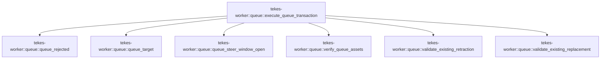

# tekes-worker::queue

[Package atlas](index.md) · [Source](../../src/queue.rs)

## Declarations

Visibility is the declaration spelling; trait members and reexports require their enclosing interface. `cfg` is not evaluated.

| Symbol | Kind | Visibility | Test / cfg |
|---|---|---|---|
| [tekes-worker::queue::QueueTarget](../../src/queue.rs#L4) | struct_item | `private` |  |
| [tekes-worker::queue::execute_queue_transaction](../../src/queue.rs#L10) | function_item | `pub(crate)` |  |
| [tekes-worker::queue::queue_rejected](../../src/queue.rs#L161) | function_item | `private` |  |
| [tekes-worker::queue::queue_target](../../src/queue.rs#L172) | function_item | `private` |  |
| [tekes-worker::queue::queue_steer_window_open](../../src/queue.rs#L266) | function_item | `private` |  |
| [tekes-worker::queue::verify_queue_assets](../../src/queue.rs#L275) | function_item | `private` |  |
| [tekes-worker::queue::validate_existing_retraction](../../src/queue.rs#L291) | function_item | `private` |  |
| [tekes-worker::queue::validate_existing_replacement](../../src/queue.rs#L310) | function_item | `private` |  |

## Imports / reexports

| Local name | Source path | Visibility |
|---|---|---|
| `*` | `super::*` | `private` |

## Module declarations

| Module | Visibility | Attributes |
|---|---|---|

## Function call graphs

Edges below are syntactically resolved calls only, including private functions. Graphs partition callers into groups of 20; they are not execution order. All unresolved sites are listed below and in the JSON inventory.

Functions 1–7: 6 direct edges

## Call sites

Includes test functions (marked in declarations). Receiver-type-required sites need type analysis/manual tracing. Calls in closures are attributed to their enclosing function; their occurrence here does not mean the closure executes immediately.

| Caller | Callee expression | Source lines | Target / classification |
|---|---|---|---|
| `execute_queue_transaction` | `transaction.validate` | [15](../../src/queue.rs#L15) | receiver-type-required |
| `execute_queue_transaction` | `ledger         .projection()         .ok_or` | [16](../../src/queue.rs#L16) | receiver-type-required |
| `execute_queue_transaction` | `ledger         .projection` | [16](../../src/queue.rs#L16) | receiver-type-required |
| `execute_queue_transaction` | `projection         .origin_tuples         .get(&transaction.retract_origin)         .copied` | [19](../../src/queue.rs#L19) | receiver-type-required |
| `execute_queue_transaction` | `projection         .origin_tuples         .get` | [19](../../src/queue.rs#L19) | receiver-type-required |
| `execute_queue_transaction` | `transaction         .replacement_origin()         .and_then(&#124;origin&#124; projection.origin_tuples.get(origin))         .copied` | [23](../../src/queue.rs#L23) | receiver-type-required |
| `execute_queue_transaction` | `transaction         .replacement_origin()         .and_then` | [23](../../src/queue.rs#L23) | receiver-type-required |
| `execute_queue_transaction` | `transaction         .replacement_origin` | [23](../../src/queue.rs#L23) | receiver-type-required |
| `execute_queue_transaction` | `projection.origin_tuples.get` | [25](../../src/queue.rs#L25) | receiver-type-required |
| `execute_queue_transaction` | `replacement_seq.is_some` | [27](../../src/queue.rs#L27) | receiver-type-required |
| `execute_queue_transaction` | `retract_seq.is_none` | [27](../../src/queue.rs#L27), [36](../../src/queue.rs#L36) | receiver-type-required |
| `execute_queue_transaction` | `Err` | [28](../../src/queue.rs#L28), [44](../../src/queue.rs#L44), [55](../../src/queue.rs#L55), [75](../../src/queue.rs#L75), [91](../../src/queue.rs#L91) | external-constructor-callback-or-unresolved |
| `execute_queue_transaction` | `StoreError::Corruption(             "queue transaction replacement exists without its retraction".to_owned(),         )         .into` | [28](../../src/queue.rs#L28) | receiver-type-required |
| `execute_queue_transaction` | `StoreError::Corruption` | [28](../../src/queue.rs#L28), [44](../../src/queue.rs#L44), [55](../../src/queue.rs#L55), [75](../../src/queue.rs#L75), [91](../../src/queue.rs#L91) | external-constructor-callback-or-unresolved |
| `execute_queue_transaction` | `"queue transaction replacement exists without its retraction".to_owned` | [29](../../src/queue.rs#L29) | receiver-type-required |
| `execute_queue_transaction` | `queue_target` | [34](../../src/queue.rs#L34) | [tekes-worker::queue::queue_target](../../src/queue.rs#L172) |
| `execute_queue_transaction` | `retract_seq.is_some` | [34](../../src/queue.rs#L34), [54](../../src/queue.rs#L54), [90](../../src/queue.rs#L90), [111](../../src/queue.rs#L111) | receiver-type-required |
| `execute_queue_transaction` | `Ok` | [37](../../src/queue.rs#L37), [60](../../src/queue.rs#L60), [96](../../src/queue.rs#L96), [151](../../src/queue.rs#L151) | external-constructor-callback-or-unresolved |
| `execute_queue_transaction` | `queue_rejected` | [37](../../src/queue.rs#L37), [60](../../src/queue.rs#L60), [96](../../src/queue.rs#L96) | [tekes-worker::queue::queue_rejected](../../src/queue.rs#L161) |
| `execute_queue_transaction` | `StoreError::Corruption(                 "durable queue retraction no longer has a validator-checkable target".to_owned(),             )             .into` | [44](../../src/queue.rs#L44) | receiver-type-required |
| `execute_queue_transaction` | `"durable queue retraction no longer has a validator-checkable target".to_owned` | [45](../../src/queue.rs#L45) | receiver-type-required |
| `execute_queue_transaction` | `queue_steer_window_open` | [52](../../src/queue.rs#L52) | [tekes-worker::queue::queue_steer_window_open](../../src/queue.rs#L266) |
| `execute_queue_transaction` | `StoreError::Corruption(                 "durable queue retraction belongs to an invalid steer transaction".to_owned(),             )             .into` | [55](../../src/queue.rs#L55) | receiver-type-required |
| `execute_queue_transaction` | `"durable queue retraction belongs to an invalid steer transaction".to_owned` | [56](../../src/queue.rs#L56) | receiver-type-required |
| `execute_queue_transaction` | `StoreError::Corruption(                     "queue edit steer bit does not match its target".to_owned(),                 )                 .into` | [75](../../src/queue.rs#L75) | receiver-type-required |
| `execute_queue_transaction` | `"queue edit steer bit does not match its target".to_owned` | [76](../../src/queue.rs#L76) | receiver-type-required |
| `execute_queue_transaction` | `Some` | [80](../../src/queue.rs#L80), [84](../../src/queue.rs#L84), [99](../../src/queue.rs#L99) | external-constructor-callback-or-unresolved |
| `execute_queue_transaction` | `content.clone` | [80](../../src/queue.rs#L80) | receiver-type-required |
| `execute_queue_transaction` | `assets.clone` | [80](../../src/queue.rs#L80) | receiver-type-required |
| `execute_queue_transaction` | `target.content.clone` | [84](../../src/queue.rs#L84) | receiver-type-required |
| `execute_queue_transaction` | `target.assets.clone` | [84](../../src/queue.rs#L84) | receiver-type-required |
| `execute_queue_transaction` | `verify_queue_assets` | [89](../../src/queue.rs#L89) | [tekes-worker::queue::verify_queue_assets](../../src/queue.rs#L275) |
| `execute_queue_transaction` | `assets.as_deref().unwrap_or_default` | [89](../../src/queue.rs#L89) | receiver-type-required |
| `execute_queue_transaction` | `assets.as_deref` | [89](../../src/queue.rs#L89) | receiver-type-required |
| `execute_queue_transaction` | `StoreError::Corruption(format!(                     "queue replacement asset became invalid after retraction: {error}"                 ))                 .into` | [91](../../src/queue.rs#L91) | receiver-type-required |
| `execute_queue_transaction` | `"CORRUPT".to_owned` | [99](../../src/queue.rs#L99) | receiver-type-required |
| `execute_queue_transaction` | `validate_existing_retraction` | [105](../../src/queue.rs#L105) | [tekes-worker::queue::validate_existing_retraction](../../src/queue.rs#L291) |
| `execute_queue_transaction` | `replacement.as_ref` | [107](../../src/queue.rs#L107) | receiver-type-required |
| `execute_queue_transaction` | `validate_existing_replacement` | [108](../../src/queue.rs#L108) | [tekes-worker::queue::validate_existing_replacement](../../src/queue.rs#L310) |
| `execute_queue_transaction` | `ledger.next_seq` | [115](../../src/queue.rs#L115), [135](../../src/queue.rs#L135) | receiver-type-required |
| `execute_queue_transaction` | `origin_event` | [116](../../src/queue.rs#L116), [136](../../src/queue.rs#L136) | external-constructor-callback-or-unresolved |
| `execute_queue_transaction` | `object.insert` | [117](../../src/queue.rs#L117), [137](../../src/queue.rs#L137), [138](../../src/queue.rs#L138), [140](../../src/queue.rs#L140) | receiver-type-required |
| `execute_queue_transaction` | `"supersedes".to_owned` | [118](../../src/queue.rs#L118) | receiver-type-required |
| `execute_queue_transaction` | `ledger.append_contract` | [121](../../src/queue.rs#L121), [142](../../src/queue.rs#L142) | receiver-type-required |
| `execute_queue_transaction` | `make_event` | [122](../../src/queue.rs#L122), [143](../../src/queue.rs#L143) | external-constructor-callback-or-unresolved |
| `execute_queue_transaction` | `Value::Object` | [122](../../src/queue.rs#L122), [143](../../src/queue.rs#L143) | external-constructor-callback-or-unresolved |
| `execute_queue_transaction` | `BarrierContext::default` | [123](../../src/queue.rs#L123), [144](../../src/queue.rs#L144) | external-constructor-callback-or-unresolved |
| `execute_queue_transaction` | `transaction                 .replacement_origin()                 .expect` | [132](../../src/queue.rs#L132) | receiver-type-required |
| `execute_queue_transaction` | `transaction                 .replacement_origin` | [132](../../src/queue.rs#L132) | receiver-type-required |
| `execute_queue_transaction` | `"content".to_owned` | [137](../../src/queue.rs#L137) | receiver-type-required |
| `execute_queue_transaction` | `serde_json::to_value` | [137](../../src/queue.rs#L137), [140](../../src/queue.rs#L140) | external-constructor-callback-or-unresolved |
| `execute_queue_transaction` | `"steer".to_owned` | [138](../../src/queue.rs#L138) | receiver-type-required |
| `execute_queue_transaction` | `Value::Bool` | [138](../../src/queue.rs#L138) | external-constructor-callback-or-unresolved |
| `execute_queue_transaction` | `"assets".to_owned` | [140](../../src/queue.rs#L140) | receiver-type-required |
| `execute_queue_transaction` | `transaction.delivery.clone` | [152](../../src/queue.rs#L152) | receiver-type-required |
| `queue_rejected` | `transaction.delivery.clone` | [167](../../src/queue.rs#L167) | receiver-type-required |
| `queue_target` | `ledger         .projection()         .ok_or` | [177](../../src/queue.rs#L177) | receiver-type-required |
| `queue_target` | `ledger         .projection` | [177](../../src/queue.rs#L177) | receiver-type-required |
| `queue_target` | `projection         .events         .iter()         .find` | [180](../../src/queue.rs#L180) | receiver-type-required |
| `queue_target` | `projection         .events         .iter` | [180](../../src/queue.rs#L180) | receiver-type-required |
| `queue_target` | `event.seq` | [183](../../src/queue.rs#L183) | receiver-type-required |
| `queue_target` | `Ok` | [185](../../src/queue.rs#L185), [188](../../src/queue.rs#L188), [220](../../src/queue.rs#L220), [244](../../src/queue.rs#L244), [259](../../src/queue.rs#L259) | external-constructor-callback-or-unresolved |
| `queue_target` | `event.string_field` | [187](../../src/queue.rs#L187) | receiver-type-required |
| `queue_target` | `Some` | [187](../../src/queue.rs#L187), [195](../../src/queue.rs#L195), [204](../../src/queue.rs#L204), [207](../../src/queue.rs#L207), [213](../../src/queue.rs#L213), [215](../../src/queue.rs#L215), [224](../../src/queue.rs#L224), [228](../../src/queue.rs#L228), [238](../../src/queue.rs#L238), [239](../../src/queue.rs#L239), [259](../../src/queue.rs#L259) | external-constructor-callback-or-unresolved |
| `queue_target` | `projection.events.iter().any` | [191](../../src/queue.rs#L191), [223](../../src/queue.rs#L223) | receiver-type-required |
| `queue_target` | `projection.events.iter` | [191](../../src/queue.rs#L191), [223](../../src/queue.rs#L223) | receiver-type-required |
| `queue_target` | `event_json` | [192](../../src/queue.rs#L192), [232](../../src/queue.rs#L232), [247](../../src/queue.rs#L247) | external-constructor-callback-or-unresolved |
| `queue_target` | `candidate.string_field` | [195](../../src/queue.rs#L195), [207](../../src/queue.rs#L207), [224](../../src/queue.rs#L224) | receiver-type-required |
| `queue_target` | `value                 .get("trigger")                 .and_then(Value::as_object)                 .and_then(&#124;trigger&#124; trigger.get("inputs"))                 .and_then(Value::as_array)                 .is_some_and` | [196](../../src/queue.rs#L196) | receiver-type-required |
| `queue_target` | `value                 .get("trigger")                 .and_then(Value::as_object)                 .and_then(&#124;trigger&#124; trigger.get("inputs"))                 .and_then` | [196](../../src/queue.rs#L196) | receiver-type-required |
| `queue_target` | `value                 .get("trigger")                 .and_then(Value::as_object)                 .and_then` | [196](../../src/queue.rs#L196) | receiver-type-required |
| `queue_target` | `value                 .get("trigger")                 .and_then` | [196](../../src/queue.rs#L196) | receiver-type-required |
| `queue_target` | `value                 .get` | [196](../../src/queue.rs#L196), [208](../../src/queue.rs#L208) | receiver-type-required |
| `queue_target` | `trigger.get` | [199](../../src/queue.rs#L199) | receiver-type-required |
| `queue_target` | `inputs                         .iter()                         .any` | [202](../../src/queue.rs#L202) | receiver-type-required |
| `queue_target` | `inputs                         .iter` | [202](../../src/queue.rs#L202) | receiver-type-required |
| `queue_target` | `seq.as_u64` | [204](../../src/queue.rs#L204) | receiver-type-required |
| `queue_target` | `value                 .get("admits")                 .and_then(Value::as_array)                 .is_some_and` | [208](../../src/queue.rs#L208) | receiver-type-required |
| `queue_target` | `value                 .get("admits")                 .and_then` | [208](../../src/queue.rs#L208) | receiver-type-required |
| `queue_target` | `ranges.iter().any` | [212](../../src/queue.rs#L212), [237](../../src/queue.rs#L237) | receiver-type-required |
| `queue_target` | `ranges.iter` | [212](../../src/queue.rs#L212), [237](../../src/queue.rs#L237) | receiver-type-required |
| `queue_target` | `range.get("from").and_then` | [213](../../src/queue.rs#L213), [238](../../src/queue.rs#L238) | receiver-type-required |
| `queue_target` | `range.get` | [213](../../src/queue.rs#L213), [214](../../src/queue.rs#L214), [238](../../src/queue.rs#L238), [239](../../src/queue.rs#L239) | receiver-type-required |
| `queue_target` | `range.get("to").and_then` | [214](../../src/queue.rs#L214), [239](../../src/queue.rs#L239) | receiver-type-required |
| `queue_target` | `candidate.origin_tuple().ok().flatten().as_ref` | [228](../../src/queue.rs#L228) | receiver-type-required |
| `queue_target` | `candidate.origin_tuple().ok().flatten` | [228](../../src/queue.rs#L228) | receiver-type-required |
| `queue_target` | `candidate.origin_tuple().ok` | [228](../../src/queue.rs#L228) | receiver-type-required |
| `queue_target` | `candidate.origin_tuple` | [228](../../src/queue.rs#L228) | receiver-type-required |
| `queue_target` | `event_json(candidate)             .ok()             .and_then(&#124;value&#124; value.get("supersedes").cloned())             .and_then(&#124;value&#124; value.as_array().cloned())             .is_some_and` | [232](../../src/queue.rs#L232) | receiver-type-required |
| `queue_target` | `event_json(candidate)             .ok()             .and_then(&#124;value&#124; value.get("supersedes").cloned())             .and_then` | [232](../../src/queue.rs#L232) | receiver-type-required |
| `queue_target` | `event_json(candidate)             .ok()             .and_then` | [232](../../src/queue.rs#L232) | receiver-type-required |
| `queue_target` | `event_json(candidate)             .ok` | [232](../../src/queue.rs#L232) | receiver-type-required |
| `queue_target` | `value.get("supersedes").cloned` | [234](../../src/queue.rs#L234) | receiver-type-required |
| `queue_target` | `value.get` | [234](../../src/queue.rs#L234), [261](../../src/queue.rs#L261) | receiver-type-required |
| `queue_target` | `value.as_array().cloned` | [235](../../src/queue.rs#L235) | receiver-type-required |
| `queue_target` | `value.as_array` | [235](../../src/queue.rs#L235) | receiver-type-required |
| `queue_target` | `serde_json::from_value` | [248](../../src/queue.rs#L248) | external-constructor-callback-or-unresolved |
| `queue_target` | `value             .get("content")             .cloned()             .ok_or` | [249](../../src/queue.rs#L249) | receiver-type-required |
| `queue_target` | `value             .get("content")             .cloned` | [249](../../src/queue.rs#L249) | receiver-type-required |
| `queue_target` | `value             .get` | [249](../../src/queue.rs#L249) | receiver-type-required |
| `queue_target` | `value         .get("assets")         .cloned()         .map(serde_json::from_value)         .transpose` | [254](../../src/queue.rs#L254) | receiver-type-required |
| `queue_target` | `value         .get("assets")         .cloned()         .map` | [254](../../src/queue.rs#L254) | receiver-type-required |
| `queue_target` | `value         .get("assets")         .cloned` | [254](../../src/queue.rs#L254) | receiver-type-required |
| `queue_target` | `value         .get` | [254](../../src/queue.rs#L254) | receiver-type-required |
| `queue_target` | `value.get("steer").and_then(Value::as_bool).unwrap_or` | [261](../../src/queue.rs#L261) | receiver-type-required |
| `queue_target` | `value.get("steer").and_then` | [261](../../src/queue.rs#L261) | receiver-type-required |
| `queue_steer_window_open` | `ledger.projection().is_some_and` | [267](../../src/queue.rs#L267) | receiver-type-required |
| `queue_steer_window_open` | `ledger.projection` | [267](../../src/queue.rs#L267) | receiver-type-required |
| `queue_steer_window_open` | `projection.latest_turn.is_some` | [268](../../src/queue.rs#L268) | receiver-type-required |
| `verify_queue_assets` | `ledger         .path()         .parent()         .ok_or_else(&#124;&#124; StoreError::Corruption("ledger has no thread folder".to_owned()))?         .join` | [279](../../src/queue.rs#L279) | receiver-type-required |
| `verify_queue_assets` | `ledger         .path()         .parent()         .ok_or_else` | [279](../../src/queue.rs#L279) | receiver-type-required |
| `verify_queue_assets` | `ledger         .path()         .parent` | [279](../../src/queue.rs#L279) | receiver-type-required |
| `verify_queue_assets` | `ledger         .path` | [279](../../src/queue.rs#L279) | receiver-type-required |
| `verify_queue_assets` | `StoreError::Corruption` | [282](../../src/queue.rs#L282) | external-constructor-callback-or-unresolved |
| `verify_queue_assets` | `"ledger has no thread folder".to_owned` | [282](../../src/queue.rs#L282) | receiver-type-required |
| `verify_queue_assets` | `AssetStore::new` | [284](../../src/queue.rs#L284) | external-constructor-callback-or-unresolved |
| `verify_queue_assets` | `store.verify_named` | [286](../../src/queue.rs#L286) | receiver-type-required |
| `verify_queue_assets` | `Ok` | [288](../../src/queue.rs#L288) | external-constructor-callback-or-unresolved |
| `validate_existing_retraction` | `event_at` | [296](../../src/queue.rs#L296) | external-constructor-callback-or-unresolved |
| `validate_existing_retraction` | `event_json(event).map_err` | [297](../../src/queue.rs#L297) | receiver-type-required |
| `validate_existing_retraction` | `event_json` | [297](../../src/queue.rs#L297) | external-constructor-callback-or-unresolved |
| `validate_existing_retraction` | `StoreError::Corruption` | [297](../../src/queue.rs#L297), [303](../../src/queue.rs#L303) | external-constructor-callback-or-unresolved |
| `validate_existing_retraction` | `error.to_string` | [297](../../src/queue.rs#L297) | receiver-type-required |
| `validate_existing_retraction` | `event.string_field` | [299](../../src/queue.rs#L299) | receiver-type-required |
| `validate_existing_retraction` | `Some` | [299](../../src/queue.rs#L299), [300](../../src/queue.rs#L300), [301](../../src/queue.rs#L301) | external-constructor-callback-or-unresolved |
| `validate_existing_retraction` | `event.origin_tuple` | [300](../../src/queue.rs#L300) | receiver-type-required |
| `validate_existing_retraction` | `transaction.retract_origin.clone` | [300](../../src/queue.rs#L300) | receiver-type-required |
| `validate_existing_retraction` | `value.get` | [301](../../src/queue.rs#L301) | receiver-type-required |
| `validate_existing_retraction` | `Err` | [303](../../src/queue.rs#L303) | external-constructor-callback-or-unresolved |
| `validate_existing_retraction` | `"queue transaction retraction origin resolves to mismatched bytes".to_owned` | [304](../../src/queue.rs#L304) | receiver-type-required |
| `validate_existing_retraction` | `Ok` | [307](../../src/queue.rs#L307) | external-constructor-callback-or-unresolved |
| `validate_existing_replacement` | `event_at` | [320](../../src/queue.rs#L320) | external-constructor-callback-or-unresolved |
| `validate_existing_replacement` | `event_json(event).map_err` | [321](../../src/queue.rs#L321) | receiver-type-required |
| `validate_existing_replacement` | `event_json` | [321](../../src/queue.rs#L321) | external-constructor-callback-or-unresolved |
| `validate_existing_replacement` | `StoreError::Corruption` | [321](../../src/queue.rs#L321), [323](../../src/queue.rs#L323), [329](../../src/queue.rs#L329), [336](../../src/queue.rs#L336) | external-constructor-callback-or-unresolved |
| `validate_existing_replacement` | `error.to_string` | [321](../../src/queue.rs#L321), [323](../../src/queue.rs#L323), [329](../../src/queue.rs#L329) | receiver-type-required |
| `validate_existing_replacement` | `serde_json::to_value(&replacement.0)         .map_err` | [322](../../src/queue.rs#L322) | receiver-type-required |
| `validate_existing_replacement` | `serde_json::to_value` | [322](../../src/queue.rs#L322) | external-constructor-callback-or-unresolved |
| `validate_existing_replacement` | `replacement         .2         .as_ref()         .map(serde_json::to_value)         .transpose()         .map_err` | [324](../../src/queue.rs#L324) | receiver-type-required |
| `validate_existing_replacement` | `replacement         .2         .as_ref()         .map(serde_json::to_value)         .transpose` | [324](../../src/queue.rs#L324) | receiver-type-required |
| `validate_existing_replacement` | `replacement         .2         .as_ref()         .map` | [324](../../src/queue.rs#L324) | receiver-type-required |
| `validate_existing_replacement` | `replacement         .2         .as_ref` | [324](../../src/queue.rs#L324) | receiver-type-required |
| `validate_existing_replacement` | `event.string_field` | [330](../../src/queue.rs#L330) | receiver-type-required |
| `validate_existing_replacement` | `Some` | [330](../../src/queue.rs#L330), [332](../../src/queue.rs#L332), [333](../../src/queue.rs#L333) | external-constructor-callback-or-unresolved |
| `validate_existing_replacement` | `event.origin_tuple` | [331](../../src/queue.rs#L331) | receiver-type-required |
| `validate_existing_replacement` | `transaction.replacement_origin().cloned` | [331](../../src/queue.rs#L331) | receiver-type-required |
| `validate_existing_replacement` | `transaction.replacement_origin` | [331](../../src/queue.rs#L331) | receiver-type-required |
| `validate_existing_replacement` | `value.get` | [332](../../src/queue.rs#L332), [333](../../src/queue.rs#L333), [334](../../src/queue.rs#L334) | receiver-type-required |
| `validate_existing_replacement` | `value.get("steer").and_then` | [333](../../src/queue.rs#L333) | receiver-type-required |
| `validate_existing_replacement` | `assets.as_ref` | [334](../../src/queue.rs#L334) | receiver-type-required |
| `validate_existing_replacement` | `Err` | [336](../../src/queue.rs#L336) | external-constructor-callback-or-unresolved |
| `validate_existing_replacement` | `"queue transaction replacement origin resolves to mismatched bytes".to_owned` | [337](../../src/queue.rs#L337) | receiver-type-required |
| `validate_existing_replacement` | `Ok` | [340](../../src/queue.rs#L340) | external-constructor-callback-or-unresolved |
