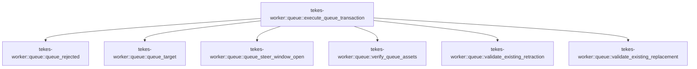

# tekes-worker::queue

[Package atlas](index.md) · [Source](../../src/queue.rs)

## Declarations

Visibility is the declaration spelling; trait members and reexports require their enclosing interface. `cfg` is not evaluated.

| Symbol | Kind | Visibility | Test / cfg |
|---|---|---|---|
| [tekes-worker::queue::QueueTarget](../../src/queue.rs#L4) | struct_item | `private` |  |
| [tekes-worker::queue::execute_queue_transaction](../../src/queue.rs#L11) | function_item | `pub(crate)` |  |
| [tekes-worker::queue::queue_rejected](../../src/queue.rs#L175) | function_item | `private` |  |
| [tekes-worker::queue::queue_target](../../src/queue.rs#L186) | function_item | `private` |  |
| [tekes-worker::queue::queue_steer_window_open](../../src/queue.rs#L281) | function_item | `private` |  |
| [tekes-worker::queue::verify_queue_assets](../../src/queue.rs#L287) | function_item | `private` |  |
| [tekes-worker::queue::validate_existing_retraction](../../src/queue.rs#L303) | function_item | `private` |  |
| [tekes-worker::queue::validate_existing_replacement](../../src/queue.rs#L322) | function_item | `private` |  |

## Imports / reexports

| Local name | Source path | Visibility |
|---|---|---|
| `*` | `super::*` | `private` |

## Module declarations

| Module | Visibility | Attributes |
|---|---|---|

## Function call graphs

Edges below are syntactically resolved calls only, including private functions. Graphs partition callers into groups of 20; they are not execution order. All unresolved sites are listed below and in the JSON inventory.

Functions 1–7: 6 direct edges

```mermaid
flowchart TD
  n0["tekes-worker::queue::execute_queue_transaction"]
  n1["tekes-worker::queue::queue_rejected"]
  n2["tekes-worker::queue::queue_target"]
  n3["tekes-worker::queue::queue_steer_window_open"]
  n4["tekes-worker::queue::verify_queue_assets"]
  n5["tekes-worker::queue::validate_existing_retraction"]
  n6["tekes-worker::queue::validate_existing_replacement"]
  n0 --> n1
  n0 --> n2
  n0 --> n3
  n0 --> n4
  n0 --> n5
  n0 --> n6
```

## Call sites

Includes test functions (marked in declarations). Receiver-type-required sites need type analysis/manual tracing. Calls in closures are attributed to their enclosing function; their occurrence here does not mean the closure executes immediately.

| Caller | Callee expression | Source lines | Target / classification |
|---|---|---|---|
| `execute_queue_transaction` | `transaction.validate` | [16](../../src/queue.rs#L16) | receiver-type-required |
| `execute_queue_transaction` | `ledger         .projection()         .ok_or` | [17](../../src/queue.rs#L17) | receiver-type-required |
| `execute_queue_transaction` | `ledger         .projection` | [17](../../src/queue.rs#L17) | receiver-type-required |
| `execute_queue_transaction` | `projection         .origin_tuples         .get(&transaction.retract_origin)         .copied` | [20](../../src/queue.rs#L20) | receiver-type-required |
| `execute_queue_transaction` | `projection         .origin_tuples         .get` | [20](../../src/queue.rs#L20) | receiver-type-required |
| `execute_queue_transaction` | `transaction         .replacement_origin()         .and_then(&#124;origin&#124; projection.origin_tuples.get(origin))         .copied` | [24](../../src/queue.rs#L24) | receiver-type-required |
| `execute_queue_transaction` | `transaction         .replacement_origin()         .and_then` | [24](../../src/queue.rs#L24) | receiver-type-required |
| `execute_queue_transaction` | `transaction         .replacement_origin` | [24](../../src/queue.rs#L24) | receiver-type-required |
| `execute_queue_transaction` | `projection.origin_tuples.get` | [26](../../src/queue.rs#L26) | receiver-type-required |
| `execute_queue_transaction` | `replacement_seq.is_some` | [28](../../src/queue.rs#L28) | receiver-type-required |
| `execute_queue_transaction` | `retract_seq.is_none` | [28](../../src/queue.rs#L28), [37](../../src/queue.rs#L37) | receiver-type-required |
| `execute_queue_transaction` | `Err` | [29](../../src/queue.rs#L29), [45](../../src/queue.rs#L45), [56](../../src/queue.rs#L56), [76](../../src/queue.rs#L76), [101](../../src/queue.rs#L101) | external-constructor-callback-or-unresolved |
| `execute_queue_transaction` | `StoreError::Corruption(             "queue transaction replacement exists without its retraction".to_owned(),         )         .into` | [29](../../src/queue.rs#L29) | receiver-type-required |
| `execute_queue_transaction` | `StoreError::Corruption` | [29](../../src/queue.rs#L29), [45](../../src/queue.rs#L45), [56](../../src/queue.rs#L56), [76](../../src/queue.rs#L76), [101](../../src/queue.rs#L101) | external-constructor-callback-or-unresolved |
| `execute_queue_transaction` | `"queue transaction replacement exists without its retraction".to_owned` | [30](../../src/queue.rs#L30) | receiver-type-required |
| `execute_queue_transaction` | `queue_target` | [35](../../src/queue.rs#L35) | [tekes-worker::queue::queue_target](../../src/queue.rs#L186) |
| `execute_queue_transaction` | `retract_seq.is_some` | [35](../../src/queue.rs#L35), [55](../../src/queue.rs#L55), [100](../../src/queue.rs#L100), [120](../../src/queue.rs#L120) | receiver-type-required |
| `execute_queue_transaction` | `Ok` | [38](../../src/queue.rs#L38), [61](../../src/queue.rs#L61), [106](../../src/queue.rs#L106), [165](../../src/queue.rs#L165) | external-constructor-callback-or-unresolved |
| `execute_queue_transaction` | `queue_rejected` | [38](../../src/queue.rs#L38), [61](../../src/queue.rs#L61), [106](../../src/queue.rs#L106) | [tekes-worker::queue::queue_rejected](../../src/queue.rs#L175) |
| `execute_queue_transaction` | `StoreError::Corruption(                 "durable queue retraction no longer has a validator-checkable target".to_owned(),             )             .into` | [45](../../src/queue.rs#L45) | receiver-type-required |
| `execute_queue_transaction` | `"durable queue retraction no longer has a validator-checkable target".to_owned` | [46](../../src/queue.rs#L46) | receiver-type-required |
| `execute_queue_transaction` | `queue_steer_window_open` | [53](../../src/queue.rs#L53) | [tekes-worker::queue::queue_steer_window_open](../../src/queue.rs#L281) |
| `execute_queue_transaction` | `StoreError::Corruption(                 "durable queue retraction belongs to an invalid steer transaction".to_owned(),             )             .into` | [56](../../src/queue.rs#L56) | receiver-type-required |
| `execute_queue_transaction` | `"durable queue retraction belongs to an invalid steer transaction".to_owned` | [57](../../src/queue.rs#L57) | receiver-type-required |
| `execute_queue_transaction` | `StoreError::Corruption(                     "queue edit steer bit does not match its target".to_owned(),                 )                 .into` | [76](../../src/queue.rs#L76) | receiver-type-required |
| `execute_queue_transaction` | `"queue edit steer bit does not match its target".to_owned` | [77](../../src/queue.rs#L77) | receiver-type-required |
| `execute_queue_transaction` | `Some` | [81](../../src/queue.rs#L81), [89](../../src/queue.rs#L89), [109](../../src/queue.rs#L109) | external-constructor-callback-or-unresolved |
| `execute_queue_transaction` | `content.clone` | [82](../../src/queue.rs#L82) | receiver-type-required |
| `execute_queue_transaction` | `assets.clone` | [84](../../src/queue.rs#L84) | receiver-type-required |
| `execute_queue_transaction` | `target.submission.clone` | [85](../../src/queue.rs#L85), [93](../../src/queue.rs#L93) | receiver-type-required |
| `execute_queue_transaction` | `target.content.clone` | [90](../../src/queue.rs#L90) | receiver-type-required |
| `execute_queue_transaction` | `target.assets.clone` | [92](../../src/queue.rs#L92) | receiver-type-required |
| `execute_queue_transaction` | `verify_queue_assets` | [98](../../src/queue.rs#L98) | [tekes-worker::queue::verify_queue_assets](../../src/queue.rs#L287) |
| `execute_queue_transaction` | `assets.as_deref().unwrap_or_default` | [98](../../src/queue.rs#L98) | receiver-type-required |
| `execute_queue_transaction` | `assets.as_deref` | [98](../../src/queue.rs#L98) | receiver-type-required |
| `execute_queue_transaction` | `StoreError::Corruption(format!(                 "queue replacement asset became invalid after retraction: {error}"             ))             .into` | [101](../../src/queue.rs#L101) | receiver-type-required |
| `execute_queue_transaction` | `"CORRUPT".to_owned` | [109](../../src/queue.rs#L109) | receiver-type-required |
| `execute_queue_transaction` | `validate_existing_retraction` | [114](../../src/queue.rs#L114) | [tekes-worker::queue::validate_existing_retraction](../../src/queue.rs#L303) |
| `execute_queue_transaction` | `replacement.as_ref` | [116](../../src/queue.rs#L116) | receiver-type-required |
| `execute_queue_transaction` | `validate_existing_replacement` | [117](../../src/queue.rs#L117) | [tekes-worker::queue::validate_existing_replacement](../../src/queue.rs#L322) |
| `execute_queue_transaction` | `ledger.next_seq` | [124](../../src/queue.rs#L124), [144](../../src/queue.rs#L144) | receiver-type-required |
| `execute_queue_transaction` | `origin_event` | [125](../../src/queue.rs#L125), [145](../../src/queue.rs#L145) | external-constructor-callback-or-unresolved |
| `execute_queue_transaction` | `object.insert` | [126](../../src/queue.rs#L126), [146](../../src/queue.rs#L146), [147](../../src/queue.rs#L147), [149](../../src/queue.rs#L149), [152](../../src/queue.rs#L152) | receiver-type-required |
| `execute_queue_transaction` | `"supersedes".to_owned` | [127](../../src/queue.rs#L127) | receiver-type-required |
| `execute_queue_transaction` | `ledger.append_contract` | [130](../../src/queue.rs#L130), [154](../../src/queue.rs#L154) | receiver-type-required |
| `execute_queue_transaction` | `make_event` | [131](../../src/queue.rs#L131), [155](../../src/queue.rs#L155) | external-constructor-callback-or-unresolved |
| `execute_queue_transaction` | `Value::Object` | [131](../../src/queue.rs#L131), [155](../../src/queue.rs#L155) | external-constructor-callback-or-unresolved |
| `execute_queue_transaction` | `BarrierContext::default` | [132](../../src/queue.rs#L132), [156](../../src/queue.rs#L156) | external-constructor-callback-or-unresolved |
| `execute_queue_transaction` | `transaction                 .replacement_origin()                 .expect` | [141](../../src/queue.rs#L141) | receiver-type-required |
| `execute_queue_transaction` | `transaction                 .replacement_origin` | [141](../../src/queue.rs#L141) | receiver-type-required |
| `execute_queue_transaction` | `"content".to_owned` | [146](../../src/queue.rs#L146) | receiver-type-required |
| `execute_queue_transaction` | `serde_json::to_value` | [146](../../src/queue.rs#L146), [149](../../src/queue.rs#L149) | external-constructor-callback-or-unresolved |
| `execute_queue_transaction` | `"steer".to_owned` | [147](../../src/queue.rs#L147) | receiver-type-required |
| `execute_queue_transaction` | `Value::Bool` | [147](../../src/queue.rs#L147) | external-constructor-callback-or-unresolved |
| `execute_queue_transaction` | `"assets".to_owned` | [149](../../src/queue.rs#L149) | receiver-type-required |
| `execute_queue_transaction` | `"submission".to_owned` | [152](../../src/queue.rs#L152) | receiver-type-required |
| `execute_queue_transaction` | `ledger.ensure_synced_through` | [163](../../src/queue.rs#L163) | receiver-type-required |
| `execute_queue_transaction` | `transaction.delivery.clone` | [166](../../src/queue.rs#L166) | receiver-type-required |
| `queue_rejected` | `transaction.delivery.clone` | [181](../../src/queue.rs#L181) | receiver-type-required |
| `queue_target` | `ledger         .projection()         .ok_or` | [191](../../src/queue.rs#L191) | receiver-type-required |
| `queue_target` | `ledger         .projection` | [191](../../src/queue.rs#L191) | receiver-type-required |
| `queue_target` | `projection         .events         .iter()         .find` | [194](../../src/queue.rs#L194) | receiver-type-required |
| `queue_target` | `projection         .events         .iter` | [194](../../src/queue.rs#L194) | receiver-type-required |
| `queue_target` | `event.seq` | [197](../../src/queue.rs#L197) | receiver-type-required |
| `queue_target` | `Ok` | [199](../../src/queue.rs#L199), [202](../../src/queue.rs#L202), [234](../../src/queue.rs#L234), [258](../../src/queue.rs#L258), [273](../../src/queue.rs#L273) | external-constructor-callback-or-unresolved |
| `queue_target` | `event.string_field` | [201](../../src/queue.rs#L201) | receiver-type-required |
| `queue_target` | `Some` | [201](../../src/queue.rs#L201), [209](../../src/queue.rs#L209), [218](../../src/queue.rs#L218), [221](../../src/queue.rs#L221), [227](../../src/queue.rs#L227), [229](../../src/queue.rs#L229), [238](../../src/queue.rs#L238), [242](../../src/queue.rs#L242), [252](../../src/queue.rs#L252), [253](../../src/queue.rs#L253), [273](../../src/queue.rs#L273) | external-constructor-callback-or-unresolved |
| `queue_target` | `projection.events.iter().any` | [205](../../src/queue.rs#L205), [237](../../src/queue.rs#L237) | receiver-type-required |
| `queue_target` | `projection.events.iter` | [205](../../src/queue.rs#L205), [237](../../src/queue.rs#L237) | receiver-type-required |
| `queue_target` | `event_json` | [206](../../src/queue.rs#L206), [246](../../src/queue.rs#L246), [261](../../src/queue.rs#L261) | external-constructor-callback-or-unresolved |
| `queue_target` | `candidate.string_field` | [209](../../src/queue.rs#L209), [221](../../src/queue.rs#L221), [238](../../src/queue.rs#L238) | receiver-type-required |
| `queue_target` | `value                 .get("trigger")                 .and_then(Value::as_object)                 .and_then(&#124;trigger&#124; trigger.get("inputs"))                 .and_then(Value::as_array)                 .is_some_and` | [210](../../src/queue.rs#L210) | receiver-type-required |
| `queue_target` | `value                 .get("trigger")                 .and_then(Value::as_object)                 .and_then(&#124;trigger&#124; trigger.get("inputs"))                 .and_then` | [210](../../src/queue.rs#L210) | receiver-type-required |
| `queue_target` | `value                 .get("trigger")                 .and_then(Value::as_object)                 .and_then` | [210](../../src/queue.rs#L210) | receiver-type-required |
| `queue_target` | `value                 .get("trigger")                 .and_then` | [210](../../src/queue.rs#L210) | receiver-type-required |
| `queue_target` | `value                 .get` | [210](../../src/queue.rs#L210), [222](../../src/queue.rs#L222) | receiver-type-required |
| `queue_target` | `trigger.get` | [213](../../src/queue.rs#L213) | receiver-type-required |
| `queue_target` | `inputs                         .iter()                         .any` | [216](../../src/queue.rs#L216) | receiver-type-required |
| `queue_target` | `inputs                         .iter` | [216](../../src/queue.rs#L216) | receiver-type-required |
| `queue_target` | `seq.as_u64` | [218](../../src/queue.rs#L218) | receiver-type-required |
| `queue_target` | `value                 .get("admits")                 .and_then(Value::as_array)                 .is_some_and` | [222](../../src/queue.rs#L222) | receiver-type-required |
| `queue_target` | `value                 .get("admits")                 .and_then` | [222](../../src/queue.rs#L222) | receiver-type-required |
| `queue_target` | `ranges.iter().any` | [226](../../src/queue.rs#L226), [251](../../src/queue.rs#L251) | receiver-type-required |
| `queue_target` | `ranges.iter` | [226](../../src/queue.rs#L226), [251](../../src/queue.rs#L251) | receiver-type-required |
| `queue_target` | `range.get("from").and_then` | [227](../../src/queue.rs#L227), [252](../../src/queue.rs#L252) | receiver-type-required |
| `queue_target` | `range.get` | [227](../../src/queue.rs#L227), [228](../../src/queue.rs#L228), [252](../../src/queue.rs#L252), [253](../../src/queue.rs#L253) | receiver-type-required |
| `queue_target` | `range.get("to").and_then` | [228](../../src/queue.rs#L228), [253](../../src/queue.rs#L253) | receiver-type-required |
| `queue_target` | `candidate.origin_tuple().ok().flatten().as_ref` | [242](../../src/queue.rs#L242) | receiver-type-required |
| `queue_target` | `candidate.origin_tuple().ok().flatten` | [242](../../src/queue.rs#L242) | receiver-type-required |
| `queue_target` | `candidate.origin_tuple().ok` | [242](../../src/queue.rs#L242) | receiver-type-required |
| `queue_target` | `candidate.origin_tuple` | [242](../../src/queue.rs#L242) | receiver-type-required |
| `queue_target` | `event_json(candidate)             .ok()             .and_then(&#124;value&#124; value.get("supersedes").cloned())             .and_then(&#124;value&#124; value.as_array().cloned())             .is_some_and` | [246](../../src/queue.rs#L246) | receiver-type-required |
| `queue_target` | `event_json(candidate)             .ok()             .and_then(&#124;value&#124; value.get("supersedes").cloned())             .and_then` | [246](../../src/queue.rs#L246) | receiver-type-required |
| `queue_target` | `event_json(candidate)             .ok()             .and_then` | [246](../../src/queue.rs#L246) | receiver-type-required |
| `queue_target` | `event_json(candidate)             .ok` | [246](../../src/queue.rs#L246) | receiver-type-required |
| `queue_target` | `value.get("supersedes").cloned` | [248](../../src/queue.rs#L248) | receiver-type-required |
| `queue_target` | `value.get` | [248](../../src/queue.rs#L248), [275](../../src/queue.rs#L275), [277](../../src/queue.rs#L277) | receiver-type-required |
| `queue_target` | `value.as_array().cloned` | [249](../../src/queue.rs#L249) | receiver-type-required |
| `queue_target` | `value.as_array` | [249](../../src/queue.rs#L249) | receiver-type-required |
| `queue_target` | `serde_json::from_value` | [262](../../src/queue.rs#L262) | external-constructor-callback-or-unresolved |
| `queue_target` | `value             .get("content")             .cloned()             .ok_or` | [263](../../src/queue.rs#L263) | receiver-type-required |
| `queue_target` | `value             .get("content")             .cloned` | [263](../../src/queue.rs#L263) | receiver-type-required |
| `queue_target` | `value             .get` | [263](../../src/queue.rs#L263) | receiver-type-required |
| `queue_target` | `value         .get("assets")         .cloned()         .map(serde_json::from_value)         .transpose` | [268](../../src/queue.rs#L268) | receiver-type-required |
| `queue_target` | `value         .get("assets")         .cloned()         .map` | [268](../../src/queue.rs#L268) | receiver-type-required |
| `queue_target` | `value         .get("assets")         .cloned` | [268](../../src/queue.rs#L268) | receiver-type-required |
| `queue_target` | `value         .get` | [268](../../src/queue.rs#L268) | receiver-type-required |
| `queue_target` | `value.get("steer").and_then(Value::as_bool).unwrap_or` | [275](../../src/queue.rs#L275) | receiver-type-required |
| `queue_target` | `value.get("steer").and_then` | [275](../../src/queue.rs#L275) | receiver-type-required |
| `queue_target` | `value.get("submission").cloned` | [277](../../src/queue.rs#L277) | receiver-type-required |
| `queue_steer_window_open` | `ledger         .projection()         .is_some_and` | [282](../../src/queue.rs#L282) | receiver-type-required |
| `queue_steer_window_open` | `ledger         .projection` | [282](../../src/queue.rs#L282) | receiver-type-required |
| `queue_steer_window_open` | `projection.lifecycle.steer_window_open` | [284](../../src/queue.rs#L284) | receiver-type-required |
| `verify_queue_assets` | `ledger         .path()         .parent()         .ok_or_else(&#124;&#124; StoreError::Corruption("ledger has no thread folder".to_owned()))?         .join` | [291](../../src/queue.rs#L291) | receiver-type-required |
| `verify_queue_assets` | `ledger         .path()         .parent()         .ok_or_else` | [291](../../src/queue.rs#L291) | receiver-type-required |
| `verify_queue_assets` | `ledger         .path()         .parent` | [291](../../src/queue.rs#L291) | receiver-type-required |
| `verify_queue_assets` | `ledger         .path` | [291](../../src/queue.rs#L291) | receiver-type-required |
| `verify_queue_assets` | `StoreError::Corruption` | [294](../../src/queue.rs#L294) | external-constructor-callback-or-unresolved |
| `verify_queue_assets` | `"ledger has no thread folder".to_owned` | [294](../../src/queue.rs#L294) | receiver-type-required |
| `verify_queue_assets` | `AssetStore::new` | [296](../../src/queue.rs#L296) | external-constructor-callback-or-unresolved |
| `verify_queue_assets` | `store.verify_named` | [298](../../src/queue.rs#L298) | receiver-type-required |
| `verify_queue_assets` | `Ok` | [300](../../src/queue.rs#L300) | external-constructor-callback-or-unresolved |
| `validate_existing_retraction` | `event_at` | [308](../../src/queue.rs#L308) | external-constructor-callback-or-unresolved |
| `validate_existing_retraction` | `event_json(event).map_err` | [309](../../src/queue.rs#L309) | receiver-type-required |
| `validate_existing_retraction` | `event_json` | [309](../../src/queue.rs#L309) | external-constructor-callback-or-unresolved |
| `validate_existing_retraction` | `StoreError::Corruption` | [309](../../src/queue.rs#L309), [315](../../src/queue.rs#L315) | external-constructor-callback-or-unresolved |
| `validate_existing_retraction` | `error.to_string` | [309](../../src/queue.rs#L309) | receiver-type-required |
| `validate_existing_retraction` | `event.string_field` | [311](../../src/queue.rs#L311) | receiver-type-required |
| `validate_existing_retraction` | `Some` | [311](../../src/queue.rs#L311), [312](../../src/queue.rs#L312), [313](../../src/queue.rs#L313) | external-constructor-callback-or-unresolved |
| `validate_existing_retraction` | `event.origin_tuple` | [312](../../src/queue.rs#L312) | receiver-type-required |
| `validate_existing_retraction` | `transaction.retract_origin.clone` | [312](../../src/queue.rs#L312) | receiver-type-required |
| `validate_existing_retraction` | `value.get` | [313](../../src/queue.rs#L313) | receiver-type-required |
| `validate_existing_retraction` | `Err` | [315](../../src/queue.rs#L315) | external-constructor-callback-or-unresolved |
| `validate_existing_retraction` | `"queue transaction retraction origin resolves to mismatched bytes".to_owned` | [316](../../src/queue.rs#L316) | receiver-type-required |
| `validate_existing_retraction` | `Ok` | [319](../../src/queue.rs#L319) | external-constructor-callback-or-unresolved |
| `validate_existing_replacement` | `event_at` | [333](../../src/queue.rs#L333) | external-constructor-callback-or-unresolved |
| `validate_existing_replacement` | `event_json(event).map_err` | [334](../../src/queue.rs#L334) | receiver-type-required |
| `validate_existing_replacement` | `event_json` | [334](../../src/queue.rs#L334) | external-constructor-callback-or-unresolved |
| `validate_existing_replacement` | `StoreError::Corruption` | [334](../../src/queue.rs#L334), [336](../../src/queue.rs#L336), [342](../../src/queue.rs#L342), [350](../../src/queue.rs#L350) | external-constructor-callback-or-unresolved |
| `validate_existing_replacement` | `error.to_string` | [334](../../src/queue.rs#L334), [336](../../src/queue.rs#L336), [342](../../src/queue.rs#L342) | receiver-type-required |
| `validate_existing_replacement` | `serde_json::to_value(&replacement.0)         .map_err` | [335](../../src/queue.rs#L335) | receiver-type-required |
| `validate_existing_replacement` | `serde_json::to_value` | [335](../../src/queue.rs#L335) | external-constructor-callback-or-unresolved |
| `validate_existing_replacement` | `replacement         .2         .as_ref()         .map(serde_json::to_value)         .transpose()         .map_err` | [337](../../src/queue.rs#L337) | receiver-type-required |
| `validate_existing_replacement` | `replacement         .2         .as_ref()         .map(serde_json::to_value)         .transpose` | [337](../../src/queue.rs#L337) | receiver-type-required |
| `validate_existing_replacement` | `replacement         .2         .as_ref()         .map` | [337](../../src/queue.rs#L337) | receiver-type-required |
| `validate_existing_replacement` | `replacement         .2         .as_ref` | [337](../../src/queue.rs#L337) | receiver-type-required |
| `validate_existing_replacement` | `event.string_field` | [343](../../src/queue.rs#L343) | receiver-type-required |
| `validate_existing_replacement` | `Some` | [343](../../src/queue.rs#L343), [345](../../src/queue.rs#L345), [346](../../src/queue.rs#L346) | external-constructor-callback-or-unresolved |
| `validate_existing_replacement` | `event.origin_tuple` | [344](../../src/queue.rs#L344) | receiver-type-required |
| `validate_existing_replacement` | `transaction.replacement_origin().cloned` | [344](../../src/queue.rs#L344) | receiver-type-required |
| `validate_existing_replacement` | `transaction.replacement_origin` | [344](../../src/queue.rs#L344) | receiver-type-required |
| `validate_existing_replacement` | `value.get` | [345](../../src/queue.rs#L345), [346](../../src/queue.rs#L346), [347](../../src/queue.rs#L347), [348](../../src/queue.rs#L348) | receiver-type-required |
| `validate_existing_replacement` | `value.get("steer").and_then` | [346](../../src/queue.rs#L346) | receiver-type-required |
| `validate_existing_replacement` | `assets.as_ref` | [347](../../src/queue.rs#L347) | receiver-type-required |
| `validate_existing_replacement` | `replacement.3.as_ref` | [348](../../src/queue.rs#L348) | receiver-type-required |
| `validate_existing_replacement` | `Err` | [350](../../src/queue.rs#L350) | external-constructor-callback-or-unresolved |
| `validate_existing_replacement` | `"queue transaction replacement origin resolves to mismatched bytes".to_owned` | [351](../../src/queue.rs#L351) | receiver-type-required |
| `validate_existing_replacement` | `Ok` | [354](../../src/queue.rs#L354) | external-constructor-callback-or-unresolved |
