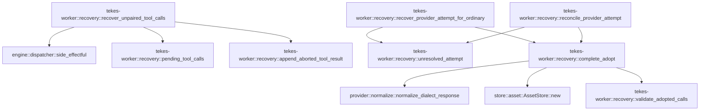

# tekes-worker::recovery

[Package atlas](index.md) · [Source](../../src/recovery.rs)

## Declarations

Visibility is the declaration spelling; trait members and reexports require their enclosing interface. `cfg` is not evaluated.

| Symbol | Kind | Visibility | Test / cfg |
|---|---|---|---|
| [tekes-worker::recovery::UnresolvedAttempt](../../src/recovery.rs#L3) | struct_item | `pub(crate)` |  |
| [tekes-worker::recovery::PendingToolCall](../../src/recovery.rs#L17) | struct_item | `pub(crate)` |  |
| [tekes-worker::recovery::RecoveryProgress](../../src/recovery.rs#L29) | enum_item | `pub(crate)` |  |
| [tekes-worker::recovery::reconcile_provider_attempt](../../src/recovery.rs#L34) | function_item | `pub(crate)` |  |
| [tekes-worker::recovery::recover_unpaired_tool_calls](../../src/recovery.rs#L103) | function_item | `pub(crate)` |  |
| [tekes-worker::recovery::pending_tool_calls](../../src/recovery.rs#L224) | function_item | `pub(crate)` |  |
| [tekes-worker::recovery::append_aborted_tool_result](../../src/recovery.rs#L300) | function_item | `private` |  |
| [tekes-worker::recovery::recover_provider_attempt_for_ordinary](../../src/recovery.rs#L315) | function_item | `pub(crate)` |  |
| [tekes-worker::recovery::unresolved_attempt](../../src/recovery.rs#L417) | function_item | `pub(crate)` |  |
| [tekes-worker::recovery::validate_adopted_calls](../../src/recovery.rs#L535) | function_item | `pub(crate)` |  |
| [tekes-worker::recovery::complete_adopt](../../src/recovery.rs#L565) | function_item | `private` |  |

## Imports / reexports

| Local name | Source path | Visibility |
|---|---|---|
| `*` | `super::*` | `private` |

## Module declarations

| Module | Visibility | Attributes |
|---|---|---|

## Function call graphs

Edges below are syntactically resolved calls only, including private functions. Graphs partition callers into groups of 20; they are not execution order. All unresolved sites are listed below and in the JSON inventory.

Functions 1–8: 10 direct edges

## Call sites

Includes test functions (marked in declarations). Receiver-type-required sites need type analysis/manual tracing. Calls in closures are attributed to their enclosing function; their occurrence here does not mean the closure executes immediately.

| Caller | Callee expression | Source lines | Target / classification |
|---|---|---|---|
| `reconcile_provider_attempt` | `unresolved_attempt` | [39](../../src/recovery.rs#L39) | [tekes-worker::recovery::unresolved_attempt](../../src/recovery.rs#L417) |
| `reconcile_provider_attempt` | `ledger.projection` | [40](../../src/recovery.rs#L40) | receiver-type-required |
| `reconcile_provider_attempt` | `append_settle` | [46](../../src/recovery.rs#L46), [92](../../src/recovery.rs#L92) | external-constructor-callback-or-unresolved |
| `reconcile_provider_attempt` | `options.event_timestamp` | [48](../../src/recovery.rs#L48), [94](../../src/recovery.rs#L94) | receiver-type-required |
| `reconcile_provider_attempt` | `Some` | [51](../../src/recovery.rs#L51), [97](../../src/recovery.rs#L97) | external-constructor-callback-or-unresolved |
| `reconcile_provider_attempt` | `Ok` | [56](../../src/recovery.rs#L56), [73](../../src/recovery.rs#L73), [99](../../src/recovery.rs#L99) | external-constructor-callback-or-unresolved |
| `reconcile_provider_attempt` | `attempt.decision.as_deref` | [58](../../src/recovery.rs#L58) | receiver-type-required |
| `reconcile_provider_attempt` | `decision.to_owned` | [59](../../src/recovery.rs#L59) | receiver-type-required |
| `reconcile_provider_attempt` | `"not_dispatched".to_owned` | [60](../../src/recovery.rs#L60) | receiver-type-required |
| `reconcile_provider_attempt` | `"unresolved".to_owned` | [61](../../src/recovery.rs#L61) | receiver-type-required |
| `reconcile_provider_attempt` | `attempt.decision.is_none` | [63](../../src/recovery.rs#L63) | receiver-type-required |
| `reconcile_provider_attempt` | `make_event` | [64](../../src/recovery.rs#L64), [76](../../src/recovery.rs#L76) | external-constructor-callback-or-unresolved |
| `reconcile_provider_attempt` | `ledger.append_contract` | [69](../../src/recovery.rs#L69), [83](../../src/recovery.rs#L83) | receiver-type-required |
| `reconcile_provider_attempt` | `BarrierContext::default` | [69](../../src/recovery.rs#L69), [83](../../src/recovery.rs#L83) | external-constructor-callback-or-unresolved |
| `reconcile_provider_attempt` | `complete_adopt` | [72](../../src/recovery.rs#L72) | [tekes-worker::recovery::complete_adopt](../../src/recovery.rs#L565) |
| `reconcile_provider_attempt` | `event.seq` | [82](../../src/recovery.rs#L82) | receiver-type-required |
| `reconcile_provider_attempt` | `stdout.write_all` | [84](../../src/recovery.rs#L84) | receiver-type-required |
| `reconcile_provider_attempt` | `encode_line` | [84](../../src/recovery.rs#L84) | external-constructor-callback-or-unresolved |
| `reconcile_provider_attempt` | `stdout.flush` | [91](../../src/recovery.rs#L91) | receiver-type-required |
| `recover_unpaired_tool_calls` | `pending_tool_calls` | [117](../../src/recovery.rs#L117) | [tekes-worker::recovery::pending_tool_calls](../../src/recovery.rs#L224) |
| `recover_unpaired_tool_calls` | `BTreeSet::new` | [125](../../src/recovery.rs#L125) | external-constructor-callback-or-unresolved |
| `recover_unpaired_tool_calls` | `pending         .iter()         .filter(&#124;call&#124; !seen_attempts.insert(call.attempt.clone()))         .map(&#124;call&#124; call.call.clone())         .collect::<BTreeSet<_>>` | [126](../../src/recovery.rs#L126) | receiver-type-required |
| `recover_unpaired_tool_calls` | `pending         .iter()         .filter(&#124;call&#124; !seen_attempts.insert(call.attempt.clone()))         .map` | [126](../../src/recovery.rs#L126) | receiver-type-required |
| `recover_unpaired_tool_calls` | `pending         .iter()         .filter` | [126](../../src/recovery.rs#L126) | receiver-type-required |
| `recover_unpaired_tool_calls` | `pending         .iter` | [126](../../src/recovery.rs#L126) | receiver-type-required |
| `recover_unpaired_tool_calls` | `seen_attempts.insert` | [128](../../src/recovery.rs#L128) | receiver-type-required |
| `recover_unpaired_tool_calls` | `call.attempt.clone` | [128](../../src/recovery.rs#L128) | receiver-type-required |
| `recover_unpaired_tool_calls` | `call.call.clone` | [129](../../src/recovery.rs#L129), [182](../../src/recovery.rs#L182) | receiver-type-required |
| `recover_unpaired_tool_calls` | `BuiltinManifest::compiled` | [131](../../src/recovery.rs#L131) | external-constructor-callback-or-unresolved |
| `recover_unpaired_tool_calls` | `unstarted.contains` | [136](../../src/recovery.rs#L136) | receiver-type-required |
| `recover_unpaired_tool_calls` | `call.approval_response.is_none` | [138](../../src/recovery.rs#L138) | receiver-type-required |
| `recover_unpaired_tool_calls` | `Ok` | [140](../../src/recovery.rs#L140), [169](../../src/recovery.rs#L169), [210](../../src/recovery.rs#L210), [221](../../src/recovery.rs#L221) | external-constructor-callback-or-unresolved |
| `recover_unpaired_tool_calls` | `append_aborted_tool_result` | [142](../../src/recovery.rs#L142), [149](../../src/recovery.rs#L149), [153](../../src/recovery.rs#L153), [202](../../src/recovery.rs#L202), [219](../../src/recovery.rs#L219) | [tekes-worker::recovery::append_aborted_tool_result](../../src/recovery.rs#L300) |
| `recover_unpaired_tool_calls` | `continuation_facts` | [145](../../src/recovery.rs#L145) | external-constructor-callback-or-unresolved |
| `recover_unpaired_tool_calls` | `wait_tool_continuation` | [156](../../src/recovery.rs#L156) | external-constructor-callback-or-unresolved |
| `recover_unpaired_tool_calls` | `manifest.tools.iter().find` | [173](../../src/recovery.rs#L173) | receiver-type-required |
| `recover_unpaired_tool_calls` | `manifest.tools.iter` | [173](../../src/recovery.rs#L173) | receiver-type-required |
| `recover_unpaired_tool_calls` | `tool.is_some_and` | [174](../../src/recovery.rs#L174), [176](../../src/recovery.rs#L176) | receiver-type-required |
| `recover_unpaired_tool_calls` | `engine::side_effectful` | [174](../../src/recovery.rs#L174) | [engine::dispatcher::side_effectful](../../../engine/src/dispatcher.rs#L276) |
| `recover_unpaired_tool_calls` | `call.approval_response.is_some` | [178](../../src/recovery.rs#L178) | receiver-type-required |
| `recover_unpaired_tool_calls` | `call.name.clone` | [183](../../src/recovery.rs#L183) | receiver-type-required |
| `recover_unpaired_tool_calls` | `call.arguments.clone` | [184](../../src/recovery.rs#L184) | receiver-type-required |
| `recover_unpaired_tool_calls` | `execute_provider_tool_calls` | [186](../../src/recovery.rs#L186) | external-constructor-callback-or-unresolved |
| `recover_unpaired_tool_calls` | `std::slice::from_ref` | [194](../../src/recovery.rs#L194) | external-constructor-callback-or-unresolved |
| `pending_tool_calls` | `ledger.projection().ok_or` | [227](../../src/recovery.rs#L227) | receiver-type-required |
| `pending_tool_calls` | `ledger.projection` | [227](../../src/recovery.rs#L227) | receiver-type-required |
| `pending_tool_calls` | `BTreeSet::new` | [228](../../src/recovery.rs#L228), [229](../../src/recovery.rs#L229) | external-constructor-callback-or-unresolved |
| `pending_tool_calls` | `std::collections::BTreeMap::<String, (bool, Option<Value>)>::new` | [230](../../src/recovery.rs#L230) | external-constructor-callback-or-unresolved |
| `pending_tool_calls` | `event.kind` | [232](../../src/recovery.rs#L232), [260](../../src/recovery.rs#L260), [294](../../src/recovery.rs#L294) | receiver-type-required |
| `pending_tool_calls` | `event.string_field` | [234](../../src/recovery.rs#L234), [239](../../src/recovery.rs#L239), [245](../../src/recovery.rs#L245), [263](../../src/recovery.rs#L263), [287](../../src/recovery.rs#L287) | receiver-type-required |
| `pending_tool_calls` | `results.insert` | [235](../../src/recovery.rs#L235) | receiver-type-required |
| `pending_tool_calls` | `call.to_owned` | [235](../../src/recovery.rs#L235), [240](../../src/recovery.rs#L240), [247](../../src/recovery.rs#L247), [269](../../src/recovery.rs#L269) | receiver-type-required |
| `pending_tool_calls` | `requests.insert` | [240](../../src/recovery.rs#L240) | receiver-type-required |
| `pending_tool_calls` | `serde_json::to_value` | [244](../../src/recovery.rs#L244), [267](../../src/recovery.rs#L267) | external-constructor-callback-or-unresolved |
| `pending_tool_calls` | `event.raw` | [244](../../src/recovery.rs#L244), [267](../../src/recovery.rs#L267) | receiver-type-required |
| `pending_tool_calls` | `responses.insert` | [246](../../src/recovery.rs#L246) | receiver-type-required |
| `pending_tool_calls` | `raw.get("grant").and_then(Value::as_bool).unwrap_or` | [249](../../src/recovery.rs#L249) | receiver-type-required |
| `pending_tool_calls` | `raw.get("grant").and_then` | [249](../../src/recovery.rs#L249) | receiver-type-required |
| `pending_tool_calls` | `raw.get` | [249](../../src/recovery.rs#L249), [250](../../src/recovery.rs#L250), [274](../../src/recovery.rs#L274), [282](../../src/recovery.rs#L282) | receiver-type-required |
| `pending_tool_calls` | `raw.get("answer").cloned` | [250](../../src/recovery.rs#L250) | receiver-type-required |
| `pending_tool_calls` | `Vec::new` | [258](../../src/recovery.rs#L258) | external-constructor-callback-or-unresolved |
| `pending_tool_calls` | `event.string_field("call").ok_or` | [263](../../src/recovery.rs#L263) | receiver-type-required |
| `pending_tool_calls` | `results.contains` | [264](../../src/recovery.rs#L264) | receiver-type-required |
| `pending_tool_calls` | `pending.push` | [268](../../src/recovery.rs#L268) | receiver-type-required |
| `pending_tool_calls` | `event                 .string_field("name")                 .ok_or("tool_call lacks name")?                 .to_owned` | [270](../../src/recovery.rs#L270) | receiver-type-required |
| `pending_tool_calls` | `event                 .string_field("name")                 .ok_or` | [270](../../src/recovery.rs#L270) | receiver-type-required |
| `pending_tool_calls` | `event                 .string_field` | [270](../../src/recovery.rs#L270), [275](../../src/recovery.rs#L275) | receiver-type-required |
| `pending_tool_calls` | `materialize_json` | [274](../../src/recovery.rs#L274) | external-constructor-callback-or-unresolved |
| `pending_tool_calls` | `raw.get("args").ok_or` | [274](../../src/recovery.rs#L274) | receiver-type-required |
| `pending_tool_calls` | `event                 .string_field("attempt")                 .ok_or("tool_call lacks attempt")?                 .to_owned` | [275](../../src/recovery.rs#L275) | receiver-type-required |
| `pending_tool_calls` | `event                 .string_field("attempt")                 .ok_or` | [275](../../src/recovery.rs#L275) | receiver-type-required |
| `pending_tool_calls` | `event.turn().ok_or` | [279](../../src/recovery.rs#L279) | receiver-type-required |
| `pending_tool_calls` | `event.turn` | [279](../../src/recovery.rs#L279) | receiver-type-required |
| `pending_tool_calls` | `requests.contains` | [280](../../src/recovery.rs#L280) | receiver-type-required |
| `pending_tool_calls` | `responses.get(call).cloned` | [281](../../src/recovery.rs#L281) | receiver-type-required |
| `pending_tool_calls` | `responses.get` | [281](../../src/recovery.rs#L281) | receiver-type-required |
| `pending_tool_calls` | `raw.get("execution_tracked").and_then` | [282](../../src/recovery.rs#L282) | receiver-type-required |
| `pending_tool_calls` | `Some` | [282](../../src/recovery.rs#L282), [287](../../src/recovery.rs#L287) | external-constructor-callback-or-unresolved |
| `pending_tool_calls` | `projection                 .events                 .iter()                 .rev()                 .filter(&#124;event&#124; event.string_field("call") == Some(call))                 .find(&#124;event&#124; {                     matches!(                         event.kind(),                         EventKind::ToolExecutionStarted &#124; EventKind::ApprovalRequest                     )                 })                 .is_some_and` | [283](../../src/recovery.rs#L283) | receiver-type-required |
| `pending_tool_calls` | `projection                 .events                 .iter()                 .rev()                 .filter(&#124;event&#124; event.string_field("call") == Some(call))                 .find` | [283](../../src/recovery.rs#L283) | receiver-type-required |
| `pending_tool_calls` | `projection                 .events                 .iter()                 .rev()                 .filter` | [283](../../src/recovery.rs#L283) | receiver-type-required |
| `pending_tool_calls` | `projection                 .events                 .iter()                 .rev` | [283](../../src/recovery.rs#L283) | receiver-type-required |
| `pending_tool_calls` | `projection                 .events                 .iter` | [283](../../src/recovery.rs#L283) | receiver-type-required |
| `pending_tool_calls` | `Ok` | [297](../../src/recovery.rs#L297) | external-constructor-callback-or-unresolved |
| `append_aborted_tool_result` | `make_event` | [307](../../src/recovery.rs#L307) | external-constructor-callback-or-unresolved |
| `append_aborted_tool_result` | `ledger.append_contract` | [311](../../src/recovery.rs#L311) | receiver-type-required |
| `append_aborted_tool_result` | `BarrierContext::default` | [311](../../src/recovery.rs#L311) | external-constructor-callback-or-unresolved |
| `append_aborted_tool_result` | `Ok` | [312](../../src/recovery.rs#L312) | external-constructor-callback-or-unresolved |
| `recover_provider_attempt_for_ordinary` | `unresolved_attempt` | [320](../../src/recovery.rs#L320) | [tekes-worker::recovery::unresolved_attempt](../../src/recovery.rs#L417) |
| `recover_provider_attempt_for_ordinary` | `Ok` | [321](../../src/recovery.rs#L321), [379](../../src/recovery.rs#L379), [381](../../src/recovery.rs#L381), [410](../../src/recovery.rs#L410), [412](../../src/recovery.rs#L412) | external-constructor-callback-or-unresolved |
| `recover_provider_attempt_for_ordinary` | `ledger         .projection()         .ok_or("ledger projection missing")?         .events         .iter()         .find(&#124;event&#124; {             *event.kind() == EventKind::Epoch                 && event.string_field("id") == Some(attempt.epoch.as_str())         })         .and_then(&#124;event&#124; event.string_field("adapter"))         .ok_or` | [323](../../src/recovery.rs#L323) | receiver-type-required |
| `recover_provider_attempt_for_ordinary` | `ledger         .projection()         .ok_or("ledger projection missing")?         .events         .iter()         .find(&#124;event&#124; {             *event.kind() == EventKind::Epoch                 && event.string_field("id") == Some(attempt.epoch.as_str())         })         .and_then` | [323](../../src/recovery.rs#L323) | receiver-type-required |
| `recover_provider_attempt_for_ordinary` | `ledger         .projection()         .ok_or("ledger projection missing")?         .events         .iter()         .find` | [323](../../src/recovery.rs#L323) | receiver-type-required |
| `recover_provider_attempt_for_ordinary` | `ledger         .projection()         .ok_or("ledger projection missing")?         .events         .iter` | [323](../../src/recovery.rs#L323) | receiver-type-required |
| `recover_provider_attempt_for_ordinary` | `ledger         .projection()         .ok_or` | [323](../../src/recovery.rs#L323) | receiver-type-required |
| `recover_provider_attempt_for_ordinary` | `ledger         .projection` | [323](../../src/recovery.rs#L323) | receiver-type-required |
| `recover_provider_attempt_for_ordinary` | `event.kind` | [329](../../src/recovery.rs#L329) | receiver-type-required |
| `recover_provider_attempt_for_ordinary` | `event.string_field` | [330](../../src/recovery.rs#L330), [332](../../src/recovery.rs#L332) | receiver-type-required |
| `recover_provider_attempt_for_ordinary` | `Some` | [330](../../src/recovery.rs#L330), [408](../../src/recovery.rs#L408) | external-constructor-callback-or-unresolved |
| `recover_provider_attempt_for_ordinary` | `attempt.epoch.as_str` | [330](../../src/recovery.rs#L330) | receiver-type-required |
| `recover_provider_attempt_for_ordinary` | `DialectId::from_str` | [334](../../src/recovery.rs#L334) | external-constructor-callback-or-unresolved |
| `recover_provider_attempt_for_ordinary` | `dialect.family().capabilities` | [335](../../src/recovery.rs#L335) | receiver-type-required |
| `recover_provider_attempt_for_ordinary` | `dialect.family` | [335](../../src/recovery.rs#L335) | receiver-type-required |
| `recover_provider_attempt_for_ordinary` | `attempt.decision.as_deref` | [336](../../src/recovery.rs#L336) | receiver-type-required |
| `recover_provider_attempt_for_ordinary` | `Err` | [342](../../src/recovery.rs#L342) | external-constructor-callback-or-unresolved |
| `recover_provider_attempt_for_ordinary` | `format!("unknown recorded recovery decision {other}").into` | [342](../../src/recovery.rs#L342) | receiver-type-required |
| `recover_provider_attempt_for_ordinary` | `decide_recovery` | [343](../../src/recovery.rs#L343) | external-constructor-callback-or-unresolved |
| `recover_provider_attempt_for_ordinary` | `dialect.server_managed` | [345](../../src/recovery.rs#L345) | receiver-type-required |
| `recover_provider_attempt_for_ordinary` | `sent_state` | [357](../../src/recovery.rs#L357) | external-constructor-callback-or-unresolved |
| `recover_provider_attempt_for_ordinary` | `attempt.decision.is_none` | [362](../../src/recovery.rs#L362) | receiver-type-required |
| `recover_provider_attempt_for_ordinary` | `make_event` | [370](../../src/recovery.rs#L370), [386](../../src/recovery.rs#L386) | external-constructor-callback-or-unresolved |
| `recover_provider_attempt_for_ordinary` | `ledger.append_contract` | [375](../../src/recovery.rs#L375), [393](../../src/recovery.rs#L393) | receiver-type-required |
| `recover_provider_attempt_for_ordinary` | `BarrierContext::default` | [375](../../src/recovery.rs#L375), [393](../../src/recovery.rs#L393) | external-constructor-callback-or-unresolved |
| `recover_provider_attempt_for_ordinary` | `complete_adopt` | [378](../../src/recovery.rs#L378) | [tekes-worker::recovery::complete_adopt](../../src/recovery.rs#L565) |
| `recover_provider_attempt_for_ordinary` | `event.seq` | [392](../../src/recovery.rs#L392) | receiver-type-required |
| `recover_provider_attempt_for_ordinary` | `stdout.write_all` | [394](../../src/recovery.rs#L394) | receiver-type-required |
| `recover_provider_attempt_for_ordinary` | `encode_line` | [394](../../src/recovery.rs#L394) | external-constructor-callback-or-unresolved |
| `recover_provider_attempt_for_ordinary` | `stdout.flush` | [401](../../src/recovery.rs#L401) | receiver-type-required |
| `recover_provider_attempt_for_ordinary` | `append_settle` | [403](../../src/recovery.rs#L403) | external-constructor-callback-or-unresolved |
| `recover_provider_attempt_for_ordinary` | `options.event_timestamp` | [405](../../src/recovery.rs#L405) | receiver-type-required |
| `unresolved_attempt` | `ledger.projection().ok_or` | [420](../../src/recovery.rs#L420) | receiver-type-required |
| `unresolved_attempt` | `ledger.projection` | [420](../../src/recovery.rs#L420) | receiver-type-required |
| `unresolved_attempt` | `std::collections::BTreeMap::<String, UnresolvedAttempt>::new` | [421](../../src/recovery.rs#L421) | external-constructor-callback-or-unresolved |
| `unresolved_attempt` | `std::collections::BTreeMap::<String, String>::new` | [422](../../src/recovery.rs#L422) | external-constructor-callback-or-unresolved |
| `unresolved_attempt` | `event.kind` | [424](../../src/recovery.rs#L424) | receiver-type-required |
| `unresolved_attempt` | `event                     .string_field("attempt")                     .ok_or("attempt lacks id")?                     .to_owned` | [426](../../src/recovery.rs#L426) | receiver-type-required |
| `unresolved_attempt` | `event                     .string_field("attempt")                     .ok_or` | [426](../../src/recovery.rs#L426) | receiver-type-required |
| `unresolved_attempt` | `event                     .string_field` | [426](../../src/recovery.rs#L426), [451](../../src/recovery.rs#L451), [459](../../src/recovery.rs#L459), [480](../../src/recovery.rs#L480) | receiver-type-required |
| `unresolved_attempt` | `attempts.insert` | [430](../../src/recovery.rs#L430) | receiver-type-required |
| `unresolved_attempt` | `id.clone` | [431](../../src/recovery.rs#L431) | receiver-type-required |
| `unresolved_attempt` | `event.turn().ok_or` | [434](../../src/recovery.rs#L434) | receiver-type-required |
| `unresolved_attempt` | `event.turn` | [434](../../src/recovery.rs#L434), [521](../../src/recovery.rs#L521) | receiver-type-required |
| `unresolved_attempt` | `event                             .string_field("epoch")                             .ok_or("attempt lacks epoch")?                             .to_owned` | [435](../../src/recovery.rs#L435) | receiver-type-required |
| `unresolved_attempt` | `event                             .string_field("epoch")                             .ok_or` | [435](../../src/recovery.rs#L435) | receiver-type-required |
| `unresolved_attempt` | `event                             .string_field` | [435](../../src/recovery.rs#L435) | receiver-type-required |
| `unresolved_attempt` | `Vec::new` | [441](../../src/recovery.rs#L441) | external-constructor-callback-or-unresolved |
| `unresolved_attempt` | `std::collections::BTreeSet::new` | [445](../../src/recovery.rs#L445), [446](../../src/recovery.rs#L446) | external-constructor-callback-or-unresolved |
| `unresolved_attempt` | `event                     .string_field("attempt")                     .and_then` | [451](../../src/recovery.rs#L451), [459](../../src/recovery.rs#L459), [480](../../src/recovery.rs#L480) | receiver-type-required |
| `unresolved_attempt` | `attempts.get_mut` | [453](../../src/recovery.rs#L453), [461](../../src/recovery.rs#L461), [482](../../src/recovery.rs#L482), [493](../../src/recovery.rs#L493), [506](../../src/recovery.rs#L506), [514](../../src/recovery.rs#L514) | receiver-type-required |
| `unresolved_attempt` | `event.string_field("decision").map` | [463](../../src/recovery.rs#L463) | receiver-type-required |
| `unresolved_attempt` | `event.string_field` | [463](../../src/recovery.rs#L463), [488](../../src/recovery.rs#L488), [503](../../src/recovery.rs#L503), [512](../../src/recovery.rs#L512) | receiver-type-required |
| `unresolved_attempt` | `serde_json::to_value` | [464](../../src/recovery.rs#L464) | external-constructor-callback-or-unresolved |
| `unresolved_attempt` | `event.raw` | [464](../../src/recovery.rs#L464) | receiver-type-required |
| `unresolved_attempt` | `raw                         .get("inventory")                         .and_then(Value::as_array)                         .into_iter()                         .flatten()                         .filter_map(Value::as_str)                         .map(str::to_owned)                         .collect` | [465](../../src/recovery.rs#L465) | receiver-type-required |
| `unresolved_attempt` | `raw                         .get("inventory")                         .and_then(Value::as_array)                         .into_iter()                         .flatten()                         .filter_map(Value::as_str)                         .map` | [465](../../src/recovery.rs#L465) | receiver-type-required |
| `unresolved_attempt` | `raw                         .get("inventory")                         .and_then(Value::as_array)                         .into_iter()                         .flatten()                         .filter_map` | [465](../../src/recovery.rs#L465) | receiver-type-required |
| `unresolved_attempt` | `raw                         .get("inventory")                         .and_then(Value::as_array)                         .into_iter()                         .flatten` | [465](../../src/recovery.rs#L465) | receiver-type-required |
| `unresolved_attempt` | `raw                         .get("inventory")                         .and_then(Value::as_array)                         .into_iter` | [465](../../src/recovery.rs#L465) | receiver-type-required |
| `unresolved_attempt` | `raw                         .get("inventory")                         .and_then` | [465](../../src/recovery.rs#L465) | receiver-type-required |
| `unresolved_attempt` | `raw                         .get` | [465](../../src/recovery.rs#L465) | receiver-type-required |
| `unresolved_attempt` | `raw                         .pointer("/response/asset")                         .and_then(Value::as_str)                         .map` | [473](../../src/recovery.rs#L473) | receiver-type-required |
| `unresolved_attempt` | `raw                         .pointer("/response/asset")                         .and_then` | [473](../../src/recovery.rs#L473) | receiver-type-required |
| `unresolved_attempt` | `raw                         .pointer` | [473](../../src/recovery.rs#L473) | receiver-type-required |
| `unresolved_attempt` | `attempts                         .get(id)                         .is_some_and` | [489](../../src/recovery.rs#L489) | receiver-type-required |
| `unresolved_attempt` | `attempts                         .get` | [489](../../src/recovery.rs#L489) | receiver-type-required |
| `unresolved_attempt` | `attempt.decision.as_deref` | [491](../../src/recovery.rs#L491) | receiver-type-required |
| `unresolved_attempt` | `Some` | [491](../../src/recovery.rs#L491), [494](../../src/recovery.rs#L494) | external-constructor-callback-or-unresolved |
| `unresolved_attempt` | `event.seq` | [494](../../src/recovery.rs#L494) | receiver-type-required |
| `unresolved_attempt` | `attempts.remove` | [497](../../src/recovery.rs#L497) | receiver-type-required |
| `unresolved_attempt` | `call_attempts.insert` | [505](../../src/recovery.rs#L505) | receiver-type-required |
| `unresolved_attempt` | `call.to_owned` | [505](../../src/recovery.rs#L505), [507](../../src/recovery.rs#L507), [515](../../src/recovery.rs#L515) | receiver-type-required |
| `unresolved_attempt` | `attempt_id.to_owned` | [505](../../src/recovery.rs#L505) | receiver-type-required |
| `unresolved_attempt` | `attempt.calls.insert` | [507](../../src/recovery.rs#L507) | receiver-type-required |
| `unresolved_attempt` | `call_attempts.get` | [513](../../src/recovery.rs#L513) | receiver-type-required |
| `unresolved_attempt` | `attempt.results.insert` | [515](../../src/recovery.rs#L515) | receiver-type-required |
| `unresolved_attempt` | `attempts.retain` | [522](../../src/recovery.rs#L522) | receiver-type-required |
| `unresolved_attempt` | `attempts.len` | [528](../../src/recovery.rs#L528) | receiver-type-required |
| `unresolved_attempt` | `Err` | [529](../../src/recovery.rs#L529) | external-constructor-callback-or-unresolved |
| `unresolved_attempt` | `"ledger has more than one live provider attempt".into` | [529](../../src/recovery.rs#L529) | receiver-type-required |
| `unresolved_attempt` | `Ok` | [531](../../src/recovery.rs#L531) | external-constructor-callback-or-unresolved |
| `unresolved_attempt` | `attempts.into_values().next` | [531](../../src/recovery.rs#L531) | receiver-type-required |
| `unresolved_attempt` | `attempts.into_values` | [531](../../src/recovery.rs#L531) | receiver-type-required |
| `validate_adopted_calls` | `ledger         .projection()         .ok_or` | [540](../../src/recovery.rs#L540) | receiver-type-required |
| `validate_adopted_calls` | `ledger         .projection` | [540](../../src/recovery.rs#L540) | receiver-type-required |
| `validate_adopted_calls` | `event.kind` | [545](../../src/recovery.rs#L545) | receiver-type-required |
| `validate_adopted_calls` | `event.string_field` | [545](../../src/recovery.rs#L545), [558](../../src/recovery.rs#L558) | receiver-type-required |
| `validate_adopted_calls` | `Some` | [545](../../src/recovery.rs#L545), [558](../../src/recovery.rs#L558) | external-constructor-callback-or-unresolved |
| `validate_adopted_calls` | `event             .string_field("call")             .ok_or` | [548](../../src/recovery.rs#L548) | receiver-type-required |
| `validate_adopted_calls` | `event             .string_field` | [548](../../src/recovery.rs#L548) | receiver-type-required |
| `validate_adopted_calls` | `calls             .iter()             .find(&#124;call&#124; call.call_id == call_id)             .ok_or` | [551](../../src/recovery.rs#L551) | receiver-type-required |
| `validate_adopted_calls` | `calls             .iter()             .find` | [551](../../src/recovery.rs#L551) | receiver-type-required |
| `validate_adopted_calls` | `calls             .iter` | [551](../../src/recovery.rs#L551) | receiver-type-required |
| `validate_adopted_calls` | `serde_json::to_value` | [555](../../src/recovery.rs#L555) | external-constructor-callback-or-unresolved |
| `validate_adopted_calls` | `event.raw` | [555](../../src/recovery.rs#L555) | receiver-type-required |
| `validate_adopted_calls` | `materialize_json` | [557](../../src/recovery.rs#L557) | external-constructor-callback-or-unresolved |
| `validate_adopted_calls` | `raw.get("args").ok_or` | [557](../../src/recovery.rs#L557) | receiver-type-required |
| `validate_adopted_calls` | `raw.get` | [557](../../src/recovery.rs#L557) | receiver-type-required |
| `validate_adopted_calls` | `call.name.as_str` | [558](../../src/recovery.rs#L558) | receiver-type-required |
| `validate_adopted_calls` | `Err` | [559](../../src/recovery.rs#L559) | external-constructor-callback-or-unresolved |
| `validate_adopted_calls` | `"adopt response changed a durable tool call".into` | [559](../../src/recovery.rs#L559) | receiver-type-required |
| `validate_adopted_calls` | `Ok` | [562](../../src/recovery.rs#L562) | external-constructor-callback-or-unresolved |
| `complete_adopt` | `attempt         .response_asset         .as_deref()         .ok_or` | [572](../../src/recovery.rs#L572) | receiver-type-required |
| `complete_adopt` | `attempt         .response_asset         .as_deref` | [572](../../src/recovery.rs#L572) | receiver-type-required |
| `complete_adopt` | `ledger.path().parent().ok_or` | [576](../../src/recovery.rs#L576) | receiver-type-required |
| `complete_adopt` | `ledger.path().parent` | [576](../../src/recovery.rs#L576) | receiver-type-required |
| `complete_adopt` | `ledger.path` | [576](../../src/recovery.rs#L576) | receiver-type-required |
| `complete_adopt` | `store::AssetStore::new(folder.join("assets"))?.read_verified` | [577](../../src/recovery.rs#L577) | receiver-type-required |
| `complete_adopt` | `store::AssetStore::new` | [577](../../src/recovery.rs#L577) | [store::asset::AssetStore::new](../../../store/src/asset.rs#L27) |
| `complete_adopt` | `folder.join` | [577](../../src/recovery.rs#L577) | receiver-type-required |
| `complete_adopt` | `ledger         .projection()         .ok_or("ledger projection missing")?         .events         .iter()         .find(&#124;event&#124; {             *event.kind() == EventKind::Epoch                 && event.string_field("id") == Some(attempt.epoch.as_str())         })         .and_then(&#124;event&#124; event.string_field("adapter"))         .ok_or` | [578](../../src/recovery.rs#L578) | receiver-type-required |
| `complete_adopt` | `ledger         .projection()         .ok_or("ledger projection missing")?         .events         .iter()         .find(&#124;event&#124; {             *event.kind() == EventKind::Epoch                 && event.string_field("id") == Some(attempt.epoch.as_str())         })         .and_then` | [578](../../src/recovery.rs#L578) | receiver-type-required |
| `complete_adopt` | `ledger         .projection()         .ok_or("ledger projection missing")?         .events         .iter()         .find` | [578](../../src/recovery.rs#L578) | receiver-type-required |
| `complete_adopt` | `ledger         .projection()         .ok_or("ledger projection missing")?         .events         .iter` | [578](../../src/recovery.rs#L578) | receiver-type-required |
| `complete_adopt` | `ledger         .projection()         .ok_or` | [578](../../src/recovery.rs#L578) | receiver-type-required |
| `complete_adopt` | `ledger         .projection` | [578](../../src/recovery.rs#L578) | receiver-type-required |
| `complete_adopt` | `event.kind` | [584](../../src/recovery.rs#L584) | receiver-type-required |
| `complete_adopt` | `event.string_field` | [585](../../src/recovery.rs#L585), [587](../../src/recovery.rs#L587) | receiver-type-required |
| `complete_adopt` | `Some` | [585](../../src/recovery.rs#L585), [658](../../src/recovery.rs#L658), [666](../../src/recovery.rs#L666), [738](../../src/recovery.rs#L738), [754](../../src/recovery.rs#L754) | external-constructor-callback-or-unresolved |
| `complete_adopt` | `attempt.epoch.as_str` | [585](../../src/recovery.rs#L585) | receiver-type-required |
| `complete_adopt` | `DialectId::from_str` | [589](../../src/recovery.rs#L589) | external-constructor-callback-or-unresolved |
| `complete_adopt` | `provider::normalize_dialect_response` | [590](../../src/recovery.rs#L590) | [provider::normalize::normalize_dialect_response](../../../provider/src/normalize.rs#L216) |
| `complete_adopt` | `terminal.is_final_answer` | [591](../../src/recovery.rs#L591) | receiver-type-required |
| `complete_adopt` | `terminal         .tool_calls         .iter()         .map(&#124;call&#124; call.call_id.as_str())         .collect::<Vec<_>>` | [592](../../src/recovery.rs#L592) | receiver-type-required |
| `complete_adopt` | `terminal         .tool_calls         .iter()         .map` | [592](../../src/recovery.rs#L592) | receiver-type-required |
| `complete_adopt` | `terminal         .tool_calls         .iter` | [592](../../src/recovery.rs#L592) | receiver-type-required |
| `complete_adopt` | `call.call_id.as_str` | [595](../../src/recovery.rs#L595) | receiver-type-required |
| `complete_adopt` | `attempt         .inventory         .iter()         .map(String::as_str)         .collect::<Vec<_>>` | [597](../../src/recovery.rs#L597) | receiver-type-required |
| `complete_adopt` | `attempt         .inventory         .iter()         .map` | [597](../../src/recovery.rs#L597) | receiver-type-required |
| `complete_adopt` | `attempt         .inventory         .iter` | [597](../../src/recovery.rs#L597) | receiver-type-required |
| `complete_adopt` | `Err` | [603](../../src/recovery.rs#L603) | external-constructor-callback-or-unresolved |
| `complete_adopt` | `"adopt response call inventory mismatch".into` | [603](../../src/recovery.rs#L603) | receiver-type-required |
| `complete_adopt` | `std::collections::BTreeMap::new` | [605](../../src/recovery.rs#L605) | external-constructor-callback-or-unresolved |
| `complete_adopt` | `repair_provider_call_arguments` | [607](../../src/recovery.rs#L607) | external-constructor-callback-or-unresolved |
| `complete_adopt` | `call.call_id.clone` | [608](../../src/recovery.rs#L608), [611](../../src/recovery.rs#L611) | receiver-type-required |
| `complete_adopt` | `local_provider_call_id` | [609](../../src/recovery.rs#L609) | external-constructor-callback-or-unresolved |
| `complete_adopt` | `wire_ids.insert` | [611](../../src/recovery.rs#L611) | receiver-type-required |
| `complete_adopt` | `validate_adopted_calls` | [614](../../src/recovery.rs#L614) | [tekes-worker::recovery::validate_adopted_calls](../../src/recovery.rs#L535) |
| `complete_adopt` | `attempt.outcome_seq.is_none` | [615](../../src/recovery.rs#L615) | receiver-type-required |
| `complete_adopt` | `sealed_fragments` | [620](../../src/recovery.rs#L620), [681](../../src/recovery.rs#L681) | external-constructor-callback-or-unresolved |
| `complete_adopt` | `text.as_bytes` | [620](../../src/recovery.rs#L620) | receiver-type-required |
| `complete_adopt` | `make_event` | [621](../../src/recovery.rs#L621), [635](../../src/recovery.rs#L635), [698](../../src/recovery.rs#L698), [721](../../src/recovery.rs#L721), [725](../../src/recovery.rs#L725) | external-constructor-callback-or-unresolved |
| `complete_adopt` | `ledger.append_contract` | [625](../../src/recovery.rs#L625), [641](../../src/recovery.rs#L641), [700](../../src/recovery.rs#L700), [722](../../src/recovery.rs#L722), [729](../../src/recovery.rs#L729) | receiver-type-required |
| `complete_adopt` | `BarrierContext::default` | [625](../../src/recovery.rs#L625), [641](../../src/recovery.rs#L641), [700](../../src/recovery.rs#L700), [722](../../src/recovery.rs#L722), [729](../../src/recovery.rs#L729) | external-constructor-callback-or-unresolved |
| `complete_adopt` | `event.seq` | [640](../../src/recovery.rs#L640), [699](../../src/recovery.rs#L699) | receiver-type-required |
| `complete_adopt` | `stdout.write_all` | [644](../../src/recovery.rs#L644), [703](../../src/recovery.rs#L703) | receiver-type-required |
| `complete_adopt` | `encode_line` | [644](../../src/recovery.rs#L644), [703](../../src/recovery.rs#L703) | external-constructor-callback-or-unresolved |
| `complete_adopt` | `stdout.flush` | [651](../../src/recovery.rs#L651), [710](../../src/recovery.rs#L710) | receiver-type-required |
| `complete_adopt` | `append_settle` | [653](../../src/recovery.rs#L653), [661](../../src/recovery.rs#L661), [733](../../src/recovery.rs#L733), [749](../../src/recovery.rs#L749) | external-constructor-callback-or-unresolved |
| `complete_adopt` | `options.event_timestamp` | [655](../../src/recovery.rs#L655), [663](../../src/recovery.rs#L663), [735](../../src/recovery.rs#L735), [751](../../src/recovery.rs#L751) | receiver-type-required |
| `complete_adopt` | `Ok` | [669](../../src/recovery.rs#L669), [740](../../src/recovery.rs#L740), [746](../../src/recovery.rs#L746), [756](../../src/recovery.rs#L756), [758](../../src/recovery.rs#L758) | external-constructor-callback-or-unresolved |
| `complete_adopt` | `Vec::new` | [674](../../src/recovery.rs#L674) | external-constructor-callback-or-unresolved |
| `complete_adopt` | `content.push` | [677](../../src/recovery.rs#L677) | receiver-type-required |
| `complete_adopt` | `serde_json_canonicalizer::to_vec` | [680](../../src/recovery.rs#L680) | external-constructor-callback-or-unresolved |
| `complete_adopt` | `dialect.server_managed` | [688](../../src/recovery.rs#L688) | receiver-type-required |
| `complete_adopt` | `terminal                 .response_identity                 .as_deref()                 .ok_or` | [689](../../src/recovery.rs#L689) | receiver-type-required |
| `complete_adopt` | `terminal                 .response_identity                 .as_deref` | [689](../../src/recovery.rs#L689) | receiver-type-required |
| `complete_adopt` | `value                 .as_object_mut()                 .expect("output object")                 .insert` | [693](../../src/recovery.rs#L693) | receiver-type-required |
| `complete_adopt` | `value                 .as_object_mut()                 .expect` | [693](../../src/recovery.rs#L693) | receiver-type-required |
| `complete_adopt` | `value                 .as_object_mut` | [693](../../src/recovery.rs#L693) | receiver-type-required |
| `complete_adopt` | `"continuation".to_owned` | [696](../../src/recovery.rs#L696) | receiver-type-required |
| `complete_adopt` | `attempt.id.clone` | [706](../../src/recovery.rs#L706) | receiver-type-required |
| `complete_adopt` | `attempt.calls.contains` | [712](../../src/recovery.rs#L712) | receiver-type-required |
| `complete_adopt` | `wire_ids.get` | [718](../../src/recovery.rs#L718) | receiver-type-required |
| `complete_adopt` | `attempt.results.contains` | [724](../../src/recovery.rs#L724) | receiver-type-required |
