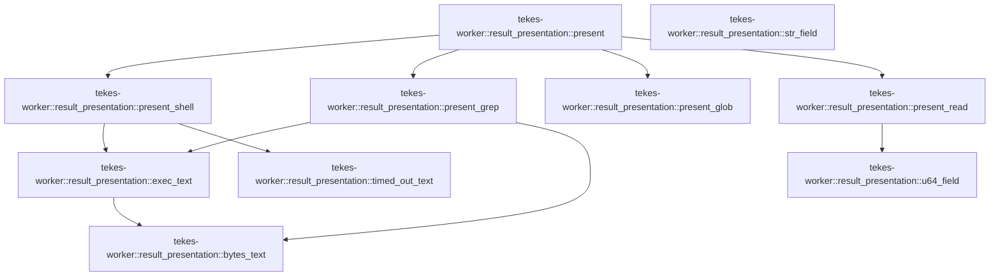

# tekes-worker::result_presentation

[Package atlas](index.md) · [Source](../../src/result_presentation.rs)

## Declarations

Visibility is the declaration spelling; trait members and reexports require their enclosing interface. `cfg` is not evaluated.

| Symbol | Kind | Visibility | Test / cfg |
|---|---|---|---|
| [tekes-worker::result_presentation::present](../../src/result_presentation.rs#L13) | function_item | `pub(crate)` |  |
| [tekes-worker::result_presentation::str_field](../../src/result_presentation.rs#L56) | function_item | `private` |  |
| [tekes-worker::result_presentation::u64_field](../../src/result_presentation.rs#L60) | function_item | `private` |  |
| [tekes-worker::result_presentation::present_read](../../src/result_presentation.rs#L64) | function_item | `private` |  |
| [tekes-worker::result_presentation::bytes_text](../../src/result_presentation.rs#L94) | function_item | `private` |  |
| [tekes-worker::result_presentation::exec_text](../../src/result_presentation.rs#L112) | function_item | `private` |  |
| [tekes-worker::result_presentation::present_shell](../../src/result_presentation.rs#L146) | function_item | `private` |  |
| [tekes-worker::result_presentation::timed_out_text](../../src/result_presentation.rs#L216) | function_item | `private` |  |
| [tekes-worker::result_presentation::present_grep](../../src/result_presentation.rs#L236) | function_item | `private` |  |
| [tekes-worker::result_presentation::present_glob](../../src/result_presentation.rs#L249) | function_item | `private` |  |
| [tekes-worker::result_presentation::tests::text](../../src/result_presentation.rs#L267) | function_item | `private` | test; #[cfg(test)] |
| [tekes-worker::result_presentation::tests::read_renders_numbered_lines_and_a_continuation_trailer](../../src/result_presentation.rs#L272) | function_item | `private` | test; #[cfg(test)] |
| [tekes-worker::result_presentation::tests::shell_renders_output_stderr_and_nonzero_exit_only](../../src/result_presentation.rs#L293) | function_item | `private` | test; #[cfg(test)] |
| [tekes-worker::result_presentation::tests::shell_names_a_killed_step_and_the_budget_that_applied](../../src/result_presentation.rs#L318) | function_item | `private` | test; #[cfg(test)] |
| [tekes-worker::result_presentation::tests::grep_glob_and_edits_render_compactly](../../src/result_presentation.rs#L350) | function_item | `private` | test; #[cfg(test)] |
| [tekes-worker::result_presentation::tests::errors_and_foreign_bodies_are_left_to_the_caller](../../src/result_presentation.rs#L388) | function_item | `private` | test; #[cfg(test)] |

## Imports / reexports

| Local name | Source path | Visibility |
|---|---|---|
| `Value` | `serde_json::Value` | `private` |
| `*` | `super::*` | `private` |
| `json` | `serde_json::json` | `private` |

## Module declarations

| Module | Visibility | Attributes |
|---|---|---|
| `tekes-worker::result_presentation::tests` | `private` | #[cfg(test)] |

## Function call graphs

Edges below are syntactically resolved calls only, including private functions. Graphs partition callers into groups of 20; they are not execution order. All unresolved sites are listed below and in the JSON inventory.

Functions 1–10: 10 direct edges

## Call sites

Includes test functions (marked in declarations). Receiver-type-required sites need type analysis/manual tracing. Calls in closures are attributed to their enclosing function; their occurrence here does not mean the closure executes immediately.

| Caller | Callee expression | Source lines | Target / classification |
|---|---|---|---|
| `present` | `serde_json::from_str(text).ok` | [14](../../src/result_presentation.rs#L14) | receiver-type-required |
| `present` | `serde_json::from_str` | [14](../../src/result_presentation.rs#L14) | external-constructor-callback-or-unresolved |
| `present` | `value.as_object` | [15](../../src/result_presentation.rs#L15) | receiver-type-required |
| `present` | `object.get("denied").and_then` | [17](../../src/result_presentation.rs#L17) | receiver-type-required |
| `present` | `object.get` | [17](../../src/result_presentation.rs#L17), [21](../../src/result_presentation.rs#L21), [22](../../src/result_presentation.rs#L22) | receiver-type-required |
| `present` | `Some` | [18](../../src/result_presentation.rs#L18), [24](../../src/result_presentation.rs#L24), [33](../../src/result_presentation.rs#L33), [39](../../src/result_presentation.rs#L39), [45](../../src/result_presentation.rs#L45) | external-constructor-callback-or-unresolved |
| `present` | `object.get("code").and_then` | [21](../../src/result_presentation.rs#L21) | receiver-type-required |
| `present` | `object.get("message").and_then` | [22](../../src/result_presentation.rs#L22) | receiver-type-required |
| `present` | `present_read` | [29](../../src/result_presentation.rs#L29) | [tekes-worker::result_presentation::present_read](../../src/result_presentation.rs#L64) |
| `present` | `present_shell` | [30](../../src/result_presentation.rs#L30) | [tekes-worker::result_presentation::present_shell](../../src/result_presentation.rs#L146) |
| `present` | `present_grep` | [31](../../src/result_presentation.rs#L31) | [tekes-worker::result_presentation::present_grep](../../src/result_presentation.rs#L236) |
| `present` | `present_glob` | [32](../../src/result_presentation.rs#L32) | [tekes-worker::result_presentation::present_glob](../../src/result_presentation.rs#L249) |
| `str_field` | `object.get(key).and_then` | [57](../../src/result_presentation.rs#L57) | receiver-type-required |
| `str_field` | `object.get` | [57](../../src/result_presentation.rs#L57) | receiver-type-required |
| `u64_field` | `object.get(key).and_then` | [61](../../src/result_presentation.rs#L61) | receiver-type-required |
| `u64_field` | `object.get` | [61](../../src/result_presentation.rs#L61) | receiver-type-required |
| `present_read` | `object.get("lines")?.as_array` | [65](../../src/result_presentation.rs#L65) | receiver-type-required |
| `present_read` | `object.get` | [65](../../src/result_presentation.rs#L65), [84](../../src/result_presentation.rs#L84) | receiver-type-required |
| `present_read` | `u64_field` | [66](../../src/result_presentation.rs#L66), [67](../../src/result_presentation.rs#L67) | [tekes-worker::result_presentation::u64_field](../../src/result_presentation.rs#L60) |
| `present_read` | `String::new` | [68](../../src/result_presentation.rs#L68) | external-constructor-callback-or-unresolved |
| `present_read` | `line.get("line").and_then` | [72](../../src/result_presentation.rs#L72) | receiver-type-required |
| `present_read` | `line.get` | [72](../../src/result_presentation.rs#L72), [73](../../src/result_presentation.rs#L73), [77](../../src/result_presentation.rs#L77) | receiver-type-required |
| `present_read` | `line.get("text").and_then` | [73](../../src/result_presentation.rs#L73) | receiver-type-required |
| `present_read` | `first.get_or_insert` | [74](../../src/result_presentation.rs#L74) | receiver-type-required |
| `present_read` | `out.push_str` | [76](../../src/result_presentation.rs#L76), [78](../../src/result_presentation.rs#L78), [83](../../src/result_presentation.rs#L83), [84](../../src/result_presentation.rs#L84), [88](../../src/result_presentation.rs#L88) | receiver-type-required |
| `present_read` | `line.get("truncated").and_then` | [77](../../src/result_presentation.rs#L77) | receiver-type-required |
| `present_read` | `Some` | [77](../../src/result_presentation.rs#L77), [84](../../src/result_presentation.rs#L84), [90](../../src/result_presentation.rs#L90) | external-constructor-callback-or-unresolved |
| `present_read` | `out.push` | [80](../../src/result_presentation.rs#L80) | receiver-type-required |
| `present_read` | `object.get("truncated").and_then` | [84](../../src/result_presentation.rs#L84) | receiver-type-required |
| `bytes_text` | `String::new` | [96](../../src/result_presentation.rs#L96) | external-constructor-callback-or-unresolved |
| `bytes_text` | `value         .get("data")         .and_then(Value::as_str)         .unwrap_or_default` | [98](../../src/result_presentation.rs#L98) | receiver-type-required |
| `bytes_text` | `value         .get("data")         .and_then` | [98](../../src/result_presentation.rs#L98) | receiver-type-required |
| `bytes_text` | `value         .get` | [98](../../src/result_presentation.rs#L98) | receiver-type-required |
| `bytes_text` | `value.get("encoding").and_then` | [102](../../src/result_presentation.rs#L102) | receiver-type-required |
| `bytes_text` | `value.get` | [102](../../src/result_presentation.rs#L102) | receiver-type-required |
| `bytes_text` | `data.is_empty` | [103](../../src/result_presentation.rs#L103) | receiver-type-required |
| `bytes_text` | `data.to_owned` | [106](../../src/result_presentation.rs#L106) | receiver-type-required |
| `exec_text` | `String::new` | [113](../../src/result_presentation.rs#L113) | external-constructor-callback-or-unresolved |
| `exec_text` | `bytes_text` | [114](../../src/result_presentation.rs#L114), [115](../../src/result_presentation.rs#L115) | [tekes-worker::result_presentation::bytes_text](../../src/result_presentation.rs#L94) |
| `exec_text` | `object.get` | [114](../../src/result_presentation.rs#L114), [115](../../src/result_presentation.rs#L115), [117](../../src/result_presentation.rs#L117), [129](../../src/result_presentation.rs#L129), [136](../../src/result_presentation.rs#L136) | receiver-type-required |
| `exec_text` | `out.push_str` | [116](../../src/result_presentation.rs#L116), [121](../../src/result_presentation.rs#L121), [127](../../src/result_presentation.rs#L127), [128](../../src/result_presentation.rs#L128), [133](../../src/result_presentation.rs#L133), [141](../../src/result_presentation.rs#L141) | receiver-type-required |
| `exec_text` | `object.get("stdout_truncated").and_then` | [117](../../src/result_presentation.rs#L117) | receiver-type-required |
| `exec_text` | `Some` | [117](../../src/result_presentation.rs#L117), [129](../../src/result_presentation.rs#L129) | external-constructor-callback-or-unresolved |
| `exec_text` | `out.ends_with` | [118](../../src/result_presentation.rs#L118), [124](../../src/result_presentation.rs#L124), [130](../../src/result_presentation.rs#L130), [138](../../src/result_presentation.rs#L138) | receiver-type-required |
| `exec_text` | `out.is_empty` | [118](../../src/result_presentation.rs#L118), [124](../../src/result_presentation.rs#L124), [138](../../src/result_presentation.rs#L138) | receiver-type-required |
| `exec_text` | `out.push` | [119](../../src/result_presentation.rs#L119), [125](../../src/result_presentation.rs#L125), [131](../../src/result_presentation.rs#L131), [139](../../src/result_presentation.rs#L139) | receiver-type-required |
| `exec_text` | `stderr.is_empty` | [123](../../src/result_presentation.rs#L123) | receiver-type-required |
| `exec_text` | `object.get("stderr_truncated").and_then` | [129](../../src/result_presentation.rs#L129) | receiver-type-required |
| `exec_text` | `object.get("exit_code").and_then(Value::as_i64).unwrap_or` | [136](../../src/result_presentation.rs#L136) | receiver-type-required |
| `exec_text` | `object.get("exit_code").and_then` | [136](../../src/result_presentation.rs#L136) | receiver-type-required |
| `present_shell` | `object.get("steps")?.as_array` | [147](../../src/result_presentation.rs#L147) | receiver-type-required |
| `present_shell` | `object.get` | [147](../../src/result_presentation.rs#L147), [184](../../src/result_presentation.rs#L184) | receiver-type-required |
| `present_shell` | `String::new` | [148](../../src/result_presentation.rs#L148) | external-constructor-callback-or-unresolved |
| `present_shell` | `step.as_object` | [150](../../src/result_presentation.rs#L150) | receiver-type-required |
| `present_shell` | `steps.len` | [151](../../src/result_presentation.rs#L151) | receiver-type-required |
| `present_shell` | `out.push_str` | [152](../../src/result_presentation.rs#L152), [165](../../src/result_presentation.rs#L165), [172](../../src/result_presentation.rs#L172), [177](../../src/result_presentation.rs#L177), [182](../../src/result_presentation.rs#L182), [191](../../src/result_presentation.rs#L191), [202](../../src/result_presentation.rs#L202), [208](../../src/result_presentation.rs#L208) | receiver-type-required |
| `present_shell` | `step.get("status").and_then` | [162](../../src/result_presentation.rs#L162) | receiver-type-required |
| `present_shell` | `step.get` | [162](../../src/result_presentation.rs#L162), [164](../../src/result_presentation.rs#L164) | receiver-type-required |
| `present_shell` | `step.get("budget_exhausted").and_then` | [164](../../src/result_presentation.rs#L164) | receiver-type-required |
| `present_shell` | `Some` | [164](../../src/result_presentation.rs#L164), [210](../../src/result_presentation.rs#L210) | external-constructor-callback-or-unresolved |
| `present_shell` | `timed_out_text` | [177](../../src/result_presentation.rs#L177) | [tekes-worker::result_presentation::timed_out_text](../../src/result_presentation.rs#L216) |
| `present_shell` | `exec_text` | [182](../../src/result_presentation.rs#L182) | [tekes-worker::result_presentation::exec_text](../../src/result_presentation.rs#L112) |
| `present_shell` | `object.get("artifacts").and_then` | [184](../../src/result_presentation.rs#L184) | receiver-type-required |
| `present_shell` | `artifact                 .get("path")                 .and_then(Value::as_str)                 .unwrap_or_default` | [186](../../src/result_presentation.rs#L186) | receiver-type-required |
| `present_shell` | `artifact                 .get("path")                 .and_then` | [186](../../src/result_presentation.rs#L186) | receiver-type-required |
| `present_shell` | `artifact                 .get` | [186](../../src/result_presentation.rs#L186) | receiver-type-required |
| `present_shell` | `artifact.get("status").and_then` | [190](../../src/result_presentation.rs#L190) | receiver-type-required |
| `present_shell` | `artifact.get` | [190](../../src/result_presentation.rs#L190) | receiver-type-required |
| `present_shell` | `out.is_empty` | [207](../../src/result_presentation.rs#L207) | receiver-type-required |
| `timed_out_text` | `step         .get("killed_after_ms")         .and_then(Value::as_u64)         .unwrap_or_default` | [217](../../src/result_presentation.rs#L217) | receiver-type-required |
| `timed_out_text` | `step         .get("killed_after_ms")         .and_then` | [217](../../src/result_presentation.rs#L217) | receiver-type-required |
| `timed_out_text` | `step         .get` | [217](../../src/result_presentation.rs#L217), [221](../../src/result_presentation.rs#L221) | receiver-type-required |
| `timed_out_text` | `step         .get("max_duration_ms")         .and_then(Value::as_u64)         .unwrap_or_default` | [221](../../src/result_presentation.rs#L221) | receiver-type-required |
| `timed_out_text` | `step         .get("max_duration_ms")         .and_then` | [221](../../src/result_presentation.rs#L221) | receiver-type-required |
| `timed_out_text` | `step.get("budget_source").and_then` | [225](../../src/result_presentation.rs#L225) | receiver-type-required |
| `timed_out_text` | `step.get` | [225](../../src/result_presentation.rs#L225) | receiver-type-required |
| `timed_out_text` | `"the default budget because max_duration_ms was omitted".to_owned` | [226](../../src/result_presentation.rs#L226) | receiver-type-required |
| `timed_out_text` | `"the requested max_duration_ms".to_owned` | [228](../../src/result_presentation.rs#L228) | receiver-type-required |
| `present_grep` | `object.get("matched").and_then` | [237](../../src/result_presentation.rs#L237) | receiver-type-required |
| `present_grep` | `object.get` | [237](../../src/result_presentation.rs#L237), [239](../../src/result_presentation.rs#L239) | receiver-type-required |
| `present_grep` | `bytes_text` | [239](../../src/result_presentation.rs#L239) | [tekes-worker::result_presentation::bytes_text](../../src/result_presentation.rs#L94) |
| `present_grep` | `Some` | [240](../../src/result_presentation.rs#L240), [246](../../src/result_presentation.rs#L246) | external-constructor-callback-or-unresolved |
| `present_grep` | `stderr.is_empty` | [240](../../src/result_presentation.rs#L240) | receiver-type-required |
| `present_grep` | `"[no matches]\n".to_owned` | [241](../../src/result_presentation.rs#L241) | receiver-type-required |
| `present_grep` | `exec_text` | [246](../../src/result_presentation.rs#L246) | [tekes-worker::result_presentation::exec_text](../../src/result_presentation.rs#L112) |
| `present_glob` | `object.get("paths")?.as_array` | [250](../../src/result_presentation.rs#L250) | receiver-type-required |
| `present_glob` | `object.get` | [250](../../src/result_presentation.rs#L250) | receiver-type-required |
| `present_glob` | `paths.is_empty` | [251](../../src/result_presentation.rs#L251) | receiver-type-required |
| `present_glob` | `Some` | [252](../../src/result_presentation.rs#L252), [259](../../src/result_presentation.rs#L259) | external-constructor-callback-or-unresolved |
| `present_glob` | `"[no matches]\n".to_owned` | [252](../../src/result_presentation.rs#L252) | receiver-type-required |
| `present_glob` | `String::new` | [254](../../src/result_presentation.rs#L254) | external-constructor-callback-or-unresolved |
| `present_glob` | `out.push_str` | [256](../../src/result_presentation.rs#L256) | receiver-type-required |
| `present_glob` | `path.as_str` | [256](../../src/result_presentation.rs#L256) | receiver-type-required |
| `present_glob` | `out.push` | [257](../../src/result_presentation.rs#L257) | receiver-type-required |
| `text` | `serde_json_canonicalizer::to_string(&value).unwrap` | [268](../../src/result_presentation.rs#L268) | receiver-type-required |
| `text` | `serde_json_canonicalizer::to_string` | [268](../../src/result_presentation.rs#L268) | external-constructor-callback-or-unresolved |
| `read_renders_numbered_lines_and_a_continuation_trailer` | `text` | [273](../../src/result_presentation.rs#L273), [282](../../src/result_presentation.rs#L282) | [tekes-worker::result_presentation::tests::text](../../src/result_presentation.rs#L267) |
| `shell_renders_output_stderr_and_nonzero_exit_only` | `text` | [294](../../src/result_presentation.rs#L294), [300](../../src/result_presentation.rs#L300), [309](../../src/result_presentation.rs#L309) | [tekes-worker::result_presentation::tests::text](../../src/result_presentation.rs#L267) |
| `shell_names_a_killed_step_and_the_budget_that_applied` | `text` | [319](../../src/result_presentation.rs#L319), [329](../../src/result_presentation.rs#L329), [338](../../src/result_presentation.rs#L338) | [tekes-worker::result_presentation::tests::text](../../src/result_presentation.rs#L267) |
| `grep_glob_and_edits_render_compactly` | `text` | [351](../../src/result_presentation.rs#L351), [356](../../src/result_presentation.rs#L356), [369](../../src/result_presentation.rs#L369), [378](../../src/result_presentation.rs#L378) | [tekes-worker::result_presentation::tests::text](../../src/result_presentation.rs#L267) |
| `errors_and_foreign_bodies_are_left_to_the_caller` | `text` | [389](../../src/result_presentation.rs#L389) | [tekes-worker::result_presentation::tests::text](../../src/result_presentation.rs#L267) |
