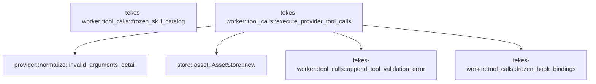

# tekes-worker::tool_calls

[Package atlas](index.md) · [Source](../../src/tool_calls.rs)

## Declarations

Visibility is the declaration spelling; trait members and reexports require their enclosing interface. `cfg` is not evaluated.

| Symbol | Kind | Visibility | Test / cfg |
|---|---|---|---|
| [tekes-worker::tool_calls::execute_provider_tool_calls](../../src/tool_calls.rs#L3) | function_item | `pub(crate)` |  |
| [tekes-worker::tool_calls::append_tool_validation_error](../../src/tool_calls.rs#L194) | function_item | `pub(crate)` |  |
| [tekes-worker::tool_calls::frozen_hook_bindings](../../src/tool_calls.rs#L211) | function_item | `pub(crate)` |  |
| [tekes-worker::tool_calls::frozen_skill_catalog](../../src/tool_calls.rs#L236) | function_item | `pub(crate)` |  |
| [tekes-worker::tool_calls::ToolCallBatch](../../src/tool_calls.rs#L290) | struct_item | `pub(crate)` |  |

## Imports / reexports

| Local name | Source path | Visibility |
|---|---|---|
| `*` | `super::*` | `private` |

## Module declarations

| Module | Visibility | Attributes |
|---|---|---|

## Function call graphs

Edges below are syntactically resolved calls only, including private functions. Graphs partition callers into groups of 20; they are not execution order. All unresolved sites are listed below and in the JSON inventory.

Functions 1–4: 4 direct edges

## Call sites

Includes test functions (marked in declarations). Receiver-type-required sites need type analysis/manual tracing. Calls in closures are attributed to their enclosing function; their occurrence here does not mean the closure executes immediately.

| Caller | Callee expression | Source lines | Target / classification |
|---|---|---|---|
| `execute_provider_tool_calls` | `ledger         .path()         .parent()         .ok_or("worker ledger has no thread folder")?         .to_path_buf` | [23](../../src/tool_calls.rs#L23) | receiver-type-required |
| `execute_provider_tool_calls` | `ledger         .path()         .parent()         .ok_or` | [23](../../src/tool_calls.rs#L23) | receiver-type-required |
| `execute_provider_tool_calls` | `ledger         .path()         .parent` | [23](../../src/tool_calls.rs#L23) | receiver-type-required |
| `execute_provider_tool_calls` | `ledger         .path` | [23](../../src/tool_calls.rs#L23) | receiver-type-required |
| `execute_provider_tool_calls` | `ledger         .projection()         .and_then(&#124;projection&#124; projection.events.first())         .and_then(&#124;genesis&#124; genesis.string_field("thread"))         .ok_or("genesis thread binding is missing")?         .to_owned` | [28](../../src/tool_calls.rs#L28) | receiver-type-required |
| `execute_provider_tool_calls` | `ledger         .projection()         .and_then(&#124;projection&#124; projection.events.first())         .and_then(&#124;genesis&#124; genesis.string_field("thread"))         .ok_or` | [28](../../src/tool_calls.rs#L28) | receiver-type-required |
| `execute_provider_tool_calls` | `ledger         .projection()         .and_then(&#124;projection&#124; projection.events.first())         .and_then` | [28](../../src/tool_calls.rs#L28) | receiver-type-required |
| `execute_provider_tool_calls` | `ledger         .projection()         .and_then` | [28](../../src/tool_calls.rs#L28) | receiver-type-required |
| `execute_provider_tool_calls` | `ledger         .projection` | [28](../../src/tool_calls.rs#L28) | receiver-type-required |
| `execute_provider_tool_calls` | `projection.events.first` | [30](../../src/tool_calls.rs#L30) | receiver-type-required |
| `execute_provider_tool_calls` | `genesis.string_field` | [31](../../src/tool_calls.rs#L31) | receiver-type-required |
| `execute_provider_tool_calls` | `BuiltinManifest::compiled` | [34](../../src/tool_calls.rs#L34) | external-constructor-callback-or-unresolved |
| `execute_provider_tool_calls` | `store::AssetStore::new` | [35](../../src/tool_calls.rs#L35) | [store::asset::AssetStore::new](../../../store/src/asset.rs#L27) |
| `execute_provider_tool_calls` | `thread_folder.join` | [35](../../src/tool_calls.rs#L35) | receiver-type-required |
| `execute_provider_tool_calls` | `frozen_hook_bindings` | [36](../../src/tool_calls.rs#L36) | [tekes-worker::tool_calls::frozen_hook_bindings](../../src/tool_calls.rs#L211) |
| `execute_provider_tool_calls` | `session_permission_policy` | [39](../../src/tool_calls.rs#L39) | external-constructor-callback-or-unresolved |
| `execute_provider_tool_calls` | `cancellation.supervisor_lost` | [41](../../src/tool_calls.rs#L41), [157](../../src/tool_calls.rs#L157) | receiver-type-required |
| `execute_provider_tool_calls` | `Err` | [42](../../src/tool_calls.rs#L42), [150](../../src/tool_calls.rs#L150), [158](../../src/tool_calls.rs#L158) | external-constructor-callback-or-unresolved |
| `execute_provider_tool_calls` | `Box::new` | [42](../../src/tool_calls.rs#L42), [150](../../src/tool_calls.rs#L150), [158](../../src/tool_calls.rs#L158) | external-constructor-callback-or-unresolved |
| `execute_provider_tool_calls` | `ProtocolFailure` | [42](../../src/tool_calls.rs#L42), [150](../../src/tool_calls.rs#L150), [158](../../src/tool_calls.rs#L158) | external-constructor-callback-or-unresolved |
| `execute_provider_tool_calls` | `"supervisor lost before tool execution".to_owned` | [43](../../src/tool_calls.rs#L43) | receiver-type-required |
| `execute_provider_tool_calls` | `cancellation.stop_requested` | [46](../../src/tool_calls.rs#L46), [154](../../src/tool_calls.rs#L154) | receiver-type-required |
| `execute_provider_tool_calls` | `Ok` | [47](../../src/tool_calls.rs#L47), [66](../../src/tool_calls.rs#L66), [155](../../src/tool_calls.rs#L155), [163](../../src/tool_calls.rs#L163), [187](../../src/tool_calls.rs#L187), [191](../../src/tool_calls.rs#L191) | external-constructor-callback-or-unresolved |
| `execute_provider_tool_calls` | `execute_child_spawn_tool` | [50](../../src/tool_calls.rs#L50) | external-constructor-callback-or-unresolved |
| `execute_provider_tool_calls` | `provider::invalid_arguments_detail` | [70](../../src/tool_calls.rs#L70) | [provider::normalize::invalid_arguments_detail](../../../provider/src/normalize.rs#L788) |
| `execute_provider_tool_calls` | `append_tool_validation_error` | [73](../../src/tool_calls.rs#L73), [82](../../src/tool_calls.rs#L82), [145](../../src/tool_calls.rs#L145) | [tekes-worker::tool_calls::append_tool_validation_error](../../src/tool_calls.rs#L194) |
| `execute_provider_tool_calls` | `invocation_write_roots` | [76](../../src/tool_calls.rs#L76) | external-constructor-callback-or-unresolved |
| `execute_provider_tool_calls` | `error.to_string` | [82](../../src/tool_calls.rs#L82), [129](../../src/tool_calls.rs#L129), [139](../../src/tool_calls.rs#L139) | receiver-type-required |
| `execute_provider_tool_calls` | `assemble_tool_backends` | [86](../../src/tool_calls.rs#L86) | external-constructor-callback-or-unresolved |
| `execute_provider_tool_calls` | `IJsonValue::parse` | [101](../../src/tool_calls.rs#L101) | external-constructor-callback-or-unresolved |
| `execute_provider_tool_calls` | `serde_json::to_vec` | [101](../../src/tool_calls.rs#L101) | external-constructor-callback-or-unresolved |
| `execute_provider_tool_calls` | `thread.clone` | [103](../../src/tool_calls.rs#L103) | receiver-type-required |
| `execute_provider_tool_calls` | `attempt.to_owned` | [105](../../src/tool_calls.rs#L105) | receiver-type-required |
| `execute_provider_tool_calls` | `call.call_id.clone` | [106](../../src/tool_calls.rs#L106) | receiver-type-required |
| `execute_provider_tool_calls` | `call.name.clone` | [107](../../src/tool_calls.rs#L107) | receiver-type-required |
| `execute_provider_tool_calls` | `options.event_timestamp().clone` | [109](../../src/tool_calls.rs#L109) | receiver-type-required |
| `execute_provider_tool_calls` | `options.event_timestamp` | [109](../../src/tool_calls.rs#L109) | receiver-type-required |
| `execute_provider_tool_calls` | `DynamicToolDispatcher::new(&profile.bindings.dynamic_catalog)             .deferred_search_entries(&dynamic_backend)?             .is_empty` | [111](../../src/tool_calls.rs#L111) | receiver-type-required |
| `execute_provider_tool_calls` | `DynamicToolDispatcher::new(&profile.bindings.dynamic_catalog)             .deferred_search_entries` | [111](../../src/tool_calls.rs#L111) | receiver-type-required |
| `execute_provider_tool_calls` | `DynamicToolDispatcher::new` | [111](../../src/tool_calls.rs#L111), [131](../../src/tool_calls.rs#L131) | external-constructor-callback-or-unresolved |
| `execute_provider_tool_calls` | `tool_catalog_context` | [114](../../src/tool_calls.rs#L114) | external-constructor-callback-or-unresolved |
| `execute_provider_tool_calls` | `ToolPipeline::new` | [115](../../src/tool_calls.rs#L115) | external-constructor-callback-or-unresolved |
| `execute_provider_tool_calls` | `assets.clone` | [115](../../src/tool_calls.rs#L115) | receiver-type-required |
| `execute_provider_tool_calls` | `SecretScanner::default` | [115](../../src/tool_calls.rs#L115) | external-constructor-callback-or-unresolved |
| `execute_provider_tool_calls` | `manifest             .tools             .iter()             .any` | [116](../../src/tool_calls.rs#L116) | receiver-type-required |
| `execute_provider_tool_calls` | `manifest             .tools             .iter` | [116](../../src/tool_calls.rs#L116) | receiver-type-required |
| `execute_provider_tool_calls` | `ToolDispatcher::new(&manifest, &context)                 .dispatch(                     &mut pipeline,                     &invocation,                     &hooks,                     &mut policy,                     &mut backend,                 )                 .map_err` | [121](../../src/tool_calls.rs#L121) | receiver-type-required |
| `execute_provider_tool_calls` | `ToolDispatcher::new(&manifest, &context)                 .dispatch` | [121](../../src/tool_calls.rs#L121) | receiver-type-required |
| `execute_provider_tool_calls` | `ToolDispatcher::new` | [121](../../src/tool_calls.rs#L121) | external-constructor-callback-or-unresolved |
| `execute_provider_tool_calls` | `DynamicToolDispatcher::new(&profile.bindings.dynamic_catalog)                 .dispatch(                     &mut pipeline,                     &invocation,                     &hooks,                     &mut policy,                     &mut dynamic_backend,                 )                 .map_err` | [131](../../src/tool_calls.rs#L131) | receiver-type-required |
| `execute_provider_tool_calls` | `DynamicToolDispatcher::new(&profile.bindings.dynamic_catalog)                 .dispatch` | [131](../../src/tool_calls.rs#L131) | receiver-type-required |
| `execute_provider_tool_calls` | `drop` | [144](../../src/tool_calls.rs#L144), [172](../../src/tool_calls.rs#L172), [173](../../src/tool_calls.rs#L173) | external-constructor-callback-or-unresolved |
| `execute_provider_tool_calls` | `cancellation.protocol_failed` | [149](../../src/tool_calls.rs#L149) | receiver-type-required |
| `execute_provider_tool_calls` | `"tool-control protocol failure".to_owned` | [151](../../src/tool_calls.rs#L151) | receiver-type-required |
| `execute_provider_tool_calls` | `"supervisor lost during tool execution".to_owned` | [159](../../src/tool_calls.rs#L159) | receiver-type-required |
| `execute_provider_tool_calls` | `wait_tool_continuation` | [174](../../src/tool_calls.rs#L174) | external-constructor-callback-or-unresolved |
| `append_tool_validation_error` | `make_event` | [201](../../src/tool_calls.rs#L201) | external-constructor-callback-or-unresolved |
| `append_tool_validation_error` | `ledger.append_contract` | [207](../../src/tool_calls.rs#L207) | receiver-type-required |
| `append_tool_validation_error` | `BarrierContext::default` | [207](../../src/tool_calls.rs#L207) | external-constructor-callback-or-unresolved |
| `append_tool_validation_error` | `Ok` | [208](../../src/tool_calls.rs#L208) | external-constructor-callback-or-unresolved |
| `frozen_hook_bindings` | `instruction         .effective         .hooks         .iter()         .filter(&#124;(_, index)&#124; {             instruction                 .sources                 .get(**index as usize)                 .and_then(&#124;source&#124; serde_json::from_str::<Value>(&source.content).ok())                 .is_some_and(&#124;value&#124; value["format"] == 1)         })         .map(&#124;(logical_name, index)&#124; {             let source = instruction                 .sources                 .get(*index as usize)                 .ok_or_else(&#124;&#124; format!("effective hook {logical_name:?} has an invalid index"))?;             decode_hook_binding(source.content.as_bytes(), logical_name)                 .map_err(&#124;error&#124; Box::new(error) as Box<dyn std::error::Error>)         })         .collect` | [214](../../src/tool_calls.rs#L214) | receiver-type-required |
| `frozen_hook_bindings` | `instruction         .effective         .hooks         .iter()         .filter(&#124;(_, index)&#124; {             instruction                 .sources                 .get(**index as usize)                 .and_then(&#124;source&#124; serde_json::from_str::<Value>(&source.content).ok())                 .is_some_and(&#124;value&#124; value["format"] == 1)         })         .map` | [214](../../src/tool_calls.rs#L214) | receiver-type-required |
| `frozen_hook_bindings` | `instruction         .effective         .hooks         .iter()         .filter` | [214](../../src/tool_calls.rs#L214) | receiver-type-required |
| `frozen_hook_bindings` | `instruction         .effective         .hooks         .iter` | [214](../../src/tool_calls.rs#L214) | receiver-type-required |
| `frozen_hook_bindings` | `instruction                 .sources                 .get(**index as usize)                 .and_then(&#124;source&#124; serde_json::from_str::<Value>(&source.content).ok())                 .is_some_and` | [219](../../src/tool_calls.rs#L219) | receiver-type-required |
| `frozen_hook_bindings` | `instruction                 .sources                 .get(**index as usize)                 .and_then` | [219](../../src/tool_calls.rs#L219) | receiver-type-required |
| `frozen_hook_bindings` | `instruction                 .sources                 .get` | [219](../../src/tool_calls.rs#L219), [226](../../src/tool_calls.rs#L226) | receiver-type-required |
| `frozen_hook_bindings` | `serde_json::from_str::<Value>(&source.content).ok` | [222](../../src/tool_calls.rs#L222) | receiver-type-required |
| `frozen_hook_bindings` | `serde_json::from_str::<Value>` | [222](../../src/tool_calls.rs#L222) | external-constructor-callback-or-unresolved |
| `frozen_hook_bindings` | `instruction                 .sources                 .get(*index as usize)                 .ok_or_else` | [226](../../src/tool_calls.rs#L226) | receiver-type-required |
| `frozen_hook_bindings` | `decode_hook_binding(source.content.as_bytes(), logical_name)                 .map_err` | [230](../../src/tool_calls.rs#L230) | receiver-type-required |
| `frozen_hook_bindings` | `decode_hook_binding` | [230](../../src/tool_calls.rs#L230) | external-constructor-callback-or-unresolved |
| `frozen_hook_bindings` | `source.content.as_bytes` | [230](../../src/tool_calls.rs#L230) | receiver-type-required |
| `frozen_hook_bindings` | `Box::new` | [231](../../src/tool_calls.rs#L231) | external-constructor-callback-or-unresolved |
| `frozen_skill_catalog` | `ResourceCatalog::from_snapshot` | [239](../../src/tool_calls.rs#L239) | external-constructor-callback-or-unresolved |
| `frozen_skill_catalog` | `resources         .skill_summaries()         .into_iter()         .map(&#124;summary&#124; {             let package = resources.skill(&summary.name)?;             let content = json!({                 "format": 1,                 "name": summary.name,                 "description": summary.description,                 "body": package.body,                 "resources": package.resources,             });             Ok(CatalogEntry {                 name: summary.name,                 summary: summary.description,                 aliases: Vec::new(),                 schema_digest: summary.content_digest,                 content: IJsonValue::parse(&serde_json::to_vec(&content)?)?,             })         })         .collect::<Result<Vec<_>, Box<dyn std::error::Error>>>` | [240](../../src/tool_calls.rs#L240) | receiver-type-required |
| `frozen_skill_catalog` | `resources         .skill_summaries()         .into_iter()         .map` | [240](../../src/tool_calls.rs#L240) | receiver-type-required |
| `frozen_skill_catalog` | `resources         .skill_summaries()         .into_iter` | [240](../../src/tool_calls.rs#L240) | receiver-type-required |
| `frozen_skill_catalog` | `resources         .skill_summaries` | [240](../../src/tool_calls.rs#L240) | receiver-type-required |
| `frozen_skill_catalog` | `resources.skill` | [244](../../src/tool_calls.rs#L244) | receiver-type-required |
| `frozen_skill_catalog` | `Ok` | [252](../../src/tool_calls.rs#L252), [276](../../src/tool_calls.rs#L276), [287](../../src/tool_calls.rs#L287) | external-constructor-callback-or-unresolved |
| `frozen_skill_catalog` | `Vec::new` | [255](../../src/tool_calls.rs#L255), [279](../../src/tool_calls.rs#L279) | external-constructor-callback-or-unresolved |
| `frozen_skill_catalog` | `IJsonValue::parse` | [257](../../src/tool_calls.rs#L257) | external-constructor-callback-or-unresolved |
| `frozen_skill_catalog` | `serde_json::to_vec` | [257](../../src/tool_calls.rs#L257) | external-constructor-callback-or-unresolved |
| `frozen_skill_catalog` | `instruction         .effective         .skills         .iter()         .filter(&#124;(logical_name, _)&#124; !logical_name.contains('/'))         .map(&#124;(logical_name, index)&#124; {             let source = instruction                 .sources                 .get(*index as usize)                 .ok_or_else(&#124;&#124; format!("effective skill {logical_name:?} has an invalid index"))?;             let summary = source                 .content                 .lines()                 .find(&#124;line&#124; !line.trim().is_empty())                 .map_or_else(&#124;&#124; logical_name.clone(), &#124;line&#124; line.trim().to_owned());             Ok(CatalogEntry {                 name: logical_name.clone(),                 summary,                 aliases: Vec::new(),                 schema_digest: source.content_sha256.clone(),                 content: IJsonValue::from(source.content.clone()),             })         })         .collect::<Result<Vec<_>, Box<dyn std::error::Error>>>` | [261](../../src/tool_calls.rs#L261) | receiver-type-required |
| `frozen_skill_catalog` | `instruction         .effective         .skills         .iter()         .filter(&#124;(logical_name, _)&#124; !logical_name.contains('/'))         .map` | [261](../../src/tool_calls.rs#L261) | receiver-type-required |
| `frozen_skill_catalog` | `instruction         .effective         .skills         .iter()         .filter` | [261](../../src/tool_calls.rs#L261) | receiver-type-required |
| `frozen_skill_catalog` | `instruction         .effective         .skills         .iter` | [261](../../src/tool_calls.rs#L261) | receiver-type-required |
| `frozen_skill_catalog` | `logical_name.contains` | [265](../../src/tool_calls.rs#L265) | receiver-type-required |
| `frozen_skill_catalog` | `instruction                 .sources                 .get(*index as usize)                 .ok_or_else` | [267](../../src/tool_calls.rs#L267) | receiver-type-required |
| `frozen_skill_catalog` | `instruction                 .sources                 .get` | [267](../../src/tool_calls.rs#L267) | receiver-type-required |
| `frozen_skill_catalog` | `source                 .content                 .lines()                 .find(&#124;line&#124; !line.trim().is_empty())                 .map_or_else` | [271](../../src/tool_calls.rs#L271) | receiver-type-required |
| `frozen_skill_catalog` | `source                 .content                 .lines()                 .find` | [271](../../src/tool_calls.rs#L271) | receiver-type-required |
| `frozen_skill_catalog` | `source                 .content                 .lines` | [271](../../src/tool_calls.rs#L271) | receiver-type-required |
| `frozen_skill_catalog` | `line.trim().is_empty` | [274](../../src/tool_calls.rs#L274) | receiver-type-required |
| `frozen_skill_catalog` | `line.trim` | [274](../../src/tool_calls.rs#L274), [275](../../src/tool_calls.rs#L275) | receiver-type-required |
| `frozen_skill_catalog` | `logical_name.clone` | [275](../../src/tool_calls.rs#L275), [277](../../src/tool_calls.rs#L277) | receiver-type-required |
| `frozen_skill_catalog` | `line.trim().to_owned` | [275](../../src/tool_calls.rs#L275) | receiver-type-required |
| `frozen_skill_catalog` | `source.content_sha256.clone` | [280](../../src/tool_calls.rs#L280) | receiver-type-required |
| `frozen_skill_catalog` | `IJsonValue::from` | [281](../../src/tool_calls.rs#L281) | external-constructor-callback-or-unresolved |
| `frozen_skill_catalog` | `source.content.clone` | [281](../../src/tool_calls.rs#L281) | receiver-type-required |
| `frozen_skill_catalog` | `entries.extend` | [285](../../src/tool_calls.rs#L285) | receiver-type-required |
| `frozen_skill_catalog` | `entries.sort_by` | [286](../../src/tool_calls.rs#L286) | receiver-type-required |
| `frozen_skill_catalog` | `left.name.as_bytes().cmp` | [286](../../src/tool_calls.rs#L286) | receiver-type-required |
| `frozen_skill_catalog` | `left.name.as_bytes` | [286](../../src/tool_calls.rs#L286) | receiver-type-required |
| `frozen_skill_catalog` | `right.name.as_bytes` | [286](../../src/tool_calls.rs#L286) | receiver-type-required |
