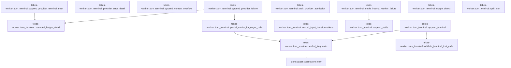

# tekes-worker::turn_terminal

[Package atlas](index.md) · [Source](../../src/turn_terminal.rs)

## Declarations

Visibility is the declaration spelling; trait members and reexports require their enclosing interface. `cfg` is not evaluated.

| Symbol | Kind | Visibility | Test / cfg |
|---|---|---|---|
| [tekes-worker::turn_terminal::PROVIDER_RETRIES](../../src/turn_terminal.rs#L4) | const_item | `pub(crate)` |  |
| [tekes-worker::turn_terminal::PROVIDER_ADMISSION_FLOOR](../../src/turn_terminal.rs#L5) | const_item | `private` |  |
| [tekes-worker::turn_terminal::PROVIDER_ADMISSION_CEILING](../../src/turn_terminal.rs#L6) | const_item | `private` |  |
| [tekes-worker::turn_terminal::PROVIDER_ADMISSION_SUBKIND](../../src/turn_terminal.rs#L7) | const_item | `pub(crate)` |  |
| [tekes-worker::turn_terminal::validate_terminal_tool_calls](../../src/turn_terminal.rs#L13) | function_item | `pub(crate)` |  |
| [tekes-worker::turn_terminal::TerminalAppend](../../src/turn_terminal.rs#L86) | struct_item | `pub(crate)` |  |
| [tekes-worker::turn_terminal::append_terminal](../../src/turn_terminal.rs#L96) | function_item | `pub(crate)` |  |
| [tekes-worker::turn_terminal::append_provider_terminal_error](../../src/turn_terminal.rs#L194) | function_item | `pub(crate)` |  |
| [tekes-worker::turn_terminal::provider_error_detail](../../src/turn_terminal.rs#L252) | function_item | `private` |  |
| [tekes-worker::turn_terminal::append_context_overflow](../../src/turn_terminal.rs#L267) | function_item | `pub(crate)` |  |
| [tekes-worker::turn_terminal::append_provider_failure](../../src/turn_terminal.rs#L293) | function_item | `pub(crate)` |  |
| [tekes-worker::turn_terminal::partial_carrier_for_eager_calls](../../src/turn_terminal.rs#L407) | function_item | `private` |  |
| [tekes-worker::turn_terminal::ProviderAdmissionRetry](../../src/turn_terminal.rs#L444) | struct_item | `pub(crate)` |  |
| [tekes-worker::turn_terminal::wait_provider_admission](../../src/turn_terminal.rs#L458) | function_item | `pub(crate)` |  |
| [tekes-worker::turn_terminal::settle_internal_worker_failure](../../src/turn_terminal.rs#L498) | function_item | `pub(crate)` |  |
| [tekes-worker::turn_terminal::bounded_ledger_detail](../../src/turn_terminal.rs#L530) | function_item | `pub(crate)` |  |
| [tekes-worker::turn_terminal::usage_object](../../src/turn_terminal.rs#L552) | function_item | `pub(crate)` |  |
| [tekes-worker::turn_terminal::record_input_transformations](../../src/turn_terminal.rs#L574) | function_item | `pub(crate)` |  |
| [tekes-worker::turn_terminal::sealed_fragments](../../src/turn_terminal.rs#L594) | function_item | `pub(crate)` |  |
| [tekes-worker::turn_terminal::spill_json](../../src/turn_terminal.rs#L608) | function_item | `pub(crate)` |  |
| [tekes-worker::turn_terminal::append_settle](../../src/turn_terminal.rs#L621) | function_item | `pub(crate)` |  |

## Imports / reexports

| Local name | Source path | Visibility |
|---|---|---|
| `*` | `super::*` | `private` |

## Module declarations

| Module | Visibility | Attributes |
|---|---|---|

## Function call graphs

Edges below are syntactically resolved calls only, including private functions. Graphs partition callers into groups of 20; they are not execution order. All unresolved sites are listed below and in the JSON inventory.

Functions 1–15: 9 direct edges

## Call sites

Includes test functions (marked in declarations). Receiver-type-required sites need type analysis/manual tracing. Calls in closures are attributed to their enclosing function; their occurrence here does not mean the closure executes immediately.

| Caller | Callee expression | Source lines | Target / classification |
|---|---|---|---|
| `PROVIDER_ADMISSION_FLOOR` | `Duration::from_secs` | [5](../../src/turn_terminal.rs#L5) | external-constructor-callback-or-unresolved |
| `PROVIDER_ADMISSION_CEILING` | `Duration::from_secs` | [6](../../src/turn_terminal.rs#L6) | external-constructor-callback-or-unresolved |
| `validate_terminal_tool_calls` | `std::collections::BTreeMap::<&str, (&str, &str, &Value)>::new` | [19](../../src/turn_terminal.rs#L19) | external-constructor-callback-or-unresolved |
| `validate_terminal_tool_calls` | `ledger         .projection()         .ok_or` | [20](../../src/turn_terminal.rs#L20) | receiver-type-required |
| `validate_terminal_tool_calls` | `ledger         .projection` | [20](../../src/turn_terminal.rs#L20) | receiver-type-required |
| `validate_terminal_tool_calls` | `Vec::with_capacity` | [24](../../src/turn_terminal.rs#L24) | external-constructor-callback-or-unresolved |
| `validate_terminal_tool_calls` | `events.len` | [24](../../src/turn_terminal.rs#L24) | receiver-type-required |
| `validate_terminal_tool_calls` | `event.kind` | [26](../../src/turn_terminal.rs#L26) | receiver-type-required |
| `validate_terminal_tool_calls` | `raws.push` | [29](../../src/turn_terminal.rs#L29) | receiver-type-required |
| `validate_terminal_tool_calls` | `serde_json::to_value` | [29](../../src/turn_terminal.rs#L29) | external-constructor-callback-or-unresolved |
| `validate_terminal_tool_calls` | `event.raw` | [29](../../src/turn_terminal.rs#L29) | receiver-type-required |
| `validate_terminal_tool_calls` | `durable.insert` | [32](../../src/turn_terminal.rs#L32) | receiver-type-required |
| `validate_terminal_tool_calls` | `event                 .string_field("call")                 .ok_or` | [33](../../src/turn_terminal.rs#L33) | receiver-type-required |
| `validate_terminal_tool_calls` | `event                 .string_field` | [33](../../src/turn_terminal.rs#L33) | receiver-type-required |
| `validate_terminal_tool_calls` | `event                     .string_field("attempt")                     .ok_or` | [37](../../src/turn_terminal.rs#L37) | receiver-type-required |
| `validate_terminal_tool_calls` | `event                     .string_field` | [37](../../src/turn_terminal.rs#L37), [40](../../src/turn_terminal.rs#L40) | receiver-type-required |
| `validate_terminal_tool_calls` | `event                     .string_field("name")                     .ok_or` | [40](../../src/turn_terminal.rs#L40) | receiver-type-required |
| `validate_terminal_tool_calls` | `raw.get("args").ok_or` | [43](../../src/turn_terminal.rs#L43) | receiver-type-required |
| `validate_terminal_tool_calls` | `raw.get` | [43](../../src/turn_terminal.rs#L43) | receiver-type-required |
| `validate_terminal_tool_calls` | `BTreeSet::new` | [47](../../src/turn_terminal.rs#L47) | external-constructor-callback-or-unresolved |
| `validate_terminal_tool_calls` | `call.call_id.is_empty` | [49](../../src/turn_terminal.rs#L49) | receiver-type-required |
| `validate_terminal_tool_calls` | `incoming.insert` | [49](../../src/turn_terminal.rs#L49) | receiver-type-required |
| `validate_terminal_tool_calls` | `call.call_id.as_str` | [49](../../src/turn_terminal.rs#L49), [56](../../src/turn_terminal.rs#L56), [75](../../src/turn_terminal.rs#L75) | receiver-type-required |
| `validate_terminal_tool_calls` | `Err` | [50](../../src/turn_terminal.rs#L50), [60](../../src/turn_terminal.rs#L60), [67](../../src/turn_terminal.rs#L67), [76](../../src/turn_terminal.rs#L76) | external-constructor-callback-or-unresolved |
| `validate_terminal_tool_calls` | `format!(                 "provider tool call id {} is empty or duplicated",                 call.call_id             )             .into` | [50](../../src/turn_terminal.rs#L50) | receiver-type-required |
| `validate_terminal_tool_calls` | `durable.get` | [56](../../src/turn_terminal.rs#L56) | receiver-type-required |
| `validate_terminal_tool_calls` | `eager.contains` | [59](../../src/turn_terminal.rs#L59) | receiver-type-required |
| `validate_terminal_tool_calls` | `format!(                 "provider tool call id {} reuses a durable call",                 call.call_id             )             .into` | [60](../../src/turn_terminal.rs#L60) | receiver-type-required |
| `validate_terminal_tool_calls` | `materialize_json` | [66](../../src/turn_terminal.rs#L66) | external-constructor-callback-or-unresolved |
| `validate_terminal_tool_calls` | `format!(                 "response terminal changed eagerly dispatched call {}",                 call.call_id             )             .into` | [67](../../src/turn_terminal.rs#L67) | receiver-type-required |
| `validate_terminal_tool_calls` | `incoming.contains` | [75](../../src/turn_terminal.rs#L75) | receiver-type-required |
| `validate_terminal_tool_calls` | `format!(                 "response terminal omitted eagerly dispatched call {}",                 call.call_id             )             .into` | [76](../../src/turn_terminal.rs#L76) | receiver-type-required |
| `validate_terminal_tool_calls` | `Ok` | [83](../../src/turn_terminal.rs#L83) | external-constructor-callback-or-unresolved |
| `append_terminal` | `std::collections::BTreeMap::new` | [110](../../src/turn_terminal.rs#L110) | external-constructor-callback-or-unresolved |
| `append_terminal` | `repair_provider_call_arguments` | [112](../../src/turn_terminal.rs#L112) | external-constructor-callback-or-unresolved |
| `append_terminal` | `call.call_id.clone` | [113](../../src/turn_terminal.rs#L113), [116](../../src/turn_terminal.rs#L116) | receiver-type-required |
| `append_terminal` | `local_provider_call_id` | [114](../../src/turn_terminal.rs#L114) | external-constructor-callback-or-unresolved |
| `append_terminal` | `wire_ids.insert` | [116](../../src/turn_terminal.rs#L116) | receiver-type-required |
| `append_terminal` | `validate_terminal_tool_calls` | [119](../../src/turn_terminal.rs#L119) | [tekes-worker::turn_terminal::validate_terminal_tool_calls](../../src/turn_terminal.rs#L13) |
| `append_terminal` | `terminal.response_identity.is_none` | [120](../../src/turn_terminal.rs#L120) | receiver-type-required |
| `append_terminal` | `Err` | [121](../../src/turn_terminal.rs#L121) | external-constructor-callback-or-unresolved |
| `append_terminal` | `"server-managed provider terminal lacks continuation identity".into` | [121](../../src/turn_terminal.rs#L121) | receiver-type-required |
| `append_terminal` | `Vec::new` | [123](../../src/turn_terminal.rs#L123) | external-constructor-callback-or-unresolved |
| `append_terminal` | `output_content.push` | [126](../../src/turn_terminal.rs#L126) | receiver-type-required |
| `append_terminal` | `sealed_fragments` | [128](../../src/turn_terminal.rs#L128), [154](../../src/turn_terminal.rs#L154) | [tekes-worker::turn_terminal::sealed_fragments](../../src/turn_terminal.rs#L594) |
| `append_terminal` | `text.as_bytes` | [128](../../src/turn_terminal.rs#L128) | receiver-type-required |
| `append_terminal` | `make_event` | [129](../../src/turn_terminal.rs#L129), [169](../../src/turn_terminal.rs#L169) | external-constructor-callback-or-unresolved |
| `append_terminal` | `ledger.append_contract` | [133](../../src/turn_terminal.rs#L133), [171](../../src/turn_terminal.rs#L171) | receiver-type-required |
| `append_terminal` | `BarrierContext::default` | [133](../../src/turn_terminal.rs#L133), [171](../../src/turn_terminal.rs#L171) | external-constructor-callback-or-unresolved |
| `append_terminal` | `eager.contains` | [140](../../src/turn_terminal.rs#L140) | receiver-type-required |
| `append_terminal` | `append_provider_tool_call_with_wire_id` | [143](../../src/turn_terminal.rs#L143) | external-constructor-callback-or-unresolved |
| `append_terminal` | `wire_ids.get(&call.call_id).map` | [150](../../src/turn_terminal.rs#L150) | receiver-type-required |
| `append_terminal` | `wire_ids.get` | [150](../../src/turn_terminal.rs#L150) | receiver-type-required |
| `append_terminal` | `serde_json_canonicalizer::to_vec` | [153](../../src/turn_terminal.rs#L153) | external-constructor-callback-or-unresolved |
| `append_terminal` | `terminal.response_identity.as_deref` | [162](../../src/turn_terminal.rs#L162) | receiver-type-required |
| `append_terminal` | `output                 .as_object_mut()                 .expect("output object")                 .insert` | [163](../../src/turn_terminal.rs#L163) | receiver-type-required |
| `append_terminal` | `output                 .as_object_mut()                 .expect` | [163](../../src/turn_terminal.rs#L163) | receiver-type-required |
| `append_terminal` | `output                 .as_object_mut` | [163](../../src/turn_terminal.rs#L163) | receiver-type-required |
| `append_terminal` | `"continuation".to_owned` | [166](../../src/turn_terminal.rs#L166) | receiver-type-required |
| `append_terminal` | `event.seq` | [170](../../src/turn_terminal.rs#L170) | receiver-type-required |
| `append_terminal` | `terminal.is_final_answer` | [173](../../src/turn_terminal.rs#L173) | receiver-type-required |
| `append_terminal` | `Some` | [173](../../src/turn_terminal.rs#L173), [175](../../src/turn_terminal.rs#L175) | external-constructor-callback-or-unresolved |
| `append_terminal` | `Ok` | [183](../../src/turn_terminal.rs#L183) | external-constructor-callback-or-unresolved |
| `append_provider_terminal_error` | `Some` | [209](../../src/turn_terminal.rs#L209), [230](../../src/turn_terminal.rs#L230), [232](../../src/turn_terminal.rs#L232), [243](../../src/turn_terminal.rs#L243) | external-constructor-callback-or-unresolved |
| `append_provider_terminal_error` | `terminal                 .stop_details                 .as_ref()                 .and_then(&#124;details&#124; details.get("category"))                 .and_then` | [210](../../src/turn_terminal.rs#L210) | receiver-type-required |
| `append_provider_terminal_error` | `terminal                 .stop_details                 .as_ref()                 .and_then` | [210](../../src/turn_terminal.rs#L210) | receiver-type-required |
| `append_provider_terminal_error` | `terminal                 .stop_details                 .as_ref` | [210](../../src/turn_terminal.rs#L210) | receiver-type-required |
| `append_provider_terminal_error` | `details.get` | [213](../../src/turn_terminal.rs#L213) | receiver-type-required |
| `append_provider_terminal_error` | `bounded_ledger_detail` | [216](../../src/turn_terminal.rs#L216), [226](../../src/turn_terminal.rs#L226), [230](../../src/turn_terminal.rs#L230) | [tekes-worker::turn_terminal::bounded_ledger_detail](../../src/turn_terminal.rs#L530) |
| `append_provider_terminal_error` | `"content_filter".to_owned` | [217](../../src/turn_terminal.rs#L217) | receiver-type-required |
| `append_provider_terminal_error` | `terminal             .provider_error             .as_ref()             .and_then(provider_error_detail)             .or_else(&#124;&#124; terminal.incomplete_reason.clone())             .map` | [221](../../src/turn_terminal.rs#L221) | receiver-type-required |
| `append_provider_terminal_error` | `terminal             .provider_error             .as_ref()             .and_then(provider_error_detail)             .or_else` | [221](../../src/turn_terminal.rs#L221) | receiver-type-required |
| `append_provider_terminal_error` | `terminal             .provider_error             .as_ref()             .and_then` | [221](../../src/turn_terminal.rs#L221) | receiver-type-required |
| `append_provider_terminal_error` | `terminal             .provider_error             .as_ref` | [221](../../src/turn_terminal.rs#L221) | receiver-type-required |
| `append_provider_terminal_error` | `terminal.incomplete_reason.clone` | [225](../../src/turn_terminal.rs#L225) | receiver-type-required |
| `append_provider_terminal_error` | `Value::String` | [236](../../src/turn_terminal.rs#L236) | external-constructor-callback-or-unresolved |
| `append_provider_terminal_error` | `make_event` | [238](../../src/turn_terminal.rs#L238) | external-constructor-callback-or-unresolved |
| `append_provider_terminal_error` | `event.seq` | [239](../../src/turn_terminal.rs#L239) | receiver-type-required |
| `append_provider_terminal_error` | `ledger.append_contract` | [240](../../src/turn_terminal.rs#L240) | receiver-type-required |
| `append_provider_terminal_error` | `BarrierContext::default` | [240](../../src/turn_terminal.rs#L240) | external-constructor-callback-or-unresolved |
| `append_provider_terminal_error` | `Ok` | [241](../../src/turn_terminal.rs#L241) | external-constructor-callback-or-unresolved |
| `append_provider_terminal_error` | `Vec::new` | [248](../../src/turn_terminal.rs#L248) | external-constructor-callback-or-unresolved |
| `provider_error_detail` | `value.get("error").unwrap_or` | [253](../../src/turn_terminal.rs#L253) | receiver-type-required |
| `provider_error_detail` | `value.get` | [253](../../src/turn_terminal.rs#L253) | receiver-type-required |
| `provider_error_detail` | `["code", "type", "message"]         .into_iter()         .filter_map(&#124;field&#124; {             value                 .get(field)                 .and_then(Value::as_str)                 .filter(&#124;value&#124; !value.is_empty())                 .map(&#124;value&#124; format!("{field}={value}"))         })         .collect::<Vec<_>>` | [254](../../src/turn_terminal.rs#L254) | receiver-type-required |
| `provider_error_detail` | `["code", "type", "message"]         .into_iter()         .filter_map` | [254](../../src/turn_terminal.rs#L254) | receiver-type-required |
| `provider_error_detail` | `["code", "type", "message"]         .into_iter` | [254](../../src/turn_terminal.rs#L254) | receiver-type-required |
| `provider_error_detail` | `value                 .get(field)                 .and_then(Value::as_str)                 .filter(&#124;value&#124; !value.is_empty())                 .map` | [257](../../src/turn_terminal.rs#L257) | receiver-type-required |
| `provider_error_detail` | `value                 .get(field)                 .and_then(Value::as_str)                 .filter` | [257](../../src/turn_terminal.rs#L257) | receiver-type-required |
| `provider_error_detail` | `value                 .get(field)                 .and_then` | [257](../../src/turn_terminal.rs#L257) | receiver-type-required |
| `provider_error_detail` | `value                 .get` | [257](../../src/turn_terminal.rs#L257) | receiver-type-required |
| `provider_error_detail` | `value.is_empty` | [260](../../src/turn_terminal.rs#L260) | receiver-type-required |
| `provider_error_detail` | `(!fields.is_empty()).then` | [264](../../src/turn_terminal.rs#L264) | receiver-type-required |
| `provider_error_detail` | `fields.is_empty` | [264](../../src/turn_terminal.rs#L264) | receiver-type-required |
| `provider_error_detail` | `fields.join` | [264](../../src/turn_terminal.rs#L264) | receiver-type-required |
| `append_context_overflow` | `make_event` | [274](../../src/turn_terminal.rs#L274) | external-constructor-callback-or-unresolved |
| `append_context_overflow` | `event.seq` | [279](../../src/turn_terminal.rs#L279) | receiver-type-required |
| `append_context_overflow` | `ledger.append_contract` | [280](../../src/turn_terminal.rs#L280) | receiver-type-required |
| `append_context_overflow` | `BarrierContext::default` | [280](../../src/turn_terminal.rs#L280) | external-constructor-callback-or-unresolved |
| `append_context_overflow` | `Ok` | [281](../../src/turn_terminal.rs#L281) | external-constructor-callback-or-unresolved |
| `append_context_overflow` | `Vec::new` | [288](../../src/turn_terminal.rs#L288) | external-constructor-callback-or-unresolved |
| `append_provider_failure` | `detail.as_ref().map_or_else` | [306](../../src/turn_terminal.rs#L306) | receiver-type-required |
| `append_provider_failure` | `detail.as_ref` | [306](../../src/turn_terminal.rs#L306) | receiver-type-required |
| `append_provider_failure` | `Some` | [312](../../src/turn_terminal.rs#L312), [347](../../src/turn_terminal.rs#L347), [357](../../src/turn_terminal.rs#L357) | external-constructor-callback-or-unresolved |
| `append_provider_failure` | `status.map_or_else` | [334](../../src/turn_terminal.rs#L334) | receiver-type-required |
| `append_provider_failure` | `detail.clone` | [335](../../src/turn_terminal.rs#L335) | receiver-type-required |
| `append_provider_failure` | `cancellation.supervisor_lost` | [349](../../src/turn_terminal.rs#L349) | receiver-type-required |
| `append_provider_failure` | `"supervisor_lost".to_owned` | [350](../../src/turn_terminal.rs#L350) | receiver-type-required |
| `append_provider_failure` | `cancellation.stop_requested` | [352](../../src/turn_terminal.rs#L352) | receiver-type-required |
| `append_provider_failure` | `"user_stop".to_owned` | [354](../../src/turn_terminal.rs#L354) | receiver-type-required |
| `append_provider_failure` | `"cancelled".to_owned` | [359](../../src/turn_terminal.rs#L359) | receiver-type-required |
| `append_provider_failure` | `bounded_ledger_detail` | [361](../../src/turn_terminal.rs#L361) | [tekes-worker::turn_terminal::bounded_ledger_detail](../../src/turn_terminal.rs#L530) |
| `append_provider_failure` | `partial_carrier_for_eager_calls` | [372](../../src/turn_terminal.rs#L372) | [tekes-worker::turn_terminal::partial_carrier_for_eager_calls](../../src/turn_terminal.rs#L407) |
| `append_provider_failure` | `error                 .as_object_mut()                 .expect("error object")                 .insert` | [373](../../src/turn_terminal.rs#L373) | receiver-type-required |
| `append_provider_failure` | `error                 .as_object_mut()                 .expect` | [373](../../src/turn_terminal.rs#L373) | receiver-type-required |
| `append_provider_failure` | `error                 .as_object_mut` | [373](../../src/turn_terminal.rs#L373) | receiver-type-required |
| `append_provider_failure` | `"sealed".to_owned` | [376](../../src/turn_terminal.rs#L376) | receiver-type-required |
| `append_provider_failure` | `make_event` | [379](../../src/turn_terminal.rs#L379) | external-constructor-callback-or-unresolved |
| `append_provider_failure` | `event.seq` | [380](../../src/turn_terminal.rs#L380) | receiver-type-required |
| `append_provider_failure` | `ledger.append_contract` | [381](../../src/turn_terminal.rs#L381) | receiver-type-required |
| `append_provider_failure` | `BarrierContext::default` | [381](../../src/turn_terminal.rs#L381) | external-constructor-callback-or-unresolved |
| `append_provider_failure` | `Ok` | [382](../../src/turn_terminal.rs#L382) | external-constructor-callback-or-unresolved |
| `append_provider_failure` | `retry.then_some` | [386](../../src/turn_terminal.rs#L386) | receiver-type-required |
| `append_provider_failure` | `Vec::new` | [395](../../src/turn_terminal.rs#L395) | external-constructor-callback-or-unresolved |
| `partial_carrier_for_eager_calls` | `eager.calls.is_empty` | [413](../../src/turn_terminal.rs#L413) | receiver-type-required |
| `partial_carrier_for_eager_calls` | `Ok` | [414](../../src/turn_terminal.rs#L414), [417](../../src/turn_terminal.rs#L417), [434](../../src/turn_terminal.rs#L434), [438](../../src/turn_terminal.rs#L438) | external-constructor-callback-or-unresolved |
| `partial_carrier_for_eager_calls` | `partial.as_array` | [416](../../src/turn_terminal.rs#L416) | receiver-type-required |
| `partial_carrier_for_eager_calls` | `items         .iter()         .filter_map(&#124;item&#124; {             match item.get("type").and_then(Value::as_str)? {                 "tool_use" => item.get("id"),                 _ => item.get("call_id"),             }             .and_then(Value::as_str)         })         .collect::<BTreeSet<_>>` | [419](../../src/turn_terminal.rs#L419) | receiver-type-required |
| `partial_carrier_for_eager_calls` | `items         .iter()         .filter_map` | [419](../../src/turn_terminal.rs#L419) | receiver-type-required |
| `partial_carrier_for_eager_calls` | `items         .iter` | [419](../../src/turn_terminal.rs#L419) | receiver-type-required |
| `partial_carrier_for_eager_calls` | `match item.get("type").and_then(Value::as_str)? {                 "tool_use" => item.get("id"),                 _ => item.get("call_id"),             }             .and_then` | [422](../../src/turn_terminal.rs#L422) | receiver-type-required |
| `partial_carrier_for_eager_calls` | `item.get("type").and_then` | [422](../../src/turn_terminal.rs#L422) | receiver-type-required |
| `partial_carrier_for_eager_calls` | `item.get` | [422](../../src/turn_terminal.rs#L422), [423](../../src/turn_terminal.rs#L423), [424](../../src/turn_terminal.rs#L424) | receiver-type-required |
| `partial_carrier_for_eager_calls` | `eager.calls.iter().all` | [429](../../src/turn_terminal.rs#L429) | receiver-type-required |
| `partial_carrier_for_eager_calls` | `eager.calls.iter` | [429](../../src/turn_terminal.rs#L429) | receiver-type-required |
| `partial_carrier_for_eager_calls` | `eager.wire_ids.get(&call.call_id).unwrap_or` | [430](../../src/turn_terminal.rs#L430) | receiver-type-required |
| `partial_carrier_for_eager_calls` | `eager.wire_ids.get` | [430](../../src/turn_terminal.rs#L430) | receiver-type-required |
| `partial_carrier_for_eager_calls` | `sealed_calls.contains` | [431](../../src/turn_terminal.rs#L431) | receiver-type-required |
| `partial_carrier_for_eager_calls` | `wire_id.as_str` | [431](../../src/turn_terminal.rs#L431) | receiver-type-required |
| `partial_carrier_for_eager_calls` | `serde_json_canonicalizer::to_vec` | [436](../../src/turn_terminal.rs#L436) | external-constructor-callback-or-unresolved |
| `partial_carrier_for_eager_calls` | `sealed_fragments` | [437](../../src/turn_terminal.rs#L437) | [tekes-worker::turn_terminal::sealed_fragments](../../src/turn_terminal.rs#L594) |
| `partial_carrier_for_eager_calls` | `Some` | [438](../../src/turn_terminal.rs#L438) | external-constructor-callback-or-unresolved |
| `wait_provider_admission` | `PROVIDER_RETRIES.saturating_sub` | [471](../../src/turn_terminal.rs#L471) | receiver-type-required |
| `wait_provider_admission` | `Duration::from_secs` | [472](../../src/turn_terminal.rs#L472) | external-constructor-callback-or-unresolved |
| `wait_provider_admission` | `u32::from` | [472](../../src/turn_terminal.rs#L472) | external-constructor-callback-or-unresolved |
| `wait_provider_admission` | `exhausted.min` | [472](../../src/turn_terminal.rs#L472) | receiver-type-required |
| `wait_provider_admission` | `retry_after_seconds         .map_or(backoff, Duration::from_secs)         .clamp` | [473](../../src/turn_terminal.rs#L473) | receiver-type-required |
| `wait_provider_admission` | `retry_after_seconds         .map_or` | [473](../../src/turn_terminal.rs#L473) | receiver-type-required |
| `wait_provider_admission` | `rfc3339_after` | [476](../../src/turn_terminal.rs#L476) | external-constructor-callback-or-unresolved |
| `wait_provider_admission` | `make_event` | [477](../../src/turn_terminal.rs#L477) | external-constructor-callback-or-unresolved |
| `wait_provider_admission` | `ledger.append_contract` | [487](../../src/turn_terminal.rs#L487) | receiver-type-required |
| `wait_provider_admission` | `BarrierContext::default` | [487](../../src/turn_terminal.rs#L487) | external-constructor-callback-or-unresolved |
| `wait_provider_admission` | `Instant::now` | [488](../../src/turn_terminal.rs#L488), [489](../../src/turn_terminal.rs#L489), [493](../../src/turn_terminal.rs#L493) | external-constructor-callback-or-unresolved |
| `wait_provider_admission` | `cancellation.stop_requested` | [490](../../src/turn_terminal.rs#L490) | receiver-type-required |
| `wait_provider_admission` | `cancellation.supervisor_lost` | [490](../../src/turn_terminal.rs#L490) | receiver-type-required |
| `wait_provider_admission` | `std::thread::sleep` | [493](../../src/turn_terminal.rs#L493) | external-constructor-callback-or-unresolved |
| `wait_provider_admission` | `(deadline - Instant::now()).min` | [493](../../src/turn_terminal.rs#L493) | receiver-type-required |
| `wait_provider_admission` | `Duration::from_millis` | [493](../../src/turn_terminal.rs#L493) | external-constructor-callback-or-unresolved |
| `wait_provider_admission` | `Ok` | [495](../../src/turn_terminal.rs#L495) | external-constructor-callback-or-unresolved |
| `settle_internal_worker_failure` | `ledger.projection` | [503](../../src/turn_terminal.rs#L503) | receiver-type-required |
| `settle_internal_worker_failure` | `Err` | [504](../../src/turn_terminal.rs#L504), [510](../../src/turn_terminal.rs#L510), [513](../../src/turn_terminal.rs#L513) | external-constructor-callback-or-unresolved |
| `settle_internal_worker_failure` | `"worker ledger projection missing while reporting failure".into` | [504](../../src/turn_terminal.rs#L504) | receiver-type-required |
| `settle_internal_worker_failure` | `unresolved_attempt(ledger)?.is_some` | [508](../../src/turn_terminal.rs#L508) | receiver-type-required |
| `settle_internal_worker_failure` | `unresolved_attempt` | [508](../../src/turn_terminal.rs#L508) | external-constructor-callback-or-unresolved |
| `settle_internal_worker_failure` | `error.to_string().into` | [510](../../src/turn_terminal.rs#L510), [513](../../src/turn_terminal.rs#L513) | receiver-type-required |
| `settle_internal_worker_failure` | `error.to_string` | [510](../../src/turn_terminal.rs#L510), [513](../../src/turn_terminal.rs#L513) | receiver-type-required |
| `settle_internal_worker_failure` | `make_event` | [515](../../src/turn_terminal.rs#L515) | external-constructor-callback-or-unresolved |
| `settle_internal_worker_failure` | `ledger.append_contract` | [520](../../src/turn_terminal.rs#L520) | receiver-type-required |
| `settle_internal_worker_failure` | `BarrierContext::default` | [520](../../src/turn_terminal.rs#L520) | external-constructor-callback-or-unresolved |
| `settle_internal_worker_failure` | `append_settle` | [521](../../src/turn_terminal.rs#L521) | [tekes-worker::turn_terminal::append_settle](../../src/turn_terminal.rs#L621) |
| `settle_internal_worker_failure` | `options.event_timestamp` | [523](../../src/turn_terminal.rs#L523) | receiver-type-required |
| `settle_internal_worker_failure` | `Some` | [526](../../src/turn_terminal.rs#L526) | external-constructor-callback-or-unresolved |
| `bounded_ledger_detail` | `value.replace` | [531](../../src/turn_terminal.rs#L531) | receiver-type-required |
| `bounded_ledger_detail` | `IJsonValue::parse(         &serde_json::to_vec(&sanitized).expect("diagnostic string is JSON serializable"),     )     .map` | [532](../../src/turn_terminal.rs#L532) | receiver-type-required |
| `bounded_ledger_detail` | `IJsonValue::parse` | [532](../../src/turn_terminal.rs#L532) | external-constructor-callback-or-unresolved |
| `bounded_ledger_detail` | `serde_json::to_vec(&sanitized).expect` | [533](../../src/turn_terminal.rs#L533) | receiver-type-required |
| `bounded_ledger_detail` | `serde_json::to_vec` | [533](../../src/turn_terminal.rs#L533) | external-constructor-callback-or-unresolved |
| `bounded_ledger_detail` | `SecretScanner::default().scan` | [535](../../src/turn_terminal.rs#L535) | receiver-type-required |
| `bounded_ledger_detail` | `SecretScanner::default` | [535](../../src/turn_terminal.rs#L535) | external-constructor-callback-or-unresolved |
| `bounded_ledger_detail` | `serde_json::to_value(value)             .ok()             .and_then(&#124;value&#124; value.as_str().map(str::to_owned))             .unwrap_or_else` | [537](../../src/turn_terminal.rs#L537) | receiver-type-required |
| `bounded_ledger_detail` | `serde_json::to_value(value)             .ok()             .and_then` | [537](../../src/turn_terminal.rs#L537) | receiver-type-required |
| `bounded_ledger_detail` | `serde_json::to_value(value)             .ok` | [537](../../src/turn_terminal.rs#L537) | receiver-type-required |
| `bounded_ledger_detail` | `serde_json::to_value` | [537](../../src/turn_terminal.rs#L537) | external-constructor-callback-or-unresolved |
| `bounded_ledger_detail` | `value.as_str().map` | [539](../../src/turn_terminal.rs#L539) | receiver-type-required |
| `bounded_ledger_detail` | `value.as_str` | [539](../../src/turn_terminal.rs#L539) | receiver-type-required |
| `bounded_ledger_detail` | `"diagnostic unavailable".to_owned` | [540](../../src/turn_terminal.rs#L540) | receiver-type-required |
| `bounded_ledger_detail` | `"diagnostic withheld".to_owned` | [541](../../src/turn_terminal.rs#L541) | receiver-type-required |
| `bounded_ledger_detail` | `sanitized.len().min` | [543](../../src/turn_terminal.rs#L543) | receiver-type-required |
| `bounded_ledger_detail` | `sanitized.len` | [543](../../src/turn_terminal.rs#L543) | receiver-type-required |
| `bounded_ledger_detail` | `sanitized.is_char_boundary` | [544](../../src/turn_terminal.rs#L544) | receiver-type-required |
| `bounded_ledger_detail` | `sanitized[..end].to_owned` | [547](../../src/turn_terminal.rs#L547) | receiver-type-required |
| `usage_object` | `value.as_object_mut().expect` | [557](../../src/turn_terminal.rs#L557) | receiver-type-required |
| `usage_object` | `value.as_object_mut` | [557](../../src/turn_terminal.rs#L557) | receiver-type-required |
| `usage_object` | `usage.input_tokens.as_ref` | [559](../../src/turn_terminal.rs#L559) | receiver-type-required |
| `usage_object` | `usage.output_tokens.as_ref` | [560](../../src/turn_terminal.rs#L560) | receiver-type-required |
| `usage_object` | `usage.cache_read.as_ref` | [561](../../src/turn_terminal.rs#L561) | receiver-type-required |
| `usage_object` | `usage.cache_miss.as_ref` | [562](../../src/turn_terminal.rs#L562) | receiver-type-required |
| `usage_object` | `usage.cache_write.as_ref` | [563](../../src/turn_terminal.rs#L563) | receiver-type-required |
| `usage_object` | `usage.reasoning_tokens.as_ref` | [564](../../src/turn_terminal.rs#L564) | receiver-type-required |
| `usage_object` | `object.insert` | [567](../../src/turn_terminal.rs#L567) | receiver-type-required |
| `usage_object` | `field.to_owned` | [567](../../src/turn_terminal.rs#L567) | receiver-type-required |
| `usage_object` | `Value::String` | [567](../../src/turn_terminal.rs#L567) | external-constructor-callback-or-unresolved |
| `usage_object` | `figure.clone` | [567](../../src/turn_terminal.rs#L567) | receiver-type-required |
| `record_input_transformations` | `sealed_fragments` | [583](../../src/turn_terminal.rs#L583) | [tekes-worker::turn_terminal::sealed_fragments](../../src/turn_terminal.rs#L594) |
| `record_input_transformations` | `serde_json_canonicalizer::to_vec` | [583](../../src/turn_terminal.rs#L583) | external-constructor-callback-or-unresolved |
| `record_input_transformations` | `make_event` | [584](../../src/turn_terminal.rs#L584) | external-constructor-callback-or-unresolved |
| `record_input_transformations` | `ledger.append_contract` | [590](../../src/turn_terminal.rs#L590) | receiver-type-required |
| `record_input_transformations` | `BarrierContext::default` | [590](../../src/turn_terminal.rs#L590) | external-constructor-callback-or-unresolved |
| `record_input_transformations` | `Ok` | [591](../../src/turn_terminal.rs#L591) | external-constructor-callback-or-unresolved |
| `sealed_fragments` | `std::str::from_utf8` | [598](../../src/turn_terminal.rs#L598) | external-constructor-callback-or-unresolved |
| `sealed_fragments` | `serde_json_canonicalizer::to_vec` | [599](../../src/turn_terminal.rs#L599) | external-constructor-callback-or-unresolved |
| `sealed_fragments` | `Value::String` | [599](../../src/turn_terminal.rs#L599), [601](../../src/turn_terminal.rs#L601) | external-constructor-callback-or-unresolved |
| `sealed_fragments` | `text.to_owned` | [599](../../src/turn_terminal.rs#L599), [601](../../src/turn_terminal.rs#L601) | receiver-type-required |
| `sealed_fragments` | `encoded.len` | [600](../../src/turn_terminal.rs#L600) | receiver-type-required |
| `sealed_fragments` | `Ok` | [601](../../src/turn_terminal.rs#L601), [605](../../src/turn_terminal.rs#L605) | external-constructor-callback-or-unresolved |
| `sealed_fragments` | `ledger.path().parent().ok_or` | [603](../../src/turn_terminal.rs#L603) | receiver-type-required |
| `sealed_fragments` | `ledger.path().parent` | [603](../../src/turn_terminal.rs#L603) | receiver-type-required |
| `sealed_fragments` | `ledger.path` | [603](../../src/turn_terminal.rs#L603) | receiver-type-required |
| `sealed_fragments` | `store::AssetStore::new(folder.join("assets"))?.publish` | [604](../../src/turn_terminal.rs#L604) | receiver-type-required |
| `sealed_fragments` | `store::AssetStore::new` | [604](../../src/turn_terminal.rs#L604) | [store::asset::AssetStore::new](../../../store/src/asset.rs#L27) |
| `sealed_fragments` | `folder.join` | [604](../../src/turn_terminal.rs#L604) | receiver-type-required |
| `spill_json` | `serde_json_canonicalizer::to_vec` | [612](../../src/turn_terminal.rs#L612) | external-constructor-callback-or-unresolved |
| `spill_json` | `bytes.len` | [613](../../src/turn_terminal.rs#L613) | receiver-type-required |
| `spill_json` | `Ok` | [614](../../src/turn_terminal.rs#L614), [618](../../src/turn_terminal.rs#L618) | external-constructor-callback-or-unresolved |
| `spill_json` | `value.clone` | [614](../../src/turn_terminal.rs#L614) | receiver-type-required |
| `spill_json` | `ledger.path().parent().ok_or` | [616](../../src/turn_terminal.rs#L616) | receiver-type-required |
| `spill_json` | `ledger.path().parent` | [616](../../src/turn_terminal.rs#L616) | receiver-type-required |
| `spill_json` | `ledger.path` | [616](../../src/turn_terminal.rs#L616) | receiver-type-required |
| `spill_json` | `AssetStore::new(folder.join("assets"))?.publish` | [617](../../src/turn_terminal.rs#L617) | receiver-type-required |
| `spill_json` | `AssetStore::new` | [617](../../src/turn_terminal.rs#L617) | external-constructor-callback-or-unresolved |
| `spill_json` | `folder.join` | [617](../../src/turn_terminal.rs#L617) | receiver-type-required |
| `append_settle` | `value.as_object_mut().expect("settle object").insert` | [633](../../src/turn_terminal.rs#L633) | receiver-type-required |
| `append_settle` | `value.as_object_mut().expect` | [633](../../src/turn_terminal.rs#L633) | receiver-type-required |
| `append_settle` | `value.as_object_mut` | [633](../../src/turn_terminal.rs#L633) | receiver-type-required |
| `append_settle` | `if outcome == "error" {                 "classification"             } else {                 "reason"             }             .to_owned` | [634](../../src/turn_terminal.rs#L634) | receiver-type-required |
| `append_settle` | `Value::String` | [640](../../src/turn_terminal.rs#L640) | external-constructor-callback-or-unresolved |
| `append_settle` | `reason.to_owned` | [640](../../src/turn_terminal.rs#L640) | receiver-type-required |
| `append_settle` | `ledger.append_contract` | [643](../../src/turn_terminal.rs#L643) | receiver-type-required |
| `append_settle` | `make_event` | [643](../../src/turn_terminal.rs#L643) | external-constructor-callback-or-unresolved |
| `append_settle` | `BarrierContext::default` | [643](../../src/turn_terminal.rs#L643) | external-constructor-callback-or-unresolved |
| `append_settle` | `Ok` | [644](../../src/turn_terminal.rs#L644) | external-constructor-callback-or-unresolved |
