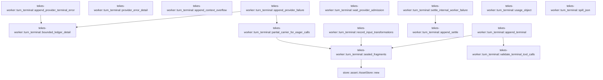

# tekes-worker::turn_terminal

[Package atlas](index.md) · [Source](../../src/turn_terminal.rs)

## Declarations

Visibility is the declaration spelling; trait members and reexports require their enclosing interface. `cfg` is not evaluated.

| Symbol | Kind | Visibility | Test / cfg |
|---|---|---|---|
| [tekes-worker::turn_terminal::PROVIDER_RETRIES](../../src/turn_terminal.rs#L4) | const_item | `pub(crate)` |  |
| [tekes-worker::turn_terminal::PROVIDER_ADMISSION_FLOOR](../../src/turn_terminal.rs#L5) | const_item | `private` |  |
| [tekes-worker::turn_terminal::PROVIDER_ADMISSION_CEILING](../../src/turn_terminal.rs#L6) | const_item | `private` |  |
| [tekes-worker::turn_terminal::PROVIDER_ADMISSION_SUBKIND](../../src/turn_terminal.rs#L7) | const_item | `pub(crate)` |  |
| [tekes-worker::turn_terminal::validate_terminal_tool_calls](../../src/turn_terminal.rs#L13) | function_item | `pub(crate)` |  |
| [tekes-worker::turn_terminal::TerminalAppend](../../src/turn_terminal.rs#L86) | struct_item | `pub(crate)` |  |
| [tekes-worker::turn_terminal::append_terminal](../../src/turn_terminal.rs#L96) | function_item | `pub(crate)` |  |
| [tekes-worker::turn_terminal::append_provider_terminal_error](../../src/turn_terminal.rs#L192) | function_item | `pub(crate)` |  |
| [tekes-worker::turn_terminal::provider_error_detail](../../src/turn_terminal.rs#L250) | function_item | `private` |  |
| [tekes-worker::turn_terminal::append_context_overflow](../../src/turn_terminal.rs#L265) | function_item | `pub(crate)` |  |
| [tekes-worker::turn_terminal::append_provider_failure](../../src/turn_terminal.rs#L291) | function_item | `pub(crate)` |  |
| [tekes-worker::turn_terminal::partial_carrier_for_eager_calls](../../src/turn_terminal.rs#L408) | function_item | `private` |  |
| [tekes-worker::turn_terminal::ProviderAdmissionRetry](../../src/turn_terminal.rs#L445) | struct_item | `pub(crate)` |  |
| [tekes-worker::turn_terminal::wait_provider_admission](../../src/turn_terminal.rs#L459) | function_item | `pub(crate)` |  |
| [tekes-worker::turn_terminal::settle_internal_worker_failure](../../src/turn_terminal.rs#L499) | function_item | `pub(crate)` |  |
| [tekes-worker::turn_terminal::bounded_ledger_detail](../../src/turn_terminal.rs#L531) | function_item | `pub(crate)` |  |
| [tekes-worker::turn_terminal::usage_object](../../src/turn_terminal.rs#L553) | function_item | `pub(crate)` |  |
| [tekes-worker::turn_terminal::record_input_transformations](../../src/turn_terminal.rs#L575) | function_item | `pub(crate)` |  |
| [tekes-worker::turn_terminal::sealed_fragments](../../src/turn_terminal.rs#L595) | function_item | `pub(crate)` |  |
| [tekes-worker::turn_terminal::spill_json](../../src/turn_terminal.rs#L609) | function_item | `pub(crate)` |  |
| [tekes-worker::turn_terminal::append_settle](../../src/turn_terminal.rs#L622) | function_item | `pub(crate)` |  |

## Imports / reexports

| Local name | Source path | Visibility |
|---|---|---|
| `*` | `super::*` | `private` |

## Module declarations

| Module | Visibility | Attributes |
|---|---|---|

## Function call graphs

Edges below are syntactically resolved calls only, including private functions. Graphs partition callers into groups of 20; they are not execution order. All unresolved sites are listed below and in the JSON inventory.

Functions 1–15: 9 direct edges

```mermaid
flowchart TD
  n0["store::asset::AssetStore::new"]
  n1["tekes-worker::turn_terminal::validate_terminal_tool_calls"]
  n2["tekes-worker::turn_terminal::append_provider_terminal_error"]
  n3["tekes-worker::turn_terminal::provider_error_detail"]
  n4["tekes-worker::turn_terminal::append_context_overflow"]
  n5["tekes-worker::turn_terminal::append_provider_failure"]
  n6["tekes-worker::turn_terminal::partial_carrier_for_eager_calls"]
  n7["tekes-worker::turn_terminal::wait_provider_admission"]
  n8["tekes-worker::turn_terminal::settle_internal_worker_failure"]
  n9["tekes-worker::turn_terminal::bounded_ledger_detail"]
  n10["tekes-worker::turn_terminal::usage_object"]
  n11["tekes-worker::turn_terminal::record_input_transformations"]
  n12["tekes-worker::turn_terminal::sealed_fragments"]
  n13["tekes-worker::turn_terminal::spill_json"]
  n14["tekes-worker::turn_terminal::append_settle"]
  n15["tekes-worker::turn_terminal::append_terminal"]
  n2 --> n9
  n5 --> n6
  n5 --> n9
  n6 --> n12
  n8 --> n14
  n11 --> n12
  n12 --> n0
  n15 --> n1
  n15 --> n12
```

## Call sites

Includes test functions (marked in declarations). Receiver-type-required sites need type analysis/manual tracing. Calls in closures are attributed to their enclosing function; their occurrence here does not mean the closure executes immediately.

| Caller | Callee expression | Source lines | Target / classification |
|---|---|---|---|
| `PROVIDER_ADMISSION_FLOOR` | `Duration::from_secs` | [5](../../src/turn_terminal.rs#L5) | external-constructor-callback-or-unresolved |
| `PROVIDER_ADMISSION_CEILING` | `Duration::from_secs` | [6](../../src/turn_terminal.rs#L6) | external-constructor-callback-or-unresolved |
| `validate_terminal_tool_calls` | `std::collections::BTreeMap::<&str, (&str, &str, &Value)>::new` | [19](../../src/turn_terminal.rs#L19) | external-constructor-callback-or-unresolved |
| `validate_terminal_tool_calls` | `ledger         .projection()         .ok_or` | [20](../../src/turn_terminal.rs#L20) | receiver-type-required |
| `validate_terminal_tool_calls` | `ledger         .projection` | [20](../../src/turn_terminal.rs#L20) | receiver-type-required |
| `validate_terminal_tool_calls` | `Vec::with_capacity` | [24](../../src/turn_terminal.rs#L24) | external-constructor-callback-or-unresolved |
| `validate_terminal_tool_calls` | `events.len` | [24](../../src/turn_terminal.rs#L24) | receiver-type-required |
| `validate_terminal_tool_calls` | `event.kind` | [26](../../src/turn_terminal.rs#L26) | receiver-type-required |
| `validate_terminal_tool_calls` | `raws.push` | [29](../../src/turn_terminal.rs#L29) | receiver-type-required |
| `validate_terminal_tool_calls` | `serde_json::to_value` | [29](../../src/turn_terminal.rs#L29) | external-constructor-callback-or-unresolved |
| `validate_terminal_tool_calls` | `event.raw` | [29](../../src/turn_terminal.rs#L29) | receiver-type-required |
| `validate_terminal_tool_calls` | `durable.insert` | [32](../../src/turn_terminal.rs#L32) | receiver-type-required |
| `validate_terminal_tool_calls` | `event                 .string_field("call")                 .ok_or` | [33](../../src/turn_terminal.rs#L33) | receiver-type-required |
| `validate_terminal_tool_calls` | `event                 .string_field` | [33](../../src/turn_terminal.rs#L33) | receiver-type-required |
| `validate_terminal_tool_calls` | `event                     .string_field("attempt")                     .ok_or` | [37](../../src/turn_terminal.rs#L37) | receiver-type-required |
| `validate_terminal_tool_calls` | `event                     .string_field` | [37](../../src/turn_terminal.rs#L37), [40](../../src/turn_terminal.rs#L40) | receiver-type-required |
| `validate_terminal_tool_calls` | `event                     .string_field("name")                     .ok_or` | [40](../../src/turn_terminal.rs#L40) | receiver-type-required |
| `validate_terminal_tool_calls` | `raw.get("args").ok_or` | [43](../../src/turn_terminal.rs#L43) | receiver-type-required |
| `validate_terminal_tool_calls` | `raw.get` | [43](../../src/turn_terminal.rs#L43) | receiver-type-required |
| `validate_terminal_tool_calls` | `BTreeSet::new` | [47](../../src/turn_terminal.rs#L47) | external-constructor-callback-or-unresolved |
| `validate_terminal_tool_calls` | `call.call_id.is_empty` | [49](../../src/turn_terminal.rs#L49) | receiver-type-required |
| `validate_terminal_tool_calls` | `incoming.insert` | [49](../../src/turn_terminal.rs#L49) | receiver-type-required |
| `validate_terminal_tool_calls` | `call.call_id.as_str` | [49](../../src/turn_terminal.rs#L49), [56](../../src/turn_terminal.rs#L56), [75](../../src/turn_terminal.rs#L75) | receiver-type-required |
| `validate_terminal_tool_calls` | `Err` | [50](../../src/turn_terminal.rs#L50), [60](../../src/turn_terminal.rs#L60), [67](../../src/turn_terminal.rs#L67), [76](../../src/turn_terminal.rs#L76) | external-constructor-callback-or-unresolved |
| `validate_terminal_tool_calls` | `format!(                 "provider tool call id {} is empty or duplicated",                 call.call_id             )             .into` | [50](../../src/turn_terminal.rs#L50) | receiver-type-required |
| `validate_terminal_tool_calls` | `durable.get` | [56](../../src/turn_terminal.rs#L56) | receiver-type-required |
| `validate_terminal_tool_calls` | `eager.contains` | [59](../../src/turn_terminal.rs#L59) | receiver-type-required |
| `validate_terminal_tool_calls` | `format!(                 "provider tool call id {} reuses a durable call",                 call.call_id             )             .into` | [60](../../src/turn_terminal.rs#L60) | receiver-type-required |
| `validate_terminal_tool_calls` | `materialize_json` | [66](../../src/turn_terminal.rs#L66) | external-constructor-callback-or-unresolved |
| `validate_terminal_tool_calls` | `format!(                 "response terminal changed eagerly dispatched call {}",                 call.call_id             )             .into` | [67](../../src/turn_terminal.rs#L67) | receiver-type-required |
| `validate_terminal_tool_calls` | `incoming.contains` | [75](../../src/turn_terminal.rs#L75) | receiver-type-required |
| `validate_terminal_tool_calls` | `format!(                 "response terminal omitted eagerly dispatched call {}",                 call.call_id             )             .into` | [76](../../src/turn_terminal.rs#L76) | receiver-type-required |
| `validate_terminal_tool_calls` | `Ok` | [83](../../src/turn_terminal.rs#L83) | external-constructor-callback-or-unresolved |
| `append_terminal` | `std::collections::BTreeMap::new` | [110](../../src/turn_terminal.rs#L110) | external-constructor-callback-or-unresolved |
| `append_terminal` | `repair_provider_call_arguments` | [112](../../src/turn_terminal.rs#L112) | external-constructor-callback-or-unresolved |
| `append_terminal` | `call.call_id.clone` | [113](../../src/turn_terminal.rs#L113), [116](../../src/turn_terminal.rs#L116) | receiver-type-required |
| `append_terminal` | `local_provider_call_id` | [114](../../src/turn_terminal.rs#L114) | external-constructor-callback-or-unresolved |
| `append_terminal` | `wire_ids.insert` | [116](../../src/turn_terminal.rs#L116) | receiver-type-required |
| `append_terminal` | `validate_terminal_tool_calls` | [119](../../src/turn_terminal.rs#L119) | [tekes-worker::turn_terminal::validate_terminal_tool_calls](../../src/turn_terminal.rs#L13) |
| `append_terminal` | `terminal.response_identity.is_none` | [120](../../src/turn_terminal.rs#L120) | receiver-type-required |
| `append_terminal` | `Err` | [121](../../src/turn_terminal.rs#L121) | external-constructor-callback-or-unresolved |
| `append_terminal` | `"server-managed provider terminal lacks continuation identity".into` | [121](../../src/turn_terminal.rs#L121) | receiver-type-required |
| `append_terminal` | `Vec::new` | [123](../../src/turn_terminal.rs#L123) | external-constructor-callback-or-unresolved |
| `append_terminal` | `output_content.push` | [126](../../src/turn_terminal.rs#L126) | receiver-type-required |
| `append_terminal` | `sealed_fragments` | [128](../../src/turn_terminal.rs#L128), [154](../../src/turn_terminal.rs#L154) | [tekes-worker::turn_terminal::sealed_fragments](../../src/turn_terminal.rs#L595) |
| `append_terminal` | `text.as_bytes` | [128](../../src/turn_terminal.rs#L128) | receiver-type-required |
| `append_terminal` | `make_event` | [129](../../src/turn_terminal.rs#L129), [167](../../src/turn_terminal.rs#L167) | external-constructor-callback-or-unresolved |
| `append_terminal` | `ledger.append_contract` | [133](../../src/turn_terminal.rs#L133), [169](../../src/turn_terminal.rs#L169) | receiver-type-required |
| `append_terminal` | `BarrierContext::default` | [133](../../src/turn_terminal.rs#L133), [169](../../src/turn_terminal.rs#L169) | external-constructor-callback-or-unresolved |
| `append_terminal` | `eager.contains` | [140](../../src/turn_terminal.rs#L140) | receiver-type-required |
| `append_terminal` | `append_provider_tool_call_with_wire_id` | [143](../../src/turn_terminal.rs#L143) | external-constructor-callback-or-unresolved |
| `append_terminal` | `wire_ids.get(&call.call_id).map` | [150](../../src/turn_terminal.rs#L150) | receiver-type-required |
| `append_terminal` | `wire_ids.get` | [150](../../src/turn_terminal.rs#L150) | receiver-type-required |
| `append_terminal` | `serde_json_canonicalizer::to_vec` | [153](../../src/turn_terminal.rs#L153) | external-constructor-callback-or-unresolved |
| `append_terminal` | `terminal.response_identity.as_deref` | [161](../../src/turn_terminal.rs#L161) | receiver-type-required |
| `append_terminal` | `output             .as_object_mut()             .expect("output object")             .insert` | [162](../../src/turn_terminal.rs#L162) | receiver-type-required |
| `append_terminal` | `output             .as_object_mut()             .expect` | [162](../../src/turn_terminal.rs#L162) | receiver-type-required |
| `append_terminal` | `output             .as_object_mut` | [162](../../src/turn_terminal.rs#L162) | receiver-type-required |
| `append_terminal` | `"continuation".to_owned` | [165](../../src/turn_terminal.rs#L165) | receiver-type-required |
| `append_terminal` | `event.seq` | [168](../../src/turn_terminal.rs#L168) | receiver-type-required |
| `append_terminal` | `terminal.is_final_answer` | [171](../../src/turn_terminal.rs#L171) | receiver-type-required |
| `append_terminal` | `Some` | [171](../../src/turn_terminal.rs#L171), [173](../../src/turn_terminal.rs#L173) | external-constructor-callback-or-unresolved |
| `append_terminal` | `Ok` | [181](../../src/turn_terminal.rs#L181) | external-constructor-callback-or-unresolved |
| `append_provider_terminal_error` | `Some` | [207](../../src/turn_terminal.rs#L207), [228](../../src/turn_terminal.rs#L228), [230](../../src/turn_terminal.rs#L230), [241](../../src/turn_terminal.rs#L241) | external-constructor-callback-or-unresolved |
| `append_provider_terminal_error` | `terminal                 .stop_details                 .as_ref()                 .and_then(&#124;details&#124; details.get("category"))                 .and_then` | [208](../../src/turn_terminal.rs#L208) | receiver-type-required |
| `append_provider_terminal_error` | `terminal                 .stop_details                 .as_ref()                 .and_then` | [208](../../src/turn_terminal.rs#L208) | receiver-type-required |
| `append_provider_terminal_error` | `terminal                 .stop_details                 .as_ref` | [208](../../src/turn_terminal.rs#L208) | receiver-type-required |
| `append_provider_terminal_error` | `details.get` | [211](../../src/turn_terminal.rs#L211) | receiver-type-required |
| `append_provider_terminal_error` | `bounded_ledger_detail` | [214](../../src/turn_terminal.rs#L214), [224](../../src/turn_terminal.rs#L224), [228](../../src/turn_terminal.rs#L228) | [tekes-worker::turn_terminal::bounded_ledger_detail](../../src/turn_terminal.rs#L531) |
| `append_provider_terminal_error` | `"content_filter".to_owned` | [215](../../src/turn_terminal.rs#L215) | receiver-type-required |
| `append_provider_terminal_error` | `terminal             .provider_error             .as_ref()             .and_then(provider_error_detail)             .or_else(&#124;&#124; terminal.incomplete_reason.clone())             .map` | [219](../../src/turn_terminal.rs#L219) | receiver-type-required |
| `append_provider_terminal_error` | `terminal             .provider_error             .as_ref()             .and_then(provider_error_detail)             .or_else` | [219](../../src/turn_terminal.rs#L219) | receiver-type-required |
| `append_provider_terminal_error` | `terminal             .provider_error             .as_ref()             .and_then` | [219](../../src/turn_terminal.rs#L219) | receiver-type-required |
| `append_provider_terminal_error` | `terminal             .provider_error             .as_ref` | [219](../../src/turn_terminal.rs#L219) | receiver-type-required |
| `append_provider_terminal_error` | `terminal.incomplete_reason.clone` | [223](../../src/turn_terminal.rs#L223) | receiver-type-required |
| `append_provider_terminal_error` | `Value::String` | [234](../../src/turn_terminal.rs#L234) | external-constructor-callback-or-unresolved |
| `append_provider_terminal_error` | `make_event` | [236](../../src/turn_terminal.rs#L236) | external-constructor-callback-or-unresolved |
| `append_provider_terminal_error` | `event.seq` | [237](../../src/turn_terminal.rs#L237) | receiver-type-required |
| `append_provider_terminal_error` | `ledger.append_contract` | [238](../../src/turn_terminal.rs#L238) | receiver-type-required |
| `append_provider_terminal_error` | `BarrierContext::default` | [238](../../src/turn_terminal.rs#L238) | external-constructor-callback-or-unresolved |
| `append_provider_terminal_error` | `Ok` | [239](../../src/turn_terminal.rs#L239) | external-constructor-callback-or-unresolved |
| `append_provider_terminal_error` | `Vec::new` | [246](../../src/turn_terminal.rs#L246) | external-constructor-callback-or-unresolved |
| `provider_error_detail` | `value.get("error").unwrap_or` | [251](../../src/turn_terminal.rs#L251) | receiver-type-required |
| `provider_error_detail` | `value.get` | [251](../../src/turn_terminal.rs#L251) | receiver-type-required |
| `provider_error_detail` | `["code", "type", "message"]         .into_iter()         .filter_map(&#124;field&#124; {             value                 .get(field)                 .and_then(Value::as_str)                 .filter(&#124;value&#124; !value.is_empty())                 .map(&#124;value&#124; format!("{field}={value}"))         })         .collect::<Vec<_>>` | [252](../../src/turn_terminal.rs#L252) | receiver-type-required |
| `provider_error_detail` | `["code", "type", "message"]         .into_iter()         .filter_map` | [252](../../src/turn_terminal.rs#L252) | receiver-type-required |
| `provider_error_detail` | `["code", "type", "message"]         .into_iter` | [252](../../src/turn_terminal.rs#L252) | receiver-type-required |
| `provider_error_detail` | `value                 .get(field)                 .and_then(Value::as_str)                 .filter(&#124;value&#124; !value.is_empty())                 .map` | [255](../../src/turn_terminal.rs#L255) | receiver-type-required |
| `provider_error_detail` | `value                 .get(field)                 .and_then(Value::as_str)                 .filter` | [255](../../src/turn_terminal.rs#L255) | receiver-type-required |
| `provider_error_detail` | `value                 .get(field)                 .and_then` | [255](../../src/turn_terminal.rs#L255) | receiver-type-required |
| `provider_error_detail` | `value                 .get` | [255](../../src/turn_terminal.rs#L255) | receiver-type-required |
| `provider_error_detail` | `value.is_empty` | [258](../../src/turn_terminal.rs#L258) | receiver-type-required |
| `provider_error_detail` | `(!fields.is_empty()).then` | [262](../../src/turn_terminal.rs#L262) | receiver-type-required |
| `provider_error_detail` | `fields.is_empty` | [262](../../src/turn_terminal.rs#L262) | receiver-type-required |
| `provider_error_detail` | `fields.join` | [262](../../src/turn_terminal.rs#L262) | receiver-type-required |
| `append_context_overflow` | `make_event` | [272](../../src/turn_terminal.rs#L272) | external-constructor-callback-or-unresolved |
| `append_context_overflow` | `event.seq` | [277](../../src/turn_terminal.rs#L277) | receiver-type-required |
| `append_context_overflow` | `ledger.append_contract` | [278](../../src/turn_terminal.rs#L278) | receiver-type-required |
| `append_context_overflow` | `BarrierContext::default` | [278](../../src/turn_terminal.rs#L278) | external-constructor-callback-or-unresolved |
| `append_context_overflow` | `Ok` | [279](../../src/turn_terminal.rs#L279) | external-constructor-callback-or-unresolved |
| `append_context_overflow` | `Vec::new` | [286](../../src/turn_terminal.rs#L286) | external-constructor-callback-or-unresolved |
| `append_provider_failure` | `detail.as_ref().map_or_else` | [304](../../src/turn_terminal.rs#L304) | receiver-type-required |
| `append_provider_failure` | `detail.as_ref` | [304](../../src/turn_terminal.rs#L304) | receiver-type-required |
| `append_provider_failure` | `Some` | [310](../../src/turn_terminal.rs#L310), [345](../../src/turn_terminal.rs#L345), [359](../../src/turn_terminal.rs#L359) | external-constructor-callback-or-unresolved |
| `append_provider_failure` | `status.map_or_else` | [332](../../src/turn_terminal.rs#L332) | receiver-type-required |
| `append_provider_failure` | `detail.clone` | [333](../../src/turn_terminal.rs#L333) | receiver-type-required |
| `append_provider_failure` | `cancellation.supervisor_lost` | [347](../../src/turn_terminal.rs#L347) | receiver-type-required |
| `append_provider_failure` | `"supervisor_lost".to_owned` | [349](../../src/turn_terminal.rs#L349) | receiver-type-required |
| `append_provider_failure` | `cancellation.stop_requested` | [354](../../src/turn_terminal.rs#L354) | receiver-type-required |
| `append_provider_failure` | `"user_stop".to_owned` | [356](../../src/turn_terminal.rs#L356) | receiver-type-required |
| `append_provider_failure` | `"cancelled".to_owned` | [361](../../src/turn_terminal.rs#L361) | receiver-type-required |
| `append_provider_failure` | `bounded_ledger_detail` | [363](../../src/turn_terminal.rs#L363) | [tekes-worker::turn_terminal::bounded_ledger_detail](../../src/turn_terminal.rs#L531) |
| `append_provider_failure` | `partial_carrier_for_eager_calls` | [373](../../src/turn_terminal.rs#L373) | [tekes-worker::turn_terminal::partial_carrier_for_eager_calls](../../src/turn_terminal.rs#L408) |
| `append_provider_failure` | `error             .as_object_mut()             .expect("error object")             .insert` | [375](../../src/turn_terminal.rs#L375) | receiver-type-required |
| `append_provider_failure` | `error             .as_object_mut()             .expect` | [375](../../src/turn_terminal.rs#L375) | receiver-type-required |
| `append_provider_failure` | `error             .as_object_mut` | [375](../../src/turn_terminal.rs#L375) | receiver-type-required |
| `append_provider_failure` | `"sealed".to_owned` | [378](../../src/turn_terminal.rs#L378) | receiver-type-required |
| `append_provider_failure` | `make_event` | [380](../../src/turn_terminal.rs#L380) | external-constructor-callback-or-unresolved |
| `append_provider_failure` | `event.seq` | [381](../../src/turn_terminal.rs#L381) | receiver-type-required |
| `append_provider_failure` | `ledger.append_contract` | [382](../../src/turn_terminal.rs#L382) | receiver-type-required |
| `append_provider_failure` | `BarrierContext::default` | [382](../../src/turn_terminal.rs#L382) | external-constructor-callback-or-unresolved |
| `append_provider_failure` | `Ok` | [383](../../src/turn_terminal.rs#L383) | external-constructor-callback-or-unresolved |
| `append_provider_failure` | `retry.then_some` | [387](../../src/turn_terminal.rs#L387) | receiver-type-required |
| `append_provider_failure` | `Vec::new` | [396](../../src/turn_terminal.rs#L396) | external-constructor-callback-or-unresolved |
| `partial_carrier_for_eager_calls` | `eager.calls.is_empty` | [414](../../src/turn_terminal.rs#L414) | receiver-type-required |
| `partial_carrier_for_eager_calls` | `Ok` | [415](../../src/turn_terminal.rs#L415), [418](../../src/turn_terminal.rs#L418), [435](../../src/turn_terminal.rs#L435), [439](../../src/turn_terminal.rs#L439) | external-constructor-callback-or-unresolved |
| `partial_carrier_for_eager_calls` | `partial.as_array` | [417](../../src/turn_terminal.rs#L417) | receiver-type-required |
| `partial_carrier_for_eager_calls` | `items         .iter()         .filter_map(&#124;item&#124; {             match item.get("type").and_then(Value::as_str)? {                 "tool_use" => item.get("id"),                 _ => item.get("call_id"),             }             .and_then(Value::as_str)         })         .collect::<BTreeSet<_>>` | [420](../../src/turn_terminal.rs#L420) | receiver-type-required |
| `partial_carrier_for_eager_calls` | `items         .iter()         .filter_map` | [420](../../src/turn_terminal.rs#L420) | receiver-type-required |
| `partial_carrier_for_eager_calls` | `items         .iter` | [420](../../src/turn_terminal.rs#L420) | receiver-type-required |
| `partial_carrier_for_eager_calls` | `match item.get("type").and_then(Value::as_str)? {                 "tool_use" => item.get("id"),                 _ => item.get("call_id"),             }             .and_then` | [423](../../src/turn_terminal.rs#L423) | receiver-type-required |
| `partial_carrier_for_eager_calls` | `item.get("type").and_then` | [423](../../src/turn_terminal.rs#L423) | receiver-type-required |
| `partial_carrier_for_eager_calls` | `item.get` | [423](../../src/turn_terminal.rs#L423), [424](../../src/turn_terminal.rs#L424), [425](../../src/turn_terminal.rs#L425) | receiver-type-required |
| `partial_carrier_for_eager_calls` | `eager.calls.iter().all` | [430](../../src/turn_terminal.rs#L430) | receiver-type-required |
| `partial_carrier_for_eager_calls` | `eager.calls.iter` | [430](../../src/turn_terminal.rs#L430) | receiver-type-required |
| `partial_carrier_for_eager_calls` | `eager.wire_ids.get(&call.call_id).unwrap_or` | [431](../../src/turn_terminal.rs#L431) | receiver-type-required |
| `partial_carrier_for_eager_calls` | `eager.wire_ids.get` | [431](../../src/turn_terminal.rs#L431) | receiver-type-required |
| `partial_carrier_for_eager_calls` | `sealed_calls.contains` | [432](../../src/turn_terminal.rs#L432) | receiver-type-required |
| `partial_carrier_for_eager_calls` | `wire_id.as_str` | [432](../../src/turn_terminal.rs#L432) | receiver-type-required |
| `partial_carrier_for_eager_calls` | `serde_json_canonicalizer::to_vec` | [437](../../src/turn_terminal.rs#L437) | external-constructor-callback-or-unresolved |
| `partial_carrier_for_eager_calls` | `sealed_fragments` | [438](../../src/turn_terminal.rs#L438) | [tekes-worker::turn_terminal::sealed_fragments](../../src/turn_terminal.rs#L595) |
| `partial_carrier_for_eager_calls` | `Some` | [439](../../src/turn_terminal.rs#L439) | external-constructor-callback-or-unresolved |
| `wait_provider_admission` | `PROVIDER_RETRIES.saturating_sub` | [472](../../src/turn_terminal.rs#L472) | receiver-type-required |
| `wait_provider_admission` | `Duration::from_secs` | [473](../../src/turn_terminal.rs#L473) | external-constructor-callback-or-unresolved |
| `wait_provider_admission` | `u32::from` | [473](../../src/turn_terminal.rs#L473) | external-constructor-callback-or-unresolved |
| `wait_provider_admission` | `exhausted.min` | [473](../../src/turn_terminal.rs#L473) | receiver-type-required |
| `wait_provider_admission` | `retry_after_seconds         .map_or(backoff, Duration::from_secs)         .clamp` | [474](../../src/turn_terminal.rs#L474) | receiver-type-required |
| `wait_provider_admission` | `retry_after_seconds         .map_or` | [474](../../src/turn_terminal.rs#L474) | receiver-type-required |
| `wait_provider_admission` | `rfc3339_after` | [477](../../src/turn_terminal.rs#L477) | external-constructor-callback-or-unresolved |
| `wait_provider_admission` | `make_event` | [478](../../src/turn_terminal.rs#L478) | external-constructor-callback-or-unresolved |
| `wait_provider_admission` | `ledger.append_contract` | [488](../../src/turn_terminal.rs#L488) | receiver-type-required |
| `wait_provider_admission` | `BarrierContext::default` | [488](../../src/turn_terminal.rs#L488) | external-constructor-callback-or-unresolved |
| `wait_provider_admission` | `Instant::now` | [489](../../src/turn_terminal.rs#L489), [490](../../src/turn_terminal.rs#L490), [494](../../src/turn_terminal.rs#L494) | external-constructor-callback-or-unresolved |
| `wait_provider_admission` | `cancellation.stop_requested` | [491](../../src/turn_terminal.rs#L491) | receiver-type-required |
| `wait_provider_admission` | `cancellation.supervisor_lost` | [491](../../src/turn_terminal.rs#L491) | receiver-type-required |
| `wait_provider_admission` | `std::thread::sleep` | [494](../../src/turn_terminal.rs#L494) | external-constructor-callback-or-unresolved |
| `wait_provider_admission` | `(deadline - Instant::now()).min` | [494](../../src/turn_terminal.rs#L494) | receiver-type-required |
| `wait_provider_admission` | `Duration::from_millis` | [494](../../src/turn_terminal.rs#L494) | external-constructor-callback-or-unresolved |
| `wait_provider_admission` | `Ok` | [496](../../src/turn_terminal.rs#L496) | external-constructor-callback-or-unresolved |
| `settle_internal_worker_failure` | `ledger.projection` | [504](../../src/turn_terminal.rs#L504) | receiver-type-required |
| `settle_internal_worker_failure` | `Err` | [505](../../src/turn_terminal.rs#L505), [511](../../src/turn_terminal.rs#L511), [514](../../src/turn_terminal.rs#L514) | external-constructor-callback-or-unresolved |
| `settle_internal_worker_failure` | `"worker ledger projection missing while reporting failure".into` | [505](../../src/turn_terminal.rs#L505) | receiver-type-required |
| `settle_internal_worker_failure` | `unresolved_attempt(ledger)?.is_some` | [509](../../src/turn_terminal.rs#L509) | receiver-type-required |
| `settle_internal_worker_failure` | `unresolved_attempt` | [509](../../src/turn_terminal.rs#L509) | external-constructor-callback-or-unresolved |
| `settle_internal_worker_failure` | `error.to_string().into` | [511](../../src/turn_terminal.rs#L511), [514](../../src/turn_terminal.rs#L514) | receiver-type-required |
| `settle_internal_worker_failure` | `error.to_string` | [511](../../src/turn_terminal.rs#L511), [514](../../src/turn_terminal.rs#L514) | receiver-type-required |
| `settle_internal_worker_failure` | `make_event` | [516](../../src/turn_terminal.rs#L516) | external-constructor-callback-or-unresolved |
| `settle_internal_worker_failure` | `ledger.append_contract` | [521](../../src/turn_terminal.rs#L521) | receiver-type-required |
| `settle_internal_worker_failure` | `BarrierContext::default` | [521](../../src/turn_terminal.rs#L521) | external-constructor-callback-or-unresolved |
| `settle_internal_worker_failure` | `append_settle` | [522](../../src/turn_terminal.rs#L522) | [tekes-worker::turn_terminal::append_settle](../../src/turn_terminal.rs#L622) |
| `settle_internal_worker_failure` | `options.event_timestamp` | [524](../../src/turn_terminal.rs#L524) | receiver-type-required |
| `settle_internal_worker_failure` | `Some` | [527](../../src/turn_terminal.rs#L527) | external-constructor-callback-or-unresolved |
| `bounded_ledger_detail` | `value.replace` | [532](../../src/turn_terminal.rs#L532) | receiver-type-required |
| `bounded_ledger_detail` | `IJsonValue::parse(         &serde_json::to_vec(&sanitized).expect("diagnostic string is JSON serializable"),     )     .map` | [533](../../src/turn_terminal.rs#L533) | receiver-type-required |
| `bounded_ledger_detail` | `IJsonValue::parse` | [533](../../src/turn_terminal.rs#L533) | external-constructor-callback-or-unresolved |
| `bounded_ledger_detail` | `serde_json::to_vec(&sanitized).expect` | [534](../../src/turn_terminal.rs#L534) | receiver-type-required |
| `bounded_ledger_detail` | `serde_json::to_vec` | [534](../../src/turn_terminal.rs#L534) | external-constructor-callback-or-unresolved |
| `bounded_ledger_detail` | `SecretScanner::default().scan` | [536](../../src/turn_terminal.rs#L536) | receiver-type-required |
| `bounded_ledger_detail` | `SecretScanner::default` | [536](../../src/turn_terminal.rs#L536) | external-constructor-callback-or-unresolved |
| `bounded_ledger_detail` | `serde_json::to_value(value)             .ok()             .and_then(&#124;value&#124; value.as_str().map(str::to_owned))             .unwrap_or_else` | [538](../../src/turn_terminal.rs#L538) | receiver-type-required |
| `bounded_ledger_detail` | `serde_json::to_value(value)             .ok()             .and_then` | [538](../../src/turn_terminal.rs#L538) | receiver-type-required |
| `bounded_ledger_detail` | `serde_json::to_value(value)             .ok` | [538](../../src/turn_terminal.rs#L538) | receiver-type-required |
| `bounded_ledger_detail` | `serde_json::to_value` | [538](../../src/turn_terminal.rs#L538) | external-constructor-callback-or-unresolved |
| `bounded_ledger_detail` | `value.as_str().map` | [540](../../src/turn_terminal.rs#L540) | receiver-type-required |
| `bounded_ledger_detail` | `value.as_str` | [540](../../src/turn_terminal.rs#L540) | receiver-type-required |
| `bounded_ledger_detail` | `"diagnostic unavailable".to_owned` | [541](../../src/turn_terminal.rs#L541) | receiver-type-required |
| `bounded_ledger_detail` | `"diagnostic withheld".to_owned` | [542](../../src/turn_terminal.rs#L542) | receiver-type-required |
| `bounded_ledger_detail` | `sanitized.len().min` | [544](../../src/turn_terminal.rs#L544) | receiver-type-required |
| `bounded_ledger_detail` | `sanitized.len` | [544](../../src/turn_terminal.rs#L544) | receiver-type-required |
| `bounded_ledger_detail` | `sanitized.is_char_boundary` | [545](../../src/turn_terminal.rs#L545) | receiver-type-required |
| `bounded_ledger_detail` | `sanitized[..end].to_owned` | [548](../../src/turn_terminal.rs#L548) | receiver-type-required |
| `usage_object` | `value.as_object_mut().expect` | [558](../../src/turn_terminal.rs#L558) | receiver-type-required |
| `usage_object` | `value.as_object_mut` | [558](../../src/turn_terminal.rs#L558) | receiver-type-required |
| `usage_object` | `usage.input_tokens.as_ref` | [560](../../src/turn_terminal.rs#L560) | receiver-type-required |
| `usage_object` | `usage.output_tokens.as_ref` | [561](../../src/turn_terminal.rs#L561) | receiver-type-required |
| `usage_object` | `usage.cache_read.as_ref` | [562](../../src/turn_terminal.rs#L562) | receiver-type-required |
| `usage_object` | `usage.cache_miss.as_ref` | [563](../../src/turn_terminal.rs#L563) | receiver-type-required |
| `usage_object` | `usage.cache_write.as_ref` | [564](../../src/turn_terminal.rs#L564) | receiver-type-required |
| `usage_object` | `usage.reasoning_tokens.as_ref` | [565](../../src/turn_terminal.rs#L565) | receiver-type-required |
| `usage_object` | `object.insert` | [568](../../src/turn_terminal.rs#L568) | receiver-type-required |
| `usage_object` | `field.to_owned` | [568](../../src/turn_terminal.rs#L568) | receiver-type-required |
| `usage_object` | `Value::String` | [568](../../src/turn_terminal.rs#L568) | external-constructor-callback-or-unresolved |
| `usage_object` | `figure.clone` | [568](../../src/turn_terminal.rs#L568) | receiver-type-required |
| `record_input_transformations` | `sealed_fragments` | [584](../../src/turn_terminal.rs#L584) | [tekes-worker::turn_terminal::sealed_fragments](../../src/turn_terminal.rs#L595) |
| `record_input_transformations` | `serde_json_canonicalizer::to_vec` | [584](../../src/turn_terminal.rs#L584) | external-constructor-callback-or-unresolved |
| `record_input_transformations` | `make_event` | [585](../../src/turn_terminal.rs#L585) | external-constructor-callback-or-unresolved |
| `record_input_transformations` | `ledger.append_contract` | [591](../../src/turn_terminal.rs#L591) | receiver-type-required |
| `record_input_transformations` | `BarrierContext::default` | [591](../../src/turn_terminal.rs#L591) | external-constructor-callback-or-unresolved |
| `record_input_transformations` | `Ok` | [592](../../src/turn_terminal.rs#L592) | external-constructor-callback-or-unresolved |
| `sealed_fragments` | `std::str::from_utf8` | [599](../../src/turn_terminal.rs#L599) | external-constructor-callback-or-unresolved |
| `sealed_fragments` | `serde_json_canonicalizer::to_vec` | [600](../../src/turn_terminal.rs#L600) | external-constructor-callback-or-unresolved |
| `sealed_fragments` | `Value::String` | [600](../../src/turn_terminal.rs#L600), [602](../../src/turn_terminal.rs#L602) | external-constructor-callback-or-unresolved |
| `sealed_fragments` | `text.to_owned` | [600](../../src/turn_terminal.rs#L600), [602](../../src/turn_terminal.rs#L602) | receiver-type-required |
| `sealed_fragments` | `encoded.len` | [601](../../src/turn_terminal.rs#L601) | receiver-type-required |
| `sealed_fragments` | `Ok` | [602](../../src/turn_terminal.rs#L602), [606](../../src/turn_terminal.rs#L606) | external-constructor-callback-or-unresolved |
| `sealed_fragments` | `ledger.path().parent().ok_or` | [604](../../src/turn_terminal.rs#L604) | receiver-type-required |
| `sealed_fragments` | `ledger.path().parent` | [604](../../src/turn_terminal.rs#L604) | receiver-type-required |
| `sealed_fragments` | `ledger.path` | [604](../../src/turn_terminal.rs#L604) | receiver-type-required |
| `sealed_fragments` | `store::AssetStore::new(folder.join("assets"))?.publish` | [605](../../src/turn_terminal.rs#L605) | receiver-type-required |
| `sealed_fragments` | `store::AssetStore::new` | [605](../../src/turn_terminal.rs#L605) | [store::asset::AssetStore::new](../../../store/src/asset.rs#L27) |
| `sealed_fragments` | `folder.join` | [605](../../src/turn_terminal.rs#L605) | receiver-type-required |
| `spill_json` | `serde_json_canonicalizer::to_vec` | [613](../../src/turn_terminal.rs#L613) | external-constructor-callback-or-unresolved |
| `spill_json` | `bytes.len` | [614](../../src/turn_terminal.rs#L614) | receiver-type-required |
| `spill_json` | `Ok` | [615](../../src/turn_terminal.rs#L615), [619](../../src/turn_terminal.rs#L619) | external-constructor-callback-or-unresolved |
| `spill_json` | `value.clone` | [615](../../src/turn_terminal.rs#L615) | receiver-type-required |
| `spill_json` | `ledger.path().parent().ok_or` | [617](../../src/turn_terminal.rs#L617) | receiver-type-required |
| `spill_json` | `ledger.path().parent` | [617](../../src/turn_terminal.rs#L617) | receiver-type-required |
| `spill_json` | `ledger.path` | [617](../../src/turn_terminal.rs#L617) | receiver-type-required |
| `spill_json` | `AssetStore::new(folder.join("assets"))?.publish` | [618](../../src/turn_terminal.rs#L618) | receiver-type-required |
| `spill_json` | `AssetStore::new` | [618](../../src/turn_terminal.rs#L618) | external-constructor-callback-or-unresolved |
| `spill_json` | `folder.join` | [618](../../src/turn_terminal.rs#L618) | receiver-type-required |
| `append_settle` | `value.as_object_mut().expect("settle object").insert` | [634](../../src/turn_terminal.rs#L634) | receiver-type-required |
| `append_settle` | `value.as_object_mut().expect` | [634](../../src/turn_terminal.rs#L634) | receiver-type-required |
| `append_settle` | `value.as_object_mut` | [634](../../src/turn_terminal.rs#L634) | receiver-type-required |
| `append_settle` | `if outcome == "error" {                 "classification"             } else {                 "reason"             }             .to_owned` | [635](../../src/turn_terminal.rs#L635) | receiver-type-required |
| `append_settle` | `Value::String` | [641](../../src/turn_terminal.rs#L641) | external-constructor-callback-or-unresolved |
| `append_settle` | `reason.to_owned` | [641](../../src/turn_terminal.rs#L641) | receiver-type-required |
| `append_settle` | `ledger.append_contract` | [644](../../src/turn_terminal.rs#L644) | receiver-type-required |
| `append_settle` | `make_event` | [644](../../src/turn_terminal.rs#L644) | external-constructor-callback-or-unresolved |
| `append_settle` | `BarrierContext::default` | [644](../../src/turn_terminal.rs#L644) | external-constructor-callback-or-unresolved |
| `append_settle` | `Ok` | [645](../../src/turn_terminal.rs#L645) | external-constructor-callback-or-unresolved |
