# tekes-worker::validation_runtime

[Package atlas](index.md) · [Source](../../src/validation_runtime.rs)

## Declarations

Visibility is the declaration spelling; trait members and reexports require their enclosing interface. `cfg` is not evaluated.

| Symbol | Kind | Visibility | Test / cfg |
|---|---|---|---|
| [tekes-worker::validation_runtime::JUDGE_SYSTEM](../../src/validation_runtime.rs#L6) | const_item | `pub(super)` |  |
| [tekes-worker::validation_runtime::validator_workspace_paths](../../src/validation_runtime.rs#L8) | function_item | `pub(super)` |  |
| [tekes-worker::validation_runtime::freeze_artifact_copy](../../src/validation_runtime.rs#L23) | function_item | `private` |  |
| [tekes-worker::validation_runtime::value](../../src/validation_runtime.rs#L54) | function_item | `private` |  |
| [tekes-worker::validation_runtime::execution_evidence](../../src/validation_runtime.rs#L60) | function_item | `private` |  |
| [tekes-worker::validation_runtime::has_pending_validation](../../src/validation_runtime.rs#L107) | function_item | `pub(super)` |  |
| [tekes-worker::validation_runtime::activate_validator_profile](../../src/validation_runtime.rs#L135) | function_item | `pub(super)` |  |
| [tekes-worker::validation_runtime::isolate_validator_profile](../../src/validation_runtime.rs#L204) | function_item | `pub(super)` |  |
| [tekes-worker::validation_runtime::validator_spawn_matches](../../src/validation_runtime.rs#L224) | function_item | `private` |  |
| [tekes-worker::validation_runtime::lineage_tests::frozen_candidate_copy_is_read_only_and_detached_from_source](../../src/validation_runtime.rs#L250) | function_item | `private` | test; #[cfg(test)] |
| [tekes-worker::validation_runtime::lineage_tests::judge_execution_evidence_is_bound_to_candidate_turn_and_successful_results](../../src/validation_runtime.rs#L278) | function_item | `private` | test; #[cfg(test)] |
| [tekes-worker::validation_runtime::lineage_tests::validator_role_requires_the_exact_host_spawn_not_just_a_candidate_reference](../../src/validation_runtime.rs#L321) | function_item | `private` | test; #[cfg(test)] |
| [tekes-worker::validation_runtime::result_value](../../src/validation_runtime.rs#L349) | function_item | `pub(super)` |  |
| [tekes-worker::validation_runtime::result_value_at](../../src/validation_runtime.rs#L356) | function_item | `private` |  |
| [tekes-worker::validation_runtime::ArtifactRevision](../../src/validation_runtime.rs#L394) | struct_item | `private` |  |
| [tekes-worker::validation_runtime::ArtifactSnapshot](../../src/validation_runtime.rs#L402) | struct_item | `private` |  |
| [tekes-worker::validation_runtime::ArtifactSnapshot::observe](../../src/validation_runtime.rs#L405) | function_item | `private` |  |
| [tekes-worker::validation_runtime::ArtifactSnapshot::covered_set](../../src/validation_runtime.rs#L440) | function_item | `private` |  |
| [tekes-worker::validation_runtime::artifact_identity](../../src/validation_runtime.rs#L448) | function_item | `private` |  |
| [tekes-worker::validation_runtime::snapshot](../../src/validation_runtime.rs#L477) | function_item | `pub(super)` |  |
| [tekes-worker::validation_runtime::collect_artifacts](../../src/validation_runtime.rs#L500) | function_item | `private` |  |
| [tekes-worker::validation_runtime::state](../../src/validation_runtime.rs#L627) | function_item | `private` |  |
| [tekes-worker::validation_runtime::decision](../../src/validation_runtime.rs#L646) | function_item | `private` |  |
| [tekes-worker::validation_runtime::artifact_bytes](../../src/validation_runtime.rs#L662) | function_item | `pub(super)` |  |
| [tekes-worker::validation_runtime::artifact_bytes::LIMIT](../../src/validation_runtime.rs#L682) | const_item | `private` |  |
| [tekes-worker::validation_runtime::matches_snapshot](../../src/validation_runtime.rs#L699) | function_item | `private` |  |
| [tekes-worker::validation_runtime::validator_mandate_exhausted](../../src/validation_runtime.rs#L705) | function_item | `pub(super)` |  |
| [tekes-worker::validation_runtime::advance](../../src/validation_runtime.rs#L719) | function_item | `pub(super)` |  |
| [tekes-worker::validation_runtime::judge](../../src/validation_runtime.rs#L998) | function_item | `private` |  |
| [tekes-worker::validation_runtime::ensure_validator](../../src/validation_runtime.rs#L1108) | function_item | `private` |  |
| [tekes-worker::validation_runtime::artifact_snapshot_tests::revision](../../src/validation_runtime.rs#L1235) | function_item | `private` | test; #[cfg(test)] |
| [tekes-worker::validation_runtime::artifact_snapshot_tests::path_aliases_collapse_and_newest_version_wins_independent_of_branch_order](../../src/validation_runtime.rs#L1245) | function_item | `private` | test; #[cfg(test)] |
| [tekes-worker::validation_runtime::artifact_snapshot_tests::ambiguous_or_conflicting_branch_versions_cannot_be_silently_promoted](../../src/validation_runtime.rs#L1272) | function_item | `private` | test; #[cfg(test)] |
| [tekes-worker::validation_runtime::artifact_snapshot_tests::legacy_local_unversioned_history_uses_its_own_ledger_order](../../src/validation_runtime.rs#L1291) | function_item | `private` | test; #[cfg(test)] |
| [tekes-worker::validation_runtime::artifact_tree_tests::Branch](../../src/validation_runtime.rs#L1307) | struct_item | `private` | test; #[cfg(test)] |
| [tekes-worker::validation_runtime::artifact_tree_tests::write_branch](../../src/validation_runtime.rs#L1313) | function_item | `private` | test; #[cfg(test)] |
| [tekes-worker::validation_runtime::artifact_tree_tests::nested_and_competing_branches_choose_latest_shared_version](../../src/validation_runtime.rs#L1419) | function_item | `private` | test; #[cfg(test)] |

## Imports / reexports

| Local name | Source path | Visibility |
|---|---|---|
| `*` | `super::*` | `private` |
| `ValidationBinding` | `engine::ValidationBinding` | `private` |
| `ValidationDecision` | `engine::ValidationDecision` | `private` |
| `BTreeMap` | `std::collections::BTreeMap` | `private` |
| `*` | `super::*` | `private` |
| `*` | `super::*` | `private` |
| `*` | `super::*` | `private` |

## Module declarations

| Module | Visibility | Attributes |
|---|---|---|
| `tekes-worker::validation_runtime::lineage_tests` | `private` | #[cfg(test)] |
| `tekes-worker::validation_runtime::artifact_snapshot_tests` | `private` | #[cfg(test)] |
| `tekes-worker::validation_runtime::artifact_tree_tests` | `private` | #[cfg(test)] |

## Function call graphs

Edges below are syntactically resolved calls only, including private functions. Graphs partition callers into groups of 20; they are not execution order. All unresolved sites are listed below and in the JSON inventory.

```mermaid
flowchart TD
  n0["tekes-worker::validation_runtime::has_pending_validation"]
  n1["tekes-worker::validation_runtime::activate_validator_profile"]
  n2["tekes-worker::validation_runtime::isolate_validator_profile"]
  n3["tekes-worker::validation_runtime::validator_spawn_matches"]
  n4["tekes-worker::validation_runtime::freeze_artifact_copy"]
  n5["tekes-worker::validation_runtime::result_value"]
  n6["tekes-worker::validation_runtime::result_value_at"]
  n7["tekes-worker::validation_runtime::ArtifactSnapshot::observe"]
  n8["tekes-worker::validation_runtime::ArtifactSnapshot::covered_set"]
  n9["tekes-worker::validation_runtime::artifact_identity"]
  n10["tekes-worker::validation_runtime::snapshot"]
  n11["tekes-worker::validation_runtime::collect_artifacts"]
  n12["tekes-worker::validation_runtime::value"]
  n13["tekes-worker::validation_runtime::execution_evidence"]
  n14["tekes-worker::validation_runtime::state"]
  n15["tekes-worker::validation_runtime::decision"]
  n16["tekes-worker::validation_runtime::artifact_bytes"]
  n17["tekes-worker::validation_runtime::matches_snapshot"]
  n18["tekes-worker::validation_runtime::validator_mandate_exhausted"]
  n19["tekes-worker::validation_runtime::validator_workspace_paths"]
  n0 --> n12
  n1 --> n2
  n1 --> n3
  n1 --> n12
  n1 --> n19
  n5 --> n6
  n6 --> n6
  n10 --> n11
  n11 --> n3
  n11 --> n6
  n11 --> n9
  n11 --> n11
  n11 --> n12
  n13 --> n12
  n15 --> n12
```

Functions 1–20: 15 direct edges

Functions 21–23: 20 direct edges

```mermaid
flowchart TD
  n0["engine::validation_writer::materialize_validation_settlement"]
  n1["engine::validation_writer::begin_validation"]
  n2["engine::validation_writer::commit_validation_decision"]
  n3["tekes-worker::validation_runtime::ensure_validator"]
  n4["tekes-worker::validation_runtime::freeze_artifact_copy"]
  n5["tekes-worker::validation_runtime::result_value"]
  n6["tekes-worker::validation_runtime::snapshot"]
  n7["tekes-worker::validation_runtime::value"]
  n8["tekes-worker::validation_runtime::state"]
  n9["tekes-worker::validation_runtime::decision"]
  n10["tekes-worker::validation_runtime::artifact_bytes"]
  n11["tekes-worker::validation_runtime::matches_snapshot"]
  n12["tekes-worker::validation_runtime::validator_mandate_exhausted"]
  n13["tekes-worker::validation_runtime::advance"]
  n14["tekes-worker::validation_runtime::validator_workspace_paths"]
  n15["tekes-worker::validation_runtime::judge"]
  n3 --> n4
  n3 --> n7
  n3 --> n10
  n3 --> n11
  n3 --> n14
  n13 --> n0
  n13 --> n1
  n13 --> n2
  n13 --> n5
  n13 --> n6
  n13 --> n7
  n13 --> n8
  n13 --> n9
  n13 --> n12
  n13 --> n15
  n15 --> n3
  n15 --> n5
  n15 --> n8
  n15 --> n10
  n15 --> n11
```

## Call sites

Includes test functions (marked in declarations). Receiver-type-required sites need type analysis/manual tracing. Calls in closures are attributed to their enclosing function; their occurrence here does not mean the closure executes immediately.

| Caller | Callee expression | Source lines | Target / classification |
|---|---|---|---|
| `validator_workspace_paths` | `ledger_path         .parent()         .ok_or("validator folder missing")?         .canonicalize` | [11](../../src/validation_runtime.rs#L11) | receiver-type-required |
| `validator_workspace_paths` | `ledger_path         .parent()         .ok_or` | [11](../../src/validation_runtime.rs#L11) | receiver-type-required |
| `validator_workspace_paths` | `ledger_path         .parent` | [11](../../src/validation_runtime.rs#L11) | receiver-type-required |
| `validator_workspace_paths` | `ledger_path         .file_stem()         .and_then(&#124;value&#124; value.to_str())         .ok_or` | [15](../../src/validation_runtime.rs#L15) | receiver-type-required |
| `validator_workspace_paths` | `ledger_path         .file_stem()         .and_then` | [15](../../src/validation_runtime.rs#L15) | receiver-type-required |
| `validator_workspace_paths` | `ledger_path         .file_stem` | [15](../../src/validation_runtime.rs#L15) | receiver-type-required |
| `validator_workspace_paths` | `value.to_str` | [17](../../src/validation_runtime.rs#L17) | receiver-type-required |
| `validator_workspace_paths` | `folder.join("validator-workspaces").join` | [19](../../src/validation_runtime.rs#L19) | receiver-type-required |
| `validator_workspace_paths` | `folder.join` | [19](../../src/validation_runtime.rs#L19) | receiver-type-required |
| `validator_workspace_paths` | `Ok` | [20](../../src/validation_runtime.rs#L20) | external-constructor-callback-or-unresolved |
| `validator_workspace_paths` | `root.join` | [20](../../src/validation_runtime.rs#L20) | receiver-type-required |
| `freeze_artifact_copy` | `workspace_roots         .iter()         .enumerate()         .find_map` | [29](../../src/validation_runtime.rs#L29) | receiver-type-required |
| `freeze_artifact_copy` | `workspace_roots         .iter()         .enumerate` | [29](../../src/validation_runtime.rs#L29) | receiver-type-required |
| `freeze_artifact_copy` | `workspace_roots         .iter` | [29](../../src/validation_runtime.rs#L29) | receiver-type-required |
| `freeze_artifact_copy` | `std::path::Path::new(path)                 .strip_prefix(root)                 .ok()                 .map` | [33](../../src/validation_runtime.rs#L33) | receiver-type-required |
| `freeze_artifact_copy` | `std::path::Path::new(path)                 .strip_prefix(root)                 .ok` | [33](../../src/validation_runtime.rs#L33) | receiver-type-required |
| `freeze_artifact_copy` | `std::path::Path::new(path)                 .strip_prefix` | [33](../../src/validation_runtime.rs#L33) | receiver-type-required |
| `freeze_artifact_copy` | `std::path::Path::new` | [33](../../src/validation_runtime.rs#L33) | external-constructor-callback-or-unresolved |
| `freeze_artifact_copy` | `snapshot_root                         .join(format!("workspace-{index}"))                         .join` | [37](../../src/validation_runtime.rs#L37) | receiver-type-required |
| `freeze_artifact_copy` | `snapshot_root                         .join` | [37](../../src/validation_runtime.rs#L37) | receiver-type-required |
| `freeze_artifact_copy` | `fs::create_dir_all` | [43](../../src/validation_runtime.rs#L43) | external-constructor-callback-or-unresolved |
| `freeze_artifact_copy` | `target.parent().ok_or` | [43](../../src/validation_runtime.rs#L43) | receiver-type-required |
| `freeze_artifact_copy` | `target.parent` | [43](../../src/validation_runtime.rs#L43) | receiver-type-required |
| `freeze_artifact_copy` | `target.exists` | [44](../../src/validation_runtime.rs#L44) | receiver-type-required |
| `freeze_artifact_copy` | `fs::remove_file` | [45](../../src/validation_runtime.rs#L45) | external-constructor-callback-or-unresolved |
| `freeze_artifact_copy` | `fs::write` | [47](../../src/validation_runtime.rs#L47) | external-constructor-callback-or-unresolved |
| `freeze_artifact_copy` | `fs::set_permissions` | [49](../../src/validation_runtime.rs#L49) | external-constructor-callback-or-unresolved |
| `freeze_artifact_copy` | `fs::Permissions::from_mode` | [49](../../src/validation_runtime.rs#L49) | external-constructor-callback-or-unresolved |
| `freeze_artifact_copy` | `Ok` | [51](../../src/validation_runtime.rs#L51) | external-constructor-callback-or-unresolved |
| `value` | `Ok` | [55](../../src/validation_runtime.rs#L55) | external-constructor-callback-or-unresolved |
| `value` | `serde_json::to_value` | [55](../../src/validation_runtime.rs#L55) | external-constructor-callback-or-unresolved |
| `value` | `event.raw` | [55](../../src/validation_runtime.rs#L55) | receiver-type-required |
| `execution_evidence` | `events         .iter()         .filter(&#124;e&#124; {             e.turn() == Some(turn) && e.seq() <= output_seq && e.kind() == &EventKind::ToolCall         })         .filter_map(&#124;e&#124; e.string_field("call"))         .collect` | [65](../../src/validation_runtime.rs#L65) | receiver-type-required |
| `execution_evidence` | `events         .iter()         .filter(&#124;e&#124; {             e.turn() == Some(turn) && e.seq() <= output_seq && e.kind() == &EventKind::ToolCall         })         .filter_map` | [65](../../src/validation_runtime.rs#L65) | receiver-type-required |
| `execution_evidence` | `events         .iter()         .filter` | [65](../../src/validation_runtime.rs#L65) | receiver-type-required |
| `execution_evidence` | `events         .iter` | [65](../../src/validation_runtime.rs#L65) | receiver-type-required |
| `execution_evidence` | `e.turn` | [68](../../src/validation_runtime.rs#L68), [76](../../src/validation_runtime.rs#L76) | receiver-type-required |
| `execution_evidence` | `Some` | [68](../../src/validation_runtime.rs#L68), [76](../../src/validation_runtime.rs#L76) | external-constructor-callback-or-unresolved |
| `execution_evidence` | `e.seq` | [68](../../src/validation_runtime.rs#L68), [77](../../src/validation_runtime.rs#L77) | receiver-type-required |
| `execution_evidence` | `e.kind` | [68](../../src/validation_runtime.rs#L68) | receiver-type-required |
| `execution_evidence` | `e.string_field` | [70](../../src/validation_runtime.rs#L70), [85](../../src/validation_runtime.rs#L85) | receiver-type-required |
| `execution_evidence` | `Vec::new` | [72](../../src/validation_runtime.rs#L72) | external-constructor-callback-or-unresolved |
| `execution_evidence` | `events.iter().filter` | [75](../../src/validation_runtime.rs#L75) | receiver-type-required |
| `execution_evidence` | `events.iter` | [75](../../src/validation_runtime.rs#L75) | receiver-type-required |
| `execution_evidence` | `e.string_field("call")                 .is_some_and` | [85](../../src/validation_runtime.rs#L85) | receiver-type-required |
| `execution_evidence` | `calls.contains` | [86](../../src/validation_runtime.rs#L86) | receiver-type-required |
| `execution_evidence` | `value` | [88](../../src/validation_runtime.rs#L88) | [tekes-worker::validation_runtime::value](../../src/validation_runtime.rs#L54) |
| `execution_evidence` | `serde_json::to_vec` | [89](../../src/validation_runtime.rs#L89) | external-constructor-callback-or-unresolved |
| `execution_evidence` | `SecretScanner::default().scan` | [90](../../src/validation_runtime.rs#L90) | receiver-type-required |
| `execution_evidence` | `SecretScanner::default` | [90](../../src/validation_runtime.rs#L90) | external-constructor-callback-or-unresolved |
| `execution_evidence` | `IJsonValue::parse` | [90](../../src/validation_runtime.rs#L90) | external-constructor-callback-or-unresolved |
| `execution_evidence` | `encoded.len` | [92](../../src/validation_runtime.rs#L92), [98](../../src/validation_runtime.rs#L98) | receiver-type-required |
| `execution_evidence` | `facts.len` | [93](../../src/validation_runtime.rs#L93) | receiver-type-required |
| `execution_evidence` | `facts.push` | [99](../../src/validation_runtime.rs#L99) | receiver-type-required |
| `execution_evidence` | `Ok` | [101](../../src/validation_runtime.rs#L101) | external-constructor-callback-or-unresolved |
| `has_pending_validation` | `ledger.projection` | [110](../../src/validation_runtime.rs#L110) | receiver-type-required |
| `has_pending_validation` | `Ok` | [111](../../src/validation_runtime.rs#L111), [119](../../src/validation_runtime.rs#L119), [129](../../src/validation_runtime.rs#L129), [132](../../src/validation_runtime.rs#L132) | external-constructor-callback-or-unresolved |
| `has_pending_validation` | `projection             .events             .first()             .is_none_or` | [114](../../src/validation_runtime.rs#L114) | receiver-type-required |
| `has_pending_validation` | `projection             .events             .first` | [114](../../src/validation_runtime.rs#L114) | receiver-type-required |
| `has_pending_validation` | `e.has_field` | [117](../../src/validation_runtime.rs#L117) | receiver-type-required |
| `has_pending_validation` | `event.turn` | [122](../../src/validation_runtime.rs#L122) | receiver-type-required |
| `has_pending_validation` | `event.kind` | [125](../../src/validation_runtime.rs#L125), [127](../../src/validation_runtime.rs#L127) | receiver-type-required |
| `has_pending_validation` | `event.string_field` | [126](../../src/validation_runtime.rs#L126) | receiver-type-required |
| `has_pending_validation` | `Some` | [126](../../src/validation_runtime.rs#L126) | external-constructor-callback-or-unresolved |
| `has_pending_validation` | `value` | [127](../../src/validation_runtime.rs#L127) | [tekes-worker::validation_runtime::value](../../src/validation_runtime.rs#L54) |
| `activate_validator_profile` | `Ok` | [140](../../src/validation_runtime.rs#L140), [148](../../src/validation_runtime.rs#L148), [201](../../src/validation_runtime.rs#L201) | external-constructor-callback-or-unresolved |
| `activate_validator_profile` | `ledger         .projection()         .and_then(&#124;p&#124; p.events.first())         .ok_or` | [142](../../src/validation_runtime.rs#L142) | receiver-type-required |
| `activate_validator_profile` | `ledger         .projection()         .and_then` | [142](../../src/validation_runtime.rs#L142) | receiver-type-required |
| `activate_validator_profile` | `ledger         .projection` | [142](../../src/validation_runtime.rs#L142) | receiver-type-required |
| `activate_validator_profile` | `p.events.first` | [144](../../src/validation_runtime.rs#L144) | receiver-type-required |
| `activate_validator_profile` | `value` | [146](../../src/validation_runtime.rs#L146), [171](../../src/validation_runtime.rs#L171), [189](../../src/validation_runtime.rs#L189) | [tekes-worker::validation_runtime::value](../../src/validation_runtime.rs#L54) |
| `activate_validator_profile` | `raw.get` | [147](../../src/validation_runtime.rs#L147) | receiver-type-required |
| `activate_validator_profile` | `raw         .pointer("/parent/file")         .and_then(Value::as_str)         .ok_or` | [150](../../src/validation_runtime.rs#L150) | receiver-type-required |
| `activate_validator_profile` | `raw         .pointer("/parent/file")         .and_then` | [150](../../src/validation_runtime.rs#L150) | receiver-type-required |
| `activate_validator_profile` | `raw         .pointer` | [150](../../src/validation_runtime.rs#L150), [175](../../src/validation_runtime.rs#L175) | receiver-type-required |
| `activate_validator_profile` | `ledger         .path()         .parent()         .ok_or("validator folder missing")?         .join` | [154](../../src/validation_runtime.rs#L154) | receiver-type-required |
| `activate_validator_profile` | `ledger         .path()         .parent()         .ok_or` | [154](../../src/validation_runtime.rs#L154) | receiver-type-required |
| `activate_validator_profile` | `ledger         .path()         .parent` | [154](../../src/validation_runtime.rs#L154) | receiver-type-required |
| `activate_validator_profile` | `ledger         .path` | [154](../../src/validation_runtime.rs#L154), [184](../../src/validation_runtime.rs#L184) | receiver-type-required |
| `activate_validator_profile` | `read_child_projection` | [159](../../src/validation_runtime.rs#L159) | external-constructor-callback-or-unresolved |
| `activate_validator_profile` | `binding         .get("candidate_seq")         .and_then(Value::as_u64)         .ok_or` | [160](../../src/validation_runtime.rs#L160) | receiver-type-required |
| `activate_validator_profile` | `binding         .get("candidate_seq")         .and_then` | [160](../../src/validation_runtime.rs#L160) | receiver-type-required |
| `activate_validator_profile` | `binding         .get` | [160](../../src/validation_runtime.rs#L160) | receiver-type-required |
| `activate_validator_profile` | `projection         .events         .iter()         .find(&#124;event&#124; event.seq() == candidate_seq)         .ok_or` | [164](../../src/validation_runtime.rs#L164) | receiver-type-required |
| `activate_validator_profile` | `projection         .events         .iter()         .find` | [164](../../src/validation_runtime.rs#L164), [179](../../src/validation_runtime.rs#L179) | receiver-type-required |
| `activate_validator_profile` | `projection         .events         .iter` | [164](../../src/validation_runtime.rs#L164), [179](../../src/validation_runtime.rs#L179) | receiver-type-required |
| `activate_validator_profile` | `event.seq` | [167](../../src/validation_runtime.rs#L167), [182](../../src/validation_runtime.rs#L182) | receiver-type-required |
| `activate_validator_profile` | `candidate.kind` | [169](../../src/validation_runtime.rs#L169) | receiver-type-required |
| `activate_validator_profile` | `candidate.string_field` | [170](../../src/validation_runtime.rs#L170) | receiver-type-required |
| `activate_validator_profile` | `Some` | [170](../../src/validation_runtime.rs#L170) | external-constructor-callback-or-unresolved |
| `activate_validator_profile` | `Err` | [173](../../src/validation_runtime.rs#L173), [190](../../src/validation_runtime.rs#L190), [198](../../src/validation_runtime.rs#L198) | external-constructor-callback-or-unresolved |
| `activate_validator_profile` | `"validator lineage does not match host candidate".into` | [173](../../src/validation_runtime.rs#L173) | receiver-type-required |
| `activate_validator_profile` | `raw         .pointer("/parent/seq")         .and_then(Value::as_u64)         .ok_or` | [175](../../src/validation_runtime.rs#L175) | receiver-type-required |
| `activate_validator_profile` | `raw         .pointer("/parent/seq")         .and_then` | [175](../../src/validation_runtime.rs#L175) | receiver-type-required |
| `activate_validator_profile` | `projection         .events         .iter()         .find(&#124;event&#124; event.seq() == spawn_seq)         .ok_or` | [179](../../src/validation_runtime.rs#L179) | receiver-type-required |
| `activate_validator_profile` | `ledger         .path()         .file_name()         .and_then(&#124;name&#124; name.to_str())         .ok_or` | [184](../../src/validation_runtime.rs#L184) | receiver-type-required |
| `activate_validator_profile` | `ledger         .path()         .file_name()         .and_then` | [184](../../src/validation_runtime.rs#L184) | receiver-type-required |
| `activate_validator_profile` | `ledger         .path()         .file_name` | [184](../../src/validation_runtime.rs#L184) | receiver-type-required |
| `activate_validator_profile` | `name.to_str` | [187](../../src/validation_runtime.rs#L187) | receiver-type-required |
| `activate_validator_profile` | `validator_spawn_matches` | [189](../../src/validation_runtime.rs#L189) | [tekes-worker::validation_runtime::validator_spawn_matches](../../src/validation_runtime.rs#L224) |
| `activate_validator_profile` | `"validator lineage does not match host spawn".into` | [190](../../src/validation_runtime.rs#L190) | receiver-type-required |
| `activate_validator_profile` | `validator_workspace_paths` | [192](../../src/validation_runtime.rs#L192) | [tekes-worker::validation_runtime::validator_workspace_paths](../../src/validation_runtime.rs#L8) |
| `activate_validator_profile` | `ledger.path` | [192](../../src/validation_runtime.rs#L192) | receiver-type-required |
| `activate_validator_profile` | `scratch.is_dir` | [193](../../src/validation_runtime.rs#L193) | receiver-type-required |
| `activate_validator_profile` | `snapshot.is_dir` | [194](../../src/validation_runtime.rs#L194) | receiver-type-required |
| `activate_validator_profile` | `scratch.canonicalize` | [195](../../src/validation_runtime.rs#L195) | receiver-type-required |
| `activate_validator_profile` | `snapshot.canonicalize` | [196](../../src/validation_runtime.rs#L196) | receiver-type-required |
| `activate_validator_profile` | `"validator private workspace is missing".into` | [198](../../src/validation_runtime.rs#L198) | receiver-type-required |
| `activate_validator_profile` | `isolate_validator_profile` | [200](../../src/validation_runtime.rs#L200) | [tekes-worker::validation_runtime::isolate_validator_profile](../../src/validation_runtime.rs#L204) |
| `isolate_validator_profile` | `scratch.to_string_lossy().into_owned` | [209](../../src/validation_runtime.rs#L209) | receiver-type-required |
| `isolate_validator_profile` | `scratch.to_string_lossy` | [209](../../src/validation_runtime.rs#L209) | receiver-type-required |
| `isolate_validator_profile` | `snapshot.to_string_lossy().into_owned` | [210](../../src/validation_runtime.rs#L210) | receiver-type-required |
| `isolate_validator_profile` | `snapshot.to_string_lossy` | [210](../../src/validation_runtime.rs#L210) | receiver-type-required |
| `isolate_validator_profile` | `std::mem::replace` | [211](../../src/validation_runtime.rs#L211) | external-constructor-callback-or-unresolved |
| `isolate_validator_profile` | `profile.config.workspace.cwd.extend` | [215](../../src/validation_runtime.rs#L215) | receiver-type-required |
| `isolate_validator_profile` | `profile.config.workspace.folder_binding.is_some` | [216](../../src/validation_runtime.rs#L216) | receiver-type-required |
| `isolate_validator_profile` | `Some` | [217](../../src/validation_runtime.rs#L217), [220](../../src/validation_runtime.rs#L220) | external-constructor-callback-or-unresolved |
| `isolate_validator_profile` | `scratch.clone` | [217](../../src/validation_runtime.rs#L217) | receiver-type-required |
| `validator_spawn_matches` | `binding["candidate_seq"].as_u64` | [226](../../src/validation_runtime.rs#L226) | receiver-type-required |
| `validator_spawn_matches` | `genesis["parent"]["spawn_id"].as_str` | [229](../../src/validation_runtime.rs#L229) | receiver-type-required |
| `validator_spawn_matches` | `genesis["thread"].as_str` | [232](../../src/validation_runtime.rs#L232) | receiver-type-required |
| `validator_spawn_matches` | `spawn["seq"].as_u64().is_some_and` | [236](../../src/validation_runtime.rs#L236) | receiver-type-required |
| `validator_spawn_matches` | `spawn["seq"].as_u64` | [236](../../src/validation_runtime.rs#L236) | receiver-type-required |
| `frozen_candidate_copy_is_read_only_and_detached_from_source` | `tempfile::tempdir().unwrap` | [251](../../src/validation_runtime.rs#L251) | receiver-type-required |
| `frozen_candidate_copy_is_read_only_and_detached_from_source` | `tempfile::tempdir` | [251](../../src/validation_runtime.rs#L251) | external-constructor-callback-or-unresolved |
| `frozen_candidate_copy_is_read_only_and_detached_from_source` | `root.path().join` | [252](../../src/validation_runtime.rs#L252), [253](../../src/validation_runtime.rs#L253) | receiver-type-required |
| `frozen_candidate_copy_is_read_only_and_detached_from_source` | `root.path` | [252](../../src/validation_runtime.rs#L252), [253](../../src/validation_runtime.rs#L253) | receiver-type-required |
| `frozen_candidate_copy_is_read_only_and_detached_from_source` | `fs::create_dir(&source).unwrap` | [254](../../src/validation_runtime.rs#L254) | receiver-type-required |
| `frozen_candidate_copy_is_read_only_and_detached_from_source` | `fs::create_dir` | [254](../../src/validation_runtime.rs#L254), [255](../../src/validation_runtime.rs#L255) | external-constructor-callback-or-unresolved |
| `frozen_candidate_copy_is_read_only_and_detached_from_source` | `fs::create_dir(&snapshot).unwrap` | [255](../../src/validation_runtime.rs#L255) | receiver-type-required |
| `frozen_candidate_copy_is_read_only_and_detached_from_source` | `source.join` | [256](../../src/validation_runtime.rs#L256) | receiver-type-required |
| `frozen_candidate_copy_is_read_only_and_detached_from_source` | `fs::write(&candidate, b"candidate").unwrap` | [257](../../src/validation_runtime.rs#L257) | receiver-type-required |
| `frozen_candidate_copy_is_read_only_and_detached_from_source` | `fs::write` | [257](../../src/validation_runtime.rs#L257), [266](../../src/validation_runtime.rs#L266) | external-constructor-callback-or-unresolved |
| `frozen_candidate_copy_is_read_only_and_detached_from_source` | `freeze_artifact_copy(             &snapshot,             &[source.to_string_lossy().into_owned()],             candidate.to_str().unwrap(),             b"candidate",         )         .unwrap()         .unwrap` | [258](../../src/validation_runtime.rs#L258) | receiver-type-required |
| `frozen_candidate_copy_is_read_only_and_detached_from_source` | `freeze_artifact_copy(             &snapshot,             &[source.to_string_lossy().into_owned()],             candidate.to_str().unwrap(),             b"candidate",         )         .unwrap` | [258](../../src/validation_runtime.rs#L258) | receiver-type-required |
| `frozen_candidate_copy_is_read_only_and_detached_from_source` | `freeze_artifact_copy` | [258](../../src/validation_runtime.rs#L258) | external-constructor-callback-or-unresolved |
| `frozen_candidate_copy_is_read_only_and_detached_from_source` | `source.to_string_lossy().into_owned` | [260](../../src/validation_runtime.rs#L260) | receiver-type-required |
| `frozen_candidate_copy_is_read_only_and_detached_from_source` | `source.to_string_lossy` | [260](../../src/validation_runtime.rs#L260) | receiver-type-required |
| `frozen_candidate_copy_is_read_only_and_detached_from_source` | `candidate.to_str().unwrap` | [261](../../src/validation_runtime.rs#L261) | receiver-type-required |
| `frozen_candidate_copy_is_read_only_and_detached_from_source` | `candidate.to_str` | [261](../../src/validation_runtime.rs#L261) | receiver-type-required |
| `frozen_candidate_copy_is_read_only_and_detached_from_source` | `fs::write(&candidate, b"later revision").unwrap` | [266](../../src/validation_runtime.rs#L266) | receiver-type-required |
| `judge_execution_evidence_is_bound_to_candidate_turn_and_successful_results` | `make_event(json!({"v":1,"seq":seq,             "ts":"2026-09-04T00:00:00.000Z","kind":"tool_call","turn":turn,             "call":id,"name":"task","attempt":"a","source":"provider","args":{"task":"required task"}})).unwrap` | [280](../../src/validation_runtime.rs#L280) | receiver-type-required |
| `judge_execution_evidence_is_bound_to_candidate_turn_and_successful_results` | `make_event` | [280](../../src/validation_runtime.rs#L280), [284](../../src/validation_runtime.rs#L284), [287](../../src/validation_runtime.rs#L287), [311](../../src/validation_runtime.rs#L311) | external-constructor-callback-or-unresolved |
| `judge_execution_evidence_is_bound_to_candidate_turn_and_successful_results` | `make_event(json!({"v":1,"seq":3,"ts":"2026-09-04T00:00:00.000Z",             "kind":"tool_result","turn":2,"call":"required","outcome":"ok","content":[]}))         .unwrap` | [284](../../src/validation_runtime.rs#L284) | receiver-type-required |
| `judge_execution_evidence_is_bound_to_candidate_turn_and_successful_results` | `make_event(json!({"v":1,"seq":4,"ts":"2026-09-04T00:00:00.000Z",             "kind":"spawn","turn":2,"call":"validation-7","child":"018f0000-0000-7000-8000-000000000003.jsonl",             "spawn_id":"validator","resume":"never","seed":{"kinds":[]}})).unwrap` | [287](../../src/validation_runtime.rs#L287) | receiver-type-required |
| `judge_execution_evidence_is_bound_to_candidate_turn_and_successful_results` | `execution_evidence(&events, 2, 4).unwrap` | [297](../../src/validation_runtime.rs#L297) | receiver-type-required |
| `judge_execution_evidence_is_bound_to_candidate_turn_and_successful_results` | `execution_evidence` | [297](../../src/validation_runtime.rs#L297), [314](../../src/validation_runtime.rs#L314) | external-constructor-callback-or-unresolved |
| `judge_execution_evidence_is_bound_to_candidate_turn_and_successful_results` | `evidence["events"].as_array().unwrap` | [300](../../src/validation_runtime.rs#L300) | receiver-type-required |
| `judge_execution_evidence_is_bound_to_candidate_turn_and_successful_results` | `evidence["events"].as_array` | [300](../../src/validation_runtime.rs#L300) | receiver-type-required |
| `judge_execution_evidence_is_bound_to_candidate_turn_and_successful_results` | `(2..42)             .map(&#124;seq&#124; {                 let mut raw = value(&call(seq, 2, &format!("large-{seq}"))).unwrap();                 raw["args"]["task"] = json!("x".repeat(8 * 1024));                 make_event(raw).unwrap()             })             .collect` | [307](../../src/validation_runtime.rs#L307) | receiver-type-required |
| `judge_execution_evidence_is_bound_to_candidate_turn_and_successful_results` | `(2..42)             .map` | [307](../../src/validation_runtime.rs#L307) | receiver-type-required |
| `judge_execution_evidence_is_bound_to_candidate_turn_and_successful_results` | `value(&call(seq, 2, &format!("large-{seq}"))).unwrap` | [309](../../src/validation_runtime.rs#L309) | receiver-type-required |
| `judge_execution_evidence_is_bound_to_candidate_turn_and_successful_results` | `value` | [309](../../src/validation_runtime.rs#L309) | external-constructor-callback-or-unresolved |
| `judge_execution_evidence_is_bound_to_candidate_turn_and_successful_results` | `call` | [309](../../src/validation_runtime.rs#L309) | external-constructor-callback-or-unresolved |
| `judge_execution_evidence_is_bound_to_candidate_turn_and_successful_results` | `make_event(raw).unwrap` | [311](../../src/validation_runtime.rs#L311) | receiver-type-required |
| `judge_execution_evidence_is_bound_to_candidate_turn_and_successful_results` | `execution_evidence(&large, 2, 42).unwrap` | [314](../../src/validation_runtime.rs#L314) | receiver-type-required |
| `validator_role_requires_the_exact_host_spawn_not_just_a_candidate_reference` | `spawn.clone` | [335](../../src/validation_runtime.rs#L335) | receiver-type-required |
| `validator_role_requires_the_exact_host_spawn_not_just_a_candidate_reference` | `genesis.clone` | [343](../../src/validation_runtime.rs#L343) | receiver-type-required |
| `result_value` | `result_value_at` | [353](../../src/validation_runtime.rs#L353) | [tekes-worker::validation_runtime::result_value_at](../../src/validation_runtime.rs#L356) |
| `result_value` | `ledger.path` | [353](../../src/validation_runtime.rs#L353) | receiver-type-required |
| `result_value_at` | `event.has_field` | [363](../../src/validation_runtime.rs#L363) | receiver-type-required |
| `result_value_at` | `read_child_projection` | [364](../../src/validation_runtime.rs#L364) | external-constructor-callback-or-unresolved |
| `result_value_at` | `projection             .events             .iter()             .find(&#124;candidate&#124; {                 candidate.kind() == &EventKind::ToolResult                     && candidate.string_field("call") == event.string_field("call")                     && candidate.seq() < event.seq()                     && !candidate.has_field("supersedes")             })             .ok_or` | [365](../../src/validation_runtime.rs#L365) | receiver-type-required |
| `result_value_at` | `projection             .events             .iter()             .find` | [365](../../src/validation_runtime.rs#L365) | receiver-type-required |
| `result_value_at` | `projection             .events             .iter` | [365](../../src/validation_runtime.rs#L365) | receiver-type-required |
| `result_value_at` | `candidate.kind` | [369](../../src/validation_runtime.rs#L369) | receiver-type-required |
| `result_value_at` | `candidate.string_field` | [370](../../src/validation_runtime.rs#L370) | receiver-type-required |
| `result_value_at` | `event.string_field` | [370](../../src/validation_runtime.rs#L370) | receiver-type-required |
| `result_value_at` | `candidate.seq` | [371](../../src/validation_runtime.rs#L371) | receiver-type-required |
| `result_value_at` | `event.seq` | [371](../../src/validation_runtime.rs#L371) | receiver-type-required |
| `result_value_at` | `candidate.has_field` | [372](../../src/validation_runtime.rs#L372) | receiver-type-required |
| `result_value_at` | `result_value_at` | [375](../../src/validation_runtime.rs#L375) | [tekes-worker::validation_runtime::result_value_at](../../src/validation_runtime.rs#L356) |
| `result_value_at` | `value` | [377](../../src/validation_runtime.rs#L377) | external-constructor-callback-or-unresolved |
| `result_value_at` | `materialize_json_at` | [379](../../src/validation_runtime.rs#L379), [386](../../src/validation_runtime.rs#L386) | external-constructor-callback-or-unresolved |
| `result_value_at` | `raw.get("content").ok_or` | [379](../../src/validation_runtime.rs#L379) | receiver-type-required |
| `result_value_at` | `raw.get` | [379](../../src/validation_runtime.rs#L379) | receiver-type-required |
| `result_value_at` | `content         .as_array()         .ok_or` | [380](../../src/validation_runtime.rs#L380) | receiver-type-required |
| `result_value_at` | `content         .as_array` | [380](../../src/validation_runtime.rs#L380) | receiver-type-required |
| `result_value_at` | `String::new` | [383](../../src/validation_runtime.rs#L383) | external-constructor-callback-or-unresolved |
| `result_value_at` | `block.get("type").and_then` | [385](../../src/validation_runtime.rs#L385) | receiver-type-required |
| `result_value_at` | `block.get` | [385](../../src/validation_runtime.rs#L385), [386](../../src/validation_runtime.rs#L386) | receiver-type-required |
| `result_value_at` | `Some` | [385](../../src/validation_runtime.rs#L385) | external-constructor-callback-or-unresolved |
| `result_value_at` | `block.get("text").ok_or` | [386](../../src/validation_runtime.rs#L386) | receiver-type-required |
| `result_value_at` | `text.push_str` | [387](../../src/validation_runtime.rs#L387) | receiver-type-required |
| `result_value_at` | `value.as_str().ok_or` | [387](../../src/validation_runtime.rs#L387) | receiver-type-required |
| `result_value_at` | `value.as_str` | [387](../../src/validation_runtime.rs#L387) | receiver-type-required |
| `result_value_at` | `Ok` | [390](../../src/validation_runtime.rs#L390) | external-constructor-callback-or-unresolved |
| `result_value_at` | `serde_json::from_str` | [390](../../src/validation_runtime.rs#L390) | external-constructor-callback-or-unresolved |
| `observe` | `self.0.get` | [410](../../src/validation_runtime.rs#L410) | receiver-type-required |
| `observe` | `Ok` | [412](../../src/validation_runtime.rs#L412), [420](../../src/validation_runtime.rs#L420), [425](../../src/validation_runtime.rs#L425), [437](../../src/validation_runtime.rs#L437) | external-constructor-callback-or-unresolved |
| `observe` | `Err` | [415](../../src/validation_runtime.rs#L415), [429](../../src/validation_runtime.rs#L429) | external-constructor-callback-or-unresolved |
| `observe` | `format!(                             "artifact {path} has conflicting content at version {new}"                         )                         .into` | [415](../../src/validation_runtime.rs#L415) | receiver-type-required |
| `observe` | `format!(                         "artifact {path} has cross-session history without comparable versions"                     )                     .into` | [429](../../src/validation_runtime.rs#L429) | receiver-type-required |
| `observe` | `self.0.insert` | [436](../../src/validation_runtime.rs#L436) | receiver-type-required |
| `covered_set` | `self.0             .into_iter()             .map(&#124;(path, revision)&#124; (path, revision.sha256))             .collect` | [441](../../src/validation_runtime.rs#L441) | receiver-type-required |
| `covered_set` | `self.0             .into_iter()             .map` | [441](../../src/validation_runtime.rs#L441) | receiver-type-required |
| `covered_set` | `self.0             .into_iter` | [441](../../src/validation_runtime.rs#L441) | receiver-type-required |
| `artifact_identity` | `PathBuf::from` | [452](../../src/validation_runtime.rs#L452) | external-constructor-callback-or-unresolved |
| `artifact_identity` | `path.is_absolute` | [453](../../src/validation_runtime.rs#L453) | receiver-type-required |
| `artifact_identity` | `workspace.join` | [456](../../src/validation_runtime.rs#L456) | receiver-type-required |
| `artifact_identity` | `PathBuf::new` | [458](../../src/validation_runtime.rs#L458) | external-constructor-callback-or-unresolved |
| `artifact_identity` | `path.components` | [459](../../src/validation_runtime.rs#L459) | receiver-type-required |
| `artifact_identity` | `Err` | [462](../../src/validation_runtime.rs#L462), [469](../../src/validation_runtime.rs#L469) | external-constructor-callback-or-unresolved |
| `artifact_identity` | `"artifact identity contains parent traversal".into` | [462](../../src/validation_runtime.rs#L462) | receiver-type-required |
| `artifact_identity` | `normalized.push` | [465](../../src/validation_runtime.rs#L465) | receiver-type-required |
| `artifact_identity` | `component.as_os_str` | [465](../../src/validation_runtime.rs#L465) | receiver-type-required |
| `artifact_identity` | `normalized.is_absolute` | [468](../../src/validation_runtime.rs#L468) | receiver-type-required |
| `artifact_identity` | `"artifact workspace root is not absolute".into` | [469](../../src/validation_runtime.rs#L469) | receiver-type-required |
| `artifact_identity` | `normalized         .into_os_string()         .into_string()         .map_err` | [471](../../src/validation_runtime.rs#L471) | receiver-type-required |
| `artifact_identity` | `normalized         .into_os_string()         .into_string` | [471](../../src/validation_runtime.rs#L471) | receiver-type-required |
| `artifact_identity` | `normalized         .into_os_string` | [471](../../src/validation_runtime.rs#L471) | receiver-type-required |
| `artifact_identity` | `"artifact identity is not UTF-8".into` | [474](../../src/validation_runtime.rs#L474) | receiver-type-required |
| `snapshot` | `ArtifactSnapshot::default` | [482](../../src/validation_runtime.rs#L482) | external-constructor-callback-or-unresolved |
| `snapshot` | `profile         .config         .workspace         .cwd         .first()         .ok_or` | [483](../../src/validation_runtime.rs#L483) | receiver-type-required |
| `snapshot` | `profile         .config         .workspace         .cwd         .first` | [483](../../src/validation_runtime.rs#L483) | receiver-type-required |
| `snapshot` | `collect_artifacts` | [489](../../src/validation_runtime.rs#L489) | [tekes-worker::validation_runtime::collect_artifacts](../../src/validation_runtime.rs#L500) |
| `snapshot` | `ledger.path` | [490](../../src/validation_runtime.rs#L490) | receiver-type-required |
| `snapshot` | `ledger.projection().ok_or` | [491](../../src/validation_runtime.rs#L491) | receiver-type-required |
| `snapshot` | `ledger.projection` | [491](../../src/validation_runtime.rs#L491) | receiver-type-required |
| `snapshot` | `std::path::Path::new` | [493](../../src/validation_runtime.rs#L493) | external-constructor-callback-or-unresolved |
| `snapshot` | `BTreeSet::new` | [494](../../src/validation_runtime.rs#L494) | external-constructor-callback-or-unresolved |
| `snapshot` | `Ok` | [497](../../src/validation_runtime.rs#L497) | external-constructor-callback-or-unresolved |
| `snapshot` | `snapshot.covered_set` | [497](../../src/validation_runtime.rs#L497) | receiver-type-required |
| `collect_artifacts` | `visited.len` | [508](../../src/validation_runtime.rs#L508) | receiver-type-required |
| `collect_artifacts` | `visited.insert` | [508](../../src/validation_runtime.rs#L508) | receiver-type-required |
| `collect_artifacts` | `path.to_owned` | [508](../../src/validation_runtime.rs#L508) | receiver-type-required |
| `collect_artifacts` | `Err` | [509](../../src/validation_runtime.rs#L509), [577](../../src/validation_runtime.rs#L577), [586](../../src/validation_runtime.rs#L586), [603](../../src/validation_runtime.rs#L603), [608](../../src/validation_runtime.rs#L608), [618](../../src/validation_runtime.rs#L618) | external-constructor-callback-or-unresolved |
| `collect_artifacts` | `"artifact session graph is cyclic or exceeds the traversal bound".into` | [509](../../src/validation_runtime.rs#L509) | receiver-type-required |
| `collect_artifacts` | `events         .iter()         .filter(&#124;e&#124; e.kind() == &EventKind::ToolCall)         .filter_map(&#124;e&#124; Some((e.string_field("call")?, e.string_field("name")?)))         .collect` | [512](../../src/validation_runtime.rs#L512) | receiver-type-required |
| `collect_artifacts` | `events         .iter()         .filter(&#124;e&#124; e.kind() == &EventKind::ToolCall)         .filter_map` | [512](../../src/validation_runtime.rs#L512) | receiver-type-required |
| `collect_artifacts` | `events         .iter()         .filter` | [512](../../src/validation_runtime.rs#L512) | receiver-type-required |
| `collect_artifacts` | `events         .iter` | [512](../../src/validation_runtime.rs#L512) | receiver-type-required |
| `collect_artifacts` | `e.kind` | [514](../../src/validation_runtime.rs#L514), [523](../../src/validation_runtime.rs#L523) | receiver-type-required |
| `collect_artifacts` | `Some` | [515](../../src/validation_runtime.rs#L515), [522](../../src/validation_runtime.rs#L522), [524](../../src/validation_runtime.rs#L524), [565](../../src/validation_runtime.rs#L565), [595](../../src/validation_runtime.rs#L595), [614](../../src/validation_runtime.rs#L614) | external-constructor-callback-or-unresolved |
| `collect_artifacts` | `e.string_field` | [515](../../src/validation_runtime.rs#L515), [524](../../src/validation_runtime.rs#L524) | receiver-type-required |
| `collect_artifacts` | `events         .first()         .and_then(&#124;event&#124; event.string_field("thread"))         .ok_or` | [517](../../src/validation_runtime.rs#L517) | receiver-type-required |
| `collect_artifacts` | `events         .first()         .and_then` | [517](../../src/validation_runtime.rs#L517) | receiver-type-required |
| `collect_artifacts` | `events         .first` | [517](../../src/validation_runtime.rs#L517) | receiver-type-required |
| `collect_artifacts` | `event.string_field` | [519](../../src/validation_runtime.rs#L519), [614](../../src/validation_runtime.rs#L614), [615](../../src/validation_runtime.rs#L615), [616](../../src/validation_runtime.rs#L616) | receiver-type-required |
| `collect_artifacts` | `events.iter().filter` | [521](../../src/validation_runtime.rs#L521), [564](../../src/validation_runtime.rs#L564) | receiver-type-required |
| `collect_artifacts` | `events.iter` | [521](../../src/validation_runtime.rs#L521), [564](../../src/validation_runtime.rs#L564), [612](../../src/validation_runtime.rs#L612) | receiver-type-required |
| `collect_artifacts` | `turn.is_none_or` | [522](../../src/validation_runtime.rs#L522), [565](../../src/validation_runtime.rs#L565) | receiver-type-required |
| `collect_artifacts` | `e.turn` | [522](../../src/validation_runtime.rs#L522) | receiver-type-required |
| `collect_artifacts` | `e.has_field` | [527](../../src/validation_runtime.rs#L527) | receiver-type-required |
| `collect_artifacts` | `event             .string_field("call")             .and_then(&#124;call&#124; names.get(call))             .copied` | [529](../../src/validation_runtime.rs#L529) | receiver-type-required |
| `collect_artifacts` | `event             .string_field("call")             .and_then` | [529](../../src/validation_runtime.rs#L529) | receiver-type-required |
| `collect_artifacts` | `event             .string_field` | [529](../../src/validation_runtime.rs#L529) | receiver-type-required |
| `collect_artifacts` | `names.get` | [531](../../src/validation_runtime.rs#L531) | receiver-type-required |
| `collect_artifacts` | `result_value_at` | [536](../../src/validation_runtime.rs#L536) | [tekes-worker::validation_runtime::result_value_at](../../src/validation_runtime.rs#L356) |
| `collect_artifacts` | `result                 .get("artifacts")                 .and_then(Value::as_array)                 .map(&#124;a&#124; a.iter().collect())                 .unwrap_or_default` | [540](../../src/validation_runtime.rs#L540) | receiver-type-required |
| `collect_artifacts` | `result                 .get("artifacts")                 .and_then(Value::as_array)                 .map` | [540](../../src/validation_runtime.rs#L540) | receiver-type-required |
| `collect_artifacts` | `result                 .get("artifacts")                 .and_then` | [540](../../src/validation_runtime.rs#L540) | receiver-type-required |
| `collect_artifacts` | `result                 .get` | [540](../../src/validation_runtime.rs#L540) | receiver-type-required |
| `collect_artifacts` | `a.iter().collect` | [543](../../src/validation_runtime.rs#L543) | receiver-type-required |
| `collect_artifacts` | `a.iter` | [543](../../src/validation_runtime.rs#L543) | receiver-type-required |
| `collect_artifacts` | `artifact.get("path").and_then` | [548](../../src/validation_runtime.rs#L548) | receiver-type-required |
| `collect_artifacts` | `artifact.get` | [548](../../src/validation_runtime.rs#L548), [549](../../src/validation_runtime.rs#L549), [556](../../src/validation_runtime.rs#L556) | receiver-type-required |
| `collect_artifacts` | `artifact.get("sha256").and_then` | [549](../../src/validation_runtime.rs#L549) | receiver-type-required |
| `collect_artifacts` | `artifact_identity` | [551](../../src/validation_runtime.rs#L551) | [tekes-worker::validation_runtime::artifact_identity](../../src/validation_runtime.rs#L448) |
| `collect_artifacts` | `snapshot.observe` | [552](../../src/validation_runtime.rs#L552) | receiver-type-required |
| `collect_artifacts` | `sha.to_owned` | [555](../../src/validation_runtime.rs#L555) | receiver-type-required |
| `collect_artifacts` | `artifact.get("artifact_version").and_then` | [556](../../src/validation_runtime.rs#L556) | receiver-type-required |
| `collect_artifacts` | `source.to_owned` | [557](../../src/validation_runtime.rs#L557) | receiver-type-required |
| `collect_artifacts` | `event.seq` | [558](../../src/validation_runtime.rs#L558) | receiver-type-required |
| `collect_artifacts` | `event.kind` | [565](../../src/validation_runtime.rs#L565), [613](../../src/validation_runtime.rs#L613) | receiver-type-required |
| `collect_artifacts` | `event.turn` | [565](../../src/validation_runtime.rs#L565) | receiver-type-required |
| `collect_artifacts` | `spawn             .string_field("child")             .ok_or` | [567](../../src/validation_runtime.rs#L567) | receiver-type-required |
| `collect_artifacts` | `spawn             .string_field` | [567](../../src/validation_runtime.rs#L567) | receiver-type-required |
| `collect_artifacts` | `"artifact child is not a ledger basename".into` | [577](../../src/validation_runtime.rs#L577) | receiver-type-required |
| `collect_artifacts` | `path             .parent()             .ok_or("artifact parent folder missing")?             .join` | [579](../../src/validation_runtime.rs#L579) | receiver-type-required |
| `collect_artifacts` | `path             .parent()             .ok_or` | [579](../../src/validation_runtime.rs#L579) | receiver-type-required |
| `collect_artifacts` | `path             .parent` | [579](../../src/validation_runtime.rs#L579) | receiver-type-required |
| `collect_artifacts` | `fs::read` | [583](../../src/validation_runtime.rs#L583) | external-constructor-callback-or-unresolved |
| `collect_artifacts` | `scan_valid_prefix` | [584](../../src/validation_runtime.rs#L584) | external-constructor-callback-or-unresolved |
| `collect_artifacts` | `scan.needs_repair` | [585](../../src/validation_runtime.rs#L585) | receiver-type-required |
| `collect_artifacts` | `"artifact child ledger requires tail repair before validation".into` | [586](../../src/validation_runtime.rs#L586) | receiver-type-required |
| `collect_artifacts` | `scan.projection.ok_or` | [588](../../src/validation_runtime.rs#L588) | receiver-type-required |
| `collect_artifacts` | `child             .events             .first()             .ok_or` | [589](../../src/validation_runtime.rs#L589) | receiver-type-required |
| `collect_artifacts` | `child             .events             .first` | [589](../../src/validation_runtime.rs#L589) | receiver-type-required |
| `collect_artifacts` | `value` | [593](../../src/validation_runtime.rs#L593), [607](../../src/validation_runtime.rs#L607) | [tekes-worker::validation_runtime::value](../../src/validation_runtime.rs#L54) |
| `collect_artifacts` | `raw["parent"]["file"].as_str` | [594](../../src/validation_runtime.rs#L594) | receiver-type-required |
| `collect_artifacts` | `path.file_name().and_then` | [594](../../src/validation_runtime.rs#L594) | receiver-type-required |
| `collect_artifacts` | `path.file_name` | [594](../../src/validation_runtime.rs#L594) | receiver-type-required |
| `collect_artifacts` | `name.to_str` | [594](../../src/validation_runtime.rs#L594), [601](../../src/validation_runtime.rs#L601) | receiver-type-required |
| `collect_artifacts` | `raw["parent"]["seq"].as_u64` | [595](../../src/validation_runtime.rs#L595) | receiver-type-required |
| `collect_artifacts` | `spawn.seq` | [595](../../src/validation_runtime.rs#L595) | receiver-type-required |
| `collect_artifacts` | `raw["parent"]["spawn_id"].as_str` | [596](../../src/validation_runtime.rs#L596) | receiver-type-required |
| `collect_artifacts` | `spawn.string_field` | [596](../../src/validation_runtime.rs#L596), [615](../../src/validation_runtime.rs#L615), [616](../../src/validation_runtime.rs#L616) | receiver-type-required |
| `collect_artifacts` | `raw["workspace"].as_str` | [597](../../src/validation_runtime.rs#L597) | receiver-type-required |
| `collect_artifacts` | `events[0].string_field` | [597](../../src/validation_runtime.rs#L597) | receiver-type-required |
| `collect_artifacts` | `raw["thread"].as_str` | [598](../../src/validation_runtime.rs#L598) | receiver-type-required |
| `collect_artifacts` | `std::path::Path::new(child_file)                     .file_stem()                     .and_then` | [599](../../src/validation_runtime.rs#L599) | receiver-type-required |
| `collect_artifacts` | `std::path::Path::new(child_file)                     .file_stem` | [599](../../src/validation_runtime.rs#L599) | receiver-type-required |
| `collect_artifacts` | `std::path::Path::new` | [599](../../src/validation_runtime.rs#L599) | external-constructor-callback-or-unresolved |
| `collect_artifacts` | `"artifact child lineage does not match its durable spawn".into` | [603](../../src/validation_runtime.rs#L603) | receiver-type-required |
| `collect_artifacts` | `raw.get("validator_for").is_some` | [606](../../src/validation_runtime.rs#L606) | receiver-type-required |
| `collect_artifacts` | `raw.get` | [606](../../src/validation_runtime.rs#L606) | receiver-type-required |
| `collect_artifacts` | `validator_spawn_matches` | [607](../../src/validation_runtime.rs#L607) | [tekes-worker::validation_runtime::validator_spawn_matches](../../src/validation_runtime.rs#L224) |
| `collect_artifacts` | `"artifact graph contains an unbound validator".into` | [608](../../src/validation_runtime.rs#L608) | receiver-type-required |
| `collect_artifacts` | `events.iter().any` | [612](../../src/validation_runtime.rs#L612) | receiver-type-required |
| `collect_artifacts` | `"artifact snapshot requires the spawned worker join to settle first".into` | [619](../../src/validation_runtime.rs#L619) | receiver-type-required |
| `collect_artifacts` | `collect_artifacts` | [622](../../src/validation_runtime.rs#L622) | [tekes-worker::validation_runtime::collect_artifacts](../../src/validation_runtime.rs#L500) |
| `collect_artifacts` | `Ok` | [624](../../src/validation_runtime.rs#L624) | external-constructor-callback-or-unresolved |
| `state` | `ledger.next_seq` | [635](../../src/validation_runtime.rs#L635) | receiver-type-required |
| `state` | `ledger.append` | [636](../../src/validation_runtime.rs#L636) | receiver-type-required |
| `state` | `make_event` | [637](../../src/validation_runtime.rs#L637) | external-constructor-callback-or-unresolved |
| `state` | `Ok` | [643](../../src/validation_runtime.rs#L643) | external-constructor-callback-or-unresolved |
| `decision` | `ledger         .projection()         .unwrap()         .events         .iter()         .find(&#124;e&#124; e.seq() == seq)         .ok_or` | [650](../../src/validation_runtime.rs#L650) | receiver-type-required |
| `decision` | `ledger         .projection()         .unwrap()         .events         .iter()         .find` | [650](../../src/validation_runtime.rs#L650) | receiver-type-required |
| `decision` | `ledger         .projection()         .unwrap()         .events         .iter` | [650](../../src/validation_runtime.rs#L650) | receiver-type-required |
| `decision` | `ledger         .projection()         .unwrap` | [650](../../src/validation_runtime.rs#L650) | receiver-type-required |
| `decision` | `ledger         .projection` | [650](../../src/validation_runtime.rs#L650) | receiver-type-required |
| `decision` | `e.seq` | [655](../../src/validation_runtime.rs#L655) | receiver-type-required |
| `decision` | `Ok` | [657](../../src/validation_runtime.rs#L657) | external-constructor-callback-or-unresolved |
| `decision` | `serde_json::from_value` | [657](../../src/validation_runtime.rs#L657) | external-constructor-callback-or-unresolved |
| `decision` | `value(event)?["payload"]["decision"].clone` | [658](../../src/validation_runtime.rs#L658) | receiver-type-required |
| `decision` | `value` | [658](../../src/validation_runtime.rs#L658) | [tekes-worker::validation_runtime::value](../../src/validation_runtime.rs#L54) |
| `artifact_bytes` | `PathBuf::from` | [666](../../src/validation_runtime.rs#L666), [670](../../src/validation_runtime.rs#L670) | external-constructor-callback-or-unresolved |
| `artifact_bytes` | `path.is_absolute` | [667](../../src/validation_runtime.rs#L667) | receiver-type-required |
| `artifact_bytes` | `PathBuf::from(             profile                 .config                 .workspace                 .cwd                 .first()                 .ok_or("workspace has no root")?,         )         .join` | [670](../../src/validation_runtime.rs#L670) | receiver-type-required |
| `artifact_bytes` | `profile                 .config                 .workspace                 .cwd                 .first()                 .ok_or` | [671](../../src/validation_runtime.rs#L671) | receiver-type-required |
| `artifact_bytes` | `profile                 .config                 .workspace                 .cwd                 .first` | [671](../../src/validation_runtime.rs#L671) | receiver-type-required |
| `artifact_bytes` | `fs::OpenOptions::new()         .read(true)         .custom_flags(libc::O_NOFOLLOW &#124; libc::O_NONBLOCK &#124; libc::O_CLOEXEC)         .open` | [683](../../src/validation_runtime.rs#L683) | receiver-type-required |
| `artifact_bytes` | `fs::OpenOptions::new()         .read(true)         .custom_flags` | [683](../../src/validation_runtime.rs#L683) | receiver-type-required |
| `artifact_bytes` | `fs::OpenOptions::new()         .read` | [683](../../src/validation_runtime.rs#L683) | receiver-type-required |
| `artifact_bytes` | `fs::OpenOptions::new` | [683](../../src/validation_runtime.rs#L683) | external-constructor-callback-or-unresolved |
| `artifact_bytes` | `file.metadata` | [687](../../src/validation_runtime.rs#L687) | receiver-type-required |
| `artifact_bytes` | `metadata.is_file` | [688](../../src/validation_runtime.rs#L688) | receiver-type-required |
| `artifact_bytes` | `metadata.len` | [688](../../src/validation_runtime.rs#L688) | receiver-type-required |
| `artifact_bytes` | `Err` | [689](../../src/validation_runtime.rs#L689), [694](../../src/validation_runtime.rs#L694) | external-constructor-callback-or-unresolved |
| `artifact_bytes` | `"artifact is not a bounded regular file".into` | [689](../../src/validation_runtime.rs#L689) | receiver-type-required |
| `artifact_bytes` | `Vec::new` | [691](../../src/validation_runtime.rs#L691) | external-constructor-callback-or-unresolved |
| `artifact_bytes` | `file.take(LIMIT + 1).read_to_end` | [692](../../src/validation_runtime.rs#L692) | receiver-type-required |
| `artifact_bytes` | `file.take` | [692](../../src/validation_runtime.rs#L692) | receiver-type-required |
| `artifact_bytes` | `bytes.len` | [693](../../src/validation_runtime.rs#L693) | receiver-type-required |
| `artifact_bytes` | `"artifact grew beyond snapshot read limit".into` | [694](../../src/validation_runtime.rs#L694) | receiver-type-required |
| `artifact_bytes` | `Ok` | [696](../../src/validation_runtime.rs#L696) | external-constructor-callback-or-unresolved |
| `validator_mandate_exhausted` | `events         .iter()         .filter(&#124;event&#124; {             event.turn() == Some(turn)                 && event.kind() == &EventKind::ToolCall                 && event.string_field("name") == Some("verify")         })         .count` | [706](../../src/validation_runtime.rs#L706) | receiver-type-required |
| `validator_mandate_exhausted` | `events         .iter()         .filter` | [706](../../src/validation_runtime.rs#L706) | receiver-type-required |
| `validator_mandate_exhausted` | `events         .iter` | [706](../../src/validation_runtime.rs#L706) | receiver-type-required |
| `validator_mandate_exhausted` | `event.turn` | [709](../../src/validation_runtime.rs#L709) | receiver-type-required |
| `validator_mandate_exhausted` | `Some` | [709](../../src/validation_runtime.rs#L709), [711](../../src/validation_runtime.rs#L711) | external-constructor-callback-or-unresolved |
| `validator_mandate_exhausted` | `event.kind` | [710](../../src/validation_runtime.rs#L710) | receiver-type-required |
| `validator_mandate_exhausted` | `event.string_field` | [711](../../src/validation_runtime.rs#L711) | receiver-type-required |
| `advance` | `cancellation.stop_requested` | [727](../../src/validation_runtime.rs#L727), [946](../../src/validation_runtime.rs#L946) | receiver-type-required |
| `advance` | `Ok` | [728](../../src/validation_runtime.rs#L728), [732](../../src/validation_runtime.rs#L732), [777](../../src/validation_runtime.rs#L777), [788](../../src/validation_runtime.rs#L788), [826](../../src/validation_runtime.rs#L826), [840](../../src/validation_runtime.rs#L840), [848](../../src/validation_runtime.rs#L848), [851](../../src/validation_runtime.rs#L851), [855](../../src/validation_runtime.rs#L855), [867](../../src/validation_runtime.rs#L867), [881](../../src/validation_runtime.rs#L881), [947](../../src/validation_runtime.rs#L947), [963](../../src/validation_runtime.rs#L963), [989](../../src/validation_runtime.rs#L989), [991](../../src/validation_runtime.rs#L991) | external-constructor-callback-or-unresolved |
| `advance` | `ledger.projection().ok_or` | [730](../../src/validation_runtime.rs#L730) | receiver-type-required |
| `advance` | `ledger.projection` | [730](../../src/validation_runtime.rs#L730) | receiver-type-required |
| `advance` | `projection.latest_turn.ok_or` | [734](../../src/validation_runtime.rs#L734) | receiver-type-required |
| `advance` | `projection             .events             .iter()             .filter(&#124;e&#124; {                 e.turn() == Some(turn)                     && e.kind() == &EventKind::ToolCall                     && e.string_field("name") == Some("verify")             })             .filter_map(&#124;e&#124; e.string_field("call").map(str::to_owned))             .collect` | [736](../../src/validation_runtime.rs#L736) | receiver-type-required |
| `advance` | `projection             .events             .iter()             .filter(&#124;e&#124; {                 e.turn() == Some(turn)                     && e.kind() == &EventKind::ToolCall                     && e.string_field("name") == Some("verify")             })             .filter_map` | [736](../../src/validation_runtime.rs#L736) | receiver-type-required |
| `advance` | `projection             .events             .iter()             .filter` | [736](../../src/validation_runtime.rs#L736), [746](../../src/validation_runtime.rs#L746), [790](../../src/validation_runtime.rs#L790) | receiver-type-required |
| `advance` | `projection             .events             .iter` | [736](../../src/validation_runtime.rs#L736), [746](../../src/validation_runtime.rs#L746), [790](../../src/validation_runtime.rs#L790) | receiver-type-required |
| `advance` | `e.turn` | [740](../../src/validation_runtime.rs#L740), [750](../../src/validation_runtime.rs#L750), [846](../../src/validation_runtime.rs#L846), [861](../../src/validation_runtime.rs#L861), [872](../../src/validation_runtime.rs#L872), [891](../../src/validation_runtime.rs#L891), [973](../../src/validation_runtime.rs#L973) | receiver-type-required |
| `advance` | `Some` | [740](../../src/validation_runtime.rs#L740), [742](../../src/validation_runtime.rs#L742), [750](../../src/validation_runtime.rs#L750), [752](../../src/validation_runtime.rs#L752), [769](../../src/validation_runtime.rs#L769), [786](../../src/validation_runtime.rs#L786), [793](../../src/validation_runtime.rs#L793), [796](../../src/validation_runtime.rs#L796), [797](../../src/validation_runtime.rs#L797), [801](../../src/validation_runtime.rs#L801), [804](../../src/validation_runtime.rs#L804), [824](../../src/validation_runtime.rs#L824), [846](../../src/validation_runtime.rs#L846), [850](../../src/validation_runtime.rs#L850), [861](../../src/validation_runtime.rs#L861), [862](../../src/validation_runtime.rs#L862), [865](../../src/validation_runtime.rs#L865), [872](../../src/validation_runtime.rs#L872), [891](../../src/validation_runtime.rs#L891), [892](../../src/validation_runtime.rs#L892), [894](../../src/validation_runtime.rs#L894), [931](../../src/validation_runtime.rs#L931), [973](../../src/validation_runtime.rs#L973), [974](../../src/validation_runtime.rs#L974) | external-constructor-callback-or-unresolved |
| `advance` | `e.kind` | [741](../../src/validation_runtime.rs#L741), [751](../../src/validation_runtime.rs#L751), [846](../../src/validation_runtime.rs#L846) | receiver-type-required |
| `advance` | `e.string_field` | [742](../../src/validation_runtime.rs#L742), [744](../../src/validation_runtime.rs#L744), [752](../../src/validation_runtime.rs#L752), [753](../../src/validation_runtime.rs#L753), [862](../../src/validation_runtime.rs#L862), [872](../../src/validation_runtime.rs#L872), [892](../../src/validation_runtime.rs#L892), [974](../../src/validation_runtime.rs#L974) | receiver-type-required |
| `advance` | `e.string_field("call").map` | [744](../../src/validation_runtime.rs#L744) | receiver-type-required |
| `advance` | `projection             .events             .iter()             .filter(&#124;e&#124; {                 e.turn() == Some(turn)                     && e.kind() == &EventKind::ToolResult                     && e.string_field("outcome") == Some("ok")                     && e.string_field("call")                         .is_some_and(&#124;call&#124; names.contains(call))             })             .cloned()             .collect::<Vec<_>>` | [746](../../src/validation_runtime.rs#L746) | receiver-type-required |
| `advance` | `projection             .events             .iter()             .filter(&#124;e&#124; {                 e.turn() == Some(turn)                     && e.kind() == &EventKind::ToolResult                     && e.string_field("outcome") == Some("ok")                     && e.string_field("call")                         .is_some_and(&#124;call&#124; names.contains(call))             })             .cloned` | [746](../../src/validation_runtime.rs#L746) | receiver-type-required |
| `advance` | `e.string_field("call")                         .is_some_and` | [753](../../src/validation_runtime.rs#L753) | receiver-type-required |
| `advance` | `names.contains` | [754](../../src/validation_runtime.rs#L754) | receiver-type-required |
| `advance` | `serde_json::from_value` | [758](../../src/validation_runtime.rs#L758), [899](../../src/validation_runtime.rs#L899) | external-constructor-callback-or-unresolved |
| `advance` | `value(&projection.events[0])?["validator_for"]["binding"]["snapshot"].clone` | [759](../../src/validation_runtime.rs#L759) | receiver-type-required |
| `advance` | `value` | [759](../../src/validation_runtime.rs#L759), [802](../../src/validation_runtime.rs#L802), [850](../../src/validation_runtime.rs#L850), [863](../../src/validation_runtime.rs#L863), [893](../../src/validation_runtime.rs#L893), [899](../../src/validation_runtime.rs#L899), [929](../../src/validation_runtime.rs#L929) | [tekes-worker::validation_runtime::value](../../src/validation_runtime.rs#L54) |
| `advance` | `result_value` | [762](../../src/validation_runtime.rs#L762) | [tekes-worker::validation_runtime::result_value](../../src/validation_runtime.rs#L349) |
| `advance` | `result["covered_set"]                 .as_array()                 .ok_or` | [763](../../src/validation_runtime.rs#L763) | receiver-type-required |
| `advance` | `result["covered_set"]                 .as_array` | [763](../../src/validation_runtime.rs#L763) | receiver-type-required |
| `advance` | `covered                 .iter()                 .filter_map(&#124;entry&#124; {                     Some((                         entry["id"].as_str()?.to_owned(),                         entry["dedup_key"].as_str()?.to_owned(),                     ))                 })                 .collect` | [766](../../src/validation_runtime.rs#L766) | receiver-type-required |
| `advance` | `covered                 .iter()                 .filter_map` | [766](../../src/validation_runtime.rs#L766) | receiver-type-required |
| `advance` | `covered                 .iter` | [766](../../src/validation_runtime.rs#L766) | receiver-type-required |
| `advance` | `entry["id"].as_str()?.to_owned` | [770](../../src/validation_runtime.rs#L770) | receiver-type-required |
| `advance` | `entry["id"].as_str` | [770](../../src/validation_runtime.rs#L770) | receiver-type-required |
| `advance` | `entry["dedup_key"].as_str()?.to_owned` | [771](../../src/validation_runtime.rs#L771) | receiver-type-required |
| `advance` | `entry["dedup_key"].as_str` | [771](../../src/validation_runtime.rs#L771) | receiver-type-required |
| `advance` | `actual.len` | [775](../../src/validation_runtime.rs#L775) | receiver-type-required |
| `advance` | `covered.len` | [775](../../src/validation_runtime.rs#L775) | receiver-type-required |
| `advance` | `append_settle` | [776](../../src/validation_runtime.rs#L776), [781](../../src/validation_runtime.rs#L781), [819](../../src/validation_runtime.rs#L819), [854](../../src/validation_runtime.rs#L854) | external-constructor-callback-or-unresolved |
| `advance` | `options.event_timestamp` | [776](../../src/validation_runtime.rs#L776), [783](../../src/validation_runtime.rs#L783), [821](../../src/validation_runtime.rs#L821), [854](../../src/validation_runtime.rs#L854), [909](../../src/validation_runtime.rs#L909), [912](../../src/validation_runtime.rs#L912), [951](../../src/validation_runtime.rs#L951), [960](../../src/validation_runtime.rs#L960) | receiver-type-required |
| `advance` | `validator_mandate_exhausted` | [780](../../src/validation_runtime.rs#L780) | [tekes-worker::validation_runtime::validator_mandate_exhausted](../../src/validation_runtime.rs#L705) |
| `advance` | `projection             .events             .iter()             .filter(&#124;event&#124; event.turn() == Some(turn) && event.kind() == &EventKind::Output)             .count` | [790](../../src/validation_runtime.rs#L790) | receiver-type-required |
| `advance` | `event.turn` | [793](../../src/validation_runtime.rs#L793), [796](../../src/validation_runtime.rs#L796) | receiver-type-required |
| `advance` | `event.kind` | [793](../../src/validation_runtime.rs#L793) | receiver-type-required |
| `advance` | `projection.events.iter().any` | [795](../../src/validation_runtime.rs#L795), [800](../../src/validation_runtime.rs#L800), [860](../../src/validation_runtime.rs#L860), [871](../../src/validation_runtime.rs#L871) | receiver-type-required |
| `advance` | `projection.events.iter` | [795](../../src/validation_runtime.rs#L795), [800](../../src/validation_runtime.rs#L800), [860](../../src/validation_runtime.rs#L860), [871](../../src/validation_runtime.rs#L871) | receiver-type-required |
| `advance` | `event.string_field` | [797](../../src/validation_runtime.rs#L797), [801](../../src/validation_runtime.rs#L801) | receiver-type-required |
| `advance` | `verify_results.last` | [799](../../src/validation_runtime.rs#L799) | receiver-type-required |
| `advance` | `value(event)                         .ok()                         .is_some_and` | [802](../../src/validation_runtime.rs#L802) | receiver-type-required |
| `advance` | `value(event)                         .ok` | [802](../../src/validation_runtime.rs#L802) | receiver-type-required |
| `advance` | `v["payload"]["result_seq"].as_u64` | [804](../../src/validation_runtime.rs#L804) | receiver-type-required |
| `advance` | `result.seq` | [804](../../src/validation_runtime.rs#L804) | receiver-type-required |
| `advance` | `state` | [807](../../src/validation_runtime.rs#L807), [829](../../src/validation_runtime.rs#L829), [979](../../src/validation_runtime.rs#L979) | [tekes-worker::validation_runtime::state](../../src/validation_runtime.rs#L627) |
| `advance` | `names.is_empty` | [818](../../src/validation_runtime.rs#L818), [828](../../src/validation_runtime.rs#L828) | receiver-type-required |
| `advance` | `projection         .events         .iter()         .rev()         .find` | [842](../../src/validation_runtime.rs#L842) | receiver-type-required |
| `advance` | `projection         .events         .iter()         .rev` | [842](../../src/validation_runtime.rs#L842) | receiver-type-required |
| `advance` | `projection         .events         .iter` | [842](../../src/validation_runtime.rs#L842), [887](../../src/validation_runtime.rs#L887) | receiver-type-required |
| `advance` | `value(output)?.get` | [850](../../src/validation_runtime.rs#L850) | receiver-type-required |
| `advance` | `Value::Bool` | [850](../../src/validation_runtime.rs#L850) | external-constructor-callback-or-unresolved |
| `advance` | `projection.events[0].has_field` | [853](../../src/validation_runtime.rs#L853) | receiver-type-required |
| `advance` | `output.seq` | [857](../../src/validation_runtime.rs#L857) | receiver-type-required |
| `advance` | `value(e)                 .ok()                 .is_some_and` | [863](../../src/validation_runtime.rs#L863) | receiver-type-required |
| `advance` | `value(e)                 .ok` | [863](../../src/validation_runtime.rs#L863) | receiver-type-required |
| `advance` | `v["payload"]["output_seq"].as_u64` | [865](../../src/validation_runtime.rs#L865) | receiver-type-required |
| `advance` | `make_event` | [875](../../src/validation_runtime.rs#L875) | external-constructor-callback-or-unresolved |
| `advance` | `ledger.append_contract` | [880](../../src/validation_runtime.rs#L880) | receiver-type-required |
| `advance` | `BarrierContext::default` | [880](../../src/validation_runtime.rs#L880) | external-constructor-callback-or-unresolved |
| `advance` | `projection.events[0]         .string_field("thread")         .ok_or("thread missing")?         .to_owned` | [883](../../src/validation_runtime.rs#L883) | receiver-type-required |
| `advance` | `projection.events[0]         .string_field("thread")         .ok_or` | [883](../../src/validation_runtime.rs#L883) | receiver-type-required |
| `advance` | `projection.events[0]         .string_field` | [883](../../src/validation_runtime.rs#L883) | receiver-type-required |
| `advance` | `projection         .events         .iter()         .find(&#124;e&#124; {             e.turn() == Some(turn)                 && e.string_field("subkind") == Some("validation.candidate")                 && value(e).ok().is_some_and(&#124;v&#124; {                     v["payload"]["binding"]["output_seq"].as_u64() == Some(output_seq)                 })         })         .cloned` | [887](../../src/validation_runtime.rs#L887) | receiver-type-required |
| `advance` | `projection         .events         .iter()         .find` | [887](../../src/validation_runtime.rs#L887) | receiver-type-required |
| `advance` | `value(e).ok().is_some_and` | [893](../../src/validation_runtime.rs#L893) | receiver-type-required |
| `advance` | `value(e).ok` | [893](../../src/validation_runtime.rs#L893) | receiver-type-required |
| `advance` | `v["payload"]["binding"]["output_seq"].as_u64` | [894](../../src/validation_runtime.rs#L894) | receiver-type-required |
| `advance` | `value(&existing)?["payload"]["binding"].clone` | [899](../../src/validation_runtime.rs#L899) | receiver-type-required |
| `advance` | `thread.clone` | [902](../../src/validation_runtime.rs#L902) | receiver-type-required |
| `advance` | `snapshot` | [906](../../src/validation_runtime.rs#L906) | [tekes-worker::validation_runtime::snapshot](../../src/validation_runtime.rs#L477) |
| `advance` | `engine::begin_validation` | [909](../../src/validation_runtime.rs#L909) | [engine::validation_writer::begin_validation](../../../engine/src/validation_writer.rs#L25) |
| `advance` | `engine::commit_validation_decision` | [910](../../src/validation_runtime.rs#L910), [949](../../src/validation_runtime.rs#L949) | [engine::validation_writer::commit_validation_decision](../../../engine/src/validation_writer.rs#L92) |
| `advance` | `ledger             .projection()             .unwrap()             .events             .iter()             .find(&#124;e&#124; {                 matches!(                     e.string_field("subkind"),                     Some("validation.verdict" &#124; "validation.death")                 ) && value(e)                     .ok()                     .is_some_and(&#124;v&#124; v["payload"]["candidate_seq"].as_u64() == Some(candidate_seq))             })             .map` | [920](../../src/validation_runtime.rs#L920) | receiver-type-required |
| `advance` | `ledger             .projection()             .unwrap()             .events             .iter()             .find` | [920](../../src/validation_runtime.rs#L920) | receiver-type-required |
| `advance` | `ledger             .projection()             .unwrap()             .events             .iter` | [920](../../src/validation_runtime.rs#L920) | receiver-type-required |
| `advance` | `ledger             .projection()             .unwrap` | [920](../../src/validation_runtime.rs#L920) | receiver-type-required |
| `advance` | `ledger             .projection` | [920](../../src/validation_runtime.rs#L920) | receiver-type-required |
| `advance` | `value(e)                     .ok()                     .is_some_and` | [929](../../src/validation_runtime.rs#L929) | receiver-type-required |
| `advance` | `value(e)                     .ok` | [929](../../src/validation_runtime.rs#L929) | receiver-type-required |
| `advance` | `v["payload"]["candidate_seq"].as_u64` | [931](../../src/validation_runtime.rs#L931) | receiver-type-required |
| `advance` | `judge` | [936](../../src/validation_runtime.rs#L936) | [tekes-worker::validation_runtime::judge](../../src/validation_runtime.rs#L998) |
| `advance` | `decision` | [956](../../src/validation_runtime.rs#L956) | [tekes-worker::validation_runtime::decision](../../src/validation_runtime.rs#L646) |
| `advance` | `engine::materialize_validation_settlement` | [958](../../src/validation_runtime.rs#L958) | [engine::validation_writer::materialize_validation_settlement](../../../engine/src/validation_writer.rs#L248) |
| `advance` | `ledger                 .projection()                 .unwrap()                 .events                 .iter()                 .rev()                 .find(&#124;e&#124; {                     e.turn() == Some(turn)                         && e.string_field("subkind") == Some("validation.verdict")                 })                 .map(value)                 .transpose()?                 .unwrap_or` | [966](../../src/validation_runtime.rs#L966) | receiver-type-required |
| `advance` | `ledger                 .projection()                 .unwrap()                 .events                 .iter()                 .rev()                 .find(&#124;e&#124; {                     e.turn() == Some(turn)                         && e.string_field("subkind") == Some("validation.verdict")                 })                 .map(value)                 .transpose` | [966](../../src/validation_runtime.rs#L966) | receiver-type-required |
| `advance` | `ledger                 .projection()                 .unwrap()                 .events                 .iter()                 .rev()                 .find(&#124;e&#124; {                     e.turn() == Some(turn)                         && e.string_field("subkind") == Some("validation.verdict")                 })                 .map` | [966](../../src/validation_runtime.rs#L966) | receiver-type-required |
| `advance` | `ledger                 .projection()                 .unwrap()                 .events                 .iter()                 .rev()                 .find` | [966](../../src/validation_runtime.rs#L966) | receiver-type-required |
| `advance` | `ledger                 .projection()                 .unwrap()                 .events                 .iter()                 .rev` | [966](../../src/validation_runtime.rs#L966) | receiver-type-required |
| `advance` | `ledger                 .projection()                 .unwrap()                 .events                 .iter` | [966](../../src/validation_runtime.rs#L966) | receiver-type-required |
| `advance` | `ledger                 .projection()                 .unwrap` | [966](../../src/validation_runtime.rs#L966) | receiver-type-required |
| `advance` | `ledger                 .projection` | [966](../../src/validation_runtime.rs#L966) | receiver-type-required |
| `advance` | `Err` | [993](../../src/validation_runtime.rs#L993) | external-constructor-callback-or-unresolved |
| `advance` | `"validator did not produce a routing decision".into` | [993](../../src/validation_runtime.rs#L993) | receiver-type-required |
| `judge` | `ensure_validator` | [1007](../../src/validation_runtime.rs#L1007) | [tekes-worker::validation_runtime::ensure_validator](../../src/validation_runtime.rs#L1108) |
| `judge` | `exchange_launch_child_runtime` | [1008](../../src/validation_runtime.rs#L1008) | external-constructor-callback-or-unresolved |
| `judge` | `state` | [1010](../../src/validation_runtime.rs#L1010), [1087](../../src/validation_runtime.rs#L1087), [1098](../../src/validation_runtime.rs#L1098) | [tekes-worker::validation_runtime::state](../../src/validation_runtime.rs#L627) |
| `judge` | `wait_for_child_terminal` | [1019](../../src/validation_runtime.rs#L1019) | external-constructor-callback-or-unresolved |
| `judge` | `ledger.projection().unwrap().events.iter().any` | [1028](../../src/validation_runtime.rs#L1028) | receiver-type-required |
| `judge` | `ledger.projection().unwrap().events.iter` | [1028](../../src/validation_runtime.rs#L1028) | receiver-type-required |
| `judge` | `ledger.projection().unwrap` | [1028](../../src/validation_runtime.rs#L1028) | receiver-type-required |
| `judge` | `ledger.projection` | [1028](../../src/validation_runtime.rs#L1028) | receiver-type-required |
| `judge` | `event.kind` | [1029](../../src/validation_runtime.rs#L1029) | receiver-type-required |
| `judge` | `event.string_field` | [1029](../../src/validation_runtime.rs#L1029) | receiver-type-required |
| `judge` | `Some` | [1029](../../src/validation_runtime.rs#L1029), [1050](../../src/validation_runtime.rs#L1050), [1056](../../src/validation_runtime.rs#L1056) | external-constructor-callback-or-unresolved |
| `judge` | `call.as_str` | [1029](../../src/validation_runtime.rs#L1029) | receiver-type-required |
| `judge` | `ledger.append_contract` | [1031](../../src/validation_runtime.rs#L1031) | receiver-type-required |
| `judge` | `make_event` | [1031](../../src/validation_runtime.rs#L1031) | external-constructor-callback-or-unresolved |
| `judge` | `BarrierContext::default` | [1033](../../src/validation_runtime.rs#L1033) | external-constructor-callback-or-unresolved |
| `judge` | `ledger.path().parent().unwrap().join` | [1035](../../src/validation_runtime.rs#L1035) | receiver-type-required |
| `judge` | `ledger.path().parent().unwrap` | [1035](../../src/validation_runtime.rs#L1035) | receiver-type-required |
| `judge` | `ledger.path().parent` | [1035](../../src/validation_runtime.rs#L1035) | receiver-type-required |
| `judge` | `ledger.path` | [1035](../../src/validation_runtime.rs#L1035) | receiver-type-required |
| `judge` | `LockedLedger::open` | [1037](../../src/validation_runtime.rs#L1037) | external-constructor-callback-or-unresolved |
| `judge` | `cancellation.stop_requested` | [1040](../../src/validation_runtime.rs#L1040) | receiver-type-required |
| `judge` | `cancellation.supervisor_lost` | [1040](../../src/validation_runtime.rs#L1040) | receiver-type-required |
| `judge` | `std::thread::sleep` | [1042](../../src/validation_runtime.rs#L1042) | external-constructor-callback-or-unresolved |
| `judge` | `Duration::from_millis` | [1042](../../src/validation_runtime.rs#L1042) | external-constructor-callback-or-unresolved |
| `judge` | `Err` | [1044](../../src/validation_runtime.rs#L1044) | external-constructor-callback-or-unresolved |
| `judge` | `error.into` | [1044](../../src/validation_runtime.rs#L1044) | receiver-type-required |
| `judge` | `child.projection().ok_or` | [1047](../../src/validation_runtime.rs#L1047) | receiver-type-required |
| `judge` | `child.projection` | [1047](../../src/validation_runtime.rs#L1047) | receiver-type-required |
| `judge` | `events         .iter()         .filter(&#124;e&#124; e.kind() == &EventKind::ToolCall && e.string_field("name") == Some("verify"))         .filter_map(&#124;e&#124; e.string_field("call").map(str::to_owned))         .collect` | [1048](../../src/validation_runtime.rs#L1048) | receiver-type-required |
| `judge` | `events         .iter()         .filter(&#124;e&#124; e.kind() == &EventKind::ToolCall && e.string_field("name") == Some("verify"))         .filter_map` | [1048](../../src/validation_runtime.rs#L1048) | receiver-type-required |
| `judge` | `events         .iter()         .filter` | [1048](../../src/validation_runtime.rs#L1048) | receiver-type-required |
| `judge` | `events         .iter` | [1048](../../src/validation_runtime.rs#L1048) | receiver-type-required |
| `judge` | `e.kind` | [1050](../../src/validation_runtime.rs#L1050), [1055](../../src/validation_runtime.rs#L1055) | receiver-type-required |
| `judge` | `e.string_field` | [1050](../../src/validation_runtime.rs#L1050), [1051](../../src/validation_runtime.rs#L1051), [1056](../../src/validation_runtime.rs#L1056), [1057](../../src/validation_runtime.rs#L1057) | receiver-type-required |
| `judge` | `e.string_field("call").map` | [1051](../../src/validation_runtime.rs#L1051) | receiver-type-required |
| `judge` | `events.iter().filter` | [1054](../../src/validation_runtime.rs#L1054) | receiver-type-required |
| `judge` | `events.iter` | [1054](../../src/validation_runtime.rs#L1054) | receiver-type-required |
| `judge` | `e.string_field("call")                     .is_some_and` | [1057](../../src/validation_runtime.rs#L1057) | receiver-type-required |
| `judge` | `calls.contains` | [1058](../../src/validation_runtime.rs#L1058) | receiver-type-required |
| `judge` | `result_value` | [1060](../../src/validation_runtime.rs#L1060) | [tekes-worker::validation_runtime::result_value](../../src/validation_runtime.rs#L349) |
| `judge` | `result["covered_set"]                 .as_array()                 .ok_or("verify lacks covered_set")?                 .iter()                 .map(&#124;v&#124; {                     Ok((                         v["id"].as_str().ok_or("verify id missing")?.to_owned(),                         v["dedup_key"]                             .as_str()                             .ok_or("verify dedup_key missing")?                             .to_owned(),                     ))                 })                 .collect::<Result<_, Box<dyn std::error::Error>>>` | [1061](../../src/validation_runtime.rs#L1061) | receiver-type-required |
| `judge` | `result["covered_set"]                 .as_array()                 .ok_or("verify lacks covered_set")?                 .iter()                 .map` | [1061](../../src/validation_runtime.rs#L1061) | receiver-type-required |
| `judge` | `result["covered_set"]                 .as_array()                 .ok_or("verify lacks covered_set")?                 .iter` | [1061](../../src/validation_runtime.rs#L1061) | receiver-type-required |
| `judge` | `result["covered_set"]                 .as_array()                 .ok_or` | [1061](../../src/validation_runtime.rs#L1061) | receiver-type-required |
| `judge` | `result["covered_set"]                 .as_array` | [1061](../../src/validation_runtime.rs#L1061) | receiver-type-required |
| `judge` | `Ok` | [1066](../../src/validation_runtime.rs#L1066) | external-constructor-callback-or-unresolved |
| `judge` | `v["id"].as_str().ok_or("verify id missing")?.to_owned` | [1067](../../src/validation_runtime.rs#L1067) | receiver-type-required |
| `judge` | `v["id"].as_str().ok_or` | [1067](../../src/validation_runtime.rs#L1067) | receiver-type-required |
| `judge` | `v["id"].as_str` | [1067](../../src/validation_runtime.rs#L1067) | receiver-type-required |
| `judge` | `v["dedup_key"]                             .as_str()                             .ok_or("verify dedup_key missing")?                             .to_owned` | [1068](../../src/validation_runtime.rs#L1068) | receiver-type-required |
| `judge` | `v["dedup_key"]                             .as_str()                             .ok_or` | [1068](../../src/validation_runtime.rs#L1068) | receiver-type-required |
| `judge` | `v["dedup_key"]                             .as_str` | [1068](../../src/validation_runtime.rs#L1068) | receiver-type-required |
| `judge` | `result["covered_set"].as_array().unwrap().len` | [1076](../../src/validation_runtime.rs#L1076) | receiver-type-required |
| `judge` | `result["covered_set"].as_array().unwrap` | [1076](../../src/validation_runtime.rs#L1076) | receiver-type-required |
| `judge` | `result["covered_set"].as_array` | [1076](../../src/validation_runtime.rs#L1076) | receiver-type-required |
| `judge` | `covered.len` | [1076](../../src/validation_runtime.rs#L1076) | receiver-type-required |
| `judge` | `binding.snapshot.iter().filter(&#124;(path,sha)&#124; artifact_bytes(run.profile,path).map(&#124;bytes&#124; !matches_snapshot(&bytes,sha)).unwrap_or(true))                 .map(&#124;(path,_)&#124; json!({"id":path,"issues":["Artifact no longer matches the frozen candidate snapshot"],"guidance":["Restore or repair the requested deliverable and emit a new candidate."]})).collect::<Vec<_>>` | [1080](../../src/validation_runtime.rs#L1080) | receiver-type-required |
| `judge` | `binding.snapshot.iter().filter(&#124;(path,sha)&#124; artifact_bytes(run.profile,path).map(&#124;bytes&#124; !matches_snapshot(&bytes,sha)).unwrap_or(true))                 .map` | [1080](../../src/validation_runtime.rs#L1080) | receiver-type-required |
| `judge` | `binding.snapshot.iter().filter` | [1080](../../src/validation_runtime.rs#L1080) | receiver-type-required |
| `judge` | `binding.snapshot.iter` | [1080](../../src/validation_runtime.rs#L1080) | receiver-type-required |
| `judge` | `artifact_bytes(run.profile,path).map(&#124;bytes&#124; !matches_snapshot(&bytes,sha)).unwrap_or` | [1080](../../src/validation_runtime.rs#L1080) | receiver-type-required |
| `judge` | `artifact_bytes(run.profile,path).map` | [1080](../../src/validation_runtime.rs#L1080) | receiver-type-required |
| `judge` | `artifact_bytes` | [1080](../../src/validation_runtime.rs#L1080) | [tekes-worker::validation_runtime::artifact_bytes](../../src/validation_runtime.rs#L662) |
| `judge` | `matches_snapshot` | [1080](../../src/validation_runtime.rs#L1080) | [tekes-worker::validation_runtime::matches_snapshot](../../src/validation_runtime.rs#L699) |
| `judge` | `changed.is_empty` | [1082](../../src/validation_runtime.rs#L1082) | receiver-type-required |
| `judge` | `result["verdict"].clone` | [1083](../../src/validation_runtime.rs#L1083) | receiver-type-required |
| `judge` | `result["failures"].clone` | [1083](../../src/validation_runtime.rs#L1083) | receiver-type-required |
| `ensure_validator` | `ledger.projection().unwrap().events.iter().find` | [1116](../../src/validation_runtime.rs#L1116) | receiver-type-required |
| `ensure_validator` | `ledger.projection().unwrap().events.iter` | [1116](../../src/validation_runtime.rs#L1116) | receiver-type-required |
| `ensure_validator` | `ledger.projection().unwrap` | [1116](../../src/validation_runtime.rs#L1116), [1145](../../src/validation_runtime.rs#L1145) | receiver-type-required |
| `ensure_validator` | `ledger.projection` | [1116](../../src/validation_runtime.rs#L1116), [1145](../../src/validation_runtime.rs#L1145) | receiver-type-required |
| `ensure_validator` | `e.kind` | [1117](../../src/validation_runtime.rs#L1117) | receiver-type-required |
| `ensure_validator` | `e.string_field` | [1117](../../src/validation_runtime.rs#L1117) | receiver-type-required |
| `ensure_validator` | `Some` | [1117](../../src/validation_runtime.rs#L1117) | external-constructor-callback-or-unresolved |
| `ensure_validator` | `call.as_str` | [1117](../../src/validation_runtime.rs#L1117) | receiver-type-required |
| `ensure_validator` | `event             .string_field("child")             .ok_or("validator spawn child missing")?             .to_owned` | [1120](../../src/validation_runtime.rs#L1120) | receiver-type-required |
| `ensure_validator` | `event             .string_field("child")             .ok_or` | [1120](../../src/validation_runtime.rs#L1120) | receiver-type-required |
| `ensure_validator` | `event             .string_field` | [1120](../../src/validation_runtime.rs#L1120) | receiver-type-required |
| `ensure_validator` | `Ok` | [1124](../../src/validation_runtime.rs#L1124), [1223](../../src/validation_runtime.rs#L1223) | external-constructor-callback-or-unresolved |
| `ensure_validator` | `child_file.trim_end_matches(".jsonl").to_owned` | [1125](../../src/validation_runtime.rs#L1125) | receiver-type-required |
| `ensure_validator` | `child_file.trim_end_matches` | [1125](../../src/validation_runtime.rs#L1125) | receiver-type-required |
| `ensure_validator` | `event                 .string_field("spawn_id")                 .ok_or("validator spawn id missing")?                 .to_owned` | [1127](../../src/validation_runtime.rs#L1127) | receiver-type-required |
| `ensure_validator` | `event                 .string_field("spawn_id")                 .ok_or` | [1127](../../src/validation_runtime.rs#L1127) | receiver-type-required |
| `ensure_validator` | `event                 .string_field` | [1127](../../src/validation_runtime.rs#L1127) | receiver-type-required |
| `ensure_validator` | `ResumePolicy::Bounded` | [1131](../../src/validation_runtime.rs#L1131), [1227](../../src/validation_runtime.rs#L1227) | external-constructor-callback-or-unresolved |
| `ensure_validator` | `ledger.next_seq` | [1134](../../src/validation_runtime.rs#L1134) | receiver-type-required |
| `ensure_validator` | `child_identity` | [1135](../../src/validation_runtime.rs#L1135) | external-constructor-callback-or-unresolved |
| `ensure_validator` | `ledger.path().parent().ok_or` | [1137](../../src/validation_runtime.rs#L1137) | receiver-type-required |
| `ensure_validator` | `ledger.path().parent` | [1137](../../src/validation_runtime.rs#L1137) | receiver-type-required |
| `ensure_validator` | `ledger.path` | [1137](../../src/validation_runtime.rs#L1137) | receiver-type-required |
| `ensure_validator` | `folder.join` | [1138](../../src/validation_runtime.rs#L1138), [1168](../../src/validation_runtime.rs#L1168), [1204](../../src/validation_runtime.rs#L1204) | receiver-type-required |
| `ensure_validator` | `validator_workspace_paths` | [1139](../../src/validation_runtime.rs#L1139) | [tekes-worker::validation_runtime::validator_workspace_paths](../../src/validation_runtime.rs#L8) |
| `ensure_validator` | `fs::create_dir_all` | [1140](../../src/validation_runtime.rs#L1140), [1141](../../src/validation_runtime.rs#L1141) | external-constructor-callback-or-unresolved |
| `ensure_validator` | `scratch.canonicalize` | [1142](../../src/validation_runtime.rs#L1142) | receiver-type-required |
| `ensure_validator` | `snapshot_root.canonicalize` | [1142](../../src/validation_runtime.rs#L1142) | receiver-type-required |
| `ensure_validator` | `Err` | [1143](../../src/validation_runtime.rs#L1143) | external-constructor-callback-or-unresolved |
| `ensure_validator` | `"validator private workspace resolves outside its directory".into` | [1143](../../src/validation_runtime.rs#L1143) | receiver-type-required |
| `ensure_validator` | `current_turn_inputs` | [1146](../../src/validation_runtime.rs#L1146) | external-constructor-callback-or-unresolved |
| `ensure_validator` | `events         .iter()         .filter(&#124;e&#124; inputs.contains(&e.seq()))         .map(&#124;e&#124; {             let raw = value(e)?;             materialize_json(                 ledger,                 raw.get("content").ok_or("validation input missing")?,             )         })         .collect::<Result<Vec<_>, Box<dyn std::error::Error>>>` | [1147](../../src/validation_runtime.rs#L1147) | receiver-type-required |
| `ensure_validator` | `events         .iter()         .filter(&#124;e&#124; inputs.contains(&e.seq()))         .map` | [1147](../../src/validation_runtime.rs#L1147) | receiver-type-required |
| `ensure_validator` | `events         .iter()         .filter` | [1147](../../src/validation_runtime.rs#L1147) | receiver-type-required |
| `ensure_validator` | `events         .iter` | [1147](../../src/validation_runtime.rs#L1147), [1158](../../src/validation_runtime.rs#L1158) | receiver-type-required |
| `ensure_validator` | `inputs.contains` | [1149](../../src/validation_runtime.rs#L1149) | receiver-type-required |
| `ensure_validator` | `e.seq` | [1149](../../src/validation_runtime.rs#L1149), [1160](../../src/validation_runtime.rs#L1160) | receiver-type-required |
| `ensure_validator` | `value` | [1151](../../src/validation_runtime.rs#L1151), [1162](../../src/validation_runtime.rs#L1162) | [tekes-worker::validation_runtime::value](../../src/validation_runtime.rs#L54) |
| `ensure_validator` | `materialize_json` | [1152](../../src/validation_runtime.rs#L1152), [1162](../../src/validation_runtime.rs#L1162) | external-constructor-callback-or-unresolved |
| `ensure_validator` | `raw.get("content").ok_or` | [1154](../../src/validation_runtime.rs#L1154) | receiver-type-required |
| `ensure_validator` | `raw.get` | [1154](../../src/validation_runtime.rs#L1154) | receiver-type-required |
| `ensure_validator` | `events         .iter()         .find(&#124;e&#124; e.seq() == binding.output_seq)         .ok_or` | [1158](../../src/validation_runtime.rs#L1158) | receiver-type-required |
| `ensure_validator` | `events         .iter()         .find` | [1158](../../src/validation_runtime.rs#L1158) | receiver-type-required |
| `ensure_validator` | `binding         .snapshot         .iter()         .map(&#124;(id, dedup_key)&#124; json!({"id":id,"dedup_key":dedup_key}))         .collect` | [1163](../../src/validation_runtime.rs#L1163) | receiver-type-required |
| `ensure_validator` | `binding         .snapshot         .iter()         .map` | [1163](../../src/validation_runtime.rs#L1163) | receiver-type-required |
| `ensure_validator` | `binding         .snapshot         .iter` | [1163](../../src/validation_runtime.rs#L1163) | receiver-type-required |
| `ensure_validator` | `AssetStore::new` | [1168](../../src/validation_runtime.rs#L1168), [1204](../../src/validation_runtime.rs#L1204) | external-constructor-callback-or-unresolved |
| `ensure_validator` | `Vec::new` | [1169](../../src/validation_runtime.rs#L1169) | external-constructor-callback-or-unresolved |
| `ensure_validator` | `artifact_bytes` | [1171](../../src/validation_runtime.rs#L1171) | [tekes-worker::validation_runtime::artifact_bytes](../../src/validation_runtime.rs#L662) |
| `ensure_validator` | `matches_snapshot` | [1172](../../src/validation_runtime.rs#L1172) | [tekes-worker::validation_runtime::matches_snapshot](../../src/validation_runtime.rs#L699) |
| `ensure_validator` | `SecretScanner::default().scan` | [1173](../../src/validation_runtime.rs#L1173) | receiver-type-required |
| `ensure_validator` | `SecretScanner::default` | [1173](../../src/validation_runtime.rs#L1173) | external-constructor-callback-or-unresolved |
| `ensure_validator` | `IJsonValue::from` | [1173](../../src/validation_runtime.rs#L1173) | external-constructor-callback-or-unresolved |
| `ensure_validator` | `String::from_utf8_lossy(&bytes).into_owned` | [1174](../../src/validation_runtime.rs#L1174) | receiver-type-required |
| `ensure_validator` | `String::from_utf8_lossy` | [1174](../../src/validation_runtime.rs#L1174) | external-constructor-callback-or-unresolved |
| `ensure_validator` | `assets.publish` | [1177](../../src/validation_runtime.rs#L1177) | receiver-type-required |
| `ensure_validator` | `freeze_artifact_copy` | [1178](../../src/validation_runtime.rs#L1178) | [tekes-worker::validation_runtime::freeze_artifact_copy](../../src/validation_runtime.rs#L23) |
| `ensure_validator` | `frozen_artifacts.push` | [1194](../../src/validation_runtime.rs#L1194) | receiver-type-required |
| `ensure_validator` | `execution_evidence` | [1196](../../src/validation_runtime.rs#L1196) | external-constructor-callback-or-unresolved |
| `ensure_validator` | `make_event` | [1197](../../src/validation_runtime.rs#L1197), [1211](../../src/validation_runtime.rs#L1211), [1221](../../src/validation_runtime.rs#L1221) | external-constructor-callback-or-unresolved |
| `ensure_validator` | `seed_event.canonical_bytes` | [1202](../../src/validation_runtime.rs#L1202) | receiver-type-required |
| `ensure_validator` | `seed_bytes.push` | [1203](../../src/validation_runtime.rs#L1203) | receiver-type-required |
| `ensure_validator` | `AssetStore::new(folder.join("assets"))?.publish` | [1204](../../src/validation_runtime.rs#L1204) | receiver-type-required |
| `ensure_validator` | `ledger         .path()         .file_name()         .and_then(&#124;s&#124; s.to_str())         .ok_or` | [1205](../../src/validation_runtime.rs#L1205) | receiver-type-required |
| `ensure_validator` | `ledger         .path()         .file_name()         .and_then` | [1205](../../src/validation_runtime.rs#L1205) | receiver-type-required |
| `ensure_validator` | `ledger         .path()         .file_name` | [1205](../../src/validation_runtime.rs#L1205) | receiver-type-required |
| `ensure_validator` | `ledger         .path` | [1205](../../src/validation_runtime.rs#L1205) | receiver-type-required |
| `ensure_validator` | `s.to_str` | [1208](../../src/validation_runtime.rs#L1208) | receiver-type-required |
| `ensure_validator` | `publish_child_genesis` | [1220](../../src/validation_runtime.rs#L1220) | external-constructor-callback-or-unresolved |
| `ensure_validator` | `ledger.append_contract` | [1221](../../src/validation_runtime.rs#L1221) | receiver-type-required |
| `ensure_validator` | `BarrierContext::default` | [1222](../../src/validation_runtime.rs#L1222) | external-constructor-callback-or-unresolved |
| `revision` | `source.into` | [1238](../../src/validation_runtime.rs#L1238) | receiver-type-required |
| `revision` | `sha.into` | [1240](../../src/validation_runtime.rs#L1240) | receiver-type-required |
| `path_aliases_collapse_and_newest_version_wins_independent_of_branch_order` | `std::path::Path::new` | [1246](../../src/validation_runtime.rs#L1246) | external-constructor-callback-or-unresolved |
| `path_aliases_collapse_and_newest_version_wins_independent_of_branch_order` | `artifact_identity(root, "./note.txt").unwrap` | [1247](../../src/validation_runtime.rs#L1247) | receiver-type-required |
| `path_aliases_collapse_and_newest_version_wins_independent_of_branch_order` | `artifact_identity` | [1247](../../src/validation_runtime.rs#L1247), [1248](../../src/validation_runtime.rs#L1248) | external-constructor-callback-or-unresolved |
| `path_aliases_collapse_and_newest_version_wins_independent_of_branch_order` | `artifact_identity(root, "/workspace/note.txt").unwrap` | [1248](../../src/validation_runtime.rs#L1248) | receiver-type-required |
| `path_aliases_collapse_and_newest_version_wins_independent_of_branch_order` | `ArtifactSnapshot::default` | [1251](../../src/validation_runtime.rs#L1251) | external-constructor-callback-or-unresolved |
| `path_aliases_collapse_and_newest_version_wins_independent_of_branch_order` | `records.reverse` | [1257](../../src/validation_runtime.rs#L1257) | receiver-type-required |
| `path_aliases_collapse_and_newest_version_wins_independent_of_branch_order` | `snapshot.observe(relative.clone(), record).unwrap` | [1260](../../src/validation_runtime.rs#L1260) | receiver-type-required |
| `path_aliases_collapse_and_newest_version_wins_independent_of_branch_order` | `snapshot.observe` | [1260](../../src/validation_runtime.rs#L1260) | receiver-type-required |
| `path_aliases_collapse_and_newest_version_wins_independent_of_branch_order` | `relative.clone` | [1260](../../src/validation_runtime.rs#L1260) | receiver-type-required |
| `ambiguous_or_conflicting_branch_versions_cannot_be_silently_promoted` | `ArtifactSnapshot::default` | [1273](../../src/validation_runtime.rs#L1273) | external-constructor-callback-or-unresolved |
| `ambiguous_or_conflicting_branch_versions_cannot_be_silently_promoted` | `snapshot             .observe("file".into(), revision(Some(2), "a", 10, "old"))             .unwrap` | [1274](../../src/validation_runtime.rs#L1274) | receiver-type-required |
| `ambiguous_or_conflicting_branch_versions_cannot_be_silently_promoted` | `snapshot             .observe` | [1274](../../src/validation_runtime.rs#L1274) | receiver-type-required |
| `ambiguous_or_conflicting_branch_versions_cannot_be_silently_promoted` | `"file".into` | [1275](../../src/validation_runtime.rs#L1275) | receiver-type-required |
| `ambiguous_or_conflicting_branch_versions_cannot_be_silently_promoted` | `revision` | [1275](../../src/validation_runtime.rs#L1275) | [tekes-worker::validation_runtime::artifact_snapshot_tests::revision](../../src/validation_runtime.rs#L1235) |
| `ambiguous_or_conflicting_branch_versions_cannot_be_silently_promoted` | `Some` | [1275](../../src/validation_runtime.rs#L1275) | external-constructor-callback-or-unresolved |
| `legacy_local_unversioned_history_uses_its_own_ledger_order` | `ArtifactSnapshot::default` | [1292](../../src/validation_runtime.rs#L1292) | external-constructor-callback-or-unresolved |
| `legacy_local_unversioned_history_uses_its_own_ledger_order` | `snapshot             .observe("file".into(), revision(None, "a", 20, "new"))             .unwrap` | [1293](../../src/validation_runtime.rs#L1293) | receiver-type-required |
| `legacy_local_unversioned_history_uses_its_own_ledger_order` | `snapshot             .observe` | [1293](../../src/validation_runtime.rs#L1293), [1296](../../src/validation_runtime.rs#L1296) | receiver-type-required |
| `legacy_local_unversioned_history_uses_its_own_ledger_order` | `"file".into` | [1294](../../src/validation_runtime.rs#L1294), [1297](../../src/validation_runtime.rs#L1297) | receiver-type-required |
| `legacy_local_unversioned_history_uses_its_own_ledger_order` | `revision` | [1294](../../src/validation_runtime.rs#L1294), [1297](../../src/validation_runtime.rs#L1297) | [tekes-worker::validation_runtime::artifact_snapshot_tests::revision](../../src/validation_runtime.rs#L1235) |
| `legacy_local_unversioned_history_uses_its_own_ledger_order` | `snapshot             .observe("file".into(), revision(None, "a", 10, "old"))             .unwrap` | [1296](../../src/validation_runtime.rs#L1296) | receiver-type-required |
| `write_branch` | `folder.join` | [1314](../../src/validation_runtime.rs#L1314), [1315](../../src/validation_runtime.rs#L1315) | receiver-type-required |
| `write_branch` | `AssetStore::new(folder.join("assets"))             .unwrap()             .publish(b"{}")             .unwrap` | [1315](../../src/validation_runtime.rs#L1315) | receiver-type-required |
| `write_branch` | `AssetStore::new(folder.join("assets"))             .unwrap()             .publish` | [1315](../../src/validation_runtime.rs#L1315) | receiver-type-required |
| `write_branch` | `AssetStore::new(folder.join("assets"))             .unwrap` | [1315](../../src/validation_runtime.rs#L1315) | receiver-type-required |
| `write_branch` | `AssetStore::new` | [1315](../../src/validation_runtime.rs#L1315) | external-constructor-callback-or-unresolved |
| `write_branch` | `Vec::new` | [1319](../../src/validation_runtime.rs#L1319), [1399](../../src/validation_runtime.rs#L1399) | external-constructor-callback-or-unresolved |
| `write_branch` | `records.push` | [1324](../../src/validation_runtime.rs#L1324) | receiver-type-required |
| `write_branch` | `records.len` | [1325](../../src/validation_runtime.rs#L1325) | receiver-type-required |
| `write_branch` | `parent.is_some` | [1331](../../src/validation_runtime.rs#L1331) | receiver-type-required |
| `write_branch` | `push` | [1335](../../src/validation_runtime.rs#L1335), [1337](../../src/validation_runtime.rs#L1337), [1339](../../src/validation_runtime.rs#L1339), [1343](../../src/validation_runtime.rs#L1343), [1345](../../src/validation_runtime.rs#L1345), [1349](../../src/validation_runtime.rs#L1349), [1353](../../src/validation_runtime.rs#L1353), [1359](../../src/validation_runtime.rs#L1359), [1364](../../src/validation_runtime.rs#L1364), [1370](../../src/validation_runtime.rs#L1370), [1379](../../src/validation_runtime.rs#L1379), [1389](../../src/validation_runtime.rs#L1389), [1393](../../src/validation_runtime.rs#L1393), [1398](../../src/validation_runtime.rs#L1398) | external-constructor-callback-or-unresolved |
| `write_branch` | `branch.revision.is_some` | [1352](../../src/validation_runtime.rs#L1352) | receiver-type-required |
| `write_branch` | `write_branch` | [1383](../../src/validation_runtime.rs#L1383) | [tekes-worker::validation_runtime::artifact_tree_tests::write_branch](../../src/validation_runtime.rs#L1313) |
| `write_branch` | `Some` | [1386](../../src/validation_runtime.rs#L1386) | external-constructor-callback-or-unresolved |
| `write_branch` | `bytes.extend` | [1401](../../src/validation_runtime.rs#L1401) | receiver-type-required |
| `write_branch` | `make_event(record).unwrap().canonical_bytes().unwrap` | [1401](../../src/validation_runtime.rs#L1401) | receiver-type-required |
| `write_branch` | `make_event(record).unwrap().canonical_bytes` | [1401](../../src/validation_runtime.rs#L1401) | receiver-type-required |
| `write_branch` | `make_event(record).unwrap` | [1401](../../src/validation_runtime.rs#L1401) | receiver-type-required |
| `write_branch` | `make_event` | [1401](../../src/validation_runtime.rs#L1401) | external-constructor-callback-or-unresolved |
| `write_branch` | `bytes.push` | [1402](../../src/validation_runtime.rs#L1402) | receiver-type-required |
| `write_branch` | `scan_valid_prefix` | [1404](../../src/validation_runtime.rs#L1404) | external-constructor-callback-or-unresolved |
| `write_branch` | `fs::write(&path, bytes).unwrap` | [1414](../../src/validation_runtime.rs#L1414) | receiver-type-required |
| `write_branch` | `fs::write` | [1414](../../src/validation_runtime.rs#L1414) | external-constructor-callback-or-unresolved |
| `nested_and_competing_branches_choose_latest_shared_version` | `tempfile::tempdir().unwrap` | [1421](../../src/validation_runtime.rs#L1421) | receiver-type-required |
| `nested_and_competing_branches_choose_latest_shared_version` | `tempfile::tempdir` | [1421](../../src/validation_runtime.rs#L1421) | external-constructor-callback-or-unresolved |
| `nested_and_competing_branches_choose_latest_shared_version` | `children.reverse` | [1439](../../src/validation_runtime.rs#L1439) | receiver-type-required |
| `nested_and_competing_branches_choose_latest_shared_version` | `Some` | [1443](../../src/validation_runtime.rs#L1443), [1452](../../src/validation_runtime.rs#L1452), [1494](../../src/validation_runtime.rs#L1494) | external-constructor-callback-or-unresolved |
| `nested_and_competing_branches_choose_latest_shared_version` | `write_branch` | [1446](../../src/validation_runtime.rs#L1446) | [tekes-worker::validation_runtime::artifact_tree_tests::write_branch](../../src/validation_runtime.rs#L1313) |
| `nested_and_competing_branches_choose_latest_shared_version` | `folder.path` | [1446](../../src/validation_runtime.rs#L1446), [1453](../../src/validation_runtime.rs#L1453), [1495](../../src/validation_runtime.rs#L1495) | receiver-type-required |
| `nested_and_competing_branches_choose_latest_shared_version` | `read_child_projection(&path).unwrap` | [1447](../../src/validation_runtime.rs#L1447) | receiver-type-required |
| `nested_and_competing_branches_choose_latest_shared_version` | `read_child_projection` | [1447](../../src/validation_runtime.rs#L1447) | external-constructor-callback-or-unresolved |
| `nested_and_competing_branches_choose_latest_shared_version` | `ArtifactSnapshot::default` | [1448](../../src/validation_runtime.rs#L1448), [1490](../../src/validation_runtime.rs#L1490) | external-constructor-callback-or-unresolved |
| `nested_and_competing_branches_choose_latest_shared_version` | `collect_artifacts(                 &path,                 &projection,                 Some(1),                 folder.path(),                 &mut BTreeSet::new(),                 &mut snapshot,             )             .unwrap` | [1449](../../src/validation_runtime.rs#L1449) | receiver-type-required |
| `nested_and_competing_branches_choose_latest_shared_version` | `collect_artifacts` | [1449](../../src/validation_runtime.rs#L1449), [1491](../../src/validation_runtime.rs#L1491) | external-constructor-callback-or-unresolved |
| `nested_and_competing_branches_choose_latest_shared_version` | `BTreeSet::new` | [1454](../../src/validation_runtime.rs#L1454), [1496](../../src/validation_runtime.rs#L1496) | external-constructor-callback-or-unresolved |
| `nested_and_competing_branches_choose_latest_shared_version` | `folder                 .path()                 .join("shared.txt")                 .to_string_lossy()                 .into_owned` | [1458](../../src/validation_runtime.rs#L1458) | receiver-type-required |
| `nested_and_competing_branches_choose_latest_shared_version` | `folder                 .path()                 .join("shared.txt")                 .to_string_lossy` | [1458](../../src/validation_runtime.rs#L1458) | receiver-type-required |
| `nested_and_competing_branches_choose_latest_shared_version` | `folder                 .path()                 .join` | [1458](../../src/validation_runtime.rs#L1458), [1472](../../src/validation_runtime.rs#L1472) | receiver-type-required |
| `nested_and_competing_branches_choose_latest_shared_version` | `folder                 .path` | [1458](../../src/validation_runtime.rs#L1458), [1472](../../src/validation_runtime.rs#L1472) | receiver-type-required |
| `nested_and_competing_branches_choose_latest_shared_version` | `fs::read(&grandchild).unwrap` | [1475](../../src/validation_runtime.rs#L1475) | receiver-type-required |
| `nested_and_competing_branches_choose_latest_shared_version` | `fs::read` | [1475](../../src/validation_runtime.rs#L1475) | external-constructor-callback-or-unresolved |
| `nested_and_competing_branches_choose_latest_shared_version` | `damaged.extend_from_slice` | [1476](../../src/validation_runtime.rs#L1476) | receiver-type-required |
| `nested_and_competing_branches_choose_latest_shared_version` | `fs::write(&grandchild, damaged).unwrap` | [1477](../../src/validation_runtime.rs#L1477) | receiver-type-required |
| `nested_and_competing_branches_choose_latest_shared_version` | `fs::write` | [1477](../../src/validation_runtime.rs#L1477) | external-constructor-callback-or-unresolved |
| `nested_and_competing_branches_choose_latest_shared_version` | `collect_artifacts(                 &path,                 &projection,                 Some(2),                 folder.path(),                 &mut BTreeSet::new(),                 &mut other_turn,             )             .unwrap` | [1491](../../src/validation_runtime.rs#L1491) | receiver-type-required |
