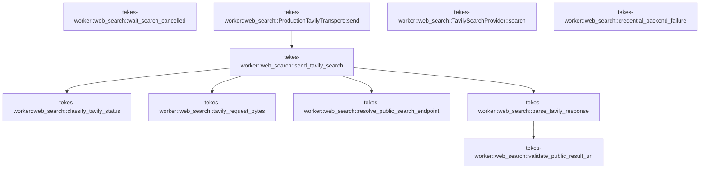

# tekes-worker::web_search

[Package atlas](index.md) · [Source](../../src/web_search.rs)

## Declarations

Visibility is the declaration spelling; trait members and reexports require their enclosing interface. `cfg` is not evaluated.

| Symbol | Kind | Visibility | Test / cfg |
|---|---|---|---|
| [tekes-worker::web_search::TavilySearchProvider](../../src/web_search.rs#L3) | struct_item | `pub(crate)` |  |
| [tekes-worker::web_search::TavilyTransport](../../src/web_search.rs#L9) | trait_item | `pub(crate)` |  |
| [tekes-worker::web_search::TavilyTransport::send](../../src/web_search.rs#L10) | function_signature_item | `private` |  |
| [tekes-worker::web_search::ProductionTavilyTransport](../../src/web_search.rs#L20) | struct_item | `pub(crate)` |  |
| [tekes-worker::web_search::ProductionTavilyTransport::send](../../src/web_search.rs#L23) | function_item | `private` |  |
| [tekes-worker::web_search::TavilySearchProvider::search](../../src/web_search.rs#L36) | function_item | `private` |  |
| [tekes-worker::web_search::credential_backend_failure](../../src/web_search.rs#L76) | function_item | `private` |  |
| [tekes-worker::web_search::send_tavily_search](../../src/web_search.rs#L90) | function_item | `private` |  |
| [tekes-worker::web_search::classify_tavily_status](../../src/web_search.rs#L150) | function_item | `pub(crate)` |  |
| [tekes-worker::web_search::tavily_request_bytes](../../src/web_search.rs#L168) | function_item | `pub(crate)` |  |
| [tekes-worker::web_search::wait_search_cancelled](../../src/web_search.rs#L181) | function_item | `private` |  |
| [tekes-worker::web_search::resolve_public_search_endpoint](../../src/web_search.rs#L190) | function_item | `pub(crate)` |  |
| [tekes-worker::web_search::parse_tavily_response](../../src/web_search.rs#L210) | function_item | `pub(crate)` |  |
| [tekes-worker::web_search::validate_public_result_url](../../src/web_search.rs#L250) | function_item | `pub(crate)` |  |

## Imports / reexports

| Local name | Source path | Visibility |
|---|---|---|
| `*` | `super::*` | `private` |

## Module declarations

| Module | Visibility | Attributes |
|---|---|---|

## Function call graphs

Edges below are syntactically resolved calls only, including private functions. Graphs partition callers into groups of 20; they are not execution order. All unresolved sites are listed below and in the JSON inventory.

Functions 1–10: 6 direct edges

## Call sites

Includes test functions (marked in declarations). Receiver-type-required sites need type analysis/manual tracing. Calls in closures are attributed to their enclosing function; their occurrence here does not mean the closure executes immediately.

| Caller | Callee expression | Source lines | Target / classification |
|---|---|---|---|
| `send` | `send_tavily_search` | [31](../../src/web_search.rs#L31) | [tekes-worker::web_search::send_tavily_search](../../src/web_search.rs#L90) |
| `search` | `Err` | [43](../../src/web_search.rs#L43) | external-constructor-callback-or-unresolved |
| `search` | `BackendFailure::TerminalUnavailable` | [43](../../src/web_search.rs#L43) | external-constructor-callback-or-unresolved |
| `search` | `"unsupported web-search adapter".to_owned` | [44](../../src/web_search.rs#L44) | receiver-type-required |
| `search` | `endpoint_origin(&self.config.endpoint)             .map_err` | [47](../../src/web_search.rs#L47) | receiver-type-required |
| `search` | `endpoint_origin` | [47](../../src/web_search.rs#L47) | external-constructor-callback-or-unresolved |
| `search` | `BackendFailure::Protocol` | [48](../../src/web_search.rs#L48) | external-constructor-callback-or-unresolved |
| `search` | `"invalid web-search endpoint".to_owned` | [48](../../src/web_search.rs#L48) | receiver-type-required |
| `search` | `credential_request_id` | [51](../../src/web_search.rs#L51) | external-constructor-callback-or-unresolved |
| `search` | `self.config.credential_key.clone` | [53](../../src/web_search.rs#L53) | receiver-type-required |
| `search` | `"web_search".to_owned` | [54](../../src/web_search.rs#L54) | receiver-type-required |
| `search` | `"tavily_v1".to_owned` | [55](../../src/web_search.rs#L55) | receiver-type-required |
| `search` | `self             .credential             .lock()             .map_err(&#124;_&#124; BackendFailure::Unavailable("credential client lock poisoned".to_owned()))?             .get(get)             .map_err` | [60](../../src/web_search.rs#L60) | receiver-type-required |
| `search` | `self             .credential             .lock()             .map_err(&#124;_&#124; BackendFailure::Unavailable("credential client lock poisoned".to_owned()))?             .get` | [60](../../src/web_search.rs#L60) | receiver-type-required |
| `search` | `self             .credential             .lock()             .map_err` | [60](../../src/web_search.rs#L60) | receiver-type-required |
| `search` | `self             .credential             .lock` | [60](../../src/web_search.rs#L60) | receiver-type-required |
| `search` | `BackendFailure::Unavailable` | [63](../../src/web_search.rs#L63) | external-constructor-callback-or-unresolved |
| `search` | `"credential client lock poisoned".to_owned` | [63](../../src/web_search.rs#L63) | receiver-type-required |
| `search` | `self.transport.send` | [66](../../src/web_search.rs#L66) | receiver-type-required |
| `credential_backend_failure` | `BackendFailure::Unavailable` | [81](../../src/web_search.rs#L81), [86](../../src/web_search.rs#L86) | external-constructor-callback-or-unresolved |
| `credential_backend_failure` | `BackendFailure::Protocol` | [84](../../src/web_search.rs#L84) | external-constructor-callback-or-unresolved |
| `send_tavily_search` | `resolve_public_search_endpoint` | [97](../../src/web_search.rs#L97) | [tekes-worker::web_search::resolve_public_search_endpoint](../../src/web_search.rs#L190) |
| `send_tavily_search` | `route         .client_builder()?         .connect_timeout(limits.timeout.min(Duration::from_secs(30)))         .redirect(reqwest::redirect::Policy::none())         .build()         .map_err` | [98](../../src/web_search.rs#L98) | receiver-type-required |
| `send_tavily_search` | `route         .client_builder()?         .connect_timeout(limits.timeout.min(Duration::from_secs(30)))         .redirect(reqwest::redirect::Policy::none())         .build` | [98](../../src/web_search.rs#L98) | receiver-type-required |
| `send_tavily_search` | `route         .client_builder()?         .connect_timeout(limits.timeout.min(Duration::from_secs(30)))         .redirect` | [98](../../src/web_search.rs#L98) | receiver-type-required |
| `send_tavily_search` | `route         .client_builder()?         .connect_timeout` | [98](../../src/web_search.rs#L98) | receiver-type-required |
| `send_tavily_search` | `route         .client_builder` | [98](../../src/web_search.rs#L98) | receiver-type-required |
| `send_tavily_search` | `limits.timeout.min` | [100](../../src/web_search.rs#L100) | receiver-type-required |
| `send_tavily_search` | `Duration::from_secs` | [100](../../src/web_search.rs#L100) | external-constructor-callback-or-unresolved |
| `send_tavily_search` | `reqwest::redirect::Policy::none` | [101](../../src/web_search.rs#L101) | external-constructor-callback-or-unresolved |
| `send_tavily_search` | `BackendFailure::Unavailable` | [103](../../src/web_search.rs#L103), [111](../../src/web_search.rs#L111) | external-constructor-callback-or-unresolved |
| `send_tavily_search` | `error.to_string` | [103](../../src/web_search.rs#L103), [111](../../src/web_search.rs#L111) | receiver-type-required |
| `send_tavily_search` | `tavily_request_bytes` | [104](../../src/web_search.rs#L104) | [tekes-worker::web_search::tavily_request_bytes](../../src/web_search.rs#L168) |
| `send_tavily_search` | `cancellation.clone` | [105](../../src/web_search.rs#L105) | receiver-type-required |
| `send_tavily_search` | `tokio::runtime::Builder::new_current_thread()         .enable_all()         .build()         .map_err` | [108](../../src/web_search.rs#L108) | receiver-type-required |
| `send_tavily_search` | `tokio::runtime::Builder::new_current_thread()         .enable_all()         .build` | [108](../../src/web_search.rs#L108) | receiver-type-required |
| `send_tavily_search` | `tokio::runtime::Builder::new_current_thread()         .enable_all` | [108](../../src/web_search.rs#L108) | receiver-type-required |
| `send_tavily_search` | `tokio::runtime::Builder::new_current_thread` | [108](../../src/web_search.rs#L108) | external-constructor-callback-or-unresolved |
| `send_tavily_search` | `runtime.block_on` | [112](../../src/web_search.rs#L112) | receiver-type-required |
| `send_tavily_search` | `response.status().as_u16` | [124](../../src/web_search.rs#L124) | receiver-type-required |
| `send_tavily_search` | `response.status` | [124](../../src/web_search.rs#L124) | receiver-type-required |
| `send_tavily_search` | `classify_tavily_status` | [125](../../src/web_search.rs#L125) | [tekes-worker::web_search::classify_tavily_status](../../src/web_search.rs#L150) |
| `send_tavily_search` | `response.content_length().is_some_and` | [126](../../src/web_search.rs#L126) | receiver-type-required |
| `send_tavily_search` | `response.content_length` | [126](../../src/web_search.rs#L126) | receiver-type-required |
| `send_tavily_search` | `Err` | [127](../../src/web_search.rs#L127), [138](../../src/web_search.rs#L138) | external-constructor-callback-or-unresolved |
| `send_tavily_search` | `BackendFailure::Limit` | [127](../../src/web_search.rs#L127), [138](../../src/web_search.rs#L138) | external-constructor-callback-or-unresolved |
| `send_tavily_search` | `"web-search response exceeds byte cap".to_owned` | [127](../../src/web_search.rs#L127), [138](../../src/web_search.rs#L138) | receiver-type-required |
| `send_tavily_search` | `Vec::new` | [130](../../src/web_search.rs#L130) | external-constructor-callback-or-unresolved |
| `send_tavily_search` | `bytes.len().saturating_add` | [137](../../src/web_search.rs#L137) | receiver-type-required |
| `send_tavily_search` | `bytes.len` | [137](../../src/web_search.rs#L137) | receiver-type-required |
| `send_tavily_search` | `chunk.len` | [137](../../src/web_search.rs#L137) | receiver-type-required |
| `send_tavily_search` | `bytes.extend_from_slice` | [140](../../src/web_search.rs#L140) | receiver-type-required |
| `send_tavily_search` | `parse_tavily_response` | [142](../../src/web_search.rs#L142) | [tekes-worker::web_search::parse_tavily_response](../../src/web_search.rs#L210) |
| `send_tavily_search` | `tokio::time::timeout(timeout, operation)             .await             .map_err` | [144](../../src/web_search.rs#L144) | receiver-type-required |
| `send_tavily_search` | `tokio::time::timeout` | [144](../../src/web_search.rs#L144) | external-constructor-callback-or-unresolved |
| `classify_tavily_status` | `Ok` | [152](../../src/web_search.rs#L152) | external-constructor-callback-or-unresolved |
| `classify_tavily_status` | `Err` | [153](../../src/web_search.rs#L153), [156](../../src/web_search.rs#L156), [159](../../src/web_search.rs#L159), [162](../../src/web_search.rs#L162) | external-constructor-callback-or-unresolved |
| `classify_tavily_status` | `BackendFailure::Invalid` | [153](../../src/web_search.rs#L153) | external-constructor-callback-or-unresolved |
| `classify_tavily_status` | `"web-search provider rejected request".to_owned` | [154](../../src/web_search.rs#L154) | receiver-type-required |
| `classify_tavily_status` | `BackendFailure::Denied` | [156](../../src/web_search.rs#L156) | external-constructor-callback-or-unresolved |
| `classify_tavily_status` | `"web-search authentication failed".to_owned` | [157](../../src/web_search.rs#L157) | receiver-type-required |
| `classify_tavily_status` | `BackendFailure::Unavailable` | [159](../../src/web_search.rs#L159) | external-constructor-callback-or-unresolved |
| `classify_tavily_status` | `BackendFailure::TerminalUnavailable` | [162](../../src/web_search.rs#L162) | external-constructor-callback-or-unresolved |
| `tavily_request_bytes` | `serde_json_canonicalizer::to_vec(&json!({         "query": request.query,         "search_depth": "basic",         "max_results": request.max_results,         "topic": match request.topic { SearchTopic::General => "general", SearchTopic::News => "news" },         "include_answer": false,         "include_raw_content": false,         "include_images": false     }))     .map_err` | [169](../../src/web_search.rs#L169) | receiver-type-required |
| `tavily_request_bytes` | `serde_json_canonicalizer::to_vec` | [169](../../src/web_search.rs#L169) | external-constructor-callback-or-unresolved |
| `tavily_request_bytes` | `BackendFailure::Protocol` | [178](../../src/web_search.rs#L178) | external-constructor-callback-or-unresolved |
| `tavily_request_bytes` | `error.to_string` | [178](../../src/web_search.rs#L178) | receiver-type-required |
| `wait_search_cancelled` | `cancellation.is_cancelled` | [182](../../src/web_search.rs#L182) | receiver-type-required |
| `wait_search_cancelled` | `tokio::time::sleep` | [183](../../src/web_search.rs#L183) | external-constructor-callback-or-unresolved |
| `wait_search_cancelled` | `Duration::from_millis` | [183](../../src/web_search.rs#L183) | external-constructor-callback-or-unresolved |
| `resolve_public_search_endpoint` | `reqwest::Url::parse(endpoint)         .map_err` | [193](../../src/web_search.rs#L193) | receiver-type-required |
| `resolve_public_search_endpoint` | `reqwest::Url::parse` | [193](../../src/web_search.rs#L193) | external-constructor-callback-or-unresolved |
| `resolve_public_search_endpoint` | `BackendFailure::Protocol` | [194](../../src/web_search.rs#L194), [197](../../src/web_search.rs#L197) | external-constructor-callback-or-unresolved |
| `resolve_public_search_endpoint` | `error.to_string` | [194](../../src/web_search.rs#L194) | receiver-type-required |
| `resolve_public_search_endpoint` | `url.set_path` | [195](../../src/web_search.rs#L195) | receiver-type-required |
| `resolve_public_search_endpoint` | `url.host_str().is_none` | [196](../../src/web_search.rs#L196) | receiver-type-required |
| `resolve_public_search_endpoint` | `url.host_str` | [196](../../src/web_search.rs#L196) | receiver-type-required |
| `resolve_public_search_endpoint` | `Err` | [197](../../src/web_search.rs#L197) | external-constructor-callback-or-unresolved |
| `resolve_public_search_endpoint` | `"web-search endpoint lacks host".to_owned` | [198](../../src/web_search.rs#L198) | receiver-type-required |
| `resolve_public_search_endpoint` | `route_public_url(&url).map_err` | [201](../../src/web_search.rs#L201) | receiver-type-required |
| `resolve_public_search_endpoint` | `route_public_url` | [201](../../src/web_search.rs#L201) | external-constructor-callback-or-unresolved |
| `resolve_public_search_endpoint` | `BackendFailure::Denied` | [202](../../src/web_search.rs#L202) | external-constructor-callback-or-unresolved |
| `resolve_public_search_endpoint` | `"web-search endpoint did not resolve exclusively to public addresses".to_owned` | [203](../../src/web_search.rs#L203) | receiver-type-required |
| `resolve_public_search_endpoint` | `Ok` | [207](../../src/web_search.rs#L207) | external-constructor-callback-or-unresolved |
| `parse_tavily_response` | `IJsonValue::parse(bytes)         .map_err` | [214](../../src/web_search.rs#L214) | receiver-type-required |
| `parse_tavily_response` | `IJsonValue::parse` | [214](../../src/web_search.rs#L214) | external-constructor-callback-or-unresolved |
| `parse_tavily_response` | `BackendFailure::Protocol` | [215](../../src/web_search.rs#L215), [217](../../src/web_search.rs#L217), [223](../../src/web_search.rs#L223), [229](../../src/web_search.rs#L229), [233](../../src/web_search.rs#L233) | external-constructor-callback-or-unresolved |
| `parse_tavily_response` | `serde_json::to_value(checked)         .map_err` | [216](../../src/web_search.rs#L216) | receiver-type-required |
| `parse_tavily_response` | `serde_json::to_value` | [216](../../src/web_search.rs#L216) | external-constructor-callback-or-unresolved |
| `parse_tavily_response` | `error.to_string` | [217](../../src/web_search.rs#L217) | receiver-type-required |
| `parse_tavily_response` | `value         .as_object()         .and_then(&#124;object&#124; object.get("results"))         .and_then(Value::as_array)         .ok_or_else` | [218](../../src/web_search.rs#L218) | receiver-type-required |
| `parse_tavily_response` | `value         .as_object()         .and_then(&#124;object&#124; object.get("results"))         .and_then` | [218](../../src/web_search.rs#L218) | receiver-type-required |
| `parse_tavily_response` | `value         .as_object()         .and_then` | [218](../../src/web_search.rs#L218) | receiver-type-required |
| `parse_tavily_response` | `value         .as_object` | [218](../../src/web_search.rs#L218) | receiver-type-required |
| `parse_tavily_response` | `object.get` | [220](../../src/web_search.rs#L220), [232](../../src/web_search.rs#L232) | receiver-type-required |
| `parse_tavily_response` | `"web-search response lacks results array".to_owned` | [223](../../src/web_search.rs#L223) | receiver-type-required |
| `parse_tavily_response` | `results         .iter()         .map(&#124;entry&#124; {             let object = entry.as_object().ok_or_else(&#124;&#124; {                 BackendFailure::Protocol("web-search result is not an object".to_owned())             })?;             let field = &#124;name&#124; {                 object.get(name).and_then(Value::as_str).ok_or_else(&#124;&#124; {                     BackendFailure::Protocol(format!("web-search result lacks string {name}"))                 })             };             let title = field("title")?.to_owned();             let url = field("url")?.to_owned();             validate_public_result_url(&url)?;             Ok(SearchHit {                 title,                 url,                 snippet: field("content")?.to_owned(),             })         })         .collect::<Result<Vec<_>, _>>` | [225](../../src/web_search.rs#L225) | receiver-type-required |
| `parse_tavily_response` | `results         .iter()         .map` | [225](../../src/web_search.rs#L225) | receiver-type-required |
| `parse_tavily_response` | `results         .iter` | [225](../../src/web_search.rs#L225) | receiver-type-required |
| `parse_tavily_response` | `entry.as_object().ok_or_else` | [228](../../src/web_search.rs#L228) | receiver-type-required |
| `parse_tavily_response` | `entry.as_object` | [228](../../src/web_search.rs#L228) | receiver-type-required |
| `parse_tavily_response` | `"web-search result is not an object".to_owned` | [229](../../src/web_search.rs#L229) | receiver-type-required |
| `parse_tavily_response` | `object.get(name).and_then(Value::as_str).ok_or_else` | [232](../../src/web_search.rs#L232) | receiver-type-required |
| `parse_tavily_response` | `object.get(name).and_then` | [232](../../src/web_search.rs#L232) | receiver-type-required |
| `parse_tavily_response` | `field("title")?.to_owned` | [236](../../src/web_search.rs#L236) | receiver-type-required |
| `parse_tavily_response` | `field` | [236](../../src/web_search.rs#L236), [237](../../src/web_search.rs#L237), [242](../../src/web_search.rs#L242) | external-constructor-callback-or-unresolved |
| `parse_tavily_response` | `field("url")?.to_owned` | [237](../../src/web_search.rs#L237) | receiver-type-required |
| `parse_tavily_response` | `validate_public_result_url` | [238](../../src/web_search.rs#L238) | [tekes-worker::web_search::validate_public_result_url](../../src/web_search.rs#L250) |
| `parse_tavily_response` | `Ok` | [239](../../src/web_search.rs#L239), [247](../../src/web_search.rs#L247) | external-constructor-callback-or-unresolved |
| `parse_tavily_response` | `field("content")?.to_owned` | [242](../../src/web_search.rs#L242) | receiver-type-required |
| `parse_tavily_response` | `hits.truncate` | [246](../../src/web_search.rs#L246) | receiver-type-required |
| `parse_tavily_response` | `usize::from` | [246](../../src/web_search.rs#L246) | external-constructor-callback-or-unresolved |
| `validate_public_result_url` | `reqwest::Url::parse(value)         .map_err` | [251](../../src/web_search.rs#L251) | receiver-type-required |
| `validate_public_result_url` | `reqwest::Url::parse` | [251](../../src/web_search.rs#L251) | external-constructor-callback-or-unresolved |
| `validate_public_result_url` | `BackendFailure::Protocol` | [252](../../src/web_search.rs#L252), [257](../../src/web_search.rs#L257), [263](../../src/web_search.rs#L263), [277](../../src/web_search.rs#L277) | external-constructor-callback-or-unresolved |
| `validate_public_result_url` | `url.username().is_empty` | [254](../../src/web_search.rs#L254) | receiver-type-required |
| `validate_public_result_url` | `url.username` | [254](../../src/web_search.rs#L254) | receiver-type-required |
| `validate_public_result_url` | `url.password().is_some` | [255](../../src/web_search.rs#L255) | receiver-type-required |
| `validate_public_result_url` | `url.password` | [255](../../src/web_search.rs#L255) | receiver-type-required |
| `validate_public_result_url` | `Err` | [257](../../src/web_search.rs#L257), [277](../../src/web_search.rs#L277) | external-constructor-callback-or-unresolved |
| `validate_public_result_url` | `"web-search result URL is not a public HTTP URL".to_owned` | [258](../../src/web_search.rs#L258) | receiver-type-required |
| `validate_public_result_url` | `url         .host_str()         .ok_or_else` | [261](../../src/web_search.rs#L261) | receiver-type-required |
| `validate_public_result_url` | `url         .host_str` | [261](../../src/web_search.rs#L261) | receiver-type-required |
| `validate_public_result_url` | `"web-search result URL lacks host".to_owned` | [263](../../src/web_search.rs#L263) | receiver-type-required |
| `validate_public_result_url` | `host         .strip_prefix('[')         .and_then(&#124;value&#124; value.strip_suffix(']'))         .unwrap_or` | [264](../../src/web_search.rs#L264) | receiver-type-required |
| `validate_public_result_url` | `host         .strip_prefix('[')         .and_then` | [264](../../src/web_search.rs#L264) | receiver-type-required |
| `validate_public_result_url` | `host         .strip_prefix` | [264](../../src/web_search.rs#L264) | receiver-type-required |
| `validate_public_result_url` | `value.strip_suffix` | [266](../../src/web_search.rs#L266) | receiver-type-required |
| `validate_public_result_url` | `host.to_ascii_lowercase` | [268](../../src/web_search.rs#L268) | receiver-type-required |
| `validate_public_result_url` | `lower_host.ends_with` | [270](../../src/web_search.rs#L270), [271](../../src/web_search.rs#L271), [272](../../src/web_search.rs#L272) | receiver-type-required |
| `validate_public_result_url` | `address_literal             .parse::<IpAddr>()             .is_ok_and` | [273](../../src/web_search.rs#L273) | receiver-type-required |
| `validate_public_result_url` | `address_literal             .parse::<IpAddr>` | [273](../../src/web_search.rs#L273) | receiver-type-required |
| `validate_public_result_url` | `is_public_internet_address` | [275](../../src/web_search.rs#L275) | external-constructor-callback-or-unresolved |
| `validate_public_result_url` | `"web-search result URL is not public".to_owned` | [278](../../src/web_search.rs#L278) | receiver-type-required |
| `validate_public_result_url` | `Ok` | [281](../../src/web_search.rs#L281) | external-constructor-callback-or-unresolved |
