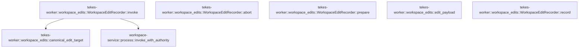

# tekes-worker::workspace_edits

[Package atlas](index.md) · [Source](../../src/workspace_edits.rs)

## Declarations

Visibility is the declaration spelling; trait members and reexports require their enclosing interface. `cfg` is not evaluated.

| Symbol | Kind | Visibility | Test / cfg |
|---|---|---|---|
| [tekes-worker::workspace_edits::edit_payload](../../src/workspace_edits.rs#L8) | function_item | `private` |  |
| [tekes-worker::workspace_edits::WorkspaceEditRecorder](../../src/workspace_edits.rs#L30) | struct_item | `pub` |  |
| [tekes-worker::workspace_edits::canonical_edit_target](../../src/workspace_edits.rs#L39) | function_item | `private` |  |
| [tekes-worker::workspace_edits::WorkspaceEditRecorder::abort](../../src/workspace_edits.rs#L73) | function_item | `private` |  |
| [tekes-worker::workspace_edits::WorkspaceEditRecorder::prepare](../../src/workspace_edits.rs#L82) | function_item | `private` |  |
| [tekes-worker::workspace_edits::WorkspaceEditRecorder::record](../../src/workspace_edits.rs#L91) | function_item | `private` |  |
| [tekes-worker::workspace_edits::WorkspaceEditRecorder::invoke](../../src/workspace_edits.rs#L103) | function_item | `private` |  |
| [tekes-worker::workspace_edits::tests::edit_identity_accepts_missing_nested_parent_under_canonical_workspace](../../src/workspace_edits.rs#L165) | function_item | `private` | test; #[cfg(test)] |
| [tekes-worker::workspace_edits::tests::large_edit_capture_is_bounded_and_retains_content_identity](../../src/workspace_edits.rs#L178) | function_item | `private` | test; #[cfg(test)] |
| [tekes-worker::workspace_edits::tests::actual_patch_helper_to_turn_ledger_round_trip](../../src/workspace_edits.rs#L205) | function_item | `private` | test; #[cfg(test)] |

## Imports / reexports

| Local name | Source path | Visibility |
|---|---|---|
| `json` | `serde_json::json` | `private` |
| `io` | `std::io` | `private` |
| `Write` | `std::io::Write` | `private` |
| `PathBuf` | `std::path::PathBuf` | `private` |
| `BackendFailure` | `tools::BackendFailure` | `private` |
| `ToolExecution` | `tools::ToolExecution` | `private` |
| `*` | `super::*` | `private` |
| `DurableArtifactVersions` | `engine::DurableArtifactVersions` | `private` |
| `SystemToolBackend` | `engine::SystemToolBackend` | `private` |
| `SystemToolConfig` | `engine::SystemToolConfig` | `private` |
| `ToolBackend` | `engine::ToolBackend` | `private` |
| `Arc` | `std::sync::Arc` | `private` |
| `BackendTerminal` | `tools::BackendTerminal` | `private` |
| `CancellationToken` | `tools::CancellationToken` | `private` |
| `HelperClient` | `tools::HelperClient` | `private` |
| `HelperInvoker` | `tools::HelperInvoker` | `private` |
| `NetworkPolicy` | `tools::NetworkPolicy` | `private` |
| `SandboxBackend` | `tools::SandboxBackend` | `private` |
| `SandboxPolicy` | `tools::SandboxPolicy` | `private` |

## Module declarations

| Module | Visibility | Attributes |
|---|---|---|
| `tekes-worker::workspace_edits::tests` | `private` | #[cfg(test)] |

## Function call graphs

Edges below are syntactically resolved calls only, including private functions. Graphs partition callers into groups of 20; they are not execution order. All unresolved sites are listed below and in the JSON inventory.

Functions 1–6: 2 direct edges

## Call sites

Includes test functions (marked in declarations). Receiver-type-required sites need type analysis/manual tracing. Calls in closures are attributed to their enclosing function; their occurrence here does not mean the closure executes immediately.

| Caller | Callee expression | Source lines | Target / classification |
|---|---|---|---|
| `edit_payload` | `before         .map_or(0, str::len)         .saturating_add` | [16](../../src/workspace_edits.rs#L16) | receiver-type-required |
| `edit_payload` | `before         .map_or` | [16](../../src/workspace_edits.rs#L16) | receiver-type-required |
| `edit_payload` | `after.map_or` | [18](../../src/workspace_edits.rs#L18) | receiver-type-required |
| `edit_payload` | `[before, after]             .map` | [22](../../src/workspace_edits.rs#L22) | receiver-type-required |
| `edit_payload` | `content.map` | [23](../../src/workspace_edits.rs#L23) | receiver-type-required |
| `canonical_edit_target` | `target         .parent()         .ok_or_else` | [40](../../src/workspace_edits.rs#L40) | receiver-type-required |
| `canonical_edit_target` | `target         .parent` | [40](../../src/workspace_edits.rs#L40) | receiver-type-required |
| `canonical_edit_target` | `io::Error::from` | [42](../../src/workspace_edits.rs#L42), [67](../../src/workspace_edits.rs#L67) | external-constructor-callback-or-unresolved |
| `canonical_edit_target` | `Vec::new` | [43](../../src/workspace_edits.rs#L43) | external-constructor-callback-or-unresolved |
| `canonical_edit_target` | `parent.canonicalize` | [45](../../src/workspace_edits.rs#L45) | receiver-type-required |
| `canonical_edit_target` | `error.kind` | [47](../../src/workspace_edits.rs#L47) | receiver-type-required |
| `canonical_edit_target` | `parent.file_name` | [48](../../src/workspace_edits.rs#L48) | receiver-type-required |
| `canonical_edit_target` | `Err` | [49](../../src/workspace_edits.rs#L49), [53](../../src/workspace_edits.rs#L53), [57](../../src/workspace_edits.rs#L57) | external-constructor-callback-or-unresolved |
| `canonical_edit_target` | `missing.push` | [51](../../src/workspace_edits.rs#L51) | receiver-type-required |
| `canonical_edit_target` | `component.to_os_string` | [51](../../src/workspace_edits.rs#L51) | receiver-type-required |
| `canonical_edit_target` | `parent.parent` | [52](../../src/workspace_edits.rs#L52) | receiver-type-required |
| `canonical_edit_target` | `missing.into_iter().rev` | [61](../../src/workspace_edits.rs#L61) | receiver-type-required |
| `canonical_edit_target` | `missing.into_iter` | [61](../../src/workspace_edits.rs#L61) | receiver-type-required |
| `canonical_edit_target` | `path.push` | [62](../../src/workspace_edits.rs#L62), [64](../../src/workspace_edits.rs#L64) | receiver-type-required |
| `canonical_edit_target` | `target             .file_name()             .ok_or_else` | [65](../../src/workspace_edits.rs#L65) | receiver-type-required |
| `canonical_edit_target` | `target             .file_name` | [65](../../src/workspace_edits.rs#L65) | receiver-type-required |
| `canonical_edit_target` | `Ok` | [69](../../src/workspace_edits.rs#L69) | external-constructor-callback-or-unresolved |
| `abort` | `self.invoke` | [80](../../src/workspace_edits.rs#L80) | receiver-type-required |
| `prepare` | `self.invoke` | [89](../../src/workspace_edits.rs#L89) | receiver-type-required |
| `record` | `self.invoke` | [98](../../src/workspace_edits.rs#L98) | receiver-type-required |
| `invoke` | `self.executable.clone` | [111](../../src/workspace_edits.rs#L111) | receiver-type-required |
| `invoke` | `self.workspace.clone` | [112](../../src/workspace_edits.rs#L112) | receiver-type-required |
| `invoke` | `std::path::Path::new` | [114](../../src/workspace_edits.rs#L114) | external-constructor-callback-or-unresolved |
| `invoke` | `canonical_edit_target(target).map_err` | [115](../../src/workspace_edits.rs#L115) | receiver-type-required |
| `invoke` | `canonical_edit_target` | [115](../../src/workspace_edits.rs#L115) | [tekes-worker::workspace_edits::canonical_edit_target](../../src/workspace_edits.rs#L39) |
| `invoke` | `BackendFailure::Unknown` | [116](../../src/workspace_edits.rs#L116), [147](../../src/workspace_edits.rs#L147), [149](../../src/workspace_edits.rs#L149) | external-constructor-callback-or-unresolved |
| `invoke` | `std::thread::spawn(move &#124;&#124; -> Result<(), String> {             let mut file = tempfile::NamedTempFile::new().map_err(&#124;e&#124; e.to_string())?;             file.write_all(&serde_json::to_vec(&authority).map_err(&#124;e&#124; e.to_string())?)                 .map_err(&#124;e&#124; e.to_string())?;             file.flush().map_err(&#124;e&#124; e.to_string())?;             let runtime = tokio::runtime::Builder::new_current_thread()                 .enable_all()                 .build()                 .map_err(&#124;e&#124; e.to_string())?;             let response = runtime                 .block_on(workspace_service::process::invoke_with_authority(                     &executable,                     &workspace,                     Some(file.path()),                     method,                     request,                     std::time::Duration::from_secs(30),                 ))                 .map_err(&#124;e&#124; e.message)?;             if let Some(error) = response.get("error") {                 return Err(error.to_string());             }             Ok(())         })         .join()         .map_err` | [122](../../src/workspace_edits.rs#L122) | receiver-type-required |
| `invoke` | `std::thread::spawn(move &#124;&#124; -> Result<(), String> {             let mut file = tempfile::NamedTempFile::new().map_err(&#124;e&#124; e.to_string())?;             file.write_all(&serde_json::to_vec(&authority).map_err(&#124;e&#124; e.to_string())?)                 .map_err(&#124;e&#124; e.to_string())?;             file.flush().map_err(&#124;e&#124; e.to_string())?;             let runtime = tokio::runtime::Builder::new_current_thread()                 .enable_all()                 .build()                 .map_err(&#124;e&#124; e.to_string())?;             let response = runtime                 .block_on(workspace_service::process::invoke_with_authority(                     &executable,                     &workspace,                     Some(file.path()),                     method,                     request,                     std::time::Duration::from_secs(30),                 ))                 .map_err(&#124;e&#124; e.message)?;             if let Some(error) = response.get("error") {                 return Err(error.to_string());             }             Ok(())         })         .join` | [122](../../src/workspace_edits.rs#L122) | receiver-type-required |
| `invoke` | `std::thread::spawn` | [122](../../src/workspace_edits.rs#L122) | external-constructor-callback-or-unresolved |
| `invoke` | `tempfile::NamedTempFile::new().map_err` | [123](../../src/workspace_edits.rs#L123) | receiver-type-required |
| `invoke` | `tempfile::NamedTempFile::new` | [123](../../src/workspace_edits.rs#L123) | external-constructor-callback-or-unresolved |
| `invoke` | `e.to_string` | [123](../../src/workspace_edits.rs#L123), [124](../../src/workspace_edits.rs#L124), [125](../../src/workspace_edits.rs#L125), [126](../../src/workspace_edits.rs#L126), [130](../../src/workspace_edits.rs#L130) | receiver-type-required |
| `invoke` | `file.write_all(&serde_json::to_vec(&authority).map_err(&#124;e&#124; e.to_string())?)                 .map_err` | [124](../../src/workspace_edits.rs#L124) | receiver-type-required |
| `invoke` | `file.write_all` | [124](../../src/workspace_edits.rs#L124) | receiver-type-required |
| `invoke` | `serde_json::to_vec(&authority).map_err` | [124](../../src/workspace_edits.rs#L124) | receiver-type-required |
| `invoke` | `serde_json::to_vec` | [124](../../src/workspace_edits.rs#L124) | external-constructor-callback-or-unresolved |
| `invoke` | `file.flush().map_err` | [126](../../src/workspace_edits.rs#L126) | receiver-type-required |
| `invoke` | `file.flush` | [126](../../src/workspace_edits.rs#L126) | receiver-type-required |
| `invoke` | `tokio::runtime::Builder::new_current_thread()                 .enable_all()                 .build()                 .map_err` | [127](../../src/workspace_edits.rs#L127) | receiver-type-required |
| `invoke` | `tokio::runtime::Builder::new_current_thread()                 .enable_all()                 .build` | [127](../../src/workspace_edits.rs#L127) | receiver-type-required |
| `invoke` | `tokio::runtime::Builder::new_current_thread()                 .enable_all` | [127](../../src/workspace_edits.rs#L127) | receiver-type-required |
| `invoke` | `tokio::runtime::Builder::new_current_thread` | [127](../../src/workspace_edits.rs#L127) | external-constructor-callback-or-unresolved |
| `invoke` | `runtime                 .block_on(workspace_service::process::invoke_with_authority(                     &executable,                     &workspace,                     Some(file.path()),                     method,                     request,                     std::time::Duration::from_secs(30),                 ))                 .map_err` | [131](../../src/workspace_edits.rs#L131) | receiver-type-required |
| `invoke` | `runtime                 .block_on` | [131](../../src/workspace_edits.rs#L131) | receiver-type-required |
| `invoke` | `workspace_service::process::invoke_with_authority` | [132](../../src/workspace_edits.rs#L132) | [workspace-service::process::invoke_with_authority](../../../workspace-service/src/process.rs#L36) |
| `invoke` | `Some` | [135](../../src/workspace_edits.rs#L135) | external-constructor-callback-or-unresolved |
| `invoke` | `file.path` | [135](../../src/workspace_edits.rs#L135) | receiver-type-required |
| `invoke` | `std::time::Duration::from_secs` | [138](../../src/workspace_edits.rs#L138) | external-constructor-callback-or-unresolved |
| `invoke` | `response.get` | [141](../../src/workspace_edits.rs#L141) | receiver-type-required |
| `invoke` | `Err` | [142](../../src/workspace_edits.rs#L142) | external-constructor-callback-or-unresolved |
| `invoke` | `error.to_string` | [142](../../src/workspace_edits.rs#L142) | receiver-type-required |
| `invoke` | `Ok` | [144](../../src/workspace_edits.rs#L144) | external-constructor-callback-or-unresolved |
| `invoke` | `"file committed but edit recorder panicked".into` | [147](../../src/workspace_edits.rs#L147) | receiver-type-required |
| `invoke` | `result.map_err` | [148](../../src/workspace_edits.rs#L148) | receiver-type-required |
| `edit_identity_accepts_missing_nested_parent_under_canonical_workspace` | `tempfile::tempdir().unwrap` | [166](../../src/workspace_edits.rs#L166) | receiver-type-required |
| `edit_identity_accepts_missing_nested_parent_under_canonical_workspace` | `tempfile::tempdir` | [166](../../src/workspace_edits.rs#L166) | external-constructor-callback-or-unresolved |
| `edit_identity_accepts_missing_nested_parent_under_canonical_workspace` | `workspace.path().join` | [167](../../src/workspace_edits.rs#L167) | receiver-type-required |
| `edit_identity_accepts_missing_nested_parent_under_canonical_workspace` | `workspace.path` | [167](../../src/workspace_edits.rs#L167) | receiver-type-required |
| `large_edit_capture_is_bounded_and_retains_content_identity` | `"\0".repeat` | [179](../../src/workspace_edits.rs#L179) | receiver-type-required |
| `large_edit_capture_is_bounded_and_retains_content_identity` | `edit_payload` | [180](../../src/workspace_edits.rs#L180), [185](../../src/workspace_edits.rs#L185) | external-constructor-callback-or-unresolved |
| `large_edit_capture_is_bounded_and_retains_content_identity` | `std::path::Path::new` | [180](../../src/workspace_edits.rs#L180), [187](../../src/workspace_edits.rs#L187) | external-constructor-callback-or-unresolved |
| `large_edit_capture_is_bounded_and_retains_content_identity` | `Some` | [180](../../src/workspace_edits.rs#L180), [189](../../src/workspace_edits.rs#L189) | external-constructor-callback-or-unresolved |
| `actual_patch_helper_to_turn_ledger_round_trip` | `PathBuf::from` | [206](../../src/workspace_edits.rs#L206), [209](../../src/workspace_edits.rs#L209) | external-constructor-callback-or-unresolved |
| `actual_patch_helper_to_turn_ledger_round_trip` | `std::env::var_os("TEKES_WORKSPACE_SERVICE_BIN").expect` | [207](../../src/workspace_edits.rs#L207) | receiver-type-required |
| `actual_patch_helper_to_turn_ledger_round_trip` | `std::env::var_os` | [207](../../src/workspace_edits.rs#L207), [209](../../src/workspace_edits.rs#L209) | external-constructor-callback-or-unresolved |
| `actual_patch_helper_to_turn_ledger_round_trip` | `std::env::var_os("TEKES_TOOL_HELPER_BIN").expect` | [209](../../src/workspace_edits.rs#L209) | receiver-type-required |
| `actual_patch_helper_to_turn_ledger_round_trip` | `tempfile::tempdir().unwrap` | [210](../../src/workspace_edits.rs#L210), [211](../../src/workspace_edits.rs#L211) | receiver-type-required |
| `actual_patch_helper_to_turn_ledger_round_trip` | `tempfile::tempdir` | [210](../../src/workspace_edits.rs#L210), [211](../../src/workspace_edits.rs#L211) | external-constructor-callback-or-unresolved |
| `actual_patch_helper_to_turn_ledger_round_trip` | `project.path().canonicalize().unwrap` | [212](../../src/workspace_edits.rs#L212) | receiver-type-required |
| `actual_patch_helper_to_turn_ledger_round_trip` | `project.path().canonicalize` | [212](../../src/workspace_edits.rs#L212) | receiver-type-required |
| `actual_patch_helper_to_turn_ledger_round_trip` | `project.path` | [212](../../src/workspace_edits.rs#L212) | receiver-type-required |
| `actual_patch_helper_to_turn_ledger_round_trip` | `HelperClient::sandboxed_with_scratch(             helper,             vec![("workspace".into(), root.clone())],             SandboxPolicy {                 format: 1,                 read_roots: vec![root.to_string_lossy().into_owned()],                 write_roots: vec![root.to_string_lossy().into_owned()],                 network: NetworkPolicy::Deny,                 allow_process: true,                 scratch: None,             },             tools::probe_backend(sandbox),         )         .unwrap` | [217](../../src/workspace_edits.rs#L217) | receiver-type-required |
| `actual_patch_helper_to_turn_ledger_round_trip` | `HelperClient::sandboxed_with_scratch` | [217](../../src/workspace_edits.rs#L217) | [tools::helper::HelperClient::sandboxed_with_scratch](../../../tools/src/helper.rs#L690) |
| `actual_patch_helper_to_turn_ledger_round_trip` | `tools::probe_backend` | [228](../../src/workspace_edits.rs#L228) | [tools::sandbox::probe_backend](../../../tools/src/sandbox.rs#L235) |
| `actual_patch_helper_to_turn_ledger_round_trip` | `Arc::new` | [231](../../src/workspace_edits.rs#L231), [241](../../src/workspace_edits.rs#L241), [244](../../src/workspace_edits.rs#L244) | external-constructor-callback-or-unresolved |
| `actual_patch_helper_to_turn_ledger_round_trip` | `executable.clone` | [232](../../src/workspace_edits.rs#L232) | receiver-type-required |
| `actual_patch_helper_to_turn_ledger_round_trip` | `root.clone` | [233](../../src/workspace_edits.rs#L233) | receiver-type-required |
| `actual_patch_helper_to_turn_ledger_round_trip` | `storage.path().to_owned` | [235](../../src/workspace_edits.rs#L235) | receiver-type-required |
| `actual_patch_helper_to_turn_ledger_round_trip` | `storage.path` | [235](../../src/workspace_edits.rs#L235), [245](../../src/workspace_edits.rs#L245) | receiver-type-required |
| `actual_patch_helper_to_turn_ledger_round_trip` | `"workspace".into` | [236](../../src/workspace_edits.rs#L236) | receiver-type-required |
| `actual_patch_helper_to_turn_ledger_round_trip` | `"session".into` | [237](../../src/workspace_edits.rs#L237), [276](../../src/workspace_edits.rs#L276) | receiver-type-required |
| `actual_patch_helper_to_turn_ledger_round_trip` | `SystemToolBackend::new(             SystemToolConfig::workspace("workspace", &root),             Some(Arc::new(client) as Arc<dyn HelperInvoker>),             None,             None,             Some(Arc::new(                 DurableArtifactVersions::new(storage.path().join("versions")).unwrap(),             )),             CancellationToken::default(),         )         .with_edit_recorder` | [239](../../src/workspace_edits.rs#L239) | receiver-type-required |
| `actual_patch_helper_to_turn_ledger_round_trip` | `SystemToolBackend::new` | [239](../../src/workspace_edits.rs#L239) | [engine::system_tools::SystemToolBackend::new](../../../engine/src/system_tools.rs#L477) |
| `actual_patch_helper_to_turn_ledger_round_trip` | `SystemToolConfig::workspace` | [240](../../src/workspace_edits.rs#L240) | [engine::system_tools::SystemToolConfig::workspace](../../../engine/src/system_tools.rs#L87) |
| `actual_patch_helper_to_turn_ledger_round_trip` | `Some` | [241](../../src/workspace_edits.rs#L241), [244](../../src/workspace_edits.rs#L244), [315](../../src/workspace_edits.rs#L315), [328](../../src/workspace_edits.rs#L328) | external-constructor-callback-or-unresolved |
| `actual_patch_helper_to_turn_ledger_round_trip` | `DurableArtifactVersions::new(storage.path().join("versions")).unwrap` | [245](../../src/workspace_edits.rs#L245) | receiver-type-required |
| `actual_patch_helper_to_turn_ledger_round_trip` | `DurableArtifactVersions::new` | [245](../../src/workspace_edits.rs#L245) | [engine::system_tools::DurableArtifactVersions::new](../../../engine/src/system_tools.rs#L179) |
| `actual_patch_helper_to_turn_ledger_round_trip` | `storage.path().join` | [245](../../src/workspace_edits.rs#L245) | receiver-type-required |
| `actual_patch_helper_to_turn_ledger_round_trip` | `CancellationToken::default` | [247](../../src/workspace_edits.rs#L247) | external-constructor-callback-or-unresolved |
| `actual_patch_helper_to_turn_ledger_round_trip` | `"large file line\n".repeat` | [250](../../src/workspace_edits.rs#L250) | receiver-type-required |
| `actual_patch_helper_to_turn_ledger_round_trip` | `large_content             .lines()             .map(&#124;line&#124; format!("+{line}"))             .collect::<Vec<_>>()             .join` | [251](../../src/workspace_edits.rs#L251) | receiver-type-required |
| `actual_patch_helper_to_turn_ledger_round_trip` | `large_content             .lines()             .map(&#124;line&#124; format!("+{line}"))             .collect::<Vec<_>>` | [251](../../src/workspace_edits.rs#L251) | receiver-type-required |
| `actual_patch_helper_to_turn_ledger_round_trip` | `large_content             .lines()             .map` | [251](../../src/workspace_edits.rs#L251) | receiver-type-required |
| `actual_patch_helper_to_turn_ledger_round_trip` | `large_content             .lines` | [251](../../src/workspace_edits.rs#L251) | receiver-type-required |
| `actual_patch_helper_to_turn_ledger_round_trip` | `schema::IJsonValue::parse(&serde_json::to_vec(&args).unwrap()).unwrap` | [274](../../src/workspace_edits.rs#L274) | receiver-type-required |
| `actual_patch_helper_to_turn_ledger_round_trip` | `schema::IJsonValue::parse` | [274](../../src/workspace_edits.rs#L274) | [schema::ijson::IJsonValue::parse](../../../schema/src/ijson.rs#L16) |
| `actual_patch_helper_to_turn_ledger_round_trip` | `serde_json::to_vec(&args).unwrap` | [274](../../src/workspace_edits.rs#L274) | receiver-type-required |
| `actual_patch_helper_to_turn_ledger_round_trip` | `serde_json::to_vec` | [274](../../src/workspace_edits.rs#L274), [305](../../src/workspace_edits.rs#L305) | external-constructor-callback-or-unresolved |
| `actual_patch_helper_to_turn_ledger_round_trip` | `call.into` | [277](../../src/workspace_edits.rs#L277) | receiver-type-required |
| `actual_patch_helper_to_turn_ledger_round_trip` | `"apply_patch".into` | [278](../../src/workspace_edits.rs#L278) | receiver-type-required |
| `actual_patch_helper_to_turn_ledger_round_trip` | `"attempt".into` | [279](../../src/workspace_edits.rs#L279) | receiver-type-required |
| `actual_patch_helper_to_turn_ledger_round_trip` | `invocation.clone` | [280](../../src/workspace_edits.rs#L280) | receiver-type-required |
| `actual_patch_helper_to_turn_ledger_round_trip` | `"2026-09-08T00:00:00Z".into` | [283](../../src/workspace_edits.rs#L283) | receiver-type-required |
| `actual_patch_helper_to_turn_ledger_round_trip` | `backend.execute` | [285](../../src/workspace_edits.rs#L285) | receiver-type-required |
| `actual_patch_helper_to_turn_ledger_round_trip` | `tempfile::NamedTempFile::new().unwrap` | [304](../../src/workspace_edits.rs#L304) | receiver-type-required |
| `actual_patch_helper_to_turn_ledger_round_trip` | `tempfile::NamedTempFile::new` | [304](../../src/workspace_edits.rs#L304) | external-constructor-callback-or-unresolved |
| `actual_patch_helper_to_turn_ledger_round_trip` | `authority.write_all(&serde_json::to_vec(&json!({"stateRoot":storage.path(),"allowedOperations":[],"allowedRepositoryRoots":[]})).unwrap()).unwrap` | [305](../../src/workspace_edits.rs#L305) | receiver-type-required |
| `actual_patch_helper_to_turn_ledger_round_trip` | `authority.write_all` | [305](../../src/workspace_edits.rs#L305) | receiver-type-required |
| `actual_patch_helper_to_turn_ledger_round_trip` | `serde_json::to_vec(&json!({"stateRoot":storage.path(),"allowedOperations":[],"allowedRepositoryRoots":[]})).unwrap` | [305](../../src/workspace_edits.rs#L305) | receiver-type-required |
| `actual_patch_helper_to_turn_ledger_round_trip` | `tokio::runtime::Builder::new_current_thread()             .enable_all()             .build()             .unwrap` | [306](../../src/workspace_edits.rs#L306) | receiver-type-required |
| `actual_patch_helper_to_turn_ledger_round_trip` | `tokio::runtime::Builder::new_current_thread()             .enable_all()             .build` | [306](../../src/workspace_edits.rs#L306) | receiver-type-required |
| `actual_patch_helper_to_turn_ledger_round_trip` | `tokio::runtime::Builder::new_current_thread()             .enable_all` | [306](../../src/workspace_edits.rs#L306) | receiver-type-required |
| `actual_patch_helper_to_turn_ledger_round_trip` | `tokio::runtime::Builder::new_current_thread` | [306](../../src/workspace_edits.rs#L306) | external-constructor-callback-or-unresolved |
| `actual_patch_helper_to_turn_ledger_round_trip` | `runtime                 .block_on(workspace_service::process::invoke_with_authority(                     &executable,                     &root,                     Some(authority.path()),                     "turnChanges",                     json!({"workspaceId":"workspace","sessionId":"session","turnId":turn}),                     std::time::Duration::from_secs(10),                 ))                 .unwrap` | [311](../../src/workspace_edits.rs#L311) | receiver-type-required |
| `actual_patch_helper_to_turn_ledger_round_trip` | `runtime                 .block_on` | [311](../../src/workspace_edits.rs#L311) | receiver-type-required |
| `actual_patch_helper_to_turn_ledger_round_trip` | `workspace_service::process::invoke_with_authority` | [312](../../src/workspace_edits.rs#L312), [325](../../src/workspace_edits.rs#L325) | [workspace-service::process::invoke_with_authority](../../../workspace-service/src/process.rs#L36) |
| `actual_patch_helper_to_turn_ledger_round_trip` | `authority.path` | [315](../../src/workspace_edits.rs#L315), [328](../../src/workspace_edits.rs#L328) | receiver-type-required |
| `actual_patch_helper_to_turn_ledger_round_trip` | `std::time::Duration::from_secs` | [318](../../src/workspace_edits.rs#L318), [331](../../src/workspace_edits.rs#L331) | external-constructor-callback-or-unresolved |
| `actual_patch_helper_to_turn_ledger_round_trip` | `runtime             .block_on(workspace_service::process::invoke_with_authority(                 &executable,                 &root,                 Some(authority.path()),                 "turnChanges",                 json!({"workspaceId":"workspace","sessionId":"session","turnId":"3"}),                 std::time::Duration::from_secs(10),             ))             .unwrap` | [324](../../src/workspace_edits.rs#L324) | receiver-type-required |
| `actual_patch_helper_to_turn_ledger_round_trip` | `runtime             .block_on` | [324](../../src/workspace_edits.rs#L324) | receiver-type-required |
