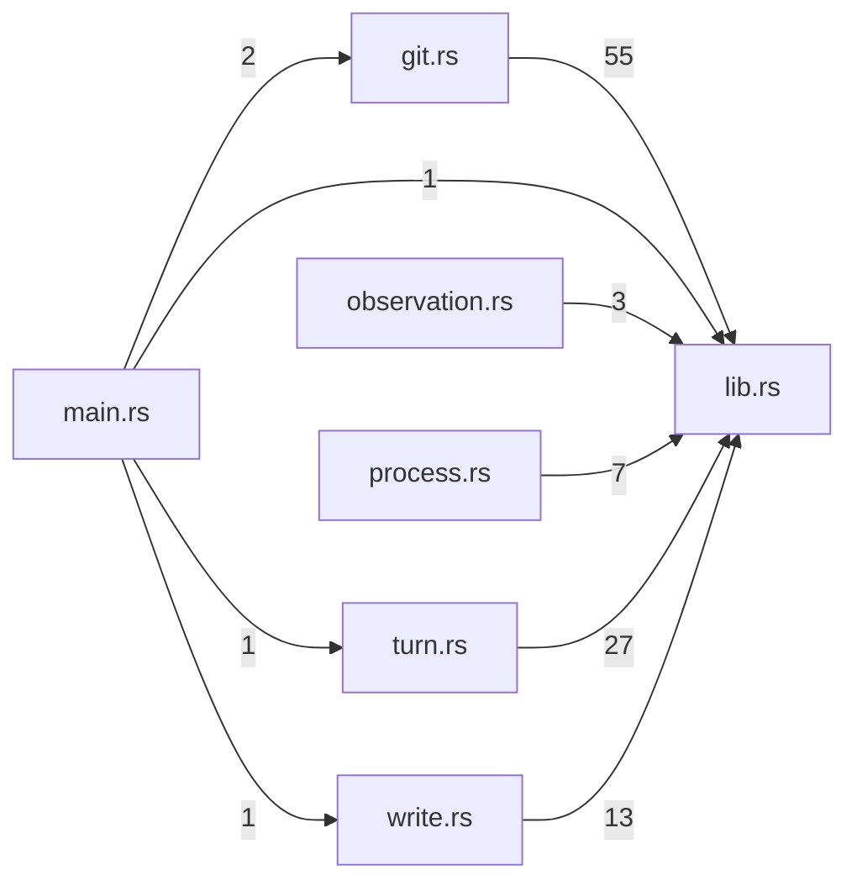

# workspace-service — generated atlas

[All packages](../../../../docs/architecture/generated/index.md) · [Maintained explanation](../README.md)

## Cargo targets

| Target | Kind | Entry |
|---|---|---|
| `workspace_service` | lib | [crates/workspace-service/src/lib.rs](../../src/lib.rs) |
| `tekes-workspace-service` | bin | [crates/workspace-service/src/main.rs](../../src/main.rs) |
| `process_files` | test | [crates/workspace-service/tests/process_files.rs](../../tests/process_files.rs) |
| `process_git` | test | [crates/workspace-service/tests/process_git.rs](../../tests/process_git.rs) |
| `process_mutations` | test | [crates/workspace-service/tests/process_mutations.rs](../../tests/process_mutations.rs) |
| `process_turn` | test | [crates/workspace-service/tests/process_turn.rs](../../tests/process_turn.rs) |
| `process_write` | test | [crates/workspace-service/tests/process_write.rs](../../tests/process_write.rs) |

## Direct workspace dependencies

| Dependency | Kind | Target cfg |
|---|---|---|

[Public/restricted API and direct callers](api.md)

## Source files / lexical modules

`src` files have full symbol/call tables and partitioned function graphs. Integration tests and examples remain in the JSON inventory.
File-derived paths below are lexical navigation, not a compiler-resolved module tree; inline module declarations are listed separately.

| File | Symbols | Call sites | Detail |
|---|---:|---:|---|
| [crates/workspace-service/src/git.rs](../../src/git.rs) | 19 | 572 | [Symbols and calls](src--git.md) |
| [crates/workspace-service/src/lib.rs](../../src/lib.rs) | 19 | 340 | [Symbols and calls](src--lib.md) |
| [crates/workspace-service/src/main.rs](../../src/main.rs) | 2 | 73 | [Symbols and calls](src--main.md) |
| [crates/workspace-service/src/observation.rs](../../src/observation.rs) | 4 | 52 | [Symbols and calls](src--observation.md) |
| [crates/workspace-service/src/process.rs](../../src/process.rs) | 5 | 61 | [Symbols and calls](src--process.md) |
| [crates/workspace-service/src/turn.rs](../../src/turn.rs) | 6 | 273 | [Symbols and calls](src--turn.md) |
| [crates/workspace-service/src/write.rs](../../src/write.rs) | 5 | 104 | [Symbols and calls](src--write.md) |
| [crates/workspace-service/tests/process_files.rs](../../tests/process_files.rs) | 7 | 142 | `inventory.json` |
| [crates/workspace-service/tests/process_git.rs](../../tests/process_git.rs) | 9 | 160 | `inventory.json` |
| [crates/workspace-service/tests/process_mutations.rs](../../tests/process_mutations.rs) | 9 | 198 | `inventory.json` |
| [crates/workspace-service/tests/process_turn.rs](../../tests/process_turn.rs) | 12 | 188 | `inventory.json` |
| [crates/workspace-service/tests/process_write.rs](../../tests/process_write.rs) | 7 | 97 | `inventory.json` |
| [crates/workspace-service/tests/support/mod.rs](../../tests/support/mod.rs) | 1 | 8 | `inventory.json` |

## Cross-file direct calls

Source files stand in for out-of-line modules; see declarations for inline modules. Counts are syntactic call sites, not runtime frequency.

