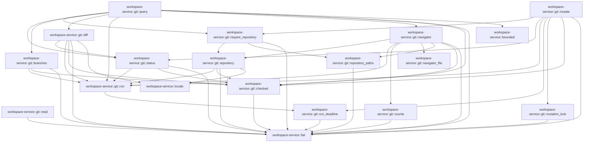

# workspace-service::git

[Package atlas](index.md) · [Source](../../src/git.rs)

## Declarations

Visibility is the declaration spelling; trait members and reexports require their enclosing interface. `cfg` is not evaluated.

| Symbol | Kind | Visibility | Test / cfg |
|---|---|---|---|
| [workspace-service::git::Query](../../src/git.rs#L15) | struct_item | `pub` |  |
| [workspace-service::git::Output](../../src/git.rs#L31) | struct_item | `private` |  |
| [workspace-service::git::read](../../src/git.rs#L37) | function_item | `private` |  |
| [workspace-service::git::run](../../src/git.rs#L49) | function_item | `private` |  |
| [workspace-service::git::run_deadline](../../src/git.rs#L53) | function_item | `private` |  |
| [workspace-service::git::checked](../../src/git.rs#L99) | function_item | `private` |  |
| [workspace-service::git::repository](../../src/git.rs#L106) | function_item | `private` |  |
| [workspace-service::git::require_repository](../../src/git.rs#L124) | function_item | `private` |  |
| [workspace-service::git::query](../../src/git.rs#L151) | function_item | `pub` |  |
| [workspace-service::git::status](../../src/git.rs#L234) | function_item | `private` |  |
| [workspace-service::git::branches](../../src/git.rs#L331) | function_item | `private` |  |
| [workspace-service::git::diff](../../src/git.rs#L390) | function_item | `private` |  |
| [workspace-service::git::counts](../../src/git.rs#L521) | function_item | `private` |  |
| [workspace-service::git::navigator_file](../../src/git.rs#L560) | function_item | `private` |  |
| [workspace-service::git::repository_paths](../../src/git.rs#L575) | function_item | `private` |  |
| [workspace-service::git::navigator](../../src/git.rs#L604) | function_item | `private` |  |
| [workspace-service::git::MutationAuthority](../../src/git.rs#L731) | struct_item | `pub` |  |
| [workspace-service::git::mutation_lock](../../src/git.rs#L741) | function_item | `private` |  |
| [workspace-service::git::mutate](../../src/git.rs#L796) | function_item | `pub` |  |

## Imports / reexports

| Local name | Source path | Visibility |
|---|---|---|
| `Path` | `std::path::Path` | `private` |
| `PathBuf` | `std::path::PathBuf` | `private` |
| `Stdio` | `std::process::Stdio` | `private` |
| `Duration` | `std::time::Duration` | `private` |
| `Deserialize` | `serde::Deserialize` | `private` |
| `Value` | `serde_json::Value` | `private` |
| `json` | `serde_json::json` | `private` |
| `AsyncReadExt` | `tokio::io::AsyncReadExt` | `private` |
| `Command` | `tokio::process::Command` | `private` |
| `Failure` | `crate::Failure` | `private` |
| `bounded` | `crate::bounded` | `private` |
| `fail` | `crate::fail` | `private` |
| `locate` | `crate::locate` | `private` |

## Module declarations

| Module | Visibility | Attributes |
|---|---|---|

## Function call graphs

Edges below are syntactically resolved calls only, including private functions. Graphs partition callers into groups of 20; they are not execution order. All unresolved sites are listed below and in the JSON inventory.

Functions 1–16: 48 direct edges

## Call sites

Includes test functions (marked in declarations). Receiver-type-required sites need type analysis/manual tracing. Calls in closures are attributed to their enclosing function; their occurrence here does not mean the closure executes immediately.

| Caller | Callee expression | Source lines | Target / classification |
|---|---|---|---|
| `read` | `Vec::new` | [38](../../src/git.rs#L38) | external-constructor-callback-or-unresolved |
| `read` | `(&mut reader)         .take(4 * 1024 * 1024 + 1)         .read_to_end` | [39](../../src/git.rs#L39) | receiver-type-required |
| `read` | `(&mut reader)         .take` | [39](../../src/git.rs#L39) | receiver-type-required |
| `read` | `bytes.len` | [43](../../src/git.rs#L43) | receiver-type-required |
| `read` | `Err` | [44](../../src/git.rs#L44) | external-constructor-callback-or-unresolved |
| `read` | `fail` | [44](../../src/git.rs#L44) | [workspace-service::fail](../../src/lib.rs#L23) |
| `read` | `Ok` | [46](../../src/git.rs#L46) | external-constructor-callback-or-unresolved |
| `run` | `run_deadline` | [50](../../src/git.rs#L50) | [workspace-service::git::run_deadline](../../src/git.rs#L53) |
| `run` | `Duration::from_secs` | [50](../../src/git.rs#L50) | external-constructor-callback-or-unresolved |
| `run_deadline` | `Command::new` | [54](../../src/git.rs#L54) | external-constructor-callback-or-unresolved |
| `run_deadline` | `command         .arg("--no-pager")         .args(args)         .current_dir(root)         .stdin(Stdio::null())         .stdout(Stdio::piped())         .stderr(Stdio::piped())         .kill_on_drop` | [55](../../src/git.rs#L55) | receiver-type-required |
| `run_deadline` | `command         .arg("--no-pager")         .args(args)         .current_dir(root)         .stdin(Stdio::null())         .stdout(Stdio::piped())         .stderr` | [55](../../src/git.rs#L55) | receiver-type-required |
| `run_deadline` | `command         .arg("--no-pager")         .args(args)         .current_dir(root)         .stdin(Stdio::null())         .stdout` | [55](../../src/git.rs#L55) | receiver-type-required |
| `run_deadline` | `command         .arg("--no-pager")         .args(args)         .current_dir(root)         .stdin` | [55](../../src/git.rs#L55) | receiver-type-required |
| `run_deadline` | `command         .arg("--no-pager")         .args(args)         .current_dir` | [55](../../src/git.rs#L55) | receiver-type-required |
| `run_deadline` | `command         .arg("--no-pager")         .args` | [55](../../src/git.rs#L55) | receiver-type-required |
| `run_deadline` | `command         .arg` | [55](../../src/git.rs#L55) | receiver-type-required |
| `run_deadline` | `Stdio::null` | [59](../../src/git.rs#L59) | external-constructor-callback-or-unresolved |
| `run_deadline` | `Stdio::piped` | [60](../../src/git.rs#L60), [61](../../src/git.rs#L61) | external-constructor-callback-or-unresolved |
| `run_deadline` | `std::env::vars_os` | [63](../../src/git.rs#L63) | external-constructor-callback-or-unresolved |
| `run_deadline` | `key.to_string_lossy().starts_with` | [64](../../src/git.rs#L64) | receiver-type-required |
| `run_deadline` | `key.to_string_lossy` | [64](../../src/git.rs#L64) | receiver-type-required |
| `run_deadline` | `command.env_remove` | [65](../../src/git.rs#L65) | receiver-type-required |
| `run_deadline` | `command         .env("LC_ALL", "C")         .env("GIT_TERMINAL_PROMPT", "0")         .env("GIT_OPTIONAL_LOCKS", "0")         .env` | [68](../../src/git.rs#L68) | receiver-type-required |
| `run_deadline` | `command         .env("LC_ALL", "C")         .env("GIT_TERMINAL_PROMPT", "0")         .env` | [68](../../src/git.rs#L68) | receiver-type-required |
| `run_deadline` | `command         .env("LC_ALL", "C")         .env` | [68](../../src/git.rs#L68) | receiver-type-required |
| `run_deadline` | `command         .env` | [68](../../src/git.rs#L68) | receiver-type-required |
| `run_deadline` | `command.spawn` | [73](../../src/git.rs#L73) | receiver-type-required |
| `run_deadline` | `child.stdout.take().unwrap` | [74](../../src/git.rs#L74) | receiver-type-required |
| `run_deadline` | `child.stdout.take` | [74](../../src/git.rs#L74) | receiver-type-required |
| `run_deadline` | `child.stderr.take().unwrap` | [75](../../src/git.rs#L75) | receiver-type-required |
| `run_deadline` | `child.stderr.take` | [75](../../src/git.rs#L75) | receiver-type-required |
| `run_deadline` | `tokio::time::timeout` | [76](../../src/git.rs#L76) | external-constructor-callback-or-unresolved |
| `run_deadline` | `Ok` | [83](../../src/git.rs#L83) | external-constructor-callback-or-unresolved |
| `run_deadline` | `status.code` | [84](../../src/git.rs#L84) | receiver-type-required |
| `run_deadline` | `child.kill` | [89](../../src/git.rs#L89) | receiver-type-required |
| `run_deadline` | `child.wait` | [90](../../src/git.rs#L90) | receiver-type-required |
| `run_deadline` | `Err` | [91](../../src/git.rs#L91) | external-constructor-callback-or-unresolved |
| `run_deadline` | `fail` | [93](../../src/git.rs#L93) | [workspace-service::fail](../../src/lib.rs#L23) |
| `checked` | `Some` | [100](../../src/git.rs#L100) | external-constructor-callback-or-unresolved |
| `checked` | `Err` | [101](../../src/git.rs#L101) | external-constructor-callback-or-unresolved |
| `checked` | `fail` | [101](../../src/git.rs#L101), [103](../../src/git.rs#L103) | [workspace-service::fail](../../src/lib.rs#L23) |
| `checked` | `String::from_utf8_lossy` | [101](../../src/git.rs#L101) | external-constructor-callback-or-unresolved |
| `checked` | `String::from_utf8(output.stdout).map_err` | [103](../../src/git.rs#L103) | receiver-type-required |
| `checked` | `String::from_utf8` | [103](../../src/git.rs#L103) | external-constructor-callback-or-unresolved |
| `repository` | `locate` | [107](../../src/git.rs#L107) | [workspace-service::locate](../../src/lib.rs#L54) |
| `repository` | `request.repository_path.as_deref().unwrap_or` | [107](../../src/git.rs#L107) | receiver-type-required |
| `repository` | `request.repository_path.as_deref` | [107](../../src/git.rs#L107) | receiver-type-required |
| `repository` | `run` | [108](../../src/git.rs#L108) | [workspace-service::git::run](../../src/git.rs#L49) |
| `repository` | `Some` | [109](../../src/git.rs#L109), [121](../../src/git.rs#L121) | external-constructor-callback-or-unresolved |
| `repository` | `String::from_utf8_lossy(&output.stderr).contains` | [110](../../src/git.rs#L110) | receiver-type-required |
| `repository` | `String::from_utf8_lossy` | [110](../../src/git.rs#L110) | external-constructor-callback-or-unresolved |
| `repository` | `Ok` | [112](../../src/git.rs#L112), [121](../../src/git.rs#L121) | external-constructor-callback-or-unresolved |
| `repository` | `PathBuf::from(checked(output)?.trim_end_matches('\n')).canonicalize` | [114](../../src/git.rs#L114) | receiver-type-required |
| `repository` | `PathBuf::from` | [114](../../src/git.rs#L114) | external-constructor-callback-or-unresolved |
| `repository` | `checked(output)?.trim_end_matches` | [114](../../src/git.rs#L114) | receiver-type-required |
| `repository` | `checked` | [114](../../src/git.rs#L114) | [workspace-service::git::checked](../../src/git.rs#L99) |
| `repository` | `path.starts_with` | [115](../../src/git.rs#L115) | receiver-type-required |
| `repository` | `Err` | [116](../../src/git.rs#L116) | external-constructor-callback-or-unresolved |
| `repository` | `fail` | [116](../../src/git.rs#L116) | [workspace-service::fail](../../src/lib.rs#L23) |
| `require_repository` | `repository` | [125](../../src/git.rs#L125), [143](../../src/git.rs#L143) | [workspace-service::git::repository](../../src/git.rs#L106) |
| `require_repository` | `Ok` | [126](../../src/git.rs#L126), [144](../../src/git.rs#L144) | external-constructor-callback-or-unresolved |
| `require_repository` | `request.repository_path.is_none` | [128](../../src/git.rs#L128) | receiver-type-required |
| `require_repository` | `root.canonicalize` | [129](../../src/git.rs#L129) | receiver-type-required |
| `require_repository` | `repository_paths` | [130](../../src/git.rs#L130) | [workspace-service::git::repository_paths](../../src/git.rs#L575) |
| `require_repository` | `candidates.len` | [131](../../src/git.rs#L131) | receiver-type-required |
| `require_repository` | `Err` | [132](../../src/git.rs#L132), [148](../../src/git.rs#L148) | external-constructor-callback-or-unresolved |
| `require_repository` | `fail` | [132](../../src/git.rs#L132), [148](../../src/git.rs#L148) | [workspace-service::fail](../../src/lib.rs#L23) |
| `require_repository` | `candidates.first` | [137](../../src/git.rs#L137) | receiver-type-required |
| `require_repository` | `serde_json::from_value(json!({                 "workspaceId": request.workspace_id,                 "repositoryPath": path.strip_prefix(&root).unwrap().to_string_lossy()             }))             .unwrap` | [138](../../src/git.rs#L138) | receiver-type-required |
| `require_repository` | `serde_json::from_value` | [138](../../src/git.rs#L138) | external-constructor-callback-or-unresolved |
| `query` | `request.workspace_id.is_empty` | [152](../../src/git.rs#L152) | receiver-type-required |
| `query` | `Err` | [153](../../src/git.rs#L153), [180](../../src/git.rs#L180), [219](../../src/git.rs#L219), [230](../../src/git.rs#L230) | external-constructor-callback-or-unresolved |
| `query` | `fail` | [153](../../src/git.rs#L153), [180](../../src/git.rs#L180), [219](../../src/git.rs#L219), [230](../../src/git.rs#L230) | [workspace-service::fail](../../src/lib.rs#L23) |
| `query` | `navigator` | [156](../../src/git.rs#L156) | [workspace-service::git::navigator](../../src/git.rs#L604) |
| `query` | `request.include_clean.unwrap_or` | [156](../../src/git.rs#L156) | receiver-type-required |
| `query` | `repository` | [159](../../src/git.rs#L159) | external-constructor-callback-or-unresolved |
| `query` | `Ok` | [160](../../src/git.rs#L160), [194](../../src/git.rs#L194), [228](../../src/git.rs#L228) | external-constructor-callback-or-unresolved |
| `query` | `require_repository` | [164](../../src/git.rs#L164) | [workspace-service::git::require_repository](../../src/git.rs#L124) |
| `query` | `status` | [166](../../src/git.rs#L166) | [workspace-service::git::status](../../src/git.rs#L234) |
| `query` | `branches` | [167](../../src/git.rs#L167) | [workspace-service::git::branches](../../src/git.rs#L331) |
| `query` | `diff` | [168](../../src/git.rs#L168) | [workspace-service::git::diff](../../src/git.rs#L390) |
| `query` | `bounded` | [170](../../src/git.rs#L170) | [workspace-service::bounded](../../src/lib.rs#L73) |
| `query` | `request.offset.unwrap_or` | [171](../../src/git.rs#L171) | receiver-type-required |
| `query` | `request.head.as_ref().is_some_and` | [173](../../src/git.rs#L173) | receiver-type-required |
| `query` | `request.head.as_ref` | [173](../../src/git.rs#L173) | receiver-type-required |
| `query` | `[40, 64].contains` | [174](../../src/git.rs#L174) | receiver-type-required |
| `query` | `head.len` | [174](../../src/git.rs#L174) | receiver-type-required |
| `query` | `head                             .bytes()                             .all` | [175](../../src/git.rs#L175) | receiver-type-required |
| `query` | `head                             .bytes` | [175](../../src/git.rs#L175) | receiver-type-required |
| `query` | `c.is_ascii_digit` | [177](../../src/git.rs#L177) | receiver-type-required |
| `query` | `(b'a'..=b'f').contains` | [177](../../src/git.rs#L177) | receiver-type-required |
| `query` | `Some` | [183](../../src/git.rs#L183), [186](../../src/git.rs#L186), [189](../../src/git.rs#L189) | external-constructor-callback-or-unresolved |
| `query` | `run` | [185](../../src/git.rs#L185), [197](../../src/git.rs#L197) | [workspace-service::git::run](../../src/git.rs#L49) |
| `query` | `checked(result)?.trim().to_owned` | [189](../../src/git.rs#L189) | receiver-type-required |
| `query` | `checked(result)?.trim` | [189](../../src/git.rs#L189) | receiver-type-required |
| `query` | `checked` | [189](../../src/git.rs#L189), [196](../../src/git.rs#L196) | [workspace-service::git::checked](../../src/git.rs#L99) |
| `query` | `raw                 .strip_suffix('\0')                 .unwrap_or(&raw)                 .split('\0')                 .collect::<Vec<_>>` | [211](../../src/git.rs#L211) | receiver-type-required |
| `query` | `raw                 .strip_suffix('\0')                 .unwrap_or(&raw)                 .split` | [211](../../src/git.rs#L211) | receiver-type-required |
| `query` | `raw                 .strip_suffix('\0')                 .unwrap_or` | [211](../../src/git.rs#L211) | receiver-type-required |
| `query` | `raw                 .strip_suffix` | [211](../../src/git.rs#L211) | receiver-type-required |
| `query` | `Vec::new` | [216](../../src/git.rs#L216) | external-constructor-callback-or-unresolved |
| `query` | `raw.is_empty` | [217](../../src/git.rs#L217) | receiver-type-required |
| `query` | `fields.len` | [218](../../src/git.rs#L218) | receiver-type-required |
| `query` | `fields.chunks_exact` | [221](../../src/git.rs#L221) | receiver-type-required |
| `query` | `commits                         .push` | [222](../../src/git.rs#L222) | receiver-type-required |
| `query` | `(commits.len() > limit).then_some` | [226](../../src/git.rs#L226) | receiver-type-required |
| `query` | `commits.len` | [226](../../src/git.rs#L226) | receiver-type-required |
| `query` | `commits.truncate` | [227](../../src/git.rs#L227) | receiver-type-required |
| `status` | `checked` | [235](../../src/git.rs#L235), [320](../../src/git.rs#L320) | [workspace-service::git::checked](../../src/git.rs#L99) |
| `status` | `run` | [236](../../src/git.rs#L236), [320](../../src/git.rs#L320) | [workspace-service::git::run](../../src/git.rs#L49) |
| `status` | `raw.split` | [251](../../src/git.rs#L251) | receiver-type-required |
| `status` | `Vec::new` | [252](../../src/git.rs#L252) | external-constructor-callback-or-unresolved |
| `status` | `records.next` | [253](../../src/git.rs#L253) | receiver-type-required |
| `status` | `row.is_empty` | [254](../../src/git.rs#L254) | receiver-type-required |
| `status` | `row.strip_prefix` | [257](../../src/git.rs#L257), [261](../../src/git.rs#L261), [266](../../src/git.rs#L266), [268](../../src/git.rs#L268), [285](../../src/git.rs#L285) | receiver-type-required |
| `status` | `ab.split(' ').collect::<Vec<_>>` | [269](../../src/git.rs#L269) | receiver-type-required |
| `status` | `ab.split` | [269](../../src/git.rs#L269) | receiver-type-required |
| `status` | `parts.len` | [270](../../src/git.rs#L270) | receiver-type-required |
| `status` | `Err` | [271](../../src/git.rs#L271), [296](../../src/git.rs#L296), [310](../../src/git.rs#L310) | external-constructor-callback-or-unresolved |
| `status` | `fail` | [271](../../src/git.rs#L271), [296](../../src/git.rs#L296), [305](../../src/git.rs#L305), [310](../../src/git.rs#L310), [324](../../src/git.rs#L324) | [workspace-service::fail](../../src/lib.rs#L23) |
| `status` | `changes.push` | [286](../../src/git.rs#L286), [308](../../src/git.rs#L308) | receiver-type-required |
| `status` | `row.starts_with` | [287](../../src/git.rs#L287), [309](../../src/git.rs#L309) | receiver-type-required |
| `status` | `row.as_bytes` | [288](../../src/git.rs#L288) | receiver-type-required |
| `status` | `row.splitn(count + 1, ' ').collect::<Vec<_>>` | [294](../../src/git.rs#L294) | receiver-type-required |
| `status` | `row.splitn` | [294](../../src/git.rs#L294) | receiver-type-required |
| `status` | `fields.len` | [295](../../src/git.rs#L295) | receiver-type-required |
| `status` | `fields[1].len` | [295](../../src/git.rs#L295) | receiver-type-required |
| `status` | `fields[1].is_ascii` | [295](../../src/git.rs#L295) | receiver-type-required |
| `status` | `records                     .next()                     .filter(&#124;s&#124; !s.is_empty())                     .ok_or_else` | [302](../../src/git.rs#L302) | receiver-type-required |
| `status` | `records                     .next()                     .filter` | [302](../../src/git.rs#L302) | receiver-type-required |
| `status` | `records                     .next` | [302](../../src/git.rs#L302) | receiver-type-required |
| `status` | `s.is_empty` | [304](../../src/git.rs#L304) | receiver-type-required |
| `status` | `value["head"].as_str` | [319](../../src/git.rs#L319) | receiver-type-required |
| `status` | `metadata             .trim_end_matches('\n')             .split_once('\0')             .ok_or_else` | [321](../../src/git.rs#L321) | receiver-type-required |
| `status` | `metadata             .trim_end_matches('\n')             .split_once` | [321](../../src/git.rs#L321) | receiver-type-required |
| `status` | `metadata             .trim_end_matches` | [321](../../src/git.rs#L321) | receiver-type-required |
| `status` | `Ok` | [328](../../src/git.rs#L328) | external-constructor-callback-or-unresolved |
| `branches` | `checked` | [332](../../src/git.rs#L332), [361](../../src/git.rs#L361), [371](../../src/git.rs#L371) | [workspace-service::git::checked](../../src/git.rs#L99) |
| `branches` | `run` | [332](../../src/git.rs#L332), [350](../../src/git.rs#L350), [372](../../src/git.rs#L372) | [workspace-service::git::run](../../src/git.rs#L49) |
| `branches` | `raw.split('\0').collect::<Vec<_>>` | [333](../../src/git.rs#L333) | receiver-type-required |
| `branches` | `raw.split` | [333](../../src/git.rs#L333) | receiver-type-required |
| `branches` | `Vec::new` | [334](../../src/git.rs#L334) | external-constructor-callback-or-unresolved |
| `branches` | `fields.chunks_exact` | [335](../../src/git.rs#L335) | receiver-type-required |
| `branches` | `row[0].strip_prefix('\n').unwrap_or` | [336](../../src/git.rs#L336) | receiver-type-required |
| `branches` | `row[0].strip_prefix` | [336](../../src/git.rs#L336) | receiver-type-required |
| `branches` | `tracking                 .split_once(key)                 .and_then(&#124;(_, tail)&#124; tail.split(&#124;c: char&#124; !c.is_ascii_digit()).next())                 .and_then(&#124;n&#124; n.parse().ok())                 .unwrap_or` | [339](../../src/git.rs#L339) | receiver-type-required |
| `branches` | `tracking                 .split_once(key)                 .and_then(&#124;(_, tail)&#124; tail.split(&#124;c: char&#124; !c.is_ascii_digit()).next())                 .and_then` | [339](../../src/git.rs#L339) | receiver-type-required |
| `branches` | `tracking                 .split_once(key)                 .and_then` | [339](../../src/git.rs#L339) | receiver-type-required |
| `branches` | `tracking                 .split_once` | [339](../../src/git.rs#L339) | receiver-type-required |
| `branches` | `tail.split(&#124;c: char&#124; !c.is_ascii_digit()).next` | [341](../../src/git.rs#L341) | receiver-type-required |
| `branches` | `tail.split` | [341](../../src/git.rs#L341) | receiver-type-required |
| `branches` | `c.is_ascii_digit` | [341](../../src/git.rs#L341) | receiver-type-required |
| `branches` | `n.parse().ok` | [342](../../src/git.rs#L342) | receiver-type-required |
| `branches` | `n.parse` | [342](../../src/git.rs#L342) | receiver-type-required |
| `branches` | `row[2].is_empty` | [345](../../src/git.rs#L345) | receiver-type-required |
| `branches` | `branches.push` | [346](../../src/git.rs#L346) | receiver-type-required |
| `branches` | `Some` | [360](../../src/git.rs#L360), [361](../../src/git.rs#L361), [362](../../src/git.rs#L362) | external-constructor-callback-or-unresolved |
| `branches` | `checked(remote)?.trim().to_owned` | [361](../../src/git.rs#L361) | receiver-type-required |
| `branches` | `checked(remote)?.trim` | [361](../../src/git.rs#L361) | receiver-type-required |
| `branches` | `["main", "master"]             .iter()             .find(&#124;name&#124; branches.iter().any(&#124;b&#124; b["name"] == **name))             .map` | [363](../../src/git.rs#L363) | receiver-type-required |
| `branches` | `["main", "master"]             .iter()             .find` | [363](../../src/git.rs#L363) | receiver-type-required |
| `branches` | `["main", "master"]             .iter` | [363](../../src/git.rs#L363) | receiver-type-required |
| `branches` | `branches.iter().any` | [365](../../src/git.rs#L365) | receiver-type-required |
| `branches` | `branches.iter` | [365](../../src/git.rs#L365) | receiver-type-required |
| `branches` | `s.to_string` | [366](../../src/git.rs#L366) | receiver-type-required |
| `branches` | `Err` | [368](../../src/git.rs#L368) | external-constructor-callback-or-unresolved |
| `branches` | `fail` | [368](../../src/git.rs#L368) | [workspace-service::fail](../../src/lib.rs#L23) |
| `branches` | `String::from_utf8_lossy` | [368](../../src/git.rs#L368) | external-constructor-callback-or-unresolved |
| `branches` | `Ok` | [387](../../src/git.rs#L387) | external-constructor-callback-or-unresolved |
| `diff` | `request.paths.as_deref().unwrap_or` | [391](../../src/git.rs#L391) | receiver-type-required |
| `diff` | `request.paths.as_deref` | [391](../../src/git.rs#L391) | receiver-type-required |
| `diff` | `path.is_empty` | [393](../../src/git.rs#L393) | receiver-type-required |
| `diff` | `path.contains` | [394](../../src/git.rs#L394) | receiver-type-required |
| `diff` | `Path::new(path).is_absolute` | [395](../../src/git.rs#L395) | receiver-type-required |
| `diff` | `Path::new` | [395](../../src/git.rs#L395) | external-constructor-callback-or-unresolved |
| `diff` | `path.split(['/', '\\']).any` | [396](../../src/git.rs#L396) | receiver-type-required |
| `diff` | `path.split` | [396](../../src/git.rs#L396) | receiver-type-required |
| `diff` | `Err` | [398](../../src/git.rs#L398), [425](../../src/git.rs#L425), [469](../../src/git.rs#L469), [489](../../src/git.rs#L489), [511](../../src/git.rs#L511) | external-constructor-callback-or-unresolved |
| `diff` | `fail` | [398](../../src/git.rs#L398), [425](../../src/git.rs#L425), [469](../../src/git.rs#L469), [489](../../src/git.rs#L489), [511](../../src/git.rs#L511) | [workspace-service::fail](../../src/lib.rs#L23) |
| `diff` | `request.scope.as_deref().unwrap_or` | [404](../../src/git.rs#L404) | receiver-type-required |
| `diff` | `request.scope.as_deref` | [404](../../src/git.rs#L404) | receiver-type-required |
| `diff` | `request                 .revision                 .as_deref()                 .unwrap_or` | [416](../../src/git.rs#L416) | receiver-type-required |
| `diff` | `request                 .revision                 .as_deref` | [416](../../src/git.rs#L416) | receiver-type-required |
| `diff` | `revision.is_empty` | [424](../../src/git.rs#L424) | receiver-type-required |
| `diff` | `revision.contains` | [424](../../src/git.rs#L424) | receiver-type-required |
| `diff` | `revision.len` | [424](../../src/git.rs#L424) | receiver-type-required |
| `diff` | `checked` | [427](../../src/git.rs#L427), [453](../../src/git.rs#L453), [466](../../src/git.rs#L466), [473](../../src/git.rs#L473), [509](../../src/git.rs#L509) | [workspace-service::git::checked](../../src/git.rs#L99) |
| `diff` | `run` | [428](../../src/git.rs#L428), [453](../../src/git.rs#L453), [460](../../src/git.rs#L460), [473](../../src/git.rs#L473), [491](../../src/git.rs#L491) | [workspace-service::git::run](../../src/git.rs#L49) |
| `diff` | `resolved_revision.trim` | [453](../../src/git.rs#L453) | receiver-type-required |
| `diff` | `args.push` | [454](../../src/git.rs#L454), [457](../../src/git.rs#L457), [462](../../src/git.rs#L462), [464](../../src/git.rs#L464), [471](../../src/git.rs#L471) | receiver-type-required |
| `diff` | `ancestor.trim` | [454](../../src/git.rs#L454) | receiver-type-required |
| `diff` | `Some` | [461](../../src/git.rs#L461), [463](../../src/git.rs#L463), [506](../../src/git.rs#L506), [507](../../src/git.rs#L507) | external-constructor-callback-or-unresolved |
| `diff` | `args.extend` | [472](../../src/git.rs#L472) | receiver-type-required |
| `diff` | `paths.iter().map` | [472](../../src/git.rs#L472) | receiver-type-required |
| `diff` | `paths.iter` | [472](../../src/git.rs#L472) | receiver-type-required |
| `diff` | `paths.is_empty` | [474](../../src/git.rs#L474) | receiver-type-required |
| `diff` | `status` | [475](../../src/git.rs#L475) | [workspace-service::git::status](../../src/git.rs#L234) |
| `diff` | `std::collections::BTreeSet::new` | [476](../../src/git.rs#L476) | external-constructor-callback-or-unresolved |
| `diff` | `seen.insert` | [478](../../src/git.rs#L478) | receiver-type-required |
| `diff` | `state["changes"]                     .as_array()                     .unwrap()                     .iter()                     .any` | [479](../../src/git.rs#L479) | receiver-type-required |
| `diff` | `state["changes"]                     .as_array()                     .unwrap()                     .iter` | [479](../../src/git.rs#L479) | receiver-type-required |
| `diff` | `state["changes"]                     .as_array()                     .unwrap` | [479](../../src/git.rs#L479) | receiver-type-required |
| `diff` | `state["changes"]                     .as_array` | [479](../../src/git.rs#L479) | receiver-type-required |
| `diff` | `locate` | [487](../../src/git.rs#L487) | [workspace-service::locate](../../src/lib.rs#L54) |
| `diff` | `target.metadata()?.is_file` | [488](../../src/git.rs#L488) | receiver-type-required |
| `diff` | `target.metadata` | [488](../../src/git.rs#L488) | receiver-type-required |
| `diff` | `unified.push_str` | [509](../../src/git.rs#L509) | receiver-type-required |
| `diff` | `unified.len` | [510](../../src/git.rs#L510) | receiver-type-required |
| `diff` | `Ok` | [515](../../src/git.rs#L515) | external-constructor-callback-or-unresolved |
| `counts` | `raw.split` | [522](../../src/git.rs#L522) | receiver-type-required |
| `counts` | `std::collections::BTreeMap::new` | [523](../../src/git.rs#L523) | external-constructor-callback-or-unresolved |
| `counts` | `records.next` | [524](../../src/git.rs#L524) | receiver-type-required |
| `counts` | `row.is_empty` | [525](../../src/git.rs#L525) | receiver-type-required |
| `counts` | `row.splitn(3, '\t').collect::<Vec<_>>` | [528](../../src/git.rs#L528) | receiver-type-required |
| `counts` | `row.splitn` | [528](../../src/git.rs#L528) | receiver-type-required |
| `counts` | `fields.len` | [529](../../src/git.rs#L529) | receiver-type-required |
| `counts` | `Err` | [530](../../src/git.rs#L530) | external-constructor-callback-or-unresolved |
| `counts` | `fail` | [530](../../src/git.rs#L530), [538](../../src/git.rs#L538), [547](../../src/git.rs#L547), [551](../../src/git.rs#L551) | [workspace-service::fail](../../src/lib.rs#L23) |
| `counts` | `Ok` | [534](../../src/git.rs#L534), [557](../../src/git.rs#L557) | external-constructor-callback-or-unresolved |
| `counts` | `s.parse()                     .map(Some)                     .map_err` | [536](../../src/git.rs#L536) | receiver-type-required |
| `counts` | `s.parse()                     .map` | [536](../../src/git.rs#L536) | receiver-type-required |
| `counts` | `s.parse` | [536](../../src/git.rs#L536) | receiver-type-required |
| `counts` | `parse` | [541](../../src/git.rs#L541), [542](../../src/git.rs#L542) | external-constructor-callback-or-unresolved |
| `counts` | `fields[2].is_empty` | [543](../../src/git.rs#L543) | receiver-type-required |
| `counts` | `records                 .next()                 .filter(&#124;s&#124; !s.is_empty())                 .ok_or_else` | [544](../../src/git.rs#L544), [548](../../src/git.rs#L548) | receiver-type-required |
| `counts` | `records                 .next()                 .filter` | [544](../../src/git.rs#L544), [548](../../src/git.rs#L548) | receiver-type-required |
| `counts` | `records                 .next` | [544](../../src/git.rs#L544), [548](../../src/git.rs#L548) | receiver-type-required |
| `counts` | `s.is_empty` | [546](../../src/git.rs#L546), [550](../../src/git.rs#L550) | receiver-type-required |
| `counts` | `result.insert` | [555](../../src/git.rs#L555) | receiver-type-required |
| `counts` | `path.to_owned` | [555](../../src/git.rs#L555) | receiver-type-required |
| `navigator_file` | `counts.get` | [567](../../src/git.rs#L567) | receiver-type-required |
| `navigator_file` | `count[key].clone` | [569](../../src/git.rs#L569) | receiver-type-required |
| `repository_paths` | `Vec::new` | [576](../../src/git.rs#L576) | external-constructor-callback-or-unresolved |
| `repository_paths` | `std::fs::symlink_metadata` | [578](../../src/git.rs#L578) | external-constructor-callback-or-unresolved |
| `repository_paths` | `path.join` | [578](../../src/git.rs#L578) | receiver-type-required |
| `repository_paths` | `Ok` | [579](../../src/git.rs#L579), [580](../../src/git.rs#L580), [601](../../src/git.rs#L601) | external-constructor-callback-or-unresolved |
| `repository_paths` | `e.kind` | [580](../../src/git.rs#L580) | receiver-type-required |
| `repository_paths` | `Err` | [581](../../src/git.rs#L581), [593](../../src/git.rs#L593) | external-constructor-callback-or-unresolved |
| `repository_paths` | `e.into` | [581](../../src/git.rs#L581) | receiver-type-required |
| `repository_paths` | `marker` | [584](../../src/git.rs#L584), [595](../../src/git.rs#L595) | external-constructor-callback-or-unresolved |
| `repository_paths` | `paths.push` | [585](../../src/git.rs#L585), [596](../../src/git.rs#L596) | receiver-type-required |
| `repository_paths` | `root.to_path_buf` | [585](../../src/git.rs#L585) | receiver-type-required |
| `repository_paths` | `std::fs::read_dir` | [588](../../src/git.rs#L588) | external-constructor-callback-or-unresolved |
| `repository_paths` | `child.file_type()?.is_dir` | [590](../../src/git.rs#L590) | receiver-type-required |
| `repository_paths` | `child.file_type` | [590](../../src/git.rs#L590) | receiver-type-required |
| `repository_paths` | `child.file_name().to_string_lossy().starts_with` | [590](../../src/git.rs#L590) | receiver-type-required |
| `repository_paths` | `child.file_name().to_string_lossy` | [590](../../src/git.rs#L590) | receiver-type-required |
| `repository_paths` | `child.file_name` | [590](../../src/git.rs#L590) | receiver-type-required |
| `repository_paths` | `fail` | [593](../../src/git.rs#L593) | [workspace-service::fail](../../src/lib.rs#L23) |
| `repository_paths` | `child.path` | [595](../../src/git.rs#L595), [596](../../src/git.rs#L596) | receiver-type-required |
| `repository_paths` | `paths.sort` | [600](../../src/git.rs#L600) | receiver-type-required |
| `navigator` | `workspace.canonicalize` | [605](../../src/git.rs#L605) | receiver-type-required |
| `navigator` | `repository_paths` | [606](../../src/git.rs#L606) | [workspace-service::git::repository_paths](../../src/git.rs#L575) |
| `navigator` | `Vec::new` | [607](../../src/git.rs#L607), [657](../../src/git.rs#L657), [690](../../src/git.rs#L690) | external-constructor-callback-or-unresolved |
| `navigator` | `serde_json::from_value(json!({"workspaceId":"internal", "repositoryPath":path.strip_prefix(&root).unwrap().to_string_lossy()})).unwrap` | [610](../../src/git.rs#L610) | receiver-type-required |
| `navigator` | `serde_json::from_value` | [610](../../src/git.rs#L610) | external-constructor-callback-or-unresolved |
| `navigator` | `repository(&root, &request)             .await?             .ok_or_else` | [611](../../src/git.rs#L611) | receiver-type-required |
| `navigator` | `repository` | [611](../../src/git.rs#L611) | [workspace-service::git::repository](../../src/git.rs#L106) |
| `navigator` | `fail` | [613](../../src/git.rs#L613), [668](../../src/git.rs#L668), [698](../../src/git.rs#L698), [704](../../src/git.rs#L704) | [workspace-service::fail](../../src/lib.rs#L23) |
| `navigator` | `status` | [614](../../src/git.rs#L614) | external-constructor-callback-or-unresolved |
| `navigator` | `state["head"].is_null` | [615](../../src/git.rs#L615) | receiver-type-required |
| `navigator` | `counts` | [620](../../src/git.rs#L620) | external-constructor-callback-or-unresolved |
| `navigator` | `checked` | [620](../../src/git.rs#L620), [659](../../src/git.rs#L659), [661](../../src/git.rs#L661), [664](../../src/git.rs#L664), [670](../../src/git.rs#L670), [686](../../src/git.rs#L686), [688](../../src/git.rs#L688) | [workspace-service::git::checked](../../src/git.rs#L99) |
| `navigator` | `run` | [621](../../src/git.rs#L621), [659](../../src/git.rs#L659), [661](../../src/git.rs#L661), [664](../../src/git.rs#L664), [670](../../src/git.rs#L670), [686](../../src/git.rs#L686), [688](../../src/git.rs#L688) | [workspace-service::git::run](../../src/git.rs#L49) |
| `navigator` | `state["changes"]             .as_array()             .unwrap()             .iter()             .map(&#124;change&#124; {                 let status = if change["isConflict"] == true {                     "U"                 } else if change["kind"] == "untracked" {                     "?"                 } else if change["workTreeStatus"] != "." {                     change["workTreeStatus"].as_str().unwrap()                 } else {                     change["indexStatus"].as_str().unwrap()                 };                 navigator_file(                     change["path"].as_str().unwrap(),                     change["originalPath"].as_str(),                     status,                     &counts,                 )             })             .collect::<Vec<_>>` | [635](../../src/git.rs#L635) | receiver-type-required |
| `navigator` | `state["changes"]             .as_array()             .unwrap()             .iter()             .map` | [635](../../src/git.rs#L635) | receiver-type-required |
| `navigator` | `state["changes"]             .as_array()             .unwrap()             .iter` | [635](../../src/git.rs#L635) | receiver-type-required |
| `navigator` | `state["changes"]             .as_array()             .unwrap` | [635](../../src/git.rs#L635) | receiver-type-required |
| `navigator` | `state["changes"]             .as_array` | [635](../../src/git.rs#L635) | receiver-type-required |
| `navigator` | `change["workTreeStatus"].as_str().unwrap` | [645](../../src/git.rs#L645) | receiver-type-required |
| `navigator` | `change["workTreeStatus"].as_str` | [645](../../src/git.rs#L645) | receiver-type-required |
| `navigator` | `change["indexStatus"].as_str().unwrap` | [647](../../src/git.rs#L647) | receiver-type-required |
| `navigator` | `change["indexStatus"].as_str` | [647](../../src/git.rs#L647) | receiver-type-required |
| `navigator` | `navigator_file` | [649](../../src/git.rs#L649), [708](../../src/git.rs#L708) | [workspace-service::git::navigator_file](../../src/git.rs#L560) |
| `navigator` | `change["path"].as_str().unwrap` | [650](../../src/git.rs#L650) | receiver-type-required |
| `navigator` | `change["path"].as_str` | [650](../../src/git.rs#L650) | receiver-type-required |
| `navigator` | `change["originalPath"].as_str` | [651](../../src/git.rs#L651) | receiver-type-required |
| `navigator` | `state["upstream"].is_string` | [658](../../src/git.rs#L658) | receiver-type-required |
| `navigator` | `state["ahead"].as_u64().unwrap_or` | [658](../../src/git.rs#L658) | receiver-type-required |
| `navigator` | `state["ahead"].as_u64` | [658](../../src/git.rs#L658) | receiver-type-required |
| `navigator` | `commits.lines` | [662](../../src/git.rs#L662) | receiver-type-required |
| `navigator` | `header                     .trim_end_matches('\n')                     .split_once('\0')                     .ok_or_else` | [665](../../src/git.rs#L665) | receiver-type-required |
| `navigator` | `header                     .trim_end_matches('\n')                     .split_once` | [665](../../src/git.rs#L665) | receiver-type-required |
| `navigator` | `header                     .trim_end_matches` | [665](../../src/git.rs#L665) | receiver-type-required |
| `navigator` | `parents.split_whitespace().nth` | [680](../../src/git.rs#L680) | receiver-type-required |
| `navigator` | `parents.split_whitespace` | [680](../../src/git.rs#L680) | receiver-type-required |
| `navigator` | `args.push` | [681](../../src/git.rs#L681), [683](../../src/git.rs#L683) | receiver-type-required |
| `navigator` | `args.clone` | [684](../../src/git.rs#L684) | receiver-type-required |
| `navigator` | `count_args.extend` | [685](../../src/git.rs#L685) | receiver-type-required |
| `navigator` | `self::counts` | [686](../../src/git.rs#L686) | [workspace-service::git::counts](../../src/git.rs#L521) |
| `navigator` | `args.extend` | [687](../../src/git.rs#L687) | receiver-type-required |
| `navigator` | `raw.split` | [689](../../src/git.rs#L689) | receiver-type-required |
| `navigator` | `records.next` | [691](../../src/git.rs#L691) | receiver-type-required |
| `navigator` | `status.is_empty` | [692](../../src/git.rs#L692) | receiver-type-required |
| `navigator` | `records                         .next()                         .filter(&#124;s&#124; !s.is_empty())                         .ok_or_else` | [695](../../src/git.rs#L695) | receiver-type-required |
| `navigator` | `records                         .next()                         .filter` | [695](../../src/git.rs#L695) | receiver-type-required |
| `navigator` | `records                         .next` | [695](../../src/git.rs#L695) | receiver-type-required |
| `navigator` | `s.is_empty` | [697](../../src/git.rs#L697), [703](../../src/git.rs#L703) | receiver-type-required |
| `navigator` | `status.starts_with` | [699](../../src/git.rs#L699) | receiver-type-required |
| `navigator` | `records                             .next()                             .filter(&#124;s&#124; !s.is_empty())                             .ok_or_else` | [701](../../src/git.rs#L701) | receiver-type-required |
| `navigator` | `records                             .next()                             .filter` | [701](../../src/git.rs#L701) | receiver-type-required |
| `navigator` | `records                             .next` | [701](../../src/git.rs#L701) | receiver-type-required |
| `navigator` | `files.push` | [708](../../src/git.rs#L708) | receiver-type-required |
| `navigator` | `renamed.then_some` | [710](../../src/git.rs#L710) | receiver-type-required |
| `navigator` | `outgoing.push` | [715](../../src/git.rs#L715) | receiver-type-required |
| `navigator` | `uncommitted.is_empty` | [720](../../src/git.rs#L720) | receiver-type-required |
| `navigator` | `outgoing.is_empty` | [720](../../src/git.rs#L720) | receiver-type-required |
| `navigator` | `repositories.push` | [721](../../src/git.rs#L721) | receiver-type-required |
| `navigator` | `Ok` | [725](../../src/git.rs#L725) | external-constructor-callback-or-unresolved |
| `mutation_lock` | `authority         .allowed_operations         .iter()         .any` | [746](../../src/git.rs#L746) | receiver-type-required |
| `mutation_lock` | `authority         .allowed_operations         .iter` | [746](../../src/git.rs#L746) | receiver-type-required |
| `mutation_lock` | `Err` | [751](../../src/git.rs#L751), [760](../../src/git.rs#L760), [763](../../src/git.rs#L763), [787](../../src/git.rs#L787), [791](../../src/git.rs#L791) | external-constructor-callback-or-unresolved |
| `mutation_lock` | `fail` | [751](../../src/git.rs#L751), [760](../../src/git.rs#L760), [763](../../src/git.rs#L763), [787](../../src/git.rs#L787) | [workspace-service::fail](../../src/lib.rs#L23) |
| `mutation_lock` | `candidate.is_absolute` | [755](../../src/git.rs#L755) | receiver-type-required |
| `mutation_lock` | `candidate.canonicalize` | [755](../../src/git.rs#L755) | receiver-type-required |
| `mutation_lock` | `authority.state_root.is_absolute` | [762](../../src/git.rs#L762) | receiver-type-required |
| `mutation_lock` | `authority.state_root.join` | [769](../../src/git.rs#L769) | receiver-type-required |
| `mutation_lock` | `std::fs::create_dir_all` | [770](../../src/git.rs#L770) | external-constructor-callback-or-unresolved |
| `mutation_lock` | `std::fs::OpenOptions::new()         .create(true)         .truncate(false)         .read(true)         .write(true)         .open` | [775](../../src/git.rs#L775) | receiver-type-required |
| `mutation_lock` | `std::fs::OpenOptions::new()         .create(true)         .truncate(false)         .read(true)         .write` | [775](../../src/git.rs#L775) | receiver-type-required |
| `mutation_lock` | `std::fs::OpenOptions::new()         .create(true)         .truncate(false)         .read` | [775](../../src/git.rs#L775) | receiver-type-required |
| `mutation_lock` | `std::fs::OpenOptions::new()         .create(true)         .truncate` | [775](../../src/git.rs#L775) | receiver-type-required |
| `mutation_lock` | `std::fs::OpenOptions::new()         .create` | [775](../../src/git.rs#L775) | receiver-type-required |
| `mutation_lock` | `std::fs::OpenOptions::new` | [775](../../src/git.rs#L775) | external-constructor-callback-or-unresolved |
| `mutation_lock` | `directory.join` | [780](../../src/git.rs#L780) | receiver-type-required |
| `mutation_lock` | `std::time::Instant::now` | [781](../../src/git.rs#L781) | external-constructor-callback-or-unresolved |
| `mutation_lock` | `rustix::fs::flock` | [783](../../src/git.rs#L783) | external-constructor-callback-or-unresolved |
| `mutation_lock` | `Ok` | [784](../../src/git.rs#L784) | external-constructor-callback-or-unresolved |
| `mutation_lock` | `start.elapsed` | [786](../../src/git.rs#L786) | receiver-type-required |
| `mutation_lock` | `Duration::from_secs` | [786](../../src/git.rs#L786) | external-constructor-callback-or-unresolved |
| `mutation_lock` | `tokio::time::sleep` | [789](../../src/git.rs#L789) | external-constructor-callback-or-unresolved |
| `mutation_lock` | `Duration::from_millis` | [789](../../src/git.rs#L789) | external-constructor-callback-or-unresolved |
| `mutation_lock` | `std::io::Error::from(error).into` | [791](../../src/git.rs#L791) | receiver-type-required |
| `mutation_lock` | `std::io::Error::from` | [791](../../src/git.rs#L791) | external-constructor-callback-or-unresolved |
| `mutate` | `authority.ok_or_else` | [803](../../src/git.rs#L803) | receiver-type-required |
| `mutate` | `fail` | [803](../../src/git.rs#L803), [805](../../src/git.rs#L805), [814](../../src/git.rs#L814), [816](../../src/git.rs#L816), [825](../../src/git.rs#L825), [841](../../src/git.rs#L841), [846](../../src/git.rs#L846), [853](../../src/git.rs#L853), [859](../../src/git.rs#L859), [867](../../src/git.rs#L867), [911](../../src/git.rs#L911), [921](../../src/git.rs#L921), [929](../../src/git.rs#L929), [933](../../src/git.rs#L933), [936](../../src/git.rs#L936), [943](../../src/git.rs#L943), [947](../../src/git.rs#L947) | [workspace-service::fail](../../src/lib.rs#L23) |
| `mutate` | `request.workspace_id.is_empty` | [804](../../src/git.rs#L804) | receiver-type-required |
| `mutate` | `Err` | [805](../../src/git.rs#L805), [814](../../src/git.rs#L814), [816](../../src/git.rs#L816), [853](../../src/git.rs#L853), [859](../../src/git.rs#L859), [929](../../src/git.rs#L929), [943](../../src/git.rs#L943), [947](../../src/git.rs#L947) | external-constructor-callback-or-unresolved |
| `mutate` | `require_repository` | [807](../../src/git.rs#L807) | [workspace-service::git::require_repository](../../src/git.rs#L124) |
| `mutate` | `request.operation.as_deref` | [811](../../src/git.rs#L811) | receiver-type-required |
| `mutate` | `mutation_lock` | [818](../../src/git.rs#L818) | [workspace-service::git::mutation_lock](../../src/git.rs#L741) |
| `mutate` | `request                 .name                 .as_deref()                 .filter(&#124;name&#124; !name.is_empty() && !name.starts_with('-') && !name.contains('\0'))                 .ok_or_else` | [821](../../src/git.rs#L821) | receiver-type-required |
| `mutate` | `request                 .name                 .as_deref()                 .filter` | [821](../../src/git.rs#L821) | receiver-type-required |
| `mutate` | `request                 .name                 .as_deref` | [821](../../src/git.rs#L821) | receiver-type-required |
| `mutate` | `name.is_empty` | [824](../../src/git.rs#L824) | receiver-type-required |
| `mutate` | `name.starts_with` | [824](../../src/git.rs#L824) | receiver-type-required |
| `mutate` | `name.contains` | [824](../../src/git.rs#L824) | receiver-type-required |
| `mutate` | `checked` | [826](../../src/git.rs#L826), [833](../../src/git.rs#L833), [879](../../src/git.rs#L879), [900](../../src/git.rs#L900), [902](../../src/git.rs#L902), [903](../../src/git.rs#L903), [907](../../src/git.rs#L907), [952](../../src/git.rs#L952), [973](../../src/git.rs#L973), [980](../../src/git.rs#L980) | [workspace-service::git::checked](../../src/git.rs#L99) |
| `mutate` | `run` | [826](../../src/git.rs#L826), [833](../../src/git.rs#L833), [879](../../src/git.rs#L879), [891](../../src/git.rs#L891), [900](../../src/git.rs#L900), [903](../../src/git.rs#L903), [907](../../src/git.rs#L907), [974](../../src/git.rs#L974), [981](../../src/git.rs#L981) | [workspace-service::git::run](../../src/git.rs#L49) |
| `mutate` | `Ok` | [834](../../src/git.rs#L834), [912](../../src/git.rs#L912), [992](../../src/git.rs#L992) | external-constructor-callback-or-unresolved |
| `mutate` | `request                 .message                 .as_deref()                 .filter(&#124;m&#124; !m.trim().is_empty() && m.len() <= 10000 && !m.contains('\0'))                 .ok_or_else` | [837](../../src/git.rs#L837) | receiver-type-required |
| `mutate` | `request                 .message                 .as_deref()                 .filter` | [837](../../src/git.rs#L837) | receiver-type-required |
| `mutate` | `request                 .message                 .as_deref` | [837](../../src/git.rs#L837) | receiver-type-required |
| `mutate` | `m.trim().is_empty` | [840](../../src/git.rs#L840) | receiver-type-required |
| `mutate` | `m.trim` | [840](../../src/git.rs#L840) | receiver-type-required |
| `mutate` | `m.len` | [840](../../src/git.rs#L840) | receiver-type-required |
| `mutate` | `m.contains` | [840](../../src/git.rs#L840) | receiver-type-required |
| `mutate` | `request                 .paths                 .as_deref()                 .filter(&#124;p&#124; !p.is_empty())                 .ok_or_else` | [842](../../src/git.rs#L842) | receiver-type-required |
| `mutate` | `request                 .paths                 .as_deref()                 .filter` | [842](../../src/git.rs#L842) | receiver-type-required |
| `mutate` | `request                 .paths                 .as_deref` | [842](../../src/git.rs#L842) | receiver-type-required |
| `mutate` | `p.is_empty` | [845](../../src/git.rs#L845) | receiver-type-required |
| `mutate` | `path.is_empty` | [848](../../src/git.rs#L848) | receiver-type-required |
| `mutate` | `path.contains` | [849](../../src/git.rs#L849) | receiver-type-required |
| `mutate` | `Path::new(path).is_absolute` | [850](../../src/git.rs#L850) | receiver-type-required |
| `mutate` | `Path::new` | [850](../../src/git.rs#L850) | external-constructor-callback-or-unresolved |
| `mutate` | `path.split(['/', '\\']).any` | [851](../../src/git.rs#L851) | receiver-type-required |
| `mutate` | `path.split` | [851](../../src/git.rs#L851) | receiver-type-required |
| `mutate` | `status` | [856](../../src/git.rs#L856), [922](../../src/git.rs#L922) | [workspace-service::git::status](../../src/git.rs#L234) |
| `mutate` | `state["changes"].as_array().unwrap` | [857](../../src/git.rs#L857) | receiver-type-required |
| `mutate` | `state["changes"].as_array` | [857](../../src/git.rs#L857) | receiver-type-required |
| `mutate` | `changes.iter().any` | [858](../../src/git.rs#L858) | receiver-type-required |
| `mutate` | `changes.iter` | [858](../../src/git.rs#L858) | receiver-type-required |
| `mutate` | `std::collections::BTreeSet::new` | [861](../../src/git.rs#L861) | external-constructor-callback-or-unresolved |
| `mutate` | `Vec::new` | [862](../../src/git.rs#L862) | external-constructor-callback-or-unresolved |
| `mutate` | `changes                     .iter()                     .find(&#124;c&#124; c["path"] == *path)                     .ok_or_else` | [864](../../src/git.rs#L864) | receiver-type-required |
| `mutate` | `changes                     .iter()                     .find` | [864](../../src/git.rs#L864) | receiver-type-required |
| `mutate` | `changes                     .iter` | [864](../../src/git.rs#L864) | receiver-type-required |
| `mutate` | `effective.insert` | [868](../../src/git.rs#L868), [870](../../src/git.rs#L870) | receiver-type-required |
| `mutate` | `path.as_str` | [868](../../src/git.rs#L868), [873](../../src/git.rs#L873) | receiver-type-required |
| `mutate` | `change["originalPath"].as_str` | [869](../../src/git.rs#L869) | receiver-type-required |
| `mutate` | `untracked.push` | [873](../../src/git.rs#L873) | receiver-type-required |
| `mutate` | `untracked.is_empty` | [876](../../src/git.rs#L876), [892](../../src/git.rs#L892) | receiver-type-required |
| `mutate` | `args.extend` | [878](../../src/git.rs#L878), [889](../../src/git.rs#L889) | receiver-type-required |
| `mutate` | `untracked.iter().copied` | [878](../../src/git.rs#L878) | receiver-type-required |
| `mutate` | `untracked.iter` | [878](../../src/git.rs#L878) | receiver-type-required |
| `mutate` | `Some` | [892](../../src/git.rs#L892) | external-constructor-callback-or-unresolved |
| `mutate` | `cleanup.extend` | [899](../../src/git.rs#L899) | receiver-type-required |
| `mutate` | `checked(run(&root, &["rev-parse", "HEAD"]).await?)?                 .trim()                 .to_owned` | [903](../../src/git.rs#L903) | receiver-type-required |
| `mutate` | `checked(run(&root, &["rev-parse", "HEAD"]).await?)?                 .trim` | [903](../../src/git.rs#L903) | receiver-type-required |
| `mutate` | `metadata                 .trim_end_matches('\n')                 .split_once('\0')                 .ok_or_else` | [908](../../src/git.rs#L908) | receiver-type-required |
| `mutate` | `metadata                 .trim_end_matches('\n')                 .split_once` | [908](../../src/git.rs#L908) | receiver-type-required |
| `mutate` | `metadata                 .trim_end_matches` | [908](../../src/git.rs#L908) | receiver-type-required |
| `mutate` | `request                 .remote                 .as_deref()                 .filter(&#124;r&#124; !r.is_empty() && !r.starts_with('-') && !r.contains('\0'))                 .ok_or_else` | [917](../../src/git.rs#L917) | receiver-type-required |
| `mutate` | `request                 .remote                 .as_deref()                 .filter` | [917](../../src/git.rs#L917) | receiver-type-required |
| `mutate` | `request                 .remote                 .as_deref` | [917](../../src/git.rs#L917) | receiver-type-required |
| `mutate` | `r.is_empty` | [920](../../src/git.rs#L920) | receiver-type-required |
| `mutate` | `r.starts_with` | [920](../../src/git.rs#L920) | receiver-type-required |
| `mutate` | `r.contains` | [920](../../src/git.rs#L920) | receiver-type-required |
| `mutate` | `state["remotes"]                 .as_array()                 .unwrap()                 .iter()                 .any` | [923](../../src/git.rs#L923) | receiver-type-required |
| `mutate` | `state["remotes"]                 .as_array()                 .unwrap()                 .iter` | [923](../../src/git.rs#L923) | receiver-type-required |
| `mutate` | `state["remotes"]                 .as_array()                 .unwrap` | [923](../../src/git.rs#L923) | receiver-type-required |
| `mutate` | `state["remotes"]                 .as_array` | [923](../../src/git.rs#L923) | receiver-type-required |
| `mutate` | `state["branch"]                 .as_str()                 .ok_or_else` | [931](../../src/git.rs#L931) | receiver-type-required |
| `mutate` | `state["branch"]                 .as_str` | [931](../../src/git.rs#L931) | receiver-type-required |
| `mutate` | `state["head"]                 .as_str()                 .ok_or_else` | [934](../../src/git.rs#L934) | receiver-type-required |
| `mutate` | `state["head"]                 .as_str` | [934](../../src/git.rs#L934) | receiver-type-required |
| `mutate` | `state["changes"]                 .as_array()                 .unwrap()                 .iter()                 .any` | [937](../../src/git.rs#L937) | receiver-type-required |
| `mutate` | `state["changes"]                 .as_array()                 .unwrap()                 .iter` | [937](../../src/git.rs#L937) | receiver-type-required |
| `mutate` | `state["changes"]                 .as_array()                 .unwrap` | [937](../../src/git.rs#L937) | receiver-type-required |
| `mutate` | `state["changes"]                 .as_array` | [937](../../src/git.rs#L937) | receiver-type-required |
| `mutate` | `state["upstream"].as_str().is_some_and` | [946](../../src/git.rs#L946) | receiver-type-required |
| `mutate` | `state["upstream"].as_str` | [946](../../src/git.rs#L946) | receiver-type-required |
| `mutate` | `run_deadline` | [953](../../src/git.rs#L953) | [workspace-service::git::run_deadline](../../src/git.rs#L53) |
| `mutate` | `Duration::from_secs` | [967](../../src/git.rs#L967) | external-constructor-callback-or-unresolved |
| `mutate` | `state["upstream"].is_null` | [971](../../src/git.rs#L971) | receiver-type-required |
