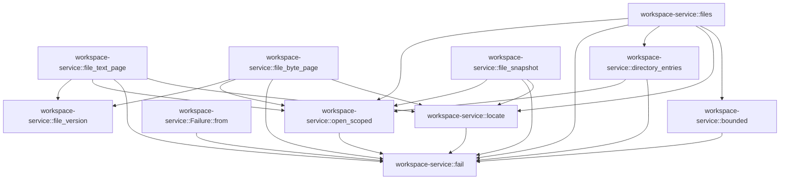

# workspace-service

[Package atlas](index.md) · [Source](../../src/lib.rs)

## Declarations

Visibility is the declaration spelling; trait members and reexports require their enclosing interface. `cfg` is not evaluated.

| Symbol | Kind | Visibility | Test / cfg |
|---|---|---|---|
| [workspace-service::Failure](../../src/lib.rs#L18) | struct_item | `pub` |  |
| [workspace-service::fail](../../src/lib.rs#L23) | function_item | `private` |  |
| [workspace-service::Failure::from](../../src/lib.rs#L31) | function_item | `private` |  |
| [workspace-service::FilesRequest](../../src/lib.rs#L45) | struct_item | `pub` |  |
| [workspace-service::locate](../../src/lib.rs#L54) | function_item | `private` |  |
| [workspace-service::bounded](../../src/lib.rs#L73) | function_item | `private` |  |
| [workspace-service::file_snapshot](../../src/lib.rs#L83) | function_item | `pub` |  |
| [workspace-service::file_version](../../src/lib.rs#L111) | function_item | `private` |  |
| [workspace-service::file_text_page](../../src/lib.rs#L128) | function_item | `pub` |  |
| [workspace-service::file_text_page::MAX_PAGE](../../src/lib.rs#L135) | const_item | `private` |  |
| [workspace-service::file_byte_page](../../src/lib.rs#L199) | function_item | `pub` |  |
| [workspace-service::open_scoped](../../src/lib.rs#L235) | function_item | `private` |  |
| [workspace-service::directory_entries](../../src/lib.rs#L261) | function_item | `private` |  |
| [workspace-service::files](../../src/lib.rs#L295) | function_item | `pub` |  |
| [workspace-service::scoped_tests::text_pages_preserve_empty_lines_unicode_and_eof](../../src/lib.rs#L391) | function_item | `private` | test; #[cfg(all(test, unix))] |
| [workspace-service::scoped_tests::byte_pages_are_bounded_and_detect_same_size_replacement](../../src/lib.rs#L425) | function_item | `private` | test; #[cfg(all(test, unix))] |
| [workspace-service::scoped_tests::byte_page_reads_large_sparse_file_without_full_snapshot](../../src/lib.rs#L453) | function_item | `private` | test; #[cfg(all(test, unix))] |
| [workspace-service::scoped_tests::complete_snapshot_is_bounded_scoped_and_independent_of_later_writes](../../src/lib.rs#L468) | function_item | `private` | test; #[cfg(all(test, unix))] |
| [workspace-service::scoped_tests::replacement_after_resolution_cannot_escape_descriptor_walk](../../src/lib.rs#L490) | function_item | `private` | test; #[cfg(all(test, unix))] |

## Imports / reexports

| Local name | Source path | Visibility |
|---|---|---|
| `fs` | `std::fs` | `private` |
| `Read` | `std::io::Read` | `private` |
| `Component` | `std::path::Component` | `private` |
| `Path` | `std::path::Path` | `private` |
| `PathBuf` | `std::path::PathBuf` | `private` |
| `_` | `base64::Engine` | `private` |
| `Deserialize` | `serde::Deserialize` | `private` |
| `Serialize` | `serde::Serialize` | `private` |
| `Value` | `serde_json::Value` | `private` |
| `json` | `serde_json::json` | `private` |
| `Digest` | `sha2::Digest` | `private` |
| `Sha256` | `sha2::Sha256` | `private` |
| `*` | `super::*` | `private` |

## Module declarations

| Module | Visibility | Attributes |
|---|---|---|
| `workspace-service::git` | `pub` |  |
| `workspace-service::observation` | `pub` |  |
| `workspace-service::process` | `pub` |  |
| `workspace-service::turn` | `pub` |  |
| `workspace-service::write` | `pub` |  |
| `workspace-service::scoped_tests` | `private` | #[cfg(all(test, unix))] |

## Function call graphs

Edges below are syntactically resolved calls only, including private functions. Graphs partition callers into groups of 20; they are not execution order. All unresolved sites are listed below and in the JSON inventory.

Functions 1–11: 22 direct edges

## Call sites

Includes test functions (marked in declarations). Receiver-type-required sites need type analysis/manual tracing. Calls in closures are attributed to their enclosing function; their occurrence here does not mean the closure executes immediately.

| Caller | Callee expression | Source lines | Target / classification |
|---|---|---|---|
| `fail` | `message.into` | [26](../../src/lib.rs#L26) | receiver-type-required |
| `from` | `fail` | [32](../../src/lib.rs#L32) | [workspace-service::fail](../../src/lib.rs#L23) |
| `from` | `error.kind` | [33](../../src/lib.rs#L33) | receiver-type-required |
| `from` | `error.to_string` | [38](../../src/lib.rs#L38) | receiver-type-required |
| `locate` | `Path::new` | [55](../../src/lib.rs#L55) | external-constructor-callback-or-unresolved |
| `locate` | `path.is_absolute` | [56](../../src/lib.rs#L56) | receiver-type-required |
| `locate` | `relative.contains` | [57](../../src/lib.rs#L57) | receiver-type-required |
| `locate` | `path.components().any` | [58](../../src/lib.rs#L58) | receiver-type-required |
| `locate` | `path.components` | [58](../../src/lib.rs#L58) | receiver-type-required |
| `locate` | `Err` | [60](../../src/lib.rs#L60), [68](../../src/lib.rs#L68) | external-constructor-callback-or-unresolved |
| `locate` | `fail` | [60](../../src/lib.rs#L60), [68](../../src/lib.rs#L68) | [workspace-service::fail](../../src/lib.rs#L23) |
| `locate` | `root.canonicalize` | [65](../../src/lib.rs#L65) | receiver-type-required |
| `locate` | `root.join(path).canonicalize` | [66](../../src/lib.rs#L66) | receiver-type-required |
| `locate` | `root.join` | [66](../../src/lib.rs#L66) | receiver-type-required |
| `locate` | `target.starts_with` | [67](../../src/lib.rs#L67) | receiver-type-required |
| `locate` | `Ok` | [70](../../src/lib.rs#L70) | external-constructor-callback-or-unresolved |
| `bounded` | `value.unwrap_or` | [74](../../src/lib.rs#L74) | receiver-type-required |
| `bounded` | `Err` | [76](../../src/lib.rs#L76) | external-constructor-callback-or-unresolved |
| `bounded` | `fail` | [76](../../src/lib.rs#L76) | [workspace-service::fail](../../src/lib.rs#L23) |
| `bounded` | `Ok` | [78](../../src/lib.rs#L78) | external-constructor-callback-or-unresolved |
| `file_snapshot` | `Err` | [85](../../src/lib.rs#L85), [91](../../src/lib.rs#L91), [94](../../src/lib.rs#L94), [100](../../src/lib.rs#L100), [106](../../src/lib.rs#L106) | external-constructor-callback-or-unresolved |
| `file_snapshot` | `fail` | [85](../../src/lib.rs#L85), [91](../../src/lib.rs#L91), [94](../../src/lib.rs#L94), [100](../../src/lib.rs#L100), [106](../../src/lib.rs#L106) | [workspace-service::fail](../../src/lib.rs#L23) |
| `file_snapshot` | `locate` | [87](../../src/lib.rs#L87) | [workspace-service::locate](../../src/lib.rs#L54) |
| `file_snapshot` | `open_scoped` | [88](../../src/lib.rs#L88) | [workspace-service::open_scoped](../../src/lib.rs#L235) |
| `file_snapshot` | `file.metadata` | [89](../../src/lib.rs#L89), [98](../../src/lib.rs#L98) | receiver-type-required |
| `file_snapshot` | `before.is_file` | [90](../../src/lib.rs#L90) | receiver-type-required |
| `file_snapshot` | `before.len` | [93](../../src/lib.rs#L93), [102](../../src/lib.rs#L102) | receiver-type-required |
| `file_snapshot` | `Vec::new` | [96](../../src/lib.rs#L96) | external-constructor-callback-or-unresolved |
| `file_snapshot` | `(&file).take(maximum as u64 + 1).read_to_end` | [97](../../src/lib.rs#L97) | receiver-type-required |
| `file_snapshot` | `(&file).take` | [97](../../src/lib.rs#L97) | receiver-type-required |
| `file_snapshot` | `bytes.len` | [99](../../src/lib.rs#L99), [103](../../src/lib.rs#L103) | receiver-type-required |
| `file_snapshot` | `after.len` | [102](../../src/lib.rs#L102), [103](../../src/lib.rs#L103) | receiver-type-required |
| `file_snapshot` | `before.modified` | [104](../../src/lib.rs#L104) | receiver-type-required |
| `file_snapshot` | `after.modified` | [104](../../src/lib.rs#L104) | receiver-type-required |
| `file_snapshot` | `Ok` | [108](../../src/lib.rs#L108) | external-constructor-callback-or-unresolved |
| `file_text_page` | `Err` | [137](../../src/lib.rs#L137), [143](../../src/lib.rs#L143), [165](../../src/lib.rs#L165), [181](../../src/lib.rs#L181), [189](../../src/lib.rs#L189) | external-constructor-callback-or-unresolved |
| `file_text_page` | `fail` | [137](../../src/lib.rs#L137), [143](../../src/lib.rs#L143), [165](../../src/lib.rs#L165), [181](../../src/lib.rs#L181), [189](../../src/lib.rs#L189) | [workspace-service::fail](../../src/lib.rs#L23) |
| `file_text_page` | `locate` | [139](../../src/lib.rs#L139) | [workspace-service::locate](../../src/lib.rs#L54) |
| `file_text_page` | `open_scoped` | [140](../../src/lib.rs#L140) | [workspace-service::open_scoped](../../src/lib.rs#L235) |
| `file_text_page` | `file.metadata` | [141](../../src/lib.rs#L141) | receiver-type-required |
| `file_text_page` | `before.is_file` | [142](../../src/lib.rs#L142) | receiver-type-required |
| `file_text_page` | `file_version` | [145](../../src/lib.rs#L145), [188](../../src/lib.rs#L188) | [workspace-service::file_version](../../src/lib.rs#L111) |
| `file_text_page` | `BufReader::new` | [146](../../src/lib.rs#L146) | external-constructor-callback-or-unresolved |
| `file_text_page` | `Vec::new` | [148](../../src/lib.rs#L148), [156](../../src/lib.rs#L156) | external-constructor-callback-or-unresolved |
| `file_text_page` | `lines.len` | [152](../../src/lib.rs#L152) | receiver-type-required |
| `file_text_page` | `reader.fill_buf()?.is_empty` | [153](../../src/lib.rs#L153) | receiver-type-required |
| `file_text_page` | `reader.fill_buf` | [153](../../src/lib.rs#L153) | receiver-type-required |
| `file_text_page` | `(&mut reader)             .take(MAX_PAGE as u64 + 1)             .read_until` | [157](../../src/lib.rs#L157) | receiver-type-required |
| `file_text_page` | `(&mut reader)             .take` | [157](../../src/lib.rs#L157) | receiver-type-required |
| `file_text_page` | `line.last` | [171](../../src/lib.rs#L171), [173](../../src/lib.rs#L173) | receiver-type-required |
| `file_text_page` | `Some` | [171](../../src/lib.rs#L171), [173](../../src/lib.rs#L173) | external-constructor-callback-or-unresolved |
| `file_text_page` | `line.pop` | [172](../../src/lib.rs#L172), [174](../../src/lib.rs#L174) | receiver-type-required |
| `file_text_page` | `String::from_utf8_lossy(&line).into_owned` | [177](../../src/lib.rs#L177) | receiver-type-required |
| `file_text_page` | `String::from_utf8_lossy` | [177](../../src/lib.rs#L177) | external-constructor-callback-or-unresolved |
| `file_text_page` | `line.len` | [178](../../src/lib.rs#L178) | receiver-type-required |
| `file_text_page` | `usize::from` | [178](../../src/lib.rs#L178) | external-constructor-callback-or-unresolved |
| `file_text_page` | `lines.is_empty` | [178](../../src/lib.rs#L178), [180](../../src/lib.rs#L180) | receiver-type-required |
| `file_text_page` | `lines.push` | [186](../../src/lib.rs#L186) | receiver-type-required |
| `file_text_page` | `reader.get_ref().metadata` | [188](../../src/lib.rs#L188) | receiver-type-required |
| `file_text_page` | `reader.get_ref` | [188](../../src/lib.rs#L188) | receiver-type-required |
| `file_text_page` | `Ok` | [191](../../src/lib.rs#L191) | external-constructor-callback-or-unresolved |
| `file_byte_page` | `Err` | [207](../../src/lib.rs#L207), [213](../../src/lib.rs#L213), [216](../../src/lib.rs#L216), [226](../../src/lib.rs#L226) | external-constructor-callback-or-unresolved |
| `file_byte_page` | `fail` | [207](../../src/lib.rs#L207), [213](../../src/lib.rs#L213), [216](../../src/lib.rs#L216), [226](../../src/lib.rs#L226) | [workspace-service::fail](../../src/lib.rs#L23) |
| `file_byte_page` | `locate` | [209](../../src/lib.rs#L209) | [workspace-service::locate](../../src/lib.rs#L54) |
| `file_byte_page` | `open_scoped` | [210](../../src/lib.rs#L210) | [workspace-service::open_scoped](../../src/lib.rs#L235) |
| `file_byte_page` | `file.metadata` | [211](../../src/lib.rs#L211), [222](../../src/lib.rs#L222) | receiver-type-required |
| `file_byte_page` | `before.is_file` | [212](../../src/lib.rs#L212) | receiver-type-required |
| `file_byte_page` | `before.len` | [215](../../src/lib.rs#L215), [224](../../src/lib.rs#L224) | receiver-type-required |
| `file_byte_page` | `file_version` | [218](../../src/lib.rs#L218), [223](../../src/lib.rs#L223) | [workspace-service::file_version](../../src/lib.rs#L111) |
| `file_byte_page` | `file.seek` | [219](../../src/lib.rs#L219) | receiver-type-required |
| `file_byte_page` | `SeekFrom::Start` | [219](../../src/lib.rs#L219) | external-constructor-callback-or-unresolved |
| `file_byte_page` | `Vec::new` | [220](../../src/lib.rs#L220) | external-constructor-callback-or-unresolved |
| `file_byte_page` | `(&file).take(length as u64).read_to_end` | [221](../../src/lib.rs#L221) | receiver-type-required |
| `file_byte_page` | `(&file).take` | [221](../../src/lib.rs#L221) | receiver-type-required |
| `file_byte_page` | `bytes.len` | [224](../../src/lib.rs#L224) | receiver-type-required |
| `file_byte_page` | `(before.len() - offset).min` | [224](../../src/lib.rs#L224) | receiver-type-required |
| `file_byte_page` | `Ok` | [228](../../src/lib.rs#L228) | external-constructor-callback-or-unresolved |
| `open_scoped` | `open(         root,         OFlags::RDONLY &#124; OFlags::DIRECTORY &#124; OFlags::NOFOLLOW &#124; OFlags::CLOEXEC,         Mode::empty(),     )     .map_err` | [237](../../src/lib.rs#L237) | receiver-type-required |
| `open_scoped` | `open` | [237](../../src/lib.rs#L237) | external-constructor-callback-or-unresolved |
| `open_scoped` | `Mode::empty` | [240](../../src/lib.rs#L240), [256](../../src/lib.rs#L256) | external-constructor-callback-or-unresolved |
| `open_scoped` | `target         .strip_prefix(root)         .map_err` | [243](../../src/lib.rs#L243) | receiver-type-required |
| `open_scoped` | `target         .strip_prefix` | [243](../../src/lib.rs#L243) | receiver-type-required |
| `open_scoped` | `fail` | [245](../../src/lib.rs#L245), [249](../../src/lib.rs#L249) | [workspace-service::fail](../../src/lib.rs#L23) |
| `open_scoped` | `relative.components().collect::<Vec<_>>` | [246](../../src/lib.rs#L246) | receiver-type-required |
| `open_scoped` | `relative.components` | [246](../../src/lib.rs#L246) | receiver-type-required |
| `open_scoped` | `components.iter().enumerate` | [247](../../src/lib.rs#L247) | receiver-type-required |
| `open_scoped` | `components.iter` | [247](../../src/lib.rs#L247) | receiver-type-required |
| `open_scoped` | `Err` | [249](../../src/lib.rs#L249) | external-constructor-callback-or-unresolved |
| `open_scoped` | `components.len` | [252](../../src/lib.rs#L252) | receiver-type-required |
| `open_scoped` | `openat(&descriptor, *name, flags, Mode::empty()).map_err` | [256](../../src/lib.rs#L256) | receiver-type-required |
| `open_scoped` | `openat` | [256](../../src/lib.rs#L256) | external-constructor-callback-or-unresolved |
| `open_scoped` | `Ok` | [258](../../src/lib.rs#L258) | external-constructor-callback-or-unresolved |
| `open_scoped` | `fs::File::from` | [258](../../src/lib.rs#L258) | external-constructor-callback-or-unresolved |
| `directory_entries` | `open_scoped` | [263](../../src/lib.rs#L263) | [workspace-service::open_scoped](../../src/lib.rs#L235) |
| `directory_entries` | `Dir::read_from(&file).map_err` | [264](../../src/lib.rs#L264) | receiver-type-required |
| `directory_entries` | `Dir::read_from` | [264](../../src/lib.rs#L264) | external-constructor-callback-or-unresolved |
| `directory_entries` | `Vec::new` | [265](../../src/lib.rs#L265) | external-constructor-callback-or-unresolved |
| `directory_entries` | `child.map_err` | [267](../../src/lib.rs#L267) | receiver-type-required |
| `directory_entries` | `child             .file_name()             .to_str()             .map_err` | [268](../../src/lib.rs#L268) | receiver-type-required |
| `directory_entries` | `child             .file_name()             .to_str` | [268](../../src/lib.rs#L268) | receiver-type-required |
| `directory_entries` | `child             .file_name` | [268](../../src/lib.rs#L268) | receiver-type-required |
| `directory_entries` | `fail` | [271](../../src/lib.rs#L271), [276](../../src/lib.rs#L276) | [workspace-service::fail](../../src/lib.rs#L23) |
| `directory_entries` | `result.len` | [275](../../src/lib.rs#L275) | receiver-type-required |
| `directory_entries` | `Err` | [276](../../src/lib.rs#L276) | external-constructor-callback-or-unresolved |
| `directory_entries` | `target             .join(name)             .strip_prefix(root)             .unwrap()             .to_string_lossy()             .into_owned` | [278](../../src/lib.rs#L278) | receiver-type-required |
| `directory_entries` | `target             .join(name)             .strip_prefix(root)             .unwrap()             .to_string_lossy` | [278](../../src/lib.rs#L278) | receiver-type-required |
| `directory_entries` | `target             .join(name)             .strip_prefix(root)             .unwrap` | [278](../../src/lib.rs#L278) | receiver-type-required |
| `directory_entries` | `target             .join(name)             .strip_prefix` | [278](../../src/lib.rs#L278) | receiver-type-required |
| `directory_entries` | `target             .join` | [278](../../src/lib.rs#L278) | receiver-type-required |
| `directory_entries` | `child.file_type` | [284](../../src/lib.rs#L284) | receiver-type-required |
| `directory_entries` | `result.push` | [290](../../src/lib.rs#L290) | receiver-type-required |
| `directory_entries` | `Ok` | [292](../../src/lib.rs#L292) | external-constructor-callback-or-unresolved |
| `files` | `request.workspace_id.is_empty` | [296](../../src/lib.rs#L296) | receiver-type-required |
| `files` | `Err` | [297](../../src/lib.rs#L297), [314](../../src/lib.rs#L314), [357](../../src/lib.rs#L357), [370](../../src/lib.rs#L370), [383](../../src/lib.rs#L383) | external-constructor-callback-or-unresolved |
| `files` | `fail` | [297](../../src/lib.rs#L297), [314](../../src/lib.rs#L314), [357](../../src/lib.rs#L357), [370](../../src/lib.rs#L370), [383](../../src/lib.rs#L383) | [workspace-service::fail](../../src/lib.rs#L23) |
| `files` | `locate` | [299](../../src/lib.rs#L299) | [workspace-service::locate](../../src/lib.rs#L54) |
| `files` | `bounded` | [302](../../src/lib.rs#L302), [311](../../src/lib.rs#L311), [352](../../src/lib.rs#L352) | [workspace-service::bounded](../../src/lib.rs#L73) |
| `files` | `directory_entries` | [303](../../src/lib.rs#L303), [321](../../src/lib.rs#L321) | [workspace-service::directory_entries](../../src/lib.rs#L261) |
| `files` | `children.sort_by` | [304](../../src/lib.rs#L304) | receiver-type-required |
| `files` | `a["name"].as_str().cmp` | [304](../../src/lib.rs#L304) | receiver-type-required |
| `files` | `a["name"].as_str` | [304](../../src/lib.rs#L304) | receiver-type-required |
| `files` | `b["name"].as_str` | [304](../../src/lib.rs#L304) | receiver-type-required |
| `files` | `children.iter().take(limit).cloned().collect::<Vec<_>>` | [305](../../src/lib.rs#L305) | receiver-type-required |
| `files` | `children.iter().take(limit).cloned` | [305](../../src/lib.rs#L305) | receiver-type-required |
| `files` | `children.iter().take` | [305](../../src/lib.rs#L305) | receiver-type-required |
| `files` | `children.iter` | [305](../../src/lib.rs#L305) | receiver-type-required |
| `files` | `Ok` | [306](../../src/lib.rs#L306), [343](../../src/lib.rs#L343), [378](../../src/lib.rs#L378) | external-constructor-callback-or-unresolved |
| `files` | `request.query.as_deref().unwrap_or("").trim().to_lowercase` | [312](../../src/lib.rs#L312) | receiver-type-required |
| `files` | `request.query.as_deref().unwrap_or("").trim` | [312](../../src/lib.rs#L312) | receiver-type-required |
| `files` | `request.query.as_deref().unwrap_or` | [312](../../src/lib.rs#L312) | receiver-type-required |
| `files` | `request.query.as_deref` | [312](../../src/lib.rs#L312) | receiver-type-required |
| `files` | `needle.is_empty` | [313](../../src/lib.rs#L313) | receiver-type-required |
| `files` | `needle.chars().count` | [313](../../src/lib.rs#L313) | receiver-type-required |
| `files` | `needle.chars` | [313](../../src/lib.rs#L313) | receiver-type-required |
| `files` | `Vec::new` | [317](../../src/lib.rs#L317), [359](../../src/lib.rs#L359) | external-constructor-callback-or-unresolved |
| `files` | `pending.pop` | [320](../../src/lib.rs#L320) | receiver-type-required |
| `files` | `entries.len` | [323](../../src/lib.rs#L323) | receiver-type-required |
| `files` | `(value["kind"] == "directory")                         .then` | [327](../../src/lib.rs#L327) | receiver-type-required |
| `files` | `root.join` | [328](../../src/lib.rs#L328) | receiver-type-required |
| `files` | `value["path"].as_str().unwrap` | [328](../../src/lib.rs#L328) | receiver-type-required |
| `files` | `value["path"].as_str` | [328](../../src/lib.rs#L328) | receiver-type-required |
| `files` | `value["path"]                         .as_str()                         .unwrap()                         .to_lowercase()                         .contains` | [329](../../src/lib.rs#L329) | receiver-type-required |
| `files` | `value["path"]                         .as_str()                         .unwrap()                         .to_lowercase` | [329](../../src/lib.rs#L329) | receiver-type-required |
| `files` | `value["path"]                         .as_str()                         .unwrap` | [329](../../src/lib.rs#L329) | receiver-type-required |
| `files` | `value["path"]                         .as_str` | [329](../../src/lib.rs#L329) | receiver-type-required |
| `files` | `entries.push` | [335](../../src/lib.rs#L335) | receiver-type-required |
| `files` | `pending.push` | [338](../../src/lib.rs#L338) | receiver-type-required |
| `files` | `entries.sort_by` | [342](../../src/lib.rs#L342) | receiver-type-required |
| `files` | `a["path"].as_str().cmp` | [342](../../src/lib.rs#L342) | receiver-type-required |
| `files` | `a["path"].as_str` | [342](../../src/lib.rs#L342) | receiver-type-required |
| `files` | `b["path"].as_str` | [342](../../src/lib.rs#L342) | receiver-type-required |
| `files` | `Some` | [349](../../src/lib.rs#L349), [352](../../src/lib.rs#L352) | external-constructor-callback-or-unresolved |
| `files` | `open_scoped` | [354](../../src/lib.rs#L354) | [workspace-service::open_scoped](../../src/lib.rs#L235) |
| `files` | `file.metadata` | [355](../../src/lib.rs#L355), [368](../../src/lib.rs#L368) | receiver-type-required |
| `files` | `before.is_file` | [356](../../src/lib.rs#L356) | receiver-type-required |
| `files` | `(&file).take(maximum as u64 + 1).read_to_end` | [362](../../src/lib.rs#L362) | receiver-type-required |
| `files` | `(&file).take` | [362](../../src/lib.rs#L362) | receiver-type-required |
| `files` | `(&file).read_to_end` | [365](../../src/lib.rs#L365) | receiver-type-required |
| `files` | `before.len` | [369](../../src/lib.rs#L369) | receiver-type-required |
| `files` | `after.len` | [369](../../src/lib.rs#L369), [373](../../src/lib.rs#L373) | receiver-type-required |
| `files` | `before.modified` | [369](../../src/lib.rs#L369) | receiver-type-required |
| `files` | `after.modified` | [369](../../src/lib.rs#L369) | receiver-type-required |
| `files` | `maximum.is_some_and` | [372](../../src/lib.rs#L372) | receiver-type-required |
| `files` | `bytes.len` | [372](../../src/lib.rs#L372), [373](../../src/lib.rs#L373) | receiver-type-required |
| `files` | `bytes.truncate` | [375](../../src/lib.rs#L375) | receiver-type-required |
| `files` | `(!truncated).then` | [377](../../src/lib.rs#L377) | receiver-type-required |
| `text_pages_preserve_empty_lines_unicode_and_eof` | `tempfile::tempdir().unwrap` | [392](../../src/lib.rs#L392) | receiver-type-required |
| `text_pages_preserve_empty_lines_unicode_and_eof` | `tempfile::tempdir` | [392](../../src/lib.rs#L392) | external-constructor-callback-or-unresolved |
| `text_pages_preserve_empty_lines_unicode_and_eof` | `fs::write(workspace.path().join("text"), "第一行\r\n\nlast\n").unwrap` | [393](../../src/lib.rs#L393) | receiver-type-required |
| `text_pages_preserve_empty_lines_unicode_and_eof` | `fs::write` | [393](../../src/lib.rs#L393), [407](../../src/lib.rs#L407), [412](../../src/lib.rs#L412) | external-constructor-callback-or-unresolved |
| `text_pages_preserve_empty_lines_unicode_and_eof` | `workspace.path().join` | [393](../../src/lib.rs#L393), [407](../../src/lib.rs#L407), [413](../../src/lib.rs#L413) | receiver-type-required |
| `text_pages_preserve_empty_lines_unicode_and_eof` | `workspace.path` | [393](../../src/lib.rs#L393), [394](../../src/lib.rs#L394), [398](../../src/lib.rs#L398), [403](../../src/lib.rs#L403), [407](../../src/lib.rs#L407), [413](../../src/lib.rs#L413) | receiver-type-required |
| `text_pages_preserve_empty_lines_unicode_and_eof` | `file_text_page(workspace.path(), "text", 1, 2).unwrap` | [394](../../src/lib.rs#L394) | receiver-type-required |
| `text_pages_preserve_empty_lines_unicode_and_eof` | `file_text_page` | [394](../../src/lib.rs#L394), [398](../../src/lib.rs#L398), [403](../../src/lib.rs#L403) | external-constructor-callback-or-unresolved |
| `text_pages_preserve_empty_lines_unicode_and_eof` | `file_text_page(workspace.path(), "text", 3, 2).unwrap` | [398](../../src/lib.rs#L398) | receiver-type-required |
| `text_pages_preserve_empty_lines_unicode_and_eof` | `file_text_page(workspace.path(), "text", 4, 2).unwrap` | [403](../../src/lib.rs#L403) | receiver-type-required |
| `text_pages_preserve_empty_lines_unicode_and_eof` | `fs::write(workspace.path().join("text"), "no newline").unwrap` | [407](../../src/lib.rs#L407) | receiver-type-required |
| `text_pages_preserve_empty_lines_unicode_and_eof` | `fs::write(             workspace.path().join("text"),             vec![b'x'; 4 * 1024 * 1024 + 1],         )         .unwrap` | [412](../../src/lib.rs#L412) | receiver-type-required |
| `byte_pages_are_bounded_and_detect_same_size_replacement` | `tempfile::tempdir().unwrap` | [426](../../src/lib.rs#L426) | receiver-type-required |
| `byte_pages_are_bounded_and_detect_same_size_replacement` | `tempfile::tempdir` | [426](../../src/lib.rs#L426) | external-constructor-callback-or-unresolved |
| `byte_pages_are_bounded_and_detect_same_size_replacement` | `fs::write(workspace.path().join("file"), [0, 255, 2, 3, 4]).unwrap` | [427](../../src/lib.rs#L427) | receiver-type-required |
| `byte_pages_are_bounded_and_detect_same_size_replacement` | `fs::write` | [427](../../src/lib.rs#L427), [437](../../src/lib.rs#L437) | external-constructor-callback-or-unresolved |
| `byte_pages_are_bounded_and_detect_same_size_replacement` | `workspace.path().join` | [427](../../src/lib.rs#L427), [437](../../src/lib.rs#L437), [439](../../src/lib.rs#L439), [440](../../src/lib.rs#L440) | receiver-type-required |
| `byte_pages_are_bounded_and_detect_same_size_replacement` | `workspace.path` | [427](../../src/lib.rs#L427), [428](../../src/lib.rs#L428), [429](../../src/lib.rs#L429), [437](../../src/lib.rs#L437), [439](../../src/lib.rs#L439), [440](../../src/lib.rs#L440) | receiver-type-required |
| `byte_pages_are_bounded_and_detect_same_size_replacement` | `file_byte_page(workspace.path(), "file", 0, 2).unwrap` | [428](../../src/lib.rs#L428) | receiver-type-required |
| `byte_pages_are_bounded_and_detect_same_size_replacement` | `file_byte_page` | [428](../../src/lib.rs#L428), [429](../../src/lib.rs#L429) | external-constructor-callback-or-unresolved |
| `byte_pages_are_bounded_and_detect_same_size_replacement` | `file_byte_page(workspace.path(), "file", 2, 3).unwrap` | [429](../../src/lib.rs#L429) | receiver-type-required |
| `byte_pages_are_bounded_and_detect_same_size_replacement` | `fs::write(workspace.path().join("replacement"), [5, 6, 7, 8, 9]).unwrap` | [437](../../src/lib.rs#L437) | receiver-type-required |
| `byte_pages_are_bounded_and_detect_same_size_replacement` | `fs::rename(             workspace.path().join("replacement"),             workspace.path().join("file"),         )         .unwrap` | [438](../../src/lib.rs#L438) | receiver-type-required |
| `byte_pages_are_bounded_and_detect_same_size_replacement` | `fs::rename` | [438](../../src/lib.rs#L438) | external-constructor-callback-or-unresolved |
| `byte_page_reads_large_sparse_file_without_full_snapshot` | `tempfile::tempdir().unwrap` | [455](../../src/lib.rs#L455) | receiver-type-required |
| `byte_page_reads_large_sparse_file_without_full_snapshot` | `tempfile::tempdir` | [455](../../src/lib.rs#L455) | external-constructor-callback-or-unresolved |
| `byte_page_reads_large_sparse_file_without_full_snapshot` | `fs::File::create(workspace.path().join("large")).unwrap` | [456](../../src/lib.rs#L456) | receiver-type-required |
| `byte_page_reads_large_sparse_file_without_full_snapshot` | `fs::File::create` | [456](../../src/lib.rs#L456) | external-constructor-callback-or-unresolved |
| `byte_page_reads_large_sparse_file_without_full_snapshot` | `workspace.path().join` | [456](../../src/lib.rs#L456) | receiver-type-required |
| `byte_page_reads_large_sparse_file_without_full_snapshot` | `workspace.path` | [456](../../src/lib.rs#L456), [461](../../src/lib.rs#L461) | receiver-type-required |
| `byte_page_reads_large_sparse_file_without_full_snapshot` | `file.set_len(size).unwrap` | [458](../../src/lib.rs#L458) | receiver-type-required |
| `byte_page_reads_large_sparse_file_without_full_snapshot` | `file.set_len` | [458](../../src/lib.rs#L458) | receiver-type-required |
| `byte_page_reads_large_sparse_file_without_full_snapshot` | `file.seek(SeekFrom::Start(size - 4)).unwrap` | [459](../../src/lib.rs#L459) | receiver-type-required |
| `byte_page_reads_large_sparse_file_without_full_snapshot` | `file.seek` | [459](../../src/lib.rs#L459) | receiver-type-required |
| `byte_page_reads_large_sparse_file_without_full_snapshot` | `SeekFrom::Start` | [459](../../src/lib.rs#L459) | external-constructor-callback-or-unresolved |
| `byte_page_reads_large_sparse_file_without_full_snapshot` | `file.write_all(b"tail").unwrap` | [460](../../src/lib.rs#L460) | receiver-type-required |
| `byte_page_reads_large_sparse_file_without_full_snapshot` | `file.write_all` | [460](../../src/lib.rs#L460) | receiver-type-required |
| `byte_page_reads_large_sparse_file_without_full_snapshot` | `file_byte_page(workspace.path(), "large", size - 4, 4).unwrap` | [461](../../src/lib.rs#L461) | receiver-type-required |
| `byte_page_reads_large_sparse_file_without_full_snapshot` | `file_byte_page` | [461](../../src/lib.rs#L461) | external-constructor-callback-or-unresolved |
| `complete_snapshot_is_bounded_scoped_and_independent_of_later_writes` | `tempfile::tempdir().unwrap` | [469](../../src/lib.rs#L469), [470](../../src/lib.rs#L470) | receiver-type-required |
| `complete_snapshot_is_bounded_scoped_and_independent_of_later_writes` | `tempfile::tempdir` | [469](../../src/lib.rs#L469), [470](../../src/lib.rs#L470) | external-constructor-callback-or-unresolved |
| `complete_snapshot_is_bounded_scoped_and_independent_of_later_writes` | `fs::write(workspace.path().join("file"), b"original").unwrap` | [471](../../src/lib.rs#L471) | receiver-type-required |
| `complete_snapshot_is_bounded_scoped_and_independent_of_later_writes` | `fs::write` | [471](../../src/lib.rs#L471), [473](../../src/lib.rs#L473), [480](../../src/lib.rs#L480) | external-constructor-callback-or-unresolved |
| `complete_snapshot_is_bounded_scoped_and_independent_of_later_writes` | `workspace.path().join` | [471](../../src/lib.rs#L471), [473](../../src/lib.rs#L473), [481](../../src/lib.rs#L481) | receiver-type-required |
| `complete_snapshot_is_bounded_scoped_and_independent_of_later_writes` | `workspace.path` | [471](../../src/lib.rs#L471), [472](../../src/lib.rs#L472), [473](../../src/lib.rs#L473), [481](../../src/lib.rs#L481) | receiver-type-required |
| `complete_snapshot_is_bounded_scoped_and_independent_of_later_writes` | `file_snapshot(workspace.path(), "file", 8).unwrap` | [472](../../src/lib.rs#L472) | receiver-type-required |
| `complete_snapshot_is_bounded_scoped_and_independent_of_later_writes` | `file_snapshot` | [472](../../src/lib.rs#L472) | external-constructor-callback-or-unresolved |
| `complete_snapshot_is_bounded_scoped_and_independent_of_later_writes` | `fs::write(workspace.path().join("file"), b"changed!").unwrap` | [473](../../src/lib.rs#L473) | receiver-type-required |
| `complete_snapshot_is_bounded_scoped_and_independent_of_later_writes` | `fs::write(outside.path().join("secret"), b"outside").unwrap` | [480](../../src/lib.rs#L480) | receiver-type-required |
| `complete_snapshot_is_bounded_scoped_and_independent_of_later_writes` | `outside.path().join` | [480](../../src/lib.rs#L480), [481](../../src/lib.rs#L481) | receiver-type-required |
| `complete_snapshot_is_bounded_scoped_and_independent_of_later_writes` | `outside.path` | [480](../../src/lib.rs#L480), [481](../../src/lib.rs#L481) | receiver-type-required |
| `complete_snapshot_is_bounded_scoped_and_independent_of_later_writes` | `std::os::unix::fs::symlink(outside.path().join("secret"), workspace.path().join("link"))             .unwrap` | [481](../../src/lib.rs#L481) | receiver-type-required |
| `complete_snapshot_is_bounded_scoped_and_independent_of_later_writes` | `std::os::unix::fs::symlink` | [481](../../src/lib.rs#L481) | external-constructor-callback-or-unresolved |
| `replacement_after_resolution_cannot_escape_descriptor_walk` | `tempfile::tempdir().unwrap` | [491](../../src/lib.rs#L491), [492](../../src/lib.rs#L492) | receiver-type-required |
| `replacement_after_resolution_cannot_escape_descriptor_walk` | `tempfile::tempdir` | [491](../../src/lib.rs#L491), [492](../../src/lib.rs#L492) | external-constructor-callback-or-unresolved |
| `replacement_after_resolution_cannot_escape_descriptor_walk` | `fs::create_dir(workspace.path().join("folder")).unwrap` | [493](../../src/lib.rs#L493) | receiver-type-required |
| `replacement_after_resolution_cannot_escape_descriptor_walk` | `fs::create_dir` | [493](../../src/lib.rs#L493) | external-constructor-callback-or-unresolved |
| `replacement_after_resolution_cannot_escape_descriptor_walk` | `workspace.path().join` | [493](../../src/lib.rs#L493), [494](../../src/lib.rs#L494), [498](../../src/lib.rs#L498), [499](../../src/lib.rs#L499), [502](../../src/lib.rs#L502) | receiver-type-required |
| `replacement_after_resolution_cannot_escape_descriptor_walk` | `workspace.path` | [493](../../src/lib.rs#L493), [494](../../src/lib.rs#L494), [496](../../src/lib.rs#L496), [498](../../src/lib.rs#L498), [499](../../src/lib.rs#L499), [502](../../src/lib.rs#L502) | receiver-type-required |
| `replacement_after_resolution_cannot_escape_descriptor_walk` | `fs::write(workspace.path().join("folder/data"), "allowed").unwrap` | [494](../../src/lib.rs#L494) | receiver-type-required |
| `replacement_after_resolution_cannot_escape_descriptor_walk` | `fs::write` | [494](../../src/lib.rs#L494), [495](../../src/lib.rs#L495) | external-constructor-callback-or-unresolved |
| `replacement_after_resolution_cannot_escape_descriptor_walk` | `fs::write(outside.path().join("data"), "must not read").unwrap` | [495](../../src/lib.rs#L495) | receiver-type-required |
| `replacement_after_resolution_cannot_escape_descriptor_walk` | `outside.path().join` | [495](../../src/lib.rs#L495) | receiver-type-required |
| `replacement_after_resolution_cannot_escape_descriptor_walk` | `outside.path` | [495](../../src/lib.rs#L495), [502](../../src/lib.rs#L502) | receiver-type-required |
| `replacement_after_resolution_cannot_escape_descriptor_walk` | `locate(workspace.path(), "folder/data").unwrap` | [496](../../src/lib.rs#L496) | receiver-type-required |
| `replacement_after_resolution_cannot_escape_descriptor_walk` | `locate` | [496](../../src/lib.rs#L496) | external-constructor-callback-or-unresolved |
| `replacement_after_resolution_cannot_escape_descriptor_walk` | `fs::rename(             workspace.path().join("folder"),             workspace.path().join("original"),         )         .unwrap` | [497](../../src/lib.rs#L497) | receiver-type-required |
| `replacement_after_resolution_cannot_escape_descriptor_walk` | `fs::rename` | [497](../../src/lib.rs#L497) | external-constructor-callback-or-unresolved |
| `replacement_after_resolution_cannot_escape_descriptor_walk` | `std::os::unix::fs::symlink(outside.path(), workspace.path().join("folder")).unwrap` | [502](../../src/lib.rs#L502) | receiver-type-required |
| `replacement_after_resolution_cannot_escape_descriptor_walk` | `std::os::unix::fs::symlink` | [502](../../src/lib.rs#L502) | external-constructor-callback-or-unresolved |
