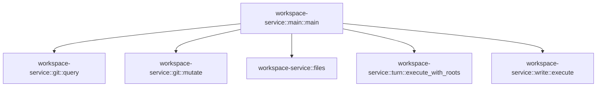

# workspace-service::main

[Package atlas](index.md) · [Source](../../src/main.rs)

## Declarations

Visibility is the declaration spelling; trait members and reexports require their enclosing interface. `cfg` is not evaluated.

| Symbol | Kind | Visibility | Test / cfg |
|---|---|---|---|
| [workspace-service::main::Request](../../src/main.rs#L8) | struct_item | `private` |  |
| [workspace-service::main::main](../../src/main.rs#L13) | function_item | `private` |  |

## Imports / reexports

| Local name | Source path | Visibility |
|---|---|---|
| `Deserialize` | `serde::Deserialize` | `private` |
| `Value` | `serde_json::Value` | `private` |
| `json` | `serde_json::json` | `private` |
| `Read` | `std::io::Read` | `private` |
| `Write` | `std::io::Write` | `private` |
| `PathBuf` | `std::path::PathBuf` | `private` |

## Module declarations

| Module | Visibility | Attributes |
|---|---|---|

## Function call graphs

Edges below are syntactically resolved calls only, including private functions. Graphs partition callers into groups of 20; they are not execution order. All unresolved sites are listed below and in the JSON inventory.

Functions 1–1: 5 direct edges

## Call sites

Includes test functions (marked in declarations). Receiver-type-required sites need type analysis/manual tracing. Calls in closures are attributed to their enclosing function; their occurrence here does not mean the closure executes immediately.

| Caller | Callee expression | Source lines | Target / classification |
|---|---|---|---|
| `main` | `std::env::args_os().skip(1).collect::<Vec<_>>` | [15](../../src/main.rs#L15) | receiver-type-required |
| `main` | `std::env::args_os().skip` | [15](../../src/main.rs#L15) | receiver-type-required |
| `main` | `std::env::args_os` | [15](../../src/main.rs#L15) | external-constructor-callback-or-unresolved |
| `main` | `[2, 4].contains` | [16](../../src/main.rs#L16) | receiver-type-required |
| `main` | `arguments.len` | [16](../../src/main.rs#L16), [18](../../src/main.rs#L18), [34](../../src/main.rs#L34) | receiver-type-required |
| `main` | `std::process::exit` | [21](../../src/main.rs#L21), [104](../../src/main.rs#L104) | external-constructor-callback-or-unresolved |
| `main` | `PathBuf::from` | [23](../../src/main.rs#L23) | external-constructor-callback-or-unresolved |
| `main` | `Vec::new` | [24](../../src/main.rs#L24) | external-constructor-callback-or-unresolved |
| `main` | `(&#124;&#124; {         std::io::stdin()             .take(8 * 1024 * 1024 + 1)             .read_to_end(&mut input)             .map_err(&#124;e&#124; e.to_string())?;         if input.len() > 8 * 1024 * 1024 {             return Err("Request too large".into());         }         let envelope: Request = serde_json::from_slice(&input).map_err(&#124;e&#124; e.to_string())?;         let authority: Option<workspace_service::git::MutationAuthority> = if arguments.len() == 4 {             Some(                 serde_json::from_slice(&std::fs::read(&arguments[3]).map_err(&#124;e&#124; e.to_string())?)                     .map_err(&#124;e&#124; e.to_string())?,             )         } else {             None         };         if envelope.method != "filesWrite" && input.len() > 1024 * 1024 {             return Err("Request too large".into());         }         let result = if envelope.method == "filesWrite" {             let request = serde_json::from_value(envelope.request).map_err(&#124;e&#124; e.to_string())?;             workspace_service::write::execute(&root, request, authority.as_ref())         } else if envelope.method.starts_with("git") {             let request = serde_json::from_value(envelope.request).map_err(&#124;e&#124; e.to_string())?;             tokio::runtime::Builder::new_current_thread()                 .enable_all()                 .build()                 .map_err(&#124;e&#124; e.to_string())?                 .block_on(async {                     if ["gitCommit", "gitPush", "gitChangeBranch"]                         .contains(&envelope.method.as_str())                     {                         workspace_service::git::mutate(                             &root,                             &envelope.method,                             request,                             authority.as_ref(),                         )                         .await                     } else {                         workspace_service::git::query(&root, &envelope.method, request).await                     }                 })         } else if [             "turnChanges",             "recordTurnEdit",             "prepareTurnEdit",             "abortTurnEdit",         ]         .contains(&envelope.method.as_str())         {             let request = serde_json::from_value(envelope.request).map_err(&#124;e&#124; e.to_string())?;             match authority.as_ref() {                 Some(authority) => workspace_service::turn::execute_with_roots(                     &authority.state_root,                     &root,                     &authority.workspace_roots,                     &envelope.method,                     request,                 ),                 None => Err(workspace_service::Failure {                     code: "unavailable",                     message: "Missing parent service state authority".into(),                 }),             }         } else {             let request = serde_json::from_value(envelope.request).map_err(&#124;e&#124; e.to_string())?;             workspace_service::files(&root, &envelope.method, request)         };         Ok(match result {             Ok(value) => json!({"result":value}),             Err(error) => json!({"error":error}),         })     })` | [25](../../src/main.rs#L25) | external-constructor-callback-or-unresolved |
| `main` | `std::io::stdin()             .take(8 * 1024 * 1024 + 1)             .read_to_end(&mut input)             .map_err` | [26](../../src/main.rs#L26) | receiver-type-required |
| `main` | `std::io::stdin()             .take(8 * 1024 * 1024 + 1)             .read_to_end` | [26](../../src/main.rs#L26) | receiver-type-required |
| `main` | `std::io::stdin()             .take` | [26](../../src/main.rs#L26) | receiver-type-required |
| `main` | `std::io::stdin` | [26](../../src/main.rs#L26) | external-constructor-callback-or-unresolved |
| `main` | `e.to_string` | [29](../../src/main.rs#L29), [33](../../src/main.rs#L33), [36](../../src/main.rs#L36), [37](../../src/main.rs#L37), [46](../../src/main.rs#L46), [49](../../src/main.rs#L49), [53](../../src/main.rs#L53), [77](../../src/main.rs#L77), [92](../../src/main.rs#L92) | receiver-type-required |
| `main` | `input.len` | [30](../../src/main.rs#L30), [42](../../src/main.rs#L42) | receiver-type-required |
| `main` | `Err` | [31](../../src/main.rs#L31), [43](../../src/main.rs#L43), [86](../../src/main.rs#L86) | external-constructor-callback-or-unresolved |
| `main` | `"Request too large".into` | [31](../../src/main.rs#L31), [43](../../src/main.rs#L43) | receiver-type-required |
| `main` | `serde_json::from_slice(&input).map_err` | [33](../../src/main.rs#L33) | receiver-type-required |
| `main` | `serde_json::from_slice` | [33](../../src/main.rs#L33), [36](../../src/main.rs#L36) | external-constructor-callback-or-unresolved |
| `main` | `Some` | [35](../../src/main.rs#L35) | external-constructor-callback-or-unresolved |
| `main` | `serde_json::from_slice(&std::fs::read(&arguments[3]).map_err(&#124;e&#124; e.to_string())?)                     .map_err` | [36](../../src/main.rs#L36) | receiver-type-required |
| `main` | `std::fs::read(&arguments[3]).map_err` | [36](../../src/main.rs#L36) | receiver-type-required |
| `main` | `std::fs::read` | [36](../../src/main.rs#L36) | external-constructor-callback-or-unresolved |
| `main` | `serde_json::from_value(envelope.request).map_err` | [46](../../src/main.rs#L46), [49](../../src/main.rs#L49), [77](../../src/main.rs#L77), [92](../../src/main.rs#L92) | receiver-type-required |
| `main` | `serde_json::from_value` | [46](../../src/main.rs#L46), [49](../../src/main.rs#L49), [77](../../src/main.rs#L77), [92](../../src/main.rs#L92) | external-constructor-callback-or-unresolved |
| `main` | `workspace_service::write::execute` | [47](../../src/main.rs#L47) | [workspace-service::write::execute](../../src/write.rs#L31) |
| `main` | `authority.as_ref` | [47](../../src/main.rs#L47), [62](../../src/main.rs#L62), [78](../../src/main.rs#L78) | receiver-type-required |
| `main` | `envelope.method.starts_with` | [48](../../src/main.rs#L48) | receiver-type-required |
| `main` | `tokio::runtime::Builder::new_current_thread()                 .enable_all()                 .build()                 .map_err(&#124;e&#124; e.to_string())?                 .block_on` | [50](../../src/main.rs#L50) | receiver-type-required |
| `main` | `tokio::runtime::Builder::new_current_thread()                 .enable_all()                 .build()                 .map_err` | [50](../../src/main.rs#L50) | receiver-type-required |
| `main` | `tokio::runtime::Builder::new_current_thread()                 .enable_all()                 .build` | [50](../../src/main.rs#L50) | receiver-type-required |
| `main` | `tokio::runtime::Builder::new_current_thread()                 .enable_all` | [50](../../src/main.rs#L50) | receiver-type-required |
| `main` | `tokio::runtime::Builder::new_current_thread` | [50](../../src/main.rs#L50) | external-constructor-callback-or-unresolved |
| `main` | `["gitCommit", "gitPush", "gitChangeBranch"]                         .contains` | [55](../../src/main.rs#L55) | receiver-type-required |
| `main` | `envelope.method.as_str` | [56](../../src/main.rs#L56), [75](../../src/main.rs#L75) | receiver-type-required |
| `main` | `workspace_service::git::mutate` | [58](../../src/main.rs#L58) | [workspace-service::git::mutate](../../src/git.rs#L796) |
| `main` | `workspace_service::git::query` | [66](../../src/main.rs#L66) | [workspace-service::git::query](../../src/git.rs#L151) |
| `main` | `[             "turnChanges",             "recordTurnEdit",             "prepareTurnEdit",             "abortTurnEdit",         ]         .contains` | [69](../../src/main.rs#L69) | receiver-type-required |
| `main` | `workspace_service::turn::execute_with_roots` | [79](../../src/main.rs#L79) | [workspace-service::turn::execute_with_roots](../../src/turn.rs#L146) |
| `main` | `"Missing parent service state authority".into` | [88](../../src/main.rs#L88) | receiver-type-required |
| `main` | `workspace_service::files` | [93](../../src/main.rs#L93) | [workspace-service::files](../../src/lib.rs#L295) |
| `main` | `Ok` | [95](../../src/main.rs#L95) | external-constructor-callback-or-unresolved |
| `main` | `result         .unwrap_or_else` | [100](../../src/main.rs#L100) | receiver-type-required |
| `main` | `serde_json::to_vec(&value).expect` | [102](../../src/main.rs#L102) | receiver-type-required |
| `main` | `serde_json::to_vec` | [102](../../src/main.rs#L102) | external-constructor-callback-or-unresolved |
| `main` | `std::io::stdout().write_all(&output).is_err` | [103](../../src/main.rs#L103) | receiver-type-required |
| `main` | `std::io::stdout().write_all` | [103](../../src/main.rs#L103) | receiver-type-required |
| `main` | `std::io::stdout` | [103](../../src/main.rs#L103) | external-constructor-callback-or-unresolved |
