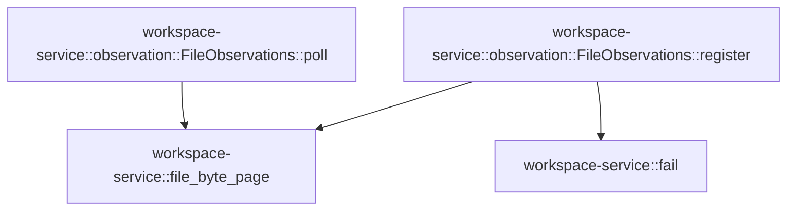

# workspace-service::observation

[Package atlas](index.md) · [Source](../../src/observation.rs)

## Declarations

Visibility is the declaration spelling; trait members and reexports require their enclosing interface. `cfg` is not evaluated.

| Symbol | Kind | Visibility | Test / cfg |
|---|---|---|---|
| [workspace-service::observation::FileObservations](../../src/observation.rs#L8) | struct_item | `pub` |  |
| [workspace-service::observation::FileObservations::register](../../src/observation.rs#L13) | function_item | `pub` |  |
| [workspace-service::observation::FileObservations::poll](../../src/observation.rs#L30) | function_item | `pub` |  |
| [workspace-service::observation::tests::write_delete_and_recreate_publish_once_and_reads_do_not_hide_changes](../../src/observation.rs#L64) | function_item | `private` | test; #[cfg(test)] |

## Imports / reexports

| Local name | Source path | Visibility |
|---|---|---|
| `Failure` | `crate::Failure` | `private` |
| `fail` | `crate::fail` | `private` |
| `file_byte_page` | `crate::file_byte_page` | `private` |
| `Value` | `serde_json::Value` | `private` |
| `json` | `serde_json::json` | `private` |
| `BTreeMap` | `std::collections::BTreeMap` | `private` |
| `Path` | `std::path::Path` | `private` |
| `PathBuf` | `std::path::PathBuf` | `private` |
| `*` | `super::*` | `private` |

## Module declarations

| Module | Visibility | Attributes |
|---|---|---|
| `workspace-service::observation::tests` | `private` | #[cfg(test)] |

## Function call graphs

Edges below are syntactically resolved calls only, including private functions. Graphs partition callers into groups of 20; they are not execution order. All unresolved sites are listed below and in the JSON inventory.

Functions 1–2: 3 direct edges

## Call sites

Includes test functions (marked in declarations). Receiver-type-required sites need type analysis/manual tracing. Calls in closures are attributed to their enclosing function; their occurrence here does not mean the closure executes immediately.

| Caller | Callee expression | Source lines | Target / classification |
|---|---|---|---|
| `register` | `file_byte_page` | [14](../../src/observation.rs#L14) | [workspace-service::file_byte_page](../../src/lib.rs#L199) |
| `register` | `root.canonicalize` | [15](../../src/observation.rs#L15) | receiver-type-required |
| `register` | `relative.to_owned` | [15](../../src/observation.rs#L15) | receiver-type-required |
| `register` | `self.paths.contains_key` | [16](../../src/observation.rs#L16) | receiver-type-required |
| `register` | `self.paths.len` | [16](../../src/observation.rs#L16) | receiver-type-required |
| `register` | `Err` | [17](../../src/observation.rs#L17) | external-constructor-callback-or-unresolved |
| `register` | `fail` | [17](../../src/observation.rs#L17) | [workspace-service::fail](../../src/lib.rs#L23) |
| `register` | `self.paths.entry(key).or_insert_with` | [21](../../src/observation.rs#L21) | receiver-type-required |
| `register` | `self.paths.entry` | [21](../../src/observation.rs#L21) | receiver-type-required |
| `register` | `page["absolutePath"].as_str().unwrap().to_owned` | [23](../../src/observation.rs#L23) | receiver-type-required |
| `register` | `page["absolutePath"].as_str().unwrap` | [23](../../src/observation.rs#L23) | receiver-type-required |
| `register` | `page["absolutePath"].as_str` | [23](../../src/observation.rs#L23) | receiver-type-required |
| `register` | `Some` | [24](../../src/observation.rs#L24) | external-constructor-callback-or-unresolved |
| `register` | `page["version"].as_str().unwrap().to_owned` | [24](../../src/observation.rs#L24) | receiver-type-required |
| `register` | `page["version"].as_str().unwrap` | [24](../../src/observation.rs#L24) | receiver-type-required |
| `register` | `page["version"].as_str` | [24](../../src/observation.rs#L24) | receiver-type-required |
| `register` | `Ok` | [27](../../src/observation.rs#L27) | external-constructor-callback-or-unresolved |
| `poll` | `self.paths.clone` | [31](../../src/observation.rs#L31) | receiver-type-required |
| `poll` | `Vec::new` | [32](../../src/observation.rs#L32) | external-constructor-callback-or-unresolved |
| `poll` | `file_byte_page` | [34](../../src/observation.rs#L34) | [workspace-service::file_byte_page](../../src/lib.rs#L199) |
| `poll` | `page["absolutePath"].as_str().unwrap` | [36](../../src/observation.rs#L36) | receiver-type-required |
| `poll` | `page["absolutePath"].as_str` | [36](../../src/observation.rs#L36) | receiver-type-required |
| `poll` | `changes.push` | [38](../../src/observation.rs#L38), [48](../../src/observation.rs#L48) | receiver-type-required |
| `poll` | `current_path.to_owned` | [39](../../src/observation.rs#L39) | receiver-type-required |
| `poll` | `Some` | [42](../../src/observation.rs#L42) | external-constructor-callback-or-unresolved |
| `poll` | `page["version"].as_str().unwrap().to_owned` | [42](../../src/observation.rs#L42) | receiver-type-required |
| `poll` | `page["version"].as_str().unwrap` | [42](../../src/observation.rs#L42) | receiver-type-required |
| `poll` | `page["version"].as_str` | [42](../../src/observation.rs#L42) | receiver-type-required |
| `poll` | `Err` | [45](../../src/observation.rs#L45) | external-constructor-callback-or-unresolved |
| `poll` | `Ok` | [56](../../src/observation.rs#L56) | external-constructor-callback-or-unresolved |
| `write_delete_and_recreate_publish_once_and_reads_do_not_hide_changes` | `tempfile::tempdir().unwrap` | [65](../../src/observation.rs#L65) | receiver-type-required |
| `write_delete_and_recreate_publish_once_and_reads_do_not_hide_changes` | `tempfile::tempdir` | [65](../../src/observation.rs#L65) | external-constructor-callback-or-unresolved |
| `write_delete_and_recreate_publish_once_and_reads_do_not_hide_changes` | `root.path().join` | [66](../../src/observation.rs#L66) | receiver-type-required |
| `write_delete_and_recreate_publish_once_and_reads_do_not_hide_changes` | `root.path` | [66](../../src/observation.rs#L66), [69](../../src/observation.rs#L69), [72](../../src/observation.rs#L72) | receiver-type-required |
| `write_delete_and_recreate_publish_once_and_reads_do_not_hide_changes` | `std::fs::write(&path, "first").unwrap` | [67](../../src/observation.rs#L67) | receiver-type-required |
| `write_delete_and_recreate_publish_once_and_reads_do_not_hide_changes` | `std::fs::write` | [67](../../src/observation.rs#L67), [71](../../src/observation.rs#L71), [80](../../src/observation.rs#L80) | external-constructor-callback-or-unresolved |
| `write_delete_and_recreate_publish_once_and_reads_do_not_hide_changes` | `FileObservations::default` | [68](../../src/observation.rs#L68) | external-constructor-callback-or-unresolved |
| `write_delete_and_recreate_publish_once_and_reads_do_not_hide_changes` | `observations.register(root.path(), "file").unwrap` | [69](../../src/observation.rs#L69), [72](../../src/observation.rs#L72) | receiver-type-required |
| `write_delete_and_recreate_publish_once_and_reads_do_not_hide_changes` | `observations.register` | [69](../../src/observation.rs#L69), [72](../../src/observation.rs#L72) | receiver-type-required |
| `write_delete_and_recreate_publish_once_and_reads_do_not_hide_changes` | `std::fs::write(&path, "changed").unwrap` | [71](../../src/observation.rs#L71) | receiver-type-required |
| `write_delete_and_recreate_publish_once_and_reads_do_not_hide_changes` | `observations.poll().unwrap` | [73](../../src/observation.rs#L73) | receiver-type-required |
| `write_delete_and_recreate_publish_once_and_reads_do_not_hide_changes` | `observations.poll` | [73](../../src/observation.rs#L73) | receiver-type-required |
| `write_delete_and_recreate_publish_once_and_reads_do_not_hide_changes` | `std::fs::remove_file(&path).unwrap` | [77](../../src/observation.rs#L77) | receiver-type-required |
| `write_delete_and_recreate_publish_once_and_reads_do_not_hide_changes` | `std::fs::remove_file` | [77](../../src/observation.rs#L77) | external-constructor-callback-or-unresolved |
| `write_delete_and_recreate_publish_once_and_reads_do_not_hide_changes` | `std::fs::write(&path, "restored").unwrap` | [80](../../src/observation.rs#L80) | receiver-type-required |
