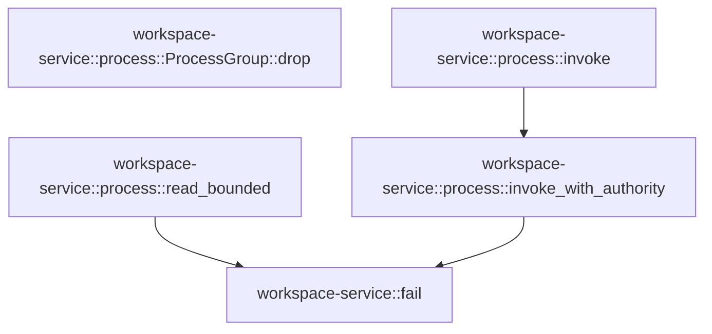

# workspace-service::process

[Package atlas](index.md) · [Source](../../src/process.rs)

## Declarations

Visibility is the declaration spelling; trait members and reexports require their enclosing interface. `cfg` is not evaluated.

| Symbol | Kind | Visibility | Test / cfg |
|---|---|---|---|
| [workspace-service::process::read_bounded](../../src/process.rs#L12) | function_item | `private` |  |
| [workspace-service::process::invoke](../../src/process.rs#L26) | function_item | `pub` |  |
| [workspace-service::process::invoke_with_authority](../../src/process.rs#L36) | function_item | `pub` |  |
| [workspace-service::process::ProcessGroup](../../src/process.rs#L140) | struct_item | `private` | #[cfg(unix)] |
| [workspace-service::process::ProcessGroup::drop](../../src/process.rs#L144) | function_item | `private` | #[cfg(unix)] |

## Imports / reexports

| Local name | Source path | Visibility |
|---|---|---|
| `Path` | `std::path::Path` | `private` |
| `Stdio` | `std::process::Stdio` | `private` |
| `Duration` | `std::time::Duration` | `private` |
| `Value` | `serde_json::Value` | `private` |
| `AsyncRead` | `tokio::io::AsyncRead` | `private` |
| `AsyncReadExt` | `tokio::io::AsyncReadExt` | `private` |
| `AsyncWriteExt` | `tokio::io::AsyncWriteExt` | `private` |
| `Command` | `tokio::process::Command` | `private` |
| `Failure` | `crate::Failure` | `private` |
| `fail` | `crate::fail` | `private` |

## Module declarations

| Module | Visibility | Attributes |
|---|---|---|

## Function call graphs

Edges below are syntactically resolved calls only, including private functions. Graphs partition callers into groups of 20; they are not execution order. All unresolved sites are listed below and in the JSON inventory.

Functions 1–4: 3 direct edges

## Call sites

Includes test functions (marked in declarations). Receiver-type-required sites need type analysis/manual tracing. Calls in closures are attributed to their enclosing function; their occurrence here does not mean the closure executes immediately.

| Caller | Callee expression | Source lines | Target / classification |
|---|---|---|---|
| `read_bounded` | `Vec::new` | [13](../../src/process.rs#L13) | external-constructor-callback-or-unresolved |
| `read_bounded` | `reader.take(maximum + 1).read_to_end` | [14](../../src/process.rs#L14) | receiver-type-required |
| `read_bounded` | `reader.take` | [14](../../src/process.rs#L14) | receiver-type-required |
| `read_bounded` | `bytes.len` | [15](../../src/process.rs#L15) | receiver-type-required |
| `read_bounded` | `Err` | [16](../../src/process.rs#L16) | external-constructor-callback-or-unresolved |
| `read_bounded` | `fail` | [16](../../src/process.rs#L16) | [workspace-service::fail](../../src/lib.rs#L23) |
| `read_bounded` | `Ok` | [21](../../src/process.rs#L21) | external-constructor-callback-or-unresolved |
| `invoke` | `invoke_with_authority` | [33](../../src/process.rs#L33) | [workspace-service::process::invoke_with_authority](../../src/process.rs#L36) |
| `invoke_with_authority` | `request["maxBytes"].as_u64` | [44](../../src/process.rs#L44) | receiver-type-required |
| `invoke_with_authority` | `Some` | [44](../../src/process.rs#L44) | external-constructor-callback-or-unresolved |
| `invoke_with_authority` | `serde_json::to_vec(&serde_json::json!({"method":method,"request":request}))         .map_err` | [45](../../src/process.rs#L45) | receiver-type-required |
| `invoke_with_authority` | `serde_json::to_vec` | [45](../../src/process.rs#L45) | external-constructor-callback-or-unresolved |
| `invoke_with_authority` | `fail` | [46](../../src/process.rs#L46), [53](../../src/process.rs#L53), [109](../../src/process.rs#L109), [114](../../src/process.rs#L114), [123](../../src/process.rs#L123), [131](../../src/process.rs#L131) | [workspace-service::fail](../../src/lib.rs#L23) |
| `invoke_with_authority` | `error.to_string` | [46](../../src/process.rs#L46) | receiver-type-required |
| `invoke_with_authority` | `input.len` | [52](../../src/process.rs#L52) | receiver-type-required |
| `invoke_with_authority` | `Err` | [53](../../src/process.rs#L53), [107](../../src/process.rs#L107), [114](../../src/process.rs#L114), [131](../../src/process.rs#L131) | external-constructor-callback-or-unresolved |
| `invoke_with_authority` | `Command::new` | [55](../../src/process.rs#L55) | external-constructor-callback-or-unresolved |
| `invoke_with_authority` | `command.arg("--root").arg` | [56](../../src/process.rs#L56) | receiver-type-required |
| `invoke_with_authority` | `command.arg` | [56](../../src/process.rs#L56), [58](../../src/process.rs#L58) | receiver-type-required |
| `invoke_with_authority` | `command.arg("--authority-file").arg` | [58](../../src/process.rs#L58) | receiver-type-required |
| `invoke_with_authority` | `command.process_group` | [61](../../src/process.rs#L61) | receiver-type-required |
| `invoke_with_authority` | `command         .stdin(Stdio::piped())         .stdout(Stdio::piped())         .stderr(Stdio::piped())         .kill_on_drop(true)         .spawn` | [62](../../src/process.rs#L62) | receiver-type-required |
| `invoke_with_authority` | `command         .stdin(Stdio::piped())         .stdout(Stdio::piped())         .stderr(Stdio::piped())         .kill_on_drop` | [62](../../src/process.rs#L62) | receiver-type-required |
| `invoke_with_authority` | `command         .stdin(Stdio::piped())         .stdout(Stdio::piped())         .stderr` | [62](../../src/process.rs#L62) | receiver-type-required |
| `invoke_with_authority` | `command         .stdin(Stdio::piped())         .stdout` | [62](../../src/process.rs#L62) | receiver-type-required |
| `invoke_with_authority` | `command         .stdin` | [62](../../src/process.rs#L62) | receiver-type-required |
| `invoke_with_authority` | `Stdio::piped` | [63](../../src/process.rs#L63), [64](../../src/process.rs#L64), [65](../../src/process.rs#L65) | external-constructor-callback-or-unresolved |
| `invoke_with_authority` | `ProcessGroup` | [71](../../src/process.rs#L71) | external-constructor-callback-or-unresolved |
| `invoke_with_authority` | `child             .id()             .and_then` | [72](../../src/process.rs#L72) | receiver-type-required |
| `invoke_with_authority` | `child             .id` | [72](../../src/process.rs#L72) | receiver-type-required |
| `invoke_with_authority` | `rustix::process::Pid::from_raw` | [74](../../src/process.rs#L74) | external-constructor-callback-or-unresolved |
| `invoke_with_authority` | `child.stdin.take().expect` | [76](../../src/process.rs#L76) | receiver-type-required |
| `invoke_with_authority` | `child.stdin.take` | [76](../../src/process.rs#L76) | receiver-type-required |
| `invoke_with_authority` | `child.stdout.take().expect` | [77](../../src/process.rs#L77) | receiver-type-required |
| `invoke_with_authority` | `child.stdout.take` | [77](../../src/process.rs#L77) | receiver-type-required |
| `invoke_with_authority` | `child.stderr.take().expect` | [78](../../src/process.rs#L78) | receiver-type-required |
| `invoke_with_authority` | `child.stderr.take` | [78](../../src/process.rs#L78) | receiver-type-required |
| `invoke_with_authority` | `tokio::time::timeout` | [79](../../src/process.rs#L79) | external-constructor-callback-or-unresolved |
| `invoke_with_authority` | `child.kill` | [105](../../src/process.rs#L105) | receiver-type-required |
| `invoke_with_authority` | `child.wait` | [106](../../src/process.rs#L106) | receiver-type-required |
| `invoke_with_authority` | `exit.success` | [113](../../src/process.rs#L113) | receiver-type-required |
| `invoke_with_authority` | `serde_json::from_slice(&output).map_err` | [122](../../src/process.rs#L122) | receiver-type-required |
| `invoke_with_authority` | `serde_json::from_slice` | [122](../../src/process.rs#L122) | external-constructor-callback-or-unresolved |
| `invoke_with_authority` | `envelope.is_object` | [128](../../src/process.rs#L128) | receiver-type-required |
| `invoke_with_authority` | `envelope.get("result").is_some` | [129](../../src/process.rs#L129) | receiver-type-required |
| `invoke_with_authority` | `envelope.get` | [129](../../src/process.rs#L129) | receiver-type-required |
| `invoke_with_authority` | `envelope.get("error").is_some` | [129](../../src/process.rs#L129) | receiver-type-required |
| `invoke_with_authority` | `Ok` | [136](../../src/process.rs#L136) | external-constructor-callback-or-unresolved |
| `drop` | `rustix::process::kill_process_group` | [146](../../src/process.rs#L146) | external-constructor-callback-or-unresolved |
