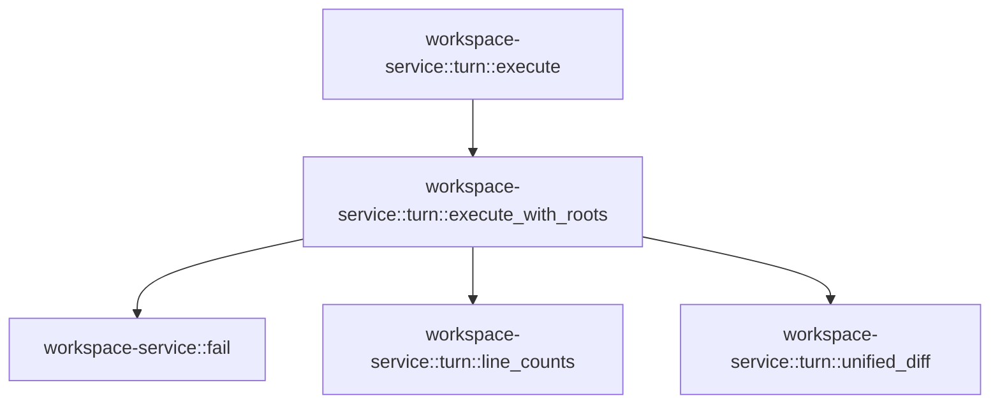

# workspace-service::turn

[Package atlas](index.md) · [Source](../../src/turn.rs)

## Declarations

Visibility is the declaration spelling; trait members and reexports require their enclosing interface. `cfg` is not evaluated.

| Symbol | Kind | Visibility | Test / cfg |
|---|---|---|---|
| [workspace-service::turn::Edit](../../src/turn.rs#L14) | struct_item | `pub` |  |
| [workspace-service::turn::Request](../../src/turn.rs#L26) | struct_item | `pub` |  |
| [workspace-service::turn::unified_diff](../../src/turn.rs#L37) | function_item | `private` |  |
| [workspace-service::turn::line_counts](../../src/turn.rs#L103) | function_item | `private` |  |
| [workspace-service::turn::execute](../../src/turn.rs#L137) | function_item | `pub` |  |
| [workspace-service::turn::execute_with_roots](../../src/turn.rs#L146) | function_item | `pub` |  |

## Imports / reexports

| Local name | Source path | Visibility |
|---|---|---|
| `Failure` | `crate::Failure` | `private` |
| `fail` | `crate::fail` | `private` |
| `Deserialize` | `serde::Deserialize` | `private` |
| `Serialize` | `serde::Serialize` | `private` |
| `Value` | `serde_json::Value` | `private` |
| `json` | `serde_json::json` | `private` |
| `Digest` | `sha2::Digest` | `private` |
| `Sha256` | `sha2::Sha256` | `private` |
| `BTreeMap` | `std::collections::BTreeMap` | `private` |
| `Read` | `std::io::Read` | `private` |
| `Write` | `std::io::Write` | `private` |
| `DirBuilderExt` | `std::os::unix::fs::DirBuilderExt` | `private` |
| `OpenOptionsExt` | `std::os::unix::fs::OpenOptionsExt` | `private` |
| `Path` | `std::path::Path` | `private` |

## Module declarations

| Module | Visibility | Attributes |
|---|---|---|

## Function call graphs

Edges below are syntactically resolved calls only, including private functions. Graphs partition callers into groups of 20; they are not execution order. All unresolved sites are listed below and in the JSON inventory.

Functions 1–4: 4 direct edges

## Call sites

Includes test functions (marked in declarations). Receiver-type-required sites need type analysis/manual tracing. Calls in closures are attributed to their enclosing function; their occurrence here does not mean the closure executes immediately.

| Caller | Callee expression | Source lines | Target / classification |
|---|---|---|---|
| `unified_diff` | `before.unwrap_or("").split_inclusive('\n').collect` | [38](../../src/turn.rs#L38) | receiver-type-required |
| `unified_diff` | `before.unwrap_or("").split_inclusive` | [38](../../src/turn.rs#L38) | receiver-type-required |
| `unified_diff` | `before.unwrap_or` | [38](../../src/turn.rs#L38) | receiver-type-required |
| `unified_diff` | `after.unwrap_or("").split_inclusive('\n').collect` | [39](../../src/turn.rs#L39) | receiver-type-required |
| `unified_diff` | `after.unwrap_or("").split_inclusive` | [39](../../src/turn.rs#L39) | receiver-type-required |
| `unified_diff` | `after.unwrap_or` | [39](../../src/turn.rs#L39) | receiver-type-required |
| `unified_diff` | `right.len` | [40](../../src/turn.rs#L40), [47](../../src/turn.rs#L47), [72](../../src/turn.rs#L72), [73](../../src/turn.rs#L73), [79](../../src/turn.rs#L79) | receiver-type-required |
| `unified_diff` | `(left.len() + 1).checked_mul` | [41](../../src/turn.rs#L41) | receiver-type-required |
| `unified_diff` | `left.len` | [41](../../src/turn.rs#L41), [46](../../src/turn.rs#L46), [72](../../src/turn.rs#L72), [73](../../src/turn.rs#L73), [78](../../src/turn.rs#L78) | receiver-type-required |
| `unified_diff` | `(0..left.len()).rev` | [46](../../src/turn.rs#L46) | receiver-type-required |
| `unified_diff` | `(0..right.len()).rev` | [47](../../src/turn.rs#L47) | receiver-type-required |
| `unified_diff` | `table[(i + 1) * width + j].max` | [51](../../src/turn.rs#L51) | receiver-type-required |
| `unified_diff` | `serde_json::to_string(path).unwrap` | [57](../../src/turn.rs#L57) | receiver-type-required |
| `unified_diff` | `serde_json::to_string` | [57](../../src/turn.rs#L57) | external-constructor-callback-or-unresolved |
| `unified_diff` | `"/dev/null".into` | [59](../../src/turn.rs#L59) | receiver-type-required |
| `unified_diff` | `patch.push` | [89](../../src/turn.rs#L89) | receiver-type-required |
| `unified_diff` | `patch.push_str` | [90](../../src/turn.rs#L90), [92](../../src/turn.rs#L92) | receiver-type-required |
| `unified_diff` | `line.ends_with` | [91](../../src/turn.rs#L91) | receiver-type-required |
| `unified_diff` | `patch.len` | [94](../../src/turn.rs#L94) | receiver-type-required |
| `unified_diff` | `Some` | [98](../../src/turn.rs#L98) | external-constructor-callback-or-unresolved |
| `line_counts` | `before.split_inclusive('\n').collect::<Vec<_>>` | [104](../../src/turn.rs#L104) | receiver-type-required |
| `line_counts` | `before.split_inclusive` | [104](../../src/turn.rs#L104) | receiver-type-required |
| `line_counts` | `after.split_inclusive('\n').collect::<Vec<_>>` | [105](../../src/turn.rs#L105) | receiver-type-required |
| `line_counts` | `after.split_inclusive` | [105](../../src/turn.rs#L105) | receiver-type-required |
| `line_counts` | `left.iter().zip(&right).take_while(&#124;(a, b)&#124; a == b).count` | [106](../../src/turn.rs#L106) | receiver-type-required |
| `line_counts` | `left.iter().zip(&right).take_while` | [106](../../src/turn.rs#L106) | receiver-type-required |
| `line_counts` | `left.iter().zip` | [106](../../src/turn.rs#L106) | receiver-type-required |
| `line_counts` | `left.iter` | [106](../../src/turn.rs#L106) | receiver-type-required |
| `line_counts` | `left         .iter()         .rev()         .zip(right.iter().rev())         .take_while(&#124;(a, b)&#124; a == b)         .count` | [109](../../src/turn.rs#L109) | receiver-type-required |
| `line_counts` | `left         .iter()         .rev()         .zip(right.iter().rev())         .take_while` | [109](../../src/turn.rs#L109) | receiver-type-required |
| `line_counts` | `left         .iter()         .rev()         .zip` | [109](../../src/turn.rs#L109) | receiver-type-required |
| `line_counts` | `left         .iter()         .rev` | [109](../../src/turn.rs#L109) | receiver-type-required |
| `line_counts` | `left         .iter` | [109](../../src/turn.rs#L109) | receiver-type-required |
| `line_counts` | `right.iter().rev` | [112](../../src/turn.rs#L112) | receiver-type-required |
| `line_counts` | `right.iter` | [112](../../src/turn.rs#L112), [123](../../src/turn.rs#L123) | receiver-type-required |
| `line_counts` | `left.len` | [115](../../src/turn.rs#L115), [117](../../src/turn.rs#L117), [134](../../src/turn.rs#L134) | receiver-type-required |
| `line_counts` | `right.len` | [116](../../src/turn.rs#L116), [117](../../src/turn.rs#L117), [133](../../src/turn.rs#L133), [134](../../src/turn.rs#L134) | receiver-type-required |
| `line_counts` | `left.len().saturating_mul` | [117](../../src/turn.rs#L117) | receiver-type-required |
| `line_counts` | `right.iter().enumerate` | [123](../../src/turn.rs#L123) | receiver-type-required |
| `line_counts` | `row[j + 1].max` | [128](../../src/turn.rs#L128) | receiver-type-required |
| `line_counts` | `Some` | [134](../../src/turn.rs#L134) | external-constructor-callback-or-unresolved |
| `execute` | `execute_with_roots` | [143](../../src/turn.rs#L143) | [workspace-service::turn::execute_with_roots](../../src/turn.rs#L146) |
| `execute_with_roots` | `[&request.workspace_id, &request.session_id, &request.turn_id]         .iter()         .any` | [153](../../src/turn.rs#L153) | receiver-type-required |
| `execute_with_roots` | `[&request.workspace_id, &request.session_id, &request.turn_id]         .iter` | [153](../../src/turn.rs#L153) | receiver-type-required |
| `execute_with_roots` | `s.is_empty` | [155](../../src/turn.rs#L155) | receiver-type-required |
| `execute_with_roots` | `s.len` | [155](../../src/turn.rs#L155) | receiver-type-required |
| `execute_with_roots` | `s.contains` | [155](../../src/turn.rs#L155) | receiver-type-required |
| `execute_with_roots` | `Err` | [157](../../src/turn.rs#L157), [170](../../src/turn.rs#L170), [175](../../src/turn.rs#L175), [184](../../src/turn.rs#L184), [199](../../src/turn.rs#L199), [232](../../src/turn.rs#L232), [235](../../src/turn.rs#L235), [238](../../src/turn.rs#L238), [248](../../src/turn.rs#L248), [260](../../src/turn.rs#L260), [266](../../src/turn.rs#L266), [279](../../src/turn.rs#L279), [290](../../src/turn.rs#L290), [297](../../src/turn.rs#L297), [305](../../src/turn.rs#L305), [315](../../src/turn.rs#L315), [359](../../src/turn.rs#L359), [366](../../src/turn.rs#L366), [373](../../src/turn.rs#L373), [392](../../src/turn.rs#L392) | external-constructor-callback-or-unresolved |
| `execute_with_roots` | `fail` | [157](../../src/turn.rs#L157), [170](../../src/turn.rs#L170), [175](../../src/turn.rs#L175), [184](../../src/turn.rs#L184), [199](../../src/turn.rs#L199), [212](../../src/turn.rs#L212), [235](../../src/turn.rs#L235), [238](../../src/turn.rs#L238), [243](../../src/turn.rs#L243), [248](../../src/turn.rs#L248), [260](../../src/turn.rs#L260), [264](../../src/turn.rs#L264), [266](../../src/turn.rs#L266), [272](../../src/turn.rs#L272), [279](../../src/turn.rs#L279), [290](../../src/turn.rs#L290), [295](../../src/turn.rs#L295), [297](../../src/turn.rs#L297), [305](../../src/turn.rs#L305), [312](../../src/turn.rs#L312), [315](../../src/turn.rs#L315), [359](../../src/turn.rs#L359), [366](../../src/turn.rs#L366), [369](../../src/turn.rs#L369), [373](../../src/turn.rs#L373), [381](../../src/turn.rs#L381), [392](../../src/turn.rs#L392) | [workspace-service::fail](../../src/lib.rs#L23) |
| `execute_with_roots` | `[         "turnChanges",         "recordTurnEdit",         "prepareTurnEdit",         "abortTurnEdit",     ]     .contains` | [162](../../src/turn.rs#L162) | receiver-type-required |
| `execute_with_roots` | `request.edit.is_some` | [172](../../src/turn.rs#L172) | receiver-type-required |
| `execute_with_roots` | `edit.event_id.is_empty` | [178](../../src/turn.rs#L178) | receiver-type-required |
| `execute_with_roots` | `edit.event_id.len` | [179](../../src/turn.rs#L179) | receiver-type-required |
| `execute_with_roots` | `edit.path.is_empty` | [180](../../src/turn.rs#L180) | receiver-type-required |
| `execute_with_roots` | `edit.path.contains` | [181](../../src/turn.rs#L181) | receiver-type-required |
| `execute_with_roots` | `Path::new(&edit.path).is_absolute` | [182](../../src/turn.rs#L182) | receiver-type-required |
| `execute_with_roots` | `Path::new` | [182](../../src/turn.rs#L182), [194](../../src/turn.rs#L194), [195](../../src/turn.rs#L195) | external-constructor-callback-or-unresolved |
| `execute_with_roots` | `roots.push` | [190](../../src/turn.rs#L190) | receiver-type-required |
| `execute_with_roots` | `root.canonicalize` | [190](../../src/turn.rs#L190) | receiver-type-required |
| `execute_with_roots` | `roots             .iter()             .any` | [192](../../src/turn.rs#L192) | receiver-type-required |
| `execute_with_roots` | `roots             .iter` | [192](../../src/turn.rs#L192) | receiver-type-required |
| `execute_with_roots` | `Path::new(&edit.path).starts_with` | [194](../../src/turn.rs#L194) | receiver-type-required |
| `execute_with_roots` | `Path::new(&edit.path)                 .components()                 .any` | [195](../../src/turn.rs#L195) | receiver-type-required |
| `execute_with_roots` | `Path::new(&edit.path)                 .components` | [195](../../src/turn.rs#L195) | receiver-type-required |
| `execute_with_roots` | `state.join` | [205](../../src/turn.rs#L205) | receiver-type-required |
| `execute_with_roots` | `std::fs::DirBuilder::new` | [206](../../src/turn.rs#L206) | external-constructor-callback-or-unresolved |
| `execute_with_roots` | `builder.recursive` | [207](../../src/turn.rs#L207) | receiver-type-required |
| `execute_with_roots` | `builder.mode` | [209](../../src/turn.rs#L209) | receiver-type-required |
| `execute_with_roots` | `builder.create` | [210](../../src/turn.rs#L210), [254](../../src/turn.rs#L254) | receiver-type-required |
| `execute_with_roots` | `serde_json::to_vec(&(&request.workspace_id, &request.session_id))         .map_err` | [211](../../src/turn.rs#L211) | receiver-type-required |
| `execute_with_roots` | `serde_json::to_vec` | [211](../../src/turn.rs#L211), [271](../../src/turn.rs#L271), [312](../../src/turn.rs#L312) | external-constructor-callback-or-unresolved |
| `execute_with_roots` | `e.to_string` | [212](../../src/turn.rs#L212), [272](../../src/turn.rs#L272), [312](../../src/turn.rs#L312) | receiver-type-required |
| `execute_with_roots` | `std::fs::OpenOptions::new` | [214](../../src/turn.rs#L214), [317](../../src/turn.rs#L317) | external-constructor-callback-or-unresolved |
| `execute_with_roots` | `lock_options.mode` | [216](../../src/turn.rs#L216) | receiver-type-required |
| `execute_with_roots` | `lock_options         .create(true)         .truncate(false)         .read(true)         .write(true)         .open` | [217](../../src/turn.rs#L217) | receiver-type-required |
| `execute_with_roots` | `lock_options         .create(true)         .truncate(false)         .read(true)         .write` | [217](../../src/turn.rs#L217) | receiver-type-required |
| `execute_with_roots` | `lock_options         .create(true)         .truncate(false)         .read` | [217](../../src/turn.rs#L217) | receiver-type-required |
| `execute_with_roots` | `lock_options         .create(true)         .truncate` | [217](../../src/turn.rs#L217) | receiver-type-required |
| `execute_with_roots` | `lock_options         .create` | [217](../../src/turn.rs#L217) | receiver-type-required |
| `execute_with_roots` | `directory.join` | [222](../../src/turn.rs#L222), [225](../../src/turn.rs#L225), [252](../../src/turn.rs#L252) | receiver-type-required |
| `execute_with_roots` | `rustix::fs::flock(&lock, rustix::fs::FlockOperation::LockExclusive)         .map_err` | [223](../../src/turn.rs#L223) | receiver-type-required |
| `execute_with_roots` | `rustix::fs::flock` | [223](../../src/turn.rs#L223) | external-constructor-callback-or-unresolved |
| `execute_with_roots` | `Vec::new` | [226](../../src/turn.rs#L226), [361](../../src/turn.rs#L361), [402](../../src/turn.rs#L402) | external-constructor-callback-or-unresolved |
| `execute_with_roots` | `std::fs::File::open` | [227](../../src/turn.rs#L227), [284](../../src/turn.rs#L284), [285](../../src/turn.rs#L285), [323](../../src/turn.rs#L323), [362](../../src/turn.rs#L362) | external-constructor-callback-or-unresolved |
| `execute_with_roots` | `file.take(64 * 1024 * 1024 + 1).read_to_end` | [229](../../src/turn.rs#L229) | receiver-type-required |
| `execute_with_roots` | `file.take` | [229](../../src/turn.rs#L229) | receiver-type-required |
| `execute_with_roots` | `e.kind` | [231](../../src/turn.rs#L231) | receiver-type-required |
| `execute_with_roots` | `e.into` | [232](../../src/turn.rs#L232) | receiver-type-required |
| `execute_with_roots` | `bytes.len` | [234](../../src/turn.rs#L234), [314](../../src/turn.rs#L314), [365](../../src/turn.rs#L365) | receiver-type-required |
| `execute_with_roots` | `bytes.is_empty` | [237](../../src/turn.rs#L237) | receiver-type-required |
| `execute_with_roots` | `bytes.ends_with` | [237](../../src/turn.rs#L237) | receiver-type-required |
| `execute_with_roots` | `Vec::<Request>::new` | [240](../../src/turn.rs#L240) | external-constructor-callback-or-unresolved |
| `execute_with_roots` | `bytes.split(&#124;b&#124; *b == b'\n').filter` | [241](../../src/turn.rs#L241) | receiver-type-required |
| `execute_with_roots` | `bytes.split` | [241](../../src/turn.rs#L241) | receiver-type-required |
| `execute_with_roots` | `line.is_empty` | [241](../../src/turn.rs#L241) | receiver-type-required |
| `execute_with_roots` | `serde_json::from_slice(line)             .map_err` | [242](../../src/turn.rs#L242) | receiver-type-required |
| `execute_with_roots` | `serde_json::from_slice` | [242](../../src/turn.rs#L242), [263](../../src/turn.rs#L263), [294](../../src/turn.rs#L294), [368](../../src/turn.rs#L368) | external-constructor-callback-or-unresolved |
| `execute_with_roots` | `record.edit.is_none` | [246](../../src/turn.rs#L246) | receiver-type-required |
| `execute_with_roots` | `records.push` | [250](../../src/turn.rs#L250), [324](../../src/turn.rs#L324) | receiver-type-required |
| `execute_with_roots` | `request.edit.as_ref().unwrap` | [255](../../src/turn.rs#L255) | receiver-type-required |
| `execute_with_roots` | `request.edit.as_ref` | [255](../../src/turn.rs#L255), [287](../../src/turn.rs#L287) | receiver-type-required |
| `execute_with_roots` | `intents.join` | [257](../../src/turn.rs#L257), [258](../../src/turn.rs#L258), [289](../../src/turn.rs#L289), [292](../../src/turn.rs#L292) | receiver-type-required |
| `execute_with_roots` | `aborted.exists` | [259](../../src/turn.rs#L259) | receiver-type-required |
| `execute_with_roots` | `intent.exists` | [262](../../src/turn.rs#L262) | receiver-type-required |
| `execute_with_roots` | `serde_json::from_slice(&std::fs::read(&intent)?)                 .map_err` | [263](../../src/turn.rs#L263) | receiver-type-required |
| `execute_with_roots` | `std::fs::read` | [263](../../src/turn.rs#L263), [294](../../src/turn.rs#L294) | external-constructor-callback-or-unresolved |
| `execute_with_roots` | `tempfile::NamedTempFile::new_in` | [269](../../src/turn.rs#L269) | external-constructor-callback-or-unresolved |
| `execute_with_roots` | `pending.write_all` | [270](../../src/turn.rs#L270) | receiver-type-required |
| `execute_with_roots` | `serde_json::to_vec(&request)                     .map_err` | [271](../../src/turn.rs#L271) | receiver-type-required |
| `execute_with_roots` | `pending.as_file().sync_all` | [274](../../src/turn.rs#L274) | receiver-type-required |
| `execute_with_roots` | `pending.as_file` | [274](../../src/turn.rs#L274) | receiver-type-required |
| `execute_with_roots` | `pending                 .persist(&intent)                 .map_err` | [275](../../src/turn.rs#L275) | receiver-type-required |
| `execute_with_roots` | `pending                 .persist` | [275](../../src/turn.rs#L275) | receiver-type-required |
| `execute_with_roots` | `Failure::from` | [277](../../src/turn.rs#L277) | external-constructor-callback-or-unresolved |
| `execute_with_roots` | `std::fs::rename` | [282](../../src/turn.rs#L282) | external-constructor-callback-or-unresolved |
| `execute_with_roots` | `std::fs::File::open(&intents)?.sync_all` | [284](../../src/turn.rs#L284) | receiver-type-required |
| `execute_with_roots` | `std::fs::File::open(&directory)?.sync_all` | [285](../../src/turn.rs#L285), [323](../../src/turn.rs#L323) | receiver-type-required |
| `execute_with_roots` | `request.edit.as_ref().filter` | [287](../../src/turn.rs#L287) | receiver-type-required |
| `execute_with_roots` | `intents.join(format!("{id}.aborted")).exists` | [289](../../src/turn.rs#L289) | receiver-type-required |
| `execute_with_roots` | `pending.exists` | [293](../../src/turn.rs#L293) | receiver-type-required |
| `execute_with_roots` | `serde_json::from_slice(&std::fs::read(pending)?)                 .map_err` | [294](../../src/turn.rs#L294) | receiver-type-required |
| `execute_with_roots` | `records             .iter()             .find` | [300](../../src/turn.rs#L300) | receiver-type-required |
| `execute_with_roots` | `records             .iter` | [300](../../src/turn.rs#L300) | receiver-type-required |
| `execute_with_roots` | `r.edit.as_ref().unwrap` | [302](../../src/turn.rs#L302), [389](../../src/turn.rs#L389) | receiver-type-required |
| `execute_with_roots` | `r.edit.as_ref` | [302](../../src/turn.rs#L302), [389](../../src/turn.rs#L389) | receiver-type-required |
| `execute_with_roots` | `serde_json::to_vec(&request).map_err` | [312](../../src/turn.rs#L312) | receiver-type-required |
| `execute_with_roots` | `record.push` | [313](../../src/turn.rs#L313) | receiver-type-required |
| `execute_with_roots` | `record.len` | [314](../../src/turn.rs#L314) | receiver-type-required |
| `execute_with_roots` | `options.mode` | [319](../../src/turn.rs#L319) | receiver-type-required |
| `execute_with_roots` | `options.create(true).append(true).open` | [320](../../src/turn.rs#L320) | receiver-type-required |
| `execute_with_roots` | `options.create(true).append` | [320](../../src/turn.rs#L320) | receiver-type-required |
| `execute_with_roots` | `options.create` | [320](../../src/turn.rs#L320) | receiver-type-required |
| `execute_with_roots` | `file.write_all` | [321](../../src/turn.rs#L321) | receiver-type-required |
| `execute_with_roots` | `file.sync_all` | [322](../../src/turn.rs#L322) | receiver-type-required |
| `execute_with_roots` | `request.clone` | [324](../../src/turn.rs#L324) | receiver-type-required |
| `execute_with_roots` | `BTreeMap::<String, (Option<String>, Option<String>, bool)>::new` | [327](../../src/turn.rs#L327) | external-constructor-callback-or-unresolved |
| `execute_with_roots` | `records.iter().filter` | [329](../../src/turn.rs#L329) | receiver-type-required |
| `execute_with_roots` | `records.iter` | [329](../../src/turn.rs#L329) | receiver-type-required |
| `execute_with_roots` | `record.edit.as_ref().unwrap` | [331](../../src/turn.rs#L331) | receiver-type-required |
| `execute_with_roots` | `record.edit.as_ref` | [331](../../src/turn.rs#L331) | receiver-type-required |
| `execute_with_roots` | `files.get_mut` | [332](../../src/turn.rs#L332) | receiver-type-required |
| `execute_with_roots` | `edit.omitted_content_hashes.is_none` | [333](../../src/turn.rs#L333), [341](../../src/turn.rs#L341) | receiver-type-required |
| `execute_with_roots` | `edit.after.clone` | [334](../../src/turn.rs#L334), [340](../../src/turn.rs#L340), [399](../../src/turn.rs#L399) | receiver-type-required |
| `execute_with_roots` | `files.insert` | [336](../../src/turn.rs#L336) | receiver-type-required |
| `execute_with_roots` | `edit.path.clone` | [337](../../src/turn.rs#L337), [397](../../src/turn.rs#L397) | receiver-type-required |
| `execute_with_roots` | `edit.before.clone` | [339](../../src/turn.rs#L339), [399](../../src/turn.rs#L399) | receiver-type-required |
| `execute_with_roots` | `intents.exists` | [346](../../src/turn.rs#L346) | receiver-type-required |
| `execute_with_roots` | `std::fs::read_dir` | [348](../../src/turn.rs#L348) | external-constructor-callback-or-unresolved |
| `execute_with_roots` | `entry                 .path()                 .extension()                 .is_some_and` | [350](../../src/turn.rs#L350) | receiver-type-required |
| `execute_with_roots` | `entry                 .path()                 .extension` | [350](../../src/turn.rs#L350) | receiver-type-required |
| `execute_with_roots` | `entry                 .path` | [350](../../src/turn.rs#L350) | receiver-type-required |
| `execute_with_roots` | `std::fs::File::open(entry.path())?                 .take(1024 * 1024 + 1)                 .read_to_end` | [362](../../src/turn.rs#L362) | receiver-type-required |
| `execute_with_roots` | `std::fs::File::open(entry.path())?                 .take` | [362](../../src/turn.rs#L362) | receiver-type-required |
| `execute_with_roots` | `entry.path` | [362](../../src/turn.rs#L362), [382](../../src/turn.rs#L382) | receiver-type-required |
| `execute_with_roots` | `serde_json::from_slice(&bytes)                 .map_err` | [368](../../src/turn.rs#L368) | receiver-type-required |
| `execute_with_roots` | `pending                 .edit                 .as_ref()                 .ok_or_else` | [378](../../src/turn.rs#L378) | receiver-type-required |
| `execute_with_roots` | `pending                 .edit                 .as_ref` | [378](../../src/turn.rs#L378) | receiver-type-required |
| `execute_with_roots` | `entry.path().extension().is_some_and` | [382](../../src/turn.rs#L382) | receiver-type-required |
| `execute_with_roots` | `entry.path().extension` | [382](../../src/turn.rs#L382) | receiver-type-required |
| `execute_with_roots` | `records                 .iter()                 .find` | [387](../../src/turn.rs#L387) | receiver-type-required |
| `execute_with_roots` | `records                 .iter` | [387](../../src/turn.rs#L387) | receiver-type-required |
| `execute_with_roots` | `files                 .entry(edit.path.clone())                 .and_modify(&#124;file&#124; file.2 = false)                 .or_insert` | [396](../../src/turn.rs#L396) | receiver-type-required |
| `execute_with_roots` | `files                 .entry(edit.path.clone())                 .and_modify` | [396](../../src/turn.rs#L396) | receiver-type-required |
| `execute_with_roots` | `files                 .entry` | [396](../../src/turn.rs#L396) | receiver-type-required |
| `execute_with_roots` | `continuous             .then(&#124;&#124; {                 line_counts(                     before.as_deref().unwrap_or(""),                     after.as_deref().unwrap_or(""),                 )             })             .flatten` | [410](../../src/turn.rs#L410) | receiver-type-required |
| `execute_with_roots` | `continuous             .then` | [410](../../src/turn.rs#L410) | receiver-type-required |
| `execute_with_roots` | `line_counts` | [412](../../src/turn.rs#L412) | [workspace-service::turn::line_counts](../../src/turn.rs#L103) |
| `execute_with_roots` | `before.as_deref().unwrap_or` | [413](../../src/turn.rs#L413) | receiver-type-required |
| `execute_with_roots` | `before.as_deref` | [413](../../src/turn.rs#L413), [424](../../src/turn.rs#L424) | receiver-type-required |
| `execute_with_roots` | `after.as_deref().unwrap_or` | [414](../../src/turn.rs#L414) | receiver-type-required |
| `execute_with_roots` | `after.as_deref` | [414](../../src/turn.rs#L414), [424](../../src/turn.rs#L424) | receiver-type-required |
| `execute_with_roots` | `unified_diff` | [424](../../src/turn.rs#L424) | [workspace-service::turn::unified_diff](../../src/turn.rs#L37) |
| `execute_with_roots` | `summaries.push` | [428](../../src/turn.rs#L428), [431](../../src/turn.rs#L431) | receiver-type-required |
| `execute_with_roots` | `Ok` | [434](../../src/turn.rs#L434) | external-constructor-callback-or-unresolved |
