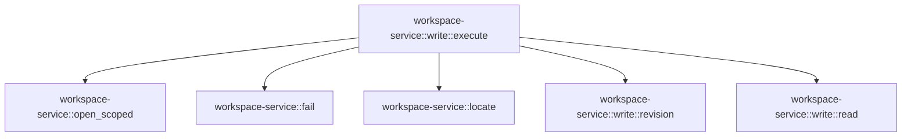

# workspace-service::write

[Package atlas](index.md) · [Source](../../src/write.rs)

## Declarations

Visibility is the declaration spelling; trait members and reexports require their enclosing interface. `cfg` is not evaluated.

| Symbol | Kind | Visibility | Test / cfg |
|---|---|---|---|
| [workspace-service::write::MAX_BYTES](../../src/write.rs#L13) | const_item | `private` |  |
| [workspace-service::write::Request](../../src/write.rs#L16) | struct_item | `pub` |  |
| [workspace-service::write::revision](../../src/write.rs#L22) | function_item | `private` |  |
| [workspace-service::write::read](../../src/write.rs#L25) | function_item | `private` |  |
| [workspace-service::write::execute](../../src/write.rs#L31) | function_item | `pub` |  |

## Imports / reexports

| Local name | Source path | Visibility |
|---|---|---|
| `Failure` | `crate::Failure` | `private` |
| `fail` | `crate::fail` | `private` |
| `MutationAuthority` | `crate::git::MutationAuthority` | `private` |
| `locate` | `crate::locate` | `private` |
| `open_scoped` | `crate::open_scoped` | `private` |
| `_` | `base64::Engine` | `private` |
| `AtFlags` | `rustix::fs::AtFlags` | `private` |
| `FlockOperation` | `rustix::fs::FlockOperation` | `private` |
| `Mode` | `rustix::fs::Mode` | `private` |
| `OFlags` | `rustix::fs::OFlags` | `private` |
| `flock` | `rustix::fs::flock` | `private` |
| `openat` | `rustix::fs::openat` | `private` |
| `renameat` | `rustix::fs::renameat` | `private` |
| `unlinkat` | `rustix::fs::unlinkat` | `private` |
| `Deserialize` | `serde::Deserialize` | `private` |
| `Value` | `serde_json::Value` | `private` |
| `json` | `serde_json::json` | `private` |
| `Digest` | `sha2::Digest` | `private` |
| `Sha256` | `sha2::Sha256` | `private` |
| `fs` | `std::fs` | `private` |
| `File` | `std::fs::File` | `private` |
| `Read` | `std::io::Read` | `private` |
| `Write` | `std::io::Write` | `private` |
| `MetadataExt` | `std::os::unix::fs::MetadataExt` | `private` |
| `OpenOptionsExt` | `std::os::unix::fs::OpenOptionsExt` | `private` |
| `Path` | `std::path::Path` | `private` |

## Module declarations

| Module | Visibility | Attributes |
|---|---|---|

## Function call graphs

Edges below are syntactically resolved calls only, including private functions. Graphs partition callers into groups of 20; they are not execution order. All unresolved sites are listed below and in the JSON inventory.

Functions 1–3: 5 direct edges

## Call sites

Includes test functions (marked in declarations). Receiver-type-required sites need type analysis/manual tracing. Calls in closures are attributed to their enclosing function; their occurrence here does not mean the closure executes immediately.

| Caller | Callee expression | Source lines | Target / classification |
|---|---|---|---|
| `read` | `Vec::new` | [26](../../src/write.rs#L26) | external-constructor-callback-or-unresolved |
| `read` | `file.take(MAX_BYTES as u64 + 1).read_to_end` | [27](../../src/write.rs#L27) | receiver-type-required |
| `read` | `file.take` | [27](../../src/write.rs#L27) | receiver-type-required |
| `read` | `Ok` | [28](../../src/write.rs#L28) | external-constructor-callback-or-unresolved |
| `execute` | `authority         .filter(&#124;a&#124; a.allow_file_writes)         .ok_or_else` | [36](../../src/write.rs#L36) | receiver-type-required |
| `execute` | `authority         .filter` | [36](../../src/write.rs#L36) | receiver-type-required |
| `execute` | `fail` | [38](../../src/write.rs#L38), [48](../../src/write.rs#L48), [55](../../src/write.rs#L55), [59](../../src/write.rs#L59), [75](../../src/write.rs#L75), [79](../../src/write.rs#L79), [94](../../src/write.rs#L94), [97](../../src/write.rs#L97), [133](../../src/write.rs#L133), [137](../../src/write.rs#L137) | [workspace-service::fail](../../src/lib.rs#L23) |
| `execute` | `request.workspace_id.is_empty` | [39](../../src/write.rs#L39) | receiver-type-required |
| `execute` | `request.path.is_empty` | [40](../../src/write.rs#L40) | receiver-type-required |
| `execute` | `request.content.len` | [41](../../src/write.rs#L41) | receiver-type-required |
| `execute` | `MAX_BYTES.div_ceil` | [41](../../src/write.rs#L41) | receiver-type-required |
| `execute` | `request.expected_revision.len` | [42](../../src/write.rs#L42) | receiver-type-required |
| `execute` | `request             .expected_revision             .bytes()             .all` | [43](../../src/write.rs#L43) | receiver-type-required |
| `execute` | `request             .expected_revision             .bytes` | [43](../../src/write.rs#L43) | receiver-type-required |
| `execute` | `b.is_ascii_digit` | [46](../../src/write.rs#L46) | receiver-type-required |
| `execute` | `(b'a'..=b'f').contains` | [46](../../src/write.rs#L46) | receiver-type-required |
| `execute` | `Err` | [48](../../src/write.rs#L48), [59](../../src/write.rs#L59), [94](../../src/write.rs#L94), [97](../../src/write.rs#L97), [133](../../src/write.rs#L133) | external-constructor-callback-or-unresolved |
| `execute` | `base64::engine::general_purpose::STANDARD         .decode(&request.content)         .map_err` | [53](../../src/write.rs#L53) | receiver-type-required |
| `execute` | `base64::engine::general_purpose::STANDARD         .decode` | [53](../../src/write.rs#L53) | receiver-type-required |
| `execute` | `bytes.len` | [56](../../src/write.rs#L56) | receiver-type-required |
| `execute` | `base64::engine::general_purpose::STANDARD.encode` | [57](../../src/write.rs#L57) | receiver-type-required |
| `execute` | `locate` | [61](../../src/write.rs#L61), [131](../../src/write.rs#L131) | [workspace-service::locate](../../src/lib.rs#L54) |
| `execute` | `authority.state_root.join` | [62](../../src/write.rs#L62) | receiver-type-required |
| `execute` | `fs::create_dir_all` | [63](../../src/write.rs#L63) | external-constructor-callback-or-unresolved |
| `execute` | `fs::OpenOptions::new()         .read(true)         .write(true)         .create(true)         .truncate(false)         .mode(0o600)         .custom_flags(rustix::fs::OFlags::NOFOLLOW.bits() as i32)         .open` | [64](../../src/write.rs#L64) | receiver-type-required |
| `execute` | `fs::OpenOptions::new()         .read(true)         .write(true)         .create(true)         .truncate(false)         .mode(0o600)         .custom_flags` | [64](../../src/write.rs#L64) | receiver-type-required |
| `execute` | `fs::OpenOptions::new()         .read(true)         .write(true)         .create(true)         .truncate(false)         .mode` | [64](../../src/write.rs#L64) | receiver-type-required |
| `execute` | `fs::OpenOptions::new()         .read(true)         .write(true)         .create(true)         .truncate` | [64](../../src/write.rs#L64) | receiver-type-required |
| `execute` | `fs::OpenOptions::new()         .read(true)         .write(true)         .create` | [64](../../src/write.rs#L64) | receiver-type-required |
| `execute` | `fs::OpenOptions::new()         .read(true)         .write` | [64](../../src/write.rs#L64) | receiver-type-required |
| `execute` | `fs::OpenOptions::new()         .read` | [64](../../src/write.rs#L64) | receiver-type-required |
| `execute` | `fs::OpenOptions::new` | [64](../../src/write.rs#L64) | external-constructor-callback-or-unresolved |
| `execute` | `rustix::fs::OFlags::NOFOLLOW.bits` | [70](../../src/write.rs#L70) | receiver-type-required |
| `execute` | `lock_directory.join` | [71](../../src/write.rs#L71) | receiver-type-required |
| `execute` | `revision` | [71](../../src/write.rs#L71), [96](../../src/write.rs#L96), [130](../../src/write.rs#L130) | [workspace-service::write::revision](../../src/write.rs#L22) |
| `execute` | `target.as_os_str().as_encoded_bytes` | [71](../../src/write.rs#L71) | receiver-type-required |
| `execute` | `target.as_os_str` | [71](../../src/write.rs#L71) | receiver-type-required |
| `execute` | `flock(&lock, FlockOperation::LockExclusive).map_err` | [72](../../src/write.rs#L72) | receiver-type-required |
| `execute` | `flock` | [72](../../src/write.rs#L72) | external-constructor-callback-or-unresolved |
| `execute` | `target         .parent()         .ok_or_else` | [73](../../src/write.rs#L73) | receiver-type-required |
| `execute` | `target         .parent` | [73](../../src/write.rs#L73) | receiver-type-required |
| `execute` | `open_scoped` | [76](../../src/write.rs#L76) | [workspace-service::open_scoped](../../src/lib.rs#L235) |
| `execute` | `target         .file_name()         .ok_or_else` | [77](../../src/write.rs#L77) | receiver-type-required |
| `execute` | `target         .file_name` | [77](../../src/write.rs#L77) | receiver-type-required |
| `execute` | `Ok` | [81](../../src/write.rs#L81), [142](../../src/write.rs#L142) | external-constructor-callback-or-unresolved |
| `execute` | `File::from` | [81](../../src/write.rs#L81), [109](../../src/write.rs#L109) | external-constructor-callback-or-unresolved |
| `execute` | `openat(                 &directory,                 name,                 OFlags::RDWR &#124; OFlags::NOFOLLOW &#124; OFlags::NONBLOCK &#124; OFlags::CLOEXEC,                 Mode::empty(),             )             .map_err` | [82](../../src/write.rs#L82) | receiver-type-required |
| `execute` | `openat` | [82](../../src/write.rs#L82), [110](../../src/write.rs#L110) | external-constructor-callback-or-unresolved |
| `execute` | `Mode::empty` | [86](../../src/write.rs#L86) | external-constructor-callback-or-unresolved |
| `execute` | `open_target` | [91](../../src/write.rs#L91), [124](../../src/write.rs#L124) | external-constructor-callback-or-unresolved |
| `execute` | `original.metadata` | [92](../../src/write.rs#L92) | receiver-type-required |
| `execute` | `before.is_file` | [93](../../src/write.rs#L93) | receiver-type-required |
| `execute` | `before.len` | [96](../../src/write.rs#L96) | receiver-type-required |
| `execute` | `read` | [96](../../src/write.rs#L96), [130](../../src/write.rs#L130) | [workspace-service::write::read](../../src/write.rs#L25) |
| `execute` | `std::time::SystemTime::now()         .duration_since(std::time::UNIX_EPOCH)         .unwrap_or_default()         .as_nanos` | [104](../../src/write.rs#L104) | receiver-type-required |
| `execute` | `std::time::SystemTime::now()         .duration_since(std::time::UNIX_EPOCH)         .unwrap_or_default` | [104](../../src/write.rs#L104) | receiver-type-required |
| `execute` | `std::time::SystemTime::now()         .duration_since` | [104](../../src/write.rs#L104) | receiver-type-required |
| `execute` | `std::time::SystemTime::now` | [104](../../src/write.rs#L104) | external-constructor-callback-or-unresolved |
| `execute` | `openat(             &directory,             temporary.as_str(),             OFlags::WRONLY &#124; OFlags::CREATE &#124; OFlags::EXCL &#124; OFlags::NOFOLLOW &#124; OFlags::CLOEXEC,             Mode::from_raw_mode((before.mode() & 0o777) as _),         )         .map_err` | [110](../../src/write.rs#L110) | receiver-type-required |
| `execute` | `temporary.as_str` | [112](../../src/write.rs#L112), [135](../../src/write.rs#L135), [146](../../src/write.rs#L146) | receiver-type-required |
| `execute` | `Mode::from_raw_mode` | [114](../../src/write.rs#L114) | external-constructor-callback-or-unresolved |
| `execute` | `before.mode` | [114](../../src/write.rs#L114), [121](../../src/write.rs#L121) | receiver-type-required |
| `execute` | `(&#124;&#124; {         output.write_all(&bytes)?;         output.set_permissions(std::os::unix::fs::PermissionsExt::from_mode(             before.mode() & 0o777,         ))?;         output.sync_all()?;         let current = open_target()?;         let metadata = current.metadata()?;         if !metadata.is_file()             &#124;&#124; metadata.ino() != before.ino()             &#124;&#124; metadata.dev() != before.dev()             &#124;&#124; metadata.len() > MAX_BYTES as u64             &#124;&#124; revision(&read(&current)?) != request.expected_revision             &#124;&#124; locate(&root, &request.path)?.1 != target         {             return Err(fail("revision-conflict", "File changed during save"));         }         renameat(&directory, temporary.as_str(), &directory, name).map_err(std::io::Error::from)?;         directory.sync_all().map_err(&#124;_&#124; {             fail(                 "outcome-unknown",                 "Replacement completed but directory sync failed",             )         })?;         Ok(             json!({"workspaceId":request.workspace_id,"path":request.path,"revision":revision(&bytes),"size":bytes.len()}),         )     })` | [118](../../src/write.rs#L118) | external-constructor-callback-or-unresolved |
| `execute` | `output.write_all` | [119](../../src/write.rs#L119) | receiver-type-required |
| `execute` | `output.set_permissions` | [120](../../src/write.rs#L120) | receiver-type-required |
| `execute` | `std::os::unix::fs::PermissionsExt::from_mode` | [120](../../src/write.rs#L120) | external-constructor-callback-or-unresolved |
| `execute` | `output.sync_all` | [123](../../src/write.rs#L123) | receiver-type-required |
| `execute` | `current.metadata` | [125](../../src/write.rs#L125) | receiver-type-required |
| `execute` | `metadata.is_file` | [126](../../src/write.rs#L126) | receiver-type-required |
| `execute` | `metadata.ino` | [127](../../src/write.rs#L127) | receiver-type-required |
| `execute` | `before.ino` | [127](../../src/write.rs#L127) | receiver-type-required |
| `execute` | `metadata.dev` | [128](../../src/write.rs#L128) | receiver-type-required |
| `execute` | `before.dev` | [128](../../src/write.rs#L128) | receiver-type-required |
| `execute` | `metadata.len` | [129](../../src/write.rs#L129) | receiver-type-required |
| `execute` | `renameat(&directory, temporary.as_str(), &directory, name).map_err` | [135](../../src/write.rs#L135) | receiver-type-required |
| `execute` | `renameat` | [135](../../src/write.rs#L135) | external-constructor-callback-or-unresolved |
| `execute` | `directory.sync_all().map_err` | [136](../../src/write.rs#L136) | receiver-type-required |
| `execute` | `directory.sync_all` | [136](../../src/write.rs#L136) | receiver-type-required |
| `execute` | `unlinkat` | [146](../../src/write.rs#L146) | external-constructor-callback-or-unresolved |
| `execute` | `AtFlags::empty` | [146](../../src/write.rs#L146) | external-constructor-callback-or-unresolved |
