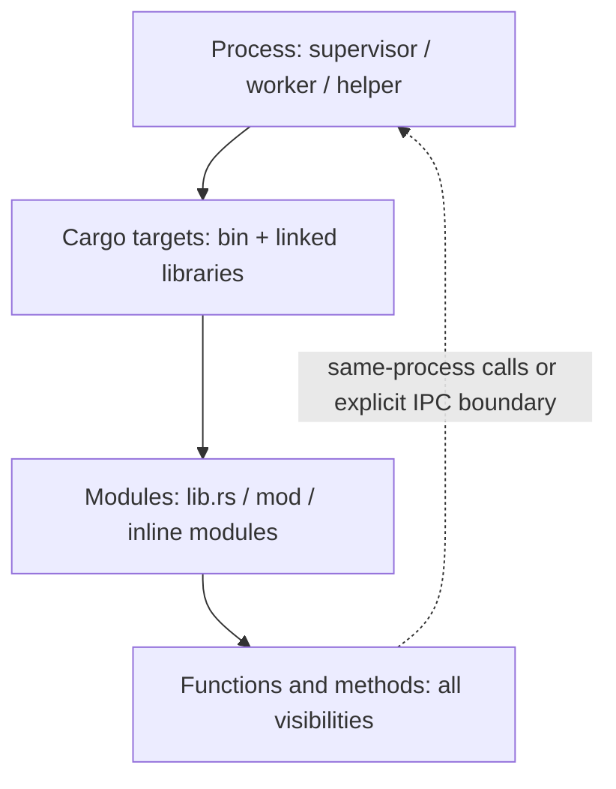

# Code architecture: process → crate → module → function

[System overview](../README.md) · [Understand threads first](../concepts/thread.md) · [Choose a crate](crates.md)

Project-level explanations cover cross-crate processes, dependencies and scenarios. Each crate's guide and generated call graphs live in
`crates/<name>/docs/`, accessible through the [Crate map](crates.md).

This is an entry point into the current TekesKernel source. Understand process and data boundaries first, then descend through
crates, modules and functions. It describes the implementation; `spec/` remains the source of normative contracts.

Start with the [domain model](../concepts/thread.md) and [behavioral flow](../flows/turn.md), then use this page to find the implementation.
The [documentation home](../README.md) owns the complete reading order; see the [alignment record](../verification/thread-alignment.md) for A's rule-by-rule code review.

## Baseline and evidence

- Initial documentation date: 2026-09-04.
- Initial HEAD: `3b20c5e6a5daedfa1dae8edd5d483951b0cdc8ed`; the index included uncommitted worktree source,
  especially model output, MCP and validation settlement changes. HEAD alone does not identify the complete snapshot.
- Exact input fingerprints, file lists and call sites are in the [generated index](generated/index.md)
  and the local `generated/inventory.json` (written by `scripts/code-architecture.py`, not tracked in Git). After a refresh, use the regenerated fingerprint.
- "Source-confirmed" in a diagram means static implementation evidence, not a real-model, installation, restart or UI acceptance run for this task.
- Indexing executed no Rust program or test and changed no model, protocol or runtime implementation.

## Four architectural layers

| Layer | Question it answers | Navigation |
|---|---|---|
| Process | Who launches and manages whom? How do processes communicate? | [Processes and IPC](processes.md) |
| Crate / target | Which compilation units make up the program, and what do they depend on? | [Crate descriptions and process mapping](crates.md) |
| Module | How does each crate divide responsibilities and expose interfaces? | Each crate guide and its generated source pages |
| Function | Which function calls which, and which targets remain uncertain? | [Complete symbol and call-site index](generated/index.md) |

One process combines multiple library crates, and one library can serve multiple programs. A Cargo package is the manifest's management boundary;
`lib.rs` and `main.rs` in the same package are different compilation targets. Package summaries in diagrams are not runtime call stacks.

Static diagrams show dependencies or possible calls. Sequence diagrams show order, waiting, loops and failure paths for a specific scenario.
`pub` and `pub(crate)` define visibility, not evidence of a call; private functions also participate in call graphs.

## Where to start

1. [Process view](processes.md): distinguish supervisor, worker, helper and external MCP processes.
2. [schema](../../crates/schema/docs/README.md) → [store](../../crates/store/docs/README.md): understand events, state folding and persistence.
3. [engine](../../crates/engine/docs/README.md) → [worker](../../crates/worker/docs/README.md): understand rules and the actual execution loop.
4. [supervisor](../../crates/supervisor/docs/README.md) → [endpoint](../../crates/endpoint/docs/README.md)
   → [transport](../../crates/transport/docs/README.md): follow the complete request and output path.
5. Open each page's generated atlas for all modules, declarations, call sites and private function relationships.

## Key scenarios

| Scenario | Boundaries made explicit |
|---|---|
| [Service startup after installation](flows/startup.md) (retired) | launchd, selector, supervisor, listeners and background tasks |
| [Input through one execution turn](flows/turn-execution.md) | transport → endpoint host → worker → provider → durable projection |
| [Tool invocation and approval](flows/tool-execution.md) | dispatcher, pipeline, helper / supervisor / MCP |
| [Crash and restart recovery](flows/recovery.md) | File locks, log tails, process reaping, recovery decisions and checkpoints |

## Current interface boundary

[Session Endpoint](../../spec/session-endpoint.md#routes-and-streams) is the current public protocol: 16 base unary operations and
one `/api/remote.mux` WebSocket route. `endpoint.jsonl` is the internal projection journal of the semantic
ledger; it implies no protocol negotiation. Old list/history, dual-WebSocket and `/api/respond` routes must not appear as current entry points.

The internal v1/v2 of `worker-control` belongs to a different protocol. Do not conflate the worker handshake version with the client Session Endpoint version.

## Independent services

Long-term memory is provided by a separate local MCP memory service, not by the
Kernel. The Kernel integrates such services through MCP tools and the
[lifecycle hook contract](../../spec/lifecycle-hook.md).

## Documentation ownership and maintenance

The [documentation index](../README.md) distinguishes design, implementation, acceptance and history; the [alignment record](../history/architecture-docs-alignment.md)
preserves the scope of the preceding navigation work. See the [migration map](../history/document-map.md) for the body reorganization.
Scripts maintain detailed source inventories. Each crate explains its responsibilities in its own docs and links to generated references.

For generation, checks, parsing limits and maintenance rules, see the [method](method.md).
Coverage, diagram and link checks from the initial task are in the [verification record](../verification/source-atlas.md).

- [Retired built-in Kernel memory](../history/retired-kernel-memory.md): removal of `note`/`recall` and automatic memorizing; old data and configuration stay compatible.
