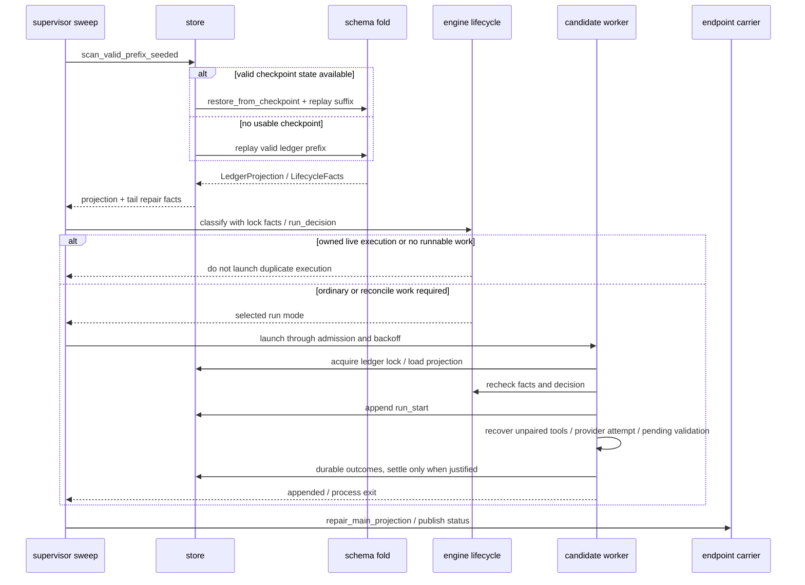

# Recovery and replay

[Architecture entry point](../README.md) · [store](../../../crates/store/docs/README.md) · [engine](../../../crates/engine/docs/README.md)

Recovery inspects durable state and locks before choosing an action. Losing an in-memory running flag does not justify writing completed.

A candidate worker must still acquire the lock and re-evaluate state; the supervisor's scan does not replace the writer's final check.
Corrupt complete events and partial tail records require different treatment; not every validation failure is a truncatable tail.
Recovery may only reconcile or may continue ordinary execution; resume policy, stops, approvals, pending input and validation obligations all affect the decision.

For process reaping, see `reconcile_after_exit`.
A checkpoint accelerates log folding.

## Source evidence

[daemon storage preflight](../../../crates/supervisor/src/daemon.rs) ·
[sweep and exit recovery](../../../crates/supervisor/src/process_host.rs) ·
[tail scan](../../../crates/store/src/tail.rs) ·
[fold](../../../crates/schema/src/fold.rs) ·
[lifecycle](../../../crates/engine/src/lifecycle.rs) ·
[provider recovery](../../../crates/engine/src/provider.rs) ·
[worker](../../../crates/worker/src/main.rs) ·
[tail contract](../../../spec/tail-lifecycle.md)
