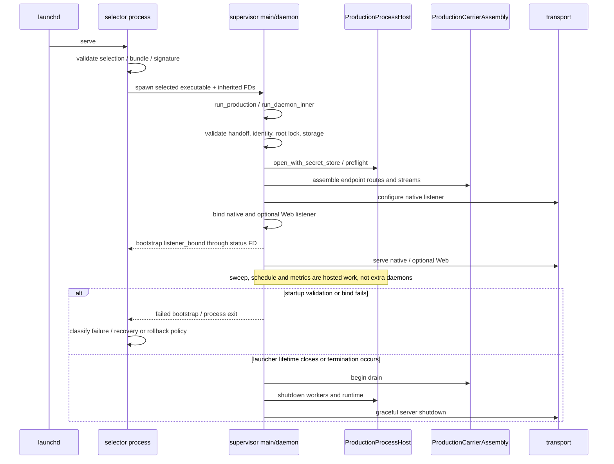

# Installed service startup

[Architecture entry point](../README.md) · [Process diagram](../processes.md)

> **Retired (2026-10-06).** The Kernel is launched only by its host application; see
> [Application-owned launch](../../builtin-launch.md). The launchd service, product
> installer and selector described here are no longer maintained, and their
> Keychain credential model no longer matches the code: the endpoint token and
> provider secrets come from the host's environment
> ([secret-store](../../../spec/secret-store.md)). The code remains until it is removed
> ([#28](https://github.com/TekesApps/TekesKernel/issues/28)); this document is kept for reference.

Scenario: an installed macOS LaunchAgent starts the service. The installation transaction itself is covered by the deployment spec.
Selector and supervisor are processes; process host, endpoint and transport are objects/libraries inside the supervisor.

Bootstrap listener binding is a specific milestone, not proof that a user request or provider turn succeeded.
The selector's failure policy depends on error category, deployment state and retry history; rollback in the diagram does not occur after every failure.

## Source evidence

- [Selector main](../../../crates/selector/src/main.rs): environment cleanup and command dispatch.
- [Selector implementation](../../../crates/selector/src/selector.rs): `spawn`, bootstrap status and lifetime management.
- [supervisor main](../../../crates/supervisor/src/main.rs): `--install-root` → `run_production`.
- [Daemon](../../../crates/supervisor/src/daemon.rs): `run_daemon_inner` wiring, listeners, Tokio tasks and draining.
- [carrier assembly](../../../crates/supervisor/src/endpoint_carrier.rs): `ProductionCarrierAssembly::assemble`.
- [Deployment contract](../../../spec/deployment.md): signature/restart acceptance belongs to separate release gates.
