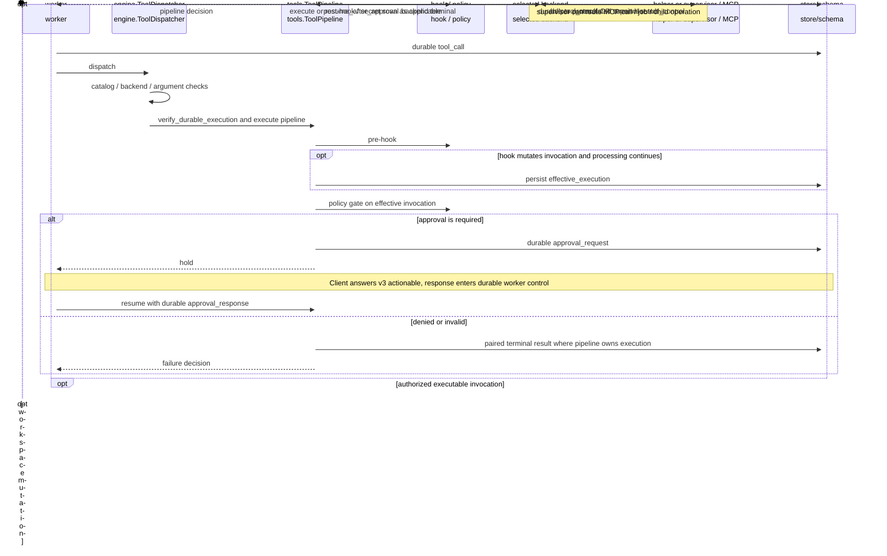

# Tool execution, approval, and routing

[Architecture entry point](../README.md) · [engine](../../../crates/engine/docs/README.md) · [tools](../../../crates/tools/docs/README.md)

Fixed tools enter through `dispatch_with_pre_mutation`. Dynamic tools have a separate dispatcher but also require explicit execution bindings;
a tool name must not be treated as an arbitrary executable command.

In the diagram, `opt authorized` excludes the earlier rejection path; it does not imply execution after rejection. See the pipeline for exact hook, rejection and recovery branches.
Some system/Web backends run inside the worker without a helper; helper and supervisor are also different targets.

## IPC variants

| Backend | Crossing | Evidence |
|---|---|---|
| helper | worker → tekes-helper → optional command | [helper](../../../crates/tools/src/helper.rs) |
| supervisor control | worker stdio tool_control → host handler → correlated result | [worker exchange](../../../crates/worker/src/main.rs), [production handler](../../../crates/supervisor/src/production_tool_control.rs) |
| MCP | supervisor runtime → pooled client → stdio/HTTP server | [runtime](../../../crates/supervisor/src/mcp_runtime.rs), [MCP transport](../../../crates/mcp/src/transport.rs) |
| job | supervisor JobBroker → tekes-helper --job-runner → command | [runtime backends](../../../crates/tools/src/runtime_backends.rs) |

## Source evidence

[dispatcher](../../../crates/engine/src/dispatcher.rs) ·
[dynamic dispatcher](../../../crates/engine/src/dynamic_catalog.rs) ·
[pipeline](../../../crates/tools/src/pipeline.rs) ·
[worker tool batch](../../../crates/worker/src/tool_calls.rs) ·
[tool contract](../../../spec/tool-runtime.md)
