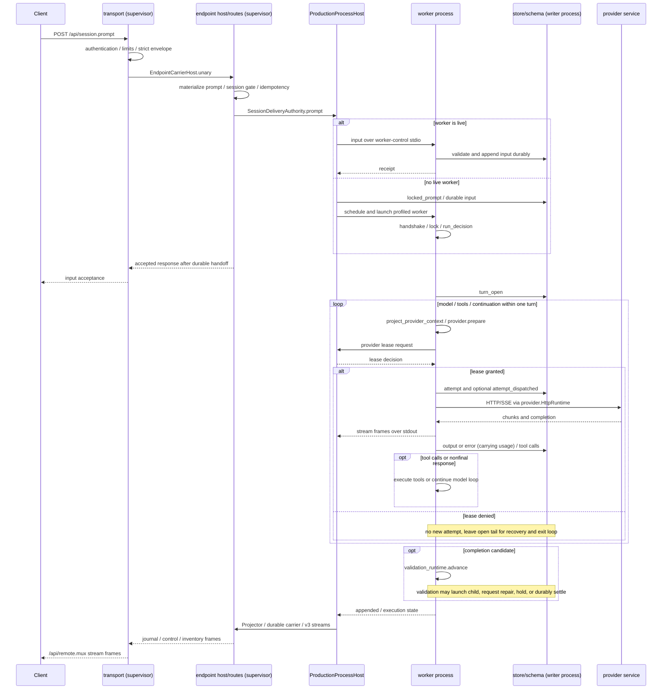

# Prompt to execution and client output

[Architecture entry point](../README.md) · [worker](../../../crates/worker/docs/README.md)

This is the ordinary input path in the worktree. Approval, stop, model failure, validation and recovery have their own branches;
a prompt receipt confirms only input acceptance, not completion of model output.

Request preparation and lease admission precede attempt persistence; see the worker functions and provider-runtime spec for exact commit order.
Stream forwarding and durable journal updates can interleave; the sequence diagram does not combine streamed output and durable results into one fact.
V3 `journal-transient` does not advance the durable journal cursor; final authoritative events or a reconnect snapshot replace transient presentation.

## Concrete call chains

- `transport::unary_inner` → `EndpointCarrierHost::unary` → supervisor endpoint dispatch/routes.
  Production trait bindings come from the daemon's carrier wiring, not from matching method names alone.
- `ProductionProcessHost::prompt` writes stdio and waits for a receipt when the worker is live; otherwise it uses `locked_prompt`.
- `worker::run` → `run_provider_turn` → `run_provider_turn_inner`.
- `run_provider_turn_inner` → `project_provider_context` / `provider::prepare` / `HttpRuntime`，
  Completion then selects `append_terminal`, error, tool or continuation branches.
- In the worktree, root final answers enter `validation_runtime::advance`, which writes the durable completed settlement and exact final-output reference. Existing validation candidates continue their earlier review flow on recovery.

## Source evidence

[transport](../../../crates/transport/src/server.rs) ·
[endpoint routes](../../../crates/supervisor/src/endpoint_host.rs) ·
[process host](../../../crates/supervisor/src/process_host.rs) ·
[worker](../../../crates/worker/src/main.rs) ·
[validation](../../../crates/worker/src/validation_runtime.rs) ·
[projection](../../../crates/endpoint/src/projection.rs) ·
[v3 protocol](../../../spec/session-endpoint.md#routes-and-streams)

Runtime evidence for the validation migration belongs to the [separate audit record](../../verification/audits/validation-migration.md); this diagram does not upgrade its acceptance status.
