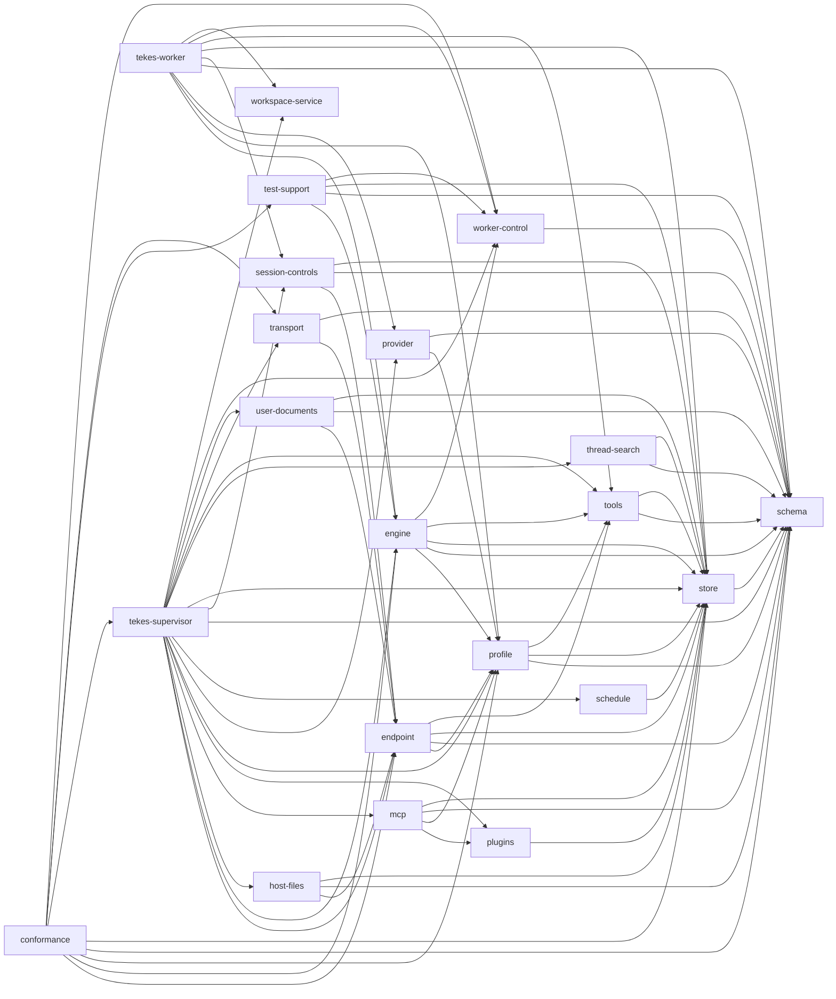
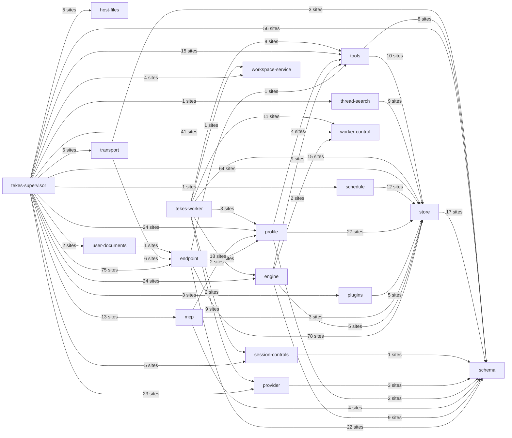

# Generated source atlas

Generated by `scripts/code-architecture.py`; do not edit by hand.

[Architecture guide](../README.md) · [Method and limitations](../method.md)

Source digest: `0620535b41b6ead9a9867f693e948abf620713b7bed04b7eb6e4fbaad84917de`.

Declared visibility is not effective export reachability. Tests/cfg branches are indexed, not executed.
Calls are syntactic sites; unresolved receiver dispatch, constructors, callbacks and macro expansion are not fabricated as direct edges.

| Packages | Rust files | Symbols | Call sites | Syntactically resolved | Macro sites |
|---:|---:|---:|---:|---:|---:|
| 21 | 258 | 6465 | 76700 | 10377 | 10972 |

The complete inventory includes test/example/build sources, every parsed function and every call expression outside unexpanded macros. No caller found means no indexed direct caller, not dead code.

| Package | Library / binary / test targets | Source atlas |
|---|---|---|
| `conformance` | 9 targets | [conformance](../../../crates/conformance/docs/generated/index.md) |
| `endpoint` | 8 targets | [endpoint](../../../crates/endpoint/docs/generated/index.md) |
| `engine` | 7 targets | [engine](../../../crates/engine/docs/generated/index.md) |
| `host-files` | 1 targets | [host-files](../../../crates/host-files/docs/generated/index.md) |
| `mcp` | 7 targets | [mcp](../../../crates/mcp/docs/generated/index.md) |
| `plugins` | 2 targets | [plugins](../../../crates/plugins/docs/generated/index.md) |
| `profile` | 4 targets | [profile](../../../crates/profile/docs/generated/index.md) |
| `provider` | 18 targets | [provider](../../../crates/provider/docs/generated/index.md) |
| `schedule` | 2 targets | [schedule](../../../crates/schedule/docs/generated/index.md) |
| `schema` | 9 targets | [schema](../../../crates/schema/docs/generated/index.md) |
| `session-controls` | 1 targets | [session-controls](../../../crates/session-controls/docs/generated/index.md) |
| `store` | 1 targets | [store](../../../crates/store/docs/generated/index.md) |
| `tekes-supervisor` | 13 targets | [supervisor](../../../crates/supervisor/docs/generated/index.md) |
| `tekes-worker` | 2 targets | [worker](../../../crates/worker/docs/generated/index.md) |
| `test-support` | 1 targets | [test-support](../../../crates/test-support/docs/generated/index.md) |
| `thread-search` | 2 targets | [thread-search](../../../crates/thread-search/docs/generated/index.md) |
| `tools` | 8 targets | [tools](../../../crates/tools/docs/generated/index.md) |
| `transport` | 2 targets | [transport](../../../crates/transport/docs/generated/index.md) |
| `user-documents` | 2 targets | [user-documents](../../../crates/user-documents/docs/generated/index.md) |
| `worker-control` | 3 targets | [worker-control](../../../crates/worker-control/docs/generated/index.md) |
| `workspace-service` | 7 targets | [workspace-service](../../../crates/workspace-service/docs/generated/index.md) |

## Normal workspace dependencies

Arrows mean Cargo dependency, not runtime calls. Per-package tables distinguish dev/build dependencies.

## Cross-package direct calls

Only resolved non-test call sites. This is distinct from the Cargo dependency graph.

Running `python3 scripts/code-architecture.py` also writes the machine-readable inventory `docs/architecture/generated/inventory.json` (not tracked in Git; regenerate it locally when needed). It includes call expressions, resolution status, symbol IDs, source lines, imports, module declarations, cfg annotations and per-file SHA-256 fingerprints.
