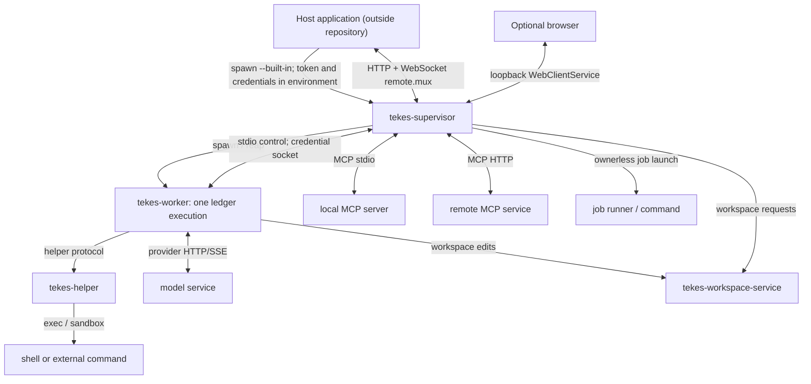

# Process view

[Architecture entry point](README.md) · [Crate mapping](crates.md)

The following process path is confirmed from source. It does not use the current machine's process list or a real startup run as evidence.
The host application starts the supervisor directly ([Application-owned launch](../builtin-launch.md)).
MCP, shell, helper and worker processes appear on demand; the diagram does not imply that all are resident.

## Ownership and evidence

| Process | Owner / entry | Important boundary |
|---|---|---|
| supervisor | [main](../../crates/supervisor/src/main.rs), [builtin](../../crates/supervisor/src/builtin.rs), [host_runtime](../../crates/supervisor/src/host_runtime.rs) | `--built-in` is the application-owned launch; `--models-available` and `--describe-build` print descriptions; there is no stdin control shell |
| worker | [launch boundary](../../crates/supervisor/src/lib.rs), [process_host](../../crates/supervisor/src/process_host.rs), [worker main](../../crates/worker/src/main.rs) | Launch snapshot and credential FDs are separate from stdio control; the production handshake negotiates the one worker-control protocol version |
| helper / shell | [helper main](../../crates/tools/src/bin/tekes-helper.rs), [helper](../../crates/tools/src/helper.rs), [backends](../../crates/tools/src/runtime_backends.rs) | The helper is a process; shell/external commands may create further child processes |
| MCP | [supervisor MCP runtime](../../crates/supervisor/src/mcp_runtime.rs), [transport](../../crates/mcp/src/transport.rs) | The MCP client/pool runs in the host; local stdio servers are separate processes and HTTP servers are external |
| background job | [production tool control](../../crates/supervisor/src/production_tool_control.rs), [tool control](../../crates/supervisor/src/tool_control.rs) | Background jobs have independent lifetimes and durable records; they are not equivalent to Tokio tasks |
| workspace service | [binary](../../crates/workspace-service/src/main.rs), [library](../../crates/workspace-service/src/lib.rs) | Child process for workspace operations; the parent supplies a registry-resolved root |

## Tasks, threads, and durable state

`endpoint`, `transport` and `engine` are not additional resident processes. Tokio tasks, callbacks, threads and processes are identified separately;
for example, the launcher-lifetime watcher runs inside the supervisor, while the worker's control-reading thread runs inside the worker.
Do not infer scheduling from the number of participants in a sequence diagram.

Runtime status requires lock/process facts; semantic history lives in the thread ledger. After the worker writes events, the supervisor projects them into the client carrier.
`endpoint.jsonl` preserves public event identities but is neither model input nor a semantic replay source for the worker.
A ledger `settle` and process exit are separate facts; see [tail lifecycle](../../spec/tail-lifecycle.md) for the complete settled predicate.

For semantic parent-child topology, see [Turn flow](../flows/turn.md). The supervisor launches child workers, so a semantic parent
need not be the OS PPID. Do not reconstruct task relationships from the process tree.
