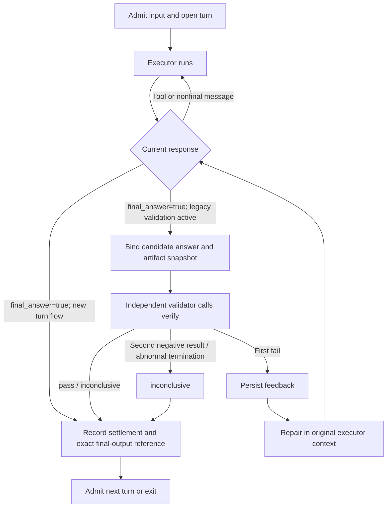

# A turn: execution, validation and delivery

[Behavioral flows · documentation home](../README.md) · [Read about threads first](../concepts/thread.md) · [Next: progress output and delivery](../interfaces/client.md)

## Turn execution and validation

This is the main log's default user-delivery flow. The model can run checks with
ordinary tools before its final answer; a final answer ends the turn.
Exact rules are defined by [provider runtime](../../spec/provider-runtime.md) and
the [settle event](../../spec/event.md#settle-barrier-exactly-one-per-turn).



- A new root final settles directly. It does not start an independent validator.
- An existing turn with a durable validation candidate finishes its prior validation flow after recovery.
- A validator's `verify` verdict is `pass | fail | inconclusive`.
  Valid verify completes the validator's own work; only after admitting it does the root worker decide whether to repair or settle the root turn.
- `fail` allows one repair in the original executor context without creating a new user turn. A second negative result,
  or validator death without a valid result, must not be presented as pass. User stop follows the interrupted branch.
- A candidate binding includes thread, turn, worker, output seq and a frozen artifact set. Even if files are unchanged,
  a new answer is a new candidate and an old verdict cannot authorize it automatically. Crash recovery reuses committed decisions with exact bindings.
- `completed` and successful validation are separate: `completed + inconclusive` is a valid final state.
  Approval waits may be parked without settle; for complete handling of interruption, budget exhaustion, errors and crashes, see
  [Worker lifecycle](../runtime/worker.md#signals-and-exit) and [tail lifecycle](../../spec/tail-lifecycle.md).
- `sink`, candidate and settlement are semantic categories, not three physical channels.
  Candidate messages may reach the Client earlier, but final delivery must be confirmed by the settlement reference; see [Context projection](../interfaces/client.md#ui-projection).

Ordinary delegated child logs and validation child logs run through the same worker program. Ordinary child completion returns a result to the parent
without independently restarting the root user-delivery validation loop; only root settlement ends the root turn.
For implementation and verification mappings, see [thread alignment](../verification/thread-alignment.md).

## Root executor and independent validator

The root worker itself is the executor in the default flow above. Existing
independent-validation turns retain bounded repair in the original context
and writer-owned settlement. Additional user-requested delegation
can still create its own task tree; logical parentage is independent of OS PPID.

## The loop

The sketch below names the logical phases. In the current worktree, the actual
entry is `run_provider_turn_inner`: a tool-free response may still be nonfinal,
and a final answer passes through `validation_runtime::advance` for direct
settlement. An existing validation candidate can hold, launch a child, or resume repair.
See [the current execution sequence](../architecture/flows/turn-execution.md) and
[the existing migration evidence](../verification/audits/validation-migration.md); source presence
does not establish live validation acceptance.

```
loop:
  drain stdin control messages          # yield point
  render(prefix) → provider call → stream
    frames → stdout mirror only         # never to disk
    on a call's arguments-complete frame (eager dispatch):
        append tool_call (fsync if side-effectful)   # write-ahead intent
        → execute → append tool_result → doorbell    # while the response streams
        a park/stop suspends further eager execution; the stream continues
    on stream end → validate the terminal against the eager calls
                    (same id, name, materialized args; none omitted;
                     any other durable id is a reuse) → append the
                    not-yet-durable calls, then the terminal output/error
                    carrying the attempt's usage; ONE barrier commits it; only
                    then attempt_settled (R4-1 — error outcomes identically)
  if tool_calls:
      for each call without a result (never an eager one):
                append tool_call (fsync if side-effectful)
                → execute (spawn / in-process / daemon socket)
                → append tool_result
      continue                          # one continuation after the whole batch
  if response is nonfinal: continue
  settle the final output with its exact output reference
  if legacy validation already active: resume its hold, validator or repair route
  require durable settle                # exactly one final settle for this turn
  drain stdin control messages         # persist late deliveries before exit
  exit 0                               # release this run's line lock

supervisor ensure / sweep:
  if runnable queued input:
      launch a new worker run
      append turn_open {inputs}         # under its lock; prefix-complete
      execute the next turn
```

The queue record was appended at delivery. A queued non-steer input never
extends the current turn: the current settle is durable first, then the next
`turn_open` consumes the queue. The current worker entry point opens/resumes one
turn and exits after settlement; the supervisor starts another run for the next
runnable input. Repair and tool continuations stay within the open turn. The
protocol permits multiple turns in a run, but that is not the current scheduling
path. A line can never have two open turns or skip a turn's settle (R15-8/R16;
event constraints 1 and 8).

The tail-lifecycle action vocabulary (`EnsureAction`, `RunDecision`,
`DeliveryAction`; spec/tail-lifecycle) reduces to this switch. The decision
function ("what next": tools? settled? budget? queued input? validation?) is
ordinary code.

**Yield points** — the only places external control enters: before a provider
call, between tool executions, at stream-chunk boundaries (stop only). A steer
is an `input` event appended mid-turn and consumed at the next yield **within
the current turn** (D-38); non-steer input waits for the turn boundary. Events
append in arrival order — rendering gates may withhold, never reorder. There
is no preemption mid-append.

## Provider admission wait (rate limit)

A recoverable provider failure classified `rate_limit` (HTTP 429, or the
Cloudflare AI Gateway wholesale limit, HTTP 402 with "Wholesale rate limit
exceeded" in the body) closes the attempt with a recoverable `error`, which
the public journal surfaces as a recoverable `response/error`. Before the
retry the worker appends `state{subkind: provider_admission}` carrying
`next_attempt_at` (the provider's `Retry-After` when declared, otherwise a
doubling backoff from one second, clamped to thirty seconds) and sleeps until
that instant, cutting the wait short on stop or supervisor loss. The retry is
an ordinary re-dispatch of the same open turn under the per-turn retry budget
(three). If the worker is killed during the wait, the supervisor's sweep sees
`recovery_needed` with `admission_wait_until` in the future, spawns nothing
before the instant, and then starts an ordinary run that re-dispatches the
same turn — no unsolicited resume policy is involved. Scripted proof:
`scripts/run-public-flow.py --case write --wholesale` (two 402 responses after
the write result, worker killed during the first wait; the original turn
finishes with the validator and exact written bytes).

## Manual compaction between turns

The named `compact` command (command-catalog reserved verb) reaches the
line as a manual compaction request keyed by its origin. Idle line: the
supervisor checkpoints and appends the origin-keyed `compact` under the line
lock; live worker: worker-control `compact` is applied at the next yield. The
next attempt binds an epoch with `reason: "compaction"`, renders the compacted
prefix (summary in place of the covered history, semantic anchors retained),
and `engine::first_post_compact_attempt` names the first attempt of that
generation admitting the inputs submitted after the request. Both authors run
the model summary request first ([Model context](../data/context.md)
§Compaction); auto-compaction
also fires before a send whose prepared candidate exceeds
`compact_trigger_tokens` ([Worker](../runtime/worker.md) §Budgets, retry, compaction). Live proof:
`scripts/run-public-flow.py --live --case text --skill-compact` (skill chain
before and after, exact markers, the gate over the real ledger, and the first
post-compact provider request free of the pre-compact tool call ids).

## Unusable tool arguments

When the model's tool-call arguments are not usable JSON (SWE-bench exposed
gpt-5.6-luna repeating a key), the provider adapter keeps the call and hands
the worker the invalid-arguments sentinel instead of failing the response
(provider-adapter rule 7). The worker refuses the call before dispatch with a
durable `tool_result` error naming the parse problem, the turn continues, and
the model may resend the call. Before this rule the response settled
`provider_terminal` and the turn was lost.
